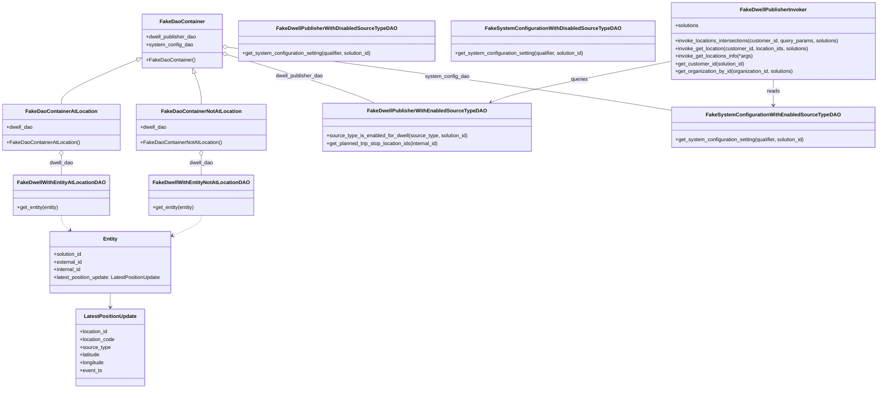

# Diagram: entity_core/entity_service/entity_service_tests/dwell/unit/location_based_dwell_tests/test_data.py


> Auto-generated by Obscura crawlers

## Diagram 1



### SVG

<svg id="container" width="2730.92578125" xmlns="http://www.w3.org/2000/svg" class="classDiagram" height="1212" viewBox="0 0 2730.92578125 1212" role="graphics-document document" aria-roledescription="class"><style>#container{font-family:"trebuchet ms",verdana,arial,sans-serif;font-size:16px;fill:#333;}@keyframes edge-animation-frame{from{stroke-dashoffset:0;}}@keyframes dash{to{stroke-dashoffset:0;}}#container .edge-animation-slow{stroke-dasharray:9,5!important;stroke-dashoffset:900;animation:dash 50s linear infinite;stroke-linecap:round;}#container .edge-animation-fast{stroke-dasharray:9,5!important;stroke-dashoffset:900;animation:dash 20s linear infinite;stroke-linecap:round;}#container .error-icon{fill:#552222;}#container .error-text{fill:#552222;stroke:#552222;}#container .edge-thickness-normal{stroke-width:1px;}#container .edge-thickness-thick{stroke-width:3.5px;}#container .edge-pattern-solid{stroke-dasharray:0;}#container .edge-thickness-invisible{stroke-width:0;fill:none;}#container .edge-pattern-dashed{stroke-dasharray:3;}#container .edge-pattern-dotted{stroke-dasharray:2;}#container .marker{fill:#333333;stroke:#333333;}#container .marker.cross{stroke:#333333;}#container svg{font-family:"trebuchet ms",verdana,arial,sans-serif;font-size:16px;}#container p{margin:0;}#container g.classGroup text{fill:#9370DB;stroke:none;font-family:"trebuchet ms",verdana,arial,sans-serif;font-size:10px;}#container g.classGroup text .title{font-weight:bolder;}#container .nodeLabel,#container .edgeLabel{color:#131300;}#container .edgeLabel .label rect{fill:#ECECFF;}#container .label text{fill:#131300;}#container .labelBkg{background:#ECECFF;}#container .edgeLabel .label span{background:#ECECFF;}#container .classTitle{font-weight:bolder;}#container .node rect,#container .node circle,#container .node ellipse,#container .node polygon,#container .node path{fill:#ECECFF;stroke:#9370DB;stroke-width:1px;}#container .divider{stroke:#9370DB;stroke-width:1;}#container g.clickable{cursor:pointer;}#container g.classGroup rect{fill:#ECECFF;stroke:#9370DB;}#container g.classGroup line{stroke:#9370DB;stroke-width:1;}#container .classLabel .box{stroke:none;stroke-width:0;fill:#ECECFF;opacity:0.5;}#container .classLabel .label{fill:#9370DB;font-size:10px;}#container .relation{stroke:#333333;stroke-width:1;fill:none;}#container .dashed-line{stroke-dasharray:3;}#container .dotted-line{stroke-dasharray:1 2;}#container #compositionStart,#container .composition{fill:#333333!important;stroke:#333333!important;stroke-width:1;}#container #compositionEnd,#container .composition{fill:#333333!important;stroke:#333333!important;stroke-width:1;}#container #dependencyStart,#container .dependency{fill:#333333!important;stroke:#333333!important;stroke-width:1;}#container #dependencyStart,#container .dependency{fill:#333333!important;stroke:#333333!important;stroke-width:1;}#container #extensionStart,#container .extension{fill:transparent!important;stroke:#333333!important;stroke-width:1;}#container #extensionEnd,#container .extension{fill:transparent!important;stroke:#333333!important;stroke-width:1;}#container #aggregationStart,#container .aggregation{fill:transparent!important;stroke:#333333!important;stroke-width:1;}#container #aggregationEnd,#container .aggregation{fill:transparent!important;stroke:#333333!important;stroke-width:1;}#container #lollipopStart,#container .lollipop{fill:#ECECFF!important;stroke:#333333!important;stroke-width:1;}#container #lollipopEnd,#container .lollipop{fill:#ECECFF!important;stroke:#333333!important;stroke-width:1;}#container .edgeTerminals{font-size:11px;line-height:initial;}#container .classTitleText{text-anchor:middle;font-size:18px;fill:#333;}#container .label-icon{display:inline-block;height:1em;overflow:visible;vertical-align:-0.125em;}#container .node .label-icon path{fill:currentColor;stroke:revert;stroke-width:revert;}#container :root{--mermaid-font-family:"trebuchet ms",verdana,arial,sans-serif;}</style><g><defs><marker id="container_class-aggregationStart" class="marker aggregation class" refX="18" refY="7" markerWidth="190" markerHeight="240" orient="auto"><path d="M 18,7 L9,13 L1,7 L9,1 Z"></path></marker></defs><defs><marker id="container_class-aggregationEnd" class="marker aggregation class" refX="1" refY="7" markerWidth="20" markerHeight="28" orient="auto"><path d="M 18,7 L9,13 L1,7 L9,1 Z"></path></marker></defs><defs><marker id="container_class-extensionStart" class="marker extension class" refX="18" refY="7" markerWidth="190" markerHeight="240" orient="auto"><path d="M 1,7 L18,13 V 1 Z"></path></marker></defs><defs><marker id="container_class-extensionEnd" class="marker extension class" refX="1" refY="7" markerWidth="20" markerHeight="28" orient="auto"><path d="M 1,1 V 13 L18,7 Z"></path></marker></defs><defs><marker id="container_class-compositionStart" class="marker composition class" refX="18" refY="7" markerWidth="190" markerHeight="240" orient="auto"><path d="M 18,7 L9,13 L1,7 L9,1 Z"></path></marker></defs><defs><marker id="container_class-compositionEnd" class="marker composition class" refX="1" refY="7" markerWidth="20" markerHeight="28" orient="auto"><path d="M 18,7 L9,13 L1,7 L9,1 Z"></path></marker></defs><defs><marker id="container_class-dependencyStart" class="marker dependency class" refX="6" refY="7" markerWidth="190" markerHeight="240" orient="auto"><path d="M 5,7 L9,13 L1,7 L9,1 Z"></path></marker></defs><defs><marker id="container_class-dependencyEnd" class="marker dependency class" refX="13" refY="7" markerWidth="20" markerHeight="28" orient="auto"><path d="M 18,7 L9,13 L14,7 L9,1 Z"></path></marker></defs><defs><marker id="container_class-lollipopStart" class="marker lollipop class" refX="13" refY="7" markerWidth="190" markerHeight="240" orient="auto"><circle stroke="black" fill="transparent" cx="7" cy="7" r="6"></circle></marker></defs><defs><marker id="container_class-lollipopEnd" class="marker lollipop class" refX="1" refY="7" markerWidth="190" markerHeight="240" orient="auto"><circle stroke="black" fill="transparent" cx="7" cy="7" r="6"></circle></marker></defs><g class="root"><g class="clusters"></g><g class="edgePaths"><path d="M592.531,228.358L595.69,237.799C598.849,247.239,605.167,266.119,608.325,282.226C611.484,298.333,611.484,311.667,611.484,318.333L611.484,325" id="id_FakeDaoContainer_FakeDaoContainerNotAtLocation_1" class="edge-thickness-normal edge-pattern-solid relation" style=";;;" data-edge="true" data-et="edge" data-id="id_FakeDaoContainer_FakeDaoContainerNotAtLocation_1" data-points="W3sieCI6NTg3LjA1NzIwMDQzNzg5ODEsInkiOjIxMn0seyJ4Ijo2MTEuNDg0Mzc1LCJ5IjoyODV9LHsieCI6NjExLjQ4NDM3NSwieSI6MzI1fV0=" marker-start="url(#container_class-extensionStart)"></path><path d="M418.371,187.175L379.638,203.48C340.906,219.784,263.441,252.392,224.709,275.363C185.977,298.333,185.977,311.667,185.977,318.333L185.977,325" id="id_FakeDaoContainer_FakeDaoContainerAtLocation_2" class="edge-thickness-normal edge-pattern-solid relation" style=";;;" data-edge="true" data-et="edge" data-id="id_FakeDaoContainer_FakeDaoContainerAtLocation_2" data-points="W3sieCI6NDM0LjI2OTUzMTI1LCJ5IjoxODAuNDgyOTY1MTk3MjY0Mzh9LHsieCI6MTg1Ljk3NjU2MjUsInkiOjI4NX0seyJ4IjoxODUuOTc2NTYyNSwieSI6MzI1fV0=" marker-start="url(#container_class-extensionStart)"></path><path d="M700.151,170.366L763.829,189.471C827.507,208.577,954.863,246.789,1031.589,272.061C1108.314,297.333,1134.41,309.667,1147.458,315.833L1160.506,322" id="id_FakeDaoContainer_FakeDwellPublisherWithEnabledSourceTypeDAO_3" class="edge-thickness-normal edge-pattern-solid relation" style=";;;" data-edge="true" data-et="edge" data-id="id_FakeDaoContainer_FakeDwellPublisherWithEnabledSourceTypeDAO_3" data-points="W3sieCI6NjgzLjYyODkwNjI1LCJ5IjoxNjUuNDA4NDY2ODk2MDkzNTN9LHsieCI6MTA4Mi4yMTg3NSwieSI6Mjg1fSx7IngiOjExNjAuNTA1NjUwMTExNjA3LCJ5IjozMjJ9XQ==" marker-start="url(#container_class-aggregationStart)"></path><path d="M700.724,147.152L870.798,170.126C1040.873,193.101,1381.022,239.051,1611.948,272.033C1842.874,305.015,1964.576,325.029,2025.426,335.036L2086.277,345.044" id="id_FakeDaoContainer_FakeSystemConfigurationWithEnabledSourceTypeDAO_4" class="edge-thickness-normal edge-pattern-solid relation" style=";;;" data-edge="true" data-et="edge" data-id="id_FakeDaoContainer_FakeSystemConfigurationWithEnabledSourceTypeDAO_4" data-points="W3sieCI6NjgzLjYyODkwNjI1LCJ5IjoxNDQuODQyNDc5MjIwNTEyOTZ9LHsieCI6MTcyMS4xNzE4NzUsInkiOjI4NX0seyJ4IjoyMDg2LjI3NzM0Mzc1LCJ5IjozNDUuMDQzNjE0NjcyMDU4MjV9XQ==" marker-start="url(#container_class-aggregationStart)"></path><path d="M611.484,486.25L611.484,490.042C611.484,493.833,611.484,501.417,611.484,511.375C611.484,521.333,611.484,533.667,611.484,539.833L611.484,546" id="id_FakeDaoContainerNotAtLocation_FakeDwellWithEntityNotAtLocationDAO_5" class="edge-thickness-normal edge-pattern-solid relation" style=";;;" data-edge="true" data-et="edge" data-id="id_FakeDaoContainerNotAtLocation_FakeDwellWithEntityNotAtLocationDAO_5" data-points="W3sieCI6NjExLjQ4NDM3NSwieSI6NDY5fSx7IngiOjYxMS40ODQzNzUsInkiOjUwOX0seyJ4Ijo2MTEuNDg0Mzc1LCJ5Ijo1NDZ9XQ==" marker-start="url(#container_class-aggregationStart)"></path><path d="M185.977,486.25L185.977,490.042C185.977,493.833,185.977,501.417,185.977,511.375C185.977,521.333,185.977,533.667,185.977,539.833L185.977,546" id="id_FakeDaoContainerAtLocation_FakeDwellWithEntityAtLocationDAO_6" class="edge-thickness-normal edge-pattern-solid relation" style=";;;" data-edge="true" data-et="edge" data-id="id_FakeDaoContainerAtLocation_FakeDwellWithEntityAtLocationDAO_6" data-points="W3sieCI6MTg1Ljk3NjU2MjUsInkiOjQ2OX0seyJ4IjoxODUuOTc2NTYyNSwieSI6NTA5fSx7IngiOjE4NS45NzY1NjI1LCJ5Ijo1NDZ9XQ==" marker-start="url(#container_class-aggregationStart)"></path><path d="M2081.488,191.17L2002.09,206.808C1922.693,222.446,1763.897,253.723,1669.689,275.164C1575.48,296.604,1545.859,308.208,1531.048,314.01L1516.237,319.812" id="id_FakeDwellPublisherInvoker_FakeDwellPublisherWithEnabledSourceTypeDAO_7" class="edge-thickness-normal edge-pattern-solid relation" style=";;;" data-edge="true" data-et="edge" data-id="id_FakeDwellPublisherInvoker_FakeDwellPublisherWithEnabledSourceTypeDAO_7" data-points="W3sieCI6MjA4MS40ODgyODEyNSwieSI6MTkxLjE2OTYxMjcxMDA0OTUzfSx7IngiOjE2MDUuMTAxNTYyNSwieSI6Mjg1fSx7IngiOjE1MTAuNjUwMzkwNjI1LCJ5IjozMjJ9XQ==" marker-end="url(#container_class-dependencyEnd)"></path><path d="M2402.207,248L2402.207,254.167C2402.207,260.333,2402.207,272.667,2402.207,286C2402.207,299.333,2402.207,313.667,2402.207,320.833L2402.207,328" id="id_FakeDwellPublisherInvoker_FakeSystemConfigurationWithEnabledSourceTypeDAO_8" class="edge-thickness-normal edge-pattern-solid relation" style=";;;" data-edge="true" data-et="edge" data-id="id_FakeDwellPublisherInvoker_FakeSystemConfigurationWithEnabledSourceTypeDAO_8" data-points="W3sieCI6MjQwMi4yMDcwMzEyNSwieSI6MjQ4fSx7IngiOjI0MDIuMjA3MDMxMjUsInkiOjI4NX0seyJ4IjoyNDAyLjIwNzAzMTI1LCJ5IjozMzR9XQ==" marker-end="url(#container_class-dependencyEnd)"></path><path d="M185.977,672L185.977,676.167C185.977,680.333,185.977,688.667,190.301,696.367C194.625,704.068,203.274,711.136,207.598,714.669L211.923,718.203" id="id_FakeDwellWithEntityAtLocationDAO_Entity_9" class="edge-thickness-normal edge-pattern-dashed relation" style=";;;" data-edge="true" data-et="edge" data-id="id_FakeDwellWithEntityAtLocationDAO_Entity_9" data-points="W3sieCI6MTg1Ljk3NjU2MjUsInkiOjY3Mn0seyJ4IjoxODUuOTc2NTYyNSwieSI6Njk3fSx7IngiOjIxNi41Njg3OTUxOTYyODA5NywieSI6NzIyfV0=" marker-end="url(#container_class-dependencyEnd)"></path><path d="M611.484,672L611.484,676.167C611.484,680.333,611.484,688.667,598.283,698.591C585.082,708.515,558.679,720.03,545.478,725.787L532.277,731.545" id="id_FakeDwellWithEntityNotAtLocationDAO_Entity_10" class="edge-thickness-normal edge-pattern-dashed relation" style=";;;" data-edge="true" data-et="edge" data-id="id_FakeDwellWithEntityNotAtLocationDAO_Entity_10" data-points="W3sieCI6NjExLjQ4NDM3NSwieSI6NjcyfSx7IngiOjYxMS40ODQzNzUsInkiOjY5N30seyJ4Ijo1MjYuNzc3MzQzNzUsInkiOjczMy45NDMxMTg2MjAyMDQxfV0=" marker-end="url(#container_class-dependencyEnd)"></path><path d="M334.043,914L334.043,918.167C334.043,922.333,334.043,930.667,334.043,938C334.043,945.333,334.043,951.667,334.043,954.833L334.043,958" id="id_Entity_LatestPositionUpdate_11" class="edge-thickness-normal edge-pattern-solid relation" style=";;;" data-edge="true" data-et="edge" data-id="id_Entity_LatestPositionUpdate_11" data-points="W3sieCI6MzM0LjA0Mjk2ODc1LCJ5Ijo5MTR9LHsieCI6MzM0LjA0Mjk2ODc1LCJ5Ijo5Mzl9LHsieCI6MzM0LjA0Mjk2ODc1LCJ5Ijo5NjR9XQ==" marker-end="url(#container_class-dependencyEnd)"></path></g><g class="edgeLabels"><g class="edgeLabel"><g class="label" data-id="id_FakeDaoContainer_FakeDaoContainerNotAtLocation_1" transform="translate(0, 0)"><foreignObject width="0" height="0"><div xmlns="http://www.w3.org/1999/xhtml" class="labelBkg" style="display: table-cell; white-space: nowrap; line-height: 1.5; max-width: 200px; text-align: center;"><span class="edgeLabel"></span></div></foreignObject></g></g><g class="edgeLabel"><g class="label" data-id="id_FakeDaoContainer_FakeDaoContainerAtLocation_2" transform="translate(0, 0)"><foreignObject width="0" height="0"><div xmlns="http://www.w3.org/1999/xhtml" class="labelBkg" style="display: table-cell; white-space: nowrap; line-height: 1.5; max-width: 200px; text-align: center;"><span class="edgeLabel"></span></div></foreignObject></g></g><g class="edgeLabel" transform="translate(924.39253, 237.64636)"><g class="label" data-id="id_FakeDaoContainer_FakeDwellPublisherWithEnabledSourceTypeDAO_3" transform="translate(-75.53125, -12)"><foreignObject width="151.0625" height="24"><div xmlns="http://www.w3.org/1999/xhtml" class="labelBkg" style="display: table-cell; white-space: nowrap; line-height: 1.5; max-width: 200px; text-align: center;"><span class="edgeLabel"><p>dwell_publisher_dao</p></span></div></foreignObject></g></g><g class="edgeLabel" transform="translate(1385.74003, 239.68786)"><g class="label" data-id="id_FakeDaoContainer_FakeSystemConfigurationWithEnabledSourceTypeDAO_4" transform="translate(-68.828125, -12)"><foreignObject width="137.65625" height="24"><div xmlns="http://www.w3.org/1999/xhtml" class="labelBkg" style="display: table-cell; white-space: nowrap; line-height: 1.5; max-width: 200px; text-align: center;"><span class="edgeLabel"><p>system_config_dao</p></span></div></foreignObject></g></g><g class="edgeLabel" transform="translate(611.484375, 509)"><g class="label" data-id="id_FakeDaoContainerNotAtLocation_FakeDwellWithEntityNotAtLocationDAO_5" transform="translate(-37.3828125, -12)"><foreignObject width="74.765625" height="24"><div xmlns="http://www.w3.org/1999/xhtml" class="labelBkg" style="display: table-cell; white-space: nowrap; line-height: 1.5; max-width: 200px; text-align: center;"><span class="edgeLabel"><p>dwell_dao</p></span></div></foreignObject></g></g><g class="edgeLabel" transform="translate(185.9765625, 509)"><g class="label" data-id="id_FakeDaoContainerAtLocation_FakeDwellWithEntityAtLocationDAO_6" transform="translate(-37.3828125, -12)"><foreignObject width="74.765625" height="24"><div xmlns="http://www.w3.org/1999/xhtml" class="labelBkg" style="display: table-cell; white-space: nowrap; line-height: 1.5; max-width: 200px; text-align: center;"><span class="edgeLabel"><p>dwell_dao</p></span></div></foreignObject></g></g><g class="edgeLabel" transform="translate(1793.53114, 247.88641)"><g class="label" data-id="id_FakeDwellPublisherInvoker_FakeDwellPublisherWithEnabledSourceTypeDAO_7" transform="translate(-27.2421875, -12)"><foreignObject width="54.484375" height="24"><div xmlns="http://www.w3.org/1999/xhtml" class="labelBkg" style="display: table-cell; white-space: nowrap; line-height: 1.5; max-width: 200px; text-align: center;"><span class="edgeLabel"><p>queries</p></span></div></foreignObject></g></g><g class="edgeLabel" transform="translate(2402.20703125, 285)"><g class="label" data-id="id_FakeDwellPublisherInvoker_FakeSystemConfigurationWithEnabledSourceTypeDAO_8" transform="translate(-20.0078125, -12)"><foreignObject width="40.015625" height="24"><div xmlns="http://www.w3.org/1999/xhtml" class="labelBkg" style="display: table-cell; white-space: nowrap; line-height: 1.5; max-width: 200px; text-align: center;"><span class="edgeLabel"><p>reads</p></span></div></foreignObject></g></g><g class="edgeLabel"><g class="label" data-id="id_FakeDwellWithEntityAtLocationDAO_Entity_9" transform="translate(0, 0)"><foreignObject width="0" height="0"><div xmlns="http://www.w3.org/1999/xhtml" class="labelBkg" style="display: table-cell; white-space: nowrap; line-height: 1.5; max-width: 200px; text-align: center;"><span class="edgeLabel"></span></div></foreignObject></g></g><g class="edgeLabel"><g class="label" data-id="id_FakeDwellWithEntityNotAtLocationDAO_Entity_10" transform="translate(0, 0)"><foreignObject width="0" height="0"><div xmlns="http://www.w3.org/1999/xhtml" class="labelBkg" style="display: table-cell; white-space: nowrap; line-height: 1.5; max-width: 200px; text-align: center;"><span class="edgeLabel"></span></div></foreignObject></g></g><g class="edgeLabel"><g class="label" data-id="id_Entity_LatestPositionUpdate_11" transform="translate(0, 0)"><foreignObject width="0" height="0"><div xmlns="http://www.w3.org/1999/xhtml" class="labelBkg" style="display: table-cell; white-space: nowrap; line-height: 1.5; max-width: 200px; text-align: center;"><span class="edgeLabel"></span></div></foreignObject></g></g></g><g class="nodes"><g class="node default" id="classId-FakeDaoContainer-0" transform="translate(558.94921875, 128)"><g class="basic label-container"><path d="M-124.6796875 -84 L124.6796875 -84 L124.6796875 84 L-124.6796875 84" stroke="none" stroke-width="0" fill="#ECECFF" style=""></path><path d="M-124.6796875 -84 C-49.80173015014532 -84, 25.076227199709365 -84, 124.6796875 -84 M-124.6796875 -84 C-25.174807906724396 -84, 74.33007168655121 -84, 124.6796875 -84 M124.6796875 -84 C124.6796875 -46.13892864189731, 124.6796875 -8.277857283794617, 124.6796875 84 M124.6796875 -84 C124.6796875 -45.21285726244117, 124.6796875 -6.425714524882338, 124.6796875 84 M124.6796875 84 C34.32043447656929 84, -56.03881854686142 84, -124.6796875 84 M124.6796875 84 C32.85706752088147 84, -58.965552458237056 84, -124.6796875 84 M-124.6796875 84 C-124.6796875 34.67525532314282, -124.6796875 -14.649489353714358, -124.6796875 -84 M-124.6796875 84 C-124.6796875 24.87883056055729, -124.6796875 -34.24233887888542, -124.6796875 -84" stroke="#9370DB" stroke-width="1.3" fill="none" stroke-dasharray="0 0" style=""></path></g><g class="annotation-group text" transform="translate(0, -60)"></g><g class="label-group text" transform="translate(-66.3125, -60)"><g class="label" style="font-weight: bolder" transform="translate(0,-12)"><foreignObject width="132.625" height="24"><div xmlns="http://www.w3.org/1999/xhtml" style="display: table-cell; white-space: nowrap; line-height: 1.5; max-width: 182px; text-align: center;"><span class="nodeLabel markdown-node-label" style=""><p>FakeDaoContainer</p></span></div></foreignObject></g></g><g class="members-group text" transform="translate(-112.6796875, -12)"><g class="label" style="" transform="translate(0,-12)"><foreignObject width="159.046875" height="24"><div xmlns="http://www.w3.org/1999/xhtml" style="display: table-cell; white-space: nowrap; line-height: 1.5; max-width: 216px; text-align: center;"><span class="nodeLabel markdown-node-label" style=""><p>+dwell_publisher_dao</p></span></div></foreignObject></g><g class="label" style="" transform="translate(0,12)"><foreignObject width="145.640625" height="24"><div xmlns="http://www.w3.org/1999/xhtml" style="display: table-cell; white-space: nowrap; line-height: 1.5; max-width: 203px; text-align: center;"><span class="nodeLabel markdown-node-label" style=""><p>+system_config_dao</p></span></div></foreignObject></g></g><g class="methods-group text" transform="translate(-112.6796875, 60)"><g class="label" style="" transform="translate(0,-12)"><foreignObject width="149.4375" height="24"><div xmlns="http://www.w3.org/1999/xhtml" style="display: table-cell; white-space: nowrap; line-height: 1.5; max-width: 207px; text-align: center;"><span class="nodeLabel markdown-node-label" style=""><p>+FakeDaoContainer()</p></span></div></foreignObject></g></g><g class="divider" style=""><path d="M-124.6796875 -36 C-60.192572380094376 -36, 4.294542739811249 -36, 124.6796875 -36 M-124.6796875 -36 C-56.50471217939655 -36, 11.670263141206902 -36, 124.6796875 -36" stroke="#9370DB" stroke-width="1.3" fill="none" stroke-dasharray="0 0" style=""></path></g><g class="divider" style=""><path d="M-124.6796875 36 C-43.05692180275639 36, 38.565843894487216 36, 124.6796875 36 M-124.6796875 36 C-39.72890141809201 36, 45.221884663815985 36, 124.6796875 36" stroke="#9370DB" stroke-width="1.3" fill="none" stroke-dasharray="0 0" style=""></path></g></g><g class="node default" id="classId-FakeDaoContainerNotAtLocation-1" transform="translate(611.484375, 397)"><g class="basic label-container"><path d="M-197.53125 -72 L197.53125 -72 L197.53125 72 L-197.53125 72" stroke="none" stroke-width="0" fill="#ECECFF" style=""></path><path d="M-197.53125 -72 C-99.05219877096249 -72, -0.5731475419249819 -72, 197.53125 -72 M-197.53125 -72 C-92.37207663732576 -72, 12.787096725348476 -72, 197.53125 -72 M197.53125 -72 C197.53125 -17.844520302677168, 197.53125 36.310959394645664, 197.53125 72 M197.53125 -72 C197.53125 -27.401264382595343, 197.53125 17.197471234809314, 197.53125 72 M197.53125 72 C94.6274478875763 72, -8.27635422484741 72, -197.53125 72 M197.53125 72 C56.77525588170769 72, -83.98073823658461 72, -197.53125 72 M-197.53125 72 C-197.53125 22.282464167898198, -197.53125 -27.435071664203605, -197.53125 -72 M-197.53125 72 C-197.53125 33.40920168249809, -197.53125 -5.181596635003814, -197.53125 -72" stroke="#9370DB" stroke-width="1.3" fill="none" stroke-dasharray="0 0" style=""></path></g><g class="annotation-group text" transform="translate(0, -48)"></g><g class="label-group text" transform="translate(-118.53125, -48)"><g class="label" style="font-weight: bolder" transform="translate(0,-12)"><foreignObject width="237.0625" height="24"><div xmlns="http://www.w3.org/1999/xhtml" style="display: table-cell; white-space: nowrap; line-height: 1.5; max-width: 284px; text-align: center;"><span class="nodeLabel markdown-node-label" style=""><p>FakeDaoContainerNotAtLocation</p></span></div></foreignObject></g></g><g class="members-group text" transform="translate(-185.53125, 0)"><g class="label" style="" transform="translate(0,-12)"><foreignObject width="82.75" height="24"><div xmlns="http://www.w3.org/1999/xhtml" style="display: table-cell; white-space: nowrap; line-height: 1.5; max-width: 140px; text-align: center;"><span class="nodeLabel markdown-node-label" style=""><p>+dwell_dao</p></span></div></foreignObject></g></g><g class="methods-group text" transform="translate(-185.53125, 48)"><g class="label" style="" transform="translate(0,-12)"><foreignObject width="252.53125" height="24"><div xmlns="http://www.w3.org/1999/xhtml" style="display: table-cell; white-space: nowrap; line-height: 1.5; max-width: 310px; text-align: center;"><span class="nodeLabel markdown-node-label" style=""><p>+FakeDaoContainerNotAtLocation()</p></span></div></foreignObject></g></g><g class="divider" style=""><path d="M-197.53125 -24 C-84.98366468980863 -24, 27.56392062038273 -24, 197.53125 -24 M-197.53125 -24 C-50.12707465406734 -24, 97.27710069186531 -24, 197.53125 -24" stroke="#9370DB" stroke-width="1.3" fill="none" stroke-dasharray="0 0" style=""></path></g><g class="divider" style=""><path d="M-197.53125 24 C-55.65754740796325 24, 86.2161551840735 24, 197.53125 24 M-197.53125 24 C-58.52310649870677 24, 80.48503700258647 24, 197.53125 24" stroke="#9370DB" stroke-width="1.3" fill="none" stroke-dasharray="0 0" style=""></path></g></g><g class="node default" id="classId-FakeDaoContainerAtLocation-2" transform="translate(185.9765625, 397)"><g class="basic label-container"><path d="M-177.9765625 -72 L177.9765625 -72 L177.9765625 72 L-177.9765625 72" stroke="none" stroke-width="0" fill="#ECECFF" style=""></path><path d="M-177.9765625 -72 C-42.21804065435842 -72, 93.54048119128316 -72, 177.9765625 -72 M-177.9765625 -72 C-100.679039311732 -72, -23.381516123463996 -72, 177.9765625 -72 M177.9765625 -72 C177.9765625 -25.857460614484765, 177.9765625 20.28507877103047, 177.9765625 72 M177.9765625 -72 C177.9765625 -21.243295799078645, 177.9765625 29.51340840184271, 177.9765625 72 M177.9765625 72 C35.90080241366957 72, -106.17495767266087 72, -177.9765625 72 M177.9765625 72 C79.51156612790349 72, -18.953430244193015 72, -177.9765625 72 M-177.9765625 72 C-177.9765625 26.191001390023608, -177.9765625 -19.617997219952784, -177.9765625 -72 M-177.9765625 72 C-177.9765625 38.742142475470025, -177.9765625 5.484284950940051, -177.9765625 -72" stroke="#9370DB" stroke-width="1.3" fill="none" stroke-dasharray="0 0" style=""></path></g><g class="annotation-group text" transform="translate(0, -48)"></g><g class="label-group text" transform="translate(-105.46875, -48)"><g class="label" style="font-weight: bolder" transform="translate(0,-12)"><foreignObject width="210.9375" height="24"><div xmlns="http://www.w3.org/1999/xhtml" style="display: table-cell; white-space: nowrap; line-height: 1.5; max-width: 258px; text-align: center;"><span class="nodeLabel markdown-node-label" style=""><p>FakeDaoContainerAtLocation</p></span></div></foreignObject></g></g><g class="members-group text" transform="translate(-165.9765625, 0)"><g class="label" style="" transform="translate(0,-12)"><foreignObject width="82.75" height="24"><div xmlns="http://www.w3.org/1999/xhtml" style="display: table-cell; white-space: nowrap; line-height: 1.5; max-width: 140px; text-align: center;"><span class="nodeLabel markdown-node-label" style=""><p>+dwell_dao</p></span></div></foreignObject></g></g><g class="methods-group text" transform="translate(-165.9765625, 48)"><g class="label" style="" transform="translate(0,-12)"><foreignObject width="226.484375" height="24"><div xmlns="http://www.w3.org/1999/xhtml" style="display: table-cell; white-space: nowrap; line-height: 1.5; max-width: 284px; text-align: center;"><span class="nodeLabel markdown-node-label" style=""><p>+FakeDaoContainerAtLocation()</p></span></div></foreignObject></g></g><g class="divider" style=""><path d="M-177.9765625 -24 C-49.17543783417224 -24, 79.62568683165551 -24, 177.9765625 -24 M-177.9765625 -24 C-43.35548110339667 -24, 91.26560029320666 -24, 177.9765625 -24" stroke="#9370DB" stroke-width="1.3" fill="none" stroke-dasharray="0 0" style=""></path></g><g class="divider" style=""><path d="M-177.9765625 24 C-49.857461919560336 24, 78.26163866087933 24, 177.9765625 24 M-177.9765625 24 C-60.146355440510135 24, 57.68385161897973 24, 177.9765625 24" stroke="#9370DB" stroke-width="1.3" fill="none" stroke-dasharray="0 0" style=""></path></g></g><g class="node default" id="classId-FakeDwellPublisherWithEnabledSourceTypeDAO-3" transform="translate(1319.1953125, 397)"><g class="basic label-container"><path d="M-321.953125 -75 L321.953125 -75 L321.953125 75 L-321.953125 75" stroke="none" stroke-width="0" fill="#ECECFF" style=""></path><path d="M-321.953125 -75 C-115.1105373754678 -75, 91.7320502490644 -75, 321.953125 -75 M-321.953125 -75 C-79.11041238813272 -75, 163.73230022373457 -75, 321.953125 -75 M321.953125 -75 C321.953125 -37.99745324594961, 321.953125 -0.994906491899215, 321.953125 75 M321.953125 -75 C321.953125 -43.14056293440991, 321.953125 -11.281125868819814, 321.953125 75 M321.953125 75 C69.79085294709856 75, -182.3714191058029 75, -321.953125 75 M321.953125 75 C73.20764607159839 75, -175.53783285680322 75, -321.953125 75 M-321.953125 75 C-321.953125 36.983997258614906, -321.953125 -1.032005482770188, -321.953125 -75 M-321.953125 75 C-321.953125 44.85644780222263, -321.953125 14.712895604445272, -321.953125 -75" stroke="#9370DB" stroke-width="1.3" fill="none" stroke-dasharray="0 0" style=""></path></g><g class="annotation-group text" transform="translate(0, -51)"></g><g class="label-group text" transform="translate(-175.28125, -51)"><g class="label" style="font-weight: bolder" transform="translate(0,-12)"><foreignObject width="350.5625" height="24"><div xmlns="http://www.w3.org/1999/xhtml" style="display: table-cell; white-space: nowrap; line-height: 1.5; max-width: 396px; text-align: center;"><span class="nodeLabel markdown-node-label" style=""><p>FakeDwellPublisherWithEnabledSourceTypeDAO</p></span></div></foreignObject></g></g><g class="members-group text" transform="translate(-309.953125, -3)"></g><g class="methods-group text" transform="translate(-309.953125, 27)"><g class="label" style="" transform="translate(0,-12)"><foreignObject width="444.625" height="24"><div xmlns="http://www.w3.org/1999/xhtml" style="display: table-cell; white-space: nowrap; line-height: 1.5; max-width: 502px; text-align: center;"><span class="nodeLabel markdown-node-label" style=""><p>+source_type_is_enabled_for_dwell(source_type, solution_id)</p></span></div></foreignObject></g><g class="label" style="" transform="translate(0,12)"><foreignObject width="359.109375" height="24"><div xmlns="http://www.w3.org/1999/xhtml" style="display: table-cell; white-space: nowrap; line-height: 1.5; max-width: 416px; text-align: center;"><span class="nodeLabel markdown-node-label" style=""><p>+get_planned_trip_stop_location_ids(internal_id)</p></span></div></foreignObject></g></g><g class="divider" style=""><path d="M-321.953125 -27 C-174.52201152509073 -27, -27.090898050181465 -27, 321.953125 -27 M-321.953125 -27 C-186.37658340662216 -27, -50.80004181324432 -27, 321.953125 -27" stroke="#9370DB" stroke-width="1.3" fill="none" stroke-dasharray="0 0" style=""></path></g><g class="divider" style=""><path d="M-321.953125 -3 C-179.0589532583084 -3, -36.16478151661681 -3, 321.953125 -3 M-321.953125 -3 C-186.90474638677082 -3, -51.85636777354165 -3, 321.953125 -3" stroke="#9370DB" stroke-width="1.3" fill="none" stroke-dasharray="0 0" style=""></path></g></g><g class="node default" id="classId-FakeDwellPublisherWithDisabledSourceTypeDAO-4" transform="translate(1040.375, 128)"><g class="basic label-container"><path d="M-306.74609375 -63 L306.74609375 -63 L306.74609375 63 L-306.74609375 63" stroke="none" stroke-width="0" fill="#ECECFF" style=""></path><path d="M-306.74609375 -63 C-145.14179874269036 -63, 16.46249626461929 -63, 306.74609375 -63 M-306.74609375 -63 C-63.55308575029943 -63, 179.63992224940114 -63, 306.74609375 -63 M306.74609375 -63 C306.74609375 -25.512108542593282, 306.74609375 11.975782914813436, 306.74609375 63 M306.74609375 -63 C306.74609375 -32.555161685396875, 306.74609375 -2.1103233707937505, 306.74609375 63 M306.74609375 63 C137.8109812602875 63, -31.124131229425018 63, -306.74609375 63 M306.74609375 63 C164.78171073971944 63, 22.817327729438887 63, -306.74609375 63 M-306.74609375 63 C-306.74609375 32.31127677859307, -306.74609375 1.62255355718613, -306.74609375 -63 M-306.74609375 63 C-306.74609375 18.924311882708594, -306.74609375 -25.151376234582813, -306.74609375 -63" stroke="#9370DB" stroke-width="1.3" fill="none" stroke-dasharray="0 0" style=""></path></g><g class="annotation-group text" transform="translate(0, -39)"></g><g class="label-group text" transform="translate(-177.7890625, -39)"><g class="label" style="font-weight: bolder" transform="translate(0,-12)"><foreignObject width="355.578125" height="24"><div xmlns="http://www.w3.org/1999/xhtml" style="display: table-cell; white-space: nowrap; line-height: 1.5; max-width: 400px; text-align: center;"><span class="nodeLabel markdown-node-label" style=""><p>FakeDwellPublisherWithDisabledSourceTypeDAO</p></span></div></foreignObject></g></g><g class="members-group text" transform="translate(-294.74609375, 9)"></g><g class="methods-group text" transform="translate(-294.74609375, 39)"><g class="label" style="" transform="translate(0,-12)"><foreignObject width="411.703125" height="24"><div xmlns="http://www.w3.org/1999/xhtml" style="display: table-cell; white-space: nowrap; line-height: 1.5; max-width: 469px; text-align: center;"><span class="nodeLabel markdown-node-label" style=""><p>+get_system_configuration_setting(qualifier, solution_id)</p></span></div></foreignObject></g></g><g class="divider" style=""><path d="M-306.74609375 -15 C-141.17378078482443 -15, 24.39853218035114 -15, 306.74609375 -15 M-306.74609375 -15 C-109.2971418993923 -15, 88.1518099512154 -15, 306.74609375 -15" stroke="#9370DB" stroke-width="1.3" fill="none" stroke-dasharray="0 0" style=""></path></g><g class="divider" style=""><path d="M-306.74609375 9 C-96.0574482302371 9, 114.6311972895258 9, 306.74609375 9 M-306.74609375 9 C-85.17900032591794 9, 136.38809309816412 9, 306.74609375 9" stroke="#9370DB" stroke-width="1.3" fill="none" stroke-dasharray="0 0" style=""></path></g></g><g class="node default" id="classId-FakeSystemConfigurationWithEnabledSourceTypeDAO-5" transform="translate(2402.20703125, 397)"><g class="basic label-container"><path d="M-315.9296875 -63 L315.9296875 -63 L315.9296875 63 L-315.9296875 63" stroke="none" stroke-width="0" fill="#ECECFF" style=""></path><path d="M-315.9296875 -63 C-78.31536506023781 -63, 159.29895737952438 -63, 315.9296875 -63 M-315.9296875 -63 C-149.3643152380384 -63, 17.201057023923227 -63, 315.9296875 -63 M315.9296875 -63 C315.9296875 -16.96616762537677, 315.9296875 29.06766474924646, 315.9296875 63 M315.9296875 -63 C315.9296875 -20.120202389233647, 315.9296875 22.759595221532706, 315.9296875 63 M315.9296875 63 C165.65602358805424 63, 15.382359676108479 63, -315.9296875 63 M315.9296875 63 C188.69476049679693 63, 61.45983349359386 63, -315.9296875 63 M-315.9296875 63 C-315.9296875 26.64932072624918, -315.9296875 -9.701358547501641, -315.9296875 -63 M-315.9296875 63 C-315.9296875 31.51047180209294, -315.9296875 0.020943604185880815, -315.9296875 -63" stroke="#9370DB" stroke-width="1.3" fill="none" stroke-dasharray="0 0" style=""></path></g><g class="annotation-group text" transform="translate(0, -39)"></g><g class="label-group text" transform="translate(-196.15625, -39)"><g class="label" style="font-weight: bolder" transform="translate(0,-12)"><foreignObject width="392.3125" height="24"><div xmlns="http://www.w3.org/1999/xhtml" style="display: table-cell; white-space: nowrap; line-height: 1.5; max-width: 436px; text-align: center;"><span class="nodeLabel markdown-node-label" style=""><p>FakeSystemConfigurationWithEnabledSourceTypeDAO</p></span></div></foreignObject></g></g><g class="members-group text" transform="translate(-303.9296875, 9)"></g><g class="methods-group text" transform="translate(-303.9296875, 39)"><g class="label" style="" transform="translate(0,-12)"><foreignObject width="411.703125" height="24"><div xmlns="http://www.w3.org/1999/xhtml" style="display: table-cell; white-space: nowrap; line-height: 1.5; max-width: 469px; text-align: center;"><span class="nodeLabel markdown-node-label" style=""><p>+get_system_configuration_setting(qualifier, solution_id)</p></span></div></foreignObject></g></g><g class="divider" style=""><path d="M-315.9296875 -15 C-180.65284631691463 -15, -45.37600513382927 -15, 315.9296875 -15 M-315.9296875 -15 C-118.17583777399193 -15, 79.57801195201614 -15, 315.9296875 -15" stroke="#9370DB" stroke-width="1.3" fill="none" stroke-dasharray="0 0" style=""></path></g><g class="divider" style=""><path d="M-315.9296875 9 C-73.26863644084497 9, 169.39241461831006 9, 315.9296875 9 M-315.9296875 9 C-87.68809313222911 9, 140.55350123554177 9, 315.9296875 9" stroke="#9370DB" stroke-width="1.3" fill="none" stroke-dasharray="0 0" style=""></path></g></g><g class="node default" id="classId-FakeSystemConfigurationWithDisabledSourceTypeDAO-6" transform="translate(1714.3046875, 128)"><g class="basic label-container"><path d="M-317.18359375 -63 L317.18359375 -63 L317.18359375 63 L-317.18359375 63" stroke="none" stroke-width="0" fill="#ECECFF" style=""></path><path d="M-317.18359375 -63 C-90.3694024974194 -63, 136.4447887551612 -63, 317.18359375 -63 M-317.18359375 -63 C-162.7572524975646 -63, -8.330911245129187 -63, 317.18359375 -63 M317.18359375 -63 C317.18359375 -35.99042004736249, 317.18359375 -8.980840094724982, 317.18359375 63 M317.18359375 -63 C317.18359375 -22.70965891547536, 317.18359375 17.580682169049282, 317.18359375 63 M317.18359375 63 C85.96612820913398 63, -145.25133733173203 63, -317.18359375 63 M317.18359375 63 C138.73460753722367 63, -39.714378675552666 63, -317.18359375 63 M-317.18359375 63 C-317.18359375 23.08828148550186, -317.18359375 -16.82343702899628, -317.18359375 -63 M-317.18359375 63 C-317.18359375 30.772864965911843, -317.18359375 -1.4542700681763137, -317.18359375 -63" stroke="#9370DB" stroke-width="1.3" fill="none" stroke-dasharray="0 0" style=""></path></g><g class="annotation-group text" transform="translate(0, -39)"></g><g class="label-group text" transform="translate(-198.6640625, -39)"><g class="label" style="font-weight: bolder" transform="translate(0,-12)"><foreignObject width="397.328125" height="24"><div xmlns="http://www.w3.org/1999/xhtml" style="display: table-cell; white-space: nowrap; line-height: 1.5; max-width: 441px; text-align: center;"><span class="nodeLabel markdown-node-label" style=""><p>FakeSystemConfigurationWithDisabledSourceTypeDAO</p></span></div></foreignObject></g></g><g class="members-group text" transform="translate(-305.18359375, 9)"></g><g class="methods-group text" transform="translate(-305.18359375, 39)"><g class="label" style="" transform="translate(0,-12)"><foreignObject width="411.703125" height="24"><div xmlns="http://www.w3.org/1999/xhtml" style="display: table-cell; white-space: nowrap; line-height: 1.5; max-width: 469px; text-align: center;"><span class="nodeLabel markdown-node-label" style=""><p>+get_system_configuration_setting(qualifier, solution_id)</p></span></div></foreignObject></g></g><g class="divider" style=""><path d="M-317.18359375 -15 C-172.04763835558236 -15, -26.91168296116473 -15, 317.18359375 -15 M-317.18359375 -15 C-175.0143133718744 -15, -32.845032993748816 -15, 317.18359375 -15" stroke="#9370DB" stroke-width="1.3" fill="none" stroke-dasharray="0 0" style=""></path></g><g class="divider" style=""><path d="M-317.18359375 9 C-153.6929227844321 9, 9.797748181135773 9, 317.18359375 9 M-317.18359375 9 C-167.34072180790955 9, -17.49784986581909 9, 317.18359375 9" stroke="#9370DB" stroke-width="1.3" fill="none" stroke-dasharray="0 0" style=""></path></g></g><g class="node default" id="classId-FakeDwellWithEntityNotAtLocationDAO-7" transform="translate(611.484375, 609)"><g class="basic label-container"><path d="M-154.4296875 -63 L154.4296875 -63 L154.4296875 63 L-154.4296875 63" stroke="none" stroke-width="0" fill="#ECECFF" style=""></path><path d="M-154.4296875 -63 C-51.439392385836044 -63, 51.55090272832791 -63, 154.4296875 -63 M-154.4296875 -63 C-61.702485918372545 -63, 31.02471566325491 -63, 154.4296875 -63 M154.4296875 -63 C154.4296875 -30.84893628202623, 154.4296875 1.3021274359475399, 154.4296875 63 M154.4296875 -63 C154.4296875 -14.926947080589585, 154.4296875 33.14610583882083, 154.4296875 63 M154.4296875 63 C71.09106448759603 63, -12.247558524807943 63, -154.4296875 63 M154.4296875 63 C49.41318529771071 63, -55.60331690457858 63, -154.4296875 63 M-154.4296875 63 C-154.4296875 23.10470037694924, -154.4296875 -16.79059924610152, -154.4296875 -63 M-154.4296875 63 C-154.4296875 16.826846255710663, -154.4296875 -29.346307488578674, -154.4296875 -63" stroke="#9370DB" stroke-width="1.3" fill="none" stroke-dasharray="0 0" style=""></path></g><g class="annotation-group text" transform="translate(0, -39)"></g><g class="label-group text" transform="translate(-142.4296875, -39)"><g class="label" style="font-weight: bolder" transform="translate(0,-12)"><foreignObject width="284.859375" height="24"><div xmlns="http://www.w3.org/1999/xhtml" style="display: table-cell; white-space: nowrap; line-height: 1.5; max-width: 330px; text-align: center;"><span class="nodeLabel markdown-node-label" style=""><p>FakeDwellWithEntityNotAtLocationDAO</p></span></div></foreignObject></g></g><g class="members-group text" transform="translate(-142.4296875, 9)"></g><g class="methods-group text" transform="translate(-142.4296875, 39)"><g class="label" style="" transform="translate(0,-12)"><foreignObject width="132.828125" height="24"><div xmlns="http://www.w3.org/1999/xhtml" style="display: table-cell; white-space: nowrap; line-height: 1.5; max-width: 190px; text-align: center;"><span class="nodeLabel markdown-node-label" style=""><p>+get_entity(entity)</p></span></div></foreignObject></g></g><g class="divider" style=""><path d="M-154.4296875 -15 C-34.95263248254146 -15, 84.52442253491708 -15, 154.4296875 -15 M-154.4296875 -15 C-59.475613771813315 -15, 35.47845995637337 -15, 154.4296875 -15" stroke="#9370DB" stroke-width="1.3" fill="none" stroke-dasharray="0 0" style=""></path></g><g class="divider" style=""><path d="M-154.4296875 9 C-47.54633385772702 9, 59.33701978454596 9, 154.4296875 9 M-154.4296875 9 C-55.58188374521683 9, 43.265920009566344 9, 154.4296875 9" stroke="#9370DB" stroke-width="1.3" fill="none" stroke-dasharray="0 0" style=""></path></g></g><g class="node default" id="classId-FakeDwellWithEntityAtLocationDAO-8" transform="translate(185.9765625, 609)"><g class="basic label-container"><path d="M-143.09765625 -63 L143.09765625 -63 L143.09765625 63 L-143.09765625 63" stroke="none" stroke-width="0" fill="#ECECFF" style=""></path><path d="M-143.09765625 -63 C-69.26359803082526 -63, 4.570460188349472 -63, 143.09765625 -63 M-143.09765625 -63 C-62.71126905951246 -63, 17.67511813097508 -63, 143.09765625 -63 M143.09765625 -63 C143.09765625 -18.584444997027198, 143.09765625 25.831110005945604, 143.09765625 63 M143.09765625 -63 C143.09765625 -35.29134505090089, 143.09765625 -7.582690101801774, 143.09765625 63 M143.09765625 63 C65.59839782571785 63, -11.900860598564293 63, -143.09765625 63 M143.09765625 63 C85.7866449694157 63, 28.475633688831422 63, -143.09765625 63 M-143.09765625 63 C-143.09765625 22.157142991860987, -143.09765625 -18.685714016278027, -143.09765625 -63 M-143.09765625 63 C-143.09765625 32.24095201835074, -143.09765625 1.4819040367014864, -143.09765625 -63" stroke="#9370DB" stroke-width="1.3" fill="none" stroke-dasharray="0 0" style=""></path></g><g class="annotation-group text" transform="translate(0, -39)"></g><g class="label-group text" transform="translate(-129.3671875, -39)"><g class="label" style="font-weight: bolder" transform="translate(0,-12)"><foreignObject width="258.734375" height="24"><div xmlns="http://www.w3.org/1999/xhtml" style="display: table-cell; white-space: nowrap; line-height: 1.5; max-width: 304px; text-align: center;"><span class="nodeLabel markdown-node-label" style=""><p>FakeDwellWithEntityAtLocationDAO</p></span></div></foreignObject></g></g><g class="members-group text" transform="translate(-131.09765625, 9)"></g><g class="methods-group text" transform="translate(-131.09765625, 39)"><g class="label" style="" transform="translate(0,-12)"><foreignObject width="132.828125" height="24"><div xmlns="http://www.w3.org/1999/xhtml" style="display: table-cell; white-space: nowrap; line-height: 1.5; max-width: 190px; text-align: center;"><span class="nodeLabel markdown-node-label" style=""><p>+get_entity(entity)</p></span></div></foreignObject></g></g><g class="divider" style=""><path d="M-143.09765625 -15 C-70.28118053227833 -15, 2.5352951854433456 -15, 143.09765625 -15 M-143.09765625 -15 C-44.8439240613982 -15, 53.409808127203604 -15, 143.09765625 -15" stroke="#9370DB" stroke-width="1.3" fill="none" stroke-dasharray="0 0" style=""></path></g><g class="divider" style=""><path d="M-143.09765625 9 C-49.23729372682064 9, 44.62306879635872 9, 143.09765625 9 M-143.09765625 9 C-70.07195827918844 9, 2.9537396916231273 9, 143.09765625 9" stroke="#9370DB" stroke-width="1.3" fill="none" stroke-dasharray="0 0" style=""></path></g></g><g class="node default" id="classId-FakeDwellPublisherInvoker-9" transform="translate(2402.20703125, 128)"><g class="basic label-container"><path d="M-320.71875 -120 L320.71875 -120 L320.71875 120 L-320.71875 120" stroke="none" stroke-width="0" fill="#ECECFF" style=""></path><path d="M-320.71875 -120 C-165.994305302804 -120, -11.269860605608017 -120, 320.71875 -120 M-320.71875 -120 C-115.15141843162661 -120, 90.41591313674678 -120, 320.71875 -120 M320.71875 -120 C320.71875 -58.49474495831027, 320.71875 3.010510083379458, 320.71875 120 M320.71875 -120 C320.71875 -71.93955013951926, 320.71875 -23.87910027903851, 320.71875 120 M320.71875 120 C149.31260740972905 120, -22.093535180541892 120, -320.71875 120 M320.71875 120 C186.19393212201723 120, 51.66911424403446 120, -320.71875 120 M-320.71875 120 C-320.71875 27.927042612595386, -320.71875 -64.14591477480923, -320.71875 -120 M-320.71875 120 C-320.71875 48.19155172495017, -320.71875 -23.616896550099653, -320.71875 -120" stroke="#9370DB" stroke-width="1.3" fill="none" stroke-dasharray="0 0" style=""></path></g><g class="annotation-group text" transform="translate(0, -96)"></g><g class="label-group text" transform="translate(-99.140625, -96)"><g class="label" style="font-weight: bolder" transform="translate(0,-12)"><foreignObject width="198.28125" height="24"><div xmlns="http://www.w3.org/1999/xhtml" style="display: table-cell; white-space: nowrap; line-height: 1.5; max-width: 246px; text-align: center;"><span class="nodeLabel markdown-node-label" style=""><p>FakeDwellPublisherInvoker</p></span></div></foreignObject></g></g><g class="members-group text" transform="translate(-308.71875, -48)"><g class="label" style="" transform="translate(0,-12)"><foreignObject width="75.28125" height="24"><div xmlns="http://www.w3.org/1999/xhtml" style="display: table-cell; white-space: nowrap; line-height: 1.5; max-width: 133px; text-align: center;"><span class="nodeLabel markdown-node-label" style=""><p>+solutions</p></span></div></foreignObject></g></g><g class="methods-group text" transform="translate(-308.71875, 0)"><g class="label" style="" transform="translate(0,-12)"><foreignObject width="518.296875" height="24"><div xmlns="http://www.w3.org/1999/xhtml" style="display: table-cell; white-space: nowrap; line-height: 1.5; max-width: 576px; text-align: center;"><span class="nodeLabel markdown-node-label" style=""><p>+invoke_locations_intersections(customer_id, query_params, solutions)</p></span></div></foreignObject></g><g class="label" style="" transform="translate(0,12)"><foreignObject width="425.4375" height="24"><div xmlns="http://www.w3.org/1999/xhtml" style="display: table-cell; white-space: nowrap; line-height: 1.5; max-width: 483px; text-align: center;"><span class="nodeLabel markdown-node-label" style=""><p>+invoke_get_location(customer_id, location_ids, solutions)</p></span></div></foreignObject></g><g class="label" style="" transform="translate(0,36)"><foreignObject width="245" height="24"><div xmlns="http://www.w3.org/1999/xhtml" style="display: table-cell; white-space: nowrap; line-height: 1.5; max-width: 302px; text-align: center;"><span class="nodeLabel markdown-node-label" style=""><p>+invoke_get_locations_info(*args)</p></span></div></foreignObject></g><g class="label" style="" transform="translate(0,60)"><foreignObject width="220.03125" height="24"><div xmlns="http://www.w3.org/1999/xhtml" style="display: table-cell; white-space: nowrap; line-height: 1.5; max-width: 277px; text-align: center;"><span class="nodeLabel markdown-node-label" style=""><p>+get_customer_id(solution_id)</p></span></div></foreignObject></g><g class="label" style="" transform="translate(0,84)"><foreignObject width="374.953125" height="24"><div xmlns="http://www.w3.org/1999/xhtml" style="display: table-cell; white-space: nowrap; line-height: 1.5; max-width: 432px; text-align: center;"><span class="nodeLabel markdown-node-label" style=""><p>+get_organization_by_id(organization_id, solutions)</p></span></div></foreignObject></g></g><g class="divider" style=""><path d="M-320.71875 -72 C-175.0743759410312 -72, -29.430001882062413 -72, 320.71875 -72 M-320.71875 -72 C-118.73379174610429 -72, 83.25116650779142 -72, 320.71875 -72" stroke="#9370DB" stroke-width="1.3" fill="none" stroke-dasharray="0 0" style=""></path></g><g class="divider" style=""><path d="M-320.71875 -24 C-186.08036208499993 -24, -51.44197416999987 -24, 320.71875 -24 M-320.71875 -24 C-139.15529383852103 -24, 42.408162322957935 -24, 320.71875 -24" stroke="#9370DB" stroke-width="1.3" fill="none" stroke-dasharray="0 0" style=""></path></g></g><g class="node default" id="classId-Entity-10" transform="translate(334.04296875, 818)"><g class="basic label-container"><path d="M-192.734375 -96 L192.734375 -96 L192.734375 96 L-192.734375 96" stroke="none" stroke-width="0" fill="#ECECFF" style=""></path><path d="M-192.734375 -96 C-60.649739630149696 -96, 71.43489573970061 -96, 192.734375 -96 M-192.734375 -96 C-97.67916257454866 -96, -2.623950149097311 -96, 192.734375 -96 M192.734375 -96 C192.734375 -44.893029047136594, 192.734375 6.213941905726813, 192.734375 96 M192.734375 -96 C192.734375 -42.62240332146028, 192.734375 10.755193357079435, 192.734375 96 M192.734375 96 C75.80165750761378 96, -41.131059984772435 96, -192.734375 96 M192.734375 96 C99.810235066844 96, 6.886095133688002 96, -192.734375 96 M-192.734375 96 C-192.734375 44.39207272013924, -192.734375 -7.215854559721521, -192.734375 -96 M-192.734375 96 C-192.734375 49.70821189331803, -192.734375 3.4164237866360594, -192.734375 -96" stroke="#9370DB" stroke-width="1.3" fill="none" stroke-dasharray="0 0" style=""></path></g><g class="annotation-group text" transform="translate(0, -72)"></g><g class="label-group text" transform="translate(-21.28125, -72)"><g class="label" style="font-weight: bolder" transform="translate(0,-12)"><foreignObject width="42.5625" height="24"><div xmlns="http://www.w3.org/1999/xhtml" style="display: table-cell; white-space: nowrap; line-height: 1.5; max-width: 92px; text-align: center;"><span class="nodeLabel markdown-node-label" style=""><p>Entity</p></span></div></foreignObject></g></g><g class="members-group text" transform="translate(-180.734375, -24)"><g class="label" style="" transform="translate(0,-12)"><foreignObject width="90.21875" height="24"><div xmlns="http://www.w3.org/1999/xhtml" style="display: table-cell; white-space: nowrap; line-height: 1.5; max-width: 148px; text-align: center;"><span class="nodeLabel markdown-node-label" style=""><p>+solution_id</p></span></div></foreignObject></g><g class="label" style="" transform="translate(0,12)"><foreignObject width="89.765625" height="24"><div xmlns="http://www.w3.org/1999/xhtml" style="display: table-cell; white-space: nowrap; line-height: 1.5; max-width: 147px; text-align: center;"><span class="nodeLabel markdown-node-label" style=""><p>+external_id</p></span></div></foreignObject></g><g class="label" style="" transform="translate(0,36)"><foreignObject width="87.3125" height="24"><div xmlns="http://www.w3.org/1999/xhtml" style="display: table-cell; white-space: nowrap; line-height: 1.5; max-width: 145px; text-align: center;"><span class="nodeLabel markdown-node-label" style=""><p>+internal_id</p></span></div></foreignObject></g><g class="label" style="" transform="translate(0,60)"><foreignObject width="340.1875" height="24"><div xmlns="http://www.w3.org/1999/xhtml" style="display: table-cell; white-space: nowrap; line-height: 1.5; max-width: 398px; text-align: center;"><span class="nodeLabel markdown-node-label" style=""><p>+latest_position_update: LatestPositionUpdate</p></span></div></foreignObject></g></g><g class="methods-group text" transform="translate(-180.734375, 96)"></g><g class="divider" style=""><path d="M-192.734375 -48 C-97.0778202262579 -48, -1.4212654525157973 -48, 192.734375 -48 M-192.734375 -48 C-49.639580153418166 -48, 93.45521469316367 -48, 192.734375 -48" stroke="#9370DB" stroke-width="1.3" fill="none" stroke-dasharray="0 0" style=""></path></g><g class="divider" style=""><path d="M-192.734375 72 C-47.463929778085344 72, 97.80651544382931 72, 192.734375 72 M-192.734375 72 C-64.04950977656003 72, 64.63535544687994 72, 192.734375 72" stroke="#9370DB" stroke-width="1.3" fill="none" stroke-dasharray="0 0" style=""></path></g></g><g class="node default" id="classId-LatestPositionUpdate-11" transform="translate(334.04296875, 1084)"><g class="basic label-container"><path d="M-106.671875 -120 L106.671875 -120 L106.671875 120 L-106.671875 120" stroke="none" stroke-width="0" fill="#ECECFF" style=""></path><path d="M-106.671875 -120 C-30.192852979299218 -120, 46.286169041401564 -120, 106.671875 -120 M-106.671875 -120 C-32.11672423952517 -120, 42.43842652094966 -120, 106.671875 -120 M106.671875 -120 C106.671875 -54.03060695479054, 106.671875 11.938786090418915, 106.671875 120 M106.671875 -120 C106.671875 -50.43658924939483, 106.671875 19.126821501210344, 106.671875 120 M106.671875 120 C61.20736966412448 120, 15.742864328248956 120, -106.671875 120 M106.671875 120 C57.172063860719504 120, 7.672252721439008 120, -106.671875 120 M-106.671875 120 C-106.671875 45.13449344476565, -106.671875 -29.731013110468695, -106.671875 -120 M-106.671875 120 C-106.671875 56.171619705454276, -106.671875 -7.656760589091448, -106.671875 -120" stroke="#9370DB" stroke-width="1.3" fill="none" stroke-dasharray="0 0" style=""></path></g><g class="annotation-group text" transform="translate(0, -96)"></g><g class="label-group text" transform="translate(-79.234375, -96)"><g class="label" style="font-weight: bolder" transform="translate(0,-12)"><foreignObject width="158.46875" height="24"><div xmlns="http://www.w3.org/1999/xhtml" style="display: table-cell; white-space: nowrap; line-height: 1.5; max-width: 206px; text-align: center;"><span class="nodeLabel markdown-node-label" style=""><p>LatestPositionUpdate</p></span></div></foreignObject></g></g><g class="members-group text" transform="translate(-94.671875, -48)"><g class="label" style="" transform="translate(0,-12)"><foreignObject width="89.546875" height="24"><div xmlns="http://www.w3.org/1999/xhtml" style="display: table-cell; white-space: nowrap; line-height: 1.5; max-width: 147px; text-align: center;"><span class="nodeLabel markdown-node-label" style=""><p>+location_id</p></span></div></foreignObject></g><g class="label" style="" transform="translate(0,12)"><foreignObject width="110.109375" height="24"><div xmlns="http://www.w3.org/1999/xhtml" style="display: table-cell; white-space: nowrap; line-height: 1.5; max-width: 167px; text-align: center;"><span class="nodeLabel markdown-node-label" style=""><p>+location_code</p></span></div></foreignObject></g><g class="label" style="" transform="translate(0,36)"><foreignObject width="95.34375" height="24"><div xmlns="http://www.w3.org/1999/xhtml" style="display: table-cell; white-space: nowrap; line-height: 1.5; max-width: 153px; text-align: center;"><span class="nodeLabel markdown-node-label" style=""><p>+source_type</p></span></div></foreignObject></g><g class="label" style="" transform="translate(0,60)"><foreignObject width="64.96875" height="24"><div xmlns="http://www.w3.org/1999/xhtml" style="display: table-cell; white-space: nowrap; line-height: 1.5; max-width: 122px; text-align: center;"><span class="nodeLabel markdown-node-label" style=""><p>+latitude</p></span></div></foreignObject></g><g class="label" style="" transform="translate(0,84)"><foreignObject width="77.53125" height="24"><div xmlns="http://www.w3.org/1999/xhtml" style="display: table-cell; white-space: nowrap; line-height: 1.5; max-width: 135px; text-align: center;"><span class="nodeLabel markdown-node-label" style=""><p>+longitude</p></span></div></foreignObject></g><g class="label" style="" transform="translate(0,108)"><foreignObject width="69.578125" height="24"><div xmlns="http://www.w3.org/1999/xhtml" style="display: table-cell; white-space: nowrap; line-height: 1.5; max-width: 127px; text-align: center;"><span class="nodeLabel markdown-node-label" style=""><p>+event_ts</p></span></div></foreignObject></g></g><g class="methods-group text" transform="translate(-94.671875, 120)"></g><g class="divider" style=""><path d="M-106.671875 -72 C-24.321180111443894 -72, 58.02951477711221 -72, 106.671875 -72 M-106.671875 -72 C-23.55775861770637 -72, 59.55635776458726 -72, 106.671875 -72" stroke="#9370DB" stroke-width="1.3" fill="none" stroke-dasharray="0 0" style=""></path></g><g class="divider" style=""><path d="M-106.671875 96 C-55.26269809733907 96, -3.8535211946781374 96, 106.671875 96 M-106.671875 96 C-48.99052742335334 96, 8.690820153293316 96, 106.671875 96" stroke="#9370DB" stroke-width="1.3" fill="none" stroke-dasharray="0 0" style=""></path></g></g></g></g></g></svg>

## Diagram 2

```mermaid
flowchart TD
    Start([Start]) --> InvokeInvoker[FakeDwellPublisherInvoker.invoke_locations_intersections]
    InvokeInvoker --> LocationIDs[Location IDs (e.g., 271418)]
    LocationIDs --> InvokeGetLocations[invoke_get_locations_info / invoke_get_location]
    InvokeGetLocations --> Locations[Location objects returned]
    Start --> DaoContainer[FakeDaoContainer instance]
    DaoContainer --> DwellDAO{dwell_dao present?}
    DwellDAO --> GetEntity[get_entity(entity)]
    GetEntity --> EntityData[Entity.latest_position_update]
    EntityData --> CheckLocation{location_id present?}
    CheckLocation -- "yes" --> AtLocation[Entity at location]
    CheckLocation -- "no" --> NotAtLocation[Entity not at location]
    AtLocation --> PublisherEnabled{source_type enabled?}
    PublisherEnabled -- "true" --> Publish[Call dwell_publisher_dao.get_planned_trip_stop_location_ids]
    PublisherEnabled -- "false" --> Skip[Do not publish]
    NotAtLocation --> ConfigCheck[system_config check for SOURCE_TYPES_ENABLED_TO_SET_DWELL]
    ConfigCheck -- "enabled" --> Publish
    ConfigCheck -- "disabled" --> Skip
    Publish --> Done([Done])
```

> SVG rendering failed for this diagram.
