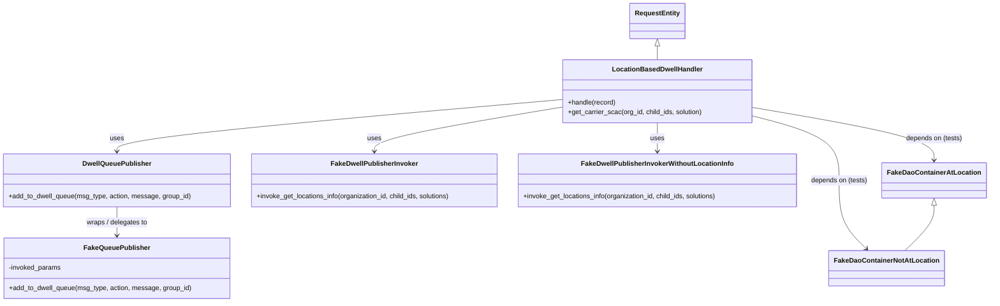
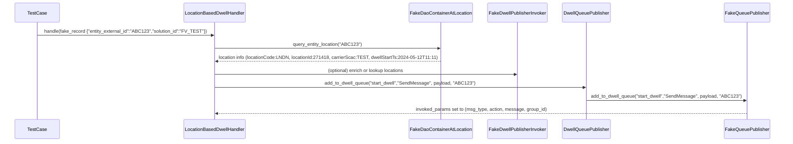
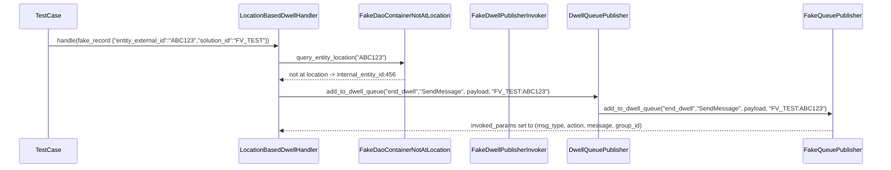

# Diagram: entity_core/entity_service/entity_service_tests/dwell/unit/location_based_dwell_tests/test_location_based_dwell_handler.py

> Auto-generated by Obscura crawlers

## Diagram 1

### SVG

<svg id="container" width="2354.1640625" xmlns="http://www.w3.org/2000/svg" class="classDiagram" height="718" viewBox="0 0 2354.1640625 718" role="graphics-document document" aria-roledescription="class"><g><defs><marker id="container_class-aggregationStart" class="marker aggregation class" refX="18" refY="7" markerWidth="190" markerHeight="240" orient="auto"><path d="M 18,7 L9,13 L1,7 L9,1 Z"></path></marker></defs><defs><marker id="container_class-aggregationEnd" class="marker aggregation class" refX="1" refY="7" markerWidth="20" markerHeight="28" orient="auto"><path d="M 18,7 L9,13 L1,7 L9,1 Z"></path></marker></defs><defs><marker id="container_class-extensionStart" class="marker extension class" refX="18" refY="7" markerWidth="190" markerHeight="240" orient="auto"><path d="M 1,7 L18,13 V 1 Z"></path></marker></defs><defs><marker id="container_class-extensionEnd" class="marker extension class" refX="1" refY="7" markerWidth="20" markerHeight="28" orient="auto"><path d="M 1,1 V 13 L18,7 Z"></path></marker></defs><defs><marker id="container_class-compositionStart" class="marker composition class" refX="18" refY="7" markerWidth="190" markerHeight="240" orient="auto"><path d="M 18,7 L9,13 L1,7 L9,1 Z"></path></marker></defs><defs><marker id="container_class-compositionEnd" class="marker composition class" refX="1" refY="7" markerWidth="20" markerHeight="28" orient="auto"><path d="M 18,7 L9,13 L1,7 L9,1 Z"></path></marker></defs><defs><marker id="container_class-dependencyStart" class="marker dependency class" refX="6" refY="7" markerWidth="190" markerHeight="240" orient="auto"><path d="M 5,7 L9,13 L1,7 L9,1 Z"></path></marker></defs><defs><marker id="container_class-dependencyEnd" class="marker dependency class" refX="13" refY="7" markerWidth="20" markerHeight="28" orient="auto"><path d="M 18,7 L9,13 L14,7 L9,1 Z"></path></marker></defs><defs><marker id="container_class-lollipopStart" class="marker lollipop class" refX="13" refY="7" markerWidth="190" markerHeight="240" orient="auto"><circle stroke="black" fill="transparent" cx="7" cy="7" r="6"></circle></marker></defs><defs><marker id="container_class-lollipopEnd" class="marker lollipop class" refX="1" refY="7" markerWidth="190" markerHeight="240" orient="auto"><circle stroke="black" fill="transparent" cx="7" cy="7" r="6"></circle></marker></defs><g class="root"><g class="clusters"></g><g class="edgePaths"><path d="M1346.891,236.454L1168.502,251.878C990.113,267.303,633.336,298.151,454.947,318.742C276.559,339.333,276.559,349.667,276.559,354.833L276.559,360" id="id_LocationBasedDwellHandler_DwellQueuePublisher_1" class="edge-thickness-normal edge-pattern-solid relation" style=";;;" data-edge="true" data-et="edge" data-id="id_LocationBasedDwellHandler_DwellQueuePublisher_1" data-points="W3sieCI6MTM0Ni44OTA2MjUsInkiOjIzNi40NTM5MTMyNjM3NTIxM30seyJ4IjoyNzYuNTU4NTkzNzUsInkiOjMyOX0seyJ4IjoyNzYuNTU4NTkzNzUsInkiOjM2Nn1d" marker-end="url(#container_class-dependencyEnd)"></path><path d="M1346.891,254.041L1271.004,266.534C1195.117,279.027,1043.344,304.014,967.457,321.673C891.57,339.333,891.57,349.667,891.57,354.833L891.57,360" id="id_LocationBasedDwellHandler_FakeDwellPublisherInvoker_2" class="edge-thickness-normal edge-pattern-solid relation" style=";;;" data-edge="true" data-et="edge" data-id="id_LocationBasedDwellHandler_FakeDwellPublisherInvoker_2" data-points="W3sieCI6MTM0Ni44OTA2MjUsInkiOjI1NC4wNDA1MTQ0Njk0NTMzN30seyJ4Ijo4OTEuNTcwMzEyNSwieSI6MzI5fSx7IngiOjg5MS41NzAzMTI1LCJ5IjozNjZ9XQ==" marker-end="url(#container_class-dependencyEnd)"></path><path d="M1571.883,292L1571.883,298.167C1571.883,304.333,1571.883,316.667,1571.883,328C1571.883,339.333,1571.883,349.667,1571.883,354.833L1571.883,360" id="id_LocationBasedDwellHandler_FakeDwellPublisherInvokerWithoutLocationInfo_3" class="edge-thickness-normal edge-pattern-solid relation" style=";;;" data-edge="true" data-et="edge" data-id="id_LocationBasedDwellHandler_FakeDwellPublisherInvokerWithoutLocationInfo_3" data-points="W3sieCI6MTU3MS44ODI4MTI1LCJ5IjoyOTJ9LHsieCI6MTU3MS44ODI4MTI1LCJ5IjozMjl9LHsieCI6MTU3MS44ODI4MTI1LCJ5IjozNjZ9XQ==" marker-end="url(#container_class-dependencyEnd)"></path><path d="M1796.875,255.366L1868.845,267.638C1940.815,279.911,2084.755,304.455,2156.725,325.394C2228.695,346.333,2228.695,363.667,2228.695,372.333L2228.695,381" id="id_LocationBasedDwellHandler_FakeDaoContainerAtLocation_4" class="edge-thickness-normal edge-pattern-solid relation" style=";;;" data-edge="true" data-et="edge" data-id="id_LocationBasedDwellHandler_FakeDaoContainerAtLocation_4" data-points="W3sieCI6MTc5Ni44NzUsInkiOjI1NS4zNjU3ODE3MTA5MTQ0Nn0seyJ4IjoyMjI4LjY5NTMxMjUsInkiOjMyOX0seyJ4IjoyMjI4LjY5NTMxMjUsInkiOjM4N31d" marker-end="url(#container_class-dependencyEnd)"></path><path d="M1796.875,274.717L1832.143,283.764C1867.411,292.811,1937.948,310.906,1973.216,336.619C2008.484,362.333,2008.484,395.667,2008.484,429C2008.484,462.333,2008.484,495.667,2019.054,522.796C2029.623,549.926,2050.761,570.853,2061.331,581.316L2071.9,591.779" id="id_LocationBasedDwellHandler_FakeDaoContainerNotAtLocation_5" class="edge-thickness-normal edge-pattern-solid relation" style=";;;" data-edge="true" data-et="edge" data-id="id_LocationBasedDwellHandler_FakeDaoContainerNotAtLocation_5" data-points="W3sieCI6MTc5Ni44NzUsInkiOjI3NC43MTY1MjUwMDY3MTAyfSx7IngiOjIwMDguNDg0Mzc1LCJ5IjozMjl9LHsieCI6MjAwOC40ODQzNzUsInkiOjQyOX0seyJ4IjoyMDA4LjQ4NDM3NSwieSI6NTI5fSx7IngiOjIwNzYuMTYzODgzMzE0MjIsInkiOjU5Nn1d" marker-end="url(#container_class-dependencyEnd)"></path><path d="M276.559,492L276.559,498.167C276.559,504.333,276.559,516.667,276.559,528C276.559,539.333,276.559,549.667,276.559,554.833L276.559,560" id="id_DwellQueuePublisher_FakeQueuePublisher_6" class="edge-thickness-normal edge-pattern-solid relation" style=";;;" data-edge="true" data-et="edge" data-id="id_DwellQueuePublisher_FakeQueuePublisher_6" data-points="W3sieCI6Mjc2LjU1ODU5Mzc1LCJ5Ijo0OTJ9LHsieCI6Mjc2LjU1ODU5Mzc1LCJ5Ijo1Mjl9LHsieCI6Mjc2LjU1ODU5Mzc1LCJ5Ijo1NjZ9XQ==" marker-end="url(#container_class-dependencyEnd)"></path><path d="M2228.695,488.25L2228.695,495.042C2228.695,501.833,2228.695,515.417,2217.415,533.375C2206.135,551.333,2183.576,573.667,2172.296,584.833L2161.016,596" id="id_FakeDaoContainerAtLocation_FakeDaoContainerNotAtLocation_7" class="edge-thickness-normal edge-pattern-solid relation" style=";;;" data-edge="true" data-et="edge" data-id="id_FakeDaoContainerAtLocation_FakeDaoContainerNotAtLocation_7" data-points="W3sieCI6MjIyOC42OTUzMTI1LCJ5Ijo0NzF9LHsieCI6MjIyOC42OTUzMTI1LCJ5Ijo1Mjl9LHsieCI6MjE2MS4wMTU4MDQxODU3OCwieSI6NTk2fV0=" marker-start="url(#container_class-extensionStart)"></path><path d="M1571.883,109.25L1571.883,110.542C1571.883,111.833,1571.883,114.417,1571.883,119.875C1571.883,125.333,1571.883,133.667,1571.883,137.833L1571.883,142" id="id_RequestEntity_LocationBasedDwellHandler_8" class="edge-thickness-normal edge-pattern-solid relation" style=";;;" data-edge="true" data-et="edge" data-id="id_RequestEntity_LocationBasedDwellHandler_8" data-points="W3sieCI6MTU3MS44ODI4MTI1LCJ5Ijo5Mn0seyJ4IjoxNTcxLjg4MjgxMjUsInkiOjExN30seyJ4IjoxNTcxLjg4MjgxMjUsInkiOjE0Mn1d" marker-start="url(#container_class-extensionStart)"></path></g><g class="edgeLabels"><g class="edgeLabel" transform="translate(276.55859375, 329)"><g class="label" data-id="id_LocationBasedDwellHandler_DwellQueuePublisher_1" transform="translate(-16.4921875, -12)"><foreignObject width="32.984375" height="24">

uses

</foreignObject></g></g><g class="edgeLabel" transform="translate(891.5703125, 329)"><g class="label" data-id="id_LocationBasedDwellHandler_FakeDwellPublisherInvoker_2" transform="translate(-16.4921875, -12)"><foreignObject width="32.984375" height="24">

uses

</foreignObject></g></g><g class="edgeLabel" transform="translate(1571.8828125, 329)"><g class="label" data-id="id_LocationBasedDwellHandler_FakeDwellPublisherInvokerWithoutLocationInfo_3" transform="translate(-16.4921875, -12)"><foreignObject width="32.984375" height="24">

uses

</foreignObject></g></g><g class="edgeLabel" transform="translate(2228.6953125, 329)"><g class="label" data-id="id_LocationBasedDwellHandler_FakeDaoContainerAtLocation_4" transform="translate(-67.7421875, -12)"><foreignObject width="135.484375" height="24">

depends on (tests)

</foreignObject></g></g><g class="edgeLabel" transform="translate(2008.484375, 429)"><g class="label" data-id="id_LocationBasedDwellHandler_FakeDaoContainerNotAtLocation_5" transform="translate(-67.7421875, -12)"><foreignObject width="135.484375" height="24">

depends on (tests)

</foreignObject></g></g><g class="edgeLabel" transform="translate(276.55859375, 529)"><g class="label" data-id="id_DwellQueuePublisher_FakeQueuePublisher_6" transform="translate(-74.3828125, -12)"><foreignObject width="148.765625" height="24">

wraps / delegates to

</foreignObject></g></g><g class="edgeLabel"><g class="label" data-id="id_FakeDaoContainerAtLocation_FakeDaoContainerNotAtLocation_7" transform="translate(0, 0)"><foreignObject width="0" height="0">

</foreignObject></g></g><g class="edgeLabel"><g class="label" data-id="id_RequestEntity_LocationBasedDwellHandler_8" transform="translate(0, 0)"><foreignObject width="0" height="0">

</foreignObject></g></g></g><g class="nodes"><g class="node default" id="classId-LocationBasedDwellHandler-0" transform="translate(1571.8828125, 217)"><g class="basic label-container"><path d="M-224.9921875 -75 L224.9921875 -75 L224.9921875 75 L-224.9921875 75" stroke="none" stroke-width="0" fill="#ECECFF" style=""></path><path d="M-224.9921875 -75 C-51.690395076861364 -75, 121.61139734627727 -75, 224.9921875 -75 M-224.9921875 -75 C-112.81390465607487 -75, -0.6356218121497363 -75, 224.9921875 -75 M224.9921875 -75 C224.9921875 -16.904858058094625, 224.9921875 41.19028388381075, 224.9921875 75 M224.9921875 -75 C224.9921875 -16.106117807457494, 224.9921875 42.78776438508501, 224.9921875 75 M224.9921875 75 C52.95807051343979 75, -119.07604647312041 75, -224.9921875 75 M224.9921875 75 C64.32661106344361 75, -96.33896537311279 75, -224.9921875 75 M-224.9921875 75 C-224.9921875 20.06943022610337, -224.9921875 -34.86113954779326, -224.9921875 -75 M-224.9921875 75 C-224.9921875 34.96380093364587, -224.9921875 -5.072398132708258, -224.9921875 -75" stroke="#9370DB" stroke-width="1.3" fill="none" stroke-dasharray="0 0" style=""></path></g><g class="annotation-group text" transform="translate(0, -51)"></g><g class="label-group text" transform="translate(-103.125, -51)"><g class="label" style="font-weight: bolder" transform="translate(0,-12)"><foreignObject width="206.25" height="24">

LocationBasedDwellHandler

</foreignObject></g></g><g class="members-group text" transform="translate(-212.9921875, -3)"></g><g class="methods-group text" transform="translate(-212.9921875, 27)"><g class="label" style="" transform="translate(0,-12)"><foreignObject width="115.0625" height="24">

+handle(record)

</foreignObject></g><g class="label" style="" transform="translate(0,12)"><foreignObject width="322.859375" height="24">

+get_carrier_scac(org_id, child_ids, solution)

</foreignObject></g></g><g class="divider" style=""><path d="M-224.9921875 -27 C-134.67762557684074 -27, -44.36306365368145 -27, 224.9921875 -27 M-224.9921875 -27 C-63.35453051140331 -27, 98.28312647719338 -27, 224.9921875 -27" stroke="#9370DB" stroke-width="1.3" fill="none" stroke-dasharray="0 0" style=""></path></g><g class="divider" style=""><path d="M-224.9921875 -3 C-130.86921348516728 -3, -36.74623947033456 -3, 224.9921875 -3 M-224.9921875 -3 C-49.04759977027132 -3, 126.89698795945736 -3, 224.9921875 -3" stroke="#9370DB" stroke-width="1.3" fill="none" stroke-dasharray="0 0" style=""></path></g></g><g class="node default" id="classId-DwellQueuePublisher-1" transform="translate(276.55859375, 429)"><g class="basic label-container"><path d="M-268.55859375 -63 L268.55859375 -63 L268.55859375 63 L-268.55859375 63" stroke="none" stroke-width="0" fill="#ECECFF" style=""></path><path d="M-268.55859375 -63 C-139.32875202236846 -63, -10.098910294736925 -63, 268.55859375 -63 M-268.55859375 -63 C-123.1549260069495 -63, 22.24874173610101 -63, 268.55859375 -63 M268.55859375 -63 C268.55859375 -20.90623686841809, 268.55859375 21.187526263163818, 268.55859375 63 M268.55859375 -63 C268.55859375 -31.356810517315484, 268.55859375 0.28637896536903185, 268.55859375 63 M268.55859375 63 C70.7981073934238 63, -126.96237896315239 63, -268.55859375 63 M268.55859375 63 C94.52166112683216 63, -79.51527149633569 63, -268.55859375 63 M-268.55859375 63 C-268.55859375 23.698170790901315, -268.55859375 -15.60365841819737, -268.55859375 -63 M-268.55859375 63 C-268.55859375 14.11864710191825, -268.55859375 -34.7627057961635, -268.55859375 -63" stroke="#9370DB" stroke-width="1.3" fill="none" stroke-dasharray="0 0" style=""></path></g><g class="annotation-group text" transform="translate(0, -39)"></g><g class="label-group text" transform="translate(-78.5546875, -39)"><g class="label" style="font-weight: bolder" transform="translate(0,-12)"><foreignObject width="157.109375" height="24">

DwellQueuePublisher

</foreignObject></g></g><g class="members-group text" transform="translate(-256.55859375, 9)"></g><g class="methods-group text" transform="translate(-256.55859375, 39)"><g class="label" style="" transform="translate(0,-12)"><foreignObject width="434.5625" height="24">

+add_to_dwell_queue(msg_type, action, message, group_id)

</foreignObject></g></g><g class="divider" style=""><path d="M-268.55859375 -15 C-153.59256110738636 -15, -38.62652846477269 -15, 268.55859375 -15 M-268.55859375 -15 C-146.77876629405168 -15, -24.998938838103356 -15, 268.55859375 -15" stroke="#9370DB" stroke-width="1.3" fill="none" stroke-dasharray="0 0" style=""></path></g><g class="divider" style=""><path d="M-268.55859375 9 C-85.22935237171518 9, 98.09988900656964 9, 268.55859375 9 M-268.55859375 9 C-89.20145930011745 9, 90.1556751497651 9, 268.55859375 9" stroke="#9370DB" stroke-width="1.3" fill="none" stroke-dasharray="0 0" style=""></path></g></g><g class="node default" id="classId-FakeQueuePublisher-2" transform="translate(276.55859375, 638)"><g class="basic label-container"><path d="M-266.640625 -72 L266.640625 -72 L266.640625 72 L-266.640625 72" stroke="none" stroke-width="0" fill="#ECECFF" style=""></path><path d="M-266.640625 -72 C-137.01766850256908 -72, -7.39471200513816 -72, 266.640625 -72 M-266.640625 -72 C-158.25094497734045 -72, -49.86126495468088 -72, 266.640625 -72 M266.640625 -72 C266.640625 -25.84403318117647, 266.640625 20.31193363764706, 266.640625 72 M266.640625 -72 C266.640625 -37.644876937320845, 266.640625 -3.28975387464169, 266.640625 72 M266.640625 72 C53.45277916148885 72, -159.7350666770223 72, -266.640625 72 M266.640625 72 C148.35592006286157 72, 30.071215125723114 72, -266.640625 72 M-266.640625 72 C-266.640625 25.086697069140122, -266.640625 -21.826605861719756, -266.640625 -72 M-266.640625 72 C-266.640625 42.10957772869831, -266.640625 12.219155457396624, -266.640625 -72" stroke="#9370DB" stroke-width="1.3" fill="none" stroke-dasharray="0 0" style=""></path></g><g class="annotation-group text" transform="translate(0, -48)"></g><g class="label-group text" transform="translate(-74.71875, -48)"><g class="label" style="font-weight: bolder" transform="translate(0,-12)"><foreignObject width="149.4375" height="24">

FakeQueuePublisher

</foreignObject></g></g><g class="members-group text" transform="translate(-254.640625, 0)"><g class="label" style="" transform="translate(0,-12)"><foreignObject width="125.59375" height="24">

-invoked_params

</foreignObject></g></g><g class="methods-group text" transform="translate(-254.640625, 48)"><g class="label" style="" transform="translate(0,-12)"><foreignObject width="434.5625" height="24">

+add_to_dwell_queue(msg_type, action, message, group_id)

</foreignObject></g></g><g class="divider" style=""><path d="M-266.640625 -24 C-118.34031615017821 -24, 29.95999269964358 -24, 266.640625 -24 M-266.640625 -24 C-90.43817398108317 -24, 85.76427703783366 -24, 266.640625 -24" stroke="#9370DB" stroke-width="1.3" fill="none" stroke-dasharray="0 0" style=""></path></g><g class="divider" style=""><path d="M-266.640625 24 C-61.53146000250959 24, 143.57770499498082 24, 266.640625 24 M-266.640625 24 C-119.65879017863205 24, 27.32304464273591 24, 266.640625 24" stroke="#9370DB" stroke-width="1.3" fill="none" stroke-dasharray="0 0" style=""></path></g></g><g class="node default" id="classId-FakeDwellPublisherInvoker-3" transform="translate(891.5703125, 429)"><g class="basic label-container"><path d="M-296.453125 -63 L296.453125 -63 L296.453125 63 L-296.453125 63" stroke="none" stroke-width="0" fill="#ECECFF" style=""></path><path d="M-296.453125 -63 C-150.71208693958962 -63, -4.97104887917925 -63, 296.453125 -63 M-296.453125 -63 C-144.35598819861502 -63, 7.741148602769954 -63, 296.453125 -63 M296.453125 -63 C296.453125 -37.06744042652128, 296.453125 -11.13488085304256, 296.453125 63 M296.453125 -63 C296.453125 -32.71001731869126, 296.453125 -2.420034637382514, 296.453125 63 M296.453125 63 C149.43769817799176 63, 2.4222713559835256 63, -296.453125 63 M296.453125 63 C63.25602760394676 63, -169.94106979210648 63, -296.453125 63 M-296.453125 63 C-296.453125 17.660411290157725, -296.453125 -27.67917741968455, -296.453125 -63 M-296.453125 63 C-296.453125 23.891863019066506, -296.453125 -15.216273961866989, -296.453125 -63" stroke="#9370DB" stroke-width="1.3" fill="none" stroke-dasharray="0 0" style=""></path></g><g class="annotation-group text" transform="translate(0, -39)"></g><g class="label-group text" transform="translate(-99.140625, -39)"><g class="label" style="font-weight: bolder" transform="translate(0,-12)"><foreignObject width="198.28125" height="24">

FakeDwellPublisherInvoker

</foreignObject></g></g><g class="members-group text" transform="translate(-284.453125, 9)"></g><g class="methods-group text" transform="translate(-284.453125, 39)"><g class="label" style="" transform="translate(0,-12)"><foreignObject width="469.765625" height="24">

+invoke_get_locations_info(organization_id, child_ids, solutions)

</foreignObject></g></g><g class="divider" style=""><path d="M-296.453125 -15 C-113.07683299828605 -15, 70.2994590034279 -15, 296.453125 -15 M-296.453125 -15 C-152.41003203580675 -15, -8.366939071613501 -15, 296.453125 -15" stroke="#9370DB" stroke-width="1.3" fill="none" stroke-dasharray="0 0" style=""></path></g><g class="divider" style=""><path d="M-296.453125 9 C-94.87385383759332 9, 106.70541732481337 9, 296.453125 9 M-296.453125 9 C-125.30449710587672 9, 45.84413078824656 9, 296.453125 9" stroke="#9370DB" stroke-width="1.3" fill="none" stroke-dasharray="0 0" style=""></path></g></g><g class="node default" id="classId-FakeDwellPublisherInvokerWithoutLocationInfo-4" transform="translate(1571.8828125, 429)"><g class="basic label-container"><path d="M-333.859375 -63 L333.859375 -63 L333.859375 63 L-333.859375 63" stroke="none" stroke-width="0" fill="#ECECFF" style=""></path><path d="M-333.859375 -63 C-152.0398077974523 -63, 29.779759405095376 -63, 333.859375 -63 M-333.859375 -63 C-90.28302860406819 -63, 153.29331779186361 -63, 333.859375 -63 M333.859375 -63 C333.859375 -34.216461604814874, 333.859375 -5.432923209629749, 333.859375 63 M333.859375 -63 C333.859375 -17.038671073635044, 333.859375 28.922657852729913, 333.859375 63 M333.859375 63 C166.45882890636673 63, -0.9417171872665335 63, -333.859375 63 M333.859375 63 C168.6391738075804 63, 3.418972615160783 63, -333.859375 63 M-333.859375 63 C-333.859375 33.23010912170858, -333.859375 3.4602182434171667, -333.859375 -63 M-333.859375 63 C-333.859375 35.950726412752886, -333.859375 8.901452825505778, -333.859375 -63" stroke="#9370DB" stroke-width="1.3" fill="none" stroke-dasharray="0 0" style=""></path></g><g class="annotation-group text" transform="translate(0, -39)"></g><g class="label-group text" transform="translate(-173.953125, -39)"><g class="label" style="font-weight: bolder" transform="translate(0,-12)"><foreignObject width="347.90625" height="24">

FakeDwellPublisherInvokerWithoutLocationInfo

</foreignObject></g></g><g class="members-group text" transform="translate(-321.859375, 9)"></g><g class="methods-group text" transform="translate(-321.859375, 39)"><g class="label" style="" transform="translate(0,-12)"><foreignObject width="469.765625" height="24">

+invoke_get_locations_info(organization_id, child_ids, solutions)

</foreignObject></g></g><g class="divider" style=""><path d="M-333.859375 -15 C-84.20201223961158 -15, 165.45535052077685 -15, 333.859375 -15 M-333.859375 -15 C-178.48385661550086 -15, -23.10833823100171 -15, 333.859375 -15" stroke="#9370DB" stroke-width="1.3" fill="none" stroke-dasharray="0 0" style=""></path></g><g class="divider" style=""><path d="M-333.859375 9 C-140.72727241119048 9, 52.40483017761903 9, 333.859375 9 M-333.859375 9 C-118.51070620908976 9, 96.83796258182048 9, 333.859375 9" stroke="#9370DB" stroke-width="1.3" fill="none" stroke-dasharray="0 0" style=""></path></g></g><g class="node default" id="classId-FakeDaoContainerAtLocation-5" transform="translate(2228.6953125, 429)"><g class="basic label-container"><path d="M-117.46875 -42 L117.46875 -42 L117.46875 42 L-117.46875 42" stroke="none" stroke-width="0" fill="#ECECFF" style=""></path><path d="M-117.46875 -42 C-41.68002230844591 -42, 34.10870538310817 -42, 117.46875 -42 M-117.46875 -42 C-60.61794772840566 -42, -3.7671454568113205 -42, 117.46875 -42 M117.46875 -42 C117.46875 -15.62392324999579, 117.46875 10.752153500008419, 117.46875 42 M117.46875 -42 C117.46875 -16.468981700980226, 117.46875 9.062036598039548, 117.46875 42 M117.46875 42 C42.60797853676797 42, -32.25279292646405 42, -117.46875 42 M117.46875 42 C36.357519412439984 42, -44.75371117512003 42, -117.46875 42 M-117.46875 42 C-117.46875 15.59816854746854, -117.46875 -10.803662905062922, -117.46875 -42 M-117.46875 42 C-117.46875 12.924839042389522, -117.46875 -16.150321915220957, -117.46875 -42" stroke="#9370DB" stroke-width="1.3" fill="none" stroke-dasharray="0 0" style=""></path></g><g class="annotation-group text" transform="translate(0, -18)"></g><g class="label-group text" transform="translate(-105.46875, -18)"><g class="label" style="font-weight: bolder" transform="translate(0,-12)"><foreignObject width="210.9375" height="24">

FakeDaoContainerAtLocation

</foreignObject></g></g><g class="members-group text" transform="translate(-105.46875, 30)"></g><g class="methods-group text" transform="translate(-105.46875, 60)"></g><g class="divider" style=""><path d="M-117.46875 6 C-56.842977363291794 6, 3.7827952734164114 6, 117.46875 6 M-117.46875 6 C-49.53552650039734 6, 18.397696999205323 6, 117.46875 6" stroke="#9370DB" stroke-width="1.3" fill="none" stroke-dasharray="0 0" style=""></path></g><g class="divider" style=""><path d="M-117.46875 24 C-45.478894585735034 24, 26.51096082852993 24, 117.46875 24 M-117.46875 24 C-25.08069693483955 24, 67.3073561303209 24, 117.46875 24" stroke="#9370DB" stroke-width="1.3" fill="none" stroke-dasharray="0 0" style=""></path></g></g><g class="node default" id="classId-FakeDaoContainerNotAtLocation-6" transform="translate(2118.58984375, 638)"><g class="basic label-container"><path d="M-130.53125 -42 L130.53125 -42 L130.53125 42 L-130.53125 42" stroke="none" stroke-width="0" fill="#ECECFF" style=""></path><path d="M-130.53125 -42 C-50.22077801754004 -42, 30.089693964919917 -42, 130.53125 -42 M-130.53125 -42 C-69.62475905150193 -42, -8.718268103003851 -42, 130.53125 -42 M130.53125 -42 C130.53125 -20.84468608012257, 130.53125 0.31062783975485786, 130.53125 42 M130.53125 -42 C130.53125 -13.289954204630124, 130.53125 15.420091590739752, 130.53125 42 M130.53125 42 C36.98481009087239 42, -56.56162981825523 42, -130.53125 42 M130.53125 42 C69.86042692095003 42, 9.189603841900066 42, -130.53125 42 M-130.53125 42 C-130.53125 14.25538419677483, -130.53125 -13.489231606450339, -130.53125 -42 M-130.53125 42 C-130.53125 22.81084773180089, -130.53125 3.6216954636017817, -130.53125 -42" stroke="#9370DB" stroke-width="1.3" fill="none" stroke-dasharray="0 0" style=""></path></g><g class="annotation-group text" transform="translate(0, -18)"></g><g class="label-group text" transform="translate(-118.53125, -18)"><g class="label" style="font-weight: bolder" transform="translate(0,-12)"><foreignObject width="237.0625" height="24">

FakeDaoContainerNotAtLocation

</foreignObject></g></g><g class="members-group text" transform="translate(-118.53125, 30)"></g><g class="methods-group text" transform="translate(-118.53125, 60)"></g><g class="divider" style=""><path d="M-130.53125 6 C-26.691378238373133 6, 77.14849352325373 6, 130.53125 6 M-130.53125 6 C-27.279595046047177 6, 75.97205990790565 6, 130.53125 6" stroke="#9370DB" stroke-width="1.3" fill="none" stroke-dasharray="0 0" style=""></path></g><g class="divider" style=""><path d="M-130.53125 24 C-44.94663059045969 24, 40.63798881908062 24, 130.53125 24 M-130.53125 24 C-73.81347716051297 24, -17.095704321025963 24, 130.53125 24" stroke="#9370DB" stroke-width="1.3" fill="none" stroke-dasharray="0 0" style=""></path></g></g><g class="node default" id="classId-RequestEntity-7" transform="translate(1571.8828125, 50)"><g class="basic label-container"><path d="M-63.2578125 -42 L63.2578125 -42 L63.2578125 42 L-63.2578125 42" stroke="none" stroke-width="0" fill="#ECECFF" style=""></path><path d="M-63.2578125 -42 C-31.14873640992451 -42, 0.9603396801509803 -42, 63.2578125 -42 M-63.2578125 -42 C-13.119142003562537 -42, 37.019528492874926 -42, 63.2578125 -42 M63.2578125 -42 C63.2578125 -15.462376754275795, 63.2578125 11.07524649144841, 63.2578125 42 M63.2578125 -42 C63.2578125 -8.462063869645, 63.2578125 25.07587226071, 63.2578125 42 M63.2578125 42 C15.042402499048315 42, -33.17300750190337 42, -63.2578125 42 M63.2578125 42 C27.027066234302943 42, -9.203680031394114 42, -63.2578125 42 M-63.2578125 42 C-63.2578125 17.32518771913769, -63.2578125 -7.349624561724617, -63.2578125 -42 M-63.2578125 42 C-63.2578125 8.601597512461304, -63.2578125 -24.796804975077393, -63.2578125 -42" stroke="#9370DB" stroke-width="1.3" fill="none" stroke-dasharray="0 0" style=""></path></g><g class="annotation-group text" transform="translate(0, -18)"></g><g class="label-group text" transform="translate(-51.2578125, -18)"><g class="label" style="font-weight: bolder" transform="translate(0,-12)"><foreignObject width="102.515625" height="24">

RequestEntity

</foreignObject></g></g><g class="members-group text" transform="translate(-51.2578125, 30)"></g><g class="methods-group text" transform="translate(-51.2578125, 60)"></g><g class="divider" style=""><path d="M-63.2578125 6 C-26.90392289065249 6, 9.449966718695023 6, 63.2578125 6 M-63.2578125 6 C-17.957850659362215 6, 27.34211118127557 6, 63.2578125 6" stroke="#9370DB" stroke-width="1.3" fill="none" stroke-dasharray="0 0" style=""></path></g><g class="divider" style=""><path d="M-63.2578125 24 C-27.350686109049875 24, 8.556440281900251 24, 63.2578125 24 M-63.2578125 24 C-29.694076261567425 24, 3.869659976865151 24, 63.2578125 24" stroke="#9370DB" stroke-width="1.3" fill="none" stroke-dasharray="0 0" style=""></path></g></g></g></g></g></svg>

## Diagram 2

### SVG

<svg id="container" width="2741.5" xmlns="http://www.w3.org/2000/svg" height="507" viewBox="-50 -10 2741.5 507" role="graphics-document document" aria-roledescription="sequence"><g><rect x="2472.5" y="421" fill="#eaeaea" stroke="#666" width="169" height="65" name="QP" rx="3" ry="3" class="actor actor-bottom"></rect><text x="2557" y="453.5" dominant-baseline="central" alignment-baseline="central" class="actor actor-box" style="text-anchor: middle; font-size: 16px; font-weight: 400;"><tspan x="2557" dy="0">FakeQueuePublisher</tspan></text></g><g><rect x="1899" y="421" fill="#eaeaea" stroke="#666" width="176" height="65" name="DQP" rx="3" ry="3" class="actor actor-bottom"></rect><text x="1987" y="453.5" dominant-baseline="central" alignment-baseline="central" class="actor actor-box" style="text-anchor: middle; font-size: 16px; font-weight: 400;"><tspan x="1987" dy="0">DwellQueuePublisher</tspan></text></g><g><rect x="1633" y="421" fill="#eaeaea" stroke="#666" width="216" height="65" name="Invoker" rx="3" ry="3" class="actor actor-bottom"></rect><text x="1741" y="453.5" dominant-baseline="central" alignment-baseline="central" class="actor actor-box" style="text-anchor: middle; font-size: 16px; font-weight: 400;"><tspan x="1741" dy="0">FakeDwellPublisherInvoker</tspan></text></g><g><rect x="1355" y="421" fill="#eaeaea" stroke="#666" width="228" height="65" name="DAO" rx="3" ry="3" class="actor actor-bottom"></rect><text x="1469" y="453.5" dominant-baseline="central" alignment-baseline="central" class="actor actor-box" style="text-anchor: middle; font-size: 16px; font-weight: 400;"><tspan x="1469" dy="0">FakeDaoContainerAtLocation</tspan></text></g><g><rect x="571.5" y="421" fill="#eaeaea" stroke="#666" width="225" height="65" name="Handler" rx="3" ry="3" class="actor actor-bottom"></rect><text x="684" y="453.5" dominant-baseline="central" alignment-baseline="central" class="actor actor-box" style="text-anchor: middle; font-size: 16px; font-weight: 400;"><tspan x="684" dy="0">LocationBasedDwellHandler</tspan></text></g><g><rect x="0" y="421" fill="#eaeaea" stroke="#666" width="150" height="65" name="Test" rx="3" ry="3" class="actor actor-bottom"></rect><text x="75" y="453.5" dominant-baseline="central" alignment-baseline="central" class="actor actor-box" style="text-anchor: middle; font-size: 16px; font-weight: 400;"><tspan x="75" dy="0">TestCase</tspan></text></g><g><line id="actor5" x1="2557" y1="65" x2="2557" y2="421" class="actor-line 200" stroke-width="0.5px" stroke="#999" name="QP"></line><g id="root-5"><rect x="2472.5" y="0" fill="#eaeaea" stroke="#666" width="169" height="65" name="QP" rx="3" ry="3" class="actor actor-top"></rect><text x="2557" y="32.5" dominant-baseline="central" alignment-baseline="central" class="actor actor-box" style="text-anchor: middle; font-size: 16px; font-weight: 400;"><tspan x="2557" dy="0">FakeQueuePublisher</tspan></text></g></g><g><line id="actor4" x1="1987" y1="65" x2="1987" y2="421" class="actor-line 200" stroke-width="0.5px" stroke="#999" name="DQP"></line><g id="root-4"><rect x="1899" y="0" fill="#eaeaea" stroke="#666" width="176" height="65" name="DQP" rx="3" ry="3" class="actor actor-top"></rect><text x="1987" y="32.5" dominant-baseline="central" alignment-baseline="central" class="actor actor-box" style="text-anchor: middle; font-size: 16px; font-weight: 400;"><tspan x="1987" dy="0">DwellQueuePublisher</tspan></text></g></g><g><line id="actor3" x1="1741" y1="65" x2="1741" y2="421" class="actor-line 200" stroke-width="0.5px" stroke="#999" name="Invoker"></line><g id="root-3"><rect x="1633" y="0" fill="#eaeaea" stroke="#666" width="216" height="65" name="Invoker" rx="3" ry="3" class="actor actor-top"></rect><text x="1741" y="32.5" dominant-baseline="central" alignment-baseline="central" class="actor actor-box" style="text-anchor: middle; font-size: 16px; font-weight: 400;"><tspan x="1741" dy="0">FakeDwellPublisherInvoker</tspan></text></g></g><g><line id="actor2" x1="1469" y1="65" x2="1469" y2="421" class="actor-line 200" stroke-width="0.5px" stroke="#999" name="DAO"></line><g id="root-2"><rect x="1355" y="0" fill="#eaeaea" stroke="#666" width="228" height="65" name="DAO" rx="3" ry="3" class="actor actor-top"></rect><text x="1469" y="32.5" dominant-baseline="central" alignment-baseline="central" class="actor actor-box" style="text-anchor: middle; font-size: 16px; font-weight: 400;"><tspan x="1469" dy="0">FakeDaoContainerAtLocation</tspan></text></g></g><g><line id="actor1" x1="684" y1="65" x2="684" y2="421" class="actor-line 200" stroke-width="0.5px" stroke="#999" name="Handler"></line><g id="root-1"><rect x="571.5" y="0" fill="#eaeaea" stroke="#666" width="225" height="65" name="Handler" rx="3" ry="3" class="actor actor-top"></rect><text x="684" y="32.5" dominant-baseline="central" alignment-baseline="central" class="actor actor-box" style="text-anchor: middle; font-size: 16px; font-weight: 400;"><tspan x="684" dy="0">LocationBasedDwellHandler</tspan></text></g></g><g><line id="actor0" x1="75" y1="65" x2="75" y2="421" class="actor-line 200" stroke-width="0.5px" stroke="#999" name="Test"></line><g id="root-0"><rect x="0" y="0" fill="#eaeaea" stroke="#666" width="150" height="65" name="Test" rx="3" ry="3" class="actor actor-top"></rect><text x="75" y="32.5" dominant-baseline="central" alignment-baseline="central" class="actor actor-box" style="text-anchor: middle; font-size: 16px; font-weight: 400;"><tspan x="75" dy="0">TestCase</tspan></text></g></g><g></g><defs><symbol id="computer" width="24" height="24"><path transform="scale(.5)" d="M2 2v13h20v-13h-20zm18 11h-16v-9h16v9zm-10.228 6l.466-1h3.524l.467 1h-4.457zm14.228 3h-24l2-6h2.104l-1.33 4h18.45l-1.297-4h2.073l2 6zm-5-10h-14v-7h14v7z"></path></symbol></defs><defs><symbol id="database" fill-rule="evenodd" clip-rule="evenodd"><path transform="scale(.5)" d="M12.258.001l.256.004.255.005.253.008.251.01.249.012.247.015.246.016.242.019.241.02.239.023.236.024.233.027.231.028.229.031.225.032.223.034.22.036.217.038.214.04.211.041.208.043.205.045.201.046.198.048.194.05.191.051.187.053.183.054.18.056.175.057.172.059.168.06.163.061.16.063.155.064.15.066.074.033.073.033.071.034.07.034.069.035.068.035.067.035.066.035.064.036.064.036.062.036.06.036.06.037.058.037.058.037.055.038.055.038.053.038.052.038.051.039.05.039.048.039.047.039.045.04.044.04.043.04.041.04.04.041.039.041.037.041.036.041.034.041.033.042.032.042.03.042.029.042.027.042.026.043.024.043.023.043.021.043.02.043.018.044.017.043.015.044.013.044.012.044.011.045.009.044.007.045.006.045.004.045.002.045.001.045v17l-.001.045-.002.045-.004.045-.006.045-.007.045-.009.044-.011.045-.012.044-.013.044-.015.044-.017.043-.018.044-.02.043-.021.043-.023.043-.024.043-.026.043-.027.042-.029.042-.03.042-.032.042-.033.042-.034.041-.036.041-.037.041-.039.041-.04.041-.041.04-.043.04-.044.04-.045.04-.047.039-.048.039-.05.039-.051.039-.052.038-.053.038-.055.038-.055.038-.058.037-.058.037-.06.037-.06.036-.062.036-.064.036-.064.036-.066.035-.067.035-.068.035-.069.035-.07.034-.071.034-.073.033-.074.033-.15.066-.155.064-.16.063-.163.061-.168.06-.172.059-.175.057-.18.056-.183.054-.187.053-.191.051-.194.05-.198.048-.201.046-.205.045-.208.043-.211.041-.214.04-.217.038-.22.036-.223.034-.225.032-.229.031-.231.028-.233.027-.236.024-.239.023-.241.02-.242.019-.246.016-.247.015-.249.012-.251.01-.253.008-.255.005-.256.004-.258.001-.258-.001-.256-.004-.255-.005-.253-.008-.251-.01-.249-.012-.247-.015-.245-.016-.243-.019-.241-.02-.238-.023-.236-.024-.234-.027-.231-.028-.228-.031-.226-.032-.223-.034-.22-.036-.217-.038-.214-.04-.211-.041-.208-.043-.204-.045-.201-.046-.198-.048-.195-.05-.19-.051-.187-.053-.184-.054-.179-.056-.176-.057-.172-.059-.167-.06-.164-.061-.159-.063-.155-.064-.151-.066-.074-.033-.072-.033-.072-.034-.07-.034-.069-.035-.068-.035-.067-.035-.066-.035-.064-.036-.063-.036-.062-.036-.061-.036-.06-.037-.058-.037-.057-.037-.056-.038-.055-.038-.053-.038-.052-.038-.051-.039-.049-.039-.049-.039-.046-.039-.046-.04-.044-.04-.043-.04-.041-.04-.04-.041-.039-.041-.037-.041-.036-.041-.034-.041-.033-.042-.032-.042-.03-.042-.029-.042-.027-.042-.026-.043-.024-.043-.023-.043-.021-.043-.02-.043-.018-.044-.017-.043-.015-.044-.013-.044-.012-.044-.011-.045-.009-.044-.007-.045-.006-.045-.004-.045-.002-.045-.001-.045v-17l.001-.045.002-.045.004-.045.006-.045.007-.045.009-.044.011-.045.012-.044.013-.044.015-.044.017-.043.018-.044.02-.043.021-.043.023-.043.024-.043.026-.043.027-.042.029-.042.03-.042.032-.042.033-.042.034-.041.036-.041.037-.041.039-.041.04-.041.041-.04.043-.04.044-.04.046-.04.046-.039.049-.039.049-.039.051-.039.052-.038.053-.038.055-.038.056-.038.057-.037.058-.037.06-.037.061-.036.062-.036.063-.036.064-.036.066-.035.067-.035.068-.035.069-.035.07-.034.072-.034.072-.033.074-.033.151-.066.155-.064.159-.063.164-.061.167-.06.172-.059.176-.057.179-.056.184-.054.187-.053.19-.051.195-.05.198-.048.201-.046.204-.045.208-.043.211-.041.214-.04.217-.038.22-.036.223-.034.226-.032.228-.031.231-.028.234-.027.236-.024.238-.023.241-.02.243-.019.245-.016.247-.015.249-.012.251-.01.253-.008.255-.005.256-.004.258-.001.258.001zm-9.258 20.499v.01l.001.021.003.021.004.022.005.021.006.022.007.022.009.023.01.022.011.023.012.023.013.023.015.023.016.024.017.023.018.024.019.024.021.024.022.025.023.024.024.025.052.049.056.05.061.051.066.051.07.051.075.051.079.052.084.052.088.052.092.052.097.052.102.051.105.052.11.052.114.051.119.051.123.051.127.05.131.05.135.05.139.048.144.049.147.047.152.047.155.047.16.045.163.045.167.043.171.043.176.041.178.041.183.039.187.039.19.037.194.035.197.035.202.033.204.031.209.03.212.029.216.027.219.025.222.024.226.021.23.02.233.018.236.016.24.015.243.012.246.01.249.008.253.005.256.004.259.001.26-.001.257-.004.254-.005.25-.008.247-.011.244-.012.241-.014.237-.016.233-.018.231-.021.226-.021.224-.024.22-.026.216-.027.212-.028.21-.031.205-.031.202-.034.198-.034.194-.036.191-.037.187-.039.183-.04.179-.04.175-.042.172-.043.168-.044.163-.045.16-.046.155-.046.152-.047.148-.048.143-.049.139-.049.136-.05.131-.05.126-.05.123-.051.118-.052.114-.051.11-.052.106-.052.101-.052.096-.052.092-.052.088-.053.083-.051.079-.052.074-.052.07-.051.065-.051.06-.051.056-.05.051-.05.023-.024.023-.025.021-.024.02-.024.019-.024.018-.024.017-.024.015-.023.014-.024.013-.023.012-.023.01-.023.01-.022.008-.022.006-.022.006-.022.004-.022.004-.021.001-.021.001-.021v-4.127l-.077.055-.08.053-.083.054-.085.053-.087.052-.09.052-.093.051-.095.05-.097.05-.1.049-.102.049-.105.048-.106.047-.109.047-.111.046-.114.045-.115.045-.118.044-.12.043-.122.042-.124.042-.126.041-.128.04-.13.04-.132.038-.134.038-.135.037-.138.037-.139.035-.142.035-.143.034-.144.033-.147.032-.148.031-.15.03-.151.03-.153.029-.154.027-.156.027-.158.026-.159.025-.161.024-.162.023-.163.022-.165.021-.166.02-.167.019-.169.018-.169.017-.171.016-.173.015-.173.014-.175.013-.175.012-.177.011-.178.01-.179.008-.179.008-.181.006-.182.005-.182.004-.184.003-.184.002h-.37l-.184-.002-.184-.003-.182-.004-.182-.005-.181-.006-.179-.008-.179-.008-.178-.01-.176-.011-.176-.012-.175-.013-.173-.014-.172-.015-.171-.016-.17-.017-.169-.018-.167-.019-.166-.02-.165-.021-.163-.022-.162-.023-.161-.024-.159-.025-.157-.026-.156-.027-.155-.027-.153-.029-.151-.03-.15-.03-.148-.031-.146-.032-.145-.033-.143-.034-.141-.035-.14-.035-.137-.037-.136-.037-.134-.038-.132-.038-.13-.04-.128-.04-.126-.041-.124-.042-.122-.042-.12-.044-.117-.043-.116-.045-.113-.045-.112-.046-.109-.047-.106-.047-.105-.048-.102-.049-.1-.049-.097-.05-.095-.05-.093-.052-.09-.051-.087-.052-.085-.053-.083-.054-.08-.054-.077-.054v4.127zm0-5.654v.011l.001.021.003.021.004.021.005.022.006.022.007.022.009.022.01.022.011.023.012.023.013.023.015.024.016.023.017.024.018.024.019.024.021.024.022.024.023.025.024.024.052.05.056.05.061.05.066.051.07.051.075.052.079.051.084.052.088.052.092.052.097.052.102.052.105.052.11.051.114.051.119.052.123.05.127.051.131.05.135.049.139.049.144.048.147.048.152.047.155.046.16.045.163.045.167.044.171.042.176.042.178.04.183.04.187.038.19.037.194.036.197.034.202.033.204.032.209.03.212.028.216.027.219.025.222.024.226.022.23.02.233.018.236.016.24.014.243.012.246.01.249.008.253.006.256.003.259.001.26-.001.257-.003.254-.006.25-.008.247-.01.244-.012.241-.015.237-.016.233-.018.231-.02.226-.022.224-.024.22-.025.216-.027.212-.029.21-.03.205-.032.202-.033.198-.035.194-.036.191-.037.187-.039.183-.039.179-.041.175-.042.172-.043.168-.044.163-.045.16-.045.155-.047.152-.047.148-.048.143-.048.139-.05.136-.049.131-.05.126-.051.123-.051.118-.051.114-.052.11-.052.106-.052.101-.052.096-.052.092-.052.088-.052.083-.052.079-.052.074-.051.07-.052.065-.051.06-.05.056-.051.051-.049.023-.025.023-.024.021-.025.02-.024.019-.024.018-.024.017-.024.015-.023.014-.023.013-.024.012-.022.01-.023.01-.023.008-.022.006-.022.006-.022.004-.021.004-.022.001-.021.001-.021v-4.139l-.077.054-.08.054-.083.054-.085.052-.087.053-.09.051-.093.051-.095.051-.097.05-.1.049-.102.049-.105.048-.106.047-.109.047-.111.046-.114.045-.115.044-.118.044-.12.044-.122.042-.124.042-.126.041-.128.04-.13.039-.132.039-.134.038-.135.037-.138.036-.139.036-.142.035-.143.033-.144.033-.147.033-.148.031-.15.03-.151.03-.153.028-.154.028-.156.027-.158.026-.159.025-.161.024-.162.023-.163.022-.165.021-.166.02-.167.019-.169.018-.169.017-.171.016-.173.015-.173.014-.175.013-.175.012-.177.011-.178.009-.179.009-.179.007-.181.007-.182.005-.182.004-.184.003-.184.002h-.37l-.184-.002-.184-.003-.182-.004-.182-.005-.181-.007-.179-.007-.179-.009-.178-.009-.176-.011-.176-.012-.175-.013-.173-.014-.172-.015-.171-.016-.17-.017-.169-.018-.167-.019-.166-.02-.165-.021-.163-.022-.162-.023-.161-.024-.159-.025-.157-.026-.156-.027-.155-.028-.153-.028-.151-.03-.15-.03-.148-.031-.146-.033-.145-.033-.143-.033-.141-.035-.14-.036-.137-.036-.136-.037-.134-.038-.132-.039-.13-.039-.128-.04-.126-.041-.124-.042-.122-.043-.12-.043-.117-.044-.116-.044-.113-.046-.112-.046-.109-.046-.106-.047-.105-.048-.102-.049-.1-.049-.097-.05-.095-.051-.093-.051-.09-.051-.087-.053-.085-.052-.083-.054-.08-.054-.077-.054v4.139zm0-5.666v.011l.001.02.003.022.004.021.005.022.006.021.007.022.009.023.01.022.011.023.012.023.013.023.015.023.016.024.017.024.018.023.019.024.021.025.022.024.023.024.024.025.052.05.056.05.061.05.066.051.07.051.075.052.079.051.084.052.088.052.092.052.097.052.102.052.105.051.11.052.114.051.119.051.123.051.127.05.131.05.135.05.139.049.144.048.147.048.152.047.155.046.16.045.163.045.167.043.171.043.176.042.178.04.183.04.187.038.19.037.194.036.197.034.202.033.204.032.209.03.212.028.216.027.219.025.222.024.226.021.23.02.233.018.236.017.24.014.243.012.246.01.249.008.253.006.256.003.259.001.26-.001.257-.003.254-.006.25-.008.247-.01.244-.013.241-.014.237-.016.233-.018.231-.02.226-.022.224-.024.22-.025.216-.027.212-.029.21-.03.205-.032.202-.033.198-.035.194-.036.191-.037.187-.039.183-.039.179-.041.175-.042.172-.043.168-.044.163-.045.16-.045.155-.047.152-.047.148-.048.143-.049.139-.049.136-.049.131-.051.126-.05.123-.051.118-.052.114-.051.11-.052.106-.052.101-.052.096-.052.092-.052.088-.052.083-.052.079-.052.074-.052.07-.051.065-.051.06-.051.056-.05.051-.049.023-.025.023-.025.021-.024.02-.024.019-.024.018-.024.017-.024.015-.023.014-.024.013-.023.012-.023.01-.022.01-.023.008-.022.006-.022.006-.022.004-.022.004-.021.001-.021.001-.021v-4.153l-.077.054-.08.054-.083.053-.085.053-.087.053-.09.051-.093.051-.095.051-.097.05-.1.049-.102.048-.105.048-.106.048-.109.046-.111.046-.114.046-.115.044-.118.044-.12.043-.122.043-.124.042-.126.041-.128.04-.13.039-.132.039-.134.038-.135.037-.138.036-.139.036-.142.034-.143.034-.144.033-.147.032-.148.032-.15.03-.151.03-.153.028-.154.028-.156.027-.158.026-.159.024-.161.024-.162.023-.163.023-.165.021-.166.02-.167.019-.169.018-.169.017-.171.016-.173.015-.173.014-.175.013-.175.012-.177.01-.178.01-.179.009-.179.007-.181.006-.182.006-.182.004-.184.003-.184.001-.185.001-.185-.001-.184-.001-.184-.003-.182-.004-.182-.006-.181-.006-.179-.007-.179-.009-.178-.01-.176-.01-.176-.012-.175-.013-.173-.014-.172-.015-.171-.016-.17-.017-.169-.018-.167-.019-.166-.02-.165-.021-.163-.023-.162-.023-.161-.024-.159-.024-.157-.026-.156-.027-.155-.028-.153-.028-.151-.03-.15-.03-.148-.032-.146-.032-.145-.033-.143-.034-.141-.034-.14-.036-.137-.036-.136-.037-.134-.038-.132-.039-.13-.039-.128-.041-.126-.041-.124-.041-.122-.043-.12-.043-.117-.044-.116-.044-.113-.046-.112-.046-.109-.046-.106-.048-.105-.048-.102-.048-.1-.05-.097-.049-.095-.051-.093-.051-.09-.052-.087-.052-.085-.053-.083-.053-.08-.054-.077-.054v4.153zm8.74-8.179l-.257.004-.254.005-.25.008-.247.011-.244.012-.241.014-.237.016-.233.018-.231.021-.226.022-.224.023-.22.026-.216.027-.212.028-.21.031-.205.032-.202.033-.198.034-.194.036-.191.038-.187.038-.183.04-.179.041-.175.042-.172.043-.168.043-.163.045-.16.046-.155.046-.152.048-.148.048-.143.048-.139.049-.136.05-.131.05-.126.051-.123.051-.118.051-.114.052-.11.052-.106.052-.101.052-.096.052-.092.052-.088.052-.083.052-.079.052-.074.051-.07.052-.065.051-.06.05-.056.05-.051.05-.023.025-.023.024-.021.024-.02.025-.019.024-.018.024-.017.023-.015.024-.014.023-.013.023-.012.023-.01.023-.01.022-.008.022-.006.023-.006.021-.004.022-.004.021-.001.021-.001.021.001.021.001.021.004.021.004.022.006.021.006.023.008.022.01.022.01.023.012.023.013.023.014.023.015.024.017.023.018.024.019.024.02.025.021.024.023.024.023.025.051.05.056.05.06.05.065.051.07.052.074.051.079.052.083.052.088.052.092.052.096.052.101.052.106.052.11.052.114.052.118.051.123.051.126.051.131.05.136.05.139.049.143.048.148.048.152.048.155.046.16.046.163.045.168.043.172.043.175.042.179.041.183.04.187.038.191.038.194.036.198.034.202.033.205.032.21.031.212.028.216.027.22.026.224.023.226.022.231.021.233.018.237.016.241.014.244.012.247.011.25.008.254.005.257.004.26.001.26-.001.257-.004.254-.005.25-.008.247-.011.244-.012.241-.014.237-.016.233-.018.231-.021.226-.022.224-.023.22-.026.216-.027.212-.028.21-.031.205-.032.202-.033.198-.034.194-.036.191-.038.187-.038.183-.04.179-.041.175-.042.172-.043.168-.043.163-.045.16-.046.155-.046.152-.048.148-.048.143-.048.139-.049.136-.05.131-.05.126-.051.123-.051.118-.051.114-.052.11-.052.106-.052.101-.052.096-.052.092-.052.088-.052.083-.052.079-.052.074-.051.07-.052.065-.051.06-.05.056-.05.051-.05.023-.025.023-.024.021-.024.02-.025.019-.024.018-.024.017-.023.015-.024.014-.023.013-.023.012-.023.01-.023.01-.022.008-.022.006-.023.006-.021.004-.022.004-.021.001-.021.001-.021-.001-.021-.001-.021-.004-.021-.004-.022-.006-.021-.006-.023-.008-.022-.01-.022-.01-.023-.012-.023-.013-.023-.014-.023-.015-.024-.017-.023-.018-.024-.019-.024-.02-.025-.021-.024-.023-.024-.023-.025-.051-.05-.056-.05-.06-.05-.065-.051-.07-.052-.074-.051-.079-.052-.083-.052-.088-.052-.092-.052-.096-.052-.101-.052-.106-.052-.11-.052-.114-.052-.118-.051-.123-.051-.126-.051-.131-.05-.136-.05-.139-.049-.143-.048-.148-.048-.152-.048-.155-.046-.16-.046-.163-.045-.168-.043-.172-.043-.175-.042-.179-.041-.183-.04-.187-.038-.191-.038-.194-.036-.198-.034-.202-.033-.205-.032-.21-.031-.212-.028-.216-.027-.22-.026-.224-.023-.226-.022-.231-.021-.233-.018-.237-.016-.241-.014-.244-.012-.247-.011-.25-.008-.254-.005-.257-.004-.26-.001-.26.001z"></path></symbol></defs><defs><symbol id="clock" width="24" height="24"><path transform="scale(.5)" d="M12 2c5.514 0 10 4.486 10 10s-4.486 10-10 10-10-4.486-10-10 4.486-10 10-10zm0-2c-6.627 0-12 5.373-12 12s5.373 12 12 12 12-5.373 12-12-5.373-12-12-12zm5.848 12.459c.202.038.202.333.001.372-1.907.361-6.045 1.111-6.547 1.111-.719 0-1.301-.582-1.301-1.301 0-.512.77-5.447 1.125-7.445.034-.192.312-.181.343.014l.985 6.238 5.394 1.011z"></path></symbol></defs><defs><marker id="arrowhead" refX="7.9" refY="5" markerUnits="userSpaceOnUse" markerWidth="12" markerHeight="12" orient="auto-start-reverse"><path d="M -1 0 L 10 5 L 0 10 z"></path></marker></defs><defs><marker id="crosshead" markerWidth="15" markerHeight="8" orient="auto" refX="4" refY="4.5"><path fill="none" stroke="#000000" stroke-width="1pt" d="M 1,2 L 6,7 M 6,2 L 1,7" style="stroke-dasharray: 0, 0;"></path></marker></defs><defs><marker id="filled-head" refX="15.5" refY="7" markerWidth="20" markerHeight="28" orient="auto"><path d="M 18,7 L9,13 L14,7 L9,1 Z"></path></marker></defs><defs><marker id="sequencenumber" refX="15" refY="15" markerWidth="60" markerHeight="40" orient="auto"><circle cx="15" cy="15" r="6"></circle></marker></defs><text x="378" y="80" text-anchor="middle" dominant-baseline="middle" alignment-baseline="middle" class="messageText" dy="1em" style="font-size: 16px; font-weight: 400;">handle(fake_record {"entity_external_id":"ABC123","solution_id":"FV_TEST"})</text><line x1="76" y1="113" x2="680" y2="113" class="messageLine0" stroke-width="2" stroke="none" marker-end="url(#arrowhead)" style="fill: none;"></line><text x="1075" y="128" text-anchor="middle" dominant-baseline="middle" alignment-baseline="middle" class="messageText" dy="1em" style="font-size: 16px; font-weight: 400;">query_entity_location("ABC123")</text><line x1="685" y1="161" x2="1465" y2="161" class="messageLine0" stroke-width="2" stroke="none" marker-end="url(#arrowhead)" style="fill: none;"></line><text x="1078" y="176" text-anchor="middle" dominant-baseline="middle" alignment-baseline="middle" class="messageText" dy="1em" style="font-size: 16px; font-weight: 400;">location info (locationCode:LNDN, locationId:271418, carrierScac:TEST, dwellStartTs:2024-05-12T11:11)</text><line x1="1468" y1="209" x2="688" y2="209" class="messageLine1" stroke-width="2" stroke="none" marker-end="url(#arrowhead)" style="stroke-dasharray: 3, 3; fill: none;"></line><text x="1211" y="224" text-anchor="middle" dominant-baseline="middle" alignment-baseline="middle" class="messageText" dy="1em" style="font-size: 16px; font-weight: 400;">(optional) enrich or lookup locations</text><line x1="685" y1="257" x2="1737" y2="257" class="messageLine0" stroke-width="2" stroke="none" marker-end="url(#arrowhead)" style="fill: none;"></line><text x="1334" y="272" text-anchor="middle" dominant-baseline="middle" alignment-baseline="middle" class="messageText" dy="1em" style="font-size: 16px; font-weight: 400;">add_to_dwell_queue("start_dwell","SendMessage", payload, "ABC123")</text><line x1="685" y1="305" x2="1983" y2="305" class="messageLine0" stroke-width="2" stroke="none" marker-end="url(#arrowhead)" style="fill: none;"></line><text x="2271" y="320" text-anchor="middle" dominant-baseline="middle" alignment-baseline="middle" class="messageText" dy="1em" style="font-size: 16px; font-weight: 400;">add_to_dwell_queue("start_dwell","SendMessage", payload, "ABC123")</text><line x1="1988" y1="353" x2="2553" y2="353" class="messageLine0" stroke-width="2" stroke="none" marker-end="url(#arrowhead)" style="fill: none;"></line><text x="1622" y="368" text-anchor="middle" dominant-baseline="middle" alignment-baseline="middle" class="messageText" dy="1em" style="font-size: 16px; font-weight: 400;">invoked_params set to (msg_type, action, message, group_id)</text><line x1="2556" y1="401" x2="688" y2="401" class="messageLine1" stroke-width="2" stroke="none" marker-end="url(#arrowhead)" style="stroke-dasharray: 3, 3; fill: none;"></line></svg>

## Diagram 3

### SVG

<svg id="container" width="2380.5" xmlns="http://www.w3.org/2000/svg" height="459" viewBox="-50 -10 2380.5 459" role="graphics-document document" aria-roledescription="sequence"><g><rect x="2111.5" y="373" fill="#eaeaea" stroke="#666" width="169" height="65" name="QP2" rx="3" ry="3" class="actor actor-bottom"></rect><text x="2196" y="405.5" dominant-baseline="central" alignment-baseline="central" class="actor actor-box" style="text-anchor: middle; font-size: 16px; font-weight: 400;"><tspan x="2196" dy="0">FakeQueuePublisher</tspan></text></g><g><rect x="1484" y="373" fill="#eaeaea" stroke="#666" width="176" height="65" name="DQP2" rx="3" ry="3" class="actor actor-bottom"></rect><text x="1572" y="405.5" dominant-baseline="central" alignment-baseline="central" class="actor actor-box" style="text-anchor: middle; font-size: 16px; font-weight: 400;"><tspan x="1572" dy="0">DwellQueuePublisher</tspan></text></g><g><rect x="1218" y="373" fill="#eaeaea" stroke="#666" width="216" height="65" name="Invoker2" rx="3" ry="3" class="actor actor-bottom"></rect><text x="1326" y="405.5" dominant-baseline="central" alignment-baseline="central" class="actor actor-box" style="text-anchor: middle; font-size: 16px; font-weight: 400;"><tspan x="1326" dy="0">FakeDwellPublisherInvoker</tspan></text></g><g><rect x="914" y="373" fill="#eaeaea" stroke="#666" width="254" height="65" name="DAO2" rx="3" ry="3" class="actor actor-bottom"></rect><text x="1041" y="405.5" dominant-baseline="central" alignment-baseline="central" class="actor actor-box" style="text-anchor: middle; font-size: 16px; font-weight: 400;"><tspan x="1041" dy="0">FakeDaoContainerNotAtLocation</tspan></text></g><g><rect x="571.5" y="373" fill="#eaeaea" stroke="#666" width="225" height="65" name="Handler2" rx="3" ry="3" class="actor actor-bottom"></rect><text x="684" y="405.5" dominant-baseline="central" alignment-baseline="central" class="actor actor-box" style="text-anchor: middle; font-size: 16px; font-weight: 400;"><tspan x="684" dy="0">LocationBasedDwellHandler</tspan></text></g><g><rect x="0" y="373" fill="#eaeaea" stroke="#666" width="150" height="65" name="Test2" rx="3" ry="3" class="actor actor-bottom"></rect><text x="75" y="405.5" dominant-baseline="central" alignment-baseline="central" class="actor actor-box" style="text-anchor: middle; font-size: 16px; font-weight: 400;"><tspan x="75" dy="0">TestCase</tspan></text></g><g><line id="actor5" x1="2196" y1="65" x2="2196" y2="373" class="actor-line 200" stroke-width="0.5px" stroke="#999" name="QP2"></line><g id="root-5"><rect x="2111.5" y="0" fill="#eaeaea" stroke="#666" width="169" height="65" name="QP2" rx="3" ry="3" class="actor actor-top"></rect><text x="2196" y="32.5" dominant-baseline="central" alignment-baseline="central" class="actor actor-box" style="text-anchor: middle; font-size: 16px; font-weight: 400;"><tspan x="2196" dy="0">FakeQueuePublisher</tspan></text></g></g><g><line id="actor4" x1="1572" y1="65" x2="1572" y2="373" class="actor-line 200" stroke-width="0.5px" stroke="#999" name="DQP2"></line><g id="root-4"><rect x="1484" y="0" fill="#eaeaea" stroke="#666" width="176" height="65" name="DQP2" rx="3" ry="3" class="actor actor-top"></rect><text x="1572" y="32.5" dominant-baseline="central" alignment-baseline="central" class="actor actor-box" style="text-anchor: middle; font-size: 16px; font-weight: 400;"><tspan x="1572" dy="0">DwellQueuePublisher</tspan></text></g></g><g><line id="actor3" x1="1326" y1="65" x2="1326" y2="373" class="actor-line 200" stroke-width="0.5px" stroke="#999" name="Invoker2"></line><g id="root-3"><rect x="1218" y="0" fill="#eaeaea" stroke="#666" width="216" height="65" name="Invoker2" rx="3" ry="3" class="actor actor-top"></rect><text x="1326" y="32.5" dominant-baseline="central" alignment-baseline="central" class="actor actor-box" style="text-anchor: middle; font-size: 16px; font-weight: 400;"><tspan x="1326" dy="0">FakeDwellPublisherInvoker</tspan></text></g></g><g><line id="actor2" x1="1041" y1="65" x2="1041" y2="373" class="actor-line 200" stroke-width="0.5px" stroke="#999" name="DAO2"></line><g id="root-2"><rect x="914" y="0" fill="#eaeaea" stroke="#666" width="254" height="65" name="DAO2" rx="3" ry="3" class="actor actor-top"></rect><text x="1041" y="32.5" dominant-baseline="central" alignment-baseline="central" class="actor actor-box" style="text-anchor: middle; font-size: 16px; font-weight: 400;"><tspan x="1041" dy="0">FakeDaoContainerNotAtLocation</tspan></text></g></g><g><line id="actor1" x1="684" y1="65" x2="684" y2="373" class="actor-line 200" stroke-width="0.5px" stroke="#999" name="Handler2"></line><g id="root-1"><rect x="571.5" y="0" fill="#eaeaea" stroke="#666" width="225" height="65" name="Handler2" rx="3" ry="3" class="actor actor-top"></rect><text x="684" y="32.5" dominant-baseline="central" alignment-baseline="central" class="actor actor-box" style="text-anchor: middle; font-size: 16px; font-weight: 400;"><tspan x="684" dy="0">LocationBasedDwellHandler</tspan></text></g></g><g><line id="actor0" x1="75" y1="65" x2="75" y2="373" class="actor-line 200" stroke-width="0.5px" stroke="#999" name="Test2"></line><g id="root-0"><rect x="0" y="0" fill="#eaeaea" stroke="#666" width="150" height="65" name="Test2" rx="3" ry="3" class="actor actor-top"></rect><text x="75" y="32.5" dominant-baseline="central" alignment-baseline="central" class="actor actor-box" style="text-anchor: middle; font-size: 16px; font-weight: 400;"><tspan x="75" dy="0">TestCase</tspan></text></g></g><g></g><defs><symbol id="computer" width="24" height="24"><path transform="scale(.5)" d="M2 2v13h20v-13h-20zm18 11h-16v-9h16v9zm-10.228 6l.466-1h3.524l.467 1h-4.457zm14.228 3h-24l2-6h2.104l-1.33 4h18.45l-1.297-4h2.073l2 6zm-5-10h-14v-7h14v7z"></path></symbol></defs><defs><symbol id="database" fill-rule="evenodd" clip-rule="evenodd"><path transform="scale(.5)" d="M12.258.001l.256.004.255.005.253.008.251.01.249.012.247.015.246.016.242.019.241.02.239.023.236.024.233.027.231.028.229.031.225.032.223.034.22.036.217.038.214.04.211.041.208.043.205.045.201.046.198.048.194.05.191.051.187.053.183.054.18.056.175.057.172.059.168.06.163.061.16.063.155.064.15.066.074.033.073.033.071.034.07.034.069.035.068.035.067.035.066.035.064.036.064.036.062.036.06.036.06.037.058.037.058.037.055.038.055.038.053.038.052.038.051.039.05.039.048.039.047.039.045.04.044.04.043.04.041.04.04.041.039.041.037.041.036.041.034.041.033.042.032.042.03.042.029.042.027.042.026.043.024.043.023.043.021.043.02.043.018.044.017.043.015.044.013.044.012.044.011.045.009.044.007.045.006.045.004.045.002.045.001.045v17l-.001.045-.002.045-.004.045-.006.045-.007.045-.009.044-.011.045-.012.044-.013.044-.015.044-.017.043-.018.044-.02.043-.021.043-.023.043-.024.043-.026.043-.027.042-.029.042-.03.042-.032.042-.033.042-.034.041-.036.041-.037.041-.039.041-.04.041-.041.04-.043.04-.044.04-.045.04-.047.039-.048.039-.05.039-.051.039-.052.038-.053.038-.055.038-.055.038-.058.037-.058.037-.06.037-.06.036-.062.036-.064.036-.064.036-.066.035-.067.035-.068.035-.069.035-.07.034-.071.034-.073.033-.074.033-.15.066-.155.064-.16.063-.163.061-.168.06-.172.059-.175.057-.18.056-.183.054-.187.053-.191.051-.194.05-.198.048-.201.046-.205.045-.208.043-.211.041-.214.04-.217.038-.22.036-.223.034-.225.032-.229.031-.231.028-.233.027-.236.024-.239.023-.241.02-.242.019-.246.016-.247.015-.249.012-.251.01-.253.008-.255.005-.256.004-.258.001-.258-.001-.256-.004-.255-.005-.253-.008-.251-.01-.249-.012-.247-.015-.245-.016-.243-.019-.241-.02-.238-.023-.236-.024-.234-.027-.231-.028-.228-.031-.226-.032-.223-.034-.22-.036-.217-.038-.214-.04-.211-.041-.208-.043-.204-.045-.201-.046-.198-.048-.195-.05-.19-.051-.187-.053-.184-.054-.179-.056-.176-.057-.172-.059-.167-.06-.164-.061-.159-.063-.155-.064-.151-.066-.074-.033-.072-.033-.072-.034-.07-.034-.069-.035-.068-.035-.067-.035-.066-.035-.064-.036-.063-.036-.062-.036-.061-.036-.06-.037-.058-.037-.057-.037-.056-.038-.055-.038-.053-.038-.052-.038-.051-.039-.049-.039-.049-.039-.046-.039-.046-.04-.044-.04-.043-.04-.041-.04-.04-.041-.039-.041-.037-.041-.036-.041-.034-.041-.033-.042-.032-.042-.03-.042-.029-.042-.027-.042-.026-.043-.024-.043-.023-.043-.021-.043-.02-.043-.018-.044-.017-.043-.015-.044-.013-.044-.012-.044-.011-.045-.009-.044-.007-.045-.006-.045-.004-.045-.002-.045-.001-.045v-17l.001-.045.002-.045.004-.045.006-.045.007-.045.009-.044.011-.045.012-.044.013-.044.015-.044.017-.043.018-.044.02-.043.021-.043.023-.043.024-.043.026-.043.027-.042.029-.042.03-.042.032-.042.033-.042.034-.041.036-.041.037-.041.039-.041.04-.041.041-.04.043-.04.044-.04.046-.04.046-.039.049-.039.049-.039.051-.039.052-.038.053-.038.055-.038.056-.038.057-.037.058-.037.06-.037.061-.036.062-.036.063-.036.064-.036.066-.035.067-.035.068-.035.069-.035.07-.034.072-.034.072-.033.074-.033.151-.066.155-.064.159-.063.164-.061.167-.06.172-.059.176-.057.179-.056.184-.054.187-.053.19-.051.195-.05.198-.048.201-.046.204-.045.208-.043.211-.041.214-.04.217-.038.22-.036.223-.034.226-.032.228-.031.231-.028.234-.027.236-.024.238-.023.241-.02.243-.019.245-.016.247-.015.249-.012.251-.01.253-.008.255-.005.256-.004.258-.001.258.001zm-9.258 20.499v.01l.001.021.003.021.004.022.005.021.006.022.007.022.009.023.01.022.011.023.012.023.013.023.015.023.016.024.017.023.018.024.019.024.021.024.022.025.023.024.024.025.052.049.056.05.061.051.066.051.07.051.075.051.079.052.084.052.088.052.092.052.097.052.102.051.105.052.11.052.114.051.119.051.123.051.127.05.131.05.135.05.139.048.144.049.147.047.152.047.155.047.16.045.163.045.167.043.171.043.176.041.178.041.183.039.187.039.19.037.194.035.197.035.202.033.204.031.209.03.212.029.216.027.219.025.222.024.226.021.23.02.233.018.236.016.24.015.243.012.246.01.249.008.253.005.256.004.259.001.26-.001.257-.004.254-.005.25-.008.247-.011.244-.012.241-.014.237-.016.233-.018.231-.021.226-.021.224-.024.22-.026.216-.027.212-.028.21-.031.205-.031.202-.034.198-.034.194-.036.191-.037.187-.039.183-.04.179-.04.175-.042.172-.043.168-.044.163-.045.16-.046.155-.046.152-.047.148-.048.143-.049.139-.049.136-.05.131-.05.126-.05.123-.051.118-.052.114-.051.11-.052.106-.052.101-.052.096-.052.092-.052.088-.053.083-.051.079-.052.074-.052.07-.051.065-.051.06-.051.056-.05.051-.05.023-.024.023-.025.021-.024.02-.024.019-.024.018-.024.017-.024.015-.023.014-.024.013-.023.012-.023.01-.023.01-.022.008-.022.006-.022.006-.022.004-.022.004-.021.001-.021.001-.021v-4.127l-.077.055-.08.053-.083.054-.085.053-.087.052-.09.052-.093.051-.095.05-.097.05-.1.049-.102.049-.105.048-.106.047-.109.047-.111.046-.114.045-.115.045-.118.044-.12.043-.122.042-.124.042-.126.041-.128.04-.13.04-.132.038-.134.038-.135.037-.138.037-.139.035-.142.035-.143.034-.144.033-.147.032-.148.031-.15.03-.151.03-.153.029-.154.027-.156.027-.158.026-.159.025-.161.024-.162.023-.163.022-.165.021-.166.02-.167.019-.169.018-.169.017-.171.016-.173.015-.173.014-.175.013-.175.012-.177.011-.178.01-.179.008-.179.008-.181.006-.182.005-.182.004-.184.003-.184.002h-.37l-.184-.002-.184-.003-.182-.004-.182-.005-.181-.006-.179-.008-.179-.008-.178-.01-.176-.011-.176-.012-.175-.013-.173-.014-.172-.015-.171-.016-.17-.017-.169-.018-.167-.019-.166-.02-.165-.021-.163-.022-.162-.023-.161-.024-.159-.025-.157-.026-.156-.027-.155-.027-.153-.029-.151-.03-.15-.03-.148-.031-.146-.032-.145-.033-.143-.034-.141-.035-.14-.035-.137-.037-.136-.037-.134-.038-.132-.038-.13-.04-.128-.04-.126-.041-.124-.042-.122-.042-.12-.044-.117-.043-.116-.045-.113-.045-.112-.046-.109-.047-.106-.047-.105-.048-.102-.049-.1-.049-.097-.05-.095-.05-.093-.052-.09-.051-.087-.052-.085-.053-.083-.054-.08-.054-.077-.054v4.127zm0-5.654v.011l.001.021.003.021.004.021.005.022.006.022.007.022.009.022.01.022.011.023.012.023.013.023.015.024.016.023.017.024.018.024.019.024.021.024.022.024.023.025.024.024.052.05.056.05.061.05.066.051.07.051.075.052.079.051.084.052.088.052.092.052.097.052.102.052.105.052.11.051.114.051.119.052.123.05.127.051.131.05.135.049.139.049.144.048.147.048.152.047.155.046.16.045.163.045.167.044.171.042.176.042.178.04.183.04.187.038.19.037.194.036.197.034.202.033.204.032.209.03.212.028.216.027.219.025.222.024.226.022.23.02.233.018.236.016.24.014.243.012.246.01.249.008.253.006.256.003.259.001.26-.001.257-.003.254-.006.25-.008.247-.01.244-.012.241-.015.237-.016.233-.018.231-.02.226-.022.224-.024.22-.025.216-.027.212-.029.21-.03.205-.032.202-.033.198-.035.194-.036.191-.037.187-.039.183-.039.179-.041.175-.042.172-.043.168-.044.163-.045.16-.045.155-.047.152-.047.148-.048.143-.048.139-.05.136-.049.131-.05.126-.051.123-.051.118-.051.114-.052.11-.052.106-.052.101-.052.096-.052.092-.052.088-.052.083-.052.079-.052.074-.051.07-.052.065-.051.06-.05.056-.051.051-.049.023-.025.023-.024.021-.025.02-.024.019-.024.018-.024.017-.024.015-.023.014-.023.013-.024.012-.022.01-.023.01-.023.008-.022.006-.022.006-.022.004-.021.004-.022.001-.021.001-.021v-4.139l-.077.054-.08.054-.083.054-.085.052-.087.053-.09.051-.093.051-.095.051-.097.05-.1.049-.102.049-.105.048-.106.047-.109.047-.111.046-.114.045-.115.044-.118.044-.12.044-.122.042-.124.042-.126.041-.128.04-.13.039-.132.039-.134.038-.135.037-.138.036-.139.036-.142.035-.143.033-.144.033-.147.033-.148.031-.15.03-.151.03-.153.028-.154.028-.156.027-.158.026-.159.025-.161.024-.162.023-.163.022-.165.021-.166.02-.167.019-.169.018-.169.017-.171.016-.173.015-.173.014-.175.013-.175.012-.177.011-.178.009-.179.009-.179.007-.181.007-.182.005-.182.004-.184.003-.184.002h-.37l-.184-.002-.184-.003-.182-.004-.182-.005-.181-.007-.179-.007-.179-.009-.178-.009-.176-.011-.176-.012-.175-.013-.173-.014-.172-.015-.171-.016-.17-.017-.169-.018-.167-.019-.166-.02-.165-.021-.163-.022-.162-.023-.161-.024-.159-.025-.157-.026-.156-.027-.155-.028-.153-.028-.151-.03-.15-.03-.148-.031-.146-.033-.145-.033-.143-.033-.141-.035-.14-.036-.137-.036-.136-.037-.134-.038-.132-.039-.13-.039-.128-.04-.126-.041-.124-.042-.122-.043-.12-.043-.117-.044-.116-.044-.113-.046-.112-.046-.109-.046-.106-.047-.105-.048-.102-.049-.1-.049-.097-.05-.095-.051-.093-.051-.09-.051-.087-.053-.085-.052-.083-.054-.08-.054-.077-.054v4.139zm0-5.666v.011l.001.02.003.022.004.021.005.022.006.021.007.022.009.023.01.022.011.023.012.023.013.023.015.023.016.024.017.024.018.023.019.024.021.025.022.024.023.024.024.025.052.05.056.05.061.05.066.051.07.051.075.052.079.051.084.052.088.052.092.052.097.052.102.052.105.051.11.052.114.051.119.051.123.051.127.05.131.05.135.05.139.049.144.048.147.048.152.047.155.046.16.045.163.045.167.043.171.043.176.042.178.04.183.04.187.038.19.037.194.036.197.034.202.033.204.032.209.03.212.028.216.027.219.025.222.024.226.021.23.02.233.018.236.017.24.014.243.012.246.01.249.008.253.006.256.003.259.001.26-.001.257-.003.254-.006.25-.008.247-.01.244-.013.241-.014.237-.016.233-.018.231-.02.226-.022.224-.024.22-.025.216-.027.212-.029.21-.03.205-.032.202-.033.198-.035.194-.036.191-.037.187-.039.183-.039.179-.041.175-.042.172-.043.168-.044.163-.045.16-.045.155-.047.152-.047.148-.048.143-.049.139-.049.136-.049.131-.051.126-.05.123-.051.118-.052.114-.051.11-.052.106-.052.101-.052.096-.052.092-.052.088-.052.083-.052.079-.052.074-.052.07-.051.065-.051.06-.051.056-.05.051-.049.023-.025.023-.025.021-.024.02-.024.019-.024.018-.024.017-.024.015-.023.014-.024.013-.023.012-.023.01-.022.01-.023.008-.022.006-.022.006-.022.004-.022.004-.021.001-.021.001-.021v-4.153l-.077.054-.08.054-.083.053-.085.053-.087.053-.09.051-.093.051-.095.051-.097.05-.1.049-.102.048-.105.048-.106.048-.109.046-.111.046-.114.046-.115.044-.118.044-.12.043-.122.043-.124.042-.126.041-.128.04-.13.039-.132.039-.134.038-.135.037-.138.036-.139.036-.142.034-.143.034-.144.033-.147.032-.148.032-.15.03-.151.03-.153.028-.154.028-.156.027-.158.026-.159.024-.161.024-.162.023-.163.023-.165.021-.166.02-.167.019-.169.018-.169.017-.171.016-.173.015-.173.014-.175.013-.175.012-.177.01-.178.01-.179.009-.179.007-.181.006-.182.006-.182.004-.184.003-.184.001-.185.001-.185-.001-.184-.001-.184-.003-.182-.004-.182-.006-.181-.006-.179-.007-.179-.009-.178-.01-.176-.01-.176-.012-.175-.013-.173-.014-.172-.015-.171-.016-.17-.017-.169-.018-.167-.019-.166-.02-.165-.021-.163-.023-.162-.023-.161-.024-.159-.024-.157-.026-.156-.027-.155-.028-.153-.028-.151-.03-.15-.03-.148-.032-.146-.032-.145-.033-.143-.034-.141-.034-.14-.036-.137-.036-.136-.037-.134-.038-.132-.039-.13-.039-.128-.041-.126-.041-.124-.041-.122-.043-.12-.043-.117-.044-.116-.044-.113-.046-.112-.046-.109-.046-.106-.048-.105-.048-.102-.048-.1-.05-.097-.049-.095-.051-.093-.051-.09-.052-.087-.052-.085-.053-.083-.053-.08-.054-.077-.054v4.153zm8.74-8.179l-.257.004-.254.005-.25.008-.247.011-.244.012-.241.014-.237.016-.233.018-.231.021-.226.022-.224.023-.22.026-.216.027-.212.028-.21.031-.205.032-.202.033-.198.034-.194.036-.191.038-.187.038-.183.04-.179.041-.175.042-.172.043-.168.043-.163.045-.16.046-.155.046-.152.048-.148.048-.143.048-.139.049-.136.05-.131.05-.126.051-.123.051-.118.051-.114.052-.11.052-.106.052-.101.052-.096.052-.092.052-.088.052-.083.052-.079.052-.074.051-.07.052-.065.051-.06.05-.056.05-.051.05-.023.025-.023.024-.021.024-.02.025-.019.024-.018.024-.017.023-.015.024-.014.023-.013.023-.012.023-.01.023-.01.022-.008.022-.006.023-.006.021-.004.022-.004.021-.001.021-.001.021.001.021.001.021.004.021.004.022.006.021.006.023.008.022.01.022.01.023.012.023.013.023.014.023.015.024.017.023.018.024.019.024.02.025.021.024.023.024.023.025.051.05.056.05.06.05.065.051.07.052.074.051.079.052.083.052.088.052.092.052.096.052.101.052.106.052.11.052.114.052.118.051.123.051.126.051.131.05.136.05.139.049.143.048.148.048.152.048.155.046.16.046.163.045.168.043.172.043.175.042.179.041.183.04.187.038.191.038.194.036.198.034.202.033.205.032.21.031.212.028.216.027.22.026.224.023.226.022.231.021.233.018.237.016.241.014.244.012.247.011.25.008.254.005.257.004.26.001.26-.001.257-.004.254-.005.25-.008.247-.011.244-.012.241-.014.237-.016.233-.018.231-.021.226-.022.224-.023.22-.026.216-.027.212-.028.21-.031.205-.032.202-.033.198-.034.194-.036.191-.038.187-.038.183-.04.179-.041.175-.042.172-.043.168-.043.163-.045.16-.046.155-.046.152-.048.148-.048.143-.048.139-.049.136-.05.131-.05.126-.051.123-.051.118-.051.114-.052.11-.052.106-.052.101-.052.096-.052.092-.052.088-.052.083-.052.079-.052.074-.051.07-.052.065-.051.06-.05.056-.05.051-.05.023-.025.023-.024.021-.024.02-.025.019-.024.018-.024.017-.023.015-.024.014-.023.013-.023.012-.023.01-.023.01-.022.008-.022.006-.023.006-.021.004-.022.004-.021.001-.021.001-.021-.001-.021-.001-.021-.004-.021-.004-.022-.006-.021-.006-.023-.008-.022-.01-.022-.01-.023-.012-.023-.013-.023-.014-.023-.015-.024-.017-.023-.018-.024-.019-.024-.02-.025-.021-.024-.023-.024-.023-.025-.051-.05-.056-.05-.06-.05-.065-.051-.07-.052-.074-.051-.079-.052-.083-.052-.088-.052-.092-.052-.096-.052-.101-.052-.106-.052-.11-.052-.114-.052-.118-.051-.123-.051-.126-.051-.131-.05-.136-.05-.139-.049-.143-.048-.148-.048-.152-.048-.155-.046-.16-.046-.163-.045-.168-.043-.172-.043-.175-.042-.179-.041-.183-.04-.187-.038-.191-.038-.194-.036-.198-.034-.202-.033-.205-.032-.21-.031-.212-.028-.216-.027-.22-.026-.224-.023-.226-.022-.231-.021-.233-.018-.237-.016-.241-.014-.244-.012-.247-.011-.25-.008-.254-.005-.257-.004-.26-.001-.26.001z"></path></symbol></defs><defs><symbol id="clock" width="24" height="24"><path transform="scale(.5)" d="M12 2c5.514 0 10 4.486 10 10s-4.486 10-10 10-10-4.486-10-10 4.486-10 10-10zm0-2c-6.627 0-12 5.373-12 12s5.373 12 12 12 12-5.373 12-12-5.373-12-12-12zm5.848 12.459c.202.038.202.333.001.372-1.907.361-6.045 1.111-6.547 1.111-.719 0-1.301-.582-1.301-1.301 0-.512.77-5.447 1.125-7.445.034-.192.312-.181.343.014l.985 6.238 5.394 1.011z"></path></symbol></defs><defs><marker id="arrowhead" refX="7.9" refY="5" markerUnits="userSpaceOnUse" markerWidth="12" markerHeight="12" orient="auto-start-reverse"><path d="M -1 0 L 10 5 L 0 10 z"></path></marker></defs><defs><marker id="crosshead" markerWidth="15" markerHeight="8" orient="auto" refX="4" refY="4.5"><path fill="none" stroke="#000000" stroke-width="1pt" d="M 1,2 L 6,7 M 6,2 L 1,7" style="stroke-dasharray: 0, 0;"></path></marker></defs><defs><marker id="filled-head" refX="15.5" refY="7" markerWidth="20" markerHeight="28" orient="auto"><path d="M 18,7 L9,13 L14,7 L9,1 Z"></path></marker></defs><defs><marker id="sequencenumber" refX="15" refY="15" markerWidth="60" markerHeight="40" orient="auto"><circle cx="15" cy="15" r="6"></circle></marker></defs><text x="378" y="80" text-anchor="middle" dominant-baseline="middle" alignment-baseline="middle" class="messageText" dy="1em" style="font-size: 16px; font-weight: 400;">handle(fake_record {"entity_external_id":"ABC123","solution_id":"FV_TEST"})</text><line x1="76" y1="113" x2="680" y2="113" class="messageLine0" stroke-width="2" stroke="none" marker-end="url(#arrowhead)" style="fill: none;"></line><text x="861" y="128" text-anchor="middle" dominant-baseline="middle" alignment-baseline="middle" class="messageText" dy="1em" style="font-size: 16px; font-weight: 400;">query_entity_location("ABC123")</text><line x1="685" y1="161" x2="1037" y2="161" class="messageLine0" stroke-width="2" stroke="none" marker-end="url(#arrowhead)" style="fill: none;"></line><text x="864" y="176" text-anchor="middle" dominant-baseline="middle" alignment-baseline="middle" class="messageText" dy="1em" style="font-size: 16px; font-weight: 400;">not at location -&gt; internal_entity_id:456</text><line x1="1040" y1="209" x2="688" y2="209" class="messageLine1" stroke-width="2" stroke="none" marker-end="url(#arrowhead)" style="stroke-dasharray: 3, 3; fill: none;"></line><text x="1127" y="224" text-anchor="middle" dominant-baseline="middle" alignment-baseline="middle" class="messageText" dy="1em" style="font-size: 16px; font-weight: 400;">add_to_dwell_queue("end_dwell","SendMessage", payload, "FV_TEST:ABC123")</text><line x1="685" y1="257" x2="1568" y2="257" class="messageLine0" stroke-width="2" stroke="none" marker-end="url(#arrowhead)" style="fill: none;"></line><text x="1883" y="272" text-anchor="middle" dominant-baseline="middle" alignment-baseline="middle" class="messageText" dy="1em" style="font-size: 16px; font-weight: 400;">add_to_dwell_queue("end_dwell","SendMessage", payload, "FV_TEST:ABC123")</text><line x1="1573" y1="305" x2="2192" y2="305" class="messageLine0" stroke-width="2" stroke="none" marker-end="url(#arrowhead)" style="fill: none;"></line><text x="1442" y="320" text-anchor="middle" dominant-baseline="middle" alignment-baseline="middle" class="messageText" dy="1em" style="font-size: 16px; font-weight: 400;">invoked_params set to (msg_type, action, message, group_id)</text><line x1="2195" y1="353" x2="688" y2="353" class="messageLine1" stroke-width="2" stroke="none" marker-end="url(#arrowhead)" style="stroke-dasharray: 3, 3; fill: none;"></line></svg>
