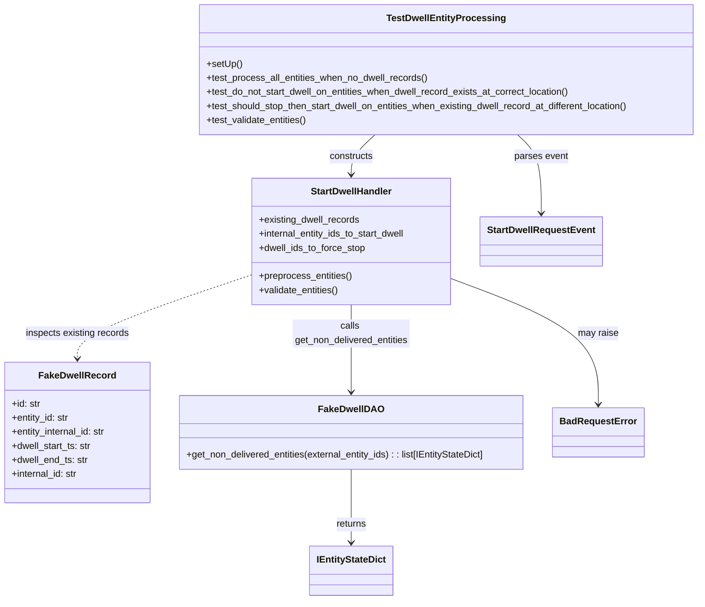

# Diagram: entity_core/entity_service/entity_service_tests/dwell/unit/test_dwell_entity_processing.py


> Auto-generated by Obscura crawlers

## Diagram 1



### SVG

<svg id="container" width="1206.029296875" xmlns="http://www.w3.org/2000/svg" class="classDiagram" height="1024" viewBox="0 0 1206.029296875 1024" role="graphics-document document" aria-roledescription="class"><style>#container{font-family:"trebuchet ms",verdana,arial,sans-serif;font-size:16px;fill:#333;}@keyframes edge-animation-frame{from{stroke-dashoffset:0;}}@keyframes dash{to{stroke-dashoffset:0;}}#container .edge-animation-slow{stroke-dasharray:9,5!important;stroke-dashoffset:900;animation:dash 50s linear infinite;stroke-linecap:round;}#container .edge-animation-fast{stroke-dasharray:9,5!important;stroke-dashoffset:900;animation:dash 20s linear infinite;stroke-linecap:round;}#container .error-icon{fill:#552222;}#container .error-text{fill:#552222;stroke:#552222;}#container .edge-thickness-normal{stroke-width:1px;}#container .edge-thickness-thick{stroke-width:3.5px;}#container .edge-pattern-solid{stroke-dasharray:0;}#container .edge-thickness-invisible{stroke-width:0;fill:none;}#container .edge-pattern-dashed{stroke-dasharray:3;}#container .edge-pattern-dotted{stroke-dasharray:2;}#container .marker{fill:#333333;stroke:#333333;}#container .marker.cross{stroke:#333333;}#container svg{font-family:"trebuchet ms",verdana,arial,sans-serif;font-size:16px;}#container p{margin:0;}#container g.classGroup text{fill:#9370DB;stroke:none;font-family:"trebuchet ms",verdana,arial,sans-serif;font-size:10px;}#container g.classGroup text .title{font-weight:bolder;}#container .nodeLabel,#container .edgeLabel{color:#131300;}#container .edgeLabel .label rect{fill:#ECECFF;}#container .label text{fill:#131300;}#container .labelBkg{background:#ECECFF;}#container .edgeLabel .label span{background:#ECECFF;}#container .classTitle{font-weight:bolder;}#container .node rect,#container .node circle,#container .node ellipse,#container .node polygon,#container .node path{fill:#ECECFF;stroke:#9370DB;stroke-width:1px;}#container .divider{stroke:#9370DB;stroke-width:1;}#container g.clickable{cursor:pointer;}#container g.classGroup rect{fill:#ECECFF;stroke:#9370DB;}#container g.classGroup line{stroke:#9370DB;stroke-width:1;}#container .classLabel .box{stroke:none;stroke-width:0;fill:#ECECFF;opacity:0.5;}#container .classLabel .label{fill:#9370DB;font-size:10px;}#container .relation{stroke:#333333;stroke-width:1;fill:none;}#container .dashed-line{stroke-dasharray:3;}#container .dotted-line{stroke-dasharray:1 2;}#container #compositionStart,#container .composition{fill:#333333!important;stroke:#333333!important;stroke-width:1;}#container #compositionEnd,#container .composition{fill:#333333!important;stroke:#333333!important;stroke-width:1;}#container #dependencyStart,#container .dependency{fill:#333333!important;stroke:#333333!important;stroke-width:1;}#container #dependencyStart,#container .dependency{fill:#333333!important;stroke:#333333!important;stroke-width:1;}#container #extensionStart,#container .extension{fill:transparent!important;stroke:#333333!important;stroke-width:1;}#container #extensionEnd,#container .extension{fill:transparent!important;stroke:#333333!important;stroke-width:1;}#container #aggregationStart,#container .aggregation{fill:transparent!important;stroke:#333333!important;stroke-width:1;}#container #aggregationEnd,#container .aggregation{fill:transparent!important;stroke:#333333!important;stroke-width:1;}#container #lollipopStart,#container .lollipop{fill:#ECECFF!important;stroke:#333333!important;stroke-width:1;}#container #lollipopEnd,#container .lollipop{fill:#ECECFF!important;stroke:#333333!important;stroke-width:1;}#container .edgeTerminals{font-size:11px;line-height:initial;}#container .classTitleText{text-anchor:middle;font-size:18px;fill:#333;}#container .label-icon{display:inline-block;height:1em;overflow:visible;vertical-align:-0.125em;}#container .node .label-icon path{fill:currentColor;stroke:revert;stroke-width:revert;}#container :root{--mermaid-font-family:"trebuchet ms",verdana,arial,sans-serif;}</style><g><defs><marker id="container_class-aggregationStart" class="marker aggregation class" refX="18" refY="7" markerWidth="190" markerHeight="240" orient="auto"><path d="M 18,7 L9,13 L1,7 L9,1 Z"></path></marker></defs><defs><marker id="container_class-aggregationEnd" class="marker aggregation class" refX="1" refY="7" markerWidth="20" markerHeight="28" orient="auto"><path d="M 18,7 L9,13 L1,7 L9,1 Z"></path></marker></defs><defs><marker id="container_class-extensionStart" class="marker extension class" refX="18" refY="7" markerWidth="190" markerHeight="240" orient="auto"><path d="M 1,7 L18,13 V 1 Z"></path></marker></defs><defs><marker id="container_class-extensionEnd" class="marker extension class" refX="1" refY="7" markerWidth="20" markerHeight="28" orient="auto"><path d="M 1,1 V 13 L18,7 Z"></path></marker></defs><defs><marker id="container_class-compositionStart" class="marker composition class" refX="18" refY="7" markerWidth="190" markerHeight="240" orient="auto"><path d="M 18,7 L9,13 L1,7 L9,1 Z"></path></marker></defs><defs><marker id="container_class-compositionEnd" class="marker composition class" refX="1" refY="7" markerWidth="20" markerHeight="28" orient="auto"><path d="M 18,7 L9,13 L1,7 L9,1 Z"></path></marker></defs><defs><marker id="container_class-dependencyStart" class="marker dependency class" refX="6" refY="7" markerWidth="190" markerHeight="240" orient="auto"><path d="M 5,7 L9,13 L1,7 L9,1 Z"></path></marker></defs><defs><marker id="container_class-dependencyEnd" class="marker dependency class" refX="13" refY="7" markerWidth="20" markerHeight="28" orient="auto"><path d="M 18,7 L9,13 L14,7 L9,1 Z"></path></marker></defs><defs><marker id="container_class-lollipopStart" class="marker lollipop class" refX="13" refY="7" markerWidth="190" markerHeight="240" orient="auto"><circle stroke="black" fill="transparent" cx="7" cy="7" r="6"></circle></marker></defs><defs><marker id="container_class-lollipopEnd" class="marker lollipop class" refX="1" refY="7" markerWidth="190" markerHeight="240" orient="auto"><circle stroke="black" fill="transparent" cx="7" cy="7" r="6"></circle></marker></defs><g class="root"><g class="clusters"></g><g class="edgePaths"><path d="M607.035,801L607.035,816.667C607.035,832.333,607.035,863.667,607.035,884.5C607.035,905.333,607.035,915.667,607.035,920.833L607.035,926" id="id_FakeDwellDAO_IEntityStateDict_1" class="edge-thickness-normal edge-pattern-solid relation" style=";;;" data-edge="true" data-et="edge" data-id="id_FakeDwellDAO_IEntityStateDict_1" data-points="W3sieCI6NjA3LjAzNTE1NjI1LCJ5Ijo4MDF9LHsieCI6NjA3LjAzNTE1NjI1LCJ5Ijo4OTV9LHsieCI6NjA3LjAzNTE1NjI1LCJ5Ijo5MzJ9XQ==" marker-end="url(#container_class-dependencyEnd)"></path><path d="M891.003,230L897.765,236.167C904.526,242.333,918.048,254.667,924.809,277C931.57,299.333,931.57,331.667,931.57,347.833L931.57,364" id="id_TestDwellEntityProcessing_StartDwellRequestEvent_2" class="edge-thickness-normal edge-pattern-solid relation" style=";;;" data-edge="true" data-et="edge" data-id="id_TestDwellEntityProcessing_StartDwellRequestEvent_2" data-points="W3sieCI6ODkxLjAwMzQxNzk2ODc1LCJ5IjoyMzB9LHsieCI6OTMxLjU3MDMxMjUsInkiOjI2N30seyJ4Ijo5MzEuNTcwMzEyNSwieSI6MzcwfV0=" marker-end="url(#container_class-dependencyEnd)"></path><path d="M647.602,230L640.841,236.167C634.08,242.333,620.557,254.667,613.796,266C607.035,277.333,607.035,287.667,607.035,292.833L607.035,298" id="id_TestDwellEntityProcessing_StartDwellHandler_3" class="edge-thickness-normal edge-pattern-solid relation" style=";;;" data-edge="true" data-et="edge" data-id="id_TestDwellEntityProcessing_StartDwellHandler_3" data-points="W3sieCI6NjQ3LjYwMjA1MDc4MTI1LCJ5IjoyMzB9LHsieCI6NjA3LjAzNTE1NjI1LCJ5IjoyNjd9LHsieCI6NjA3LjAzNTE1NjI1LCJ5IjozMDR9XQ==" marker-end="url(#container_class-dependencyEnd)"></path><path d="M607.035,520L607.035,528.167C607.035,536.333,607.035,552.667,607.035,577.5C607.035,602.333,607.035,635.667,607.035,652.333L607.035,669" id="id_StartDwellHandler_FakeDwellDAO_4" class="edge-thickness-normal edge-pattern-solid relation" style=";;;" data-edge="true" data-et="edge" data-id="id_StartDwellHandler_FakeDwellDAO_4" data-points="W3sieCI6NjA3LjAzNTE1NjI1LCJ5Ijo1MjB9LHsieCI6NjA3LjAzNTE1NjI1LCJ5Ijo1Njl9LHsieCI6NjA3LjAzNTE1NjI1LCJ5Ijo2NzV9XQ==" marker-end="url(#container_class-dependencyEnd)"></path><path d="M433.305,469.591L383.325,486.159C333.345,502.727,233.385,535.864,183.406,559.599C133.426,583.333,133.426,597.667,133.426,604.833L133.426,612" id="id_StartDwellHandler_FakeDwellRecord_5" class="edge-thickness-normal edge-pattern-dashed relation" style=";;;" data-edge="true" data-et="edge" data-id="id_StartDwellHandler_FakeDwellRecord_5" data-points="W3sieCI6NDMzLjMwNDY4NzUsInkiOjQ2OS41OTEwOTcyOTE0MTI0fSx7IngiOjEzMy40MjU3ODEyNSwieSI6NTY5fSx7IngiOjEzMy40MjU3ODEyNSwieSI6NjE4fV0=" marker-end="url(#container_class-dependencyEnd)"></path><path d="M780.766,476.563L822.221,491.969C863.677,507.375,946.589,538.188,988.044,573.761C1029.5,609.333,1029.5,649.667,1029.5,669.833L1029.5,690" id="id_StartDwellHandler_BadRequestError_6" class="edge-thickness-normal edge-pattern-solid relation" style=";;;" data-edge="true" data-et="edge" data-id="id_StartDwellHandler_BadRequestError_6" data-points="W3sieCI6NzgwLjc2NTYyNSwieSI6NDc2LjU2MzIwMzI5OTA5MTF9LHsieCI6MTAyOS41LCJ5Ijo1Njl9LHsieCI6MTAyOS41LCJ5Ijo2OTZ9XQ==" marker-end="url(#container_class-dependencyEnd)"></path></g><g class="edgeLabels"><g class="edgeLabel" transform="translate(607.03515625, 895)"><g class="label" data-id="id_FakeDwellDAO_IEntityStateDict_1" transform="translate(-26.265625, -12)"><foreignObject width="52.53125" height="24"><div xmlns="http://www.w3.org/1999/xhtml" class="labelBkg" style="display: table-cell; white-space: nowrap; line-height: 1.5; max-width: 200px; text-align: center;"><span class="edgeLabel"><p>returns</p></span></div></foreignObject></g></g><g class="edgeLabel" transform="translate(931.5703125, 267)"><g class="label" data-id="id_TestDwellEntityProcessing_StartDwellRequestEvent_2" transform="translate(-46.1171875, -12)"><foreignObject width="92.234375" height="24"><div xmlns="http://www.w3.org/1999/xhtml" class="labelBkg" style="display: table-cell; white-space: nowrap; line-height: 1.5; max-width: 200px; text-align: center;"><span class="edgeLabel"><p>parses event</p></span></div></foreignObject></g></g><g class="edgeLabel" transform="translate(607.03515625, 267)"><g class="label" data-id="id_TestDwellEntityProcessing_StartDwellHandler_3" transform="translate(-37.84375, -12)"><foreignObject width="75.6875" height="24"><div xmlns="http://www.w3.org/1999/xhtml" class="labelBkg" style="display: table-cell; white-space: nowrap; line-height: 1.5; max-width: 200px; text-align: center;"><span class="edgeLabel"><p>constructs</p></span></div></foreignObject></g></g><g class="edgeLabel" transform="translate(607.03515625, 569)"><g class="label" data-id="id_StartDwellHandler_FakeDwellDAO_4" transform="translate(-100, -24)"><foreignObject width="200" height="48"><div xmlns="http://www.w3.org/1999/xhtml" class="labelBkg" style="display: table; white-space: break-spaces; line-height: 1.5; max-width: 200px; text-align: center; width: 200px;"><span class="edgeLabel"><p>calls get_non_delivered_entities</p></span></div></foreignObject></g></g><g class="edgeLabel" transform="translate(133.42578125, 569)"><g class="label" data-id="id_StartDwellHandler_FakeDwellRecord_5" transform="translate(-89.546875, -12)"><foreignObject width="179.09375" height="24"><div xmlns="http://www.w3.org/1999/xhtml" class="labelBkg" style="display: table-cell; white-space: nowrap; line-height: 1.5; max-width: 200px; text-align: center;"><span class="edgeLabel"><p>inspects existing records</p></span></div></foreignObject></g></g><g class="edgeLabel" transform="translate(1029.5, 569)"><g class="label" data-id="id_StartDwellHandler_BadRequestError_6" transform="translate(-34.65625, -12)"><foreignObject width="69.3125" height="24"><div xmlns="http://www.w3.org/1999/xhtml" class="labelBkg" style="display: table-cell; white-space: nowrap; line-height: 1.5; max-width: 200px; text-align: center;"><span class="edgeLabel"><p>may raise</p></span></div></foreignObject></g></g></g><g class="nodes"><g class="node default" id="classId-FakeDwellRecord-0" transform="translate(133.42578125, 738)"><g class="basic label-container"><path d="M-125.42578125 -120 L125.42578125 -120 L125.42578125 120 L-125.42578125 120" stroke="none" stroke-width="0" fill="#ECECFF" style=""></path><path d="M-125.42578125 -120 C-27.949409837405 -120, 69.52696157519 -120, 125.42578125 -120 M-125.42578125 -120 C-67.8987564484948 -120, -10.371731646989602 -120, 125.42578125 -120 M125.42578125 -120 C125.42578125 -55.649029780974175, 125.42578125 8.70194043805165, 125.42578125 120 M125.42578125 -120 C125.42578125 -34.52337381621298, 125.42578125 50.95325236757404, 125.42578125 120 M125.42578125 120 C55.71014058127041 120, -14.005500087459183 120, -125.42578125 120 M125.42578125 120 C57.37801436773972 120, -10.669752514520553 120, -125.42578125 120 M-125.42578125 120 C-125.42578125 30.291074939722108, -125.42578125 -59.417850120555784, -125.42578125 -120 M-125.42578125 120 C-125.42578125 57.51635006891955, -125.42578125 -4.9672998621609, -125.42578125 -120" stroke="#9370DB" stroke-width="1.3" fill="none" stroke-dasharray="0 0" style=""></path></g><g class="annotation-group text" transform="translate(0, -96)"></g><g class="label-group text" transform="translate(-62.2421875, -96)"><g class="label" style="font-weight: bolder" transform="translate(0,-12)"><foreignObject width="124.484375" height="24"><div xmlns="http://www.w3.org/1999/xhtml" style="display: table-cell; white-space: nowrap; line-height: 1.5; max-width: 172px; text-align: center;"><span class="nodeLabel markdown-node-label" style=""><p>FakeDwellRecord</p></span></div></foreignObject></g></g><g class="members-group text" transform="translate(-113.42578125, -48)"><g class="label" style="" transform="translate(0,-12)"><foreignObject width="49.578125" height="24"><div xmlns="http://www.w3.org/1999/xhtml" style="display: table-cell; white-space: nowrap; line-height: 1.5; max-width: 108px; text-align: center;"><span class="nodeLabel markdown-node-label" style=""><p>+id: str</p></span></div></foreignObject></g><g class="label" style="" transform="translate(0,12)"><foreignObject width="99.375" height="24"><div xmlns="http://www.w3.org/1999/xhtml" style="display: table-cell; white-space: nowrap; line-height: 1.5; max-width: 158px; text-align: center;"><span class="nodeLabel markdown-node-label" style=""><p>+entity_id: str</p></span></div></foreignObject></g><g class="label" style="" transform="translate(0,36)"><foreignObject width="164.609375" height="24"><div xmlns="http://www.w3.org/1999/xhtml" style="display: table-cell; white-space: nowrap; line-height: 1.5; max-width: 223px; text-align: center;"><span class="nodeLabel markdown-node-label" style=""><p>+entity_internal_id: str</p></span></div></foreignObject></g><g class="label" style="" transform="translate(0,60)"><foreignObject width="137.984375" height="24"><div xmlns="http://www.w3.org/1999/xhtml" style="display: table-cell; white-space: nowrap; line-height: 1.5; max-width: 196px; text-align: center;"><span class="nodeLabel markdown-node-label" style=""><p>+dwell_start_ts: str</p></span></div></foreignObject></g><g class="label" style="" transform="translate(0,84)"><foreignObject width="131.546875" height="24"><div xmlns="http://www.w3.org/1999/xhtml" style="display: table-cell; white-space: nowrap; line-height: 1.5; max-width: 190px; text-align: center;"><span class="nodeLabel markdown-node-label" style=""><p>+dwell_end_ts: str</p></span></div></foreignObject></g><g class="label" style="" transform="translate(0,108)"><foreignObject width="114.828125" height="24"><div xmlns="http://www.w3.org/1999/xhtml" style="display: table-cell; white-space: nowrap; line-height: 1.5; max-width: 173px; text-align: center;"><span class="nodeLabel markdown-node-label" style=""><p>+internal_id: str</p></span></div></foreignObject></g></g><g class="methods-group text" transform="translate(-113.42578125, 120)"></g><g class="divider" style=""><path d="M-125.42578125 -72 C-29.25300360951367 -72, 66.91977403097266 -72, 125.42578125 -72 M-125.42578125 -72 C-39.29674561831915 -72, 46.8322900133617 -72, 125.42578125 -72" stroke="#9370DB" stroke-width="1.3" fill="none" stroke-dasharray="0 0" style=""></path></g><g class="divider" style=""><path d="M-125.42578125 96 C-63.94683988978334 96, -2.467898529566682 96, 125.42578125 96 M-125.42578125 96 C-53.75068989641896 96, 17.924401457162077 96, 125.42578125 96" stroke="#9370DB" stroke-width="1.3" fill="none" stroke-dasharray="0 0" style=""></path></g></g><g class="node default" id="classId-FakeDwellDAO-1" transform="translate(607.03515625, 738)"><g class="basic label-container"><path d="M-298.18359375 -63 L298.18359375 -63 L298.18359375 63 L-298.18359375 63" stroke="none" stroke-width="0" fill="#ECECFF" style=""></path><path d="M-298.18359375 -63 C-95.88972473535989 -63, 106.40414427928022 -63, 298.18359375 -63 M-298.18359375 -63 C-167.99263348385034 -63, -37.80167321770068 -63, 298.18359375 -63 M298.18359375 -63 C298.18359375 -28.357630768326125, 298.18359375 6.28473846334775, 298.18359375 63 M298.18359375 -63 C298.18359375 -13.23230019241641, 298.18359375 36.53539961516718, 298.18359375 63 M298.18359375 63 C78.11693485236847 63, -141.94972404526305 63, -298.18359375 63 M298.18359375 63 C74.27493828161357 63, -149.63371718677286 63, -298.18359375 63 M-298.18359375 63 C-298.18359375 36.493787447460015, -298.18359375 9.98757489492003, -298.18359375 -63 M-298.18359375 63 C-298.18359375 21.84946386049721, -298.18359375 -19.30107227900558, -298.18359375 -63" stroke="#9370DB" stroke-width="1.3" fill="none" stroke-dasharray="0 0" style=""></path></g><g class="annotation-group text" transform="translate(0, -39)"></g><g class="label-group text" transform="translate(-52.1953125, -39)"><g class="label" style="font-weight: bolder" transform="translate(0,-12)"><foreignObject width="104.390625" height="24"><div xmlns="http://www.w3.org/1999/xhtml" style="display: table-cell; white-space: nowrap; line-height: 1.5; max-width: 152px; text-align: center;"><span class="nodeLabel markdown-node-label" style=""><p>FakeDwellDAO</p></span></div></foreignObject></g></g><g class="members-group text" transform="translate(-286.18359375, 9)"></g><g class="methods-group text" transform="translate(-286.18359375, 39)"><g class="label" style="" transform="translate(0,-12)"><foreignObject width="520.171875" height="24"><div xmlns="http://www.w3.org/1999/xhtml" style="display: table-cell; white-space: nowrap; line-height: 1.5; max-width: 578px; text-align: center;"><span class="nodeLabel markdown-node-label" style=""><p>+get_non_delivered_entities(external_entity_ids) : : list[IEntityStateDict]</p></span></div></foreignObject></g></g><g class="divider" style=""><path d="M-298.18359375 -15 C-96.93827322524353 -15, 104.30704729951293 -15, 298.18359375 -15 M-298.18359375 -15 C-66.93196452599338 -15, 164.31966469801324 -15, 298.18359375 -15" stroke="#9370DB" stroke-width="1.3" fill="none" stroke-dasharray="0 0" style=""></path></g><g class="divider" style=""><path d="M-298.18359375 9 C-116.41117485145051 9, 65.36124404709898 9, 298.18359375 9 M-298.18359375 9 C-82.55102808194286 9, 133.08153758611428 9, 298.18359375 9" stroke="#9370DB" stroke-width="1.3" fill="none" stroke-dasharray="0 0" style=""></path></g></g><g class="node default" id="classId-StartDwellHandler-2" transform="translate(607.03515625, 412)"><g class="basic label-container"><path d="M-173.73046875 -108 L173.73046875 -108 L173.73046875 108 L-173.73046875 108" stroke="none" stroke-width="0" fill="#ECECFF" style=""></path><path d="M-173.73046875 -108 C-93.44418671764045 -108, -13.157904685280897 -108, 173.73046875 -108 M-173.73046875 -108 C-51.81640900950198 -108, 70.09765073099604 -108, 173.73046875 -108 M173.73046875 -108 C173.73046875 -26.06692314693325, 173.73046875 55.8661537061335, 173.73046875 108 M173.73046875 -108 C173.73046875 -39.288657797412284, 173.73046875 29.42268440517543, 173.73046875 108 M173.73046875 108 C74.03768220417554 108, -25.655104341648922 108, -173.73046875 108 M173.73046875 108 C64.47129333869108 108, -44.78788207261783 108, -173.73046875 108 M-173.73046875 108 C-173.73046875 34.593444461061026, -173.73046875 -38.81311107787795, -173.73046875 -108 M-173.73046875 108 C-173.73046875 61.226350602564935, -173.73046875 14.45270120512987, -173.73046875 -108" stroke="#9370DB" stroke-width="1.3" fill="none" stroke-dasharray="0 0" style=""></path></g><g class="annotation-group text" transform="translate(0, -84)"></g><g class="label-group text" transform="translate(-67.7109375, -84)"><g class="label" style="font-weight: bolder" transform="translate(0,-12)"><foreignObject width="135.421875" height="24"><div xmlns="http://www.w3.org/1999/xhtml" style="display: table-cell; white-space: nowrap; line-height: 1.5; max-width: 184px; text-align: center;"><span class="nodeLabel markdown-node-label" style=""><p>StartDwellHandler</p></span></div></foreignObject></g></g><g class="members-group text" transform="translate(-161.73046875, -36)"><g class="label" style="" transform="translate(0,-12)"><foreignObject width="173.640625" height="24"><div xmlns="http://www.w3.org/1999/xhtml" style="display: table-cell; white-space: nowrap; line-height: 1.5; max-width: 231px; text-align: center;"><span class="nodeLabel markdown-node-label" style=""><p>+existing_dwell_records</p></span></div></foreignObject></g><g class="label" style="" transform="translate(0,12)"><foreignObject width="255.75" height="24"><div xmlns="http://www.w3.org/1999/xhtml" style="display: table-cell; white-space: nowrap; line-height: 1.5; max-width: 313px; text-align: center;"><span class="nodeLabel markdown-node-label" style=""><p>+internal_entity_ids_to_start_dwell</p></span></div></foreignObject></g><g class="label" style="" transform="translate(0,36)"><foreignObject width="183.390625" height="24"><div xmlns="http://www.w3.org/1999/xhtml" style="display: table-cell; white-space: nowrap; line-height: 1.5; max-width: 241px; text-align: center;"><span class="nodeLabel markdown-node-label" style=""><p>+dwell_ids_to_force_stop</p></span></div></foreignObject></g></g><g class="methods-group text" transform="translate(-161.73046875, 60)"><g class="label" style="" transform="translate(0,-12)"><foreignObject width="160.203125" height="24"><div xmlns="http://www.w3.org/1999/xhtml" style="display: table-cell; white-space: nowrap; line-height: 1.5; max-width: 218px; text-align: center;"><span class="nodeLabel markdown-node-label" style=""><p>+preprocess_entities()</p></span></div></foreignObject></g><g class="label" style="" transform="translate(0,12)"><foreignObject width="138.625" height="24"><div xmlns="http://www.w3.org/1999/xhtml" style="display: table-cell; white-space: nowrap; line-height: 1.5; max-width: 196px; text-align: center;"><span class="nodeLabel markdown-node-label" style=""><p>+validate_entities()</p></span></div></foreignObject></g></g><g class="divider" style=""><path d="M-173.73046875 -60 C-100.60980266007188 -60, -27.489136570143756 -60, 173.73046875 -60 M-173.73046875 -60 C-101.13137531122182 -60, -28.532281872443633 -60, 173.73046875 -60" stroke="#9370DB" stroke-width="1.3" fill="none" stroke-dasharray="0 0" style=""></path></g><g class="divider" style=""><path d="M-173.73046875 36 C-87.9950187944386 36, -2.259568838877186 36, 173.73046875 36 M-173.73046875 36 C-100.58564891392223 36, -27.440829077844455 36, 173.73046875 36" stroke="#9370DB" stroke-width="1.3" fill="none" stroke-dasharray="0 0" style=""></path></g></g><g class="node default" id="classId-StartDwellRequestEvent-3" transform="translate(931.5703125, 412)"><g class="basic label-container"><path d="M-100.8046875 -42 L100.8046875 -42 L100.8046875 42 L-100.8046875 42" stroke="none" stroke-width="0" fill="#ECECFF" style=""></path><path d="M-100.8046875 -42 C-57.3227050473814 -42, -13.840722594762795 -42, 100.8046875 -42 M-100.8046875 -42 C-54.26009559745111 -42, -7.715503694902225 -42, 100.8046875 -42 M100.8046875 -42 C100.8046875 -14.29582964484225, 100.8046875 13.4083407103155, 100.8046875 42 M100.8046875 -42 C100.8046875 -22.310037314966564, 100.8046875 -2.6200746299331286, 100.8046875 42 M100.8046875 42 C27.774179979197967 42, -45.256327541604065 42, -100.8046875 42 M100.8046875 42 C52.07760794905861 42, 3.35052839811722 42, -100.8046875 42 M-100.8046875 42 C-100.8046875 24.14522068684912, -100.8046875 6.290441373698243, -100.8046875 -42 M-100.8046875 42 C-100.8046875 16.631477005934272, -100.8046875 -8.737045988131456, -100.8046875 -42" stroke="#9370DB" stroke-width="1.3" fill="none" stroke-dasharray="0 0" style=""></path></g><g class="annotation-group text" transform="translate(0, -18)"></g><g class="label-group text" transform="translate(-88.8046875, -18)"><g class="label" style="font-weight: bolder" transform="translate(0,-12)"><foreignObject width="177.609375" height="24"><div xmlns="http://www.w3.org/1999/xhtml" style="display: table-cell; white-space: nowrap; line-height: 1.5; max-width: 224px; text-align: center;"><span class="nodeLabel markdown-node-label" style=""><p>StartDwellRequestEvent</p></span></div></foreignObject></g></g><g class="members-group text" transform="translate(-88.8046875, 30)"></g><g class="methods-group text" transform="translate(-88.8046875, 60)"></g><g class="divider" style=""><path d="M-100.8046875 6 C-31.97680526251189 6, 36.85107697497622 6, 100.8046875 6 M-100.8046875 6 C-40.175899428414716 6, 20.452888643170567 6, 100.8046875 6" stroke="#9370DB" stroke-width="1.3" fill="none" stroke-dasharray="0 0" style=""></path></g><g class="divider" style=""><path d="M-100.8046875 24 C-59.1502436676734 24, -17.4957998353468 24, 100.8046875 24 M-100.8046875 24 C-56.56397072499332 24, -12.323253949986636 24, 100.8046875 24" stroke="#9370DB" stroke-width="1.3" fill="none" stroke-dasharray="0 0" style=""></path></g></g><g class="node default" id="classId-IEntityStateDict-4" transform="translate(607.03515625, 974)"><g class="basic label-container"><path d="M-69.3203125 -42 L69.3203125 -42 L69.3203125 42 L-69.3203125 42" stroke="none" stroke-width="0" fill="#ECECFF" style=""></path><path d="M-69.3203125 -42 C-33.954692229971435 -42, 1.4109280400571294 -42, 69.3203125 -42 M-69.3203125 -42 C-18.892896277174692 -42, 31.534519945650615 -42, 69.3203125 -42 M69.3203125 -42 C69.3203125 -11.4974461615855, 69.3203125 19.005107676829, 69.3203125 42 M69.3203125 -42 C69.3203125 -16.002095910600598, 69.3203125 9.995808178798804, 69.3203125 42 M69.3203125 42 C37.86680694073558 42, 6.4133013814711575 42, -69.3203125 42 M69.3203125 42 C40.83292493767638 42, 12.345537375352762 42, -69.3203125 42 M-69.3203125 42 C-69.3203125 24.562327065484176, -69.3203125 7.124654130968352, -69.3203125 -42 M-69.3203125 42 C-69.3203125 21.139226475070725, -69.3203125 0.27845295014144966, -69.3203125 -42" stroke="#9370DB" stroke-width="1.3" fill="none" stroke-dasharray="0 0" style=""></path></g><g class="annotation-group text" transform="translate(0, -18)"></g><g class="label-group text" transform="translate(-57.3203125, -18)"><g class="label" style="font-weight: bolder" transform="translate(0,-12)"><foreignObject width="114.640625" height="24"><div xmlns="http://www.w3.org/1999/xhtml" style="display: table-cell; white-space: nowrap; line-height: 1.5; max-width: 162px; text-align: center;"><span class="nodeLabel markdown-node-label" style=""><p>IEntityStateDict</p></span></div></foreignObject></g></g><g class="members-group text" transform="translate(-57.3203125, 30)"></g><g class="methods-group text" transform="translate(-57.3203125, 60)"></g><g class="divider" style=""><path d="M-69.3203125 6 C-22.443087556494845 6, 24.43413738701031 6, 69.3203125 6 M-69.3203125 6 C-27.342393487994052 6, 14.635525524011896 6, 69.3203125 6" stroke="#9370DB" stroke-width="1.3" fill="none" stroke-dasharray="0 0" style=""></path></g><g class="divider" style=""><path d="M-69.3203125 24 C-23.824042217695812 24, 21.672228064608376 24, 69.3203125 24 M-69.3203125 24 C-28.73735463678444 24, 11.845603226431123 24, 69.3203125 24" stroke="#9370DB" stroke-width="1.3" fill="none" stroke-dasharray="0 0" style=""></path></g></g><g class="node default" id="classId-BadRequestError-5" transform="translate(1029.5, 738)"><g class="basic label-container"><path d="M-74.28125 -42 L74.28125 -42 L74.28125 42 L-74.28125 42" stroke="none" stroke-width="0" fill="#ECECFF" style=""></path><path d="M-74.28125 -42 C-29.374372362039587 -42, 15.532505275920826 -42, 74.28125 -42 M-74.28125 -42 C-43.87660287766178 -42, -13.471955755323563 -42, 74.28125 -42 M74.28125 -42 C74.28125 -23.43875693837763, 74.28125 -4.877513876755259, 74.28125 42 M74.28125 -42 C74.28125 -13.735955523348373, 74.28125 14.528088953303254, 74.28125 42 M74.28125 42 C41.51204115781213 42, 8.742832315624256 42, -74.28125 42 M74.28125 42 C19.55238270131961 42, -35.17648459736078 42, -74.28125 42 M-74.28125 42 C-74.28125 10.387894299687737, -74.28125 -21.224211400624526, -74.28125 -42 M-74.28125 42 C-74.28125 15.13253764589479, -74.28125 -11.734924708210421, -74.28125 -42" stroke="#9370DB" stroke-width="1.3" fill="none" stroke-dasharray="0 0" style=""></path></g><g class="annotation-group text" transform="translate(0, -18)"></g><g class="label-group text" transform="translate(-62.28125, -18)"><g class="label" style="font-weight: bolder" transform="translate(0,-12)"><foreignObject width="124.5625" height="24"><div xmlns="http://www.w3.org/1999/xhtml" style="display: table-cell; white-space: nowrap; line-height: 1.5; max-width: 174px; text-align: center;"><span class="nodeLabel markdown-node-label" style=""><p>BadRequestError</p></span></div></foreignObject></g></g><g class="members-group text" transform="translate(-62.28125, 30)"></g><g class="methods-group text" transform="translate(-62.28125, 60)"></g><g class="divider" style=""><path d="M-74.28125 6 C-19.425506800444374 6, 35.43023639911125 6, 74.28125 6 M-74.28125 6 C-31.006560133382017 6, 12.268129733235966 6, 74.28125 6" stroke="#9370DB" stroke-width="1.3" fill="none" stroke-dasharray="0 0" style=""></path></g><g class="divider" style=""><path d="M-74.28125 24 C-17.124217521441985 24, 40.03281495711603 24, 74.28125 24 M-74.28125 24 C-16.872896957958794 24, 40.53545608408241 24, 74.28125 24" stroke="#9370DB" stroke-width="1.3" fill="none" stroke-dasharray="0 0" style=""></path></g></g><g class="node default" id="classId-TestDwellEntityProcessing-6" transform="translate(769.302734375, 119)"><g class="basic label-container"><path d="M-428.7265625 -111 L428.7265625 -111 L428.7265625 111 L-428.7265625 111" stroke="none" stroke-width="0" fill="#ECECFF" style=""></path><path d="M-428.7265625 -111 C-144.6535025358719 -111, 139.4195574282562 -111, 428.7265625 -111 M-428.7265625 -111 C-153.61455786716795 -111, 121.49744676566411 -111, 428.7265625 -111 M428.7265625 -111 C428.7265625 -40.49809047527614, 428.7265625 30.003819049447713, 428.7265625 111 M428.7265625 -111 C428.7265625 -26.895237079229474, 428.7265625 57.20952584154105, 428.7265625 111 M428.7265625 111 C177.4709465828333 111, -73.78466933433339 111, -428.7265625 111 M428.7265625 111 C249.4687161028017 111, 70.21086970560339 111, -428.7265625 111 M-428.7265625 111 C-428.7265625 38.009203096936204, -428.7265625 -34.98159380612759, -428.7265625 -111 M-428.7265625 111 C-428.7265625 34.334111137883184, -428.7265625 -42.33177772423363, -428.7265625 -111" stroke="#9370DB" stroke-width="1.3" fill="none" stroke-dasharray="0 0" style=""></path></g><g class="annotation-group text" transform="translate(0, -87)"></g><g class="label-group text" transform="translate(-96.21875, -87)"><g class="label" style="font-weight: bolder" transform="translate(0,-12)"><foreignObject width="192.4375" height="24"><div xmlns="http://www.w3.org/1999/xhtml" style="display: table-cell; white-space: nowrap; line-height: 1.5; max-width: 239px; text-align: center;"><span class="nodeLabel markdown-node-label" style=""><p>TestDwellEntityProcessing</p></span></div></foreignObject></g></g><g class="members-group text" transform="translate(-416.7265625, -39)"></g><g class="methods-group text" transform="translate(-416.7265625, -9)"><g class="label" style="" transform="translate(0,-12)"><foreignObject width="60.421875" height="24"><div xmlns="http://www.w3.org/1999/xhtml" style="display: table-cell; white-space: nowrap; line-height: 1.5; max-width: 118px; text-align: center;"><span class="nodeLabel markdown-node-label" style=""><p>+setUp()</p></span></div></foreignObject></g><g class="label" style="" transform="translate(0,12)"><foreignObject width="380.5625" height="24"><div xmlns="http://www.w3.org/1999/xhtml" style="display: table-cell; white-space: nowrap; line-height: 1.5; max-width: 438px; text-align: center;"><span class="nodeLabel markdown-node-label" style=""><p>+test_process_all_entities_when_no_dwell_records()</p></span></div></foreignObject></g><g class="label" style="" transform="translate(0,36)"><foreignObject width="630.1875" height="24"><div xmlns="http://www.w3.org/1999/xhtml" style="display: table-cell; white-space: nowrap; line-height: 1.5; max-width: 688px; text-align: center;"><span class="nodeLabel markdown-node-label" style=""><p>+test_do_not_start_dwell_on_entities_when_dwell_record_exists_at_correct_location()</p></span></div></foreignObject></g><g class="label" style="" transform="translate(0,60)"><foreignObject width="737.234375" height="24"><div xmlns="http://www.w3.org/1999/xhtml" style="display: table-cell; white-space: nowrap; line-height: 1.5; max-width: 795px; text-align: center;"><span class="nodeLabel markdown-node-label" style=""><p>+test_should_stop_then_start_dwell_on_entities_when_existing_dwell_record_at_different_location()</p></span></div></foreignObject></g><g class="label" style="" transform="translate(0,84)"><foreignObject width="174.0625" height="24"><div xmlns="http://www.w3.org/1999/xhtml" style="display: table-cell; white-space: nowrap; line-height: 1.5; max-width: 231px; text-align: center;"><span class="nodeLabel markdown-node-label" style=""><p>+test_validate_entities()</p></span></div></foreignObject></g></g><g class="divider" style=""><path d="M-428.7265625 -63 C-148.81874303366374 -63, 131.08907643267253 -63, 428.7265625 -63 M-428.7265625 -63 C-124.2223065613756 -63, 180.2819493772488 -63, 428.7265625 -63" stroke="#9370DB" stroke-width="1.3" fill="none" stroke-dasharray="0 0" style=""></path></g><g class="divider" style=""><path d="M-428.7265625 -39 C-119.67334746230136 -39, 189.37986757539727 -39, 428.7265625 -39 M-428.7265625 -39 C-256.11177181939706 -39, -83.49698113879413 -39, 428.7265625 -39" stroke="#9370DB" stroke-width="1.3" fill="none" stroke-dasharray="0 0" style=""></path></g></g></g></g></g></svg>

## Diagram 2

```mermaid
sequenceDiagram
    participant Test as TestDwellEntityProcessing
    participant Req as StartDwellRequestEvent
    participant Handler as StartDwellHandler
    participant DAO as FakeDwellDAO
    Test->>Req: parse_event(fake_event)
    Test->>Handler: StartDwellHandler(request, FakeDwellDAO)
    Handler->>DAO: get_non_delivered_entities(["ABC","DEF","GHI"])
    DAO-->>Handler: [IEntityStateDict("0","ABC","Active"), IEntityStateDict("1","DEF","Active"), IEntityStateDict("2","GHI","Active")]
    Handler->>Handler: preprocess_entities()
    alt no existing_dwell_records
        Handler-->>Test: internal_entity_ids_to_start_dwell = ["0","1","2"]
    else existing_dwell_at_same_location
        Handler-->>Test: internal_entity_ids_to_start_dwell = ["0","2"]
    else existing_dwell_different_location
        Handler-->>Test: dwell_ids_to_force_stop = ["5"]
        Handler-->>Test: internal_entity_ids_to_start_dwell = ["0","1","2"]
    end
    Test->>Handler: validate_entities()
    alt DAO returns empty
        Handler-->>Test: raise BadRequestError("No valid entities provided to start the dwell")
    else valid entities
        Handler-->>Test: proceed
```

> SVG rendering failed for this diagram.

## Diagram 3

```mermaid
flowchart TD
    Setup[setUp: build request & handler with FakeDwellDAO] --> Query[get_non_delivered_entities]
    Query --> Check{existing_dwell_records?}
    Check -- none --> StartAll[Start dwell for all entities<br/>internal_entity_ids_to_start_dwell = ["0","1","2"]]
    Check -- same_location --> SkipEntity[Skip entity with same location<br/>internal_entity_ids_to_start_dwell = ["0","2"]]
    Check -- different_location --> ForceStop[Force stop existing dwell ids = ["5"]<br/>Then start all -> ["0","1","2"]]
    Validate[validate_entities()] --> ValidCheck{DAO returned entities?}
    ValidCheck -- no --> Error[BadRequestError: "No valid entities provided to start the dwell"]
    ValidCheck -- yes --> OK[Entities valid -> proceed]
```

> SVG rendering failed for this diagram.
