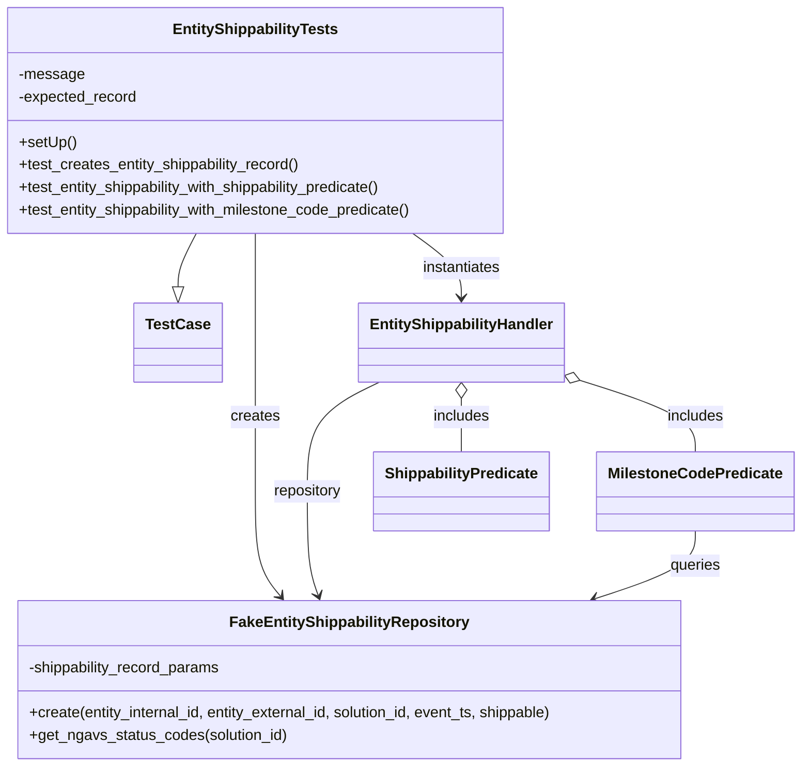
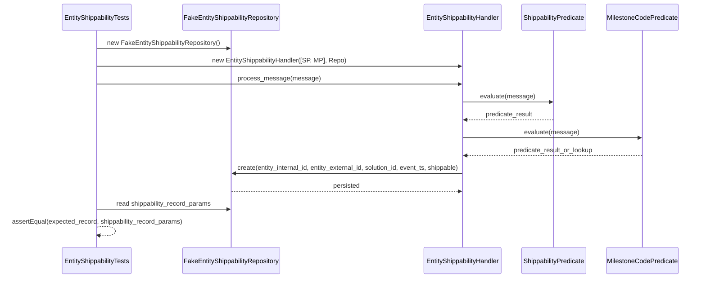

# Diagram: entity_core/entity_service/entity_service_tests/entity_shippability_tests/test_entity_shippability.py

> Auto-generated by Obscura crawlers

## Diagram 1

### SVG

<svg id="container" width="846.05859375" xmlns="http://www.w3.org/2000/svg" class="classDiagram" height="814" viewBox="0 0 846.05859375 814" role="graphics-document document" aria-roledescription="class"><g><defs><marker id="container_class-aggregationStart" class="marker aggregation class" refX="18" refY="7" markerWidth="190" markerHeight="240" orient="auto"><path d="M 18,7 L9,13 L1,7 L9,1 Z"></path></marker></defs><defs><marker id="container_class-aggregationEnd" class="marker aggregation class" refX="1" refY="7" markerWidth="20" markerHeight="28" orient="auto"><path d="M 18,7 L9,13 L1,7 L9,1 Z"></path></marker></defs><defs><marker id="container_class-extensionStart" class="marker extension class" refX="18" refY="7" markerWidth="190" markerHeight="240" orient="auto"><path d="M 1,7 L18,13 V 1 Z"></path></marker></defs><defs><marker id="container_class-extensionEnd" class="marker extension class" refX="1" refY="7" markerWidth="20" markerHeight="28" orient="auto"><path d="M 1,1 V 13 L18,7 Z"></path></marker></defs><defs><marker id="container_class-compositionStart" class="marker composition class" refX="18" refY="7" markerWidth="190" markerHeight="240" orient="auto"><path d="M 18,7 L9,13 L1,7 L9,1 Z"></path></marker></defs><defs><marker id="container_class-compositionEnd" class="marker composition class" refX="1" refY="7" markerWidth="20" markerHeight="28" orient="auto"><path d="M 18,7 L9,13 L1,7 L9,1 Z"></path></marker></defs><defs><marker id="container_class-dependencyStart" class="marker dependency class" refX="6" refY="7" markerWidth="190" markerHeight="240" orient="auto"><path d="M 5,7 L9,13 L1,7 L9,1 Z"></path></marker></defs><defs><marker id="container_class-dependencyEnd" class="marker dependency class" refX="13" refY="7" markerWidth="20" markerHeight="28" orient="auto"><path d="M 18,7 L9,13 L14,7 L9,1 Z"></path></marker></defs><defs><marker id="container_class-lollipopStart" class="marker lollipop class" refX="13" refY="7" markerWidth="190" markerHeight="240" orient="auto"><circle stroke="black" fill="transparent" cx="7" cy="7" r="6"></circle></marker></defs><defs><marker id="container_class-lollipopEnd" class="marker lollipop class" refX="1" refY="7" markerWidth="190" markerHeight="240" orient="auto"><circle stroke="black" fill="transparent" cx="7" cy="7" r="6"></circle></marker></defs><g class="root"><g class="clusters"></g><g class="edgePaths"><path d="M215.292,248L212.175,254.167C209.058,260.333,202.824,272.667,199.707,282.125C196.59,291.583,196.59,298.167,196.59,301.458L196.59,304.75" id="id_EntityShippabilityTests_TestCase_1" class="edge-thickness-normal edge-pattern-solid relation" style=";;;" data-edge="true" data-et="edge" data-id="id_EntityShippabilityTests_TestCase_1" data-points="W3sieCI6MjE1LjI5MjM3MTYxNjI0MjA0LCJ5IjoyNDh9LHsieCI6MTk2LjU4OTg0Mzc1LCJ5IjoyODV9LHsieCI6MTk2LjU4OTg0Mzc1LCJ5IjozMjJ9XQ==" marker-end="url(#container_class-extensionEnd)"></path><path d="M275.949,248L275.949,254.167C275.949,260.333,275.949,272.667,275.949,292C275.949,311.333,275.949,337.667,275.949,364C275.949,390.333,275.949,416.667,275.949,443C275.949,469.333,275.949,495.667,275.949,522C275.949,548.333,275.949,574.667,280.376,593.227C284.803,611.787,293.657,622.575,298.084,627.968L302.511,633.362" id="id_EntityShippabilityTests_FakeEntityShippabilityRepository_2" class="edge-thickness-normal edge-pattern-solid relation" style=";;;" data-edge="true" data-et="edge" data-id="id_EntityShippabilityTests_FakeEntityShippabilityRepository_2" data-points="W3sieCI6Mjc1Ljk0OTIxODc1LCJ5IjoyNDh9LHsieCI6Mjc1Ljk0OTIxODc1LCJ5IjoyODV9LHsieCI6Mjc1Ljk0OTIxODc1LCJ5IjozNjR9LHsieCI6Mjc1Ljk0OTIxODc1LCJ5Ijo0NDN9LHsieCI6Mjc1Ljk0OTIxODc1LCJ5Ijo1MjJ9LHsieCI6Mjc1Ljk0OTIxODc1LCJ5Ijo2MDF9LHsieCI6MzA2LjMxNzUwMzg3Mzk2NjksInkiOjYzOH1d" marker-end="url(#container_class-dependencyEnd)"></path><path d="M444.048,248L452.687,254.167C461.325,260.333,478.602,272.667,487.24,284C495.879,295.333,495.879,305.667,495.879,310.833L495.879,316" id="id_EntityShippabilityTests_EntityShippabilityHandler_3" class="edge-thickness-normal edge-pattern-solid relation" style=";;;" data-edge="true" data-et="edge" data-id="id_EntityShippabilityTests_EntityShippabilityHandler_3" data-points="W3sieCI6NDQ0LjA0ODM0Mjk1MzgyMTY1LCJ5IjoyNDh9LHsieCI6NDk1Ljg3ODkwNjI1LCJ5IjoyODV9LHsieCI6NDk1Ljg3ODkwNjI1LCJ5IjozMjJ9XQ==" marker-end="url(#container_class-dependencyEnd)"></path><path d="M409.308,406L396.597,412.167C383.886,418.333,358.465,430.667,345.754,450C333.043,469.333,333.043,495.667,333.043,522C333.043,548.333,333.043,574.667,334.865,593.056C336.687,611.445,340.332,621.89,342.154,627.112L343.976,632.335" id="id_EntityShippabilityHandler_FakeEntityShippabilityRepository_4" class="edge-thickness-normal edge-pattern-solid relation" style=";;;" data-edge="true" data-et="edge" data-id="id_EntityShippabilityHandler_FakeEntityShippabilityRepository_4" data-points="W3sieCI6NDA5LjMwNzkwMTUwMzE2NDU0LCJ5Ijo0MDZ9LHsieCI6MzMzLjA0Mjk2ODc1LCJ5Ijo0NDN9LHsieCI6MzMzLjA0Mjk2ODc1LCJ5Ijo1MjJ9LHsieCI6MzMzLjA0Mjk2ODc1LCJ5Ijo2MDF9LHsieCI6MzQ1Ljk1MjgzNDQ1MjQ3OTM1LCJ5Ijo2Mzh9XQ==" marker-end="url(#container_class-dependencyEnd)"></path><path d="M495.879,423.25L495.879,426.542C495.879,429.833,495.879,436.417,495.879,445.875C495.879,455.333,495.879,467.667,495.879,473.833L495.879,480" id="id_EntityShippabilityHandler_ShippabilityPredicate_5" class="edge-thickness-normal edge-pattern-solid relation" style=";;;" data-edge="true" data-et="edge" data-id="id_EntityShippabilityHandler_ShippabilityPredicate_5" data-points="W3sieCI6NDk1Ljg3ODkwNjI1LCJ5Ijo0MDZ9LHsieCI6NDk1Ljg3ODkwNjI1LCJ5Ijo0NDN9LHsieCI6NDk1Ljg3ODkwNjI1LCJ5Ijo0ODB9XQ==" marker-start="url(#container_class-aggregationStart)"></path><path d="M618.805,404.218L638.561,410.682C658.317,417.146,697.828,430.073,717.584,442.703C737.34,455.333,737.34,467.667,737.34,473.833L737.34,480" id="id_EntityShippabilityHandler_MilestoneCodePredicate_6" class="edge-thickness-normal edge-pattern-solid relation" style=";;;" data-edge="true" data-et="edge" data-id="id_EntityShippabilityHandler_MilestoneCodePredicate_6" data-points="W3sieCI6NjAyLjQxMDE1NjI1LCJ5IjozOTguODU0MzY5NTYwMjkzOH0seyJ4Ijo3MzcuMzM5ODQzNzUsInkiOjQ0M30seyJ4Ijo3MzcuMzM5ODQzNzUsInkiOjQ4MH1d" marker-start="url(#container_class-aggregationStart)"></path><path d="M737.34,564L737.34,570.167C737.34,576.333,737.34,588.667,719.835,600.683C702.331,612.699,667.322,624.399,649.817,630.249L632.312,636.098" id="id_MilestoneCodePredicate_FakeEntityShippabilityRepository_7" class="edge-thickness-normal edge-pattern-solid relation" style=";;;" data-edge="true" data-et="edge" data-id="id_MilestoneCodePredicate_FakeEntityShippabilityRepository_7" data-points="W3sieCI6NzM3LjMzOTg0Mzc1LCJ5Ijo1NjR9LHsieCI6NzM3LjMzOTg0Mzc1LCJ5Ijo2MDF9LHsieCI6NjI2LjYyMTczOTQxMTE1NywieSI6NjM4fV0=" marker-end="url(#container_class-dependencyEnd)"></path></g><g class="edgeLabels"><g class="edgeLabel"><g class="label" data-id="id_EntityShippabilityTests_TestCase_1" transform="translate(0, 0)"><foreignObject width="0" height="0">

</foreignObject></g></g><g class="edgeLabel" transform="translate(275.94921875, 443)"><g class="label" data-id="id_EntityShippabilityTests_FakeEntityShippabilityRepository_2" transform="translate(-26.171875, -12)"><foreignObject width="52.34375" height="24">

creates

</foreignObject></g></g><g class="edgeLabel" transform="translate(495.87890625, 285)"><g class="label" data-id="id_EntityShippabilityTests_EntityShippabilityHandler_3" transform="translate(-42.9140625, -12)"><foreignObject width="85.828125" height="24">

instantiates

</foreignObject></g></g><g class="edgeLabel" transform="translate(333.04296875, 522)"><g class="label" data-id="id_EntityShippabilityHandler_FakeEntityShippabilityRepository_4" transform="translate(-37.09375, -12)"><foreignObject width="74.1875" height="24">

repository

</foreignObject></g></g><g class="edgeLabel" transform="translate(495.87890625, 443)"><g class="label" data-id="id_EntityShippabilityHandler_ShippabilityPredicate_5" transform="translate(-30.6484375, -12)"><foreignObject width="61.296875" height="24">

includes

</foreignObject></g></g><g class="edgeLabel" transform="translate(737.33984375, 443)"><g class="label" data-id="id_EntityShippabilityHandler_MilestoneCodePredicate_6" transform="translate(-30.6484375, -12)"><foreignObject width="61.296875" height="24">

includes

</foreignObject></g></g><g class="edgeLabel" transform="translate(737.33984375, 601)"><g class="label" data-id="id_MilestoneCodePredicate_FakeEntityShippabilityRepository_7" transform="translate(-27.2421875, -12)"><foreignObject width="54.484375" height="24">

queries

</foreignObject></g></g></g><g class="nodes"><g class="node default" id="classId-TestCase-0" transform="translate(196.58984375, 364)"><g class="basic label-container"><path d="M-44.359375 -42 L44.359375 -42 L44.359375 42 L-44.359375 42" stroke="none" stroke-width="0" fill="#ECECFF" style=""></path><path d="M-44.359375 -42 C-13.726216816864039 -42, 16.906941366271923 -42, 44.359375 -42 M-44.359375 -42 C-16.10570779082324 -42, 12.147959418353523 -42, 44.359375 -42 M44.359375 -42 C44.359375 -14.707789329589382, 44.359375 12.584421340821237, 44.359375 42 M44.359375 -42 C44.359375 -19.8456920435364, 44.359375 2.308615912927202, 44.359375 42 M44.359375 42 C23.36032528422049 42, 2.3612755684409805 42, -44.359375 42 M44.359375 42 C18.386592651835137 42, -7.5861896963297255 42, -44.359375 42 M-44.359375 42 C-44.359375 18.137315934388607, -44.359375 -5.725368131222787, -44.359375 -42 M-44.359375 42 C-44.359375 12.244108917930703, -44.359375 -17.511782164138594, -44.359375 -42" stroke="#9370DB" stroke-width="1.3" fill="none" stroke-dasharray="0 0" style=""></path></g><g class="annotation-group text" transform="translate(0, -18)"></g><g class="label-group text" transform="translate(-32.359375, -18)"><g class="label" style="font-weight: bolder" transform="translate(0,-12)"><foreignObject width="64.71875" height="24">

TestCase

</foreignObject></g></g><g class="members-group text" transform="translate(-32.359375, 30)"></g><g class="methods-group text" transform="translate(-32.359375, 60)"></g><g class="divider" style=""><path d="M-44.359375 6 C-21.50664387293013 6, 1.3460872541397393 6, 44.359375 6 M-44.359375 6 C-21.968117779197197 6, 0.42313944160560624 6, 44.359375 6" stroke="#9370DB" stroke-width="1.3" fill="none" stroke-dasharray="0 0" style=""></path></g><g class="divider" style=""><path d="M-44.359375 24 C-26.28234242839384 24, -8.205309856787679 24, 44.359375 24 M-44.359375 24 C-14.055552552906867 24, 16.248269894186265 24, 44.359375 24" stroke="#9370DB" stroke-width="1.3" fill="none" stroke-dasharray="0 0" style=""></path></g></g><g class="node default" id="classId-EntityShippabilityTests-1" transform="translate(275.94921875, 128)"><g class="basic label-container"><path d="M-267.94921875 -120 L267.94921875 -120 L267.94921875 120 L-267.94921875 120" stroke="none" stroke-width="0" fill="#ECECFF" style=""></path><path d="M-267.94921875 -120 C-145.6153586360466 -120, -23.281498522093187 -120, 267.94921875 -120 M-267.94921875 -120 C-59.389468217191336 -120, 149.17028231561733 -120, 267.94921875 -120 M267.94921875 -120 C267.94921875 -46.25801678218964, 267.94921875 27.483966435620715, 267.94921875 120 M267.94921875 -120 C267.94921875 -55.92589130934813, 267.94921875 8.148217381303738, 267.94921875 120 M267.94921875 120 C98.2852061061808 120, -71.37880653763841 120, -267.94921875 120 M267.94921875 120 C146.82038101820382 120, 25.691543286407665 120, -267.94921875 120 M-267.94921875 120 C-267.94921875 59.20750876973805, -267.94921875 -1.5849824605239036, -267.94921875 -120 M-267.94921875 120 C-267.94921875 64.24966211634444, -267.94921875 8.499324232688878, -267.94921875 -120" stroke="#9370DB" stroke-width="1.3" fill="none" stroke-dasharray="0 0" style=""></path></g><g class="annotation-group text" transform="translate(0, -96)"></g><g class="label-group text" transform="translate(-84.5546875, -96)"><g class="label" style="font-weight: bolder" transform="translate(0,-12)"><foreignObject width="169.109375" height="24">

EntityShippabilityTests

</foreignObject></g></g><g class="members-group text" transform="translate(-255.94921875, -48)"><g class="label" style="" transform="translate(0,-12)"><foreignObject width="68.84375" height="24">

-message

</foreignObject></g><g class="label" style="" transform="translate(0,12)"><foreignObject width="127.15625" height="24">

-expected_record

</foreignObject></g></g><g class="methods-group text" transform="translate(-255.94921875, 24)"><g class="label" style="" transform="translate(0,-12)"><foreignObject width="60.421875" height="24">

+setUp()

</foreignObject></g><g class="label" style="" transform="translate(0,12)"><foreignObject width="303.484375" height="24">

+test_creates_entity_shippability_record()

</foreignObject></g><g class="label" style="" transform="translate(0,36)"><foreignObject width="398.234375" height="24">

+test_entity_shippability_with_shippability_predicate()

</foreignObject></g><g class="label" style="" transform="translate(0,60)"><foreignObject width="427.34375" height="24">

+test_entity_shippability_with_milestone_code_predicate()

</foreignObject></g></g><g class="divider" style=""><path d="M-267.94921875 -72 C-76.63746537652946 -72, 114.67428799694108 -72, 267.94921875 -72 M-267.94921875 -72 C-66.53691142707257 -72, 134.87539589585487 -72, 267.94921875 -72" stroke="#9370DB" stroke-width="1.3" fill="none" stroke-dasharray="0 0" style=""></path></g><g class="divider" style=""><path d="M-267.94921875 0 C-58.22357960480838 0, 151.50205954038324 0, 267.94921875 0 M-267.94921875 0 C-92.52404034030334 0, 82.90113806939331 0, 267.94921875 0" stroke="#9370DB" stroke-width="1.3" fill="none" stroke-dasharray="0 0" style=""></path></g></g><g class="node default" id="classId-FakeEntityShippabilityRepository-2" transform="translate(375.26171875, 722)"><g class="basic label-container"><path d="M-358.60546875 -84 L358.60546875 -84 L358.60546875 84 L-358.60546875 84" stroke="none" stroke-width="0" fill="#ECECFF" style=""></path><path d="M-358.60546875 -84 C-80.61129517238294 -84, 197.38287840523412 -84, 358.60546875 -84 M-358.60546875 -84 C-166.76267753048384 -84, 25.080113689032316 -84, 358.60546875 -84 M358.60546875 -84 C358.60546875 -35.59930076129256, 358.60546875 12.801398477414878, 358.60546875 84 M358.60546875 -84 C358.60546875 -23.705861236449223, 358.60546875 36.58827752710155, 358.60546875 84 M358.60546875 84 C124.28551788190484 84, -110.03443298619032 84, -358.60546875 84 M358.60546875 84 C108.10074059821636 84, -142.40398755356728 84, -358.60546875 84 M-358.60546875 84 C-358.60546875 25.065259750474283, -358.60546875 -33.869480499051434, -358.60546875 -84 M-358.60546875 84 C-358.60546875 17.00738651466422, -358.60546875 -49.98522697067156, -358.60546875 -84" stroke="#9370DB" stroke-width="1.3" fill="none" stroke-dasharray="0 0" style=""></path></g><g class="annotation-group text" transform="translate(0, -60)"></g><g class="label-group text" transform="translate(-121.7421875, -60)"><g class="label" style="font-weight: bolder" transform="translate(0,-12)"><foreignObject width="243.484375" height="24">

FakeEntityShippabilityRepository

</foreignObject></g></g><g class="members-group text" transform="translate(-346.60546875, -12)"><g class="label" style="" transform="translate(0,-12)"><foreignObject width="208.21875" height="24">

-shippability_record_params

</foreignObject></g></g><g class="methods-group text" transform="translate(-346.60546875, 36)"><g class="label" style="" transform="translate(0,-12)"><foreignObject width="571.46875" height="24">

+create(entity_internal_id, entity_external_id, solution_id, event_ts, shippable)

</foreignObject></g><g class="label" style="" transform="translate(0,12)"><foreignObject width="275.0625" height="24">

+get_ngavs_status_codes(solution_id)

</foreignObject></g></g><g class="divider" style=""><path d="M-358.60546875 -36 C-176.0668677277435 -36, 6.471733294513001 -36, 358.60546875 -36 M-358.60546875 -36 C-114.15087316397461 -36, 130.30372242205078 -36, 358.60546875 -36" stroke="#9370DB" stroke-width="1.3" fill="none" stroke-dasharray="0 0" style=""></path></g><g class="divider" style=""><path d="M-358.60546875 12 C-159.9532713974432 12, 38.69892595511362 12, 358.60546875 12 M-358.60546875 12 C-132.42509350647674 12, 93.75528173704652 12, 358.60546875 12" stroke="#9370DB" stroke-width="1.3" fill="none" stroke-dasharray="0 0" style=""></path></g></g><g class="node default" id="classId-EntityShippabilityHandler-3" transform="translate(495.87890625, 364)"><g class="basic label-container"><path d="M-106.53125 -42 L106.53125 -42 L106.53125 42 L-106.53125 42" stroke="none" stroke-width="0" fill="#ECECFF" style=""></path><path d="M-106.53125 -42 C-61.28017357710904 -42, -16.02909715421808 -42, 106.53125 -42 M-106.53125 -42 C-39.899318306978074 -42, 26.73261338604385 -42, 106.53125 -42 M106.53125 -42 C106.53125 -19.408582099075172, 106.53125 3.182835801849656, 106.53125 42 M106.53125 -42 C106.53125 -8.488703140831014, 106.53125 25.022593718337973, 106.53125 42 M106.53125 42 C50.76950966201957 42, -4.992230675960855 42, -106.53125 42 M106.53125 42 C39.063876351071755 42, -28.40349729785649 42, -106.53125 42 M-106.53125 42 C-106.53125 21.819985119182014, -106.53125 1.6399702383640289, -106.53125 -42 M-106.53125 42 C-106.53125 9.653583907560986, -106.53125 -22.69283218487803, -106.53125 -42" stroke="#9370DB" stroke-width="1.3" fill="none" stroke-dasharray="0 0" style=""></path></g><g class="annotation-group text" transform="translate(0, -18)"></g><g class="label-group text" transform="translate(-94.53125, -18)"><g class="label" style="font-weight: bolder" transform="translate(0,-12)"><foreignObject width="189.0625" height="24">

EntityShippabilityHandler

</foreignObject></g></g><g class="members-group text" transform="translate(-94.53125, 30)"></g><g class="methods-group text" transform="translate(-94.53125, 60)"></g><g class="divider" style=""><path d="M-106.53125 6 C-51.36035692611972 6, 3.8105361477605584 6, 106.53125 6 M-106.53125 6 C-42.286118031140646 6, 21.95901393771871 6, 106.53125 6" stroke="#9370DB" stroke-width="1.3" fill="none" stroke-dasharray="0 0" style=""></path></g><g class="divider" style=""><path d="M-106.53125 24 C-43.89486401646938 24, 18.741521967061246 24, 106.53125 24 M-106.53125 24 C-47.58199694948673 24, 11.367256101026541 24, 106.53125 24" stroke="#9370DB" stroke-width="1.3" fill="none" stroke-dasharray="0 0" style=""></path></g></g><g class="node default" id="classId-ShippabilityPredicate-4" transform="translate(495.87890625, 522)"><g class="basic label-container"><path d="M-90.7421875 -42 L90.7421875 -42 L90.7421875 42 L-90.7421875 42" stroke="none" stroke-width="0" fill="#ECECFF" style=""></path><path d="M-90.7421875 -42 C-31.295793664543183 -42, 28.150600170913634 -42, 90.7421875 -42 M-90.7421875 -42 C-48.968866334255374 -42, -7.195545168510748 -42, 90.7421875 -42 M90.7421875 -42 C90.7421875 -11.805608718236595, 90.7421875 18.38878256352681, 90.7421875 42 M90.7421875 -42 C90.7421875 -19.291481081494265, 90.7421875 3.4170378370114705, 90.7421875 42 M90.7421875 42 C50.13426802683971 42, 9.526348553679426 42, -90.7421875 42 M90.7421875 42 C47.7553596125037 42, 4.768531725007406 42, -90.7421875 42 M-90.7421875 42 C-90.7421875 12.102043312821301, -90.7421875 -17.795913374357397, -90.7421875 -42 M-90.7421875 42 C-90.7421875 22.071631382876017, -90.7421875 2.1432627657520342, -90.7421875 -42" stroke="#9370DB" stroke-width="1.3" fill="none" stroke-dasharray="0 0" style=""></path></g><g class="annotation-group text" transform="translate(0, -18)"></g><g class="label-group text" transform="translate(-78.7421875, -18)"><g class="label" style="font-weight: bolder" transform="translate(0,-12)"><foreignObject width="157.484375" height="24">

ShippabilityPredicate

</foreignObject></g></g><g class="members-group text" transform="translate(-78.7421875, 30)"></g><g class="methods-group text" transform="translate(-78.7421875, 60)"></g><g class="divider" style=""><path d="M-90.7421875 6 C-49.726635253175004 6, -8.711083006350009 6, 90.7421875 6 M-90.7421875 6 C-42.905055587513644 6, 4.932076324972712 6, 90.7421875 6" stroke="#9370DB" stroke-width="1.3" fill="none" stroke-dasharray="0 0" style=""></path></g><g class="divider" style=""><path d="M-90.7421875 24 C-49.624599136490396 24, -8.507010772980792 24, 90.7421875 24 M-90.7421875 24 C-34.613487157265105 24, 21.51521318546979 24, 90.7421875 24" stroke="#9370DB" stroke-width="1.3" fill="none" stroke-dasharray="0 0" style=""></path></g></g><g class="node default" id="classId-MilestoneCodePredicate-5" transform="translate(737.33984375, 522)"><g class="basic label-container"><path d="M-100.71875 -42 L100.71875 -42 L100.71875 42 L-100.71875 42" stroke="none" stroke-width="0" fill="#ECECFF" style=""></path><path d="M-100.71875 -42 C-50.35951219580568 -42, -0.0002743916113558953 -42, 100.71875 -42 M-100.71875 -42 C-48.42555779030339 -42, 3.8676344193932266 -42, 100.71875 -42 M100.71875 -42 C100.71875 -16.76075510327836, 100.71875 8.47848979344328, 100.71875 42 M100.71875 -42 C100.71875 -12.478698256409206, 100.71875 17.042603487181587, 100.71875 42 M100.71875 42 C44.7878764160937 42, -11.142997167812595 42, -100.71875 42 M100.71875 42 C53.65015336782769 42, 6.581556735655383 42, -100.71875 42 M-100.71875 42 C-100.71875 11.660049208074788, -100.71875 -18.679901583850423, -100.71875 -42 M-100.71875 42 C-100.71875 21.566171152002415, -100.71875 1.1323423040048297, -100.71875 -42" stroke="#9370DB" stroke-width="1.3" fill="none" stroke-dasharray="0 0" style=""></path></g><g class="annotation-group text" transform="translate(0, -18)"></g><g class="label-group text" transform="translate(-88.71875, -18)"><g class="label" style="font-weight: bolder" transform="translate(0,-12)"><foreignObject width="177.4375" height="24">

MilestoneCodePredicate

</foreignObject></g></g><g class="members-group text" transform="translate(-88.71875, 30)"></g><g class="methods-group text" transform="translate(-88.71875, 60)"></g><g class="divider" style=""><path d="M-100.71875 6 C-53.85939142066812 6, -7.000032841336235 6, 100.71875 6 M-100.71875 6 C-54.774654003450095 6, -8.83055800690019 6, 100.71875 6" stroke="#9370DB" stroke-width="1.3" fill="none" stroke-dasharray="0 0" style=""></path></g><g class="divider" style=""><path d="M-100.71875 24 C-48.26486014642427 24, 4.189029707151462 24, 100.71875 24 M-100.71875 24 C-35.80134483746508 24, 29.11606032506984 24, 100.71875 24" stroke="#9370DB" stroke-width="1.3" fill="none" stroke-dasharray="0 0" style=""></path></g></g></g></g></g></svg>

## Diagram 2

### SVG

<svg id="container" width="1871" xmlns="http://www.w3.org/2000/svg" height="729" viewBox="-169 -10 1871 729" role="graphics-document document" aria-roledescription="sequence"><g><rect x="1457" y="643" fill="#eaeaea" stroke="#666" width="195" height="65" name="MP" rx="3" ry="3" class="actor actor-bottom"></rect><text x="1554.5" y="675.5" dominant-baseline="central" alignment-baseline="central" class="actor actor-box" style="text-anchor: middle; font-size: 16px; font-weight: 400;"><tspan x="1554.5" dy="0">MilestoneCodePredicate</tspan></text></g><g><rect x="1232" y="643" fill="#eaeaea" stroke="#666" width="175" height="65" name="SP" rx="3" ry="3" class="actor actor-bottom"></rect><text x="1319.5" y="675.5" dominant-baseline="central" alignment-baseline="central" class="actor actor-box" style="text-anchor: middle; font-size: 16px; font-weight: 400;"><tspan x="1319.5" dy="0">ShippabilityPredicate</tspan></text></g><g><rect x="975" y="643" fill="#eaeaea" stroke="#666" width="207" height="65" name="Handler" rx="3" ry="3" class="actor actor-bottom"></rect><text x="1078.5" y="675.5" dominant-baseline="central" alignment-baseline="central" class="actor actor-box" style="text-anchor: middle; font-size: 16px; font-weight: 400;"><tspan x="1078.5" dy="0">EntityShippabilityHandler</tspan></text></g><g><rect x="316" y="643" fill="#eaeaea" stroke="#666" width="259" height="65" name="Repo" rx="3" ry="3" class="actor actor-bottom"></rect><text x="445.5" y="675.5" dominant-baseline="central" alignment-baseline="central" class="actor actor-box" style="text-anchor: middle; font-size: 16px; font-weight: 400;"><tspan x="445.5" dy="0">FakeEntityShippabilityRepository</tspan></text></g><g><rect x="0" y="643" fill="#eaeaea" stroke="#666" width="185" height="65" name="TestCase" rx="3" ry="3" class="actor actor-bottom"></rect><text x="92.5" y="675.5" dominant-baseline="central" alignment-baseline="central" class="actor actor-box" style="text-anchor: middle; font-size: 16px; font-weight: 400;"><tspan x="92.5" dy="0">EntityShippabilityTests</tspan></text></g><g><line id="actor4" x1="1554.5" y1="65" x2="1554.5" y2="643" class="actor-line 200" stroke-width="0.5px" stroke="#999" name="MP"></line><g id="root-4"><rect x="1457" y="0" fill="#eaeaea" stroke="#666" width="195" height="65" name="MP" rx="3" ry="3" class="actor actor-top"></rect><text x="1554.5" y="32.5" dominant-baseline="central" alignment-baseline="central" class="actor actor-box" style="text-anchor: middle; font-size: 16px; font-weight: 400;"><tspan x="1554.5" dy="0">MilestoneCodePredicate</tspan></text></g></g><g><line id="actor3" x1="1319.5" y1="65" x2="1319.5" y2="643" class="actor-line 200" stroke-width="0.5px" stroke="#999" name="SP"></line><g id="root-3"><rect x="1232" y="0" fill="#eaeaea" stroke="#666" width="175" height="65" name="SP" rx="3" ry="3" class="actor actor-top"></rect><text x="1319.5" y="32.5" dominant-baseline="central" alignment-baseline="central" class="actor actor-box" style="text-anchor: middle; font-size: 16px; font-weight: 400;"><tspan x="1319.5" dy="0">ShippabilityPredicate</tspan></text></g></g><g><line id="actor2" x1="1078.5" y1="65" x2="1078.5" y2="643" class="actor-line 200" stroke-width="0.5px" stroke="#999" name="Handler"></line><g id="root-2"><rect x="975" y="0" fill="#eaeaea" stroke="#666" width="207" height="65" name="Handler" rx="3" ry="3" class="actor actor-top"></rect><text x="1078.5" y="32.5" dominant-baseline="central" alignment-baseline="central" class="actor actor-box" style="text-anchor: middle; font-size: 16px; font-weight: 400;"><tspan x="1078.5" dy="0">EntityShippabilityHandler</tspan></text></g></g><g><line id="actor1" x1="445.5" y1="65" x2="445.5" y2="643" class="actor-line 200" stroke-width="0.5px" stroke="#999" name="Repo"></line><g id="root-1"><rect x="316" y="0" fill="#eaeaea" stroke="#666" width="259" height="65" name="Repo" rx="3" ry="3" class="actor actor-top"></rect><text x="445.5" y="32.5" dominant-baseline="central" alignment-baseline="central" class="actor actor-box" style="text-anchor: middle; font-size: 16px; font-weight: 400;"><tspan x="445.5" dy="0">FakeEntityShippabilityRepository</tspan></text></g></g><g><line id="actor0" x1="92.5" y1="65" x2="92.5" y2="643" class="actor-line 200" stroke-width="0.5px" stroke="#999" name="TestCase"></line><g id="root-0"><rect x="0" y="0" fill="#eaeaea" stroke="#666" width="185" height="65" name="TestCase" rx="3" ry="3" class="actor actor-top"></rect><text x="92.5" y="32.5" dominant-baseline="central" alignment-baseline="central" class="actor actor-box" style="text-anchor: middle; font-size: 16px; font-weight: 400;"><tspan x="92.5" dy="0">EntityShippabilityTests</tspan></text></g></g><g></g><defs><symbol id="computer" width="24" height="24"><path transform="scale(.5)" d="M2 2v13h20v-13h-20zm18 11h-16v-9h16v9zm-10.228 6l.466-1h3.524l.467 1h-4.457zm14.228 3h-24l2-6h2.104l-1.33 4h18.45l-1.297-4h2.073l2 6zm-5-10h-14v-7h14v7z"></path></symbol></defs><defs><symbol id="database" fill-rule="evenodd" clip-rule="evenodd"><path transform="scale(.5)" d="M12.258.001l.256.004.255.005.253.008.251.01.249.012.247.015.246.016.242.019.241.02.239.023.236.024.233.027.231.028.229.031.225.032.223.034.22.036.217.038.214.04.211.041.208.043.205.045.201.046.198.048.194.05.191.051.187.053.183.054.18.056.175.057.172.059.168.06.163.061.16.063.155.064.15.066.074.033.073.033.071.034.07.034.069.035.068.035.067.035.066.035.064.036.064.036.062.036.06.036.06.037.058.037.058.037.055.038.055.038.053.038.052.038.051.039.05.039.048.039.047.039.045.04.044.04.043.04.041.04.04.041.039.041.037.041.036.041.034.041.033.042.032.042.03.042.029.042.027.042.026.043.024.043.023.043.021.043.02.043.018.044.017.043.015.044.013.044.012.044.011.045.009.044.007.045.006.045.004.045.002.045.001.045v17l-.001.045-.002.045-.004.045-.006.045-.007.045-.009.044-.011.045-.012.044-.013.044-.015.044-.017.043-.018.044-.02.043-.021.043-.023.043-.024.043-.026.043-.027.042-.029.042-.03.042-.032.042-.033.042-.034.041-.036.041-.037.041-.039.041-.04.041-.041.04-.043.04-.044.04-.045.04-.047.039-.048.039-.05.039-.051.039-.052.038-.053.038-.055.038-.055.038-.058.037-.058.037-.06.037-.06.036-.062.036-.064.036-.064.036-.066.035-.067.035-.068.035-.069.035-.07.034-.071.034-.073.033-.074.033-.15.066-.155.064-.16.063-.163.061-.168.06-.172.059-.175.057-.18.056-.183.054-.187.053-.191.051-.194.05-.198.048-.201.046-.205.045-.208.043-.211.041-.214.04-.217.038-.22.036-.223.034-.225.032-.229.031-.231.028-.233.027-.236.024-.239.023-.241.02-.242.019-.246.016-.247.015-.249.012-.251.01-.253.008-.255.005-.256.004-.258.001-.258-.001-.256-.004-.255-.005-.253-.008-.251-.01-.249-.012-.247-.015-.245-.016-.243-.019-.241-.02-.238-.023-.236-.024-.234-.027-.231-.028-.228-.031-.226-.032-.223-.034-.22-.036-.217-.038-.214-.04-.211-.041-.208-.043-.204-.045-.201-.046-.198-.048-.195-.05-.19-.051-.187-.053-.184-.054-.179-.056-.176-.057-.172-.059-.167-.06-.164-.061-.159-.063-.155-.064-.151-.066-.074-.033-.072-.033-.072-.034-.07-.034-.069-.035-.068-.035-.067-.035-.066-.035-.064-.036-.063-.036-.062-.036-.061-.036-.06-.037-.058-.037-.057-.037-.056-.038-.055-.038-.053-.038-.052-.038-.051-.039-.049-.039-.049-.039-.046-.039-.046-.04-.044-.04-.043-.04-.041-.04-.04-.041-.039-.041-.037-.041-.036-.041-.034-.041-.033-.042-.032-.042-.03-.042-.029-.042-.027-.042-.026-.043-.024-.043-.023-.043-.021-.043-.02-.043-.018-.044-.017-.043-.015-.044-.013-.044-.012-.044-.011-.045-.009-.044-.007-.045-.006-.045-.004-.045-.002-.045-.001-.045v-17l.001-.045.002-.045.004-.045.006-.045.007-.045.009-.044.011-.045.012-.044.013-.044.015-.044.017-.043.018-.044.02-.043.021-.043.023-.043.024-.043.026-.043.027-.042.029-.042.03-.042.032-.042.033-.042.034-.041.036-.041.037-.041.039-.041.04-.041.041-.04.043-.04.044-.04.046-.04.046-.039.049-.039.049-.039.051-.039.052-.038.053-.038.055-.038.056-.038.057-.037.058-.037.06-.037.061-.036.062-.036.063-.036.064-.036.066-.035.067-.035.068-.035.069-.035.07-.034.072-.034.072-.033.074-.033.151-.066.155-.064.159-.063.164-.061.167-.06.172-.059.176-.057.179-.056.184-.054.187-.053.19-.051.195-.05.198-.048.201-.046.204-.045.208-.043.211-.041.214-.04.217-.038.22-.036.223-.034.226-.032.228-.031.231-.028.234-.027.236-.024.238-.023.241-.02.243-.019.245-.016.247-.015.249-.012.251-.01.253-.008.255-.005.256-.004.258-.001.258.001zm-9.258 20.499v.01l.001.021.003.021.004.022.005.021.006.022.007.022.009.023.01.022.011.023.012.023.013.023.015.023.016.024.017.023.018.024.019.024.021.024.022.025.023.024.024.025.052.049.056.05.061.051.066.051.07.051.075.051.079.052.084.052.088.052.092.052.097.052.102.051.105.052.11.052.114.051.119.051.123.051.127.05.131.05.135.05.139.048.144.049.147.047.152.047.155.047.16.045.163.045.167.043.171.043.176.041.178.041.183.039.187.039.19.037.194.035.197.035.202.033.204.031.209.03.212.029.216.027.219.025.222.024.226.021.23.02.233.018.236.016.24.015.243.012.246.01.249.008.253.005.256.004.259.001.26-.001.257-.004.254-.005.25-.008.247-.011.244-.012.241-.014.237-.016.233-.018.231-.021.226-.021.224-.024.22-.026.216-.027.212-.028.21-.031.205-.031.202-.034.198-.034.194-.036.191-.037.187-.039.183-.04.179-.04.175-.042.172-.043.168-.044.163-.045.16-.046.155-.046.152-.047.148-.048.143-.049.139-.049.136-.05.131-.05.126-.05.123-.051.118-.052.114-.051.11-.052.106-.052.101-.052.096-.052.092-.052.088-.053.083-.051.079-.052.074-.052.07-.051.065-.051.06-.051.056-.05.051-.05.023-.024.023-.025.021-.024.02-.024.019-.024.018-.024.017-.024.015-.023.014-.024.013-.023.012-.023.01-.023.01-.022.008-.022.006-.022.006-.022.004-.022.004-.021.001-.021.001-.021v-4.127l-.077.055-.08.053-.083.054-.085.053-.087.052-.09.052-.093.051-.095.05-.097.05-.1.049-.102.049-.105.048-.106.047-.109.047-.111.046-.114.045-.115.045-.118.044-.12.043-.122.042-.124.042-.126.041-.128.04-.13.04-.132.038-.134.038-.135.037-.138.037-.139.035-.142.035-.143.034-.144.033-.147.032-.148.031-.15.03-.151.03-.153.029-.154.027-.156.027-.158.026-.159.025-.161.024-.162.023-.163.022-.165.021-.166.02-.167.019-.169.018-.169.017-.171.016-.173.015-.173.014-.175.013-.175.012-.177.011-.178.01-.179.008-.179.008-.181.006-.182.005-.182.004-.184.003-.184.002h-.37l-.184-.002-.184-.003-.182-.004-.182-.005-.181-.006-.179-.008-.179-.008-.178-.01-.176-.011-.176-.012-.175-.013-.173-.014-.172-.015-.171-.016-.17-.017-.169-.018-.167-.019-.166-.02-.165-.021-.163-.022-.162-.023-.161-.024-.159-.025-.157-.026-.156-.027-.155-.027-.153-.029-.151-.03-.15-.03-.148-.031-.146-.032-.145-.033-.143-.034-.141-.035-.14-.035-.137-.037-.136-.037-.134-.038-.132-.038-.13-.04-.128-.04-.126-.041-.124-.042-.122-.042-.12-.044-.117-.043-.116-.045-.113-.045-.112-.046-.109-.047-.106-.047-.105-.048-.102-.049-.1-.049-.097-.05-.095-.05-.093-.052-.09-.051-.087-.052-.085-.053-.083-.054-.08-.054-.077-.054v4.127zm0-5.654v.011l.001.021.003.021.004.021.005.022.006.022.007.022.009.022.01.022.011.023.012.023.013.023.015.024.016.023.017.024.018.024.019.024.021.024.022.024.023.025.024.024.052.05.056.05.061.05.066.051.07.051.075.052.079.051.084.052.088.052.092.052.097.052.102.052.105.052.11.051.114.051.119.052.123.05.127.051.131.05.135.049.139.049.144.048.147.048.152.047.155.046.16.045.163.045.167.044.171.042.176.042.178.04.183.04.187.038.19.037.194.036.197.034.202.033.204.032.209.03.212.028.216.027.219.025.222.024.226.022.23.02.233.018.236.016.24.014.243.012.246.01.249.008.253.006.256.003.259.001.26-.001.257-.003.254-.006.25-.008.247-.01.244-.012.241-.015.237-.016.233-.018.231-.02.226-.022.224-.024.22-.025.216-.027.212-.029.21-.03.205-.032.202-.033.198-.035.194-.036.191-.037.187-.039.183-.039.179-.041.175-.042.172-.043.168-.044.163-.045.16-.045.155-.047.152-.047.148-.048.143-.048.139-.05.136-.049.131-.05.126-.051.123-.051.118-.051.114-.052.11-.052.106-.052.101-.052.096-.052.092-.052.088-.052.083-.052.079-.052.074-.051.07-.052.065-.051.06-.05.056-.051.051-.049.023-.025.023-.024.021-.025.02-.024.019-.024.018-.024.017-.024.015-.023.014-.023.013-.024.012-.022.01-.023.01-.023.008-.022.006-.022.006-.022.004-.021.004-.022.001-.021.001-.021v-4.139l-.077.054-.08.054-.083.054-.085.052-.087.053-.09.051-.093.051-.095.051-.097.05-.1.049-.102.049-.105.048-.106.047-.109.047-.111.046-.114.045-.115.044-.118.044-.12.044-.122.042-.124.042-.126.041-.128.04-.13.039-.132.039-.134.038-.135.037-.138.036-.139.036-.142.035-.143.033-.144.033-.147.033-.148.031-.15.03-.151.03-.153.028-.154.028-.156.027-.158.026-.159.025-.161.024-.162.023-.163.022-.165.021-.166.02-.167.019-.169.018-.169.017-.171.016-.173.015-.173.014-.175.013-.175.012-.177.011-.178.009-.179.009-.179.007-.181.007-.182.005-.182.004-.184.003-.184.002h-.37l-.184-.002-.184-.003-.182-.004-.182-.005-.181-.007-.179-.007-.179-.009-.178-.009-.176-.011-.176-.012-.175-.013-.173-.014-.172-.015-.171-.016-.17-.017-.169-.018-.167-.019-.166-.02-.165-.021-.163-.022-.162-.023-.161-.024-.159-.025-.157-.026-.156-.027-.155-.028-.153-.028-.151-.03-.15-.03-.148-.031-.146-.033-.145-.033-.143-.033-.141-.035-.14-.036-.137-.036-.136-.037-.134-.038-.132-.039-.13-.039-.128-.04-.126-.041-.124-.042-.122-.043-.12-.043-.117-.044-.116-.044-.113-.046-.112-.046-.109-.046-.106-.047-.105-.048-.102-.049-.1-.049-.097-.05-.095-.051-.093-.051-.09-.051-.087-.053-.085-.052-.083-.054-.08-.054-.077-.054v4.139zm0-5.666v.011l.001.02.003.022.004.021.005.022.006.021.007.022.009.023.01.022.011.023.012.023.013.023.015.023.016.024.017.024.018.023.019.024.021.025.022.024.023.024.024.025.052.05.056.05.061.05.066.051.07.051.075.052.079.051.084.052.088.052.092.052.097.052.102.052.105.051.11.052.114.051.119.051.123.051.127.05.131.05.135.05.139.049.144.048.147.048.152.047.155.046.16.045.163.045.167.043.171.043.176.042.178.04.183.04.187.038.19.037.194.036.197.034.202.033.204.032.209.03.212.028.216.027.219.025.222.024.226.021.23.02.233.018.236.017.24.014.243.012.246.01.249.008.253.006.256.003.259.001.26-.001.257-.003.254-.006.25-.008.247-.01.244-.013.241-.014.237-.016.233-.018.231-.02.226-.022.224-.024.22-.025.216-.027.212-.029.21-.03.205-.032.202-.033.198-.035.194-.036.191-.037.187-.039.183-.039.179-.041.175-.042.172-.043.168-.044.163-.045.16-.045.155-.047.152-.047.148-.048.143-.049.139-.049.136-.049.131-.051.126-.05.123-.051.118-.052.114-.051.11-.052.106-.052.101-.052.096-.052.092-.052.088-.052.083-.052.079-.052.074-.052.07-.051.065-.051.06-.051.056-.05.051-.049.023-.025.023-.025.021-.024.02-.024.019-.024.018-.024.017-.024.015-.023.014-.024.013-.023.012-.023.01-.022.01-.023.008-.022.006-.022.006-.022.004-.022.004-.021.001-.021.001-.021v-4.153l-.077.054-.08.054-.083.053-.085.053-.087.053-.09.051-.093.051-.095.051-.097.05-.1.049-.102.048-.105.048-.106.048-.109.046-.111.046-.114.046-.115.044-.118.044-.12.043-.122.043-.124.042-.126.041-.128.04-.13.039-.132.039-.134.038-.135.037-.138.036-.139.036-.142.034-.143.034-.144.033-.147.032-.148.032-.15.03-.151.03-.153.028-.154.028-.156.027-.158.026-.159.024-.161.024-.162.023-.163.023-.165.021-.166.02-.167.019-.169.018-.169.017-.171.016-.173.015-.173.014-.175.013-.175.012-.177.01-.178.01-.179.009-.179.007-.181.006-.182.006-.182.004-.184.003-.184.001-.185.001-.185-.001-.184-.001-.184-.003-.182-.004-.182-.006-.181-.006-.179-.007-.179-.009-.178-.01-.176-.01-.176-.012-.175-.013-.173-.014-.172-.015-.171-.016-.17-.017-.169-.018-.167-.019-.166-.02-.165-.021-.163-.023-.162-.023-.161-.024-.159-.024-.157-.026-.156-.027-.155-.028-.153-.028-.151-.03-.15-.03-.148-.032-.146-.032-.145-.033-.143-.034-.141-.034-.14-.036-.137-.036-.136-.037-.134-.038-.132-.039-.13-.039-.128-.041-.126-.041-.124-.041-.122-.043-.12-.043-.117-.044-.116-.044-.113-.046-.112-.046-.109-.046-.106-.048-.105-.048-.102-.048-.1-.05-.097-.049-.095-.051-.093-.051-.09-.052-.087-.052-.085-.053-.083-.053-.08-.054-.077-.054v4.153zm8.74-8.179l-.257.004-.254.005-.25.008-.247.011-.244.012-.241.014-.237.016-.233.018-.231.021-.226.022-.224.023-.22.026-.216.027-.212.028-.21.031-.205.032-.202.033-.198.034-.194.036-.191.038-.187.038-.183.04-.179.041-.175.042-.172.043-.168.043-.163.045-.16.046-.155.046-.152.048-.148.048-.143.048-.139.049-.136.05-.131.05-.126.051-.123.051-.118.051-.114.052-.11.052-.106.052-.101.052-.096.052-.092.052-.088.052-.083.052-.079.052-.074.051-.07.052-.065.051-.06.05-.056.05-.051.05-.023.025-.023.024-.021.024-.02.025-.019.024-.018.024-.017.023-.015.024-.014.023-.013.023-.012.023-.01.023-.01.022-.008.022-.006.023-.006.021-.004.022-.004.021-.001.021-.001.021.001.021.001.021.004.021.004.022.006.021.006.023.008.022.01.022.01.023.012.023.013.023.014.023.015.024.017.023.018.024.019.024.02.025.021.024.023.024.023.025.051.05.056.05.06.05.065.051.07.052.074.051.079.052.083.052.088.052.092.052.096.052.101.052.106.052.11.052.114.052.118.051.123.051.126.051.131.05.136.05.139.049.143.048.148.048.152.048.155.046.16.046.163.045.168.043.172.043.175.042.179.041.183.04.187.038.191.038.194.036.198.034.202.033.205.032.21.031.212.028.216.027.22.026.224.023.226.022.231.021.233.018.237.016.241.014.244.012.247.011.25.008.254.005.257.004.26.001.26-.001.257-.004.254-.005.25-.008.247-.011.244-.012.241-.014.237-.016.233-.018.231-.021.226-.022.224-.023.22-.026.216-.027.212-.028.21-.031.205-.032.202-.033.198-.034.194-.036.191-.038.187-.038.183-.04.179-.041.175-.042.172-.043.168-.043.163-.045.16-.046.155-.046.152-.048.148-.048.143-.048.139-.049.136-.05.131-.05.126-.051.123-.051.118-.051.114-.052.11-.052.106-.052.101-.052.096-.052.092-.052.088-.052.083-.052.079-.052.074-.051.07-.052.065-.051.06-.05.056-.05.051-.05.023-.025.023-.024.021-.024.02-.025.019-.024.018-.024.017-.023.015-.024.014-.023.013-.023.012-.023.01-.023.01-.022.008-.022.006-.023.006-.021.004-.022.004-.021.001-.021.001-.021-.001-.021-.001-.021-.004-.021-.004-.022-.006-.021-.006-.023-.008-.022-.01-.022-.01-.023-.012-.023-.013-.023-.014-.023-.015-.024-.017-.023-.018-.024-.019-.024-.02-.025-.021-.024-.023-.024-.023-.025-.051-.05-.056-.05-.06-.05-.065-.051-.07-.052-.074-.051-.079-.052-.083-.052-.088-.052-.092-.052-.096-.052-.101-.052-.106-.052-.11-.052-.114-.052-.118-.051-.123-.051-.126-.051-.131-.05-.136-.05-.139-.049-.143-.048-.148-.048-.152-.048-.155-.046-.16-.046-.163-.045-.168-.043-.172-.043-.175-.042-.179-.041-.183-.04-.187-.038-.191-.038-.194-.036-.198-.034-.202-.033-.205-.032-.21-.031-.212-.028-.216-.027-.22-.026-.224-.023-.226-.022-.231-.021-.233-.018-.237-.016-.241-.014-.244-.012-.247-.011-.25-.008-.254-.005-.257-.004-.26-.001-.26.001z"></path></symbol></defs><defs><symbol id="clock" width="24" height="24"><path transform="scale(.5)" d="M12 2c5.514 0 10 4.486 10 10s-4.486 10-10 10-10-4.486-10-10 4.486-10 10-10zm0-2c-6.627 0-12 5.373-12 12s5.373 12 12 12 12-5.373 12-12-5.373-12-12-12zm5.848 12.459c.202.038.202.333.001.372-1.907.361-6.045 1.111-6.547 1.111-.719 0-1.301-.582-1.301-1.301 0-.512.77-5.447 1.125-7.445.034-.192.312-.181.343.014l.985 6.238 5.394 1.011z"></path></symbol></defs><defs><marker id="arrowhead" refX="7.9" refY="5" markerUnits="userSpaceOnUse" markerWidth="12" markerHeight="12" orient="auto-start-reverse"><path d="M -1 0 L 10 5 L 0 10 z"></path></marker></defs><defs><marker id="crosshead" markerWidth="15" markerHeight="8" orient="auto" refX="4" refY="4.5"><path fill="none" stroke="#000000" stroke-width="1pt" d="M 1,2 L 6,7 M 6,2 L 1,7" style="stroke-dasharray: 0, 0;"></path></marker></defs><defs><marker id="filled-head" refX="15.5" refY="7" markerWidth="20" markerHeight="28" orient="auto"><path d="M 18,7 L9,13 L14,7 L9,1 Z"></path></marker></defs><defs><marker id="sequencenumber" refX="15" refY="15" markerWidth="60" markerHeight="40" orient="auto"><circle cx="15" cy="15" r="6"></circle></marker></defs><text x="268" y="80" text-anchor="middle" dominant-baseline="middle" alignment-baseline="middle" class="messageText" dy="1em" style="font-size: 16px; font-weight: 400;">new FakeEntityShippabilityRepository()</text><line x1="93.5" y1="113" x2="441.5" y2="113" class="messageLine0" stroke-width="2" stroke="none" marker-end="url(#arrowhead)" style="fill: none;"></line><text x="584" y="128" text-anchor="middle" dominant-baseline="middle" alignment-baseline="middle" class="messageText" dy="1em" style="font-size: 16px; font-weight: 400;">new EntityShippabilityHandler([SP, MP], Repo)</text><line x1="93.5" y1="161" x2="1074.5" y2="161" class="messageLine0" stroke-width="2" stroke="none" marker-end="url(#arrowhead)" style="fill: none;"></line><text x="584" y="176" text-anchor="middle" dominant-baseline="middle" alignment-baseline="middle" class="messageText" dy="1em" style="font-size: 16px; font-weight: 400;">process_message(message)</text><line x1="93.5" y1="209" x2="1074.5" y2="209" class="messageLine0" stroke-width="2" stroke="none" marker-end="url(#arrowhead)" style="fill: none;"></line><text x="1198" y="224" text-anchor="middle" dominant-baseline="middle" alignment-baseline="middle" class="messageText" dy="1em" style="font-size: 16px; font-weight: 400;">evaluate(message)</text><line x1="1079.5" y1="257" x2="1315.5" y2="257" class="messageLine0" stroke-width="2" stroke="none" marker-end="url(#arrowhead)" style="fill: none;"></line><text x="1201" y="272" text-anchor="middle" dominant-baseline="middle" alignment-baseline="middle" class="messageText" dy="1em" style="font-size: 16px; font-weight: 400;">predicate_result</text><line x1="1318.5" y1="305" x2="1082.5" y2="305" class="messageLine1" stroke-width="2" stroke="none" marker-end="url(#arrowhead)" style="stroke-dasharray: 3, 3; fill: none;"></line><text x="1315" y="320" text-anchor="middle" dominant-baseline="middle" alignment-baseline="middle" class="messageText" dy="1em" style="font-size: 16px; font-weight: 400;">evaluate(message)</text><line x1="1079.5" y1="353" x2="1550.5" y2="353" class="messageLine0" stroke-width="2" stroke="none" marker-end="url(#arrowhead)" style="fill: none;"></line><text x="1318" y="368" text-anchor="middle" dominant-baseline="middle" alignment-baseline="middle" class="messageText" dy="1em" style="font-size: 16px; font-weight: 400;">predicate_result_or_lookup</text><line x1="1553.5" y1="401" x2="1082.5" y2="401" class="messageLine1" stroke-width="2" stroke="none" marker-end="url(#arrowhead)" style="stroke-dasharray: 3, 3; fill: none;"></line><text x="764" y="416" text-anchor="middle" dominant-baseline="middle" alignment-baseline="middle" class="messageText" dy="1em" style="font-size: 16px; font-weight: 400;">create(entity_internal_id, entity_external_id, solution_id, event_ts, shippable)</text><line x1="1077.5" y1="449" x2="449.5" y2="449" class="messageLine0" stroke-width="2" stroke="none" marker-end="url(#arrowhead)" style="fill: none;"></line><text x="761" y="464" text-anchor="middle" dominant-baseline="middle" alignment-baseline="middle" class="messageText" dy="1em" style="font-size: 16px; font-weight: 400;">persisted</text><line x1="446.5" y1="497" x2="1074.5" y2="497" class="messageLine1" stroke-width="2" stroke="none" marker-end="url(#arrowhead)" style="stroke-dasharray: 3, 3; fill: none;"></line><text x="268" y="512" text-anchor="middle" dominant-baseline="middle" alignment-baseline="middle" class="messageText" dy="1em" style="font-size: 16px; font-weight: 400;">read shippability_record_params</text><line x1="93.5" y1="545" x2="441.5" y2="545" class="messageLine0" stroke-width="2" stroke="none" marker-end="url(#arrowhead)" style="fill: none;"></line><text x="94" y="560" text-anchor="middle" dominant-baseline="middle" alignment-baseline="middle" class="messageText" dy="1em" style="font-size: 16px; font-weight: 400;">assertEqual(expected_record, shippability_record_params)</text><path d="M 93.5,593 C 153.5,583 153.5,623 93.5,613" class="messageLine1" stroke-width="2" stroke="none" marker-end="url(#arrowhead)" style="stroke-dasharray: 3, 3; fill: none;"></path></svg>
