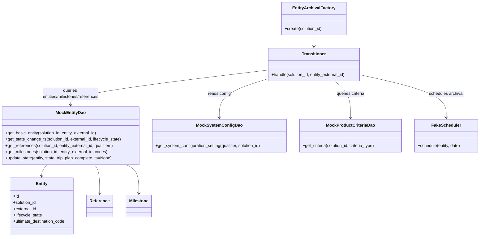
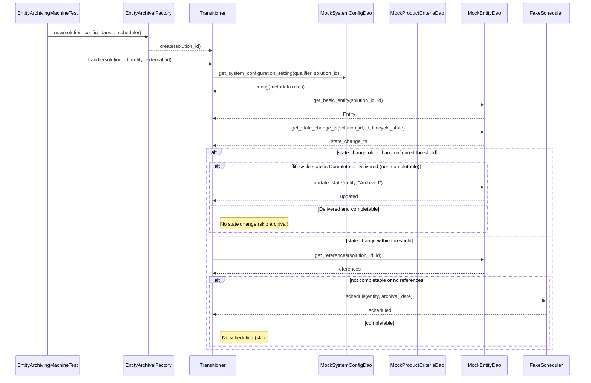

# Diagram: entity_core/entity_service/entity_service_tests/entity_state_machine_tests/test_entity_archiving_machine.py

> Auto-generated by Obscura crawlers

## Diagram 1

### SVG

<svg id="container" width="1852.0390625" xmlns="http://www.w3.org/2000/svg" class="classDiagram" height="904" viewBox="0 0 1852.0390625 904" role="graphics-document document" aria-roledescription="class"><g><defs><marker id="container_class-aggregationStart" class="marker aggregation class" refX="18" refY="7" markerWidth="190" markerHeight="240" orient="auto"><path d="M 18,7 L9,13 L1,7 L9,1 Z"></path></marker></defs><defs><marker id="container_class-aggregationEnd" class="marker aggregation class" refX="1" refY="7" markerWidth="20" markerHeight="28" orient="auto"><path d="M 18,7 L9,13 L1,7 L9,1 Z"></path></marker></defs><defs><marker id="container_class-extensionStart" class="marker extension class" refX="18" refY="7" markerWidth="190" markerHeight="240" orient="auto"><path d="M 1,7 L18,13 V 1 Z"></path></marker></defs><defs><marker id="container_class-extensionEnd" class="marker extension class" refX="1" refY="7" markerWidth="20" markerHeight="28" orient="auto"><path d="M 1,1 V 13 L18,7 Z"></path></marker></defs><defs><marker id="container_class-compositionStart" class="marker composition class" refX="18" refY="7" markerWidth="190" markerHeight="240" orient="auto"><path d="M 18,7 L9,13 L1,7 L9,1 Z"></path></marker></defs><defs><marker id="container_class-compositionEnd" class="marker composition class" refX="1" refY="7" markerWidth="20" markerHeight="28" orient="auto"><path d="M 18,7 L9,13 L1,7 L9,1 Z"></path></marker></defs><defs><marker id="container_class-dependencyStart" class="marker dependency class" refX="6" refY="7" markerWidth="190" markerHeight="240" orient="auto"><path d="M 5,7 L9,13 L1,7 L9,1 Z"></path></marker></defs><defs><marker id="container_class-dependencyEnd" class="marker dependency class" refX="13" refY="7" markerWidth="20" markerHeight="28" orient="auto"><path d="M 18,7 L9,13 L14,7 L9,1 Z"></path></marker></defs><defs><marker id="container_class-lollipopStart" class="marker lollipop class" refX="13" refY="7" markerWidth="190" markerHeight="240" orient="auto"><circle stroke="black" fill="transparent" cx="7" cy="7" r="6"></circle></marker></defs><defs><marker id="container_class-lollipopEnd" class="marker lollipop class" refX="1" refY="7" markerWidth="190" markerHeight="240" orient="auto"><circle stroke="black" fill="transparent" cx="7" cy="7" r="6"></circle></marker></defs><g class="root"><g class="clusters"></g><g class="edgePaths"><path d="M1210.545,134L1210.545,138.167C1210.545,142.333,1210.545,150.667,1210.545,158C1210.545,165.333,1210.545,171.667,1210.545,174.833L1210.545,178" id="id_EntityArchivalFactory_Transitioner_1" class="edge-thickness-normal edge-pattern-solid relation" style=";;;" data-edge="true" data-et="edge" data-id="id_EntityArchivalFactory_Transitioner_1" data-points="W3sieCI6MTIxMC41NDQ5MjE4NzUsInkiOjEzNH0seyJ4IjoxMjEwLjU0NDkyMTg3NSwieSI6MTU5fSx7IngiOjEyMTAuNTQ0OTIxODc1LCJ5IjoxODR9XQ==" marker-end="url(#container_class-dependencyEnd)"></path><path d="M1031.217,302.036L1000.282,311.53C969.348,321.024,907.479,340.012,876.544,364.673C845.609,389.333,845.609,419.667,845.609,434.833L845.609,450" id="id_Transitioner_MockSystemConfigDao_2" class="edge-thickness-normal edge-pattern-solid relation" style=";;;" data-edge="true" data-et="edge" data-id="id_Transitioner_MockSystemConfigDao_2" data-points="W3sieCI6MTAzMS4yMTY3OTY4NzUsInkiOjMwMi4wMzY0MzA4NzY1OTk2fSx7IngiOjg0NS42MDkzNzUsInkiOjM1OX0seyJ4Ijo4NDUuNjA5Mzc1LCJ5Ijo0NTZ9XQ==" marker-end="url(#container_class-dependencyEnd)"></path><path d="M1290.656,310L1301.041,318.167C1311.426,326.333,1332.195,342.667,1342.58,366C1352.965,389.333,1352.965,419.667,1352.965,434.833L1352.965,450" id="id_Transitioner_MockProductCriteriaDao_3" class="edge-thickness-normal edge-pattern-solid relation" style=";;;" data-edge="true" data-et="edge" data-id="id_Transitioner_MockProductCriteriaDao_3" data-points="W3sieCI6MTI5MC42NTYxMjc5Mjk2ODc1LCJ5IjozMTB9LHsieCI6MTM1Mi45NjQ4NDM3NSwieSI6MzU5fSx7IngiOjEzNTIuOTY0ODQzNzUsInkiOjQ1Nn1d" marker-end="url(#container_class-dependencyEnd)"></path><path d="M1031.217,268.404L904.707,283.503C778.198,298.602,525.179,328.801,398.67,351.067C272.16,373.333,272.16,387.667,272.16,394.833L272.16,402" id="id_Transitioner_MockEntityDao_4" class="edge-thickness-normal edge-pattern-solid relation" style=";;;" data-edge="true" data-et="edge" data-id="id_Transitioner_MockEntityDao_4" data-points="W3sieCI6MTAzMS4yMTY3OTY4NzUsInkiOjI2OC40MDM1MzM3NDgzNTgzfSx7IngiOjI3Mi4xNjAxNTYyNSwieSI6MzU5fSx7IngiOjI3Mi4xNjAxNTYyNSwieSI6NDA4fV0=" marker-end="url(#container_class-dependencyEnd)"></path><path d="M1389.873,286.229L1445.317,298.357C1500.76,310.486,1611.648,334.743,1667.091,362.038C1722.535,389.333,1722.535,419.667,1722.535,434.833L1722.535,450" id="id_Transitioner_FakeScheduler_5" class="edge-thickness-normal edge-pattern-solid relation" style=";;;" data-edge="true" data-et="edge" data-id="id_Transitioner_FakeScheduler_5" data-points="W3sieCI6MTM4OS44NzMwNDY4NzUsInkiOjI4Ni4yMjg3NzU1NzMyNjQ1Nn0seyJ4IjoxNzIyLjUzNTE1NjI1LCJ5IjozNTl9LHsieCI6MTcyMi41MzUxNTYyNSwieSI6NDU2fV0=" marker-end="url(#container_class-dependencyEnd)"></path><path d="M181.354,630L177.946,634.167C174.537,638.333,167.72,646.667,164.311,654C160.902,661.333,160.902,667.667,160.902,670.833L160.902,674" id="id_MockEntityDao_Entity_6" class="edge-thickness-normal edge-pattern-solid relation" style=";;;" data-edge="true" data-et="edge" data-id="id_MockEntityDao_Entity_6" data-points="W3sieCI6MTgxLjM1NDE0NzUxODM4MjM1LCJ5Ijo2MzB9LHsieCI6MTYwLjkwMjM0Mzc1LCJ5Ijo2NTV9LHsieCI6MTYwLjkwMjM0Mzc1LCJ5Ijo2ODB9XQ==" marker-end="url(#container_class-dependencyEnd)"></path><path d="M362.966,630L366.375,634.167C369.783,638.333,376.601,646.667,380.009,665C383.418,683.333,383.418,711.667,383.418,725.833L383.418,740" id="id_MockEntityDao_Reference_7" class="edge-thickness-normal edge-pattern-solid relation" style=";;;" data-edge="true" data-et="edge" data-id="id_MockEntityDao_Reference_7" data-points="W3sieCI6MzYyLjk2NjE2NDk4MTYxNzcsInkiOjYzMH0seyJ4IjozODMuNDE3OTY4NzUsInkiOjY1NX0seyJ4IjozODMuNDE3OTY4NzUsInkiOjc0Nn1d" marker-end="url(#container_class-dependencyEnd)"></path><path d="M482.389,630L490.281,634.167C498.172,638.333,513.955,646.667,521.847,665C529.738,683.333,529.738,711.667,529.738,725.833L529.738,740" id="id_MockEntityDao_Milestone_8" class="edge-thickness-normal edge-pattern-solid relation" style=";;;" data-edge="true" data-et="edge" data-id="id_MockEntityDao_Milestone_8" data-points="W3sieCI6NDgyLjM4OTM2MTIxMzIzNTMsInkiOjYzMH0seyJ4Ijo1MjkuNzM4MjgxMjUsInkiOjY1NX0seyJ4Ijo1MjkuNzM4MjgxMjUsInkiOjc0Nn1d" marker-end="url(#container_class-dependencyEnd)"></path></g><g class="edgeLabels"><g class="edgeLabel"><g class="label" data-id="id_EntityArchivalFactory_Transitioner_1" transform="translate(0, 0)"><foreignObject width="0" height="0">

</foreignObject></g></g><g class="edgeLabel" transform="translate(845.609375, 359)"><g class="label" data-id="id_Transitioner_MockSystemConfigDao_2" transform="translate(-43.90625, -12)"><foreignObject width="87.8125" height="24">

reads config

</foreignObject></g></g><g class="edgeLabel" transform="translate(1352.96484375, 359)"><g class="label" data-id="id_Transitioner_MockProductCriteriaDao_3" transform="translate(-55.359375, -12)"><foreignObject width="110.71875" height="24">

queries criteria

</foreignObject></g></g><g class="edgeLabel" transform="translate(272.16015625, 359)"><g class="label" data-id="id_Transitioner_MockEntityDao_4" transform="translate(-112.828125, -24)"><foreignObject width="225.65625" height="48">

queries entities/milestones/references

</foreignObject></g></g><g class="edgeLabel" transform="translate(1722.53515625, 359)"><g class="label" data-id="id_Transitioner_FakeScheduler_5" transform="translate(-66.9609375, -12)"><foreignObject width="133.921875" height="24">

schedules archival

</foreignObject></g></g><g class="edgeLabel"><g class="label" data-id="id_MockEntityDao_Entity_6" transform="translate(0, 0)"><foreignObject width="0" height="0">

</foreignObject></g></g><g class="edgeLabel"><g class="label" data-id="id_MockEntityDao_Reference_7" transform="translate(0, 0)"><foreignObject width="0" height="0">

</foreignObject></g></g><g class="edgeLabel"><g class="label" data-id="id_MockEntityDao_Milestone_8" transform="translate(0, 0)"><foreignObject width="0" height="0">

</foreignObject></g></g></g><g class="nodes"><g class="node default" id="classId-EntityArchivalFactory-0" transform="translate(1210.544921875, 71)"><g class="basic label-container"><path d="M-123.16796875 -63 L123.16796875 -63 L123.16796875 63 L-123.16796875 63" stroke="none" stroke-width="0" fill="#ECECFF" style=""></path><path d="M-123.16796875 -63 C-31.073138788301407 -63, 61.02169117339719 -63, 123.16796875 -63 M-123.16796875 -63 C-34.728796160980195 -63, 53.71037642803961 -63, 123.16796875 -63 M123.16796875 -63 C123.16796875 -37.261467698057274, 123.16796875 -11.522935396114548, 123.16796875 63 M123.16796875 -63 C123.16796875 -20.927487710390928, 123.16796875 21.145024579218145, 123.16796875 63 M123.16796875 63 C27.29494678140648 63, -68.57807518718704 63, -123.16796875 63 M123.16796875 63 C48.57634272602202 63, -26.01528329795596 63, -123.16796875 63 M-123.16796875 63 C-123.16796875 22.862005416531062, -123.16796875 -17.275989166937876, -123.16796875 -63 M-123.16796875 63 C-123.16796875 23.47741058799216, -123.16796875 -16.04517882401568, -123.16796875 -63" stroke="#9370DB" stroke-width="1.3" fill="none" stroke-dasharray="0 0" style=""></path></g><g class="annotation-group text" transform="translate(0, -39)"></g><g class="label-group text" transform="translate(-76.8828125, -39)"><g class="label" style="font-weight: bolder" transform="translate(0,-12)"><foreignObject width="153.765625" height="24">

EntityArchivalFactory

</foreignObject></g></g><g class="members-group text" transform="translate(-111.16796875, 9)"></g><g class="methods-group text" transform="translate(-111.16796875, 39)"><g class="label" style="" transform="translate(0,-12)"><foreignObject width="145.453125" height="24">

+create(solution_id)

</foreignObject></g></g><g class="divider" style=""><path d="M-123.16796875 -15 C-34.91373130499562 -15, 53.340506140008756 -15, 123.16796875 -15 M-123.16796875 -15 C-62.088729944795375 -15, -1.0094911395907502 -15, 123.16796875 -15" stroke="#9370DB" stroke-width="1.3" fill="none" stroke-dasharray="0 0" style=""></path></g><g class="divider" style=""><path d="M-123.16796875 9 C-41.01276700392181 9, 41.14243474215638 9, 123.16796875 9 M-123.16796875 9 C-29.903743810443345 9, 63.36048112911331 9, 123.16796875 9" stroke="#9370DB" stroke-width="1.3" fill="none" stroke-dasharray="0 0" style=""></path></g></g><g class="node default" id="classId-Transitioner-1" transform="translate(1210.544921875, 247)"><g class="basic label-container"><path d="M-179.328125 -63 L179.328125 -63 L179.328125 63 L-179.328125 63" stroke="none" stroke-width="0" fill="#ECECFF" style=""></path><path d="M-179.328125 -63 C-59.947714089547105 -63, 59.43269682090579 -63, 179.328125 -63 M-179.328125 -63 C-53.19868815839364 -63, 72.93074868321273 -63, 179.328125 -63 M179.328125 -63 C179.328125 -35.83818016007034, 179.328125 -8.676360320140674, 179.328125 63 M179.328125 -63 C179.328125 -14.065755971249438, 179.328125 34.868488057501125, 179.328125 63 M179.328125 63 C45.48989634479233 63, -88.34833231041534 63, -179.328125 63 M179.328125 63 C56.63342329930964 63, -66.06127840138072 63, -179.328125 63 M-179.328125 63 C-179.328125 32.35669158842577, -179.328125 1.7133831768515364, -179.328125 -63 M-179.328125 63 C-179.328125 14.229205023232083, -179.328125 -34.54158995353583, -179.328125 -63" stroke="#9370DB" stroke-width="1.3" fill="none" stroke-dasharray="0 0" style=""></path></g><g class="annotation-group text" transform="translate(0, -39)"></g><g class="label-group text" transform="translate(-44.390625, -39)"><g class="label" style="font-weight: bolder" transform="translate(0,-12)"><foreignObject width="88.78125" height="24">

Transitioner

</foreignObject></g></g><g class="members-group text" transform="translate(-167.328125, 9)"></g><g class="methods-group text" transform="translate(-167.328125, 39)"><g class="label" style="" transform="translate(0,-12)"><foreignObject width="290.265625" height="24">

+handle(solution_id, entity_external_id)

</foreignObject></g></g><g class="divider" style=""><path d="M-179.328125 -15 C-51.73159042507132 -15, 75.86494414985737 -15, 179.328125 -15 M-179.328125 -15 C-52.68236585513665 -15, 73.9633932897267 -15, 179.328125 -15" stroke="#9370DB" stroke-width="1.3" fill="none" stroke-dasharray="0 0" style=""></path></g><g class="divider" style=""><path d="M-179.328125 9 C-66.16634964436992 9, 46.99542571126017 9, 179.328125 9 M-179.328125 9 C-65.62355533330508 9, 48.081014333389845 9, 179.328125 9" stroke="#9370DB" stroke-width="1.3" fill="none" stroke-dasharray="0 0" style=""></path></g></g><g class="node default" id="classId-Entity-2" transform="translate(160.90234375, 788)"><g class="basic label-container"><path d="M-124.0078125 -108 L124.0078125 -108 L124.0078125 108 L-124.0078125 108" stroke="none" stroke-width="0" fill="#ECECFF" style=""></path><path d="M-124.0078125 -108 C-72.30268774550399 -108, -20.597562991007976 -108, 124.0078125 -108 M-124.0078125 -108 C-43.750153052833994 -108, 36.50750639433201 -108, 124.0078125 -108 M124.0078125 -108 C124.0078125 -40.903499844356844, 124.0078125 26.193000311286312, 124.0078125 108 M124.0078125 -108 C124.0078125 -35.36983144602304, 124.0078125 37.260337107953916, 124.0078125 108 M124.0078125 108 C43.61815437662969 108, -36.77150374674062 108, -124.0078125 108 M124.0078125 108 C44.34441240477551 108, -35.31898769044898 108, -124.0078125 108 M-124.0078125 108 C-124.0078125 48.2260336457472, -124.0078125 -11.547932708505598, -124.0078125 -108 M-124.0078125 108 C-124.0078125 28.26161140546931, -124.0078125 -51.47677718906138, -124.0078125 -108" stroke="#9370DB" stroke-width="1.3" fill="none" stroke-dasharray="0 0" style=""></path></g><g class="annotation-group text" transform="translate(0, -84)"></g><g class="label-group text" transform="translate(-21.28125, -84)"><g class="label" style="font-weight: bolder" transform="translate(0,-12)"><foreignObject width="42.5625" height="24">

Entity

</foreignObject></g></g><g class="members-group text" transform="translate(-112.0078125, -36)"><g class="label" style="" transform="translate(0,-12)"><foreignObject width="22.078125" height="24">

+id

</foreignObject></g><g class="label" style="" transform="translate(0,12)"><foreignObject width="90.21875" height="24">

+solution_id

</foreignObject></g><g class="label" style="" transform="translate(0,36)"><foreignObject width="89.765625" height="24">

+external_id

</foreignObject></g><g class="label" style="" transform="translate(0,60)"><foreignObject width="111.640625" height="24">

+lifecycle_state

</foreignObject></g><g class="label" style="" transform="translate(0,84)"><foreignObject width="202.734375" height="24">

+ultimate_destination_code

</foreignObject></g></g><g class="methods-group text" transform="translate(-112.0078125, 108)"></g><g class="divider" style=""><path d="M-124.0078125 -60 C-41.68509991247761 -60, 40.63761267504478 -60, 124.0078125 -60 M-124.0078125 -60 C-41.938214406755804 -60, 40.13138368648839 -60, 124.0078125 -60" stroke="#9370DB" stroke-width="1.3" fill="none" stroke-dasharray="0 0" style=""></path></g><g class="divider" style=""><path d="M-124.0078125 84 C-70.36029982870262 84, -16.712787157405245 84, 124.0078125 84 M-124.0078125 84 C-53.88700369679147 84, 16.233805106417066 84, 124.0078125 84" stroke="#9370DB" stroke-width="1.3" fill="none" stroke-dasharray="0 0" style=""></path></g></g><g class="node default" id="classId-Reference-3" transform="translate(383.41796875, 788)"><g class="basic label-container"><path d="M-48.5078125 -42 L48.5078125 -42 L48.5078125 42 L-48.5078125 42" stroke="none" stroke-width="0" fill="#ECECFF" style=""></path><path d="M-48.5078125 -42 C-21.487296350606016 -42, 5.533219798787968 -42, 48.5078125 -42 M-48.5078125 -42 C-19.734012792399987 -42, 9.039786915200025 -42, 48.5078125 -42 M48.5078125 -42 C48.5078125 -9.657257268704562, 48.5078125 22.685485462590876, 48.5078125 42 M48.5078125 -42 C48.5078125 -15.900902889169025, 48.5078125 10.19819422166195, 48.5078125 42 M48.5078125 42 C10.301560784937983 42, -27.904690930124033 42, -48.5078125 42 M48.5078125 42 C15.32994208602198 42, -17.84792832795604 42, -48.5078125 42 M-48.5078125 42 C-48.5078125 14.946160569472514, -48.5078125 -12.107678861054971, -48.5078125 -42 M-48.5078125 42 C-48.5078125 12.342608854138668, -48.5078125 -17.314782291722665, -48.5078125 -42" stroke="#9370DB" stroke-width="1.3" fill="none" stroke-dasharray="0 0" style=""></path></g><g class="annotation-group text" transform="translate(0, -18)"></g><g class="label-group text" transform="translate(-36.5078125, -18)"><g class="label" style="font-weight: bolder" transform="translate(0,-12)"><foreignObject width="73.015625" height="24">

Reference

</foreignObject></g></g><g class="members-group text" transform="translate(-36.5078125, 30)"></g><g class="methods-group text" transform="translate(-36.5078125, 60)"></g><g class="divider" style=""><path d="M-48.5078125 6 C-29.095075687411065 6, -9.682338874822129 6, 48.5078125 6 M-48.5078125 6 C-24.209518188035542 6, 0.0887761239289162 6, 48.5078125 6" stroke="#9370DB" stroke-width="1.3" fill="none" stroke-dasharray="0 0" style=""></path></g><g class="divider" style=""><path d="M-48.5078125 24 C-19.431477412050945 24, 9.644857675898109 24, 48.5078125 24 M-48.5078125 24 C-14.881811587877891 24, 18.744189324244218 24, 48.5078125 24" stroke="#9370DB" stroke-width="1.3" fill="none" stroke-dasharray="0 0" style=""></path></g></g><g class="node default" id="classId-Milestone-4" transform="translate(529.73828125, 788)"><g class="basic label-container"><path d="M-47.8125 -42 L47.8125 -42 L47.8125 42 L-47.8125 42" stroke="none" stroke-width="0" fill="#ECECFF" style=""></path><path d="M-47.8125 -42 C-28.369262130118518 -42, -8.926024260237035 -42, 47.8125 -42 M-47.8125 -42 C-21.23876655195055 -42, 5.334966896098898 -42, 47.8125 -42 M47.8125 -42 C47.8125 -20.039667421722505, 47.8125 1.920665156554989, 47.8125 42 M47.8125 -42 C47.8125 -14.2384788563073, 47.8125 13.523042287385401, 47.8125 42 M47.8125 42 C26.4723940497496 42, 5.132288099499199 42, -47.8125 42 M47.8125 42 C23.873376974930853 42, -0.06574605013829427 42, -47.8125 42 M-47.8125 42 C-47.8125 23.32881620307747, -47.8125 4.657632406154939, -47.8125 -42 M-47.8125 42 C-47.8125 14.155153974883223, -47.8125 -13.689692050233553, -47.8125 -42" stroke="#9370DB" stroke-width="1.3" fill="none" stroke-dasharray="0 0" style=""></path></g><g class="annotation-group text" transform="translate(0, -18)"></g><g class="label-group text" transform="translate(-35.8125, -18)"><g class="label" style="font-weight: bolder" transform="translate(0,-12)"><foreignObject width="71.625" height="24">

Milestone

</foreignObject></g></g><g class="members-group text" transform="translate(-35.8125, 30)"></g><g class="methods-group text" transform="translate(-35.8125, 60)"></g><g class="divider" style=""><path d="M-47.8125 6 C-25.368449393408067 6, -2.924398786816134 6, 47.8125 6 M-47.8125 6 C-17.194660947612462 6, 13.423178104775076 6, 47.8125 6" stroke="#9370DB" stroke-width="1.3" fill="none" stroke-dasharray="0 0" style=""></path></g><g class="divider" style=""><path d="M-47.8125 24 C-16.473630863394124 24, 14.865238273211752 24, 47.8125 24 M-47.8125 24 C-28.56160905162175 24, -9.310718103243502 24, 47.8125 24" stroke="#9370DB" stroke-width="1.3" fill="none" stroke-dasharray="0 0" style=""></path></g></g><g class="node default" id="classId-MockEntityDao-5" transform="translate(272.16015625, 519)"><g class="basic label-container"><path d="M-264.16015625 -111 L264.16015625 -111 L264.16015625 111 L-264.16015625 111" stroke="none" stroke-width="0" fill="#ECECFF" style=""></path><path d="M-264.16015625 -111 C-122.60404948032576 -111, 18.952057289348488 -111, 264.16015625 -111 M-264.16015625 -111 C-59.221454163200605 -111, 145.7172479235988 -111, 264.16015625 -111 M264.16015625 -111 C264.16015625 -48.37635201106098, 264.16015625 14.24729597787804, 264.16015625 111 M264.16015625 -111 C264.16015625 -28.607536337651396, 264.16015625 53.78492732469721, 264.16015625 111 M264.16015625 111 C105.63071782765039 111, -52.89872059469923 111, -264.16015625 111 M264.16015625 111 C120.56360746945336 111, -23.032941311093282 111, -264.16015625 111 M-264.16015625 111 C-264.16015625 24.84503923497833, -264.16015625 -61.30992153004334, -264.16015625 -111 M-264.16015625 111 C-264.16015625 44.22059883628013, -264.16015625 -22.558802327439736, -264.16015625 -111" stroke="#9370DB" stroke-width="1.3" fill="none" stroke-dasharray="0 0" style=""></path></g><g class="annotation-group text" transform="translate(0, -87)"></g><g class="label-group text" transform="translate(-54.6796875, -87)"><g class="label" style="font-weight: bolder" transform="translate(0,-12)"><foreignObject width="109.359375" height="24">

MockEntityDao

</foreignObject></g></g><g class="members-group text" transform="translate(-252.16015625, -39)"></g><g class="methods-group text" transform="translate(-252.16015625, -9)"><g class="label" style="" transform="translate(0,-12)"><foreignObject width="358.265625" height="24">

+get_basic_entity(solution_id, entity_external_id)

</foreignObject></g><g class="label" style="" transform="translate(0,12)"><foreignObject width="449.640625" height="24">

+get_state_change_ts(solution_id, external_id, lifecycle_state)

</foreignObject></g><g class="label" style="" transform="translate(0,36)"><foreignObject width="422.46875" height="24">

+get_references(solution_id, entity_external_id, qualifiers)

</foreignObject></g><g class="label" style="" transform="translate(0,60)"><foreignObject width="400.78125" height="24">

+get_milestones(solution_id, entity_external_id, codes)

</foreignObject></g><g class="label" style="" transform="translate(0,84)"><foreignObject width="416.140625" height="24">

+update_state(entity, state, trip_plan_complete_ts=None)

</foreignObject></g></g><g class="divider" style=""><path d="M-264.16015625 -63 C-127.57733707610447 -63, 9.00548209779106 -63, 264.16015625 -63 M-264.16015625 -63 C-149.21230435719497 -63, -34.264452464389905 -63, 264.16015625 -63" stroke="#9370DB" stroke-width="1.3" fill="none" stroke-dasharray="0 0" style=""></path></g><g class="divider" style=""><path d="M-264.16015625 -39 C-70.02207369319626 -39, 124.11600886360748 -39, 264.16015625 -39 M-264.16015625 -39 C-153.7279331333439 -39, -43.29571001668779 -39, 264.16015625 -39" stroke="#9370DB" stroke-width="1.3" fill="none" stroke-dasharray="0 0" style=""></path></g></g><g class="node default" id="classId-MockSystemConfigDao-6" transform="translate(845.609375, 519)"><g class="basic label-container"><path d="M-259.2890625 -63 L259.2890625 -63 L259.2890625 63 L-259.2890625 63" stroke="none" stroke-width="0" fill="#ECECFF" style=""></path><path d="M-259.2890625 -63 C-130.51425370559633 -63, -1.7394449111926633 -63, 259.2890625 -63 M-259.2890625 -63 C-118.58296291449139 -63, 22.12313667101722 -63, 259.2890625 -63 M259.2890625 -63 C259.2890625 -27.608721771651354, 259.2890625 7.782556456697293, 259.2890625 63 M259.2890625 -63 C259.2890625 -24.635750630952508, 259.2890625 13.728498738094984, 259.2890625 63 M259.2890625 63 C142.3820596839172 63, 25.47505686783441 63, -259.2890625 63 M259.2890625 63 C53.836416788037496 63, -151.616228923925 63, -259.2890625 63 M-259.2890625 63 C-259.2890625 18.15067904252649, -259.2890625 -26.698641914947018, -259.2890625 -63 M-259.2890625 63 C-259.2890625 22.32925747677355, -259.2890625 -18.341485046452902, -259.2890625 -63" stroke="#9370DB" stroke-width="1.3" fill="none" stroke-dasharray="0 0" style=""></path></g><g class="annotation-group text" transform="translate(0, -39)"></g><g class="label-group text" transform="translate(-82.875, -39)"><g class="label" style="font-weight: bolder" transform="translate(0,-12)"><foreignObject width="165.75" height="24">

MockSystemConfigDao

</foreignObject></g></g><g class="members-group text" transform="translate(-247.2890625, 9)"></g><g class="methods-group text" transform="translate(-247.2890625, 39)"><g class="label" style="" transform="translate(0,-12)"><foreignObject width="411.703125" height="24">

+get_system_configuration_setting(qualifier, solution_id)

</foreignObject></g></g><g class="divider" style=""><path d="M-259.2890625 -15 C-117.66230310310141 -15, 23.964456293797184 -15, 259.2890625 -15 M-259.2890625 -15 C-80.19633532285317 -15, 98.89639185429365 -15, 259.2890625 -15" stroke="#9370DB" stroke-width="1.3" fill="none" stroke-dasharray="0 0" style=""></path></g><g class="divider" style=""><path d="M-259.2890625 9 C-109.9373300544147 9, 39.4144023911706 9, 259.2890625 9 M-259.2890625 9 C-129.36373421630208 9, 0.5615940673958448 9, 259.2890625 9" stroke="#9370DB" stroke-width="1.3" fill="none" stroke-dasharray="0 0" style=""></path></g></g><g class="node default" id="classId-MockProductCriteriaDao-7" transform="translate(1352.96484375, 519)"><g class="basic label-container"><path d="M-198.06640625 -63 L198.06640625 -63 L198.06640625 63 L-198.06640625 63" stroke="none" stroke-width="0" fill="#ECECFF" style=""></path><path d="M-198.06640625 -63 C-90.00428837652811 -63, 18.057829496943782 -63, 198.06640625 -63 M-198.06640625 -63 C-69.18640944792014 -63, 59.69358735415972 -63, 198.06640625 -63 M198.06640625 -63 C198.06640625 -19.20816469772084, 198.06640625 24.58367060455832, 198.06640625 63 M198.06640625 -63 C198.06640625 -25.8628221155195, 198.06640625 11.274355768961001, 198.06640625 63 M198.06640625 63 C57.96637104939575 63, -82.1336641512085 63, -198.06640625 63 M198.06640625 63 C43.996431993671564 63, -110.07354226265687 63, -198.06640625 63 M-198.06640625 63 C-198.06640625 16.033727774841168, -198.06640625 -30.932544450317664, -198.06640625 -63 M-198.06640625 63 C-198.06640625 31.763943749252164, -198.06640625 0.5278874985043274, -198.06640625 -63" stroke="#9370DB" stroke-width="1.3" fill="none" stroke-dasharray="0 0" style=""></path></g><g class="annotation-group text" transform="translate(0, -39)"></g><g class="label-group text" transform="translate(-89.1484375, -39)"><g class="label" style="font-weight: bolder" transform="translate(0,-12)"><foreignObject width="178.296875" height="24">

MockProductCriteriaDao

</foreignObject></g></g><g class="members-group text" transform="translate(-186.06640625, 9)"></g><g class="methods-group text" transform="translate(-186.06640625, 39)"><g class="label" style="" transform="translate(0,-12)"><foreignObject width="282.984375" height="24">

+get_criteria(solution_id, criteria_type)

</foreignObject></g></g><g class="divider" style=""><path d="M-198.06640625 -15 C-49.82629971612391 -15, 98.41380681775217 -15, 198.06640625 -15 M-198.06640625 -15 C-82.25045558573953 -15, 33.56549507852094 -15, 198.06640625 -15" stroke="#9370DB" stroke-width="1.3" fill="none" stroke-dasharray="0 0" style=""></path></g><g class="divider" style=""><path d="M-198.06640625 9 C-57.30591305933703 9, 83.45458013132594 9, 198.06640625 9 M-198.06640625 9 C-118.64651490664208 9, -39.226623563284164 9, 198.06640625 9" stroke="#9370DB" stroke-width="1.3" fill="none" stroke-dasharray="0 0" style=""></path></g></g><g class="node default" id="classId-FakeScheduler-8" transform="translate(1722.53515625, 519)"><g class="basic label-container"><path d="M-121.50390625 -63 L121.50390625 -63 L121.50390625 63 L-121.50390625 63" stroke="none" stroke-width="0" fill="#ECECFF" style=""></path><path d="M-121.50390625 -63 C-43.45524288130164 -63, 34.59342048739671 -63, 121.50390625 -63 M-121.50390625 -63 C-56.546724851847145 -63, 8.41045654630571 -63, 121.50390625 -63 M121.50390625 -63 C121.50390625 -22.767996246323406, 121.50390625 17.464007507353188, 121.50390625 63 M121.50390625 -63 C121.50390625 -18.04937237220316, 121.50390625 26.901255255593682, 121.50390625 63 M121.50390625 63 C45.05419204341945 63, -31.395522163161104 63, -121.50390625 63 M121.50390625 63 C72.55522102188394 63, 23.60653579376789 63, -121.50390625 63 M-121.50390625 63 C-121.50390625 27.529046685307037, -121.50390625 -7.941906629385926, -121.50390625 -63 M-121.50390625 63 C-121.50390625 15.413130267977706, -121.50390625 -32.17373946404459, -121.50390625 -63" stroke="#9370DB" stroke-width="1.3" fill="none" stroke-dasharray="0 0" style=""></path></g><g class="annotation-group text" transform="translate(0, -39)"></g><g class="label-group text" transform="translate(-53.3046875, -39)"><g class="label" style="font-weight: bolder" transform="translate(0,-12)"><foreignObject width="106.609375" height="24">

FakeScheduler

</foreignObject></g></g><g class="members-group text" transform="translate(-109.50390625, 9)"></g><g class="methods-group text" transform="translate(-109.50390625, 39)"><g class="label" style="" transform="translate(0,-12)"><foreignObject width="165.703125" height="24">

+schedule(entity, date)

</foreignObject></g></g><g class="divider" style=""><path d="M-121.50390625 -15 C-61.015672357662865 -15, -0.52743846532573 -15, 121.50390625 -15 M-121.50390625 -15 C-59.51001873112326 -15, 2.4838687877534795 -15, 121.50390625 -15" stroke="#9370DB" stroke-width="1.3" fill="none" stroke-dasharray="0 0" style=""></path></g><g class="divider" style=""><path d="M-121.50390625 9 C-68.43906173128948 9, -15.374217212578984 9, 121.50390625 9 M-121.50390625 9 C-33.413710480053595 9, 54.67648528989281 9, 121.50390625 9" stroke="#9370DB" stroke-width="1.3" fill="none" stroke-dasharray="0 0" style=""></path></g></g></g></g></g></svg>

## Diagram 2

### SVG

<svg id="container" width="1985.5" xmlns="http://www.w3.org/2000/svg" height="1289" viewBox="-50 -10 1985.5 1289" role="graphics-document document" aria-roledescription="sequence"><g><rect x="1735.5" y="1203" fill="#eaeaea" stroke="#666" width="150" height="65" name="Scheduler" rx="3" ry="3" class="actor actor-bottom"></rect><text x="1810.5" y="1235.5" dominant-baseline="central" alignment-baseline="central" class="actor actor-box" style="text-anchor: middle; font-size: 16px; font-weight: 400;"><tspan x="1810.5" dy="0">FakeScheduler</tspan></text></g><g><rect x="1535.5" y="1203" fill="#eaeaea" stroke="#666" width="150" height="65" name="EntityDao" rx="3" ry="3" class="actor actor-bottom"></rect><text x="1610.5" y="1235.5" dominant-baseline="central" alignment-baseline="central" class="actor actor-box" style="text-anchor: middle; font-size: 16px; font-weight: 400;"><tspan x="1610.5" dy="0">MockEntityDao</tspan></text></g><g><rect x="1290.5" y="1203" fill="#eaeaea" stroke="#666" width="195" height="65" name="ProdCrit" rx="3" ry="3" class="actor actor-bottom"></rect><text x="1388" y="1235.5" dominant-baseline="central" alignment-baseline="central" class="actor actor-box" style="text-anchor: middle; font-size: 16px; font-weight: 400;"><tspan x="1388" dy="0">MockProductCriteriaDao</tspan></text></g><g><rect x="1058.5" y="1203" fill="#eaeaea" stroke="#666" width="182" height="65" name="SysCfg" rx="3" ry="3" class="actor actor-bottom"></rect><text x="1149.5" y="1235.5" dominant-baseline="central" alignment-baseline="central" class="actor actor-box" style="text-anchor: middle; font-size: 16px; font-weight: 400;"><tspan x="1149.5" dy="0">MockSystemConfigDao</tspan></text></g><g><rect x="600.5" y="1203" fill="#eaeaea" stroke="#666" width="150" height="65" name="Transitioner" rx="3" ry="3" class="actor actor-bottom"></rect><text x="675.5" y="1235.5" dominant-baseline="central" alignment-baseline="central" class="actor actor-box" style="text-anchor: middle; font-size: 16px; font-weight: 400;"><tspan x="675.5" dy="0">Transitioner</tspan></text></g><g><rect x="379.5" y="1203" fill="#eaeaea" stroke="#666" width="171" height="65" name="Factory" rx="3" ry="3" class="actor actor-bottom"></rect><text x="465" y="1235.5" dominant-baseline="central" alignment-baseline="central" class="actor actor-box" style="text-anchor: middle; font-size: 16px; font-weight: 400;"><tspan x="465" dy="0">EntityArchivalFactory</tspan></text></g><g><rect x="0" y="1203" fill="#eaeaea" stroke="#666" width="218" height="65" name="Test" rx="3" ry="3" class="actor actor-bottom"></rect><text x="109" y="1235.5" dominant-baseline="central" alignment-baseline="central" class="actor actor-box" style="text-anchor: middle; font-size: 16px; font-weight: 400;"><tspan x="109" dy="0">EntityArchivingMachineTest</tspan></text></g><g><line id="actor6" x1="1810.5" y1="65" x2="1810.5" y2="1203" class="actor-line 200" stroke-width="0.5px" stroke="#999" name="Scheduler"></line><g id="root-6"><rect x="1735.5" y="0" fill="#eaeaea" stroke="#666" width="150" height="65" name="Scheduler" rx="3" ry="3" class="actor actor-top"></rect><text x="1810.5" y="32.5" dominant-baseline="central" alignment-baseline="central" class="actor actor-box" style="text-anchor: middle; font-size: 16px; font-weight: 400;"><tspan x="1810.5" dy="0">FakeScheduler</tspan></text></g></g><g><line id="actor5" x1="1610.5" y1="65" x2="1610.5" y2="1203" class="actor-line 200" stroke-width="0.5px" stroke="#999" name="EntityDao"></line><g id="root-5"><rect x="1535.5" y="0" fill="#eaeaea" stroke="#666" width="150" height="65" name="EntityDao" rx="3" ry="3" class="actor actor-top"></rect><text x="1610.5" y="32.5" dominant-baseline="central" alignment-baseline="central" class="actor actor-box" style="text-anchor: middle; font-size: 16px; font-weight: 400;"><tspan x="1610.5" dy="0">MockEntityDao</tspan></text></g></g><g><line id="actor4" x1="1388" y1="65" x2="1388" y2="1203" class="actor-line 200" stroke-width="0.5px" stroke="#999" name="ProdCrit"></line><g id="root-4"><rect x="1290.5" y="0" fill="#eaeaea" stroke="#666" width="195" height="65" name="ProdCrit" rx="3" ry="3" class="actor actor-top"></rect><text x="1388" y="32.5" dominant-baseline="central" alignment-baseline="central" class="actor actor-box" style="text-anchor: middle; font-size: 16px; font-weight: 400;"><tspan x="1388" dy="0">MockProductCriteriaDao</tspan></text></g></g><g><line id="actor3" x1="1149.5" y1="65" x2="1149.5" y2="1203" class="actor-line 200" stroke-width="0.5px" stroke="#999" name="SysCfg"></line><g id="root-3"><rect x="1058.5" y="0" fill="#eaeaea" stroke="#666" width="182" height="65" name="SysCfg" rx="3" ry="3" class="actor actor-top"></rect><text x="1149.5" y="32.5" dominant-baseline="central" alignment-baseline="central" class="actor actor-box" style="text-anchor: middle; font-size: 16px; font-weight: 400;"><tspan x="1149.5" dy="0">MockSystemConfigDao</tspan></text></g></g><g><line id="actor2" x1="675.5" y1="65" x2="675.5" y2="1203" class="actor-line 200" stroke-width="0.5px" stroke="#999" name="Transitioner"></line><g id="root-2"><rect x="600.5" y="0" fill="#eaeaea" stroke="#666" width="150" height="65" name="Transitioner" rx="3" ry="3" class="actor actor-top"></rect><text x="675.5" y="32.5" dominant-baseline="central" alignment-baseline="central" class="actor actor-box" style="text-anchor: middle; font-size: 16px; font-weight: 400;"><tspan x="675.5" dy="0">Transitioner</tspan></text></g></g><g><line id="actor1" x1="465" y1="65" x2="465" y2="1203" class="actor-line 200" stroke-width="0.5px" stroke="#999" name="Factory"></line><g id="root-1"><rect x="379.5" y="0" fill="#eaeaea" stroke="#666" width="171" height="65" name="Factory" rx="3" ry="3" class="actor actor-top"></rect><text x="465" y="32.5" dominant-baseline="central" alignment-baseline="central" class="actor actor-box" style="text-anchor: middle; font-size: 16px; font-weight: 400;"><tspan x="465" dy="0">EntityArchivalFactory</tspan></text></g></g><g><line id="actor0" x1="109" y1="65" x2="109" y2="1203" class="actor-line 200" stroke-width="0.5px" stroke="#999" name="Test"></line><g id="root-0"><rect x="0" y="0" fill="#eaeaea" stroke="#666" width="218" height="65" name="Test" rx="3" ry="3" class="actor actor-top"></rect><text x="109" y="32.5" dominant-baseline="central" alignment-baseline="central" class="actor actor-box" style="text-anchor: middle; font-size: 16px; font-weight: 400;"><tspan x="109" dy="0">EntityArchivingMachineTest</tspan></text></g></g><g></g><defs><symbol id="computer" width="24" height="24"><path transform="scale(.5)" d="M2 2v13h20v-13h-20zm18 11h-16v-9h16v9zm-10.228 6l.466-1h3.524l.467 1h-4.457zm14.228 3h-24l2-6h2.104l-1.33 4h18.45l-1.297-4h2.073l2 6zm-5-10h-14v-7h14v7z"></path></symbol></defs><defs><symbol id="database" fill-rule="evenodd" clip-rule="evenodd"><path transform="scale(.5)" d="M12.258.001l.256.004.255.005.253.008.251.01.249.012.247.015.246.016.242.019.241.02.239.023.236.024.233.027.231.028.229.031.225.032.223.034.22.036.217.038.214.04.211.041.208.043.205.045.201.046.198.048.194.05.191.051.187.053.183.054.18.056.175.057.172.059.168.06.163.061.16.063.155.064.15.066.074.033.073.033.071.034.07.034.069.035.068.035.067.035.066.035.064.036.064.036.062.036.06.036.06.037.058.037.058.037.055.038.055.038.053.038.052.038.051.039.05.039.048.039.047.039.045.04.044.04.043.04.041.04.04.041.039.041.037.041.036.041.034.041.033.042.032.042.03.042.029.042.027.042.026.043.024.043.023.043.021.043.02.043.018.044.017.043.015.044.013.044.012.044.011.045.009.044.007.045.006.045.004.045.002.045.001.045v17l-.001.045-.002.045-.004.045-.006.045-.007.045-.009.044-.011.045-.012.044-.013.044-.015.044-.017.043-.018.044-.02.043-.021.043-.023.043-.024.043-.026.043-.027.042-.029.042-.03.042-.032.042-.033.042-.034.041-.036.041-.037.041-.039.041-.04.041-.041.04-.043.04-.044.04-.045.04-.047.039-.048.039-.05.039-.051.039-.052.038-.053.038-.055.038-.055.038-.058.037-.058.037-.06.037-.06.036-.062.036-.064.036-.064.036-.066.035-.067.035-.068.035-.069.035-.07.034-.071.034-.073.033-.074.033-.15.066-.155.064-.16.063-.163.061-.168.06-.172.059-.175.057-.18.056-.183.054-.187.053-.191.051-.194.05-.198.048-.201.046-.205.045-.208.043-.211.041-.214.04-.217.038-.22.036-.223.034-.225.032-.229.031-.231.028-.233.027-.236.024-.239.023-.241.02-.242.019-.246.016-.247.015-.249.012-.251.01-.253.008-.255.005-.256.004-.258.001-.258-.001-.256-.004-.255-.005-.253-.008-.251-.01-.249-.012-.247-.015-.245-.016-.243-.019-.241-.02-.238-.023-.236-.024-.234-.027-.231-.028-.228-.031-.226-.032-.223-.034-.22-.036-.217-.038-.214-.04-.211-.041-.208-.043-.204-.045-.201-.046-.198-.048-.195-.05-.19-.051-.187-.053-.184-.054-.179-.056-.176-.057-.172-.059-.167-.06-.164-.061-.159-.063-.155-.064-.151-.066-.074-.033-.072-.033-.072-.034-.07-.034-.069-.035-.068-.035-.067-.035-.066-.035-.064-.036-.063-.036-.062-.036-.061-.036-.06-.037-.058-.037-.057-.037-.056-.038-.055-.038-.053-.038-.052-.038-.051-.039-.049-.039-.049-.039-.046-.039-.046-.04-.044-.04-.043-.04-.041-.04-.04-.041-.039-.041-.037-.041-.036-.041-.034-.041-.033-.042-.032-.042-.03-.042-.029-.042-.027-.042-.026-.043-.024-.043-.023-.043-.021-.043-.02-.043-.018-.044-.017-.043-.015-.044-.013-.044-.012-.044-.011-.045-.009-.044-.007-.045-.006-.045-.004-.045-.002-.045-.001-.045v-17l.001-.045.002-.045.004-.045.006-.045.007-.045.009-.044.011-.045.012-.044.013-.044.015-.044.017-.043.018-.044.02-.043.021-.043.023-.043.024-.043.026-.043.027-.042.029-.042.03-.042.032-.042.033-.042.034-.041.036-.041.037-.041.039-.041.04-.041.041-.04.043-.04.044-.04.046-.04.046-.039.049-.039.049-.039.051-.039.052-.038.053-.038.055-.038.056-.038.057-.037.058-.037.06-.037.061-.036.062-.036.063-.036.064-.036.066-.035.067-.035.068-.035.069-.035.07-.034.072-.034.072-.033.074-.033.151-.066.155-.064.159-.063.164-.061.167-.06.172-.059.176-.057.179-.056.184-.054.187-.053.19-.051.195-.05.198-.048.201-.046.204-.045.208-.043.211-.041.214-.04.217-.038.22-.036.223-.034.226-.032.228-.031.231-.028.234-.027.236-.024.238-.023.241-.02.243-.019.245-.016.247-.015.249-.012.251-.01.253-.008.255-.005.256-.004.258-.001.258.001zm-9.258 20.499v.01l.001.021.003.021.004.022.005.021.006.022.007.022.009.023.01.022.011.023.012.023.013.023.015.023.016.024.017.023.018.024.019.024.021.024.022.025.023.024.024.025.052.049.056.05.061.051.066.051.07.051.075.051.079.052.084.052.088.052.092.052.097.052.102.051.105.052.11.052.114.051.119.051.123.051.127.05.131.05.135.05.139.048.144.049.147.047.152.047.155.047.16.045.163.045.167.043.171.043.176.041.178.041.183.039.187.039.19.037.194.035.197.035.202.033.204.031.209.03.212.029.216.027.219.025.222.024.226.021.23.02.233.018.236.016.24.015.243.012.246.01.249.008.253.005.256.004.259.001.26-.001.257-.004.254-.005.25-.008.247-.011.244-.012.241-.014.237-.016.233-.018.231-.021.226-.021.224-.024.22-.026.216-.027.212-.028.21-.031.205-.031.202-.034.198-.034.194-.036.191-.037.187-.039.183-.04.179-.04.175-.042.172-.043.168-.044.163-.045.16-.046.155-.046.152-.047.148-.048.143-.049.139-.049.136-.05.131-.05.126-.05.123-.051.118-.052.114-.051.11-.052.106-.052.101-.052.096-.052.092-.052.088-.053.083-.051.079-.052.074-.052.07-.051.065-.051.06-.051.056-.05.051-.05.023-.024.023-.025.021-.024.02-.024.019-.024.018-.024.017-.024.015-.023.014-.024.013-.023.012-.023.01-.023.01-.022.008-.022.006-.022.006-.022.004-.022.004-.021.001-.021.001-.021v-4.127l-.077.055-.08.053-.083.054-.085.053-.087.052-.09.052-.093.051-.095.05-.097.05-.1.049-.102.049-.105.048-.106.047-.109.047-.111.046-.114.045-.115.045-.118.044-.12.043-.122.042-.124.042-.126.041-.128.04-.13.04-.132.038-.134.038-.135.037-.138.037-.139.035-.142.035-.143.034-.144.033-.147.032-.148.031-.15.03-.151.03-.153.029-.154.027-.156.027-.158.026-.159.025-.161.024-.162.023-.163.022-.165.021-.166.02-.167.019-.169.018-.169.017-.171.016-.173.015-.173.014-.175.013-.175.012-.177.011-.178.01-.179.008-.179.008-.181.006-.182.005-.182.004-.184.003-.184.002h-.37l-.184-.002-.184-.003-.182-.004-.182-.005-.181-.006-.179-.008-.179-.008-.178-.01-.176-.011-.176-.012-.175-.013-.173-.014-.172-.015-.171-.016-.17-.017-.169-.018-.167-.019-.166-.02-.165-.021-.163-.022-.162-.023-.161-.024-.159-.025-.157-.026-.156-.027-.155-.027-.153-.029-.151-.03-.15-.03-.148-.031-.146-.032-.145-.033-.143-.034-.141-.035-.14-.035-.137-.037-.136-.037-.134-.038-.132-.038-.13-.04-.128-.04-.126-.041-.124-.042-.122-.042-.12-.044-.117-.043-.116-.045-.113-.045-.112-.046-.109-.047-.106-.047-.105-.048-.102-.049-.1-.049-.097-.05-.095-.05-.093-.052-.09-.051-.087-.052-.085-.053-.083-.054-.08-.054-.077-.054v4.127zm0-5.654v.011l.001.021.003.021.004.021.005.022.006.022.007.022.009.022.01.022.011.023.012.023.013.023.015.024.016.023.017.024.018.024.019.024.021.024.022.024.023.025.024.024.052.05.056.05.061.05.066.051.07.051.075.052.079.051.084.052.088.052.092.052.097.052.102.052.105.052.11.051.114.051.119.052.123.05.127.051.131.05.135.049.139.049.144.048.147.048.152.047.155.046.16.045.163.045.167.044.171.042.176.042.178.04.183.04.187.038.19.037.194.036.197.034.202.033.204.032.209.03.212.028.216.027.219.025.222.024.226.022.23.02.233.018.236.016.24.014.243.012.246.01.249.008.253.006.256.003.259.001.26-.001.257-.003.254-.006.25-.008.247-.01.244-.012.241-.015.237-.016.233-.018.231-.02.226-.022.224-.024.22-.025.216-.027.212-.029.21-.03.205-.032.202-.033.198-.035.194-.036.191-.037.187-.039.183-.039.179-.041.175-.042.172-.043.168-.044.163-.045.16-.045.155-.047.152-.047.148-.048.143-.048.139-.05.136-.049.131-.05.126-.051.123-.051.118-.051.114-.052.11-.052.106-.052.101-.052.096-.052.092-.052.088-.052.083-.052.079-.052.074-.051.07-.052.065-.051.06-.05.056-.051.051-.049.023-.025.023-.024.021-.025.02-.024.019-.024.018-.024.017-.024.015-.023.014-.023.013-.024.012-.022.01-.023.01-.023.008-.022.006-.022.006-.022.004-.021.004-.022.001-.021.001-.021v-4.139l-.077.054-.08.054-.083.054-.085.052-.087.053-.09.051-.093.051-.095.051-.097.05-.1.049-.102.049-.105.048-.106.047-.109.047-.111.046-.114.045-.115.044-.118.044-.12.044-.122.042-.124.042-.126.041-.128.04-.13.039-.132.039-.134.038-.135.037-.138.036-.139.036-.142.035-.143.033-.144.033-.147.033-.148.031-.15.03-.151.03-.153.028-.154.028-.156.027-.158.026-.159.025-.161.024-.162.023-.163.022-.165.021-.166.02-.167.019-.169.018-.169.017-.171.016-.173.015-.173.014-.175.013-.175.012-.177.011-.178.009-.179.009-.179.007-.181.007-.182.005-.182.004-.184.003-.184.002h-.37l-.184-.002-.184-.003-.182-.004-.182-.005-.181-.007-.179-.007-.179-.009-.178-.009-.176-.011-.176-.012-.175-.013-.173-.014-.172-.015-.171-.016-.17-.017-.169-.018-.167-.019-.166-.02-.165-.021-.163-.022-.162-.023-.161-.024-.159-.025-.157-.026-.156-.027-.155-.028-.153-.028-.151-.03-.15-.03-.148-.031-.146-.033-.145-.033-.143-.033-.141-.035-.14-.036-.137-.036-.136-.037-.134-.038-.132-.039-.13-.039-.128-.04-.126-.041-.124-.042-.122-.043-.12-.043-.117-.044-.116-.044-.113-.046-.112-.046-.109-.046-.106-.047-.105-.048-.102-.049-.1-.049-.097-.05-.095-.051-.093-.051-.09-.051-.087-.053-.085-.052-.083-.054-.08-.054-.077-.054v4.139zm0-5.666v.011l.001.02.003.022.004.021.005.022.006.021.007.022.009.023.01.022.011.023.012.023.013.023.015.023.016.024.017.024.018.023.019.024.021.025.022.024.023.024.024.025.052.05.056.05.061.05.066.051.07.051.075.052.079.051.084.052.088.052.092.052.097.052.102.052.105.051.11.052.114.051.119.051.123.051.127.05.131.05.135.05.139.049.144.048.147.048.152.047.155.046.16.045.163.045.167.043.171.043.176.042.178.04.183.04.187.038.19.037.194.036.197.034.202.033.204.032.209.03.212.028.216.027.219.025.222.024.226.021.23.02.233.018.236.017.24.014.243.012.246.01.249.008.253.006.256.003.259.001.26-.001.257-.003.254-.006.25-.008.247-.01.244-.013.241-.014.237-.016.233-.018.231-.02.226-.022.224-.024.22-.025.216-.027.212-.029.21-.03.205-.032.202-.033.198-.035.194-.036.191-.037.187-.039.183-.039.179-.041.175-.042.172-.043.168-.044.163-.045.16-.045.155-.047.152-.047.148-.048.143-.049.139-.049.136-.049.131-.051.126-.05.123-.051.118-.052.114-.051.11-.052.106-.052.101-.052.096-.052.092-.052.088-.052.083-.052.079-.052.074-.052.07-.051.065-.051.06-.051.056-.05.051-.049.023-.025.023-.025.021-.024.02-.024.019-.024.018-.024.017-.024.015-.023.014-.024.013-.023.012-.023.01-.022.01-.023.008-.022.006-.022.006-.022.004-.022.004-.021.001-.021.001-.021v-4.153l-.077.054-.08.054-.083.053-.085.053-.087.053-.09.051-.093.051-.095.051-.097.05-.1.049-.102.048-.105.048-.106.048-.109.046-.111.046-.114.046-.115.044-.118.044-.12.043-.122.043-.124.042-.126.041-.128.04-.13.039-.132.039-.134.038-.135.037-.138.036-.139.036-.142.034-.143.034-.144.033-.147.032-.148.032-.15.03-.151.03-.153.028-.154.028-.156.027-.158.026-.159.024-.161.024-.162.023-.163.023-.165.021-.166.02-.167.019-.169.018-.169.017-.171.016-.173.015-.173.014-.175.013-.175.012-.177.01-.178.01-.179.009-.179.007-.181.006-.182.006-.182.004-.184.003-.184.001-.185.001-.185-.001-.184-.001-.184-.003-.182-.004-.182-.006-.181-.006-.179-.007-.179-.009-.178-.01-.176-.01-.176-.012-.175-.013-.173-.014-.172-.015-.171-.016-.17-.017-.169-.018-.167-.019-.166-.02-.165-.021-.163-.023-.162-.023-.161-.024-.159-.024-.157-.026-.156-.027-.155-.028-.153-.028-.151-.03-.15-.03-.148-.032-.146-.032-.145-.033-.143-.034-.141-.034-.14-.036-.137-.036-.136-.037-.134-.038-.132-.039-.13-.039-.128-.041-.126-.041-.124-.041-.122-.043-.12-.043-.117-.044-.116-.044-.113-.046-.112-.046-.109-.046-.106-.048-.105-.048-.102-.048-.1-.05-.097-.049-.095-.051-.093-.051-.09-.052-.087-.052-.085-.053-.083-.053-.08-.054-.077-.054v4.153zm8.74-8.179l-.257.004-.254.005-.25.008-.247.011-.244.012-.241.014-.237.016-.233.018-.231.021-.226.022-.224.023-.22.026-.216.027-.212.028-.21.031-.205.032-.202.033-.198.034-.194.036-.191.038-.187.038-.183.04-.179.041-.175.042-.172.043-.168.043-.163.045-.16.046-.155.046-.152.048-.148.048-.143.048-.139.049-.136.05-.131.05-.126.051-.123.051-.118.051-.114.052-.11.052-.106.052-.101.052-.096.052-.092.052-.088.052-.083.052-.079.052-.074.051-.07.052-.065.051-.06.05-.056.05-.051.05-.023.025-.023.024-.021.024-.02.025-.019.024-.018.024-.017.023-.015.024-.014.023-.013.023-.012.023-.01.023-.01.022-.008.022-.006.023-.006.021-.004.022-.004.021-.001.021-.001.021.001.021.001.021.004.021.004.022.006.021.006.023.008.022.01.022.01.023.012.023.013.023.014.023.015.024.017.023.018.024.019.024.02.025.021.024.023.024.023.025.051.05.056.05.06.05.065.051.07.052.074.051.079.052.083.052.088.052.092.052.096.052.101.052.106.052.11.052.114.052.118.051.123.051.126.051.131.05.136.05.139.049.143.048.148.048.152.048.155.046.16.046.163.045.168.043.172.043.175.042.179.041.183.04.187.038.191.038.194.036.198.034.202.033.205.032.21.031.212.028.216.027.22.026.224.023.226.022.231.021.233.018.237.016.241.014.244.012.247.011.25.008.254.005.257.004.26.001.26-.001.257-.004.254-.005.25-.008.247-.011.244-.012.241-.014.237-.016.233-.018.231-.021.226-.022.224-.023.22-.026.216-.027.212-.028.21-.031.205-.032.202-.033.198-.034.194-.036.191-.038.187-.038.183-.04.179-.041.175-.042.172-.043.168-.043.163-.045.16-.046.155-.046.152-.048.148-.048.143-.048.139-.049.136-.05.131-.05.126-.051.123-.051.118-.051.114-.052.11-.052.106-.052.101-.052.096-.052.092-.052.088-.052.083-.052.079-.052.074-.051.07-.052.065-.051.06-.05.056-.05.051-.05.023-.025.023-.024.021-.024.02-.025.019-.024.018-.024.017-.023.015-.024.014-.023.013-.023.012-.023.01-.023.01-.022.008-.022.006-.023.006-.021.004-.022.004-.021.001-.021.001-.021-.001-.021-.001-.021-.004-.021-.004-.022-.006-.021-.006-.023-.008-.022-.01-.022-.01-.023-.012-.023-.013-.023-.014-.023-.015-.024-.017-.023-.018-.024-.019-.024-.02-.025-.021-.024-.023-.024-.023-.025-.051-.05-.056-.05-.06-.05-.065-.051-.07-.052-.074-.051-.079-.052-.083-.052-.088-.052-.092-.052-.096-.052-.101-.052-.106-.052-.11-.052-.114-.052-.118-.051-.123-.051-.126-.051-.131-.05-.136-.05-.139-.049-.143-.048-.148-.048-.152-.048-.155-.046-.16-.046-.163-.045-.168-.043-.172-.043-.175-.042-.179-.041-.183-.04-.187-.038-.191-.038-.194-.036-.198-.034-.202-.033-.205-.032-.21-.031-.212-.028-.216-.027-.22-.026-.224-.023-.226-.022-.231-.021-.233-.018-.237-.016-.241-.014-.244-.012-.247-.011-.25-.008-.254-.005-.257-.004-.26-.001-.26.001z"></path></symbol></defs><defs><symbol id="clock" width="24" height="24"><path transform="scale(.5)" d="M12 2c5.514 0 10 4.486 10 10s-4.486 10-10 10-10-4.486-10-10 4.486-10 10-10zm0-2c-6.627 0-12 5.373-12 12s5.373 12 12 12 12-5.373 12-12-5.373-12-12-12zm5.848 12.459c.202.038.202.333.001.372-1.907.361-6.045 1.111-6.547 1.111-.719 0-1.301-.582-1.301-1.301 0-.512.77-5.447 1.125-7.445.034-.192.312-.181.343.014l.985 6.238 5.394 1.011z"></path></symbol></defs><defs><marker id="arrowhead" refX="7.9" refY="5" markerUnits="userSpaceOnUse" markerWidth="12" markerHeight="12" orient="auto-start-reverse"><path d="M -1 0 L 10 5 L 0 10 z"></path></marker></defs><defs><marker id="crosshead" markerWidth="15" markerHeight="8" orient="auto" refX="4" refY="4.5"><path fill="none" stroke="#000000" stroke-width="1pt" d="M 1,2 L 6,7 M 6,2 L 1,7" style="stroke-dasharray: 0, 0;"></path></marker></defs><defs><marker id="filled-head" refX="15.5" refY="7" markerWidth="20" markerHeight="28" orient="auto"><path d="M 18,7 L9,13 L14,7 L9,1 Z"></path></marker></defs><defs><marker id="sequencenumber" refX="15" refY="15" markerWidth="60" markerHeight="40" orient="auto"><circle cx="15" cy="15" r="6"></circle></marker></defs><g><rect x="700.5" y="738" fill="#EDF2AE" stroke="#666" width="242" height="39" class="note"></rect><text x="822" y="743" text-anchor="middle" dominant-baseline="middle" alignment-baseline="middle" class="noteText" dy="1em" style="font-size: 16px; font-weight: 400;"><tspan x="822">No state change (skip archival)</tspan></text></g><g><line x1="664.5" y1="552" x2="1621.5" y2="552" class="loopLine"></line><line x1="1621.5" y1="552" x2="1621.5" y2="787" class="loopLine"></line><line x1="664.5" y1="787" x2="1621.5" y2="787" class="loopLine"></line><line x1="664.5" y1="552" x2="664.5" y2="787" class="loopLine"></line><line x1="664.5" y1="698" x2="1621.5" y2="698" class="loopLine" style="stroke-dasharray: 3, 3;"></line><polygon points="664.5,552 714.5,552 714.5,565 706.1,572 664.5,572" class="labelBox"></polygon><text x="690" y="565" text-anchor="middle" dominant-baseline="middle" alignment-baseline="middle" class="labelText" style="font-size: 16px; font-weight: 400;">alt</text><text x="1168" y="570" text-anchor="middle" class="loopText" style="font-size: 16px; font-weight: 400;"><tspan x="1168">[lifecycle state is Complete or Delivered (non-completable)]</tspan></text><text x="1143" y="716" text-anchor="middle" class="loopText" style="font-size: 16px; font-weight: 400;">[Delivered and completable]</text></g><g><rect x="700.5" y="1124" fill="#EDF2AE" stroke="#666" width="168" height="39" class="note"></rect><text x="785" y="1129" text-anchor="middle" dominant-baseline="middle" alignment-baseline="middle" class="noteText" dy="1em" style="font-size: 16px; font-weight: 400;"><tspan x="785">No scheduling (skip)</tspan></text></g><g><line x1="664.5" y1="938" x2="1821.5" y2="938" class="loopLine"></line><line x1="1821.5" y1="938" x2="1821.5" y2="1173" class="loopLine"></line><line x1="664.5" y1="1173" x2="1821.5" y2="1173" class="loopLine"></line><line x1="664.5" y1="938" x2="664.5" y2="1173" class="loopLine"></line><line x1="664.5" y1="1084" x2="1821.5" y2="1084" class="loopLine" style="stroke-dasharray: 3, 3;"></line><polygon points="664.5,938 714.5,938 714.5,951 706.1,958 664.5,958" class="labelBox"></polygon><text x="690" y="951" text-anchor="middle" dominant-baseline="middle" alignment-baseline="middle" class="labelText" style="font-size: 16px; font-weight: 400;">alt</text><text x="1268" y="956" text-anchor="middle" class="loopText" style="font-size: 16px; font-weight: 400;"><tspan x="1268">[not completable or no references]</tspan></text><text x="1243" y="1102" text-anchor="middle" class="loopText" style="font-size: 16px; font-weight: 400;">[completable]</text></g><g><line x1="654.5" y1="507" x2="1831.5" y2="507" class="loopLine"></line><line x1="1831.5" y1="507" x2="1831.5" y2="1183" class="loopLine"></line><line x1="654.5" y1="1183" x2="1831.5" y2="1183" class="loopLine"></line><line x1="654.5" y1="507" x2="654.5" y2="1183" class="loopLine"></line><line x1="654.5" y1="802" x2="1831.5" y2="802" class="loopLine" style="stroke-dasharray: 3, 3;"></line><polygon points="654.5,507 704.5,507 704.5,520 696.1,527 654.5,527" class="labelBox"></polygon><text x="680" y="520" text-anchor="middle" dominant-baseline="middle" alignment-baseline="middle" class="labelText" style="font-size: 16px; font-weight: 400;">alt</text><text x="1268" y="525" text-anchor="middle" class="loopText" style="font-size: 16px; font-weight: 400;"><tspan x="1268">[state change older than configured threshold]</tspan></text><text x="1243" y="820" text-anchor="middle" class="loopText" style="font-size: 16px; font-weight: 400;">[state change within threshold]</text></g><text x="286" y="80" text-anchor="middle" dominant-baseline="middle" alignment-baseline="middle" class="messageText" dy="1em" style="font-size: 16px; font-weight: 400;">new(solution_config_daos..., scheduler)</text><line x1="110" y1="113" x2="461" y2="113" class="messageLine0" stroke-width="2" stroke="none" marker-end="url(#arrowhead)" style="fill: none;"></line><text x="569" y="128" text-anchor="middle" dominant-baseline="middle" alignment-baseline="middle" class="messageText" dy="1em" style="font-size: 16px; font-weight: 400;">create(solution_id)</text><line x1="466" y1="161" x2="671.5" y2="161" class="messageLine1" stroke-width="2" stroke="none" marker-end="url(#arrowhead)" style="stroke-dasharray: 3, 3; fill: none;"></line><text x="391" y="176" text-anchor="middle" dominant-baseline="middle" alignment-baseline="middle" class="messageText" dy="1em" style="font-size: 16px; font-weight: 400;">handle(solution_id, entity_external_id)</text><line x1="110" y1="209" x2="671.5" y2="209" class="messageLine0" stroke-width="2" stroke="none" marker-end="url(#arrowhead)" style="fill: none;"></line><text x="911" y="224" text-anchor="middle" dominant-baseline="middle" alignment-baseline="middle" class="messageText" dy="1em" style="font-size: 16px; font-weight: 400;">get_system_configuration_setting(qualifier, solution_id)</text><line x1="676.5" y1="257" x2="1145.5" y2="257" class="messageLine0" stroke-width="2" stroke="none" marker-end="url(#arrowhead)" style="fill: none;"></line><text x="914" y="272" text-anchor="middle" dominant-baseline="middle" alignment-baseline="middle" class="messageText" dy="1em" style="font-size: 16px; font-weight: 400;">config(metadata rules)</text><line x1="1148.5" y1="305" x2="679.5" y2="305" class="messageLine1" stroke-width="2" stroke="none" marker-end="url(#arrowhead)" style="stroke-dasharray: 3, 3; fill: none;"></line><text x="1142" y="320" text-anchor="middle" dominant-baseline="middle" alignment-baseline="middle" class="messageText" dy="1em" style="font-size: 16px; font-weight: 400;">get_basic_entity(solution_id, id)</text><line x1="676.5" y1="353" x2="1606.5" y2="353" class="messageLine0" stroke-width="2" stroke="none" marker-end="url(#arrowhead)" style="fill: none;"></line><text x="1145" y="368" text-anchor="middle" dominant-baseline="middle" alignment-baseline="middle" class="messageText" dy="1em" style="font-size: 16px; font-weight: 400;">Entity</text><line x1="1609.5" y1="401" x2="679.5" y2="401" class="messageLine1" stroke-width="2" stroke="none" marker-end="url(#arrowhead)" style="stroke-dasharray: 3, 3; fill: none;"></line><text x="1142" y="416" text-anchor="middle" dominant-baseline="middle" alignment-baseline="middle" class="messageText" dy="1em" style="font-size: 16px; font-weight: 400;">get_state_change_ts(solution_id, id, lifecycle_state)</text><line x1="676.5" y1="449" x2="1606.5" y2="449" class="messageLine0" stroke-width="2" stroke="none" marker-end="url(#arrowhead)" style="fill: none;"></line><text x="1145" y="464" text-anchor="middle" dominant-baseline="middle" alignment-baseline="middle" class="messageText" dy="1em" style="font-size: 16px; font-weight: 400;">state_change_ts</text><line x1="1609.5" y1="497" x2="679.5" y2="497" class="messageLine1" stroke-width="2" stroke="none" marker-end="url(#arrowhead)" style="stroke-dasharray: 3, 3; fill: none;"></line><text x="1142" y="602" text-anchor="middle" dominant-baseline="middle" alignment-baseline="middle" class="messageText" dy="1em" style="font-size: 16px; font-weight: 400;">update_state(entity, "Archived")</text><line x1="676.5" y1="635" x2="1606.5" y2="635" class="messageLine0" stroke-width="2" stroke="none" marker-end="url(#arrowhead)" style="fill: none;"></line><text x="1145" y="650" text-anchor="middle" dominant-baseline="middle" alignment-baseline="middle" class="messageText" dy="1em" style="font-size: 16px; font-weight: 400;">updated</text><line x1="1609.5" y1="683" x2="679.5" y2="683" class="messageLine1" stroke-width="2" stroke="none" marker-end="url(#arrowhead)" style="stroke-dasharray: 3, 3; fill: none;"></line><text x="1142" y="847" text-anchor="middle" dominant-baseline="middle" alignment-baseline="middle" class="messageText" dy="1em" style="font-size: 16px; font-weight: 400;">get_references(solution_id, id)</text><line x1="676.5" y1="880" x2="1606.5" y2="880" class="messageLine0" stroke-width="2" stroke="none" marker-end="url(#arrowhead)" style="fill: none;"></line><text x="1145" y="895" text-anchor="middle" dominant-baseline="middle" alignment-baseline="middle" class="messageText" dy="1em" style="font-size: 16px; font-weight: 400;">references</text><line x1="1609.5" y1="928" x2="679.5" y2="928" class="messageLine1" stroke-width="2" stroke="none" marker-end="url(#arrowhead)" style="stroke-dasharray: 3, 3; fill: none;"></line><text x="1242" y="988" text-anchor="middle" dominant-baseline="middle" alignment-baseline="middle" class="messageText" dy="1em" style="font-size: 16px; font-weight: 400;">schedule(entity, archival_date)</text><line x1="676.5" y1="1021" x2="1806.5" y2="1021" class="messageLine0" stroke-width="2" stroke="none" marker-end="url(#arrowhead)" style="fill: none;"></line><text x="1245" y="1036" text-anchor="middle" dominant-baseline="middle" alignment-baseline="middle" class="messageText" dy="1em" style="font-size: 16px; font-weight: 400;">scheduled</text><line x1="1809.5" y1="1069" x2="679.5" y2="1069" class="messageLine1" stroke-width="2" stroke="none" marker-end="url(#arrowhead)" style="stroke-dasharray: 3, 3; fill: none;"></line></svg>
