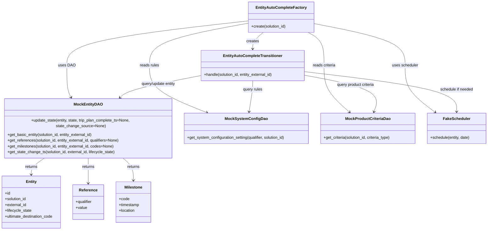
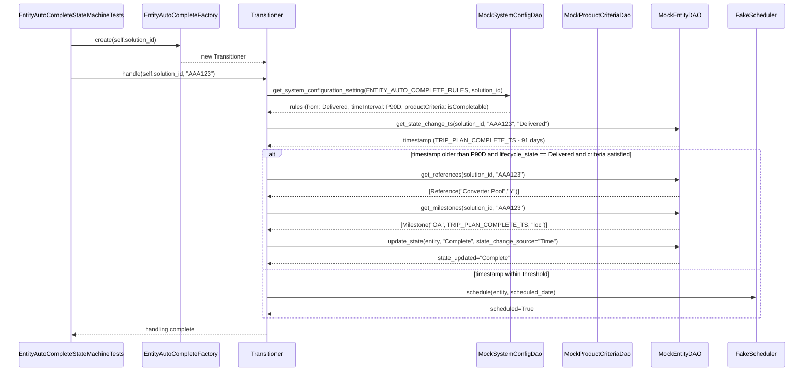

# Diagram: entity_core/entity_service/entity_service_tests/entity_state_machine_tests/test_entity_auto_complete_state_machine.py

> Auto-generated by Obscura crawlers

## Diagram 1

### SVG

<svg id="container" width="2037.2265625" xmlns="http://www.w3.org/2000/svg" class="classDiagram" height="928" viewBox="0 0 2037.2265625 928" role="graphics-document document" aria-roledescription="class"><g><defs><marker id="container_class-aggregationStart" class="marker aggregation class" refX="18" refY="7" markerWidth="190" markerHeight="240" orient="auto"><path d="M 18,7 L9,13 L1,7 L9,1 Z"></path></marker></defs><defs><marker id="container_class-aggregationEnd" class="marker aggregation class" refX="1" refY="7" markerWidth="20" markerHeight="28" orient="auto"><path d="M 18,7 L9,13 L1,7 L9,1 Z"></path></marker></defs><defs><marker id="container_class-extensionStart" class="marker extension class" refX="18" refY="7" markerWidth="190" markerHeight="240" orient="auto"><path d="M 1,7 L18,13 V 1 Z"></path></marker></defs><defs><marker id="container_class-extensionEnd" class="marker extension class" refX="1" refY="7" markerWidth="20" markerHeight="28" orient="auto"><path d="M 1,1 V 13 L18,7 Z"></path></marker></defs><defs><marker id="container_class-compositionStart" class="marker composition class" refX="18" refY="7" markerWidth="190" markerHeight="240" orient="auto"><path d="M 18,7 L9,13 L1,7 L9,1 Z"></path></marker></defs><defs><marker id="container_class-compositionEnd" class="marker composition class" refX="1" refY="7" markerWidth="20" markerHeight="28" orient="auto"><path d="M 18,7 L9,13 L1,7 L9,1 Z"></path></marker></defs><defs><marker id="container_class-dependencyStart" class="marker dependency class" refX="6" refY="7" markerWidth="190" markerHeight="240" orient="auto"><path d="M 5,7 L9,13 L1,7 L9,1 Z"></path></marker></defs><defs><marker id="container_class-dependencyEnd" class="marker dependency class" refX="13" refY="7" markerWidth="20" markerHeight="28" orient="auto"><path d="M 18,7 L9,13 L14,7 L9,1 Z"></path></marker></defs><defs><marker id="container_class-lollipopStart" class="marker lollipop class" refX="13" refY="7" markerWidth="190" markerHeight="240" orient="auto"><circle stroke="black" fill="transparent" cx="7" cy="7" r="6"></circle></marker></defs><defs><marker id="container_class-lollipopEnd" class="marker lollipop class" refX="1" refY="7" markerWidth="190" markerHeight="240" orient="auto"><circle stroke="black" fill="transparent" cx="7" cy="7" r="6"></circle></marker></defs><g class="root"><g class="clusters"></g><g class="edgePaths"><path d="M1041.828,95.537L972.883,108.114C903.939,120.691,766.049,145.846,697.105,175.089C628.16,204.333,628.16,237.667,628.16,271C628.16,304.333,628.16,337.667,665.762,368.155C703.364,398.643,778.568,426.287,816.171,440.108L853.773,453.93" id="id_EntityAutoCompleteFactory_MockSystemConfigDao_1" class="edge-thickness-normal edge-pattern-solid relation" style=";;;" data-edge="true" data-et="edge" data-id="id_EntityAutoCompleteFactory_MockSystemConfigDao_1" data-points="W3sieCI6MTA0MS44MjgxMjUsInkiOjk1LjUzNjgxMjcwMTMwODMyfSx7IngiOjYyOC4xNjAxNTYyNSwieSI6MTcxfSx7IngiOjYyOC4xNjAxNTYyNSwieSI6MjcxfSx7IngiOjYyOC4xNjAxNTYyNSwieSI6MzcxfSx7IngiOjg1OS40MDQyMTc2OTQyNTY4LCJ5Ijo0NTZ9XQ==" marker-end="url(#container_class-dependencyEnd)"></path><path d="M1289.487,134L1300.563,140.167C1311.639,146.333,1333.791,158.667,1344.867,181.5C1355.943,204.333,1355.943,237.667,1355.943,271C1355.943,304.333,1355.943,337.667,1372.608,367.87C1389.273,398.072,1422.603,425.145,1439.268,438.681L1455.933,452.217" id="id_EntityAutoCompleteFactory_MockProductCriteriaDao_2" class="edge-thickness-normal edge-pattern-solid relation" style=";;;" data-edge="true" data-et="edge" data-id="id_EntityAutoCompleteFactory_MockProductCriteriaDao_2" data-points="W3sieCI6MTI4OS40ODcxNjc5Njg3NSwieSI6MTM0fSx7IngiOjEzNTUuOTQzMzU5Mzc1LCJ5IjoxNzF9LHsieCI6MTM1NS45NDMzNTkzNzUsInkiOjI3MX0seyJ4IjoxMzU1Ljk0MzM1OTM3NSwieSI6MzcxfSx7IngiOjE0NjAuNTkwNDExMjExOTkzMywieSI6NDU2fV0=" marker-end="url(#container_class-dependencyEnd)"></path><path d="M1041.828,85.958L914.376,100.132C786.923,114.305,532.018,142.653,404.566,173.493C277.113,204.333,277.113,237.667,277.113,271C277.113,304.333,277.113,337.667,280.476,359.655C283.838,381.643,290.563,392.285,293.925,397.606L297.287,402.928" id="id_EntityAutoCompleteFactory_MockEntityDAO_3" class="edge-thickness-normal edge-pattern-solid relation" style=";;;" data-edge="true" data-et="edge" data-id="id_EntityAutoCompleteFactory_MockEntityDAO_3" data-points="W3sieCI6MTA0MS44MjgxMjUsInkiOjg1Ljk1Nzg2MjcyODA2MjU1fSx7IngiOjI3Ny4xMTMyODEyNSwieSI6MTcxfSx7IngiOjI3Ny4xMTMyODEyNSwieSI6MjcxfSx7IngiOjI3Ny4xMTMyODEyNSwieSI6MzcxfSx7IngiOjMwMC40OTIxODc1LCJ5Ijo0MDh9XQ==" marker-end="url(#container_class-dependencyEnd)"></path><path d="M1310.836,96.948L1374.811,109.29C1438.786,121.632,1566.737,146.316,1630.712,175.325C1694.688,204.333,1694.688,237.667,1694.688,271C1694.688,304.333,1694.688,337.667,1714.258,367.929C1733.829,398.192,1772.97,425.384,1792.541,438.981L1812.111,452.577" id="id_EntityAutoCompleteFactory_FakeScheduler_4" class="edge-thickness-normal edge-pattern-solid relation" style=";;;" data-edge="true" data-et="edge" data-id="id_EntityAutoCompleteFactory_FakeScheduler_4" data-points="W3sieCI6MTMxMC44MzU5Mzc1LCJ5Ijo5Ni45NDgxOTg1NTQ2MjM2Mn0seyJ4IjoxNjk0LjY4NzUsInkiOjE3MX0seyJ4IjoxNjk0LjY4NzUsInkiOjI3MX0seyJ4IjoxNjk0LjY4NzUsInkiOjM3MX0seyJ4IjoxODE3LjAzODc3MjE3MDYwODEsInkiOjQ1Nn1d" marker-end="url(#container_class-dependencyEnd)"></path><path d="M1101.166,134L1093.809,140.167C1086.451,146.333,1071.736,158.667,1064.379,170C1057.021,181.333,1057.021,191.667,1057.021,196.833L1057.021,202" id="id_EntityAutoCompleteFactory_EntityAutoCompleteTransitioner_5" class="edge-thickness-normal edge-pattern-solid relation" style=";;;" data-edge="true" data-et="edge" data-id="id_EntityAutoCompleteFactory_EntityAutoCompleteTransitioner_5" data-points="W3sieCI6MTEwMS4xNjYzODY3MTg3NSwieSI6MTM0fSx7IngiOjEwNTcuMDIxNDg0Mzc1LCJ5IjoxNzF9LHsieCI6MTA1Ny4wMjE0ODQzNzUsInkiOjIwOH1d" marker-end="url(#container_class-dependencyEnd)"></path><path d="M1057.021,334L1057.021,340.167C1057.021,346.333,1057.021,358.667,1054.686,378.015C1052.35,397.364,1047.678,423.728,1045.343,436.91L1043.007,450.092" id="id_EntityAutoCompleteTransitioner_MockSystemConfigDao_6" class="edge-thickness-normal edge-pattern-solid relation" style=";;;" data-edge="true" data-et="edge" data-id="id_EntityAutoCompleteTransitioner_MockSystemConfigDao_6" data-points="W3sieCI6MTA1Ny4wMjE0ODQzNzUsInkiOjMzNH0seyJ4IjoxMDU3LjAyMTQ4NDM3NSwieSI6MzcxfSx7IngiOjEwNDEuOTYwMDUzMzE1MDMzNywieSI6NDU2fV0=" marker-end="url(#container_class-dependencyEnd)"></path><path d="M1272.826,311.099L1326.556,321.082C1380.285,331.066,1487.744,351.033,1536.372,374.25C1585.001,397.467,1574.798,423.934,1569.697,437.168L1564.596,450.402" id="id_EntityAutoCompleteTransitioner_MockProductCriteriaDao_7" class="edge-thickness-normal edge-pattern-solid relation" style=";;;" data-edge="true" data-et="edge" data-id="id_EntityAutoCompleteTransitioner_MockProductCriteriaDao_7" data-points="W3sieCI6MTI3Mi44MjYxNzE4NzUsInkiOjMxMS4wOTg4NTcxOTA1NTQxfSx7IngiOjE1OTUuMjAzMTI1LCJ5IjozNzF9LHsieCI6MTU2Mi40Mzc0NzM2MDY0MTksInkiOjQ1Nn1d" marker-end="url(#container_class-dependencyEnd)"></path><path d="M841.217,312.312L790.121,322.093C739.026,331.875,636.835,351.437,579.648,366.715C522.461,381.993,510.278,392.987,504.187,398.484L498.095,403.98" id="id_EntityAutoCompleteTransitioner_MockEntityDAO_8" class="edge-thickness-normal edge-pattern-solid relation" style=";;;" data-edge="true" data-et="edge" data-id="id_EntityAutoCompleteTransitioner_MockEntityDAO_8" data-points="W3sieCI6ODQxLjIxNjc5Njg3NSwieSI6MzEyLjMxMjA2MTM3ODA5MDd9LHsieCI6NTM0LjY0NDUzMTI1LCJ5IjozNzF9LHsieCI6NDkzLjY0MDYyNSwieSI6NDA4fV0=" marker-end="url(#container_class-dependencyEnd)"></path><path d="M1272.826,296.368L1378.642,308.807C1484.458,321.245,1696.09,346.123,1801.907,371.728C1907.723,397.333,1907.723,423.667,1907.723,436.833L1907.723,450" id="id_EntityAutoCompleteTransitioner_FakeScheduler_9" class="edge-thickness-normal edge-pattern-solid relation" style=";;;" data-edge="true" data-et="edge" data-id="id_EntityAutoCompleteTransitioner_FakeScheduler_9" data-points="W3sieCI6MTI3Mi44MjYxNzE4NzUsInkiOjI5Ni4zNjc4NjA2MTEzMDY0fSx7IngiOjE5MDcuNzIyNjU2MjUsInkiOjM3MX0seyJ4IjoxOTA3LjcyMjY1NjI1LCJ5Ijo0NTZ9XQ==" marker-end="url(#container_class-dependencyEnd)"></path><path d="M191.663,630L181.721,636.167C171.778,642.333,151.893,654.667,141.95,666C132.008,677.333,132.008,687.667,132.008,692.833L132.008,698" id="id_MockEntityDAO_Entity_10" class="edge-thickness-normal edge-pattern-solid relation" style=";;;" data-edge="true" data-et="edge" data-id="id_MockEntityDAO_Entity_10" data-points="W3sieCI6MTkxLjY2MzA4NTkzNzUsInkiOjYzMH0seyJ4IjoxMzIuMDA3ODEyNSwieSI6NjY3fSx7IngiOjEzMi4wMDc4MTI1LCJ5Ijo3MDR9XQ==" marker-end="url(#container_class-dependencyEnd)"></path><path d="M370.629,630L370.629,636.167C370.629,642.333,370.629,654.667,370.629,672C370.629,689.333,370.629,711.667,370.629,722.833L370.629,734" id="id_MockEntityDAO_Reference_11" class="edge-thickness-normal edge-pattern-solid relation" style=";;;" data-edge="true" data-et="edge" data-id="id_MockEntityDAO_Reference_11" data-points="W3sieCI6MzcwLjYyODkwNjI1LCJ5Ijo2MzB9LHsieCI6MzcwLjYyODkwNjI1LCJ5Ijo2Njd9LHsieCI6MzcwLjYyODkwNjI1LCJ5Ijo3NDB9XQ==" marker-end="url(#container_class-dependencyEnd)"></path><path d="M511.151,630L518.958,636.167C526.765,642.333,542.379,654.667,550.185,670C557.992,685.333,557.992,703.667,557.992,712.833L557.992,722" id="id_MockEntityDAO_Milestone_12" class="edge-thickness-normal edge-pattern-solid relation" style=";;;" data-edge="true" data-et="edge" data-id="id_MockEntityDAO_Milestone_12" data-points="W3sieCI6NTExLjE1MTM2NzE4NzUsInkiOjYzMH0seyJ4Ijo1NTcuOTkyMTg3NSwieSI6NjY3fSx7IngiOjU1Ny45OTIxODc1LCJ5Ijo3Mjh9XQ==" marker-end="url(#container_class-dependencyEnd)"></path></g><g class="edgeLabels"><g class="edgeLabel" transform="translate(628.16015625, 271)"><g class="label" data-id="id_EntityAutoCompleteFactory_MockSystemConfigDao_1" transform="translate(-40.265625, -12)"><foreignObject width="80.53125" height="24">

reads rules

</foreignObject></g></g><g class="edgeLabel" transform="translate(1355.943359375, 271)"><g class="label" data-id="id_EntityAutoCompleteFactory_MockProductCriteriaDao_2" transform="translate(-48.1171875, -12)"><foreignObject width="96.234375" height="24">

reads criteria

</foreignObject></g></g><g class="edgeLabel" transform="translate(277.11328125, 271)"><g class="label" data-id="id_EntityAutoCompleteFactory_MockEntityDAO_3" transform="translate(-33.7265625, -12)"><foreignObject width="67.453125" height="24">

uses DAO

</foreignObject></g></g><g class="edgeLabel" transform="translate(1694.6875, 271)"><g class="label" data-id="id_EntityAutoCompleteFactory_FakeScheduler_4" transform="translate(-54.4140625, -12)"><foreignObject width="108.828125" height="24">

uses scheduler

</foreignObject></g></g><g class="edgeLabel" transform="translate(1057.021484375, 171)"><g class="label" data-id="id_EntityAutoCompleteFactory_EntityAutoCompleteTransitioner_5" transform="translate(-26.171875, -12)"><foreignObject width="52.34375" height="24">

creates

</foreignObject></g></g><g class="edgeLabel" transform="translate(1057.021484375, 371)"><g class="label" data-id="id_EntityAutoCompleteTransitioner_MockSystemConfigDao_6" transform="translate(-41.09375, -12)"><foreignObject width="82.1875" height="24">

query rules

</foreignObject></g></g><g class="edgeLabel" transform="translate(1478.79644, 349.37037)"><g class="label" data-id="id_EntityAutoCompleteTransitioner_MockProductCriteriaDao_7" transform="translate(-79.484375, -12)"><foreignObject width="158.96875" height="24">

query product criteria

</foreignObject></g></g><g class="edgeLabel" transform="translate(660.80831, 346.84813)"><g class="label" data-id="id_EntityAutoCompleteTransitioner_MockEntityDAO_8" transform="translate(-73.515625, -12)"><foreignObject width="147.03125" height="24">

query/update entity

</foreignObject></g></g><g class="edgeLabel" transform="translate(1907.72265625, 371)"><g class="label" data-id="id_EntityAutoCompleteTransitioner_FakeScheduler_9" transform="translate(-69.2265625, -12)"><foreignObject width="138.453125" height="24">

schedule if needed

</foreignObject></g></g><g class="edgeLabel" transform="translate(132.0078125, 667)"><g class="label" data-id="id_MockEntityDAO_Entity_10" transform="translate(-26.265625, -12)"><foreignObject width="52.53125" height="24">

returns

</foreignObject></g></g><g class="edgeLabel" transform="translate(370.62890625, 667)"><g class="label" data-id="id_MockEntityDAO_Reference_11" transform="translate(-26.265625, -12)"><foreignObject width="52.53125" height="24">

returns

</foreignObject></g></g><g class="edgeLabel" transform="translate(557.9921875, 667)"><g class="label" data-id="id_MockEntityDAO_Milestone_12" transform="translate(-26.265625, -12)"><foreignObject width="52.53125" height="24">

returns

</foreignObject></g></g></g><g class="nodes"><g class="node default" id="classId-EntityAutoCompleteFactory-0" transform="translate(1176.33203125, 71)"><g class="basic label-container"><path d="M-134.50390625 -63 L134.50390625 -63 L134.50390625 63 L-134.50390625 63" stroke="none" stroke-width="0" fill="#ECECFF" style=""></path><path d="M-134.50390625 -63 C-51.107559651187074 -63, 32.28878694762585 -63, 134.50390625 -63 M-134.50390625 -63 C-60.1176313079672 -63, 14.268643634065597 -63, 134.50390625 -63 M134.50390625 -63 C134.50390625 -28.05442467180228, 134.50390625 6.891150656395439, 134.50390625 63 M134.50390625 -63 C134.50390625 -12.68324279817017, 134.50390625 37.63351440365966, 134.50390625 63 M134.50390625 63 C35.321379045497395 63, -63.86114815900521 63, -134.50390625 63 M134.50390625 63 C56.48556422296504 63, -21.532777804069923 63, -134.50390625 63 M-134.50390625 63 C-134.50390625 16.534586039350074, -134.50390625 -29.93082792129985, -134.50390625 -63 M-134.50390625 63 C-134.50390625 26.8550926619246, -134.50390625 -9.289814676150797, -134.50390625 -63" stroke="#9370DB" stroke-width="1.3" fill="none" stroke-dasharray="0 0" style=""></path></g><g class="annotation-group text" transform="translate(0, -39)"></g><g class="label-group text" transform="translate(-99.5546875, -39)"><g class="label" style="font-weight: bolder" transform="translate(0,-12)"><foreignObject width="199.109375" height="24">

EntityAutoCompleteFactory

</foreignObject></g></g><g class="members-group text" transform="translate(-122.50390625, 9)"></g><g class="methods-group text" transform="translate(-122.50390625, 39)"><g class="label" style="" transform="translate(0,-12)"><foreignObject width="145.453125" height="24">

+create(solution_id)

</foreignObject></g></g><g class="divider" style=""><path d="M-134.50390625 -15 C-53.225186413063184 -15, 28.05353342387363 -15, 134.50390625 -15 M-134.50390625 -15 C-63.76291078445496 -15, 6.978084681090081 -15, 134.50390625 -15" stroke="#9370DB" stroke-width="1.3" fill="none" stroke-dasharray="0 0" style=""></path></g><g class="divider" style=""><path d="M-134.50390625 9 C-31.34842131107459 9, 71.80706362785082 9, 134.50390625 9 M-134.50390625 9 C-74.02348037122434 9, -13.543054492448661 9, 134.50390625 9" stroke="#9370DB" stroke-width="1.3" fill="none" stroke-dasharray="0 0" style=""></path></g></g><g class="node default" id="classId-EntityAutoCompleteTransitioner-1" transform="translate(1057.021484375, 271)"><g class="basic label-container"><path d="M-215.8046875 -63 L215.8046875 -63 L215.8046875 63 L-215.8046875 63" stroke="none" stroke-width="0" fill="#ECECFF" style=""></path><path d="M-215.8046875 -63 C-55.24304108772145 -63, 105.3186053245571 -63, 215.8046875 -63 M-215.8046875 -63 C-65.57254198204024 -63, 84.65960353591953 -63, 215.8046875 -63 M215.8046875 -63 C215.8046875 -29.940075616450365, 215.8046875 3.1198487670992705, 215.8046875 63 M215.8046875 -63 C215.8046875 -30.955088842573545, 215.8046875 1.0898223148529098, 215.8046875 63 M215.8046875 63 C73.5912546924551 63, -68.62217811508981 63, -215.8046875 63 M215.8046875 63 C44.39443057105197 63, -127.01582635789606 63, -215.8046875 63 M-215.8046875 63 C-215.8046875 31.237078445915923, -215.8046875 -0.5258431081681536, -215.8046875 -63 M-215.8046875 63 C-215.8046875 24.364962598176717, -215.8046875 -14.270074803646565, -215.8046875 -63" stroke="#9370DB" stroke-width="1.3" fill="none" stroke-dasharray="0 0" style=""></path></g><g class="annotation-group text" transform="translate(0, -39)"></g><g class="label-group text" transform="translate(-117.34375, -39)"><g class="label" style="font-weight: bolder" transform="translate(0,-12)"><foreignObject width="234.6875" height="24">

EntityAutoCompleteTransitioner

</foreignObject></g></g><g class="members-group text" transform="translate(-203.8046875, 9)"></g><g class="methods-group text" transform="translate(-203.8046875, 39)"><g class="label" style="" transform="translate(0,-12)"><foreignObject width="290.265625" height="24">

+handle(solution_id, entity_external_id)

</foreignObject></g></g><g class="divider" style=""><path d="M-215.8046875 -15 C-108.5606234717894 -15, -1.3165594435787966 -15, 215.8046875 -15 M-215.8046875 -15 C-59.44876468363114 -15, 96.90715813273772 -15, 215.8046875 -15" stroke="#9370DB" stroke-width="1.3" fill="none" stroke-dasharray="0 0" style=""></path></g><g class="divider" style=""><path d="M-215.8046875 9 C-55.46277595691538 9, 104.87913558616924 9, 215.8046875 9 M-215.8046875 9 C-58.864146200461846 9, 98.07639509907631 9, 215.8046875 9" stroke="#9370DB" stroke-width="1.3" fill="none" stroke-dasharray="0 0" style=""></path></g></g><g class="node default" id="classId-MockEntityDAO-2" transform="translate(370.62890625, 519)"><g class="basic label-container"><path d="M-350.87890625 -111 L350.87890625 -111 L350.87890625 111 L-350.87890625 111" stroke="none" stroke-width="0" fill="#ECECFF" style=""></path><path d="M-350.87890625 -111 C-158.4639310695983 -111, 33.95104411080342 -111, 350.87890625 -111 M-350.87890625 -111 C-157.71210843458528 -111, 35.45468938082945 -111, 350.87890625 -111 M350.87890625 -111 C350.87890625 -32.62524482187665, 350.87890625 45.7495103562467, 350.87890625 111 M350.87890625 -111 C350.87890625 -57.7293378788485, 350.87890625 -4.458675757696994, 350.87890625 111 M350.87890625 111 C154.9525745642911 111, -40.973757121417805 111, -350.87890625 111 M350.87890625 111 C83.66041555545456 111, -183.55807513909087 111, -350.87890625 111 M-350.87890625 111 C-350.87890625 51.219400131368864, -350.87890625 -8.561199737262271, -350.87890625 -111 M-350.87890625 111 C-350.87890625 28.912571193378966, -350.87890625 -53.17485761324207, -350.87890625 -111" stroke="#9370DB" stroke-width="1.3" fill="none" stroke-dasharray="0 0" style=""></path></g><g class="annotation-group text" transform="translate(0, -87)"></g><g class="label-group text" transform="translate(-55.7890625, -87)"><g class="label" style="font-weight: bolder" transform="translate(0,-12)"><foreignObject width="111.578125" height="24">

MockEntityDAO

</foreignObject></g></g><g class="members-group text" transform="translate(-338.87890625, -39)"></g><g class="methods-group text" transform="translate(-338.87890625, -9)"><g class="label" style="" transform="translate(0,-12)"><foreignObject width="621.96875" height="24">

+update_state(entity, state, trip_plan_complete_ts=None, state_change_source=None)

</foreignObject></g><g class="label" style="" transform="translate(0,12)"><foreignObject width="358.265625" height="24">

+get_basic_entity(solution_id, entity_external_id)

</foreignObject></g><g class="label" style="" transform="translate(0,36)"><foreignObject width="468.84375" height="24">

+get_references(solution_id, entity_external_id, qualifiers=None)

</foreignObject></g><g class="label" style="" transform="translate(0,60)"><foreignObject width="447.140625" height="24">

+get_milestones(solution_id, entity_external_id, codes=None)

</foreignObject></g><g class="label" style="" transform="translate(0,84)"><foreignObject width="449.640625" height="24">

+get_state_change_ts(solution_id, external_id, lifecycle_state)

</foreignObject></g></g><g class="divider" style=""><path d="M-350.87890625 -63 C-208.88160195204293 -63, -66.88429765408586 -63, 350.87890625 -63 M-350.87890625 -63 C-147.58731070094913 -63, 55.704284848101736 -63, 350.87890625 -63" stroke="#9370DB" stroke-width="1.3" fill="none" stroke-dasharray="0 0" style=""></path></g><g class="divider" style=""><path d="M-350.87890625 -39 C-193.20595111522175 -39, -35.5329959804435 -39, 350.87890625 -39 M-350.87890625 -39 C-163.09579533249604 -39, 24.687315585007923 -39, 350.87890625 -39" stroke="#9370DB" stroke-width="1.3" fill="none" stroke-dasharray="0 0" style=""></path></g></g><g class="node default" id="classId-MockSystemConfigDao-3" transform="translate(1030.796875, 519)"><g class="basic label-container"><path d="M-259.2890625 -63 L259.2890625 -63 L259.2890625 63 L-259.2890625 63" stroke="none" stroke-width="0" fill="#ECECFF" style=""></path><path d="M-259.2890625 -63 C-122.31441370045437 -63, 14.660235099091267 -63, 259.2890625 -63 M-259.2890625 -63 C-93.81935203333359 -63, 71.65035843333283 -63, 259.2890625 -63 M259.2890625 -63 C259.2890625 -26.081309665763463, 259.2890625 10.837380668473074, 259.2890625 63 M259.2890625 -63 C259.2890625 -27.54444576116866, 259.2890625 7.91110847766268, 259.2890625 63 M259.2890625 63 C59.34602847310103 63, -140.59700555379794 63, -259.2890625 63 M259.2890625 63 C71.66481659393489 63, -115.95942931213023 63, -259.2890625 63 M-259.2890625 63 C-259.2890625 26.735670917851373, -259.2890625 -9.528658164297255, -259.2890625 -63 M-259.2890625 63 C-259.2890625 34.65514838061014, -259.2890625 6.310296761220293, -259.2890625 -63" stroke="#9370DB" stroke-width="1.3" fill="none" stroke-dasharray="0 0" style=""></path></g><g class="annotation-group text" transform="translate(0, -39)"></g><g class="label-group text" transform="translate(-82.875, -39)"><g class="label" style="font-weight: bolder" transform="translate(0,-12)"><foreignObject width="165.75" height="24">

MockSystemConfigDao

</foreignObject></g></g><g class="members-group text" transform="translate(-247.2890625, 9)"></g><g class="methods-group text" transform="translate(-247.2890625, 39)"><g class="label" style="" transform="translate(0,-12)"><foreignObject width="411.703125" height="24">

+get_system_configuration_setting(qualifier, solution_id)

</foreignObject></g></g><g class="divider" style=""><path d="M-259.2890625 -15 C-104.86956183022642 -15, 49.54993883954717 -15, 259.2890625 -15 M-259.2890625 -15 C-146.9950049424987 -15, -34.70094738499739 -15, 259.2890625 -15" stroke="#9370DB" stroke-width="1.3" fill="none" stroke-dasharray="0 0" style=""></path></g><g class="divider" style=""><path d="M-259.2890625 9 C-117.12820096316335 9, 25.032660573673297 9, 259.2890625 9 M-259.2890625 9 C-99.64106576176755 9, 60.0069309764649 9, 259.2890625 9" stroke="#9370DB" stroke-width="1.3" fill="none" stroke-dasharray="0 0" style=""></path></g></g><g class="node default" id="classId-MockProductCriteriaDao-4" transform="translate(1538.15234375, 519)"><g class="basic label-container"><path d="M-198.06640625 -63 L198.06640625 -63 L198.06640625 63 L-198.06640625 63" stroke="none" stroke-width="0" fill="#ECECFF" style=""></path><path d="M-198.06640625 -63 C-68.51432810716648 -63, 61.037750035667045 -63, 198.06640625 -63 M-198.06640625 -63 C-77.43058156683239 -63, 43.205243116335225 -63, 198.06640625 -63 M198.06640625 -63 C198.06640625 -32.86962595479445, 198.06640625 -2.7392519095889014, 198.06640625 63 M198.06640625 -63 C198.06640625 -33.86427480138521, 198.06640625 -4.728549602770421, 198.06640625 63 M198.06640625 63 C83.50526301888479 63, -31.05588021223042 63, -198.06640625 63 M198.06640625 63 C44.48152421370989 63, -109.10335782258022 63, -198.06640625 63 M-198.06640625 63 C-198.06640625 36.38332160942248, -198.06640625 9.766643218844962, -198.06640625 -63 M-198.06640625 63 C-198.06640625 27.776440476931313, -198.06640625 -7.447119046137374, -198.06640625 -63" stroke="#9370DB" stroke-width="1.3" fill="none" stroke-dasharray="0 0" style=""></path></g><g class="annotation-group text" transform="translate(0, -39)"></g><g class="label-group text" transform="translate(-89.1484375, -39)"><g class="label" style="font-weight: bolder" transform="translate(0,-12)"><foreignObject width="178.296875" height="24">

MockProductCriteriaDao

</foreignObject></g></g><g class="members-group text" transform="translate(-186.06640625, 9)"></g><g class="methods-group text" transform="translate(-186.06640625, 39)"><g class="label" style="" transform="translate(0,-12)"><foreignObject width="282.984375" height="24">

+get_criteria(solution_id, criteria_type)

</foreignObject></g></g><g class="divider" style=""><path d="M-198.06640625 -15 C-87.06642431388282 -15, 23.93355762223436 -15, 198.06640625 -15 M-198.06640625 -15 C-89.64243913558597 -15, 18.781527978828052 -15, 198.06640625 -15" stroke="#9370DB" stroke-width="1.3" fill="none" stroke-dasharray="0 0" style=""></path></g><g class="divider" style=""><path d="M-198.06640625 9 C-55.45437831171182 9, 87.15764962657636 9, 198.06640625 9 M-198.06640625 9 C-69.61189487797174 9, 58.84261649405653 9, 198.06640625 9" stroke="#9370DB" stroke-width="1.3" fill="none" stroke-dasharray="0 0" style=""></path></g></g><g class="node default" id="classId-FakeScheduler-5" transform="translate(1907.72265625, 519)"><g class="basic label-container"><path d="M-121.50390625 -63 L121.50390625 -63 L121.50390625 63 L-121.50390625 63" stroke="none" stroke-width="0" fill="#ECECFF" style=""></path><path d="M-121.50390625 -63 C-41.76321850743561 -63, 37.97746923512878 -63, 121.50390625 -63 M-121.50390625 -63 C-27.9772619285787 -63, 65.5493823928426 -63, 121.50390625 -63 M121.50390625 -63 C121.50390625 -24.345713921053083, 121.50390625 14.308572157893835, 121.50390625 63 M121.50390625 -63 C121.50390625 -22.605161330395802, 121.50390625 17.789677339208396, 121.50390625 63 M121.50390625 63 C49.00690481091098 63, -23.490096628178037 63, -121.50390625 63 M121.50390625 63 C50.44438013018289 63, -20.615145989634215 63, -121.50390625 63 M-121.50390625 63 C-121.50390625 22.76698592890567, -121.50390625 -17.466028142188662, -121.50390625 -63 M-121.50390625 63 C-121.50390625 18.06356442858796, -121.50390625 -26.87287114282408, -121.50390625 -63" stroke="#9370DB" stroke-width="1.3" fill="none" stroke-dasharray="0 0" style=""></path></g><g class="annotation-group text" transform="translate(0, -39)"></g><g class="label-group text" transform="translate(-53.3046875, -39)"><g class="label" style="font-weight: bolder" transform="translate(0,-12)"><foreignObject width="106.609375" height="24">

FakeScheduler

</foreignObject></g></g><g class="members-group text" transform="translate(-109.50390625, 9)"></g><g class="methods-group text" transform="translate(-109.50390625, 39)"><g class="label" style="" transform="translate(0,-12)"><foreignObject width="165.703125" height="24">

+schedule(entity, date)

</foreignObject></g></g><g class="divider" style=""><path d="M-121.50390625 -15 C-46.949804244977884 -15, 27.604297760044233 -15, 121.50390625 -15 M-121.50390625 -15 C-64.32155649634836 -15, -7.139206742696729 -15, 121.50390625 -15" stroke="#9370DB" stroke-width="1.3" fill="none" stroke-dasharray="0 0" style=""></path></g><g class="divider" style=""><path d="M-121.50390625 9 C-27.851745596976585 9, 65.80041505604683 9, 121.50390625 9 M-121.50390625 9 C-55.4582232661397 9, 10.587459717720606 9, 121.50390625 9" stroke="#9370DB" stroke-width="1.3" fill="none" stroke-dasharray="0 0" style=""></path></g></g><g class="node default" id="classId-Entity-6" transform="translate(132.0078125, 812)"><g class="basic label-container"><path d="M-124.0078125 -108 L124.0078125 -108 L124.0078125 108 L-124.0078125 108" stroke="none" stroke-width="0" fill="#ECECFF" style=""></path><path d="M-124.0078125 -108 C-35.40786494655872 -108, 53.192082606882565 -108, 124.0078125 -108 M-124.0078125 -108 C-35.85767422844715 -108, 52.292464043105696 -108, 124.0078125 -108 M124.0078125 -108 C124.0078125 -21.824135057467345, 124.0078125 64.35172988506531, 124.0078125 108 M124.0078125 -108 C124.0078125 -44.38742782018642, 124.0078125 19.225144359627166, 124.0078125 108 M124.0078125 108 C57.051304915621046 108, -9.905202668757909 108, -124.0078125 108 M124.0078125 108 C26.65130696830728 108, -70.70519856338544 108, -124.0078125 108 M-124.0078125 108 C-124.0078125 47.29479278366424, -124.0078125 -13.410414432671516, -124.0078125 -108 M-124.0078125 108 C-124.0078125 51.003171253932194, -124.0078125 -5.993657492135611, -124.0078125 -108" stroke="#9370DB" stroke-width="1.3" fill="none" stroke-dasharray="0 0" style=""></path></g><g class="annotation-group text" transform="translate(0, -84)"></g><g class="label-group text" transform="translate(-21.28125, -84)"><g class="label" style="font-weight: bolder" transform="translate(0,-12)"><foreignObject width="42.5625" height="24">

Entity

</foreignObject></g></g><g class="members-group text" transform="translate(-112.0078125, -36)"><g class="label" style="" transform="translate(0,-12)"><foreignObject width="22.078125" height="24">

+id

</foreignObject></g><g class="label" style="" transform="translate(0,12)"><foreignObject width="90.21875" height="24">

+solution_id

</foreignObject></g><g class="label" style="" transform="translate(0,36)"><foreignObject width="89.765625" height="24">

+external_id

</foreignObject></g><g class="label" style="" transform="translate(0,60)"><foreignObject width="111.640625" height="24">

+lifecycle_state

</foreignObject></g><g class="label" style="" transform="translate(0,84)"><foreignObject width="202.734375" height="24">

+ultimate_destination_code

</foreignObject></g></g><g class="methods-group text" transform="translate(-112.0078125, 108)"></g><g class="divider" style=""><path d="M-124.0078125 -60 C-50.2146996818507 -60, 23.578413136298593 -60, 124.0078125 -60 M-124.0078125 -60 C-33.12377009964281 -60, 57.76027230071438 -60, 124.0078125 -60" stroke="#9370DB" stroke-width="1.3" fill="none" stroke-dasharray="0 0" style=""></path></g><g class="divider" style=""><path d="M-124.0078125 84 C-66.563452909517 84, -9.119093319033993 84, 124.0078125 84 M-124.0078125 84 C-33.51501373696331 84, 56.97778502607338 84, 124.0078125 84" stroke="#9370DB" stroke-width="1.3" fill="none" stroke-dasharray="0 0" style=""></path></g></g><g class="node default" id="classId-Reference-7" transform="translate(370.62890625, 812)"><g class="basic label-container"><path d="M-64.61328125 -72 L64.61328125 -72 L64.61328125 72 L-64.61328125 72" stroke="none" stroke-width="0" fill="#ECECFF" style=""></path><path d="M-64.61328125 -72 C-36.850452201285975 -72, -9.08762315257195 -72, 64.61328125 -72 M-64.61328125 -72 C-17.48074561913834 -72, 29.65179001172332 -72, 64.61328125 -72 M64.61328125 -72 C64.61328125 -20.37993120051516, 64.61328125 31.24013759896968, 64.61328125 72 M64.61328125 -72 C64.61328125 -33.149278093825835, 64.61328125 5.70144381234833, 64.61328125 72 M64.61328125 72 C27.37721767516844 72, -9.858845899663123 72, -64.61328125 72 M64.61328125 72 C20.680774017866632 72, -23.251733214266736 72, -64.61328125 72 M-64.61328125 72 C-64.61328125 22.32640596871579, -64.61328125 -27.34718806256842, -64.61328125 -72 M-64.61328125 72 C-64.61328125 15.509781266668426, -64.61328125 -40.98043746666315, -64.61328125 -72" stroke="#9370DB" stroke-width="1.3" fill="none" stroke-dasharray="0 0" style=""></path></g><g class="annotation-group text" transform="translate(0, -48)"></g><g class="label-group text" transform="translate(-36.5078125, -48)"><g class="label" style="font-weight: bolder" transform="translate(0,-12)"><foreignObject width="73.015625" height="24">

Reference

</foreignObject></g></g><g class="members-group text" transform="translate(-52.61328125, 0)"><g class="label" style="" transform="translate(0,-12)"><foreignObject width="68.71875" height="24">

+qualifier

</foreignObject></g><g class="label" style="" transform="translate(0,12)"><foreignObject width="46.71875" height="24">

+value

</foreignObject></g></g><g class="methods-group text" transform="translate(-52.61328125, 72)"></g><g class="divider" style=""><path d="M-64.61328125 -24 C-35.27770565914048 -24, -5.94213006828096 -24, 64.61328125 -24 M-64.61328125 -24 C-15.708553923559705 -24, 33.19617340288059 -24, 64.61328125 -24" stroke="#9370DB" stroke-width="1.3" fill="none" stroke-dasharray="0 0" style=""></path></g><g class="divider" style=""><path d="M-64.61328125 48 C-21.664294676198573 48, 21.284691897602855 48, 64.61328125 48 M-64.61328125 48 C-13.160726263357148 48, 38.291828723285704 48, 64.61328125 48" stroke="#9370DB" stroke-width="1.3" fill="none" stroke-dasharray="0 0" style=""></path></g></g><g class="node default" id="classId-Milestone-8" transform="translate(557.9921875, 812)"><g class="basic label-container"><path d="M-72.75 -84 L72.75 -84 L72.75 84 L-72.75 84" stroke="none" stroke-width="0" fill="#ECECFF" style=""></path><path d="M-72.75 -84 C-37.31055590121329 -84, -1.871111802426583 -84, 72.75 -84 M-72.75 -84 C-25.76698165251507 -84, 21.21603669496986 -84, 72.75 -84 M72.75 -84 C72.75 -16.803605265247143, 72.75 50.392789469505715, 72.75 84 M72.75 -84 C72.75 -45.642204591816274, 72.75 -7.2844091836325475, 72.75 84 M72.75 84 C16.18284291352021 84, -40.38431417295958 84, -72.75 84 M72.75 84 C22.9997555065494 84, -26.750488986901203 84, -72.75 84 M-72.75 84 C-72.75 25.10272190444794, -72.75 -33.79455619110412, -72.75 -84 M-72.75 84 C-72.75 24.649844852365206, -72.75 -34.70031029526959, -72.75 -84" stroke="#9370DB" stroke-width="1.3" fill="none" stroke-dasharray="0 0" style=""></path></g><g class="annotation-group text" transform="translate(0, -60)"></g><g class="label-group text" transform="translate(-35.8125, -60)"><g class="label" style="font-weight: bolder" transform="translate(0,-12)"><foreignObject width="71.625" height="24">

Milestone

</foreignObject></g></g><g class="members-group text" transform="translate(-60.75, -12)"><g class="label" style="" transform="translate(0,-12)"><foreignObject width="42.953125" height="24">

+code

</foreignObject></g><g class="label" style="" transform="translate(0,12)"><foreignObject width="85.6875" height="24">

+timestamp

</foreignObject></g><g class="label" style="" transform="translate(0,36)"><foreignObject width="67.140625" height="24">

+location

</foreignObject></g></g><g class="methods-group text" transform="translate(-60.75, 84)"></g><g class="divider" style=""><path d="M-72.75 -36 C-21.488481872672338 -36, 29.773036254655324 -36, 72.75 -36 M-72.75 -36 C-32.986234937343596 -36, 6.777530125312808 -36, 72.75 -36" stroke="#9370DB" stroke-width="1.3" fill="none" stroke-dasharray="0 0" style=""></path></g><g class="divider" style=""><path d="M-72.75 60 C-31.857768177647557 60, 9.034463644704886 60, 72.75 60 M-72.75 60 C-36.98215235399969 60, -1.214304707999375 60, 72.75 60" stroke="#9370DB" stroke-width="1.3" fill="none" stroke-dasharray="0 0" style=""></path></g></g></g></g></g></svg>

## Diagram 2

### SVG

<svg id="container" width="2171" xmlns="http://www.w3.org/2000/svg" height="1039" viewBox="-50 -10 2171 1039" role="graphics-document document" aria-roledescription="sequence"><g><rect x="1921" y="953" fill="#eaeaea" stroke="#666" width="150" height="65" name="Scheduler" rx="3" ry="3" class="actor actor-bottom"></rect><text x="1996" y="985.5" dominant-baseline="central" alignment-baseline="central" class="actor actor-box" style="text-anchor: middle; font-size: 16px; font-weight: 400;"><tspan x="1996" dy="0">FakeScheduler</tspan></text></g><g><rect x="1721" y="953" fill="#eaeaea" stroke="#666" width="150" height="65" name="EntityDao" rx="3" ry="3" class="actor actor-bottom"></rect><text x="1796" y="985.5" dominant-baseline="central" alignment-baseline="central" class="actor actor-box" style="text-anchor: middle; font-size: 16px; font-weight: 400;"><tspan x="1796" dy="0">MockEntityDAO</tspan></text></g><g><rect x="1476" y="953" fill="#eaeaea" stroke="#666" width="195" height="65" name="ProductCriteria" rx="3" ry="3" class="actor actor-bottom"></rect><text x="1573.5" y="985.5" dominant-baseline="central" alignment-baseline="central" class="actor actor-box" style="text-anchor: middle; font-size: 16px; font-weight: 400;"><tspan x="1573.5" dy="0">MockProductCriteriaDao</tspan></text></g><g><rect x="1244" y="953" fill="#eaeaea" stroke="#666" width="182" height="65" name="SystemConfig" rx="3" ry="3" class="actor actor-bottom"></rect><text x="1335" y="985.5" dominant-baseline="central" alignment-baseline="central" class="actor actor-box" style="text-anchor: middle; font-size: 16px; font-weight: 400;"><tspan x="1335" dy="0">MockSystemConfigDao</tspan></text></g><g><rect x="615" y="953" fill="#eaeaea" stroke="#666" width="150" height="65" name="Transitioner" rx="3" ry="3" class="actor actor-bottom"></rect><text x="690" y="985.5" dominant-baseline="central" alignment-baseline="central" class="actor actor-box" style="text-anchor: middle; font-size: 16px; font-weight: 400;"><tspan x="690" dy="0">Transitioner</tspan></text></g><g><rect x="349" y="953" fill="#eaeaea" stroke="#666" width="216" height="65" name="Factory" rx="3" ry="3" class="actor actor-bottom"></rect><text x="457" y="985.5" dominant-baseline="central" alignment-baseline="central" class="actor actor-box" style="text-anchor: middle; font-size: 16px; font-weight: 400;"><tspan x="457" dy="0">EntityAutoCompleteFactory</tspan></text></g><g><rect x="0" y="953" fill="#eaeaea" stroke="#666" width="299" height="65" name="Test" rx="3" ry="3" class="actor actor-bottom"></rect><text x="149.5" y="985.5" dominant-baseline="central" alignment-baseline="central" class="actor actor-box" style="text-anchor: middle; font-size: 16px; font-weight: 400;"><tspan x="149.5" dy="0">EntityAutoCompleteStateMachineTests</tspan></text></g><g><line id="actor6" x1="1996" y1="65" x2="1996" y2="953" class="actor-line 200" stroke-width="0.5px" stroke="#999" name="Scheduler"></line><g id="root-6"><rect x="1921" y="0" fill="#eaeaea" stroke="#666" width="150" height="65" name="Scheduler" rx="3" ry="3" class="actor actor-top"></rect><text x="1996" y="32.5" dominant-baseline="central" alignment-baseline="central" class="actor actor-box" style="text-anchor: middle; font-size: 16px; font-weight: 400;"><tspan x="1996" dy="0">FakeScheduler</tspan></text></g></g><g><line id="actor5" x1="1796" y1="65" x2="1796" y2="953" class="actor-line 200" stroke-width="0.5px" stroke="#999" name="EntityDao"></line><g id="root-5"><rect x="1721" y="0" fill="#eaeaea" stroke="#666" width="150" height="65" name="EntityDao" rx="3" ry="3" class="actor actor-top"></rect><text x="1796" y="32.5" dominant-baseline="central" alignment-baseline="central" class="actor actor-box" style="text-anchor: middle; font-size: 16px; font-weight: 400;"><tspan x="1796" dy="0">MockEntityDAO</tspan></text></g></g><g><line id="actor4" x1="1573.5" y1="65" x2="1573.5" y2="953" class="actor-line 200" stroke-width="0.5px" stroke="#999" name="ProductCriteria"></line><g id="root-4"><rect x="1476" y="0" fill="#eaeaea" stroke="#666" width="195" height="65" name="ProductCriteria" rx="3" ry="3" class="actor actor-top"></rect><text x="1573.5" y="32.5" dominant-baseline="central" alignment-baseline="central" class="actor actor-box" style="text-anchor: middle; font-size: 16px; font-weight: 400;"><tspan x="1573.5" dy="0">MockProductCriteriaDao</tspan></text></g></g><g><line id="actor3" x1="1335" y1="65" x2="1335" y2="953" class="actor-line 200" stroke-width="0.5px" stroke="#999" name="SystemConfig"></line><g id="root-3"><rect x="1244" y="0" fill="#eaeaea" stroke="#666" width="182" height="65" name="SystemConfig" rx="3" ry="3" class="actor actor-top"></rect><text x="1335" y="32.5" dominant-baseline="central" alignment-baseline="central" class="actor actor-box" style="text-anchor: middle; font-size: 16px; font-weight: 400;"><tspan x="1335" dy="0">MockSystemConfigDao</tspan></text></g></g><g><line id="actor2" x1="690" y1="65" x2="690" y2="953" class="actor-line 200" stroke-width="0.5px" stroke="#999" name="Transitioner"></line><g id="root-2"><rect x="615" y="0" fill="#eaeaea" stroke="#666" width="150" height="65" name="Transitioner" rx="3" ry="3" class="actor actor-top"></rect><text x="690" y="32.5" dominant-baseline="central" alignment-baseline="central" class="actor actor-box" style="text-anchor: middle; font-size: 16px; font-weight: 400;"><tspan x="690" dy="0">Transitioner</tspan></text></g></g><g><line id="actor1" x1="457" y1="65" x2="457" y2="953" class="actor-line 200" stroke-width="0.5px" stroke="#999" name="Factory"></line><g id="root-1"><rect x="349" y="0" fill="#eaeaea" stroke="#666" width="216" height="65" name="Factory" rx="3" ry="3" class="actor actor-top"></rect><text x="457" y="32.5" dominant-baseline="central" alignment-baseline="central" class="actor actor-box" style="text-anchor: middle; font-size: 16px; font-weight: 400;"><tspan x="457" dy="0">EntityAutoCompleteFactory</tspan></text></g></g><g><line id="actor0" x1="149.5" y1="65" x2="149.5" y2="953" class="actor-line 200" stroke-width="0.5px" stroke="#999" name="Test"></line><g id="root-0"><rect x="0" y="0" fill="#eaeaea" stroke="#666" width="299" height="65" name="Test" rx="3" ry="3" class="actor actor-top"></rect><text x="149.5" y="32.5" dominant-baseline="central" alignment-baseline="central" class="actor actor-box" style="text-anchor: middle; font-size: 16px; font-weight: 400;"><tspan x="149.5" dy="0">EntityAutoCompleteStateMachineTests</tspan></text></g></g><g></g><defs><symbol id="computer" width="24" height="24"><path transform="scale(.5)" d="M2 2v13h20v-13h-20zm18 11h-16v-9h16v9zm-10.228 6l.466-1h3.524l.467 1h-4.457zm14.228 3h-24l2-6h2.104l-1.33 4h18.45l-1.297-4h2.073l2 6zm-5-10h-14v-7h14v7z"></path></symbol></defs><defs><symbol id="database" fill-rule="evenodd" clip-rule="evenodd"><path transform="scale(.5)" d="M12.258.001l.256.004.255.005.253.008.251.01.249.012.247.015.246.016.242.019.241.02.239.023.236.024.233.027.231.028.229.031.225.032.223.034.22.036.217.038.214.04.211.041.208.043.205.045.201.046.198.048.194.05.191.051.187.053.183.054.18.056.175.057.172.059.168.06.163.061.16.063.155.064.15.066.074.033.073.033.071.034.07.034.069.035.068.035.067.035.066.035.064.036.064.036.062.036.06.036.06.037.058.037.058.037.055.038.055.038.053.038.052.038.051.039.05.039.048.039.047.039.045.04.044.04.043.04.041.04.04.041.039.041.037.041.036.041.034.041.033.042.032.042.03.042.029.042.027.042.026.043.024.043.023.043.021.043.02.043.018.044.017.043.015.044.013.044.012.044.011.045.009.044.007.045.006.045.004.045.002.045.001.045v17l-.001.045-.002.045-.004.045-.006.045-.007.045-.009.044-.011.045-.012.044-.013.044-.015.044-.017.043-.018.044-.02.043-.021.043-.023.043-.024.043-.026.043-.027.042-.029.042-.03.042-.032.042-.033.042-.034.041-.036.041-.037.041-.039.041-.04.041-.041.04-.043.04-.044.04-.045.04-.047.039-.048.039-.05.039-.051.039-.052.038-.053.038-.055.038-.055.038-.058.037-.058.037-.06.037-.06.036-.062.036-.064.036-.064.036-.066.035-.067.035-.068.035-.069.035-.07.034-.071.034-.073.033-.074.033-.15.066-.155.064-.16.063-.163.061-.168.06-.172.059-.175.057-.18.056-.183.054-.187.053-.191.051-.194.05-.198.048-.201.046-.205.045-.208.043-.211.041-.214.04-.217.038-.22.036-.223.034-.225.032-.229.031-.231.028-.233.027-.236.024-.239.023-.241.02-.242.019-.246.016-.247.015-.249.012-.251.01-.253.008-.255.005-.256.004-.258.001-.258-.001-.256-.004-.255-.005-.253-.008-.251-.01-.249-.012-.247-.015-.245-.016-.243-.019-.241-.02-.238-.023-.236-.024-.234-.027-.231-.028-.228-.031-.226-.032-.223-.034-.22-.036-.217-.038-.214-.04-.211-.041-.208-.043-.204-.045-.201-.046-.198-.048-.195-.05-.19-.051-.187-.053-.184-.054-.179-.056-.176-.057-.172-.059-.167-.06-.164-.061-.159-.063-.155-.064-.151-.066-.074-.033-.072-.033-.072-.034-.07-.034-.069-.035-.068-.035-.067-.035-.066-.035-.064-.036-.063-.036-.062-.036-.061-.036-.06-.037-.058-.037-.057-.037-.056-.038-.055-.038-.053-.038-.052-.038-.051-.039-.049-.039-.049-.039-.046-.039-.046-.04-.044-.04-.043-.04-.041-.04-.04-.041-.039-.041-.037-.041-.036-.041-.034-.041-.033-.042-.032-.042-.03-.042-.029-.042-.027-.042-.026-.043-.024-.043-.023-.043-.021-.043-.02-.043-.018-.044-.017-.043-.015-.044-.013-.044-.012-.044-.011-.045-.009-.044-.007-.045-.006-.045-.004-.045-.002-.045-.001-.045v-17l.001-.045.002-.045.004-.045.006-.045.007-.045.009-.044.011-.045.012-.044.013-.044.015-.044.017-.043.018-.044.02-.043.021-.043.023-.043.024-.043.026-.043.027-.042.029-.042.03-.042.032-.042.033-.042.034-.041.036-.041.037-.041.039-.041.04-.041.041-.04.043-.04.044-.04.046-.04.046-.039.049-.039.049-.039.051-.039.052-.038.053-.038.055-.038.056-.038.057-.037.058-.037.06-.037.061-.036.062-.036.063-.036.064-.036.066-.035.067-.035.068-.035.069-.035.07-.034.072-.034.072-.033.074-.033.151-.066.155-.064.159-.063.164-.061.167-.06.172-.059.176-.057.179-.056.184-.054.187-.053.19-.051.195-.05.198-.048.201-.046.204-.045.208-.043.211-.041.214-.04.217-.038.22-.036.223-.034.226-.032.228-.031.231-.028.234-.027.236-.024.238-.023.241-.02.243-.019.245-.016.247-.015.249-.012.251-.01.253-.008.255-.005.256-.004.258-.001.258.001zm-9.258 20.499v.01l.001.021.003.021.004.022.005.021.006.022.007.022.009.023.01.022.011.023.012.023.013.023.015.023.016.024.017.023.018.024.019.024.021.024.022.025.023.024.024.025.052.049.056.05.061.051.066.051.07.051.075.051.079.052.084.052.088.052.092.052.097.052.102.051.105.052.11.052.114.051.119.051.123.051.127.05.131.05.135.05.139.048.144.049.147.047.152.047.155.047.16.045.163.045.167.043.171.043.176.041.178.041.183.039.187.039.19.037.194.035.197.035.202.033.204.031.209.03.212.029.216.027.219.025.222.024.226.021.23.02.233.018.236.016.24.015.243.012.246.01.249.008.253.005.256.004.259.001.26-.001.257-.004.254-.005.25-.008.247-.011.244-.012.241-.014.237-.016.233-.018.231-.021.226-.021.224-.024.22-.026.216-.027.212-.028.21-.031.205-.031.202-.034.198-.034.194-.036.191-.037.187-.039.183-.04.179-.04.175-.042.172-.043.168-.044.163-.045.16-.046.155-.046.152-.047.148-.048.143-.049.139-.049.136-.05.131-.05.126-.05.123-.051.118-.052.114-.051.11-.052.106-.052.101-.052.096-.052.092-.052.088-.053.083-.051.079-.052.074-.052.07-.051.065-.051.06-.051.056-.05.051-.05.023-.024.023-.025.021-.024.02-.024.019-.024.018-.024.017-.024.015-.023.014-.024.013-.023.012-.023.01-.023.01-.022.008-.022.006-.022.006-.022.004-.022.004-.021.001-.021.001-.021v-4.127l-.077.055-.08.053-.083.054-.085.053-.087.052-.09.052-.093.051-.095.05-.097.05-.1.049-.102.049-.105.048-.106.047-.109.047-.111.046-.114.045-.115.045-.118.044-.12.043-.122.042-.124.042-.126.041-.128.04-.13.04-.132.038-.134.038-.135.037-.138.037-.139.035-.142.035-.143.034-.144.033-.147.032-.148.031-.15.03-.151.03-.153.029-.154.027-.156.027-.158.026-.159.025-.161.024-.162.023-.163.022-.165.021-.166.02-.167.019-.169.018-.169.017-.171.016-.173.015-.173.014-.175.013-.175.012-.177.011-.178.01-.179.008-.179.008-.181.006-.182.005-.182.004-.184.003-.184.002h-.37l-.184-.002-.184-.003-.182-.004-.182-.005-.181-.006-.179-.008-.179-.008-.178-.01-.176-.011-.176-.012-.175-.013-.173-.014-.172-.015-.171-.016-.17-.017-.169-.018-.167-.019-.166-.02-.165-.021-.163-.022-.162-.023-.161-.024-.159-.025-.157-.026-.156-.027-.155-.027-.153-.029-.151-.03-.15-.03-.148-.031-.146-.032-.145-.033-.143-.034-.141-.035-.14-.035-.137-.037-.136-.037-.134-.038-.132-.038-.13-.04-.128-.04-.126-.041-.124-.042-.122-.042-.12-.044-.117-.043-.116-.045-.113-.045-.112-.046-.109-.047-.106-.047-.105-.048-.102-.049-.1-.049-.097-.05-.095-.05-.093-.052-.09-.051-.087-.052-.085-.053-.083-.054-.08-.054-.077-.054v4.127zm0-5.654v.011l.001.021.003.021.004.021.005.022.006.022.007.022.009.022.01.022.011.023.012.023.013.023.015.024.016.023.017.024.018.024.019.024.021.024.022.024.023.025.024.024.052.05.056.05.061.05.066.051.07.051.075.052.079.051.084.052.088.052.092.052.097.052.102.052.105.052.11.051.114.051.119.052.123.05.127.051.131.05.135.049.139.049.144.048.147.048.152.047.155.046.16.045.163.045.167.044.171.042.176.042.178.04.183.04.187.038.19.037.194.036.197.034.202.033.204.032.209.03.212.028.216.027.219.025.222.024.226.022.23.02.233.018.236.016.24.014.243.012.246.01.249.008.253.006.256.003.259.001.26-.001.257-.003.254-.006.25-.008.247-.01.244-.012.241-.015.237-.016.233-.018.231-.02.226-.022.224-.024.22-.025.216-.027.212-.029.21-.03.205-.032.202-.033.198-.035.194-.036.191-.037.187-.039.183-.039.179-.041.175-.042.172-.043.168-.044.163-.045.16-.045.155-.047.152-.047.148-.048.143-.048.139-.05.136-.049.131-.05.126-.051.123-.051.118-.051.114-.052.11-.052.106-.052.101-.052.096-.052.092-.052.088-.052.083-.052.079-.052.074-.051.07-.052.065-.051.06-.05.056-.051.051-.049.023-.025.023-.024.021-.025.02-.024.019-.024.018-.024.017-.024.015-.023.014-.023.013-.024.012-.022.01-.023.01-.023.008-.022.006-.022.006-.022.004-.021.004-.022.001-.021.001-.021v-4.139l-.077.054-.08.054-.083.054-.085.052-.087.053-.09.051-.093.051-.095.051-.097.05-.1.049-.102.049-.105.048-.106.047-.109.047-.111.046-.114.045-.115.044-.118.044-.12.044-.122.042-.124.042-.126.041-.128.04-.13.039-.132.039-.134.038-.135.037-.138.036-.139.036-.142.035-.143.033-.144.033-.147.033-.148.031-.15.03-.151.03-.153.028-.154.028-.156.027-.158.026-.159.025-.161.024-.162.023-.163.022-.165.021-.166.02-.167.019-.169.018-.169.017-.171.016-.173.015-.173.014-.175.013-.175.012-.177.011-.178.009-.179.009-.179.007-.181.007-.182.005-.182.004-.184.003-.184.002h-.37l-.184-.002-.184-.003-.182-.004-.182-.005-.181-.007-.179-.007-.179-.009-.178-.009-.176-.011-.176-.012-.175-.013-.173-.014-.172-.015-.171-.016-.17-.017-.169-.018-.167-.019-.166-.02-.165-.021-.163-.022-.162-.023-.161-.024-.159-.025-.157-.026-.156-.027-.155-.028-.153-.028-.151-.03-.15-.03-.148-.031-.146-.033-.145-.033-.143-.033-.141-.035-.14-.036-.137-.036-.136-.037-.134-.038-.132-.039-.13-.039-.128-.04-.126-.041-.124-.042-.122-.043-.12-.043-.117-.044-.116-.044-.113-.046-.112-.046-.109-.046-.106-.047-.105-.048-.102-.049-.1-.049-.097-.05-.095-.051-.093-.051-.09-.051-.087-.053-.085-.052-.083-.054-.08-.054-.077-.054v4.139zm0-5.666v.011l.001.02.003.022.004.021.005.022.006.021.007.022.009.023.01.022.011.023.012.023.013.023.015.023.016.024.017.024.018.023.019.024.021.025.022.024.023.024.024.025.052.05.056.05.061.05.066.051.07.051.075.052.079.051.084.052.088.052.092.052.097.052.102.052.105.051.11.052.114.051.119.051.123.051.127.05.131.05.135.05.139.049.144.048.147.048.152.047.155.046.16.045.163.045.167.043.171.043.176.042.178.04.183.04.187.038.19.037.194.036.197.034.202.033.204.032.209.03.212.028.216.027.219.025.222.024.226.021.23.02.233.018.236.017.24.014.243.012.246.01.249.008.253.006.256.003.259.001.26-.001.257-.003.254-.006.25-.008.247-.01.244-.013.241-.014.237-.016.233-.018.231-.02.226-.022.224-.024.22-.025.216-.027.212-.029.21-.03.205-.032.202-.033.198-.035.194-.036.191-.037.187-.039.183-.039.179-.041.175-.042.172-.043.168-.044.163-.045.16-.045.155-.047.152-.047.148-.048.143-.049.139-.049.136-.049.131-.051.126-.05.123-.051.118-.052.114-.051.11-.052.106-.052.101-.052.096-.052.092-.052.088-.052.083-.052.079-.052.074-.052.07-.051.065-.051.06-.051.056-.05.051-.049.023-.025.023-.025.021-.024.02-.024.019-.024.018-.024.017-.024.015-.023.014-.024.013-.023.012-.023.01-.022.01-.023.008-.022.006-.022.006-.022.004-.022.004-.021.001-.021.001-.021v-4.153l-.077.054-.08.054-.083.053-.085.053-.087.053-.09.051-.093.051-.095.051-.097.05-.1.049-.102.048-.105.048-.106.048-.109.046-.111.046-.114.046-.115.044-.118.044-.12.043-.122.043-.124.042-.126.041-.128.04-.13.039-.132.039-.134.038-.135.037-.138.036-.139.036-.142.034-.143.034-.144.033-.147.032-.148.032-.15.03-.151.03-.153.028-.154.028-.156.027-.158.026-.159.024-.161.024-.162.023-.163.023-.165.021-.166.02-.167.019-.169.018-.169.017-.171.016-.173.015-.173.014-.175.013-.175.012-.177.01-.178.01-.179.009-.179.007-.181.006-.182.006-.182.004-.184.003-.184.001-.185.001-.185-.001-.184-.001-.184-.003-.182-.004-.182-.006-.181-.006-.179-.007-.179-.009-.178-.01-.176-.01-.176-.012-.175-.013-.173-.014-.172-.015-.171-.016-.17-.017-.169-.018-.167-.019-.166-.02-.165-.021-.163-.023-.162-.023-.161-.024-.159-.024-.157-.026-.156-.027-.155-.028-.153-.028-.151-.03-.15-.03-.148-.032-.146-.032-.145-.033-.143-.034-.141-.034-.14-.036-.137-.036-.136-.037-.134-.038-.132-.039-.13-.039-.128-.041-.126-.041-.124-.041-.122-.043-.12-.043-.117-.044-.116-.044-.113-.046-.112-.046-.109-.046-.106-.048-.105-.048-.102-.048-.1-.05-.097-.049-.095-.051-.093-.051-.09-.052-.087-.052-.085-.053-.083-.053-.08-.054-.077-.054v4.153zm8.74-8.179l-.257.004-.254.005-.25.008-.247.011-.244.012-.241.014-.237.016-.233.018-.231.021-.226.022-.224.023-.22.026-.216.027-.212.028-.21.031-.205.032-.202.033-.198.034-.194.036-.191.038-.187.038-.183.04-.179.041-.175.042-.172.043-.168.043-.163.045-.16.046-.155.046-.152.048-.148.048-.143.048-.139.049-.136.05-.131.05-.126.051-.123.051-.118.051-.114.052-.11.052-.106.052-.101.052-.096.052-.092.052-.088.052-.083.052-.079.052-.074.051-.07.052-.065.051-.06.05-.056.05-.051.05-.023.025-.023.024-.021.024-.02.025-.019.024-.018.024-.017.023-.015.024-.014.023-.013.023-.012.023-.01.023-.01.022-.008.022-.006.023-.006.021-.004.022-.004.021-.001.021-.001.021.001.021.001.021.004.021.004.022.006.021.006.023.008.022.01.022.01.023.012.023.013.023.014.023.015.024.017.023.018.024.019.024.02.025.021.024.023.024.023.025.051.05.056.05.06.05.065.051.07.052.074.051.079.052.083.052.088.052.092.052.096.052.101.052.106.052.11.052.114.052.118.051.123.051.126.051.131.05.136.05.139.049.143.048.148.048.152.048.155.046.16.046.163.045.168.043.172.043.175.042.179.041.183.04.187.038.191.038.194.036.198.034.202.033.205.032.21.031.212.028.216.027.22.026.224.023.226.022.231.021.233.018.237.016.241.014.244.012.247.011.25.008.254.005.257.004.26.001.26-.001.257-.004.254-.005.25-.008.247-.011.244-.012.241-.014.237-.016.233-.018.231-.021.226-.022.224-.023.22-.026.216-.027.212-.028.21-.031.205-.032.202-.033.198-.034.194-.036.191-.038.187-.038.183-.04.179-.041.175-.042.172-.043.168-.043.163-.045.16-.046.155-.046.152-.048.148-.048.143-.048.139-.049.136-.05.131-.05.126-.051.123-.051.118-.051.114-.052.11-.052.106-.052.101-.052.096-.052.092-.052.088-.052.083-.052.079-.052.074-.051.07-.052.065-.051.06-.05.056-.05.051-.05.023-.025.023-.024.021-.024.02-.025.019-.024.018-.024.017-.023.015-.024.014-.023.013-.023.012-.023.01-.023.01-.022.008-.022.006-.023.006-.021.004-.022.004-.021.001-.021.001-.021-.001-.021-.001-.021-.004-.021-.004-.022-.006-.021-.006-.023-.008-.022-.01-.022-.01-.023-.012-.023-.013-.023-.014-.023-.015-.024-.017-.023-.018-.024-.019-.024-.02-.025-.021-.024-.023-.024-.023-.025-.051-.05-.056-.05-.06-.05-.065-.051-.07-.052-.074-.051-.079-.052-.083-.052-.088-.052-.092-.052-.096-.052-.101-.052-.106-.052-.11-.052-.114-.052-.118-.051-.123-.051-.126-.051-.131-.05-.136-.05-.139-.049-.143-.048-.148-.048-.152-.048-.155-.046-.16-.046-.163-.045-.168-.043-.172-.043-.175-.042-.179-.041-.183-.04-.187-.038-.191-.038-.194-.036-.198-.034-.202-.033-.205-.032-.21-.031-.212-.028-.216-.027-.22-.026-.224-.023-.226-.022-.231-.021-.233-.018-.237-.016-.241-.014-.244-.012-.247-.011-.25-.008-.254-.005-.257-.004-.26-.001-.26.001z"></path></symbol></defs><defs><symbol id="clock" width="24" height="24"><path transform="scale(.5)" d="M12 2c5.514 0 10 4.486 10 10s-4.486 10-10 10-10-4.486-10-10 4.486-10 10-10zm0-2c-6.627 0-12 5.373-12 12s5.373 12 12 12 12-5.373 12-12-5.373-12-12-12zm5.848 12.459c.202.038.202.333.001.372-1.907.361-6.045 1.111-6.547 1.111-.719 0-1.301-.582-1.301-1.301 0-.512.77-5.447 1.125-7.445.034-.192.312-.181.343.014l.985 6.238 5.394 1.011z"></path></symbol></defs><defs><marker id="arrowhead" refX="7.9" refY="5" markerUnits="userSpaceOnUse" markerWidth="12" markerHeight="12" orient="auto-start-reverse"><path d="M -1 0 L 10 5 L 0 10 z"></path></marker></defs><defs><marker id="crosshead" markerWidth="15" markerHeight="8" orient="auto" refX="4" refY="4.5"><path fill="none" stroke="#000000" stroke-width="1pt" d="M 1,2 L 6,7 M 6,2 L 1,7" style="stroke-dasharray: 0, 0;"></path></marker></defs><defs><marker id="filled-head" refX="15.5" refY="7" markerWidth="20" markerHeight="28" orient="auto"><path d="M 18,7 L9,13 L14,7 L9,1 Z"></path></marker></defs><defs><marker id="sequencenumber" refX="15" refY="15" markerWidth="60" markerHeight="40" orient="auto"><circle cx="15" cy="15" r="6"></circle></marker></defs><g><line x1="679" y1="411" x2="2007" y2="411" class="loopLine"></line><line x1="2007" y1="411" x2="2007" y2="885" class="loopLine"></line><line x1="679" y1="885" x2="2007" y2="885" class="loopLine"></line><line x1="679" y1="411" x2="679" y2="885" class="loopLine"></line><line x1="679" y1="749" x2="2007" y2="749" class="loopLine" style="stroke-dasharray: 3, 3;"></line><polygon points="679,411 729,411 729,424 720.6,431 679,431" class="labelBox"></polygon><text x="704" y="424" text-anchor="middle" dominant-baseline="middle" alignment-baseline="middle" class="labelText" style="font-size: 16px; font-weight: 400;">alt</text><text x="1368" y="429" text-anchor="middle" class="loopText" style="font-size: 16px; font-weight: 400;"><tspan x="1368">[timestamp older than P90D and lifecycle_state == Delivered and criteria satisfied]</tspan></text><text x="1343" y="767" text-anchor="middle" class="loopText" style="font-size: 16px; font-weight: 400;">[timestamp within threshold]</text></g><text x="302" y="80" text-anchor="middle" dominant-baseline="middle" alignment-baseline="middle" class="messageText" dy="1em" style="font-size: 16px; font-weight: 400;">create(self.solution_id)</text><line x1="150.5" y1="113" x2="453" y2="113" class="messageLine0" stroke-width="2" stroke="none" marker-end="url(#arrowhead)" style="fill: none;"></line><text x="572" y="128" text-anchor="middle" dominant-baseline="middle" alignment-baseline="middle" class="messageText" dy="1em" style="font-size: 16px; font-weight: 400;">new Transitioner</text><line x1="458" y1="161" x2="686" y2="161" class="messageLine1" stroke-width="2" stroke="none" marker-end="url(#arrowhead)" style="stroke-dasharray: 3, 3; fill: none;"></line><text x="418" y="176" text-anchor="middle" dominant-baseline="middle" alignment-baseline="middle" class="messageText" dy="1em" style="font-size: 16px; font-weight: 400;">handle(self.solution_id, "AAA123")</text><line x1="150.5" y1="209" x2="686" y2="209" class="messageLine0" stroke-width="2" stroke="none" marker-end="url(#arrowhead)" style="fill: none;"></line><text x="1011" y="224" text-anchor="middle" dominant-baseline="middle" alignment-baseline="middle" class="messageText" dy="1em" style="font-size: 16px; font-weight: 400;">get_system_configuration_setting(ENTITY_AUTO_COMPLETE_RULES, solution_id)</text><line x1="691" y1="257" x2="1331" y2="257" class="messageLine0" stroke-width="2" stroke="none" marker-end="url(#arrowhead)" style="fill: none;"></line><text x="1014" y="272" text-anchor="middle" dominant-baseline="middle" alignment-baseline="middle" class="messageText" dy="1em" style="font-size: 16px; font-weight: 400;">rules (from: Delivered, timeInterval: P90D, productCriteria: isCompletable)</text><line x1="1334" y1="305" x2="694" y2="305" class="messageLine1" stroke-width="2" stroke="none" marker-end="url(#arrowhead)" style="stroke-dasharray: 3, 3; fill: none;"></line><text x="1242" y="320" text-anchor="middle" dominant-baseline="middle" alignment-baseline="middle" class="messageText" dy="1em" style="font-size: 16px; font-weight: 400;">get_state_change_ts(solution_id, "AAA123", "Delivered")</text><line x1="691" y1="353" x2="1792" y2="353" class="messageLine0" stroke-width="2" stroke="none" marker-end="url(#arrowhead)" style="fill: none;"></line><text x="1245" y="368" text-anchor="middle" dominant-baseline="middle" alignment-baseline="middle" class="messageText" dy="1em" style="font-size: 16px; font-weight: 400;">timestamp (TRIP_PLAN_COMPLETE_TS - 91 days)</text><line x1="1795" y1="401" x2="694" y2="401" class="messageLine1" stroke-width="2" stroke="none" marker-end="url(#arrowhead)" style="stroke-dasharray: 3, 3; fill: none;"></line><text x="1242" y="461" text-anchor="middle" dominant-baseline="middle" alignment-baseline="middle" class="messageText" dy="1em" style="font-size: 16px; font-weight: 400;">get_references(solution_id, "AAA123")</text><line x1="691" y1="494" x2="1792" y2="494" class="messageLine0" stroke-width="2" stroke="none" marker-end="url(#arrowhead)" style="fill: none;"></line><text x="1245" y="509" text-anchor="middle" dominant-baseline="middle" alignment-baseline="middle" class="messageText" dy="1em" style="font-size: 16px; font-weight: 400;">[Reference("Converter Pool","Y")]</text><line x1="1795" y1="542" x2="694" y2="542" class="messageLine1" stroke-width="2" stroke="none" marker-end="url(#arrowhead)" style="stroke-dasharray: 3, 3; fill: none;"></line><text x="1242" y="557" text-anchor="middle" dominant-baseline="middle" alignment-baseline="middle" class="messageText" dy="1em" style="font-size: 16px; font-weight: 400;">get_milestones(solution_id, "AAA123")</text><line x1="691" y1="590" x2="1792" y2="590" class="messageLine0" stroke-width="2" stroke="none" marker-end="url(#arrowhead)" style="fill: none;"></line><text x="1245" y="605" text-anchor="middle" dominant-baseline="middle" alignment-baseline="middle" class="messageText" dy="1em" style="font-size: 16px; font-weight: 400;">[Milestone("OA", TRIP_PLAN_COMPLETE_TS, "loc")]</text><line x1="1795" y1="638" x2="694" y2="638" class="messageLine1" stroke-width="2" stroke="none" marker-end="url(#arrowhead)" style="stroke-dasharray: 3, 3; fill: none;"></line><text x="1242" y="653" text-anchor="middle" dominant-baseline="middle" alignment-baseline="middle" class="messageText" dy="1em" style="font-size: 16px; font-weight: 400;">update_state(entity, "Complete", state_change_source="Time")</text><line x1="691" y1="686" x2="1792" y2="686" class="messageLine0" stroke-width="2" stroke="none" marker-end="url(#arrowhead)" style="fill: none;"></line><text x="1245" y="701" text-anchor="middle" dominant-baseline="middle" alignment-baseline="middle" class="messageText" dy="1em" style="font-size: 16px; font-weight: 400;">state_updated="Complete"</text><line x1="1795" y1="734" x2="694" y2="734" class="messageLine1" stroke-width="2" stroke="none" marker-end="url(#arrowhead)" style="stroke-dasharray: 3, 3; fill: none;"></line><text x="1342" y="794" text-anchor="middle" dominant-baseline="middle" alignment-baseline="middle" class="messageText" dy="1em" style="font-size: 16px; font-weight: 400;">schedule(entity, scheduled_date)</text><line x1="691" y1="827" x2="1992" y2="827" class="messageLine0" stroke-width="2" stroke="none" marker-end="url(#arrowhead)" style="fill: none;"></line><text x="1345" y="842" text-anchor="middle" dominant-baseline="middle" alignment-baseline="middle" class="messageText" dy="1em" style="font-size: 16px; font-weight: 400;">scheduled=True</text><line x1="1995" y1="875" x2="694" y2="875" class="messageLine1" stroke-width="2" stroke="none" marker-end="url(#arrowhead)" style="stroke-dasharray: 3, 3; fill: none;"></line><text x="421" y="900" text-anchor="middle" dominant-baseline="middle" alignment-baseline="middle" class="messageText" dy="1em" style="font-size: 16px; font-weight: 400;">handling complete</text><line x1="689" y1="933" x2="153.5" y2="933" class="messageLine1" stroke-width="2" stroke="none" marker-end="url(#arrowhead)" style="stroke-dasharray: 3, 3; fill: none;"></line></svg>
