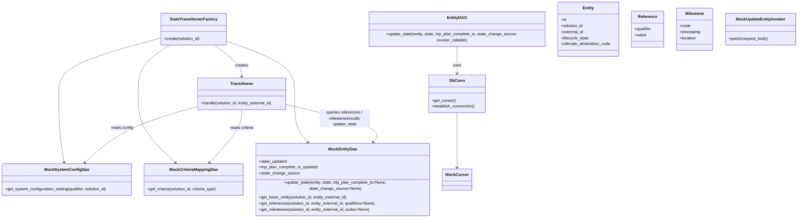
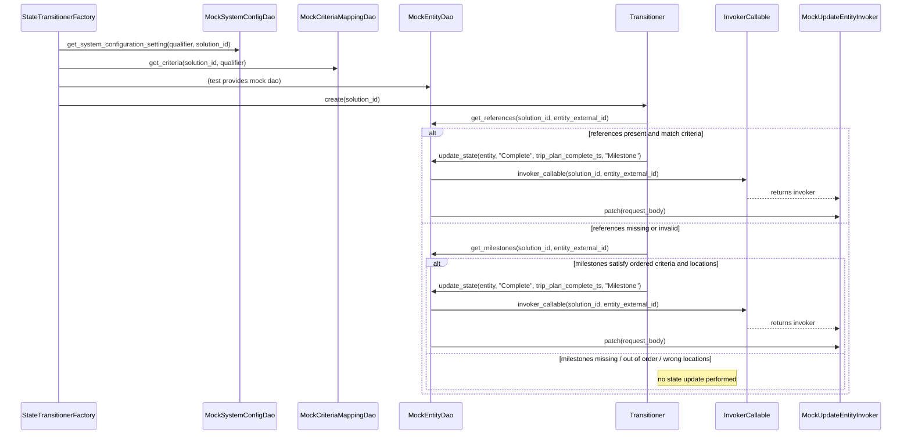

# Diagram: entity_core/entity_service/entity_service_tests/entity_state_machine_tests/test_entity_state_machine.py

> Auto-generated by Obscura crawlers

## Diagram 1

### SVG

<svg id="container" width="3197.2421875" xmlns="http://www.w3.org/2000/svg" class="classDiagram" height="842" viewBox="0 0 3197.2421875 842" role="graphics-document document" aria-roledescription="class"><g><defs><marker id="container_class-aggregationStart" class="marker aggregation class" refX="18" refY="7" markerWidth="190" markerHeight="240" orient="auto"><path d="M 18,7 L9,13 L1,7 L9,1 Z"></path></marker></defs><defs><marker id="container_class-aggregationEnd" class="marker aggregation class" refX="1" refY="7" markerWidth="20" markerHeight="28" orient="auto"><path d="M 18,7 L9,13 L1,7 L9,1 Z"></path></marker></defs><defs><marker id="container_class-extensionStart" class="marker extension class" refX="18" refY="7" markerWidth="190" markerHeight="240" orient="auto"><path d="M 1,7 L18,13 V 1 Z"></path></marker></defs><defs><marker id="container_class-extensionEnd" class="marker extension class" refX="1" refY="7" markerWidth="20" markerHeight="28" orient="auto"><path d="M 1,1 V 13 L18,7 Z"></path></marker></defs><defs><marker id="container_class-compositionStart" class="marker composition class" refX="18" refY="7" markerWidth="190" markerHeight="240" orient="auto"><path d="M 18,7 L9,13 L1,7 L9,1 Z"></path></marker></defs><defs><marker id="container_class-compositionEnd" class="marker composition class" refX="1" refY="7" markerWidth="20" markerHeight="28" orient="auto"><path d="M 18,7 L9,13 L1,7 L9,1 Z"></path></marker></defs><defs><marker id="container_class-dependencyStart" class="marker dependency class" refX="6" refY="7" markerWidth="190" markerHeight="240" orient="auto"><path d="M 5,7 L9,13 L1,7 L9,1 Z"></path></marker></defs><defs><marker id="container_class-dependencyEnd" class="marker dependency class" refX="13" refY="7" markerWidth="20" markerHeight="28" orient="auto"><path d="M 18,7 L9,13 L14,7 L9,1 Z"></path></marker></defs><defs><marker id="container_class-lollipopStart" class="marker lollipop class" refX="13" refY="7" markerWidth="190" markerHeight="240" orient="auto"><circle stroke="black" fill="transparent" cx="7" cy="7" r="6"></circle></marker></defs><defs><marker id="container_class-lollipopEnd" class="marker lollipop class" refX="1" refY="7" markerWidth="190" markerHeight="240" orient="auto"><circle stroke="black" fill="transparent" cx="7" cy="7" r="6"></circle></marker></defs><g class="root"><g class="clusters"></g><g class="edgePaths"><path d="M859.862,179L878.03,192.667C896.199,206.333,932.536,233.667,950.705,254.5C968.873,275.333,968.873,289.667,968.873,296.833L968.873,304" id="id_StateTransitionerFactory_Transitioner_1" class="edge-thickness-normal edge-pattern-solid relation" style=";;;" data-edge="true" data-et="edge" data-id="id_StateTransitionerFactory_Transitioner_1" data-points="W3sieCI6ODU5Ljg2MTg2NjkxODEwMzUsInkiOjE3OX0seyJ4Ijo5NjguODczMDQ2ODc1LCJ5IjoyNjF9LHsieCI6OTY4Ljg3MzA0Njg3NSwieSI6MzEwfV0=" marker-end="url(#container_class-dependencyEnd)"></path><path d="M646.234,150.824L577.751,169.187C509.268,187.549,372.302,224.275,303.819,261.304C235.336,298.333,235.336,335.667,235.336,377C235.336,418.333,235.336,463.667,238.76,507.013C242.184,550.36,249.031,591.72,252.455,612.4L255.879,633.081" id="id_StateTransitionerFactory_MockSystemConfigDao_2" class="edge-thickness-normal edge-pattern-solid relation" style=";;;" data-edge="true" data-et="edge" data-id="id_StateTransitionerFactory_MockSystemConfigDao_2" data-points="W3sieCI6NjQ2LjIzNDM3NSwieSI6MTUwLjgyMzk2NDUxODQxMjU3fSx7IngiOjIzNS4zMzU5Mzc1LCJ5IjoyNjF9LHsieCI6MjM1LjMzNTkzNzUsInkiOjM3M30seyJ4IjoyMzUuMzM1OTM3NSwieSI6NTA5fSx7IngiOjI1Ni44NTg3Njc4MTA4ODA4LCJ5Ijo2Mzl9XQ==" marker-end="url(#container_class-dependencyEnd)"></path><path d="M679.456,179L658.488,192.667C637.521,206.333,595.587,233.667,574.62,266C553.652,298.333,553.652,335.667,553.652,377C553.652,418.333,553.652,463.667,577.871,507.345C602.089,551.023,650.525,593.045,674.744,614.057L698.962,635.068" id="id_StateTransitionerFactory_MockCriteriaMappingDao_3" class="edge-thickness-normal edge-pattern-solid relation" style=";;;" data-edge="true" data-et="edge" data-id="id_StateTransitionerFactory_MockCriteriaMappingDao_3" data-points="W3sieCI6Njc5LjQ1NTYzMDM4NzkzMSwieSI6MTc5fSx7IngiOjU1My42NTIzNDM3NSwieSI6MjYxfSx7IngiOjU1My42NTIzNDM3NSwieSI6MzczfSx7IngiOjU1My42NTIzNDM3NSwieSI6NTA5fSx7IngiOjcwMy40OTM4NjczODk4OTY0LCJ5Ijo2Mzl9XQ==" marker-end="url(#container_class-dependencyEnd)"></path><path d="M905.984,162.26L952.187,178.716C998.39,195.173,1090.796,228.087,1136.998,263.21C1183.201,298.333,1183.201,335.667,1183.201,377C1183.201,418.333,1183.201,463.667,1192.649,495.792C1202.096,527.918,1220.991,546.837,1230.439,556.296L1239.886,565.755" id="id_StateTransitionerFactory_MockEntityDao_4" class="edge-thickness-normal edge-pattern-solid relation" style=";;;" data-edge="true" data-et="edge" data-id="id_StateTransitionerFactory_MockEntityDao_4" data-points="W3sieCI6OTA1Ljk4NDM3NSwieSI6MTYyLjI1OTUyOTUzMjU1NTEyfSx7IngiOjExODMuMjAxMTcxODc1LCJ5IjoyNjF9LHsieCI6MTE4My4yMDExNzE4NzUsInkiOjM3M30seyJ4IjoxMTgzLjIwMTE3MTg3NSwieSI6NTA5fSx7IngiOjEyNDQuMTI2NDc3NDkzNTIzMiwieSI6NTcwfV0=" marker-end="url(#container_class-dependencyEnd)"></path><path d="M789.545,423.902L739.578,438.085C689.612,452.268,589.679,480.634,515.494,515.828C441.31,551.023,392.873,593.045,368.655,614.057L344.437,635.068" id="id_Transitioner_MockSystemConfigDao_5" class="edge-thickness-normal edge-pattern-solid relation" style=";;;" data-edge="true" data-et="edge" data-id="id_Transitioner_MockSystemConfigDao_5" data-points="W3sieCI6Nzg5LjU0NDkyMTg3NSwieSI6NDIzLjkwMjIxODc5ODAyNTR9LHsieCI6NDg5Ljc0NjA5Mzc1LCJ5Ijo1MDl9LHsieCI6MzM5LjkwNDU3MDExMDEwMzYzLCJ5Ijo2Mzl9XQ==" marker-end="url(#container_class-dependencyEnd)"></path><path d="M968.873,436L968.873,448.167C968.873,460.333,968.873,484.667,947.94,517.792C927.006,550.918,885.139,592.837,864.206,613.796L843.272,634.755" id="id_Transitioner_MockCriteriaMappingDao_6" class="edge-thickness-normal edge-pattern-solid relation" style=";;;" data-edge="true" data-et="edge" data-id="id_Transitioner_MockCriteriaMappingDao_6" data-points="W3sieCI6OTY4Ljg3MzA0Njg3NSwieSI6NDM2fSx7IngiOjk2OC44NzMwNDY4NzUsInkiOjUwOX0seyJ4Ijo4MzkuMDMyMjMxNjIyNDA5MywieSI6NjM5fV0=" marker-end="url(#container_class-dependencyEnd)"></path><path d="M1148.201,415.429L1214.115,431.024C1280.029,446.619,1411.857,477.81,1469.592,502.817C1527.327,527.824,1510.969,546.647,1502.79,556.059L1494.611,565.471" id="id_Transitioner_MockEntityDao_7" class="edge-thickness-normal edge-pattern-solid relation" style=";;;" data-edge="true" data-et="edge" data-id="id_Transitioner_MockEntityDao_7" data-points="W3sieCI6MTE0OC4yMDExNzE4NzUsInkiOjQxNS40Mjg4MzU0ODk4MzM2Nn0seyJ4IjoxNTQzLjY4NTU0Njg3NSwieSI6NTA5fSx7IngiOjE0OTAuNjc1Mzc2NDU3MjUzOCwieSI6NTcwfV0=" marker-end="url(#container_class-dependencyEnd)"></path><path d="M1831.406,179L1831.406,192.667C1831.406,206.333,1831.406,233.667,1831.406,252.5C1831.406,271.333,1831.406,281.667,1831.406,286.833L1831.406,292" id="id_EntityDAO_DbConn_8" class="edge-thickness-normal edge-pattern-solid relation" style=";;;" data-edge="true" data-et="edge" data-id="id_EntityDAO_DbConn_8" data-points="W3sieCI6MTgzMS40MDYyNSwieSI6MTc5fSx7IngiOjE4MzEuNDA2MjUsInkiOjI2MX0seyJ4IjoxODMxLjQwNjI1LCJ5IjoyOTh9XQ==" marker-end="url(#container_class-dependencyEnd)"></path><path d="M1831.406,448L1831.406,458.167C1831.406,468.333,1831.406,488.667,1831.406,523C1831.406,557.333,1831.406,605.667,1831.406,629.833L1831.406,654" id="id_DbConn_MockCursor_9" class="edge-thickness-normal edge-pattern-solid relation" style=";;;" data-edge="true" data-et="edge" data-id="id_DbConn_MockCursor_9" data-points="W3sieCI6MTgzMS40MDYyNSwieSI6NDQ4fSx7IngiOjE4MzEuNDA2MjUsInkiOjUwOX0seyJ4IjoxODMxLjQwNjI1LCJ5Ijo2NjB9XQ==" marker-end="url(#container_class-dependencyEnd)"></path></g><g class="edgeLabels"><g class="edgeLabel" transform="translate(968.873046875, 261)"><g class="label" data-id="id_StateTransitionerFactory_Transitioner_1" transform="translate(-26.171875, -12)"><foreignObject width="52.34375" height="24">

creates

</foreignObject></g></g><g class="edgeLabel"><g class="label" data-id="id_StateTransitionerFactory_MockSystemConfigDao_2" transform="translate(0, 0)"><foreignObject width="0" height="0">

</foreignObject></g></g><g class="edgeLabel"><g class="label" data-id="id_StateTransitionerFactory_MockCriteriaMappingDao_3" transform="translate(0, 0)"><foreignObject width="0" height="0">

</foreignObject></g></g><g class="edgeLabel"><g class="label" data-id="id_StateTransitionerFactory_MockEntityDao_4" transform="translate(0, 0)"><foreignObject width="0" height="0">

</foreignObject></g></g><g class="edgeLabel" transform="translate(544.22769, 493.53542)"><g class="label" data-id="id_Transitioner_MockSystemConfigDao_5" transform="translate(-43.90625, -12)"><foreignObject width="87.8125" height="24">

reads config

</foreignObject></g></g><g class="edgeLabel" transform="translate(968.873046875, 509)"><g class="label" data-id="id_Transitioner_MockCriteriaMappingDao_6" transform="translate(-48.1171875, -12)"><foreignObject width="96.234375" height="24">

reads criteria

</foreignObject></g></g><g class="edgeLabel" transform="translate(1385.26529, 471.51794)"><g class="label" data-id="id_Transitioner_MockEntityDao_7" transform="translate(-100, -36)"><foreignObject width="200" height="72">

queries references / milestones\ncalls update_state

</foreignObject></g></g><g class="edgeLabel" transform="translate(1831.40625, 261)"><g class="label" data-id="id_EntityDAO_DbConn_8" transform="translate(-16.4921875, -12)"><foreignObject width="32.984375" height="24">

uses

</foreignObject></g></g><g class="edgeLabel"><g class="label" data-id="id_DbConn_MockCursor_9" transform="translate(0, 0)"><foreignObject width="0" height="0">

</foreignObject></g></g></g><g class="nodes"><g class="node default" id="classId-StateTransitionerFactory-0" transform="translate(776.109375, 116)"><g class="basic label-container"><path d="M-129.875 -63 L129.875 -63 L129.875 63 L-129.875 63" stroke="none" stroke-width="0" fill="#ECECFF" style=""></path><path d="M-129.875 -63 C-35.443826347234975 -63, 58.98734730553005 -63, 129.875 -63 M-129.875 -63 C-46.8354120595593 -63, 36.204175880881394 -63, 129.875 -63 M129.875 -63 C129.875 -36.96027585316837, 129.875 -10.920551706336738, 129.875 63 M129.875 -63 C129.875 -25.87447163977643, 129.875 11.251056720447139, 129.875 63 M129.875 63 C41.57731228254276 63, -46.72037543491447 63, -129.875 63 M129.875 63 C74.63049793021429 63, 19.38599586042858 63, -129.875 63 M-129.875 63 C-129.875 37.50216849076148, -129.875 12.004336981522961, -129.875 -63 M-129.875 63 C-129.875 27.128465284978915, -129.875 -8.74306943004217, -129.875 -63" stroke="#9370DB" stroke-width="1.3" fill="none" stroke-dasharray="0 0" style=""></path></g><g class="annotation-group text" transform="translate(0, -39)"></g><g class="label-group text" transform="translate(-90.296875, -39)"><g class="label" style="font-weight: bolder" transform="translate(0,-12)"><foreignObject width="180.59375" height="24">

StateTransitionerFactory

</foreignObject></g></g><g class="members-group text" transform="translate(-117.875, 9)"></g><g class="methods-group text" transform="translate(-117.875, 39)"><g class="label" style="" transform="translate(0,-12)"><foreignObject width="145.453125" height="24">

+create(solution_id)

</foreignObject></g></g><g class="divider" style=""><path d="M-129.875 -15 C-32.7422898308606 -15, 64.3904203382788 -15, 129.875 -15 M-129.875 -15 C-52.64350948657108 -15, 24.587981026857847 -15, 129.875 -15" stroke="#9370DB" stroke-width="1.3" fill="none" stroke-dasharray="0 0" style=""></path></g><g class="divider" style=""><path d="M-129.875 9 C-38.83850468436222 9, 52.19799063127556 9, 129.875 9 M-129.875 9 C-67.09809885132181 9, -4.321197702643616 9, 129.875 9" stroke="#9370DB" stroke-width="1.3" fill="none" stroke-dasharray="0 0" style=""></path></g></g><g class="node default" id="classId-Transitioner-1" transform="translate(968.873046875, 373)"><g class="basic label-container"><path d="M-179.328125 -63 L179.328125 -63 L179.328125 63 L-179.328125 63" stroke="none" stroke-width="0" fill="#ECECFF" style=""></path><path d="M-179.328125 -63 C-36.36779190916704 -63, 106.59254118166592 -63, 179.328125 -63 M-179.328125 -63 C-67.6040324723786 -63, 44.12006005524279 -63, 179.328125 -63 M179.328125 -63 C179.328125 -32.060639011456175, 179.328125 -1.1212780229123425, 179.328125 63 M179.328125 -63 C179.328125 -14.723399368667515, 179.328125 33.55320126266497, 179.328125 63 M179.328125 63 C44.21198253207959 63, -90.90415993584082 63, -179.328125 63 M179.328125 63 C87.79337160138827 63, -3.741381797223454 63, -179.328125 63 M-179.328125 63 C-179.328125 32.4730264879115, -179.328125 1.9460529758229939, -179.328125 -63 M-179.328125 63 C-179.328125 30.026751721174136, -179.328125 -2.9464965576517272, -179.328125 -63" stroke="#9370DB" stroke-width="1.3" fill="none" stroke-dasharray="0 0" style=""></path></g><g class="annotation-group text" transform="translate(0, -39)"></g><g class="label-group text" transform="translate(-44.390625, -39)"><g class="label" style="font-weight: bolder" transform="translate(0,-12)"><foreignObject width="88.78125" height="24">

Transitioner

</foreignObject></g></g><g class="members-group text" transform="translate(-167.328125, 9)"></g><g class="methods-group text" transform="translate(-167.328125, 39)"><g class="label" style="" transform="translate(0,-12)"><foreignObject width="290.265625" height="24">

+handle(solution_id, entity_external_id)

</foreignObject></g></g><g class="divider" style=""><path d="M-179.328125 -15 C-86.9124765376583 -15, 5.503171924683386 -15, 179.328125 -15 M-179.328125 -15 C-56.36882059196681 -15, 66.59048381606638 -15, 179.328125 -15" stroke="#9370DB" stroke-width="1.3" fill="none" stroke-dasharray="0 0" style=""></path></g><g class="divider" style=""><path d="M-179.328125 9 C-79.59178073103301 9, 20.144563537933976 9, 179.328125 9 M-179.328125 9 C-55.91948840302166 9, 67.48914819395668 9, 179.328125 9" stroke="#9370DB" stroke-width="1.3" fill="none" stroke-dasharray="0 0" style=""></path></g></g><g class="node default" id="classId-MockSystemConfigDao-2" transform="translate(267.2890625, 702)"><g class="basic label-container"><path d="M-259.2890625 -63 L259.2890625 -63 L259.2890625 63 L-259.2890625 63" stroke="none" stroke-width="0" fill="#ECECFF" style=""></path><path d="M-259.2890625 -63 C-99.47933189185449 -63, 60.33039871629103 -63, 259.2890625 -63 M-259.2890625 -63 C-65.35518396199276 -63, 128.57869457601447 -63, 259.2890625 -63 M259.2890625 -63 C259.2890625 -16.351469353435228, 259.2890625 30.297061293129545, 259.2890625 63 M259.2890625 -63 C259.2890625 -25.82455838358912, 259.2890625 11.350883232821758, 259.2890625 63 M259.2890625 63 C75.17555745957372 63, -108.93794758085255 63, -259.2890625 63 M259.2890625 63 C66.33153087388368 63, -126.62600075223264 63, -259.2890625 63 M-259.2890625 63 C-259.2890625 20.513094144790323, -259.2890625 -21.973811710419355, -259.2890625 -63 M-259.2890625 63 C-259.2890625 15.417238134649573, -259.2890625 -32.165523730700855, -259.2890625 -63" stroke="#9370DB" stroke-width="1.3" fill="none" stroke-dasharray="0 0" style=""></path></g><g class="annotation-group text" transform="translate(0, -39)"></g><g class="label-group text" transform="translate(-82.875, -39)"><g class="label" style="font-weight: bolder" transform="translate(0,-12)"><foreignObject width="165.75" height="24">

MockSystemConfigDao

</foreignObject></g></g><g class="members-group text" transform="translate(-247.2890625, 9)"></g><g class="methods-group text" transform="translate(-247.2890625, 39)"><g class="label" style="" transform="translate(0,-12)"><foreignObject width="411.703125" height="24">

+get_system_configuration_setting(qualifier, solution_id)

</foreignObject></g></g><g class="divider" style=""><path d="M-259.2890625 -15 C-78.4757847907359 -15, 102.3374929185282 -15, 259.2890625 -15 M-259.2890625 -15 C-87.86352507299955 -15, 83.5620123540009 -15, 259.2890625 -15" stroke="#9370DB" stroke-width="1.3" fill="none" stroke-dasharray="0 0" style=""></path></g><g class="divider" style=""><path d="M-259.2890625 9 C-58.02041329459939 9, 143.2482359108012 9, 259.2890625 9 M-259.2890625 9 C-117.32545541953829 9, 24.638151660923427 9, 259.2890625 9" stroke="#9370DB" stroke-width="1.3" fill="none" stroke-dasharray="0 0" style=""></path></g></g><g class="node default" id="classId-MockCriteriaMappingDao-3" transform="translate(776.109375, 702)"><g class="basic label-container"><path d="M-199.53125 -63 L199.53125 -63 L199.53125 63 L-199.53125 63" stroke="none" stroke-width="0" fill="#ECECFF" style=""></path><path d="M-199.53125 -63 C-93.95776105144851 -63, 11.615727897102971 -63, 199.53125 -63 M-199.53125 -63 C-100.94678897990272 -63, -2.362327959805441 -63, 199.53125 -63 M199.53125 -63 C199.53125 -35.9014264567148, 199.53125 -8.802852913429597, 199.53125 63 M199.53125 -63 C199.53125 -31.511224148891447, 199.53125 -0.022448297782894144, 199.53125 63 M199.53125 63 C40.35662534636515 63, -118.8179993072697 63, -199.53125 63 M199.53125 63 C53.86373971380587 63, -91.80377057238826 63, -199.53125 63 M-199.53125 63 C-199.53125 26.327774080196463, -199.53125 -10.344451839607075, -199.53125 -63 M-199.53125 63 C-199.53125 28.282491684865732, -199.53125 -6.435016630268535, -199.53125 -63" stroke="#9370DB" stroke-width="1.3" fill="none" stroke-dasharray="0 0" style=""></path></g><g class="annotation-group text" transform="translate(0, -39)"></g><g class="label-group text" transform="translate(-92.078125, -39)"><g class="label" style="font-weight: bolder" transform="translate(0,-12)"><foreignObject width="184.15625" height="24">

MockCriteriaMappingDao

</foreignObject></g></g><g class="members-group text" transform="translate(-187.53125, 9)"></g><g class="methods-group text" transform="translate(-187.53125, 39)"><g class="label" style="" transform="translate(0,-12)"><foreignObject width="282.984375" height="24">

+get_criteria(solution_id, criteria_type)

</foreignObject></g></g><g class="divider" style=""><path d="M-199.53125 -15 C-49.065411641574826 -15, 101.40042671685035 -15, 199.53125 -15 M-199.53125 -15 C-114.99064457651053 -15, -30.450039153021066 -15, 199.53125 -15" stroke="#9370DB" stroke-width="1.3" fill="none" stroke-dasharray="0 0" style=""></path></g><g class="divider" style=""><path d="M-199.53125 9 C-118.40384359402665 9, -37.27643718805331 9, 199.53125 9 M-199.53125 9 C-70.9013752892113 9, 57.728499421577396 9, 199.53125 9" stroke="#9370DB" stroke-width="1.3" fill="none" stroke-dasharray="0 0" style=""></path></g></g><g class="node default" id="classId-MockEntityDao-4" transform="translate(1375.96484375, 702)"><g class="basic label-container"><path d="M-350.32421875 -132 L350.32421875 -132 L350.32421875 132 L-350.32421875 132" stroke="none" stroke-width="0" fill="#ECECFF" style=""></path><path d="M-350.32421875 -132 C-156.83995969372936 -132, 36.64429936254129 -132, 350.32421875 -132 M-350.32421875 -132 C-151.693474701296 -132, 46.937269347408005 -132, 350.32421875 -132 M350.32421875 -132 C350.32421875 -50.294769628939136, 350.32421875 31.410460742121728, 350.32421875 132 M350.32421875 -132 C350.32421875 -64.2761872645366, 350.32421875 3.447625470926795, 350.32421875 132 M350.32421875 132 C192.49275536446447 132, 34.66129197892894 132, -350.32421875 132 M350.32421875 132 C117.27858487710051 132, -115.76704899579897 132, -350.32421875 132 M-350.32421875 132 C-350.32421875 33.87933313543492, -350.32421875 -64.24133372913016, -350.32421875 -132 M-350.32421875 132 C-350.32421875 42.846340909611584, -350.32421875 -46.30731818077683, -350.32421875 -132" stroke="#9370DB" stroke-width="1.3" fill="none" stroke-dasharray="0 0" style=""></path></g><g class="annotation-group text" transform="translate(0, -108)"></g><g class="label-group text" transform="translate(-54.6796875, -108)"><g class="label" style="font-weight: bolder" transform="translate(0,-12)"><foreignObject width="109.359375" height="24">

MockEntityDao

</foreignObject></g></g><g class="members-group text" transform="translate(-338.32421875, -60)"><g class="label" style="" transform="translate(0,-12)"><foreignObject width="112.6875" height="24">

+state_updated

</foreignObject></g><g class="label" style="" transform="translate(0,12)"><foreignObject width="239.0625" height="24">

+trip_plan_complete_ts_updated

</foreignObject></g><g class="label" style="" transform="translate(0,36)"><foreignObject width="159.53125" height="24">

+state_change_source

</foreignObject></g></g><g class="methods-group text" transform="translate(-338.32421875, 36)"><g class="label" style="" transform="translate(0,-12)"><foreignObject width="621.96875" height="24">

+update_state(entity, state, trip_plan_complete_ts=None, state_change_source=None)

</foreignObject></g><g class="label" style="" transform="translate(0,12)"><foreignObject width="358.265625" height="24">

+get_basic_entity(solution_id, entity_external_id)

</foreignObject></g><g class="label" style="" transform="translate(0,36)"><foreignObject width="468.84375" height="24">

+get_references(solution_id, entity_external_id, qualifiers=None)

</foreignObject></g><g class="label" style="" transform="translate(0,60)"><foreignObject width="447.140625" height="24">

+get_milestones(solution_id, entity_external_id, codes=None)

</foreignObject></g></g><g class="divider" style=""><path d="M-350.32421875 -84 C-118.2313383005984 -84, 113.86154214880321 -84, 350.32421875 -84 M-350.32421875 -84 C-201.99720453211938 -84, -53.670190314238766 -84, 350.32421875 -84" stroke="#9370DB" stroke-width="1.3" fill="none" stroke-dasharray="0 0" style=""></path></g><g class="divider" style=""><path d="M-350.32421875 12 C-101.14118490310636 12, 148.04184894378727 12, 350.32421875 12 M-350.32421875 12 C-96.02985204581432 12, 158.26451465837135 12, 350.32421875 12" stroke="#9370DB" stroke-width="1.3" fill="none" stroke-dasharray="0 0" style=""></path></g></g><g class="node default" id="classId-EntityDAO-5" transform="translate(1831.40625, 116)"><g class="basic label-container"><path d="M-357.671875 -63 L357.671875 -63 L357.671875 63 L-357.671875 63" stroke="none" stroke-width="0" fill="#ECECFF" style=""></path><path d="M-357.671875 -63 C-108.21619350297138 -63, 141.23948799405724 -63, 357.671875 -63 M-357.671875 -63 C-80.17442183989237 -63, 197.32303132021525 -63, 357.671875 -63 M357.671875 -63 C357.671875 -24.191849136988623, 357.671875 14.616301726022755, 357.671875 63 M357.671875 -63 C357.671875 -17.070269918303815, 357.671875 28.85946016339237, 357.671875 63 M357.671875 63 C97.61186936230882 63, -162.44813627538235 63, -357.671875 63 M357.671875 63 C125.65704405039995 63, -106.35778689920011 63, -357.671875 63 M-357.671875 63 C-357.671875 13.460655427859685, -357.671875 -36.07868914428063, -357.671875 -63 M-357.671875 63 C-357.671875 14.486862128386903, -357.671875 -34.02627574322619, -357.671875 -63" stroke="#9370DB" stroke-width="1.3" fill="none" stroke-dasharray="0 0" style=""></path></g><g class="annotation-group text" transform="translate(0, -39)"></g><g class="label-group text" transform="translate(-36.578125, -39)"><g class="label" style="font-weight: bolder" transform="translate(0,-12)"><foreignObject width="73.15625" height="24">

EntityDAO

</foreignObject></g></g><g class="members-group text" transform="translate(-345.671875, 9)"></g><g class="methods-group text" transform="translate(-345.671875, 39)"><g class="label" style="" transform="translate(0,-12)"><foreignObject width="654.765625" height="24">

+update_state(entity, state, trip_plan_complete_ts, state_change_source, invoker_callable)

</foreignObject></g></g><g class="divider" style=""><path d="M-357.671875 -15 C-124.05564054848008 -15, 109.56059390303983 -15, 357.671875 -15 M-357.671875 -15 C-206.53297668541487 -15, -55.39407837082973 -15, 357.671875 -15" stroke="#9370DB" stroke-width="1.3" fill="none" stroke-dasharray="0 0" style=""></path></g><g class="divider" style=""><path d="M-357.671875 9 C-77.79710389952163 9, 202.07766720095674 9, 357.671875 9 M-357.671875 9 C-189.69280729831308 9, -21.71373959662617 9, 357.671875 9" stroke="#9370DB" stroke-width="1.3" fill="none" stroke-dasharray="0 0" style=""></path></g></g><g class="node default" id="classId-Entity-6" transform="translate(2363.0859375, 116)"><g class="basic label-container"><path d="M-124.0078125 -108 L124.0078125 -108 L124.0078125 108 L-124.0078125 108" stroke="none" stroke-width="0" fill="#ECECFF" style=""></path><path d="M-124.0078125 -108 C-49.14290228837854 -108, 25.722007923242927 -108, 124.0078125 -108 M-124.0078125 -108 C-46.9112726503387 -108, 30.185267199322595 -108, 124.0078125 -108 M124.0078125 -108 C124.0078125 -25.55542366446936, 124.0078125 56.88915267106128, 124.0078125 108 M124.0078125 -108 C124.0078125 -36.51398649094109, 124.0078125 34.972027018117814, 124.0078125 108 M124.0078125 108 C61.720526800044276 108, -0.5667588999114486 108, -124.0078125 108 M124.0078125 108 C37.569621122375196 108, -48.86857025524961 108, -124.0078125 108 M-124.0078125 108 C-124.0078125 33.01621608292743, -124.0078125 -41.96756783414514, -124.0078125 -108 M-124.0078125 108 C-124.0078125 44.48229771196072, -124.0078125 -19.035404576078562, -124.0078125 -108" stroke="#9370DB" stroke-width="1.3" fill="none" stroke-dasharray="0 0" style=""></path></g><g class="annotation-group text" transform="translate(0, -84)"></g><g class="label-group text" transform="translate(-21.28125, -84)"><g class="label" style="font-weight: bolder" transform="translate(0,-12)"><foreignObject width="42.5625" height="24">

Entity

</foreignObject></g></g><g class="members-group text" transform="translate(-112.0078125, -36)"><g class="label" style="" transform="translate(0,-12)"><foreignObject width="22.078125" height="24">

+id

</foreignObject></g><g class="label" style="" transform="translate(0,12)"><foreignObject width="90.21875" height="24">

+solution_id

</foreignObject></g><g class="label" style="" transform="translate(0,36)"><foreignObject width="89.765625" height="24">

+external_id

</foreignObject></g><g class="label" style="" transform="translate(0,60)"><foreignObject width="111.640625" height="24">

+lifecycle_state

</foreignObject></g><g class="label" style="" transform="translate(0,84)"><foreignObject width="202.734375" height="24">

+ultimate_destination_code

</foreignObject></g></g><g class="methods-group text" transform="translate(-112.0078125, 108)"></g><g class="divider" style=""><path d="M-124.0078125 -60 C-55.03604851806193 -60, 13.935715463876136 -60, 124.0078125 -60 M-124.0078125 -60 C-46.90190562179073 -60, 30.204001256418536 -60, 124.0078125 -60" stroke="#9370DB" stroke-width="1.3" fill="none" stroke-dasharray="0 0" style=""></path></g><g class="divider" style=""><path d="M-124.0078125 84 C-34.65480240318536 84, 54.698207693629286 84, 124.0078125 84 M-124.0078125 84 C-72.06091488778553 84, -20.114017275571058 84, 124.0078125 84" stroke="#9370DB" stroke-width="1.3" fill="none" stroke-dasharray="0 0" style=""></path></g></g><g class="node default" id="classId-Reference-7" transform="translate(2601.70703125, 116)"><g class="basic label-container"><path d="M-64.61328125 -72 L64.61328125 -72 L64.61328125 72 L-64.61328125 72" stroke="none" stroke-width="0" fill="#ECECFF" style=""></path><path d="M-64.61328125 -72 C-13.861346911595511 -72, 36.89058742680898 -72, 64.61328125 -72 M-64.61328125 -72 C-27.672070444247822 -72, 9.269140361504355 -72, 64.61328125 -72 M64.61328125 -72 C64.61328125 -41.74625849022263, 64.61328125 -11.492516980445266, 64.61328125 72 M64.61328125 -72 C64.61328125 -19.236225215693466, 64.61328125 33.52754956861307, 64.61328125 72 M64.61328125 72 C32.28031200264474 72, -0.05265724471051669 72, -64.61328125 72 M64.61328125 72 C30.93959830425529 72, -2.7340846414894173 72, -64.61328125 72 M-64.61328125 72 C-64.61328125 35.15259086274766, -64.61328125 -1.6948182745046836, -64.61328125 -72 M-64.61328125 72 C-64.61328125 20.85738935846104, -64.61328125 -30.285221283077917, -64.61328125 -72" stroke="#9370DB" stroke-width="1.3" fill="none" stroke-dasharray="0 0" style=""></path></g><g class="annotation-group text" transform="translate(0, -48)"></g><g class="label-group text" transform="translate(-36.5078125, -48)"><g class="label" style="font-weight: bolder" transform="translate(0,-12)"><foreignObject width="73.015625" height="24">

Reference

</foreignObject></g></g><g class="members-group text" transform="translate(-52.61328125, 0)"><g class="label" style="" transform="translate(0,-12)"><foreignObject width="68.71875" height="24">

+qualifier

</foreignObject></g><g class="label" style="" transform="translate(0,12)"><foreignObject width="46.71875" height="24">

+value

</foreignObject></g></g><g class="methods-group text" transform="translate(-52.61328125, 72)"></g><g class="divider" style=""><path d="M-64.61328125 -24 C-24.199885100001296 -24, 16.213511049997408 -24, 64.61328125 -24 M-64.61328125 -24 C-19.11237108469846 -24, 26.38853908060308 -24, 64.61328125 -24" stroke="#9370DB" stroke-width="1.3" fill="none" stroke-dasharray="0 0" style=""></path></g><g class="divider" style=""><path d="M-64.61328125 48 C-13.268395954042205 48, 38.07648934191559 48, 64.61328125 48 M-64.61328125 48 C-33.794075456049185 48, -2.9748696620983637 48, 64.61328125 48" stroke="#9370DB" stroke-width="1.3" fill="none" stroke-dasharray="0 0" style=""></path></g></g><g class="node default" id="classId-Milestone-8" transform="translate(2789.0703125, 116)"><g class="basic label-container"><path d="M-72.75 -84 L72.75 -84 L72.75 84 L-72.75 84" stroke="none" stroke-width="0" fill="#ECECFF" style=""></path><path d="M-72.75 -84 C-24.337530292937295 -84, 24.07493941412541 -84, 72.75 -84 M-72.75 -84 C-19.15350141416647 -84, 34.44299717166706 -84, 72.75 -84 M72.75 -84 C72.75 -31.203509366521452, 72.75 21.592981266957096, 72.75 84 M72.75 -84 C72.75 -49.38625254369744, 72.75 -14.772505087394876, 72.75 84 M72.75 84 C41.721696308401896 84, 10.693392616803791 84, -72.75 84 M72.75 84 C23.984096047737836 84, -24.781807904524328 84, -72.75 84 M-72.75 84 C-72.75 26.609231260848652, -72.75 -30.781537478302695, -72.75 -84 M-72.75 84 C-72.75 50.15306989736381, -72.75 16.306139794727613, -72.75 -84" stroke="#9370DB" stroke-width="1.3" fill="none" stroke-dasharray="0 0" style=""></path></g><g class="annotation-group text" transform="translate(0, -60)"></g><g class="label-group text" transform="translate(-35.8125, -60)"><g class="label" style="font-weight: bolder" transform="translate(0,-12)"><foreignObject width="71.625" height="24">

Milestone

</foreignObject></g></g><g class="members-group text" transform="translate(-60.75, -12)"><g class="label" style="" transform="translate(0,-12)"><foreignObject width="42.953125" height="24">

+code

</foreignObject></g><g class="label" style="" transform="translate(0,12)"><foreignObject width="85.6875" height="24">

+timestamp

</foreignObject></g><g class="label" style="" transform="translate(0,36)"><foreignObject width="67.140625" height="24">

+location

</foreignObject></g></g><g class="methods-group text" transform="translate(-60.75, 84)"></g><g class="divider" style=""><path d="M-72.75 -36 C-14.760868501349222 -36, 43.228262997301556 -36, 72.75 -36 M-72.75 -36 C-42.81882436004641 -36, -12.887648720092827 -36, 72.75 -36" stroke="#9370DB" stroke-width="1.3" fill="none" stroke-dasharray="0 0" style=""></path></g><g class="divider" style=""><path d="M-72.75 60 C-41.11145226377198 60, -9.47290452754396 60, 72.75 60 M-72.75 60 C-16.273436884403033 60, 40.203126231193934 60, 72.75 60" stroke="#9370DB" stroke-width="1.3" fill="none" stroke-dasharray="0 0" style=""></path></g></g><g class="node default" id="classId-DbConn-9" transform="translate(1831.40625, 373)"><g class="basic label-container"><path d="M-112.796875 -75 L112.796875 -75 L112.796875 75 L-112.796875 75" stroke="none" stroke-width="0" fill="#ECECFF" style=""></path><path d="M-112.796875 -75 C-47.908927414149275 -75, 16.97902017170145 -75, 112.796875 -75 M-112.796875 -75 C-37.381671864221104 -75, 38.03353127155779 -75, 112.796875 -75 M112.796875 -75 C112.796875 -35.146161342331986, 112.796875 4.707677315336028, 112.796875 75 M112.796875 -75 C112.796875 -18.747388419261902, 112.796875 37.505223161476195, 112.796875 75 M112.796875 75 C26.587721881059238 75, -59.621431237881524 75, -112.796875 75 M112.796875 75 C51.60498556325126 75, -9.586903873497477 75, -112.796875 75 M-112.796875 75 C-112.796875 39.379848080789195, -112.796875 3.7596961615783897, -112.796875 -75 M-112.796875 75 C-112.796875 31.89320418877611, -112.796875 -11.21359162244778, -112.796875 -75" stroke="#9370DB" stroke-width="1.3" fill="none" stroke-dasharray="0 0" style=""></path></g><g class="annotation-group text" transform="translate(0, -51)"></g><g class="label-group text" transform="translate(-28.328125, -51)"><g class="label" style="font-weight: bolder" transform="translate(0,-12)"><foreignObject width="56.65625" height="24">

DbConn

</foreignObject></g></g><g class="members-group text" transform="translate(-100.796875, -3)"></g><g class="methods-group text" transform="translate(-100.796875, 27)"><g class="label" style="" transform="translate(0,-12)"><foreignObject width="94.640625" height="24">

+get_cursor()

</foreignObject></g><g class="label" style="" transform="translate(0,12)"><foreignObject width="173.265625" height="24">

+establish_connection()

</foreignObject></g></g><g class="divider" style=""><path d="M-112.796875 -27 C-40.87767326032436 -27, 31.041528479351285 -27, 112.796875 -27 M-112.796875 -27 C-34.089175139926056 -27, 44.61852472014789 -27, 112.796875 -27" stroke="#9370DB" stroke-width="1.3" fill="none" stroke-dasharray="0 0" style=""></path></g><g class="divider" style=""><path d="M-112.796875 -3 C-63.71140170378946 -3, -14.625928407578925 -3, 112.796875 -3 M-112.796875 -3 C-40.134132138908555 -3, 32.52861072218289 -3, 112.796875 -3" stroke="#9370DB" stroke-width="1.3" fill="none" stroke-dasharray="0 0" style=""></path></g></g><g class="node default" id="classId-MockCursor-10" transform="translate(1831.40625, 702)"><g class="basic label-container"><path d="M-55.1171875 -42 L55.1171875 -42 L55.1171875 42 L-55.1171875 42" stroke="none" stroke-width="0" fill="#ECECFF" style=""></path><path d="M-55.1171875 -42 C-11.251452997754782 -42, 32.614281504490435 -42, 55.1171875 -42 M-55.1171875 -42 C-28.69219386131863 -42, -2.267200222637257 -42, 55.1171875 -42 M55.1171875 -42 C55.1171875 -12.583993015690094, 55.1171875 16.832013968619812, 55.1171875 42 M55.1171875 -42 C55.1171875 -8.59346208511139, 55.1171875 24.81307582977722, 55.1171875 42 M55.1171875 42 C27.37193447720779 42, -0.3733185455844179 42, -55.1171875 42 M55.1171875 42 C27.74704776322867 42, 0.3769080264573432 42, -55.1171875 42 M-55.1171875 42 C-55.1171875 23.728938286858327, -55.1171875 5.4578765737166535, -55.1171875 -42 M-55.1171875 42 C-55.1171875 19.779154908070133, -55.1171875 -2.441690183859734, -55.1171875 -42" stroke="#9370DB" stroke-width="1.3" fill="none" stroke-dasharray="0 0" style=""></path></g><g class="annotation-group text" transform="translate(0, -18)"></g><g class="label-group text" transform="translate(-43.1171875, -18)"><g class="label" style="font-weight: bolder" transform="translate(0,-12)"><foreignObject width="86.234375" height="24">

MockCursor

</foreignObject></g></g><g class="members-group text" transform="translate(-43.1171875, 30)"></g><g class="methods-group text" transform="translate(-43.1171875, 60)"></g><g class="divider" style=""><path d="M-55.1171875 6 C-19.088737085075365 6, 16.93971332984927 6, 55.1171875 6 M-55.1171875 6 C-17.94188005178254 6, 19.23342739643492 6, 55.1171875 6" stroke="#9370DB" stroke-width="1.3" fill="none" stroke-dasharray="0 0" style=""></path></g><g class="divider" style=""><path d="M-55.1171875 24 C-18.509097773360793 24, 18.098991953278414 24, 55.1171875 24 M-55.1171875 24 C-31.1345100777325 24, -7.151832655465 24, 55.1171875 24" stroke="#9370DB" stroke-width="1.3" fill="none" stroke-dasharray="0 0" style=""></path></g></g><g class="node default" id="classId-MockUpdateEntityInvoker-11" transform="translate(3050.53125, 116)"><g class="basic label-container"><path d="M-138.7109375 -63 L138.7109375 -63 L138.7109375 63 L-138.7109375 63" stroke="none" stroke-width="0" fill="#ECECFF" style=""></path><path d="M-138.7109375 -63 C-29.756921228848327 -63, 79.19709504230335 -63, 138.7109375 -63 M-138.7109375 -63 C-44.311415934411045 -63, 50.08810563117791 -63, 138.7109375 -63 M138.7109375 -63 C138.7109375 -29.605551810236605, 138.7109375 3.78889637952679, 138.7109375 63 M138.7109375 -63 C138.7109375 -18.27634553010183, 138.7109375 26.447308939796343, 138.7109375 63 M138.7109375 63 C46.476579543050136 63, -45.75777841389973 63, -138.7109375 63 M138.7109375 63 C80.49936954800086 63, 22.287801596001714 63, -138.7109375 63 M-138.7109375 63 C-138.7109375 28.139224384424914, -138.7109375 -6.721551231150173, -138.7109375 -63 M-138.7109375 63 C-138.7109375 14.106436610212057, -138.7109375 -34.787126779575885, -138.7109375 -63" stroke="#9370DB" stroke-width="1.3" fill="none" stroke-dasharray="0 0" style=""></path></g><g class="annotation-group text" transform="translate(0, -39)"></g><g class="label-group text" transform="translate(-94.578125, -39)"><g class="label" style="font-weight: bolder" transform="translate(0,-12)"><foreignObject width="189.15625" height="24">

MockUpdateEntityInvoker

</foreignObject></g></g><g class="members-group text" transform="translate(-126.7109375, 9)"></g><g class="methods-group text" transform="translate(-126.7109375, 39)"><g class="label" style="" transform="translate(0,-12)"><foreignObject width="158.84375" height="24">

+patch(request_body)

</foreignObject></g></g><g class="divider" style=""><path d="M-138.7109375 -15 C-67.4304028627168 -15, 3.8501317745663926 -15, 138.7109375 -15 M-138.7109375 -15 C-79.02918060249135 -15, -19.34742370498269 -15, 138.7109375 -15" stroke="#9370DB" stroke-width="1.3" fill="none" stroke-dasharray="0 0" style=""></path></g><g class="divider" style=""><path d="M-138.7109375 9 C-51.52234990230083 9, 35.66623769539834 9, 138.7109375 9 M-138.7109375 9 C-59.66930430169947 9, 19.37232889660106 9, 138.7109375 9" stroke="#9370DB" stroke-width="1.3" fill="none" stroke-dasharray="0 0" style=""></path></g></g></g></g></g></svg>

## Diagram 2

### SVG

<svg id="container" width="2304.5" xmlns="http://www.w3.org/2000/svg" height="1092" viewBox="-50 -10 2304.5 1092" role="graphics-document document" aria-roledescription="sequence"><g><rect x="1997.5" y="1006" fill="#eaeaea" stroke="#666" width="207" height="65" name="MockInvoker" rx="3" ry="3" class="actor actor-bottom"></rect><text x="2101" y="1038.5" dominant-baseline="central" alignment-baseline="central" class="actor actor-box" style="text-anchor: middle; font-size: 16px; font-weight: 400;"><tspan x="2101" dy="0">MockUpdateEntityInvoker</tspan></text></g><g><rect x="1797.5" y="1006" fill="#eaeaea" stroke="#666" width="150" height="65" name="InvokerFactory" rx="3" ry="3" class="actor actor-bottom"></rect><text x="1872.5" y="1038.5" dominant-baseline="central" alignment-baseline="central" class="actor actor-box" style="text-anchor: middle; font-size: 16px; font-weight: 400;"><tspan x="1872.5" dy="0">InvokerCallable</tspan></text></g><g><rect x="1531.5" y="1006" fill="#eaeaea" stroke="#666" width="150" height="65" name="Transitioner" rx="3" ry="3" class="actor actor-bottom"></rect><text x="1606.5" y="1038.5" dominant-baseline="central" alignment-baseline="central" class="actor actor-box" style="text-anchor: middle; font-size: 16px; font-weight: 400;"><tspan x="1606.5" dy="0">Transitioner</tspan></text></g><g><rect x="964.5" y="1006" fill="#eaeaea" stroke="#666" width="150" height="65" name="EntityDao" rx="3" ry="3" class="actor actor-bottom"></rect><text x="1039.5" y="1038.5" dominant-baseline="central" alignment-baseline="central" class="actor actor-box" style="text-anchor: middle; font-size: 16px; font-weight: 400;"><tspan x="1039.5" dy="0">MockEntityDao</tspan></text></g><g><rect x="713.5" y="1006" fill="#eaeaea" stroke="#666" width="201" height="65" name="Criteria" rx="3" ry="3" class="actor actor-bottom"></rect><text x="814" y="1038.5" dominant-baseline="central" alignment-baseline="central" class="actor actor-box" style="text-anchor: middle; font-size: 16px; font-weight: 400;"><tspan x="814" dy="0">MockCriteriaMappingDao</tspan></text></g><g><rect x="481.5" y="1006" fill="#eaeaea" stroke="#666" width="182" height="65" name="SystemConfig" rx="3" ry="3" class="actor actor-bottom"></rect><text x="572.5" y="1038.5" dominant-baseline="central" alignment-baseline="central" class="actor actor-box" style="text-anchor: middle; font-size: 16px; font-weight: 400;"><tspan x="572.5" dy="0">MockSystemConfigDao</tspan></text></g><g><rect x="0" y="1006" fill="#eaeaea" stroke="#666" width="197" height="65" name="Factory" rx="3" ry="3" class="actor actor-bottom"></rect><text x="98.5" y="1038.5" dominant-baseline="central" alignment-baseline="central" class="actor actor-box" style="text-anchor: middle; font-size: 16px; font-weight: 400;"><tspan x="98.5" dy="0">StateTransitionerFactory</tspan></text></g><g><line id="actor6" x1="2101" y1="65" x2="2101" y2="1006" class="actor-line 200" stroke-width="0.5px" stroke="#999" name="MockInvoker"></line><g id="root-6"><rect x="1997.5" y="0" fill="#eaeaea" stroke="#666" width="207" height="65" name="MockInvoker" rx="3" ry="3" class="actor actor-top"></rect><text x="2101" y="32.5" dominant-baseline="central" alignment-baseline="central" class="actor actor-box" style="text-anchor: middle; font-size: 16px; font-weight: 400;"><tspan x="2101" dy="0">MockUpdateEntityInvoker</tspan></text></g></g><g><line id="actor5" x1="1872.5" y1="65" x2="1872.5" y2="1006" class="actor-line 200" stroke-width="0.5px" stroke="#999" name="InvokerFactory"></line><g id="root-5"><rect x="1797.5" y="0" fill="#eaeaea" stroke="#666" width="150" height="65" name="InvokerFactory" rx="3" ry="3" class="actor actor-top"></rect><text x="1872.5" y="32.5" dominant-baseline="central" alignment-baseline="central" class="actor actor-box" style="text-anchor: middle; font-size: 16px; font-weight: 400;"><tspan x="1872.5" dy="0">InvokerCallable</tspan></text></g></g><g><line id="actor4" x1="1606.5" y1="65" x2="1606.5" y2="1006" class="actor-line 200" stroke-width="0.5px" stroke="#999" name="Transitioner"></line><g id="root-4"><rect x="1531.5" y="0" fill="#eaeaea" stroke="#666" width="150" height="65" name="Transitioner" rx="3" ry="3" class="actor actor-top"></rect><text x="1606.5" y="32.5" dominant-baseline="central" alignment-baseline="central" class="actor actor-box" style="text-anchor: middle; font-size: 16px; font-weight: 400;"><tspan x="1606.5" dy="0">Transitioner</tspan></text></g></g><g><line id="actor3" x1="1039.5" y1="65" x2="1039.5" y2="1006" class="actor-line 200" stroke-width="0.5px" stroke="#999" name="EntityDao"></line><g id="root-3"><rect x="964.5" y="0" fill="#eaeaea" stroke="#666" width="150" height="65" name="EntityDao" rx="3" ry="3" class="actor actor-top"></rect><text x="1039.5" y="32.5" dominant-baseline="central" alignment-baseline="central" class="actor actor-box" style="text-anchor: middle; font-size: 16px; font-weight: 400;"><tspan x="1039.5" dy="0">MockEntityDao</tspan></text></g></g><g><line id="actor2" x1="814" y1="65" x2="814" y2="1006" class="actor-line 200" stroke-width="0.5px" stroke="#999" name="Criteria"></line><g id="root-2"><rect x="713.5" y="0" fill="#eaeaea" stroke="#666" width="201" height="65" name="Criteria" rx="3" ry="3" class="actor actor-top"></rect><text x="814" y="32.5" dominant-baseline="central" alignment-baseline="central" class="actor actor-box" style="text-anchor: middle; font-size: 16px; font-weight: 400;"><tspan x="814" dy="0">MockCriteriaMappingDao</tspan></text></g></g><g><line id="actor1" x1="572.5" y1="65" x2="572.5" y2="1006" class="actor-line 200" stroke-width="0.5px" stroke="#999" name="SystemConfig"></line><g id="root-1"><rect x="481.5" y="0" fill="#eaeaea" stroke="#666" width="182" height="65" name="SystemConfig" rx="3" ry="3" class="actor actor-top"></rect><text x="572.5" y="32.5" dominant-baseline="central" alignment-baseline="central" class="actor actor-box" style="text-anchor: middle; font-size: 16px; font-weight: 400;"><tspan x="572.5" dy="0">MockSystemConfigDao</tspan></text></g></g><g><line id="actor0" x1="98.5" y1="65" x2="98.5" y2="1006" class="actor-line 200" stroke-width="0.5px" stroke="#999" name="Factory"></line><g id="root-0"><rect x="0" y="0" fill="#eaeaea" stroke="#666" width="197" height="65" name="Factory" rx="3" ry="3" class="actor actor-top"></rect><text x="98.5" y="32.5" dominant-baseline="central" alignment-baseline="central" class="actor actor-box" style="text-anchor: middle; font-size: 16px; font-weight: 400;"><tspan x="98.5" dy="0">StateTransitionerFactory</tspan></text></g></g><g></g><defs><symbol id="computer" width="24" height="24"><path transform="scale(.5)" d="M2 2v13h20v-13h-20zm18 11h-16v-9h16v9zm-10.228 6l.466-1h3.524l.467 1h-4.457zm14.228 3h-24l2-6h2.104l-1.33 4h18.45l-1.297-4h2.073l2 6zm-5-10h-14v-7h14v7z"></path></symbol></defs><defs><symbol id="database" fill-rule="evenodd" clip-rule="evenodd"><path transform="scale(.5)" d="M12.258.001l.256.004.255.005.253.008.251.01.249.012.247.015.246.016.242.019.241.02.239.023.236.024.233.027.231.028.229.031.225.032.223.034.22.036.217.038.214.04.211.041.208.043.205.045.201.046.198.048.194.05.191.051.187.053.183.054.18.056.175.057.172.059.168.06.163.061.16.063.155.064.15.066.074.033.073.033.071.034.07.034.069.035.068.035.067.035.066.035.064.036.064.036.062.036.06.036.06.037.058.037.058.037.055.038.055.038.053.038.052.038.051.039.05.039.048.039.047.039.045.04.044.04.043.04.041.04.04.041.039.041.037.041.036.041.034.041.033.042.032.042.03.042.029.042.027.042.026.043.024.043.023.043.021.043.02.043.018.044.017.043.015.044.013.044.012.044.011.045.009.044.007.045.006.045.004.045.002.045.001.045v17l-.001.045-.002.045-.004.045-.006.045-.007.045-.009.044-.011.045-.012.044-.013.044-.015.044-.017.043-.018.044-.02.043-.021.043-.023.043-.024.043-.026.043-.027.042-.029.042-.03.042-.032.042-.033.042-.034.041-.036.041-.037.041-.039.041-.04.041-.041.04-.043.04-.044.04-.045.04-.047.039-.048.039-.05.039-.051.039-.052.038-.053.038-.055.038-.055.038-.058.037-.058.037-.06.037-.06.036-.062.036-.064.036-.064.036-.066.035-.067.035-.068.035-.069.035-.07.034-.071.034-.073.033-.074.033-.15.066-.155.064-.16.063-.163.061-.168.06-.172.059-.175.057-.18.056-.183.054-.187.053-.191.051-.194.05-.198.048-.201.046-.205.045-.208.043-.211.041-.214.04-.217.038-.22.036-.223.034-.225.032-.229.031-.231.028-.233.027-.236.024-.239.023-.241.02-.242.019-.246.016-.247.015-.249.012-.251.01-.253.008-.255.005-.256.004-.258.001-.258-.001-.256-.004-.255-.005-.253-.008-.251-.01-.249-.012-.247-.015-.245-.016-.243-.019-.241-.02-.238-.023-.236-.024-.234-.027-.231-.028-.228-.031-.226-.032-.223-.034-.22-.036-.217-.038-.214-.04-.211-.041-.208-.043-.204-.045-.201-.046-.198-.048-.195-.05-.19-.051-.187-.053-.184-.054-.179-.056-.176-.057-.172-.059-.167-.06-.164-.061-.159-.063-.155-.064-.151-.066-.074-.033-.072-.033-.072-.034-.07-.034-.069-.035-.068-.035-.067-.035-.066-.035-.064-.036-.063-.036-.062-.036-.061-.036-.06-.037-.058-.037-.057-.037-.056-.038-.055-.038-.053-.038-.052-.038-.051-.039-.049-.039-.049-.039-.046-.039-.046-.04-.044-.04-.043-.04-.041-.04-.04-.041-.039-.041-.037-.041-.036-.041-.034-.041-.033-.042-.032-.042-.03-.042-.029-.042-.027-.042-.026-.043-.024-.043-.023-.043-.021-.043-.02-.043-.018-.044-.017-.043-.015-.044-.013-.044-.012-.044-.011-.045-.009-.044-.007-.045-.006-.045-.004-.045-.002-.045-.001-.045v-17l.001-.045.002-.045.004-.045.006-.045.007-.045.009-.044.011-.045.012-.044.013-.044.015-.044.017-.043.018-.044.02-.043.021-.043.023-.043.024-.043.026-.043.027-.042.029-.042.03-.042.032-.042.033-.042.034-.041.036-.041.037-.041.039-.041.04-.041.041-.04.043-.04.044-.04.046-.04.046-.039.049-.039.049-.039.051-.039.052-.038.053-.038.055-.038.056-.038.057-.037.058-.037.06-.037.061-.036.062-.036.063-.036.064-.036.066-.035.067-.035.068-.035.069-.035.07-.034.072-.034.072-.033.074-.033.151-.066.155-.064.159-.063.164-.061.167-.06.172-.059.176-.057.179-.056.184-.054.187-.053.19-.051.195-.05.198-.048.201-.046.204-.045.208-.043.211-.041.214-.04.217-.038.22-.036.223-.034.226-.032.228-.031.231-.028.234-.027.236-.024.238-.023.241-.02.243-.019.245-.016.247-.015.249-.012.251-.01.253-.008.255-.005.256-.004.258-.001.258.001zm-9.258 20.499v.01l.001.021.003.021.004.022.005.021.006.022.007.022.009.023.01.022.011.023.012.023.013.023.015.023.016.024.017.023.018.024.019.024.021.024.022.025.023.024.024.025.052.049.056.05.061.051.066.051.07.051.075.051.079.052.084.052.088.052.092.052.097.052.102.051.105.052.11.052.114.051.119.051.123.051.127.05.131.05.135.05.139.048.144.049.147.047.152.047.155.047.16.045.163.045.167.043.171.043.176.041.178.041.183.039.187.039.19.037.194.035.197.035.202.033.204.031.209.03.212.029.216.027.219.025.222.024.226.021.23.02.233.018.236.016.24.015.243.012.246.01.249.008.253.005.256.004.259.001.26-.001.257-.004.254-.005.25-.008.247-.011.244-.012.241-.014.237-.016.233-.018.231-.021.226-.021.224-.024.22-.026.216-.027.212-.028.21-.031.205-.031.202-.034.198-.034.194-.036.191-.037.187-.039.183-.04.179-.04.175-.042.172-.043.168-.044.163-.045.16-.046.155-.046.152-.047.148-.048.143-.049.139-.049.136-.05.131-.05.126-.05.123-.051.118-.052.114-.051.11-.052.106-.052.101-.052.096-.052.092-.052.088-.053.083-.051.079-.052.074-.052.07-.051.065-.051.06-.051.056-.05.051-.05.023-.024.023-.025.021-.024.02-.024.019-.024.018-.024.017-.024.015-.023.014-.024.013-.023.012-.023.01-.023.01-.022.008-.022.006-.022.006-.022.004-.022.004-.021.001-.021.001-.021v-4.127l-.077.055-.08.053-.083.054-.085.053-.087.052-.09.052-.093.051-.095.05-.097.05-.1.049-.102.049-.105.048-.106.047-.109.047-.111.046-.114.045-.115.045-.118.044-.12.043-.122.042-.124.042-.126.041-.128.04-.13.04-.132.038-.134.038-.135.037-.138.037-.139.035-.142.035-.143.034-.144.033-.147.032-.148.031-.15.03-.151.03-.153.029-.154.027-.156.027-.158.026-.159.025-.161.024-.162.023-.163.022-.165.021-.166.02-.167.019-.169.018-.169.017-.171.016-.173.015-.173.014-.175.013-.175.012-.177.011-.178.01-.179.008-.179.008-.181.006-.182.005-.182.004-.184.003-.184.002h-.37l-.184-.002-.184-.003-.182-.004-.182-.005-.181-.006-.179-.008-.179-.008-.178-.01-.176-.011-.176-.012-.175-.013-.173-.014-.172-.015-.171-.016-.17-.017-.169-.018-.167-.019-.166-.02-.165-.021-.163-.022-.162-.023-.161-.024-.159-.025-.157-.026-.156-.027-.155-.027-.153-.029-.151-.03-.15-.03-.148-.031-.146-.032-.145-.033-.143-.034-.141-.035-.14-.035-.137-.037-.136-.037-.134-.038-.132-.038-.13-.04-.128-.04-.126-.041-.124-.042-.122-.042-.12-.044-.117-.043-.116-.045-.113-.045-.112-.046-.109-.047-.106-.047-.105-.048-.102-.049-.1-.049-.097-.05-.095-.05-.093-.052-.09-.051-.087-.052-.085-.053-.083-.054-.08-.054-.077-.054v4.127zm0-5.654v.011l.001.021.003.021.004.021.005.022.006.022.007.022.009.022.01.022.011.023.012.023.013.023.015.024.016.023.017.024.018.024.019.024.021.024.022.024.023.025.024.024.052.05.056.05.061.05.066.051.07.051.075.052.079.051.084.052.088.052.092.052.097.052.102.052.105.052.11.051.114.051.119.052.123.05.127.051.131.05.135.049.139.049.144.048.147.048.152.047.155.046.16.045.163.045.167.044.171.042.176.042.178.04.183.04.187.038.19.037.194.036.197.034.202.033.204.032.209.03.212.028.216.027.219.025.222.024.226.022.23.02.233.018.236.016.24.014.243.012.246.01.249.008.253.006.256.003.259.001.26-.001.257-.003.254-.006.25-.008.247-.01.244-.012.241-.015.237-.016.233-.018.231-.02.226-.022.224-.024.22-.025.216-.027.212-.029.21-.03.205-.032.202-.033.198-.035.194-.036.191-.037.187-.039.183-.039.179-.041.175-.042.172-.043.168-.044.163-.045.16-.045.155-.047.152-.047.148-.048.143-.048.139-.05.136-.049.131-.05.126-.051.123-.051.118-.051.114-.052.11-.052.106-.052.101-.052.096-.052.092-.052.088-.052.083-.052.079-.052.074-.051.07-.052.065-.051.06-.05.056-.051.051-.049.023-.025.023-.024.021-.025.02-.024.019-.024.018-.024.017-.024.015-.023.014-.023.013-.024.012-.022.01-.023.01-.023.008-.022.006-.022.006-.022.004-.021.004-.022.001-.021.001-.021v-4.139l-.077.054-.08.054-.083.054-.085.052-.087.053-.09.051-.093.051-.095.051-.097.05-.1.049-.102.049-.105.048-.106.047-.109.047-.111.046-.114.045-.115.044-.118.044-.12.044-.122.042-.124.042-.126.041-.128.04-.13.039-.132.039-.134.038-.135.037-.138.036-.139.036-.142.035-.143.033-.144.033-.147.033-.148.031-.15.03-.151.03-.153.028-.154.028-.156.027-.158.026-.159.025-.161.024-.162.023-.163.022-.165.021-.166.02-.167.019-.169.018-.169.017-.171.016-.173.015-.173.014-.175.013-.175.012-.177.011-.178.009-.179.009-.179.007-.181.007-.182.005-.182.004-.184.003-.184.002h-.37l-.184-.002-.184-.003-.182-.004-.182-.005-.181-.007-.179-.007-.179-.009-.178-.009-.176-.011-.176-.012-.175-.013-.173-.014-.172-.015-.171-.016-.17-.017-.169-.018-.167-.019-.166-.02-.165-.021-.163-.022-.162-.023-.161-.024-.159-.025-.157-.026-.156-.027-.155-.028-.153-.028-.151-.03-.15-.03-.148-.031-.146-.033-.145-.033-.143-.033-.141-.035-.14-.036-.137-.036-.136-.037-.134-.038-.132-.039-.13-.039-.128-.04-.126-.041-.124-.042-.122-.043-.12-.043-.117-.044-.116-.044-.113-.046-.112-.046-.109-.046-.106-.047-.105-.048-.102-.049-.1-.049-.097-.05-.095-.051-.093-.051-.09-.051-.087-.053-.085-.052-.083-.054-.08-.054-.077-.054v4.139zm0-5.666v.011l.001.02.003.022.004.021.005.022.006.021.007.022.009.023.01.022.011.023.012.023.013.023.015.023.016.024.017.024.018.023.019.024.021.025.022.024.023.024.024.025.052.05.056.05.061.05.066.051.07.051.075.052.079.051.084.052.088.052.092.052.097.052.102.052.105.051.11.052.114.051.119.051.123.051.127.05.131.05.135.05.139.049.144.048.147.048.152.047.155.046.16.045.163.045.167.043.171.043.176.042.178.04.183.04.187.038.19.037.194.036.197.034.202.033.204.032.209.03.212.028.216.027.219.025.222.024.226.021.23.02.233.018.236.017.24.014.243.012.246.01.249.008.253.006.256.003.259.001.26-.001.257-.003.254-.006.25-.008.247-.01.244-.013.241-.014.237-.016.233-.018.231-.02.226-.022.224-.024.22-.025.216-.027.212-.029.21-.03.205-.032.202-.033.198-.035.194-.036.191-.037.187-.039.183-.039.179-.041.175-.042.172-.043.168-.044.163-.045.16-.045.155-.047.152-.047.148-.048.143-.049.139-.049.136-.049.131-.051.126-.05.123-.051.118-.052.114-.051.11-.052.106-.052.101-.052.096-.052.092-.052.088-.052.083-.052.079-.052.074-.052.07-.051.065-.051.06-.051.056-.05.051-.049.023-.025.023-.025.021-.024.02-.024.019-.024.018-.024.017-.024.015-.023.014-.024.013-.023.012-.023.01-.022.01-.023.008-.022.006-.022.006-.022.004-.022.004-.021.001-.021.001-.021v-4.153l-.077.054-.08.054-.083.053-.085.053-.087.053-.09.051-.093.051-.095.051-.097.05-.1.049-.102.048-.105.048-.106.048-.109.046-.111.046-.114.046-.115.044-.118.044-.12.043-.122.043-.124.042-.126.041-.128.04-.13.039-.132.039-.134.038-.135.037-.138.036-.139.036-.142.034-.143.034-.144.033-.147.032-.148.032-.15.03-.151.03-.153.028-.154.028-.156.027-.158.026-.159.024-.161.024-.162.023-.163.023-.165.021-.166.02-.167.019-.169.018-.169.017-.171.016-.173.015-.173.014-.175.013-.175.012-.177.01-.178.01-.179.009-.179.007-.181.006-.182.006-.182.004-.184.003-.184.001-.185.001-.185-.001-.184-.001-.184-.003-.182-.004-.182-.006-.181-.006-.179-.007-.179-.009-.178-.01-.176-.01-.176-.012-.175-.013-.173-.014-.172-.015-.171-.016-.17-.017-.169-.018-.167-.019-.166-.02-.165-.021-.163-.023-.162-.023-.161-.024-.159-.024-.157-.026-.156-.027-.155-.028-.153-.028-.151-.03-.15-.03-.148-.032-.146-.032-.145-.033-.143-.034-.141-.034-.14-.036-.137-.036-.136-.037-.134-.038-.132-.039-.13-.039-.128-.041-.126-.041-.124-.041-.122-.043-.12-.043-.117-.044-.116-.044-.113-.046-.112-.046-.109-.046-.106-.048-.105-.048-.102-.048-.1-.05-.097-.049-.095-.051-.093-.051-.09-.052-.087-.052-.085-.053-.083-.053-.08-.054-.077-.054v4.153zm8.74-8.179l-.257.004-.254.005-.25.008-.247.011-.244.012-.241.014-.237.016-.233.018-.231.021-.226.022-.224.023-.22.026-.216.027-.212.028-.21.031-.205.032-.202.033-.198.034-.194.036-.191.038-.187.038-.183.04-.179.041-.175.042-.172.043-.168.043-.163.045-.16.046-.155.046-.152.048-.148.048-.143.048-.139.049-.136.05-.131.05-.126.051-.123.051-.118.051-.114.052-.11.052-.106.052-.101.052-.096.052-.092.052-.088.052-.083.052-.079.052-.074.051-.07.052-.065.051-.06.05-.056.05-.051.05-.023.025-.023.024-.021.024-.02.025-.019.024-.018.024-.017.023-.015.024-.014.023-.013.023-.012.023-.01.023-.01.022-.008.022-.006.023-.006.021-.004.022-.004.021-.001.021-.001.021.001.021.001.021.004.021.004.022.006.021.006.023.008.022.01.022.01.023.012.023.013.023.014.023.015.024.017.023.018.024.019.024.02.025.021.024.023.024.023.025.051.05.056.05.06.05.065.051.07.052.074.051.079.052.083.052.088.052.092.052.096.052.101.052.106.052.11.052.114.052.118.051.123.051.126.051.131.05.136.05.139.049.143.048.148.048.152.048.155.046.16.046.163.045.168.043.172.043.175.042.179.041.183.04.187.038.191.038.194.036.198.034.202.033.205.032.21.031.212.028.216.027.22.026.224.023.226.022.231.021.233.018.237.016.241.014.244.012.247.011.25.008.254.005.257.004.26.001.26-.001.257-.004.254-.005.25-.008.247-.011.244-.012.241-.014.237-.016.233-.018.231-.021.226-.022.224-.023.22-.026.216-.027.212-.028.21-.031.205-.032.202-.033.198-.034.194-.036.191-.038.187-.038.183-.04.179-.041.175-.042.172-.043.168-.043.163-.045.16-.046.155-.046.152-.048.148-.048.143-.048.139-.049.136-.05.131-.05.126-.051.123-.051.118-.051.114-.052.11-.052.106-.052.101-.052.096-.052.092-.052.088-.052.083-.052.079-.052.074-.051.07-.052.065-.051.06-.05.056-.05.051-.05.023-.025.023-.024.021-.024.02-.025.019-.024.018-.024.017-.023.015-.024.014-.023.013-.023.012-.023.01-.023.01-.022.008-.022.006-.023.006-.021.004-.022.004-.021.001-.021.001-.021-.001-.021-.001-.021-.004-.021-.004-.022-.006-.021-.006-.023-.008-.022-.01-.022-.01-.023-.012-.023-.013-.023-.014-.023-.015-.024-.017-.023-.018-.024-.019-.024-.02-.025-.021-.024-.023-.024-.023-.025-.051-.05-.056-.05-.06-.05-.065-.051-.07-.052-.074-.051-.079-.052-.083-.052-.088-.052-.092-.052-.096-.052-.101-.052-.106-.052-.11-.052-.114-.052-.118-.051-.123-.051-.126-.051-.131-.05-.136-.05-.139-.049-.143-.048-.148-.048-.152-.048-.155-.046-.16-.046-.163-.045-.168-.043-.172-.043-.175-.042-.179-.041-.183-.04-.187-.038-.191-.038-.194-.036-.198-.034-.202-.033-.205-.032-.21-.031-.212-.028-.216-.027-.22-.026-.224-.023-.226-.022-.231-.021-.233-.018-.237-.016-.241-.014-.244-.012-.247-.011-.25-.008-.254-.005-.257-.004-.26-.001-.26.001z"></path></symbol></defs><defs><symbol id="clock" width="24" height="24"><path transform="scale(.5)" d="M12 2c5.514 0 10 4.486 10 10s-4.486 10-10 10-10-4.486-10-10 4.486-10 10-10zm0-2c-6.627 0-12 5.373-12 12s5.373 12 12 12 12-5.373 12-12-5.373-12-12-12zm5.848 12.459c.202.038.202.333.001.372-1.907.361-6.045 1.111-6.547 1.111-.719 0-1.301-.582-1.301-1.301 0-.512.77-5.447 1.125-7.445.034-.192.312-.181.343.014l.985 6.238 5.394 1.011z"></path></symbol></defs><defs><marker id="arrowhead" refX="7.9" refY="5" markerUnits="userSpaceOnUse" markerWidth="12" markerHeight="12" orient="auto-start-reverse"><path d="M -1 0 L 10 5 L 0 10 z"></path></marker></defs><defs><marker id="crosshead" markerWidth="15" markerHeight="8" orient="auto" refX="4" refY="4.5"><path fill="none" stroke="#000000" stroke-width="1pt" d="M 1,2 L 6,7 M 6,2 L 1,7" style="stroke-dasharray: 0, 0;"></path></marker></defs><defs><marker id="filled-head" refX="15.5" refY="7" markerWidth="20" markerHeight="28" orient="auto"><path d="M 18,7 L9,13 L14,7 L9,1 Z"></path></marker></defs><defs><marker id="sequencenumber" refX="15" refY="15" markerWidth="60" markerHeight="40" orient="auto"><circle cx="15" cy="15" r="6"></circle></marker></defs><g><rect x="1631.5" y="927" fill="#EDF2AE" stroke="#666" width="216" height="39" class="note"></rect><text x="1740" y="932" text-anchor="middle" dominant-baseline="middle" alignment-baseline="middle" class="noteText" dy="1em" style="font-size: 16px; font-weight: 400;"><tspan x="1740">no state update performed</tspan></text></g><g><line x1="1028.5" y1="645" x2="2112" y2="645" class="loopLine"></line><line x1="2112" y1="645" x2="2112" y2="976" class="loopLine"></line><line x1="1028.5" y1="976" x2="2112" y2="976" class="loopLine"></line><line x1="1028.5" y1="645" x2="1028.5" y2="976" class="loopLine"></line><line x1="1028.5" y1="887" x2="2112" y2="887" class="loopLine" style="stroke-dasharray: 3, 3;"></line><polygon points="1028.5,645 1078.5,645 1078.5,658 1070.1,665 1028.5,665" class="labelBox"></polygon><text x="1054" y="658" text-anchor="middle" dominant-baseline="middle" alignment-baseline="middle" class="labelText" style="font-size: 16px; font-weight: 400;">alt</text><text x="1595.25" y="663" text-anchor="middle" class="loopText" style="font-size: 16px; font-weight: 400;"><tspan x="1595.25">[milestones satisfy ordered criteria and locations]</tspan></text><text x="1570.25" y="905" text-anchor="middle" class="loopText" style="font-size: 16px; font-weight: 400;">[milestones missing / out of order / wrong locations]</text></g><g><line x1="1018.5" y1="315" x2="2122" y2="315" class="loopLine"></line><line x1="2122" y1="315" x2="2122" y2="986" class="loopLine"></line><line x1="1018.5" y1="986" x2="2122" y2="986" class="loopLine"></line><line x1="1018.5" y1="315" x2="1018.5" y2="986" class="loopLine"></line><line x1="1018.5" y1="557" x2="2122" y2="557" class="loopLine" style="stroke-dasharray: 3, 3;"></line><polygon points="1018.5,315 1068.5,315 1068.5,328 1060.1,335 1018.5,335" class="labelBox"></polygon><text x="1044" y="328" text-anchor="middle" dominant-baseline="middle" alignment-baseline="middle" class="labelText" style="font-size: 16px; font-weight: 400;">alt</text><text x="1595.25" y="333" text-anchor="middle" class="loopText" style="font-size: 16px; font-weight: 400;"><tspan x="1595.25">[references present and match criteria]</tspan></text><text x="1570.25" y="575" text-anchor="middle" class="loopText" style="font-size: 16px; font-weight: 400;">[references missing or invalid]</text></g><text x="334" y="80" text-anchor="middle" dominant-baseline="middle" alignment-baseline="middle" class="messageText" dy="1em" style="font-size: 16px; font-weight: 400;">get_system_configuration_setting(qualifier, solution_id)</text><line x1="99.5" y1="113" x2="568.5" y2="113" class="messageLine0" stroke-width="2" stroke="none" marker-end="url(#arrowhead)" style="fill: none;"></line><text x="455" y="128" text-anchor="middle" dominant-baseline="middle" alignment-baseline="middle" class="messageText" dy="1em" style="font-size: 16px; font-weight: 400;">get_criteria(solution_id, qualifier)</text><line x1="99.5" y1="161" x2="810" y2="161" class="messageLine0" stroke-width="2" stroke="none" marker-end="url(#arrowhead)" style="fill: none;"></line><text x="568" y="176" text-anchor="middle" dominant-baseline="middle" alignment-baseline="middle" class="messageText" dy="1em" style="font-size: 16px; font-weight: 400;">(test provides mock dao)</text><line x1="99.5" y1="209" x2="1035.5" y2="209" class="messageLine0" stroke-width="2" stroke="none" marker-end="url(#arrowhead)" style="fill: none;"></line><text x="851" y="224" text-anchor="middle" dominant-baseline="middle" alignment-baseline="middle" class="messageText" dy="1em" style="font-size: 16px; font-weight: 400;">create(solution_id)</text><line x1="99.5" y1="257" x2="1602.5" y2="257" class="messageLine0" stroke-width="2" stroke="none" marker-end="url(#arrowhead)" style="fill: none;"></line><text x="1325" y="272" text-anchor="middle" dominant-baseline="middle" alignment-baseline="middle" class="messageText" dy="1em" style="font-size: 16px; font-weight: 400;">get_references(solution_id, entity_external_id)</text><line x1="1605.5" y1="305" x2="1043.5" y2="305" class="messageLine0" stroke-width="2" stroke="none" marker-end="url(#arrowhead)" style="fill: none;"></line><text x="1325" y="365" text-anchor="middle" dominant-baseline="middle" alignment-baseline="middle" class="messageText" dy="1em" style="font-size: 16px; font-weight: 400;">update_state(entity, "Complete", trip_plan_complete_ts, "Milestone")</text><line x1="1605.5" y1="398" x2="1043.5" y2="398" class="messageLine0" stroke-width="2" stroke="none" marker-end="url(#arrowhead)" style="fill: none;"></line><text x="1455" y="413" text-anchor="middle" dominant-baseline="middle" alignment-baseline="middle" class="messageText" dy="1em" style="font-size: 16px; font-weight: 400;">invoker_callable(solution_id, entity_external_id)</text><line x1="1040.5" y1="446" x2="1868.5" y2="446" class="messageLine0" stroke-width="2" stroke="none" marker-end="url(#arrowhead)" style="fill: none;"></line><text x="1985" y="461" text-anchor="middle" dominant-baseline="middle" alignment-baseline="middle" class="messageText" dy="1em" style="font-size: 16px; font-weight: 400;">returns invoker</text><line x1="1873.5" y1="494" x2="2097" y2="494" class="messageLine1" stroke-width="2" stroke="none" marker-end="url(#arrowhead)" style="stroke-dasharray: 3, 3; fill: none;"></line><text x="1569" y="509" text-anchor="middle" dominant-baseline="middle" alignment-baseline="middle" class="messageText" dy="1em" style="font-size: 16px; font-weight: 400;">patch(request_body)</text><line x1="1040.5" y1="542" x2="2097" y2="542" class="messageLine0" stroke-width="2" stroke="none" marker-end="url(#arrowhead)" style="fill: none;"></line><text x="1325" y="602" text-anchor="middle" dominant-baseline="middle" alignment-baseline="middle" class="messageText" dy="1em" style="font-size: 16px; font-weight: 400;">get_milestones(solution_id, entity_external_id)</text><line x1="1605.5" y1="635" x2="1043.5" y2="635" class="messageLine0" stroke-width="2" stroke="none" marker-end="url(#arrowhead)" style="fill: none;"></line><text x="1325" y="695" text-anchor="middle" dominant-baseline="middle" alignment-baseline="middle" class="messageText" dy="1em" style="font-size: 16px; font-weight: 400;">update_state(entity, "Complete", trip_plan_complete_ts, "Milestone")</text><line x1="1605.5" y1="728" x2="1043.5" y2="728" class="messageLine0" stroke-width="2" stroke="none" marker-end="url(#arrowhead)" style="fill: none;"></line><text x="1455" y="743" text-anchor="middle" dominant-baseline="middle" alignment-baseline="middle" class="messageText" dy="1em" style="font-size: 16px; font-weight: 400;">invoker_callable(solution_id, entity_external_id)</text><line x1="1040.5" y1="776" x2="1868.5" y2="776" class="messageLine0" stroke-width="2" stroke="none" marker-end="url(#arrowhead)" style="fill: none;"></line><text x="1985" y="791" text-anchor="middle" dominant-baseline="middle" alignment-baseline="middle" class="messageText" dy="1em" style="font-size: 16px; font-weight: 400;">returns invoker</text><line x1="1873.5" y1="824" x2="2097" y2="824" class="messageLine1" stroke-width="2" stroke="none" marker-end="url(#arrowhead)" style="stroke-dasharray: 3, 3; fill: none;"></line><text x="1569" y="839" text-anchor="middle" dominant-baseline="middle" alignment-baseline="middle" class="messageText" dy="1em" style="font-size: 16px; font-weight: 400;">patch(request_body)</text><line x1="1040.5" y1="872" x2="2097" y2="872" class="messageLine0" stroke-width="2" stroke="none" marker-end="url(#arrowhead)" style="fill: none;"></line></svg>
