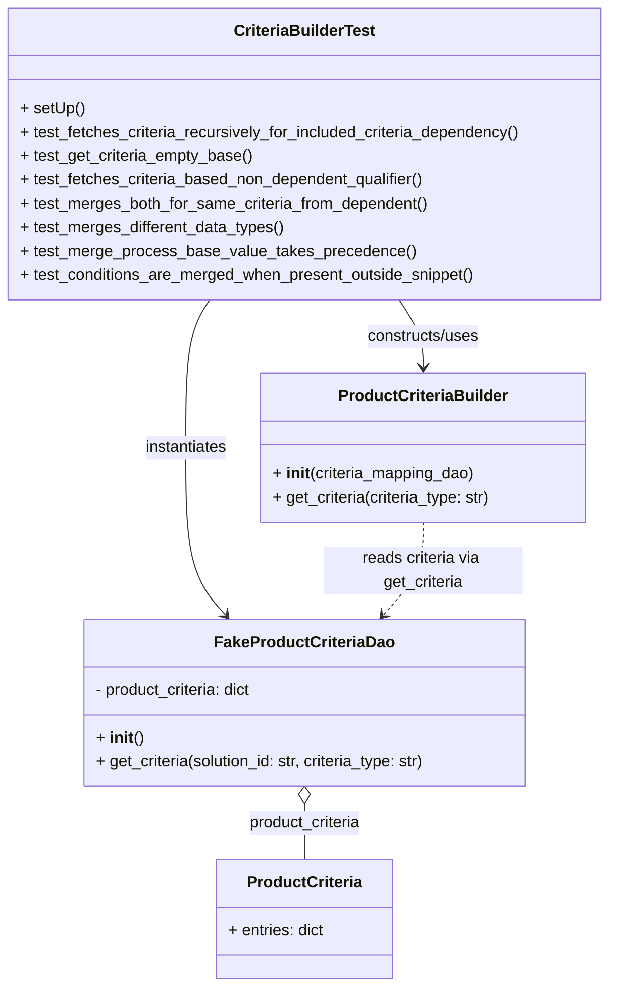

# Diagram: entity_core/entity_service/entity_service_tests/entity_state_machine_tests/test_product_criteria_builder.py

> Auto-generated by Obscura crawlers

## Mermaid

### SVG

<svg id="container" width="621.5" xmlns="http://www.w3.org/2000/svg" class="classDiagram" height="994" viewBox="0 0 621.5 994" role="graphics-document document" aria-roledescription="class"><g><defs><marker id="container_class-aggregationStart" class="marker aggregation class" refX="18" refY="7" markerWidth="190" markerHeight="240" orient="auto"><path d="M 18,7 L9,13 L1,7 L9,1 Z"></path></marker></defs><defs><marker id="container_class-aggregationEnd" class="marker aggregation class" refX="1" refY="7" markerWidth="20" markerHeight="28" orient="auto"><path d="M 18,7 L9,13 L1,7 L9,1 Z"></path></marker></defs><defs><marker id="container_class-extensionStart" class="marker extension class" refX="18" refY="7" markerWidth="190" markerHeight="240" orient="auto"><path d="M 1,7 L18,13 V 1 Z"></path></marker></defs><defs><marker id="container_class-extensionEnd" class="marker extension class" refX="1" refY="7" markerWidth="20" markerHeight="28" orient="auto"><path d="M 1,1 V 13 L18,7 Z"></path></marker></defs><defs><marker id="container_class-compositionStart" class="marker composition class" refX="18" refY="7" markerWidth="190" markerHeight="240" orient="auto"><path d="M 18,7 L9,13 L1,7 L9,1 Z"></path></marker></defs><defs><marker id="container_class-compositionEnd" class="marker composition class" refX="1" refY="7" markerWidth="20" markerHeight="28" orient="auto"><path d="M 18,7 L9,13 L1,7 L9,1 Z"></path></marker></defs><defs><marker id="container_class-dependencyStart" class="marker dependency class" refX="6" refY="7" markerWidth="190" markerHeight="240" orient="auto"><path d="M 5,7 L9,13 L1,7 L9,1 Z"></path></marker></defs><defs><marker id="container_class-dependencyEnd" class="marker dependency class" refX="13" refY="7" markerWidth="20" markerHeight="28" orient="auto"><path d="M 18,7 L9,13 L14,7 L9,1 Z"></path></marker></defs><defs><marker id="container_class-lollipopStart" class="marker lollipop class" refX="13" refY="7" markerWidth="190" markerHeight="240" orient="auto"><circle stroke="black" fill="transparent" cx="7" cy="7" r="6"></circle></marker></defs><defs><marker id="container_class-lollipopEnd" class="marker lollipop class" refX="1" refY="7" markerWidth="190" markerHeight="240" orient="auto"><circle stroke="black" fill="transparent" cx="7" cy="7" r="6"></circle></marker></defs><g class="root"><g class="clusters"></g><g class="edgePaths"><path d="M310.75,809.25L310.75,812.542C310.75,815.833,310.75,822.417,310.75,831.875C310.75,841.333,310.75,853.667,310.75,859.833L310.75,866" id="id_FakeProductCriteriaDao_ProductCriteria_1" class="edge-thickness-normal edge-pattern-solid relation" style=";;;" data-edge="true" data-et="edge" data-id="id_FakeProductCriteriaDao_ProductCriteria_1" data-points="W3sieCI6MzEwLjc1LCJ5Ijo3OTJ9LHsieCI6MzEwLjc1LCJ5Ijo4Mjl9LHsieCI6MzEwLjc1LCJ5Ijo4NjZ9XQ==" marker-start="url(#container_class-aggregationStart)"></path><path d="M213.576,302L209.499,308.167C205.423,314.333,197.27,326.667,193.194,351.5C189.117,376.333,189.117,413.667,189.117,453C189.117,492.333,189.117,533.667,195.911,561.762C202.705,589.857,216.292,604.715,223.086,612.144L229.88,619.572" id="id_CriteriaBuilderTest_FakeProductCriteriaDao_2" class="edge-thickness-normal edge-pattern-solid relation" style=";;;" data-edge="true" data-et="edge" data-id="id_CriteriaBuilderTest_FakeProductCriteriaDao_2" data-points="W3sieCI6MjEzLjU3NTk1OTU3ODgwNDM0LCJ5IjozMDJ9LHsieCI6MTg5LjExNzE4NzUsInkiOjMzOX0seyJ4IjoxODkuMTE3MTg3NSwieSI6NDUxfSx7IngiOjE4OS4xMTcxODc1LCJ5Ijo1NzV9LHsieCI6MjMzLjkyOTI3NjMxNTc4OTQ4LCJ5Ijo2MjR9XQ==" marker-end="url(#container_class-dependencyEnd)"></path><path d="M407.924,302L412.001,308.167C416.077,314.333,424.23,326.667,428.306,338C432.383,349.333,432.383,359.667,432.383,364.833L432.383,370" id="id_CriteriaBuilderTest_ProductCriteriaBuilder_3" class="edge-thickness-normal edge-pattern-solid relation" style=";;;" data-edge="true" data-et="edge" data-id="id_CriteriaBuilderTest_ProductCriteriaBuilder_3" data-points="W3sieCI6NDA3LjkyNDA0MDQyMTE5NTYsInkiOjMwMn0seyJ4Ijo0MzIuMzgyODEyNSwieSI6MzM5fSx7IngiOjQzMi4zODI4MTI1LCJ5IjozNzZ9XQ==" marker-end="url(#container_class-dependencyEnd)"></path><path d="M432.383,526L432.383,534.167C432.383,542.333,432.383,558.667,425.589,574.262C418.795,589.857,405.208,604.715,398.414,612.144L391.62,619.572" id="id_ProductCriteriaBuilder_FakeProductCriteriaDao_4" class="edge-thickness-normal edge-pattern-dashed relation" style=";;;" data-edge="true" data-et="edge" data-id="id_ProductCriteriaBuilder_FakeProductCriteriaDao_4" data-points="W3sieCI6NDMyLjM4MjgxMjUsInkiOjUyNn0seyJ4Ijo0MzIuMzgyODEyNSwieSI6NTc1fSx7IngiOjM4Ny41NzA3MjM2ODQyMTA1LCJ5Ijo2MjR9XQ==" marker-end="url(#container_class-dependencyEnd)"></path></g><g class="edgeLabels"><g class="edgeLabel" transform="translate(310.75, 829)"><g class="label" data-id="id_FakeProductCriteriaDao_ProductCriteria_1" transform="translate(-58.421875, -12)"><foreignObject width="116.84375" height="24">

product_criteria

</foreignObject></g></g><g class="edgeLabel" transform="translate(189.1171875, 451)"><g class="label" data-id="id_CriteriaBuilderTest_FakeProductCriteriaDao_2" transform="translate(-42.9140625, -12)"><foreignObject width="85.828125" height="24">

instantiates

</foreignObject></g></g><g class="edgeLabel" transform="translate(432.3828125, 339)"><g class="label" data-id="id_CriteriaBuilderTest_ProductCriteriaBuilder_3" transform="translate(-58.25, -12)"><foreignObject width="116.5" height="24">

constructs/uses

</foreignObject></g></g><g class="edgeLabel" transform="translate(432.3828125, 575)"><g class="label" data-id="id_ProductCriteriaBuilder_FakeProductCriteriaDao_4" transform="translate(-100, -24)"><foreignObject width="200" height="48">

reads criteria via get_criteria

</foreignObject></g></g></g><g class="nodes"><g class="node default" id="classId-FakeProductCriteriaDao-0" transform="translate(310.75, 708)"><g class="basic label-container"><path d="M-225.7109375 -84 L225.7109375 -84 L225.7109375 84 L-225.7109375 84" stroke="none" stroke-width="0" fill="#ECECFF" style=""></path><path d="M-225.7109375 -84 C-49.04822310470425 -84, 127.6144912905915 -84, 225.7109375 -84 M-225.7109375 -84 C-88.02470060974008 -84, 49.66153628051984 -84, 225.7109375 -84 M225.7109375 -84 C225.7109375 -32.04933076606403, 225.7109375 19.901338467871938, 225.7109375 84 M225.7109375 -84 C225.7109375 -30.440591649908377, 225.7109375 23.118816700183245, 225.7109375 84 M225.7109375 84 C110.92571016762953 84, -3.859517164740936 84, -225.7109375 84 M225.7109375 84 C73.73972229248511 84, -78.23149291502978 84, -225.7109375 84 M-225.7109375 84 C-225.7109375 39.92296967228417, -225.7109375 -4.154060655431664, -225.7109375 -84 M-225.7109375 84 C-225.7109375 30.55006779767522, -225.7109375 -22.899864404649563, -225.7109375 -84" stroke="#9370DB" stroke-width="1.3" fill="none" stroke-dasharray="0 0" style=""></path></g><g class="annotation-group text" transform="translate(0, -60)"></g><g class="label-group text" transform="translate(-86.46875, -60)"><g class="label" style="font-weight: bolder" transform="translate(0,-12)"><foreignObject width="172.9375" height="24">

FakeProductCriteriaDao

</foreignObject></g></g><g class="members-group text" transform="translate(-213.7109375, -12)"><g class="label" style="" transform="translate(0,-12)"><foreignObject width="163.109375" height="24">

- product_criteria: dict

</foreignObject></g></g><g class="methods-group text" transform="translate(-213.7109375, 36)"><g class="label" style="" transform="translate(0,-12)"><foreignObject width="47.046875" height="24">

+ <strong>init</strong>()

</foreignObject></g><g class="label" style="" transform="translate(0,12)"><foreignObject width="340.953125" height="24">

+ get_criteria(solution_id: str, criteria_type: str)

</foreignObject></g></g><g class="divider" style=""><path d="M-225.7109375 -36 C-125.03435088086373 -36, -24.357764261727453 -36, 225.7109375 -36 M-225.7109375 -36 C-84.73652014447313 -36, 56.237897211053735 -36, 225.7109375 -36" stroke="#9370DB" stroke-width="1.3" fill="none" stroke-dasharray="0 0" style=""></path></g><g class="divider" style=""><path d="M-225.7109375 12 C-111.07019380658816 12, 3.5705498868236702 12, 225.7109375 12 M-225.7109375 12 C-74.01407366877481 12, 77.68279016245037 12, 225.7109375 12" stroke="#9370DB" stroke-width="1.3" fill="none" stroke-dasharray="0 0" style=""></path></g></g><g class="node default" id="classId-ProductCriteriaBuilder-1" transform="translate(432.3828125, 451)"><g class="basic label-container"><path d="M-165.3515625 -75 L165.3515625 -75 L165.3515625 75 L-165.3515625 75" stroke="none" stroke-width="0" fill="#ECECFF" style=""></path><path d="M-165.3515625 -75 C-61.15306658544223 -75, 43.045429329115535 -75, 165.3515625 -75 M-165.3515625 -75 C-38.557488873740255 -75, 88.23658475251949 -75, 165.3515625 -75 M165.3515625 -75 C165.3515625 -19.95625368618326, 165.3515625 35.08749262763348, 165.3515625 75 M165.3515625 -75 C165.3515625 -17.34613415259367, 165.3515625 40.30773169481266, 165.3515625 75 M165.3515625 75 C61.18014168632166 75, -42.99127912735668 75, -165.3515625 75 M165.3515625 75 C86.04406655184034 75, 6.73657060368069 75, -165.3515625 75 M-165.3515625 75 C-165.3515625 40.057868535726946, -165.3515625 5.115737071453893, -165.3515625 -75 M-165.3515625 75 C-165.3515625 31.69787930587797, -165.3515625 -11.604241388244063, -165.3515625 -75" stroke="#9370DB" stroke-width="1.3" fill="none" stroke-dasharray="0 0" style=""></path></g><g class="annotation-group text" transform="translate(0, -51)"></g><g class="label-group text" transform="translate(-82.28125, -51)"><g class="label" style="font-weight: bolder" transform="translate(0,-12)"><foreignObject width="164.5625" height="24">

ProductCriteriaBuilder

</foreignObject></g></g><g class="members-group text" transform="translate(-153.3515625, -3)"></g><g class="methods-group text" transform="translate(-153.3515625, 27)"><g class="label" style="" transform="translate(0,-12)"><foreignObject width="206.65625" height="24">

+ <strong>init</strong>(criteria_mapping_dao)

</foreignObject></g><g class="label" style="" transform="translate(0,12)"><foreignObject width="224.421875" height="24">

+ get_criteria(criteria_type: str)

</foreignObject></g></g><g class="divider" style=""><path d="M-165.3515625 -27 C-79.54833752931299 -27, 6.254887441374024 -27, 165.3515625 -27 M-165.3515625 -27 C-74.66046717533271 -27, 16.030628149334575 -27, 165.3515625 -27" stroke="#9370DB" stroke-width="1.3" fill="none" stroke-dasharray="0 0" style=""></path></g><g class="divider" style=""><path d="M-165.3515625 -3 C-80.20867292448588 -3, 4.934216651028237 -3, 165.3515625 -3 M-165.3515625 -3 C-58.69455981183765 -3, 47.9624428763247 -3, 165.3515625 -3" stroke="#9370DB" stroke-width="1.3" fill="none" stroke-dasharray="0 0" style=""></path></g></g><g class="node default" id="classId-CriteriaBuilderTest-2" transform="translate(310.75, 155)"><g class="basic label-container"><path d="M-302.75 -147 L302.75 -147 L302.75 147 L-302.75 147" stroke="none" stroke-width="0" fill="#ECECFF" style=""></path><path d="M-302.75 -147 C-122.66027743716316 -147, 57.42944512567368 -147, 302.75 -147 M-302.75 -147 C-104.65251922660403 -147, 93.44496154679194 -147, 302.75 -147 M302.75 -147 C302.75 -44.55713167446375, 302.75 57.885736651072506, 302.75 147 M302.75 -147 C302.75 -65.14688306148722, 302.75 16.706233877025568, 302.75 147 M302.75 147 C91.03365359292522 147, -120.68269281414956 147, -302.75 147 M302.75 147 C78.88667111573267 147, -144.97665776853466 147, -302.75 147 M-302.75 147 C-302.75 46.00621979815928, -302.75 -54.98756040368144, -302.75 -147 M-302.75 147 C-302.75 46.84076530171238, -302.75 -53.31846939657524, -302.75 -147" stroke="#9370DB" stroke-width="1.3" fill="none" stroke-dasharray="0 0" style=""></path></g><g class="annotation-group text" transform="translate(0, -123)"></g><g class="label-group text" transform="translate(-68.953125, -123)"><g class="label" style="font-weight: bolder" transform="translate(0,-12)"><foreignObject width="137.90625" height="24">

CriteriaBuilderTest

</foreignObject></g></g><g class="members-group text" transform="translate(-290.75, -75)"></g><g class="methods-group text" transform="translate(-290.75, -45)"><g class="label" style="" transform="translate(0,-12)"><foreignObject width="64.65625" height="24">

+ setUp()

</foreignObject></g><g class="label" style="" transform="translate(0,12)"><foreignObject width="512.546875" height="24">

+ test_fetches_criteria_recursively_for_included_criteria_dependency()

</foreignObject></g><g class="label" style="" transform="translate(0,36)"><foreignObject width="236.53125" height="24">

+ test_get_criteria_empty_base()

</foreignObject></g><g class="label" style="" transform="translate(0,60)"><foreignObject width="414.875" height="24">

+ test_fetches_criteria_based_non_dependent_qualifier()

</foreignObject></g><g class="label" style="" transform="translate(0,84)"><foreignObject width="416.359375" height="24">

+ test_merges_both_for_same_criteria_from_dependent()

</foreignObject></g><g class="label" style="" transform="translate(0,108)"><foreignObject width="269.5625" height="24">

+ test_merges_different_data_types()

</foreignObject></g><g class="label" style="" transform="translate(0,132)"><foreignObject width="393.40625" height="24">

+ test_merge_process_base_value_takes_precedence()

</foreignObject></g><g class="label" style="" transform="translate(0,156)"><foreignObject width="464.328125" height="24">

+ test_conditions_are_merged_when_present_outside_snippet()

</foreignObject></g></g><g class="divider" style=""><path d="M-302.75 -99 C-116.69598301917665 -99, 69.3580339616467 -99, 302.75 -99 M-302.75 -99 C-153.997048756771 -99, -5.244097513541988 -99, 302.75 -99" stroke="#9370DB" stroke-width="1.3" fill="none" stroke-dasharray="0 0" style=""></path></g><g class="divider" style=""><path d="M-302.75 -75 C-130.3255899222586 -75, 42.09882015548283 -75, 302.75 -75 M-302.75 -75 C-119.31167791664515 -75, 64.1266441667097 -75, 302.75 -75" stroke="#9370DB" stroke-width="1.3" fill="none" stroke-dasharray="0 0" style=""></path></g></g><g class="node default" id="classId-ProductCriteria-3" transform="translate(310.75, 926)"><g class="basic label-container"><path d="M-89.16015625 -60 L89.16015625 -60 L89.16015625 60 L-89.16015625 60" stroke="none" stroke-width="0" fill="#ECECFF" style=""></path><path d="M-89.16015625 -60 C-29.63912047745616 -60, 29.88191529508768 -60, 89.16015625 -60 M-89.16015625 -60 C-48.473725511317355 -60, -7.787294772634709 -60, 89.16015625 -60 M89.16015625 -60 C89.16015625 -32.283503195449356, 89.16015625 -4.567006390898719, 89.16015625 60 M89.16015625 -60 C89.16015625 -23.0258837044109, 89.16015625 13.948232591178197, 89.16015625 60 M89.16015625 60 C34.328214447894965 60, -20.50372735421007 60, -89.16015625 60 M89.16015625 60 C27.35763872432976 60, -34.44487880134048 60, -89.16015625 60 M-89.16015625 60 C-89.16015625 28.61338399602313, -89.16015625 -2.7732320079537374, -89.16015625 -60 M-89.16015625 60 C-89.16015625 15.793429842807136, -89.16015625 -28.41314031438573, -89.16015625 -60" stroke="#9370DB" stroke-width="1.3" fill="none" stroke-dasharray="0 0" style=""></path></g><g class="annotation-group text" transform="translate(0, -36)"></g><g class="label-group text" transform="translate(-55.7578125, -36)"><g class="label" style="font-weight: bolder" transform="translate(0,-12)"><foreignObject width="111.515625" height="24">

ProductCriteria

</foreignObject></g></g><g class="members-group text" transform="translate(-77.16015625, 12)"><g class="label" style="" transform="translate(0,-12)"><foreignObject width="98.5625" height="24">

+ entries: dict

</foreignObject></g></g><g class="methods-group text" transform="translate(-77.16015625, 60)"></g><g class="divider" style=""><path d="M-89.16015625 -12 C-40.517172153609664 -12, 8.125811942780672 -12, 89.16015625 -12 M-89.16015625 -12 C-48.415478104178575 -12, -7.670799958357151 -12, 89.16015625 -12" stroke="#9370DB" stroke-width="1.3" fill="none" stroke-dasharray="0 0" style=""></path></g><g class="divider" style=""><path d="M-89.16015625 36 C-34.49230062943281 36, 20.175554991134376 36, 89.16015625 36 M-89.16015625 36 C-52.95361513083947 36, -16.747074011678933 36, 89.16015625 36" stroke="#9370DB" stroke-width="1.3" fill="none" stroke-dasharray="0 0" style=""></path></g></g></g></g></g></svg>
