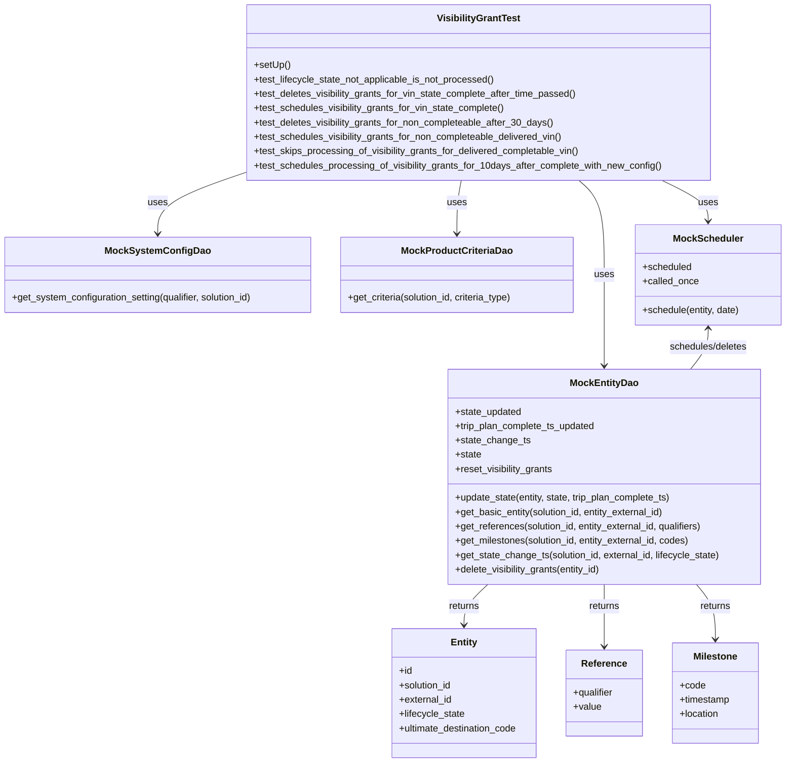
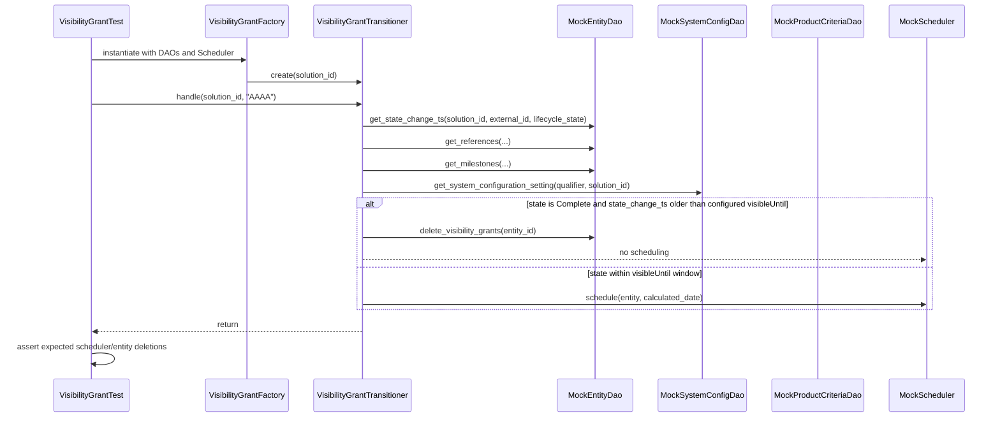

# Diagram: entity_core/entity_service/entity_service_tests/entity_state_machine_tests/test_visibility_grant_processor.py

> Auto-generated by Obscura crawlers

## Diagram 1

### SVG

<svg id="container" width="1329.3828125" xmlns="http://www.w3.org/2000/svg" class="classDiagram" height="1276" viewBox="0 0 1329.3828125 1276" role="graphics-document document" aria-roledescription="class"><g><defs><marker id="container_class-aggregationStart" class="marker aggregation class" refX="18" refY="7" markerWidth="190" markerHeight="240" orient="auto"><path d="M 18,7 L9,13 L1,7 L9,1 Z"></path></marker></defs><defs><marker id="container_class-aggregationEnd" class="marker aggregation class" refX="1" refY="7" markerWidth="20" markerHeight="28" orient="auto"><path d="M 18,7 L9,13 L1,7 L9,1 Z"></path></marker></defs><defs><marker id="container_class-extensionStart" class="marker extension class" refX="18" refY="7" markerWidth="190" markerHeight="240" orient="auto"><path d="M 1,7 L18,13 V 1 Z"></path></marker></defs><defs><marker id="container_class-extensionEnd" class="marker extension class" refX="1" refY="7" markerWidth="20" markerHeight="28" orient="auto"><path d="M 1,1 V 13 L18,7 Z"></path></marker></defs><defs><marker id="container_class-compositionStart" class="marker composition class" refX="18" refY="7" markerWidth="190" markerHeight="240" orient="auto"><path d="M 18,7 L9,13 L1,7 L9,1 Z"></path></marker></defs><defs><marker id="container_class-compositionEnd" class="marker composition class" refX="1" refY="7" markerWidth="20" markerHeight="28" orient="auto"><path d="M 18,7 L9,13 L1,7 L9,1 Z"></path></marker></defs><defs><marker id="container_class-dependencyStart" class="marker dependency class" refX="6" refY="7" markerWidth="190" markerHeight="240" orient="auto"><path d="M 5,7 L9,13 L1,7 L9,1 Z"></path></marker></defs><defs><marker id="container_class-dependencyEnd" class="marker dependency class" refX="13" refY="7" markerWidth="20" markerHeight="28" orient="auto"><path d="M 18,7 L9,13 L14,7 L9,1 Z"></path></marker></defs><defs><marker id="container_class-lollipopStart" class="marker lollipop class" refX="13" refY="7" markerWidth="190" markerHeight="240" orient="auto"><circle stroke="black" fill="transparent" cx="7" cy="7" r="6"></circle></marker></defs><defs><marker id="container_class-lollipopEnd" class="marker lollipop class" refX="1" refY="7" markerWidth="190" markerHeight="240" orient="auto"><circle stroke="black" fill="transparent" cx="7" cy="7" r="6"></circle></marker></defs><g class="root"><g class="clusters"></g><g class="edgePaths"><path d="M424.451,285.937L398.257,294.78C372.064,303.624,319.676,321.312,293.483,338.823C267.289,356.333,267.289,373.667,267.289,382.333L267.289,391" id="id_VisibilityGrantTest_MockSystemConfigDao_1" class="edge-thickness-normal edge-pattern-solid relation" style=";;;" data-edge="true" data-et="edge" data-id="id_VisibilityGrantTest_MockSystemConfigDao_1" data-points="W3sieCI6NDI0LjQ1MTE3MTg3NSwieSI6Mjg1LjkzNjUzMjExMzg0MDF9LHsieCI6MjY3LjI4OTA2MjUsInkiOjMzOX0seyJ4IjoyNjcuMjg5MDYyNSwieSI6Mzk3fV0=" marker-end="url(#container_class-dependencyEnd)"></path><path d="M782.208,302L780.947,308.167C779.687,314.333,777.166,326.667,775.905,341.5C774.645,356.333,774.645,373.667,774.645,382.333L774.645,391" id="id_VisibilityGrantTest_MockProductCriteriaDao_2" class="edge-thickness-normal edge-pattern-solid relation" style=";;;" data-edge="true" data-et="edge" data-id="id_VisibilityGrantTest_MockProductCriteriaDao_2" data-points="W3sieCI6NzgyLjIwNzY3ODc1MzM5NjcsInkiOjMwMn0seyJ4Ijo3NzQuNjQ0NTMxMjUsInkiOjMzOX0seyJ4Ijo3NzQuNjQ0NTMxMjUsInkiOjM5N31d" marker-end="url(#container_class-dependencyEnd)"></path><path d="M981.583,302L988.687,308.167C995.79,314.333,1009.997,326.667,1017.1,353C1024.203,379.333,1024.203,419.667,1024.203,460C1024.203,500.333,1024.203,540.667,1024.203,566C1024.203,591.333,1024.203,601.667,1024.203,606.833L1024.203,612" id="id_VisibilityGrantTest_MockEntityDao_3" class="edge-thickness-normal edge-pattern-solid relation" style=";;;" data-edge="true" data-et="edge" data-id="id_VisibilityGrantTest_MockEntityDao_3" data-points="W3sieCI6OTgxLjU4MzI5NDQxMjM2NDEsInkiOjMwMn0seyJ4IjoxMDI0LjIwMzEyNSwieSI6MzM5fSx7IngiOjEwMjQuMjAzMTI1LCJ5Ijo0NjB9LHsieCI6MTAyNC4yMDMxMjUsInkiOjU4MX0seyJ4IjoxMDI0LjIwMzEyNSwieSI6NjE4fV0=" marker-end="url(#container_class-dependencyEnd)"></path><path d="M1120.863,302L1133.809,308.167C1146.755,314.333,1172.647,326.667,1185.593,338C1198.539,349.333,1198.539,359.667,1198.539,364.833L1198.539,370" id="id_VisibilityGrantTest_MockScheduler_4" class="edge-thickness-normal edge-pattern-solid relation" style=";;;" data-edge="true" data-et="edge" data-id="id_VisibilityGrantTest_MockScheduler_4" data-points="W3sieCI6MTEyMC44NjI1NDg4MjgxMjUsInkiOjMwMn0seyJ4IjoxMTk4LjUzOTA2MjUsInkiOjMzOX0seyJ4IjoxMTk4LjUzOTA2MjUsInkiOjM3Nn1d" marker-end="url(#container_class-dependencyEnd)"></path><path d="M826.269,978L819.487,984.167C812.706,990.333,799.144,1002.667,792.363,1014C785.582,1025.333,785.582,1035.667,785.582,1040.833L785.582,1046" id="id_MockEntityDao_Entity_5" class="edge-thickness-normal edge-pattern-solid relation" style=";;;" data-edge="true" data-et="edge" data-id="id_MockEntityDao_Entity_5" data-points="W3sieCI6ODI2LjI2ODU3NzE4ODk0MDEsInkiOjk3OH0seyJ4Ijo3ODUuNTgyMDMxMjUsInkiOjEwMTV9LHsieCI6Nzg1LjU4MjAzMTI1LCJ5IjoxMDUyfV0=" marker-end="url(#container_class-dependencyEnd)"></path><path d="M1024.203,978L1024.203,984.167C1024.203,990.333,1024.203,1002.667,1024.203,1020C1024.203,1037.333,1024.203,1059.667,1024.203,1070.833L1024.203,1082" id="id_MockEntityDao_Reference_6" class="edge-thickness-normal edge-pattern-solid relation" style=";;;" data-edge="true" data-et="edge" data-id="id_MockEntityDao_Reference_6" data-points="W3sieCI6MTAyNC4yMDMxMjUsInkiOjk3OH0seyJ4IjoxMDI0LjIwMzEyNSwieSI6MTAxNX0seyJ4IjoxMDI0LjIwMzEyNSwieSI6MTA4OH1d" marker-end="url(#container_class-dependencyEnd)"></path><path d="M1179.62,978L1184.944,984.167C1190.269,990.333,1200.917,1002.667,1206.242,1018C1211.566,1033.333,1211.566,1051.667,1211.566,1060.833L1211.566,1070" id="id_MockEntityDao_Milestone_7" class="edge-thickness-normal edge-pattern-solid relation" style=";;;" data-edge="true" data-et="edge" data-id="id_MockEntityDao_Milestone_7" data-points="W3sieCI6MTE3OS42MTk2NzE2NTg5ODYxLCJ5Ijo5Nzh9LHsieCI6MTIxMS41NjY0MDYyNSwieSI6MTAxNX0seyJ4IjoxMjExLjU2NjQwNjI1LCJ5IjoxMDc2fV0=" marker-end="url(#container_class-dependencyEnd)"></path><path d="M1198.539,550L1198.539,555.167C1198.539,560.333,1198.539,570.667,1193.585,582C1188.631,593.333,1178.722,605.667,1173.768,611.833L1168.814,618" id="id_MockScheduler_MockEntityDao_8" class="edge-thickness-normal edge-pattern-solid relation" style=";;;" data-edge="true" data-et="edge" data-id="id_MockScheduler_MockEntityDao_8" data-points="W3sieCI6MTE5OC41MzkwNjI1LCJ5Ijo1NDR9LHsieCI6MTE5OC41MzkwNjI1LCJ5Ijo1ODF9LHsieCI6MTE2OC44MTM1ODAwNjkxMjQzLCJ5Ijo2MTh9XQ==" marker-start="url(#container_class-dependencyStart)"></path></g><g class="edgeLabels"><g class="edgeLabel" transform="translate(267.2890625, 339)"><g class="label" data-id="id_VisibilityGrantTest_MockSystemConfigDao_1" transform="translate(-16.4921875, -12)"><foreignObject width="32.984375" height="24">

uses

</foreignObject></g></g><g class="edgeLabel" transform="translate(774.64453125, 339)"><g class="label" data-id="id_VisibilityGrantTest_MockProductCriteriaDao_2" transform="translate(-16.4921875, -12)"><foreignObject width="32.984375" height="24">

uses

</foreignObject></g></g><g class="edgeLabel" transform="translate(1024.203125, 460)"><g class="label" data-id="id_VisibilityGrantTest_MockEntityDao_3" transform="translate(-16.4921875, -12)"><foreignObject width="32.984375" height="24">

uses

</foreignObject></g></g><g class="edgeLabel" transform="translate(1198.5390625, 339)"><g class="label" data-id="id_VisibilityGrantTest_MockScheduler_4" transform="translate(-16.4921875, -12)"><foreignObject width="32.984375" height="24">

uses

</foreignObject></g></g><g class="edgeLabel" transform="translate(785.58203125, 1015)"><g class="label" data-id="id_MockEntityDao_Entity_5" transform="translate(-26.265625, -12)"><foreignObject width="52.53125" height="24">

returns

</foreignObject></g></g><g class="edgeLabel" transform="translate(1024.203125, 1015)"><g class="label" data-id="id_MockEntityDao_Reference_6" transform="translate(-26.265625, -12)"><foreignObject width="52.53125" height="24">

returns

</foreignObject></g></g><g class="edgeLabel" transform="translate(1211.56640625, 1015)"><g class="label" data-id="id_MockEntityDao_Milestone_7" transform="translate(-26.265625, -12)"><foreignObject width="52.53125" height="24">

returns

</foreignObject></g></g><g class="edgeLabel" transform="translate(1198.5390625, 581)"><g class="label" data-id="id_MockScheduler_MockEntityDao_8" transform="translate(-66.8828125, -12)"><foreignObject width="133.765625" height="24">

schedules/deletes

</foreignObject></g></g></g><g class="nodes"><g class="node default" id="classId-VisibilityGrantTest-0" transform="translate(812.255859375, 155)"><g class="basic label-container"><path d="M-387.8046875 -147 L387.8046875 -147 L387.8046875 147 L-387.8046875 147" stroke="none" stroke-width="0" fill="#ECECFF" style=""></path><path d="M-387.8046875 -147 C-100.21917138448396 -147, 187.3663447310321 -147, 387.8046875 -147 M-387.8046875 -147 C-99.67165180485756 -147, 188.46138389028488 -147, 387.8046875 -147 M387.8046875 -147 C387.8046875 -72.3087953424922, 387.8046875 2.382409315015593, 387.8046875 147 M387.8046875 -147 C387.8046875 -54.95460278073129, 387.8046875 37.090794438537415, 387.8046875 147 M387.8046875 147 C202.0648152347638 147, 16.324942969527626 147, -387.8046875 147 M387.8046875 147 C225.38093396520827 147, 62.95718043041654 147, -387.8046875 147 M-387.8046875 147 C-387.8046875 45.880922575259916, -387.8046875 -55.23815484948017, -387.8046875 -147 M-387.8046875 147 C-387.8046875 43.079703648491304, -387.8046875 -60.84059270301739, -387.8046875 -147" stroke="#9370DB" stroke-width="1.3" fill="none" stroke-dasharray="0 0" style=""></path></g><g class="annotation-group text" transform="translate(0, -123)"></g><g class="label-group text" transform="translate(-67.21875, -123)"><g class="label" style="font-weight: bolder" transform="translate(0,-12)"><foreignObject width="134.4375" height="24">

VisibilityGrantTest

</foreignObject></g></g><g class="members-group text" transform="translate(-375.8046875, -75)"></g><g class="methods-group text" transform="translate(-375.8046875, -45)"><g class="label" style="" transform="translate(0,-12)"><foreignObject width="60.421875" height="24">

+setUp()

</foreignObject></g><g class="label" style="" transform="translate(0,12)"><foreignObject width="408.484375" height="24">

+test_lifecycle_state_not_applicable_is_not_processed()

</foreignObject></g><g class="label" style="" transform="translate(0,36)"><foreignObject width="545.90625" height="24">

+test_deletes_visibility_grants_for_vin_state_complete_after_time_passed()

</foreignObject></g><g class="label" style="" transform="translate(0,60)"><foreignObject width="425.203125" height="24">

+test_schedules_visibility_grants_for_vin_state_complete()

</foreignObject></g><g class="label" style="" transform="translate(0,84)"><foreignObject width="506.34375" height="24">

+test_deletes_visibility_grants_for_non_completeable_after_30_days()

</foreignObject></g><g class="label" style="" transform="translate(0,108)"><foreignObject width="524.578125" height="24">

+test_schedules_visibility_grants_for_non_completeable_delivered_vin()

</foreignObject></g><g class="label" style="" transform="translate(0,132)"><foreignObject width="552.1875" height="24">

+test_skips_processing_of_visibility_grants_for_delivered_completable_vin()

</foreignObject></g><g class="label" style="" transform="translate(0,156)"><foreignObject width="684.390625" height="24">

+test_schedules_processing_of_visibility_grants_for_10days_after_complete_with_new_config()

</foreignObject></g></g><g class="divider" style=""><path d="M-387.8046875 -99 C-194.3039181607335 -99, -0.8031488214670048 -99, 387.8046875 -99 M-387.8046875 -99 C-156.61480847310173 -99, 74.57507055379654 -99, 387.8046875 -99" stroke="#9370DB" stroke-width="1.3" fill="none" stroke-dasharray="0 0" style=""></path></g><g class="divider" style=""><path d="M-387.8046875 -75 C-185.51846705124427 -75, 16.767753397511456 -75, 387.8046875 -75 M-387.8046875 -75 C-199.8615867803172 -75, -11.918486060634393 -75, 387.8046875 -75" stroke="#9370DB" stroke-width="1.3" fill="none" stroke-dasharray="0 0" style=""></path></g></g><g class="node default" id="classId-MockEntityDao-1" transform="translate(1024.203125, 798)"><g class="basic label-container"><path d="M-264.16015625 -180 L264.16015625 -180 L264.16015625 180 L-264.16015625 180" stroke="none" stroke-width="0" fill="#ECECFF" style=""></path><path d="M-264.16015625 -180 C-125.90412647848379 -180, 12.351903293032422 -180, 264.16015625 -180 M-264.16015625 -180 C-70.30350534508673 -180, 123.55314555982653 -180, 264.16015625 -180 M264.16015625 -180 C264.16015625 -43.95116820185845, 264.16015625 92.0976635962831, 264.16015625 180 M264.16015625 -180 C264.16015625 -47.378964579261606, 264.16015625 85.24207084147679, 264.16015625 180 M264.16015625 180 C121.61786409456477 180, -20.92442806087047 180, -264.16015625 180 M264.16015625 180 C94.26808199321721 180, -75.62399226356558 180, -264.16015625 180 M-264.16015625 180 C-264.16015625 83.91894150808056, -264.16015625 -12.162116983838871, -264.16015625 -180 M-264.16015625 180 C-264.16015625 61.39961233722153, -264.16015625 -57.20077532555695, -264.16015625 -180" stroke="#9370DB" stroke-width="1.3" fill="none" stroke-dasharray="0 0" style=""></path></g><g class="annotation-group text" transform="translate(0, -156)"></g><g class="label-group text" transform="translate(-54.6796875, -156)"><g class="label" style="font-weight: bolder" transform="translate(0,-12)"><foreignObject width="109.359375" height="24">

MockEntityDao

</foreignObject></g></g><g class="members-group text" transform="translate(-252.16015625, -108)"><g class="label" style="" transform="translate(0,-12)"><foreignObject width="112.6875" height="24">

+state_updated

</foreignObject></g><g class="label" style="" transform="translate(0,12)"><foreignObject width="239.0625" height="24">

+trip_plan_complete_ts_updated

</foreignObject></g><g class="label" style="" transform="translate(0,36)"><foreignObject width="124.578125" height="24">

+state_change_ts

</foreignObject></g><g class="label" style="" transform="translate(0,60)"><foreignObject width="44.09375" height="24">

+state

</foreignObject></g><g class="label" style="" transform="translate(0,84)"><foreignObject width="166.609375" height="24">

+reset_visibility_grants

</foreignObject></g></g><g class="methods-group text" transform="translate(-252.16015625, 36)"><g class="label" style="" transform="translate(0,-12)"><foreignObject width="369.765625" height="24">

+update_state(entity, state, trip_plan_complete_ts)

</foreignObject></g><g class="label" style="" transform="translate(0,12)"><foreignObject width="358.265625" height="24">

+get_basic_entity(solution_id, entity_external_id)

</foreignObject></g><g class="label" style="" transform="translate(0,36)"><foreignObject width="422.46875" height="24">

+get_references(solution_id, entity_external_id, qualifiers)

</foreignObject></g><g class="label" style="" transform="translate(0,60)"><foreignObject width="400.78125" height="24">

+get_milestones(solution_id, entity_external_id, codes)

</foreignObject></g><g class="label" style="" transform="translate(0,84)"><foreignObject width="449.640625" height="24">

+get_state_change_ts(solution_id, external_id, lifecycle_state)

</foreignObject></g><g class="label" style="" transform="translate(0,108)"><foreignObject width="250.03125" height="24">

+delete_visibility_grants(entity_id)

</foreignObject></g></g><g class="divider" style=""><path d="M-264.16015625 -132 C-109.82996007585143 -132, 44.50023609829714 -132, 264.16015625 -132 M-264.16015625 -132 C-63.67096568111464 -132, 136.81822488777073 -132, 264.16015625 -132" stroke="#9370DB" stroke-width="1.3" fill="none" stroke-dasharray="0 0" style=""></path></g><g class="divider" style=""><path d="M-264.16015625 12 C-107.45835348023638 12, 49.243449289527234 12, 264.16015625 12 M-264.16015625 12 C-79.16828913122347 12, 105.82357798755305 12, 264.16015625 12" stroke="#9370DB" stroke-width="1.3" fill="none" stroke-dasharray="0 0" style=""></path></g></g><g class="node default" id="classId-MockSystemConfigDao-2" transform="translate(267.2890625, 460)"><g class="basic label-container"><path d="M-259.2890625 -63 L259.2890625 -63 L259.2890625 63 L-259.2890625 63" stroke="none" stroke-width="0" fill="#ECECFF" style=""></path><path d="M-259.2890625 -63 C-58.50149490689063 -63, 142.28607268621874 -63, 259.2890625 -63 M-259.2890625 -63 C-104.89711608361316 -63, 49.49483033277369 -63, 259.2890625 -63 M259.2890625 -63 C259.2890625 -31.103067147159027, 259.2890625 0.7938657056819451, 259.2890625 63 M259.2890625 -63 C259.2890625 -27.442807093189252, 259.2890625 8.114385813621496, 259.2890625 63 M259.2890625 63 C153.79399997146993 63, 48.29893744293989 63, -259.2890625 63 M259.2890625 63 C81.46460959581435 63, -96.3598433083713 63, -259.2890625 63 M-259.2890625 63 C-259.2890625 16.095544787856483, -259.2890625 -30.808910424287035, -259.2890625 -63 M-259.2890625 63 C-259.2890625 37.241388913056085, -259.2890625 11.48277782611217, -259.2890625 -63" stroke="#9370DB" stroke-width="1.3" fill="none" stroke-dasharray="0 0" style=""></path></g><g class="annotation-group text" transform="translate(0, -39)"></g><g class="label-group text" transform="translate(-82.875, -39)"><g class="label" style="font-weight: bolder" transform="translate(0,-12)"><foreignObject width="165.75" height="24">

MockSystemConfigDao

</foreignObject></g></g><g class="members-group text" transform="translate(-247.2890625, 9)"></g><g class="methods-group text" transform="translate(-247.2890625, 39)"><g class="label" style="" transform="translate(0,-12)"><foreignObject width="411.703125" height="24">

+get_system_configuration_setting(qualifier, solution_id)

</foreignObject></g></g><g class="divider" style=""><path d="M-259.2890625 -15 C-92.51571139895267 -15, 74.25763970209465 -15, 259.2890625 -15 M-259.2890625 -15 C-59.28987564615676 -15, 140.70931120768648 -15, 259.2890625 -15" stroke="#9370DB" stroke-width="1.3" fill="none" stroke-dasharray="0 0" style=""></path></g><g class="divider" style=""><path d="M-259.2890625 9 C-53.613988359784656 9, 152.0610857804307 9, 259.2890625 9 M-259.2890625 9 C-69.41510753828553 9, 120.45884742342895 9, 259.2890625 9" stroke="#9370DB" stroke-width="1.3" fill="none" stroke-dasharray="0 0" style=""></path></g></g><g class="node default" id="classId-MockProductCriteriaDao-3" transform="translate(774.64453125, 460)"><g class="basic label-container"><path d="M-198.06640625 -63 L198.06640625 -63 L198.06640625 63 L-198.06640625 63" stroke="none" stroke-width="0" fill="#ECECFF" style=""></path><path d="M-198.06640625 -63 C-44.52104174814431 -63, 109.02432275371137 -63, 198.06640625 -63 M-198.06640625 -63 C-74.76115355422579 -63, 48.54409914154843 -63, 198.06640625 -63 M198.06640625 -63 C198.06640625 -14.016960279376711, 198.06640625 34.96607944124658, 198.06640625 63 M198.06640625 -63 C198.06640625 -27.29182783613163, 198.06640625 8.416344327736738, 198.06640625 63 M198.06640625 63 C106.64467356805878 63, 15.222940886117556 63, -198.06640625 63 M198.06640625 63 C41.27852209251108 63, -115.50936206497784 63, -198.06640625 63 M-198.06640625 63 C-198.06640625 19.88053297592151, -198.06640625 -23.238934048156977, -198.06640625 -63 M-198.06640625 63 C-198.06640625 15.45778665044513, -198.06640625 -32.08442669910974, -198.06640625 -63" stroke="#9370DB" stroke-width="1.3" fill="none" stroke-dasharray="0 0" style=""></path></g><g class="annotation-group text" transform="translate(0, -39)"></g><g class="label-group text" transform="translate(-89.1484375, -39)"><g class="label" style="font-weight: bolder" transform="translate(0,-12)"><foreignObject width="178.296875" height="24">

MockProductCriteriaDao

</foreignObject></g></g><g class="members-group text" transform="translate(-186.06640625, 9)"></g><g class="methods-group text" transform="translate(-186.06640625, 39)"><g class="label" style="" transform="translate(0,-12)"><foreignObject width="282.984375" height="24">

+get_criteria(solution_id, criteria_type)

</foreignObject></g></g><g class="divider" style=""><path d="M-198.06640625 -15 C-109.48433736064183 -15, -20.902268471283662 -15, 198.06640625 -15 M-198.06640625 -15 C-86.4762893751007 -15, 25.11382749979859 -15, 198.06640625 -15" stroke="#9370DB" stroke-width="1.3" fill="none" stroke-dasharray="0 0" style=""></path></g><g class="divider" style=""><path d="M-198.06640625 9 C-102.59601568198096 9, -7.125625113961917 9, 198.06640625 9 M-198.06640625 9 C-65.50989758651463 9, 67.04661107697075 9, 198.06640625 9" stroke="#9370DB" stroke-width="1.3" fill="none" stroke-dasharray="0 0" style=""></path></g></g><g class="node default" id="classId-MockScheduler-4" transform="translate(1198.5390625, 460)"><g class="basic label-container"><path d="M-122.84375 -84 L122.84375 -84 L122.84375 84 L-122.84375 84" stroke="none" stroke-width="0" fill="#ECECFF" style=""></path><path d="M-122.84375 -84 C-40.135410544509725 -84, 42.57292891098055 -84, 122.84375 -84 M-122.84375 -84 C-33.10058576457321 -84, 56.64257847085358 -84, 122.84375 -84 M122.84375 -84 C122.84375 -25.05435814537853, 122.84375 33.89128370924294, 122.84375 84 M122.84375 -84 C122.84375 -33.11730263584093, 122.84375 17.765394728318142, 122.84375 84 M122.84375 84 C43.66234739758711 84, -35.519055204825776 84, -122.84375 84 M122.84375 84 C60.71576321435987 84, -1.4122235712802649 84, -122.84375 84 M-122.84375 84 C-122.84375 48.424883888368655, -122.84375 12.849767776737309, -122.84375 -84 M-122.84375 84 C-122.84375 23.1690873594344, -122.84375 -37.6618252811312, -122.84375 -84" stroke="#9370DB" stroke-width="1.3" fill="none" stroke-dasharray="0 0" style=""></path></g><g class="annotation-group text" transform="translate(0, -60)"></g><g class="label-group text" transform="translate(-55.984375, -60)"><g class="label" style="font-weight: bolder" transform="translate(0,-12)"><foreignObject width="111.96875" height="24">

MockScheduler

</foreignObject></g></g><g class="members-group text" transform="translate(-110.84375, -12)"><g class="label" style="" transform="translate(0,-12)"><foreignObject width="82.984375" height="24">

+scheduled

</foreignObject></g><g class="label" style="" transform="translate(0,12)"><foreignObject width="94.375" height="24">

+called_once

</foreignObject></g></g><g class="methods-group text" transform="translate(-110.84375, 60)"><g class="label" style="" transform="translate(0,-12)"><foreignObject width="165.703125" height="24">

+schedule(entity, date)

</foreignObject></g></g><g class="divider" style=""><path d="M-122.84375 -36 C-30.218993281563442 -36, 62.405763436873116 -36, 122.84375 -36 M-122.84375 -36 C-32.02882734445639 -36, 58.78609531108722 -36, 122.84375 -36" stroke="#9370DB" stroke-width="1.3" fill="none" stroke-dasharray="0 0" style=""></path></g><g class="divider" style=""><path d="M-122.84375 36 C-49.95038344932249 36, 22.942983101355026 36, 122.84375 36 M-122.84375 36 C-47.004673033613685 36, 28.83440393277263 36, 122.84375 36" stroke="#9370DB" stroke-width="1.3" fill="none" stroke-dasharray="0 0" style=""></path></g></g><g class="node default" id="classId-Entity-5" transform="translate(785.58203125, 1160)"><g class="basic label-container"><path d="M-124.0078125 -108 L124.0078125 -108 L124.0078125 108 L-124.0078125 108" stroke="none" stroke-width="0" fill="#ECECFF" style=""></path><path d="M-124.0078125 -108 C-26.366078326633726 -108, 71.27565584673255 -108, 124.0078125 -108 M-124.0078125 -108 C-29.480524450174727 -108, 65.04676359965055 -108, 124.0078125 -108 M124.0078125 -108 C124.0078125 -26.160243142246415, 124.0078125 55.67951371550717, 124.0078125 108 M124.0078125 -108 C124.0078125 -51.09706618911582, 124.0078125 5.805867621768357, 124.0078125 108 M124.0078125 108 C35.9032117144442 108, -52.201389071111606 108, -124.0078125 108 M124.0078125 108 C48.85414243212142 108, -26.29952763575716 108, -124.0078125 108 M-124.0078125 108 C-124.0078125 24.904697634427706, -124.0078125 -58.19060473114459, -124.0078125 -108 M-124.0078125 108 C-124.0078125 54.078239556274724, -124.0078125 0.15647911254944802, -124.0078125 -108" stroke="#9370DB" stroke-width="1.3" fill="none" stroke-dasharray="0 0" style=""></path></g><g class="annotation-group text" transform="translate(0, -84)"></g><g class="label-group text" transform="translate(-21.28125, -84)"><g class="label" style="font-weight: bolder" transform="translate(0,-12)"><foreignObject width="42.5625" height="24">

Entity

</foreignObject></g></g><g class="members-group text" transform="translate(-112.0078125, -36)"><g class="label" style="" transform="translate(0,-12)"><foreignObject width="22.078125" height="24">

+id

</foreignObject></g><g class="label" style="" transform="translate(0,12)"><foreignObject width="90.21875" height="24">

+solution_id

</foreignObject></g><g class="label" style="" transform="translate(0,36)"><foreignObject width="89.765625" height="24">

+external_id

</foreignObject></g><g class="label" style="" transform="translate(0,60)"><foreignObject width="111.640625" height="24">

+lifecycle_state

</foreignObject></g><g class="label" style="" transform="translate(0,84)"><foreignObject width="202.734375" height="24">

+ultimate_destination_code

</foreignObject></g></g><g class="methods-group text" transform="translate(-112.0078125, 108)"></g><g class="divider" style=""><path d="M-124.0078125 -60 C-61.97440505157815 -60, 0.05900239684369524 -60, 124.0078125 -60 M-124.0078125 -60 C-45.98575405824181 -60, 32.03630438351638 -60, 124.0078125 -60" stroke="#9370DB" stroke-width="1.3" fill="none" stroke-dasharray="0 0" style=""></path></g><g class="divider" style=""><path d="M-124.0078125 84 C-52.85063144200373 84, 18.306549615992537 84, 124.0078125 84 M-124.0078125 84 C-48.39671750338188 84, 27.214377493236242 84, 124.0078125 84" stroke="#9370DB" stroke-width="1.3" fill="none" stroke-dasharray="0 0" style=""></path></g></g><g class="node default" id="classId-Reference-6" transform="translate(1024.203125, 1160)"><g class="basic label-container"><path d="M-64.61328125 -72 L64.61328125 -72 L64.61328125 72 L-64.61328125 72" stroke="none" stroke-width="0" fill="#ECECFF" style=""></path><path d="M-64.61328125 -72 C-29.612262480086073 -72, 5.388756289827853 -72, 64.61328125 -72 M-64.61328125 -72 C-19.10198812467612 -72, 26.409305000647763 -72, 64.61328125 -72 M64.61328125 -72 C64.61328125 -18.995412118089078, 64.61328125 34.009175763821844, 64.61328125 72 M64.61328125 -72 C64.61328125 -24.12723036047427, 64.61328125 23.745539279051457, 64.61328125 72 M64.61328125 72 C13.123939207502595 72, -38.36540283499481 72, -64.61328125 72 M64.61328125 72 C33.11881479666951 72, 1.6243483433390224 72, -64.61328125 72 M-64.61328125 72 C-64.61328125 22.314063955488088, -64.61328125 -27.371872089023825, -64.61328125 -72 M-64.61328125 72 C-64.61328125 28.166214042331227, -64.61328125 -15.667571915337547, -64.61328125 -72" stroke="#9370DB" stroke-width="1.3" fill="none" stroke-dasharray="0 0" style=""></path></g><g class="annotation-group text" transform="translate(0, -48)"></g><g class="label-group text" transform="translate(-36.5078125, -48)"><g class="label" style="font-weight: bolder" transform="translate(0,-12)"><foreignObject width="73.015625" height="24">

Reference

</foreignObject></g></g><g class="members-group text" transform="translate(-52.61328125, 0)"><g class="label" style="" transform="translate(0,-12)"><foreignObject width="68.71875" height="24">

+qualifier

</foreignObject></g><g class="label" style="" transform="translate(0,12)"><foreignObject width="46.71875" height="24">

+value

</foreignObject></g></g><g class="methods-group text" transform="translate(-52.61328125, 72)"></g><g class="divider" style=""><path d="M-64.61328125 -24 C-15.798273090459396 -24, 33.01673506908121 -24, 64.61328125 -24 M-64.61328125 -24 C-29.478342255190967 -24, 5.656596739618067 -24, 64.61328125 -24" stroke="#9370DB" stroke-width="1.3" fill="none" stroke-dasharray="0 0" style=""></path></g><g class="divider" style=""><path d="M-64.61328125 48 C-16.97672013388621 48, 30.65984098222758 48, 64.61328125 48 M-64.61328125 48 C-38.19150993119533 48, -11.769738612390647 48, 64.61328125 48" stroke="#9370DB" stroke-width="1.3" fill="none" stroke-dasharray="0 0" style=""></path></g></g><g class="node default" id="classId-Milestone-7" transform="translate(1211.56640625, 1160)"><g class="basic label-container"><path d="M-72.75 -84 L72.75 -84 L72.75 84 L-72.75 84" stroke="none" stroke-width="0" fill="#ECECFF" style=""></path><path d="M-72.75 -84 C-30.028245837312824 -84, 12.693508325374353 -84, 72.75 -84 M-72.75 -84 C-17.175985701890056 -84, 38.39802859621989 -84, 72.75 -84 M72.75 -84 C72.75 -22.778727538885967, 72.75 38.442544922228066, 72.75 84 M72.75 -84 C72.75 -20.820200521494684, 72.75 42.35959895701063, 72.75 84 M72.75 84 C26.0051540106126 84, -20.7396919787748 84, -72.75 84 M72.75 84 C32.686568430948114 84, -7.376863138103772 84, -72.75 84 M-72.75 84 C-72.75 45.621756314311384, -72.75 7.243512628622767, -72.75 -84 M-72.75 84 C-72.75 49.95666521611574, -72.75 15.913330432231476, -72.75 -84" stroke="#9370DB" stroke-width="1.3" fill="none" stroke-dasharray="0 0" style=""></path></g><g class="annotation-group text" transform="translate(0, -60)"></g><g class="label-group text" transform="translate(-35.8125, -60)"><g class="label" style="font-weight: bolder" transform="translate(0,-12)"><foreignObject width="71.625" height="24">

Milestone

</foreignObject></g></g><g class="members-group text" transform="translate(-60.75, -12)"><g class="label" style="" transform="translate(0,-12)"><foreignObject width="42.953125" height="24">

+code

</foreignObject></g><g class="label" style="" transform="translate(0,12)"><foreignObject width="85.6875" height="24">

+timestamp

</foreignObject></g><g class="label" style="" transform="translate(0,36)"><foreignObject width="67.140625" height="24">

+location

</foreignObject></g></g><g class="methods-group text" transform="translate(-60.75, 84)"></g><g class="divider" style=""><path d="M-72.75 -36 C-21.015843190060593 -36, 30.718313619878813 -36, 72.75 -36 M-72.75 -36 C-22.395775922617545 -36, 27.95844815476491 -36, 72.75 -36" stroke="#9370DB" stroke-width="1.3" fill="none" stroke-dasharray="0 0" style=""></path></g><g class="divider" style=""><path d="M-72.75 60 C-30.32314946512369 60, 12.103701069752617 60, 72.75 60 M-72.75 60 C-36.14080316290741 60, 0.4683936741851795 60, 72.75 60" stroke="#9370DB" stroke-width="1.3" fill="none" stroke-dasharray="0 0" style=""></path></g></g></g></g></g></svg>

## Diagram 2

### SVG

<svg id="container" width="2095.5" xmlns="http://www.w3.org/2000/svg" height="877" viewBox="-129 -10 2095.5 877" role="graphics-document document" aria-roledescription="sequence"><g><rect x="1766.5" y="791" fill="#eaeaea" stroke="#666" width="150" height="65" name="Scheduler" rx="3" ry="3" class="actor actor-bottom"></rect><text x="1841.5" y="823.5" dominant-baseline="central" alignment-baseline="central" class="actor actor-box" style="text-anchor: middle; font-size: 16px; font-weight: 400;"><tspan x="1841.5" dy="0">MockScheduler</tspan></text></g><g><rect x="1521.5" y="791" fill="#eaeaea" stroke="#666" width="195" height="65" name="ProductCriteria" rx="3" ry="3" class="actor actor-bottom"></rect><text x="1619" y="823.5" dominant-baseline="central" alignment-baseline="central" class="actor actor-box" style="text-anchor: middle; font-size: 16px; font-weight: 400;"><tspan x="1619" dy="0">MockProductCriteriaDao</tspan></text></g><g><rect x="1289.5" y="791" fill="#eaeaea" stroke="#666" width="182" height="65" name="SystemConfig" rx="3" ry="3" class="actor actor-bottom"></rect><text x="1380.5" y="823.5" dominant-baseline="central" alignment-baseline="central" class="actor actor-box" style="text-anchor: middle; font-size: 16px; font-weight: 400;"><tspan x="1380.5" dy="0">MockSystemConfigDao</tspan></text></g><g><rect x="1089.5" y="791" fill="#eaeaea" stroke="#666" width="150" height="65" name="EntityDao" rx="3" ry="3" class="actor actor-bottom"></rect><text x="1164.5" y="823.5" dominant-baseline="central" alignment-baseline="central" class="actor actor-box" style="text-anchor: middle; font-size: 16px; font-weight: 400;"><tspan x="1164.5" dy="0">MockEntityDao</tspan></text></g><g><rect x="547.5" y="791" fill="#eaeaea" stroke="#666" width="210" height="65" name="Transitioner" rx="3" ry="3" class="actor actor-bottom"></rect><text x="652.5" y="823.5" dominant-baseline="central" alignment-baseline="central" class="actor actor-box" style="text-anchor: middle; font-size: 16px; font-weight: 400;"><tspan x="652.5" dy="0">VisibilityGrantTransitioner</tspan></text></g><g><rect x="323.5" y="791" fill="#eaeaea" stroke="#666" width="174" height="65" name="Factory" rx="3" ry="3" class="actor actor-bottom"></rect><text x="410.5" y="823.5" dominant-baseline="central" alignment-baseline="central" class="actor actor-box" style="text-anchor: middle; font-size: 16px; font-weight: 400;"><tspan x="410.5" dy="0">VisibilityGrantFactory</tspan></text></g><g><rect x="0" y="791" fill="#eaeaea" stroke="#666" width="151" height="65" name="Test" rx="3" ry="3" class="actor actor-bottom"></rect><text x="75.5" y="823.5" dominant-baseline="central" alignment-baseline="central" class="actor actor-box" style="text-anchor: middle; font-size: 16px; font-weight: 400;"><tspan x="75.5" dy="0">VisibilityGrantTest</tspan></text></g><g><line id="actor6" x1="1841.5" y1="65" x2="1841.5" y2="791" class="actor-line 200" stroke-width="0.5px" stroke="#999" name="Scheduler"></line><g id="root-6"><rect x="1766.5" y="0" fill="#eaeaea" stroke="#666" width="150" height="65" name="Scheduler" rx="3" ry="3" class="actor actor-top"></rect><text x="1841.5" y="32.5" dominant-baseline="central" alignment-baseline="central" class="actor actor-box" style="text-anchor: middle; font-size: 16px; font-weight: 400;"><tspan x="1841.5" dy="0">MockScheduler</tspan></text></g></g><g><line id="actor5" x1="1619" y1="65" x2="1619" y2="791" class="actor-line 200" stroke-width="0.5px" stroke="#999" name="ProductCriteria"></line><g id="root-5"><rect x="1521.5" y="0" fill="#eaeaea" stroke="#666" width="195" height="65" name="ProductCriteria" rx="3" ry="3" class="actor actor-top"></rect><text x="1619" y="32.5" dominant-baseline="central" alignment-baseline="central" class="actor actor-box" style="text-anchor: middle; font-size: 16px; font-weight: 400;"><tspan x="1619" dy="0">MockProductCriteriaDao</tspan></text></g></g><g><line id="actor4" x1="1380.5" y1="65" x2="1380.5" y2="791" class="actor-line 200" stroke-width="0.5px" stroke="#999" name="SystemConfig"></line><g id="root-4"><rect x="1289.5" y="0" fill="#eaeaea" stroke="#666" width="182" height="65" name="SystemConfig" rx="3" ry="3" class="actor actor-top"></rect><text x="1380.5" y="32.5" dominant-baseline="central" alignment-baseline="central" class="actor actor-box" style="text-anchor: middle; font-size: 16px; font-weight: 400;"><tspan x="1380.5" dy="0">MockSystemConfigDao</tspan></text></g></g><g><line id="actor3" x1="1164.5" y1="65" x2="1164.5" y2="791" class="actor-line 200" stroke-width="0.5px" stroke="#999" name="EntityDao"></line><g id="root-3"><rect x="1089.5" y="0" fill="#eaeaea" stroke="#666" width="150" height="65" name="EntityDao" rx="3" ry="3" class="actor actor-top"></rect><text x="1164.5" y="32.5" dominant-baseline="central" alignment-baseline="central" class="actor actor-box" style="text-anchor: middle; font-size: 16px; font-weight: 400;"><tspan x="1164.5" dy="0">MockEntityDao</tspan></text></g></g><g><line id="actor2" x1="652.5" y1="65" x2="652.5" y2="791" class="actor-line 200" stroke-width="0.5px" stroke="#999" name="Transitioner"></line><g id="root-2"><rect x="547.5" y="0" fill="#eaeaea" stroke="#666" width="210" height="65" name="Transitioner" rx="3" ry="3" class="actor actor-top"></rect><text x="652.5" y="32.5" dominant-baseline="central" alignment-baseline="central" class="actor actor-box" style="text-anchor: middle; font-size: 16px; font-weight: 400;"><tspan x="652.5" dy="0">VisibilityGrantTransitioner</tspan></text></g></g><g><line id="actor1" x1="410.5" y1="65" x2="410.5" y2="791" class="actor-line 200" stroke-width="0.5px" stroke="#999" name="Factory"></line><g id="root-1"><rect x="323.5" y="0" fill="#eaeaea" stroke="#666" width="174" height="65" name="Factory" rx="3" ry="3" class="actor actor-top"></rect><text x="410.5" y="32.5" dominant-baseline="central" alignment-baseline="central" class="actor actor-box" style="text-anchor: middle; font-size: 16px; font-weight: 400;"><tspan x="410.5" dy="0">VisibilityGrantFactory</tspan></text></g></g><g><line id="actor0" x1="75.5" y1="65" x2="75.5" y2="791" class="actor-line 200" stroke-width="0.5px" stroke="#999" name="Test"></line><g id="root-0"><rect x="0" y="0" fill="#eaeaea" stroke="#666" width="151" height="65" name="Test" rx="3" ry="3" class="actor actor-top"></rect><text x="75.5" y="32.5" dominant-baseline="central" alignment-baseline="central" class="actor actor-box" style="text-anchor: middle; font-size: 16px; font-weight: 400;"><tspan x="75.5" dy="0">VisibilityGrantTest</tspan></text></g></g><g></g><defs><symbol id="computer" width="24" height="24"><path transform="scale(.5)" d="M2 2v13h20v-13h-20zm18 11h-16v-9h16v9zm-10.228 6l.466-1h3.524l.467 1h-4.457zm14.228 3h-24l2-6h2.104l-1.33 4h18.45l-1.297-4h2.073l2 6zm-5-10h-14v-7h14v7z"></path></symbol></defs><defs><symbol id="database" fill-rule="evenodd" clip-rule="evenodd"><path transform="scale(.5)" d="M12.258.001l.256.004.255.005.253.008.251.01.249.012.247.015.246.016.242.019.241.02.239.023.236.024.233.027.231.028.229.031.225.032.223.034.22.036.217.038.214.04.211.041.208.043.205.045.201.046.198.048.194.05.191.051.187.053.183.054.18.056.175.057.172.059.168.06.163.061.16.063.155.064.15.066.074.033.073.033.071.034.07.034.069.035.068.035.067.035.066.035.064.036.064.036.062.036.06.036.06.037.058.037.058.037.055.038.055.038.053.038.052.038.051.039.05.039.048.039.047.039.045.04.044.04.043.04.041.04.04.041.039.041.037.041.036.041.034.041.033.042.032.042.03.042.029.042.027.042.026.043.024.043.023.043.021.043.02.043.018.044.017.043.015.044.013.044.012.044.011.045.009.044.007.045.006.045.004.045.002.045.001.045v17l-.001.045-.002.045-.004.045-.006.045-.007.045-.009.044-.011.045-.012.044-.013.044-.015.044-.017.043-.018.044-.02.043-.021.043-.023.043-.024.043-.026.043-.027.042-.029.042-.03.042-.032.042-.033.042-.034.041-.036.041-.037.041-.039.041-.04.041-.041.04-.043.04-.044.04-.045.04-.047.039-.048.039-.05.039-.051.039-.052.038-.053.038-.055.038-.055.038-.058.037-.058.037-.06.037-.06.036-.062.036-.064.036-.064.036-.066.035-.067.035-.068.035-.069.035-.07.034-.071.034-.073.033-.074.033-.15.066-.155.064-.16.063-.163.061-.168.06-.172.059-.175.057-.18.056-.183.054-.187.053-.191.051-.194.05-.198.048-.201.046-.205.045-.208.043-.211.041-.214.04-.217.038-.22.036-.223.034-.225.032-.229.031-.231.028-.233.027-.236.024-.239.023-.241.02-.242.019-.246.016-.247.015-.249.012-.251.01-.253.008-.255.005-.256.004-.258.001-.258-.001-.256-.004-.255-.005-.253-.008-.251-.01-.249-.012-.247-.015-.245-.016-.243-.019-.241-.02-.238-.023-.236-.024-.234-.027-.231-.028-.228-.031-.226-.032-.223-.034-.22-.036-.217-.038-.214-.04-.211-.041-.208-.043-.204-.045-.201-.046-.198-.048-.195-.05-.19-.051-.187-.053-.184-.054-.179-.056-.176-.057-.172-.059-.167-.06-.164-.061-.159-.063-.155-.064-.151-.066-.074-.033-.072-.033-.072-.034-.07-.034-.069-.035-.068-.035-.067-.035-.066-.035-.064-.036-.063-.036-.062-.036-.061-.036-.06-.037-.058-.037-.057-.037-.056-.038-.055-.038-.053-.038-.052-.038-.051-.039-.049-.039-.049-.039-.046-.039-.046-.04-.044-.04-.043-.04-.041-.04-.04-.041-.039-.041-.037-.041-.036-.041-.034-.041-.033-.042-.032-.042-.03-.042-.029-.042-.027-.042-.026-.043-.024-.043-.023-.043-.021-.043-.02-.043-.018-.044-.017-.043-.015-.044-.013-.044-.012-.044-.011-.045-.009-.044-.007-.045-.006-.045-.004-.045-.002-.045-.001-.045v-17l.001-.045.002-.045.004-.045.006-.045.007-.045.009-.044.011-.045.012-.044.013-.044.015-.044.017-.043.018-.044.02-.043.021-.043.023-.043.024-.043.026-.043.027-.042.029-.042.03-.042.032-.042.033-.042.034-.041.036-.041.037-.041.039-.041.04-.041.041-.04.043-.04.044-.04.046-.04.046-.039.049-.039.049-.039.051-.039.052-.038.053-.038.055-.038.056-.038.057-.037.058-.037.06-.037.061-.036.062-.036.063-.036.064-.036.066-.035.067-.035.068-.035.069-.035.07-.034.072-.034.072-.033.074-.033.151-.066.155-.064.159-.063.164-.061.167-.06.172-.059.176-.057.179-.056.184-.054.187-.053.19-.051.195-.05.198-.048.201-.046.204-.045.208-.043.211-.041.214-.04.217-.038.22-.036.223-.034.226-.032.228-.031.231-.028.234-.027.236-.024.238-.023.241-.02.243-.019.245-.016.247-.015.249-.012.251-.01.253-.008.255-.005.256-.004.258-.001.258.001zm-9.258 20.499v.01l.001.021.003.021.004.022.005.021.006.022.007.022.009.023.01.022.011.023.012.023.013.023.015.023.016.024.017.023.018.024.019.024.021.024.022.025.023.024.024.025.052.049.056.05.061.051.066.051.07.051.075.051.079.052.084.052.088.052.092.052.097.052.102.051.105.052.11.052.114.051.119.051.123.051.127.05.131.05.135.05.139.048.144.049.147.047.152.047.155.047.16.045.163.045.167.043.171.043.176.041.178.041.183.039.187.039.19.037.194.035.197.035.202.033.204.031.209.03.212.029.216.027.219.025.222.024.226.021.23.02.233.018.236.016.24.015.243.012.246.01.249.008.253.005.256.004.259.001.26-.001.257-.004.254-.005.25-.008.247-.011.244-.012.241-.014.237-.016.233-.018.231-.021.226-.021.224-.024.22-.026.216-.027.212-.028.21-.031.205-.031.202-.034.198-.034.194-.036.191-.037.187-.039.183-.04.179-.04.175-.042.172-.043.168-.044.163-.045.16-.046.155-.046.152-.047.148-.048.143-.049.139-.049.136-.05.131-.05.126-.05.123-.051.118-.052.114-.051.11-.052.106-.052.101-.052.096-.052.092-.052.088-.053.083-.051.079-.052.074-.052.07-.051.065-.051.06-.051.056-.05.051-.05.023-.024.023-.025.021-.024.02-.024.019-.024.018-.024.017-.024.015-.023.014-.024.013-.023.012-.023.01-.023.01-.022.008-.022.006-.022.006-.022.004-.022.004-.021.001-.021.001-.021v-4.127l-.077.055-.08.053-.083.054-.085.053-.087.052-.09.052-.093.051-.095.05-.097.05-.1.049-.102.049-.105.048-.106.047-.109.047-.111.046-.114.045-.115.045-.118.044-.12.043-.122.042-.124.042-.126.041-.128.04-.13.04-.132.038-.134.038-.135.037-.138.037-.139.035-.142.035-.143.034-.144.033-.147.032-.148.031-.15.03-.151.03-.153.029-.154.027-.156.027-.158.026-.159.025-.161.024-.162.023-.163.022-.165.021-.166.02-.167.019-.169.018-.169.017-.171.016-.173.015-.173.014-.175.013-.175.012-.177.011-.178.01-.179.008-.179.008-.181.006-.182.005-.182.004-.184.003-.184.002h-.37l-.184-.002-.184-.003-.182-.004-.182-.005-.181-.006-.179-.008-.179-.008-.178-.01-.176-.011-.176-.012-.175-.013-.173-.014-.172-.015-.171-.016-.17-.017-.169-.018-.167-.019-.166-.02-.165-.021-.163-.022-.162-.023-.161-.024-.159-.025-.157-.026-.156-.027-.155-.027-.153-.029-.151-.03-.15-.03-.148-.031-.146-.032-.145-.033-.143-.034-.141-.035-.14-.035-.137-.037-.136-.037-.134-.038-.132-.038-.13-.04-.128-.04-.126-.041-.124-.042-.122-.042-.12-.044-.117-.043-.116-.045-.113-.045-.112-.046-.109-.047-.106-.047-.105-.048-.102-.049-.1-.049-.097-.05-.095-.05-.093-.052-.09-.051-.087-.052-.085-.053-.083-.054-.08-.054-.077-.054v4.127zm0-5.654v.011l.001.021.003.021.004.021.005.022.006.022.007.022.009.022.01.022.011.023.012.023.013.023.015.024.016.023.017.024.018.024.019.024.021.024.022.024.023.025.024.024.052.05.056.05.061.05.066.051.07.051.075.052.079.051.084.052.088.052.092.052.097.052.102.052.105.052.11.051.114.051.119.052.123.05.127.051.131.05.135.049.139.049.144.048.147.048.152.047.155.046.16.045.163.045.167.044.171.042.176.042.178.04.183.04.187.038.19.037.194.036.197.034.202.033.204.032.209.03.212.028.216.027.219.025.222.024.226.022.23.02.233.018.236.016.24.014.243.012.246.01.249.008.253.006.256.003.259.001.26-.001.257-.003.254-.006.25-.008.247-.01.244-.012.241-.015.237-.016.233-.018.231-.02.226-.022.224-.024.22-.025.216-.027.212-.029.21-.03.205-.032.202-.033.198-.035.194-.036.191-.037.187-.039.183-.039.179-.041.175-.042.172-.043.168-.044.163-.045.16-.045.155-.047.152-.047.148-.048.143-.048.139-.05.136-.049.131-.05.126-.051.123-.051.118-.051.114-.052.11-.052.106-.052.101-.052.096-.052.092-.052.088-.052.083-.052.079-.052.074-.051.07-.052.065-.051.06-.05.056-.051.051-.049.023-.025.023-.024.021-.025.02-.024.019-.024.018-.024.017-.024.015-.023.014-.023.013-.024.012-.022.01-.023.01-.023.008-.022.006-.022.006-.022.004-.021.004-.022.001-.021.001-.021v-4.139l-.077.054-.08.054-.083.054-.085.052-.087.053-.09.051-.093.051-.095.051-.097.05-.1.049-.102.049-.105.048-.106.047-.109.047-.111.046-.114.045-.115.044-.118.044-.12.044-.122.042-.124.042-.126.041-.128.04-.13.039-.132.039-.134.038-.135.037-.138.036-.139.036-.142.035-.143.033-.144.033-.147.033-.148.031-.15.03-.151.03-.153.028-.154.028-.156.027-.158.026-.159.025-.161.024-.162.023-.163.022-.165.021-.166.02-.167.019-.169.018-.169.017-.171.016-.173.015-.173.014-.175.013-.175.012-.177.011-.178.009-.179.009-.179.007-.181.007-.182.005-.182.004-.184.003-.184.002h-.37l-.184-.002-.184-.003-.182-.004-.182-.005-.181-.007-.179-.007-.179-.009-.178-.009-.176-.011-.176-.012-.175-.013-.173-.014-.172-.015-.171-.016-.17-.017-.169-.018-.167-.019-.166-.02-.165-.021-.163-.022-.162-.023-.161-.024-.159-.025-.157-.026-.156-.027-.155-.028-.153-.028-.151-.03-.15-.03-.148-.031-.146-.033-.145-.033-.143-.033-.141-.035-.14-.036-.137-.036-.136-.037-.134-.038-.132-.039-.13-.039-.128-.04-.126-.041-.124-.042-.122-.043-.12-.043-.117-.044-.116-.044-.113-.046-.112-.046-.109-.046-.106-.047-.105-.048-.102-.049-.1-.049-.097-.05-.095-.051-.093-.051-.09-.051-.087-.053-.085-.052-.083-.054-.08-.054-.077-.054v4.139zm0-5.666v.011l.001.02.003.022.004.021.005.022.006.021.007.022.009.023.01.022.011.023.012.023.013.023.015.023.016.024.017.024.018.023.019.024.021.025.022.024.023.024.024.025.052.05.056.05.061.05.066.051.07.051.075.052.079.051.084.052.088.052.092.052.097.052.102.052.105.051.11.052.114.051.119.051.123.051.127.05.131.05.135.05.139.049.144.048.147.048.152.047.155.046.16.045.163.045.167.043.171.043.176.042.178.04.183.04.187.038.19.037.194.036.197.034.202.033.204.032.209.03.212.028.216.027.219.025.222.024.226.021.23.02.233.018.236.017.24.014.243.012.246.01.249.008.253.006.256.003.259.001.26-.001.257-.003.254-.006.25-.008.247-.01.244-.013.241-.014.237-.016.233-.018.231-.02.226-.022.224-.024.22-.025.216-.027.212-.029.21-.03.205-.032.202-.033.198-.035.194-.036.191-.037.187-.039.183-.039.179-.041.175-.042.172-.043.168-.044.163-.045.16-.045.155-.047.152-.047.148-.048.143-.049.139-.049.136-.049.131-.051.126-.05.123-.051.118-.052.114-.051.11-.052.106-.052.101-.052.096-.052.092-.052.088-.052.083-.052.079-.052.074-.052.07-.051.065-.051.06-.051.056-.05.051-.049.023-.025.023-.025.021-.024.02-.024.019-.024.018-.024.017-.024.015-.023.014-.024.013-.023.012-.023.01-.022.01-.023.008-.022.006-.022.006-.022.004-.022.004-.021.001-.021.001-.021v-4.153l-.077.054-.08.054-.083.053-.085.053-.087.053-.09.051-.093.051-.095.051-.097.05-.1.049-.102.048-.105.048-.106.048-.109.046-.111.046-.114.046-.115.044-.118.044-.12.043-.122.043-.124.042-.126.041-.128.04-.13.039-.132.039-.134.038-.135.037-.138.036-.139.036-.142.034-.143.034-.144.033-.147.032-.148.032-.15.03-.151.03-.153.028-.154.028-.156.027-.158.026-.159.024-.161.024-.162.023-.163.023-.165.021-.166.02-.167.019-.169.018-.169.017-.171.016-.173.015-.173.014-.175.013-.175.012-.177.01-.178.01-.179.009-.179.007-.181.006-.182.006-.182.004-.184.003-.184.001-.185.001-.185-.001-.184-.001-.184-.003-.182-.004-.182-.006-.181-.006-.179-.007-.179-.009-.178-.01-.176-.01-.176-.012-.175-.013-.173-.014-.172-.015-.171-.016-.17-.017-.169-.018-.167-.019-.166-.02-.165-.021-.163-.023-.162-.023-.161-.024-.159-.024-.157-.026-.156-.027-.155-.028-.153-.028-.151-.03-.15-.03-.148-.032-.146-.032-.145-.033-.143-.034-.141-.034-.14-.036-.137-.036-.136-.037-.134-.038-.132-.039-.13-.039-.128-.041-.126-.041-.124-.041-.122-.043-.12-.043-.117-.044-.116-.044-.113-.046-.112-.046-.109-.046-.106-.048-.105-.048-.102-.048-.1-.05-.097-.049-.095-.051-.093-.051-.09-.052-.087-.052-.085-.053-.083-.053-.08-.054-.077-.054v4.153zm8.74-8.179l-.257.004-.254.005-.25.008-.247.011-.244.012-.241.014-.237.016-.233.018-.231.021-.226.022-.224.023-.22.026-.216.027-.212.028-.21.031-.205.032-.202.033-.198.034-.194.036-.191.038-.187.038-.183.04-.179.041-.175.042-.172.043-.168.043-.163.045-.16.046-.155.046-.152.048-.148.048-.143.048-.139.049-.136.05-.131.05-.126.051-.123.051-.118.051-.114.052-.11.052-.106.052-.101.052-.096.052-.092.052-.088.052-.083.052-.079.052-.074.051-.07.052-.065.051-.06.05-.056.05-.051.05-.023.025-.023.024-.021.024-.02.025-.019.024-.018.024-.017.023-.015.024-.014.023-.013.023-.012.023-.01.023-.01.022-.008.022-.006.023-.006.021-.004.022-.004.021-.001.021-.001.021.001.021.001.021.004.021.004.022.006.021.006.023.008.022.01.022.01.023.012.023.013.023.014.023.015.024.017.023.018.024.019.024.02.025.021.024.023.024.023.025.051.05.056.05.06.05.065.051.07.052.074.051.079.052.083.052.088.052.092.052.096.052.101.052.106.052.11.052.114.052.118.051.123.051.126.051.131.05.136.05.139.049.143.048.148.048.152.048.155.046.16.046.163.045.168.043.172.043.175.042.179.041.183.04.187.038.191.038.194.036.198.034.202.033.205.032.21.031.212.028.216.027.22.026.224.023.226.022.231.021.233.018.237.016.241.014.244.012.247.011.25.008.254.005.257.004.26.001.26-.001.257-.004.254-.005.25-.008.247-.011.244-.012.241-.014.237-.016.233-.018.231-.021.226-.022.224-.023.22-.026.216-.027.212-.028.21-.031.205-.032.202-.033.198-.034.194-.036.191-.038.187-.038.183-.04.179-.041.175-.042.172-.043.168-.043.163-.045.16-.046.155-.046.152-.048.148-.048.143-.048.139-.049.136-.05.131-.05.126-.051.123-.051.118-.051.114-.052.11-.052.106-.052.101-.052.096-.052.092-.052.088-.052.083-.052.079-.052.074-.051.07-.052.065-.051.06-.05.056-.05.051-.05.023-.025.023-.024.021-.024.02-.025.019-.024.018-.024.017-.023.015-.024.014-.023.013-.023.012-.023.01-.023.01-.022.008-.022.006-.023.006-.021.004-.022.004-.021.001-.021.001-.021-.001-.021-.001-.021-.004-.021-.004-.022-.006-.021-.006-.023-.008-.022-.01-.022-.01-.023-.012-.023-.013-.023-.014-.023-.015-.024-.017-.023-.018-.024-.019-.024-.02-.025-.021-.024-.023-.024-.023-.025-.051-.05-.056-.05-.06-.05-.065-.051-.07-.052-.074-.051-.079-.052-.083-.052-.088-.052-.092-.052-.096-.052-.101-.052-.106-.052-.11-.052-.114-.052-.118-.051-.123-.051-.126-.051-.131-.05-.136-.05-.139-.049-.143-.048-.148-.048-.152-.048-.155-.046-.16-.046-.163-.045-.168-.043-.172-.043-.175-.042-.179-.041-.183-.04-.187-.038-.191-.038-.194-.036-.198-.034-.202-.033-.205-.032-.21-.031-.212-.028-.216-.027-.22-.026-.224-.023-.226-.022-.231-.021-.233-.018-.237-.016-.241-.014-.244-.012-.247-.011-.25-.008-.254-.005-.257-.004-.26-.001-.26.001z"></path></symbol></defs><defs><symbol id="clock" width="24" height="24"><path transform="scale(.5)" d="M12 2c5.514 0 10 4.486 10 10s-4.486 10-10 10-10-4.486-10-10 4.486-10 10-10zm0-2c-6.627 0-12 5.373-12 12s5.373 12 12 12 12-5.373 12-12-5.373-12-12-12zm5.848 12.459c.202.038.202.333.001.372-1.907.361-6.045 1.111-6.547 1.111-.719 0-1.301-.582-1.301-1.301 0-.512.77-5.447 1.125-7.445.034-.192.312-.181.343.014l.985 6.238 5.394 1.011z"></path></symbol></defs><defs><marker id="arrowhead" refX="7.9" refY="5" markerUnits="userSpaceOnUse" markerWidth="12" markerHeight="12" orient="auto-start-reverse"><path d="M -1 0 L 10 5 L 0 10 z"></path></marker></defs><defs><marker id="crosshead" markerWidth="15" markerHeight="8" orient="auto" refX="4" refY="4.5"><path fill="none" stroke="#000000" stroke-width="1pt" d="M 1,2 L 6,7 M 6,2 L 1,7" style="stroke-dasharray: 0, 0;"></path></marker></defs><defs><marker id="filled-head" refX="15.5" refY="7" markerWidth="20" markerHeight="28" orient="auto"><path d="M 18,7 L9,13 L14,7 L9,1 Z"></path></marker></defs><defs><marker id="sequencenumber" refX="15" refY="15" markerWidth="60" markerHeight="40" orient="auto"><circle cx="15" cy="15" r="6"></circle></marker></defs><g><line x1="641.5" y1="411" x2="1852.5" y2="411" class="loopLine"></line><line x1="1852.5" y1="411" x2="1852.5" y2="645" class="loopLine"></line><line x1="641.5" y1="645" x2="1852.5" y2="645" class="loopLine"></line><line x1="641.5" y1="411" x2="641.5" y2="645" class="loopLine"></line><line x1="641.5" y1="557" x2="1852.5" y2="557" class="loopLine" style="stroke-dasharray: 3, 3;"></line><polygon points="641.5,411 691.5,411 691.5,424 683.1,431 641.5,431" class="labelBox"></polygon><text x="667" y="424" text-anchor="middle" dominant-baseline="middle" alignment-baseline="middle" class="labelText" style="font-size: 16px; font-weight: 400;">alt</text><text x="1272" y="429" text-anchor="middle" class="loopText" style="font-size: 16px; font-weight: 400;"><tspan x="1272">[state is Complete and state_change_ts older than configured visibleUntil]</tspan></text><text x="1247" y="575" text-anchor="middle" class="loopText" style="font-size: 16px; font-weight: 400;">[state within visibleUntil window]</text></g><text x="242" y="80" text-anchor="middle" dominant-baseline="middle" alignment-baseline="middle" class="messageText" dy="1em" style="font-size: 16px; font-weight: 400;">instantiate with DAOs and Scheduler</text><line x1="76.5" y1="113" x2="406.5" y2="113" class="messageLine0" stroke-width="2" stroke="none" marker-end="url(#arrowhead)" style="fill: none;"></line><text x="530" y="128" text-anchor="middle" dominant-baseline="middle" alignment-baseline="middle" class="messageText" dy="1em" style="font-size: 16px; font-weight: 400;">create(solution_id)</text><line x1="411.5" y1="161" x2="648.5" y2="161" class="messageLine0" stroke-width="2" stroke="none" marker-end="url(#arrowhead)" style="fill: none;"></line><text x="363" y="176" text-anchor="middle" dominant-baseline="middle" alignment-baseline="middle" class="messageText" dy="1em" style="font-size: 16px; font-weight: 400;">handle(solution_id, "AAAA")</text><line x1="76.5" y1="209" x2="648.5" y2="209" class="messageLine0" stroke-width="2" stroke="none" marker-end="url(#arrowhead)" style="fill: none;"></line><text x="907" y="224" text-anchor="middle" dominant-baseline="middle" alignment-baseline="middle" class="messageText" dy="1em" style="font-size: 16px; font-weight: 400;">get_state_change_ts(solution_id, external_id, lifecycle_state)</text><line x1="653.5" y1="257" x2="1160.5" y2="257" class="messageLine0" stroke-width="2" stroke="none" marker-end="url(#arrowhead)" style="fill: none;"></line><text x="907" y="272" text-anchor="middle" dominant-baseline="middle" alignment-baseline="middle" class="messageText" dy="1em" style="font-size: 16px; font-weight: 400;">get_references(...)</text><line x1="653.5" y1="305" x2="1160.5" y2="305" class="messageLine0" stroke-width="2" stroke="none" marker-end="url(#arrowhead)" style="fill: none;"></line><text x="907" y="320" text-anchor="middle" dominant-baseline="middle" alignment-baseline="middle" class="messageText" dy="1em" style="font-size: 16px; font-weight: 400;">get_milestones(...)</text><line x1="653.5" y1="353" x2="1160.5" y2="353" class="messageLine0" stroke-width="2" stroke="none" marker-end="url(#arrowhead)" style="fill: none;"></line><text x="1015" y="368" text-anchor="middle" dominant-baseline="middle" alignment-baseline="middle" class="messageText" dy="1em" style="font-size: 16px; font-weight: 400;">get_system_configuration_setting(qualifier, solution_id)</text><line x1="653.5" y1="401" x2="1376.5" y2="401" class="messageLine0" stroke-width="2" stroke="none" marker-end="url(#arrowhead)" style="fill: none;"></line><text x="907" y="461" text-anchor="middle" dominant-baseline="middle" alignment-baseline="middle" class="messageText" dy="1em" style="font-size: 16px; font-weight: 400;">delete_visibility_grants(entity_id)</text><line x1="653.5" y1="494" x2="1160.5" y2="494" class="messageLine0" stroke-width="2" stroke="none" marker-end="url(#arrowhead)" style="fill: none;"></line><text x="1246" y="509" text-anchor="middle" dominant-baseline="middle" alignment-baseline="middle" class="messageText" dy="1em" style="font-size: 16px; font-weight: 400;">no scheduling</text><line x1="653.5" y1="542" x2="1837.5" y2="542" class="messageLine1" stroke-width="2" stroke="none" marker-end="url(#arrowhead)" style="stroke-dasharray: 3, 3; fill: none;"></line><text x="1246" y="602" text-anchor="middle" dominant-baseline="middle" alignment-baseline="middle" class="messageText" dy="1em" style="font-size: 16px; font-weight: 400;">schedule(entity, calculated_date)</text><line x1="653.5" y1="635" x2="1837.5" y2="635" class="messageLine0" stroke-width="2" stroke="none" marker-end="url(#arrowhead)" style="fill: none;"></line><text x="366" y="660" text-anchor="middle" dominant-baseline="middle" alignment-baseline="middle" class="messageText" dy="1em" style="font-size: 16px; font-weight: 400;">return</text><line x1="651.5" y1="693" x2="79.5" y2="693" class="messageLine1" stroke-width="2" stroke="none" marker-end="url(#arrowhead)" style="stroke-dasharray: 3, 3; fill: none;"></line><text x="77" y="708" text-anchor="middle" dominant-baseline="middle" alignment-baseline="middle" class="messageText" dy="1em" style="font-size: 16px; font-weight: 400;">assert expected scheduler/entity deletions</text><path d="M 76.5,741 C 136.5,731 136.5,771 76.5,761" class="messageLine0" stroke-width="2" stroke="none" marker-end="url(#arrowhead)" style="fill: none;"></path></svg>
