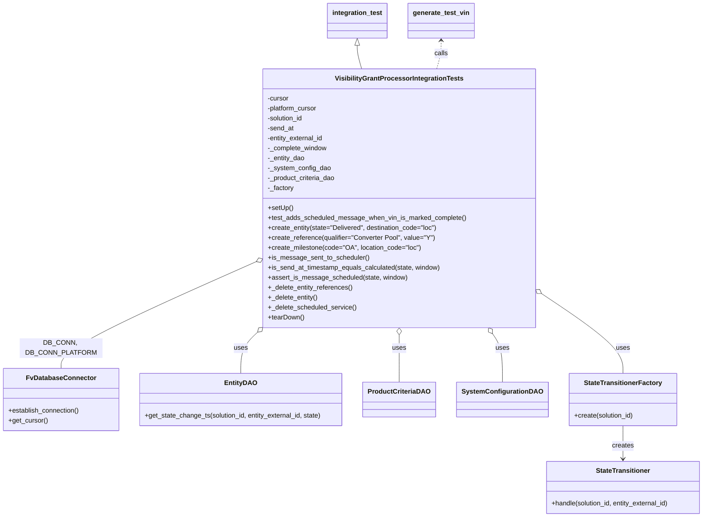
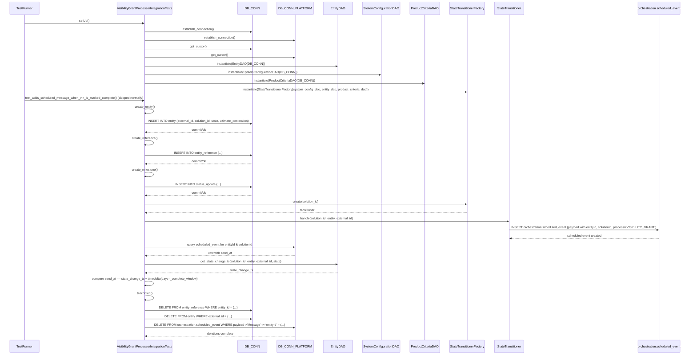

# Diagram: entity_core/entity_service/entity_service_tests/entity_state_machine_tests/test_visibility_grant_processor_integration.py

> Auto-generated by Obscura crawlers

## Diagram 1

### SVG

<svg id="container" width="1676.1171875" xmlns="http://www.w3.org/2000/svg" class="classDiagram" height="1246" viewBox="0 0 1676.1171875 1246" role="graphics-document document" aria-roledescription="class"><g><defs><marker id="container_class-aggregationStart" class="marker aggregation class" refX="18" refY="7" markerWidth="190" markerHeight="240" orient="auto"><path d="M 18,7 L9,13 L1,7 L9,1 Z"></path></marker></defs><defs><marker id="container_class-aggregationEnd" class="marker aggregation class" refX="1" refY="7" markerWidth="20" markerHeight="28" orient="auto"><path d="M 18,7 L9,13 L1,7 L9,1 Z"></path></marker></defs><defs><marker id="container_class-extensionStart" class="marker extension class" refX="18" refY="7" markerWidth="190" markerHeight="240" orient="auto"><path d="M 1,7 L18,13 V 1 Z"></path></marker></defs><defs><marker id="container_class-extensionEnd" class="marker extension class" refX="1" refY="7" markerWidth="20" markerHeight="28" orient="auto"><path d="M 1,1 V 13 L18,7 Z"></path></marker></defs><defs><marker id="container_class-compositionStart" class="marker composition class" refX="18" refY="7" markerWidth="190" markerHeight="240" orient="auto"><path d="M 18,7 L9,13 L1,7 L9,1 Z"></path></marker></defs><defs><marker id="container_class-compositionEnd" class="marker composition class" refX="1" refY="7" markerWidth="20" markerHeight="28" orient="auto"><path d="M 18,7 L9,13 L1,7 L9,1 Z"></path></marker></defs><defs><marker id="container_class-dependencyStart" class="marker dependency class" refX="6" refY="7" markerWidth="190" markerHeight="240" orient="auto"><path d="M 5,7 L9,13 L1,7 L9,1 Z"></path></marker></defs><defs><marker id="container_class-dependencyEnd" class="marker dependency class" refX="13" refY="7" markerWidth="20" markerHeight="28" orient="auto"><path d="M 18,7 L9,13 L14,7 L9,1 Z"></path></marker></defs><defs><marker id="container_class-lollipopStart" class="marker lollipop class" refX="13" refY="7" markerWidth="190" markerHeight="240" orient="auto"><circle stroke="black" fill="transparent" cx="7" cy="7" r="6"></circle></marker></defs><defs><marker id="container_class-lollipopEnd" class="marker lollipop class" refX="1" refY="7" markerWidth="190" markerHeight="240" orient="auto"><circle stroke="black" fill="transparent" cx="7" cy="7" r="6"></circle></marker></defs><g class="root"><g class="clusters"></g><g class="edgePaths"><path d="M619.299,629.09L540.464,664.075C461.628,699.06,303.957,769.03,225.121,812.182C146.285,855.333,146.285,871.667,146.285,879.833L146.285,888" id="id_VisibilityGrantProcessorIntegrationTests_FvDatabaseConnector_1" class="edge-thickness-normal edge-pattern-solid relation" style=";;;" data-edge="true" data-et="edge" data-id="id_VisibilityGrantProcessorIntegrationTests_FvDatabaseConnector_1" data-points="W3sieCI6NjM1LjA2NjQwNjI1LCJ5Ijo2MjIuMDkyNDc5NzQ3OTk2NH0seyJ4IjoxNDYuMjg1MTU2MjUsInkiOjgzOX0seyJ4IjoxNDYuMjg1MTU2MjUsInkiOjg4OH1d" marker-start="url(#container_class-aggregationStart)"></path><path d="M622.574,799.071L615.585,805.726C608.596,812.381,594.618,825.69,587.629,842.512C580.641,859.333,580.641,879.667,580.641,889.833L580.641,900" id="id_VisibilityGrantProcessorIntegrationTests_EntityDAO_2" class="edge-thickness-normal edge-pattern-solid relation" style=";;;" data-edge="true" data-et="edge" data-id="id_VisibilityGrantProcessorIntegrationTests_EntityDAO_2" data-points="W3sieCI6NjM1LjA2NjQwNjI1LCJ5Ijo3ODcuMTc2MTc2NjQwMjkwMX0seyJ4Ijo1ODAuNjQwNjI1LCJ5Ijo4Mzl9LHsieCI6NTgwLjY0MDYyNSwieSI6OTAwfV0=" marker-start="url(#container_class-aggregationStart)"></path><path d="M959.766,807.25L959.766,812.542C959.766,817.833,959.766,828.417,959.766,847.375C959.766,866.333,959.766,893.667,959.766,907.333L959.766,921" id="id_VisibilityGrantProcessorIntegrationTests_ProductCriteriaDAO_3" class="edge-thickness-normal edge-pattern-solid relation" style=";;;" data-edge="true" data-et="edge" data-id="id_VisibilityGrantProcessorIntegrationTests_ProductCriteriaDAO_3" data-points="W3sieCI6OTU5Ljc2NTYyNSwieSI6NzkwfSx7IngiOjk1OS43NjU2MjUsInkiOjgzOX0seyJ4Ijo5NTkuNzY1NjI1LCJ5Ijo5MjF9XQ==" marker-start="url(#container_class-aggregationStart)"></path><path d="M1173.415,804.433L1177.186,810.195C1180.957,815.956,1188.498,827.478,1192.268,846.906C1196.039,866.333,1196.039,893.667,1196.039,907.333L1196.039,921" id="id_VisibilityGrantProcessorIntegrationTests_SystemConfigurationDAO_4" class="edge-thickness-normal edge-pattern-solid relation" style=";;;" data-edge="true" data-et="edge" data-id="id_VisibilityGrantProcessorIntegrationTests_SystemConfigurationDAO_4" data-points="W3sieCI6MTE2My45Njg3MDY3MTc0NTE2LCJ5Ijo3OTB9LHsieCI6MTE5Ni4wMzkwNjI1LCJ5Ijo4Mzl9LHsieCI6MTE5Ni4wMzkwNjI1LCJ5Ijo5MjF9XQ==" marker-start="url(#container_class-aggregationStart)"></path><path d="M1298.629,713.536L1328.713,734.447C1358.797,755.357,1418.965,797.179,1449.049,828.256C1479.133,859.333,1479.133,879.667,1479.133,889.833L1479.133,900" id="id_VisibilityGrantProcessorIntegrationTests_StateTransitionerFactory_5" class="edge-thickness-normal edge-pattern-solid relation" style=";;;" data-edge="true" data-et="edge" data-id="id_VisibilityGrantProcessorIntegrationTests_StateTransitionerFactory_5" data-points="W3sieCI6MTI4NC40NjQ4NDM3NSwieSI6NzAzLjY5MDg0MjIyMDg1MTd9LHsieCI6MTQ3OS4xMzI4MTI1LCJ5Ijo4Mzl9LHsieCI6MTQ3OS4xMzI4MTI1LCJ5Ijo5MDB9XQ==" marker-start="url(#container_class-aggregationStart)"></path><path d="M1479.133,1026L1479.133,1034.167C1479.133,1042.333,1479.133,1058.667,1479.133,1072C1479.133,1085.333,1479.133,1095.667,1479.133,1100.833L1479.133,1106" id="id_StateTransitionerFactory_StateTransitioner_6" class="edge-thickness-normal edge-pattern-solid relation" style=";;;" data-edge="true" data-et="edge" data-id="id_StateTransitionerFactory_StateTransitioner_6" data-points="W3sieCI6MTQ3OS4xMzI4MTI1LCJ5IjoxMDI2fSx7IngiOjE0NzkuMTMyODEyNSwieSI6MTA3NX0seyJ4IjoxNDc5LjEzMjgxMjUsInkiOjExMTJ9XQ==" marker-end="url(#container_class-dependencyEnd)"></path><path d="M860.613,109.25L860.613,112.542C860.613,115.833,860.613,122.417,862.365,131.875C864.117,141.333,867.621,153.667,869.373,159.833L871.125,166" id="id_integration_test_VisibilityGrantProcessorIntegrationTests_7" class="edge-thickness-normal edge-pattern-solid relation" style=";;;" data-edge="true" data-et="edge" data-id="id_integration_test_VisibilityGrantProcessorIntegrationTests_7" data-points="W3sieCI6ODYwLjYxMzI4MTI1LCJ5Ijo5Mn0seyJ4Ijo4NjAuNjEzMjgxMjUsInkiOjEyOX0seyJ4Ijo4NzEuMTI1MTM0MzEyMzIwOSwieSI6MTY2fV0=" marker-start="url(#container_class-extensionStart)"></path><path d="M1058.918,98L1058.918,103.167C1058.918,108.333,1058.918,118.667,1057.166,130C1055.414,141.333,1051.91,153.667,1050.158,159.833L1048.406,166" id="id_generate_test_vin_VisibilityGrantProcessorIntegrationTests_8" class="edge-thickness-normal edge-pattern-dashed relation" style=";;;" data-edge="true" data-et="edge" data-id="id_generate_test_vin_VisibilityGrantProcessorIntegrationTests_8" data-points="W3sieCI6MTA1OC45MTc5Njg3NSwieSI6OTJ9LHsieCI6MTA1OC45MTc5Njg3NSwieSI6MTI5fSx7IngiOjEwNDguNDA2MTE1Njg3Njc5MiwieSI6MTY2fV0=" marker-start="url(#container_class-dependencyStart)"></path></g><g class="edgeLabels"><g class="edgeLabel" transform="translate(146.28515625, 839)"><g class="label" data-id="id_VisibilityGrantProcessorIntegrationTests_FvDatabaseConnector_1" transform="translate(-100, -24)"><foreignObject width="200" height="48">

DB_CONN, DB_CONN_PLATFORM

</foreignObject></g></g><g class="edgeLabel" transform="translate(580.640625, 839)"><g class="label" data-id="id_VisibilityGrantProcessorIntegrationTests_EntityDAO_2" transform="translate(-16.4921875, -12)"><foreignObject width="32.984375" height="24">

uses

</foreignObject></g></g><g class="edgeLabel" transform="translate(959.765625, 839)"><g class="label" data-id="id_VisibilityGrantProcessorIntegrationTests_ProductCriteriaDAO_3" transform="translate(-16.4921875, -12)"><foreignObject width="32.984375" height="24">

uses

</foreignObject></g></g><g class="edgeLabel" transform="translate(1196.0390625, 839)"><g class="label" data-id="id_VisibilityGrantProcessorIntegrationTests_SystemConfigurationDAO_4" transform="translate(-16.4921875, -12)"><foreignObject width="32.984375" height="24">

uses

</foreignObject></g></g><g class="edgeLabel" transform="translate(1479.1328125, 839)"><g class="label" data-id="id_VisibilityGrantProcessorIntegrationTests_StateTransitionerFactory_5" transform="translate(-16.4921875, -12)"><foreignObject width="32.984375" height="24">

uses

</foreignObject></g></g><g class="edgeLabel" transform="translate(1479.1328125, 1075)"><g class="label" data-id="id_StateTransitionerFactory_StateTransitioner_6" transform="translate(-26.171875, -12)"><foreignObject width="52.34375" height="24">

creates

</foreignObject></g></g><g class="edgeLabel"><g class="label" data-id="id_integration_test_VisibilityGrantProcessorIntegrationTests_7" transform="translate(0, 0)"><foreignObject width="0" height="0">

</foreignObject></g></g><g class="edgeLabel" transform="translate(1058.91796875, 129)"><g class="label" data-id="id_generate_test_vin_VisibilityGrantProcessorIntegrationTests_8" transform="translate(-16.4453125, -12)"><foreignObject width="32.890625" height="24">

calls

</foreignObject></g></g></g><g class="nodes"><g class="node default" id="classId-VisibilityGrantProcessorIntegrationTests-0" transform="translate(959.765625, 478)"><g class="basic label-container"><path d="M-324.69921875 -312 L324.69921875 -312 L324.69921875 312 L-324.69921875 312" stroke="none" stroke-width="0" fill="#ECECFF" style=""></path><path d="M-324.69921875 -312 C-120.07527373162651 -312, 84.54867128674698 -312, 324.69921875 -312 M-324.69921875 -312 C-92.6744885266641 -312, 139.3502416966718 -312, 324.69921875 -312 M324.69921875 -312 C324.69921875 -177.49299524506606, 324.69921875 -42.98599049013211, 324.69921875 312 M324.69921875 -312 C324.69921875 -164.31760542660578, 324.69921875 -16.63521085321156, 324.69921875 312 M324.69921875 312 C125.0257608417187 312, -74.64769706656261 312, -324.69921875 312 M324.69921875 312 C125.10064485016986 312, -74.49792904966029 312, -324.69921875 312 M-324.69921875 312 C-324.69921875 172.06009451487057, -324.69921875 32.12018902974114, -324.69921875 -312 M-324.69921875 312 C-324.69921875 79.12022627773851, -324.69921875 -153.75954744452298, -324.69921875 -312" stroke="#9370DB" stroke-width="1.3" fill="none" stroke-dasharray="0 0" style=""></path></g><g class="annotation-group text" transform="translate(0, -288)"></g><g class="label-group text" transform="translate(-147.6796875, -288)"><g class="label" style="font-weight: bolder" transform="translate(0,-12)"><foreignObject width="295.359375" height="24">

VisibilityGrantProcessorIntegrationTests

</foreignObject></g></g><g class="members-group text" transform="translate(-312.69921875, -240)"><g class="label" style="" transform="translate(0,-12)"><foreignObject width="52.1875" height="24">

-cursor

</foreignObject></g><g class="label" style="" transform="translate(0,12)"><foreignObject width="123.203125" height="24">

-platform_cursor

</foreignObject></g><g class="label" style="" transform="translate(0,36)"><foreignObject width="88.6875" height="24">

-solution_id

</foreignObject></g><g class="label" style="" transform="translate(0,60)"><foreignObject width="64.078125" height="24">

-send_at

</foreignObject></g><g class="label" style="" transform="translate(0,84)"><foreignObject width="137.703125" height="24">

-entity_external_id

</foreignObject></g><g class="label" style="" transform="translate(0,108)"><foreignObject width="144.078125" height="24">

-_complete_window

</foreignObject></g><g class="label" style="" transform="translate(0,132)"><foreignObject width="90.265625" height="24">

-_entity_dao

</foreignObject></g><g class="label" style="" transform="translate(0,156)"><foreignObject width="151.140625" height="24">

-_system_config_dao

</foreignObject></g><g class="label" style="" transform="translate(0,180)"><foreignObject width="165.9375" height="24">

-_product_criteria_dao

</foreignObject></g><g class="label" style="" transform="translate(0,204)"><foreignObject width="63.46875" height="24">

-_factory

</foreignObject></g></g><g class="methods-group text" transform="translate(-312.69921875, 24)"><g class="label" style="" transform="translate(0,-12)"><foreignObject width="60.421875" height="24">

+setUp()

</foreignObject></g><g class="label" style="" transform="translate(0,12)"><foreignObject width="477.71875" height="24">

+test_adds_scheduled_message_when_vin_is_marked_complete()

</foreignObject></g><g class="label" style="" transform="translate(0,36)"><foreignObject width="413.40625" height="24">

+create_entity(state="Delivered", destination_code="loc")

</foreignObject></g><g class="label" style="" transform="translate(0,60)"><foreignObject width="402.71875" height="24">

+create_reference(qualifier="Converter Pool", value="Y")

</foreignObject></g><g class="label" style="" transform="translate(0,84)"><foreignObject width="369.515625" height="24">

+create_milestone(code="OA", location_code="loc")

</foreignObject></g><g class="label" style="" transform="translate(0,108)"><foreignObject width="242.546875" height="24">

+is_message_sent_to_scheduler()

</foreignObject></g><g class="label" style="" transform="translate(0,132)"><foreignObject width="419.734375" height="24">

+is_send_at_timestamp_equals_calculated(state, window)

</foreignObject></g><g class="label" style="" transform="translate(0,156)"><foreignObject width="335.5625" height="24">

+assert_is_message_scheduled(state, window)

</foreignObject></g><g class="label" style="" transform="translate(0,180)"><foreignObject width="204.078125" height="24">

+_delete_entity_references()

</foreignObject></g><g class="label" style="" transform="translate(0,204)"><foreignObject width="120.578125" height="24">

+_delete_entity()

</foreignObject></g><g class="label" style="" transform="translate(0,228)"><foreignObject width="213.0625" height="24">

+_delete_scheduled_service()

</foreignObject></g><g class="label" style="" transform="translate(0,252)"><foreignObject width="87.75" height="24">

+tearDown()

</foreignObject></g></g><g class="divider" style=""><path d="M-324.69921875 -264 C-102.47269799061266 -264, 119.75382276877468 -264, 324.69921875 -264 M-324.69921875 -264 C-124.72325981665477 -264, 75.25269911669045 -264, 324.69921875 -264" stroke="#9370DB" stroke-width="1.3" fill="none" stroke-dasharray="0 0" style=""></path></g><g class="divider" style=""><path d="M-324.69921875 0 C-185.45014330967564 0, -46.20106786935128 0, 324.69921875 0 M-324.69921875 0 C-104.98073081091178 0, 114.73775712817644 0, 324.69921875 0" stroke="#9370DB" stroke-width="1.3" fill="none" stroke-dasharray="0 0" style=""></path></g></g><g class="node default" id="classId-FvDatabaseConnector-1" transform="translate(146.28515625, 963)"><g class="basic label-container"><path d="M-138.28515625 -75 L138.28515625 -75 L138.28515625 75 L-138.28515625 75" stroke="none" stroke-width="0" fill="#ECECFF" style=""></path><path d="M-138.28515625 -75 C-58.88333092996368 -75, 20.518494390072647 -75, 138.28515625 -75 M-138.28515625 -75 C-72.01424818625071 -75, -5.743340122501422 -75, 138.28515625 -75 M138.28515625 -75 C138.28515625 -42.16571662781677, 138.28515625 -9.331433255633542, 138.28515625 75 M138.28515625 -75 C138.28515625 -43.73735858759446, 138.28515625 -12.474717175188921, 138.28515625 75 M138.28515625 75 C47.34940463115406 75, -43.58634698769188 75, -138.28515625 75 M138.28515625 75 C56.747404468967076 75, -24.790347312065848 75, -138.28515625 75 M-138.28515625 75 C-138.28515625 23.074277834407027, -138.28515625 -28.851444331185945, -138.28515625 -75 M-138.28515625 75 C-138.28515625 25.14327432072092, -138.28515625 -24.71345135855816, -138.28515625 -75" stroke="#9370DB" stroke-width="1.3" fill="none" stroke-dasharray="0 0" style=""></path></g><g class="annotation-group text" transform="translate(0, -51)"></g><g class="label-group text" transform="translate(-79.3046875, -51)"><g class="label" style="font-weight: bolder" transform="translate(0,-12)"><foreignObject width="158.609375" height="24">

FvDatabaseConnector

</foreignObject></g></g><g class="members-group text" transform="translate(-126.28515625, -3)"></g><g class="methods-group text" transform="translate(-126.28515625, 27)"><g class="label" style="" transform="translate(0,-12)"><foreignObject width="173.265625" height="24">

+establish_connection()

</foreignObject></g><g class="label" style="" transform="translate(0,12)"><foreignObject width="94.640625" height="24">

+get_cursor()

</foreignObject></g></g><g class="divider" style=""><path d="M-138.28515625 -27 C-41.362752436163674 -27, 55.55965137767265 -27, 138.28515625 -27 M-138.28515625 -27 C-71.05744363480947 -27, -3.829731019618947 -27, 138.28515625 -27" stroke="#9370DB" stroke-width="1.3" fill="none" stroke-dasharray="0 0" style=""></path></g><g class="divider" style=""><path d="M-138.28515625 -3 C-53.00501260602765 -3, 32.2751310379447 -3, 138.28515625 -3 M-138.28515625 -3 C-46.09733337816404 -3, 46.090489493671924 -3, 138.28515625 -3" stroke="#9370DB" stroke-width="1.3" fill="none" stroke-dasharray="0 0" style=""></path></g></g><g class="node default" id="classId-EntityDAO-2" transform="translate(580.640625, 963)"><g class="basic label-container"><path d="M-246.0703125 -63 L246.0703125 -63 L246.0703125 63 L-246.0703125 63" stroke="none" stroke-width="0" fill="#ECECFF" style=""></path><path d="M-246.0703125 -63 C-64.74685066946546 -63, 116.57661116106908 -63, 246.0703125 -63 M-246.0703125 -63 C-138.2087693881134 -63, -30.34722627622682 -63, 246.0703125 -63 M246.0703125 -63 C246.0703125 -25.564094978038845, 246.0703125 11.87181004392231, 246.0703125 63 M246.0703125 -63 C246.0703125 -31.181338653697914, 246.0703125 0.6373226926041724, 246.0703125 63 M246.0703125 63 C116.87375517211544 63, -12.322802155769125 63, -246.0703125 63 M246.0703125 63 C119.2279888154365 63, -7.614334869126992 63, -246.0703125 63 M-246.0703125 63 C-246.0703125 30.75135930582703, -246.0703125 -1.4972813883459395, -246.0703125 -63 M-246.0703125 63 C-246.0703125 30.614117514532133, -246.0703125 -1.7717649709357346, -246.0703125 -63" stroke="#9370DB" stroke-width="1.3" fill="none" stroke-dasharray="0 0" style=""></path></g><g class="annotation-group text" transform="translate(0, -39)"></g><g class="label-group text" transform="translate(-36.578125, -39)"><g class="label" style="font-weight: bolder" transform="translate(0,-12)"><foreignObject width="73.15625" height="24">

EntityDAO

</foreignObject></g></g><g class="members-group text" transform="translate(-234.0703125, 9)"></g><g class="methods-group text" transform="translate(-234.0703125, 39)"><g class="label" style="" transform="translate(0,-12)"><foreignObject width="431.5625" height="24">

+get_state_change_ts(solution_id, entity_external_id, state)

</foreignObject></g></g><g class="divider" style=""><path d="M-246.0703125 -15 C-56.89350207956207 -15, 132.28330834087586 -15, 246.0703125 -15 M-246.0703125 -15 C-88.37341441715697 -15, 69.32348366568607 -15, 246.0703125 -15" stroke="#9370DB" stroke-width="1.3" fill="none" stroke-dasharray="0 0" style=""></path></g><g class="divider" style=""><path d="M-246.0703125 9 C-114.85918135990696 9, 16.35194978018609 9, 246.0703125 9 M-246.0703125 9 C-108.30919605930725 9, 29.45192038138549 9, 246.0703125 9" stroke="#9370DB" stroke-width="1.3" fill="none" stroke-dasharray="0 0" style=""></path></g></g><g class="node default" id="classId-ProductCriteriaDAO-3" transform="translate(959.765625, 963)"><g class="basic label-container"><path d="M-83.0546875 -42 L83.0546875 -42 L83.0546875 42 L-83.0546875 42" stroke="none" stroke-width="0" fill="#ECECFF" style=""></path><path d="M-83.0546875 -42 C-18.382628113469607 -42, 46.289431273060785 -42, 83.0546875 -42 M-83.0546875 -42 C-35.01508074461431 -42, 13.024526010771382 -42, 83.0546875 -42 M83.0546875 -42 C83.0546875 -13.674032798269952, 83.0546875 14.651934403460096, 83.0546875 42 M83.0546875 -42 C83.0546875 -13.44247392905747, 83.0546875 15.115052141885059, 83.0546875 42 M83.0546875 42 C46.374716941334086 42, 9.694746382668171 42, -83.0546875 42 M83.0546875 42 C35.73632660743697 42, -11.582034285126056 42, -83.0546875 42 M-83.0546875 42 C-83.0546875 24.115047606012226, -83.0546875 6.230095212024452, -83.0546875 -42 M-83.0546875 42 C-83.0546875 8.516704903049991, -83.0546875 -24.966590193900018, -83.0546875 -42" stroke="#9370DB" stroke-width="1.3" fill="none" stroke-dasharray="0 0" style=""></path></g><g class="annotation-group text" transform="translate(0, -18)"></g><g class="label-group text" transform="translate(-71.0546875, -18)"><g class="label" style="font-weight: bolder" transform="translate(0,-12)"><foreignObject width="142.109375" height="24">

ProductCriteriaDAO

</foreignObject></g></g><g class="members-group text" transform="translate(-71.0546875, 30)"></g><g class="methods-group text" transform="translate(-71.0546875, 60)"></g><g class="divider" style=""><path d="M-83.0546875 6 C-31.253482105660744 6, 20.54772328867851 6, 83.0546875 6 M-83.0546875 6 C-28.567338173153402 6, 25.920011153693196 6, 83.0546875 6" stroke="#9370DB" stroke-width="1.3" fill="none" stroke-dasharray="0 0" style=""></path></g><g class="divider" style=""><path d="M-83.0546875 24 C-19.939180173293515 24, 43.17632715341297 24, 83.0546875 24 M-83.0546875 24 C-31.12137482978347 24, 20.81193784043306 24, 83.0546875 24" stroke="#9370DB" stroke-width="1.3" fill="none" stroke-dasharray="0 0" style=""></path></g></g><g class="node default" id="classId-SystemConfigurationDAO-4" transform="translate(1196.0390625, 963)"><g class="basic label-container"><path d="M-103.21875 -42 L103.21875 -42 L103.21875 42 L-103.21875 42" stroke="none" stroke-width="0" fill="#ECECFF" style=""></path><path d="M-103.21875 -42 C-21.27482482605454 -42, 60.66910034789092 -42, 103.21875 -42 M-103.21875 -42 C-56.006556095994966 -42, -8.794362191989933 -42, 103.21875 -42 M103.21875 -42 C103.21875 -17.194380741910102, 103.21875 7.611238516179796, 103.21875 42 M103.21875 -42 C103.21875 -20.851086702492772, 103.21875 0.2978265950144561, 103.21875 42 M103.21875 42 C28.536470439940658 42, -46.145809120118685 42, -103.21875 42 M103.21875 42 C20.693163884381562 42, -61.832422231236876 42, -103.21875 42 M-103.21875 42 C-103.21875 14.900883185095992, -103.21875 -12.198233629808016, -103.21875 -42 M-103.21875 42 C-103.21875 21.865397736286763, -103.21875 1.7307954725735257, -103.21875 -42" stroke="#9370DB" stroke-width="1.3" fill="none" stroke-dasharray="0 0" style=""></path></g><g class="annotation-group text" transform="translate(0, -18)"></g><g class="label-group text" transform="translate(-91.21875, -18)"><g class="label" style="font-weight: bolder" transform="translate(0,-12)"><foreignObject width="182.4375" height="24">

SystemConfigurationDAO

</foreignObject></g></g><g class="members-group text" transform="translate(-91.21875, 30)"></g><g class="methods-group text" transform="translate(-91.21875, 60)"></g><g class="divider" style=""><path d="M-103.21875 6 C-20.71088347535587 6, 61.79698304928826 6, 103.21875 6 M-103.21875 6 C-35.09955301562037 6, 33.019643968759254 6, 103.21875 6" stroke="#9370DB" stroke-width="1.3" fill="none" stroke-dasharray="0 0" style=""></path></g><g class="divider" style=""><path d="M-103.21875 24 C-29.018479317639915 24, 45.18179136472017 24, 103.21875 24 M-103.21875 24 C-25.91871280059155 24, 51.3813243988169 24, 103.21875 24" stroke="#9370DB" stroke-width="1.3" fill="none" stroke-dasharray="0 0" style=""></path></g></g><g class="node default" id="classId-StateTransitionerFactory-5" transform="translate(1479.1328125, 963)"><g class="basic label-container"><path d="M-129.875 -63 L129.875 -63 L129.875 63 L-129.875 63" stroke="none" stroke-width="0" fill="#ECECFF" style=""></path><path d="M-129.875 -63 C-33.472913601181304 -63, 62.92917279763739 -63, 129.875 -63 M-129.875 -63 C-33.31734595099559 -63, 63.240308098008825 -63, 129.875 -63 M129.875 -63 C129.875 -27.336808807495693, 129.875 8.326382385008614, 129.875 63 M129.875 -63 C129.875 -28.191000469131012, 129.875 6.617999061737976, 129.875 63 M129.875 63 C43.522852151244365 63, -42.82929569751127 63, -129.875 63 M129.875 63 C46.64235285218659 63, -36.59029429562682 63, -129.875 63 M-129.875 63 C-129.875 26.322316330341465, -129.875 -10.35536733931707, -129.875 -63 M-129.875 63 C-129.875 25.744284145597156, -129.875 -11.511431708805688, -129.875 -63" stroke="#9370DB" stroke-width="1.3" fill="none" stroke-dasharray="0 0" style=""></path></g><g class="annotation-group text" transform="translate(0, -39)"></g><g class="label-group text" transform="translate(-90.296875, -39)"><g class="label" style="font-weight: bolder" transform="translate(0,-12)"><foreignObject width="180.59375" height="24">

StateTransitionerFactory

</foreignObject></g></g><g class="members-group text" transform="translate(-117.875, 9)"></g><g class="methods-group text" transform="translate(-117.875, 39)"><g class="label" style="" transform="translate(0,-12)"><foreignObject width="145.453125" height="24">

+create(solution_id)

</foreignObject></g></g><g class="divider" style=""><path d="M-129.875 -15 C-44.64327949941031 -15, 40.588441001179376 -15, 129.875 -15 M-129.875 -15 C-44.16835742505482 -15, 41.538285149890356 -15, 129.875 -15" stroke="#9370DB" stroke-width="1.3" fill="none" stroke-dasharray="0 0" style=""></path></g><g class="divider" style=""><path d="M-129.875 9 C-68.14200603208917 9, -6.4090120641783415 9, 129.875 9 M-129.875 9 C-73.19315703165992 9, -16.511314063319844 9, 129.875 9" stroke="#9370DB" stroke-width="1.3" fill="none" stroke-dasharray="0 0" style=""></path></g></g><g class="node default" id="classId-StateTransitioner-6" transform="translate(1479.1328125, 1175)"><g class="basic label-container"><path d="M-188.984375 -63 L188.984375 -63 L188.984375 63 L-188.984375 63" stroke="none" stroke-width="0" fill="#ECECFF" style=""></path><path d="M-188.984375 -63 C-108.88221619976895 -63, -28.780057399537895 -63, 188.984375 -63 M-188.984375 -63 C-78.12553640866031 -63, 32.73330218267938 -63, 188.984375 -63 M188.984375 -63 C188.984375 -20.86300724317725, 188.984375 21.2739855136455, 188.984375 63 M188.984375 -63 C188.984375 -31.867334885530045, 188.984375 -0.7346697710600907, 188.984375 63 M188.984375 63 C68.69868579200283 63, -51.58700341599433 63, -188.984375 63 M188.984375 63 C70.10660861067659 63, -48.771157778646824 63, -188.984375 63 M-188.984375 63 C-188.984375 34.755605928157166, -188.984375 6.51121185631434, -188.984375 -63 M-188.984375 63 C-188.984375 22.81078661973919, -188.984375 -17.37842676052162, -188.984375 -63" stroke="#9370DB" stroke-width="1.3" fill="none" stroke-dasharray="0 0" style=""></path></g><g class="annotation-group text" transform="translate(0, -39)"></g><g class="label-group text" transform="translate(-63.703125, -39)"><g class="label" style="font-weight: bolder" transform="translate(0,-12)"><foreignObject width="127.40625" height="24">

StateTransitioner

</foreignObject></g></g><g class="members-group text" transform="translate(-176.984375, 9)"></g><g class="methods-group text" transform="translate(-176.984375, 39)"><g class="label" style="" transform="translate(0,-12)"><foreignObject width="290.265625" height="24">

+handle(solution_id, entity_external_id)

</foreignObject></g></g><g class="divider" style=""><path d="M-188.984375 -15 C-42.40623771470305 -15, 104.1718995705939 -15, 188.984375 -15 M-188.984375 -15 C-112.88186215372133 -15, -36.77934930744266 -15, 188.984375 -15" stroke="#9370DB" stroke-width="1.3" fill="none" stroke-dasharray="0 0" style=""></path></g><g class="divider" style=""><path d="M-188.984375 9 C-99.58444836029767 9, -10.184521720595342 9, 188.984375 9 M-188.984375 9 C-95.06701934063481 9, -1.1496636812696295 9, 188.984375 9" stroke="#9370DB" stroke-width="1.3" fill="none" stroke-dasharray="0 0" style=""></path></g></g><g class="node default" id="classId-generate_test_vin-7" transform="translate(1058.91796875, 50)"><g class="basic label-container"><path d="M-77.40625 -42 L77.40625 -42 L77.40625 42 L-77.40625 42" stroke="none" stroke-width="0" fill="#ECECFF" style=""></path><path d="M-77.40625 -42 C-15.898375925337788 -42, 45.60949814932442 -42, 77.40625 -42 M-77.40625 -42 C-38.339152052408615 -42, 0.7279458951827706 -42, 77.40625 -42 M77.40625 -42 C77.40625 -20.103164497993376, 77.40625 1.7936710040132482, 77.40625 42 M77.40625 -42 C77.40625 -15.706602264367167, 77.40625 10.586795471265667, 77.40625 42 M77.40625 42 C38.814682682878065 42, 0.22311536575612934 42, -77.40625 42 M77.40625 42 C46.06372928586214 42, 14.721208571724283 42, -77.40625 42 M-77.40625 42 C-77.40625 15.105244181214687, -77.40625 -11.789511637570627, -77.40625 -42 M-77.40625 42 C-77.40625 23.862670525852952, -77.40625 5.725341051705904, -77.40625 -42" stroke="#9370DB" stroke-width="1.3" fill="none" stroke-dasharray="0 0" style=""></path></g><g class="annotation-group text" transform="translate(0, -18)"></g><g class="label-group text" transform="translate(-65.40625, -18)"><g class="label" style="font-weight: bolder" transform="translate(0,-12)"><foreignObject width="130.8125" height="24">

generate_test_vin

</foreignObject></g></g><g class="members-group text" transform="translate(-65.40625, 30)"></g><g class="methods-group text" transform="translate(-65.40625, 60)"></g><g class="divider" style=""><path d="M-77.40625 6 C-42.01445800723063 6, -6.6226660144612595 6, 77.40625 6 M-77.40625 6 C-36.784291553730604 6, 3.837666892538792 6, 77.40625 6" stroke="#9370DB" stroke-width="1.3" fill="none" stroke-dasharray="0 0" style=""></path></g><g class="divider" style=""><path d="M-77.40625 24 C-44.45388251888631 24, -11.50151503777262 24, 77.40625 24 M-77.40625 24 C-30.899702659128216 24, 15.606844681743567 24, 77.40625 24" stroke="#9370DB" stroke-width="1.3" fill="none" stroke-dasharray="0 0" style=""></path></g></g><g class="node default" id="classId-integration_test-8" transform="translate(860.61328125, 50)"><g class="basic label-container"><path d="M-70.8984375 -42 L70.8984375 -42 L70.8984375 42 L-70.8984375 42" stroke="none" stroke-width="0" fill="#ECECFF" style=""></path><path d="M-70.8984375 -42 C-23.07388163536688 -42, 24.750674229266238 -42, 70.8984375 -42 M-70.8984375 -42 C-15.253275495250385 -42, 40.39188650949923 -42, 70.8984375 -42 M70.8984375 -42 C70.8984375 -16.0827957278456, 70.8984375 9.8344085443088, 70.8984375 42 M70.8984375 -42 C70.8984375 -10.725471777275295, 70.8984375 20.54905644544941, 70.8984375 42 M70.8984375 42 C23.133064958895098 42, -24.632307582209805 42, -70.8984375 42 M70.8984375 42 C40.20016423669293 42, 9.501890973385855 42, -70.8984375 42 M-70.8984375 42 C-70.8984375 22.221728674974788, -70.8984375 2.4434573499495755, -70.8984375 -42 M-70.8984375 42 C-70.8984375 14.895045007780599, -70.8984375 -12.209909984438802, -70.8984375 -42" stroke="#9370DB" stroke-width="1.3" fill="none" stroke-dasharray="0 0" style=""></path></g><g class="annotation-group text" transform="translate(0, -18)"></g><g class="label-group text" transform="translate(-58.8984375, -18)"><g class="label" style="font-weight: bolder" transform="translate(0,-12)"><foreignObject width="117.796875" height="24">

integration_test

</foreignObject></g></g><g class="members-group text" transform="translate(-58.8984375, 30)"></g><g class="methods-group text" transform="translate(-58.8984375, 60)"></g><g class="divider" style=""><path d="M-70.8984375 6 C-28.242016958801273 6, 14.414403582397455 6, 70.8984375 6 M-70.8984375 6 C-32.47221644593576 6, 5.954004608128486 6, 70.8984375 6" stroke="#9370DB" stroke-width="1.3" fill="none" stroke-dasharray="0 0" style=""></path></g><g class="divider" style=""><path d="M-70.8984375 24 C-34.257796631226036 24, 2.3828442375479284 24, 70.8984375 24 M-70.8984375 24 C-35.755891369309246 24, -0.6133452386184928 24, 70.8984375 24" stroke="#9370DB" stroke-width="1.3" fill="none" stroke-dasharray="0 0" style=""></path></g></g></g></g></g></svg>

## Diagram 2

### SVG

<svg id="container" width="3705.5" xmlns="http://www.w3.org/2000/svg" height="1953" viewBox="-50 -10 3705.5 1953" role="graphics-document document" aria-roledescription="sequence"><g><rect x="3360.5" y="1867" fill="#eaeaea" stroke="#666" width="245" height="65" name="Orchestration" rx="3" ry="3" class="actor actor-bottom"></rect><text x="3483" y="1899.5" dominant-baseline="central" alignment-baseline="central" class="actor actor-box" style="text-anchor: middle; font-size: 16px; font-weight: 400;"><tspan x="3483" dy="0">orchestration.scheduled_event</tspan></text></g><g><rect x="2604" y="1867" fill="#eaeaea" stroke="#666" width="150" height="65" name="Transitioner" rx="3" ry="3" class="actor actor-bottom"></rect><text x="2679" y="1899.5" dominant-baseline="central" alignment-baseline="central" class="actor actor-box" style="text-anchor: middle; font-size: 16px; font-weight: 400;"><tspan x="2679" dy="0">StateTransitioner</tspan></text></g><g><rect x="2357" y="1867" fill="#eaeaea" stroke="#666" width="197" height="65" name="Factory" rx="3" ry="3" class="actor actor-bottom"></rect><text x="2455.5" y="1899.5" dominant-baseline="central" alignment-baseline="central" class="actor actor-box" style="text-anchor: middle; font-size: 16px; font-weight: 400;"><tspan x="2455.5" dy="0">StateTransitionerFactory</tspan></text></g><g><rect x="2147" y="1867" fill="#eaeaea" stroke="#666" width="160" height="65" name="ProductCriteriaDAO" rx="3" ry="3" class="actor actor-bottom"></rect><text x="2227" y="1899.5" dominant-baseline="central" alignment-baseline="central" class="actor actor-box" style="text-anchor: middle; font-size: 16px; font-weight: 400;"><tspan x="2227" dy="0">ProductCriteriaDAO</tspan></text></g><g><rect x="1898" y="1867" fill="#eaeaea" stroke="#666" width="199" height="65" name="SystemCriteriaDAO" rx="3" ry="3" class="actor actor-bottom"></rect><text x="1997.5" y="1899.5" dominant-baseline="central" alignment-baseline="central" class="actor actor-box" style="text-anchor: middle; font-size: 16px; font-weight: 400;"><tspan x="1997.5" dy="0">SystemConfigurationDAO</tspan></text></g><g><rect x="1698" y="1867" fill="#eaeaea" stroke="#666" width="150" height="65" name="EntityDAO" rx="3" ry="3" class="actor actor-bottom"></rect><text x="1773" y="1899.5" dominant-baseline="central" alignment-baseline="central" class="actor actor-box" style="text-anchor: middle; font-size: 16px; font-weight: 400;"><tspan x="1773" dy="0">EntityDAO</tspan></text></g><g><rect x="1476" y="1867" fill="#eaeaea" stroke="#666" width="172" height="65" name="PlatformDB" rx="3" ry="3" class="actor actor-bottom"></rect><text x="1562" y="1899.5" dominant-baseline="central" alignment-baseline="central" class="actor actor-box" style="text-anchor: middle; font-size: 16px; font-weight: 400;"><tspan x="1562" dy="0">DB_CONN_PLATFORM</tspan></text></g><g><rect x="1276" y="1867" fill="#eaeaea" stroke="#666" width="150" height="65" name="DB" rx="3" ry="3" class="actor actor-bottom"></rect><text x="1351" y="1899.5" dominant-baseline="central" alignment-baseline="central" class="actor actor-box" style="text-anchor: middle; font-size: 16px; font-weight: 400;"><tspan x="1351" dy="0">DB_CONN</tspan></text></g><g><rect x="600.5" y="1867" fill="#eaeaea" stroke="#666" width="309" height="65" name="TestClass" rx="3" ry="3" class="actor actor-bottom"></rect><text x="755" y="1899.5" dominant-baseline="central" alignment-baseline="central" class="actor actor-box" style="text-anchor: middle; font-size: 16px; font-weight: 400;"><tspan x="755" dy="0">VisibilityGrantProcessorIntegrationTests</tspan></text></g><g><rect x="0" y="1867" fill="#eaeaea" stroke="#666" width="150" height="65" name="TestRunner" rx="3" ry="3" class="actor actor-bottom"></rect><text x="75" y="1899.5" dominant-baseline="central" alignment-baseline="central" class="actor actor-box" style="text-anchor: middle; font-size: 16px; font-weight: 400;"><tspan x="75" dy="0">TestRunner</tspan></text></g><g><line id="actor9" x1="3483" y1="65" x2="3483" y2="1867" class="actor-line 200" stroke-width="0.5px" stroke="#999" name="Orchestration"></line><g id="root-9"><rect x="3360.5" y="0" fill="#eaeaea" stroke="#666" width="245" height="65" name="Orchestration" rx="3" ry="3" class="actor actor-top"></rect><text x="3483" y="32.5" dominant-baseline="central" alignment-baseline="central" class="actor actor-box" style="text-anchor: middle; font-size: 16px; font-weight: 400;"><tspan x="3483" dy="0">orchestration.scheduled_event</tspan></text></g></g><g><line id="actor8" x1="2679" y1="65" x2="2679" y2="1867" class="actor-line 200" stroke-width="0.5px" stroke="#999" name="Transitioner"></line><g id="root-8"><rect x="2604" y="0" fill="#eaeaea" stroke="#666" width="150" height="65" name="Transitioner" rx="3" ry="3" class="actor actor-top"></rect><text x="2679" y="32.5" dominant-baseline="central" alignment-baseline="central" class="actor actor-box" style="text-anchor: middle; font-size: 16px; font-weight: 400;"><tspan x="2679" dy="0">StateTransitioner</tspan></text></g></g><g><line id="actor7" x1="2455.5" y1="65" x2="2455.5" y2="1867" class="actor-line 200" stroke-width="0.5px" stroke="#999" name="Factory"></line><g id="root-7"><rect x="2357" y="0" fill="#eaeaea" stroke="#666" width="197" height="65" name="Factory" rx="3" ry="3" class="actor actor-top"></rect><text x="2455.5" y="32.5" dominant-baseline="central" alignment-baseline="central" class="actor actor-box" style="text-anchor: middle; font-size: 16px; font-weight: 400;"><tspan x="2455.5" dy="0">StateTransitionerFactory</tspan></text></g></g><g><line id="actor6" x1="2227" y1="65" x2="2227" y2="1867" class="actor-line 200" stroke-width="0.5px" stroke="#999" name="ProductCriteriaDAO"></line><g id="root-6"><rect x="2147" y="0" fill="#eaeaea" stroke="#666" width="160" height="65" name="ProductCriteriaDAO" rx="3" ry="3" class="actor actor-top"></rect><text x="2227" y="32.5" dominant-baseline="central" alignment-baseline="central" class="actor actor-box" style="text-anchor: middle; font-size: 16px; font-weight: 400;"><tspan x="2227" dy="0">ProductCriteriaDAO</tspan></text></g></g><g><line id="actor5" x1="1997.5" y1="65" x2="1997.5" y2="1867" class="actor-line 200" stroke-width="0.5px" stroke="#999" name="SystemCriteriaDAO"></line><g id="root-5"><rect x="1898" y="0" fill="#eaeaea" stroke="#666" width="199" height="65" name="SystemCriteriaDAO" rx="3" ry="3" class="actor actor-top"></rect><text x="1997.5" y="32.5" dominant-baseline="central" alignment-baseline="central" class="actor actor-box" style="text-anchor: middle; font-size: 16px; font-weight: 400;"><tspan x="1997.5" dy="0">SystemConfigurationDAO</tspan></text></g></g><g><line id="actor4" x1="1773" y1="65" x2="1773" y2="1867" class="actor-line 200" stroke-width="0.5px" stroke="#999" name="EntityDAO"></line><g id="root-4"><rect x="1698" y="0" fill="#eaeaea" stroke="#666" width="150" height="65" name="EntityDAO" rx="3" ry="3" class="actor actor-top"></rect><text x="1773" y="32.5" dominant-baseline="central" alignment-baseline="central" class="actor actor-box" style="text-anchor: middle; font-size: 16px; font-weight: 400;"><tspan x="1773" dy="0">EntityDAO</tspan></text></g></g><g><line id="actor3" x1="1562" y1="65" x2="1562" y2="1867" class="actor-line 200" stroke-width="0.5px" stroke="#999" name="PlatformDB"></line><g id="root-3"><rect x="1476" y="0" fill="#eaeaea" stroke="#666" width="172" height="65" name="PlatformDB" rx="3" ry="3" class="actor actor-top"></rect><text x="1562" y="32.5" dominant-baseline="central" alignment-baseline="central" class="actor actor-box" style="text-anchor: middle; font-size: 16px; font-weight: 400;"><tspan x="1562" dy="0">DB_CONN_PLATFORM</tspan></text></g></g><g><line id="actor2" x1="1351" y1="65" x2="1351" y2="1867" class="actor-line 200" stroke-width="0.5px" stroke="#999" name="DB"></line><g id="root-2"><rect x="1276" y="0" fill="#eaeaea" stroke="#666" width="150" height="65" name="DB" rx="3" ry="3" class="actor actor-top"></rect><text x="1351" y="32.5" dominant-baseline="central" alignment-baseline="central" class="actor actor-box" style="text-anchor: middle; font-size: 16px; font-weight: 400;"><tspan x="1351" dy="0">DB_CONN</tspan></text></g></g><g><line id="actor1" x1="755" y1="65" x2="755" y2="1867" class="actor-line 200" stroke-width="0.5px" stroke="#999" name="TestClass"></line><g id="root-1"><rect x="600.5" y="0" fill="#eaeaea" stroke="#666" width="309" height="65" name="TestClass" rx="3" ry="3" class="actor actor-top"></rect><text x="755" y="32.5" dominant-baseline="central" alignment-baseline="central" class="actor actor-box" style="text-anchor: middle; font-size: 16px; font-weight: 400;"><tspan x="755" dy="0">VisibilityGrantProcessorIntegrationTests</tspan></text></g></g><g><line id="actor0" x1="75" y1="65" x2="75" y2="1867" class="actor-line 200" stroke-width="0.5px" stroke="#999" name="TestRunner"></line><g id="root-0"><rect x="0" y="0" fill="#eaeaea" stroke="#666" width="150" height="65" name="TestRunner" rx="3" ry="3" class="actor actor-top"></rect><text x="75" y="32.5" dominant-baseline="central" alignment-baseline="central" class="actor actor-box" style="text-anchor: middle; font-size: 16px; font-weight: 400;"><tspan x="75" dy="0">TestRunner</tspan></text></g></g><g></g><defs><symbol id="computer" width="24" height="24"><path transform="scale(.5)" d="M2 2v13h20v-13h-20zm18 11h-16v-9h16v9zm-10.228 6l.466-1h3.524l.467 1h-4.457zm14.228 3h-24l2-6h2.104l-1.33 4h18.45l-1.297-4h2.073l2 6zm-5-10h-14v-7h14v7z"></path></symbol></defs><defs><symbol id="database" fill-rule="evenodd" clip-rule="evenodd"><path transform="scale(.5)" d="M12.258.001l.256.004.255.005.253.008.251.01.249.012.247.015.246.016.242.019.241.02.239.023.236.024.233.027.231.028.229.031.225.032.223.034.22.036.217.038.214.04.211.041.208.043.205.045.201.046.198.048.194.05.191.051.187.053.183.054.18.056.175.057.172.059.168.06.163.061.16.063.155.064.15.066.074.033.073.033.071.034.07.034.069.035.068.035.067.035.066.035.064.036.064.036.062.036.06.036.06.037.058.037.058.037.055.038.055.038.053.038.052.038.051.039.05.039.048.039.047.039.045.04.044.04.043.04.041.04.04.041.039.041.037.041.036.041.034.041.033.042.032.042.03.042.029.042.027.042.026.043.024.043.023.043.021.043.02.043.018.044.017.043.015.044.013.044.012.044.011.045.009.044.007.045.006.045.004.045.002.045.001.045v17l-.001.045-.002.045-.004.045-.006.045-.007.045-.009.044-.011.045-.012.044-.013.044-.015.044-.017.043-.018.044-.02.043-.021.043-.023.043-.024.043-.026.043-.027.042-.029.042-.03.042-.032.042-.033.042-.034.041-.036.041-.037.041-.039.041-.04.041-.041.04-.043.04-.044.04-.045.04-.047.039-.048.039-.05.039-.051.039-.052.038-.053.038-.055.038-.055.038-.058.037-.058.037-.06.037-.06.036-.062.036-.064.036-.064.036-.066.035-.067.035-.068.035-.069.035-.07.034-.071.034-.073.033-.074.033-.15.066-.155.064-.16.063-.163.061-.168.06-.172.059-.175.057-.18.056-.183.054-.187.053-.191.051-.194.05-.198.048-.201.046-.205.045-.208.043-.211.041-.214.04-.217.038-.22.036-.223.034-.225.032-.229.031-.231.028-.233.027-.236.024-.239.023-.241.02-.242.019-.246.016-.247.015-.249.012-.251.01-.253.008-.255.005-.256.004-.258.001-.258-.001-.256-.004-.255-.005-.253-.008-.251-.01-.249-.012-.247-.015-.245-.016-.243-.019-.241-.02-.238-.023-.236-.024-.234-.027-.231-.028-.228-.031-.226-.032-.223-.034-.22-.036-.217-.038-.214-.04-.211-.041-.208-.043-.204-.045-.201-.046-.198-.048-.195-.05-.19-.051-.187-.053-.184-.054-.179-.056-.176-.057-.172-.059-.167-.06-.164-.061-.159-.063-.155-.064-.151-.066-.074-.033-.072-.033-.072-.034-.07-.034-.069-.035-.068-.035-.067-.035-.066-.035-.064-.036-.063-.036-.062-.036-.061-.036-.06-.037-.058-.037-.057-.037-.056-.038-.055-.038-.053-.038-.052-.038-.051-.039-.049-.039-.049-.039-.046-.039-.046-.04-.044-.04-.043-.04-.041-.04-.04-.041-.039-.041-.037-.041-.036-.041-.034-.041-.033-.042-.032-.042-.03-.042-.029-.042-.027-.042-.026-.043-.024-.043-.023-.043-.021-.043-.02-.043-.018-.044-.017-.043-.015-.044-.013-.044-.012-.044-.011-.045-.009-.044-.007-.045-.006-.045-.004-.045-.002-.045-.001-.045v-17l.001-.045.002-.045.004-.045.006-.045.007-.045.009-.044.011-.045.012-.044.013-.044.015-.044.017-.043.018-.044.02-.043.021-.043.023-.043.024-.043.026-.043.027-.042.029-.042.03-.042.032-.042.033-.042.034-.041.036-.041.037-.041.039-.041.04-.041.041-.04.043-.04.044-.04.046-.04.046-.039.049-.039.049-.039.051-.039.052-.038.053-.038.055-.038.056-.038.057-.037.058-.037.06-.037.061-.036.062-.036.063-.036.064-.036.066-.035.067-.035.068-.035.069-.035.07-.034.072-.034.072-.033.074-.033.151-.066.155-.064.159-.063.164-.061.167-.06.172-.059.176-.057.179-.056.184-.054.187-.053.19-.051.195-.05.198-.048.201-.046.204-.045.208-.043.211-.041.214-.04.217-.038.22-.036.223-.034.226-.032.228-.031.231-.028.234-.027.236-.024.238-.023.241-.02.243-.019.245-.016.247-.015.249-.012.251-.01.253-.008.255-.005.256-.004.258-.001.258.001zm-9.258 20.499v.01l.001.021.003.021.004.022.005.021.006.022.007.022.009.023.01.022.011.023.012.023.013.023.015.023.016.024.017.023.018.024.019.024.021.024.022.025.023.024.024.025.052.049.056.05.061.051.066.051.07.051.075.051.079.052.084.052.088.052.092.052.097.052.102.051.105.052.11.052.114.051.119.051.123.051.127.05.131.05.135.05.139.048.144.049.147.047.152.047.155.047.16.045.163.045.167.043.171.043.176.041.178.041.183.039.187.039.19.037.194.035.197.035.202.033.204.031.209.03.212.029.216.027.219.025.222.024.226.021.23.02.233.018.236.016.24.015.243.012.246.01.249.008.253.005.256.004.259.001.26-.001.257-.004.254-.005.25-.008.247-.011.244-.012.241-.014.237-.016.233-.018.231-.021.226-.021.224-.024.22-.026.216-.027.212-.028.21-.031.205-.031.202-.034.198-.034.194-.036.191-.037.187-.039.183-.04.179-.04.175-.042.172-.043.168-.044.163-.045.16-.046.155-.046.152-.047.148-.048.143-.049.139-.049.136-.05.131-.05.126-.05.123-.051.118-.052.114-.051.11-.052.106-.052.101-.052.096-.052.092-.052.088-.053.083-.051.079-.052.074-.052.07-.051.065-.051.06-.051.056-.05.051-.05.023-.024.023-.025.021-.024.02-.024.019-.024.018-.024.017-.024.015-.023.014-.024.013-.023.012-.023.01-.023.01-.022.008-.022.006-.022.006-.022.004-.022.004-.021.001-.021.001-.021v-4.127l-.077.055-.08.053-.083.054-.085.053-.087.052-.09.052-.093.051-.095.05-.097.05-.1.049-.102.049-.105.048-.106.047-.109.047-.111.046-.114.045-.115.045-.118.044-.12.043-.122.042-.124.042-.126.041-.128.04-.13.04-.132.038-.134.038-.135.037-.138.037-.139.035-.142.035-.143.034-.144.033-.147.032-.148.031-.15.03-.151.03-.153.029-.154.027-.156.027-.158.026-.159.025-.161.024-.162.023-.163.022-.165.021-.166.02-.167.019-.169.018-.169.017-.171.016-.173.015-.173.014-.175.013-.175.012-.177.011-.178.01-.179.008-.179.008-.181.006-.182.005-.182.004-.184.003-.184.002h-.37l-.184-.002-.184-.003-.182-.004-.182-.005-.181-.006-.179-.008-.179-.008-.178-.01-.176-.011-.176-.012-.175-.013-.173-.014-.172-.015-.171-.016-.17-.017-.169-.018-.167-.019-.166-.02-.165-.021-.163-.022-.162-.023-.161-.024-.159-.025-.157-.026-.156-.027-.155-.027-.153-.029-.151-.03-.15-.03-.148-.031-.146-.032-.145-.033-.143-.034-.141-.035-.14-.035-.137-.037-.136-.037-.134-.038-.132-.038-.13-.04-.128-.04-.126-.041-.124-.042-.122-.042-.12-.044-.117-.043-.116-.045-.113-.045-.112-.046-.109-.047-.106-.047-.105-.048-.102-.049-.1-.049-.097-.05-.095-.05-.093-.052-.09-.051-.087-.052-.085-.053-.083-.054-.08-.054-.077-.054v4.127zm0-5.654v.011l.001.021.003.021.004.021.005.022.006.022.007.022.009.022.01.022.011.023.012.023.013.023.015.024.016.023.017.024.018.024.019.024.021.024.022.024.023.025.024.024.052.05.056.05.061.05.066.051.07.051.075.052.079.051.084.052.088.052.092.052.097.052.102.052.105.052.11.051.114.051.119.052.123.05.127.051.131.05.135.049.139.049.144.048.147.048.152.047.155.046.16.045.163.045.167.044.171.042.176.042.178.04.183.04.187.038.19.037.194.036.197.034.202.033.204.032.209.03.212.028.216.027.219.025.222.024.226.022.23.02.233.018.236.016.24.014.243.012.246.01.249.008.253.006.256.003.259.001.26-.001.257-.003.254-.006.25-.008.247-.01.244-.012.241-.015.237-.016.233-.018.231-.02.226-.022.224-.024.22-.025.216-.027.212-.029.21-.03.205-.032.202-.033.198-.035.194-.036.191-.037.187-.039.183-.039.179-.041.175-.042.172-.043.168-.044.163-.045.16-.045.155-.047.152-.047.148-.048.143-.048.139-.05.136-.049.131-.05.126-.051.123-.051.118-.051.114-.052.11-.052.106-.052.101-.052.096-.052.092-.052.088-.052.083-.052.079-.052.074-.051.07-.052.065-.051.06-.05.056-.051.051-.049.023-.025.023-.024.021-.025.02-.024.019-.024.018-.024.017-.024.015-.023.014-.023.013-.024.012-.022.01-.023.01-.023.008-.022.006-.022.006-.022.004-.021.004-.022.001-.021.001-.021v-4.139l-.077.054-.08.054-.083.054-.085.052-.087.053-.09.051-.093.051-.095.051-.097.05-.1.049-.102.049-.105.048-.106.047-.109.047-.111.046-.114.045-.115.044-.118.044-.12.044-.122.042-.124.042-.126.041-.128.04-.13.039-.132.039-.134.038-.135.037-.138.036-.139.036-.142.035-.143.033-.144.033-.147.033-.148.031-.15.03-.151.03-.153.028-.154.028-.156.027-.158.026-.159.025-.161.024-.162.023-.163.022-.165.021-.166.02-.167.019-.169.018-.169.017-.171.016-.173.015-.173.014-.175.013-.175.012-.177.011-.178.009-.179.009-.179.007-.181.007-.182.005-.182.004-.184.003-.184.002h-.37l-.184-.002-.184-.003-.182-.004-.182-.005-.181-.007-.179-.007-.179-.009-.178-.009-.176-.011-.176-.012-.175-.013-.173-.014-.172-.015-.171-.016-.17-.017-.169-.018-.167-.019-.166-.02-.165-.021-.163-.022-.162-.023-.161-.024-.159-.025-.157-.026-.156-.027-.155-.028-.153-.028-.151-.03-.15-.03-.148-.031-.146-.033-.145-.033-.143-.033-.141-.035-.14-.036-.137-.036-.136-.037-.134-.038-.132-.039-.13-.039-.128-.04-.126-.041-.124-.042-.122-.043-.12-.043-.117-.044-.116-.044-.113-.046-.112-.046-.109-.046-.106-.047-.105-.048-.102-.049-.1-.049-.097-.05-.095-.051-.093-.051-.09-.051-.087-.053-.085-.052-.083-.054-.08-.054-.077-.054v4.139zm0-5.666v.011l.001.02.003.022.004.021.005.022.006.021.007.022.009.023.01.022.011.023.012.023.013.023.015.023.016.024.017.024.018.023.019.024.021.025.022.024.023.024.024.025.052.05.056.05.061.05.066.051.07.051.075.052.079.051.084.052.088.052.092.052.097.052.102.052.105.051.11.052.114.051.119.051.123.051.127.05.131.05.135.05.139.049.144.048.147.048.152.047.155.046.16.045.163.045.167.043.171.043.176.042.178.04.183.04.187.038.19.037.194.036.197.034.202.033.204.032.209.03.212.028.216.027.219.025.222.024.226.021.23.02.233.018.236.017.24.014.243.012.246.01.249.008.253.006.256.003.259.001.26-.001.257-.003.254-.006.25-.008.247-.01.244-.013.241-.014.237-.016.233-.018.231-.02.226-.022.224-.024.22-.025.216-.027.212-.029.21-.03.205-.032.202-.033.198-.035.194-.036.191-.037.187-.039.183-.039.179-.041.175-.042.172-.043.168-.044.163-.045.16-.045.155-.047.152-.047.148-.048.143-.049.139-.049.136-.049.131-.051.126-.05.123-.051.118-.052.114-.051.11-.052.106-.052.101-.052.096-.052.092-.052.088-.052.083-.052.079-.052.074-.052.07-.051.065-.051.06-.051.056-.05.051-.049.023-.025.023-.025.021-.024.02-.024.019-.024.018-.024.017-.024.015-.023.014-.024.013-.023.012-.023.01-.022.01-.023.008-.022.006-.022.006-.022.004-.022.004-.021.001-.021.001-.021v-4.153l-.077.054-.08.054-.083.053-.085.053-.087.053-.09.051-.093.051-.095.051-.097.05-.1.049-.102.048-.105.048-.106.048-.109.046-.111.046-.114.046-.115.044-.118.044-.12.043-.122.043-.124.042-.126.041-.128.04-.13.039-.132.039-.134.038-.135.037-.138.036-.139.036-.142.034-.143.034-.144.033-.147.032-.148.032-.15.03-.151.03-.153.028-.154.028-.156.027-.158.026-.159.024-.161.024-.162.023-.163.023-.165.021-.166.02-.167.019-.169.018-.169.017-.171.016-.173.015-.173.014-.175.013-.175.012-.177.01-.178.01-.179.009-.179.007-.181.006-.182.006-.182.004-.184.003-.184.001-.185.001-.185-.001-.184-.001-.184-.003-.182-.004-.182-.006-.181-.006-.179-.007-.179-.009-.178-.01-.176-.01-.176-.012-.175-.013-.173-.014-.172-.015-.171-.016-.17-.017-.169-.018-.167-.019-.166-.02-.165-.021-.163-.023-.162-.023-.161-.024-.159-.024-.157-.026-.156-.027-.155-.028-.153-.028-.151-.03-.15-.03-.148-.032-.146-.032-.145-.033-.143-.034-.141-.034-.14-.036-.137-.036-.136-.037-.134-.038-.132-.039-.13-.039-.128-.041-.126-.041-.124-.041-.122-.043-.12-.043-.117-.044-.116-.044-.113-.046-.112-.046-.109-.046-.106-.048-.105-.048-.102-.048-.1-.05-.097-.049-.095-.051-.093-.051-.09-.052-.087-.052-.085-.053-.083-.053-.08-.054-.077-.054v4.153zm8.74-8.179l-.257.004-.254.005-.25.008-.247.011-.244.012-.241.014-.237.016-.233.018-.231.021-.226.022-.224.023-.22.026-.216.027-.212.028-.21.031-.205.032-.202.033-.198.034-.194.036-.191.038-.187.038-.183.04-.179.041-.175.042-.172.043-.168.043-.163.045-.16.046-.155.046-.152.048-.148.048-.143.048-.139.049-.136.05-.131.05-.126.051-.123.051-.118.051-.114.052-.11.052-.106.052-.101.052-.096.052-.092.052-.088.052-.083.052-.079.052-.074.051-.07.052-.065.051-.06.05-.056.05-.051.05-.023.025-.023.024-.021.024-.02.025-.019.024-.018.024-.017.023-.015.024-.014.023-.013.023-.012.023-.01.023-.01.022-.008.022-.006.023-.006.021-.004.022-.004.021-.001.021-.001.021.001.021.001.021.004.021.004.022.006.021.006.023.008.022.01.022.01.023.012.023.013.023.014.023.015.024.017.023.018.024.019.024.02.025.021.024.023.024.023.025.051.05.056.05.06.05.065.051.07.052.074.051.079.052.083.052.088.052.092.052.096.052.101.052.106.052.11.052.114.052.118.051.123.051.126.051.131.05.136.05.139.049.143.048.148.048.152.048.155.046.16.046.163.045.168.043.172.043.175.042.179.041.183.04.187.038.191.038.194.036.198.034.202.033.205.032.21.031.212.028.216.027.22.026.224.023.226.022.231.021.233.018.237.016.241.014.244.012.247.011.25.008.254.005.257.004.26.001.26-.001.257-.004.254-.005.25-.008.247-.011.244-.012.241-.014.237-.016.233-.018.231-.021.226-.022.224-.023.22-.026.216-.027.212-.028.21-.031.205-.032.202-.033.198-.034.194-.036.191-.038.187-.038.183-.04.179-.041.175-.042.172-.043.168-.043.163-.045.16-.046.155-.046.152-.048.148-.048.143-.048.139-.049.136-.05.131-.05.126-.051.123-.051.118-.051.114-.052.11-.052.106-.052.101-.052.096-.052.092-.052.088-.052.083-.052.079-.052.074-.051.07-.052.065-.051.06-.05.056-.05.051-.05.023-.025.023-.024.021-.024.02-.025.019-.024.018-.024.017-.023.015-.024.014-.023.013-.023.012-.023.01-.023.01-.022.008-.022.006-.023.006-.021.004-.022.004-.021.001-.021.001-.021-.001-.021-.001-.021-.004-.021-.004-.022-.006-.021-.006-.023-.008-.022-.01-.022-.01-.023-.012-.023-.013-.023-.014-.023-.015-.024-.017-.023-.018-.024-.019-.024-.02-.025-.021-.024-.023-.024-.023-.025-.051-.05-.056-.05-.06-.05-.065-.051-.07-.052-.074-.051-.079-.052-.083-.052-.088-.052-.092-.052-.096-.052-.101-.052-.106-.052-.11-.052-.114-.052-.118-.051-.123-.051-.126-.051-.131-.05-.136-.05-.139-.049-.143-.048-.148-.048-.152-.048-.155-.046-.16-.046-.163-.045-.168-.043-.172-.043-.175-.042-.179-.041-.183-.04-.187-.038-.191-.038-.194-.036-.198-.034-.202-.033-.205-.032-.21-.031-.212-.028-.216-.027-.22-.026-.224-.023-.226-.022-.231-.021-.233-.018-.237-.016-.241-.014-.244-.012-.247-.011-.25-.008-.254-.005-.257-.004-.26-.001-.26.001z"></path></symbol></defs><defs><symbol id="clock" width="24" height="24"><path transform="scale(.5)" d="M12 2c5.514 0 10 4.486 10 10s-4.486 10-10 10-10-4.486-10-10 4.486-10 10-10zm0-2c-6.627 0-12 5.373-12 12s5.373 12 12 12 12-5.373 12-12-5.373-12-12-12zm5.848 12.459c.202.038.202.333.001.372-1.907.361-6.045 1.111-6.547 1.111-.719 0-1.301-.582-1.301-1.301 0-.512.77-5.447 1.125-7.445.034-.192.312-.181.343.014l.985 6.238 5.394 1.011z"></path></symbol></defs><defs><marker id="arrowhead" refX="7.9" refY="5" markerUnits="userSpaceOnUse" markerWidth="12" markerHeight="12" orient="auto-start-reverse"><path d="M -1 0 L 10 5 L 0 10 z"></path></marker></defs><defs><marker id="crosshead" markerWidth="15" markerHeight="8" orient="auto" refX="4" refY="4.5"><path fill="none" stroke="#000000" stroke-width="1pt" d="M 1,2 L 6,7 M 6,2 L 1,7" style="stroke-dasharray: 0, 0;"></path></marker></defs><defs><marker id="filled-head" refX="15.5" refY="7" markerWidth="20" markerHeight="28" orient="auto"><path d="M 18,7 L9,13 L14,7 L9,1 Z"></path></marker></defs><defs><marker id="sequencenumber" refX="15" refY="15" markerWidth="60" markerHeight="40" orient="auto"><circle cx="15" cy="15" r="6"></circle></marker></defs><text x="414" y="80" text-anchor="middle" dominant-baseline="middle" alignment-baseline="middle" class="messageText" dy="1em" style="font-size: 16px; font-weight: 400;">setUp()</text><line x1="76" y1="113" x2="751" y2="113" class="messageLine0" stroke-width="2" stroke="none" marker-end="url(#arrowhead)" style="fill: none;"></line><text x="1052" y="128" text-anchor="middle" dominant-baseline="middle" alignment-baseline="middle" class="messageText" dy="1em" style="font-size: 16px; font-weight: 400;">establish_connection()</text><line x1="756" y1="161" x2="1347" y2="161" class="messageLine0" stroke-width="2" stroke="none" marker-end="url(#arrowhead)" style="fill: none;"></line><text x="1157" y="176" text-anchor="middle" dominant-baseline="middle" alignment-baseline="middle" class="messageText" dy="1em" style="font-size: 16px; font-weight: 400;">establish_connection()</text><line x1="756" y1="209" x2="1558" y2="209" class="messageLine0" stroke-width="2" stroke="none" marker-end="url(#arrowhead)" style="fill: none;"></line><text x="1052" y="224" text-anchor="middle" dominant-baseline="middle" alignment-baseline="middle" class="messageText" dy="1em" style="font-size: 16px; font-weight: 400;">get_cursor()</text><line x1="756" y1="257" x2="1347" y2="257" class="messageLine0" stroke-width="2" stroke="none" marker-end="url(#arrowhead)" style="fill: none;"></line><text x="1157" y="272" text-anchor="middle" dominant-baseline="middle" alignment-baseline="middle" class="messageText" dy="1em" style="font-size: 16px; font-weight: 400;">get_cursor()</text><line x1="756" y1="305" x2="1558" y2="305" class="messageLine0" stroke-width="2" stroke="none" marker-end="url(#arrowhead)" style="fill: none;"></line><text x="1263" y="320" text-anchor="middle" dominant-baseline="middle" alignment-baseline="middle" class="messageText" dy="1em" style="font-size: 16px; font-weight: 400;">instantiate(EntityDAO(DB_CONN))</text><line x1="756" y1="353" x2="1769" y2="353" class="messageLine0" stroke-width="2" stroke="none" marker-end="url(#arrowhead)" style="fill: none;"></line><text x="1375" y="368" text-anchor="middle" dominant-baseline="middle" alignment-baseline="middle" class="messageText" dy="1em" style="font-size: 16px; font-weight: 400;">instantiate(SystemConfigurationDAO(DB_CONN))</text><line x1="756" y1="401" x2="1993.5" y2="401" class="messageLine0" stroke-width="2" stroke="none" marker-end="url(#arrowhead)" style="fill: none;"></line><text x="1490" y="416" text-anchor="middle" dominant-baseline="middle" alignment-baseline="middle" class="messageText" dy="1em" style="font-size: 16px; font-weight: 400;">instantiate(ProductCriteriaDAO(DB_CONN))</text><line x1="756" y1="449" x2="2223" y2="449" class="messageLine0" stroke-width="2" stroke="none" marker-end="url(#arrowhead)" style="fill: none;"></line><text x="1604" y="464" text-anchor="middle" dominant-baseline="middle" alignment-baseline="middle" class="messageText" dy="1em" style="font-size: 16px; font-weight: 400;">instantiate(StateTransitionerFactory(system_config_dao, entity_dao, product_criteria_dao))</text><line x1="756" y1="497" x2="2451.5" y2="497" class="messageLine0" stroke-width="2" stroke="none" marker-end="url(#arrowhead)" style="fill: none;"></line><text x="414" y="512" text-anchor="middle" dominant-baseline="middle" alignment-baseline="middle" class="messageText" dy="1em" style="font-size: 16px; font-weight: 400;">test_adds_scheduled_message_when_vin_is_marked_complete() (skipped normally)</text><line x1="76" y1="545" x2="751" y2="545" class="messageLine0" stroke-width="2" stroke="none" marker-end="url(#arrowhead)" style="fill: none;"></line><text x="756" y="560" text-anchor="middle" dominant-baseline="middle" alignment-baseline="middle" class="messageText" dy="1em" style="font-size: 16px; font-weight: 400;">create_entity()</text><path d="M 756,593 C 816,583 816,623 756,613" class="messageLine0" stroke-width="2" stroke="none" marker-end="url(#arrowhead)" style="fill: none;"></path><text x="1052" y="638" text-anchor="middle" dominant-baseline="middle" alignment-baseline="middle" class="messageText" dy="1em" style="font-size: 16px; font-weight: 400;">INSERT INTO entity (external_id, solution_id, state, ultimate_destination)</text><line x1="756" y1="671" x2="1347" y2="671" class="messageLine0" stroke-width="2" stroke="none" marker-end="url(#arrowhead)" style="fill: none;"></line><text x="1055" y="686" text-anchor="middle" dominant-baseline="middle" alignment-baseline="middle" class="messageText" dy="1em" style="font-size: 16px; font-weight: 400;">commit/ok</text><line x1="1350" y1="719" x2="759" y2="719" class="messageLine1" stroke-width="2" stroke="none" marker-end="url(#arrowhead)" style="stroke-dasharray: 3, 3; fill: none;"></line><text x="756" y="734" text-anchor="middle" dominant-baseline="middle" alignment-baseline="middle" class="messageText" dy="1em" style="font-size: 16px; font-weight: 400;">create_reference()</text><path d="M 756,767 C 816,757 816,797 756,787" class="messageLine0" stroke-width="2" stroke="none" marker-end="url(#arrowhead)" style="fill: none;"></path><text x="1052" y="812" text-anchor="middle" dominant-baseline="middle" alignment-baseline="middle" class="messageText" dy="1em" style="font-size: 16px; font-weight: 400;">INSERT INTO entity_reference (...)</text><line x1="756" y1="845" x2="1347" y2="845" class="messageLine0" stroke-width="2" stroke="none" marker-end="url(#arrowhead)" style="fill: none;"></line><text x="1055" y="860" text-anchor="middle" dominant-baseline="middle" alignment-baseline="middle" class="messageText" dy="1em" style="font-size: 16px; font-weight: 400;">commit/ok</text><line x1="1350" y1="893" x2="759" y2="893" class="messageLine1" stroke-width="2" stroke="none" marker-end="url(#arrowhead)" style="stroke-dasharray: 3, 3; fill: none;"></line><text x="756" y="908" text-anchor="middle" dominant-baseline="middle" alignment-baseline="middle" class="messageText" dy="1em" style="font-size: 16px; font-weight: 400;">create_milestone()</text><path d="M 756,941 C 816,931 816,971 756,961" class="messageLine0" stroke-width="2" stroke="none" marker-end="url(#arrowhead)" style="fill: none;"></path><text x="1052" y="986" text-anchor="middle" dominant-baseline="middle" alignment-baseline="middle" class="messageText" dy="1em" style="font-size: 16px; font-weight: 400;">INSERT INTO status_update (...)</text><line x1="756" y1="1019" x2="1347" y2="1019" class="messageLine0" stroke-width="2" stroke="none" marker-end="url(#arrowhead)" style="fill: none;"></line><text x="1055" y="1034" text-anchor="middle" dominant-baseline="middle" alignment-baseline="middle" class="messageText" dy="1em" style="font-size: 16px; font-weight: 400;">commit/ok</text><line x1="1350" y1="1067" x2="759" y2="1067" class="messageLine1" stroke-width="2" stroke="none" marker-end="url(#arrowhead)" style="stroke-dasharray: 3, 3; fill: none;"></line><text x="1604" y="1082" text-anchor="middle" dominant-baseline="middle" alignment-baseline="middle" class="messageText" dy="1em" style="font-size: 16px; font-weight: 400;">create(solution_id)</text><line x1="756" y1="1115" x2="2451.5" y2="1115" class="messageLine0" stroke-width="2" stroke="none" marker-end="url(#arrowhead)" style="fill: none;"></line><text x="1607" y="1130" text-anchor="middle" dominant-baseline="middle" alignment-baseline="middle" class="messageText" dy="1em" style="font-size: 16px; font-weight: 400;">Transitioner</text><line x1="2454.5" y1="1163" x2="759" y2="1163" class="messageLine1" stroke-width="2" stroke="none" marker-end="url(#arrowhead)" style="stroke-dasharray: 3, 3; fill: none;"></line><text x="1716" y="1178" text-anchor="middle" dominant-baseline="middle" alignment-baseline="middle" class="messageText" dy="1em" style="font-size: 16px; font-weight: 400;">handle(solution_id, entity_external_id)</text><line x1="756" y1="1211" x2="2675" y2="1211" class="messageLine0" stroke-width="2" stroke="none" marker-end="url(#arrowhead)" style="fill: none;"></line><text x="3080" y="1226" text-anchor="middle" dominant-baseline="middle" alignment-baseline="middle" class="messageText" dy="1em" style="font-size: 16px; font-weight: 400;">INSERT orchestration.scheduled_event (payload with entityId, solutionId, process='VISIBILITY_GRANT')</text><line x1="2680" y1="1259" x2="3479" y2="1259" class="messageLine0" stroke-width="2" stroke="none" marker-end="url(#arrowhead)" style="fill: none;"></line><text x="3083" y="1274" text-anchor="middle" dominant-baseline="middle" alignment-baseline="middle" class="messageText" dy="1em" style="font-size: 16px; font-weight: 400;">scheduled event created</text><line x1="3482" y1="1307" x2="2683" y2="1307" class="messageLine1" stroke-width="2" stroke="none" marker-end="url(#arrowhead)" style="stroke-dasharray: 3, 3; fill: none;"></line><text x="1157" y="1322" text-anchor="middle" dominant-baseline="middle" alignment-baseline="middle" class="messageText" dy="1em" style="font-size: 16px; font-weight: 400;">query scheduled_event for entityId &amp; solutionId</text><line x1="756" y1="1355" x2="1558" y2="1355" class="messageLine0" stroke-width="2" stroke="none" marker-end="url(#arrowhead)" style="fill: none;"></line><text x="1160" y="1370" text-anchor="middle" dominant-baseline="middle" alignment-baseline="middle" class="messageText" dy="1em" style="font-size: 16px; font-weight: 400;">row with send_at</text><line x1="1561" y1="1403" x2="759" y2="1403" class="messageLine1" stroke-width="2" stroke="none" marker-end="url(#arrowhead)" style="stroke-dasharray: 3, 3; fill: none;"></line><text x="1263" y="1418" text-anchor="middle" dominant-baseline="middle" alignment-baseline="middle" class="messageText" dy="1em" style="font-size: 16px; font-weight: 400;">get_state_change_ts(solution_id, entity_external_id, state)</text><line x1="756" y1="1451" x2="1769" y2="1451" class="messageLine0" stroke-width="2" stroke="none" marker-end="url(#arrowhead)" style="fill: none;"></line><text x="1266" y="1466" text-anchor="middle" dominant-baseline="middle" alignment-baseline="middle" class="messageText" dy="1em" style="font-size: 16px; font-weight: 400;">state_change_ts</text><line x1="1772" y1="1499" x2="759" y2="1499" class="messageLine1" stroke-width="2" stroke="none" marker-end="url(#arrowhead)" style="stroke-dasharray: 3, 3; fill: none;"></line><text x="756" y="1514" text-anchor="middle" dominant-baseline="middle" alignment-baseline="middle" class="messageText" dy="1em" style="font-size: 16px; font-weight: 400;">compare send_at == state_change_ts + timedelta(days=_complete_window)</text><path d="M 756,1547 C 816,1537 816,1577 756,1567" class="messageLine0" stroke-width="2" stroke="none" marker-end="url(#arrowhead)" style="fill: none;"></path><text x="756" y="1592" text-anchor="middle" dominant-baseline="middle" alignment-baseline="middle" class="messageText" dy="1em" style="font-size: 16px; font-weight: 400;">tearDown()</text><path d="M 756,1625 C 816,1615 816,1655 756,1645" class="messageLine0" stroke-width="2" stroke="none" marker-end="url(#arrowhead)" style="fill: none;"></path><text x="1052" y="1670" text-anchor="middle" dominant-baseline="middle" alignment-baseline="middle" class="messageText" dy="1em" style="font-size: 16px; font-weight: 400;">DELETE FROM entity_reference WHERE entity_id = (...)</text><line x1="756" y1="1703" x2="1347" y2="1703" class="messageLine0" stroke-width="2" stroke="none" marker-end="url(#arrowhead)" style="fill: none;"></line><text x="1052" y="1718" text-anchor="middle" dominant-baseline="middle" alignment-baseline="middle" class="messageText" dy="1em" style="font-size: 16px; font-weight: 400;">DELETE FROM entity WHERE external_id = (...)</text><line x1="756" y1="1751" x2="1347" y2="1751" class="messageLine0" stroke-width="2" stroke="none" marker-end="url(#arrowhead)" style="fill: none;"></line><text x="1157" y="1766" text-anchor="middle" dominant-baseline="middle" alignment-baseline="middle" class="messageText" dy="1em" style="font-size: 16px; font-weight: 400;">DELETE FROM orchestration.scheduled_event WHERE payload-&gt;'Message'-&gt;&gt;'entityId' = (...)</text><line x1="756" y1="1799" x2="1558" y2="1799" class="messageLine0" stroke-width="2" stroke="none" marker-end="url(#arrowhead)" style="fill: none;"></line><text x="1160" y="1814" text-anchor="middle" dominant-baseline="middle" alignment-baseline="middle" class="messageText" dy="1em" style="font-size: 16px; font-weight: 400;">deletions complete</text><line x1="1561" y1="1847" x2="759" y2="1847" class="messageLine1" stroke-width="2" stroke="none" marker-end="url(#arrowhead)" style="stroke-dasharray: 3, 3; fill: none;"></line></svg>
