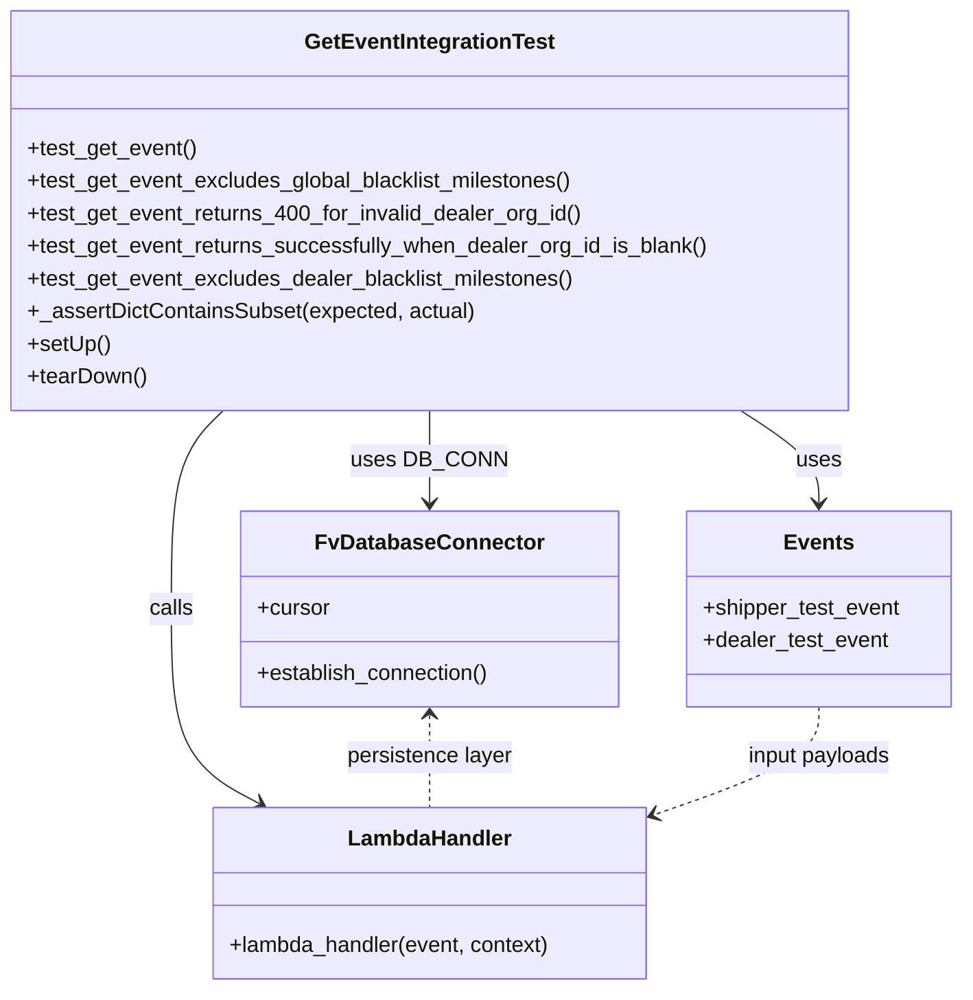

# Diagram: entity_core/entity_service/entity_service_tests/get_event_tests/get_event_integration_test.py


> Auto-generated by Obscura crawlers

## Diagram 1



### SVG

<svg id="container" width="705.98046875" xmlns="http://www.w3.org/2000/svg" class="classDiagram" height="728" viewBox="0 0 705.98046875 728" role="graphics-document document" aria-roledescription="class"><style>#container{font-family:"trebuchet ms",verdana,arial,sans-serif;font-size:16px;fill:#333;}@keyframes edge-animation-frame{from{stroke-dashoffset:0;}}@keyframes dash{to{stroke-dashoffset:0;}}#container .edge-animation-slow{stroke-dasharray:9,5!important;stroke-dashoffset:900;animation:dash 50s linear infinite;stroke-linecap:round;}#container .edge-animation-fast{stroke-dasharray:9,5!important;stroke-dashoffset:900;animation:dash 20s linear infinite;stroke-linecap:round;}#container .error-icon{fill:#552222;}#container .error-text{fill:#552222;stroke:#552222;}#container .edge-thickness-normal{stroke-width:1px;}#container .edge-thickness-thick{stroke-width:3.5px;}#container .edge-pattern-solid{stroke-dasharray:0;}#container .edge-thickness-invisible{stroke-width:0;fill:none;}#container .edge-pattern-dashed{stroke-dasharray:3;}#container .edge-pattern-dotted{stroke-dasharray:2;}#container .marker{fill:#333333;stroke:#333333;}#container .marker.cross{stroke:#333333;}#container svg{font-family:"trebuchet ms",verdana,arial,sans-serif;font-size:16px;}#container p{margin:0;}#container g.classGroup text{fill:#9370DB;stroke:none;font-family:"trebuchet ms",verdana,arial,sans-serif;font-size:10px;}#container g.classGroup text .title{font-weight:bolder;}#container .nodeLabel,#container .edgeLabel{color:#131300;}#container .edgeLabel .label rect{fill:#ECECFF;}#container .label text{fill:#131300;}#container .labelBkg{background:#ECECFF;}#container .edgeLabel .label span{background:#ECECFF;}#container .classTitle{font-weight:bolder;}#container .node rect,#container .node circle,#container .node ellipse,#container .node polygon,#container .node path{fill:#ECECFF;stroke:#9370DB;stroke-width:1px;}#container .divider{stroke:#9370DB;stroke-width:1;}#container g.clickable{cursor:pointer;}#container g.classGroup rect{fill:#ECECFF;stroke:#9370DB;}#container g.classGroup line{stroke:#9370DB;stroke-width:1;}#container .classLabel .box{stroke:none;stroke-width:0;fill:#ECECFF;opacity:0.5;}#container .classLabel .label{fill:#9370DB;font-size:10px;}#container .relation{stroke:#333333;stroke-width:1;fill:none;}#container .dashed-line{stroke-dasharray:3;}#container .dotted-line{stroke-dasharray:1 2;}#container #compositionStart,#container .composition{fill:#333333!important;stroke:#333333!important;stroke-width:1;}#container #compositionEnd,#container .composition{fill:#333333!important;stroke:#333333!important;stroke-width:1;}#container #dependencyStart,#container .dependency{fill:#333333!important;stroke:#333333!important;stroke-width:1;}#container #dependencyStart,#container .dependency{fill:#333333!important;stroke:#333333!important;stroke-width:1;}#container #extensionStart,#container .extension{fill:transparent!important;stroke:#333333!important;stroke-width:1;}#container #extensionEnd,#container .extension{fill:transparent!important;stroke:#333333!important;stroke-width:1;}#container #aggregationStart,#container .aggregation{fill:transparent!important;stroke:#333333!important;stroke-width:1;}#container #aggregationEnd,#container .aggregation{fill:transparent!important;stroke:#333333!important;stroke-width:1;}#container #lollipopStart,#container .lollipop{fill:#ECECFF!important;stroke:#333333!important;stroke-width:1;}#container #lollipopEnd,#container .lollipop{fill:#ECECFF!important;stroke:#333333!important;stroke-width:1;}#container .edgeTerminals{font-size:11px;line-height:initial;}#container .classTitleText{text-anchor:middle;font-size:18px;fill:#333;}#container .label-icon{display:inline-block;height:1em;overflow:visible;vertical-align:-0.125em;}#container .node .label-icon path{fill:currentColor;stroke:revert;stroke-width:revert;}#container :root{--mermaid-font-family:"trebuchet ms",verdana,arial,sans-serif;}</style><g><defs><marker id="container_class-aggregationStart" class="marker aggregation class" refX="18" refY="7" markerWidth="190" markerHeight="240" orient="auto"><path d="M 18,7 L9,13 L1,7 L9,1 Z"></path></marker></defs><defs><marker id="container_class-aggregationEnd" class="marker aggregation class" refX="1" refY="7" markerWidth="20" markerHeight="28" orient="auto"><path d="M 18,7 L9,13 L1,7 L9,1 Z"></path></marker></defs><defs><marker id="container_class-extensionStart" class="marker extension class" refX="18" refY="7" markerWidth="190" markerHeight="240" orient="auto"><path d="M 1,7 L18,13 V 1 Z"></path></marker></defs><defs><marker id="container_class-extensionEnd" class="marker extension class" refX="1" refY="7" markerWidth="20" markerHeight="28" orient="auto"><path d="M 1,1 V 13 L18,7 Z"></path></marker></defs><defs><marker id="container_class-compositionStart" class="marker composition class" refX="18" refY="7" markerWidth="190" markerHeight="240" orient="auto"><path d="M 18,7 L9,13 L1,7 L9,1 Z"></path></marker></defs><defs><marker id="container_class-compositionEnd" class="marker composition class" refX="1" refY="7" markerWidth="20" markerHeight="28" orient="auto"><path d="M 18,7 L9,13 L1,7 L9,1 Z"></path></marker></defs><defs><marker id="container_class-dependencyStart" class="marker dependency class" refX="6" refY="7" markerWidth="190" markerHeight="240" orient="auto"><path d="M 5,7 L9,13 L1,7 L9,1 Z"></path></marker></defs><defs><marker id="container_class-dependencyEnd" class="marker dependency class" refX="13" refY="7" markerWidth="20" markerHeight="28" orient="auto"><path d="M 18,7 L9,13 L14,7 L9,1 Z"></path></marker></defs><defs><marker id="container_class-lollipopStart" class="marker lollipop class" refX="13" refY="7" markerWidth="190" markerHeight="240" orient="auto"><circle stroke="black" fill="transparent" cx="7" cy="7" r="6"></circle></marker></defs><defs><marker id="container_class-lollipopEnd" class="marker lollipop class" refX="1" refY="7" markerWidth="190" markerHeight="240" orient="auto"><circle stroke="black" fill="transparent" cx="7" cy="7" r="6"></circle></marker></defs><g class="root"><g class="clusters"></g><g class="edgePaths"><path d="M315.805,302L315.805,308.167C315.805,314.333,315.805,326.667,315.805,338C315.805,349.333,315.805,359.667,315.805,364.833L315.805,370" id="id_GetEventIntegrationTest_FvDatabaseConnector_1" class="edge-thickness-normal edge-pattern-solid relation" style=";;;" data-edge="true" data-et="edge" data-id="id_GetEventIntegrationTest_FvDatabaseConnector_1" data-points="W3sieCI6MzE1LjgwNDY4NzUsInkiOjMwMn0seyJ4IjozMTUuODA0Njg3NSwieSI6MzM5fSx7IngiOjMxNS44MDQ2ODc1LCJ5IjozNzZ9XQ==" marker-end="url(#container_class-dependencyEnd)"></path><path d="M164.227,302L157.868,308.167C151.509,314.333,138.792,326.667,132.433,351C126.074,375.333,126.074,411.667,126.074,448C126.074,484.333,126.074,520.667,136.89,544.534C147.705,568.401,169.336,579.802,180.151,585.502L190.967,591.202" id="id_GetEventIntegrationTest_LambdaHandler_2" class="edge-thickness-normal edge-pattern-solid relation" style=";;;" data-edge="true" data-et="edge" data-id="id_GetEventIntegrationTest_LambdaHandler_2" data-points="W3sieCI6MTY0LjIyNjU0MTI3MDM4MDQ0LCJ5IjozMDJ9LHsieCI6MTI2LjA3NDIxODc1LCJ5IjozMzl9LHsieCI6MTI2LjA3NDIxODc1LCJ5Ijo0NDh9LHsieCI6MTI2LjA3NDIxODc1LCJ5Ijo1NTd9LHsieCI6MTk2LjI3NDQ5MjE4NzUwMDAyLCJ5Ijo1OTR9XQ==" marker-end="url(#container_class-dependencyEnd)"></path><path d="M543.679,302L553.238,308.167C562.798,314.333,581.916,326.667,591.476,338C601.035,349.333,601.035,359.667,601.035,364.833L601.035,370" id="id_GetEventIntegrationTest_Events_3" class="edge-thickness-normal edge-pattern-solid relation" style=";;;" data-edge="true" data-et="edge" data-id="id_GetEventIntegrationTest_Events_3" data-points="W3sieCI6NTQzLjY3OTAyOTM4MTc5MzUsInkiOjMwMn0seyJ4Ijo2MDEuMDM1MTU2MjUsInkiOjMzOX0seyJ4Ijo2MDEuMDM1MTU2MjUsInkiOjM3Nn1d" marker-end="url(#container_class-dependencyEnd)"></path><path d="M315.805,526L315.805,531.167C315.805,536.333,315.805,546.667,315.805,558C315.805,569.333,315.805,581.667,315.805,587.833L315.805,594" id="id_FvDatabaseConnector_LambdaHandler_4" class="edge-thickness-normal edge-pattern-dashed relation" style=";;;" data-edge="true" data-et="edge" data-id="id_FvDatabaseConnector_LambdaHandler_4" data-points="W3sieCI6MzE1LjgwNDY4NzUsInkiOjUyMH0seyJ4IjozMTUuODA0Njg3NSwieSI6NTU3fSx7IngiOjMxNS44MDQ2ODc1LCJ5Ijo1OTR9XQ==" marker-start="url(#container_class-dependencyStart)"></path><path d="M601.035,520L601.035,526.167C601.035,532.333,601.035,544.667,581.308,557.75C561.58,570.833,522.125,584.665,502.397,591.582L482.67,598.498" id="id_Events_LambdaHandler_5" class="edge-thickness-normal edge-pattern-dashed relation" style=";;;" data-edge="true" data-et="edge" data-id="id_Events_LambdaHandler_5" data-points="W3sieCI6NjAxLjAzNTE1NjI1LCJ5Ijo1MjB9LHsieCI6NjAxLjAzNTE1NjI1LCJ5Ijo1NTd9LHsieCI6NDc3LjAwNzgxMjUsInkiOjYwMC40ODMyMDMwMDE5NTg0fV0=" marker-end="url(#container_class-dependencyEnd)"></path></g><g class="edgeLabels"><g class="edgeLabel" transform="translate(315.8046875, 339)"><g class="label" data-id="id_GetEventIntegrationTest_FvDatabaseConnector_1" transform="translate(-53.09375, -12)"><foreignObject width="106.1875" height="24"><div xmlns="http://www.w3.org/1999/xhtml" class="labelBkg" style="display: table-cell; white-space: nowrap; line-height: 1.5; max-width: 200px; text-align: center;"><span class="edgeLabel"><p>uses DB_CONN</p></span></div></foreignObject></g></g><g class="edgeLabel" transform="translate(126.07421875, 448)"><g class="label" data-id="id_GetEventIntegrationTest_LambdaHandler_2" transform="translate(-16.4453125, -12)"><foreignObject width="32.890625" height="24"><div xmlns="http://www.w3.org/1999/xhtml" class="labelBkg" style="display: table-cell; white-space: nowrap; line-height: 1.5; max-width: 200px; text-align: center;"><span class="edgeLabel"><p>calls</p></span></div></foreignObject></g></g><g class="edgeLabel" transform="translate(601.03515625, 339)"><g class="label" data-id="id_GetEventIntegrationTest_Events_3" transform="translate(-16.4921875, -12)"><foreignObject width="32.984375" height="24"><div xmlns="http://www.w3.org/1999/xhtml" class="labelBkg" style="display: table-cell; white-space: nowrap; line-height: 1.5; max-width: 200px; text-align: center;"><span class="edgeLabel"><p>uses</p></span></div></foreignObject></g></g><g class="edgeLabel" transform="translate(315.8046875, 557)"><g class="label" data-id="id_FvDatabaseConnector_LambdaHandler_4" transform="translate(-61.65625, -12)"><foreignObject width="123.3125" height="24"><div xmlns="http://www.w3.org/1999/xhtml" class="labelBkg" style="display: table-cell; white-space: nowrap; line-height: 1.5; max-width: 200px; text-align: center;"><span class="edgeLabel"><p>persistence layer</p></span></div></foreignObject></g></g><g class="edgeLabel" transform="translate(601.03515625, 557)"><g class="label" data-id="id_Events_LambdaHandler_5" transform="translate(-53.96875, -12)"><foreignObject width="107.9375" height="24"><div xmlns="http://www.w3.org/1999/xhtml" class="labelBkg" style="display: table-cell; white-space: nowrap; line-height: 1.5; max-width: 200px; text-align: center;"><span class="edgeLabel"><p>input payloads</p></span></div></foreignObject></g></g></g><g class="nodes"><g class="node default" id="classId-GetEventIntegrationTest-0" transform="translate(315.8046875, 155)"><g class="basic label-container"><path d="M-307.8046875 -147 L307.8046875 -147 L307.8046875 147 L-307.8046875 147" stroke="none" stroke-width="0" fill="#ECECFF" style=""></path><path d="M-307.8046875 -147 C-129.93903748059404 -147, 47.92661253881192 -147, 307.8046875 -147 M-307.8046875 -147 C-115.33222256187733 -147, 77.14024237624534 -147, 307.8046875 -147 M307.8046875 -147 C307.8046875 -87.01331697856074, 307.8046875 -27.02663395712146, 307.8046875 147 M307.8046875 -147 C307.8046875 -77.70430661401453, 307.8046875 -8.408613228029054, 307.8046875 147 M307.8046875 147 C92.52665654449828 147, -122.75137441100344 147, -307.8046875 147 M307.8046875 147 C86.01524371589949 147, -135.77420006820103 147, -307.8046875 147 M-307.8046875 147 C-307.8046875 70.58333326549416, -307.8046875 -5.833333469011677, -307.8046875 -147 M-307.8046875 147 C-307.8046875 39.402294642565835, -307.8046875 -68.19541071486833, -307.8046875 -147" stroke="#9370DB" stroke-width="1.3" fill="none" stroke-dasharray="0 0" style=""></path></g><g class="annotation-group text" transform="translate(0, -123)"></g><g class="label-group text" transform="translate(-88.796875, -123)"><g class="label" style="font-weight: bolder" transform="translate(0,-12)"><foreignObject width="177.59375" height="24"><div xmlns="http://www.w3.org/1999/xhtml" style="display: table-cell; white-space: nowrap; line-height: 1.5; max-width: 224px; text-align: center;"><span class="nodeLabel markdown-node-label" style=""><p>GetEventIntegrationTest</p></span></div></foreignObject></g></g><g class="members-group text" transform="translate(-295.8046875, -75)"></g><g class="methods-group text" transform="translate(-295.8046875, -45)"><g class="label" style="" transform="translate(0,-12)"><foreignObject width="125.140625" height="24"><div xmlns="http://www.w3.org/1999/xhtml" style="display: table-cell; white-space: nowrap; line-height: 1.5; max-width: 183px; text-align: center;"><span class="nodeLabel markdown-node-label" style=""><p>+test_get_event()</p></span></div></foreignObject></g><g class="label" style="" transform="translate(0,12)"><foreignObject width="406.953125" height="24"><div xmlns="http://www.w3.org/1999/xhtml" style="display: table-cell; white-space: nowrap; line-height: 1.5; max-width: 464px; text-align: center;"><span class="nodeLabel markdown-node-label" style=""><p>+test_get_event_excludes_global_blacklist_milestones()</p></span></div></foreignObject></g><g class="label" style="" transform="translate(0,36)"><foreignObject width="409.390625" height="24"><div xmlns="http://www.w3.org/1999/xhtml" style="display: table-cell; white-space: nowrap; line-height: 1.5; max-width: 467px; text-align: center;"><span class="nodeLabel markdown-node-label" style=""><p>+test_get_event_returns_400_for_invalid_dealer_org_id()</p></span></div></foreignObject></g><g class="label" style="" transform="translate(0,60)"><foreignObject width="502.8125" height="24"><div xmlns="http://www.w3.org/1999/xhtml" style="display: table-cell; white-space: nowrap; line-height: 1.5; max-width: 560px; text-align: center;"><span class="nodeLabel markdown-node-label" style=""><p>+test_get_event_returns_successfully_when_dealer_org_id_is_blank()</p></span></div></foreignObject></g><g class="label" style="" transform="translate(0,84)"><foreignObject width="406.53125" height="24"><div xmlns="http://www.w3.org/1999/xhtml" style="display: table-cell; white-space: nowrap; line-height: 1.5; max-width: 464px; text-align: center;"><span class="nodeLabel markdown-node-label" style=""><p>+test_get_event_excludes_dealer_blacklist_milestones()</p></span></div></foreignObject></g><g class="label" style="" transform="translate(0,108)"><foreignObject width="328.703125" height="24"><div xmlns="http://www.w3.org/1999/xhtml" style="display: table-cell; white-space: nowrap; line-height: 1.5; max-width: 386px; text-align: center;"><span class="nodeLabel markdown-node-label" style=""><p>+_assertDictContainsSubset(expected, actual)</p></span></div></foreignObject></g><g class="label" style="" transform="translate(0,132)"><foreignObject width="60.421875" height="24"><div xmlns="http://www.w3.org/1999/xhtml" style="display: table-cell; white-space: nowrap; line-height: 1.5; max-width: 118px; text-align: center;"><span class="nodeLabel markdown-node-label" style=""><p>+setUp()</p></span></div></foreignObject></g><g class="label" style="" transform="translate(0,156)"><foreignObject width="87.75" height="24"><div xmlns="http://www.w3.org/1999/xhtml" style="display: table-cell; white-space: nowrap; line-height: 1.5; max-width: 145px; text-align: center;"><span class="nodeLabel markdown-node-label" style=""><p>+tearDown()</p></span></div></foreignObject></g></g><g class="divider" style=""><path d="M-307.8046875 -99 C-106.40221453183392 -99, 95.00025843633216 -99, 307.8046875 -99 M-307.8046875 -99 C-80.81629380654763 -99, 146.17209988690473 -99, 307.8046875 -99" stroke="#9370DB" stroke-width="1.3" fill="none" stroke-dasharray="0 0" style=""></path></g><g class="divider" style=""><path d="M-307.8046875 -75 C-86.49150960478164 -75, 134.82166829043672 -75, 307.8046875 -75 M-307.8046875 -75 C-181.72466717465232 -75, -55.64464684930468 -75, 307.8046875 -75" stroke="#9370DB" stroke-width="1.3" fill="none" stroke-dasharray="0 0" style=""></path></g></g><g class="node default" id="classId-FvDatabaseConnector-1" transform="translate(315.8046875, 448)"><g class="basic label-container"><path d="M-138.28515625 -72 L138.28515625 -72 L138.28515625 72 L-138.28515625 72" stroke="none" stroke-width="0" fill="#ECECFF" style=""></path><path d="M-138.28515625 -72 C-27.95024143797245 -72, 82.3846733740551 -72, 138.28515625 -72 M-138.28515625 -72 C-56.368935103528415 -72, 25.54728604294317 -72, 138.28515625 -72 M138.28515625 -72 C138.28515625 -31.0852514535337, 138.28515625 9.829497092932598, 138.28515625 72 M138.28515625 -72 C138.28515625 -27.209377653378617, 138.28515625 17.581244693242766, 138.28515625 72 M138.28515625 72 C54.71777995788091 72, -28.849596334238186 72, -138.28515625 72 M138.28515625 72 C34.401260390925586 72, -69.48263546814883 72, -138.28515625 72 M-138.28515625 72 C-138.28515625 39.14410254986081, -138.28515625 6.288205099721623, -138.28515625 -72 M-138.28515625 72 C-138.28515625 28.011623712250163, -138.28515625 -15.976752575499674, -138.28515625 -72" stroke="#9370DB" stroke-width="1.3" fill="none" stroke-dasharray="0 0" style=""></path></g><g class="annotation-group text" transform="translate(0, -48)"></g><g class="label-group text" transform="translate(-79.3046875, -48)"><g class="label" style="font-weight: bolder" transform="translate(0,-12)"><foreignObject width="158.609375" height="24"><div xmlns="http://www.w3.org/1999/xhtml" style="display: table-cell; white-space: nowrap; line-height: 1.5; max-width: 207px; text-align: center;"><span class="nodeLabel markdown-node-label" style=""><p>FvDatabaseConnector</p></span></div></foreignObject></g></g><g class="members-group text" transform="translate(-126.28515625, 0)"><g class="label" style="" transform="translate(0,-12)"><foreignObject width="53.71875" height="24"><div xmlns="http://www.w3.org/1999/xhtml" style="display: table-cell; white-space: nowrap; line-height: 1.5; max-width: 112px; text-align: center;"><span class="nodeLabel markdown-node-label" style=""><p>+cursor</p></span></div></foreignObject></g></g><g class="methods-group text" transform="translate(-126.28515625, 48)"><g class="label" style="" transform="translate(0,-12)"><foreignObject width="173.265625" height="24"><div xmlns="http://www.w3.org/1999/xhtml" style="display: table-cell; white-space: nowrap; line-height: 1.5; max-width: 231px; text-align: center;"><span class="nodeLabel markdown-node-label" style=""><p>+establish_connection()</p></span></div></foreignObject></g></g><g class="divider" style=""><path d="M-138.28515625 -24 C-57.790911797456985 -24, 22.70333265508603 -24, 138.28515625 -24 M-138.28515625 -24 C-66.11517552485371 -24, 6.054805200292577 -24, 138.28515625 -24" stroke="#9370DB" stroke-width="1.3" fill="none" stroke-dasharray="0 0" style=""></path></g><g class="divider" style=""><path d="M-138.28515625 24 C-79.55810563231856 24, -20.831055014637116 24, 138.28515625 24 M-138.28515625 24 C-73.1980390735991 24, -8.11092189719821 24, 138.28515625 24" stroke="#9370DB" stroke-width="1.3" fill="none" stroke-dasharray="0 0" style=""></path></g></g><g class="node default" id="classId-LambdaHandler-2" transform="translate(315.8046875, 657)"><g class="basic label-container"><path d="M-161.203125 -63 L161.203125 -63 L161.203125 63 L-161.203125 63" stroke="none" stroke-width="0" fill="#ECECFF" style=""></path><path d="M-161.203125 -63 C-79.75948136519744 -63, 1.6841622696051104 -63, 161.203125 -63 M-161.203125 -63 C-45.61176157746394 -63, 69.97960184507212 -63, 161.203125 -63 M161.203125 -63 C161.203125 -26.361603090783248, 161.203125 10.276793818433504, 161.203125 63 M161.203125 -63 C161.203125 -19.829329897580557, 161.203125 23.341340204838886, 161.203125 63 M161.203125 63 C92.79909548600921 63, 24.395065972018415 63, -161.203125 63 M161.203125 63 C63.21886800256448 63, -34.765388994871046 63, -161.203125 63 M-161.203125 63 C-161.203125 27.819092807268667, -161.203125 -7.361814385462665, -161.203125 -63 M-161.203125 63 C-161.203125 35.91127124445184, -161.203125 8.822542488903686, -161.203125 -63" stroke="#9370DB" stroke-width="1.3" fill="none" stroke-dasharray="0 0" style=""></path></g><g class="annotation-group text" transform="translate(0, -39)"></g><g class="label-group text" transform="translate(-58.21875, -39)"><g class="label" style="font-weight: bolder" transform="translate(0,-12)"><foreignObject width="116.4375" height="24"><div xmlns="http://www.w3.org/1999/xhtml" style="display: table-cell; white-space: nowrap; line-height: 1.5; max-width: 167px; text-align: center;"><span class="nodeLabel markdown-node-label" style=""><p>LambdaHandler</p></span></div></foreignObject></g></g><g class="members-group text" transform="translate(-149.203125, 9)"></g><g class="methods-group text" transform="translate(-149.203125, 39)"><g class="label" style="" transform="translate(0,-12)"><foreignObject width="240.1875" height="24"><div xmlns="http://www.w3.org/1999/xhtml" style="display: table-cell; white-space: nowrap; line-height: 1.5; max-width: 298px; text-align: center;"><span class="nodeLabel markdown-node-label" style=""><p>+lambda_handler(event, context)</p></span></div></foreignObject></g></g><g class="divider" style=""><path d="M-161.203125 -15 C-78.67090535309526 -15, 3.861314293809471 -15, 161.203125 -15 M-161.203125 -15 C-73.27003962785359 -15, 14.663045744292816 -15, 161.203125 -15" stroke="#9370DB" stroke-width="1.3" fill="none" stroke-dasharray="0 0" style=""></path></g><g class="divider" style=""><path d="M-161.203125 9 C-39.20020694781722 9, 82.80271110436556 9, 161.203125 9 M-161.203125 9 C-52.967780750613144 9, 55.26756349877371 9, 161.203125 9" stroke="#9370DB" stroke-width="1.3" fill="none" stroke-dasharray="0 0" style=""></path></g></g><g class="node default" id="classId-Events-3" transform="translate(601.03515625, 448)"><g class="basic label-container"><path d="M-96.9453125 -72 L96.9453125 -72 L96.9453125 72 L-96.9453125 72" stroke="none" stroke-width="0" fill="#ECECFF" style=""></path><path d="M-96.9453125 -72 C-41.08290117781251 -72, 14.779510144374981 -72, 96.9453125 -72 M-96.9453125 -72 C-33.48191338908808 -72, 29.981485721823844 -72, 96.9453125 -72 M96.9453125 -72 C96.9453125 -28.145749982189116, 96.9453125 15.708500035621768, 96.9453125 72 M96.9453125 -72 C96.9453125 -19.922846312015324, 96.9453125 32.15430737596935, 96.9453125 72 M96.9453125 72 C20.194032500184434 72, -56.55724749963113 72, -96.9453125 72 M96.9453125 72 C32.6882104037732 72, -31.568891692453604 72, -96.9453125 72 M-96.9453125 72 C-96.9453125 22.240555570255808, -96.9453125 -27.518888859488385, -96.9453125 -72 M-96.9453125 72 C-96.9453125 37.22905096716716, -96.9453125 2.458101934334323, -96.9453125 -72" stroke="#9370DB" stroke-width="1.3" fill="none" stroke-dasharray="0 0" style=""></path></g><g class="annotation-group text" transform="translate(0, -48)"></g><g class="label-group text" transform="translate(-24.078125, -48)"><g class="label" style="font-weight: bolder" transform="translate(0,-12)"><foreignObject width="48.15625" height="24"><div xmlns="http://www.w3.org/1999/xhtml" style="display: table-cell; white-space: nowrap; line-height: 1.5; max-width: 97px; text-align: center;"><span class="nodeLabel markdown-node-label" style=""><p>Events</p></span></div></foreignObject></g></g><g class="members-group text" transform="translate(-84.9453125, 0)"><g class="label" style="" transform="translate(0,-12)"><foreignObject width="145.8125" height="24"><div xmlns="http://www.w3.org/1999/xhtml" style="display: table-cell; white-space: nowrap; line-height: 1.5; max-width: 203px; text-align: center;"><span class="nodeLabel markdown-node-label" style=""><p>+shipper_test_event</p></span></div></foreignObject></g><g class="label" style="" transform="translate(0,12)"><foreignObject width="136.734375" height="24"><div xmlns="http://www.w3.org/1999/xhtml" style="display: table-cell; white-space: nowrap; line-height: 1.5; max-width: 194px; text-align: center;"><span class="nodeLabel markdown-node-label" style=""><p>+dealer_test_event</p></span></div></foreignObject></g></g><g class="methods-group text" transform="translate(-84.9453125, 72)"></g><g class="divider" style=""><path d="M-96.9453125 -24 C-25.967676951087682 -24, 45.009958597824635 -24, 96.9453125 -24 M-96.9453125 -24 C-45.009157253681735 -24, 6.9269979926365295 -24, 96.9453125 -24" stroke="#9370DB" stroke-width="1.3" fill="none" stroke-dasharray="0 0" style=""></path></g><g class="divider" style=""><path d="M-96.9453125 48 C-40.25548570010867 48, 16.434341099782657 48, 96.9453125 48 M-96.9453125 48 C-22.332403825323297 48, 52.280504849353406 48, 96.9453125 48" stroke="#9370DB" stroke-width="1.3" fill="none" stroke-dasharray="0 0" style=""></path></g></g></g></g></g></svg>

## Diagram 2

```mermaid
flowchart TD
    S[setUp() — establish DB_CONN and cursor] --> SU[execute setup_query -> insert entity, status_update, event, visibility_grant]
    SU --> TC{Test cases}
    TC --> T1[test_get_event]
    TC --> T2[test_get_event_excludes_global_blacklist_milestones]
    TC --> T3[test_get_event_returns_400_for_invalid_dealer_org_id]
    TC --> T4[test_get_event_returns_successfully_when_dealer_org_id_is_blank]
    T1 --> I1[execute insert_trip_leg_update]
    I1 --> C1[call lambda_handler(shipper_test_event, FakeContext)]
    C1 --> P1[parse returned_events = json.loads(response['body'])]
    P1 --> A1[assert statusUpdate contains expected_status_update]
    P1 --> A2[assert trip leg event contains expected_trip_leg_created_event]
    T2 --> I2[execute insert_blacklist_status_update]
    I2 --> C2[call lambda_handler(shipper_test_event, FakeContext)]
    C2 --> P2[parse returned_events]
    P2 --> A3[assert length == 1 and statusUpdate contains expected_status_update]
    T3 --> M3[mutate dealer_test_event with invalid dealerOrgId]
    M3 --> C3[call lambda_handler(event, FakeContext)]
    C3 --> A4[assert response.statusCode == 400]
    T4 --> I4[execute insert_trip_leg_update]
    I4 --> M4[set event.pathParameters.internal_entity_id = entity_id]
    M4 --> C4[call lambda_handler(event, FakeContext)]
    C4 --> A5[assert response.statusCode == 200]
    T1 & T2 & T3 & T4 --> TD[tearDown() — execute teardown_query -> cleanup database]
```

> SVG rendering failed for this diagram.
