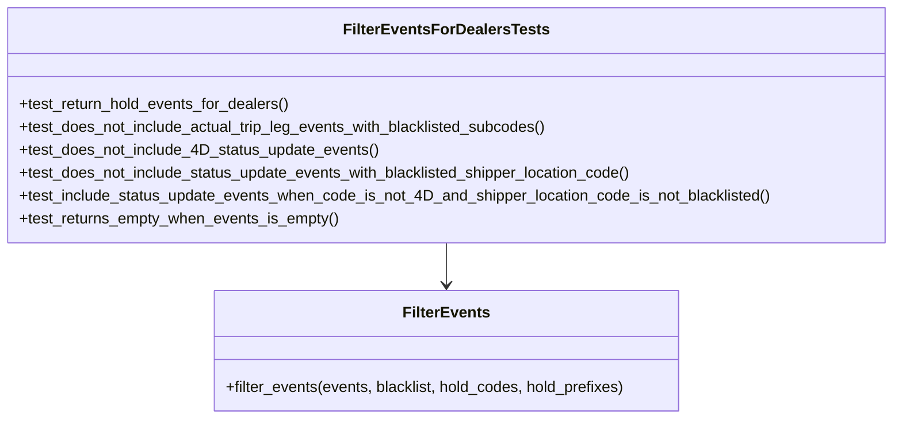

# Diagram: entity_core/entity_service/entity_service_tests/get_event_tests/test_filter_events_for_dealers.py


> Auto-generated by Obscura crawlers

## Diagram 1



### SVG

<svg id="container" width="930.78125" xmlns="http://www.w3.org/2000/svg" class="classDiagram" height="438" viewBox="0 0 930.78125 438" role="graphics-document document" aria-roledescription="class"><style>#container{font-family:"trebuchet ms",verdana,arial,sans-serif;font-size:16px;fill:#333;}@keyframes edge-animation-frame{from{stroke-dashoffset:0;}}@keyframes dash{to{stroke-dashoffset:0;}}#container .edge-animation-slow{stroke-dasharray:9,5!important;stroke-dashoffset:900;animation:dash 50s linear infinite;stroke-linecap:round;}#container .edge-animation-fast{stroke-dasharray:9,5!important;stroke-dashoffset:900;animation:dash 20s linear infinite;stroke-linecap:round;}#container .error-icon{fill:#552222;}#container .error-text{fill:#552222;stroke:#552222;}#container .edge-thickness-normal{stroke-width:1px;}#container .edge-thickness-thick{stroke-width:3.5px;}#container .edge-pattern-solid{stroke-dasharray:0;}#container .edge-thickness-invisible{stroke-width:0;fill:none;}#container .edge-pattern-dashed{stroke-dasharray:3;}#container .edge-pattern-dotted{stroke-dasharray:2;}#container .marker{fill:#333333;stroke:#333333;}#container .marker.cross{stroke:#333333;}#container svg{font-family:"trebuchet ms",verdana,arial,sans-serif;font-size:16px;}#container p{margin:0;}#container g.classGroup text{fill:#9370DB;stroke:none;font-family:"trebuchet ms",verdana,arial,sans-serif;font-size:10px;}#container g.classGroup text .title{font-weight:bolder;}#container .nodeLabel,#container .edgeLabel{color:#131300;}#container .edgeLabel .label rect{fill:#ECECFF;}#container .label text{fill:#131300;}#container .labelBkg{background:#ECECFF;}#container .edgeLabel .label span{background:#ECECFF;}#container .classTitle{font-weight:bolder;}#container .node rect,#container .node circle,#container .node ellipse,#container .node polygon,#container .node path{fill:#ECECFF;stroke:#9370DB;stroke-width:1px;}#container .divider{stroke:#9370DB;stroke-width:1;}#container g.clickable{cursor:pointer;}#container g.classGroup rect{fill:#ECECFF;stroke:#9370DB;}#container g.classGroup line{stroke:#9370DB;stroke-width:1;}#container .classLabel .box{stroke:none;stroke-width:0;fill:#ECECFF;opacity:0.5;}#container .classLabel .label{fill:#9370DB;font-size:10px;}#container .relation{stroke:#333333;stroke-width:1;fill:none;}#container .dashed-line{stroke-dasharray:3;}#container .dotted-line{stroke-dasharray:1 2;}#container #compositionStart,#container .composition{fill:#333333!important;stroke:#333333!important;stroke-width:1;}#container #compositionEnd,#container .composition{fill:#333333!important;stroke:#333333!important;stroke-width:1;}#container #dependencyStart,#container .dependency{fill:#333333!important;stroke:#333333!important;stroke-width:1;}#container #dependencyStart,#container .dependency{fill:#333333!important;stroke:#333333!important;stroke-width:1;}#container #extensionStart,#container .extension{fill:transparent!important;stroke:#333333!important;stroke-width:1;}#container #extensionEnd,#container .extension{fill:transparent!important;stroke:#333333!important;stroke-width:1;}#container #aggregationStart,#container .aggregation{fill:transparent!important;stroke:#333333!important;stroke-width:1;}#container #aggregationEnd,#container .aggregation{fill:transparent!important;stroke:#333333!important;stroke-width:1;}#container #lollipopStart,#container .lollipop{fill:#ECECFF!important;stroke:#333333!important;stroke-width:1;}#container #lollipopEnd,#container .lollipop{fill:#ECECFF!important;stroke:#333333!important;stroke-width:1;}#container .edgeTerminals{font-size:11px;line-height:initial;}#container .classTitleText{text-anchor:middle;font-size:18px;fill:#333;}#container .label-icon{display:inline-block;height:1em;overflow:visible;vertical-align:-0.125em;}#container .node .label-icon path{fill:currentColor;stroke:revert;stroke-width:revert;}#container :root{--mermaid-font-family:"trebuchet ms",verdana,arial,sans-serif;}</style><g><defs><marker id="container_class-aggregationStart" class="marker aggregation class" refX="18" refY="7" markerWidth="190" markerHeight="240" orient="auto"><path d="M 18,7 L9,13 L1,7 L9,1 Z"></path></marker></defs><defs><marker id="container_class-aggregationEnd" class="marker aggregation class" refX="1" refY="7" markerWidth="20" markerHeight="28" orient="auto"><path d="M 18,7 L9,13 L1,7 L9,1 Z"></path></marker></defs><defs><marker id="container_class-extensionStart" class="marker extension class" refX="18" refY="7" markerWidth="190" markerHeight="240" orient="auto"><path d="M 1,7 L18,13 V 1 Z"></path></marker></defs><defs><marker id="container_class-extensionEnd" class="marker extension class" refX="1" refY="7" markerWidth="20" markerHeight="28" orient="auto"><path d="M 1,1 V 13 L18,7 Z"></path></marker></defs><defs><marker id="container_class-compositionStart" class="marker composition class" refX="18" refY="7" markerWidth="190" markerHeight="240" orient="auto"><path d="M 18,7 L9,13 L1,7 L9,1 Z"></path></marker></defs><defs><marker id="container_class-compositionEnd" class="marker composition class" refX="1" refY="7" markerWidth="20" markerHeight="28" orient="auto"><path d="M 18,7 L9,13 L1,7 L9,1 Z"></path></marker></defs><defs><marker id="container_class-dependencyStart" class="marker dependency class" refX="6" refY="7" markerWidth="190" markerHeight="240" orient="auto"><path d="M 5,7 L9,13 L1,7 L9,1 Z"></path></marker></defs><defs><marker id="container_class-dependencyEnd" class="marker dependency class" refX="13" refY="7" markerWidth="20" markerHeight="28" orient="auto"><path d="M 18,7 L9,13 L14,7 L9,1 Z"></path></marker></defs><defs><marker id="container_class-lollipopStart" class="marker lollipop class" refX="13" refY="7" markerWidth="190" markerHeight="240" orient="auto"><circle stroke="black" fill="transparent" cx="7" cy="7" r="6"></circle></marker></defs><defs><marker id="container_class-lollipopEnd" class="marker lollipop class" refX="1" refY="7" markerWidth="190" markerHeight="240" orient="auto"><circle stroke="black" fill="transparent" cx="7" cy="7" r="6"></circle></marker></defs><g class="root"><g class="clusters"></g><g class="edgePaths"><path d="M465.391,254L465.391,258.167C465.391,262.333,465.391,270.667,465.391,278C465.391,285.333,465.391,291.667,465.391,294.833L465.391,298" id="id_FilterEventsForDealersTests_FilterEvents_1" class="edge-thickness-normal edge-pattern-solid relation" style=";;;" data-edge="true" data-et="edge" data-id="id_FilterEventsForDealersTests_FilterEvents_1" data-points="W3sieCI6NDY1LjM5MDYyNSwieSI6MjU0fSx7IngiOjQ2NS4zOTA2MjUsInkiOjI3OX0seyJ4Ijo0NjUuMzkwNjI1LCJ5IjozMDR9XQ==" marker-end="url(#container_class-dependencyEnd)"></path></g><g class="edgeLabels"><g class="edgeLabel"><g class="label" data-id="id_FilterEventsForDealersTests_FilterEvents_1" transform="translate(0, 0)"><foreignObject width="0" height="0"><div xmlns="http://www.w3.org/1999/xhtml" class="labelBkg" style="display: table-cell; white-space: nowrap; line-height: 1.5; max-width: 200px; text-align: center;"><span class="edgeLabel"></span></div></foreignObject></g></g></g><g class="nodes"><g class="node default" id="classId-FilterEventsForDealersTests-0" transform="translate(465.390625, 131)"><g class="basic label-container"><path d="M-457.390625 -123 L457.390625 -123 L457.390625 123 L-457.390625 123" stroke="none" stroke-width="0" fill="#ECECFF" style=""></path><path d="M-457.390625 -123 C-216.55286734426292 -123, 24.284890311474157 -123, 457.390625 -123 M-457.390625 -123 C-179.6610779244582 -123, 98.0684691510836 -123, 457.390625 -123 M457.390625 -123 C457.390625 -28.1427993393347, 457.390625 66.7144013213306, 457.390625 123 M457.390625 -123 C457.390625 -49.205184794951265, 457.390625 24.58963041009747, 457.390625 123 M457.390625 123 C106.2937181582808 123, -244.8031886834384 123, -457.390625 123 M457.390625 123 C110.8539646058793 123, -235.6826957882414 123, -457.390625 123 M-457.390625 123 C-457.390625 71.35883628320146, -457.390625 19.71767256640291, -457.390625 -123 M-457.390625 123 C-457.390625 28.10404454190534, -457.390625 -66.79191091618932, -457.390625 -123" stroke="#9370DB" stroke-width="1.3" fill="none" stroke-dasharray="0 0" style=""></path></g><g class="annotation-group text" transform="translate(0, -99)"></g><g class="label-group text" transform="translate(-101.125, -99)"><g class="label" style="font-weight: bolder" transform="translate(0,-12)"><foreignObject width="202.25" height="24"><div xmlns="http://www.w3.org/1999/xhtml" style="display: table-cell; white-space: nowrap; line-height: 1.5; max-width: 248px; text-align: center;"><span class="nodeLabel markdown-node-label" style=""><p>FilterEventsForDealersTests</p></span></div></foreignObject></g></g><g class="members-group text" transform="translate(-445.390625, -51)"></g><g class="methods-group text" transform="translate(-445.390625, -21)"><g class="label" style="" transform="translate(0,-12)"><foreignObject width="284.71875" height="24"><div xmlns="http://www.w3.org/1999/xhtml" style="display: table-cell; white-space: nowrap; line-height: 1.5; max-width: 342px; text-align: center;"><span class="nodeLabel markdown-node-label" style=""><p>+test_return_hold_events_for_dealers()</p></span></div></foreignObject></g><g class="label" style="" transform="translate(0,12)"><foreignObject width="558.53125" height="24"><div xmlns="http://www.w3.org/1999/xhtml" style="display: table-cell; white-space: nowrap; line-height: 1.5; max-width: 616px; text-align: center;"><span class="nodeLabel markdown-node-label" style=""><p>+test_does_not_include_actual_trip_leg_events_with_blacklisted_subcodes()</p></span></div></foreignObject></g><g class="label" style="" transform="translate(0,36)"><foreignObject width="375.015625" height="24"><div xmlns="http://www.w3.org/1999/xhtml" style="display: table-cell; white-space: nowrap; line-height: 1.5; max-width: 432px; text-align: center;"><span class="nodeLabel markdown-node-label" style=""><p>+test_does_not_include_4D_status_update_events()</p></span></div></foreignObject></g><g class="label" style="" transform="translate(0,60)"><foreignObject width="649.3125" height="24"><div xmlns="http://www.w3.org/1999/xhtml" style="display: table-cell; white-space: nowrap; line-height: 1.5; max-width: 707px; text-align: center;"><span class="nodeLabel markdown-node-label" style=""><p>+test_does_not_include_status_update_events_with_blacklisted_shipper_location_code()</p></span></div></foreignObject></g><g class="label" style="" transform="translate(0,84)"><foreignObject width="789.65625" height="24"><div xmlns="http://www.w3.org/1999/xhtml" style="display: table-cell; white-space: nowrap; line-height: 1.5; max-width: 847px; text-align: center;"><span class="nodeLabel markdown-node-label" style=""><p>+test_include_status_update_events_when_code_is_not_4D_and_shipper_location_code_is_not_blacklisted()</p></span></div></foreignObject></g><g class="label" style="" transform="translate(0,108)"><foreignObject width="335.25" height="24"><div xmlns="http://www.w3.org/1999/xhtml" style="display: table-cell; white-space: nowrap; line-height: 1.5; max-width: 393px; text-align: center;"><span class="nodeLabel markdown-node-label" style=""><p>+test_returns_empty_when_events_is_empty()</p></span></div></foreignObject></g></g><g class="divider" style=""><path d="M-457.390625 -75 C-160.06270414151015 -75, 137.2652167169797 -75, 457.390625 -75 M-457.390625 -75 C-171.63510618291605 -75, 114.1204126341679 -75, 457.390625 -75" stroke="#9370DB" stroke-width="1.3" fill="none" stroke-dasharray="0 0" style=""></path></g><g class="divider" style=""><path d="M-457.390625 -51 C-259.15489061522715 -51, -60.91915623045429 -51, 457.390625 -51 M-457.390625 -51 C-121.84577493354146 -51, 213.69907513291707 -51, 457.390625 -51" stroke="#9370DB" stroke-width="1.3" fill="none" stroke-dasharray="0 0" style=""></path></g></g><g class="node default" id="classId-FilterEvents-1" transform="translate(465.390625, 367)"><g class="basic label-container"><path d="M-244.296875 -63 L244.296875 -63 L244.296875 63 L-244.296875 63" stroke="none" stroke-width="0" fill="#ECECFF" style=""></path><path d="M-244.296875 -63 C-115.74390641366719 -63, 12.80906217266562 -63, 244.296875 -63 M-244.296875 -63 C-71.35749789407916 -63, 101.58187921184168 -63, 244.296875 -63 M244.296875 -63 C244.296875 -29.043240714758632, 244.296875 4.913518570482736, 244.296875 63 M244.296875 -63 C244.296875 -19.885860685065303, 244.296875 23.228278629869394, 244.296875 63 M244.296875 63 C83.2956640433683 63, -77.70554691326339 63, -244.296875 63 M244.296875 63 C74.8446732126616 63, -94.60752857467679 63, -244.296875 63 M-244.296875 63 C-244.296875 30.483215479325132, -244.296875 -2.033569041349736, -244.296875 -63 M-244.296875 63 C-244.296875 19.48807110015389, -244.296875 -24.023857799692223, -244.296875 -63" stroke="#9370DB" stroke-width="1.3" fill="none" stroke-dasharray="0 0" style=""></path></g><g class="annotation-group text" transform="translate(0, -39)"></g><g class="label-group text" transform="translate(-42.9375, -39)"><g class="label" style="font-weight: bolder" transform="translate(0,-12)"><foreignObject width="85.875" height="24"><div xmlns="http://www.w3.org/1999/xhtml" style="display: table-cell; white-space: nowrap; line-height: 1.5; max-width: 134px; text-align: center;"><span class="nodeLabel markdown-node-label" style=""><p>FilterEvents</p></span></div></foreignObject></g></g><g class="members-group text" transform="translate(-232.296875, 9)"></g><g class="methods-group text" transform="translate(-232.296875, 39)"><g class="label" style="" transform="translate(0,-12)"><foreignObject width="421.65625" height="24"><div xmlns="http://www.w3.org/1999/xhtml" style="display: table-cell; white-space: nowrap; line-height: 1.5; max-width: 479px; text-align: center;"><span class="nodeLabel markdown-node-label" style=""><p>+filter_events(events, blacklist, hold_codes, hold_prefixes)</p></span></div></foreignObject></g></g><g class="divider" style=""><path d="M-244.296875 -15 C-127.20491003439251 -15, -10.112945068785024 -15, 244.296875 -15 M-244.296875 -15 C-53.136400286775284 -15, 138.02407442644943 -15, 244.296875 -15" stroke="#9370DB" stroke-width="1.3" fill="none" stroke-dasharray="0 0" style=""></path></g><g class="divider" style=""><path d="M-244.296875 9 C-59.42578365568042 9, 125.44530768863916 9, 244.296875 9 M-244.296875 9 C-84.69748094581982 9, 74.90191310836036 9, 244.296875 9" stroke="#9370DB" stroke-width="1.3" fill="none" stroke-dasharray="0 0" style=""></path></g></g></g></g></g></svg>

## Diagram 2

```mermaid
flowchart TD
Start([Start]) --> Loop{For each event}
Loop --> TypeCheck{Event.code starts with "Hold"?}
TypeCheck -- Yes --> IncludeHold[Include event]
TypeCheck -- No --> ATLegCheck{Event.code contains "ActualTripLeg"?}
ATLegCheck -- Yes --> SubcodeBlacklisted{subcode in blacklist?}
SubcodeBlacklisted -- Yes --> Exclude1[Exclude event]
SubcodeBlacklisted -- No --> Include1[Include event]
ATLegCheck -- No --> StatusCheck{Event.code == "StatusUpdated"?}
StatusCheck -- Yes --> PrefixCheck{statusUpdate.code starts with any hold_prefix?}
PrefixCheck -- Yes --> StripPrefix[code = statusUpdate.code after prefix]
StripPrefix --> IsHoldCode{code in hold_codes?}
IsHoldCode -- Yes --> Exclude2[Exclude event]
IsHoldCode -- No --> ShipperBlacklisted{shipperLocationCode in blacklist?}
PrefixCheck -- No --> ShipperBlacklisted
ShipperBlacklisted -- Yes --> Exclude3[Exclude event]
ShipperBlacklisted -- No --> Include2[Include event]
StatusCheck -- No --> Include3[Include event]
IncludeHold --> Collect[Add to result list]
Include1 --> Collect
Include2 --> Collect
Include3 --> Collect
Exclude1 --> Continue([Continue])
Exclude2 --> Continue
Exclude3 --> Continue
Collect --> Continue
Continue --> Loop
Loop --> End([End])
```

> SVG rendering failed for this diagram.
