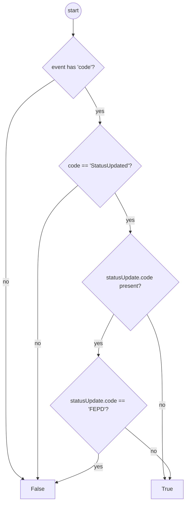

# Diagram: entity_core/entity_service/entity_service_tests/get_event_tests/test_get_unique_entity_events.py


> Auto-generated by Obscura crawlers

## Diagram 1



### SVG

<svg id="container" width="534.51953125" xmlns="http://www.w3.org/2000/svg" class="flowchart" height="1433.640625" viewBox="0 0 534.51953125 1433.640625" role="graphics-document document" aria-roledescription="flowchart-v2"><style>#container{font-family:"trebuchet ms",verdana,arial,sans-serif;font-size:16px;fill:#333;}@keyframes edge-animation-frame{from{stroke-dashoffset:0;}}@keyframes dash{to{stroke-dashoffset:0;}}#container .edge-animation-slow{stroke-dasharray:9,5!important;stroke-dashoffset:900;animation:dash 50s linear infinite;stroke-linecap:round;}#container .edge-animation-fast{stroke-dasharray:9,5!important;stroke-dashoffset:900;animation:dash 20s linear infinite;stroke-linecap:round;}#container .error-icon{fill:#552222;}#container .error-text{fill:#552222;stroke:#552222;}#container .edge-thickness-normal{stroke-width:1px;}#container .edge-thickness-thick{stroke-width:3.5px;}#container .edge-pattern-solid{stroke-dasharray:0;}#container .edge-thickness-invisible{stroke-width:0;fill:none;}#container .edge-pattern-dashed{stroke-dasharray:3;}#container .edge-pattern-dotted{stroke-dasharray:2;}#container .marker{fill:#333333;stroke:#333333;}#container .marker.cross{stroke:#333333;}#container svg{font-family:"trebuchet ms",verdana,arial,sans-serif;font-size:16px;}#container p{margin:0;}#container .label{font-family:"trebuchet ms",verdana,arial,sans-serif;color:#333;}#container .cluster-label text{fill:#333;}#container .cluster-label span{color:#333;}#container .cluster-label span p{background-color:transparent;}#container .label text,#container span{fill:#333;color:#333;}#container .node rect,#container .node circle,#container .node ellipse,#container .node polygon,#container .node path{fill:#ECECFF;stroke:#9370DB;stroke-width:1px;}#container .rough-node .label text,#container .node .label text,#container .image-shape .label,#container .icon-shape .label{text-anchor:middle;}#container .node .katex path{fill:#000;stroke:#000;stroke-width:1px;}#container .rough-node .label,#container .node .label,#container .image-shape .label,#container .icon-shape .label{text-align:center;}#container .node.clickable{cursor:pointer;}#container .root .anchor path{fill:#333333!important;stroke-width:0;stroke:#333333;}#container .arrowheadPath{fill:#333333;}#container .edgePath .path{stroke:#333333;stroke-width:2.0px;}#container .flowchart-link{stroke:#333333;fill:none;}#container .edgeLabel{background-color:rgba(232,232,232, 0.8);text-align:center;}#container .edgeLabel p{background-color:rgba(232,232,232, 0.8);}#container .edgeLabel rect{opacity:0.5;background-color:rgba(232,232,232, 0.8);fill:rgba(232,232,232, 0.8);}#container .labelBkg{background-color:rgba(232, 232, 232, 0.5);}#container .cluster rect{fill:#ffffde;stroke:#aaaa33;stroke-width:1px;}#container .cluster text{fill:#333;}#container .cluster span{color:#333;}#container div.mermaidTooltip{position:absolute;text-align:center;max-width:200px;padding:2px;font-family:"trebuchet ms",verdana,arial,sans-serif;font-size:12px;background:hsl(80, 100%, 96.2745098039%);border:1px solid #aaaa33;border-radius:2px;pointer-events:none;z-index:100;}#container .flowchartTitleText{text-anchor:middle;font-size:18px;fill:#333;}#container rect.text{fill:none;stroke-width:0;}#container .icon-shape,#container .image-shape{background-color:rgba(232,232,232, 0.8);text-align:center;}#container .icon-shape p,#container .image-shape p{background-color:rgba(232,232,232, 0.8);padding:2px;}#container .icon-shape rect,#container .image-shape rect{opacity:0.5;background-color:rgba(232,232,232, 0.8);fill:rgba(232,232,232, 0.8);}#container .label-icon{display:inline-block;height:1em;overflow:visible;vertical-align:-0.125em;}#container .node .label-icon path{fill:currentColor;stroke:revert;stroke-width:revert;}#container :root{--mermaid-font-family:"trebuchet ms",verdana,arial,sans-serif;}</style><g><marker id="container_flowchart-v2-pointEnd" class="marker flowchart-v2" viewBox="0 0 10 10" refX="5" refY="5" markerUnits="userSpaceOnUse" markerWidth="8" markerHeight="8" orient="auto"><path d="M 0 0 L 10 5 L 0 10 z" class="arrowMarkerPath" style="stroke-width: 1; stroke-dasharray: 1, 0;"></path></marker><marker id="container_flowchart-v2-pointStart" class="marker flowchart-v2" viewBox="0 0 10 10" refX="4.5" refY="5" markerUnits="userSpaceOnUse" markerWidth="8" markerHeight="8" orient="auto"><path d="M 0 5 L 10 10 L 10 0 z" class="arrowMarkerPath" style="stroke-width: 1; stroke-dasharray: 1, 0;"></path></marker><marker id="container_flowchart-v2-circleEnd" class="marker flowchart-v2" viewBox="0 0 10 10" refX="11" refY="5" markerUnits="userSpaceOnUse" markerWidth="11" markerHeight="11" orient="auto"><circle cx="5" cy="5" r="5" class="arrowMarkerPath" style="stroke-width: 1; stroke-dasharray: 1, 0;"></circle></marker><marker id="container_flowchart-v2-circleStart" class="marker flowchart-v2" viewBox="0 0 10 10" refX="-1" refY="5" markerUnits="userSpaceOnUse" markerWidth="11" markerHeight="11" orient="auto"><circle cx="5" cy="5" r="5" class="arrowMarkerPath" style="stroke-width: 1; stroke-dasharray: 1, 0;"></circle></marker><marker id="container_flowchart-v2-crossEnd" class="marker cross flowchart-v2" viewBox="0 0 11 11" refX="12" refY="5.2" markerUnits="userSpaceOnUse" markerWidth="11" markerHeight="11" orient="auto"><path d="M 1,1 l 9,9 M 10,1 l -9,9" class="arrowMarkerPath" style="stroke-width: 2; stroke-dasharray: 1, 0;"></path></marker><marker id="container_flowchart-v2-crossStart" class="marker cross flowchart-v2" viewBox="0 0 11 11" refX="-1" refY="5.2" markerUnits="userSpaceOnUse" markerWidth="11" markerHeight="11" orient="auto"><path d="M 1,1 l 9,9 M 10,1 l -9,9" class="arrowMarkerPath" style="stroke-width: 2; stroke-dasharray: 1, 0;"></path></marker><g class="root"><g class="clusters"></g><g class="edgePaths"><path d="M210.734,56.797L210.734,60.964C210.734,65.13,210.734,73.464,210.734,81.13C210.734,88.797,210.734,95.797,210.734,99.297L210.734,102.797" id="L_Start_HasCode_0" class="edge-thickness-normal edge-pattern-solid edge-thickness-normal edge-pattern-solid flowchart-link" style=";" data-edge="true" data-et="edge" data-id="L_Start_HasCode_0" data-points="W3sieCI6MjEwLjczNDM3NSwieSI6NTYuNzk2ODc1fSx7IngiOjIxMC43MzQzNzUsInkiOjgxLjc5Njg3NX0seyJ4IjoyMTAuNzM0Mzc1LCJ5IjoxMDYuNzk2ODc1fV0=" marker-end="url(#container_flowchart-v2-pointEnd)"></path><path d="M157.022,230.287L133.746,245.406C110.47,260.525,63.919,290.762,40.643,331.685C17.367,372.607,17.367,424.214,17.367,475.82C17.367,527.427,17.367,579.034,17.367,634.171C17.367,689.307,17.367,747.974,17.367,806.641C17.367,865.307,17.367,923.974,17.367,982.641C17.367,1041.307,17.367,1099.974,17.367,1158.641C17.367,1217.307,17.367,1275.974,25.599,1311.091C33.831,1346.207,50.294,1357.774,58.526,1363.558L66.758,1369.341" id="L_HasCode_False_0" class="edge-thickness-normal edge-pattern-solid edge-thickness-normal edge-pattern-solid flowchart-link" style=";" data-edge="true" data-et="edge" data-id="L_HasCode_False_0" data-points="W3sieCI6MTU3LjAyMTc5MzU5OTA2MTksInkiOjIzMC4yODc0MTg1OTkwNjE5fSx7IngiOjE3LjM2NzE4NzUsInkiOjMyMX0seyJ4IjoxNy4zNjcxODc1LCJ5Ijo0NzUuODIwMzEyNX0seyJ4IjoxNy4zNjcxODc1LCJ5Ijo2MzAuNjQwNjI1fSx7IngiOjE3LjM2NzE4NzUsInkiOjgwNi42NDA2MjV9LHsieCI6MTcuMzY3MTg3NSwieSI6OTgyLjY0MDYyNX0seyJ4IjoxNy4zNjcxODc1LCJ5IjoxMTU4LjY0MDYyNX0seyJ4IjoxNy4zNjcxODc1LCJ5IjoxMzM0LjY0MDYyNX0seyJ4Ijo3MC4wMzA3NjE3MTg3NSwieSI6MTM3MS42NDA2MjV9XQ==" marker-end="url(#container_flowchart-v2-pointEnd)"></path><path d="M244.248,250.487L251.397,262.239C258.547,273.991,272.846,297.496,279.995,314.748C287.145,332,287.145,343,287.145,348.5L287.145,354" id="L_HasCode_IsStatusUpdated_0" class="edge-thickness-normal edge-pattern-solid edge-thickness-normal edge-pattern-solid flowchart-link" style=";" data-edge="true" data-et="edge" data-id="L_HasCode_IsStatusUpdated_0" data-points="W3sieCI6MjQ0LjI0NzU3NTUwMzk2NDA0LCJ5IjoyNTAuNDg2Nzk5NDk2MDM1OTZ9LHsieCI6Mjg3LjE0NDUzMTI1LCJ5IjozMjF9LHsieCI6Mjg3LjE0NDUzMTI1LCJ5IjozNTh9XQ==" marker-end="url(#container_flowchart-v2-pointEnd)"></path><path d="M224.019,530.515L204.759,547.203C185.5,563.89,146.98,597.266,127.721,643.286C108.461,689.307,108.461,747.974,108.461,806.641C108.461,865.307,108.461,923.974,108.461,982.641C108.461,1041.307,108.461,1099.974,108.461,1158.641C108.461,1217.307,108.461,1275.974,108.461,1310.807C108.461,1345.641,108.461,1356.641,108.461,1362.141L108.461,1367.641" id="L_IsStatusUpdated_False_0" class="edge-thickness-normal edge-pattern-solid edge-thickness-normal edge-pattern-solid flowchart-link" style=";" data-edge="true" data-et="edge" data-id="L_IsStatusUpdated_False_0" data-points="W3sieCI6MjI0LjAxOTE2MzEyMTcyNzc2LCJ5Ijo1MzAuNTE1MjU2ODcxNzI3N30seyJ4IjoxMDguNDYwOTM3NSwieSI6NjMwLjY0MDYyNX0seyJ4IjoxMDguNDYwOTM3NSwieSI6ODA2LjY0MDYyNX0seyJ4IjoxMDguNDYwOTM3NSwieSI6OTgyLjY0MDYyNX0seyJ4IjoxMDguNDYwOTM3NSwieSI6MTE1OC42NDA2MjV9LHsieCI6MTA4LjQ2MDkzNzUsInkiOjEzMzQuNjQwNjI1fSx7IngiOjEwOC40NjA5Mzc1LCJ5IjoxMzcxLjY0MDYyNX1d" marker-end="url(#container_flowchart-v2-pointEnd)"></path><path d="M329.533,551.252L336.968,564.484C344.403,577.715,359.274,604.178,366.709,622.909C374.145,641.641,374.145,652.641,374.145,658.141L374.145,663.641" id="L_IsStatusUpdated_HasStatusUpdateCode_0" class="edge-thickness-normal edge-pattern-solid edge-thickness-normal edge-pattern-solid flowchart-link" style=";" data-edge="true" data-et="edge" data-id="L_IsStatusUpdated_HasStatusUpdateCode_0" data-points="W3sieCI6MzI5LjUzMjg5NDI1MTk3MDczLCJ5Ijo1NTEuMjUyMjYxOTk4MDI5M30seyJ4IjozNzQuMTQ0NTMxMjUsInkiOjYzMC42NDA2MjV9LHsieCI6Mzc0LjE0NDUzMTI1LCJ5Ijo2NjcuNjQwNjI1fV0=" marker-end="url(#container_flowchart-v2-pointEnd)"></path><path d="M421.753,898.032L429.099,912.134C436.445,926.235,451.136,954.438,458.482,997.873C465.828,1041.307,465.828,1099.974,465.828,1158.641C465.828,1217.307,465.828,1275.974,467.094,1310.824C468.36,1345.674,470.891,1356.708,472.157,1362.225L473.423,1367.742" id="L_HasStatusUpdateCode_True_0" class="edge-thickness-normal edge-pattern-solid edge-thickness-normal edge-pattern-solid flowchart-link" style=";" data-edge="true" data-et="edge" data-id="L_HasStatusUpdateCode_True_0" data-points="W3sieCI6NDIxLjc1MzA1MDUxOTc3NjksInkiOjg5OC4wMzIxMDU3MzAyMjMyfSx7IngiOjQ2NS44MjgxMjUsInkiOjk4Mi42NDA2MjV9LHsieCI6NDY1LjgyODEyNSwieSI6MTE1OC42NDA2MjV9LHsieCI6NDY1LjgyODEyNSwieSI6MTMzNC42NDA2MjV9LHsieCI6NDc0LjMxNzA3NzYzNjcxODc1LCJ5IjoxMzcxLjY0MDYyNX1d" marker-end="url(#container_flowchart-v2-pointEnd)"></path><path d="M326.536,898.032L319.19,912.134C311.844,926.235,297.153,954.438,289.807,974.039C282.461,993.641,282.461,1004.641,282.461,1010.141L282.461,1015.641" id="L_HasStatusUpdateCode_IsFEPD_0" class="edge-thickness-normal edge-pattern-solid edge-thickness-normal edge-pattern-solid flowchart-link" style=";" data-edge="true" data-et="edge" data-id="L_HasStatusUpdateCode_IsFEPD_0" data-points="W3sieCI6MzI2LjUzNjAxMTk4MDIyMzEsInkiOjg5OC4wMzIxMDU3MzAyMjMyfSx7IngiOjI4Mi40NjA5Mzc1LCJ5Ijo5ODIuNjQwNjI1fSx7IngiOjI4Mi40NjA5Mzc1LCJ5IjoxMDE5LjY0MDYyNX1d" marker-end="url(#container_flowchart-v2-pointEnd)"></path><path d="M282.461,1297.641L282.461,1303.807C282.461,1309.974,282.461,1322.307,262.114,1335.958C241.767,1349.609,201.073,1364.576,180.726,1372.06L160.379,1379.544" id="L_IsFEPD_False_0" class="edge-thickness-normal edge-pattern-solid edge-thickness-normal edge-pattern-solid flowchart-link" style=";" data-edge="true" data-et="edge" data-id="L_IsFEPD_False_0" data-points="W3sieCI6MjgyLjQ2MDkzNzUsInkiOjEyOTcuNjQwNjI1fSx7IngiOjI4Mi40NjA5Mzc1LCJ5IjoxMzM0LjY0MDYyNX0seyJ4IjoxNTYuNjI1LCJ5IjoxMzgwLjkyNTEwNzc1ODYyMDd9XQ==" marker-end="url(#container_flowchart-v2-pointEnd)"></path><path d="M358.529,1221.573L381.306,1240.418C404.084,1259.262,449.64,1296.951,471.152,1321.313C492.664,1345.674,490.132,1356.708,488.867,1362.225L487.601,1367.742" id="L_IsFEPD_True_0" class="edge-thickness-normal edge-pattern-solid edge-thickness-normal edge-pattern-solid flowchart-link" style=";" data-edge="true" data-et="edge" data-id="L_IsFEPD_True_0" data-points="W3sieCI6MzU4LjUyODUwNDUyNDM5ODEsInkiOjEyMjEuNTczMDU3OTc1NjAxOH0seyJ4Ijo0OTUuMTk1MzEyNSwieSI6MTMzNC42NDA2MjV9LHsieCI6NDg2LjcwNjM1OTg2MzI4MTI1LCJ5IjoxMzcxLjY0MDYyNX1d" marker-end="url(#container_flowchart-v2-pointEnd)"></path></g><g class="edgeLabels"><g class="edgeLabel"><g class="label" data-id="L_Start_HasCode_0" transform="translate(0, 0)"><foreignObject width="0" height="0"><div xmlns="http://www.w3.org/1999/xhtml" class="labelBkg" style="display: table-cell; white-space: nowrap; line-height: 1.5; max-width: 200px; text-align: center;"><span class="edgeLabel"></span></div></foreignObject></g></g><g class="edgeLabel" transform="translate(17.3671875, 806.640625)"><g class="label" data-id="L_HasCode_False_0" transform="translate(-9.3671875, -12)"><foreignObject width="18.734375" height="24"><div xmlns="http://www.w3.org/1999/xhtml" class="labelBkg" style="display: table-cell; white-space: nowrap; line-height: 1.5; max-width: 200px; text-align: center;"><span class="edgeLabel"><p>no</p></span></div></foreignObject></g></g><g class="edgeLabel" transform="translate(287.14453125, 321)"><g class="label" data-id="L_HasCode_IsStatusUpdated_0" transform="translate(-12.0078125, -12)"><foreignObject width="24.015625" height="24"><div xmlns="http://www.w3.org/1999/xhtml" class="labelBkg" style="display: table-cell; white-space: nowrap; line-height: 1.5; max-width: 200px; text-align: center;"><span class="edgeLabel"><p>yes</p></span></div></foreignObject></g></g><g class="edgeLabel" transform="translate(108.4609375, 982.640625)"><g class="label" data-id="L_IsStatusUpdated_False_0" transform="translate(-9.3671875, -12)"><foreignObject width="18.734375" height="24"><div xmlns="http://www.w3.org/1999/xhtml" class="labelBkg" style="display: table-cell; white-space: nowrap; line-height: 1.5; max-width: 200px; text-align: center;"><span class="edgeLabel"><p>no</p></span></div></foreignObject></g></g><g class="edgeLabel" transform="translate(374.14453125, 630.640625)"><g class="label" data-id="L_IsStatusUpdated_HasStatusUpdateCode_0" transform="translate(-12.0078125, -12)"><foreignObject width="24.015625" height="24"><div xmlns="http://www.w3.org/1999/xhtml" class="labelBkg" style="display: table-cell; white-space: nowrap; line-height: 1.5; max-width: 200px; text-align: center;"><span class="edgeLabel"><p>yes</p></span></div></foreignObject></g></g><g class="edgeLabel" transform="translate(465.828125, 1158.640625)"><g class="label" data-id="L_HasStatusUpdateCode_True_0" transform="translate(-9.3671875, -12)"><foreignObject width="18.734375" height="24"><div xmlns="http://www.w3.org/1999/xhtml" class="labelBkg" style="display: table-cell; white-space: nowrap; line-height: 1.5; max-width: 200px; text-align: center;"><span class="edgeLabel"><p>no</p></span></div></foreignObject></g></g><g class="edgeLabel" transform="translate(282.4609375, 982.640625)"><g class="label" data-id="L_HasStatusUpdateCode_IsFEPD_0" transform="translate(-12.0078125, -12)"><foreignObject width="24.015625" height="24"><div xmlns="http://www.w3.org/1999/xhtml" class="labelBkg" style="display: table-cell; white-space: nowrap; line-height: 1.5; max-width: 200px; text-align: center;"><span class="edgeLabel"><p>yes</p></span></div></foreignObject></g></g><g class="edgeLabel" transform="translate(282.4609375, 1334.640625)"><g class="label" data-id="L_IsFEPD_False_0" transform="translate(-12.0078125, -12)"><foreignObject width="24.015625" height="24"><div xmlns="http://www.w3.org/1999/xhtml" class="labelBkg" style="display: table-cell; white-space: nowrap; line-height: 1.5; max-width: 200px; text-align: center;"><span class="edgeLabel"><p>yes</p></span></div></foreignObject></g></g><g class="edgeLabel" transform="translate(441.4864, 1290.20601)"><g class="label" data-id="L_IsFEPD_True_0" transform="translate(-9.3671875, -12)"><foreignObject width="18.734375" height="24"><div xmlns="http://www.w3.org/1999/xhtml" class="labelBkg" style="display: table-cell; white-space: nowrap; line-height: 1.5; max-width: 200px; text-align: center;"><span class="edgeLabel"><p>no</p></span></div></foreignObject></g></g></g><g class="nodes"><g class="node default" id="flowchart-Start-0" transform="translate(210.734375, 32.3984375)"><circle class="basic label-container" style="" r="24.3984375" cx="0" cy="0"></circle><g class="label" style="" transform="translate(-16.8984375, -12)"><rect></rect><foreignObject width="33.796875" height="24"><div xmlns="http://www.w3.org/1999/xhtml" style="display: table-cell; white-space: nowrap; line-height: 1.5; max-width: 200px; text-align: center;"><span class="nodeLabel"><p>start</p></span></div></foreignObject></g></g><g class="node default" id="flowchart-HasCode-1" transform="translate(210.734375, 195.3984375)"><polygon points="88.6015625,0 177.203125,-88.6015625 88.6015625,-177.203125 0,-88.6015625" class="label-container" transform="translate(-88.1015625, 88.6015625)"></polygon><g class="label" style="" transform="translate(-61.6015625, -12)"><rect></rect><foreignObject width="123.203125" height="24"><div xmlns="http://www.w3.org/1999/xhtml" style="display: table-cell; white-space: nowrap; line-height: 1.5; max-width: 200px; text-align: center;"><span class="nodeLabel"><p>event has 'code'?</p></span></div></foreignObject></g></g><g class="node default" id="flowchart-False-3" transform="translate(108.4609375, 1398.640625)"><rect class="basic label-container" style="" x="-48.1640625" y="-27" width="96.328125" height="54"></rect><g class="label" style="" transform="translate(-18.1640625, -12)"><rect></rect><foreignObject width="36.328125" height="24"><div xmlns="http://www.w3.org/1999/xhtml" style="display: table-cell; white-space: nowrap; line-height: 1.5; max-width: 200px; text-align: center;"><span class="nodeLabel"><p>False</p></span></div></foreignObject></g></g><g class="node default" id="flowchart-IsStatusUpdated-5" transform="translate(287.14453125, 475.8203125)"><polygon points="117.8203125,0 235.640625,-117.8203125 117.8203125,-235.640625 0,-117.8203125" class="label-container" transform="translate(-117.3203125, 117.8203125)"></polygon><g class="label" style="" transform="translate(-90.8203125, -12)"><rect></rect><foreignObject width="181.640625" height="24"><div xmlns="http://www.w3.org/1999/xhtml" style="display: table-cell; white-space: nowrap; line-height: 1.5; max-width: 200px; text-align: center;"><span class="nodeLabel"><p>code == 'StatusUpdated'?</p></span></div></foreignObject></g></g><g class="node default" id="flowchart-HasStatusUpdateCode-9" transform="translate(374.14453125, 806.640625)"><polygon points="139,0 278,-139 139,-278 0,-139" class="label-container" transform="translate(-138.5, 139)"></polygon><g class="label" style="" transform="translate(-100, -24)"><rect></rect><foreignObject width="200" height="48"><div xmlns="http://www.w3.org/1999/xhtml" style="display: table; white-space: break-spaces; line-height: 1.5; max-width: 200px; text-align: center; width: 200px;"><span class="nodeLabel"><p>statusUpdate.code present?</p></span></div></foreignObject></g></g><g class="node default" id="flowchart-True-11" transform="translate(480.51171875, 1398.640625)"><rect class="basic label-container" style="" x="-46.0078125" y="-27" width="92.015625" height="54"></rect><g class="label" style="" transform="translate(-16.0078125, -12)"><rect></rect><foreignObject width="32.015625" height="24"><div xmlns="http://www.w3.org/1999/xhtml" style="display: table-cell; white-space: nowrap; line-height: 1.5; max-width: 200px; text-align: center;"><span class="nodeLabel"><p>True</p></span></div></foreignObject></g></g><g class="node default" id="flowchart-IsFEPD-13" transform="translate(282.4609375, 1158.640625)"><polygon points="139,0 278,-139 139,-278 0,-139" class="label-container" transform="translate(-138.5, 139)"></polygon><g class="label" style="" transform="translate(-100, -24)"><rect></rect><foreignObject width="200" height="48"><div xmlns="http://www.w3.org/1999/xhtml" style="display: table; white-space: break-spaces; line-height: 1.5; max-width: 200px; text-align: center; width: 200px;"><span class="nodeLabel"><p>statusUpdate.code == 'FEPD'?</p></span></div></foreignObject></g></g></g></g></g></svg>

## Diagram 2

```mermaid
flowchart TD
    A[status_update_reference] --> B[references list]
    B --> C{reference.qualifier == "evt_received_time"?}
    C -- yes --> D[exclude reference]
    C -- no --> E[include reference]
    D --> F[continue filtering]
    E --> F
    F --> G[output filtered references]
```

> SVG rendering failed for this diagram.

## Diagram 3

```mermaid
flowchart TD
    S((start)) --> ForEach[iterate events]
    ForEach --> IsStatusUpdated{"event.code == 'StatusUpdated'?"}
    IsStatusUpdated -- no --> EmitNonStatus[emit event as-is]
    IsStatusUpdated -- yes --> IsFEPD{"statusUpdate.code == 'FEPD'?"}
    IsFEPD -- yes --> EmitStatus[emit event (no dedupe)]
    IsFEPD -- no --> BuildKey[build dedupe key from eventTs, statusUpdate.code, subcode, comments, senderId, sourceId, shipperId, codeDescription, statusLocationId, shipperLocationCode, subcodeDescription, filtered references]
    BuildKey --> Seen{"key seen before?"}
    Seen -- yes --> Skip[skip duplicate]
    Seen -- no --> EmitUnique[emit event and record key]
    EmitNonStatus --> Continue[continue]
    EmitStatus --> Continue
    EmitUnique --> Continue
    Skip --> Continue
    Continue --> ForEach
    ForEach --> End((end))
```

> SVG rendering failed for this diagram.
