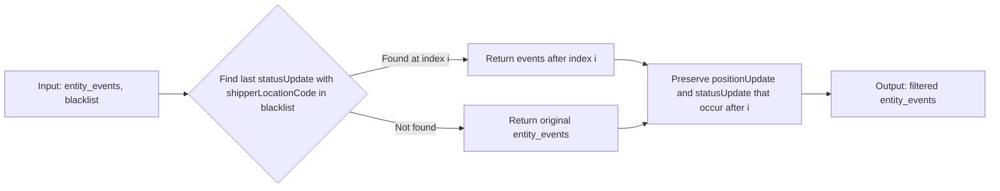
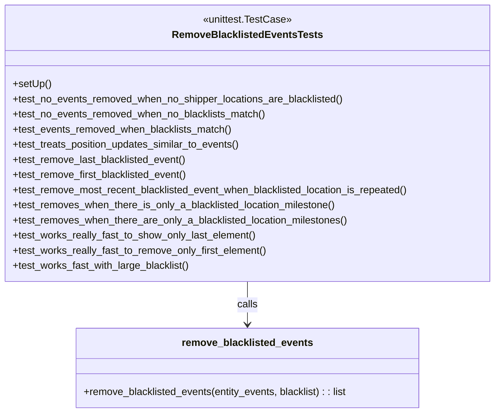

# Diagram: entity_core/entity_service/entity_service_tests/get_event_tests/test_remove_blacklisted_events.py

> Auto-generated by Obscura crawlers

## Diagram 1

### SVG

<svg id="container" width="1674.40625" xmlns="http://www.w3.org/2000/svg" class="flowchart" height="318" viewBox="0 0 1674.40625 318" role="graphics-document document" aria-roledescription="flowchart-v2"><g><marker id="container_flowchart-v2-pointEnd" class="marker flowchart-v2" viewBox="0 0 10 10" refX="5" refY="5" markerUnits="userSpaceOnUse" markerWidth="8" markerHeight="8" orient="auto"><path d="M 0 0 L 10 5 L 0 10 z" class="arrowMarkerPath" style="stroke-width: 1; stroke-dasharray: 1, 0;"></path></marker><marker id="container_flowchart-v2-pointStart" class="marker flowchart-v2" viewBox="0 0 10 10" refX="4.5" refY="5" markerUnits="userSpaceOnUse" markerWidth="8" markerHeight="8" orient="auto"><path d="M 0 5 L 10 10 L 10 0 z" class="arrowMarkerPath" style="stroke-width: 1; stroke-dasharray: 1, 0;"></path></marker><marker id="container_flowchart-v2-circleEnd" class="marker flowchart-v2" viewBox="0 0 10 10" refX="11" refY="5" markerUnits="userSpaceOnUse" markerWidth="11" markerHeight="11" orient="auto"><circle cx="5" cy="5" r="5" class="arrowMarkerPath" style="stroke-width: 1; stroke-dasharray: 1, 0;"></circle></marker><marker id="container_flowchart-v2-circleStart" class="marker flowchart-v2" viewBox="0 0 10 10" refX="-1" refY="5" markerUnits="userSpaceOnUse" markerWidth="11" markerHeight="11" orient="auto"><circle cx="5" cy="5" r="5" class="arrowMarkerPath" style="stroke-width: 1; stroke-dasharray: 1, 0;"></circle></marker><marker id="container_flowchart-v2-crossEnd" class="marker cross flowchart-v2" viewBox="0 0 11 11" refX="12" refY="5.2" markerUnits="userSpaceOnUse" markerWidth="11" markerHeight="11" orient="auto"><path d="M 1,1 l 9,9 M 10,1 l -9,9" class="arrowMarkerPath" style="stroke-width: 2; stroke-dasharray: 1, 0;"></path></marker><marker id="container_flowchart-v2-crossStart" class="marker cross flowchart-v2" viewBox="0 0 11 11" refX="-1" refY="5.2" markerUnits="userSpaceOnUse" markerWidth="11" markerHeight="11" orient="auto"><path d="M 1,1 l 9,9 M 10,1 l -9,9" class="arrowMarkerPath" style="stroke-width: 2; stroke-dasharray: 1, 0;"></path></marker><g class="root"><g class="clusters"></g><g class="edgePaths"><path d="M268,159L272.167,159C276.333,159,284.667,159,292.333,159C300,159,307,159,310.5,159L314,159" id="L_A_B_0" class="edge-thickness-normal edge-pattern-solid edge-thickness-normal edge-pattern-solid flowchart-link" style=";" data-edge="true" data-et="edge" data-id="L_A_B_0" data-points="W3sieCI6MjY4LCJ5IjoxNTl9LHsieCI6MjkzLCJ5IjoxNTl9LHsieCI6MzE4LCJ5IjoxNTl9XQ==" marker-end="url(#container_flowchart-v2-pointEnd)"></path><path d="M590.028,129.028L608.89,124.356C627.753,119.685,665.478,110.343,698.176,105.671C730.875,101,758.547,101,772.383,101L786.219,101" id="L_B_C_0" class="edge-thickness-normal edge-pattern-solid edge-thickness-normal edge-pattern-solid flowchart-link" style=";" data-edge="true" data-et="edge" data-id="L_B_C_0" data-points="W3sieCI6NTkwLjAyNzY5OTA1MzUyNjYsInkiOjEyOS4wMjc2OTkwNTM1MjY1Nn0seyJ4Ijo3MDMuMjAzMTI1LCJ5IjoxMDF9LHsieCI6NzkwLjIxODc1LCJ5IjoxMDF9XQ==" marker-end="url(#container_flowchart-v2-pointEnd)"></path><path d="M590.028,188.972L608.89,193.644C627.753,198.315,665.478,207.657,697.541,212.329C729.604,217,756.005,217,769.206,217L782.406,217" id="L_B_D_0" class="edge-thickness-normal edge-pattern-solid edge-thickness-normal edge-pattern-solid flowchart-link" style=";" data-edge="true" data-et="edge" data-id="L_B_D_0" data-points="W3sieCI6NTkwLjAyNzY5OTA1MzUyNjYsInkiOjE4OC45NzIzMDA5NDY0NzM0NH0seyJ4Ijo3MDMuMjAzMTI1LCJ5IjoyMTd9LHsieCI6Nzg2LjQwNjI1LCJ5IjoyMTd9XQ==" marker-end="url(#container_flowchart-v2-pointEnd)"></path><path d="M1042.594,101L1047.396,101C1052.198,101,1061.802,101,1070.146,102.325C1078.491,103.651,1085.575,106.302,1089.118,107.627L1092.66,108.953" id="L_C_E_0" class="edge-thickness-normal edge-pattern-solid edge-thickness-normal edge-pattern-solid flowchart-link" style=";" data-edge="true" data-et="edge" data-id="L_C_E_0" data-points="W3sieCI6MTA0Mi41OTM3NSwieSI6MTAxfSx7IngiOjEwNzEuNDA2MjUsInkiOjEwMX0seyJ4IjoxMDk2LjQwNjI1LCJ5IjoxMTAuMzU0ODM4NzA5Njc3NDF9XQ==" marker-end="url(#container_flowchart-v2-pointEnd)"></path><path d="M1046.406,217L1050.573,217C1054.74,217,1063.073,217,1070.782,215.675C1078.491,214.349,1085.575,211.698,1089.118,210.373L1092.66,209.047" id="L_D_E_0" class="edge-thickness-normal edge-pattern-solid edge-thickness-normal edge-pattern-solid flowchart-link" style=";" data-edge="true" data-et="edge" data-id="L_D_E_0" data-points="W3sieCI6MTA0Ni40MDYyNSwieSI6MjE3fSx7IngiOjEwNzEuNDA2MjUsInkiOjIxN30seyJ4IjoxMDk2LjQwNjI1LCJ5IjoyMDcuNjQ1MTYxMjkwMzIyNn1d" marker-end="url(#container_flowchart-v2-pointEnd)"></path><path d="M1356.406,159L1360.573,159C1364.74,159,1373.073,159,1380.74,159C1388.406,159,1395.406,159,1398.906,159L1402.406,159" id="L_E_F_0" class="edge-thickness-normal edge-pattern-solid edge-thickness-normal edge-pattern-solid flowchart-link" style=";" data-edge="true" data-et="edge" data-id="L_E_F_0" data-points="W3sieCI6MTM1Ni40MDYyNSwieSI6MTU5fSx7IngiOjEzODEuNDA2MjUsInkiOjE1OX0seyJ4IjoxNDA2LjQwNjI1LCJ5IjoxNTl9XQ==" marker-end="url(#container_flowchart-v2-pointEnd)"></path></g><g class="edgeLabels"><g class="edgeLabel"><g class="label" data-id="L_A_B_0" transform="translate(0, 0)"><foreignObject width="0" height="0">

</foreignObject></g></g><g class="edgeLabel" transform="translate(703.203125, 101)"><g class="label" data-id="L_B_C_0" transform="translate(-58.203125, -12)"><foreignObject width="116.40625" height="24">

Found at index i

</foreignObject></g></g><g class="edgeLabel" transform="translate(703.203125, 217)"><g class="label" data-id="L_B_D_0" transform="translate(-36.546875, -12)"><foreignObject width="73.09375" height="24">

Not found

</foreignObject></g></g><g class="edgeLabel"><g class="label" data-id="L_C_E_0" transform="translate(0, 0)"><foreignObject width="0" height="0">

</foreignObject></g></g><g class="edgeLabel"><g class="label" data-id="L_D_E_0" transform="translate(0, 0)"><foreignObject width="0" height="0">

</foreignObject></g></g><g class="edgeLabel"><g class="label" data-id="L_E_F_0" transform="translate(0, 0)"><foreignObject width="0" height="0">

</foreignObject></g></g></g><g class="nodes"><g class="node default" id="flowchart-A-0" transform="translate(138, 159)"><rect class="basic label-container" style="" x="-130" y="-39" width="260" height="78"></rect><g class="label" style="" transform="translate(-100, -24)"><rect></rect><foreignObject width="200" height="48">

Input: entity_events, blacklist

</foreignObject></g></g><g class="node default" id="flowchart-B-1" transform="translate(469, 159)"><polygon points="151,0 302,-151 151,-302 0,-151" class="label-container" transform="translate(-150.5, 151)"></polygon><g class="label" style="" transform="translate(-100, -36)"><rect></rect><foreignObject width="200" height="72">

Find last statusUpdate with shipperLocationCode in blacklist

</foreignObject></g></g><g class="node default" id="flowchart-C-3" transform="translate(916.40625, 101)"><rect class="basic label-container" style="" x="-126.1875" y="-27" width="252.375" height="54"></rect><g class="label" style="" transform="translate(-96.1875, -12)"><rect></rect><foreignObject width="192.375" height="24">

Return events after index i

</foreignObject></g></g><g class="node default" id="flowchart-D-5" transform="translate(916.40625, 217)"><rect class="basic label-container" style="" x="-130" y="-39" width="260" height="78"></rect><g class="label" style="" transform="translate(-100, -24)"><rect></rect><foreignObject width="200" height="48">

Return original entity_events

</foreignObject></g></g><g class="node default" id="flowchart-E-7" transform="translate(1226.40625, 159)"><rect class="basic label-container" style="" x="-130" y="-51" width="260" height="102"></rect><g class="label" style="" transform="translate(-100, -36)"><rect></rect><foreignObject width="200" height="72">

Preserve positionUpdate and statusUpdate that occur after i

</foreignObject></g></g><g class="node default" id="flowchart-F-11" transform="translate(1536.40625, 159)"><rect class="basic label-container" style="" x="-130" y="-39" width="260" height="78"></rect><g class="label" style="" transform="translate(-100, -24)"><rect></rect><foreignObject width="200" height="48">

Output: filtered entity_events

</foreignObject></g></g></g></g></g></svg>

## Diagram 2

### SVG

<svg id="container" width="789.9296875" xmlns="http://www.w3.org/2000/svg" class="classDiagram" height="654" viewBox="0 0 789.9296875 654" role="graphics-document document" aria-roledescription="class"><g><defs><marker id="container_class-aggregationStart" class="marker aggregation class" refX="18" refY="7" markerWidth="190" markerHeight="240" orient="auto"><path d="M 18,7 L9,13 L1,7 L9,1 Z"></path></marker></defs><defs><marker id="container_class-aggregationEnd" class="marker aggregation class" refX="1" refY="7" markerWidth="20" markerHeight="28" orient="auto"><path d="M 18,7 L9,13 L1,7 L9,1 Z"></path></marker></defs><defs><marker id="container_class-extensionStart" class="marker extension class" refX="18" refY="7" markerWidth="190" markerHeight="240" orient="auto"><path d="M 1,7 L18,13 V 1 Z"></path></marker></defs><defs><marker id="container_class-extensionEnd" class="marker extension class" refX="1" refY="7" markerWidth="20" markerHeight="28" orient="auto"><path d="M 1,1 V 13 L18,7 Z"></path></marker></defs><defs><marker id="container_class-compositionStart" class="marker composition class" refX="18" refY="7" markerWidth="190" markerHeight="240" orient="auto"><path d="M 18,7 L9,13 L1,7 L9,1 Z"></path></marker></defs><defs><marker id="container_class-compositionEnd" class="marker composition class" refX="1" refY="7" markerWidth="20" markerHeight="28" orient="auto"><path d="M 18,7 L9,13 L1,7 L9,1 Z"></path></marker></defs><defs><marker id="container_class-dependencyStart" class="marker dependency class" refX="6" refY="7" markerWidth="190" markerHeight="240" orient="auto"><path d="M 5,7 L9,13 L1,7 L9,1 Z"></path></marker></defs><defs><marker id="container_class-dependencyEnd" class="marker dependency class" refX="13" refY="7" markerWidth="20" markerHeight="28" orient="auto"><path d="M 18,7 L9,13 L14,7 L9,1 Z"></path></marker></defs><defs><marker id="container_class-lollipopStart" class="marker lollipop class" refX="13" refY="7" markerWidth="190" markerHeight="240" orient="auto"><circle stroke="black" fill="transparent" cx="7" cy="7" r="6"></circle></marker></defs><defs><marker id="container_class-lollipopEnd" class="marker lollipop class" refX="1" refY="7" markerWidth="190" markerHeight="240" orient="auto"><circle stroke="black" fill="transparent" cx="7" cy="7" r="6"></circle></marker></defs><g class="root"><g class="clusters"></g><g class="edgePaths"><path d="M394.965,446L394.965,452.167C394.965,458.333,394.965,470.667,394.965,482C394.965,493.333,394.965,503.667,394.965,508.833L394.965,514" id="id_RemoveBlacklistedEventsTests_remove_blacklisted_events_1" class="edge-thickness-normal edge-pattern-solid relation" style=";;;" data-edge="true" data-et="edge" data-id="id_RemoveBlacklistedEventsTests_remove_blacklisted_events_1" data-points="W3sieCI6Mzk0Ljk2NDg0Mzc1LCJ5Ijo0NDZ9LHsieCI6Mzk0Ljk2NDg0Mzc1LCJ5Ijo0ODN9LHsieCI6Mzk0Ljk2NDg0Mzc1LCJ5Ijo1MjB9XQ==" marker-end="url(#container_class-dependencyEnd)"></path></g><g class="edgeLabels"><g class="edgeLabel" transform="translate(394.96484375, 483)"><g class="label" data-id="id_RemoveBlacklistedEventsTests_remove_blacklisted_events_1" transform="translate(-16.4453125, -12)"><foreignObject width="32.890625" height="24">

calls

</foreignObject></g></g></g><g class="nodes"><g class="node default" id="classId-RemoveBlacklistedEventsTests-0" transform="translate(394.96484375, 227)"><g class="basic label-container"><path d="M-386.96484375 -219 L386.96484375 -219 L386.96484375 219 L-386.96484375 219" stroke="none" stroke-width="0" fill="#ECECFF" style=""></path><path d="M-386.96484375 -219 C-77.94627919071252 -219, 231.07228536857497 -219, 386.96484375 -219 M-386.96484375 -219 C-178.8077274896338 -219, 29.34938877073239 -219, 386.96484375 -219 M386.96484375 -219 C386.96484375 -114.25281700334216, 386.96484375 -9.505634006684318, 386.96484375 219 M386.96484375 -219 C386.96484375 -128.54220145798462, 386.96484375 -38.08440291596921, 386.96484375 219 M386.96484375 219 C146.50023607153895 219, -93.9643716069221 219, -386.96484375 219 M386.96484375 219 C212.11175734000548 219, 37.258670930010965 219, -386.96484375 219 M-386.96484375 219 C-386.96484375 75.37460660605907, -386.96484375 -68.25078678788185, -386.96484375 -219 M-386.96484375 219 C-386.96484375 61.062378500730205, -386.96484375 -96.87524299853959, -386.96484375 -219" stroke="#9370DB" stroke-width="1.3" fill="none" stroke-dasharray="0 0" style=""></path></g><g class="annotation-group text" transform="translate(-70.1328125, -195)"><g class="label" style="" transform="translate(0,-12)"><foreignObject width="140.265625" height="24">

«unittest.TestCase»

</foreignObject></g></g><g class="label-group text" transform="translate(-112.8046875, -171)"><g class="label" style="font-weight: bolder" transform="translate(0,-12)"><foreignObject width="225.609375" height="24">

RemoveBlacklistedEventsTests

</foreignObject></g></g><g class="members-group text" transform="translate(-374.96484375, -123)"></g><g class="methods-group text" transform="translate(-374.96484375, -93)"><g class="label" style="" transform="translate(0,-12)"><foreignObject width="60.421875" height="24">

+setUp()

</foreignObject></g><g class="label" style="" transform="translate(0,12)"><foreignObject width="528.515625" height="24">

+test_no_events_removed_when_no_shipper_locations_are_blacklisted()

</foreignObject></g><g class="label" style="" transform="translate(0,36)"><foreignObject width="403.359375" height="24">

+test_no_events_removed_when_no_blacklists_match()

</foreignObject></g><g class="label" style="" transform="translate(0,60)"><foreignObject width="349.90625" height="24">

+test_events_removed_when_blacklists_match()

</foreignObject></g><g class="label" style="" transform="translate(0,84)"><foreignObject width="365.203125" height="24">

+test_treats_position_updates_similar_to_events()

</foreignObject></g><g class="label" style="" transform="translate(0,108)"><foreignObject width="278.09375" height="24">

+test_remove_last_blacklisted_event()

</foreignObject></g><g class="label" style="" transform="translate(0,132)"><foreignObject width="279.90625" height="24">

+test_remove_first_blacklisted_event()

</foreignObject></g><g class="label" style="" transform="translate(0,156)"><foreignObject width="637.125" height="24">

+test_remove_most_recent_blacklisted_event_when_blacklisted_location_is_repeated()

</foreignObject></g><g class="label" style="" transform="translate(0,180)"><foreignObject width="518.53125" height="24">

+test_removes_when_there_is_only_a_blacklisted_location_milestone()

</foreignObject></g><g class="label" style="" transform="translate(0,204)"><foreignObject width="536.828125" height="24">

+test_removes_when_there_are_only_a_blacklisted_location_milestones()

</foreignObject></g><g class="label" style="" transform="translate(0,228)"><foreignObject width="387.625" height="24">

+test_works_really_fast_to_show_only_last_element()

</foreignObject></g><g class="label" style="" transform="translate(0,252)"><foreignObject width="405.71875" height="24">

+test_works_really_fast_to_remove_only_first_element()

</foreignObject></g><g class="label" style="" transform="translate(0,276)"><foreignObject width="283.265625" height="24">

+test_works_fast_with_large_blacklist()

</foreignObject></g></g><g class="divider" style=""><path d="M-386.96484375 -147 C-170.12889085792978 -147, 46.70706203414045 -147, 386.96484375 -147 M-386.96484375 -147 C-217.85668590456896 -147, -48.748528059137925 -147, 386.96484375 -147" stroke="#9370DB" stroke-width="1.3" fill="none" stroke-dasharray="0 0" style=""></path></g><g class="divider" style=""><path d="M-386.96484375 -123 C-166.19409890948228 -123, 54.57664593103544 -123, 386.96484375 -123 M-386.96484375 -123 C-79.18923718597296 -123, 228.5863693780541 -123, 386.96484375 -123" stroke="#9370DB" stroke-width="1.3" fill="none" stroke-dasharray="0 0" style=""></path></g></g><g class="node default" id="classId-remove_blacklisted_events-1" transform="translate(394.96484375, 583)"><g class="basic label-container"><path d="M-274.2734375 -63 L274.2734375 -63 L274.2734375 63 L-274.2734375 63" stroke="none" stroke-width="0" fill="#ECECFF" style=""></path><path d="M-274.2734375 -63 C-100.08489997140575 -63, 74.1036375571885 -63, 274.2734375 -63 M-274.2734375 -63 C-145.83893841760474 -63, -17.404439335209474 -63, 274.2734375 -63 M274.2734375 -63 C274.2734375 -22.485023062748844, 274.2734375 18.02995387450231, 274.2734375 63 M274.2734375 -63 C274.2734375 -23.47263158637486, 274.2734375 16.05473682725028, 274.2734375 63 M274.2734375 63 C93.77190439883853 63, -86.72962870232294 63, -274.2734375 63 M274.2734375 63 C136.34260638707985 63, -1.5882247258402913 63, -274.2734375 63 M-274.2734375 63 C-274.2734375 36.78528074435311, -274.2734375 10.570561488706218, -274.2734375 -63 M-274.2734375 63 C-274.2734375 22.86982641987266, -274.2734375 -17.260347160254682, -274.2734375 -63" stroke="#9370DB" stroke-width="1.3" fill="none" stroke-dasharray="0 0" style=""></path></g><g class="annotation-group text" transform="translate(0, -39)"></g><g class="label-group text" transform="translate(-99.984375, -39)"><g class="label" style="font-weight: bolder" transform="translate(0,-12)"><foreignObject width="199.96875" height="24">

remove_blacklisted_events

</foreignObject></g></g><g class="members-group text" transform="translate(-262.2734375, 9)"></g><g class="methods-group text" transform="translate(-262.2734375, 39)"><g class="label" style="" transform="translate(0,-12)"><foreignObject width="424.5625" height="24">

+remove_blacklisted_events(entity_events, blacklist) : : list

</foreignObject></g></g><g class="divider" style=""><path d="M-274.2734375 -15 C-122.89087968174132 -15, 28.49167813651735 -15, 274.2734375 -15 M-274.2734375 -15 C-123.51331768396332 -15, 27.246802132073356 -15, 274.2734375 -15" stroke="#9370DB" stroke-width="1.3" fill="none" stroke-dasharray="0 0" style=""></path></g><g class="divider" style=""><path d="M-274.2734375 9 C-103.3016827066779 9, 67.67007208664421 9, 274.2734375 9 M-274.2734375 9 C-80.27497972020078 9, 113.72347805959845 9, 274.2734375 9" stroke="#9370DB" stroke-width="1.3" fill="none" stroke-dasharray="0 0" style=""></path></g></g></g></g></g></svg>
