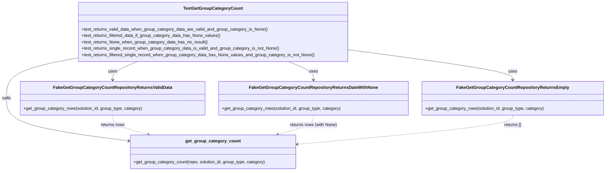
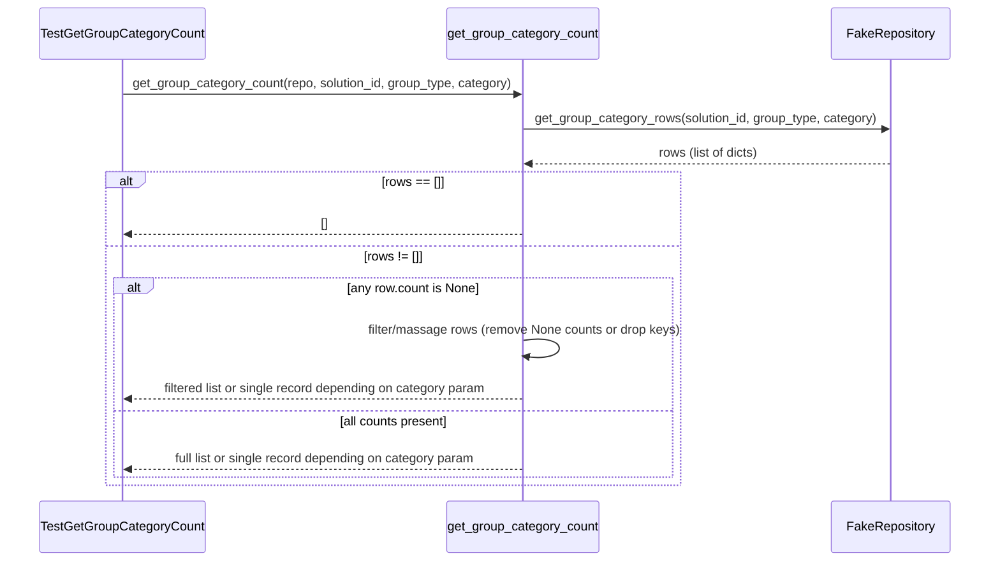

# Diagram: entity_core/entity_service/entity_service_tests/get_group_category_tests/test_get_group_category.py

> Auto-generated by Obscura crawlers

## Diagram 1

### SVG

<svg id="container" width="2221.3125" xmlns="http://www.w3.org/2000/svg" class="classDiagram" height="638" viewBox="0 0 2221.3125 638" role="graphics-document document" aria-roledescription="class"><g><defs><marker id="container_class-aggregationStart" class="marker aggregation class" refX="18" refY="7" markerWidth="190" markerHeight="240" orient="auto"><path d="M 18,7 L9,13 L1,7 L9,1 Z"></path></marker></defs><defs><marker id="container_class-aggregationEnd" class="marker aggregation class" refX="1" refY="7" markerWidth="20" markerHeight="28" orient="auto"><path d="M 18,7 L9,13 L1,7 L9,1 Z"></path></marker></defs><defs><marker id="container_class-extensionStart" class="marker extension class" refX="18" refY="7" markerWidth="190" markerHeight="240" orient="auto"><path d="M 1,7 L18,13 V 1 Z"></path></marker></defs><defs><marker id="container_class-extensionEnd" class="marker extension class" refX="1" refY="7" markerWidth="20" markerHeight="28" orient="auto"><path d="M 1,1 V 13 L18,7 Z"></path></marker></defs><defs><marker id="container_class-compositionStart" class="marker composition class" refX="18" refY="7" markerWidth="190" markerHeight="240" orient="auto"><path d="M 18,7 L9,13 L1,7 L9,1 Z"></path></marker></defs><defs><marker id="container_class-compositionEnd" class="marker composition class" refX="1" refY="7" markerWidth="20" markerHeight="28" orient="auto"><path d="M 18,7 L9,13 L1,7 L9,1 Z"></path></marker></defs><defs><marker id="container_class-dependencyStart" class="marker dependency class" refX="6" refY="7" markerWidth="190" markerHeight="240" orient="auto"><path d="M 5,7 L9,13 L1,7 L9,1 Z"></path></marker></defs><defs><marker id="container_class-dependencyEnd" class="marker dependency class" refX="13" refY="7" markerWidth="20" markerHeight="28" orient="auto"><path d="M 18,7 L9,13 L14,7 L9,1 Z"></path></marker></defs><defs><marker id="container_class-lollipopStart" class="marker lollipop class" refX="13" refY="7" markerWidth="190" markerHeight="240" orient="auto"><circle stroke="black" fill="transparent" cx="7" cy="7" r="6"></circle></marker></defs><defs><marker id="container_class-lollipopEnd" class="marker lollipop class" refX="1" refY="7" markerWidth="190" markerHeight="240" orient="auto"><circle stroke="black" fill="transparent" cx="7" cy="7" r="6"></circle></marker></defs><g class="root"><g class="clusters"></g><g class="edgePaths"><path d="M506.517,230L491.181,236.167C475.846,242.333,445.175,254.667,429.839,266C414.504,277.333,414.504,287.667,414.504,292.833L414.504,298" id="id_TestGetGroupCategoryCount_FakeGetGroupCategoryCountRepositoryReturnsValidData_1" class="edge-thickness-normal edge-pattern-solid relation" style=";;;" data-edge="true" data-et="edge" data-id="id_TestGetGroupCategoryCount_FakeGetGroupCategoryCountRepositoryReturnsValidData_1" data-points="W3sieCI6NTA2LjUxNjYwMTU2MjUsInkiOjIzMH0seyJ4Ijo0MTQuNTAzOTA2MjUsInkiOjI2N30seyJ4Ijo0MTQuNTAzOTA2MjUsInkiOjMwNH1d" marker-end="url(#container_class-dependencyEnd)"></path><path d="M1058.593,230L1073.928,236.167C1089.264,242.333,1119.935,254.667,1135.27,266C1150.605,277.333,1150.605,287.667,1150.605,292.833L1150.605,298" id="id_TestGetGroupCategoryCount_FakeGetGroupCategoryCountRepositoryReturnsDateWithNone_2" class="edge-thickness-normal edge-pattern-solid relation" style=";;;" data-edge="true" data-et="edge" data-id="id_TestGetGroupCategoryCount_FakeGetGroupCategoryCountRepositoryReturnsDateWithNone_2" data-points="W3sieCI6MTA1OC41OTI3NzM0Mzc1LCJ5IjoyMzB9LHsieCI6MTE1MC42MDU0Njg3NSwieSI6MjY3fSx7IngiOjExNTAuNjA1NDY4NzUsInkiOjMwNH1d" marker-end="url(#container_class-dependencyEnd)"></path><path d="M1280.527,186.113L1380.557,199.594C1480.586,213.075,1680.645,240.038,1780.674,258.685C1880.703,277.333,1880.703,287.667,1880.703,292.833L1880.703,298" id="id_TestGetGroupCategoryCount_FakeGetGroupCategoryCountRepositoryReturnsEmpty_3" class="edge-thickness-normal edge-pattern-solid relation" style=";;;" data-edge="true" data-et="edge" data-id="id_TestGetGroupCategoryCount_FakeGetGroupCategoryCountRepositoryReturnsEmpty_3" data-points="W3sieCI6MTI4MC41MjczNDM3NSwieSI6MTg2LjExMjkyNDQ1MzgwMzYzfSx7IngiOjE4ODAuNzAzMTI1LCJ5IjoyNjd9LHsieCI6MTg4MC43MDMxMjUsInkiOjMwNH1d" marker-end="url(#container_class-dependencyEnd)"></path><path d="M284.582,216.215L241.226,224.68C197.87,233.144,111.158,250.072,67.801,275.203C24.445,300.333,24.445,333.667,24.445,367C24.445,400.333,24.445,433.667,98.624,460.118C172.804,486.57,321.162,506.139,395.341,515.924L469.52,525.709" id="id_TestGetGroupCategoryCount_get_group_category_count_4" class="edge-thickness-normal edge-pattern-solid relation" style=";;;" data-edge="true" data-et="edge" data-id="id_TestGetGroupCategoryCount_get_group_category_count_4" data-points="W3sieCI6Mjg0LjU4MjAzMTI1LCJ5IjoyMTYuMjE1NDYxOTgzOTY1MDR9LHsieCI6MjQuNDQ1MzEyNSwieSI6MjY3fSx7IngiOjI0LjQ0NTMxMjUsInkiOjM2N30seyJ4IjoyNC40NDUzMTI1LCJ5Ijo0Njd9LHsieCI6NDc1LjQ2ODc1LCJ5Ijo1MjYuNDkzMTg4MjM1NTM2NX1d" marker-end="url(#container_class-dependencyEnd)"></path><path d="M414.504,430L414.504,436.167C414.504,442.333,414.504,454.667,436.235,466.738C457.967,478.809,501.43,490.618,523.161,496.522L544.893,502.427" id="id_FakeGetGroupCategoryCountRepositoryReturnsValidData_get_group_category_count_5" class="edge-thickness-normal edge-pattern-dashed relation" style=";;;" data-edge="true" data-et="edge" data-id="id_FakeGetGroupCategoryCountRepositoryReturnsValidData_get_group_category_count_5" data-points="W3sieCI6NDE0LjUwMzkwNjI1LCJ5Ijo0MzB9LHsieCI6NDE0LjUwMzkwNjI1LCJ5Ijo0Njd9LHsieCI6NTUwLjY4MjY5NTMxMjUsInkiOjUwNH1d" marker-end="url(#container_class-dependencyEnd)"></path><path d="M1150.605,430L1150.605,436.167C1150.605,442.333,1150.605,454.667,1128.874,466.738C1107.143,478.809,1063.68,490.618,1041.948,496.522L1020.217,502.427" id="id_FakeGetGroupCategoryCountRepositoryReturnsDateWithNone_get_group_category_count_6" class="edge-thickness-normal edge-pattern-dashed relation" style=";;;" data-edge="true" data-et="edge" data-id="id_FakeGetGroupCategoryCountRepositoryReturnsDateWithNone_get_group_category_count_6" data-points="W3sieCI6MTE1MC42MDU0Njg3NSwieSI6NDMwfSx7IngiOjExNTAuNjA1NDY4NzUsInkiOjQ2N30seyJ4IjoxMDE0LjQyNjY3OTY4NzUsInkiOjUwNH1d" marker-end="url(#container_class-dependencyEnd)"></path><path d="M1880.703,430L1880.703,436.167C1880.703,442.333,1880.703,454.667,1749.855,472.749C1619.007,490.831,1357.312,514.661,1226.464,526.577L1095.616,538.492" id="id_FakeGetGroupCategoryCountRepositoryReturnsEmpty_get_group_category_count_7" class="edge-thickness-normal edge-pattern-dashed relation" style=";;;" data-edge="true" data-et="edge" data-id="id_FakeGetGroupCategoryCountRepositoryReturnsEmpty_get_group_category_count_7" data-points="W3sieCI6MTg4MC43MDMxMjUsInkiOjQzMH0seyJ4IjoxODgwLjcwMzEyNSwieSI6NDY3fSx7IngiOjEwODkuNjQwNjI1LCJ5Ijo1MzkuMDM2MDI2NTUwMzcyNH1d" marker-end="url(#container_class-dependencyEnd)"></path></g><g class="edgeLabels"><g class="edgeLabel" transform="translate(414.50390625, 267)"><g class="label" data-id="id_TestGetGroupCategoryCount_FakeGetGroupCategoryCountRepositoryReturnsValidData_1" transform="translate(-16.4921875, -12)"><foreignObject width="32.984375" height="24">

uses

</foreignObject></g></g><g class="edgeLabel" transform="translate(1150.60546875, 267)"><g class="label" data-id="id_TestGetGroupCategoryCount_FakeGetGroupCategoryCountRepositoryReturnsDateWithNone_2" transform="translate(-16.4921875, -12)"><foreignObject width="32.984375" height="24">

uses

</foreignObject></g></g><g class="edgeLabel" transform="translate(1880.703125, 267)"><g class="label" data-id="id_TestGetGroupCategoryCount_FakeGetGroupCategoryCountRepositoryReturnsEmpty_3" transform="translate(-16.4921875, -12)"><foreignObject width="32.984375" height="24">

uses

</foreignObject></g></g><g class="edgeLabel" transform="translate(24.4453125, 367)"><g class="label" data-id="id_TestGetGroupCategoryCount_get_group_category_count_4" transform="translate(-16.4453125, -12)"><foreignObject width="32.890625" height="24">

calls

</foreignObject></g></g><g class="edgeLabel" transform="translate(414.50390625, 467)"><g class="label" data-id="id_FakeGetGroupCategoryCountRepositoryReturnsValidData_get_group_category_count_5" transform="translate(-45.3828125, -12)"><foreignObject width="90.765625" height="24">

returns rows

</foreignObject></g></g><g class="edgeLabel" transform="translate(1150.60546875, 467)"><g class="label" data-id="id_FakeGetGroupCategoryCountRepositoryReturnsDateWithNone_get_group_category_count_6" transform="translate(-89.5546875, -12)"><foreignObject width="179.109375" height="24">

returns rows (with None)

</foreignObject></g></g><g class="edgeLabel" transform="translate(1880.703125, 467)"><g class="label" data-id="id_FakeGetGroupCategoryCountRepositoryReturnsEmpty_get_group_category_count_7" transform="translate(-33.5390625, -12)"><foreignObject width="67.078125" height="24">

returns []

</foreignObject></g></g></g><g class="nodes"><g class="node default" id="classId-TestGetGroupCategoryCount-0" transform="translate(782.5546875, 119)"><g class="basic label-container"><path d="M-497.97265625 -111 L497.97265625 -111 L497.97265625 111 L-497.97265625 111" stroke="none" stroke-width="0" fill="#ECECFF" style=""></path><path d="M-497.97265625 -111 C-232.22462103329212 -111, 33.52341418341575 -111, 497.97265625 -111 M-497.97265625 -111 C-177.57763824104694 -111, 142.81737976790612 -111, 497.97265625 -111 M497.97265625 -111 C497.97265625 -49.17971025291541, 497.97265625 12.640579494169174, 497.97265625 111 M497.97265625 -111 C497.97265625 -56.29432975880001, 497.97265625 -1.5886595176000213, 497.97265625 111 M497.97265625 111 C119.54813275861147 111, -258.87639073277705 111, -497.97265625 111 M497.97265625 111 C178.8392249223823 111, -140.2942064052354 111, -497.97265625 111 M-497.97265625 111 C-497.97265625 22.242566763781156, -497.97265625 -66.51486647243769, -497.97265625 -111 M-497.97265625 111 C-497.97265625 55.22982548877157, -497.97265625 -0.5403490224568657, -497.97265625 -111" stroke="#9370DB" stroke-width="1.3" fill="none" stroke-dasharray="0 0" style=""></path></g><g class="annotation-group text" transform="translate(0, -87)"></g><g class="label-group text" transform="translate(-103.9765625, -87)"><g class="label" style="font-weight: bolder" transform="translate(0,-12)"><foreignObject width="207.953125" height="24">

TestGetGroupCategoryCount

</foreignObject></g></g><g class="members-group text" transform="translate(-485.97265625, -39)"></g><g class="methods-group text" transform="translate(-485.97265625, -9)"><g class="label" style="" transform="translate(0,-12)"><foreignObject width="692.6875" height="24">

+test_returns_valid_data_when_group_category_data_are_valid_and_group_category_is_None()

</foreignObject></g><g class="label" style="" transform="translate(0,12)"><foreignObject width="519.125" height="24">

+test_returns_filtered_data_if_group_category_data_has_None_values()

</foreignObject></g><g class="label" style="" transform="translate(0,36)"><foreignObject width="470.109375" height="24">

+test_returns_None_when_group_category_data_has_no_result()

</foreignObject></g><g class="label" style="" transform="translate(0,60)"><foreignObject width="736.953125" height="24">

+test_returns_single_record_when_group_category_data_is_valid_and_group_category_is_not_None()

</foreignObject></g><g class="label" style="" transform="translate(0,84)"><foreignObject width="867.96875" height="24">

+test_returns_filtered_single_record_when_group_category_data_has_None_values_and_group_category_is_not_None()

</foreignObject></g></g><g class="divider" style=""><path d="M-497.97265625 -63 C-123.39713888249793 -63, 251.17837848500415 -63, 497.97265625 -63 M-497.97265625 -63 C-234.74038062320767 -63, 28.49189500358466 -63, 497.97265625 -63" stroke="#9370DB" stroke-width="1.3" fill="none" stroke-dasharray="0 0" style=""></path></g><g class="divider" style=""><path d="M-497.97265625 -39 C-111.98172843883526 -39, 274.0091993723295 -39, 497.97265625 -39 M-497.97265625 -39 C-164.74443527472022 -39, 168.48378570055957 -39, 497.97265625 -39" stroke="#9370DB" stroke-width="1.3" fill="none" stroke-dasharray="0 0" style=""></path></g></g><g class="node default" id="classId-FakeGetGroupCategoryCountRepositoryReturnsValidData-1" transform="translate(414.50390625, 367)"><g class="basic label-container"><path d="M-338.61328125 -63 L338.61328125 -63 L338.61328125 63 L-338.61328125 63" stroke="none" stroke-width="0" fill="#ECECFF" style=""></path><path d="M-338.61328125 -63 C-125.04701449267313 -63, 88.51925226465374 -63, 338.61328125 -63 M-338.61328125 -63 C-167.45557509085486 -63, 3.702131068290271 -63, 338.61328125 -63 M338.61328125 -63 C338.61328125 -23.48285933919582, 338.61328125 16.03428132160836, 338.61328125 63 M338.61328125 -63 C338.61328125 -37.56743234736404, 338.61328125 -12.13486469472808, 338.61328125 63 M338.61328125 63 C187.97144212838268 63, 37.32960300676535 63, -338.61328125 63 M338.61328125 63 C105.19586364072649 63, -128.22155396854703 63, -338.61328125 63 M-338.61328125 63 C-338.61328125 19.92490731002316, -338.61328125 -23.150185379953683, -338.61328125 -63 M-338.61328125 63 C-338.61328125 31.8863009254513, -338.61328125 0.7726018509026034, -338.61328125 -63" stroke="#9370DB" stroke-width="1.3" fill="none" stroke-dasharray="0 0" style=""></path></g><g class="annotation-group text" transform="translate(0, -39)"></g><g class="label-group text" transform="translate(-208.4765625, -39)"><g class="label" style="font-weight: bolder" transform="translate(0,-12)"><foreignObject width="416.953125" height="24">

FakeGetGroupCategoryCountRepositoryReturnsValidData

</foreignObject></g></g><g class="members-group text" transform="translate(-326.61328125, 9)"></g><g class="methods-group text" transform="translate(-326.61328125, 39)"><g class="label" style="" transform="translate(0,-12)"><foreignObject width="444.75" height="24">

+get_group_category_rows(solution_id, group_type, category)

</foreignObject></g></g><g class="divider" style=""><path d="M-338.61328125 -15 C-168.8970997141183 -15, 0.8190818217634046 -15, 338.61328125 -15 M-338.61328125 -15 C-84.6990597874306 -15, 169.2151616751388 -15, 338.61328125 -15" stroke="#9370DB" stroke-width="1.3" fill="none" stroke-dasharray="0 0" style=""></path></g><g class="divider" style=""><path d="M-338.61328125 9 C-73.15534052980496 9, 192.30260019039008 9, 338.61328125 9 M-338.61328125 9 C-128.4412976492316 9, 81.73068595153683 9, 338.61328125 9" stroke="#9370DB" stroke-width="1.3" fill="none" stroke-dasharray="0 0" style=""></path></g></g><g class="node default" id="classId-FakeGetGroupCategoryCountRepositoryReturnsDateWithNone-2" transform="translate(1150.60546875, 367)"><g class="basic label-container"><path d="M-347.48828125 -63 L347.48828125 -63 L347.48828125 63 L-347.48828125 63" stroke="none" stroke-width="0" fill="#ECECFF" style=""></path><path d="M-347.48828125 -63 C-108.84758722830651 -63, 129.79310679338698 -63, 347.48828125 -63 M-347.48828125 -63 C-182.28034554997652 -63, -17.072409849953033 -63, 347.48828125 -63 M347.48828125 -63 C347.48828125 -26.880335973046662, 347.48828125 9.239328053906675, 347.48828125 63 M347.48828125 -63 C347.48828125 -18.613268241346752, 347.48828125 25.773463517306496, 347.48828125 63 M347.48828125 63 C158.44207712176785 63, -30.604127006464296 63, -347.48828125 63 M347.48828125 63 C197.08360412652272 63, 46.67892700304543 63, -347.48828125 63 M-347.48828125 63 C-347.48828125 13.555444753109306, -347.48828125 -35.88911049378139, -347.48828125 -63 M-347.48828125 63 C-347.48828125 18.82070398892813, -347.48828125 -25.35859202214374, -347.48828125 -63" stroke="#9370DB" stroke-width="1.3" fill="none" stroke-dasharray="0 0" style=""></path></g><g class="annotation-group text" transform="translate(0, -39)"></g><g class="label-group text" transform="translate(-226.2265625, -39)"><g class="label" style="font-weight: bolder" transform="translate(0,-12)"><foreignObject width="452.453125" height="24">

FakeGetGroupCategoryCountRepositoryReturnsDateWithNone

</foreignObject></g></g><g class="members-group text" transform="translate(-335.48828125, 9)"></g><g class="methods-group text" transform="translate(-335.48828125, 39)"><g class="label" style="" transform="translate(0,-12)"><foreignObject width="444.75" height="24">

+get_group_category_rows(solution_id, group_type, category)

</foreignObject></g></g><g class="divider" style=""><path d="M-347.48828125 -15 C-176.2193849084441 -15, -4.950488566888225 -15, 347.48828125 -15 M-347.48828125 -15 C-121.37993855445808 -15, 104.72840414108384 -15, 347.48828125 -15" stroke="#9370DB" stroke-width="1.3" fill="none" stroke-dasharray="0 0" style=""></path></g><g class="divider" style=""><path d="M-347.48828125 9 C-83.62829917686167 9, 180.23168289627665 9, 347.48828125 9 M-347.48828125 9 C-180.19557321762332 9, -12.90286518524664 9, 347.48828125 9" stroke="#9370DB" stroke-width="1.3" fill="none" stroke-dasharray="0 0" style=""></path></g></g><g class="node default" id="classId-FakeGetGroupCategoryCountRepositoryReturnsEmpty-3" transform="translate(1880.703125, 367)"><g class="basic label-container"><path d="M-332.609375 -63 L332.609375 -63 L332.609375 63 L-332.609375 63" stroke="none" stroke-width="0" fill="#ECECFF" style=""></path><path d="M-332.609375 -63 C-110.75534588252248 -63, 111.09868323495505 -63, 332.609375 -63 M-332.609375 -63 C-94.30790532518807 -63, 143.99356434962385 -63, 332.609375 -63 M332.609375 -63 C332.609375 -18.755697741240752, 332.609375 25.488604517518496, 332.609375 63 M332.609375 -63 C332.609375 -18.564757672101223, 332.609375 25.870484655797554, 332.609375 63 M332.609375 63 C104.87774088598042 63, -122.85389322803917 63, -332.609375 63 M332.609375 63 C106.30076792450157 63, -120.00783915099686 63, -332.609375 63 M-332.609375 63 C-332.609375 25.165622736384805, -332.609375 -12.66875452723039, -332.609375 -63 M-332.609375 63 C-332.609375 36.163615478260574, -332.609375 9.327230956521149, -332.609375 -63" stroke="#9370DB" stroke-width="1.3" fill="none" stroke-dasharray="0 0" style=""></path></g><g class="annotation-group text" transform="translate(0, -39)"></g><g class="label-group text" transform="translate(-196.46875, -39)"><g class="label" style="font-weight: bolder" transform="translate(0,-12)"><foreignObject width="392.9375" height="24">

FakeGetGroupCategoryCountRepositoryReturnsEmpty

</foreignObject></g></g><g class="members-group text" transform="translate(-320.609375, 9)"></g><g class="methods-group text" transform="translate(-320.609375, 39)"><g class="label" style="" transform="translate(0,-12)"><foreignObject width="444.75" height="24">

+get_group_category_rows(solution_id, group_type, category)

</foreignObject></g></g><g class="divider" style=""><path d="M-332.609375 -15 C-157.32994874208012 -15, 17.94947751583976 -15, 332.609375 -15 M-332.609375 -15 C-121.34096918099212 -15, 89.92743663801576 -15, 332.609375 -15" stroke="#9370DB" stroke-width="1.3" fill="none" stroke-dasharray="0 0" style=""></path></g><g class="divider" style=""><path d="M-332.609375 9 C-188.22592907894605 9, -43.842483157892104 9, 332.609375 9 M-332.609375 9 C-154.32007816661044 9, 23.969218666779113 9, 332.609375 9" stroke="#9370DB" stroke-width="1.3" fill="none" stroke-dasharray="0 0" style=""></path></g></g><g class="node default" id="classId-get_group_category_count-4" transform="translate(782.5546875, 567)"><g class="basic label-container"><path d="M-307.0859375 -63 L307.0859375 -63 L307.0859375 63 L-307.0859375 63" stroke="none" stroke-width="0" fill="#ECECFF" style=""></path><path d="M-307.0859375 -63 C-76.42546645705207 -63, 154.23500458589587 -63, 307.0859375 -63 M-307.0859375 -63 C-147.004907852737 -63, 13.076121794525989 -63, 307.0859375 -63 M307.0859375 -63 C307.0859375 -26.9729940390066, 307.0859375 9.054011921986799, 307.0859375 63 M307.0859375 -63 C307.0859375 -36.078727098315085, 307.0859375 -9.15745419663017, 307.0859375 63 M307.0859375 63 C63.85014197877612 63, -179.38565354244776 63, -307.0859375 63 M307.0859375 63 C77.78975387608489 63, -151.50642974783023 63, -307.0859375 63 M-307.0859375 63 C-307.0859375 30.41788117861187, -307.0859375 -2.164237642776257, -307.0859375 -63 M-307.0859375 63 C-307.0859375 14.461904473705196, -307.0859375 -34.07619105258961, -307.0859375 -63" stroke="#9370DB" stroke-width="1.3" fill="none" stroke-dasharray="0 0" style=""></path></g><g class="annotation-group text" transform="translate(0, -39)"></g><g class="label-group text" transform="translate(-97.40625, -39)"><g class="label" style="font-weight: bolder" transform="translate(0,-12)"><foreignObject width="194.8125" height="24">

get_group_category_count

</foreignObject></g></g><g class="members-group text" transform="translate(-295.0859375, 9)"></g><g class="methods-group text" transform="translate(-295.0859375, 39)"><g class="label" style="" transform="translate(0,-12)"><foreignObject width="492.765625" height="24">

+get_group_category_count(repo, solution_id, group_type, category)

</foreignObject></g></g><g class="divider" style=""><path d="M-307.0859375 -15 C-156.87270165135826 -15, -6.659465802716511 -15, 307.0859375 -15 M-307.0859375 -15 C-156.42654324709437 -15, -5.767148994188744 -15, 307.0859375 -15" stroke="#9370DB" stroke-width="1.3" fill="none" stroke-dasharray="0 0" style=""></path></g><g class="divider" style=""><path d="M-307.0859375 9 C-92.42815933416682 9, 122.22961883166636 9, 307.0859375 9 M-307.0859375 9 C-75.6325660666343 9, 155.8208053667314 9, 307.0859375 9" stroke="#9370DB" stroke-width="1.3" fill="none" stroke-dasharray="0 0" style=""></path></g></g></g></g></g></svg>

## Diagram 2

### SVG

<svg id="container" width="1349" xmlns="http://www.w3.org/2000/svg" height="737" viewBox="-50 -10 1349 737" role="graphics-document document" aria-roledescription="sequence"><g><rect x="1099" y="651" fill="#eaeaea" stroke="#666" width="150" height="65" name="Repo" rx="3" ry="3" class="actor actor-bottom"></rect><text x="1174" y="683.5" dominant-baseline="central" alignment-baseline="central" class="actor actor-box" style="text-anchor: middle; font-size: 16px; font-weight: 400;"><tspan x="1174" dy="0">FakeRepository</tspan></text></g><g><rect x="561" y="651" fill="#eaeaea" stroke="#666" width="212" height="65" name="Get" rx="3" ry="3" class="actor actor-bottom"></rect><text x="667" y="683.5" dominant-baseline="central" alignment-baseline="central" class="actor actor-box" style="text-anchor: middle; font-size: 16px; font-weight: 400;"><tspan x="667" dy="0">get_group_category_count</tspan></text></g><g><rect x="0" y="651" fill="#eaeaea" stroke="#666" width="224" height="65" name="Test" rx="3" ry="3" class="actor actor-bottom"></rect><text x="112" y="683.5" dominant-baseline="central" alignment-baseline="central" class="actor actor-box" style="text-anchor: middle; font-size: 16px; font-weight: 400;"><tspan x="112" dy="0">TestGetGroupCategoryCount</tspan></text></g><g><line id="actor2" x1="1174" y1="65" x2="1174" y2="651" class="actor-line 200" stroke-width="0.5px" stroke="#999" name="Repo"></line><g id="root-2"><rect x="1099" y="0" fill="#eaeaea" stroke="#666" width="150" height="65" name="Repo" rx="3" ry="3" class="actor actor-top"></rect><text x="1174" y="32.5" dominant-baseline="central" alignment-baseline="central" class="actor actor-box" style="text-anchor: middle; font-size: 16px; font-weight: 400;"><tspan x="1174" dy="0">FakeRepository</tspan></text></g></g><g><line id="actor1" x1="667" y1="65" x2="667" y2="651" class="actor-line 200" stroke-width="0.5px" stroke="#999" name="Get"></line><g id="root-1"><rect x="561" y="0" fill="#eaeaea" stroke="#666" width="212" height="65" name="Get" rx="3" ry="3" class="actor actor-top"></rect><text x="667" y="32.5" dominant-baseline="central" alignment-baseline="central" class="actor actor-box" style="text-anchor: middle; font-size: 16px; font-weight: 400;"><tspan x="667" dy="0">get_group_category_count</tspan></text></g></g><g><line id="actor0" x1="112" y1="65" x2="112" y2="651" class="actor-line 200" stroke-width="0.5px" stroke="#999" name="Test"></line><g id="root-0"><rect x="0" y="0" fill="#eaeaea" stroke="#666" width="224" height="65" name="Test" rx="3" ry="3" class="actor actor-top"></rect><text x="112" y="32.5" dominant-baseline="central" alignment-baseline="central" class="actor actor-box" style="text-anchor: middle; font-size: 16px; font-weight: 400;"><tspan x="112" dy="0">TestGetGroupCategoryCount</tspan></text></g></g><g></g><defs><symbol id="computer" width="24" height="24"><path transform="scale(.5)" d="M2 2v13h20v-13h-20zm18 11h-16v-9h16v9zm-10.228 6l.466-1h3.524l.467 1h-4.457zm14.228 3h-24l2-6h2.104l-1.33 4h18.45l-1.297-4h2.073l2 6zm-5-10h-14v-7h14v7z"></path></symbol></defs><defs><symbol id="database" fill-rule="evenodd" clip-rule="evenodd"><path transform="scale(.5)" d="M12.258.001l.256.004.255.005.253.008.251.01.249.012.247.015.246.016.242.019.241.02.239.023.236.024.233.027.231.028.229.031.225.032.223.034.22.036.217.038.214.04.211.041.208.043.205.045.201.046.198.048.194.05.191.051.187.053.183.054.18.056.175.057.172.059.168.06.163.061.16.063.155.064.15.066.074.033.073.033.071.034.07.034.069.035.068.035.067.035.066.035.064.036.064.036.062.036.06.036.06.037.058.037.058.037.055.038.055.038.053.038.052.038.051.039.05.039.048.039.047.039.045.04.044.04.043.04.041.04.04.041.039.041.037.041.036.041.034.041.033.042.032.042.03.042.029.042.027.042.026.043.024.043.023.043.021.043.02.043.018.044.017.043.015.044.013.044.012.044.011.045.009.044.007.045.006.045.004.045.002.045.001.045v17l-.001.045-.002.045-.004.045-.006.045-.007.045-.009.044-.011.045-.012.044-.013.044-.015.044-.017.043-.018.044-.02.043-.021.043-.023.043-.024.043-.026.043-.027.042-.029.042-.03.042-.032.042-.033.042-.034.041-.036.041-.037.041-.039.041-.04.041-.041.04-.043.04-.044.04-.045.04-.047.039-.048.039-.05.039-.051.039-.052.038-.053.038-.055.038-.055.038-.058.037-.058.037-.06.037-.06.036-.062.036-.064.036-.064.036-.066.035-.067.035-.068.035-.069.035-.07.034-.071.034-.073.033-.074.033-.15.066-.155.064-.16.063-.163.061-.168.06-.172.059-.175.057-.18.056-.183.054-.187.053-.191.051-.194.05-.198.048-.201.046-.205.045-.208.043-.211.041-.214.04-.217.038-.22.036-.223.034-.225.032-.229.031-.231.028-.233.027-.236.024-.239.023-.241.02-.242.019-.246.016-.247.015-.249.012-.251.01-.253.008-.255.005-.256.004-.258.001-.258-.001-.256-.004-.255-.005-.253-.008-.251-.01-.249-.012-.247-.015-.245-.016-.243-.019-.241-.02-.238-.023-.236-.024-.234-.027-.231-.028-.228-.031-.226-.032-.223-.034-.22-.036-.217-.038-.214-.04-.211-.041-.208-.043-.204-.045-.201-.046-.198-.048-.195-.05-.19-.051-.187-.053-.184-.054-.179-.056-.176-.057-.172-.059-.167-.06-.164-.061-.159-.063-.155-.064-.151-.066-.074-.033-.072-.033-.072-.034-.07-.034-.069-.035-.068-.035-.067-.035-.066-.035-.064-.036-.063-.036-.062-.036-.061-.036-.06-.037-.058-.037-.057-.037-.056-.038-.055-.038-.053-.038-.052-.038-.051-.039-.049-.039-.049-.039-.046-.039-.046-.04-.044-.04-.043-.04-.041-.04-.04-.041-.039-.041-.037-.041-.036-.041-.034-.041-.033-.042-.032-.042-.03-.042-.029-.042-.027-.042-.026-.043-.024-.043-.023-.043-.021-.043-.02-.043-.018-.044-.017-.043-.015-.044-.013-.044-.012-.044-.011-.045-.009-.044-.007-.045-.006-.045-.004-.045-.002-.045-.001-.045v-17l.001-.045.002-.045.004-.045.006-.045.007-.045.009-.044.011-.045.012-.044.013-.044.015-.044.017-.043.018-.044.02-.043.021-.043.023-.043.024-.043.026-.043.027-.042.029-.042.03-.042.032-.042.033-.042.034-.041.036-.041.037-.041.039-.041.04-.041.041-.04.043-.04.044-.04.046-.04.046-.039.049-.039.049-.039.051-.039.052-.038.053-.038.055-.038.056-.038.057-.037.058-.037.06-.037.061-.036.062-.036.063-.036.064-.036.066-.035.067-.035.068-.035.069-.035.07-.034.072-.034.072-.033.074-.033.151-.066.155-.064.159-.063.164-.061.167-.06.172-.059.176-.057.179-.056.184-.054.187-.053.19-.051.195-.05.198-.048.201-.046.204-.045.208-.043.211-.041.214-.04.217-.038.22-.036.223-.034.226-.032.228-.031.231-.028.234-.027.236-.024.238-.023.241-.02.243-.019.245-.016.247-.015.249-.012.251-.01.253-.008.255-.005.256-.004.258-.001.258.001zm-9.258 20.499v.01l.001.021.003.021.004.022.005.021.006.022.007.022.009.023.01.022.011.023.012.023.013.023.015.023.016.024.017.023.018.024.019.024.021.024.022.025.023.024.024.025.052.049.056.05.061.051.066.051.07.051.075.051.079.052.084.052.088.052.092.052.097.052.102.051.105.052.11.052.114.051.119.051.123.051.127.05.131.05.135.05.139.048.144.049.147.047.152.047.155.047.16.045.163.045.167.043.171.043.176.041.178.041.183.039.187.039.19.037.194.035.197.035.202.033.204.031.209.03.212.029.216.027.219.025.222.024.226.021.23.02.233.018.236.016.24.015.243.012.246.01.249.008.253.005.256.004.259.001.26-.001.257-.004.254-.005.25-.008.247-.011.244-.012.241-.014.237-.016.233-.018.231-.021.226-.021.224-.024.22-.026.216-.027.212-.028.21-.031.205-.031.202-.034.198-.034.194-.036.191-.037.187-.039.183-.04.179-.04.175-.042.172-.043.168-.044.163-.045.16-.046.155-.046.152-.047.148-.048.143-.049.139-.049.136-.05.131-.05.126-.05.123-.051.118-.052.114-.051.11-.052.106-.052.101-.052.096-.052.092-.052.088-.053.083-.051.079-.052.074-.052.07-.051.065-.051.06-.051.056-.05.051-.05.023-.024.023-.025.021-.024.02-.024.019-.024.018-.024.017-.024.015-.023.014-.024.013-.023.012-.023.01-.023.01-.022.008-.022.006-.022.006-.022.004-.022.004-.021.001-.021.001-.021v-4.127l-.077.055-.08.053-.083.054-.085.053-.087.052-.09.052-.093.051-.095.05-.097.05-.1.049-.102.049-.105.048-.106.047-.109.047-.111.046-.114.045-.115.045-.118.044-.12.043-.122.042-.124.042-.126.041-.128.04-.13.04-.132.038-.134.038-.135.037-.138.037-.139.035-.142.035-.143.034-.144.033-.147.032-.148.031-.15.03-.151.03-.153.029-.154.027-.156.027-.158.026-.159.025-.161.024-.162.023-.163.022-.165.021-.166.02-.167.019-.169.018-.169.017-.171.016-.173.015-.173.014-.175.013-.175.012-.177.011-.178.01-.179.008-.179.008-.181.006-.182.005-.182.004-.184.003-.184.002h-.37l-.184-.002-.184-.003-.182-.004-.182-.005-.181-.006-.179-.008-.179-.008-.178-.01-.176-.011-.176-.012-.175-.013-.173-.014-.172-.015-.171-.016-.17-.017-.169-.018-.167-.019-.166-.02-.165-.021-.163-.022-.162-.023-.161-.024-.159-.025-.157-.026-.156-.027-.155-.027-.153-.029-.151-.03-.15-.03-.148-.031-.146-.032-.145-.033-.143-.034-.141-.035-.14-.035-.137-.037-.136-.037-.134-.038-.132-.038-.13-.04-.128-.04-.126-.041-.124-.042-.122-.042-.12-.044-.117-.043-.116-.045-.113-.045-.112-.046-.109-.047-.106-.047-.105-.048-.102-.049-.1-.049-.097-.05-.095-.05-.093-.052-.09-.051-.087-.052-.085-.053-.083-.054-.08-.054-.077-.054v4.127zm0-5.654v.011l.001.021.003.021.004.021.005.022.006.022.007.022.009.022.01.022.011.023.012.023.013.023.015.024.016.023.017.024.018.024.019.024.021.024.022.024.023.025.024.024.052.05.056.05.061.05.066.051.07.051.075.052.079.051.084.052.088.052.092.052.097.052.102.052.105.052.11.051.114.051.119.052.123.05.127.051.131.05.135.049.139.049.144.048.147.048.152.047.155.046.16.045.163.045.167.044.171.042.176.042.178.04.183.04.187.038.19.037.194.036.197.034.202.033.204.032.209.03.212.028.216.027.219.025.222.024.226.022.23.02.233.018.236.016.24.014.243.012.246.01.249.008.253.006.256.003.259.001.26-.001.257-.003.254-.006.25-.008.247-.01.244-.012.241-.015.237-.016.233-.018.231-.02.226-.022.224-.024.22-.025.216-.027.212-.029.21-.03.205-.032.202-.033.198-.035.194-.036.191-.037.187-.039.183-.039.179-.041.175-.042.172-.043.168-.044.163-.045.16-.045.155-.047.152-.047.148-.048.143-.048.139-.05.136-.049.131-.05.126-.051.123-.051.118-.051.114-.052.11-.052.106-.052.101-.052.096-.052.092-.052.088-.052.083-.052.079-.052.074-.051.07-.052.065-.051.06-.05.056-.051.051-.049.023-.025.023-.024.021-.025.02-.024.019-.024.018-.024.017-.024.015-.023.014-.023.013-.024.012-.022.01-.023.01-.023.008-.022.006-.022.006-.022.004-.021.004-.022.001-.021.001-.021v-4.139l-.077.054-.08.054-.083.054-.085.052-.087.053-.09.051-.093.051-.095.051-.097.05-.1.049-.102.049-.105.048-.106.047-.109.047-.111.046-.114.045-.115.044-.118.044-.12.044-.122.042-.124.042-.126.041-.128.04-.13.039-.132.039-.134.038-.135.037-.138.036-.139.036-.142.035-.143.033-.144.033-.147.033-.148.031-.15.03-.151.03-.153.028-.154.028-.156.027-.158.026-.159.025-.161.024-.162.023-.163.022-.165.021-.166.02-.167.019-.169.018-.169.017-.171.016-.173.015-.173.014-.175.013-.175.012-.177.011-.178.009-.179.009-.179.007-.181.007-.182.005-.182.004-.184.003-.184.002h-.37l-.184-.002-.184-.003-.182-.004-.182-.005-.181-.007-.179-.007-.179-.009-.178-.009-.176-.011-.176-.012-.175-.013-.173-.014-.172-.015-.171-.016-.17-.017-.169-.018-.167-.019-.166-.02-.165-.021-.163-.022-.162-.023-.161-.024-.159-.025-.157-.026-.156-.027-.155-.028-.153-.028-.151-.03-.15-.03-.148-.031-.146-.033-.145-.033-.143-.033-.141-.035-.14-.036-.137-.036-.136-.037-.134-.038-.132-.039-.13-.039-.128-.04-.126-.041-.124-.042-.122-.043-.12-.043-.117-.044-.116-.044-.113-.046-.112-.046-.109-.046-.106-.047-.105-.048-.102-.049-.1-.049-.097-.05-.095-.051-.093-.051-.09-.051-.087-.053-.085-.052-.083-.054-.08-.054-.077-.054v4.139zm0-5.666v.011l.001.02.003.022.004.021.005.022.006.021.007.022.009.023.01.022.011.023.012.023.013.023.015.023.016.024.017.024.018.023.019.024.021.025.022.024.023.024.024.025.052.05.056.05.061.05.066.051.07.051.075.052.079.051.084.052.088.052.092.052.097.052.102.052.105.051.11.052.114.051.119.051.123.051.127.05.131.05.135.05.139.049.144.048.147.048.152.047.155.046.16.045.163.045.167.043.171.043.176.042.178.04.183.04.187.038.19.037.194.036.197.034.202.033.204.032.209.03.212.028.216.027.219.025.222.024.226.021.23.02.233.018.236.017.24.014.243.012.246.01.249.008.253.006.256.003.259.001.26-.001.257-.003.254-.006.25-.008.247-.01.244-.013.241-.014.237-.016.233-.018.231-.02.226-.022.224-.024.22-.025.216-.027.212-.029.21-.03.205-.032.202-.033.198-.035.194-.036.191-.037.187-.039.183-.039.179-.041.175-.042.172-.043.168-.044.163-.045.16-.045.155-.047.152-.047.148-.048.143-.049.139-.049.136-.049.131-.051.126-.05.123-.051.118-.052.114-.051.11-.052.106-.052.101-.052.096-.052.092-.052.088-.052.083-.052.079-.052.074-.052.07-.051.065-.051.06-.051.056-.05.051-.049.023-.025.023-.025.021-.024.02-.024.019-.024.018-.024.017-.024.015-.023.014-.024.013-.023.012-.023.01-.022.01-.023.008-.022.006-.022.006-.022.004-.022.004-.021.001-.021.001-.021v-4.153l-.077.054-.08.054-.083.053-.085.053-.087.053-.09.051-.093.051-.095.051-.097.05-.1.049-.102.048-.105.048-.106.048-.109.046-.111.046-.114.046-.115.044-.118.044-.12.043-.122.043-.124.042-.126.041-.128.04-.13.039-.132.039-.134.038-.135.037-.138.036-.139.036-.142.034-.143.034-.144.033-.147.032-.148.032-.15.03-.151.03-.153.028-.154.028-.156.027-.158.026-.159.024-.161.024-.162.023-.163.023-.165.021-.166.02-.167.019-.169.018-.169.017-.171.016-.173.015-.173.014-.175.013-.175.012-.177.01-.178.01-.179.009-.179.007-.181.006-.182.006-.182.004-.184.003-.184.001-.185.001-.185-.001-.184-.001-.184-.003-.182-.004-.182-.006-.181-.006-.179-.007-.179-.009-.178-.01-.176-.01-.176-.012-.175-.013-.173-.014-.172-.015-.171-.016-.17-.017-.169-.018-.167-.019-.166-.02-.165-.021-.163-.023-.162-.023-.161-.024-.159-.024-.157-.026-.156-.027-.155-.028-.153-.028-.151-.03-.15-.03-.148-.032-.146-.032-.145-.033-.143-.034-.141-.034-.14-.036-.137-.036-.136-.037-.134-.038-.132-.039-.13-.039-.128-.041-.126-.041-.124-.041-.122-.043-.12-.043-.117-.044-.116-.044-.113-.046-.112-.046-.109-.046-.106-.048-.105-.048-.102-.048-.1-.05-.097-.049-.095-.051-.093-.051-.09-.052-.087-.052-.085-.053-.083-.053-.08-.054-.077-.054v4.153zm8.74-8.179l-.257.004-.254.005-.25.008-.247.011-.244.012-.241.014-.237.016-.233.018-.231.021-.226.022-.224.023-.22.026-.216.027-.212.028-.21.031-.205.032-.202.033-.198.034-.194.036-.191.038-.187.038-.183.04-.179.041-.175.042-.172.043-.168.043-.163.045-.16.046-.155.046-.152.048-.148.048-.143.048-.139.049-.136.05-.131.05-.126.051-.123.051-.118.051-.114.052-.11.052-.106.052-.101.052-.096.052-.092.052-.088.052-.083.052-.079.052-.074.051-.07.052-.065.051-.06.05-.056.05-.051.05-.023.025-.023.024-.021.024-.02.025-.019.024-.018.024-.017.023-.015.024-.014.023-.013.023-.012.023-.01.023-.01.022-.008.022-.006.023-.006.021-.004.022-.004.021-.001.021-.001.021.001.021.001.021.004.021.004.022.006.021.006.023.008.022.01.022.01.023.012.023.013.023.014.023.015.024.017.023.018.024.019.024.02.025.021.024.023.024.023.025.051.05.056.05.06.05.065.051.07.052.074.051.079.052.083.052.088.052.092.052.096.052.101.052.106.052.11.052.114.052.118.051.123.051.126.051.131.05.136.05.139.049.143.048.148.048.152.048.155.046.16.046.163.045.168.043.172.043.175.042.179.041.183.04.187.038.191.038.194.036.198.034.202.033.205.032.21.031.212.028.216.027.22.026.224.023.226.022.231.021.233.018.237.016.241.014.244.012.247.011.25.008.254.005.257.004.26.001.26-.001.257-.004.254-.005.25-.008.247-.011.244-.012.241-.014.237-.016.233-.018.231-.021.226-.022.224-.023.22-.026.216-.027.212-.028.21-.031.205-.032.202-.033.198-.034.194-.036.191-.038.187-.038.183-.04.179-.041.175-.042.172-.043.168-.043.163-.045.16-.046.155-.046.152-.048.148-.048.143-.048.139-.049.136-.05.131-.05.126-.051.123-.051.118-.051.114-.052.11-.052.106-.052.101-.052.096-.052.092-.052.088-.052.083-.052.079-.052.074-.051.07-.052.065-.051.06-.05.056-.05.051-.05.023-.025.023-.024.021-.024.02-.025.019-.024.018-.024.017-.023.015-.024.014-.023.013-.023.012-.023.01-.023.01-.022.008-.022.006-.023.006-.021.004-.022.004-.021.001-.021.001-.021-.001-.021-.001-.021-.004-.021-.004-.022-.006-.021-.006-.023-.008-.022-.01-.022-.01-.023-.012-.023-.013-.023-.014-.023-.015-.024-.017-.023-.018-.024-.019-.024-.02-.025-.021-.024-.023-.024-.023-.025-.051-.05-.056-.05-.06-.05-.065-.051-.07-.052-.074-.051-.079-.052-.083-.052-.088-.052-.092-.052-.096-.052-.101-.052-.106-.052-.11-.052-.114-.052-.118-.051-.123-.051-.126-.051-.131-.05-.136-.05-.139-.049-.143-.048-.148-.048-.152-.048-.155-.046-.16-.046-.163-.045-.168-.043-.172-.043-.175-.042-.179-.041-.183-.04-.187-.038-.191-.038-.194-.036-.198-.034-.202-.033-.205-.032-.21-.031-.212-.028-.216-.027-.22-.026-.224-.023-.226-.022-.231-.021-.233-.018-.237-.016-.241-.014-.244-.012-.247-.011-.25-.008-.254-.005-.257-.004-.26-.001-.26.001z"></path></symbol></defs><defs><symbol id="clock" width="24" height="24"><path transform="scale(.5)" d="M12 2c5.514 0 10 4.486 10 10s-4.486 10-10 10-10-4.486-10-10 4.486-10 10-10zm0-2c-6.627 0-12 5.373-12 12s5.373 12 12 12 12-5.373 12-12-5.373-12-12-12zm5.848 12.459c.202.038.202.333.001.372-1.907.361-6.045 1.111-6.547 1.111-.719 0-1.301-.582-1.301-1.301 0-.512.77-5.447 1.125-7.445.034-.192.312-.181.343.014l.985 6.238 5.394 1.011z"></path></symbol></defs><defs><marker id="arrowhead" refX="7.9" refY="5" markerUnits="userSpaceOnUse" markerWidth="12" markerHeight="12" orient="auto-start-reverse"><path d="M -1 0 L 10 5 L 0 10 z"></path></marker></defs><defs><marker id="crosshead" markerWidth="15" markerHeight="8" orient="auto" refX="4" refY="4.5"><path fill="none" stroke="#000000" stroke-width="1pt" d="M 1,2 L 6,7 M 6,2 L 1,7" style="stroke-dasharray: 0, 0;"></path></marker></defs><defs><marker id="filled-head" refX="15.5" refY="7" markerWidth="20" markerHeight="28" orient="auto"><path d="M 18,7 L9,13 L14,7 L9,1 Z"></path></marker></defs><defs><marker id="sequencenumber" refX="15" refY="15" markerWidth="60" markerHeight="40" orient="auto"><circle cx="15" cy="15" r="6"></circle></marker></defs><g><line x1="101" y1="357" x2="878" y2="357" class="loopLine"></line><line x1="878" y1="357" x2="878" y2="621" class="loopLine"></line><line x1="101" y1="621" x2="878" y2="621" class="loopLine"></line><line x1="101" y1="357" x2="101" y2="621" class="loopLine"></line><line x1="101" y1="533" x2="878" y2="533" class="loopLine" style="stroke-dasharray: 3, 3;"></line><polygon points="101,357 151,357 151,370 142.6,377 101,377" class="labelBox"></polygon><text x="126" y="370" text-anchor="middle" dominant-baseline="middle" alignment-baseline="middle" class="labelText" style="font-size: 16px; font-weight: 400;">alt</text><text x="514.5" y="375" text-anchor="middle" class="loopText" style="font-size: 16px; font-weight: 400;"><tspan x="514.5">[any row.count is None]</tspan></text><text x="489.5" y="551" text-anchor="middle" class="loopText" style="font-size: 16px; font-weight: 400;">[all counts present]</text></g><g><line x1="91" y1="219" x2="888" y2="219" class="loopLine"></line><line x1="888" y1="219" x2="888" y2="631" class="loopLine"></line><line x1="91" y1="631" x2="888" y2="631" class="loopLine"></line><line x1="91" y1="219" x2="91" y2="631" class="loopLine"></line><line x1="91" y1="317" x2="888" y2="317" class="loopLine" style="stroke-dasharray: 3, 3;"></line><polygon points="91,219 141,219 141,232 132.6,239 91,239" class="labelBox"></polygon><text x="116" y="232" text-anchor="middle" dominant-baseline="middle" alignment-baseline="middle" class="labelText" style="font-size: 16px; font-weight: 400;">alt</text><text x="514.5" y="237" text-anchor="middle" class="loopText" style="font-size: 16px; font-weight: 400;"><tspan x="514.5">[rows == []]</tspan></text><text x="489.5" y="335" text-anchor="middle" class="loopText" style="font-size: 16px; font-weight: 400;">[rows != []]</text></g><text x="388" y="80" text-anchor="middle" dominant-baseline="middle" alignment-baseline="middle" class="messageText" dy="1em" style="font-size: 16px; font-weight: 400;">get_group_category_count(repo, solution_id, group_type, category)</text><line x1="113" y1="113" x2="663" y2="113" class="messageLine0" stroke-width="2" stroke="none" marker-end="url(#arrowhead)" style="fill: none;"></line><text x="919" y="128" text-anchor="middle" dominant-baseline="middle" alignment-baseline="middle" class="messageText" dy="1em" style="font-size: 16px; font-weight: 400;">get_group_category_rows(solution_id, group_type, category)</text><line x1="668" y1="161" x2="1170" y2="161" class="messageLine0" stroke-width="2" stroke="none" marker-end="url(#arrowhead)" style="fill: none;"></line><text x="922" y="176" text-anchor="middle" dominant-baseline="middle" alignment-baseline="middle" class="messageText" dy="1em" style="font-size: 16px; font-weight: 400;">rows (list of dicts)</text><line x1="1173" y1="209" x2="671" y2="209" class="messageLine1" stroke-width="2" stroke="none" marker-end="url(#arrowhead)" style="stroke-dasharray: 3, 3; fill: none;"></line><text x="391" y="269" text-anchor="middle" dominant-baseline="middle" alignment-baseline="middle" class="messageText" dy="1em" style="font-size: 16px; font-weight: 400;">[]</text><line x1="666" y1="302" x2="116" y2="302" class="messageLine1" stroke-width="2" stroke="none" marker-end="url(#arrowhead)" style="stroke-dasharray: 3, 3; fill: none;"></line><text x="668" y="407" text-anchor="middle" dominant-baseline="middle" alignment-baseline="middle" class="messageText" dy="1em" style="font-size: 16px; font-weight: 400;">filter/massage rows (remove None counts or drop keys)</text><path d="M 668,440 C 728,430 728,470 668,460" class="messageLine0" stroke-width="2" stroke="none" marker-end="url(#arrowhead)" style="fill: none;"></path><text x="391" y="485" text-anchor="middle" dominant-baseline="middle" alignment-baseline="middle" class="messageText" dy="1em" style="font-size: 16px; font-weight: 400;">filtered list or single record depending on category param</text><line x1="666" y1="518" x2="116" y2="518" class="messageLine1" stroke-width="2" stroke="none" marker-end="url(#arrowhead)" style="stroke-dasharray: 3, 3; fill: none;"></line><text x="391" y="578" text-anchor="middle" dominant-baseline="middle" alignment-baseline="middle" class="messageText" dy="1em" style="font-size: 16px; font-weight: 400;">full list or single record depending on category param</text><line x1="666" y1="611" x2="116" y2="611" class="messageLine1" stroke-width="2" stroke="none" marker-end="url(#arrowhead)" style="stroke-dasharray: 3, 3; fill: none;"></line></svg>
