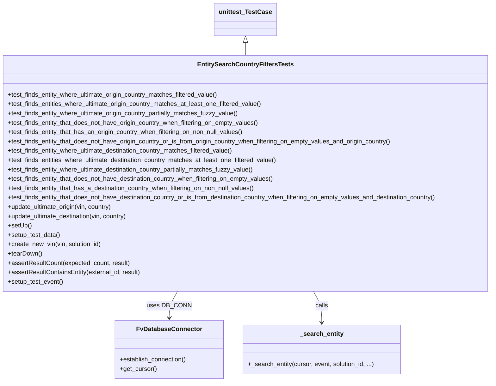

# Diagram: entity_core/entity_service/entity_service_tests/get_search_entity_tests/integration_tests/test_country_filters.py


> Auto-generated by Obscura crawlers

## Diagram 1



### SVG

<svg id="container" width="1277.78125" xmlns="http://www.w3.org/2000/svg" class="classDiagram" height="980" viewBox="0 0 1277.78125 980" role="graphics-document document" aria-roledescription="class"><style>#container{font-family:"trebuchet ms",verdana,arial,sans-serif;font-size:16px;fill:#333;}@keyframes edge-animation-frame{from{stroke-dashoffset:0;}}@keyframes dash{to{stroke-dashoffset:0;}}#container .edge-animation-slow{stroke-dasharray:9,5!important;stroke-dashoffset:900;animation:dash 50s linear infinite;stroke-linecap:round;}#container .edge-animation-fast{stroke-dasharray:9,5!important;stroke-dashoffset:900;animation:dash 20s linear infinite;stroke-linecap:round;}#container .error-icon{fill:#552222;}#container .error-text{fill:#552222;stroke:#552222;}#container .edge-thickness-normal{stroke-width:1px;}#container .edge-thickness-thick{stroke-width:3.5px;}#container .edge-pattern-solid{stroke-dasharray:0;}#container .edge-thickness-invisible{stroke-width:0;fill:none;}#container .edge-pattern-dashed{stroke-dasharray:3;}#container .edge-pattern-dotted{stroke-dasharray:2;}#container .marker{fill:#333333;stroke:#333333;}#container .marker.cross{stroke:#333333;}#container svg{font-family:"trebuchet ms",verdana,arial,sans-serif;font-size:16px;}#container p{margin:0;}#container g.classGroup text{fill:#9370DB;stroke:none;font-family:"trebuchet ms",verdana,arial,sans-serif;font-size:10px;}#container g.classGroup text .title{font-weight:bolder;}#container .nodeLabel,#container .edgeLabel{color:#131300;}#container .edgeLabel .label rect{fill:#ECECFF;}#container .label text{fill:#131300;}#container .labelBkg{background:#ECECFF;}#container .edgeLabel .label span{background:#ECECFF;}#container .classTitle{font-weight:bolder;}#container .node rect,#container .node circle,#container .node ellipse,#container .node polygon,#container .node path{fill:#ECECFF;stroke:#9370DB;stroke-width:1px;}#container .divider{stroke:#9370DB;stroke-width:1;}#container g.clickable{cursor:pointer;}#container g.classGroup rect{fill:#ECECFF;stroke:#9370DB;}#container g.classGroup line{stroke:#9370DB;stroke-width:1;}#container .classLabel .box{stroke:none;stroke-width:0;fill:#ECECFF;opacity:0.5;}#container .classLabel .label{fill:#9370DB;font-size:10px;}#container .relation{stroke:#333333;stroke-width:1;fill:none;}#container .dashed-line{stroke-dasharray:3;}#container .dotted-line{stroke-dasharray:1 2;}#container #compositionStart,#container .composition{fill:#333333!important;stroke:#333333!important;stroke-width:1;}#container #compositionEnd,#container .composition{fill:#333333!important;stroke:#333333!important;stroke-width:1;}#container #dependencyStart,#container .dependency{fill:#333333!important;stroke:#333333!important;stroke-width:1;}#container #dependencyStart,#container .dependency{fill:#333333!important;stroke:#333333!important;stroke-width:1;}#container #extensionStart,#container .extension{fill:transparent!important;stroke:#333333!important;stroke-width:1;}#container #extensionEnd,#container .extension{fill:transparent!important;stroke:#333333!important;stroke-width:1;}#container #aggregationStart,#container .aggregation{fill:transparent!important;stroke:#333333!important;stroke-width:1;}#container #aggregationEnd,#container .aggregation{fill:transparent!important;stroke:#333333!important;stroke-width:1;}#container #lollipopStart,#container .lollipop{fill:#ECECFF!important;stroke:#333333!important;stroke-width:1;}#container #lollipopEnd,#container .lollipop{fill:#ECECFF!important;stroke:#333333!important;stroke-width:1;}#container .edgeTerminals{font-size:11px;line-height:initial;}#container .classTitleText{text-anchor:middle;font-size:18px;fill:#333;}#container .label-icon{display:inline-block;height:1em;overflow:visible;vertical-align:-0.125em;}#container .node .label-icon path{fill:currentColor;stroke:revert;stroke-width:revert;}#container :root{--mermaid-font-family:"trebuchet ms",verdana,arial,sans-serif;}</style><g><defs><marker id="container_class-aggregationStart" class="marker aggregation class" refX="18" refY="7" markerWidth="190" markerHeight="240" orient="auto"><path d="M 18,7 L9,13 L1,7 L9,1 Z"></path></marker></defs><defs><marker id="container_class-aggregationEnd" class="marker aggregation class" refX="1" refY="7" markerWidth="20" markerHeight="28" orient="auto"><path d="M 18,7 L9,13 L1,7 L9,1 Z"></path></marker></defs><defs><marker id="container_class-extensionStart" class="marker extension class" refX="18" refY="7" markerWidth="190" markerHeight="240" orient="auto"><path d="M 1,7 L18,13 V 1 Z"></path></marker></defs><defs><marker id="container_class-extensionEnd" class="marker extension class" refX="1" refY="7" markerWidth="20" markerHeight="28" orient="auto"><path d="M 1,1 V 13 L18,7 Z"></path></marker></defs><defs><marker id="container_class-compositionStart" class="marker composition class" refX="18" refY="7" markerWidth="190" markerHeight="240" orient="auto"><path d="M 18,7 L9,13 L1,7 L9,1 Z"></path></marker></defs><defs><marker id="container_class-compositionEnd" class="marker composition class" refX="1" refY="7" markerWidth="20" markerHeight="28" orient="auto"><path d="M 18,7 L9,13 L1,7 L9,1 Z"></path></marker></defs><defs><marker id="container_class-dependencyStart" class="marker dependency class" refX="6" refY="7" markerWidth="190" markerHeight="240" orient="auto"><path d="M 5,7 L9,13 L1,7 L9,1 Z"></path></marker></defs><defs><marker id="container_class-dependencyEnd" class="marker dependency class" refX="13" refY="7" markerWidth="20" markerHeight="28" orient="auto"><path d="M 18,7 L9,13 L14,7 L9,1 Z"></path></marker></defs><defs><marker id="container_class-lollipopStart" class="marker lollipop class" refX="13" refY="7" markerWidth="190" markerHeight="240" orient="auto"><circle stroke="black" fill="transparent" cx="7" cy="7" r="6"></circle></marker></defs><defs><marker id="container_class-lollipopEnd" class="marker lollipop class" refX="1" refY="7" markerWidth="190" markerHeight="240" orient="auto"><circle stroke="black" fill="transparent" cx="7" cy="7" r="6"></circle></marker></defs><g class="root"><g class="clusters"></g><g class="edgePaths"><path d="M638.891,109.25L638.891,110.542C638.891,111.833,638.891,114.417,638.891,119.875C638.891,125.333,638.891,133.667,638.891,137.833L638.891,142" id="id_unittest_TestCase_EntitySearchCountryFiltersTests_1" class="edge-thickness-normal edge-pattern-solid relation" style=";;;" data-edge="true" data-et="edge" data-id="id_unittest_TestCase_EntitySearchCountryFiltersTests_1" data-points="W3sieCI6NjM4Ljg5MDYyNSwieSI6OTJ9LHsieCI6NjM4Ljg5MDYyNSwieSI6MTE3fSx7IngiOjYzOC44OTA2MjUsInkiOjE0Mn1d" marker-start="url(#container_class-extensionStart)"></path><path d="M465.123,748L461.587,754.167C458.05,760.333,450.977,772.667,447.441,784C443.904,795.333,443.904,805.667,443.904,810.833L443.904,816" id="id_EntitySearchCountryFiltersTests_FvDatabaseConnector_2" class="edge-thickness-normal edge-pattern-solid relation" style=";;;" data-edge="true" data-et="edge" data-id="id_EntitySearchCountryFiltersTests_FvDatabaseConnector_2" data-points="W3sieCI6NDY1LjEyMzM5NzI4ODYwMywieSI6NzQ4fSx7IngiOjQ0My45MDQyOTY4NzUsInkiOjc4NX0seyJ4Ijo0NDMuOTA0Mjk2ODc1LCJ5Ijo4MjJ9XQ==" marker-end="url(#container_class-dependencyEnd)"></path><path d="M812.658,748L816.194,754.167C819.731,760.333,826.804,772.667,830.34,786C833.877,799.333,833.877,813.667,833.877,820.833L833.877,828" id="id_EntitySearchCountryFiltersTests__search_entity_3" class="edge-thickness-normal edge-pattern-solid relation" style=";;;" data-edge="true" data-et="edge" data-id="id_EntitySearchCountryFiltersTests__search_entity_3" data-points="W3sieCI6ODEyLjY1Nzg1MjcxMTM5NywieSI6NzQ4fSx7IngiOjgzMy44NzY5NTMxMjUsInkiOjc4NX0seyJ4Ijo4MzMuODc2OTUzMTI1LCJ5Ijo4MzR9XQ==" marker-end="url(#container_class-dependencyEnd)"></path></g><g class="edgeLabels"><g class="edgeLabel"><g class="label" data-id="id_unittest_TestCase_EntitySearchCountryFiltersTests_1" transform="translate(0, 0)"><foreignObject width="0" height="0"><div xmlns="http://www.w3.org/1999/xhtml" class="labelBkg" style="display: table-cell; white-space: nowrap; line-height: 1.5; max-width: 200px; text-align: center;"><span class="edgeLabel"></span></div></foreignObject></g></g><g class="edgeLabel" transform="translate(443.904296875, 785)"><g class="label" data-id="id_EntitySearchCountryFiltersTests_FvDatabaseConnector_2" transform="translate(-53.09375, -12)"><foreignObject width="106.1875" height="24"><div xmlns="http://www.w3.org/1999/xhtml" class="labelBkg" style="display: table-cell; white-space: nowrap; line-height: 1.5; max-width: 200px; text-align: center;"><span class="edgeLabel"><p>uses DB_CONN</p></span></div></foreignObject></g></g><g class="edgeLabel" transform="translate(833.876953125, 785)"><g class="label" data-id="id_EntitySearchCountryFiltersTests__search_entity_3" transform="translate(-16.4453125, -12)"><foreignObject width="32.890625" height="24"><div xmlns="http://www.w3.org/1999/xhtml" class="labelBkg" style="display: table-cell; white-space: nowrap; line-height: 1.5; max-width: 200px; text-align: center;"><span class="edgeLabel"><p>calls</p></span></div></foreignObject></g></g></g><g class="nodes"><g class="node default" id="classId-EntitySearchCountryFiltersTests-0" transform="translate(638.890625, 445)"><g class="basic label-container"><path d="M-630.890625 -303 L630.890625 -303 L630.890625 303 L-630.890625 303" stroke="none" stroke-width="0" fill="#ECECFF" style=""></path><path d="M-630.890625 -303 C-250.45901682504547 -303, 129.97259134990907 -303, 630.890625 -303 M-630.890625 -303 C-205.3848348576293 -303, 220.1209552847414 -303, 630.890625 -303 M630.890625 -303 C630.890625 -150.74736418319026, 630.890625 1.5052716336194862, 630.890625 303 M630.890625 -303 C630.890625 -173.8904202882946, 630.890625 -44.780840576589185, 630.890625 303 M630.890625 303 C322.0173793328056 303, 13.144133665611207 303, -630.890625 303 M630.890625 303 C340.5911609638505 303, 50.29169692770097 303, -630.890625 303 M-630.890625 303 C-630.890625 105.10334455647853, -630.890625 -92.79331088704294, -630.890625 -303 M-630.890625 303 C-630.890625 117.58277632129804, -630.890625 -67.83444735740392, -630.890625 -303" stroke="#9370DB" stroke-width="1.3" fill="none" stroke-dasharray="0 0" style=""></path></g><g class="annotation-group text" transform="translate(0, -279)"></g><g class="label-group text" transform="translate(-116.484375, -279)"><g class="label" style="font-weight: bolder" transform="translate(0,-12)"><foreignObject width="232.96875" height="24"><div xmlns="http://www.w3.org/1999/xhtml" style="display: table-cell; white-space: nowrap; line-height: 1.5; max-width: 278px; text-align: center;"><span class="nodeLabel markdown-node-label" style=""><p>EntitySearchCountryFiltersTests</p></span></div></foreignObject></g></g><g class="members-group text" transform="translate(-618.890625, -231)"></g><g class="methods-group text" transform="translate(-618.890625, -201)"><g class="label" style="" transform="translate(0,-12)"><foreignObject width="547.8125" height="24"><div xmlns="http://www.w3.org/1999/xhtml" style="display: table-cell; white-space: nowrap; line-height: 1.5; max-width: 605px; text-align: center;"><span class="nodeLabel markdown-node-label" style=""><p>+test_finds_entity_where_ultimate_origin_country_matches_filtered_value()</p></span></div></foreignObject></g><g class="label" style="" transform="translate(0,12)"><foreignObject width="661.609375" height="24"><div xmlns="http://www.w3.org/1999/xhtml" style="display: table-cell; white-space: nowrap; line-height: 1.5; max-width: 719px; text-align: center;"><span class="nodeLabel markdown-node-label" style=""><p>+test_finds_entities_where_ultimate_origin_country_matches_at_least_one_filtered_value()</p></span></div></foreignObject></g><g class="label" style="" transform="translate(0,36)"><foreignObject width="599.71875" height="24"><div xmlns="http://www.w3.org/1999/xhtml" style="display: table-cell; white-space: nowrap; line-height: 1.5; max-width: 657px; text-align: center;"><span class="nodeLabel markdown-node-label" style=""><p>+test_finds_entity_where_ultimate_origin_country_partially_matches_fuzzy_value()</p></span></div></foreignObject></g><g class="label" style="" transform="translate(0,60)"><foreignObject width="652.5625" height="24"><div xmlns="http://www.w3.org/1999/xhtml" style="display: table-cell; white-space: nowrap; line-height: 1.5; max-width: 710px; text-align: center;"><span class="nodeLabel markdown-node-label" style=""><p>+test_finds_entity_that_does_not_have_origin_country_when_filtering_on_empty_values()</p></span></div></foreignObject></g><g class="label" style="" transform="translate(0,84)"><foreignObject width="613.84375" height="24"><div xmlns="http://www.w3.org/1999/xhtml" style="display: table-cell; white-space: nowrap; line-height: 1.5; max-width: 671px; text-align: center;"><span class="nodeLabel markdown-node-label" style=""><p>+test_finds_entity_that_has_an_origin_country_when_filtering_on_non_null_values()</p></span></div></foreignObject></g><g class="label" style="" transform="translate(0,108)"><foreignObject width="998.609375" height="24"><div xmlns="http://www.w3.org/1999/xhtml" style="display: table-cell; white-space: nowrap; line-height: 1.5; max-width: 1056px; text-align: center;"><span class="nodeLabel markdown-node-label" style=""><p>+test_finds_entity_that_does_not_have_origin_country_or_is_from_origin_country_when_filtering_on_empty_values_and_origin_country()</p></span></div></foreignObject></g><g class="label" style="" transform="translate(0,132)"><foreignObject width="588.71875" height="24"><div xmlns="http://www.w3.org/1999/xhtml" style="display: table-cell; white-space: nowrap; line-height: 1.5; max-width: 646px; text-align: center;"><span class="nodeLabel markdown-node-label" style=""><p>+test_finds_entity_where_ultimate_destination_country_matches_filtered_value()</p></span></div></foreignObject></g><g class="label" style="" transform="translate(0,156)"><foreignObject width="702.5" height="24"><div xmlns="http://www.w3.org/1999/xhtml" style="display: table-cell; white-space: nowrap; line-height: 1.5; max-width: 760px; text-align: center;"><span class="nodeLabel markdown-node-label" style=""><p>+test_finds_entities_where_ultimate_destination_country_matches_at_least_one_filtered_value()</p></span></div></foreignObject></g><g class="label" style="" transform="translate(0,180)"><foreignObject width="640.609375" height="24"><div xmlns="http://www.w3.org/1999/xhtml" style="display: table-cell; white-space: nowrap; line-height: 1.5; max-width: 698px; text-align: center;"><span class="nodeLabel markdown-node-label" style=""><p>+test_finds_entity_where_ultimate_destination_country_partially_matches_fuzzy_value()</p></span></div></foreignObject></g><g class="label" style="" transform="translate(0,204)"><foreignObject width="693.46875" height="24"><div xmlns="http://www.w3.org/1999/xhtml" style="display: table-cell; white-space: nowrap; line-height: 1.5; max-width: 751px; text-align: center;"><span class="nodeLabel markdown-node-label" style=""><p>+test_finds_entity_that_does_not_have_destination_country_when_filtering_on_empty_values()</p></span></div></foreignObject></g><g class="label" style="" transform="translate(0,228)"><foreignObject width="645.375" height="24"><div xmlns="http://www.w3.org/1999/xhtml" style="display: table-cell; white-space: nowrap; line-height: 1.5; max-width: 703px; text-align: center;"><span class="nodeLabel markdown-node-label" style=""><p>+test_finds_entity_that_has_a_destination_country_when_filtering_on_non_null_values()</p></span></div></foreignObject></g><g class="label" style="" transform="translate(0,252)"><foreignObject width="1121.296875" height="24"><div xmlns="http://www.w3.org/1999/xhtml" style="display: table-cell; white-space: nowrap; line-height: 1.5; max-width: 1179px; text-align: center;"><span class="nodeLabel markdown-node-label" style=""><p>+test_finds_entity_that_does_not_have_destination_country_or_is_from_destination_country_when_filtering_on_empty_values_and_destination_country()</p></span></div></foreignObject></g><g class="label" style="" transform="translate(0,276)"><foreignObject width="273.28125" height="24"><div xmlns="http://www.w3.org/1999/xhtml" style="display: table-cell; white-space: nowrap; line-height: 1.5; max-width: 331px; text-align: center;"><span class="nodeLabel markdown-node-label" style=""><p>+update_ultimate_origin(vin, country)</p></span></div></foreignObject></g><g class="label" style="" transform="translate(0,300)"><foreignObject width="314.1875" height="24"><div xmlns="http://www.w3.org/1999/xhtml" style="display: table-cell; white-space: nowrap; line-height: 1.5; max-width: 372px; text-align: center;"><span class="nodeLabel markdown-node-label" style=""><p>+update_ultimate_destination(vin, country)</p></span></div></foreignObject></g><g class="label" style="" transform="translate(0,324)"><foreignObject width="60.421875" height="24"><div xmlns="http://www.w3.org/1999/xhtml" style="display: table-cell; white-space: nowrap; line-height: 1.5; max-width: 118px; text-align: center;"><span class="nodeLabel markdown-node-label" style=""><p>+setUp()</p></span></div></foreignObject></g><g class="label" style="" transform="translate(0,348)"><foreignObject width="134.96875" height="24"><div xmlns="http://www.w3.org/1999/xhtml" style="display: table-cell; white-space: nowrap; line-height: 1.5; max-width: 192px; text-align: center;"><span class="nodeLabel markdown-node-label" style=""><p>+setup_test_data()</p></span></div></foreignObject></g><g class="label" style="" transform="translate(0,372)"><foreignObject width="242.140625" height="24"><div xmlns="http://www.w3.org/1999/xhtml" style="display: table-cell; white-space: nowrap; line-height: 1.5; max-width: 300px; text-align: center;"><span class="nodeLabel markdown-node-label" style=""><p>+create_new_vin(vin, solution_id)</p></span></div></foreignObject></g><g class="label" style="" transform="translate(0,396)"><foreignObject width="87.75" height="24"><div xmlns="http://www.w3.org/1999/xhtml" style="display: table-cell; white-space: nowrap; line-height: 1.5; max-width: 145px; text-align: center;"><span class="nodeLabel markdown-node-label" style=""><p>+tearDown()</p></span></div></foreignObject></g><g class="label" style="" transform="translate(0,420)"><foreignObject width="314.953125" height="24"><div xmlns="http://www.w3.org/1999/xhtml" style="display: table-cell; white-space: nowrap; line-height: 1.5; max-width: 372px; text-align: center;"><span class="nodeLabel markdown-node-label" style=""><p>+assertResultCount(expected_count, result)</p></span></div></foreignObject></g><g class="label" style="" transform="translate(0,444)"><foreignObject width="343.765625" height="24"><div xmlns="http://www.w3.org/1999/xhtml" style="display: table-cell; white-space: nowrap; line-height: 1.5; max-width: 401px; text-align: center;"><span class="nodeLabel markdown-node-label" style=""><p>+assertResultContainsEntity(external_id, result)</p></span></div></foreignObject></g><g class="label" style="" transform="translate(0,468)"><foreignObject width="142.671875" height="24"><div xmlns="http://www.w3.org/1999/xhtml" style="display: table-cell; white-space: nowrap; line-height: 1.5; max-width: 200px; text-align: center;"><span class="nodeLabel markdown-node-label" style=""><p>+setup_test_event()</p></span></div></foreignObject></g></g><g class="divider" style=""><path d="M-630.890625 -255 C-306.46430640051426 -255, 17.96201219897148 -255, 630.890625 -255 M-630.890625 -255 C-315.59291118385386 -255, -0.2951973677077149 -255, 630.890625 -255" stroke="#9370DB" stroke-width="1.3" fill="none" stroke-dasharray="0 0" style=""></path></g><g class="divider" style=""><path d="M-630.890625 -231 C-161.5558300404411 -231, 307.7789649191178 -231, 630.890625 -231 M-630.890625 -231 C-136.1598510281185 -231, 358.570922943763 -231, 630.890625 -231" stroke="#9370DB" stroke-width="1.3" fill="none" stroke-dasharray="0 0" style=""></path></g></g><g class="node default" id="classId-FvDatabaseConnector-1" transform="translate(443.904296875, 897)"><g class="basic label-container"><path d="M-138.28515625 -75 L138.28515625 -75 L138.28515625 75 L-138.28515625 75" stroke="none" stroke-width="0" fill="#ECECFF" style=""></path><path d="M-138.28515625 -75 C-32.269476447168785 -75, 73.74620335566243 -75, 138.28515625 -75 M-138.28515625 -75 C-48.55105841734209 -75, 41.18303941531582 -75, 138.28515625 -75 M138.28515625 -75 C138.28515625 -21.82747028979356, 138.28515625 31.34505942041288, 138.28515625 75 M138.28515625 -75 C138.28515625 -16.21777117502831, 138.28515625 42.56445764994338, 138.28515625 75 M138.28515625 75 C65.29293479616646 75, -7.6992866576670735 75, -138.28515625 75 M138.28515625 75 C71.13358269339042 75, 3.982009136780846 75, -138.28515625 75 M-138.28515625 75 C-138.28515625 42.4054285544098, -138.28515625 9.810857108819604, -138.28515625 -75 M-138.28515625 75 C-138.28515625 18.84340277860258, -138.28515625 -37.31319444279484, -138.28515625 -75" stroke="#9370DB" stroke-width="1.3" fill="none" stroke-dasharray="0 0" style=""></path></g><g class="annotation-group text" transform="translate(0, -51)"></g><g class="label-group text" transform="translate(-79.3046875, -51)"><g class="label" style="font-weight: bolder" transform="translate(0,-12)"><foreignObject width="158.609375" height="24"><div xmlns="http://www.w3.org/1999/xhtml" style="display: table-cell; white-space: nowrap; line-height: 1.5; max-width: 207px; text-align: center;"><span class="nodeLabel markdown-node-label" style=""><p>FvDatabaseConnector</p></span></div></foreignObject></g></g><g class="members-group text" transform="translate(-126.28515625, -3)"></g><g class="methods-group text" transform="translate(-126.28515625, 27)"><g class="label" style="" transform="translate(0,-12)"><foreignObject width="173.265625" height="24"><div xmlns="http://www.w3.org/1999/xhtml" style="display: table-cell; white-space: nowrap; line-height: 1.5; max-width: 231px; text-align: center;"><span class="nodeLabel markdown-node-label" style=""><p>+establish_connection()</p></span></div></foreignObject></g><g class="label" style="" transform="translate(0,12)"><foreignObject width="94.640625" height="24"><div xmlns="http://www.w3.org/1999/xhtml" style="display: table-cell; white-space: nowrap; line-height: 1.5; max-width: 152px; text-align: center;"><span class="nodeLabel markdown-node-label" style=""><p>+get_cursor()</p></span></div></foreignObject></g></g><g class="divider" style=""><path d="M-138.28515625 -27 C-59.68084155598396 -27, 18.92347313803208 -27, 138.28515625 -27 M-138.28515625 -27 C-58.425225720052595 -27, 21.43470480989481 -27, 138.28515625 -27" stroke="#9370DB" stroke-width="1.3" fill="none" stroke-dasharray="0 0" style=""></path></g><g class="divider" style=""><path d="M-138.28515625 -3 C-61.26045675457274 -3, 15.764242740854513 -3, 138.28515625 -3 M-138.28515625 -3 C-56.168605116578846 -3, 25.94794601684231 -3, 138.28515625 -3" stroke="#9370DB" stroke-width="1.3" fill="none" stroke-dasharray="0 0" style=""></path></g></g><g class="node default" id="classId-_search_entity-2" transform="translate(833.876953125, 897)"><g class="basic label-container"><path d="M-201.6875 -63 L201.6875 -63 L201.6875 63 L-201.6875 63" stroke="none" stroke-width="0" fill="#ECECFF" style=""></path><path d="M-201.6875 -63 C-76.99893887044443 -63, 47.68962225911113 -63, 201.6875 -63 M-201.6875 -63 C-99.41276103186695 -63, 2.8619779362661006 -63, 201.6875 -63 M201.6875 -63 C201.6875 -31.416286327407864, 201.6875 0.16742734518427227, 201.6875 63 M201.6875 -63 C201.6875 -26.65123972073267, 201.6875 9.697520558534663, 201.6875 63 M201.6875 63 C115.21405388746604 63, 28.740607774932073 63, -201.6875 63 M201.6875 63 C62.9170510464991 63, -75.8533979070018 63, -201.6875 63 M-201.6875 63 C-201.6875 24.730812627590574, -201.6875 -13.538374744818853, -201.6875 -63 M-201.6875 63 C-201.6875 15.778232853328355, -201.6875 -31.44353429334329, -201.6875 -63" stroke="#9370DB" stroke-width="1.3" fill="none" stroke-dasharray="0 0" style=""></path></g><g class="annotation-group text" transform="translate(0, -39)"></g><g class="label-group text" transform="translate(-53.734375, -39)"><g class="label" style="font-weight: bolder" transform="translate(0,-12)"><foreignObject width="107.46875" height="24"><div xmlns="http://www.w3.org/1999/xhtml" style="display: table-cell; white-space: nowrap; line-height: 1.5; max-width: 156px; text-align: center;"><span class="nodeLabel markdown-node-label" style=""><p>_search_entity</p></span></div></foreignObject></g></g><g class="members-group text" transform="translate(-189.6875, 9)"></g><g class="methods-group text" transform="translate(-189.6875, 39)"><g class="label" style="" transform="translate(0,-12)"><foreignObject width="325.640625" height="24"><div xmlns="http://www.w3.org/1999/xhtml" style="display: table-cell; white-space: nowrap; line-height: 1.5; max-width: 383px; text-align: center;"><span class="nodeLabel markdown-node-label" style=""><p>+_search_entity(cursor, event, solution_id, ...)</p></span></div></foreignObject></g></g><g class="divider" style=""><path d="M-201.6875 -15 C-115.72435872089255 -15, -29.761217441785107 -15, 201.6875 -15 M-201.6875 -15 C-80.86437342545108 -15, 39.958753149097845 -15, 201.6875 -15" stroke="#9370DB" stroke-width="1.3" fill="none" stroke-dasharray="0 0" style=""></path></g><g class="divider" style=""><path d="M-201.6875 9 C-69.89643935144869 9, 61.89462129710262 9, 201.6875 9 M-201.6875 9 C-89.2740775251624 9, 23.139344949675205 9, 201.6875 9" stroke="#9370DB" stroke-width="1.3" fill="none" stroke-dasharray="0 0" style=""></path></g></g><g class="node default" id="classId-unittest_TestCase-3" transform="translate(638.890625, 50)"><g class="basic label-container"><path d="M-76.9609375 -42 L76.9609375 -42 L76.9609375 42 L-76.9609375 42" stroke="none" stroke-width="0" fill="#ECECFF" style=""></path><path d="M-76.9609375 -42 C-19.37357682077991 -42, 38.21378385844018 -42, 76.9609375 -42 M-76.9609375 -42 C-23.873245235569115 -42, 29.21444702886177 -42, 76.9609375 -42 M76.9609375 -42 C76.9609375 -12.21308140346451, 76.9609375 17.57383719307098, 76.9609375 42 M76.9609375 -42 C76.9609375 -21.019424629408228, 76.9609375 -0.03884925881645529, 76.9609375 42 M76.9609375 42 C28.027600688588898 42, -20.905736122822205 42, -76.9609375 42 M76.9609375 42 C31.574938127242255 42, -13.81106124551549 42, -76.9609375 42 M-76.9609375 42 C-76.9609375 13.22318637184297, -76.9609375 -15.553627256314059, -76.9609375 -42 M-76.9609375 42 C-76.9609375 17.199235976957585, -76.9609375 -7.60152804608483, -76.9609375 -42" stroke="#9370DB" stroke-width="1.3" fill="none" stroke-dasharray="0 0" style=""></path></g><g class="annotation-group text" transform="translate(0, -18)"></g><g class="label-group text" transform="translate(-64.9609375, -18)"><g class="label" style="font-weight: bolder" transform="translate(0,-12)"><foreignObject width="129.921875" height="24"><div xmlns="http://www.w3.org/1999/xhtml" style="display: table-cell; white-space: nowrap; line-height: 1.5; max-width: 177px; text-align: center;"><span class="nodeLabel markdown-node-label" style=""><p>unittest_TestCase</p></span></div></foreignObject></g></g><g class="members-group text" transform="translate(-64.9609375, 30)"></g><g class="methods-group text" transform="translate(-64.9609375, 60)"></g><g class="divider" style=""><path d="M-76.9609375 6 C-25.47662045247995 6, 26.007696595040102 6, 76.9609375 6 M-76.9609375 6 C-25.799615252373997 6, 25.361706995252007 6, 76.9609375 6" stroke="#9370DB" stroke-width="1.3" fill="none" stroke-dasharray="0 0" style=""></path></g><g class="divider" style=""><path d="M-76.9609375 24 C-21.017556257120624 24, 34.92582498575875 24, 76.9609375 24 M-76.9609375 24 C-16.80909353403714 24, 43.34275043192572 24, 76.9609375 24" stroke="#9370DB" stroke-width="1.3" fill="none" stroke-dasharray="0 0" style=""></path></g></g></g></g></g></svg>

## Diagram 2

```mermaid
flowchart TD
    Start([Start]) --> SetUp[setUp()]
    SetUp --> SetupTestData[setup_test_data()]
    SetupTestData --> DBConnect[DB_CONN.establish_connection()]
    DBConnect --> GetCursor[DB_CONN.get_cursor() --> cursor]
    GetCursor --> CreateVIN[create_new_vin(vin)]
    CreateVIN --> TestAction{Test scenario}
    TestAction -->|origin filter| OriginParams[set originCountry/originCountry:contains/originCountry:isNull/isNotNull]
    TestAction -->|destination filter| DestParams[set destinationCountry/destinationCountry:contains/destinationCountry:isNull/isNotNull]
    OriginParams --> UpdateOrigin[update_ultimate_origin(vin, country)]
    DestParams --> UpdateDest[update_ultimate_destination(vin, country)]
    UpdateOrigin --> Search[_search_entity(cursor, event, solution_id, ...)]
    UpdateDest --> Search
    Search --> AssertCount[assertResultCount(expected_count, result)]
    Search --> AssertContains[assertResultContainsEntity(vin, result)]
    AssertCount --> TearDown[tearDown() -> delete created_vins]
    AssertContains --> TearDown
    TearDown --> End([End])
```

> SVG rendering failed for this diagram.
