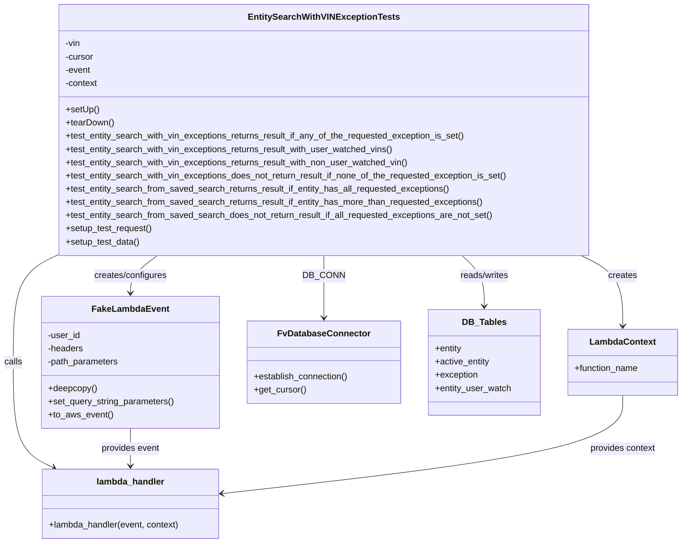

# Diagram: entity_core/entity_service/entity_service_tests/get_search_entity_tests/integration_tests/test_entity_exception_search.py


> Auto-generated by Obscura crawlers

## Diagram 1



### SVG

<svg id="container" width="1229.0546875" xmlns="http://www.w3.org/2000/svg" class="classDiagram" height="986" viewBox="0 0 1229.0546875 986" role="graphics-document document" aria-roledescription="class"><style>#container{font-family:"trebuchet ms",verdana,arial,sans-serif;font-size:16px;fill:#333;}@keyframes edge-animation-frame{from{stroke-dashoffset:0;}}@keyframes dash{to{stroke-dashoffset:0;}}#container .edge-animation-slow{stroke-dasharray:9,5!important;stroke-dashoffset:900;animation:dash 50s linear infinite;stroke-linecap:round;}#container .edge-animation-fast{stroke-dasharray:9,5!important;stroke-dashoffset:900;animation:dash 20s linear infinite;stroke-linecap:round;}#container .error-icon{fill:#552222;}#container .error-text{fill:#552222;stroke:#552222;}#container .edge-thickness-normal{stroke-width:1px;}#container .edge-thickness-thick{stroke-width:3.5px;}#container .edge-pattern-solid{stroke-dasharray:0;}#container .edge-thickness-invisible{stroke-width:0;fill:none;}#container .edge-pattern-dashed{stroke-dasharray:3;}#container .edge-pattern-dotted{stroke-dasharray:2;}#container .marker{fill:#333333;stroke:#333333;}#container .marker.cross{stroke:#333333;}#container svg{font-family:"trebuchet ms",verdana,arial,sans-serif;font-size:16px;}#container p{margin:0;}#container g.classGroup text{fill:#9370DB;stroke:none;font-family:"trebuchet ms",verdana,arial,sans-serif;font-size:10px;}#container g.classGroup text .title{font-weight:bolder;}#container .nodeLabel,#container .edgeLabel{color:#131300;}#container .edgeLabel .label rect{fill:#ECECFF;}#container .label text{fill:#131300;}#container .labelBkg{background:#ECECFF;}#container .edgeLabel .label span{background:#ECECFF;}#container .classTitle{font-weight:bolder;}#container .node rect,#container .node circle,#container .node ellipse,#container .node polygon,#container .node path{fill:#ECECFF;stroke:#9370DB;stroke-width:1px;}#container .divider{stroke:#9370DB;stroke-width:1;}#container g.clickable{cursor:pointer;}#container g.classGroup rect{fill:#ECECFF;stroke:#9370DB;}#container g.classGroup line{stroke:#9370DB;stroke-width:1;}#container .classLabel .box{stroke:none;stroke-width:0;fill:#ECECFF;opacity:0.5;}#container .classLabel .label{fill:#9370DB;font-size:10px;}#container .relation{stroke:#333333;stroke-width:1;fill:none;}#container .dashed-line{stroke-dasharray:3;}#container .dotted-line{stroke-dasharray:1 2;}#container #compositionStart,#container .composition{fill:#333333!important;stroke:#333333!important;stroke-width:1;}#container #compositionEnd,#container .composition{fill:#333333!important;stroke:#333333!important;stroke-width:1;}#container #dependencyStart,#container .dependency{fill:#333333!important;stroke:#333333!important;stroke-width:1;}#container #dependencyStart,#container .dependency{fill:#333333!important;stroke:#333333!important;stroke-width:1;}#container #extensionStart,#container .extension{fill:transparent!important;stroke:#333333!important;stroke-width:1;}#container #extensionEnd,#container .extension{fill:transparent!important;stroke:#333333!important;stroke-width:1;}#container #aggregationStart,#container .aggregation{fill:transparent!important;stroke:#333333!important;stroke-width:1;}#container #aggregationEnd,#container .aggregation{fill:transparent!important;stroke:#333333!important;stroke-width:1;}#container #lollipopStart,#container .lollipop{fill:#ECECFF!important;stroke:#333333!important;stroke-width:1;}#container #lollipopEnd,#container .lollipop{fill:#ECECFF!important;stroke:#333333!important;stroke-width:1;}#container .edgeTerminals{font-size:11px;line-height:initial;}#container .classTitleText{text-anchor:middle;font-size:18px;fill:#333;}#container .label-icon{display:inline-block;height:1em;overflow:visible;vertical-align:-0.125em;}#container .node .label-icon path{fill:currentColor;stroke:revert;stroke-width:revert;}#container :root{--mermaid-font-family:"trebuchet ms",verdana,arial,sans-serif;}</style><g><defs><marker id="container_class-aggregationStart" class="marker aggregation class" refX="18" refY="7" markerWidth="190" markerHeight="240" orient="auto"><path d="M 18,7 L9,13 L1,7 L9,1 Z"></path></marker></defs><defs><marker id="container_class-aggregationEnd" class="marker aggregation class" refX="1" refY="7" markerWidth="20" markerHeight="28" orient="auto"><path d="M 18,7 L9,13 L1,7 L9,1 Z"></path></marker></defs><defs><marker id="container_class-extensionStart" class="marker extension class" refX="18" refY="7" markerWidth="190" markerHeight="240" orient="auto"><path d="M 1,7 L18,13 V 1 Z"></path></marker></defs><defs><marker id="container_class-extensionEnd" class="marker extension class" refX="1" refY="7" markerWidth="20" markerHeight="28" orient="auto"><path d="M 1,1 V 13 L18,7 Z"></path></marker></defs><defs><marker id="container_class-compositionStart" class="marker composition class" refX="18" refY="7" markerWidth="190" markerHeight="240" orient="auto"><path d="M 18,7 L9,13 L1,7 L9,1 Z"></path></marker></defs><defs><marker id="container_class-compositionEnd" class="marker composition class" refX="1" refY="7" markerWidth="20" markerHeight="28" orient="auto"><path d="M 18,7 L9,13 L1,7 L9,1 Z"></path></marker></defs><defs><marker id="container_class-dependencyStart" class="marker dependency class" refX="6" refY="7" markerWidth="190" markerHeight="240" orient="auto"><path d="M 5,7 L9,13 L1,7 L9,1 Z"></path></marker></defs><defs><marker id="container_class-dependencyEnd" class="marker dependency class" refX="13" refY="7" markerWidth="20" markerHeight="28" orient="auto"><path d="M 18,7 L9,13 L14,7 L9,1 Z"></path></marker></defs><defs><marker id="container_class-lollipopStart" class="marker lollipop class" refX="13" refY="7" markerWidth="190" markerHeight="240" orient="auto"><circle stroke="black" fill="transparent" cx="7" cy="7" r="6"></circle></marker></defs><defs><marker id="container_class-lollipopEnd" class="marker lollipop class" refX="1" refY="7" markerWidth="190" markerHeight="240" orient="auto"><circle stroke="black" fill="transparent" cx="7" cy="7" r="6"></circle></marker></defs><g class="root"><g class="clusters"></g><g class="edgePaths"><path d="M584.34,464L584.34,470.167C584.34,476.333,584.34,488.667,584.34,507.5C584.34,526.333,584.34,551.667,584.34,564.333L584.34,577" id="id_EntitySearchWithVINExceptionTests_FvDatabaseConnector_1" class="edge-thickness-normal edge-pattern-solid relation" style=";;;" data-edge="true" data-et="edge" data-id="id_EntitySearchWithVINExceptionTests_FvDatabaseConnector_1" data-points="W3sieCI6NTg0LjMzOTg0Mzc1LCJ5Ijo0NjR9LHsieCI6NTg0LjMzOTg0Mzc1LCJ5Ijo1MDF9LHsieCI6NTg0LjMzOTg0Mzc1LCJ5Ijo1ODN9XQ==" marker-end="url(#container_class-dependencyEnd)"></path><path d="M284.613,464L276.506,470.167C268.399,476.333,252.186,488.667,244.079,500C235.973,511.333,235.973,521.667,235.973,526.833L235.973,532" id="id_EntitySearchWithVINExceptionTests_FakeLambdaEvent_2" class="edge-thickness-normal edge-pattern-solid relation" style=";;;" data-edge="true" data-et="edge" data-id="id_EntitySearchWithVINExceptionTests_FakeLambdaEvent_2" data-points="W3sieCI6Mjg0LjYxMjYwMzE4Mzk2MjMsInkiOjQ2NH0seyJ4IjoyMzUuOTcyNjU2MjUsInkiOjUwMX0seyJ4IjoyMzUuOTcyNjU2MjUsInkiOjUzOH1d" marker-end="url(#container_class-dependencyEnd)"></path><path d="M1046.729,464L1059.235,470.167C1071.741,476.333,1096.753,488.667,1109.259,510C1121.766,531.333,1121.766,561.667,1121.766,576.833L1121.766,592" id="id_EntitySearchWithVINExceptionTests_LambdaContext_3" class="edge-thickness-normal edge-pattern-solid relation" style=";;;" data-edge="true" data-et="edge" data-id="id_EntitySearchWithVINExceptionTests_LambdaContext_3" data-points="W3sieCI6MTA0Ni43Mjg4MTc4MDY2MDM3LCJ5Ijo0NjR9LHsieCI6MTEyMS43NjU2MjUsInkiOjUwMX0seyJ4IjoxMTIxLjc2NTYyNSwieSI6NTk4fV0=" marker-end="url(#container_class-dependencyEnd)"></path><path d="M102.619,464L89.59,470.167C76.561,476.333,50.503,488.667,37.474,521C24.445,553.333,24.445,605.667,24.445,658C24.445,710.333,24.445,762.667,36.585,794.573C48.726,826.479,73.006,837.957,85.146,843.696L97.286,849.436" id="id_EntitySearchWithVINExceptionTests_lambda_handler_4" class="edge-thickness-normal edge-pattern-solid relation" style=";;;" data-edge="true" data-et="edge" data-id="id_EntitySearchWithVINExceptionTests_lambda_handler_4" data-points="W3sieCI6MTAyLjYxOTI2NTkxOTgxMTMxLCJ5Ijo0NjR9LHsieCI6MjQuNDQ1MzEyNSwieSI6NTAxfSx7IngiOjI0LjQ0NTMxMjUsInkiOjY1OH0seyJ4IjoyNC40NDUzMTI1LCJ5Ijo4MTV9LHsieCI6MTAyLjcxMDQyOTY4NzUwMDAxLCJ5Ijo4NTJ9XQ==" marker-end="url(#container_class-dependencyEnd)"></path><path d="M832.31,464L839.017,470.167C845.724,476.333,859.137,488.667,865.844,504C872.551,519.333,872.551,537.667,872.551,546.833L872.551,556" id="id_EntitySearchWithVINExceptionTests_DB_Tables_5" class="edge-thickness-normal edge-pattern-solid relation" style=";;;" data-edge="true" data-et="edge" data-id="id_EntitySearchWithVINExceptionTests_DB_Tables_5" data-points="W3sieCI6ODMyLjMxMDAwODg0NDMzOTYsInkiOjQ2NH0seyJ4Ijo4NzIuNTUwNzgxMjUsInkiOjUwMX0seyJ4Ijo4NzIuNTUwNzgxMjUsInkiOjU2Mn1d" marker-end="url(#container_class-dependencyEnd)"></path><path d="M235.973,778L235.973,784.167C235.973,790.333,235.973,802.667,235.973,814C235.973,825.333,235.973,835.667,235.973,840.833L235.973,846" id="id_FakeLambdaEvent_lambda_handler_6" class="edge-thickness-normal edge-pattern-solid relation" style=";;;" data-edge="true" data-et="edge" data-id="id_FakeLambdaEvent_lambda_handler_6" data-points="W3sieCI6MjM1Ljk3MjY1NjI1LCJ5Ijo3Nzh9LHsieCI6MjM1Ljk3MjY1NjI1LCJ5Ijo4MTV9LHsieCI6MjM1Ljk3MjY1NjI1LCJ5Ijo4NTJ9XQ==" marker-end="url(#container_class-dependencyEnd)"></path><path d="M1121.766,718L1121.766,734.167C1121.766,750.333,1121.766,782.667,1002.141,812.338C882.516,842.01,643.266,869.019,523.642,882.524L404.017,896.029" id="id_LambdaContext_lambda_handler_7" class="edge-thickness-normal edge-pattern-solid relation" style=";;;" data-edge="true" data-et="edge" data-id="id_LambdaContext_lambda_handler_7" data-points="W3sieCI6MTEyMS43NjU2MjUsInkiOjcxOH0seyJ4IjoxMTIxLjc2NTYyNSwieSI6ODE1fSx7IngiOjM5OC4wNTQ2ODc1LCJ5Ijo4OTYuNzAyMDQxMzM4MzEzNn1d" marker-end="url(#container_class-dependencyEnd)"></path></g><g class="edgeLabels"><g class="edgeLabel" transform="translate(584.33984375, 501)"><g class="label" data-id="id_EntitySearchWithVINExceptionTests_FvDatabaseConnector_1" transform="translate(-34.484375, -12)"><foreignObject width="68.96875" height="24"><div xmlns="http://www.w3.org/1999/xhtml" class="labelBkg" style="display: table-cell; white-space: nowrap; line-height: 1.5; max-width: 200px; text-align: center;"><span class="edgeLabel"><p>DB_CONN</p></span></div></foreignObject></g></g><g class="edgeLabel" transform="translate(235.97265625, 501)"><g class="label" data-id="id_EntitySearchWithVINExceptionTests_FakeLambdaEvent_2" transform="translate(-67.234375, -12)"><foreignObject width="134.46875" height="24"><div xmlns="http://www.w3.org/1999/xhtml" class="labelBkg" style="display: table-cell; white-space: nowrap; line-height: 1.5; max-width: 200px; text-align: center;"><span class="edgeLabel"><p>creates/configures</p></span></div></foreignObject></g></g><g class="edgeLabel" transform="translate(1121.765625, 501)"><g class="label" data-id="id_EntitySearchWithVINExceptionTests_LambdaContext_3" transform="translate(-26.171875, -12)"><foreignObject width="52.34375" height="24"><div xmlns="http://www.w3.org/1999/xhtml" class="labelBkg" style="display: table-cell; white-space: nowrap; line-height: 1.5; max-width: 200px; text-align: center;"><span class="edgeLabel"><p>creates</p></span></div></foreignObject></g></g><g class="edgeLabel" transform="translate(24.4453125, 658)"><g class="label" data-id="id_EntitySearchWithVINExceptionTests_lambda_handler_4" transform="translate(-16.4453125, -12)"><foreignObject width="32.890625" height="24"><div xmlns="http://www.w3.org/1999/xhtml" class="labelBkg" style="display: table-cell; white-space: nowrap; line-height: 1.5; max-width: 200px; text-align: center;"><span class="edgeLabel"><p>calls</p></span></div></foreignObject></g></g><g class="edgeLabel" transform="translate(872.55078125, 501)"><g class="label" data-id="id_EntitySearchWithVINExceptionTests_DB_Tables_5" transform="translate(-45.9453125, -12)"><foreignObject width="91.890625" height="24"><div xmlns="http://www.w3.org/1999/xhtml" class="labelBkg" style="display: table-cell; white-space: nowrap; line-height: 1.5; max-width: 200px; text-align: center;"><span class="edgeLabel"><p>reads/writes</p></span></div></foreignObject></g></g><g class="edgeLabel" transform="translate(235.97265625, 815)"><g class="label" data-id="id_FakeLambdaEvent_lambda_handler_6" transform="translate(-53.6015625, -12)"><foreignObject width="107.203125" height="24"><div xmlns="http://www.w3.org/1999/xhtml" class="labelBkg" style="display: table-cell; white-space: nowrap; line-height: 1.5; max-width: 200px; text-align: center;"><span class="edgeLabel"><p>provides event</p></span></div></foreignObject></g></g><g class="edgeLabel" transform="translate(1121.765625, 815)"><g class="label" data-id="id_LambdaContext_lambda_handler_7" transform="translate(-60.28125, -12)"><foreignObject width="120.5625" height="24"><div xmlns="http://www.w3.org/1999/xhtml" class="labelBkg" style="display: table-cell; white-space: nowrap; line-height: 1.5; max-width: 200px; text-align: center;"><span class="edgeLabel"><p>provides context</p></span></div></foreignObject></g></g></g><g class="nodes"><g class="node default" id="classId-EntitySearchWithVINExceptionTests-0" transform="translate(584.33984375, 236)"><g class="basic label-container"><path d="M-482.671875 -228 L482.671875 -228 L482.671875 228 L-482.671875 228" stroke="none" stroke-width="0" fill="#ECECFF" style=""></path><path d="M-482.671875 -228 C-247.0630936566571 -228, -11.454312313314176 -228, 482.671875 -228 M-482.671875 -228 C-244.88760565904397 -228, -7.1033363180879405 -228, 482.671875 -228 M482.671875 -228 C482.671875 -129.89326128603804, 482.671875 -31.78652257207608, 482.671875 228 M482.671875 -228 C482.671875 -62.60251588926087, 482.671875 102.79496822147826, 482.671875 228 M482.671875 228 C209.03818719382122 228, -64.59550061235757 228, -482.671875 228 M482.671875 228 C111.32740020016053 228, -260.01707459967895 228, -482.671875 228 M-482.671875 228 C-482.671875 90.472596989014, -482.671875 -47.05480602197201, -482.671875 -228 M-482.671875 228 C-482.671875 115.30313523059684, -482.671875 2.606270461193674, -482.671875 -228" stroke="#9370DB" stroke-width="1.3" fill="none" stroke-dasharray="0 0" style=""></path></g><g class="annotation-group text" transform="translate(0, -204)"></g><g class="label-group text" transform="translate(-129.75, -204)"><g class="label" style="font-weight: bolder" transform="translate(0,-12)"><foreignObject width="259.5" height="24"><div xmlns="http://www.w3.org/1999/xhtml" style="display: table-cell; white-space: nowrap; line-height: 1.5; max-width: 305px; text-align: center;"><span class="nodeLabel markdown-node-label" style=""><p>EntitySearchWithVINExceptionTests</p></span></div></foreignObject></g></g><g class="members-group text" transform="translate(-470.671875, -156)"><g class="label" style="" transform="translate(0,-12)"><foreignObject width="28.0625" height="24"><div xmlns="http://www.w3.org/1999/xhtml" style="display: table-cell; white-space: nowrap; line-height: 1.5; max-width: 85px; text-align: center;"><span class="nodeLabel markdown-node-label" style=""><p>-vin</p></span></div></foreignObject></g><g class="label" style="" transform="translate(0,12)"><foreignObject width="52.1875" height="24"><div xmlns="http://www.w3.org/1999/xhtml" style="display: table-cell; white-space: nowrap; line-height: 1.5; max-width: 110px; text-align: center;"><span class="nodeLabel markdown-node-label" style=""><p>-cursor</p></span></div></foreignObject></g><g class="label" style="" transform="translate(0,36)"><foreignObject width="46.796875" height="24"><div xmlns="http://www.w3.org/1999/xhtml" style="display: table-cell; white-space: nowrap; line-height: 1.5; max-width: 104px; text-align: center;"><span class="nodeLabel markdown-node-label" style=""><p>-event</p></span></div></foreignObject></g><g class="label" style="" transform="translate(0,60)"><foreignObject width="60.15625" height="24"><div xmlns="http://www.w3.org/1999/xhtml" style="display: table-cell; white-space: nowrap; line-height: 1.5; max-width: 118px; text-align: center;"><span class="nodeLabel markdown-node-label" style=""><p>-context</p></span></div></foreignObject></g></g><g class="methods-group text" transform="translate(-470.671875, -36)"><g class="label" style="" transform="translate(0,-12)"><foreignObject width="60.421875" height="24"><div xmlns="http://www.w3.org/1999/xhtml" style="display: table-cell; white-space: nowrap; line-height: 1.5; max-width: 118px; text-align: center;"><span class="nodeLabel markdown-node-label" style=""><p>+setUp()</p></span></div></foreignObject></g><g class="label" style="" transform="translate(0,12)"><foreignObject width="87.75" height="24"><div xmlns="http://www.w3.org/1999/xhtml" style="display: table-cell; white-space: nowrap; line-height: 1.5; max-width: 145px; text-align: center;"><span class="nodeLabel markdown-node-label" style=""><p>+tearDown()</p></span></div></foreignObject></g><g class="label" style="" transform="translate(0,36)"><foreignObject width="731.6875" height="24"><div xmlns="http://www.w3.org/1999/xhtml" style="display: table-cell; white-space: nowrap; line-height: 1.5; max-width: 789px; text-align: center;"><span class="nodeLabel markdown-node-label" style=""><p>+test_entity_search_with_vin_exceptions_returns_result_if_any_of_the_requested_exception_is_set()</p></span></div></foreignObject></g><g class="label" style="" transform="translate(0,60)"><foreignObject width="599.625" height="24"><div xmlns="http://www.w3.org/1999/xhtml" style="display: table-cell; white-space: nowrap; line-height: 1.5; max-width: 657px; text-align: center;"><span class="nodeLabel markdown-node-label" style=""><p>+test_entity_search_with_vin_exceptions_returns_result_with_user_watched_vins()</p></span></div></foreignObject></g><g class="label" style="" transform="translate(0,84)"><foreignObject width="628.5625" height="24"><div xmlns="http://www.w3.org/1999/xhtml" style="display: table-cell; white-space: nowrap; line-height: 1.5; max-width: 686px; text-align: center;"><span class="nodeLabel markdown-node-label" style=""><p>+test_entity_search_with_vin_exceptions_returns_result_with_non_user_watched_vin()</p></span></div></foreignObject></g><g class="label" style="" transform="translate(0,108)"><foreignObject width="811.59375" height="24"><div xmlns="http://www.w3.org/1999/xhtml" style="display: table-cell; white-space: nowrap; line-height: 1.5; max-width: 869px; text-align: center;"><span class="nodeLabel markdown-node-label" style=""><p>+test_entity_search_with_vin_exceptions_does_not_return_result_if_none_of_the_requested_exception_is_set()</p></span></div></foreignObject></g><g class="label" style="" transform="translate(0,132)"><foreignObject width="703.984375" height="24"><div xmlns="http://www.w3.org/1999/xhtml" style="display: table-cell; white-space: nowrap; line-height: 1.5; max-width: 761px; text-align: center;"><span class="nodeLabel markdown-node-label" style=""><p>+test_entity_search_from_saved_search_returns_result_if_entity_has_all_requested_exceptions()</p></span></div></foreignObject></g><g class="label" style="" transform="translate(0,156)"><foreignObject width="764.765625" height="24"><div xmlns="http://www.w3.org/1999/xhtml" style="display: table-cell; white-space: nowrap; line-height: 1.5; max-width: 822px; text-align: center;"><span class="nodeLabel markdown-node-label" style=""><p>+test_entity_search_from_saved_search_returns_result_if_entity_has_more_than_requested_exceptions()</p></span></div></foreignObject></g><g class="label" style="" transform="translate(0,180)"><foreignObject width="783.140625" height="24"><div xmlns="http://www.w3.org/1999/xhtml" style="display: table-cell; white-space: nowrap; line-height: 1.5; max-width: 841px; text-align: center;"><span class="nodeLabel markdown-node-label" style=""><p>+test_entity_search_from_saved_search_does_not_return_result_if_all_requested_exceptions_are_not_set()</p></span></div></foreignObject></g><g class="label" style="" transform="translate(0,204)"><foreignObject width="157.90625" height="24"><div xmlns="http://www.w3.org/1999/xhtml" style="display: table-cell; white-space: nowrap; line-height: 1.5; max-width: 215px; text-align: center;"><span class="nodeLabel markdown-node-label" style=""><p>+setup_test_request()</p></span></div></foreignObject></g><g class="label" style="" transform="translate(0,228)"><foreignObject width="134.96875" height="24"><div xmlns="http://www.w3.org/1999/xhtml" style="display: table-cell; white-space: nowrap; line-height: 1.5; max-width: 192px; text-align: center;"><span class="nodeLabel markdown-node-label" style=""><p>+setup_test_data()</p></span></div></foreignObject></g></g><g class="divider" style=""><path d="M-482.671875 -180 C-224.8435234614339 -180, 32.98482807713219 -180, 482.671875 -180 M-482.671875 -180 C-227.82679920984404 -180, 27.01827658031192 -180, 482.671875 -180" stroke="#9370DB" stroke-width="1.3" fill="none" stroke-dasharray="0 0" style=""></path></g><g class="divider" style=""><path d="M-482.671875 -60 C-275.00490349984244 -60, -67.33793199968488 -60, 482.671875 -60 M-482.671875 -60 C-271.25648257088227 -60, -59.84109014176454 -60, 482.671875 -60" stroke="#9370DB" stroke-width="1.3" fill="none" stroke-dasharray="0 0" style=""></path></g></g><g class="node default" id="classId-FakeLambdaEvent-1" transform="translate(235.97265625, 658)"><g class="basic label-container"><path d="M-160.08203125 -120 L160.08203125 -120 L160.08203125 120 L-160.08203125 120" stroke="none" stroke-width="0" fill="#ECECFF" style=""></path><path d="M-160.08203125 -120 C-82.51054017816628 -120, -4.939049106332561 -120, 160.08203125 -120 M-160.08203125 -120 C-56.613202217276424 -120, 46.85562681544715 -120, 160.08203125 -120 M160.08203125 -120 C160.08203125 -28.952090771899847, 160.08203125 62.095818456200305, 160.08203125 120 M160.08203125 -120 C160.08203125 -25.201971800659194, 160.08203125 69.59605639868161, 160.08203125 120 M160.08203125 120 C66.68973574291934 120, -26.70255976416132 120, -160.08203125 120 M160.08203125 120 C60.94838666479522 120, -38.185257920409555 120, -160.08203125 120 M-160.08203125 120 C-160.08203125 65.87990234775589, -160.08203125 11.759804695511761, -160.08203125 -120 M-160.08203125 120 C-160.08203125 28.087813507867963, -160.08203125 -63.82437298426407, -160.08203125 -120" stroke="#9370DB" stroke-width="1.3" fill="none" stroke-dasharray="0 0" style=""></path></g><g class="annotation-group text" transform="translate(0, -96)"></g><g class="label-group text" transform="translate(-65.8671875, -96)"><g class="label" style="font-weight: bolder" transform="translate(0,-12)"><foreignObject width="131.734375" height="24"><div xmlns="http://www.w3.org/1999/xhtml" style="display: table-cell; white-space: nowrap; line-height: 1.5; max-width: 181px; text-align: center;"><span class="nodeLabel markdown-node-label" style=""><p>FakeLambdaEvent</p></span></div></foreignObject></g></g><g class="members-group text" transform="translate(-148.08203125, -48)"><g class="label" style="" transform="translate(0,-12)"><foreignObject width="59.25" height="24"><div xmlns="http://www.w3.org/1999/xhtml" style="display: table-cell; white-space: nowrap; line-height: 1.5; max-width: 117px; text-align: center;"><span class="nodeLabel markdown-node-label" style=""><p>-user_id</p></span></div></foreignObject></g><g class="label" style="" transform="translate(0,12)"><foreignObject width="64.796875" height="24"><div xmlns="http://www.w3.org/1999/xhtml" style="display: table-cell; white-space: nowrap; line-height: 1.5; max-width: 122px; text-align: center;"><span class="nodeLabel markdown-node-label" style=""><p>-headers</p></span></div></foreignObject></g><g class="label" style="" transform="translate(0,36)"><foreignObject width="130.4375" height="24"><div xmlns="http://www.w3.org/1999/xhtml" style="display: table-cell; white-space: nowrap; line-height: 1.5; max-width: 188px; text-align: center;"><span class="nodeLabel markdown-node-label" style=""><p>-path_parameters</p></span></div></foreignObject></g></g><g class="methods-group text" transform="translate(-148.08203125, 48)"><g class="label" style="" transform="translate(0,-12)"><foreignObject width="88.859375" height="24"><div xmlns="http://www.w3.org/1999/xhtml" style="display: table-cell; white-space: nowrap; line-height: 1.5; max-width: 146px; text-align: center;"><span class="nodeLabel markdown-node-label" style=""><p>+deepcopy()</p></span></div></foreignObject></g><g class="label" style="" transform="translate(0,12)"><foreignObject width="230.296875" height="24"><div xmlns="http://www.w3.org/1999/xhtml" style="display: table-cell; white-space: nowrap; line-height: 1.5; max-width: 288px; text-align: center;"><span class="nodeLabel markdown-node-label" style=""><p>+set_query_string_parameters()</p></span></div></foreignObject></g><g class="label" style="" transform="translate(0,36)"><foreignObject width="116.421875" height="24"><div xmlns="http://www.w3.org/1999/xhtml" style="display: table-cell; white-space: nowrap; line-height: 1.5; max-width: 174px; text-align: center;"><span class="nodeLabel markdown-node-label" style=""><p>+to_aws_event()</p></span></div></foreignObject></g></g><g class="divider" style=""><path d="M-160.08203125 -72 C-33.897109029968846 -72, 92.28781319006231 -72, 160.08203125 -72 M-160.08203125 -72 C-76.69790095134185 -72, 6.686229347316299 -72, 160.08203125 -72" stroke="#9370DB" stroke-width="1.3" fill="none" stroke-dasharray="0 0" style=""></path></g><g class="divider" style=""><path d="M-160.08203125 24 C-82.85819125145233 24, -5.634351252904651 24, 160.08203125 24 M-160.08203125 24 C-50.42149606968795 24, 59.239039110624105 24, 160.08203125 24" stroke="#9370DB" stroke-width="1.3" fill="none" stroke-dasharray="0 0" style=""></path></g></g><g class="node default" id="classId-LambdaContext-2" transform="translate(1121.765625, 658)"><g class="basic label-container"><path d="M-99.2890625 -60 L99.2890625 -60 L99.2890625 60 L-99.2890625 60" stroke="none" stroke-width="0" fill="#ECECFF" style=""></path><path d="M-99.2890625 -60 C-37.27723249300072 -60, 24.734597513998565 -60, 99.2890625 -60 M-99.2890625 -60 C-51.08953211356972 -60, -2.8900017271394347 -60, 99.2890625 -60 M99.2890625 -60 C99.2890625 -25.488625905034702, 99.2890625 9.022748189930596, 99.2890625 60 M99.2890625 -60 C99.2890625 -13.36175397680261, 99.2890625 33.27649204639478, 99.2890625 60 M99.2890625 60 C58.675684636663185 60, 18.06230677332637 60, -99.2890625 60 M99.2890625 60 C25.55648554291524 60, -48.17609141416952 60, -99.2890625 60 M-99.2890625 60 C-99.2890625 16.522304674813554, -99.2890625 -26.95539065037289, -99.2890625 -60 M-99.2890625 60 C-99.2890625 28.427681660393706, -99.2890625 -3.1446366792125886, -99.2890625 -60" stroke="#9370DB" stroke-width="1.3" fill="none" stroke-dasharray="0 0" style=""></path></g><g class="annotation-group text" transform="translate(0, -36)"></g><g class="label-group text" transform="translate(-57.296875, -36)"><g class="label" style="font-weight: bolder" transform="translate(0,-12)"><foreignObject width="114.59375" height="24"><div xmlns="http://www.w3.org/1999/xhtml" style="display: table-cell; white-space: nowrap; line-height: 1.5; max-width: 163px; text-align: center;"><span class="nodeLabel markdown-node-label" style=""><p>LambdaContext</p></span></div></foreignObject></g></g><g class="members-group text" transform="translate(-87.2890625, 12)"><g class="label" style="" transform="translate(0,-12)"><foreignObject width="117.28125" height="24"><div xmlns="http://www.w3.org/1999/xhtml" style="display: table-cell; white-space: nowrap; line-height: 1.5; max-width: 175px; text-align: center;"><span class="nodeLabel markdown-node-label" style=""><p>+function_name</p></span></div></foreignObject></g></g><g class="methods-group text" transform="translate(-87.2890625, 60)"></g><g class="divider" style=""><path d="M-99.2890625 -12 C-42.242593175704144 -12, 14.803876148591712 -12, 99.2890625 -12 M-99.2890625 -12 C-42.040558822925995 -12, 15.20794485414801 -12, 99.2890625 -12" stroke="#9370DB" stroke-width="1.3" fill="none" stroke-dasharray="0 0" style=""></path></g><g class="divider" style=""><path d="M-99.2890625 36 C-26.546561698097207 36, 46.195939103805586 36, 99.2890625 36 M-99.2890625 36 C-37.794562451047724 36, 23.69993759790455 36, 99.2890625 36" stroke="#9370DB" stroke-width="1.3" fill="none" stroke-dasharray="0 0" style=""></path></g></g><g class="node default" id="classId-FvDatabaseConnector-3" transform="translate(584.33984375, 658)"><g class="basic label-container"><path d="M-138.28515625 -75 L138.28515625 -75 L138.28515625 75 L-138.28515625 75" stroke="none" stroke-width="0" fill="#ECECFF" style=""></path><path d="M-138.28515625 -75 C-49.370874876243406 -75, 39.54340649751319 -75, 138.28515625 -75 M-138.28515625 -75 C-77.48115538324 -75, -16.677154516479987 -75, 138.28515625 -75 M138.28515625 -75 C138.28515625 -29.489316696006497, 138.28515625 16.021366607987005, 138.28515625 75 M138.28515625 -75 C138.28515625 -44.59628763060002, 138.28515625 -14.192575261200027, 138.28515625 75 M138.28515625 75 C53.9137604064465 75, -30.457635437107 75, -138.28515625 75 M138.28515625 75 C29.869800055422047 75, -78.5455561391559 75, -138.28515625 75 M-138.28515625 75 C-138.28515625 26.774643647182693, -138.28515625 -21.450712705634615, -138.28515625 -75 M-138.28515625 75 C-138.28515625 43.58931492439513, -138.28515625 12.178629848790266, -138.28515625 -75" stroke="#9370DB" stroke-width="1.3" fill="none" stroke-dasharray="0 0" style=""></path></g><g class="annotation-group text" transform="translate(0, -51)"></g><g class="label-group text" transform="translate(-79.3046875, -51)"><g class="label" style="font-weight: bolder" transform="translate(0,-12)"><foreignObject width="158.609375" height="24"><div xmlns="http://www.w3.org/1999/xhtml" style="display: table-cell; white-space: nowrap; line-height: 1.5; max-width: 207px; text-align: center;"><span class="nodeLabel markdown-node-label" style=""><p>FvDatabaseConnector</p></span></div></foreignObject></g></g><g class="members-group text" transform="translate(-126.28515625, -3)"></g><g class="methods-group text" transform="translate(-126.28515625, 27)"><g class="label" style="" transform="translate(0,-12)"><foreignObject width="173.265625" height="24"><div xmlns="http://www.w3.org/1999/xhtml" style="display: table-cell; white-space: nowrap; line-height: 1.5; max-width: 231px; text-align: center;"><span class="nodeLabel markdown-node-label" style=""><p>+establish_connection()</p></span></div></foreignObject></g><g class="label" style="" transform="translate(0,12)"><foreignObject width="94.640625" height="24"><div xmlns="http://www.w3.org/1999/xhtml" style="display: table-cell; white-space: nowrap; line-height: 1.5; max-width: 152px; text-align: center;"><span class="nodeLabel markdown-node-label" style=""><p>+get_cursor()</p></span></div></foreignObject></g></g><g class="divider" style=""><path d="M-138.28515625 -27 C-45.88328012473686 -27, 46.51859600052629 -27, 138.28515625 -27 M-138.28515625 -27 C-74.3097970739157 -27, -10.334437897831407 -27, 138.28515625 -27" stroke="#9370DB" stroke-width="1.3" fill="none" stroke-dasharray="0 0" style=""></path></g><g class="divider" style=""><path d="M-138.28515625 -3 C-30.480008506956736 -3, 77.32513923608653 -3, 138.28515625 -3 M-138.28515625 -3 C-57.19811613867468 -3, 23.888923972650645 -3, 138.28515625 -3" stroke="#9370DB" stroke-width="1.3" fill="none" stroke-dasharray="0 0" style=""></path></g></g><g class="node default" id="classId-lambda_handler-4" transform="translate(235.97265625, 915)"><g class="basic label-container"><path d="M-162.08203125 -63 L162.08203125 -63 L162.08203125 63 L-162.08203125 63" stroke="none" stroke-width="0" fill="#ECECFF" style=""></path><path d="M-162.08203125 -63 C-45.70309685464363 -63, 70.67583754071273 -63, 162.08203125 -63 M-162.08203125 -63 C-66.01428730512337 -63, 30.05345663975325 -63, 162.08203125 -63 M162.08203125 -63 C162.08203125 -24.374881203844815, 162.08203125 14.25023759231037, 162.08203125 63 M162.08203125 -63 C162.08203125 -29.730148844877426, 162.08203125 3.539702310245147, 162.08203125 63 M162.08203125 63 C34.236782603084194 63, -93.60846604383161 63, -162.08203125 63 M162.08203125 63 C39.74404439734673 63, -82.59394245530655 63, -162.08203125 63 M-162.08203125 63 C-162.08203125 33.328888136628635, -162.08203125 3.6577762732572694, -162.08203125 -63 M-162.08203125 63 C-162.08203125 16.401514192092918, -162.08203125 -30.196971615814164, -162.08203125 -63" stroke="#9370DB" stroke-width="1.3" fill="none" stroke-dasharray="0 0" style=""></path></g><g class="annotation-group text" transform="translate(0, -39)"></g><g class="label-group text" transform="translate(-59.9765625, -39)"><g class="label" style="font-weight: bolder" transform="translate(0,-12)"><foreignObject width="119.953125" height="24"><div xmlns="http://www.w3.org/1999/xhtml" style="display: table-cell; white-space: nowrap; line-height: 1.5; max-width: 170px; text-align: center;"><span class="nodeLabel markdown-node-label" style=""><p>lambda_handler</p></span></div></foreignObject></g></g><g class="members-group text" transform="translate(-150.08203125, 9)"></g><g class="methods-group text" transform="translate(-150.08203125, 39)"><g class="label" style="" transform="translate(0,-12)"><foreignObject width="240.1875" height="24"><div xmlns="http://www.w3.org/1999/xhtml" style="display: table-cell; white-space: nowrap; line-height: 1.5; max-width: 298px; text-align: center;"><span class="nodeLabel markdown-node-label" style=""><p>+lambda_handler(event, context)</p></span></div></foreignObject></g></g><g class="divider" style=""><path d="M-162.08203125 -15 C-57.35336196189948 -15, 47.37530732620104 -15, 162.08203125 -15 M-162.08203125 -15 C-47.88927283559448 -15, 66.30348557881103 -15, 162.08203125 -15" stroke="#9370DB" stroke-width="1.3" fill="none" stroke-dasharray="0 0" style=""></path></g><g class="divider" style=""><path d="M-162.08203125 9 C-90.75624471406262 9, -19.430458178125235 9, 162.08203125 9 M-162.08203125 9 C-63.35964064279568 9, 35.362749964408636 9, 162.08203125 9" stroke="#9370DB" stroke-width="1.3" fill="none" stroke-dasharray="0 0" style=""></path></g></g><g class="node default" id="classId-DB_Tables-5" transform="translate(872.55078125, 658)"><g class="basic label-container"><path d="M-99.92578125 -96 L99.92578125 -96 L99.92578125 96 L-99.92578125 96" stroke="none" stroke-width="0" fill="#ECECFF" style=""></path><path d="M-99.92578125 -96 C-36.938522160957405 -96, 26.04873692808519 -96, 99.92578125 -96 M-99.92578125 -96 C-33.345871842599834 -96, 33.23403756480033 -96, 99.92578125 -96 M99.92578125 -96 C99.92578125 -51.762893162801014, 99.92578125 -7.525786325602027, 99.92578125 96 M99.92578125 -96 C99.92578125 -28.211401666102276, 99.92578125 39.57719666779545, 99.92578125 96 M99.92578125 96 C47.47456022240262 96, -4.976660805194754 96, -99.92578125 96 M99.92578125 96 C47.67593083736688 96, -4.573919575266245 96, -99.92578125 96 M-99.92578125 96 C-99.92578125 49.04568757456062, -99.92578125 2.091375149121234, -99.92578125 -96 M-99.92578125 96 C-99.92578125 30.625435900717463, -99.92578125 -34.749128198565074, -99.92578125 -96" stroke="#9370DB" stroke-width="1.3" fill="none" stroke-dasharray="0 0" style=""></path></g><g class="annotation-group text" transform="translate(0, -72)"></g><g class="label-group text" transform="translate(-37.4453125, -72)"><g class="label" style="font-weight: bolder" transform="translate(0,-12)"><foreignObject width="74.890625" height="24"><div xmlns="http://www.w3.org/1999/xhtml" style="display: table-cell; white-space: nowrap; line-height: 1.5; max-width: 124px; text-align: center;"><span class="nodeLabel markdown-node-label" style=""><p>DB_Tables</p></span></div></foreignObject></g></g><g class="members-group text" transform="translate(-87.92578125, -24)"><g class="label" style="" transform="translate(0,-12)"><foreignObject width="49.9375" height="24"><div xmlns="http://www.w3.org/1999/xhtml" style="display: table-cell; white-space: nowrap; line-height: 1.5; max-width: 107px; text-align: center;"><span class="nodeLabel markdown-node-label" style=""><p>+entity</p></span></div></foreignObject></g><g class="label" style="" transform="translate(0,12)"><foreignObject width="100.546875" height="24"><div xmlns="http://www.w3.org/1999/xhtml" style="display: table-cell; white-space: nowrap; line-height: 1.5; max-width: 158px; text-align: center;"><span class="nodeLabel markdown-node-label" style=""><p>+active_entity</p></span></div></foreignObject></g><g class="label" style="" transform="translate(0,36)"><foreignObject width="78.75" height="24"><div xmlns="http://www.w3.org/1999/xhtml" style="display: table-cell; white-space: nowrap; line-height: 1.5; max-width: 136px; text-align: center;"><span class="nodeLabel markdown-node-label" style=""><p>+exception</p></span></div></foreignObject></g><g class="label" style="" transform="translate(0,60)"><foreignObject width="138.40625" height="24"><div xmlns="http://www.w3.org/1999/xhtml" style="display: table-cell; white-space: nowrap; line-height: 1.5; max-width: 196px; text-align: center;"><span class="nodeLabel markdown-node-label" style=""><p>+entity_user_watch</p></span></div></foreignObject></g></g><g class="methods-group text" transform="translate(-87.92578125, 96)"></g><g class="divider" style=""><path d="M-99.92578125 -48 C-23.48321563720613 -48, 52.95934997558774 -48, 99.92578125 -48 M-99.92578125 -48 C-38.996613378247346 -48, 21.932554493505307 -48, 99.92578125 -48" stroke="#9370DB" stroke-width="1.3" fill="none" stroke-dasharray="0 0" style=""></path></g><g class="divider" style=""><path d="M-99.92578125 72 C-59.128781323100505 72, -18.33178139620101 72, 99.92578125 72 M-99.92578125 72 C-56.900297389993355 72, -13.87481352998671 72, 99.92578125 72" stroke="#9370DB" stroke-width="1.3" fill="none" stroke-dasharray="0 0" style=""></path></g></g></g></g></g></svg>

## Diagram 2

```mermaid
flowchart TD
    A[setUp] --> B[setup_test_data]
    B --> C[DB_CONN.establish_connection()]
    C --> D[DB cursor obtained]
    D --> E[INSERT entity, active_entity rows]
    E --> F[INSERT entity_user_watch row]
    F --> G[INSERT exception rows (1,2,3)]
    A --> H[setup_test_request]
    H --> I[Create FakeLambdaEvent with features, privileges, org, headers, path_parameters, user_id]
    H --> J[Create LambdaContext(function_name="search_entity")]
    K[Test Case Start] --> L[Clone event and set query params]
    L --> M[Call lambda_handler(event.to_aws_event(), context)]
    M --> N[Parse response body JSON]
    N --> O{Assertions}
    O -->|statusCode==200| P[assertOk]
    O -->|meta.totalCount==expected| Q[assertTotalCountEquals]
    O -->|data[0].id==vin| R[assertResponseContainsEntity]
    O -->|data[0].watch=="true"/"false"| S[assertEqual watch]
    T[tearDown] --> U[DELETE exception, entity_user_watch, entity, active_entity rows]
    R --> T
    S --> T
    Q --> T
```

> SVG rendering failed for this diagram.
