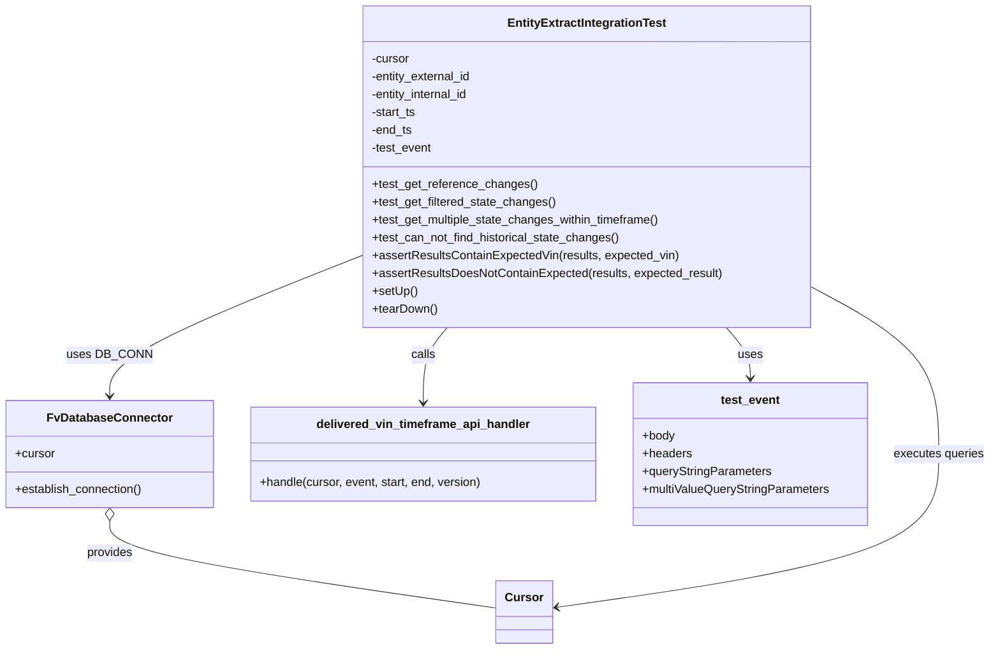
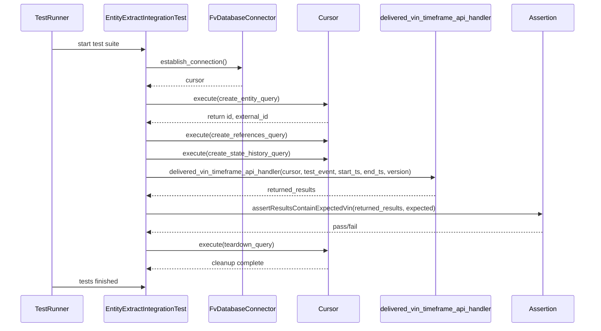

# Diagram: entity_core/entity_service/entity_service_tests/get_search_entity_tests/integration_tests/test_entity_extract_using_entity_search.py

> Auto-generated by Obscura crawlers

## Diagram 1

### SVG

<svg id="container" width="1329.234375" xmlns="http://www.w3.org/2000/svg" class="classDiagram" height="872" viewBox="0 0 1329.234375 872" role="graphics-document document" aria-roledescription="class"><g><defs><marker id="container_class-aggregationStart" class="marker aggregation class" refX="18" refY="7" markerWidth="190" markerHeight="240" orient="auto"><path d="M 18,7 L9,13 L1,7 L9,1 Z"></path></marker></defs><defs><marker id="container_class-aggregationEnd" class="marker aggregation class" refX="1" refY="7" markerWidth="20" markerHeight="28" orient="auto"><path d="M 18,7 L9,13 L1,7 L9,1 Z"></path></marker></defs><defs><marker id="container_class-extensionStart" class="marker extension class" refX="18" refY="7" markerWidth="190" markerHeight="240" orient="auto"><path d="M 1,7 L18,13 V 1 Z"></path></marker></defs><defs><marker id="container_class-extensionEnd" class="marker extension class" refX="1" refY="7" markerWidth="20" markerHeight="28" orient="auto"><path d="M 1,1 V 13 L18,7 Z"></path></marker></defs><defs><marker id="container_class-compositionStart" class="marker composition class" refX="18" refY="7" markerWidth="190" markerHeight="240" orient="auto"><path d="M 18,7 L9,13 L1,7 L9,1 Z"></path></marker></defs><defs><marker id="container_class-compositionEnd" class="marker composition class" refX="1" refY="7" markerWidth="20" markerHeight="28" orient="auto"><path d="M 18,7 L9,13 L1,7 L9,1 Z"></path></marker></defs><defs><marker id="container_class-dependencyStart" class="marker dependency class" refX="6" refY="7" markerWidth="190" markerHeight="240" orient="auto"><path d="M 5,7 L9,13 L1,7 L9,1 Z"></path></marker></defs><defs><marker id="container_class-dependencyEnd" class="marker dependency class" refX="13" refY="7" markerWidth="20" markerHeight="28" orient="auto"><path d="M 18,7 L9,13 L14,7 L9,1 Z"></path></marker></defs><defs><marker id="container_class-lollipopStart" class="marker lollipop class" refX="13" refY="7" markerWidth="190" markerHeight="240" orient="auto"><circle stroke="black" fill="transparent" cx="7" cy="7" r="6"></circle></marker></defs><defs><marker id="container_class-lollipopEnd" class="marker lollipop class" refX="1" refY="7" markerWidth="190" markerHeight="240" orient="auto"><circle stroke="black" fill="transparent" cx="7" cy="7" r="6"></circle></marker></defs><g class="root"><g class="clusters"></g><g class="edgePaths"><path d="M486.955,342.32L430.177,364.767C373.398,387.214,259.842,432.107,203.063,463.72C146.285,495.333,146.285,513.667,146.285,522.833L146.285,532" id="id_EntityExtractIntegrationTest_FvDatabaseConnector_1" class="edge-thickness-normal edge-pattern-solid relation" style=";;;" data-edge="true" data-et="edge" data-id="id_EntityExtractIntegrationTest_FvDatabaseConnector_1" data-points="W3sieCI6NDg2Ljk1NTA3ODEyNSwieSI6MzQyLjMyMDI5MDMwMTgwNzd9LHsieCI6MTQ2LjI4NTE1NjI1LCJ5Ijo0Nzd9LHsieCI6MTQ2LjI4NTE1NjI1LCJ5Ijo1Mzh9XQ==" marker-end="url(#container_class-dependencyEnd)"></path><path d="M598.526,440L593.167,446.167C587.808,452.333,577.09,464.667,571.73,481.5C566.371,498.333,566.371,519.667,566.371,530.333L566.371,541" id="id_EntityExtractIntegrationTest_delivered_vin_timeframe_api_handler_2" class="edge-thickness-normal edge-pattern-solid relation" style=";;;" data-edge="true" data-et="edge" data-id="id_EntityExtractIntegrationTest_delivered_vin_timeframe_api_handler_2" data-points="W3sieCI6NTk4LjUyNjQ0MDUyNjE4NTgsInkiOjQ0MH0seyJ4Ijo1NjYuMzcxMDkzNzUsInkiOjQ3N30seyJ4Ijo1NjYuMzcxMDkzNzUsInkiOjU0N31d" marker-end="url(#container_class-dependencyEnd)"></path><path d="M973.962,440L979.321,446.167C984.68,452.333,995.399,464.667,1000.758,476C1006.117,487.333,1006.117,497.667,1006.117,502.833L1006.117,508" id="id_EntityExtractIntegrationTest_test_event_3" class="edge-thickness-normal edge-pattern-solid relation" style=";;;" data-edge="true" data-et="edge" data-id="id_EntityExtractIntegrationTest_test_event_3" data-points="W3sieCI6OTczLjk2MTg0MDcyMzgxNDIsInkiOjQ0MH0seyJ4IjoxMDA2LjExNzE4NzUsInkiOjQ3N30seyJ4IjoxMDA2LjExNzE4NzUsInkiOjUxNH1d" marker-end="url(#container_class-dependencyEnd)"></path><path d="M146.285,699.25L146.285,706.542C146.285,713.833,146.285,728.417,233.123,748.026C319.96,767.636,493.635,792.271,580.473,804.589L667.311,816.907" id="id_FvDatabaseConnector_Cursor_4" class="edge-thickness-normal edge-pattern-solid relation" style=";;;" data-edge="true" data-et="edge" data-id="id_FvDatabaseConnector_Cursor_4" data-points="W3sieCI6MTQ2LjI4NTE1NjI1LCJ5Ijo2ODJ9LHsieCI6MTQ2LjI4NTE1NjI1LCJ5Ijo3NDN9LHsieCI6NjY3LjMxMDU0Njg3NSwieSI6ODE2LjkwNjc0Njk5ODkzNzR9XQ==" marker-start="url(#container_class-aggregationStart)"></path><path d="M745.064,816.064L830.911,803.887C916.759,791.709,1088.453,767.355,1174.301,733.011C1260.148,698.667,1260.148,654.333,1260.148,610C1260.148,565.667,1260.148,521.333,1231.046,483.63C1201.943,445.926,1143.738,414.853,1114.636,399.316L1085.533,383.779" id="id_Cursor_EntityExtractIntegrationTest_5" class="edge-thickness-normal edge-pattern-solid relation" style=";;;" data-edge="true" data-et="edge" data-id="id_Cursor_EntityExtractIntegrationTest_5" data-points="W3sieCI6NzM5LjEyMzA0Njg3NSwieSI6ODE2LjkwNjc0Njk5ODkzNzR9LHsieCI6MTI2MC4xNDg0Mzc1LCJ5Ijo3NDN9LHsieCI6MTI2MC4xNDg0Mzc1LCJ5Ijo2MTB9LHsieCI6MTI2MC4xNDg0Mzc1LCJ5Ijo0Nzd9LHsieCI6MTA4NS41MzMyMDMxMjUsInkiOjM4My43NzkzNzU5NDUzMzQ0NH1d" marker-start="url(#container_class-dependencyStart)"></path></g><g class="edgeLabels"><g class="edgeLabel" transform="translate(146.28515625, 477)"><g class="label" data-id="id_EntityExtractIntegrationTest_FvDatabaseConnector_1" transform="translate(-53.09375, -12)"><foreignObject width="106.1875" height="24">

uses DB_CONN

</foreignObject></g></g><g class="edgeLabel" transform="translate(566.37109375, 477)"><g class="label" data-id="id_EntityExtractIntegrationTest_delivered_vin_timeframe_api_handler_2" transform="translate(-16.4453125, -12)"><foreignObject width="32.890625" height="24">

calls

</foreignObject></g></g><g class="edgeLabel" transform="translate(1006.1171875, 477)"><g class="label" data-id="id_EntityExtractIntegrationTest_test_event_3" transform="translate(-16.4921875, -12)"><foreignObject width="32.984375" height="24">

uses

</foreignObject></g></g><g class="edgeLabel" transform="translate(146.28515625, 743)"><g class="label" data-id="id_FvDatabaseConnector_Cursor_4" transform="translate(-31.3125, -12)"><foreignObject width="62.625" height="24">

provides

</foreignObject></g></g><g class="edgeLabel" transform="translate(1260.1484375, 610)"><g class="label" data-id="id_Cursor_EntityExtractIntegrationTest_5" transform="translate(-61.0859375, -12)"><foreignObject width="122.171875" height="24">

executes queries

</foreignObject></g></g></g><g class="nodes"><g class="node default" id="classId-EntityExtractIntegrationTest-0" transform="translate(786.244140625, 224)"><g class="basic label-container"><path d="M-299.2890625 -216 L299.2890625 -216 L299.2890625 216 L-299.2890625 216" stroke="none" stroke-width="0" fill="#ECECFF" style=""></path><path d="M-299.2890625 -216 C-97.50906365332631 -216, 104.27093519334738 -216, 299.2890625 -216 M-299.2890625 -216 C-132.1973637184217 -216, 34.894335063156575 -216, 299.2890625 -216 M299.2890625 -216 C299.2890625 -50.899820018797385, 299.2890625 114.20035996240523, 299.2890625 216 M299.2890625 -216 C299.2890625 -69.8234112355743, 299.2890625 76.3531775288514, 299.2890625 216 M299.2890625 216 C67.18950663281535 216, -164.9100492343693 216, -299.2890625 216 M299.2890625 216 C111.4366457617142 216, -76.4157709765716 216, -299.2890625 216 M-299.2890625 216 C-299.2890625 104.93321838974134, -299.2890625 -6.133563220517317, -299.2890625 -216 M-299.2890625 216 C-299.2890625 67.94636771910635, -299.2890625 -80.1072645617873, -299.2890625 -216" stroke="#9370DB" stroke-width="1.3" fill="none" stroke-dasharray="0 0" style=""></path></g><g class="annotation-group text" transform="translate(0, -192)"></g><g class="label-group text" transform="translate(-102.828125, -192)"><g class="label" style="font-weight: bolder" transform="translate(0,-12)"><foreignObject width="205.65625" height="24">

EntityExtractIntegrationTest

</foreignObject></g></g><g class="members-group text" transform="translate(-287.2890625, -144)"><g class="label" style="" transform="translate(0,-12)"><foreignObject width="52.1875" height="24">

-cursor

</foreignObject></g><g class="label" style="" transform="translate(0,12)"><foreignObject width="137.703125" height="24">

-entity_external_id

</foreignObject></g><g class="label" style="" transform="translate(0,36)"><foreignObject width="135.578125" height="24">

-entity_internal_id

</foreignObject></g><g class="label" style="" transform="translate(0,60)"><foreignObject width="61.5" height="24">

-start_ts

</foreignObject></g><g class="label" style="" transform="translate(0,84)"><foreignObject width="55.375" height="24">

-end_ts

</foreignObject></g><g class="label" style="" transform="translate(0,108)"><foreignObject width="82.21875" height="24">

-test_event

</foreignObject></g></g><g class="methods-group text" transform="translate(-287.2890625, 24)"><g class="label" style="" transform="translate(0,-12)"><foreignObject width="220.34375" height="24">

+test_get_reference_changes()

</foreignObject></g><g class="label" style="" transform="translate(0,12)"><foreignObject width="248.390625" height="24">

+test_get_filtered_state_changes()

</foreignObject></g><g class="label" style="" transform="translate(0,36)"><foreignObject width="392.625" height="24">

+test_get_multiple_state_changes_within_timeframe()

</foreignObject></g><g class="label" style="" transform="translate(0,60)"><foreignObject width="335.734375" height="24">

+test_can_not_find_historical_state_changes()

</foreignObject></g><g class="label" style="" transform="translate(0,84)"><foreignObject width="412.265625" height="24">

+assertResultsContainExpectedVin(results, expected_vin)

</foreignObject></g><g class="label" style="" transform="translate(0,108)"><foreignObject width="471.75" height="24">

+assertResultsDoesNotContainExpected(results, expected_result)

</foreignObject></g><g class="label" style="" transform="translate(0,132)"><foreignObject width="60.421875" height="24">

+setUp()

</foreignObject></g><g class="label" style="" transform="translate(0,156)"><foreignObject width="87.75" height="24">

+tearDown()

</foreignObject></g></g><g class="divider" style=""><path d="M-299.2890625 -168 C-102.46814351607352 -168, 94.35277546785295 -168, 299.2890625 -168 M-299.2890625 -168 C-156.0421344244677 -168, -12.79520634893538 -168, 299.2890625 -168" stroke="#9370DB" stroke-width="1.3" fill="none" stroke-dasharray="0 0" style=""></path></g><g class="divider" style=""><path d="M-299.2890625 0 C-176.03138217661947 0, -52.77370185323895 0, 299.2890625 0 M-299.2890625 0 C-79.64577017654452 0, 139.99752214691097 0, 299.2890625 0" stroke="#9370DB" stroke-width="1.3" fill="none" stroke-dasharray="0 0" style=""></path></g></g><g class="node default" id="classId-FvDatabaseConnector-1" transform="translate(146.28515625, 610)"><g class="basic label-container"><path d="M-138.28515625 -72 L138.28515625 -72 L138.28515625 72 L-138.28515625 72" stroke="none" stroke-width="0" fill="#ECECFF" style=""></path><path d="M-138.28515625 -72 C-63.43915667067303 -72, 11.406842908653942 -72, 138.28515625 -72 M-138.28515625 -72 C-69.59127179580565 -72, -0.8973873416113065 -72, 138.28515625 -72 M138.28515625 -72 C138.28515625 -39.58985425733735, 138.28515625 -7.179708514674701, 138.28515625 72 M138.28515625 -72 C138.28515625 -34.55633178768397, 138.28515625 2.8873364246320534, 138.28515625 72 M138.28515625 72 C56.69227522351926 72, -24.90060580296148 72, -138.28515625 72 M138.28515625 72 C56.032590739448665 72, -26.21997477110267 72, -138.28515625 72 M-138.28515625 72 C-138.28515625 19.88423272463246, -138.28515625 -32.23153455073508, -138.28515625 -72 M-138.28515625 72 C-138.28515625 26.208369127168567, -138.28515625 -19.583261745662867, -138.28515625 -72" stroke="#9370DB" stroke-width="1.3" fill="none" stroke-dasharray="0 0" style=""></path></g><g class="annotation-group text" transform="translate(0, -48)"></g><g class="label-group text" transform="translate(-79.3046875, -48)"><g class="label" style="font-weight: bolder" transform="translate(0,-12)"><foreignObject width="158.609375" height="24">

FvDatabaseConnector

</foreignObject></g></g><g class="members-group text" transform="translate(-126.28515625, 0)"><g class="label" style="" transform="translate(0,-12)"><foreignObject width="53.71875" height="24">

+cursor

</foreignObject></g></g><g class="methods-group text" transform="translate(-126.28515625, 48)"><g class="label" style="" transform="translate(0,-12)"><foreignObject width="173.265625" height="24">

+establish_connection()

</foreignObject></g></g><g class="divider" style=""><path d="M-138.28515625 -24 C-59.14258317423854 -24, 19.999989901522923 -24, 138.28515625 -24 M-138.28515625 -24 C-49.07924333640426 -24, 40.12666957719148 -24, 138.28515625 -24" stroke="#9370DB" stroke-width="1.3" fill="none" stroke-dasharray="0 0" style=""></path></g><g class="divider" style=""><path d="M-138.28515625 24 C-34.67317434651585 24, 68.9388075569683 24, 138.28515625 24 M-138.28515625 24 C-70.02006601929293 24, -1.7549757885858526 24, 138.28515625 24" stroke="#9370DB" stroke-width="1.3" fill="none" stroke-dasharray="0 0" style=""></path></g></g><g class="node default" id="classId-delivered_vin_timeframe_api_handler-2" transform="translate(566.37109375, 610)"><g class="basic label-container"><path d="M-231.80078125 -63 L231.80078125 -63 L231.80078125 63 L-231.80078125 63" stroke="none" stroke-width="0" fill="#ECECFF" style=""></path><path d="M-231.80078125 -63 C-106.04772476103757 -63, 19.705331727924857 -63, 231.80078125 -63 M-231.80078125 -63 C-70.62920670908835 -63, 90.5423678318233 -63, 231.80078125 -63 M231.80078125 -63 C231.80078125 -24.125406046116716, 231.80078125 14.749187907766569, 231.80078125 63 M231.80078125 -63 C231.80078125 -32.164559876015744, 231.80078125 -1.3291197520314881, 231.80078125 63 M231.80078125 63 C120.65754340253007 63, 9.514305555060133 63, -231.80078125 63 M231.80078125 63 C109.9316872284064 63, -11.937406793187193 63, -231.80078125 63 M-231.80078125 63 C-231.80078125 15.601116656025653, -231.80078125 -31.797766687948695, -231.80078125 -63 M-231.80078125 63 C-231.80078125 34.62399864187608, -231.80078125 6.247997283752156, -231.80078125 -63" stroke="#9370DB" stroke-width="1.3" fill="none" stroke-dasharray="0 0" style=""></path></g><g class="annotation-group text" transform="translate(0, -39)"></g><g class="label-group text" transform="translate(-139.0390625, -39)"><g class="label" style="font-weight: bolder" transform="translate(0,-12)"><foreignObject width="278.078125" height="24">

delivered_vin_timeframe_api_handler

</foreignObject></g></g><g class="members-group text" transform="translate(-219.80078125, 9)"></g><g class="methods-group text" transform="translate(-219.80078125, 39)"><g class="label" style="" transform="translate(0,-12)"><foreignObject width="300.5625" height="24">

+handle(cursor, event, start, end, version)

</foreignObject></g></g><g class="divider" style=""><path d="M-231.80078125 -15 C-124.43604534141464 -15, -17.07130943282928 -15, 231.80078125 -15 M-231.80078125 -15 C-90.48487056037033 -15, 50.83104012925935 -15, 231.80078125 -15" stroke="#9370DB" stroke-width="1.3" fill="none" stroke-dasharray="0 0" style=""></path></g><g class="divider" style=""><path d="M-231.80078125 9 C-61.70678634729276 9, 108.38720855541447 9, 231.80078125 9 M-231.80078125 9 C-122.73303848841418 9, -13.665295726828361 9, 231.80078125 9" stroke="#9370DB" stroke-width="1.3" fill="none" stroke-dasharray="0 0" style=""></path></g></g><g class="node default" id="classId-test_event-3" transform="translate(1006.1171875, 610)"><g class="basic label-container"><path d="M-157.9453125 -96 L157.9453125 -96 L157.9453125 96 L-157.9453125 96" stroke="none" stroke-width="0" fill="#ECECFF" style=""></path><path d="M-157.9453125 -96 C-85.47960862960286 -96, -13.01390475920573 -96, 157.9453125 -96 M-157.9453125 -96 C-61.886087224359855 -96, 34.17313805128029 -96, 157.9453125 -96 M157.9453125 -96 C157.9453125 -55.03248560426364, 157.9453125 -14.064971208527282, 157.9453125 96 M157.9453125 -96 C157.9453125 -19.49583681718991, 157.9453125 57.00832636562018, 157.9453125 96 M157.9453125 96 C37.300472838993755 96, -83.34436682201249 96, -157.9453125 96 M157.9453125 96 C57.03210874953908 96, -43.881095000921846 96, -157.9453125 96 M-157.9453125 96 C-157.9453125 19.266062480319746, -157.9453125 -57.46787503936051, -157.9453125 -96 M-157.9453125 96 C-157.9453125 54.42794687209512, -157.9453125 12.85589374419024, -157.9453125 -96" stroke="#9370DB" stroke-width="1.3" fill="none" stroke-dasharray="0 0" style=""></path></g><g class="annotation-group text" transform="translate(0, -72)"></g><g class="label-group text" transform="translate(-38.828125, -72)"><g class="label" style="font-weight: bolder" transform="translate(0,-12)"><foreignObject width="77.65625" height="24">

test_event

</foreignObject></g></g><g class="members-group text" transform="translate(-145.9453125, -24)"><g class="label" style="" transform="translate(0,-12)"><foreignObject width="44.28125" height="24">

+body

</foreignObject></g><g class="label" style="" transform="translate(0,12)"><foreignObject width="66.328125" height="24">

+headers

</foreignObject></g><g class="label" style="" transform="translate(0,36)"><foreignObject width="174.0625" height="24">

+queryStringParameters

</foreignObject></g><g class="label" style="" transform="translate(0,60)"><foreignObject width="253.0625" height="24">

+multiValueQueryStringParameters

</foreignObject></g></g><g class="methods-group text" transform="translate(-145.9453125, 96)"></g><g class="divider" style=""><path d="M-157.9453125 -48 C-60.24946253872062 -48, 37.44638742255876 -48, 157.9453125 -48 M-157.9453125 -48 C-71.32620805223378 -48, 15.292896395532438 -48, 157.9453125 -48" stroke="#9370DB" stroke-width="1.3" fill="none" stroke-dasharray="0 0" style=""></path></g><g class="divider" style=""><path d="M-157.9453125 72 C-65.73845458289811 72, 26.46840333420377 72, 157.9453125 72 M-157.9453125 72 C-34.65841861138469 72, 88.62847527723062 72, 157.9453125 72" stroke="#9370DB" stroke-width="1.3" fill="none" stroke-dasharray="0 0" style=""></path></g></g><g class="node default" id="classId-Cursor-4" transform="translate(703.216796875, 822)"><g class="basic label-container"><path d="M-35.90625 -42 L35.90625 -42 L35.90625 42 L-35.90625 42" stroke="none" stroke-width="0" fill="#ECECFF" style=""></path><path d="M-35.90625 -42 C-14.928360132356488 -42, 6.049529735287024 -42, 35.90625 -42 M-35.90625 -42 C-12.45151480763002 -42, 11.003220384739961 -42, 35.90625 -42 M35.90625 -42 C35.90625 -20.67395192680172, 35.90625 0.6520961463965591, 35.90625 42 M35.90625 -42 C35.90625 -23.969837695650682, 35.90625 -5.939675391301364, 35.90625 42 M35.90625 42 C15.533263251710505 42, -4.839723496578991 42, -35.90625 42 M35.90625 42 C9.962683848362435 42, -15.98088230327513 42, -35.90625 42 M-35.90625 42 C-35.90625 19.555934777159123, -35.90625 -2.888130445681753, -35.90625 -42 M-35.90625 42 C-35.90625 9.147717893328995, -35.90625 -23.70456421334201, -35.90625 -42" stroke="#9370DB" stroke-width="1.3" fill="none" stroke-dasharray="0 0" style=""></path></g><g class="annotation-group text" transform="translate(0, -18)"></g><g class="label-group text" transform="translate(-23.90625, -18)"><g class="label" style="font-weight: bolder" transform="translate(0,-12)"><foreignObject width="47.8125" height="24">

Cursor

</foreignObject></g></g><g class="members-group text" transform="translate(-23.90625, 30)"></g><g class="methods-group text" transform="translate(-23.90625, 60)"></g><g class="divider" style=""><path d="M-35.90625 6 C-18.93279464353715 6, -1.9593392870743003 6, 35.90625 6 M-35.90625 6 C-20.00122849424677 6, -4.096206988493542 6, 35.90625 6" stroke="#9370DB" stroke-width="1.3" fill="none" stroke-dasharray="0 0" style=""></path></g><g class="divider" style=""><path d="M-35.90625 24 C-17.420383098131516 24, 1.0654838037369672 24, 35.90625 24 M-35.90625 24 C-7.304731322647967 24, 21.296787354704065 24, 35.90625 24" stroke="#9370DB" stroke-width="1.3" fill="none" stroke-dasharray="0 0" style=""></path></g></g></g></g></g></svg>

## Diagram 2

### SVG

<svg id="container" width="1495" xmlns="http://www.w3.org/2000/svg" height="843" viewBox="-50 -10 1495 843" role="graphics-document document" aria-roledescription="sequence"><g><rect x="1245" y="757" fill="#eaeaea" stroke="#666" width="150" height="65" name="Assertion" rx="3" ry="3" class="actor actor-bottom"></rect><text x="1320" y="789.5" dominant-baseline="central" alignment-baseline="central" class="actor actor-box" style="text-anchor: middle; font-size: 16px; font-weight: 400;"><tspan x="1320" dy="0">Assertion</tspan></text></g><g><rect x="898" y="757" fill="#eaeaea" stroke="#666" width="297" height="65" name="Handler" rx="3" ry="3" class="actor actor-bottom"></rect><text x="1046.5" y="789.5" dominant-baseline="central" alignment-baseline="central" class="actor actor-box" style="text-anchor: middle; font-size: 16px; font-weight: 400;"><tspan x="1046.5" dy="0">delivered_vin_timeframe_api_handler</tspan></text></g><g><rect x="698" y="757" fill="#eaeaea" stroke="#666" width="150" height="65" name="Cursor" rx="3" ry="3" class="actor actor-bottom"></rect><text x="773" y="789.5" dominant-baseline="central" alignment-baseline="central" class="actor actor-box" style="text-anchor: middle; font-size: 16px; font-weight: 400;"><tspan x="773" dy="0">Cursor</tspan></text></g><g><rect x="471" y="757" fill="#eaeaea" stroke="#666" width="177" height="65" name="DB" rx="3" ry="3" class="actor actor-bottom"></rect><text x="559.5" y="789.5" dominant-baseline="central" alignment-baseline="central" class="actor actor-box" style="text-anchor: middle; font-size: 16px; font-weight: 400;"><tspan x="559.5" dy="0">FvDatabaseConnector</tspan></text></g><g><rect x="200" y="757" fill="#eaeaea" stroke="#666" width="221" height="65" name="TestCase" rx="3" ry="3" class="actor actor-bottom"></rect><text x="310.5" y="789.5" dominant-baseline="central" alignment-baseline="central" class="actor actor-box" style="text-anchor: middle; font-size: 16px; font-weight: 400;"><tspan x="310.5" dy="0">EntityExtractIntegrationTest</tspan></text></g><g><rect x="0" y="757" fill="#eaeaea" stroke="#666" width="150" height="65" name="Runner" rx="3" ry="3" class="actor actor-bottom"></rect><text x="75" y="789.5" dominant-baseline="central" alignment-baseline="central" class="actor actor-box" style="text-anchor: middle; font-size: 16px; font-weight: 400;"><tspan x="75" dy="0">TestRunner</tspan></text></g><g><line id="actor5" x1="1320" y1="65" x2="1320" y2="757" class="actor-line 200" stroke-width="0.5px" stroke="#999" name="Assertion"></line><g id="root-5"><rect x="1245" y="0" fill="#eaeaea" stroke="#666" width="150" height="65" name="Assertion" rx="3" ry="3" class="actor actor-top"></rect><text x="1320" y="32.5" dominant-baseline="central" alignment-baseline="central" class="actor actor-box" style="text-anchor: middle; font-size: 16px; font-weight: 400;"><tspan x="1320" dy="0">Assertion</tspan></text></g></g><g><line id="actor4" x1="1046.5" y1="65" x2="1046.5" y2="757" class="actor-line 200" stroke-width="0.5px" stroke="#999" name="Handler"></line><g id="root-4"><rect x="898" y="0" fill="#eaeaea" stroke="#666" width="297" height="65" name="Handler" rx="3" ry="3" class="actor actor-top"></rect><text x="1046.5" y="32.5" dominant-baseline="central" alignment-baseline="central" class="actor actor-box" style="text-anchor: middle; font-size: 16px; font-weight: 400;"><tspan x="1046.5" dy="0">delivered_vin_timeframe_api_handler</tspan></text></g></g><g><line id="actor3" x1="773" y1="65" x2="773" y2="757" class="actor-line 200" stroke-width="0.5px" stroke="#999" name="Cursor"></line><g id="root-3"><rect x="698" y="0" fill="#eaeaea" stroke="#666" width="150" height="65" name="Cursor" rx="3" ry="3" class="actor actor-top"></rect><text x="773" y="32.5" dominant-baseline="central" alignment-baseline="central" class="actor actor-box" style="text-anchor: middle; font-size: 16px; font-weight: 400;"><tspan x="773" dy="0">Cursor</tspan></text></g></g><g><line id="actor2" x1="559.5" y1="65" x2="559.5" y2="757" class="actor-line 200" stroke-width="0.5px" stroke="#999" name="DB"></line><g id="root-2"><rect x="471" y="0" fill="#eaeaea" stroke="#666" width="177" height="65" name="DB" rx="3" ry="3" class="actor actor-top"></rect><text x="559.5" y="32.5" dominant-baseline="central" alignment-baseline="central" class="actor actor-box" style="text-anchor: middle; font-size: 16px; font-weight: 400;"><tspan x="559.5" dy="0">FvDatabaseConnector</tspan></text></g></g><g><line id="actor1" x1="310.5" y1="65" x2="310.5" y2="757" class="actor-line 200" stroke-width="0.5px" stroke="#999" name="TestCase"></line><g id="root-1"><rect x="200" y="0" fill="#eaeaea" stroke="#666" width="221" height="65" name="TestCase" rx="3" ry="3" class="actor actor-top"></rect><text x="310.5" y="32.5" dominant-baseline="central" alignment-baseline="central" class="actor actor-box" style="text-anchor: middle; font-size: 16px; font-weight: 400;"><tspan x="310.5" dy="0">EntityExtractIntegrationTest</tspan></text></g></g><g><line id="actor0" x1="75" y1="65" x2="75" y2="757" class="actor-line 200" stroke-width="0.5px" stroke="#999" name="Runner"></line><g id="root-0"><rect x="0" y="0" fill="#eaeaea" stroke="#666" width="150" height="65" name="Runner" rx="3" ry="3" class="actor actor-top"></rect><text x="75" y="32.5" dominant-baseline="central" alignment-baseline="central" class="actor actor-box" style="text-anchor: middle; font-size: 16px; font-weight: 400;"><tspan x="75" dy="0">TestRunner</tspan></text></g></g><g></g><defs><symbol id="computer" width="24" height="24"><path transform="scale(.5)" d="M2 2v13h20v-13h-20zm18 11h-16v-9h16v9zm-10.228 6l.466-1h3.524l.467 1h-4.457zm14.228 3h-24l2-6h2.104l-1.33 4h18.45l-1.297-4h2.073l2 6zm-5-10h-14v-7h14v7z"></path></symbol></defs><defs><symbol id="database" fill-rule="evenodd" clip-rule="evenodd"><path transform="scale(.5)" d="M12.258.001l.256.004.255.005.253.008.251.01.249.012.247.015.246.016.242.019.241.02.239.023.236.024.233.027.231.028.229.031.225.032.223.034.22.036.217.038.214.04.211.041.208.043.205.045.201.046.198.048.194.05.191.051.187.053.183.054.18.056.175.057.172.059.168.06.163.061.16.063.155.064.15.066.074.033.073.033.071.034.07.034.069.035.068.035.067.035.066.035.064.036.064.036.062.036.06.036.06.037.058.037.058.037.055.038.055.038.053.038.052.038.051.039.05.039.048.039.047.039.045.04.044.04.043.04.041.04.04.041.039.041.037.041.036.041.034.041.033.042.032.042.03.042.029.042.027.042.026.043.024.043.023.043.021.043.02.043.018.044.017.043.015.044.013.044.012.044.011.045.009.044.007.045.006.045.004.045.002.045.001.045v17l-.001.045-.002.045-.004.045-.006.045-.007.045-.009.044-.011.045-.012.044-.013.044-.015.044-.017.043-.018.044-.02.043-.021.043-.023.043-.024.043-.026.043-.027.042-.029.042-.03.042-.032.042-.033.042-.034.041-.036.041-.037.041-.039.041-.04.041-.041.04-.043.04-.044.04-.045.04-.047.039-.048.039-.05.039-.051.039-.052.038-.053.038-.055.038-.055.038-.058.037-.058.037-.06.037-.06.036-.062.036-.064.036-.064.036-.066.035-.067.035-.068.035-.069.035-.07.034-.071.034-.073.033-.074.033-.15.066-.155.064-.16.063-.163.061-.168.06-.172.059-.175.057-.18.056-.183.054-.187.053-.191.051-.194.05-.198.048-.201.046-.205.045-.208.043-.211.041-.214.04-.217.038-.22.036-.223.034-.225.032-.229.031-.231.028-.233.027-.236.024-.239.023-.241.02-.242.019-.246.016-.247.015-.249.012-.251.01-.253.008-.255.005-.256.004-.258.001-.258-.001-.256-.004-.255-.005-.253-.008-.251-.01-.249-.012-.247-.015-.245-.016-.243-.019-.241-.02-.238-.023-.236-.024-.234-.027-.231-.028-.228-.031-.226-.032-.223-.034-.22-.036-.217-.038-.214-.04-.211-.041-.208-.043-.204-.045-.201-.046-.198-.048-.195-.05-.19-.051-.187-.053-.184-.054-.179-.056-.176-.057-.172-.059-.167-.06-.164-.061-.159-.063-.155-.064-.151-.066-.074-.033-.072-.033-.072-.034-.07-.034-.069-.035-.068-.035-.067-.035-.066-.035-.064-.036-.063-.036-.062-.036-.061-.036-.06-.037-.058-.037-.057-.037-.056-.038-.055-.038-.053-.038-.052-.038-.051-.039-.049-.039-.049-.039-.046-.039-.046-.04-.044-.04-.043-.04-.041-.04-.04-.041-.039-.041-.037-.041-.036-.041-.034-.041-.033-.042-.032-.042-.03-.042-.029-.042-.027-.042-.026-.043-.024-.043-.023-.043-.021-.043-.02-.043-.018-.044-.017-.043-.015-.044-.013-.044-.012-.044-.011-.045-.009-.044-.007-.045-.006-.045-.004-.045-.002-.045-.001-.045v-17l.001-.045.002-.045.004-.045.006-.045.007-.045.009-.044.011-.045.012-.044.013-.044.015-.044.017-.043.018-.044.02-.043.021-.043.023-.043.024-.043.026-.043.027-.042.029-.042.03-.042.032-.042.033-.042.034-.041.036-.041.037-.041.039-.041.04-.041.041-.04.043-.04.044-.04.046-.04.046-.039.049-.039.049-.039.051-.039.052-.038.053-.038.055-.038.056-.038.057-.037.058-.037.06-.037.061-.036.062-.036.063-.036.064-.036.066-.035.067-.035.068-.035.069-.035.07-.034.072-.034.072-.033.074-.033.151-.066.155-.064.159-.063.164-.061.167-.06.172-.059.176-.057.179-.056.184-.054.187-.053.19-.051.195-.05.198-.048.201-.046.204-.045.208-.043.211-.041.214-.04.217-.038.22-.036.223-.034.226-.032.228-.031.231-.028.234-.027.236-.024.238-.023.241-.02.243-.019.245-.016.247-.015.249-.012.251-.01.253-.008.255-.005.256-.004.258-.001.258.001zm-9.258 20.499v.01l.001.021.003.021.004.022.005.021.006.022.007.022.009.023.01.022.011.023.012.023.013.023.015.023.016.024.017.023.018.024.019.024.021.024.022.025.023.024.024.025.052.049.056.05.061.051.066.051.07.051.075.051.079.052.084.052.088.052.092.052.097.052.102.051.105.052.11.052.114.051.119.051.123.051.127.05.131.05.135.05.139.048.144.049.147.047.152.047.155.047.16.045.163.045.167.043.171.043.176.041.178.041.183.039.187.039.19.037.194.035.197.035.202.033.204.031.209.03.212.029.216.027.219.025.222.024.226.021.23.02.233.018.236.016.24.015.243.012.246.01.249.008.253.005.256.004.259.001.26-.001.257-.004.254-.005.25-.008.247-.011.244-.012.241-.014.237-.016.233-.018.231-.021.226-.021.224-.024.22-.026.216-.027.212-.028.21-.031.205-.031.202-.034.198-.034.194-.036.191-.037.187-.039.183-.04.179-.04.175-.042.172-.043.168-.044.163-.045.16-.046.155-.046.152-.047.148-.048.143-.049.139-.049.136-.05.131-.05.126-.05.123-.051.118-.052.114-.051.11-.052.106-.052.101-.052.096-.052.092-.052.088-.053.083-.051.079-.052.074-.052.07-.051.065-.051.06-.051.056-.05.051-.05.023-.024.023-.025.021-.024.02-.024.019-.024.018-.024.017-.024.015-.023.014-.024.013-.023.012-.023.01-.023.01-.022.008-.022.006-.022.006-.022.004-.022.004-.021.001-.021.001-.021v-4.127l-.077.055-.08.053-.083.054-.085.053-.087.052-.09.052-.093.051-.095.05-.097.05-.1.049-.102.049-.105.048-.106.047-.109.047-.111.046-.114.045-.115.045-.118.044-.12.043-.122.042-.124.042-.126.041-.128.04-.13.04-.132.038-.134.038-.135.037-.138.037-.139.035-.142.035-.143.034-.144.033-.147.032-.148.031-.15.03-.151.03-.153.029-.154.027-.156.027-.158.026-.159.025-.161.024-.162.023-.163.022-.165.021-.166.02-.167.019-.169.018-.169.017-.171.016-.173.015-.173.014-.175.013-.175.012-.177.011-.178.01-.179.008-.179.008-.181.006-.182.005-.182.004-.184.003-.184.002h-.37l-.184-.002-.184-.003-.182-.004-.182-.005-.181-.006-.179-.008-.179-.008-.178-.01-.176-.011-.176-.012-.175-.013-.173-.014-.172-.015-.171-.016-.17-.017-.169-.018-.167-.019-.166-.02-.165-.021-.163-.022-.162-.023-.161-.024-.159-.025-.157-.026-.156-.027-.155-.027-.153-.029-.151-.03-.15-.03-.148-.031-.146-.032-.145-.033-.143-.034-.141-.035-.14-.035-.137-.037-.136-.037-.134-.038-.132-.038-.13-.04-.128-.04-.126-.041-.124-.042-.122-.042-.12-.044-.117-.043-.116-.045-.113-.045-.112-.046-.109-.047-.106-.047-.105-.048-.102-.049-.1-.049-.097-.05-.095-.05-.093-.052-.09-.051-.087-.052-.085-.053-.083-.054-.08-.054-.077-.054v4.127zm0-5.654v.011l.001.021.003.021.004.021.005.022.006.022.007.022.009.022.01.022.011.023.012.023.013.023.015.024.016.023.017.024.018.024.019.024.021.024.022.024.023.025.024.024.052.05.056.05.061.05.066.051.07.051.075.052.079.051.084.052.088.052.092.052.097.052.102.052.105.052.11.051.114.051.119.052.123.05.127.051.131.05.135.049.139.049.144.048.147.048.152.047.155.046.16.045.163.045.167.044.171.042.176.042.178.04.183.04.187.038.19.037.194.036.197.034.202.033.204.032.209.03.212.028.216.027.219.025.222.024.226.022.23.02.233.018.236.016.24.014.243.012.246.01.249.008.253.006.256.003.259.001.26-.001.257-.003.254-.006.25-.008.247-.01.244-.012.241-.015.237-.016.233-.018.231-.02.226-.022.224-.024.22-.025.216-.027.212-.029.21-.03.205-.032.202-.033.198-.035.194-.036.191-.037.187-.039.183-.039.179-.041.175-.042.172-.043.168-.044.163-.045.16-.045.155-.047.152-.047.148-.048.143-.048.139-.05.136-.049.131-.05.126-.051.123-.051.118-.051.114-.052.11-.052.106-.052.101-.052.096-.052.092-.052.088-.052.083-.052.079-.052.074-.051.07-.052.065-.051.06-.05.056-.051.051-.049.023-.025.023-.024.021-.025.02-.024.019-.024.018-.024.017-.024.015-.023.014-.023.013-.024.012-.022.01-.023.01-.023.008-.022.006-.022.006-.022.004-.021.004-.022.001-.021.001-.021v-4.139l-.077.054-.08.054-.083.054-.085.052-.087.053-.09.051-.093.051-.095.051-.097.05-.1.049-.102.049-.105.048-.106.047-.109.047-.111.046-.114.045-.115.044-.118.044-.12.044-.122.042-.124.042-.126.041-.128.04-.13.039-.132.039-.134.038-.135.037-.138.036-.139.036-.142.035-.143.033-.144.033-.147.033-.148.031-.15.03-.151.03-.153.028-.154.028-.156.027-.158.026-.159.025-.161.024-.162.023-.163.022-.165.021-.166.02-.167.019-.169.018-.169.017-.171.016-.173.015-.173.014-.175.013-.175.012-.177.011-.178.009-.179.009-.179.007-.181.007-.182.005-.182.004-.184.003-.184.002h-.37l-.184-.002-.184-.003-.182-.004-.182-.005-.181-.007-.179-.007-.179-.009-.178-.009-.176-.011-.176-.012-.175-.013-.173-.014-.172-.015-.171-.016-.17-.017-.169-.018-.167-.019-.166-.02-.165-.021-.163-.022-.162-.023-.161-.024-.159-.025-.157-.026-.156-.027-.155-.028-.153-.028-.151-.03-.15-.03-.148-.031-.146-.033-.145-.033-.143-.033-.141-.035-.14-.036-.137-.036-.136-.037-.134-.038-.132-.039-.13-.039-.128-.04-.126-.041-.124-.042-.122-.043-.12-.043-.117-.044-.116-.044-.113-.046-.112-.046-.109-.046-.106-.047-.105-.048-.102-.049-.1-.049-.097-.05-.095-.051-.093-.051-.09-.051-.087-.053-.085-.052-.083-.054-.08-.054-.077-.054v4.139zm0-5.666v.011l.001.02.003.022.004.021.005.022.006.021.007.022.009.023.01.022.011.023.012.023.013.023.015.023.016.024.017.024.018.023.019.024.021.025.022.024.023.024.024.025.052.05.056.05.061.05.066.051.07.051.075.052.079.051.084.052.088.052.092.052.097.052.102.052.105.051.11.052.114.051.119.051.123.051.127.05.131.05.135.05.139.049.144.048.147.048.152.047.155.046.16.045.163.045.167.043.171.043.176.042.178.04.183.04.187.038.19.037.194.036.197.034.202.033.204.032.209.03.212.028.216.027.219.025.222.024.226.021.23.02.233.018.236.017.24.014.243.012.246.01.249.008.253.006.256.003.259.001.26-.001.257-.003.254-.006.25-.008.247-.01.244-.013.241-.014.237-.016.233-.018.231-.02.226-.022.224-.024.22-.025.216-.027.212-.029.21-.03.205-.032.202-.033.198-.035.194-.036.191-.037.187-.039.183-.039.179-.041.175-.042.172-.043.168-.044.163-.045.16-.045.155-.047.152-.047.148-.048.143-.049.139-.049.136-.049.131-.051.126-.05.123-.051.118-.052.114-.051.11-.052.106-.052.101-.052.096-.052.092-.052.088-.052.083-.052.079-.052.074-.052.07-.051.065-.051.06-.051.056-.05.051-.049.023-.025.023-.025.021-.024.02-.024.019-.024.018-.024.017-.024.015-.023.014-.024.013-.023.012-.023.01-.022.01-.023.008-.022.006-.022.006-.022.004-.022.004-.021.001-.021.001-.021v-4.153l-.077.054-.08.054-.083.053-.085.053-.087.053-.09.051-.093.051-.095.051-.097.05-.1.049-.102.048-.105.048-.106.048-.109.046-.111.046-.114.046-.115.044-.118.044-.12.043-.122.043-.124.042-.126.041-.128.04-.13.039-.132.039-.134.038-.135.037-.138.036-.139.036-.142.034-.143.034-.144.033-.147.032-.148.032-.15.03-.151.03-.153.028-.154.028-.156.027-.158.026-.159.024-.161.024-.162.023-.163.023-.165.021-.166.02-.167.019-.169.018-.169.017-.171.016-.173.015-.173.014-.175.013-.175.012-.177.01-.178.01-.179.009-.179.007-.181.006-.182.006-.182.004-.184.003-.184.001-.185.001-.185-.001-.184-.001-.184-.003-.182-.004-.182-.006-.181-.006-.179-.007-.179-.009-.178-.01-.176-.01-.176-.012-.175-.013-.173-.014-.172-.015-.171-.016-.17-.017-.169-.018-.167-.019-.166-.02-.165-.021-.163-.023-.162-.023-.161-.024-.159-.024-.157-.026-.156-.027-.155-.028-.153-.028-.151-.03-.15-.03-.148-.032-.146-.032-.145-.033-.143-.034-.141-.034-.14-.036-.137-.036-.136-.037-.134-.038-.132-.039-.13-.039-.128-.041-.126-.041-.124-.041-.122-.043-.12-.043-.117-.044-.116-.044-.113-.046-.112-.046-.109-.046-.106-.048-.105-.048-.102-.048-.1-.05-.097-.049-.095-.051-.093-.051-.09-.052-.087-.052-.085-.053-.083-.053-.08-.054-.077-.054v4.153zm8.74-8.179l-.257.004-.254.005-.25.008-.247.011-.244.012-.241.014-.237.016-.233.018-.231.021-.226.022-.224.023-.22.026-.216.027-.212.028-.21.031-.205.032-.202.033-.198.034-.194.036-.191.038-.187.038-.183.04-.179.041-.175.042-.172.043-.168.043-.163.045-.16.046-.155.046-.152.048-.148.048-.143.048-.139.049-.136.05-.131.05-.126.051-.123.051-.118.051-.114.052-.11.052-.106.052-.101.052-.096.052-.092.052-.088.052-.083.052-.079.052-.074.051-.07.052-.065.051-.06.05-.056.05-.051.05-.023.025-.023.024-.021.024-.02.025-.019.024-.018.024-.017.023-.015.024-.014.023-.013.023-.012.023-.01.023-.01.022-.008.022-.006.023-.006.021-.004.022-.004.021-.001.021-.001.021.001.021.001.021.004.021.004.022.006.021.006.023.008.022.01.022.01.023.012.023.013.023.014.023.015.024.017.023.018.024.019.024.02.025.021.024.023.024.023.025.051.05.056.05.06.05.065.051.07.052.074.051.079.052.083.052.088.052.092.052.096.052.101.052.106.052.11.052.114.052.118.051.123.051.126.051.131.05.136.05.139.049.143.048.148.048.152.048.155.046.16.046.163.045.168.043.172.043.175.042.179.041.183.04.187.038.191.038.194.036.198.034.202.033.205.032.21.031.212.028.216.027.22.026.224.023.226.022.231.021.233.018.237.016.241.014.244.012.247.011.25.008.254.005.257.004.26.001.26-.001.257-.004.254-.005.25-.008.247-.011.244-.012.241-.014.237-.016.233-.018.231-.021.226-.022.224-.023.22-.026.216-.027.212-.028.21-.031.205-.032.202-.033.198-.034.194-.036.191-.038.187-.038.183-.04.179-.041.175-.042.172-.043.168-.043.163-.045.16-.046.155-.046.152-.048.148-.048.143-.048.139-.049.136-.05.131-.05.126-.051.123-.051.118-.051.114-.052.11-.052.106-.052.101-.052.096-.052.092-.052.088-.052.083-.052.079-.052.074-.051.07-.052.065-.051.06-.05.056-.05.051-.05.023-.025.023-.024.021-.024.02-.025.019-.024.018-.024.017-.023.015-.024.014-.023.013-.023.012-.023.01-.023.01-.022.008-.022.006-.023.006-.021.004-.022.004-.021.001-.021.001-.021-.001-.021-.001-.021-.004-.021-.004-.022-.006-.021-.006-.023-.008-.022-.01-.022-.01-.023-.012-.023-.013-.023-.014-.023-.015-.024-.017-.023-.018-.024-.019-.024-.02-.025-.021-.024-.023-.024-.023-.025-.051-.05-.056-.05-.06-.05-.065-.051-.07-.052-.074-.051-.079-.052-.083-.052-.088-.052-.092-.052-.096-.052-.101-.052-.106-.052-.11-.052-.114-.052-.118-.051-.123-.051-.126-.051-.131-.05-.136-.05-.139-.049-.143-.048-.148-.048-.152-.048-.155-.046-.16-.046-.163-.045-.168-.043-.172-.043-.175-.042-.179-.041-.183-.04-.187-.038-.191-.038-.194-.036-.198-.034-.202-.033-.205-.032-.21-.031-.212-.028-.216-.027-.22-.026-.224-.023-.226-.022-.231-.021-.233-.018-.237-.016-.241-.014-.244-.012-.247-.011-.25-.008-.254-.005-.257-.004-.26-.001-.26.001z"></path></symbol></defs><defs><symbol id="clock" width="24" height="24"><path transform="scale(.5)" d="M12 2c5.514 0 10 4.486 10 10s-4.486 10-10 10-10-4.486-10-10 4.486-10 10-10zm0-2c-6.627 0-12 5.373-12 12s5.373 12 12 12 12-5.373 12-12-5.373-12-12-12zm5.848 12.459c.202.038.202.333.001.372-1.907.361-6.045 1.111-6.547 1.111-.719 0-1.301-.582-1.301-1.301 0-.512.77-5.447 1.125-7.445.034-.192.312-.181.343.014l.985 6.238 5.394 1.011z"></path></symbol></defs><defs><marker id="arrowhead" refX="7.9" refY="5" markerUnits="userSpaceOnUse" markerWidth="12" markerHeight="12" orient="auto-start-reverse"><path d="M -1 0 L 10 5 L 0 10 z"></path></marker></defs><defs><marker id="crosshead" markerWidth="15" markerHeight="8" orient="auto" refX="4" refY="4.5"><path fill="none" stroke="#000000" stroke-width="1pt" d="M 1,2 L 6,7 M 6,2 L 1,7" style="stroke-dasharray: 0, 0;"></path></marker></defs><defs><marker id="filled-head" refX="15.5" refY="7" markerWidth="20" markerHeight="28" orient="auto"><path d="M 18,7 L9,13 L14,7 L9,1 Z"></path></marker></defs><defs><marker id="sequencenumber" refX="15" refY="15" markerWidth="60" markerHeight="40" orient="auto"><circle cx="15" cy="15" r="6"></circle></marker></defs><text x="191" y="80" text-anchor="middle" dominant-baseline="middle" alignment-baseline="middle" class="messageText" dy="1em" style="font-size: 16px; font-weight: 400;">start test suite</text><line x1="76" y1="113" x2="306.5" y2="113" class="messageLine0" stroke-width="2" stroke="none" marker-end="url(#arrowhead)" style="fill: none;"></line><text x="434" y="128" text-anchor="middle" dominant-baseline="middle" alignment-baseline="middle" class="messageText" dy="1em" style="font-size: 16px; font-weight: 400;">establish_connection()</text><line x1="311.5" y1="161" x2="555.5" y2="161" class="messageLine0" stroke-width="2" stroke="none" marker-end="url(#arrowhead)" style="fill: none;"></line><text x="437" y="176" text-anchor="middle" dominant-baseline="middle" alignment-baseline="middle" class="messageText" dy="1em" style="font-size: 16px; font-weight: 400;">cursor</text><line x1="558.5" y1="209" x2="314.5" y2="209" class="messageLine1" stroke-width="2" stroke="none" marker-end="url(#arrowhead)" style="stroke-dasharray: 3, 3; fill: none;"></line><text x="540" y="224" text-anchor="middle" dominant-baseline="middle" alignment-baseline="middle" class="messageText" dy="1em" style="font-size: 16px; font-weight: 400;">execute(create_entity_query)</text><line x1="311.5" y1="257" x2="769" y2="257" class="messageLine0" stroke-width="2" stroke="none" marker-end="url(#arrowhead)" style="fill: none;"></line><text x="543" y="272" text-anchor="middle" dominant-baseline="middle" alignment-baseline="middle" class="messageText" dy="1em" style="font-size: 16px; font-weight: 400;">return id, external_id</text><line x1="772" y1="305" x2="314.5" y2="305" class="messageLine1" stroke-width="2" stroke="none" marker-end="url(#arrowhead)" style="stroke-dasharray: 3, 3; fill: none;"></line><text x="540" y="320" text-anchor="middle" dominant-baseline="middle" alignment-baseline="middle" class="messageText" dy="1em" style="font-size: 16px; font-weight: 400;">execute(create_references_query)</text><line x1="311.5" y1="353" x2="769" y2="353" class="messageLine0" stroke-width="2" stroke="none" marker-end="url(#arrowhead)" style="fill: none;"></line><text x="540" y="368" text-anchor="middle" dominant-baseline="middle" alignment-baseline="middle" class="messageText" dy="1em" style="font-size: 16px; font-weight: 400;">execute(create_state_history_query)</text><line x1="311.5" y1="401" x2="769" y2="401" class="messageLine0" stroke-width="2" stroke="none" marker-end="url(#arrowhead)" style="fill: none;"></line><text x="677" y="416" text-anchor="middle" dominant-baseline="middle" alignment-baseline="middle" class="messageText" dy="1em" style="font-size: 16px; font-weight: 400;">delivered_vin_timeframe_api_handler(cursor, test_event, start_ts, end_ts, version)</text><line x1="311.5" y1="449" x2="1042.5" y2="449" class="messageLine0" stroke-width="2" stroke="none" marker-end="url(#arrowhead)" style="fill: none;"></line><text x="680" y="464" text-anchor="middle" dominant-baseline="middle" alignment-baseline="middle" class="messageText" dy="1em" style="font-size: 16px; font-weight: 400;">returned_results</text><line x1="1045.5" y1="497" x2="314.5" y2="497" class="messageLine1" stroke-width="2" stroke="none" marker-end="url(#arrowhead)" style="stroke-dasharray: 3, 3; fill: none;"></line><text x="814" y="512" text-anchor="middle" dominant-baseline="middle" alignment-baseline="middle" class="messageText" dy="1em" style="font-size: 16px; font-weight: 400;">assertResultsContainExpectedVin(returned_results, expected)</text><line x1="311.5" y1="545" x2="1316" y2="545" class="messageLine0" stroke-width="2" stroke="none" marker-end="url(#arrowhead)" style="fill: none;"></line><text x="817" y="560" text-anchor="middle" dominant-baseline="middle" alignment-baseline="middle" class="messageText" dy="1em" style="font-size: 16px; font-weight: 400;">pass/fail</text><line x1="1319" y1="593" x2="314.5" y2="593" class="messageLine1" stroke-width="2" stroke="none" marker-end="url(#arrowhead)" style="stroke-dasharray: 3, 3; fill: none;"></line><text x="540" y="608" text-anchor="middle" dominant-baseline="middle" alignment-baseline="middle" class="messageText" dy="1em" style="font-size: 16px; font-weight: 400;">execute(teardown_query)</text><line x1="311.5" y1="641" x2="769" y2="641" class="messageLine0" stroke-width="2" stroke="none" marker-end="url(#arrowhead)" style="fill: none;"></line><text x="543" y="656" text-anchor="middle" dominant-baseline="middle" alignment-baseline="middle" class="messageText" dy="1em" style="font-size: 16px; font-weight: 400;">cleanup complete</text><line x1="772" y1="689" x2="314.5" y2="689" class="messageLine1" stroke-width="2" stroke="none" marker-end="url(#arrowhead)" style="stroke-dasharray: 3, 3; fill: none;"></line><text x="191" y="704" text-anchor="middle" dominant-baseline="middle" alignment-baseline="middle" class="messageText" dy="1em" style="font-size: 16px; font-weight: 400;">tests finished</text><line x1="76" y1="737" x2="306.5" y2="737" class="messageLine0" stroke-width="2" stroke="none" marker-end="url(#arrowhead)" style="fill: none;"></line></svg>
