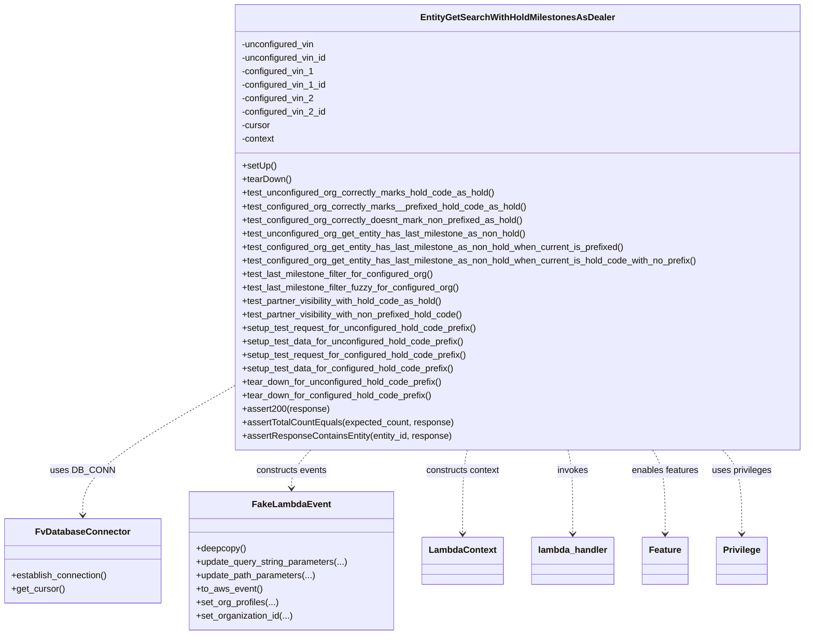

# Diagram: entity_core/entity_service/entity_service_tests/get_search_entity_tests/integration_tests/test_entity_hold_milestones.py


> Auto-generated by Obscura crawlers

## Diagram 1



### SVG

<svg id="container" width="1421.69921875" xmlns="http://www.w3.org/2000/svg" class="classDiagram" height="1128" viewBox="0 0 1421.69921875 1128" role="graphics-document document" aria-roledescription="class"><style>#container{font-family:"trebuchet ms",verdana,arial,sans-serif;font-size:16px;fill:#333;}@keyframes edge-animation-frame{from{stroke-dashoffset:0;}}@keyframes dash{to{stroke-dashoffset:0;}}#container .edge-animation-slow{stroke-dasharray:9,5!important;stroke-dashoffset:900;animation:dash 50s linear infinite;stroke-linecap:round;}#container .edge-animation-fast{stroke-dasharray:9,5!important;stroke-dashoffset:900;animation:dash 20s linear infinite;stroke-linecap:round;}#container .error-icon{fill:#552222;}#container .error-text{fill:#552222;stroke:#552222;}#container .edge-thickness-normal{stroke-width:1px;}#container .edge-thickness-thick{stroke-width:3.5px;}#container .edge-pattern-solid{stroke-dasharray:0;}#container .edge-thickness-invisible{stroke-width:0;fill:none;}#container .edge-pattern-dashed{stroke-dasharray:3;}#container .edge-pattern-dotted{stroke-dasharray:2;}#container .marker{fill:#333333;stroke:#333333;}#container .marker.cross{stroke:#333333;}#container svg{font-family:"trebuchet ms",verdana,arial,sans-serif;font-size:16px;}#container p{margin:0;}#container g.classGroup text{fill:#9370DB;stroke:none;font-family:"trebuchet ms",verdana,arial,sans-serif;font-size:10px;}#container g.classGroup text .title{font-weight:bolder;}#container .nodeLabel,#container .edgeLabel{color:#131300;}#container .edgeLabel .label rect{fill:#ECECFF;}#container .label text{fill:#131300;}#container .labelBkg{background:#ECECFF;}#container .edgeLabel .label span{background:#ECECFF;}#container .classTitle{font-weight:bolder;}#container .node rect,#container .node circle,#container .node ellipse,#container .node polygon,#container .node path{fill:#ECECFF;stroke:#9370DB;stroke-width:1px;}#container .divider{stroke:#9370DB;stroke-width:1;}#container g.clickable{cursor:pointer;}#container g.classGroup rect{fill:#ECECFF;stroke:#9370DB;}#container g.classGroup line{stroke:#9370DB;stroke-width:1;}#container .classLabel .box{stroke:none;stroke-width:0;fill:#ECECFF;opacity:0.5;}#container .classLabel .label{fill:#9370DB;font-size:10px;}#container .relation{stroke:#333333;stroke-width:1;fill:none;}#container .dashed-line{stroke-dasharray:3;}#container .dotted-line{stroke-dasharray:1 2;}#container #compositionStart,#container .composition{fill:#333333!important;stroke:#333333!important;stroke-width:1;}#container #compositionEnd,#container .composition{fill:#333333!important;stroke:#333333!important;stroke-width:1;}#container #dependencyStart,#container .dependency{fill:#333333!important;stroke:#333333!important;stroke-width:1;}#container #dependencyStart,#container .dependency{fill:#333333!important;stroke:#333333!important;stroke-width:1;}#container #extensionStart,#container .extension{fill:transparent!important;stroke:#333333!important;stroke-width:1;}#container #extensionEnd,#container .extension{fill:transparent!important;stroke:#333333!important;stroke-width:1;}#container #aggregationStart,#container .aggregation{fill:transparent!important;stroke:#333333!important;stroke-width:1;}#container #aggregationEnd,#container .aggregation{fill:transparent!important;stroke:#333333!important;stroke-width:1;}#container #lollipopStart,#container .lollipop{fill:#ECECFF!important;stroke:#333333!important;stroke-width:1;}#container #lollipopEnd,#container .lollipop{fill:#ECECFF!important;stroke:#333333!important;stroke-width:1;}#container .edgeTerminals{font-size:11px;line-height:initial;}#container .classTitleText{text-anchor:middle;font-size:18px;fill:#333;}#container .label-icon{display:inline-block;height:1em;overflow:visible;vertical-align:-0.125em;}#container .node .label-icon path{fill:currentColor;stroke:revert;stroke-width:revert;}#container :root{--mermaid-font-family:"trebuchet ms",verdana,arial,sans-serif;}</style><g><defs><marker id="container_class-aggregationStart" class="marker aggregation class" refX="18" refY="7" markerWidth="190" markerHeight="240" orient="auto"><path d="M 18,7 L9,13 L1,7 L9,1 Z"></path></marker></defs><defs><marker id="container_class-aggregationEnd" class="marker aggregation class" refX="1" refY="7" markerWidth="20" markerHeight="28" orient="auto"><path d="M 18,7 L9,13 L1,7 L9,1 Z"></path></marker></defs><defs><marker id="container_class-extensionStart" class="marker extension class" refX="18" refY="7" markerWidth="190" markerHeight="240" orient="auto"><path d="M 1,7 L18,13 V 1 Z"></path></marker></defs><defs><marker id="container_class-extensionEnd" class="marker extension class" refX="1" refY="7" markerWidth="20" markerHeight="28" orient="auto"><path d="M 1,1 V 13 L18,7 Z"></path></marker></defs><defs><marker id="container_class-compositionStart" class="marker composition class" refX="18" refY="7" markerWidth="190" markerHeight="240" orient="auto"><path d="M 18,7 L9,13 L1,7 L9,1 Z"></path></marker></defs><defs><marker id="container_class-compositionEnd" class="marker composition class" refX="1" refY="7" markerWidth="20" markerHeight="28" orient="auto"><path d="M 18,7 L9,13 L1,7 L9,1 Z"></path></marker></defs><defs><marker id="container_class-dependencyStart" class="marker dependency class" refX="6" refY="7" markerWidth="190" markerHeight="240" orient="auto"><path d="M 5,7 L9,13 L1,7 L9,1 Z"></path></marker></defs><defs><marker id="container_class-dependencyEnd" class="marker dependency class" refX="13" refY="7" markerWidth="20" markerHeight="28" orient="auto"><path d="M 18,7 L9,13 L14,7 L9,1 Z"></path></marker></defs><defs><marker id="container_class-lollipopStart" class="marker lollipop class" refX="13" refY="7" markerWidth="190" markerHeight="240" orient="auto"><circle stroke="black" fill="transparent" cx="7" cy="7" r="6"></circle></marker></defs><defs><marker id="container_class-lollipopEnd" class="marker lollipop class" refX="1" refY="7" markerWidth="190" markerHeight="240" orient="auto"><circle stroke="black" fill="transparent" cx="7" cy="7" r="6"></circle></marker></defs><g class="root"><g class="clusters"></g><g class="edgePaths"><path d="M406.793,689.349L363.375,713.957C319.957,738.566,233.121,787.783,189.703,825.558C146.285,863.333,146.285,889.667,146.285,902.833L146.285,916" id="id_EntityGetSearchWithHoldMilestonesAsDealer_FvDatabaseConnector_1" class="edge-thickness-normal edge-pattern-dashed relation" style=";;;" data-edge="true" data-et="edge" data-id="id_EntityGetSearchWithHoldMilestonesAsDealer_FvDatabaseConnector_1" data-points="W3sieCI6NDA2Ljc5Mjk2ODc1LCJ5Ijo2ODkuMzQ4NjI1MDcyODYyNH0seyJ4IjoxNDYuMjg1MTU2MjUsInkiOjgzN30seyJ4IjoxNDYuMjg1MTU2MjUsInkiOjkyMn1d" marker-end="url(#container_class-dependencyEnd)"></path><path d="M548.72,800L543.091,806.167C537.461,812.333,526.201,824.667,520.571,836C514.941,847.333,514.941,857.667,514.941,862.833L514.941,868" id="id_EntityGetSearchWithHoldMilestonesAsDealer_FakeLambdaEvent_2" class="edge-thickness-normal edge-pattern-dashed relation" style=";;;" data-edge="true" data-et="edge" data-id="id_EntityGetSearchWithHoldMilestonesAsDealer_FakeLambdaEvent_2" data-points="W3sieCI6NTQ4LjcyMDMyODczODQ1MjcsInkiOjgwMH0seyJ4Ijo1MTQuOTQxNDA2MjUsInkiOjgzN30seyJ4Ijo1MTQuOTQxNDA2MjUsInkiOjg3NH1d" marker-end="url(#container_class-dependencyEnd)"></path><path d="M822.782,800L821.42,806.167C820.058,812.333,817.333,824.667,815.971,849.5C814.609,874.333,814.609,911.667,814.609,930.333L814.609,949" id="id_EntityGetSearchWithHoldMilestonesAsDealer_LambdaContext_3" class="edge-thickness-normal edge-pattern-dashed relation" style=";;;" data-edge="true" data-et="edge" data-id="id_EntityGetSearchWithHoldMilestonesAsDealer_LambdaContext_3" data-points="W3sieCI6ODIyLjc4MTU2NTc0NzY5MDYsInkiOjgwMH0seyJ4Ijo4MTQuNjA5Mzc1LCJ5Ijo4Mzd9LHsieCI6ODE0LjYwOTM3NSwieSI6OTU1fV0=" marker-end="url(#container_class-dependencyEnd)"></path><path d="M997.711,800L999.073,806.167C1000.435,812.333,1003.159,824.667,1004.521,849.5C1005.883,874.333,1005.883,911.667,1005.883,930.333L1005.883,949" id="id_EntityGetSearchWithHoldMilestonesAsDealer_lambda_handler_4" class="edge-thickness-normal edge-pattern-dashed relation" style=";;;" data-edge="true" data-et="edge" data-id="id_EntityGetSearchWithHoldMilestonesAsDealer_lambda_handler_4" data-points="W3sieCI6OTk3LjcxMDYyMTc1MjMwOTQsInkiOjgwMH0seyJ4IjoxMDA1Ljg4MjgxMjUsInkiOjgzN30seyJ4IjoxMDA1Ljg4MjgxMjUsInkiOjk1NX1d" marker-end="url(#container_class-dependencyEnd)"></path><path d="M1145.289,800L1148.949,806.167C1152.609,812.333,1159.93,824.667,1163.59,849.5C1167.25,874.333,1167.25,911.667,1167.25,930.333L1167.25,949" id="id_EntityGetSearchWithHoldMilestonesAsDealer_Feature_5" class="edge-thickness-normal edge-pattern-dashed relation" style=";;;" data-edge="true" data-et="edge" data-id="id_EntityGetSearchWithHoldMilestonesAsDealer_Feature_5" data-points="W3sieCI6MTE0NS4yODg5MjcxNzk1NjExLCJ5Ijo4MDB9LHsieCI6MTE2Ny4yNSwieSI6ODM3fSx7IngiOjExNjcuMjUsInkiOjk1NX1d" marker-end="url(#container_class-dependencyEnd)"></path><path d="M1267.924,800L1273.494,806.167C1279.064,812.333,1290.204,824.667,1295.774,849.5C1301.344,874.333,1301.344,911.667,1301.344,930.333L1301.344,949" id="id_EntityGetSearchWithHoldMilestonesAsDealer_Privilege_6" class="edge-thickness-normal edge-pattern-dashed relation" style=";;;" data-edge="true" data-et="edge" data-id="id_EntityGetSearchWithHoldMilestonesAsDealer_Privilege_6" data-points="W3sieCI6MTI2Ny45MjQzMTk3ODkyNjEsInkiOjgwMH0seyJ4IjoxMzAxLjM0Mzc1LCJ5Ijo4Mzd9LHsieCI6MTMwMS4zNDM3NSwieSI6OTU1fV0=" marker-end="url(#container_class-dependencyEnd)"></path></g><g class="edgeLabels"><g class="edgeLabel" transform="translate(146.28515625, 837)"><g class="label" data-id="id_EntityGetSearchWithHoldMilestonesAsDealer_FvDatabaseConnector_1" transform="translate(-53.09375, -12)"><foreignObject width="106.1875" height="24"><div xmlns="http://www.w3.org/1999/xhtml" class="labelBkg" style="display: table-cell; white-space: nowrap; line-height: 1.5; max-width: 200px; text-align: center;"><span class="edgeLabel"><p>uses DB_CONN</p></span></div></foreignObject></g></g><g class="edgeLabel" transform="translate(514.94140625, 837)"><g class="label" data-id="id_EntityGetSearchWithHoldMilestonesAsDealer_FakeLambdaEvent_2" transform="translate(-63.8671875, -12)"><foreignObject width="127.734375" height="24"><div xmlns="http://www.w3.org/1999/xhtml" class="labelBkg" style="display: table-cell; white-space: nowrap; line-height: 1.5; max-width: 200px; text-align: center;"><span class="edgeLabel"><p>constructs events</p></span></div></foreignObject></g></g><g class="edgeLabel" transform="translate(814.609375, 837)"><g class="label" data-id="id_EntityGetSearchWithHoldMilestonesAsDealer_LambdaContext_3" transform="translate(-66.8125, -12)"><foreignObject width="133.625" height="24"><div xmlns="http://www.w3.org/1999/xhtml" class="labelBkg" style="display: table-cell; white-space: nowrap; line-height: 1.5; max-width: 200px; text-align: center;"><span class="edgeLabel"><p>constructs context</p></span></div></foreignObject></g></g><g class="edgeLabel" transform="translate(1005.8828125, 837)"><g class="label" data-id="id_EntityGetSearchWithHoldMilestonesAsDealer_lambda_handler_4" transform="translate(-27.5859375, -12)"><foreignObject width="55.171875" height="24"><div xmlns="http://www.w3.org/1999/xhtml" class="labelBkg" style="display: table-cell; white-space: nowrap; line-height: 1.5; max-width: 200px; text-align: center;"><span class="edgeLabel"><p>invokes</p></span></div></foreignObject></g></g><g class="edgeLabel" transform="translate(1167.25, 837)"><g class="label" data-id="id_EntityGetSearchWithHoldMilestonesAsDealer_Feature_5" transform="translate(-60.3984375, -12)"><foreignObject width="120.796875" height="24"><div xmlns="http://www.w3.org/1999/xhtml" class="labelBkg" style="display: table-cell; white-space: nowrap; line-height: 1.5; max-width: 200px; text-align: center;"><span class="edgeLabel"><p>enables features</p></span></div></foreignObject></g></g><g class="edgeLabel" transform="translate(1301.34375, 837)"><g class="label" data-id="id_EntityGetSearchWithHoldMilestonesAsDealer_Privilege_6" transform="translate(-53.6953125, -12)"><foreignObject width="107.390625" height="24"><div xmlns="http://www.w3.org/1999/xhtml" class="labelBkg" style="display: table-cell; white-space: nowrap; line-height: 1.5; max-width: 200px; text-align: center;"><span class="edgeLabel"><p>uses privileges</p></span></div></foreignObject></g></g></g><g class="nodes"><g class="node default" id="classId-EntityGetSearchWithHoldMilestonesAsDealer-0" transform="translate(910.24609375, 404)"><g class="basic label-container"><path d="M-503.453125 -396 L503.453125 -396 L503.453125 396 L-503.453125 396" stroke="none" stroke-width="0" fill="#ECECFF" style=""></path><path d="M-503.453125 -396 C-102.8308169572527 -396, 297.7914910854946 -396, 503.453125 -396 M-503.453125 -396 C-203.23091599759272 -396, 96.99129300481457 -396, 503.453125 -396 M503.453125 -396 C503.453125 -212.19072751683186, 503.453125 -28.381455033663713, 503.453125 396 M503.453125 -396 C503.453125 -145.65199605865016, 503.453125 104.69600788269969, 503.453125 396 M503.453125 396 C182.80991159004753 396, -137.83330181990493 396, -503.453125 396 M503.453125 396 C275.5435310248396 396, 47.633937049679105 396, -503.453125 396 M-503.453125 396 C-503.453125 209.31106254880268, -503.453125 22.622125097605362, -503.453125 -396 M-503.453125 396 C-503.453125 135.72570774703343, -503.453125 -124.54858450593315, -503.453125 -396" stroke="#9370DB" stroke-width="1.3" fill="none" stroke-dasharray="0 0" style=""></path></g><g class="annotation-group text" transform="translate(0, -372)"></g><g class="label-group text" transform="translate(-164.59375, -372)"><g class="label" style="font-weight: bolder" transform="translate(0,-12)"><foreignObject width="329.1875" height="24"><div xmlns="http://www.w3.org/1999/xhtml" style="display: table-cell; white-space: nowrap; line-height: 1.5; max-width: 375px; text-align: center;"><span class="nodeLabel markdown-node-label" style=""><p>EntityGetSearchWithHoldMilestonesAsDealer</p></span></div></foreignObject></g></g><g class="members-group text" transform="translate(-491.453125, -324)"><g class="label" style="" transform="translate(0,-12)"><foreignObject width="131.453125" height="24"><div xmlns="http://www.w3.org/1999/xhtml" style="display: table-cell; white-space: nowrap; line-height: 1.5; max-width: 189px; text-align: center;"><span class="nodeLabel markdown-node-label" style=""><p>-unconfigured_vin</p></span></div></foreignObject></g><g class="label" style="" transform="translate(0,12)"><foreignObject width="153.84375" height="24"><div xmlns="http://www.w3.org/1999/xhtml" style="display: table-cell; white-space: nowrap; line-height: 1.5; max-width: 211px; text-align: center;"><span class="nodeLabel markdown-node-label" style=""><p>-unconfigured_vin_id</p></span></div></foreignObject></g><g class="label" style="" transform="translate(0,36)"><foreignObject width="126.40625" height="24"><div xmlns="http://www.w3.org/1999/xhtml" style="display: table-cell; white-space: nowrap; line-height: 1.5; max-width: 184px; text-align: center;"><span class="nodeLabel markdown-node-label" style=""><p>-configured_vin_1</p></span></div></foreignObject></g><g class="label" style="" transform="translate(0,60)"><foreignObject width="148.8125" height="24"><div xmlns="http://www.w3.org/1999/xhtml" style="display: table-cell; white-space: nowrap; line-height: 1.5; max-width: 206px; text-align: center;"><span class="nodeLabel markdown-node-label" style=""><p>-configured_vin_1_id</p></span></div></foreignObject></g><g class="label" style="" transform="translate(0,84)"><foreignObject width="129" height="24"><div xmlns="http://www.w3.org/1999/xhtml" style="display: table-cell; white-space: nowrap; line-height: 1.5; max-width: 186px; text-align: center;"><span class="nodeLabel markdown-node-label" style=""><p>-configured_vin_2</p></span></div></foreignObject></g><g class="label" style="" transform="translate(0,108)"><foreignObject width="151.40625" height="24"><div xmlns="http://www.w3.org/1999/xhtml" style="display: table-cell; white-space: nowrap; line-height: 1.5; max-width: 209px; text-align: center;"><span class="nodeLabel markdown-node-label" style=""><p>-configured_vin_2_id</p></span></div></foreignObject></g><g class="label" style="" transform="translate(0,132)"><foreignObject width="52.1875" height="24"><div xmlns="http://www.w3.org/1999/xhtml" style="display: table-cell; white-space: nowrap; line-height: 1.5; max-width: 110px; text-align: center;"><span class="nodeLabel markdown-node-label" style=""><p>-cursor</p></span></div></foreignObject></g><g class="label" style="" transform="translate(0,156)"><foreignObject width="60.15625" height="24"><div xmlns="http://www.w3.org/1999/xhtml" style="display: table-cell; white-space: nowrap; line-height: 1.5; max-width: 118px; text-align: center;"><span class="nodeLabel markdown-node-label" style=""><p>-context</p></span></div></foreignObject></g></g><g class="methods-group text" transform="translate(-491.453125, -108)"><g class="label" style="" transform="translate(0,-12)"><foreignObject width="60.421875" height="24"><div xmlns="http://www.w3.org/1999/xhtml" style="display: table-cell; white-space: nowrap; line-height: 1.5; max-width: 118px; text-align: center;"><span class="nodeLabel markdown-node-label" style=""><p>+setUp()</p></span></div></foreignObject></g><g class="label" style="" transform="translate(0,12)"><foreignObject width="87.75" height="24"><div xmlns="http://www.w3.org/1999/xhtml" style="display: table-cell; white-space: nowrap; line-height: 1.5; max-width: 145px; text-align: center;"><span class="nodeLabel markdown-node-label" style=""><p>+tearDown()</p></span></div></foreignObject></g><g class="label" style="" transform="translate(0,36)"><foreignObject width="452.234375" height="24"><div xmlns="http://www.w3.org/1999/xhtml" style="display: table-cell; white-space: nowrap; line-height: 1.5; max-width: 510px; text-align: center;"><span class="nodeLabel markdown-node-label" style=""><p>+test_unconfigured_org_correctly_marks_hold_code_as_hold()</p></span></div></foreignObject></g><g class="label" style="" transform="translate(0,60)"><foreignObject width="509.046875" height="24"><div xmlns="http://www.w3.org/1999/xhtml" style="display: table-cell; white-space: nowrap; line-height: 1.5; max-width: 566px; text-align: center;"><span class="nodeLabel markdown-node-label" style=""><p>+test_configured_org_correctly_marks__prefixed_hold_code_as_hold()</p></span></div></foreignObject></g><g class="label" style="" transform="translate(0,84)"><foreignObject width="504.625" height="24"><div xmlns="http://www.w3.org/1999/xhtml" style="display: table-cell; white-space: nowrap; line-height: 1.5; max-width: 562px; text-align: center;"><span class="nodeLabel markdown-node-label" style=""><p>+test_configured_org_correctly_doesnt_mark_non_prefixed_as_hold()</p></span></div></foreignObject></g><g class="label" style="" transform="translate(0,108)"><foreignObject width="510.609375" height="24"><div xmlns="http://www.w3.org/1999/xhtml" style="display: table-cell; white-space: nowrap; line-height: 1.5; max-width: 568px; text-align: center;"><span class="nodeLabel markdown-node-label" style=""><p>+test_unconfigured_org_get_entity_has_last_milestone_as_non_hold()</p></span></div></foreignObject></g><g class="label" style="" transform="translate(0,132)"><foreignObject width="686.75" height="24"><div xmlns="http://www.w3.org/1999/xhtml" style="display: table-cell; white-space: nowrap; line-height: 1.5; max-width: 744px; text-align: center;"><span class="nodeLabel markdown-node-label" style=""><p>+test_configured_org_get_entity_has_last_milestone_as_non_hold_when_current_is_prefixed()</p></span></div></foreignObject></g><g class="label" style="" transform="translate(0,156)"><foreignObject width="818.3125" height="24"><div xmlns="http://www.w3.org/1999/xhtml" style="display: table-cell; white-space: nowrap; line-height: 1.5; max-width: 876px; text-align: center;"><span class="nodeLabel markdown-node-label" style=""><p>+test_configured_org_get_entity_has_last_milestone_as_non_hold_when_current_is_hold_code_with_no_prefix()</p></span></div></foreignObject></g><g class="label" style="" transform="translate(0,180)"><foreignObject width="345.125" height="24"><div xmlns="http://www.w3.org/1999/xhtml" style="display: table-cell; white-space: nowrap; line-height: 1.5; max-width: 402px; text-align: center;"><span class="nodeLabel markdown-node-label" style=""><p>+test_last_milestone_filter_for_configured_org()</p></span></div></foreignObject></g><g class="label" style="" transform="translate(0,204)"><foreignObject width="389.171875" height="24"><div xmlns="http://www.w3.org/1999/xhtml" style="display: table-cell; white-space: nowrap; line-height: 1.5; max-width: 447px; text-align: center;"><span class="nodeLabel markdown-node-label" style=""><p>+test_last_milestone_filter_fuzzy_for_configured_org()</p></span></div></foreignObject></g><g class="label" style="" transform="translate(0,228)"><foreignObject width="363.515625" height="24"><div xmlns="http://www.w3.org/1999/xhtml" style="display: table-cell; white-space: nowrap; line-height: 1.5; max-width: 421px; text-align: center;"><span class="nodeLabel markdown-node-label" style=""><p>+test_partner_visibility_with_hold_code_as_hold()</p></span></div></foreignObject></g><g class="label" style="" transform="translate(0,252)"><foreignObject width="402.6875" height="24"><div xmlns="http://www.w3.org/1999/xhtml" style="display: table-cell; white-space: nowrap; line-height: 1.5; max-width: 460px; text-align: center;"><span class="nodeLabel markdown-node-label" style=""><p>+test_partner_visibility_with_non_prefixed_hold_code()</p></span></div></foreignObject></g><g class="label" style="" transform="translate(0,276)"><foreignObject width="421.796875" height="24"><div xmlns="http://www.w3.org/1999/xhtml" style="display: table-cell; white-space: nowrap; line-height: 1.5; max-width: 479px; text-align: center;"><span class="nodeLabel markdown-node-label" style=""><p>+setup_test_request_for_unconfigured_hold_code_prefix()</p></span></div></foreignObject></g><g class="label" style="" transform="translate(0,300)"><foreignObject width="398.859375" height="24"><div xmlns="http://www.w3.org/1999/xhtml" style="display: table-cell; white-space: nowrap; line-height: 1.5; max-width: 456px; text-align: center;"><span class="nodeLabel markdown-node-label" style=""><p>+setup_test_data_for_unconfigured_hold_code_prefix()</p></span></div></foreignObject></g><g class="label" style="" transform="translate(0,324)"><foreignObject width="403.109375" height="24"><div xmlns="http://www.w3.org/1999/xhtml" style="display: table-cell; white-space: nowrap; line-height: 1.5; max-width: 460px; text-align: center;"><span class="nodeLabel markdown-node-label" style=""><p>+setup_test_request_for_configured_hold_code_prefix()</p></span></div></foreignObject></g><g class="label" style="" transform="translate(0,348)"><foreignObject width="380.171875" height="24"><div xmlns="http://www.w3.org/1999/xhtml" style="display: table-cell; white-space: nowrap; line-height: 1.5; max-width: 438px; text-align: center;"><span class="nodeLabel markdown-node-label" style=""><p>+setup_test_data_for_configured_hold_code_prefix()</p></span></div></foreignObject></g><g class="label" style="" transform="translate(0,372)"><foreignObject width="357.625" height="24"><div xmlns="http://www.w3.org/1999/xhtml" style="display: table-cell; white-space: nowrap; line-height: 1.5; max-width: 415px; text-align: center;"><span class="nodeLabel markdown-node-label" style=""><p>+tear_down_for_unconfigured_hold_code_prefix()</p></span></div></foreignObject></g><g class="label" style="" transform="translate(0,396)"><foreignObject width="338.9375" height="24"><div xmlns="http://www.w3.org/1999/xhtml" style="display: table-cell; white-space: nowrap; line-height: 1.5; max-width: 396px; text-align: center;"><span class="nodeLabel markdown-node-label" style=""><p>+tear_down_for_configured_hold_code_prefix()</p></span></div></foreignObject></g><g class="label" style="" transform="translate(0,420)"><foreignObject width="154.203125" height="24"><div xmlns="http://www.w3.org/1999/xhtml" style="display: table-cell; white-space: nowrap; line-height: 1.5; max-width: 212px; text-align: center;"><span class="nodeLabel markdown-node-label" style=""><p>+assert200(response)</p></span></div></foreignObject></g><g class="label" style="" transform="translate(0,444)"><foreignObject width="377.640625" height="24"><div xmlns="http://www.w3.org/1999/xhtml" style="display: table-cell; white-space: nowrap; line-height: 1.5; max-width: 435px; text-align: center;"><span class="nodeLabel markdown-node-label" style=""><p>+assertTotalCountEquals(expected_count, response)</p></span></div></foreignObject></g><g class="label" style="" transform="translate(0,468)"><foreignObject width="375.140625" height="24"><div xmlns="http://www.w3.org/1999/xhtml" style="display: table-cell; white-space: nowrap; line-height: 1.5; max-width: 433px; text-align: center;"><span class="nodeLabel markdown-node-label" style=""><p>+assertResponseContainsEntity(entity_id, response)</p></span></div></foreignObject></g></g><g class="divider" style=""><path d="M-503.453125 -348 C-282.8573871468153 -348, -62.26164929363057 -348, 503.453125 -348 M-503.453125 -348 C-269.03888118849466 -348, -34.624637376989256 -348, 503.453125 -348" stroke="#9370DB" stroke-width="1.3" fill="none" stroke-dasharray="0 0" style=""></path></g><g class="divider" style=""><path d="M-503.453125 -132 C-280.0776387386282 -132, -56.70215247725639 -132, 503.453125 -132 M-503.453125 -132 C-293.10824654980166 -132, -82.76336809960333 -132, 503.453125 -132" stroke="#9370DB" stroke-width="1.3" fill="none" stroke-dasharray="0 0" style=""></path></g></g><g class="node default" id="classId-FvDatabaseConnector-1" transform="translate(146.28515625, 997)"><g class="basic label-container"><path d="M-138.28515625 -75 L138.28515625 -75 L138.28515625 75 L-138.28515625 75" stroke="none" stroke-width="0" fill="#ECECFF" style=""></path><path d="M-138.28515625 -75 C-81.10614377155261 -75, -23.927131293105234 -75, 138.28515625 -75 M-138.28515625 -75 C-80.44003718313044 -75, -22.59491811626087 -75, 138.28515625 -75 M138.28515625 -75 C138.28515625 -44.421513094982686, 138.28515625 -13.843026189965371, 138.28515625 75 M138.28515625 -75 C138.28515625 -28.166750944145, 138.28515625 18.66649811171, 138.28515625 75 M138.28515625 75 C47.97647928136219 75, -42.332197687275624 75, -138.28515625 75 M138.28515625 75 C28.59322554298072 75, -81.09870516403856 75, -138.28515625 75 M-138.28515625 75 C-138.28515625 26.291987040829177, -138.28515625 -22.416025918341646, -138.28515625 -75 M-138.28515625 75 C-138.28515625 21.620909651147947, -138.28515625 -31.758180697704105, -138.28515625 -75" stroke="#9370DB" stroke-width="1.3" fill="none" stroke-dasharray="0 0" style=""></path></g><g class="annotation-group text" transform="translate(0, -51)"></g><g class="label-group text" transform="translate(-79.3046875, -51)"><g class="label" style="font-weight: bolder" transform="translate(0,-12)"><foreignObject width="158.609375" height="24"><div xmlns="http://www.w3.org/1999/xhtml" style="display: table-cell; white-space: nowrap; line-height: 1.5; max-width: 207px; text-align: center;"><span class="nodeLabel markdown-node-label" style=""><p>FvDatabaseConnector</p></span></div></foreignObject></g></g><g class="members-group text" transform="translate(-126.28515625, -3)"></g><g class="methods-group text" transform="translate(-126.28515625, 27)"><g class="label" style="" transform="translate(0,-12)"><foreignObject width="173.265625" height="24"><div xmlns="http://www.w3.org/1999/xhtml" style="display: table-cell; white-space: nowrap; line-height: 1.5; max-width: 231px; text-align: center;"><span class="nodeLabel markdown-node-label" style=""><p>+establish_connection()</p></span></div></foreignObject></g><g class="label" style="" transform="translate(0,12)"><foreignObject width="94.640625" height="24"><div xmlns="http://www.w3.org/1999/xhtml" style="display: table-cell; white-space: nowrap; line-height: 1.5; max-width: 152px; text-align: center;"><span class="nodeLabel markdown-node-label" style=""><p>+get_cursor()</p></span></div></foreignObject></g></g><g class="divider" style=""><path d="M-138.28515625 -27 C-80.38871639466487 -27, -22.492276539329737 -27, 138.28515625 -27 M-138.28515625 -27 C-40.00296779870287 -27, 58.27922065259426 -27, 138.28515625 -27" stroke="#9370DB" stroke-width="1.3" fill="none" stroke-dasharray="0 0" style=""></path></g><g class="divider" style=""><path d="M-138.28515625 -3 C-47.5319527386479 -3, 43.221250772704195 -3, 138.28515625 -3 M-138.28515625 -3 C-64.71139364142452 -3, 8.862368967150957 -3, 138.28515625 -3" stroke="#9370DB" stroke-width="1.3" fill="none" stroke-dasharray="0 0" style=""></path></g></g><g class="node default" id="classId-FakeLambdaEvent-2" transform="translate(514.94140625, 997)"><g class="basic label-container"><path d="M-180.37109375 -123 L180.37109375 -123 L180.37109375 123 L-180.37109375 123" stroke="none" stroke-width="0" fill="#ECECFF" style=""></path><path d="M-180.37109375 -123 C-80.06664694036407 -123, 20.237799869271868 -123, 180.37109375 -123 M-180.37109375 -123 C-51.89288176074942 -123, 76.58533022850116 -123, 180.37109375 -123 M180.37109375 -123 C180.37109375 -28.994020705601955, 180.37109375 65.01195858879609, 180.37109375 123 M180.37109375 -123 C180.37109375 -66.72795897581884, 180.37109375 -10.455917951637687, 180.37109375 123 M180.37109375 123 C58.05979695120264 123, -64.25149984759472 123, -180.37109375 123 M180.37109375 123 C60.617389432312564 123, -59.13631488537487 123, -180.37109375 123 M-180.37109375 123 C-180.37109375 49.2497752815875, -180.37109375 -24.500449436824994, -180.37109375 -123 M-180.37109375 123 C-180.37109375 61.66492017808266, -180.37109375 0.32984035616532026, -180.37109375 -123" stroke="#9370DB" stroke-width="1.3" fill="none" stroke-dasharray="0 0" style=""></path></g><g class="annotation-group text" transform="translate(0, -99)"></g><g class="label-group text" transform="translate(-65.8671875, -99)"><g class="label" style="font-weight: bolder" transform="translate(0,-12)"><foreignObject width="131.734375" height="24"><div xmlns="http://www.w3.org/1999/xhtml" style="display: table-cell; white-space: nowrap; line-height: 1.5; max-width: 181px; text-align: center;"><span class="nodeLabel markdown-node-label" style=""><p>FakeLambdaEvent</p></span></div></foreignObject></g></g><g class="members-group text" transform="translate(-168.37109375, -51)"></g><g class="methods-group text" transform="translate(-168.37109375, -21)"><g class="label" style="" transform="translate(0,-12)"><foreignObject width="88.859375" height="24"><div xmlns="http://www.w3.org/1999/xhtml" style="display: table-cell; white-space: nowrap; line-height: 1.5; max-width: 146px; text-align: center;"><span class="nodeLabel markdown-node-label" style=""><p>+deepcopy()</p></span></div></foreignObject></g><g class="label" style="" transform="translate(0,12)"><foreignObject width="270.875" height="24"><div xmlns="http://www.w3.org/1999/xhtml" style="display: table-cell; white-space: nowrap; line-height: 1.5; max-width: 328px; text-align: center;"><span class="nodeLabel markdown-node-label" style=""><p>+update_query_string_parameters(...)</p></span></div></foreignObject></g><g class="label" style="" transform="translate(0,36)"><foreignObject width="213.203125" height="24"><div xmlns="http://www.w3.org/1999/xhtml" style="display: table-cell; white-space: nowrap; line-height: 1.5; max-width: 271px; text-align: center;"><span class="nodeLabel markdown-node-label" style=""><p>+update_path_parameters(...)</p></span></div></foreignObject></g><g class="label" style="" transform="translate(0,60)"><foreignObject width="116.421875" height="24"><div xmlns="http://www.w3.org/1999/xhtml" style="display: table-cell; white-space: nowrap; line-height: 1.5; max-width: 174px; text-align: center;"><span class="nodeLabel markdown-node-label" style=""><p>+to_aws_event()</p></span></div></foreignObject></g><g class="label" style="" transform="translate(0,84)"><foreignObject width="146.375" height="24"><div xmlns="http://www.w3.org/1999/xhtml" style="display: table-cell; white-space: nowrap; line-height: 1.5; max-width: 204px; text-align: center;"><span class="nodeLabel markdown-node-label" style=""><p>+set_org_profiles(...)</p></span></div></foreignObject></g><g class="label" style="" transform="translate(0,108)"><foreignObject width="172.59375" height="24"><div xmlns="http://www.w3.org/1999/xhtml" style="display: table-cell; white-space: nowrap; line-height: 1.5; max-width: 230px; text-align: center;"><span class="nodeLabel markdown-node-label" style=""><p>+set_organization_id(...)</p></span></div></foreignObject></g></g><g class="divider" style=""><path d="M-180.37109375 -75 C-47.62228697683375 -75, 85.1265197963325 -75, 180.37109375 -75 M-180.37109375 -75 C-39.518959288269 -75, 101.333175173462 -75, 180.37109375 -75" stroke="#9370DB" stroke-width="1.3" fill="none" stroke-dasharray="0 0" style=""></path></g><g class="divider" style=""><path d="M-180.37109375 -51 C-56.056529545093596 -51, 68.25803465981281 -51, 180.37109375 -51 M-180.37109375 -51 C-36.64371231825294 -51, 107.08366911349412 -51, 180.37109375 -51" stroke="#9370DB" stroke-width="1.3" fill="none" stroke-dasharray="0 0" style=""></path></g></g><g class="node default" id="classId-LambdaContext-3" transform="translate(814.609375, 997)"><g class="basic label-container"><path d="M-69.296875 -42 L69.296875 -42 L69.296875 42 L-69.296875 42" stroke="none" stroke-width="0" fill="#ECECFF" style=""></path><path d="M-69.296875 -42 C-27.438922127668782 -42, 14.419030744662436 -42, 69.296875 -42 M-69.296875 -42 C-20.128421643530416 -42, 29.040031712939168 -42, 69.296875 -42 M69.296875 -42 C69.296875 -20.253993848828234, 69.296875 1.4920123023435323, 69.296875 42 M69.296875 -42 C69.296875 -23.833853849136517, 69.296875 -5.667707698273034, 69.296875 42 M69.296875 42 C15.657494263095522 42, -37.981886473808956 42, -69.296875 42 M69.296875 42 C26.062456957881366 42, -17.171961084237267 42, -69.296875 42 M-69.296875 42 C-69.296875 9.282571349702117, -69.296875 -23.434857300595766, -69.296875 -42 M-69.296875 42 C-69.296875 24.62403165232261, -69.296875 7.248063304645221, -69.296875 -42" stroke="#9370DB" stroke-width="1.3" fill="none" stroke-dasharray="0 0" style=""></path></g><g class="annotation-group text" transform="translate(0, -18)"></g><g class="label-group text" transform="translate(-57.296875, -18)"><g class="label" style="font-weight: bolder" transform="translate(0,-12)"><foreignObject width="114.59375" height="24"><div xmlns="http://www.w3.org/1999/xhtml" style="display: table-cell; white-space: nowrap; line-height: 1.5; max-width: 163px; text-align: center;"><span class="nodeLabel markdown-node-label" style=""><p>LambdaContext</p></span></div></foreignObject></g></g><g class="members-group text" transform="translate(-57.296875, 30)"></g><g class="methods-group text" transform="translate(-57.296875, 60)"></g><g class="divider" style=""><path d="M-69.296875 6 C-37.804661839075294 6, -6.312448678150581 6, 69.296875 6 M-69.296875 6 C-33.783172588257635 6, 1.73052982348473 6, 69.296875 6" stroke="#9370DB" stroke-width="1.3" fill="none" stroke-dasharray="0 0" style=""></path></g><g class="divider" style=""><path d="M-69.296875 24 C-35.62076230543932 24, -1.944649610878642 24, 69.296875 24 M-69.296875 24 C-25.536389611909257 24, 18.224095776181485 24, 69.296875 24" stroke="#9370DB" stroke-width="1.3" fill="none" stroke-dasharray="0 0" style=""></path></g></g><g class="node default" id="classId-Feature-4" transform="translate(1167.25, 997)"><g class="basic label-container"><path d="M-39.390625 -42 L39.390625 -42 L39.390625 42 L-39.390625 42" stroke="none" stroke-width="0" fill="#ECECFF" style=""></path><path d="M-39.390625 -42 C-22.5590102285585 -42, -5.727395457116998 -42, 39.390625 -42 M-39.390625 -42 C-14.663844004953592 -42, 10.062936990092815 -42, 39.390625 -42 M39.390625 -42 C39.390625 -19.035086157250618, 39.390625 3.929827685498765, 39.390625 42 M39.390625 -42 C39.390625 -17.276242802129957, 39.390625 7.447514395740086, 39.390625 42 M39.390625 42 C10.086823693318099 42, -19.216977613363802 42, -39.390625 42 M39.390625 42 C12.130778861328412 42, -15.129067277343175 42, -39.390625 42 M-39.390625 42 C-39.390625 21.430636819398586, -39.390625 0.8612736387971722, -39.390625 -42 M-39.390625 42 C-39.390625 9.703347396064004, -39.390625 -22.593305207871992, -39.390625 -42" stroke="#9370DB" stroke-width="1.3" fill="none" stroke-dasharray="0 0" style=""></path></g><g class="annotation-group text" transform="translate(0, -18)"></g><g class="label-group text" transform="translate(-27.390625, -18)"><g class="label" style="font-weight: bolder" transform="translate(0,-12)"><foreignObject width="54.78125" height="24"><div xmlns="http://www.w3.org/1999/xhtml" style="display: table-cell; white-space: nowrap; line-height: 1.5; max-width: 104px; text-align: center;"><span class="nodeLabel markdown-node-label" style=""><p>Feature</p></span></div></foreignObject></g></g><g class="members-group text" transform="translate(-27.390625, 30)"></g><g class="methods-group text" transform="translate(-27.390625, 60)"></g><g class="divider" style=""><path d="M-39.390625 6 C-13.767391734082086 6, 11.855841531835829 6, 39.390625 6 M-39.390625 6 C-14.973149701458183 6, 9.444325597083633 6, 39.390625 6" stroke="#9370DB" stroke-width="1.3" fill="none" stroke-dasharray="0 0" style=""></path></g><g class="divider" style=""><path d="M-39.390625 24 C-14.324025361084658 24, 10.742574277830684 24, 39.390625 24 M-39.390625 24 C-10.563762227939499 24, 18.263100544121002 24, 39.390625 24" stroke="#9370DB" stroke-width="1.3" fill="none" stroke-dasharray="0 0" style=""></path></g></g><g class="node default" id="classId-Privilege-5" transform="translate(1301.34375, 997)"><g class="basic label-container"><path d="M-43.8671875 -42 L43.8671875 -42 L43.8671875 42 L-43.8671875 42" stroke="none" stroke-width="0" fill="#ECECFF" style=""></path><path d="M-43.8671875 -42 C-25.284000588975452 -42, -6.700813677950904 -42, 43.8671875 -42 M-43.8671875 -42 C-15.972132995814505 -42, 11.92292150837099 -42, 43.8671875 -42 M43.8671875 -42 C43.8671875 -10.709688130630994, 43.8671875 20.580623738738012, 43.8671875 42 M43.8671875 -42 C43.8671875 -24.957796601204972, 43.8671875 -7.915593202409944, 43.8671875 42 M43.8671875 42 C10.22600686982721 42, -23.41517376034558 42, -43.8671875 42 M43.8671875 42 C10.243014379596296 42, -23.381158740807408 42, -43.8671875 42 M-43.8671875 42 C-43.8671875 20.939105742323935, -43.8671875 -0.12178851535212942, -43.8671875 -42 M-43.8671875 42 C-43.8671875 23.45434725412059, -43.8671875 4.908694508241183, -43.8671875 -42" stroke="#9370DB" stroke-width="1.3" fill="none" stroke-dasharray="0 0" style=""></path></g><g class="annotation-group text" transform="translate(0, -18)"></g><g class="label-group text" transform="translate(-31.8671875, -18)"><g class="label" style="font-weight: bolder" transform="translate(0,-12)"><foreignObject width="63.734375" height="24"><div xmlns="http://www.w3.org/1999/xhtml" style="display: table-cell; white-space: nowrap; line-height: 1.5; max-width: 112px; text-align: center;"><span class="nodeLabel markdown-node-label" style=""><p>Privilege</p></span></div></foreignObject></g></g><g class="members-group text" transform="translate(-31.8671875, 30)"></g><g class="methods-group text" transform="translate(-31.8671875, 60)"></g><g class="divider" style=""><path d="M-43.8671875 6 C-14.885185668066633 6, 14.096816163866734 6, 43.8671875 6 M-43.8671875 6 C-8.97182751212889 6, 25.92353247574222 6, 43.8671875 6" stroke="#9370DB" stroke-width="1.3" fill="none" stroke-dasharray="0 0" style=""></path></g><g class="divider" style=""><path d="M-43.8671875 24 C-11.457190637333959 24, 20.952806225332083 24, 43.8671875 24 M-43.8671875 24 C-19.10073050886722 24, 5.665726482265562 24, 43.8671875 24" stroke="#9370DB" stroke-width="1.3" fill="none" stroke-dasharray="0 0" style=""></path></g></g><g class="node default" id="classId-lambda_handler-6" transform="translate(1005.8828125, 997)"><g class="basic label-container"><path d="M-71.9765625 -42 L71.9765625 -42 L71.9765625 42 L-71.9765625 42" stroke="none" stroke-width="0" fill="#ECECFF" style=""></path><path d="M-71.9765625 -42 C-18.40031929114314 -42, 35.17592391771372 -42, 71.9765625 -42 M-71.9765625 -42 C-29.55561242996165 -42, 12.865337640076703 -42, 71.9765625 -42 M71.9765625 -42 C71.9765625 -21.234323207923364, 71.9765625 -0.4686464158467274, 71.9765625 42 M71.9765625 -42 C71.9765625 -16.012051221846733, 71.9765625 9.975897556306535, 71.9765625 42 M71.9765625 42 C28.965955653809957 42, -14.044651192380087 42, -71.9765625 42 M71.9765625 42 C19.579495417340496 42, -32.81757166531901 42, -71.9765625 42 M-71.9765625 42 C-71.9765625 11.415953347456824, -71.9765625 -19.16809330508635, -71.9765625 -42 M-71.9765625 42 C-71.9765625 21.237132542430402, -71.9765625 0.47426508486080365, -71.9765625 -42" stroke="#9370DB" stroke-width="1.3" fill="none" stroke-dasharray="0 0" style=""></path></g><g class="annotation-group text" transform="translate(0, -18)"></g><g class="label-group text" transform="translate(-59.9765625, -18)"><g class="label" style="font-weight: bolder" transform="translate(0,-12)"><foreignObject width="119.953125" height="24"><div xmlns="http://www.w3.org/1999/xhtml" style="display: table-cell; white-space: nowrap; line-height: 1.5; max-width: 170px; text-align: center;"><span class="nodeLabel markdown-node-label" style=""><p>lambda_handler</p></span></div></foreignObject></g></g><g class="members-group text" transform="translate(-59.9765625, 30)"></g><g class="methods-group text" transform="translate(-59.9765625, 60)"></g><g class="divider" style=""><path d="M-71.9765625 6 C-32.151713868062494 6, 7.673134763875012 6, 71.9765625 6 M-71.9765625 6 C-26.718736470310546 6, 18.53908955937891 6, 71.9765625 6" stroke="#9370DB" stroke-width="1.3" fill="none" stroke-dasharray="0 0" style=""></path></g><g class="divider" style=""><path d="M-71.9765625 24 C-18.02311147998293 24, 35.93033954003414 24, 71.9765625 24 M-71.9765625 24 C-18.15252698519963 24, 35.67150852960074 24, 71.9765625 24" stroke="#9370DB" stroke-width="1.3" fill="none" stroke-dasharray="0 0" style=""></path></g></g></g></g></g></svg>

## Diagram 2

```mermaid
sequenceDiagram
participant Test as EntityGetSearchWithHoldMilestonesAsDealer
participant DB as FvDatabaseConnector
participant Cursor as DB Cursor
participant Event as FakeLambdaEvent
participant Lambda as lambda_handler
participant Assert as Test Assertions

Test->>DB: DB_CONN.establish_connection()
DB-->>Test: connection established
Test->>DB: cursor = DB_CONN.get_cursor()
DB-->>Test: Cursor
Test->>Cursor: execute(setup queries) for unconfigured and configured entities
Cursor-->>Test: inserted entity ids
Note over Test,Event: Per-test setup creates FakeLambdaEvent and LambdaContext
Test->>Event: event = event.deepcopy(); update params/path
Event-->>Test: Fake event object
Test->>Lambda: response = lambda_handler(event.to_aws_event(), context)
Lambda-->>Test: response payload (statusCode, body)
Test->>Assert: assert200(response); assertTotalCountEquals(...); assertResponseContainsEntity(...)
Assert-->>Test: assertions pass/fail
Test->>Cursor: execute(tearDown queries) to delete inserted rows
Cursor-->>Test: cleanup complete
```

> SVG rendering failed for this diagram.
