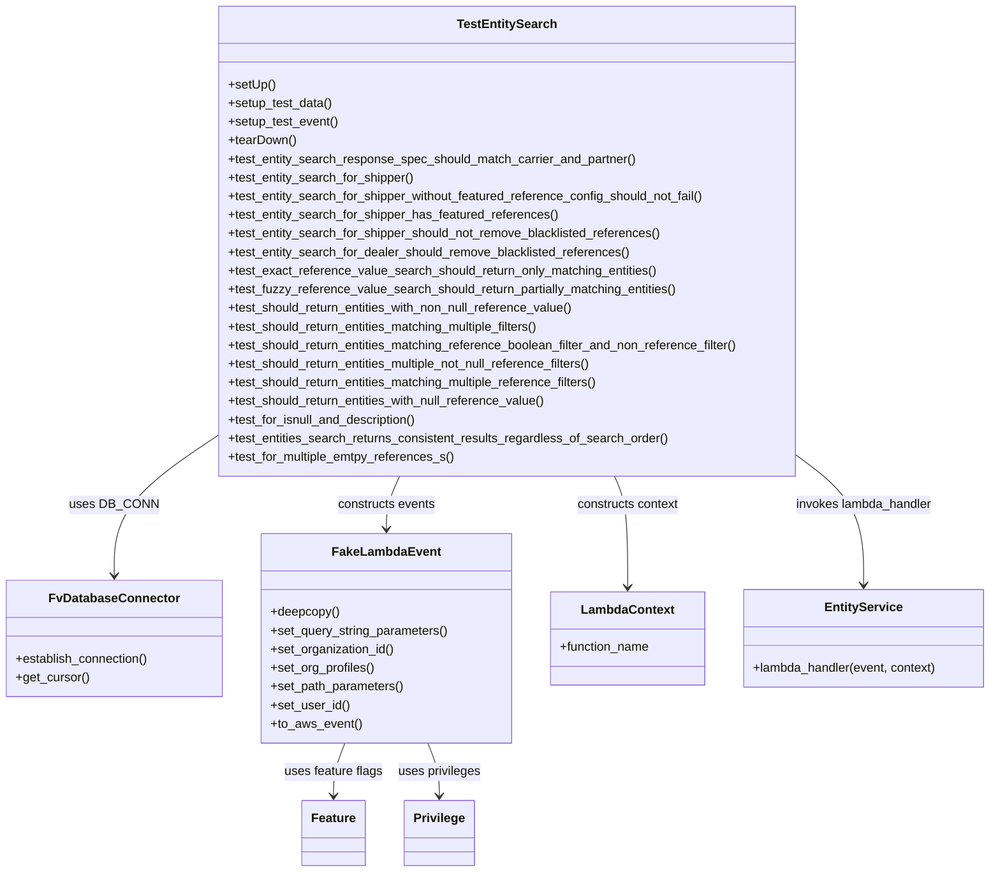
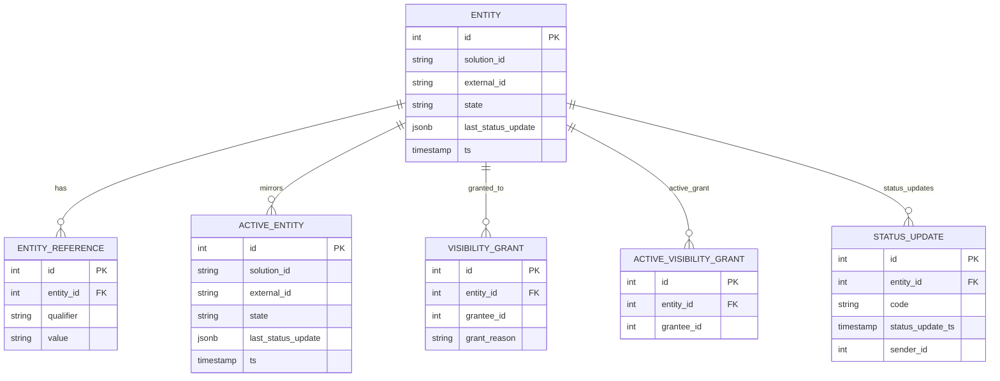

# Diagram: entity_core/entity_service/entity_service_tests/get_search_entity_tests/integration_tests/test_entity_search_for_feartured_blacklisted_reference.py


> Auto-generated by Obscura crawlers

## Diagram 1



### SVG

<svg id="container" width="1273.4296875" xmlns="http://www.w3.org/2000/svg" class="classDiagram" height="1124" viewBox="0 0 1273.4296875 1124" role="graphics-document document" aria-roledescription="class"><style>#container{font-family:"trebuchet ms",verdana,arial,sans-serif;font-size:16px;fill:#333;}@keyframes edge-animation-frame{from{stroke-dashoffset:0;}}@keyframes dash{to{stroke-dashoffset:0;}}#container .edge-animation-slow{stroke-dasharray:9,5!important;stroke-dashoffset:900;animation:dash 50s linear infinite;stroke-linecap:round;}#container .edge-animation-fast{stroke-dasharray:9,5!important;stroke-dashoffset:900;animation:dash 20s linear infinite;stroke-linecap:round;}#container .error-icon{fill:#552222;}#container .error-text{fill:#552222;stroke:#552222;}#container .edge-thickness-normal{stroke-width:1px;}#container .edge-thickness-thick{stroke-width:3.5px;}#container .edge-pattern-solid{stroke-dasharray:0;}#container .edge-thickness-invisible{stroke-width:0;fill:none;}#container .edge-pattern-dashed{stroke-dasharray:3;}#container .edge-pattern-dotted{stroke-dasharray:2;}#container .marker{fill:#333333;stroke:#333333;}#container .marker.cross{stroke:#333333;}#container svg{font-family:"trebuchet ms",verdana,arial,sans-serif;font-size:16px;}#container p{margin:0;}#container g.classGroup text{fill:#9370DB;stroke:none;font-family:"trebuchet ms",verdana,arial,sans-serif;font-size:10px;}#container g.classGroup text .title{font-weight:bolder;}#container .nodeLabel,#container .edgeLabel{color:#131300;}#container .edgeLabel .label rect{fill:#ECECFF;}#container .label text{fill:#131300;}#container .labelBkg{background:#ECECFF;}#container .edgeLabel .label span{background:#ECECFF;}#container .classTitle{font-weight:bolder;}#container .node rect,#container .node circle,#container .node ellipse,#container .node polygon,#container .node path{fill:#ECECFF;stroke:#9370DB;stroke-width:1px;}#container .divider{stroke:#9370DB;stroke-width:1;}#container g.clickable{cursor:pointer;}#container g.classGroup rect{fill:#ECECFF;stroke:#9370DB;}#container g.classGroup line{stroke:#9370DB;stroke-width:1;}#container .classLabel .box{stroke:none;stroke-width:0;fill:#ECECFF;opacity:0.5;}#container .classLabel .label{fill:#9370DB;font-size:10px;}#container .relation{stroke:#333333;stroke-width:1;fill:none;}#container .dashed-line{stroke-dasharray:3;}#container .dotted-line{stroke-dasharray:1 2;}#container #compositionStart,#container .composition{fill:#333333!important;stroke:#333333!important;stroke-width:1;}#container #compositionEnd,#container .composition{fill:#333333!important;stroke:#333333!important;stroke-width:1;}#container #dependencyStart,#container .dependency{fill:#333333!important;stroke:#333333!important;stroke-width:1;}#container #dependencyStart,#container .dependency{fill:#333333!important;stroke:#333333!important;stroke-width:1;}#container #extensionStart,#container .extension{fill:transparent!important;stroke:#333333!important;stroke-width:1;}#container #extensionEnd,#container .extension{fill:transparent!important;stroke:#333333!important;stroke-width:1;}#container #aggregationStart,#container .aggregation{fill:transparent!important;stroke:#333333!important;stroke-width:1;}#container #aggregationEnd,#container .aggregation{fill:transparent!important;stroke:#333333!important;stroke-width:1;}#container #lollipopStart,#container .lollipop{fill:#ECECFF!important;stroke:#333333!important;stroke-width:1;}#container #lollipopEnd,#container .lollipop{fill:#ECECFF!important;stroke:#333333!important;stroke-width:1;}#container .edgeTerminals{font-size:11px;line-height:initial;}#container .classTitleText{text-anchor:middle;font-size:18px;fill:#333;}#container .label-icon{display:inline-block;height:1em;overflow:visible;vertical-align:-0.125em;}#container .node .label-icon path{fill:currentColor;stroke:revert;stroke-width:revert;}#container :root{--mermaid-font-family:"trebuchet ms",verdana,arial,sans-serif;}</style><g><defs><marker id="container_class-aggregationStart" class="marker aggregation class" refX="18" refY="7" markerWidth="190" markerHeight="240" orient="auto"><path d="M 18,7 L9,13 L1,7 L9,1 Z"></path></marker></defs><defs><marker id="container_class-aggregationEnd" class="marker aggregation class" refX="1" refY="7" markerWidth="20" markerHeight="28" orient="auto"><path d="M 18,7 L9,13 L1,7 L9,1 Z"></path></marker></defs><defs><marker id="container_class-extensionStart" class="marker extension class" refX="18" refY="7" markerWidth="190" markerHeight="240" orient="auto"><path d="M 1,7 L18,13 V 1 Z"></path></marker></defs><defs><marker id="container_class-extensionEnd" class="marker extension class" refX="1" refY="7" markerWidth="20" markerHeight="28" orient="auto"><path d="M 1,1 V 13 L18,7 Z"></path></marker></defs><defs><marker id="container_class-compositionStart" class="marker composition class" refX="18" refY="7" markerWidth="190" markerHeight="240" orient="auto"><path d="M 18,7 L9,13 L1,7 L9,1 Z"></path></marker></defs><defs><marker id="container_class-compositionEnd" class="marker composition class" refX="1" refY="7" markerWidth="20" markerHeight="28" orient="auto"><path d="M 18,7 L9,13 L1,7 L9,1 Z"></path></marker></defs><defs><marker id="container_class-dependencyStart" class="marker dependency class" refX="6" refY="7" markerWidth="190" markerHeight="240" orient="auto"><path d="M 5,7 L9,13 L1,7 L9,1 Z"></path></marker></defs><defs><marker id="container_class-dependencyEnd" class="marker dependency class" refX="13" refY="7" markerWidth="20" markerHeight="28" orient="auto"><path d="M 18,7 L9,13 L14,7 L9,1 Z"></path></marker></defs><defs><marker id="container_class-lollipopStart" class="marker lollipop class" refX="13" refY="7" markerWidth="190" markerHeight="240" orient="auto"><circle stroke="black" fill="transparent" cx="7" cy="7" r="6"></circle></marker></defs><defs><marker id="container_class-lollipopEnd" class="marker lollipop class" refX="1" refY="7" markerWidth="190" markerHeight="240" orient="auto"><circle stroke="black" fill="transparent" cx="7" cy="7" r="6"></circle></marker></defs><g class="root"><g class="clusters"></g><g class="edgePaths"><path d="M271.311,566.499L250.473,580.582C229.635,594.666,187.96,622.833,167.123,652.083C146.285,681.333,146.285,711.667,146.285,726.833L146.285,742" id="id_TestEntitySearch_FvDatabaseConnector_1" class="edge-thickness-normal edge-pattern-solid relation" style=";;;" data-edge="true" data-et="edge" data-id="id_TestEntitySearch_FvDatabaseConnector_1" data-points="W3sieCI6MjcxLjMxMDU0Njg3NSwieSI6NTY2LjQ5ODY1NDY5ODA3Mzl9LHsieCI6MTQ2LjI4NTE1NjI1LCJ5Ijo2NTF9LHsieCI6MTQ2LjI4NTE1NjI1LCJ5Ijo3NDh9XQ==" marker-end="url(#container_class-dependencyEnd)"></path><path d="M511.486,614L508.68,620.167C505.875,626.333,500.263,638.667,497.458,650C494.652,661.333,494.652,671.667,494.652,676.833L494.652,682" id="id_TestEntitySearch_FakeLambdaEvent_2" class="edge-thickness-normal edge-pattern-solid relation" style=";;;" data-edge="true" data-et="edge" data-id="id_TestEntitySearch_FakeLambdaEvent_2" data-points="W3sieCI6NTExLjQ4NTc3MDkwOTkyNjUsInkiOjYxNH0seyJ4Ijo0OTQuNjUyMzQzNzUsInkiOjY1MX0seyJ4Ijo0OTQuNjUyMzQzNzUsInkiOjY4OH1d" marker-end="url(#container_class-dependencyEnd)"></path><path d="M787.19,614L789.996,620.167C792.801,626.333,798.412,638.667,801.218,662.5C804.023,686.333,804.023,721.667,804.023,739.333L804.023,757" id="id_TestEntitySearch_LambdaContext_3" class="edge-thickness-normal edge-pattern-solid relation" style=";;;" data-edge="true" data-et="edge" data-id="id_TestEntitySearch_LambdaContext_3" data-points="W3sieCI6Nzg3LjE5MDAxMDM0MDA3MzUsInkiOjYxNH0seyJ4Ijo4MDQuMDIzNDM3NSwieSI6NjUxfSx7IngiOjgwNC4wMjM0Mzc1LCJ5Ijo3NjN9XQ==" marker-end="url(#container_class-dependencyEnd)"></path><path d="M1027.365,590.391L1041.033,600.493C1054.701,610.594,1082.036,630.797,1095.703,658.065C1109.371,685.333,1109.371,719.667,1109.371,736.833L1109.371,754" id="id_TestEntitySearch_EntityService_4" class="edge-thickness-normal edge-pattern-solid relation" style=";;;" data-edge="true" data-et="edge" data-id="id_TestEntitySearch_EntityService_4" data-points="W3sieCI6MTAyNy4zNjUyMzQzNzUsInkiOjU5MC4zOTEzNDgyODA3MzcyfSx7IngiOjExMDkuMzcxMDkzNzUsInkiOjY1MX0seyJ4IjoxMTA5LjM3MTA5Mzc1LCJ5Ijo3NjB9XQ==" marker-end="url(#container_class-dependencyEnd)"></path><path d="M440.802,958L438.342,964.167C435.882,970.333,430.963,982.667,428.503,994C426.043,1005.333,426.043,1015.667,426.043,1020.833L426.043,1026" id="id_FakeLambdaEvent_Feature_5" class="edge-thickness-normal edge-pattern-solid relation" style=";;;" data-edge="true" data-et="edge" data-id="id_FakeLambdaEvent_Feature_5" data-points="W3sieCI6NDQwLjgwMTk2MjIwOTMwMjMsInkiOjk1OH0seyJ4Ijo0MjYuMDQyOTY4NzUsInkiOjk5NX0seyJ4Ijo0MjYuMDQyOTY4NzUsInkiOjEwMzJ9XQ==" marker-end="url(#container_class-dependencyEnd)"></path><path d="M548.503,958L550.963,964.167C553.422,970.333,558.342,982.667,560.802,994C563.262,1005.333,563.262,1015.667,563.262,1020.833L563.262,1026" id="id_FakeLambdaEvent_Privilege_6" class="edge-thickness-normal edge-pattern-solid relation" style=";;;" data-edge="true" data-et="edge" data-id="id_FakeLambdaEvent_Privilege_6" data-points="W3sieCI6NTQ4LjUwMjcyNTI5MDY5NzYsInkiOjk1OH0seyJ4Ijo1NjMuMjYxNzE4NzUsInkiOjk5NX0seyJ4Ijo1NjMuMjYxNzE4NzUsInkiOjEwMzJ9XQ==" marker-end="url(#container_class-dependencyEnd)"></path></g><g class="edgeLabels"><g class="edgeLabel" transform="translate(146.28515625, 651)"><g class="label" data-id="id_TestEntitySearch_FvDatabaseConnector_1" transform="translate(-53.09375, -12)"><foreignObject width="106.1875" height="24"><div xmlns="http://www.w3.org/1999/xhtml" class="labelBkg" style="display: table-cell; white-space: nowrap; line-height: 1.5; max-width: 200px; text-align: center;"><span class="edgeLabel"><p>uses DB_CONN</p></span></div></foreignObject></g></g><g class="edgeLabel" transform="translate(494.65234375, 651)"><g class="label" data-id="id_TestEntitySearch_FakeLambdaEvent_2" transform="translate(-63.8671875, -12)"><foreignObject width="127.734375" height="24"><div xmlns="http://www.w3.org/1999/xhtml" class="labelBkg" style="display: table-cell; white-space: nowrap; line-height: 1.5; max-width: 200px; text-align: center;"><span class="edgeLabel"><p>constructs events</p></span></div></foreignObject></g></g><g class="edgeLabel" transform="translate(804.0234375, 651)"><g class="label" data-id="id_TestEntitySearch_LambdaContext_3" transform="translate(-66.8125, -12)"><foreignObject width="133.625" height="24"><div xmlns="http://www.w3.org/1999/xhtml" class="labelBkg" style="display: table-cell; white-space: nowrap; line-height: 1.5; max-width: 200px; text-align: center;"><span class="edgeLabel"><p>constructs context</p></span></div></foreignObject></g></g><g class="edgeLabel" transform="translate(1109.37109375, 651)"><g class="label" data-id="id_TestEntitySearch_EntityService_4" transform="translate(-89.53125, -12)"><foreignObject width="179.0625" height="24"><div xmlns="http://www.w3.org/1999/xhtml" class="labelBkg" style="display: table-cell; white-space: nowrap; line-height: 1.5; max-width: 200px; text-align: center;"><span class="edgeLabel"><p>invokes lambda_handler</p></span></div></foreignObject></g></g><g class="edgeLabel" transform="translate(426.04296875, 995)"><g class="label" data-id="id_FakeLambdaEvent_Feature_5" transform="translate(-63.5234375, -12)"><foreignObject width="127.046875" height="24"><div xmlns="http://www.w3.org/1999/xhtml" class="labelBkg" style="display: table-cell; white-space: nowrap; line-height: 1.5; max-width: 200px; text-align: center;"><span class="edgeLabel"><p>uses feature flags</p></span></div></foreignObject></g></g><g class="edgeLabel" transform="translate(563.26171875, 995)"><g class="label" data-id="id_FakeLambdaEvent_Privilege_6" transform="translate(-53.6953125, -12)"><foreignObject width="107.390625" height="24"><div xmlns="http://www.w3.org/1999/xhtml" class="labelBkg" style="display: table-cell; white-space: nowrap; line-height: 1.5; max-width: 200px; text-align: center;"><span class="edgeLabel"><p>uses privileges</p></span></div></foreignObject></g></g></g><g class="nodes"><g class="node default" id="classId-TestEntitySearch-0" transform="translate(649.337890625, 311)"><g class="basic label-container"><path d="M-378.02734375 -303 L378.02734375 -303 L378.02734375 303 L-378.02734375 303" stroke="none" stroke-width="0" fill="#ECECFF" style=""></path><path d="M-378.02734375 -303 C-174.1671444521968 -303, 29.69305484560641 -303, 378.02734375 -303 M-378.02734375 -303 C-222.9997045753118 -303, -67.97206540062359 -303, 378.02734375 -303 M378.02734375 -303 C378.02734375 -84.43074946135593, 378.02734375 134.13850107728814, 378.02734375 303 M378.02734375 -303 C378.02734375 -159.77868337541662, 378.02734375 -16.55736675083324, 378.02734375 303 M378.02734375 303 C123.01453270399145 303, -131.9982783420171 303, -378.02734375 303 M378.02734375 303 C155.94896869805683 303, -66.12940635388634 303, -378.02734375 303 M-378.02734375 303 C-378.02734375 115.35979478952635, -378.02734375 -72.2804104209473, -378.02734375 -303 M-378.02734375 303 C-378.02734375 141.83412294036523, -378.02734375 -19.331754119269533, -378.02734375 -303" stroke="#9370DB" stroke-width="1.3" fill="none" stroke-dasharray="0 0" style=""></path></g><g class="annotation-group text" transform="translate(0, -279)"></g><g class="label-group text" transform="translate(-61.2421875, -279)"><g class="label" style="font-weight: bolder" transform="translate(0,-12)"><foreignObject width="122.484375" height="24"><div xmlns="http://www.w3.org/1999/xhtml" style="display: table-cell; white-space: nowrap; line-height: 1.5; max-width: 170px; text-align: center;"><span class="nodeLabel markdown-node-label" style=""><p>TestEntitySearch</p></span></div></foreignObject></g></g><g class="members-group text" transform="translate(-366.02734375, -231)"></g><g class="methods-group text" transform="translate(-366.02734375, -201)"><g class="label" style="" transform="translate(0,-12)"><foreignObject width="60.421875" height="24"><div xmlns="http://www.w3.org/1999/xhtml" style="display: table-cell; white-space: nowrap; line-height: 1.5; max-width: 118px; text-align: center;"><span class="nodeLabel markdown-node-label" style=""><p>+setUp()</p></span></div></foreignObject></g><g class="label" style="" transform="translate(0,12)"><foreignObject width="134.96875" height="24"><div xmlns="http://www.w3.org/1999/xhtml" style="display: table-cell; white-space: nowrap; line-height: 1.5; max-width: 192px; text-align: center;"><span class="nodeLabel markdown-node-label" style=""><p>+setup_test_data()</p></span></div></foreignObject></g><g class="label" style="" transform="translate(0,36)"><foreignObject width="142.671875" height="24"><div xmlns="http://www.w3.org/1999/xhtml" style="display: table-cell; white-space: nowrap; line-height: 1.5; max-width: 200px; text-align: center;"><span class="nodeLabel markdown-node-label" style=""><p>+setup_test_event()</p></span></div></foreignObject></g><g class="label" style="" transform="translate(0,60)"><foreignObject width="87.75" height="24"><div xmlns="http://www.w3.org/1999/xhtml" style="display: table-cell; white-space: nowrap; line-height: 1.5; max-width: 145px; text-align: center;"><span class="nodeLabel markdown-node-label" style=""><p>+tearDown()</p></span></div></foreignObject></g><g class="label" style="" transform="translate(0,84)"><foreignObject width="531.203125" height="24"><div xmlns="http://www.w3.org/1999/xhtml" style="display: table-cell; white-space: nowrap; line-height: 1.5; max-width: 589px; text-align: center;"><span class="nodeLabel markdown-node-label" style=""><p>+test_entity_search_response_spec_should_match_carrier_and_partner()</p></span></div></foreignObject></g><g class="label" style="" transform="translate(0,108)"><foreignObject width="242.0625" height="24"><div xmlns="http://www.w3.org/1999/xhtml" style="display: table-cell; white-space: nowrap; line-height: 1.5; max-width: 299px; text-align: center;"><span class="nodeLabel markdown-node-label" style=""><p>+test_entity_search_for_shipper()</p></span></div></foreignObject></g><g class="label" style="" transform="translate(0,132)"><foreignObject width="623.421875" height="24"><div xmlns="http://www.w3.org/1999/xhtml" style="display: table-cell; white-space: nowrap; line-height: 1.5; max-width: 681px; text-align: center;"><span class="nodeLabel markdown-node-label" style=""><p>+test_entity_search_for_shipper_without_featured_reference_config_should_not_fail()</p></span></div></foreignObject></g><g class="label" style="" transform="translate(0,156)"><foreignObject width="427.671875" height="24"><div xmlns="http://www.w3.org/1999/xhtml" style="display: table-cell; white-space: nowrap; line-height: 1.5; max-width: 485px; text-align: center;"><span class="nodeLabel markdown-node-label" style=""><p>+test_entity_search_for_shipper_has_featured_references()</p></span></div></foreignObject></g><g class="label" style="" transform="translate(0,180)"><foreignObject width="564.96875" height="24"><div xmlns="http://www.w3.org/1999/xhtml" style="display: table-cell; white-space: nowrap; line-height: 1.5; max-width: 622px; text-align: center;"><span class="nodeLabel markdown-node-label" style=""><p>+test_entity_search_for_shipper_should_not_remove_blacklisted_references()</p></span></div></foreignObject></g><g class="label" style="" transform="translate(0,204)"><foreignObject width="522.75" height="24"><div xmlns="http://www.w3.org/1999/xhtml" style="display: table-cell; white-space: nowrap; line-height: 1.5; max-width: 580px; text-align: center;"><span class="nodeLabel markdown-node-label" style=""><p>+test_entity_search_for_dealer_should_remove_blacklisted_references()</p></span></div></foreignObject></g><g class="label" style="" transform="translate(0,228)"><foreignObject width="558.8125" height="24"><div xmlns="http://www.w3.org/1999/xhtml" style="display: table-cell; white-space: nowrap; line-height: 1.5; max-width: 616px; text-align: center;"><span class="nodeLabel markdown-node-label" style=""><p>+test_exact_reference_value_search_should_return_only_matching_entities()</p></span></div></foreignObject></g><g class="label" style="" transform="translate(0,252)"><foreignObject width="585.984375" height="24"><div xmlns="http://www.w3.org/1999/xhtml" style="display: table-cell; white-space: nowrap; line-height: 1.5; max-width: 643px; text-align: center;"><span class="nodeLabel markdown-node-label" style=""><p>+test_fuzzy_reference_value_search_should_return_partially_matching_entities()</p></span></div></foreignObject></g><g class="label" style="" transform="translate(0,276)"><foreignObject width="454.53125" height="24"><div xmlns="http://www.w3.org/1999/xhtml" style="display: table-cell; white-space: nowrap; line-height: 1.5; max-width: 512px; text-align: center;"><span class="nodeLabel markdown-node-label" style=""><p>+test_should_return_entities_with_non_null_reference_value()</p></span></div></foreignObject></g><g class="label" style="" transform="translate(0,300)"><foreignObject width="413.65625" height="24"><div xmlns="http://www.w3.org/1999/xhtml" style="display: table-cell; white-space: nowrap; line-height: 1.5; max-width: 471px; text-align: center;"><span class="nodeLabel markdown-node-label" style=""><p>+test_should_return_entities_matching_multiple_filters()</p></span></div></foreignObject></g><g class="label" style="" transform="translate(0,324)"><foreignObject width="670.8125" height="24"><div xmlns="http://www.w3.org/1999/xhtml" style="display: table-cell; white-space: nowrap; line-height: 1.5; max-width: 728px; text-align: center;"><span class="nodeLabel markdown-node-label" style=""><p>+test_should_return_entities_matching_reference_boolean_filter_and_non_reference_filter()</p></span></div></foreignObject></g><g class="label" style="" transform="translate(0,348)"><foreignObject width="483.46875" height="24"><div xmlns="http://www.w3.org/1999/xhtml" style="display: table-cell; white-space: nowrap; line-height: 1.5; max-width: 541px; text-align: center;"><span class="nodeLabel markdown-node-label" style=""><p>+test_should_return_entities_multiple_not_null_reference_filters()</p></span></div></foreignObject></g><g class="label" style="" transform="translate(0,372)"><foreignObject width="489.828125" height="24"><div xmlns="http://www.w3.org/1999/xhtml" style="display: table-cell; white-space: nowrap; line-height: 1.5; max-width: 547px; text-align: center;"><span class="nodeLabel markdown-node-label" style=""><p>+test_should_return_entities_matching_multiple_reference_filters()</p></span></div></foreignObject></g><g class="label" style="" transform="translate(0,396)"><foreignObject width="418.125" height="24"><div xmlns="http://www.w3.org/1999/xhtml" style="display: table-cell; white-space: nowrap; line-height: 1.5; max-width: 475px; text-align: center;"><span class="nodeLabel markdown-node-label" style=""><p>+test_should_return_entities_with_null_reference_value()</p></span></div></foreignObject></g><g class="label" style="" transform="translate(0,420)"><foreignObject width="247.84375" height="24"><div xmlns="http://www.w3.org/1999/xhtml" style="display: table-cell; white-space: nowrap; line-height: 1.5; max-width: 305px; text-align: center;"><span class="nodeLabel markdown-node-label" style=""><p>+test_for_isnull_and_description()</p></span></div></foreignObject></g><g class="label" style="" transform="translate(0,444)"><foreignObject width="572.703125" height="24"><div xmlns="http://www.w3.org/1999/xhtml" style="display: table-cell; white-space: nowrap; line-height: 1.5; max-width: 630px; text-align: center;"><span class="nodeLabel markdown-node-label" style=""><p>+test_entities_search_returns_consistent_results_regardless_of_search_order()</p></span></div></foreignObject></g><g class="label" style="" transform="translate(0,468)"><foreignObject width="294.53125" height="24"><div xmlns="http://www.w3.org/1999/xhtml" style="display: table-cell; white-space: nowrap; line-height: 1.5; max-width: 352px; text-align: center;"><span class="nodeLabel markdown-node-label" style=""><p>+test_for_multiple_emtpy_references_s()</p></span></div></foreignObject></g></g><g class="divider" style=""><path d="M-378.02734375 -255 C-215.18106292846247 -255, -52.33478210692493 -255, 378.02734375 -255 M-378.02734375 -255 C-219.91041787295353 -255, -61.79349199590706 -255, 378.02734375 -255" stroke="#9370DB" stroke-width="1.3" fill="none" stroke-dasharray="0 0" style=""></path></g><g class="divider" style=""><path d="M-378.02734375 -231 C-154.00013476471761 -231, 70.02707422056477 -231, 378.02734375 -231 M-378.02734375 -231 C-212.23902773410632 -231, -46.45071171821263 -231, 378.02734375 -231" stroke="#9370DB" stroke-width="1.3" fill="none" stroke-dasharray="0 0" style=""></path></g></g><g class="node default" id="classId-FvDatabaseConnector-1" transform="translate(146.28515625, 823)"><g class="basic label-container"><path d="M-138.28515625 -75 L138.28515625 -75 L138.28515625 75 L-138.28515625 75" stroke="none" stroke-width="0" fill="#ECECFF" style=""></path><path d="M-138.28515625 -75 C-38.591274111817015 -75, 61.10260802636597 -75, 138.28515625 -75 M-138.28515625 -75 C-35.195312895717535 -75, 67.89453045856493 -75, 138.28515625 -75 M138.28515625 -75 C138.28515625 -33.06574422148145, 138.28515625 8.868511557037095, 138.28515625 75 M138.28515625 -75 C138.28515625 -41.77502844040424, 138.28515625 -8.550056880808484, 138.28515625 75 M138.28515625 75 C47.40293564236592 75, -43.479284965268164 75, -138.28515625 75 M138.28515625 75 C66.65636071207034 75, -4.972434825859324 75, -138.28515625 75 M-138.28515625 75 C-138.28515625 26.786420835081003, -138.28515625 -21.427158329837994, -138.28515625 -75 M-138.28515625 75 C-138.28515625 29.45366006333372, -138.28515625 -16.092679873332557, -138.28515625 -75" stroke="#9370DB" stroke-width="1.3" fill="none" stroke-dasharray="0 0" style=""></path></g><g class="annotation-group text" transform="translate(0, -51)"></g><g class="label-group text" transform="translate(-79.3046875, -51)"><g class="label" style="font-weight: bolder" transform="translate(0,-12)"><foreignObject width="158.609375" height="24"><div xmlns="http://www.w3.org/1999/xhtml" style="display: table-cell; white-space: nowrap; line-height: 1.5; max-width: 207px; text-align: center;"><span class="nodeLabel markdown-node-label" style=""><p>FvDatabaseConnector</p></span></div></foreignObject></g></g><g class="members-group text" transform="translate(-126.28515625, -3)"></g><g class="methods-group text" transform="translate(-126.28515625, 27)"><g class="label" style="" transform="translate(0,-12)"><foreignObject width="173.265625" height="24"><div xmlns="http://www.w3.org/1999/xhtml" style="display: table-cell; white-space: nowrap; line-height: 1.5; max-width: 231px; text-align: center;"><span class="nodeLabel markdown-node-label" style=""><p>+establish_connection()</p></span></div></foreignObject></g><g class="label" style="" transform="translate(0,12)"><foreignObject width="94.640625" height="24"><div xmlns="http://www.w3.org/1999/xhtml" style="display: table-cell; white-space: nowrap; line-height: 1.5; max-width: 152px; text-align: center;"><span class="nodeLabel markdown-node-label" style=""><p>+get_cursor()</p></span></div></foreignObject></g></g><g class="divider" style=""><path d="M-138.28515625 -27 C-78.37354917421868 -27, -18.461942098437376 -27, 138.28515625 -27 M-138.28515625 -27 C-71.27278758745805 -27, -4.2604189249161095 -27, 138.28515625 -27" stroke="#9370DB" stroke-width="1.3" fill="none" stroke-dasharray="0 0" style=""></path></g><g class="divider" style=""><path d="M-138.28515625 -3 C-52.49142110958498 -3, 33.30231403083005 -3, 138.28515625 -3 M-138.28515625 -3 C-56.23741625392384 -3, 25.81032374215232 -3, 138.28515625 -3" stroke="#9370DB" stroke-width="1.3" fill="none" stroke-dasharray="0 0" style=""></path></g></g><g class="node default" id="classId-FakeLambdaEvent-2" transform="translate(494.65234375, 823)"><g class="basic label-container"><path d="M-160.08203125 -135 L160.08203125 -135 L160.08203125 135 L-160.08203125 135" stroke="none" stroke-width="0" fill="#ECECFF" style=""></path><path d="M-160.08203125 -135 C-82.45697284159662 -135, -4.831914433193248 -135, 160.08203125 -135 M-160.08203125 -135 C-62.38233622598442 -135, 35.317358798031165 -135, 160.08203125 -135 M160.08203125 -135 C160.08203125 -48.009448174060566, 160.08203125 38.98110365187887, 160.08203125 135 M160.08203125 -135 C160.08203125 -71.23218699362013, 160.08203125 -7.464373987240279, 160.08203125 135 M160.08203125 135 C56.38500230636754 135, -47.31202663726492 135, -160.08203125 135 M160.08203125 135 C41.80902693702383 135, -76.46397737595234 135, -160.08203125 135 M-160.08203125 135 C-160.08203125 58.58854192889568, -160.08203125 -17.82291614220864, -160.08203125 -135 M-160.08203125 135 C-160.08203125 75.75325099320091, -160.08203125 16.50650198640183, -160.08203125 -135" stroke="#9370DB" stroke-width="1.3" fill="none" stroke-dasharray="0 0" style=""></path></g><g class="annotation-group text" transform="translate(0, -111)"></g><g class="label-group text" transform="translate(-65.8671875, -111)"><g class="label" style="font-weight: bolder" transform="translate(0,-12)"><foreignObject width="131.734375" height="24"><div xmlns="http://www.w3.org/1999/xhtml" style="display: table-cell; white-space: nowrap; line-height: 1.5; max-width: 181px; text-align: center;"><span class="nodeLabel markdown-node-label" style=""><p>FakeLambdaEvent</p></span></div></foreignObject></g></g><g class="members-group text" transform="translate(-148.08203125, -63)"></g><g class="methods-group text" transform="translate(-148.08203125, -33)"><g class="label" style="" transform="translate(0,-12)"><foreignObject width="88.859375" height="24"><div xmlns="http://www.w3.org/1999/xhtml" style="display: table-cell; white-space: nowrap; line-height: 1.5; max-width: 146px; text-align: center;"><span class="nodeLabel markdown-node-label" style=""><p>+deepcopy()</p></span></div></foreignObject></g><g class="label" style="" transform="translate(0,12)"><foreignObject width="230.296875" height="24"><div xmlns="http://www.w3.org/1999/xhtml" style="display: table-cell; white-space: nowrap; line-height: 1.5; max-width: 288px; text-align: center;"><span class="nodeLabel markdown-node-label" style=""><p>+set_query_string_parameters()</p></span></div></foreignObject></g><g class="label" style="" transform="translate(0,36)"><foreignObject width="161.078125" height="24"><div xmlns="http://www.w3.org/1999/xhtml" style="display: table-cell; white-space: nowrap; line-height: 1.5; max-width: 218px; text-align: center;"><span class="nodeLabel markdown-node-label" style=""><p>+set_organization_id()</p></span></div></foreignObject></g><g class="label" style="" transform="translate(0,60)"><foreignObject width="134.859375" height="24"><div xmlns="http://www.w3.org/1999/xhtml" style="display: table-cell; white-space: nowrap; line-height: 1.5; max-width: 192px; text-align: center;"><span class="nodeLabel markdown-node-label" style=""><p>+set_org_profiles()</p></span></div></foreignObject></g><g class="label" style="" transform="translate(0,84)"><foreignObject width="172.625" height="24"><div xmlns="http://www.w3.org/1999/xhtml" style="display: table-cell; white-space: nowrap; line-height: 1.5; max-width: 230px; text-align: center;"><span class="nodeLabel markdown-node-label" style=""><p>+set_path_parameters()</p></span></div></foreignObject></g><g class="label" style="" transform="translate(0,108)"><foreignObject width="101.125" height="24"><div xmlns="http://www.w3.org/1999/xhtml" style="display: table-cell; white-space: nowrap; line-height: 1.5; max-width: 158px; text-align: center;"><span class="nodeLabel markdown-node-label" style=""><p>+set_user_id()</p></span></div></foreignObject></g><g class="label" style="" transform="translate(0,132)"><foreignObject width="116.421875" height="24"><div xmlns="http://www.w3.org/1999/xhtml" style="display: table-cell; white-space: nowrap; line-height: 1.5; max-width: 174px; text-align: center;"><span class="nodeLabel markdown-node-label" style=""><p>+to_aws_event()</p></span></div></foreignObject></g></g><g class="divider" style=""><path d="M-160.08203125 -87 C-64.61481468634203 -87, 30.85240187731594 -87, 160.08203125 -87 M-160.08203125 -87 C-77.30085561448327 -87, 5.480320021033464 -87, 160.08203125 -87" stroke="#9370DB" stroke-width="1.3" fill="none" stroke-dasharray="0 0" style=""></path></g><g class="divider" style=""><path d="M-160.08203125 -63 C-66.61243687007422 -63, 26.85715750985156 -63, 160.08203125 -63 M-160.08203125 -63 C-65.43228212508993 -63, 29.217466999820147 -63, 160.08203125 -63" stroke="#9370DB" stroke-width="1.3" fill="none" stroke-dasharray="0 0" style=""></path></g></g><g class="node default" id="classId-LambdaContext-3" transform="translate(804.0234375, 823)"><g class="basic label-container"><path d="M-99.2890625 -60 L99.2890625 -60 L99.2890625 60 L-99.2890625 60" stroke="none" stroke-width="0" fill="#ECECFF" style=""></path><path d="M-99.2890625 -60 C-47.075009924049006 -60, 5.139042651901988 -60, 99.2890625 -60 M-99.2890625 -60 C-58.78686136906529 -60, -18.284660238130584 -60, 99.2890625 -60 M99.2890625 -60 C99.2890625 -21.855840068603243, 99.2890625 16.288319862793514, 99.2890625 60 M99.2890625 -60 C99.2890625 -21.60172315171227, 99.2890625 16.796553696575458, 99.2890625 60 M99.2890625 60 C53.33801293600069 60, 7.386963372001375 60, -99.2890625 60 M99.2890625 60 C41.17029299220211 60, -16.948476515595786 60, -99.2890625 60 M-99.2890625 60 C-99.2890625 14.942406140511117, -99.2890625 -30.115187718977765, -99.2890625 -60 M-99.2890625 60 C-99.2890625 34.46771555081017, -99.2890625 8.935431101620338, -99.2890625 -60" stroke="#9370DB" stroke-width="1.3" fill="none" stroke-dasharray="0 0" style=""></path></g><g class="annotation-group text" transform="translate(0, -36)"></g><g class="label-group text" transform="translate(-57.296875, -36)"><g class="label" style="font-weight: bolder" transform="translate(0,-12)"><foreignObject width="114.59375" height="24"><div xmlns="http://www.w3.org/1999/xhtml" style="display: table-cell; white-space: nowrap; line-height: 1.5; max-width: 163px; text-align: center;"><span class="nodeLabel markdown-node-label" style=""><p>LambdaContext</p></span></div></foreignObject></g></g><g class="members-group text" transform="translate(-87.2890625, 12)"><g class="label" style="" transform="translate(0,-12)"><foreignObject width="117.28125" height="24"><div xmlns="http://www.w3.org/1999/xhtml" style="display: table-cell; white-space: nowrap; line-height: 1.5; max-width: 175px; text-align: center;"><span class="nodeLabel markdown-node-label" style=""><p>+function_name</p></span></div></foreignObject></g></g><g class="methods-group text" transform="translate(-87.2890625, 60)"></g><g class="divider" style=""><path d="M-99.2890625 -12 C-43.2080197343877 -12, 12.873023031224605 -12, 99.2890625 -12 M-99.2890625 -12 C-41.03625306735821 -12, 17.21655636528358 -12, 99.2890625 -12" stroke="#9370DB" stroke-width="1.3" fill="none" stroke-dasharray="0 0" style=""></path></g><g class="divider" style=""><path d="M-99.2890625 36 C-46.98156264206647 36, 5.325937215867057 36, 99.2890625 36 M-99.2890625 36 C-43.34091924399556 36, 12.607224012008885 36, 99.2890625 36" stroke="#9370DB" stroke-width="1.3" fill="none" stroke-dasharray="0 0" style=""></path></g></g><g class="node default" id="classId-EntityService-4" transform="translate(1109.37109375, 823)"><g class="basic label-container"><path d="M-156.05859375 -63 L156.05859375 -63 L156.05859375 63 L-156.05859375 63" stroke="none" stroke-width="0" fill="#ECECFF" style=""></path><path d="M-156.05859375 -63 C-88.30770735716756 -63, -20.556820964335117 -63, 156.05859375 -63 M-156.05859375 -63 C-85.0024137965503 -63, -13.9462338431006 -63, 156.05859375 -63 M156.05859375 -63 C156.05859375 -22.103763281491084, 156.05859375 18.792473437017833, 156.05859375 63 M156.05859375 -63 C156.05859375 -35.91835893994998, 156.05859375 -8.836717879899972, 156.05859375 63 M156.05859375 63 C60.38815661024083 63, -35.282280529518346 63, -156.05859375 63 M156.05859375 63 C82.18167938769254 63, 8.30476502538508 63, -156.05859375 63 M-156.05859375 63 C-156.05859375 33.242035962396386, -156.05859375 3.4840719247927794, -156.05859375 -63 M-156.05859375 63 C-156.05859375 18.299327825555416, -156.05859375 -26.401344348889168, -156.05859375 -63" stroke="#9370DB" stroke-width="1.3" fill="none" stroke-dasharray="0 0" style=""></path></g><g class="annotation-group text" transform="translate(0, -39)"></g><g class="label-group text" transform="translate(-47.9296875, -39)"><g class="label" style="font-weight: bolder" transform="translate(0,-12)"><foreignObject width="95.859375" height="24"><div xmlns="http://www.w3.org/1999/xhtml" style="display: table-cell; white-space: nowrap; line-height: 1.5; max-width: 144px; text-align: center;"><span class="nodeLabel markdown-node-label" style=""><p>EntityService</p></span></div></foreignObject></g></g><g class="members-group text" transform="translate(-144.05859375, 9)"></g><g class="methods-group text" transform="translate(-144.05859375, 39)"><g class="label" style="" transform="translate(0,-12)"><foreignObject width="240.1875" height="24"><div xmlns="http://www.w3.org/1999/xhtml" style="display: table-cell; white-space: nowrap; line-height: 1.5; max-width: 298px; text-align: center;"><span class="nodeLabel markdown-node-label" style=""><p>+lambda_handler(event, context)</p></span></div></foreignObject></g></g><g class="divider" style=""><path d="M-156.05859375 -15 C-39.3885278678644 -15, 77.2815380142712 -15, 156.05859375 -15 M-156.05859375 -15 C-82.1220183489901 -15, -8.185442947980192 -15, 156.05859375 -15" stroke="#9370DB" stroke-width="1.3" fill="none" stroke-dasharray="0 0" style=""></path></g><g class="divider" style=""><path d="M-156.05859375 9 C-70.01584523388941 9, 16.026903282221184 9, 156.05859375 9 M-156.05859375 9 C-37.19028098354789 9, 81.67803178290421 9, 156.05859375 9" stroke="#9370DB" stroke-width="1.3" fill="none" stroke-dasharray="0 0" style=""></path></g></g><g class="node default" id="classId-Feature-5" transform="translate(426.04296875, 1074)"><g class="basic label-container"><path d="M-39.390625 -42 L39.390625 -42 L39.390625 42 L-39.390625 42" stroke="none" stroke-width="0" fill="#ECECFF" style=""></path><path d="M-39.390625 -42 C-12.401537571939937 -42, 14.587549856120127 -42, 39.390625 -42 M-39.390625 -42 C-20.565321458069395 -42, -1.7400179161387896 -42, 39.390625 -42 M39.390625 -42 C39.390625 -14.232298789883131, 39.390625 13.535402420233737, 39.390625 42 M39.390625 -42 C39.390625 -10.728153094251262, 39.390625 20.543693811497477, 39.390625 42 M39.390625 42 C18.23279151357837 42, -2.9250419728432604 42, -39.390625 42 M39.390625 42 C12.753811141026816 42, -13.883002717946368 42, -39.390625 42 M-39.390625 42 C-39.390625 20.30974446558642, -39.390625 -1.3805110688271611, -39.390625 -42 M-39.390625 42 C-39.390625 15.258868398505498, -39.390625 -11.482263202989003, -39.390625 -42" stroke="#9370DB" stroke-width="1.3" fill="none" stroke-dasharray="0 0" style=""></path></g><g class="annotation-group text" transform="translate(0, -18)"></g><g class="label-group text" transform="translate(-27.390625, -18)"><g class="label" style="font-weight: bolder" transform="translate(0,-12)"><foreignObject width="54.78125" height="24"><div xmlns="http://www.w3.org/1999/xhtml" style="display: table-cell; white-space: nowrap; line-height: 1.5; max-width: 104px; text-align: center;"><span class="nodeLabel markdown-node-label" style=""><p>Feature</p></span></div></foreignObject></g></g><g class="members-group text" transform="translate(-27.390625, 30)"></g><g class="methods-group text" transform="translate(-27.390625, 60)"></g><g class="divider" style=""><path d="M-39.390625 6 C-12.666212930406502 6, 14.058199139186996 6, 39.390625 6 M-39.390625 6 C-15.446472515590841 6, 8.497679968818318 6, 39.390625 6" stroke="#9370DB" stroke-width="1.3" fill="none" stroke-dasharray="0 0" style=""></path></g><g class="divider" style=""><path d="M-39.390625 24 C-16.96389596030957 24, 5.462833079380857 24, 39.390625 24 M-39.390625 24 C-18.056484113821135 24, 3.27765677235773 24, 39.390625 24" stroke="#9370DB" stroke-width="1.3" fill="none" stroke-dasharray="0 0" style=""></path></g></g><g class="node default" id="classId-Privilege-6" transform="translate(563.26171875, 1074)"><g class="basic label-container"><path d="M-43.8671875 -42 L43.8671875 -42 L43.8671875 42 L-43.8671875 42" stroke="none" stroke-width="0" fill="#ECECFF" style=""></path><path d="M-43.8671875 -42 C-22.03854859416923 -42, -0.20990968833846324 -42, 43.8671875 -42 M-43.8671875 -42 C-9.355528723826893 -42, 25.156130052346214 -42, 43.8671875 -42 M43.8671875 -42 C43.8671875 -15.024166747958361, 43.8671875 11.951666504083278, 43.8671875 42 M43.8671875 -42 C43.8671875 -19.541089090467622, 43.8671875 2.9178218190647556, 43.8671875 42 M43.8671875 42 C23.316528495229708 42, 2.7658694904594157 42, -43.8671875 42 M43.8671875 42 C13.593863860728852 42, -16.679459778542295 42, -43.8671875 42 M-43.8671875 42 C-43.8671875 9.2583223759477, -43.8671875 -23.4833552481046, -43.8671875 -42 M-43.8671875 42 C-43.8671875 15.576258374808344, -43.8671875 -10.847483250383313, -43.8671875 -42" stroke="#9370DB" stroke-width="1.3" fill="none" stroke-dasharray="0 0" style=""></path></g><g class="annotation-group text" transform="translate(0, -18)"></g><g class="label-group text" transform="translate(-31.8671875, -18)"><g class="label" style="font-weight: bolder" transform="translate(0,-12)"><foreignObject width="63.734375" height="24"><div xmlns="http://www.w3.org/1999/xhtml" style="display: table-cell; white-space: nowrap; line-height: 1.5; max-width: 112px; text-align: center;"><span class="nodeLabel markdown-node-label" style=""><p>Privilege</p></span></div></foreignObject></g></g><g class="members-group text" transform="translate(-31.8671875, 30)"></g><g class="methods-group text" transform="translate(-31.8671875, 60)"></g><g class="divider" style=""><path d="M-43.8671875 6 C-11.993764200294905 6, 19.87965909941019 6, 43.8671875 6 M-43.8671875 6 C-19.882449245174744 6, 4.102289009650512 6, 43.8671875 6" stroke="#9370DB" stroke-width="1.3" fill="none" stroke-dasharray="0 0" style=""></path></g><g class="divider" style=""><path d="M-43.8671875 24 C-15.532388499417603 24, 12.802410501164793 24, 43.8671875 24 M-43.8671875 24 C-16.220685971652085 24, 11.42581555669583 24, 43.8671875 24" stroke="#9370DB" stroke-width="1.3" fill="none" stroke-dasharray="0 0" style=""></path></g></g></g></g></g></svg>

## Diagram 2

```mermaid
flowchart TD
Start([Start Test Run]) --> Setup[setUp]
Setup --> SetupData[setup_test_data\n(inserts into DB tables)]
SetupData --> SetupEvent[setup_test_event\n(prepare FakeLambdaEvent + LambdaContext)]
SetupEvent --> RunTests{Run each test method}
RunTests --> TestCase[Prepare event & context]
TestCase --> CallLambda[Call lambda_handler(event, context)]
CallLambda --> Assert[Assertions on response]
Assert --> NextTest{More tests?}
NextTest -->|yes| TestCase
NextTest -->|no| TearDown[tearDown\n(clean DB)]
TearDown --> End([End Test Run])
```

> SVG rendering failed for this diagram.

## Diagram 3



### SVG

<svg id="container" width="1842.875" xmlns="http://www.w3.org/2000/svg" class="erDiagram" height="715.5" viewBox="0 0 1842.875 715.5" role="graphics-document document" aria-roledescription="er"><style>#container{font-family:"trebuchet ms",verdana,arial,sans-serif;font-size:16px;fill:#333;}@keyframes edge-animation-frame{from{stroke-dashoffset:0;}}@keyframes dash{to{stroke-dashoffset:0;}}#container .edge-animation-slow{stroke-dasharray:9,5!important;stroke-dashoffset:900;animation:dash 50s linear infinite;stroke-linecap:round;}#container .edge-animation-fast{stroke-dasharray:9,5!important;stroke-dashoffset:900;animation:dash 20s linear infinite;stroke-linecap:round;}#container .error-icon{fill:#552222;}#container .error-text{fill:#552222;stroke:#552222;}#container .edge-thickness-normal{stroke-width:1px;}#container .edge-thickness-thick{stroke-width:3.5px;}#container .edge-pattern-solid{stroke-dasharray:0;}#container .edge-thickness-invisible{stroke-width:0;fill:none;}#container .edge-pattern-dashed{stroke-dasharray:3;}#container .edge-pattern-dotted{stroke-dasharray:2;}#container .marker{fill:#333333;stroke:#333333;}#container .marker.cross{stroke:#333333;}#container svg{font-family:"trebuchet ms",verdana,arial,sans-serif;font-size:16px;}#container p{margin:0;}#container .entityBox{fill:#ECECFF;stroke:#9370DB;}#container .relationshipLabelBox{fill:hsl(80, 100%, 96.2745098039%);opacity:0.7;background-color:hsl(80, 100%, 96.2745098039%);}#container .relationshipLabelBox rect{opacity:0.5;}#container .labelBkg{background-color:rgba(248.6666666666, 255, 235.9999999999, 0.5);}#container .edgeLabel .label{fill:#9370DB;font-size:14px;}#container .label{font-family:"trebuchet ms",verdana,arial,sans-serif;color:#333;}#container .edge-pattern-dashed{stroke-dasharray:8,8;}#container .node rect,#container .node circle,#container .node ellipse,#container .node polygon{fill:#ECECFF;stroke:#9370DB;stroke-width:1px;}#container .relationshipLine{stroke:#333333;stroke-width:1;fill:none;}#container .marker{fill:none!important;stroke:#333333!important;stroke-width:1;}#container :root{--mermaid-font-family:"trebuchet ms",verdana,arial,sans-serif;}</style><g><defs><marker id="container_er-onlyOneStart" class="marker onlyOne er" refX="0" refY="9" markerWidth="18" markerHeight="18" orient="auto"><path d="M9,0 L9,18 M15,0 L15,18"></path></marker></defs><defs><marker id="container_er-onlyOneEnd" class="marker onlyOne er" refX="18" refY="9" markerWidth="18" markerHeight="18" orient="auto"><path d="M3,0 L3,18 M9,0 L9,18"></path></marker></defs><defs><marker id="container_er-zeroOrOneStart" class="marker zeroOrOne er" refX="0" refY="9" markerWidth="30" markerHeight="18" orient="auto"><circle fill="white" cx="21" cy="9" r="6"></circle><path d="M9,0 L9,18"></path></marker></defs><defs><marker id="container_er-zeroOrOneEnd" class="marker zeroOrOne er" refX="30" refY="9" markerWidth="30" markerHeight="18" orient="auto"><circle fill="white" cx="9" cy="9" r="6"></circle><path d="M21,0 L21,18"></path></marker></defs><defs><marker id="container_er-oneOrMoreStart" class="marker oneOrMore er" refX="18" refY="18" markerWidth="45" markerHeight="36" orient="auto"><path d="M0,18 Q 18,0 36,18 Q 18,36 0,18 M42,9 L42,27"></path></marker></defs><defs><marker id="container_er-oneOrMoreEnd" class="marker oneOrMore er" refX="27" refY="18" markerWidth="45" markerHeight="36" orient="auto"><path d="M3,9 L3,27 M9,18 Q27,0 45,18 Q27,36 9,18"></path></marker></defs><defs><marker id="container_er-zeroOrMoreStart" class="marker zeroOrMore er" refX="18" refY="18" markerWidth="57" markerHeight="36" orient="auto"><circle fill="white" cx="48" cy="18" r="6"></circle><path d="M0,18 Q18,0 36,18 Q18,36 0,18"></path></marker></defs><defs><marker id="container_er-zeroOrMoreEnd" class="marker zeroOrMore er" refX="39" refY="18" markerWidth="57" markerHeight="36" orient="auto"><circle fill="white" cx="9" cy="18" r="6"></circle><path d="M21,18 Q39,0 57,18 Q39,36 21,18"></path></marker></defs><g class="root"><g class="clusters"></g><g class="edgePaths"><path d="M757.328,196.14L649.044,223.075C540.76,250.01,324.193,303.88,215.909,346.357C107.625,388.833,107.625,419.917,107.625,435.458L107.625,451" id="id_entity-ENTITY-0_entity-ENTITY_REFERENCE-2_0" class="edge-thickness-normal edge-pattern-solid relationshipLine" style="undefined;;;undefined" data-edge="true" data-et="edge" data-id="id_entity-ENTITY-0_entity-ENTITY_REFERENCE-2_0" data-points="W3sieCI6NzU3LjMyODEyNSwieSI6MTk2LjEzOTY1MTk3NDYzNjA4fSx7IngiOjEwNy42MjUsInkiOjM1Ny43NX0seyJ4IjoxMDcuNjI1LCJ5Ijo0NTF9XQ==" marker-start="url(#container_er-onlyOneStart)" marker-end="url(#container_er-zeroOrMoreEnd)"></path><path d="M757.328,233.188L714.788,253.948C672.247,274.708,587.167,316.229,544.626,345.406C502.086,374.583,502.086,391.417,502.086,399.833L502.086,408.25" id="id_entity-ENTITY-0_entity-ACTIVE_ENTITY-1_1" class="edge-thickness-normal edge-pattern-solid relationshipLine" style="undefined;;;undefined" data-edge="true" data-et="edge" data-id="id_entity-ENTITY-0_entity-ACTIVE_ENTITY-1_1" data-points="W3sieCI6NzU3LjMyODEyNSwieSI6MjMzLjE4NzUzMzMzOTY4Mzc0fSx7IngiOjUwMi4wODU5Mzc1LCJ5IjozNTcuNzV9LHsieCI6NTAyLjA4NTkzNzUsInkiOjQwOC4yNX1d" marker-start="url(#container_er-onlyOneStart)" marker-end="url(#container_er-zeroOrMoreEnd)"></path><path d="M912.164,307.25L912.164,315.667C912.164,324.083,912.164,340.917,912.164,364.875C912.164,388.833,912.164,419.917,912.164,435.458L912.164,451" id="id_entity-ENTITY-0_entity-VISIBILITY_GRANT-3_2" class="edge-thickness-normal edge-pattern-solid relationshipLine" style="undefined;;;undefined" data-edge="true" data-et="edge" data-id="id_entity-ENTITY-0_entity-VISIBILITY_GRANT-3_2" data-points="W3sieCI6OTEyLjE2NDA2MjUsInkiOjMwNy4yNX0seyJ4Ijo5MTIuMTY0MDYyNSwieSI6MzU3Ljc1fSx7IngiOjkxMi4xNjQwNjI1LCJ5Ijo0NTF9XQ==" marker-start="url(#container_er-onlyOneStart)" marker-end="url(#container_er-zeroOrMoreEnd)"></path><path d="M1067,241.138L1103.034,260.573C1139.068,280.009,1211.135,318.879,1247.169,357.419C1283.203,395.958,1283.203,434.167,1283.203,453.271L1283.203,472.375" id="id_entity-ENTITY-0_entity-ACTIVE_VISIBILITY_GRANT-4_3" class="edge-thickness-normal edge-pattern-solid relationshipLine" style="undefined;;;undefined" data-edge="true" data-et="edge" data-id="id_entity-ENTITY-0_entity-ACTIVE_VISIBILITY_GRANT-4_3" data-points="W3sieCI6MTA2NywieSI6MjQxLjEzNzg4MzQ3NzU2NTF9LHsieCI6MTI4My4yMDMxMjUsInkiOjM1Ny43NX0seyJ4IjoxMjgzLjIwMzEyNSwieSI6NDcyLjM3NX1d" marker-start="url(#container_er-onlyOneStart)" marker-end="url(#container_er-zeroOrMoreEnd)"></path><path d="M1067,197.619L1170.323,224.308C1273.646,250.996,1480.292,304.373,1583.615,343.041C1686.938,381.708,1686.938,405.667,1686.938,417.646L1686.938,429.625" id="id_entity-ENTITY-0_entity-STATUS_UPDATE-5_4" class="edge-thickness-normal edge-pattern-solid relationshipLine" style="undefined;;;undefined" data-edge="true" data-et="edge" data-id="id_entity-ENTITY-0_entity-STATUS_UPDATE-5_4" data-points="W3sieCI6MTA2NywieSI6MTk3LjYxOTMyNjcxODQ5NjMyfSx7IngiOjE2ODYuOTM3NSwieSI6MzU3Ljc1fSx7IngiOjE2ODYuOTM3NSwieSI6NDI5LjYyNX1d" marker-start="url(#container_er-onlyOneStart)" marker-end="url(#container_er-zeroOrMoreEnd)"></path></g><g class="edgeLabels"><g class="edgeLabel" transform="translate(107.625, 357.75)"><g class="label" data-id="id_entity-ENTITY-0_entity-ENTITY_REFERENCE-2_0" transform="translate(-11.109375, -10.5)"><foreignObject width="22.21875" height="21"><div xmlns="http://www.w3.org/1999/xhtml" class="labelBkg" style="display: table-cell; white-space: nowrap; line-height: 1.5; max-width: 200px; text-align: center;"><span class="edgeLabel"><p>has</p></span></div></foreignObject></g></g><g class="edgeLabel" transform="translate(502.0859375, 357.75)"><g class="label" data-id="id_entity-ENTITY-0_entity-ACTIVE_ENTITY-1_1" transform="translate(-23.125, -10.5)"><foreignObject width="46.25" height="21"><div xmlns="http://www.w3.org/1999/xhtml" class="labelBkg" style="display: table-cell; white-space: nowrap; line-height: 1.5; max-width: 200px; text-align: center;"><span class="edgeLabel"><p>mirrors</p></span></div></foreignObject></g></g><g class="edgeLabel" transform="translate(912.1640625, 357.75)"><g class="label" data-id="id_entity-ENTITY-0_entity-VISIBILITY_GRANT-3_2" transform="translate(-34.4453125, -10.5)"><foreignObject width="68.890625" height="21"><div xmlns="http://www.w3.org/1999/xhtml" class="labelBkg" style="display: table-cell; white-space: nowrap; line-height: 1.5; max-width: 200px; text-align: center;"><span class="edgeLabel"><p>granted_to</p></span></div></foreignObject></g></g><g class="edgeLabel" transform="translate(1283.203125, 357.75)"><g class="label" data-id="id_entity-ENTITY-0_entity-ACTIVE_VISIBILITY_GRANT-4_3" transform="translate(-38.984375, -10.5)"><foreignObject width="77.96875" height="21"><div xmlns="http://www.w3.org/1999/xhtml" class="labelBkg" style="display: table-cell; white-space: nowrap; line-height: 1.5; max-width: 200px; text-align: center;"><span class="edgeLabel"><p>active_grant</p></span></div></foreignObject></g></g><g class="edgeLabel" transform="translate(1686.9375, 357.75)"><g class="label" data-id="id_entity-ENTITY-0_entity-STATUS_UPDATE-5_4" transform="translate(-48.5234375, -10.5)"><foreignObject width="97.046875" height="21"><div xmlns="http://www.w3.org/1999/xhtml" class="labelBkg" style="display: table-cell; white-space: nowrap; line-height: 1.5; max-width: 200px; text-align: center;"><span class="edgeLabel"><p>status_updates</p></span></div></foreignObject></g></g></g><g class="nodes"><g class="node default" id="entity-ENTITY-0" transform="translate(912.1640625, 157.625)"><g style=""><path d="M-154.8359375 -149.625 L154.8359375 -149.625 L154.8359375 149.625 L-154.8359375 149.625" stroke="none" stroke-width="0" fill="#ECECFF"></path><path d="M-154.8359375 -149.625 C-90.11594903450067 -149.625, -25.395960569001346 -149.625, 154.8359375 -149.625 M-154.8359375 -149.625 C-65.21050329460648 -149.625, 24.414930910787035 -149.625, 154.8359375 -149.625 M154.8359375 -149.625 C154.8359375 -84.06619953005571, 154.8359375 -18.507399060111425, 154.8359375 149.625 M154.8359375 -149.625 C154.8359375 -52.934834814237504, 154.8359375 43.75533037152499, 154.8359375 149.625 M154.8359375 149.625 C68.19362711835743 149.625, -18.448683263285147 149.625, -154.8359375 149.625 M154.8359375 149.625 C89.49113629804164 149.625, 24.146335096083277 149.625, -154.8359375 149.625 M-154.8359375 149.625 C-154.8359375 52.584455561235686, -154.8359375 -44.45608887752863, -154.8359375 -149.625 M-154.8359375 149.625 C-154.8359375 82.94630852676349, -154.8359375 16.267617053526976, -154.8359375 -149.625" stroke="#9370DB" stroke-width="1.3" fill="none" stroke-dasharray="0 0"></path></g><g style="" class="row-rect-odd"><path d="M-154.8359375 -106.875 L154.8359375 -106.875 L154.8359375 -64.125 L-154.8359375 -64.125" stroke="none" stroke-width="0" fill="hsl(240, 100%, 100%)"></path><path d="M-154.8359375 -106.875 C-92.02914053153194 -106.875, -29.222343563063873 -106.875, 154.8359375 -106.875 M-154.8359375 -106.875 C-84.40720512396858 -106.875, -13.978472747937161 -106.875, 154.8359375 -106.875 M154.8359375 -106.875 C154.8359375 -94.8967568730664, 154.8359375 -82.91851374613279, 154.8359375 -64.125 M154.8359375 -106.875 C154.8359375 -93.16581421128768, 154.8359375 -79.45662842257538, 154.8359375 -64.125 M154.8359375 -64.125 C38.44679651439736 -64.125, -77.94234447120527 -64.125, -154.8359375 -64.125 M154.8359375 -64.125 C83.77431666957479 -64.125, 12.712695839149575 -64.125, -154.8359375 -64.125 M-154.8359375 -64.125 C-154.8359375 -80.95704441036578, -154.8359375 -97.78908882073156, -154.8359375 -106.875 M-154.8359375 -64.125 C-154.8359375 -74.83508112898974, -154.8359375 -85.54516225797948, -154.8359375 -106.875" stroke="#9370DB" stroke-width="1.3" fill="none" stroke-dasharray="0 0"></path></g><g style="" class="row-rect-even"><path d="M-154.8359375 -64.125 L154.8359375 -64.125 L154.8359375 -21.375 L-154.8359375 -21.375" stroke="none" stroke-width="0" fill="hsl(240, 100%, 97.2745098039%)"></path><path d="M-154.8359375 -64.125 C-84.53739922711495 -64.125, -14.238860954229892 -64.125, 154.8359375 -64.125 M-154.8359375 -64.125 C-79.76963800838335 -64.125, -4.703338516766706 -64.125, 154.8359375 -64.125 M154.8359375 -64.125 C154.8359375 -49.99869499394645, 154.8359375 -35.8723899878929, 154.8359375 -21.375 M154.8359375 -64.125 C154.8359375 -53.89443705090563, 154.8359375 -43.66387410181126, 154.8359375 -21.375 M154.8359375 -21.375 C46.65924663697773 -21.375, -61.517444226044546 -21.375, -154.8359375 -21.375 M154.8359375 -21.375 C91.53418735302827 -21.375, 28.232437206056545 -21.375, -154.8359375 -21.375 M-154.8359375 -21.375 C-154.8359375 -34.22581460762717, -154.8359375 -47.07662921525434, -154.8359375 -64.125 M-154.8359375 -21.375 C-154.8359375 -31.387599013881314, -154.8359375 -41.40019802776263, -154.8359375 -64.125" stroke="#9370DB" stroke-width="1.3" fill="none" stroke-dasharray="0 0"></path></g><g style="" class="row-rect-odd"><path d="M-154.8359375 -21.375 L154.8359375 -21.375 L154.8359375 21.375 L-154.8359375 21.375" stroke="none" stroke-width="0" fill="hsl(240, 100%, 100%)"></path><path d="M-154.8359375 -21.375 C-50.533538980860996 -21.375, 53.76885953827801 -21.375, 154.8359375 -21.375 M-154.8359375 -21.375 C-34.63703625456591 -21.375, 85.56186499086817 -21.375, 154.8359375 -21.375 M154.8359375 -21.375 C154.8359375 -7.524291208251499, 154.8359375 6.326417583497001, 154.8359375 21.375 M154.8359375 -21.375 C154.8359375 -7.128073493972019, 154.8359375 7.118853012055961, 154.8359375 21.375 M154.8359375 21.375 C72.68682251226934 21.375, -9.462292475461311 21.375, -154.8359375 21.375 M154.8359375 21.375 C83.35642875722438 21.375, 11.876920014448757 21.375, -154.8359375 21.375 M-154.8359375 21.375 C-154.8359375 10.569238204616461, -154.8359375 -0.23652359076707796, -154.8359375 -21.375 M-154.8359375 21.375 C-154.8359375 10.967520812568154, -154.8359375 0.5600416251363072, -154.8359375 -21.375" stroke="#9370DB" stroke-width="1.3" fill="none" stroke-dasharray="0 0"></path></g><g style="" class="row-rect-even"><path d="M-154.8359375 21.375 L154.8359375 21.375 L154.8359375 64.125 L-154.8359375 64.125" stroke="none" stroke-width="0" fill="hsl(240, 100%, 97.2745098039%)"></path><path d="M-154.8359375 21.375 C-62.16840417330471 21.375, 30.499129153390584 21.375, 154.8359375 21.375 M-154.8359375 21.375 C-48.92247305958696 21.375, 56.990991380826074 21.375, 154.8359375 21.375 M154.8359375 21.375 C154.8359375 36.90699432263712, 154.8359375 52.438988645274236, 154.8359375 64.125 M154.8359375 21.375 C154.8359375 33.09629356575091, 154.8359375 44.817587131501824, 154.8359375 64.125 M154.8359375 64.125 C80.24717391721364 64.125, 5.658410334427288 64.125, -154.8359375 64.125 M154.8359375 64.125 C68.61768358871751 64.125, -17.600570322564977 64.125, -154.8359375 64.125 M-154.8359375 64.125 C-154.8359375 52.64026890677165, -154.8359375 41.155537813543305, -154.8359375 21.375 M-154.8359375 64.125 C-154.8359375 54.14429177335017, -154.8359375 44.16358354670034, -154.8359375 21.375" stroke="#9370DB" stroke-width="1.3" fill="none" stroke-dasharray="0 0"></path></g><g style="" class="row-rect-odd"><path d="M-154.8359375 64.125 L154.8359375 64.125 L154.8359375 106.875 L-154.8359375 106.875" stroke="none" stroke-width="0" fill="hsl(240, 100%, 100%)"></path><path d="M-154.8359375 64.125 C-83.65753155846662 64.125, -12.479125616933231 64.125, 154.8359375 64.125 M-154.8359375 64.125 C-36.44704604791302 64.125, 81.94184540417396 64.125, 154.8359375 64.125 M154.8359375 64.125 C154.8359375 77.37833102120035, 154.8359375 90.6316620424007, 154.8359375 106.875 M154.8359375 64.125 C154.8359375 76.5291194842012, 154.8359375 88.9332389684024, 154.8359375 106.875 M154.8359375 106.875 C38.813641006258834 106.875, -77.20865548748233 106.875, -154.8359375 106.875 M154.8359375 106.875 C57.009670271230036 106.875, -40.81659695753993 106.875, -154.8359375 106.875 M-154.8359375 106.875 C-154.8359375 91.50129669629185, -154.8359375 76.12759339258369, -154.8359375 64.125 M-154.8359375 106.875 C-154.8359375 90.16277716110605, -154.8359375 73.45055432221211, -154.8359375 64.125" stroke="#9370DB" stroke-width="1.3" fill="none" stroke-dasharray="0 0"></path></g><g style="" class="row-rect-even"><path d="M-154.8359375 106.875 L154.8359375 106.875 L154.8359375 149.625 L-154.8359375 149.625" stroke="none" stroke-width="0" fill="hsl(240, 100%, 97.2745098039%)"></path><path d="M-154.8359375 106.875 C-80.08730945529425 106.875, -5.338681410588492 106.875, 154.8359375 106.875 M-154.8359375 106.875 C-66.22725268523908 106.875, 22.38143212952184 106.875, 154.8359375 106.875 M154.8359375 106.875 C154.8359375 117.39780600665208, 154.8359375 127.92061201330415, 154.8359375 149.625 M154.8359375 106.875 C154.8359375 122.14492330522344, 154.8359375 137.4148466104469, 154.8359375 149.625 M154.8359375 149.625 C85.31541640120687 149.625, 15.79489530241375 149.625, -154.8359375 149.625 M154.8359375 149.625 C82.53605320339007 149.625, 10.236168906780136 149.625, -154.8359375 149.625 M-154.8359375 149.625 C-154.8359375 139.02159595659344, -154.8359375 128.4181919131869, -154.8359375 106.875 M-154.8359375 149.625 C-154.8359375 140.60481141776197, -154.8359375 131.58462283552393, -154.8359375 106.875" stroke="#9370DB" stroke-width="1.3" fill="none" stroke-dasharray="0 0"></path></g><g class="label name" transform="translate(-24.78125, -140.25)" style=""><foreignObject width="49.5625" height="24"><div xmlns="http://www.w3.org/1999/xhtml" style="display: table-cell; white-space: nowrap; line-height: 1.5; max-width: 150px; text-align: start;"><span class="nodeLabel"><p>ENTITY</p></span></div></foreignObject></g><g class="label attribute-type" transform="translate(-142.3359375, -97.5)" style=""><foreignObject width="19.671875" height="24"><div xmlns="http://www.w3.org/1999/xhtml" style="display: table-cell; white-space: nowrap; line-height: 1.5; max-width: 120px; text-align: start;"><span class="nodeLabel"><p>int</p></span></div></foreignObject></g><g class="label attribute-name" transform="translate(-39.5546875, -97.5)" style=""><foreignObject width="14.09375" height="24"><div xmlns="http://www.w3.org/1999/xhtml" style="display: table-cell; white-space: nowrap; line-height: 1.5; max-width: 114px; text-align: start;"><span class="nodeLabel"><p>id</p></span></div></foreignObject></g><g class="label attribute-keys" transform="translate(123.6015625, -97.5)" style=""><foreignObject width="18.734375" height="24"><div xmlns="http://www.w3.org/1999/xhtml" style="display: table-cell; white-space: nowrap; line-height: 1.5; max-width: 119px; text-align: start;"><span class="nodeLabel"><p>PK</p></span></div></foreignObject></g><g class="label attribute-comment" transform="translate(167.3359375, -97.5)" style=""><foreignObject width="0" height="0"><div xmlns="http://www.w3.org/1999/xhtml" style="display: table-cell; white-space: nowrap; line-height: 1.5; max-width: 100px; text-align: start;"><span class="nodeLabel"></span></div></foreignObject></g><g class="label attribute-type" transform="translate(-142.3359375, -54.75)" style=""><foreignObject width="41.640625" height="24"><div xmlns="http://www.w3.org/1999/xhtml" style="display: table-cell; white-space: nowrap; line-height: 1.5; max-width: 142px; text-align: start;"><span class="nodeLabel"><p>string</p></span></div></foreignObject></g><g class="label attribute-name" transform="translate(-39.5546875, -54.75)" style=""><foreignObject width="82.234375" height="24"><div xmlns="http://www.w3.org/1999/xhtml" style="display: table-cell; white-space: nowrap; line-height: 1.5; max-width: 182px; text-align: start;"><span class="nodeLabel"><p>solution_id</p></span></div></foreignObject></g><g class="label attribute-keys" transform="translate(123.6015625, -54.75)" style=""><foreignObject width="0" height="0"><div xmlns="http://www.w3.org/1999/xhtml" style="display: table-cell; white-space: nowrap; line-height: 1.5; max-width: 100px; text-align: start;"><span class="nodeLabel"></span></div></foreignObject></g><g class="label attribute-comment" transform="translate(167.3359375, -54.75)" style=""><foreignObject width="0" height="0"><div xmlns="http://www.w3.org/1999/xhtml" style="display: table-cell; white-space: nowrap; line-height: 1.5; max-width: 100px; text-align: start;"><span class="nodeLabel"></span></div></foreignObject></g><g class="label attribute-type" transform="translate(-142.3359375, -12)" style=""><foreignObject width="41.640625" height="24"><div xmlns="http://www.w3.org/1999/xhtml" style="display: table-cell; white-space: nowrap; line-height: 1.5; max-width: 142px; text-align: start;"><span class="nodeLabel"><p>string</p></span></div></foreignObject></g><g class="label attribute-name" transform="translate(-39.5546875, -12)" style=""><foreignObject width="81.78125" height="24"><div xmlns="http://www.w3.org/1999/xhtml" style="display: table-cell; white-space: nowrap; line-height: 1.5; max-width: 182px; text-align: start;"><span class="nodeLabel"><p>external_id</p></span></div></foreignObject></g><g class="label attribute-keys" transform="translate(123.6015625, -12)" style=""><foreignObject width="0" height="0"><div xmlns="http://www.w3.org/1999/xhtml" style="display: table-cell; white-space: nowrap; line-height: 1.5; max-width: 100px; text-align: start;"><span class="nodeLabel"></span></div></foreignObject></g><g class="label attribute-comment" transform="translate(167.3359375, -12)" style=""><foreignObject width="0" height="0"><div xmlns="http://www.w3.org/1999/xhtml" style="display: table-cell; white-space: nowrap; line-height: 1.5; max-width: 100px; text-align: start;"><span class="nodeLabel"></span></div></foreignObject></g><g class="label attribute-type" transform="translate(-142.3359375, 30.75)" style=""><foreignObject width="41.640625" height="24"><div xmlns="http://www.w3.org/1999/xhtml" style="display: table-cell; white-space: nowrap; line-height: 1.5; max-width: 142px; text-align: start;"><span class="nodeLabel"><p>string</p></span></div></foreignObject></g><g class="label attribute-name" transform="translate(-39.5546875, 30.75)" style=""><foreignObject width="36.109375" height="24"><div xmlns="http://www.w3.org/1999/xhtml" style="display: table-cell; white-space: nowrap; line-height: 1.5; max-width: 136px; text-align: start;"><span class="nodeLabel"><p>state</p></span></div></foreignObject></g><g class="label attribute-keys" transform="translate(123.6015625, 30.75)" style=""><foreignObject width="0" height="0"><div xmlns="http://www.w3.org/1999/xhtml" style="display: table-cell; white-space: nowrap; line-height: 1.5; max-width: 100px; text-align: start;"><span class="nodeLabel"></span></div></foreignObject></g><g class="label attribute-comment" transform="translate(167.3359375, 30.75)" style=""><foreignObject width="0" height="0"><div xmlns="http://www.w3.org/1999/xhtml" style="display: table-cell; white-space: nowrap; line-height: 1.5; max-width: 100px; text-align: start;"><span class="nodeLabel"></span></div></foreignObject></g><g class="label attribute-type" transform="translate(-142.3359375, 73.5)" style=""><foreignObject width="40.1875" height="24"><div xmlns="http://www.w3.org/1999/xhtml" style="display: table-cell; white-space: nowrap; line-height: 1.5; max-width: 141px; text-align: start;"><span class="nodeLabel"><p>jsonb</p></span></div></foreignObject></g><g class="label attribute-name" transform="translate(-39.5546875, 73.5)" style=""><foreignObject width="138.15625" height="24"><div xmlns="http://www.w3.org/1999/xhtml" style="display: table-cell; white-space: nowrap; line-height: 1.5; max-width: 238px; text-align: start;"><span class="nodeLabel"><p>last_status_update</p></span></div></foreignObject></g><g class="label attribute-keys" transform="translate(123.6015625, 73.5)" style=""><foreignObject width="0" height="0"><div xmlns="http://www.w3.org/1999/xhtml" style="display: table-cell; white-space: nowrap; line-height: 1.5; max-width: 100px; text-align: start;"><span class="nodeLabel"></span></div></foreignObject></g><g class="label attribute-comment" transform="translate(167.3359375, 73.5)" style=""><foreignObject width="0" height="0"><div xmlns="http://www.w3.org/1999/xhtml" style="display: table-cell; white-space: nowrap; line-height: 1.5; max-width: 100px; text-align: start;"><span class="nodeLabel"></span></div></foreignObject></g><g class="label attribute-type" transform="translate(-142.3359375, 116.25)" style=""><foreignObject width="77.78125" height="24"><div xmlns="http://www.w3.org/1999/xhtml" style="display: table-cell; white-space: nowrap; line-height: 1.5; max-width: 178px; text-align: start;"><span class="nodeLabel"><p>timestamp</p></span></div></foreignObject></g><g class="label attribute-name" transform="translate(-39.5546875, 116.25)" style=""><foreignObject width="13.25" height="24"><div xmlns="http://www.w3.org/1999/xhtml" style="display: table-cell; white-space: nowrap; line-height: 1.5; max-width: 113px; text-align: start;"><span class="nodeLabel"><p>ts</p></span></div></foreignObject></g><g class="label attribute-keys" transform="translate(123.6015625, 116.25)" style=""><foreignObject width="0" height="0"><div xmlns="http://www.w3.org/1999/xhtml" style="display: table-cell; white-space: nowrap; line-height: 1.5; max-width: 100px; text-align: start;"><span class="nodeLabel"></span></div></foreignObject></g><g class="label attribute-comment" transform="translate(167.3359375, 116.25)" style=""><foreignObject width="0" height="0"><div xmlns="http://www.w3.org/1999/xhtml" style="display: table-cell; white-space: nowrap; line-height: 1.5; max-width: 100px; text-align: start;"><span class="nodeLabel"></span></div></foreignObject></g><g class="divider"><path d="M-154.8359375 -106.875 C-61.46524333526574 -106.875, 31.90545082946852 -106.875, 154.8359375 -106.875 M-154.8359375 -106.875 C-59.32738084210105 -106.875, 36.1811758157979 -106.875, 154.8359375 -106.875" stroke="#9370DB" stroke-width="1.3" fill="none" stroke-dasharray="0 0"></path></g><g class="divider"><path d="M-52.0546875 -106.875 C-52.0546875 -5.3204086911089234, -52.0546875 96.23418261778215, -52.0546875 149.625 M-52.0546875 -106.875 C-52.0546875 -7.801575808409183, -52.0546875 91.27184838318163, -52.0546875 149.625" stroke="#9370DB" stroke-width="1.3" fill="none" stroke-dasharray="0 0"></path></g><g class="divider"><path d="M111.1015625 -106.875 C111.1015625 -50.92574019006699, 111.1015625 5.023519619866022, 111.1015625 149.625 M111.1015625 -106.875 C111.1015625 -37.02591038837008, 111.1015625 32.82317922325984, 111.1015625 149.625" stroke="#9370DB" stroke-width="1.3" fill="none" stroke-dasharray="0 0"></path></g><g class="divider"><path d="M-154.8359375 -106.875 C-90.25365412275055 -106.875, -25.671370745501093 -106.875, 154.8359375 -106.875 M-154.8359375 -106.875 C-43.67116076537049 -106.875, 67.49361596925903 -106.875, 154.8359375 -106.875" stroke="#9370DB" stroke-width="1.3" fill="none" stroke-dasharray="0 0"></path></g></g><g class="node default" id="entity-ACTIVE_ENTITY-1" transform="translate(502.0859375, 557.875)"><g style=""><path d="M-154.8359375 -149.625 L154.8359375 -149.625 L154.8359375 149.625 L-154.8359375 149.625" stroke="none" stroke-width="0" fill="#ECECFF"></path><path d="M-154.8359375 -149.625 C-52.29101958808529 -149.625, 50.25389832382942 -149.625, 154.8359375 -149.625 M-154.8359375 -149.625 C-80.78599119547822 -149.625, -6.736044890956435 -149.625, 154.8359375 -149.625 M154.8359375 -149.625 C154.8359375 -79.7324782508468, 154.8359375 -9.839956501693592, 154.8359375 149.625 M154.8359375 -149.625 C154.8359375 -42.64761171948517, 154.8359375 64.32977656102966, 154.8359375 149.625 M154.8359375 149.625 C64.64102909517435 149.625, -25.553879309651307 149.625, -154.8359375 149.625 M154.8359375 149.625 C32.32630957590423 149.625, -90.18331834819153 149.625, -154.8359375 149.625 M-154.8359375 149.625 C-154.8359375 74.17444286385171, -154.8359375 -1.2761142722965815, -154.8359375 -149.625 M-154.8359375 149.625 C-154.8359375 75.32237920522448, -154.8359375 1.0197584104489579, -154.8359375 -149.625" stroke="#9370DB" stroke-width="1.3" fill="none" stroke-dasharray="0 0"></path></g><g style="" class="row-rect-odd"><path d="M-154.8359375 -106.875 L154.8359375 -106.875 L154.8359375 -64.125 L-154.8359375 -64.125" stroke="none" stroke-width="0" fill="hsl(240, 100%, 100%)"></path><path d="M-154.8359375 -106.875 C-40.896247816475835 -106.875, 73.04344186704833 -106.875, 154.8359375 -106.875 M-154.8359375 -106.875 C-32.55533912891457 -106.875, 89.72525924217086 -106.875, 154.8359375 -106.875 M154.8359375 -106.875 C154.8359375 -97.82481822714648, 154.8359375 -88.77463645429297, 154.8359375 -64.125 M154.8359375 -106.875 C154.8359375 -93.15667062522444, 154.8359375 -79.43834125044887, 154.8359375 -64.125 M154.8359375 -64.125 C45.02302374420317 -64.125, -64.78989001159366 -64.125, -154.8359375 -64.125 M154.8359375 -64.125 C78.35865010577312 -64.125, 1.8813627115462452 -64.125, -154.8359375 -64.125 M-154.8359375 -64.125 C-154.8359375 -78.02634376711262, -154.8359375 -91.92768753422524, -154.8359375 -106.875 M-154.8359375 -64.125 C-154.8359375 -72.75765954547921, -154.8359375 -81.39031909095843, -154.8359375 -106.875" stroke="#9370DB" stroke-width="1.3" fill="none" stroke-dasharray="0 0"></path></g><g style="" class="row-rect-even"><path d="M-154.8359375 -64.125 L154.8359375 -64.125 L154.8359375 -21.375 L-154.8359375 -21.375" stroke="none" stroke-width="0" fill="hsl(240, 100%, 97.2745098039%)"></path><path d="M-154.8359375 -64.125 C-80.97389945702511 -64.125, -7.1118614140502245 -64.125, 154.8359375 -64.125 M-154.8359375 -64.125 C-87.59283822532463 -64.125, -20.349738950649254 -64.125, 154.8359375 -64.125 M154.8359375 -64.125 C154.8359375 -54.76907790812399, 154.8359375 -45.41315581624797, 154.8359375 -21.375 M154.8359375 -64.125 C154.8359375 -47.16747856417383, 154.8359375 -30.209957128347654, 154.8359375 -21.375 M154.8359375 -21.375 C59.958235252864554 -21.375, -34.91946699427089 -21.375, -154.8359375 -21.375 M154.8359375 -21.375 C82.07919024070873 -21.375, 9.322442981417453 -21.375, -154.8359375 -21.375 M-154.8359375 -21.375 C-154.8359375 -36.51855758141431, -154.8359375 -51.66211516282863, -154.8359375 -64.125 M-154.8359375 -21.375 C-154.8359375 -35.92350249332729, -154.8359375 -50.472004986654575, -154.8359375 -64.125" stroke="#9370DB" stroke-width="1.3" fill="none" stroke-dasharray="0 0"></path></g><g style="" class="row-rect-odd"><path d="M-154.8359375 -21.375 L154.8359375 -21.375 L154.8359375 21.375 L-154.8359375 21.375" stroke="none" stroke-width="0" fill="hsl(240, 100%, 100%)"></path><path d="M-154.8359375 -21.375 C-44.05136069065422 -21.375, 66.73321611869156 -21.375, 154.8359375 -21.375 M-154.8359375 -21.375 C-76.90598965233889 -21.375, 1.0239581953222228 -21.375, 154.8359375 -21.375 M154.8359375 -21.375 C154.8359375 -10.121326386839058, 154.8359375 1.1323472263218832, 154.8359375 21.375 M154.8359375 -21.375 C154.8359375 -8.695893817254193, 154.8359375 3.983212365491614, 154.8359375 21.375 M154.8359375 21.375 C50.43757580303897 21.375, -53.960785893922065 21.375, -154.8359375 21.375 M154.8359375 21.375 C68.22104246784652 21.375, -18.393852564306968 21.375, -154.8359375 21.375 M-154.8359375 21.375 C-154.8359375 9.108012781725646, -154.8359375 -3.158974436548707, -154.8359375 -21.375 M-154.8359375 21.375 C-154.8359375 5.645726372950879, -154.8359375 -10.083547254098242, -154.8359375 -21.375" stroke="#9370DB" stroke-width="1.3" fill="none" stroke-dasharray="0 0"></path></g><g style="" class="row-rect-even"><path d="M-154.8359375 21.375 L154.8359375 21.375 L154.8359375 64.125 L-154.8359375 64.125" stroke="none" stroke-width="0" fill="hsl(240, 100%, 97.2745098039%)"></path><path d="M-154.8359375 21.375 C-47.38961311924548 21.375, 60.05671126150904 21.375, 154.8359375 21.375 M-154.8359375 21.375 C-38.52994167593134 21.375, 77.77605414813732 21.375, 154.8359375 21.375 M154.8359375 21.375 C154.8359375 38.37558680755887, 154.8359375 55.376173615117736, 154.8359375 64.125 M154.8359375 21.375 C154.8359375 34.04182350047995, 154.8359375 46.70864700095989, 154.8359375 64.125 M154.8359375 64.125 C66.8692675796094 64.125, -21.0974023407812 64.125, -154.8359375 64.125 M154.8359375 64.125 C88.84393931318677 64.125, 22.851941126373532 64.125, -154.8359375 64.125 M-154.8359375 64.125 C-154.8359375 47.918747219190465, -154.8359375 31.712494438380936, -154.8359375 21.375 M-154.8359375 64.125 C-154.8359375 54.24432305516694, -154.8359375 44.363646110333875, -154.8359375 21.375" stroke="#9370DB" stroke-width="1.3" fill="none" stroke-dasharray="0 0"></path></g><g style="" class="row-rect-odd"><path d="M-154.8359375 64.125 L154.8359375 64.125 L154.8359375 106.875 L-154.8359375 106.875" stroke="none" stroke-width="0" fill="hsl(240, 100%, 100%)"></path><path d="M-154.8359375 64.125 C-80.25042022951081 64.125, -5.664902959021617 64.125, 154.8359375 64.125 M-154.8359375 64.125 C-68.63166689453354 64.125, 17.572603710932924 64.125, 154.8359375 64.125 M154.8359375 64.125 C154.8359375 78.18603583474781, 154.8359375 92.24707166949563, 154.8359375 106.875 M154.8359375 64.125 C154.8359375 75.95294267597633, 154.8359375 87.78088535195266, 154.8359375 106.875 M154.8359375 106.875 C51.18420355119267 106.875, -52.46753039761467 106.875, -154.8359375 106.875 M154.8359375 106.875 C67.2867578427649 106.875, -20.2624218144702 106.875, -154.8359375 106.875 M-154.8359375 106.875 C-154.8359375 92.11764415032495, -154.8359375 77.3602883006499, -154.8359375 64.125 M-154.8359375 106.875 C-154.8359375 92.77194427706176, -154.8359375 78.66888855412353, -154.8359375 64.125" stroke="#9370DB" stroke-width="1.3" fill="none" stroke-dasharray="0 0"></path></g><g style="" class="row-rect-even"><path d="M-154.8359375 106.875 L154.8359375 106.875 L154.8359375 149.625 L-154.8359375 149.625" stroke="none" stroke-width="0" fill="hsl(240, 100%, 97.2745098039%)"></path><path d="M-154.8359375 106.875 C-51.52765993405623 106.875, 51.78061763188754 106.875, 154.8359375 106.875 M-154.8359375 106.875 C-91.89543447586263 106.875, -28.954931451725244 106.875, 154.8359375 106.875 M154.8359375 106.875 C154.8359375 120.07431448062005, 154.8359375 133.2736289612401, 154.8359375 149.625 M154.8359375 106.875 C154.8359375 116.01268913637917, 154.8359375 125.15037827275832, 154.8359375 149.625 M154.8359375 149.625 C37.09890741867295 149.625, -80.6381226626541 149.625, -154.8359375 149.625 M154.8359375 149.625 C58.03427462704211 149.625, -38.76738824591578 149.625, -154.8359375 149.625 M-154.8359375 149.625 C-154.8359375 137.36487622529341, -154.8359375 125.10475245058686, -154.8359375 106.875 M-154.8359375 149.625 C-154.8359375 139.49643643248908, -154.8359375 129.36787286497815, -154.8359375 106.875" stroke="#9370DB" stroke-width="1.3" fill="none" stroke-dasharray="0 0"></path></g><g class="label name" transform="translate(-53.0703125, -140.25)" style=""><foreignObject width="106.140625" height="24"><div xmlns="http://www.w3.org/1999/xhtml" style="display: table-cell; white-space: nowrap; line-height: 1.5; max-width: 206px; text-align: start;"><span class="nodeLabel"><p>ACTIVE_ENTITY</p></span></div></foreignObject></g><g class="label attribute-type" transform="translate(-142.3359375, -97.5)" style=""><foreignObject width="19.671875" height="24"><div xmlns="http://www.w3.org/1999/xhtml" style="display: table-cell; white-space: nowrap; line-height: 1.5; max-width: 120px; text-align: start;"><span class="nodeLabel"><p>int</p></span></div></foreignObject></g><g class="label attribute-name" transform="translate(-39.5546875, -97.5)" style=""><foreignObject width="14.09375" height="24"><div xmlns="http://www.w3.org/1999/xhtml" style="display: table-cell; white-space: nowrap; line-height: 1.5; max-width: 114px; text-align: start;"><span class="nodeLabel"><p>id</p></span></div></foreignObject></g><g class="label attribute-keys" transform="translate(123.6015625, -97.5)" style=""><foreignObject width="18.734375" height="24"><div xmlns="http://www.w3.org/1999/xhtml" style="display: table-cell; white-space: nowrap; line-height: 1.5; max-width: 119px; text-align: start;"><span class="nodeLabel"><p>PK</p></span></div></foreignObject></g><g class="label attribute-comment" transform="translate(167.3359375, -97.5)" style=""><foreignObject width="0" height="0"><div xmlns="http://www.w3.org/1999/xhtml" style="display: table-cell; white-space: nowrap; line-height: 1.5; max-width: 100px; text-align: start;"><span class="nodeLabel"></span></div></foreignObject></g><g class="label attribute-type" transform="translate(-142.3359375, -54.75)" style=""><foreignObject width="41.640625" height="24"><div xmlns="http://www.w3.org/1999/xhtml" style="display: table-cell; white-space: nowrap; line-height: 1.5; max-width: 142px; text-align: start;"><span class="nodeLabel"><p>string</p></span></div></foreignObject></g><g class="label attribute-name" transform="translate(-39.5546875, -54.75)" style=""><foreignObject width="82.234375" height="24"><div xmlns="http://www.w3.org/1999/xhtml" style="display: table-cell; white-space: nowrap; line-height: 1.5; max-width: 182px; text-align: start;"><span class="nodeLabel"><p>solution_id</p></span></div></foreignObject></g><g class="label attribute-keys" transform="translate(123.6015625, -54.75)" style=""><foreignObject width="0" height="0"><div xmlns="http://www.w3.org/1999/xhtml" style="display: table-cell; white-space: nowrap; line-height: 1.5; max-width: 100px; text-align: start;"><span class="nodeLabel"></span></div></foreignObject></g><g class="label attribute-comment" transform="translate(167.3359375, -54.75)" style=""><foreignObject width="0" height="0"><div xmlns="http://www.w3.org/1999/xhtml" style="display: table-cell; white-space: nowrap; line-height: 1.5; max-width: 100px; text-align: start;"><span class="nodeLabel"></span></div></foreignObject></g><g class="label attribute-type" transform="translate(-142.3359375, -12)" style=""><foreignObject width="41.640625" height="24"><div xmlns="http://www.w3.org/1999/xhtml" style="display: table-cell; white-space: nowrap; line-height: 1.5; max-width: 142px; text-align: start;"><span class="nodeLabel"><p>string</p></span></div></foreignObject></g><g class="label attribute-name" transform="translate(-39.5546875, -12)" style=""><foreignObject width="81.78125" height="24"><div xmlns="http://www.w3.org/1999/xhtml" style="display: table-cell; white-space: nowrap; line-height: 1.5; max-width: 182px; text-align: start;"><span class="nodeLabel"><p>external_id</p></span></div></foreignObject></g><g class="label attribute-keys" transform="translate(123.6015625, -12)" style=""><foreignObject width="0" height="0"><div xmlns="http://www.w3.org/1999/xhtml" style="display: table-cell; white-space: nowrap; line-height: 1.5; max-width: 100px; text-align: start;"><span class="nodeLabel"></span></div></foreignObject></g><g class="label attribute-comment" transform="translate(167.3359375, -12)" style=""><foreignObject width="0" height="0"><div xmlns="http://www.w3.org/1999/xhtml" style="display: table-cell; white-space: nowrap; line-height: 1.5; max-width: 100px; text-align: start;"><span class="nodeLabel"></span></div></foreignObject></g><g class="label attribute-type" transform="translate(-142.3359375, 30.75)" style=""><foreignObject width="41.640625" height="24"><div xmlns="http://www.w3.org/1999/xhtml" style="display: table-cell; white-space: nowrap; line-height: 1.5; max-width: 142px; text-align: start;"><span class="nodeLabel"><p>string</p></span></div></foreignObject></g><g class="label attribute-name" transform="translate(-39.5546875, 30.75)" style=""><foreignObject width="36.109375" height="24"><div xmlns="http://www.w3.org/1999/xhtml" style="display: table-cell; white-space: nowrap; line-height: 1.5; max-width: 136px; text-align: start;"><span class="nodeLabel"><p>state</p></span></div></foreignObject></g><g class="label attribute-keys" transform="translate(123.6015625, 30.75)" style=""><foreignObject width="0" height="0"><div xmlns="http://www.w3.org/1999/xhtml" style="display: table-cell; white-space: nowrap; line-height: 1.5; max-width: 100px; text-align: start;"><span class="nodeLabel"></span></div></foreignObject></g><g class="label attribute-comment" transform="translate(167.3359375, 30.75)" style=""><foreignObject width="0" height="0"><div xmlns="http://www.w3.org/1999/xhtml" style="display: table-cell; white-space: nowrap; line-height: 1.5; max-width: 100px; text-align: start;"><span class="nodeLabel"></span></div></foreignObject></g><g class="label attribute-type" transform="translate(-142.3359375, 73.5)" style=""><foreignObject width="40.1875" height="24"><div xmlns="http://www.w3.org/1999/xhtml" style="display: table-cell; white-space: nowrap; line-height: 1.5; max-width: 141px; text-align: start;"><span class="nodeLabel"><p>jsonb</p></span></div></foreignObject></g><g class="label attribute-name" transform="translate(-39.5546875, 73.5)" style=""><foreignObject width="138.15625" height="24"><div xmlns="http://www.w3.org/1999/xhtml" style="display: table-cell; white-space: nowrap; line-height: 1.5; max-width: 238px; text-align: start;"><span class="nodeLabel"><p>last_status_update</p></span></div></foreignObject></g><g class="label attribute-keys" transform="translate(123.6015625, 73.5)" style=""><foreignObject width="0" height="0"><div xmlns="http://www.w3.org/1999/xhtml" style="display: table-cell; white-space: nowrap; line-height: 1.5; max-width: 100px; text-align: start;"><span class="nodeLabel"></span></div></foreignObject></g><g class="label attribute-comment" transform="translate(167.3359375, 73.5)" style=""><foreignObject width="0" height="0"><div xmlns="http://www.w3.org/1999/xhtml" style="display: table-cell; white-space: nowrap; line-height: 1.5; max-width: 100px; text-align: start;"><span class="nodeLabel"></span></div></foreignObject></g><g class="label attribute-type" transform="translate(-142.3359375, 116.25)" style=""><foreignObject width="77.78125" height="24"><div xmlns="http://www.w3.org/1999/xhtml" style="display: table-cell; white-space: nowrap; line-height: 1.5; max-width: 178px; text-align: start;"><span class="nodeLabel"><p>timestamp</p></span></div></foreignObject></g><g class="label attribute-name" transform="translate(-39.5546875, 116.25)" style=""><foreignObject width="13.25" height="24"><div xmlns="http://www.w3.org/1999/xhtml" style="display: table-cell; white-space: nowrap; line-height: 1.5; max-width: 113px; text-align: start;"><span class="nodeLabel"><p>ts</p></span></div></foreignObject></g><g class="label attribute-keys" transform="translate(123.6015625, 116.25)" style=""><foreignObject width="0" height="0"><div xmlns="http://www.w3.org/1999/xhtml" style="display: table-cell; white-space: nowrap; line-height: 1.5; max-width: 100px; text-align: start;"><span class="nodeLabel"></span></div></foreignObject></g><g class="label attribute-comment" transform="translate(167.3359375, 116.25)" style=""><foreignObject width="0" height="0"><div xmlns="http://www.w3.org/1999/xhtml" style="display: table-cell; white-space: nowrap; line-height: 1.5; max-width: 100px; text-align: start;"><span class="nodeLabel"></span></div></foreignObject></g><g class="divider"><path d="M-154.8359375 -106.875 C-34.416708429802256 -106.875, 86.00252064039549 -106.875, 154.8359375 -106.875 M-154.8359375 -106.875 C-56.176548703610834 -106.875, 42.48284009277833 -106.875, 154.8359375 -106.875" stroke="#9370DB" stroke-width="1.3" fill="none" stroke-dasharray="0 0"></path></g><g class="divider"><path d="M-52.0546875 -106.875 C-52.0546875 -30.541094601665833, -52.0546875 45.792810796668334, -52.0546875 149.625 M-52.0546875 -106.875 C-52.0546875 -6.397653372656279, -52.0546875 94.07969325468744, -52.0546875 149.625" stroke="#9370DB" stroke-width="1.3" fill="none" stroke-dasharray="0 0"></path></g><g class="divider"><path d="M111.1015625 -106.875 C111.1015625 -16.39848356315177, 111.1015625 74.07803287369646, 111.1015625 149.625 M111.1015625 -106.875 C111.1015625 -19.915663923491024, 111.1015625 67.04367215301795, 111.1015625 149.625" stroke="#9370DB" stroke-width="1.3" fill="none" stroke-dasharray="0 0"></path></g><g class="divider"><path d="M-154.8359375 -106.875 C-77.94007545333021 -106.875, -1.0442134066604183 -106.875, 154.8359375 -106.875 M-154.8359375 -106.875 C-57.2053406745719 -106.875, 40.4252561508562 -106.875, 154.8359375 -106.875" stroke="#9370DB" stroke-width="1.3" fill="none" stroke-dasharray="0 0"></path></g></g><g class="node default" id="entity-ENTITY_REFERENCE-2" transform="translate(107.625, 557.875)"><g style=""><path d="M-99.625 -106.875 L99.625 -106.875 L99.625 106.875 L-99.625 106.875" stroke="none" stroke-width="0" fill="#ECECFF"></path><path d="M-99.625 -106.875 C-23.724354746531972 -106.875, 52.176290506936056 -106.875, 99.625 -106.875 M-99.625 -106.875 C-41.176466182089065 -106.875, 17.27206763582187 -106.875, 99.625 -106.875 M99.625 -106.875 C99.625 -42.02871425381443, 99.625 22.817571492371144, 99.625 106.875 M99.625 -106.875 C99.625 -49.46968713676877, 99.625 7.935625726462462, 99.625 106.875 M99.625 106.875 C54.95685182788717 106.875, 10.288703655774341 106.875, -99.625 106.875 M99.625 106.875 C21.208905158373582 106.875, -57.207189683252835 106.875, -99.625 106.875 M-99.625 106.875 C-99.625 57.53842398654427, -99.625 8.201847973088533, -99.625 -106.875 M-99.625 106.875 C-99.625 48.06309861290112, -99.625 -10.748802774197756, -99.625 -106.875" stroke="#9370DB" stroke-width="1.3" fill="none" stroke-dasharray="0 0"></path></g><g style="" class="row-rect-odd"><path d="M-99.625 -64.125 L99.625 -64.125 L99.625 -21.375 L-99.625 -21.375" stroke="none" stroke-width="0" fill="hsl(240, 100%, 100%)"></path><path d="M-99.625 -64.125 C-55.950975219830596 -64.125, -12.276950439661192 -64.125, 99.625 -64.125 M-99.625 -64.125 C-42.18598808444362 -64.125, 15.253023831112756 -64.125, 99.625 -64.125 M99.625 -64.125 C99.625 -48.68452467278829, 99.625 -33.244049345576585, 99.625 -21.375 M99.625 -64.125 C99.625 -55.31641335051393, 99.625 -46.50782670102787, 99.625 -21.375 M99.625 -21.375 C29.132595255263823 -21.375, -41.359809489472354 -21.375, -99.625 -21.375 M99.625 -21.375 C30.11461004888399 -21.375, -39.39577990223202 -21.375, -99.625 -21.375 M-99.625 -21.375 C-99.625 -32.59133004761304, -99.625 -43.807660095226076, -99.625 -64.125 M-99.625 -21.375 C-99.625 -32.03883729044906, -99.625 -42.70267458089812, -99.625 -64.125" stroke="#9370DB" stroke-width="1.3" fill="none" stroke-dasharray="0 0"></path></g><g style="" class="row-rect-even"><path d="M-99.625 -21.375 L99.625 -21.375 L99.625 21.375 L-99.625 21.375" stroke="none" stroke-width="0" fill="hsl(240, 100%, 97.2745098039%)"></path><path d="M-99.625 -21.375 C-32.828341032310675 -21.375, 33.96831793537865 -21.375, 99.625 -21.375 M-99.625 -21.375 C-54.22731669812779 -21.375, -8.829633396255574 -21.375, 99.625 -21.375 M99.625 -21.375 C99.625 -10.296166679139965, 99.625 0.7826666417200698, 99.625 21.375 M99.625 -21.375 C99.625 -9.280604062943715, 99.625 2.813791874112571, 99.625 21.375 M99.625 21.375 C54.72952383534249 21.375, 9.834047670684981 21.375, -99.625 21.375 M99.625 21.375 C24.54425308094686 21.375, -50.53649383810628 21.375, -99.625 21.375 M-99.625 21.375 C-99.625 12.177808853534918, -99.625 2.980617707069836, -99.625 -21.375 M-99.625 21.375 C-99.625 8.494516470953902, -99.625 -4.385967058092195, -99.625 -21.375" stroke="#9370DB" stroke-width="1.3" fill="none" stroke-dasharray="0 0"></path></g><g style="" class="row-rect-odd"><path d="M-99.625 21.375 L99.625 21.375 L99.625 64.125 L-99.625 64.125" stroke="none" stroke-width="0" fill="hsl(240, 100%, 100%)"></path><path d="M-99.625 21.375 C-47.9955233514638 21.375, 3.633953297072395 21.375, 99.625 21.375 M-99.625 21.375 C-23.250049733954015 21.375, 53.12490053209197 21.375, 99.625 21.375 M99.625 21.375 C99.625 32.737518561129825, 99.625 44.10003712225965, 99.625 64.125 M99.625 21.375 C99.625 35.88925736433501, 99.625 50.40351472867001, 99.625 64.125 M99.625 64.125 C59.127966097641526 64.125, 18.63093219528305 64.125, -99.625 64.125 M99.625 64.125 C57.94453837747001 64.125, 16.26407675494002 64.125, -99.625 64.125 M-99.625 64.125 C-99.625 54.931691329044256, -99.625 45.73838265808851, -99.625 21.375 M-99.625 64.125 C-99.625 55.098201032243146, -99.625 46.07140206448629, -99.625 21.375" stroke="#9370DB" stroke-width="1.3" fill="none" stroke-dasharray="0 0"></path></g><g style="" class="row-rect-even"><path d="M-99.625 64.125 L99.625 64.125 L99.625 106.875 L-99.625 106.875" stroke="none" stroke-width="0" fill="hsl(240, 100%, 97.2745098039%)"></path><path d="M-99.625 64.125 C-40.49001470110615 64.125, 18.644970597787704 64.125, 99.625 64.125 M-99.625 64.125 C-23.97361895017069 64.125, 51.67776209965862 64.125, 99.625 64.125 M99.625 64.125 C99.625 76.27490414994041, 99.625 88.42480829988082, 99.625 106.875 M99.625 64.125 C99.625 75.63622495861414, 99.625 87.14744991722827, 99.625 106.875 M99.625 106.875 C57.85515808729043 106.875, 16.085316174580853 106.875, -99.625 106.875 M99.625 106.875 C41.01226808845059 106.875, -17.60046382309882 106.875, -99.625 106.875 M-99.625 106.875 C-99.625 93.13010681277018, -99.625 79.38521362554035, -99.625 64.125 M-99.625 106.875 C-99.625 92.23375444644907, -99.625 77.59250889289815, -99.625 64.125" stroke="#9370DB" stroke-width="1.3" fill="none" stroke-dasharray="0 0"></path></g><g class="label name" transform="translate(-68.96875, -97.5)" style=""><foreignObject width="137.9375" height="24"><div xmlns="http://www.w3.org/1999/xhtml" style="display: table-cell; white-space: nowrap; line-height: 1.5; max-width: 238px; text-align: start;"><span class="nodeLabel"><p>ENTITY_REFERENCE</p></span></div></foreignObject></g><g class="label attribute-type" transform="translate(-87.125, -54.75)" style=""><foreignObject width="19.671875" height="24"><div xmlns="http://www.w3.org/1999/xhtml" style="display: table-cell; white-space: nowrap; line-height: 1.5; max-width: 120px; text-align: start;"><span class="nodeLabel"><p>int</p></span></div></foreignObject></g><g class="label attribute-name" transform="translate(-20.484375, -54.75)" style=""><foreignObject width="14.09375" height="24"><div xmlns="http://www.w3.org/1999/xhtml" style="display: table-cell; white-space: nowrap; line-height: 1.5; max-width: 114px; text-align: start;"><span class="nodeLabel"><p>id</p></span></div></foreignObject></g><g class="label attribute-keys" transform="translate(68.390625, -54.75)" style=""><foreignObject width="18.734375" height="24"><div xmlns="http://www.w3.org/1999/xhtml" style="display: table-cell; white-space: nowrap; line-height: 1.5; max-width: 119px; text-align: start;"><span class="nodeLabel"><p>PK</p></span></div></foreignObject></g><g class="label attribute-comment" transform="translate(112.125, -54.75)" style=""><foreignObject width="0" height="0"><div xmlns="http://www.w3.org/1999/xhtml" style="display: table-cell; white-space: nowrap; line-height: 1.5; max-width: 100px; text-align: start;"><span class="nodeLabel"></span></div></foreignObject></g><g class="label attribute-type" transform="translate(-87.125, -12)" style=""><foreignObject width="19.671875" height="24"><div xmlns="http://www.w3.org/1999/xhtml" style="display: table-cell; white-space: nowrap; line-height: 1.5; max-width: 120px; text-align: start;"><span class="nodeLabel"><p>int</p></span></div></foreignObject></g><g class="label attribute-name" transform="translate(-20.484375, -12)" style=""><foreignObject width="63.875" height="24"><div xmlns="http://www.w3.org/1999/xhtml" style="display: table-cell; white-space: nowrap; line-height: 1.5; max-width: 164px; text-align: start;"><span class="nodeLabel"><p>entity_id</p></span></div></foreignObject></g><g class="label attribute-keys" transform="translate(68.390625, -12)" style=""><foreignObject width="17.28125" height="24"><div xmlns="http://www.w3.org/1999/xhtml" style="display: table-cell; white-space: nowrap; line-height: 1.5; max-width: 118px; text-align: start;"><span class="nodeLabel"><p>FK</p></span></div></foreignObject></g><g class="label attribute-comment" transform="translate(112.125, -12)" style=""><foreignObject width="0" height="0"><div xmlns="http://www.w3.org/1999/xhtml" style="display: table-cell; white-space: nowrap; line-height: 1.5; max-width: 100px; text-align: start;"><span class="nodeLabel"></span></div></foreignObject></g><g class="label attribute-type" transform="translate(-87.125, 30.75)" style=""><foreignObject width="41.640625" height="24"><div xmlns="http://www.w3.org/1999/xhtml" style="display: table-cell; white-space: nowrap; line-height: 1.5; max-width: 142px; text-align: start;"><span class="nodeLabel"><p>string</p></span></div></foreignObject></g><g class="label attribute-name" transform="translate(-20.484375, 30.75)" style=""><foreignObject width="60.734375" height="24"><div xmlns="http://www.w3.org/1999/xhtml" style="display: table-cell; white-space: nowrap; line-height: 1.5; max-width: 162px; text-align: start;"><span class="nodeLabel"><p>qualifier</p></span></div></foreignObject></g><g class="label attribute-keys" transform="translate(68.390625, 30.75)" style=""><foreignObject width="0" height="0"><div xmlns="http://www.w3.org/1999/xhtml" style="display: table-cell; white-space: nowrap; line-height: 1.5; max-width: 100px; text-align: start;"><span class="nodeLabel"></span></div></foreignObject></g><g class="label attribute-comment" transform="translate(112.125, 30.75)" style=""><foreignObject width="0" height="0"><div xmlns="http://www.w3.org/1999/xhtml" style="display: table-cell; white-space: nowrap; line-height: 1.5; max-width: 100px; text-align: start;"><span class="nodeLabel"></span></div></foreignObject></g><g class="label attribute-type" transform="translate(-87.125, 73.5)" style=""><foreignObject width="41.640625" height="24"><div xmlns="http://www.w3.org/1999/xhtml" style="display: table-cell; white-space: nowrap; line-height: 1.5; max-width: 142px; text-align: start;"><span class="nodeLabel"><p>string</p></span></div></foreignObject></g><g class="label attribute-name" transform="translate(-20.484375, 73.5)" style=""><foreignObject width="38.890625" height="24"><div xmlns="http://www.w3.org/1999/xhtml" style="display: table-cell; white-space: nowrap; line-height: 1.5; max-width: 139px; text-align: start;"><span class="nodeLabel"><p>value</p></span></div></foreignObject></g><g class="label attribute-keys" transform="translate(68.390625, 73.5)" style=""><foreignObject width="0" height="0"><div xmlns="http://www.w3.org/1999/xhtml" style="display: table-cell; white-space: nowrap; line-height: 1.5; max-width: 100px; text-align: start;"><span class="nodeLabel"></span></div></foreignObject></g><g class="label attribute-comment" transform="translate(112.125, 73.5)" style=""><foreignObject width="0" height="0"><div xmlns="http://www.w3.org/1999/xhtml" style="display: table-cell; white-space: nowrap; line-height: 1.5; max-width: 100px; text-align: start;"><span class="nodeLabel"></span></div></foreignObject></g><g class="divider"><path d="M-99.625 -64.125 C-47.54037466000677 -64.125, 4.544250679986462 -64.125, 99.625 -64.125 M-99.625 -64.125 C-49.84716297944343 -64.125, -0.06932595888686421 -64.125, 99.625 -64.125" stroke="#9370DB" stroke-width="1.3" fill="none" stroke-dasharray="0 0"></path></g><g class="divider"><path d="M-32.984375 -64.125 C-32.984375 3.4296307860839903, -32.984375 70.98426157216798, -32.984375 106.875 M-32.984375 -64.125 C-32.984375 -1.5311698882089217, -32.984375 61.06266022358216, -32.984375 106.875" stroke="#9370DB" stroke-width="1.3" fill="none" stroke-dasharray="0 0"></path></g><g class="divider"><path d="M55.890625 -64.125 C55.890625 -18.719580127682917, 55.890625 26.685839744634166, 55.890625 106.875 M55.890625 -64.125 C55.890625 -5.997558302743975, 55.890625 52.12988339451205, 55.890625 106.875" stroke="#9370DB" stroke-width="1.3" fill="none" stroke-dasharray="0 0"></path></g><g class="divider"><path d="M-99.625 -64.125 C-35.015017550764654 -64.125, 29.594964898470693 -64.125, 99.625 -64.125 M-99.625 -64.125 C-53.926320549284675 -64.125, -8.22764109856935 -64.125, 99.625 -64.125" stroke="#9370DB" stroke-width="1.3" fill="none" stroke-dasharray="0 0"></path></g></g><g class="node default" id="entity-VISIBILITY_GRANT-3" transform="translate(912.1640625, 557.875)"><g style=""><path d="M-115.2421875 -106.875 L115.2421875 -106.875 L115.2421875 106.875 L-115.2421875 106.875" stroke="none" stroke-width="0" fill="#ECECFF"></path><path d="M-115.2421875 -106.875 C-62.96766327340125 -106.875, -10.6931390468025 -106.875, 115.2421875 -106.875 M-115.2421875 -106.875 C-48.98282742957143 -106.875, 17.27653264085714 -106.875, 115.2421875 -106.875 M115.2421875 -106.875 C115.2421875 -59.215925659026254, 115.2421875 -11.556851318052509, 115.2421875 106.875 M115.2421875 -106.875 C115.2421875 -54.53554843472689, 115.2421875 -2.1960968694537826, 115.2421875 106.875 M115.2421875 106.875 C31.730150840137696 106.875, -51.78188581972461 106.875, -115.2421875 106.875 M115.2421875 106.875 C50.816974285502496 106.875, -13.608238928995007 106.875, -115.2421875 106.875 M-115.2421875 106.875 C-115.2421875 43.13966951355061, -115.2421875 -20.595660972898784, -115.2421875 -106.875 M-115.2421875 106.875 C-115.2421875 31.03228183322173, -115.2421875 -44.81043633355654, -115.2421875 -106.875" stroke="#9370DB" stroke-width="1.3" fill="none" stroke-dasharray="0 0"></path></g><g style="" class="row-rect-odd"><path d="M-115.2421875 -64.125 L115.2421875 -64.125 L115.2421875 -21.375 L-115.2421875 -21.375" stroke="none" stroke-width="0" fill="hsl(240, 100%, 100%)"></path><path d="M-115.2421875 -64.125 C-58.833773978661135 -64.125, -2.4253604573222702 -64.125, 115.2421875 -64.125 M-115.2421875 -64.125 C-45.508350550752965 -64.125, 24.22548639849407 -64.125, 115.2421875 -64.125 M115.2421875 -64.125 C115.2421875 -53.619223992928355, 115.2421875 -43.11344798585671, 115.2421875 -21.375 M115.2421875 -64.125 C115.2421875 -49.99262508610467, 115.2421875 -35.86025017220933, 115.2421875 -21.375 M115.2421875 -21.375 C33.03246304161652 -21.375, -49.17726141676695 -21.375, -115.2421875 -21.375 M115.2421875 -21.375 C47.15448202613116 -21.375, -20.933223447737674 -21.375, -115.2421875 -21.375 M-115.2421875 -21.375 C-115.2421875 -33.20685005939333, -115.2421875 -45.038700118786664, -115.2421875 -64.125 M-115.2421875 -21.375 C-115.2421875 -32.62799481604436, -115.2421875 -43.88098963208871, -115.2421875 -64.125" stroke="#9370DB" stroke-width="1.3" fill="none" stroke-dasharray="0 0"></path></g><g style="" class="row-rect-even"><path d="M-115.2421875 -21.375 L115.2421875 -21.375 L115.2421875 21.375 L-115.2421875 21.375" stroke="none" stroke-width="0" fill="hsl(240, 100%, 97.2745098039%)"></path><path d="M-115.2421875 -21.375 C-25.58943439365352 -21.375, 64.06331871269296 -21.375, 115.2421875 -21.375 M-115.2421875 -21.375 C-53.614888664554655 -21.375, 8.01241017089069 -21.375, 115.2421875 -21.375 M115.2421875 -21.375 C115.2421875 -6.614322381615537, 115.2421875 8.146355236768926, 115.2421875 21.375 M115.2421875 -21.375 C115.2421875 -6.294391657276057, 115.2421875 8.786216685447886, 115.2421875 21.375 M115.2421875 21.375 C62.30332361531773 21.375, 9.36445973063546 21.375, -115.2421875 21.375 M115.2421875 21.375 C30.655460115549914 21.375, -53.93126726890017 21.375, -115.2421875 21.375 M-115.2421875 21.375 C-115.2421875 7.543457012997306, -115.2421875 -6.288085974005387, -115.2421875 -21.375 M-115.2421875 21.375 C-115.2421875 12.673846144464429, -115.2421875 3.972692288928858, -115.2421875 -21.375" stroke="#9370DB" stroke-width="1.3" fill="none" stroke-dasharray="0 0"></path></g><g style="" class="row-rect-odd"><path d="M-115.2421875 21.375 L115.2421875 21.375 L115.2421875 64.125 L-115.2421875 64.125" stroke="none" stroke-width="0" fill="hsl(240, 100%, 100%)"></path><path d="M-115.2421875 21.375 C-67.7506893723276 21.375, -20.2591912446552 21.375, 115.2421875 21.375 M-115.2421875 21.375 C-61.124056064576905 21.375, -7.00592462915381 21.375, 115.2421875 21.375 M115.2421875 21.375 C115.2421875 33.68930420931254, 115.2421875 46.00360841862508, 115.2421875 64.125 M115.2421875 21.375 C115.2421875 33.324457836733856, 115.2421875 45.273915673467705, 115.2421875 64.125 M115.2421875 64.125 C28.703627423593176 64.125, -57.83493265281365 64.125, -115.2421875 64.125 M115.2421875 64.125 C61.40474915277046 64.125, 7.567310805540913 64.125, -115.2421875 64.125 M-115.2421875 64.125 C-115.2421875 51.270061453659125, -115.2421875 38.41512290731825, -115.2421875 21.375 M-115.2421875 64.125 C-115.2421875 51.189944147053396, -115.2421875 38.25488829410679, -115.2421875 21.375" stroke="#9370DB" stroke-width="1.3" fill="none" stroke-dasharray="0 0"></path></g><g style="" class="row-rect-even"><path d="M-115.2421875 64.125 L115.2421875 64.125 L115.2421875 106.875 L-115.2421875 106.875" stroke="none" stroke-width="0" fill="hsl(240, 100%, 97.2745098039%)"></path><path d="M-115.2421875 64.125 C-68.15626121735176 64.125, -21.07033493470351 64.125, 115.2421875 64.125 M-115.2421875 64.125 C-28.12512165050991 64.125, 58.99194419898018 64.125, 115.2421875 64.125 M115.2421875 64.125 C115.2421875 75.94061745028138, 115.2421875 87.75623490056277, 115.2421875 106.875 M115.2421875 64.125 C115.2421875 75.67476212095842, 115.2421875 87.22452424191684, 115.2421875 106.875 M115.2421875 106.875 C67.36177491115332 106.875, 19.481362322306637 106.875, -115.2421875 106.875 M115.2421875 106.875 C23.711091491513557 106.875, -67.82000451697289 106.875, -115.2421875 106.875 M-115.2421875 106.875 C-115.2421875 97.52878375096549, -115.2421875 88.18256750193096, -115.2421875 64.125 M-115.2421875 106.875 C-115.2421875 94.8172754563643, -115.2421875 82.7595509127286, -115.2421875 64.125" stroke="#9370DB" stroke-width="1.3" fill="none" stroke-dasharray="0 0"></path></g><g class="label name" transform="translate(-62.90625, -97.5)" style=""><foreignObject width="125.8125" height="24"><div xmlns="http://www.w3.org/1999/xhtml" style="display: table-cell; white-space: nowrap; line-height: 1.5; max-width: 227px; text-align: start;"><span class="nodeLabel"><p>VISIBILITY_GRANT</p></span></div></foreignObject></g><g class="label attribute-type" transform="translate(-102.7421875, -54.75)" style=""><foreignObject width="19.671875" height="24"><div xmlns="http://www.w3.org/1999/xhtml" style="display: table-cell; white-space: nowrap; line-height: 1.5; max-width: 120px; text-align: start;"><span class="nodeLabel"><p>int</p></span></div></foreignObject></g><g class="label attribute-name" transform="translate(-36.1015625, -54.75)" style=""><foreignObject width="14.09375" height="24"><div xmlns="http://www.w3.org/1999/xhtml" style="display: table-cell; white-space: nowrap; line-height: 1.5; max-width: 114px; text-align: start;"><span class="nodeLabel"><p>id</p></span></div></foreignObject></g><g class="label attribute-keys" transform="translate(84.0078125, -54.75)" style=""><foreignObject width="18.734375" height="24"><div xmlns="http://www.w3.org/1999/xhtml" style="display: table-cell; white-space: nowrap; line-height: 1.5; max-width: 119px; text-align: start;"><span class="nodeLabel"><p>PK</p></span></div></foreignObject></g><g class="label attribute-comment" transform="translate(127.7421875, -54.75)" style=""><foreignObject width="0" height="0"><div xmlns="http://www.w3.org/1999/xhtml" style="display: table-cell; white-space: nowrap; line-height: 1.5; max-width: 100px; text-align: start;"><span class="nodeLabel"></span></div></foreignObject></g><g class="label attribute-type" transform="translate(-102.7421875, -12)" style=""><foreignObject width="19.671875" height="24"><div xmlns="http://www.w3.org/1999/xhtml" style="display: table-cell; white-space: nowrap; line-height: 1.5; max-width: 120px; text-align: start;"><span class="nodeLabel"><p>int</p></span></div></foreignObject></g><g class="label attribute-name" transform="translate(-36.1015625, -12)" style=""><foreignObject width="63.875" height="24"><div xmlns="http://www.w3.org/1999/xhtml" style="display: table-cell; white-space: nowrap; line-height: 1.5; max-width: 164px; text-align: start;"><span class="nodeLabel"><p>entity_id</p></span></div></foreignObject></g><g class="label attribute-keys" transform="translate(84.0078125, -12)" style=""><foreignObject width="17.28125" height="24"><div xmlns="http://www.w3.org/1999/xhtml" style="display: table-cell; white-space: nowrap; line-height: 1.5; max-width: 118px; text-align: start;"><span class="nodeLabel"><p>FK</p></span></div></foreignObject></g><g class="label attribute-comment" transform="translate(127.7421875, -12)" style=""><foreignObject width="0" height="0"><div xmlns="http://www.w3.org/1999/xhtml" style="display: table-cell; white-space: nowrap; line-height: 1.5; max-width: 100px; text-align: start;"><span class="nodeLabel"></span></div></foreignObject></g><g class="label attribute-type" transform="translate(-102.7421875, 30.75)" style=""><foreignObject width="19.671875" height="24"><div xmlns="http://www.w3.org/1999/xhtml" style="display: table-cell; white-space: nowrap; line-height: 1.5; max-width: 120px; text-align: start;"><span class="nodeLabel"><p>int</p></span></div></foreignObject></g><g class="label attribute-name" transform="translate(-36.1015625, 30.75)" style=""><foreignObject width="77.078125" height="24"><div xmlns="http://www.w3.org/1999/xhtml" style="display: table-cell; white-space: nowrap; line-height: 1.5; max-width: 177px; text-align: start;"><span class="nodeLabel"><p>grantee_id</p></span></div></foreignObject></g><g class="label attribute-keys" transform="translate(84.0078125, 30.75)" style=""><foreignObject width="0" height="0"><div xmlns="http://www.w3.org/1999/xhtml" style="display: table-cell; white-space: nowrap; line-height: 1.5; max-width: 100px; text-align: start;"><span class="nodeLabel"></span></div></foreignObject></g><g class="label attribute-comment" transform="translate(127.7421875, 30.75)" style=""><foreignObject width="0" height="0"><div xmlns="http://www.w3.org/1999/xhtml" style="display: table-cell; white-space: nowrap; line-height: 1.5; max-width: 100px; text-align: start;"><span class="nodeLabel"></span></div></foreignObject></g><g class="label attribute-type" transform="translate(-102.7421875, 73.5)" style=""><foreignObject width="41.640625" height="24"><div xmlns="http://www.w3.org/1999/xhtml" style="display: table-cell; white-space: nowrap; line-height: 1.5; max-width: 142px; text-align: start;"><span class="nodeLabel"><p>string</p></span></div></foreignObject></g><g class="label attribute-name" transform="translate(-36.1015625, 73.5)" style=""><foreignObject width="95.109375" height="24"><div xmlns="http://www.w3.org/1999/xhtml" style="display: table-cell; white-space: nowrap; line-height: 1.5; max-width: 195px; text-align: start;"><span class="nodeLabel"><p>grant_reason</p></span></div></foreignObject></g><g class="label attribute-keys" transform="translate(84.0078125, 73.5)" style=""><foreignObject width="0" height="0"><div xmlns="http://www.w3.org/1999/xhtml" style="display: table-cell; white-space: nowrap; line-height: 1.5; max-width: 100px; text-align: start;"><span class="nodeLabel"></span></div></foreignObject></g><g class="label attribute-comment" transform="translate(127.7421875, 73.5)" style=""><foreignObject width="0" height="0"><div xmlns="http://www.w3.org/1999/xhtml" style="display: table-cell; white-space: nowrap; line-height: 1.5; max-width: 100px; text-align: start;"><span class="nodeLabel"></span></div></foreignObject></g><g class="divider"><path d="M-115.2421875 -64.125 C-68.19514510383317 -64.125, -21.148102707666325 -64.125, 115.2421875 -64.125 M-115.2421875 -64.125 C-61.437340686712 -64.125, -7.632493873423996 -64.125, 115.2421875 -64.125" stroke="#9370DB" stroke-width="1.3" fill="none" stroke-dasharray="0 0"></path></g><g class="divider"><path d="M-48.6015625 -64.125 C-48.6015625 -21.488030497800466, -48.6015625 21.148939004399068, -48.6015625 106.875 M-48.6015625 -64.125 C-48.6015625 -17.645705835202335, -48.6015625 28.83358832959533, -48.6015625 106.875" stroke="#9370DB" stroke-width="1.3" fill="none" stroke-dasharray="0 0"></path></g><g class="divider"><path d="M71.5078125 -64.125 C71.5078125 -7.94283019130944, 71.5078125 48.23933961738112, 71.5078125 106.875 M71.5078125 -64.125 C71.5078125 -13.335489660936133, 71.5078125 37.45402067812773, 71.5078125 106.875" stroke="#9370DB" stroke-width="1.3" fill="none" stroke-dasharray="0 0"></path></g><g class="divider"><path d="M-115.2421875 -64.125 C-55.27269296830233 -64.125, 4.69680156339534 -64.125, 115.2421875 -64.125 M-115.2421875 -64.125 C-32.46394204269808 -64.125, 50.31430341460384 -64.125, 115.2421875 -64.125" stroke="#9370DB" stroke-width="1.3" fill="none" stroke-dasharray="0 0"></path></g></g><g class="node default" id="entity-ACTIVE_VISIBILITY_GRANT-4" transform="translate(1283.203125, 557.875)"><g style=""><path d="M-115.796875 -85.5 L115.796875 -85.5 L115.796875 85.5 L-115.796875 85.5" stroke="none" stroke-width="0" fill="#ECECFF"></path><path d="M-115.796875 -85.5 C-56.13339929261955 -85.5, 3.5300764147608987 -85.5, 115.796875 -85.5 M-115.796875 -85.5 C-47.435486727870924 -85.5, 20.925901544258153 -85.5, 115.796875 -85.5 M115.796875 -85.5 C115.796875 -20.206754077878173, 115.796875 45.08649184424365, 115.796875 85.5 M115.796875 -85.5 C115.796875 -34.55730828383566, 115.796875 16.38538343232868, 115.796875 85.5 M115.796875 85.5 C39.36469604267168 85.5, -37.06748291465664 85.5, -115.796875 85.5 M115.796875 85.5 C58.74798823469221 85.5, 1.6991014693844164 85.5, -115.796875 85.5 M-115.796875 85.5 C-115.796875 17.858273572140334, -115.796875 -49.78345285571933, -115.796875 -85.5 M-115.796875 85.5 C-115.796875 44.50841417560411, -115.796875 3.5168283512082184, -115.796875 -85.5" stroke="#9370DB" stroke-width="1.3" fill="none" stroke-dasharray="0 0"></path></g><g style="" class="row-rect-odd"><path d="M-115.796875 -42.75 L115.796875 -42.75 L115.796875 0 L-115.796875 0" stroke="none" stroke-width="0" fill="hsl(240, 100%, 100%)"></path><path d="M-115.796875 -42.75 C-30.554539061209624 -42.75, 54.68779687758075 -42.75, 115.796875 -42.75 M-115.796875 -42.75 C-55.73508531949681 -42.75, 4.326704361006378 -42.75, 115.796875 -42.75 M115.796875 -42.75 C115.796875 -29.40848617564214, 115.796875 -16.066972351284274, 115.796875 0 M115.796875 -42.75 C115.796875 -29.672975836967886, 115.796875 -16.595951673935772, 115.796875 0 M115.796875 0 C53.65890214594151 0, -8.479070708116978 0, -115.796875 0 M115.796875 0 C59.34309591495332 0, 2.889316829906633 0, -115.796875 0 M-115.796875 0 C-115.796875 -12.952711403071442, -115.796875 -25.905422806142884, -115.796875 -42.75 M-115.796875 0 C-115.796875 -12.667233093341743, -115.796875 -25.334466186683485, -115.796875 -42.75" stroke="#9370DB" stroke-width="1.3" fill="none" stroke-dasharray="0 0"></path></g><g style="" class="row-rect-even"><path d="M-115.796875 0 L115.796875 0 L115.796875 42.75 L-115.796875 42.75" stroke="none" stroke-width="0" fill="hsl(240, 100%, 97.2745098039%)"></path><path d="M-115.796875 0 C-49.346935130740164 0, 17.103004738519672 0, 115.796875 0 M-115.796875 0 C-40.655276449905784 0, 34.48632210018843 0, 115.796875 0 M115.796875 0 C115.796875 16.94227163215754, 115.796875 33.88454326431508, 115.796875 42.75 M115.796875 0 C115.796875 12.596483021455136, 115.796875 25.19296604291027, 115.796875 42.75 M115.796875 42.75 C35.48297178177583 42.75, -44.83093143644834 42.75, -115.796875 42.75 M115.796875 42.75 C25.14458793681223 42.75, -65.50769912637554 42.75, -115.796875 42.75 M-115.796875 42.75 C-115.796875 31.625364849814197, -115.796875 20.50072969962839, -115.796875 0 M-115.796875 42.75 C-115.796875 27.187869268143835, -115.796875 11.625738536287667, -115.796875 0" stroke="#9370DB" stroke-width="1.3" fill="none" stroke-dasharray="0 0"></path></g><g style="" class="row-rect-odd"><path d="M-115.796875 42.75 L115.796875 42.75 L115.796875 85.5 L-115.796875 85.5" stroke="none" stroke-width="0" fill="hsl(240, 100%, 100%)"></path><path d="M-115.796875 42.75 C-35.32248114977129 42.75, 45.151912700457416 42.75, 115.796875 42.75 M-115.796875 42.75 C-64.47040295984996 42.75, -13.14393091969994 42.75, 115.796875 42.75 M115.796875 42.75 C115.796875 59.13162743004505, 115.796875 75.5132548600901, 115.796875 85.5 M115.796875 42.75 C115.796875 57.45641019630484, 115.796875 72.16282039260967, 115.796875 85.5 M115.796875 85.5 C26.40352790215732 85.5, -62.98981919568536 85.5, -115.796875 85.5 M115.796875 85.5 C49.34387432155839 85.5, -17.109126356883223 85.5, -115.796875 85.5 M-115.796875 85.5 C-115.796875 72.30114268696175, -115.796875 59.1022853739235, -115.796875 42.75 M-115.796875 85.5 C-115.796875 72.33156407554192, -115.796875 59.16312815108384, -115.796875 42.75" stroke="#9370DB" stroke-width="1.3" fill="none" stroke-dasharray="0 0"></path></g><g class="label name" transform="translate(-90.796875, -76.125)" style=""><foreignObject width="181.59375" height="24"><div xmlns="http://www.w3.org/1999/xhtml" style="display: table-cell; white-space: nowrap; line-height: 1.5; max-width: 282px; text-align: start;"><span class="nodeLabel"><p>ACTIVE_VISIBILITY_GRANT</p></span></div></foreignObject></g><g class="label attribute-type" transform="translate(-103.296875, -33.375)" style=""><foreignObject width="19.671875" height="24"><div xmlns="http://www.w3.org/1999/xhtml" style="display: table-cell; white-space: nowrap; line-height: 1.5; max-width: 120px; text-align: start;"><span class="nodeLabel"><p>int</p></span></div></foreignObject></g><g class="label attribute-name" transform="translate(-44.921875, -33.375)" style=""><foreignObject width="14.09375" height="24"><div xmlns="http://www.w3.org/1999/xhtml" style="display: table-cell; white-space: nowrap; line-height: 1.5; max-width: 114px; text-align: start;"><span class="nodeLabel"><p>id</p></span></div></foreignObject></g><g class="label attribute-keys" transform="translate(70.859375, -33.375)" style=""><foreignObject width="18.734375" height="24"><div xmlns="http://www.w3.org/1999/xhtml" style="display: table-cell; white-space: nowrap; line-height: 1.5; max-width: 119px; text-align: start;"><span class="nodeLabel"><p>PK</p></span></div></foreignObject></g><g class="label attribute-comment" transform="translate(128.296875, -33.375)" style=""><foreignObject width="0" height="0"><div xmlns="http://www.w3.org/1999/xhtml" style="display: table-cell; white-space: nowrap; line-height: 1.5; max-width: 100px; text-align: start;"><span class="nodeLabel"></span></div></foreignObject></g><g class="label attribute-type" transform="translate(-103.296875, 9.375)" style=""><foreignObject width="19.671875" height="24"><div xmlns="http://www.w3.org/1999/xhtml" style="display: table-cell; white-space: nowrap; line-height: 1.5; max-width: 120px; text-align: start;"><span class="nodeLabel"><p>int</p></span></div></foreignObject></g><g class="label attribute-name" transform="translate(-44.921875, 9.375)" style=""><foreignObject width="63.875" height="24"><div xmlns="http://www.w3.org/1999/xhtml" style="display: table-cell; white-space: nowrap; line-height: 1.5; max-width: 164px; text-align: start;"><span class="nodeLabel"><p>entity_id</p></span></div></foreignObject></g><g class="label attribute-keys" transform="translate(70.859375, 9.375)" style=""><foreignObject width="17.28125" height="24"><div xmlns="http://www.w3.org/1999/xhtml" style="display: table-cell; white-space: nowrap; line-height: 1.5; max-width: 118px; text-align: start;"><span class="nodeLabel"><p>FK</p></span></div></foreignObject></g><g class="label attribute-comment" transform="translate(128.296875, 9.375)" style=""><foreignObject width="0" height="0"><div xmlns="http://www.w3.org/1999/xhtml" style="display: table-cell; white-space: nowrap; line-height: 1.5; max-width: 100px; text-align: start;"><span class="nodeLabel"></span></div></foreignObject></g><g class="label attribute-type" transform="translate(-103.296875, 52.125)" style=""><foreignObject width="19.671875" height="24"><div xmlns="http://www.w3.org/1999/xhtml" style="display: table-cell; white-space: nowrap; line-height: 1.5; max-width: 120px; text-align: start;"><span class="nodeLabel"><p>int</p></span></div></foreignObject></g><g class="label attribute-name" transform="translate(-44.921875, 52.125)" style=""><foreignObject width="77.078125" height="24"><div xmlns="http://www.w3.org/1999/xhtml" style="display: table-cell; white-space: nowrap; line-height: 1.5; max-width: 177px; text-align: start;"><span class="nodeLabel"><p>grantee_id</p></span></div></foreignObject></g><g class="label attribute-keys" transform="translate(70.859375, 52.125)" style=""><foreignObject width="0" height="0"><div xmlns="http://www.w3.org/1999/xhtml" style="display: table-cell; white-space: nowrap; line-height: 1.5; max-width: 100px; text-align: start;"><span class="nodeLabel"></span></div></foreignObject></g><g class="label attribute-comment" transform="translate(128.296875, 52.125)" style=""><foreignObject width="0" height="0"><div xmlns="http://www.w3.org/1999/xhtml" style="display: table-cell; white-space: nowrap; line-height: 1.5; max-width: 100px; text-align: start;"><span class="nodeLabel"></span></div></foreignObject></g><g class="divider"><path d="M-115.796875 -42.75 C-61.07158580082794 -42.75, -6.3462966016558795 -42.75, 115.796875 -42.75 M-115.796875 -42.75 C-62.555081513003316 -42.75, -9.313288026006632 -42.75, 115.796875 -42.75" stroke="#9370DB" stroke-width="1.3" fill="none" stroke-dasharray="0 0"></path></g><g class="divider"><path d="M-57.421875 -42.75 C-57.421875 -10.124165318552741, -57.421875 22.501669362894518, -57.421875 85.5 M-57.421875 -42.75 C-57.421875 6.956249142734016, -57.421875 56.66249828546803, -57.421875 85.5" stroke="#9370DB" stroke-width="1.3" fill="none" stroke-dasharray="0 0"></path></g><g class="divider"><path d="M58.359375 -42.75 C58.359375 -9.691489437965188, 58.359375 23.367021124069623, 58.359375 85.5 M58.359375 -42.75 C58.359375 -1.9007924050585885, 58.359375 38.94841518988282, 58.359375 85.5" stroke="#9370DB" stroke-width="1.3" fill="none" stroke-dasharray="0 0"></path></g><g class="divider"><path d="M-115.796875 -42.75 C-28.42749992239203 -42.75, 58.94187515521594 -42.75, 115.796875 -42.75 M-115.796875 -42.75 C-65.37697236304109 -42.75, -14.957069726082167 -42.75, 115.796875 -42.75" stroke="#9370DB" stroke-width="1.3" fill="none" stroke-dasharray="0 0"></path></g></g><g class="node default" id="entity-STATUS_UPDATE-5" transform="translate(1686.9375, 557.875)"><g style=""><path d="M-147.9375 -128.25 L147.9375 -128.25 L147.9375 128.25 L-147.9375 128.25" stroke="none" stroke-width="0" fill="#ECECFF"></path><path d="M-147.9375 -128.25 C-68.56840140509247 -128.25, 10.800697189815054 -128.25, 147.9375 -128.25 M-147.9375 -128.25 C-30.145427764493178 -128.25, 87.64664447101364 -128.25, 147.9375 -128.25 M147.9375 -128.25 C147.9375 -74.10076740865652, 147.9375 -19.951534817313046, 147.9375 128.25 M147.9375 -128.25 C147.9375 -39.570137188230476, 147.9375 49.10972562353905, 147.9375 128.25 M147.9375 128.25 C35.65575297753129 128.25, -76.62599404493741 128.25, -147.9375 128.25 M147.9375 128.25 C71.98334713414793 128.25, -3.9708057317041323 128.25, -147.9375 128.25 M-147.9375 128.25 C-147.9375 37.10775372866898, -147.9375 -54.034492542662036, -147.9375 -128.25 M-147.9375 128.25 C-147.9375 26.20751141552509, -147.9375 -75.83497716894982, -147.9375 -128.25" stroke="#9370DB" stroke-width="1.3" fill="none" stroke-dasharray="0 0"></path></g><g style="" class="row-rect-odd"><path d="M-147.9375 -85.5 L147.9375 -85.5 L147.9375 -42.75 L-147.9375 -42.75" stroke="none" stroke-width="0" fill="hsl(240, 100%, 100%)"></path><path d="M-147.9375 -85.5 C-70.26132767438502 -85.5, 7.41484465122997 -85.5, 147.9375 -85.5 M-147.9375 -85.5 C-51.1393902076167 -85.5, 45.6587195847666 -85.5, 147.9375 -85.5 M147.9375 -85.5 C147.9375 -70.79522447513673, 147.9375 -56.09044895027347, 147.9375 -42.75 M147.9375 -85.5 C147.9375 -71.18541101049556, 147.9375 -56.87082202099111, 147.9375 -42.75 M147.9375 -42.75 C62.1865888302887 -42.75, -23.564322339422603 -42.75, -147.9375 -42.75 M147.9375 -42.75 C60.44484514138914 -42.75, -27.047809717221725 -42.75, -147.9375 -42.75 M-147.9375 -42.75 C-147.9375 -52.6862892822261, -147.9375 -62.6225785644522, -147.9375 -85.5 M-147.9375 -42.75 C-147.9375 -51.635425922042, -147.9375 -60.520851844084, -147.9375 -85.5" stroke="#9370DB" stroke-width="1.3" fill="none" stroke-dasharray="0 0"></path></g><g style="" class="row-rect-even"><path d="M-147.9375 -42.75 L147.9375 -42.75 L147.9375 0 L-147.9375 0" stroke="none" stroke-width="0" fill="hsl(240, 100%, 97.2745098039%)"></path><path d="M-147.9375 -42.75 C-48.71179763503464 -42.75, 50.513904729930715 -42.75, 147.9375 -42.75 M-147.9375 -42.75 C-70.4244214241548 -42.75, 7.0886571516903985 -42.75, 147.9375 -42.75 M147.9375 -42.75 C147.9375 -33.73995489668817, 147.9375 -24.729909793376333, 147.9375 0 M147.9375 -42.75 C147.9375 -30.776950620890975, 147.9375 -18.80390124178195, 147.9375 0 M147.9375 0 C51.76602077777996 0, -44.405458444440086 0, -147.9375 0 M147.9375 0 C37.81110398572807 0, -72.31529202854387 0, -147.9375 0 M-147.9375 0 C-147.9375 -13.933991551696973, -147.9375 -27.867983103393946, -147.9375 -42.75 M-147.9375 0 C-147.9375 -15.517023705077879, -147.9375 -31.034047410155758, -147.9375 -42.75" stroke="#9370DB" stroke-width="1.3" fill="none" stroke-dasharray="0 0"></path></g><g style="" class="row-rect-odd"><path d="M-147.9375 0 L147.9375 0 L147.9375 42.75 L-147.9375 42.75" stroke="none" stroke-width="0" fill="hsl(240, 100%, 100%)"></path><path d="M-147.9375 0 C-75.37634758286227 0, -2.815195165724532 0, 147.9375 0 M-147.9375 0 C-59.52851930294074 0, 28.880461394118527 0, 147.9375 0 M147.9375 0 C147.9375 14.599587917614032, 147.9375 29.199175835228065, 147.9375 42.75 M147.9375 0 C147.9375 10.446489622715763, 147.9375 20.892979245431526, 147.9375 42.75 M147.9375 42.75 C32.97290305420485 42.75, -81.9916938915903 42.75, -147.9375 42.75 M147.9375 42.75 C35.913451626443404 42.75, -76.11059674711319 42.75, -147.9375 42.75 M-147.9375 42.75 C-147.9375 29.529651682716533, -147.9375 16.309303365433067, -147.9375 0 M-147.9375 42.75 C-147.9375 32.821255105625546, -147.9375 22.89251021125109, -147.9375 0" stroke="#9370DB" stroke-width="1.3" fill="none" stroke-dasharray="0 0"></path></g><g style="" class="row-rect-even"><path d="M-147.9375 42.75 L147.9375 42.75 L147.9375 85.5 L-147.9375 85.5" stroke="none" stroke-width="0" fill="hsl(240, 100%, 97.2745098039%)"></path><path d="M-147.9375 42.75 C-44.3134257065921 42.75, 59.3106485868158 42.75, 147.9375 42.75 M-147.9375 42.75 C-77.11407791774003 42.75, -6.290655835480067 42.75, 147.9375 42.75 M147.9375 42.75 C147.9375 56.21608037548431, 147.9375 69.68216075096862, 147.9375 85.5 M147.9375 42.75 C147.9375 58.160267603429986, 147.9375 73.57053520685997, 147.9375 85.5 M147.9375 85.5 C53.7410633873161 85.5, -40.455373225367794 85.5, -147.9375 85.5 M147.9375 85.5 C87.7782591274732 85.5, 27.619018254946425 85.5, -147.9375 85.5 M-147.9375 85.5 C-147.9375 73.06899517320227, -147.9375 60.63799034640452, -147.9375 42.75 M-147.9375 85.5 C-147.9375 69.32763731860184, -147.9375 53.155274637203696, -147.9375 42.75" stroke="#9370DB" stroke-width="1.3" fill="none" stroke-dasharray="0 0"></path></g><g style="" class="row-rect-odd"><path d="M-147.9375 85.5 L147.9375 85.5 L147.9375 128.25 L-147.9375 128.25" stroke="none" stroke-width="0" fill="hsl(240, 100%, 100%)"></path><path d="M-147.9375 85.5 C-34.80149580807897 85.5, 78.33450838384206 85.5, 147.9375 85.5 M-147.9375 85.5 C-67.52801053202224 85.5, 12.881478935955528 85.5, 147.9375 85.5 M147.9375 85.5 C147.9375 97.73110192255794, 147.9375 109.96220384511587, 147.9375 128.25 M147.9375 85.5 C147.9375 95.7571756382152, 147.9375 106.0143512764304, 147.9375 128.25 M147.9375 128.25 C66.13848156676748 128.25, -15.660536866465037 128.25, -147.9375 128.25 M147.9375 128.25 C35.89205760610881 128.25, -76.15338478778239 128.25, -147.9375 128.25 M-147.9375 128.25 C-147.9375 117.81679988901587, -147.9375 107.38359977803174, -147.9375 85.5 M-147.9375 128.25 C-147.9375 115.76178616890132, -147.9375 103.27357233780265, -147.9375 85.5" stroke="#9370DB" stroke-width="1.3" fill="none" stroke-dasharray="0 0"></path></g><g class="label name" transform="translate(-57.140625, -118.875)" style=""><foreignObject width="114.28125" height="24"><div xmlns="http://www.w3.org/1999/xhtml" style="display: table-cell; white-space: nowrap; line-height: 1.5; max-width: 214px; text-align: start;"><span class="nodeLabel"><p>STATUS_UPDATE</p></span></div></foreignObject></g><g class="label attribute-type" transform="translate(-135.4375, -76.125)" style=""><foreignObject width="19.671875" height="24"><div xmlns="http://www.w3.org/1999/xhtml" style="display: table-cell; white-space: nowrap; line-height: 1.5; max-width: 120px; text-align: start;"><span class="nodeLabel"><p>int</p></span></div></foreignObject></g><g class="label attribute-name" transform="translate(-32.65625, -76.125)" style=""><foreignObject width="14.09375" height="24"><div xmlns="http://www.w3.org/1999/xhtml" style="display: table-cell; white-space: nowrap; line-height: 1.5; max-width: 114px; text-align: start;"><span class="nodeLabel"><p>id</p></span></div></foreignObject></g><g class="label attribute-keys" transform="translate(116.703125, -76.125)" style=""><foreignObject width="18.734375" height="24"><div xmlns="http://www.w3.org/1999/xhtml" style="display: table-cell; white-space: nowrap; line-height: 1.5; max-width: 119px; text-align: start;"><span class="nodeLabel"><p>PK</p></span></div></foreignObject></g><g class="label attribute-comment" transform="translate(160.4375, -76.125)" style=""><foreignObject width="0" height="0"><div xmlns="http://www.w3.org/1999/xhtml" style="display: table-cell; white-space: nowrap; line-height: 1.5; max-width: 100px; text-align: start;"><span class="nodeLabel"></span></div></foreignObject></g><g class="label attribute-type" transform="translate(-135.4375, -33.375)" style=""><foreignObject width="19.671875" height="24"><div xmlns="http://www.w3.org/1999/xhtml" style="display: table-cell; white-space: nowrap; line-height: 1.5; max-width: 120px; text-align: start;"><span class="nodeLabel"><p>int</p></span></div></foreignObject></g><g class="label attribute-name" transform="translate(-32.65625, -33.375)" style=""><foreignObject width="63.875" height="24"><div xmlns="http://www.w3.org/1999/xhtml" style="display: table-cell; white-space: nowrap; line-height: 1.5; max-width: 164px; text-align: start;"><span class="nodeLabel"><p>entity_id</p></span></div></foreignObject></g><g class="label attribute-keys" transform="translate(116.703125, -33.375)" style=""><foreignObject width="17.28125" height="24"><div xmlns="http://www.w3.org/1999/xhtml" style="display: table-cell; white-space: nowrap; line-height: 1.5; max-width: 118px; text-align: start;"><span class="nodeLabel"><p>FK</p></span></div></foreignObject></g><g class="label attribute-comment" transform="translate(160.4375, -33.375)" style=""><foreignObject width="0" height="0"><div xmlns="http://www.w3.org/1999/xhtml" style="display: table-cell; white-space: nowrap; line-height: 1.5; max-width: 100px; text-align: start;"><span class="nodeLabel"></span></div></foreignObject></g><g class="label attribute-type" transform="translate(-135.4375, 9.375)" style=""><foreignObject width="41.640625" height="24"><div xmlns="http://www.w3.org/1999/xhtml" style="display: table-cell; white-space: nowrap; line-height: 1.5; max-width: 142px; text-align: start;"><span class="nodeLabel"><p>string</p></span></div></foreignObject></g><g class="label attribute-name" transform="translate(-32.65625, 9.375)" style=""><foreignObject width="34.96875" height="24"><div xmlns="http://www.w3.org/1999/xhtml" style="display: table-cell; white-space: nowrap; line-height: 1.5; max-width: 135px; text-align: start;"><span class="nodeLabel"><p>code</p></span></div></foreignObject></g><g class="label attribute-keys" transform="translate(116.703125, 9.375)" style=""><foreignObject width="0" height="0"><div xmlns="http://www.w3.org/1999/xhtml" style="display: table-cell; white-space: nowrap; line-height: 1.5; max-width: 100px; text-align: start;"><span class="nodeLabel"></span></div></foreignObject></g><g class="label attribute-comment" transform="translate(160.4375, 9.375)" style=""><foreignObject width="0" height="0"><div xmlns="http://www.w3.org/1999/xhtml" style="display: table-cell; white-space: nowrap; line-height: 1.5; max-width: 100px; text-align: start;"><span class="nodeLabel"></span></div></foreignObject></g><g class="label attribute-type" transform="translate(-135.4375, 52.125)" style=""><foreignObject width="77.78125" height="24"><div xmlns="http://www.w3.org/1999/xhtml" style="display: table-cell; white-space: nowrap; line-height: 1.5; max-width: 178px; text-align: start;"><span class="nodeLabel"><p>timestamp</p></span></div></foreignObject></g><g class="label attribute-name" transform="translate(-32.65625, 52.125)" style=""><foreignObject width="124.359375" height="24"><div xmlns="http://www.w3.org/1999/xhtml" style="display: table-cell; white-space: nowrap; line-height: 1.5; max-width: 224px; text-align: start;"><span class="nodeLabel"><p>status_update_ts</p></span></div></foreignObject></g><g class="label attribute-keys" transform="translate(116.703125, 52.125)" style=""><foreignObject width="0" height="0"><div xmlns="http://www.w3.org/1999/xhtml" style="display: table-cell; white-space: nowrap; line-height: 1.5; max-width: 100px; text-align: start;"><span class="nodeLabel"></span></div></foreignObject></g><g class="label attribute-comment" transform="translate(160.4375, 52.125)" style=""><foreignObject width="0" height="0"><div xmlns="http://www.w3.org/1999/xhtml" style="display: table-cell; white-space: nowrap; line-height: 1.5; max-width: 100px; text-align: start;"><span class="nodeLabel"></span></div></foreignObject></g><g class="label attribute-type" transform="translate(-135.4375, 94.875)" style=""><foreignObject width="19.671875" height="24"><div xmlns="http://www.w3.org/1999/xhtml" style="display: table-cell; white-space: nowrap; line-height: 1.5; max-width: 120px; text-align: start;"><span class="nodeLabel"><p>int</p></span></div></foreignObject></g><g class="label attribute-name" transform="translate(-32.65625, 94.875)" style=""><foreignObject width="71.15625" height="24"><div xmlns="http://www.w3.org/1999/xhtml" style="display: table-cell; white-space: nowrap; line-height: 1.5; max-width: 171px; text-align: start;"><span class="nodeLabel"><p>sender_id</p></span></div></foreignObject></g><g class="label attribute-keys" transform="translate(116.703125, 94.875)" style=""><foreignObject width="0" height="0"><div xmlns="http://www.w3.org/1999/xhtml" style="display: table-cell; white-space: nowrap; line-height: 1.5; max-width: 100px; text-align: start;"><span class="nodeLabel"></span></div></foreignObject></g><g class="label attribute-comment" transform="translate(160.4375, 94.875)" style=""><foreignObject width="0" height="0"><div xmlns="http://www.w3.org/1999/xhtml" style="display: table-cell; white-space: nowrap; line-height: 1.5; max-width: 100px; text-align: start;"><span class="nodeLabel"></span></div></foreignObject></g><g class="divider"><path d="M-147.9375 -85.5 C-50.13297633853199 -85.5, 47.67154732293602 -85.5, 147.9375 -85.5 M-147.9375 -85.5 C-31.159513952428014 -85.5, 85.61847209514397 -85.5, 147.9375 -85.5" stroke="#9370DB" stroke-width="1.3" fill="none" stroke-dasharray="0 0"></path></g><g class="divider"><path d="M-45.15625 -85.5 C-45.15625 -1.493620305103562, -45.15625 82.51275938979288, -45.15625 128.25 M-45.15625 -85.5 C-45.15625 -10.156021279316349, -45.15625 65.1879574413673, -45.15625 128.25" stroke="#9370DB" stroke-width="1.3" fill="none" stroke-dasharray="0 0"></path></g><g class="divider"><path d="M104.203125 -85.5 C104.203125 -20.559274542365216, 104.203125 44.38145091526957, 104.203125 128.25 M104.203125 -85.5 C104.203125 -25.206540014328652, 104.203125 35.086919971342695, 104.203125 128.25" stroke="#9370DB" stroke-width="1.3" fill="none" stroke-dasharray="0 0"></path></g><g class="divider"><path d="M-147.9375 -85.5 C-51.58178562108489 -85.5, 44.77392875783022 -85.5, 147.9375 -85.5 M-147.9375 -85.5 C-84.46440734743257 -85.5, -20.991314694865125 -85.5, 147.9375 -85.5" stroke="#9370DB" stroke-width="1.3" fill="none" stroke-dasharray="0 0"></path></g></g></g></g></g></svg>
