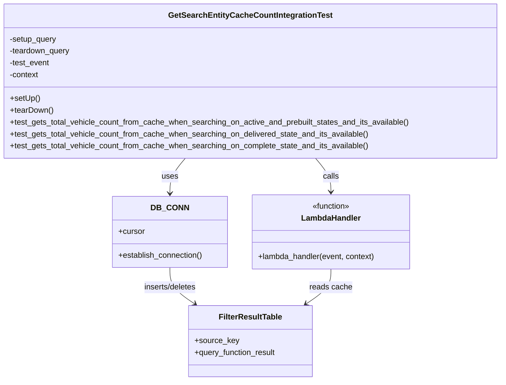

# Diagram: entity_core/entity_service/entity_service_tests/get_search_entity_tests/integration_tests/test_filter_result_count_for_lifecycle_state.py


> Auto-generated by Obscura crawlers

## Diagram 1



### SVG

<svg id="container" width="1013.9140625" xmlns="http://www.w3.org/2000/svg" class="classDiagram" height="770" viewBox="0 0 1013.9140625 770" role="graphics-document document" aria-roledescription="class"><style>#container{font-family:"trebuchet ms",verdana,arial,sans-serif;font-size:16px;fill:#333;}@keyframes edge-animation-frame{from{stroke-dashoffset:0;}}@keyframes dash{to{stroke-dashoffset:0;}}#container .edge-animation-slow{stroke-dasharray:9,5!important;stroke-dashoffset:900;animation:dash 50s linear infinite;stroke-linecap:round;}#container .edge-animation-fast{stroke-dasharray:9,5!important;stroke-dashoffset:900;animation:dash 20s linear infinite;stroke-linecap:round;}#container .error-icon{fill:#552222;}#container .error-text{fill:#552222;stroke:#552222;}#container .edge-thickness-normal{stroke-width:1px;}#container .edge-thickness-thick{stroke-width:3.5px;}#container .edge-pattern-solid{stroke-dasharray:0;}#container .edge-thickness-invisible{stroke-width:0;fill:none;}#container .edge-pattern-dashed{stroke-dasharray:3;}#container .edge-pattern-dotted{stroke-dasharray:2;}#container .marker{fill:#333333;stroke:#333333;}#container .marker.cross{stroke:#333333;}#container svg{font-family:"trebuchet ms",verdana,arial,sans-serif;font-size:16px;}#container p{margin:0;}#container g.classGroup text{fill:#9370DB;stroke:none;font-family:"trebuchet ms",verdana,arial,sans-serif;font-size:10px;}#container g.classGroup text .title{font-weight:bolder;}#container .nodeLabel,#container .edgeLabel{color:#131300;}#container .edgeLabel .label rect{fill:#ECECFF;}#container .label text{fill:#131300;}#container .labelBkg{background:#ECECFF;}#container .edgeLabel .label span{background:#ECECFF;}#container .classTitle{font-weight:bolder;}#container .node rect,#container .node circle,#container .node ellipse,#container .node polygon,#container .node path{fill:#ECECFF;stroke:#9370DB;stroke-width:1px;}#container .divider{stroke:#9370DB;stroke-width:1;}#container g.clickable{cursor:pointer;}#container g.classGroup rect{fill:#ECECFF;stroke:#9370DB;}#container g.classGroup line{stroke:#9370DB;stroke-width:1;}#container .classLabel .box{stroke:none;stroke-width:0;fill:#ECECFF;opacity:0.5;}#container .classLabel .label{fill:#9370DB;font-size:10px;}#container .relation{stroke:#333333;stroke-width:1;fill:none;}#container .dashed-line{stroke-dasharray:3;}#container .dotted-line{stroke-dasharray:1 2;}#container #compositionStart,#container .composition{fill:#333333!important;stroke:#333333!important;stroke-width:1;}#container #compositionEnd,#container .composition{fill:#333333!important;stroke:#333333!important;stroke-width:1;}#container #dependencyStart,#container .dependency{fill:#333333!important;stroke:#333333!important;stroke-width:1;}#container #dependencyStart,#container .dependency{fill:#333333!important;stroke:#333333!important;stroke-width:1;}#container #extensionStart,#container .extension{fill:transparent!important;stroke:#333333!important;stroke-width:1;}#container #extensionEnd,#container .extension{fill:transparent!important;stroke:#333333!important;stroke-width:1;}#container #aggregationStart,#container .aggregation{fill:transparent!important;stroke:#333333!important;stroke-width:1;}#container #aggregationEnd,#container .aggregation{fill:transparent!important;stroke:#333333!important;stroke-width:1;}#container #lollipopStart,#container .lollipop{fill:#ECECFF!important;stroke:#333333!important;stroke-width:1;}#container #lollipopEnd,#container .lollipop{fill:#ECECFF!important;stroke:#333333!important;stroke-width:1;}#container .edgeTerminals{font-size:11px;line-height:initial;}#container .classTitleText{text-anchor:middle;font-size:18px;fill:#333;}#container .label-icon{display:inline-block;height:1em;overflow:visible;vertical-align:-0.125em;}#container .node .label-icon path{fill:currentColor;stroke:revert;stroke-width:revert;}#container :root{--mermaid-font-family:"trebuchet ms",verdana,arial,sans-serif;}</style><g><defs><marker id="container_class-aggregationStart" class="marker aggregation class" refX="18" refY="7" markerWidth="190" markerHeight="240" orient="auto"><path d="M 18,7 L9,13 L1,7 L9,1 Z"></path></marker></defs><defs><marker id="container_class-aggregationEnd" class="marker aggregation class" refX="1" refY="7" markerWidth="20" markerHeight="28" orient="auto"><path d="M 18,7 L9,13 L1,7 L9,1 Z"></path></marker></defs><defs><marker id="container_class-extensionStart" class="marker extension class" refX="18" refY="7" markerWidth="190" markerHeight="240" orient="auto"><path d="M 1,7 L18,13 V 1 Z"></path></marker></defs><defs><marker id="container_class-extensionEnd" class="marker extension class" refX="1" refY="7" markerWidth="20" markerHeight="28" orient="auto"><path d="M 1,1 V 13 L18,7 Z"></path></marker></defs><defs><marker id="container_class-compositionStart" class="marker composition class" refX="18" refY="7" markerWidth="190" markerHeight="240" orient="auto"><path d="M 18,7 L9,13 L1,7 L9,1 Z"></path></marker></defs><defs><marker id="container_class-compositionEnd" class="marker composition class" refX="1" refY="7" markerWidth="20" markerHeight="28" orient="auto"><path d="M 18,7 L9,13 L1,7 L9,1 Z"></path></marker></defs><defs><marker id="container_class-dependencyStart" class="marker dependency class" refX="6" refY="7" markerWidth="190" markerHeight="240" orient="auto"><path d="M 5,7 L9,13 L1,7 L9,1 Z"></path></marker></defs><defs><marker id="container_class-dependencyEnd" class="marker dependency class" refX="13" refY="7" markerWidth="20" markerHeight="28" orient="auto"><path d="M 18,7 L9,13 L14,7 L9,1 Z"></path></marker></defs><defs><marker id="container_class-lollipopStart" class="marker lollipop class" refX="13" refY="7" markerWidth="190" markerHeight="240" orient="auto"><circle stroke="black" fill="transparent" cx="7" cy="7" r="6"></circle></marker></defs><defs><marker id="container_class-lollipopEnd" class="marker lollipop class" refX="1" refY="7" markerWidth="190" markerHeight="240" orient="auto"><circle stroke="black" fill="transparent" cx="7" cy="7" r="6"></circle></marker></defs><g class="root"><g class="clusters"></g><g class="edgePaths"><path d="M374.786,320L369.561,326.167C364.336,332.333,353.887,344.667,348.662,356.5C343.438,368.333,343.438,379.667,343.438,385.333L343.438,391" id="id_GetSearchEntityCacheCountIntegrationTest_DB_CONN_1" class="edge-thickness-normal edge-pattern-solid relation" style=";;;" data-edge="true" data-et="edge" data-id="id_GetSearchEntityCacheCountIntegrationTest_DB_CONN_1" data-points="W3sieCI6Mzc0Ljc4NTgwMzkxODM5Mzc1LCJ5IjozMjB9LHsieCI6MzQzLjQzNzUsInkiOjM1N30seyJ4IjozNDMuNDM3NSwieSI6Mzk3fV0=" marker-end="url(#container_class-dependencyEnd)"></path><path d="M639.128,320L644.353,326.167C649.578,332.333,660.027,344.667,665.252,356C670.477,367.333,670.477,377.667,670.477,382.833L670.477,388" id="id_GetSearchEntityCacheCountIntegrationTest_LambdaHandler_2" class="edge-thickness-normal edge-pattern-solid relation" style=";;;" data-edge="true" data-et="edge" data-id="id_GetSearchEntityCacheCountIntegrationTest_LambdaHandler_2" data-points="W3sieCI6NjM5LjEyODI1ODU4MTYwNjIsInkiOjMyMH0seyJ4Ijo2NzAuNDc2NTYyNSwieSI6MzU3fSx7IngiOjY3MC40NzY1NjI1LCJ5IjozOTR9XQ==" marker-end="url(#container_class-dependencyEnd)"></path><path d="M343.438,541L343.438,547.667C343.438,554.333,343.438,567.667,351.857,579.945C360.276,592.224,377.114,603.448,385.533,609.06L393.952,614.672" id="id_DB_CONN_FilterResultTable_3" class="edge-thickness-normal edge-pattern-solid relation" style=";;;" data-edge="true" data-et="edge" data-id="id_DB_CONN_FilterResultTable_3" data-points="W3sieCI6MzQzLjQzNzUsInkiOjU0MX0seyJ4IjozNDMuNDM3NSwieSI6NTgxfSx7IngiOjM5OC45NDQxMjk4NzM4NTMyLCJ5Ijo2MTh9XQ==" marker-end="url(#container_class-dependencyEnd)"></path><path d="M670.477,544L670.477,550.167C670.477,556.333,670.477,568.667,662.058,580.445C653.639,592.224,636.8,603.448,628.381,609.06L619.962,614.672" id="id_LambdaHandler_FilterResultTable_4" class="edge-thickness-normal edge-pattern-solid relation" style=";;;" data-edge="true" data-et="edge" data-id="id_LambdaHandler_FilterResultTable_4" data-points="W3sieCI6NjcwLjQ3NjU2MjUsInkiOjU0NH0seyJ4Ijo2NzAuNDc2NTYyNSwieSI6NTgxfSx7IngiOjYxNC45Njk5MzI2MjYxNDY4LCJ5Ijo2MTh9XQ==" marker-end="url(#container_class-dependencyEnd)"></path></g><g class="edgeLabels"><g class="edgeLabel" transform="translate(343.4375, 357)"><g class="label" data-id="id_GetSearchEntityCacheCountIntegrationTest_DB_CONN_1" transform="translate(-16.4921875, -12)"><foreignObject width="32.984375" height="24"><div xmlns="http://www.w3.org/1999/xhtml" class="labelBkg" style="display: table-cell; white-space: nowrap; line-height: 1.5; max-width: 200px; text-align: center;"><span class="edgeLabel"><p>uses</p></span></div></foreignObject></g></g><g class="edgeLabel" transform="translate(670.4765625, 357)"><g class="label" data-id="id_GetSearchEntityCacheCountIntegrationTest_LambdaHandler_2" transform="translate(-16.4453125, -12)"><foreignObject width="32.890625" height="24"><div xmlns="http://www.w3.org/1999/xhtml" class="labelBkg" style="display: table-cell; white-space: nowrap; line-height: 1.5; max-width: 200px; text-align: center;"><span class="edgeLabel"><p>calls</p></span></div></foreignObject></g></g><g class="edgeLabel" transform="translate(343.4375, 581)"><g class="label" data-id="id_DB_CONN_FilterResultTable_3" transform="translate(-55.1875, -12)"><foreignObject width="110.375" height="24"><div xmlns="http://www.w3.org/1999/xhtml" class="labelBkg" style="display: table-cell; white-space: nowrap; line-height: 1.5; max-width: 200px; text-align: center;"><span class="edgeLabel"><p>inserts/deletes</p></span></div></foreignObject></g></g><g class="edgeLabel" transform="translate(670.4765625, 581)"><g class="label" data-id="id_LambdaHandler_FilterResultTable_4" transform="translate(-43.09375, -12)"><foreignObject width="86.1875" height="24"><div xmlns="http://www.w3.org/1999/xhtml" class="labelBkg" style="display: table-cell; white-space: nowrap; line-height: 1.5; max-width: 200px; text-align: center;"><span class="edgeLabel"><p>reads cache</p></span></div></foreignObject></g></g></g><g class="nodes"><g class="node default" id="classId-GetSearchEntityCacheCountIntegrationTest-0" transform="translate(506.95703125, 164)"><g class="basic label-container"><path d="M-498.95703125 -156 L498.95703125 -156 L498.95703125 156 L-498.95703125 156" stroke="none" stroke-width="0" fill="#ECECFF" style=""></path><path d="M-498.95703125 -156 C-254.69612087037686 -156, -10.435210490753718 -156, 498.95703125 -156 M-498.95703125 -156 C-228.37335451304222 -156, 42.21032222391557 -156, 498.95703125 -156 M498.95703125 -156 C498.95703125 -80.6200424195973, 498.95703125 -5.240084839194594, 498.95703125 156 M498.95703125 -156 C498.95703125 -75.0202399050072, 498.95703125 5.9595201899855965, 498.95703125 156 M498.95703125 156 C225.35716203174388 156, -48.242707186512234 156, -498.95703125 156 M498.95703125 156 C211.1571851621287 156, -76.64266092574258 156, -498.95703125 156 M-498.95703125 156 C-498.95703125 80.6933300874228, -498.95703125 5.386660174845588, -498.95703125 -156 M-498.95703125 156 C-498.95703125 36.97478419519503, -498.95703125 -82.05043160960994, -498.95703125 -156" stroke="#9370DB" stroke-width="1.3" fill="none" stroke-dasharray="0 0" style=""></path></g><g class="annotation-group text" transform="translate(0, -132)"></g><g class="label-group text" transform="translate(-157.7421875, -132)"><g class="label" style="font-weight: bolder" transform="translate(0,-12)"><foreignObject width="315.484375" height="24"><div xmlns="http://www.w3.org/1999/xhtml" style="display: table-cell; white-space: nowrap; line-height: 1.5; max-width: 360px; text-align: center;"><span class="nodeLabel markdown-node-label" style=""><p>GetSearchEntityCacheCountIntegrationTest</p></span></div></foreignObject></g></g><g class="members-group text" transform="translate(-486.95703125, -84)"><g class="label" style="" transform="translate(0,-12)"><foreignObject width="96.5625" height="24"><div xmlns="http://www.w3.org/1999/xhtml" style="display: table-cell; white-space: nowrap; line-height: 1.5; max-width: 154px; text-align: center;"><span class="nodeLabel markdown-node-label" style=""><p>-setup_query</p></span></div></foreignObject></g><g class="label" style="" transform="translate(0,12)"><foreignObject width="124.28125" height="24"><div xmlns="http://www.w3.org/1999/xhtml" style="display: table-cell; white-space: nowrap; line-height: 1.5; max-width: 182px; text-align: center;"><span class="nodeLabel markdown-node-label" style=""><p>-teardown_query</p></span></div></foreignObject></g><g class="label" style="" transform="translate(0,36)"><foreignObject width="82.21875" height="24"><div xmlns="http://www.w3.org/1999/xhtml" style="display: table-cell; white-space: nowrap; line-height: 1.5; max-width: 140px; text-align: center;"><span class="nodeLabel markdown-node-label" style=""><p>-test_event</p></span></div></foreignObject></g><g class="label" style="" transform="translate(0,60)"><foreignObject width="60.15625" height="24"><div xmlns="http://www.w3.org/1999/xhtml" style="display: table-cell; white-space: nowrap; line-height: 1.5; max-width: 118px; text-align: center;"><span class="nodeLabel markdown-node-label" style=""><p>-context</p></span></div></foreignObject></g></g><g class="methods-group text" transform="translate(-486.95703125, 36)"><g class="label" style="" transform="translate(0,-12)"><foreignObject width="60.421875" height="24"><div xmlns="http://www.w3.org/1999/xhtml" style="display: table-cell; white-space: nowrap; line-height: 1.5; max-width: 118px; text-align: center;"><span class="nodeLabel markdown-node-label" style=""><p>+setUp()</p></span></div></foreignObject></g><g class="label" style="" transform="translate(0,12)"><foreignObject width="87.75" height="24"><div xmlns="http://www.w3.org/1999/xhtml" style="display: table-cell; white-space: nowrap; line-height: 1.5; max-width: 145px; text-align: center;"><span class="nodeLabel markdown-node-label" style=""><p>+tearDown()</p></span></div></foreignObject></g><g class="label" style="" transform="translate(0,36)"><foreignObject width="816.171875" height="24"><div xmlns="http://www.w3.org/1999/xhtml" style="display: table-cell; white-space: nowrap; line-height: 1.5; max-width: 874px; text-align: center;"><span class="nodeLabel markdown-node-label" style=""><p>+test_gets_total_vehicle_count_from_cache_when_searching_on_active_and_prebuilt_states_and_its_available()</p></span></div></foreignObject></g><g class="label" style="" transform="translate(0,60)"><foreignObject width="732.171875" height="24"><div xmlns="http://www.w3.org/1999/xhtml" style="display: table-cell; white-space: nowrap; line-height: 1.5; max-width: 790px; text-align: center;"><span class="nodeLabel markdown-node-label" style=""><p>+test_gets_total_vehicle_count_from_cache_when_searching_on_delivered_state_and_its_available()</p></span></div></foreignObject></g><g class="label" style="" transform="translate(0,84)"><foreignObject width="731.328125" height="24"><div xmlns="http://www.w3.org/1999/xhtml" style="display: table-cell; white-space: nowrap; line-height: 1.5; max-width: 789px; text-align: center;"><span class="nodeLabel markdown-node-label" style=""><p>+test_gets_total_vehicle_count_from_cache_when_searching_on_complete_state_and_its_available()</p></span></div></foreignObject></g></g><g class="divider" style=""><path d="M-498.95703125 -108 C-258.7682973055762 -108, -18.579563361152395 -108, 498.95703125 -108 M-498.95703125 -108 C-242.4682744373073 -108, 14.020482375385427 -108, 498.95703125 -108" stroke="#9370DB" stroke-width="1.3" fill="none" stroke-dasharray="0 0" style=""></path></g><g class="divider" style=""><path d="M-498.95703125 12 C-242.8685353989456 12, 13.219960452108808 12, 498.95703125 12 M-498.95703125 12 C-279.81429246071303 12, -60.67155367142607 12, 498.95703125 12" stroke="#9370DB" stroke-width="1.3" fill="none" stroke-dasharray="0 0" style=""></path></g></g><g class="node default" id="classId-DB_CONN-1" transform="translate(343.4375, 469)"><g class="basic label-container"><path d="M-115.8359375 -72 L115.8359375 -72 L115.8359375 72 L-115.8359375 72" stroke="none" stroke-width="0" fill="#ECECFF" style=""></path><path d="M-115.8359375 -72 C-40.446820040386626 -72, 34.94229741922675 -72, 115.8359375 -72 M-115.8359375 -72 C-25.71194042327602 -72, 64.41205665344796 -72, 115.8359375 -72 M115.8359375 -72 C115.8359375 -33.71902586680255, 115.8359375 4.561948266394893, 115.8359375 72 M115.8359375 -72 C115.8359375 -31.467490241216105, 115.8359375 9.06501951756779, 115.8359375 72 M115.8359375 72 C43.215519747355 72, -29.404898005289994 72, -115.8359375 72 M115.8359375 72 C41.36909846533544 72, -33.09774056932912 72, -115.8359375 72 M-115.8359375 72 C-115.8359375 35.95722285107721, -115.8359375 -0.08555429784557589, -115.8359375 -72 M-115.8359375 72 C-115.8359375 15.765329427226156, -115.8359375 -40.46934114554769, -115.8359375 -72" stroke="#9370DB" stroke-width="1.3" fill="none" stroke-dasharray="0 0" style=""></path></g><g class="annotation-group text" transform="translate(0, -48)"></g><g class="label-group text" transform="translate(-34.40625, -48)"><g class="label" style="font-weight: bolder" transform="translate(0,-12)"><foreignObject width="68.8125" height="24"><div xmlns="http://www.w3.org/1999/xhtml" style="display: table-cell; white-space: nowrap; line-height: 1.5; max-width: 119px; text-align: center;"><span class="nodeLabel markdown-node-label" style=""><p>DB_CONN</p></span></div></foreignObject></g></g><g class="members-group text" transform="translate(-103.8359375, 0)"><g class="label" style="" transform="translate(0,-12)"><foreignObject width="53.71875" height="24"><div xmlns="http://www.w3.org/1999/xhtml" style="display: table-cell; white-space: nowrap; line-height: 1.5; max-width: 112px; text-align: center;"><span class="nodeLabel markdown-node-label" style=""><p>+cursor</p></span></div></foreignObject></g></g><g class="methods-group text" transform="translate(-103.8359375, 48)"><g class="label" style="" transform="translate(0,-12)"><foreignObject width="173.265625" height="24"><div xmlns="http://www.w3.org/1999/xhtml" style="display: table-cell; white-space: nowrap; line-height: 1.5; max-width: 231px; text-align: center;"><span class="nodeLabel markdown-node-label" style=""><p>+establish_connection()</p></span></div></foreignObject></g></g><g class="divider" style=""><path d="M-115.8359375 -24 C-24.769977478334283 -24, 66.29598254333143 -24, 115.8359375 -24 M-115.8359375 -24 C-59.642752662532956 -24, -3.4495678250659125 -24, 115.8359375 -24" stroke="#9370DB" stroke-width="1.3" fill="none" stroke-dasharray="0 0" style=""></path></g><g class="divider" style=""><path d="M-115.8359375 24 C-62.2668709328899 24, -8.697804365779803 24, 115.8359375 24 M-115.8359375 24 C-41.885985728316385 24, 32.06396604336723 24, 115.8359375 24" stroke="#9370DB" stroke-width="1.3" fill="none" stroke-dasharray="0 0" style=""></path></g></g><g class="node default" id="classId-LambdaHandler-2" transform="translate(670.4765625, 469)"><g class="basic label-container"><path d="M-161.203125 -75 L161.203125 -75 L161.203125 75 L-161.203125 75" stroke="none" stroke-width="0" fill="#ECECFF" style=""></path><path d="M-161.203125 -75 C-37.146158200789856 -75, 86.91080859842029 -75, 161.203125 -75 M-161.203125 -75 C-86.44943484957929 -75, -11.695744699158581 -75, 161.203125 -75 M161.203125 -75 C161.203125 -34.14579517318333, 161.203125 6.708409653633339, 161.203125 75 M161.203125 -75 C161.203125 -20.472551124329996, 161.203125 34.05489775134001, 161.203125 75 M161.203125 75 C68.96443571737586 75, -23.274253565248273 75, -161.203125 75 M161.203125 75 C40.91417177147993 75, -79.37478145704014 75, -161.203125 75 M-161.203125 75 C-161.203125 24.42524269376969, -161.203125 -26.14951461246062, -161.203125 -75 M-161.203125 75 C-161.203125 21.76746738805634, -161.203125 -31.465065223887322, -161.203125 -75" stroke="#9370DB" stroke-width="1.3" fill="none" stroke-dasharray="0 0" style=""></path></g><g class="annotation-group text" transform="translate(-39.484375, -51)"><g class="label" style="" transform="translate(0,-12)"><foreignObject width="78.96875" height="24"><div xmlns="http://www.w3.org/1999/xhtml" style="display: table-cell; white-space: nowrap; line-height: 1.5; max-width: 129px; text-align: center;"><span class="nodeLabel markdown-node-label" style=""><p>«function»</p></span></div></foreignObject></g></g><g class="label-group text" transform="translate(-58.21875, -27)"><g class="label" style="font-weight: bolder" transform="translate(0,-12)"><foreignObject width="116.4375" height="24"><div xmlns="http://www.w3.org/1999/xhtml" style="display: table-cell; white-space: nowrap; line-height: 1.5; max-width: 167px; text-align: center;"><span class="nodeLabel markdown-node-label" style=""><p>LambdaHandler</p></span></div></foreignObject></g></g><g class="members-group text" transform="translate(-149.203125, 21)"></g><g class="methods-group text" transform="translate(-149.203125, 51)"><g class="label" style="" transform="translate(0,-12)"><foreignObject width="240.1875" height="24"><div xmlns="http://www.w3.org/1999/xhtml" style="display: table-cell; white-space: nowrap; line-height: 1.5; max-width: 298px; text-align: center;"><span class="nodeLabel markdown-node-label" style=""><p>+lambda_handler(event, context)</p></span></div></foreignObject></g></g><g class="divider" style=""><path d="M-161.203125 -3 C-43.188084494704654 -3, 74.82695601059069 -3, 161.203125 -3 M-161.203125 -3 C-79.90833640490145 -3, 1.3864521901971045 -3, 161.203125 -3" stroke="#9370DB" stroke-width="1.3" fill="none" stroke-dasharray="0 0" style=""></path></g><g class="divider" style=""><path d="M-161.203125 21 C-57.9799777293411 21, 45.2431695413178 21, 161.203125 21 M-161.203125 21 C-69.77271823790268 21, 21.65768852419464 21, 161.203125 21" stroke="#9370DB" stroke-width="1.3" fill="none" stroke-dasharray="0 0" style=""></path></g></g><g class="node default" id="classId-FilterResultTable-3" transform="translate(506.95703125, 690)"><g class="basic label-container"><path d="M-126.83984375 -72 L126.83984375 -72 L126.83984375 72 L-126.83984375 72" stroke="none" stroke-width="0" fill="#ECECFF" style=""></path><path d="M-126.83984375 -72 C-60.76743613412711 -72, 5.304971481745781 -72, 126.83984375 -72 M-126.83984375 -72 C-46.56835477360528 -72, 33.70313420278944 -72, 126.83984375 -72 M126.83984375 -72 C126.83984375 -26.250243412671836, 126.83984375 19.49951317465633, 126.83984375 72 M126.83984375 -72 C126.83984375 -28.632407813137775, 126.83984375 14.73518437372445, 126.83984375 72 M126.83984375 72 C46.652590044908806 72, -33.53466366018239 72, -126.83984375 72 M126.83984375 72 C66.11223691507047 72, 5.384630080140937 72, -126.83984375 72 M-126.83984375 72 C-126.83984375 36.24829433165278, -126.83984375 0.49658866330555895, -126.83984375 -72 M-126.83984375 72 C-126.83984375 32.2097307922765, -126.83984375 -7.580538415446995, -126.83984375 -72" stroke="#9370DB" stroke-width="1.3" fill="none" stroke-dasharray="0 0" style=""></path></g><g class="annotation-group text" transform="translate(0, -48)"></g><g class="label-group text" transform="translate(-61.8359375, -48)"><g class="label" style="font-weight: bolder" transform="translate(0,-12)"><foreignObject width="123.671875" height="24"><div xmlns="http://www.w3.org/1999/xhtml" style="display: table-cell; white-space: nowrap; line-height: 1.5; max-width: 171px; text-align: center;"><span class="nodeLabel markdown-node-label" style=""><p>FilterResultTable</p></span></div></foreignObject></g></g><g class="members-group text" transform="translate(-114.83984375, 0)"><g class="label" style="" transform="translate(0,-12)"><foreignObject width="88.4375" height="24"><div xmlns="http://www.w3.org/1999/xhtml" style="display: table-cell; white-space: nowrap; line-height: 1.5; max-width: 146px; text-align: center;"><span class="nodeLabel markdown-node-label" style=""><p>+source_key</p></span></div></foreignObject></g><g class="label" style="" transform="translate(0,12)"><foreignObject width="167.84375" height="24"><div xmlns="http://www.w3.org/1999/xhtml" style="display: table-cell; white-space: nowrap; line-height: 1.5; max-width: 225px; text-align: center;"><span class="nodeLabel markdown-node-label" style=""><p>+query_function_result</p></span></div></foreignObject></g></g><g class="methods-group text" transform="translate(-114.83984375, 72)"></g><g class="divider" style=""><path d="M-126.83984375 -24 C-57.55531036671506 -24, 11.729223016569875 -24, 126.83984375 -24 M-126.83984375 -24 C-73.70036750797743 -24, -20.56089126595488 -24, 126.83984375 -24" stroke="#9370DB" stroke-width="1.3" fill="none" stroke-dasharray="0 0" style=""></path></g><g class="divider" style=""><path d="M-126.83984375 48 C-30.42935458234811 48, 65.98113458530378 48, 126.83984375 48 M-126.83984375 48 C-42.74876604262262 48, 41.34231166475476 48, 126.83984375 48" stroke="#9370DB" stroke-width="1.3" fill="none" stroke-dasharray="0 0" style=""></path></g></g></g></g></g></svg>

## Diagram 2

```mermaid
sequenceDiagram
participant TestCase as TestCase:GetSearchEntityCacheCountIntegrationTest
participant DB as DB_CONN
participant Cursor as Cursor
participant Lambda as lambda_handler
TestCase->>DB: establish_connection(); execute(setup_query)
DB-->>TestCase: setup complete
TestCase->>Lambda: lambda_handler(test_event, context)
Lambda->>DB: query filter_result by source_key (e.g., FIN_VEHICLE_*_COUNT)
DB-->>Lambda: return cached JSON (meta.totalCount)
Lambda-->>TestCase: return response with body
TestCase->>TestCase: parse body -> meta.totalCount; assertEqual(expected, actual)
TestCase->>DB: execute(teardown_query)
DB-->>TestCase: teardown complete
```

> SVG rendering failed for this diagram.

## Diagram 3

```mermaid
flowchart LR
    Setup[Insert cache rows into filter_result (ACTIVE, solution_id=FV_TEST)]
    Call[Call lambda_handler(event, context)]
    Query[Check cache: SELECT query_function_result FROM filter_result WHERE source_key=...]
    CacheHit[Cache hit -> extract meta.totalCount]
    CacheMiss[Cache miss -> perform DB search]
    Response[Return HTTP body with meta.totalCount]
    Assert[Test asserts expected_count == returned_count]
    Setup --> Call --> Query
    Query -->|hit| CacheHit --> Response --> Assert
    Query -->|miss| CacheMiss --> Response --> Assert
```

> SVG rendering failed for this diagram.
