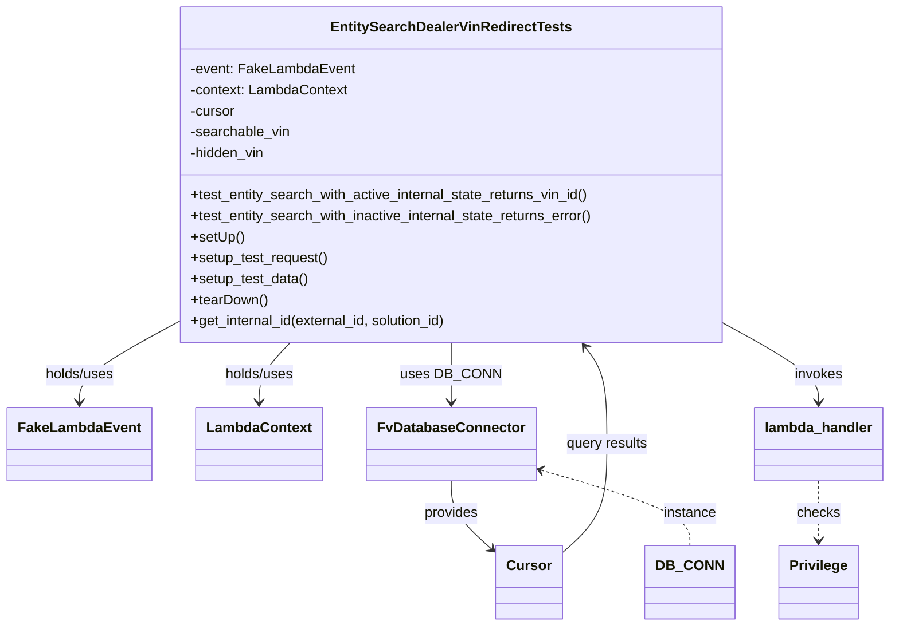
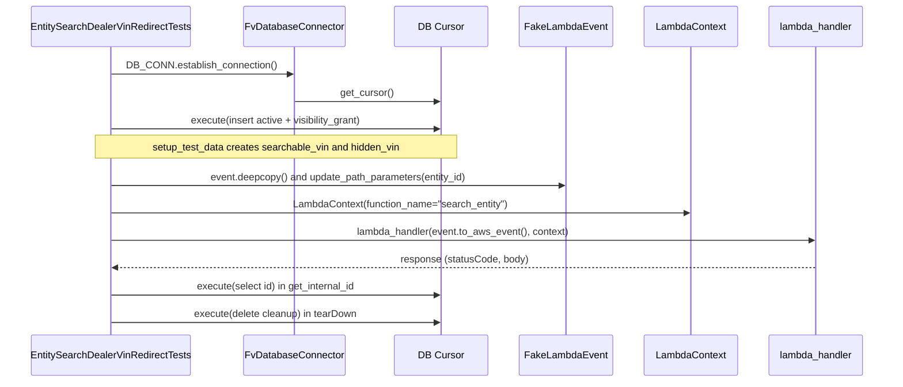

# Diagram: entity_core/entity_service/entity_service_tests/get_search_entity_tests/integration_tests/test_get_search_entity_dealer_vin_redirect.py

> Auto-generated by Obscura crawlers

## Diagram 1

### SVG

<svg id="container" width="979.1484375" xmlns="http://www.w3.org/2000/svg" class="classDiagram" height="716" viewBox="0 0 979.1484375 716" role="graphics-document document" aria-roledescription="class"><g><defs><marker id="container_class-aggregationStart" class="marker aggregation class" refX="18" refY="7" markerWidth="190" markerHeight="240" orient="auto"><path d="M 18,7 L9,13 L1,7 L9,1 Z"></path></marker></defs><defs><marker id="container_class-aggregationEnd" class="marker aggregation class" refX="1" refY="7" markerWidth="20" markerHeight="28" orient="auto"><path d="M 18,7 L9,13 L1,7 L9,1 Z"></path></marker></defs><defs><marker id="container_class-extensionStart" class="marker extension class" refX="18" refY="7" markerWidth="190" markerHeight="240" orient="auto"><path d="M 1,7 L18,13 V 1 Z"></path></marker></defs><defs><marker id="container_class-extensionEnd" class="marker extension class" refX="1" refY="7" markerWidth="20" markerHeight="28" orient="auto"><path d="M 1,1 V 13 L18,7 Z"></path></marker></defs><defs><marker id="container_class-compositionStart" class="marker composition class" refX="18" refY="7" markerWidth="190" markerHeight="240" orient="auto"><path d="M 18,7 L9,13 L1,7 L9,1 Z"></path></marker></defs><defs><marker id="container_class-compositionEnd" class="marker composition class" refX="1" refY="7" markerWidth="20" markerHeight="28" orient="auto"><path d="M 18,7 L9,13 L1,7 L9,1 Z"></path></marker></defs><defs><marker id="container_class-dependencyStart" class="marker dependency class" refX="6" refY="7" markerWidth="190" markerHeight="240" orient="auto"><path d="M 5,7 L9,13 L1,7 L9,1 Z"></path></marker></defs><defs><marker id="container_class-dependencyEnd" class="marker dependency class" refX="13" refY="7" markerWidth="20" markerHeight="28" orient="auto"><path d="M 18,7 L9,13 L14,7 L9,1 Z"></path></marker></defs><defs><marker id="container_class-lollipopStart" class="marker lollipop class" refX="13" refY="7" markerWidth="190" markerHeight="240" orient="auto"><circle stroke="black" fill="transparent" cx="7" cy="7" r="6"></circle></marker></defs><defs><marker id="container_class-lollipopEnd" class="marker lollipop class" refX="1" refY="7" markerWidth="190" markerHeight="240" orient="auto"><circle stroke="black" fill="transparent" cx="7" cy="7" r="6"></circle></marker></defs><g class="root"><g class="clusters"></g><g class="edgePaths"><path d="M181.563,375.258L165.613,384.215C149.664,393.172,117.766,411.086,101.816,425.21C85.867,439.333,85.867,449.667,85.867,454.833L85.867,460" id="id_EntitySearchDealerVinRedirectTests_FakeLambdaEvent_1" class="edge-thickness-normal edge-pattern-solid relation" style=";;;" data-edge="true" data-et="edge" data-id="id_EntitySearchDealerVinRedirectTests_FakeLambdaEvent_1" data-points="W3sieCI6MTgxLjU2MjUsInkiOjM3NS4yNTc3ODgyNTE1MjMxNX0seyJ4Ijo4NS44NjcxODc1LCJ5Ijo0Mjl9LHsieCI6ODUuODY3MTg3NSwieSI6NDY2fV0=" marker-end="url(#container_class-dependencyEnd)"></path><path d="M317.059,392L311.387,398.167C305.716,404.333,294.374,416.667,288.702,428C283.031,439.333,283.031,449.667,283.031,454.833L283.031,460" id="id_EntitySearchDealerVinRedirectTests_LambdaContext_2" class="edge-thickness-normal edge-pattern-solid relation" style=";;;" data-edge="true" data-et="edge" data-id="id_EntitySearchDealerVinRedirectTests_LambdaContext_2" data-points="W3sieCI6MzE3LjA1ODU3NjY5MjEzOTc1LCJ5IjozOTJ9LHsieCI6MjgzLjAzMTI1LCJ5Ijo0Mjl9LHsieCI6MjgzLjAzMTI1LCJ5Ijo0NjZ9XQ==" marker-end="url(#container_class-dependencyEnd)"></path><path d="M493.633,392L493.633,398.167C493.633,404.333,493.633,416.667,493.633,428C493.633,439.333,493.633,449.667,493.633,454.833L493.633,460" id="id_EntitySearchDealerVinRedirectTests_FvDatabaseConnector_3" class="edge-thickness-normal edge-pattern-solid relation" style=";;;" data-edge="true" data-et="edge" data-id="id_EntitySearchDealerVinRedirectTests_FvDatabaseConnector_3" data-points="W3sieCI6NDkzLjYzMjgxMjUsInkiOjM5Mn0seyJ4Ijo0OTMuNjMyODEyNSwieSI6NDI5fSx7IngiOjQ5My42MzI4MTI1LCJ5Ijo0NjZ9XQ==" marker-end="url(#container_class-dependencyEnd)"></path><path d="M805.703,376.22L821.281,385.017C836.859,393.813,868.016,411.407,883.594,425.37C899.172,439.333,899.172,449.667,899.172,454.833L899.172,460" id="id_EntitySearchDealerVinRedirectTests_lambda_handler_4" class="edge-thickness-normal edge-pattern-solid relation" style=";;;" data-edge="true" data-et="edge" data-id="id_EntitySearchDealerVinRedirectTests_lambda_handler_4" data-points="W3sieCI6ODA1LjcwMzEyNSwieSI6Mzc2LjIyMDAxOTY0OTc3MTc2fSx7IngiOjg5OS4xNzE4NzUsInkiOjQyOX0seyJ4Ijo4OTkuMTcxODc1LCJ5Ijo0NjZ9XQ==" marker-end="url(#container_class-dependencyEnd)"></path><path d="M493.633,550L493.633,556.167C493.633,562.333,493.633,574.667,501.393,587.888C509.154,601.109,524.675,615.217,532.436,622.272L540.197,629.326" id="id_FvDatabaseConnector_Cursor_5" class="edge-thickness-normal edge-pattern-solid relation" style=";;;" data-edge="true" data-et="edge" data-id="id_FvDatabaseConnector_Cursor_5" data-points="W3sieCI6NDkzLjYzMjgxMjUsInkiOjU1MH0seyJ4Ijo0OTMuNjMyODEyNSwieSI6NTg3fSx7IngiOjU0NC42MzY3MTg3NSwieSI6NjMzLjM2MTc2OTA2ODI3Mjd9XQ==" marker-end="url(#container_class-dependencyEnd)"></path><path d="M899.172,550L899.172,556.167C899.172,562.333,899.172,574.667,899.172,586C899.172,597.333,899.172,607.667,899.172,612.833L899.172,618" id="id_lambda_handler_Privilege_6" class="edge-thickness-normal edge-pattern-dashed relation" style=";;;" data-edge="true" data-et="edge" data-id="id_lambda_handler_Privilege_6" data-points="W3sieCI6ODk5LjE3MTg3NSwieSI6NTUwfSx7IngiOjg5OS4xNzE4NzUsInkiOjU4N30seyJ4Ijo4OTkuMTcxODc1LCJ5Ijo2MjR9XQ==" marker-end="url(#container_class-dependencyEnd)"></path><path d="M616.449,633.362L624.95,625.635C633.451,617.908,650.452,602.454,658.952,581.56C667.453,560.667,667.453,534.333,667.453,508C667.453,481.667,667.453,455.333,663.377,436.797C659.301,418.26,651.149,407.519,647.072,402.149L642.996,396.779" id="id_Cursor_EntitySearchDealerVinRedirectTests_7" class="edge-thickness-normal edge-pattern-solid relation" style=";;;" data-edge="true" data-et="edge" data-id="id_Cursor_EntitySearchDealerVinRedirectTests_7" data-points="W3sieCI6NjE2LjQ0OTIxODc1LCJ5Ijo2MzMuMzYxNzY5MDY4MjcyN30seyJ4Ijo2NjcuNDUzMTI1LCJ5Ijo1ODd9LHsieCI6NjY3LjQ1MzEyNSwieSI6NTA4fSx7IngiOjY2Ny40NTMxMjUsInkiOjQyOX0seyJ4Ijo2MzkuMzY4NjIwMzYwMjYyLCJ5IjozOTJ9XQ==" marker-end="url(#container_class-dependencyEnd)"></path><path d="M590.688,536.904L618.723,545.254C646.758,553.603,702.828,570.301,730.863,584.817C758.898,599.333,758.898,611.667,758.898,617.833L758.898,624" id="id_FvDatabaseConnector_DB_CONN_8" class="edge-thickness-normal edge-pattern-dashed relation" style=";;;" data-edge="true" data-et="edge" data-id="id_FvDatabaseConnector_DB_CONN_8" data-points="W3sieCI6NTg0LjkzNzUsInkiOjUzNS4xOTE4NzcyNDU2ODUzfSx7IngiOjc1OC44OTg0Mzc1LCJ5Ijo1ODd9LHsieCI6NzU4Ljg5ODQzNzUsInkiOjYyNH1d" marker-start="url(#container_class-dependencyStart)"></path></g><g class="edgeLabels"><g class="edgeLabel" transform="translate(85.8671875, 429)"><g class="label" data-id="id_EntitySearchDealerVinRedirectTests_FakeLambdaEvent_1" transform="translate(-40.59375, -12)"><foreignObject width="81.1875" height="24">

holds/uses

</foreignObject></g></g><g class="edgeLabel" transform="translate(283.03125, 429)"><g class="label" data-id="id_EntitySearchDealerVinRedirectTests_LambdaContext_2" transform="translate(-40.59375, -12)"><foreignObject width="81.1875" height="24">

holds/uses

</foreignObject></g></g><g class="edgeLabel" transform="translate(493.6328125, 429)"><g class="label" data-id="id_EntitySearchDealerVinRedirectTests_FvDatabaseConnector_3" transform="translate(-53.09375, -12)"><foreignObject width="106.1875" height="24">

uses DB_CONN

</foreignObject></g></g><g class="edgeLabel" transform="translate(899.171875, 429)"><g class="label" data-id="id_EntitySearchDealerVinRedirectTests_lambda_handler_4" transform="translate(-27.5859375, -12)"><foreignObject width="55.171875" height="24">

invokes

</foreignObject></g></g><g class="edgeLabel" transform="translate(493.6328125, 587)"><g class="label" data-id="id_FvDatabaseConnector_Cursor_5" transform="translate(-31.3125, -12)"><foreignObject width="62.625" height="24">

provides

</foreignObject></g></g><g class="edgeLabel" transform="translate(899.171875, 587)"><g class="label" data-id="id_lambda_handler_Privilege_6" transform="translate(-24.4921875, -12)"><foreignObject width="48.984375" height="24">

checks

</foreignObject></g></g><g class="edgeLabel" transform="translate(667.453125, 508)"><g class="label" data-id="id_Cursor_EntitySearchDealerVinRedirectTests_7" transform="translate(-47.515625, -12)"><foreignObject width="95.03125" height="24">

query results

</foreignObject></g></g><g class="edgeLabel" transform="translate(758.8984375, 587)"><g class="label" data-id="id_FvDatabaseConnector_DB_CONN_8" transform="translate(-30.578125, -12)"><foreignObject width="61.15625" height="24">

instance

</foreignObject></g></g></g><g class="nodes"><g class="node default" id="classId-EntitySearchDealerVinRedirectTests-0" transform="translate(493.6328125, 200)"><g class="basic label-container"><path d="M-312.0703125 -192 L312.0703125 -192 L312.0703125 192 L-312.0703125 192" stroke="none" stroke-width="0" fill="#ECECFF" style=""></path><path d="M-312.0703125 -192 C-124.39267828123985 -192, 63.284955937520294 -192, 312.0703125 -192 M-312.0703125 -192 C-171.66054144215184 -192, -31.250770384303678 -192, 312.0703125 -192 M312.0703125 -192 C312.0703125 -96.73585281327094, 312.0703125 -1.4717056265418762, 312.0703125 192 M312.0703125 -192 C312.0703125 -83.57781039113875, 312.0703125 24.84437921772249, 312.0703125 192 M312.0703125 192 C77.62655279656218 192, -156.81720690687564 192, -312.0703125 192 M312.0703125 192 C77.08674719227594 192, -157.89681811544813 192, -312.0703125 192 M-312.0703125 192 C-312.0703125 66.19671260822138, -312.0703125 -59.60657478355725, -312.0703125 -192 M-312.0703125 192 C-312.0703125 38.79417416429675, -312.0703125 -114.4116516714065, -312.0703125 -192" stroke="#9370DB" stroke-width="1.3" fill="none" stroke-dasharray="0 0" style=""></path></g><g class="annotation-group text" transform="translate(0, -168)"></g><g class="label-group text" transform="translate(-130.9375, -168)"><g class="label" style="font-weight: bolder" transform="translate(0,-12)"><foreignObject width="261.875" height="24">

EntitySearchDealerVinRedirectTests

</foreignObject></g></g><g class="members-group text" transform="translate(-300.0703125, -120)"><g class="label" style="" transform="translate(0,-12)"><foreignObject width="185.21875" height="24">

-event: FakeLambdaEvent

</foreignObject></g><g class="label" style="" transform="translate(0,12)"><foreignObject width="181.296875" height="24">

-context: LambdaContext

</foreignObject></g><g class="label" style="" transform="translate(0,36)"><foreignObject width="52.1875" height="24">

-cursor

</foreignObject></g><g class="label" style="" transform="translate(0,60)"><foreignObject width="114.734375" height="24">

-searchable_vin

</foreignObject></g><g class="label" style="" transform="translate(0,84)"><foreignObject width="87.171875" height="24">

-hidden_vin

</foreignObject></g></g><g class="methods-group text" transform="translate(-300.0703125, 24)"><g class="label" style="" transform="translate(0,-12)"><foreignObject width="462.890625" height="24">

+test_entity_search_with_active_internal_state_returns_vin_id()

</foreignObject></g><g class="label" style="" transform="translate(0,12)"><foreignObject width="469.203125" height="24">

+test_entity_search_with_inactive_internal_state_returns_error()

</foreignObject></g><g class="label" style="" transform="translate(0,36)"><foreignObject width="60.421875" height="24">

+setUp()

</foreignObject></g><g class="label" style="" transform="translate(0,60)"><foreignObject width="157.90625" height="24">

+setup_test_request()

</foreignObject></g><g class="label" style="" transform="translate(0,84)"><foreignObject width="134.96875" height="24">

+setup_test_data()

</foreignObject></g><g class="label" style="" transform="translate(0,108)"><foreignObject width="87.75" height="24">

+tearDown()

</foreignObject></g><g class="label" style="" transform="translate(0,132)"><foreignObject width="300.640625" height="24">

+get_internal_id(external_id, solution_id)

</foreignObject></g></g><g class="divider" style=""><path d="M-312.0703125 -144 C-94.09575864250135 -144, 123.8787952149973 -144, 312.0703125 -144 M-312.0703125 -144 C-76.49681644841911 -144, 159.07667960316178 -144, 312.0703125 -144" stroke="#9370DB" stroke-width="1.3" fill="none" stroke-dasharray="0 0" style=""></path></g><g class="divider" style=""><path d="M-312.0703125 0 C-151.26339837959404 0, 9.543515740811927 0, 312.0703125 0 M-312.0703125 0 C-110.28446301421349 0, 91.50138647157303 0, 312.0703125 0" stroke="#9370DB" stroke-width="1.3" fill="none" stroke-dasharray="0 0" style=""></path></g></g><g class="node default" id="classId-FakeLambdaEvent-1" transform="translate(85.8671875, 508)"><g class="basic label-container"><path d="M-77.8671875 -42 L77.8671875 -42 L77.8671875 42 L-77.8671875 42" stroke="none" stroke-width="0" fill="#ECECFF" style=""></path><path d="M-77.8671875 -42 C-41.086394968843265 -42, -4.305602437686531 -42, 77.8671875 -42 M-77.8671875 -42 C-43.48139657725748 -42, -9.095605654514955 -42, 77.8671875 -42 M77.8671875 -42 C77.8671875 -13.696987171847283, 77.8671875 14.606025656305434, 77.8671875 42 M77.8671875 -42 C77.8671875 -13.814548164866281, 77.8671875 14.370903670267438, 77.8671875 42 M77.8671875 42 C18.553705281765517 42, -40.75977693646897 42, -77.8671875 42 M77.8671875 42 C18.51153750484913 42, -40.84411249030174 42, -77.8671875 42 M-77.8671875 42 C-77.8671875 20.103494735446098, -77.8671875 -1.7930105291078036, -77.8671875 -42 M-77.8671875 42 C-77.8671875 23.195707877191296, -77.8671875 4.391415754382592, -77.8671875 -42" stroke="#9370DB" stroke-width="1.3" fill="none" stroke-dasharray="0 0" style=""></path></g><g class="annotation-group text" transform="translate(0, -18)"></g><g class="label-group text" transform="translate(-65.8671875, -18)"><g class="label" style="font-weight: bolder" transform="translate(0,-12)"><foreignObject width="131.734375" height="24">

FakeLambdaEvent

</foreignObject></g></g><g class="members-group text" transform="translate(-65.8671875, 30)"></g><g class="methods-group text" transform="translate(-65.8671875, 60)"></g><g class="divider" style=""><path d="M-77.8671875 6 C-43.500766967750465 6, -9.13434643550093 6, 77.8671875 6 M-77.8671875 6 C-32.13100240914642 6, 13.605182681707163 6, 77.8671875 6" stroke="#9370DB" stroke-width="1.3" fill="none" stroke-dasharray="0 0" style=""></path></g><g class="divider" style=""><path d="M-77.8671875 24 C-23.942856482398646 24, 29.981474535202707 24, 77.8671875 24 M-77.8671875 24 C-20.144429916343775 24, 37.57832766731245 24, 77.8671875 24" stroke="#9370DB" stroke-width="1.3" fill="none" stroke-dasharray="0 0" style=""></path></g></g><g class="node default" id="classId-LambdaContext-2" transform="translate(283.03125, 508)"><g class="basic label-container"><path d="M-69.296875 -42 L69.296875 -42 L69.296875 42 L-69.296875 42" stroke="none" stroke-width="0" fill="#ECECFF" style=""></path><path d="M-69.296875 -42 C-39.68883776679469 -42, -10.08080053358939 -42, 69.296875 -42 M-69.296875 -42 C-18.955350126601722 -42, 31.386174746796556 -42, 69.296875 -42 M69.296875 -42 C69.296875 -24.425721993142872, 69.296875 -6.851443986285744, 69.296875 42 M69.296875 -42 C69.296875 -20.75208977826327, 69.296875 0.49582044347346255, 69.296875 42 M69.296875 42 C14.76493749476083 42, -39.76700001047834 42, -69.296875 42 M69.296875 42 C24.904504078489488 42, -19.487866843021024 42, -69.296875 42 M-69.296875 42 C-69.296875 21.177247118021985, -69.296875 0.3544942360439691, -69.296875 -42 M-69.296875 42 C-69.296875 11.044982226796964, -69.296875 -19.91003554640607, -69.296875 -42" stroke="#9370DB" stroke-width="1.3" fill="none" stroke-dasharray="0 0" style=""></path></g><g class="annotation-group text" transform="translate(0, -18)"></g><g class="label-group text" transform="translate(-57.296875, -18)"><g class="label" style="font-weight: bolder" transform="translate(0,-12)"><foreignObject width="114.59375" height="24">

LambdaContext

</foreignObject></g></g><g class="members-group text" transform="translate(-57.296875, 30)"></g><g class="methods-group text" transform="translate(-57.296875, 60)"></g><g class="divider" style=""><path d="M-69.296875 6 C-33.45608986342864 6, 2.384695273142725 6, 69.296875 6 M-69.296875 6 C-29.0347727423133 6, 11.227329515373398 6, 69.296875 6" stroke="#9370DB" stroke-width="1.3" fill="none" stroke-dasharray="0 0" style=""></path></g><g class="divider" style=""><path d="M-69.296875 24 C-16.824206718098118 24, 35.648461563803764 24, 69.296875 24 M-69.296875 24 C-27.34460654728688 24, 14.60766190542624 24, 69.296875 24" stroke="#9370DB" stroke-width="1.3" fill="none" stroke-dasharray="0 0" style=""></path></g></g><g class="node default" id="classId-Privilege-3" transform="translate(899.171875, 666)"><g class="basic label-container"><path d="M-43.8671875 -42 L43.8671875 -42 L43.8671875 42 L-43.8671875 42" stroke="none" stroke-width="0" fill="#ECECFF" style=""></path><path d="M-43.8671875 -42 C-19.015352692392277 -42, 5.836482115215446 -42, 43.8671875 -42 M-43.8671875 -42 C-21.695783728871067 -42, 0.4756200422578658 -42, 43.8671875 -42 M43.8671875 -42 C43.8671875 -9.201023146687916, 43.8671875 23.597953706624168, 43.8671875 42 M43.8671875 -42 C43.8671875 -10.158643784109302, 43.8671875 21.682712431781397, 43.8671875 42 M43.8671875 42 C21.79319118711257 42, -0.2808051257748616 42, -43.8671875 42 M43.8671875 42 C12.100233874955677 42, -19.666719750088646 42, -43.8671875 42 M-43.8671875 42 C-43.8671875 19.847320539177442, -43.8671875 -2.305358921645116, -43.8671875 -42 M-43.8671875 42 C-43.8671875 12.800001068133273, -43.8671875 -16.399997863733454, -43.8671875 -42" stroke="#9370DB" stroke-width="1.3" fill="none" stroke-dasharray="0 0" style=""></path></g><g class="annotation-group text" transform="translate(0, -18)"></g><g class="label-group text" transform="translate(-31.8671875, -18)"><g class="label" style="font-weight: bolder" transform="translate(0,-12)"><foreignObject width="63.734375" height="24">

Privilege

</foreignObject></g></g><g class="members-group text" transform="translate(-31.8671875, 30)"></g><g class="methods-group text" transform="translate(-31.8671875, 60)"></g><g class="divider" style=""><path d="M-43.8671875 6 C-8.838415021992262 6, 26.190357456015477 6, 43.8671875 6 M-43.8671875 6 C-17.6006393997148 6, 8.665908700570398 6, 43.8671875 6" stroke="#9370DB" stroke-width="1.3" fill="none" stroke-dasharray="0 0" style=""></path></g><g class="divider" style=""><path d="M-43.8671875 24 C-23.421868951959606 24, -2.9765504039192123 24, 43.8671875 24 M-43.8671875 24 C-13.69594601832295 24, 16.4752954633541 24, 43.8671875 24" stroke="#9370DB" stroke-width="1.3" fill="none" stroke-dasharray="0 0" style=""></path></g></g><g class="node default" id="classId-FvDatabaseConnector-4" transform="translate(493.6328125, 508)"><g class="basic label-container"><path d="M-91.3046875 -42 L91.3046875 -42 L91.3046875 42 L-91.3046875 42" stroke="none" stroke-width="0" fill="#ECECFF" style=""></path><path d="M-91.3046875 -42 C-54.028038908333535 -42, -16.75139031666707 -42, 91.3046875 -42 M-91.3046875 -42 C-53.700082078017374 -42, -16.095476656034748 -42, 91.3046875 -42 M91.3046875 -42 C91.3046875 -18.184585909360205, 91.3046875 5.63082818127959, 91.3046875 42 M91.3046875 -42 C91.3046875 -13.916452668917046, 91.3046875 14.167094662165908, 91.3046875 42 M91.3046875 42 C23.722952855436958 42, -43.858781789126084 42, -91.3046875 42 M91.3046875 42 C50.20375743624497 42, 9.10282737248994 42, -91.3046875 42 M-91.3046875 42 C-91.3046875 19.462783563667703, -91.3046875 -3.0744328726645946, -91.3046875 -42 M-91.3046875 42 C-91.3046875 20.443405979559376, -91.3046875 -1.1131880408812478, -91.3046875 -42" stroke="#9370DB" stroke-width="1.3" fill="none" stroke-dasharray="0 0" style=""></path></g><g class="annotation-group text" transform="translate(0, -18)"></g><g class="label-group text" transform="translate(-79.3046875, -18)"><g class="label" style="font-weight: bolder" transform="translate(0,-12)"><foreignObject width="158.609375" height="24">

FvDatabaseConnector

</foreignObject></g></g><g class="members-group text" transform="translate(-79.3046875, 30)"></g><g class="methods-group text" transform="translate(-79.3046875, 60)"></g><g class="divider" style=""><path d="M-91.3046875 6 C-46.988996715750645 6, -2.6733059315012895 6, 91.3046875 6 M-91.3046875 6 C-28.759665149711523 6, 33.785357200576954 6, 91.3046875 6" stroke="#9370DB" stroke-width="1.3" fill="none" stroke-dasharray="0 0" style=""></path></g><g class="divider" style=""><path d="M-91.3046875 24 C-45.70549106746183 24, -0.10629463492365687 24, 91.3046875 24 M-91.3046875 24 C-48.40775693333079 24, -5.5108263666615755 24, 91.3046875 24" stroke="#9370DB" stroke-width="1.3" fill="none" stroke-dasharray="0 0" style=""></path></g></g><g class="node default" id="classId-Cursor-5" transform="translate(580.54296875, 666)"><g class="basic label-container"><path d="M-35.90625 -42 L35.90625 -42 L35.90625 42 L-35.90625 42" stroke="none" stroke-width="0" fill="#ECECFF" style=""></path><path d="M-35.90625 -42 C-10.403625930136187 -42, 15.098998139727627 -42, 35.90625 -42 M-35.90625 -42 C-16.412140153197203 -42, 3.0819696936055934 -42, 35.90625 -42 M35.90625 -42 C35.90625 -21.797245530825197, 35.90625 -1.5944910616503947, 35.90625 42 M35.90625 -42 C35.90625 -17.960768982867805, 35.90625 6.0784620342643905, 35.90625 42 M35.90625 42 C15.611788964224125 42, -4.68267207155175 42, -35.90625 42 M35.90625 42 C10.697184829781992 42, -14.511880340436015 42, -35.90625 42 M-35.90625 42 C-35.90625 9.080668474941142, -35.90625 -23.838663050117717, -35.90625 -42 M-35.90625 42 C-35.90625 20.148563848422004, -35.90625 -1.702872303155992, -35.90625 -42" stroke="#9370DB" stroke-width="1.3" fill="none" stroke-dasharray="0 0" style=""></path></g><g class="annotation-group text" transform="translate(0, -18)"></g><g class="label-group text" transform="translate(-23.90625, -18)"><g class="label" style="font-weight: bolder" transform="translate(0,-12)"><foreignObject width="47.8125" height="24">

Cursor

</foreignObject></g></g><g class="members-group text" transform="translate(-23.90625, 30)"></g><g class="methods-group text" transform="translate(-23.90625, 60)"></g><g class="divider" style=""><path d="M-35.90625 6 C-14.204454313419845 6, 7.49734137316031 6, 35.90625 6 M-35.90625 6 C-8.471402789386389 6, 18.963444421227223 6, 35.90625 6" stroke="#9370DB" stroke-width="1.3" fill="none" stroke-dasharray="0 0" style=""></path></g><g class="divider" style=""><path d="M-35.90625 24 C-21.133173831309506 24, -6.360097662619012 24, 35.90625 24 M-35.90625 24 C-12.325398969723977 24, 11.255452060552045 24, 35.90625 24" stroke="#9370DB" stroke-width="1.3" fill="none" stroke-dasharray="0 0" style=""></path></g></g><g class="node default" id="classId-lambda_handler-6" transform="translate(899.171875, 508)"><g class="basic label-container"><path d="M-71.9765625 -42 L71.9765625 -42 L71.9765625 42 L-71.9765625 42" stroke="none" stroke-width="0" fill="#ECECFF" style=""></path><path d="M-71.9765625 -42 C-29.493485571436935 -42, 12.98959135712613 -42, 71.9765625 -42 M-71.9765625 -42 C-18.482352330551585 -42, 35.01185783889683 -42, 71.9765625 -42 M71.9765625 -42 C71.9765625 -10.013266051394453, 71.9765625 21.973467897211094, 71.9765625 42 M71.9765625 -42 C71.9765625 -20.53606521577288, 71.9765625 0.9278695684542413, 71.9765625 42 M71.9765625 42 C33.16243878903401 42, -5.651684921931974 42, -71.9765625 42 M71.9765625 42 C40.297639028884525 42, 8.61871555776905 42, -71.9765625 42 M-71.9765625 42 C-71.9765625 19.941894422792807, -71.9765625 -2.116211154414387, -71.9765625 -42 M-71.9765625 42 C-71.9765625 12.180617075193332, -71.9765625 -17.638765849613335, -71.9765625 -42" stroke="#9370DB" stroke-width="1.3" fill="none" stroke-dasharray="0 0" style=""></path></g><g class="annotation-group text" transform="translate(0, -18)"></g><g class="label-group text" transform="translate(-59.9765625, -18)"><g class="label" style="font-weight: bolder" transform="translate(0,-12)"><foreignObject width="119.953125" height="24">

lambda_handler

</foreignObject></g></g><g class="members-group text" transform="translate(-59.9765625, 30)"></g><g class="methods-group text" transform="translate(-59.9765625, 60)"></g><g class="divider" style=""><path d="M-71.9765625 6 C-18.934133384741003 6, 34.108295730517995 6, 71.9765625 6 M-71.9765625 6 C-42.8214020183708 6, -13.666241536741595 6, 71.9765625 6" stroke="#9370DB" stroke-width="1.3" fill="none" stroke-dasharray="0 0" style=""></path></g><g class="divider" style=""><path d="M-71.9765625 24 C-26.890520947719125 24, 18.19552060456175 24, 71.9765625 24 M-71.9765625 24 C-27.97104125751313 24, 16.034479984973743 24, 71.9765625 24" stroke="#9370DB" stroke-width="1.3" fill="none" stroke-dasharray="0 0" style=""></path></g></g><g class="node default" id="classId-DB_CONN-7" transform="translate(758.8984375, 666)"><g class="basic label-container"><path d="M-46.40625 -42 L46.40625 -42 L46.40625 42 L-46.40625 42" stroke="none" stroke-width="0" fill="#ECECFF" style=""></path><path d="M-46.40625 -42 C-27.158905941793837 -42, -7.911561883587673 -42, 46.40625 -42 M-46.40625 -42 C-9.649521164627863 -42, 27.107207670744273 -42, 46.40625 -42 M46.40625 -42 C46.40625 -18.386574212200298, 46.40625 5.2268515755994045, 46.40625 42 M46.40625 -42 C46.40625 -9.706965784057004, 46.40625 22.58606843188599, 46.40625 42 M46.40625 42 C27.463576414630758 42, 8.520902829261516 42, -46.40625 42 M46.40625 42 C13.144378691057547 42, -20.117492617884906 42, -46.40625 42 M-46.40625 42 C-46.40625 9.008082084399582, -46.40625 -23.983835831200835, -46.40625 -42 M-46.40625 42 C-46.40625 11.65007288723886, -46.40625 -18.69985422552228, -46.40625 -42" stroke="#9370DB" stroke-width="1.3" fill="none" stroke-dasharray="0 0" style=""></path></g><g class="annotation-group text" transform="translate(0, -18)"></g><g class="label-group text" transform="translate(-34.40625, -18)"><g class="label" style="font-weight: bolder" transform="translate(0,-12)"><foreignObject width="68.8125" height="24">

DB_CONN

</foreignObject></g></g><g class="members-group text" transform="translate(-34.40625, 30)"></g><g class="methods-group text" transform="translate(-34.40625, 60)"></g><g class="divider" style=""><path d="M-46.40625 6 C-13.95436279552358 6, 18.49752440895284 6, 46.40625 6 M-46.40625 6 C-10.214440516439922 6, 25.977368967120157 6, 46.40625 6" stroke="#9370DB" stroke-width="1.3" fill="none" stroke-dasharray="0 0" style=""></path></g><g class="divider" style=""><path d="M-46.40625 24 C-26.96115579073829 24, -7.516061581476578 24, 46.40625 24 M-46.40625 24 C-15.499240220956043 24, 15.407769558087914 24, 46.40625 24" stroke="#9370DB" stroke-width="1.3" fill="none" stroke-dasharray="0 0" style=""></path></g></g></g></g></g></svg>

## Diagram 2

### SVG

<svg id="container" width="1484" xmlns="http://www.w3.org/2000/svg" height="652" viewBox="-50 -10 1484 652" role="graphics-document document" aria-roledescription="sequence"><g><rect x="1234" y="566" fill="#eaeaea" stroke="#666" width="150" height="65" name="Lambda" rx="3" ry="3" class="actor actor-bottom"></rect><text x="1309" y="598.5" dominant-baseline="central" alignment-baseline="central" class="actor actor-box" style="text-anchor: middle; font-size: 16px; font-weight: 400;"><tspan x="1309" dy="0">lambda_handler</tspan></text></g><g><rect x="1034" y="566" fill="#eaeaea" stroke="#666" width="150" height="65" name="Context" rx="3" ry="3" class="actor actor-bottom"></rect><text x="1109" y="598.5" dominant-baseline="central" alignment-baseline="central" class="actor actor-box" style="text-anchor: middle; font-size: 16px; font-weight: 400;"><tspan x="1109" dy="0">LambdaContext</tspan></text></g><g><rect x="833" y="566" fill="#eaeaea" stroke="#666" width="151" height="65" name="Event" rx="3" ry="3" class="actor actor-bottom"></rect><text x="908.5" y="598.5" dominant-baseline="central" alignment-baseline="central" class="actor actor-box" style="text-anchor: middle; font-size: 16px; font-weight: 400;"><tspan x="908.5" dy="0">FakeLambdaEvent</tspan></text></g><g><rect x="633" y="566" fill="#eaeaea" stroke="#666" width="150" height="65" name="Cursor" rx="3" ry="3" class="actor actor-bottom"></rect><text x="708" y="598.5" dominant-baseline="central" alignment-baseline="central" class="actor actor-box" style="text-anchor: middle; font-size: 16px; font-weight: 400;"><tspan x="708" dy="0">DB Cursor</tspan></text></g><g><rect x="358" y="566" fill="#eaeaea" stroke="#666" width="177" height="65" name="DB" rx="3" ry="3" class="actor actor-bottom"></rect><text x="446.5" y="598.5" dominant-baseline="central" alignment-baseline="central" class="actor actor-box" style="text-anchor: middle; font-size: 16px; font-weight: 400;"><tspan x="446.5" dy="0">FvDatabaseConnector</tspan></text></g><g><rect x="0" y="566" fill="#eaeaea" stroke="#666" width="277" height="65" name="TestCase" rx="3" ry="3" class="actor actor-bottom"></rect><text x="138.5" y="598.5" dominant-baseline="central" alignment-baseline="central" class="actor actor-box" style="text-anchor: middle; font-size: 16px; font-weight: 400;"><tspan x="138.5" dy="0">EntitySearchDealerVinRedirectTests</tspan></text></g><g><line id="actor5" x1="1309" y1="65" x2="1309" y2="566" class="actor-line 200" stroke-width="0.5px" stroke="#999" name="Lambda"></line><g id="root-5"><rect x="1234" y="0" fill="#eaeaea" stroke="#666" width="150" height="65" name="Lambda" rx="3" ry="3" class="actor actor-top"></rect><text x="1309" y="32.5" dominant-baseline="central" alignment-baseline="central" class="actor actor-box" style="text-anchor: middle; font-size: 16px; font-weight: 400;"><tspan x="1309" dy="0">lambda_handler</tspan></text></g></g><g><line id="actor4" x1="1109" y1="65" x2="1109" y2="566" class="actor-line 200" stroke-width="0.5px" stroke="#999" name="Context"></line><g id="root-4"><rect x="1034" y="0" fill="#eaeaea" stroke="#666" width="150" height="65" name="Context" rx="3" ry="3" class="actor actor-top"></rect><text x="1109" y="32.5" dominant-baseline="central" alignment-baseline="central" class="actor actor-box" style="text-anchor: middle; font-size: 16px; font-weight: 400;"><tspan x="1109" dy="0">LambdaContext</tspan></text></g></g><g><line id="actor3" x1="908.5" y1="65" x2="908.5" y2="566" class="actor-line 200" stroke-width="0.5px" stroke="#999" name="Event"></line><g id="root-3"><rect x="833" y="0" fill="#eaeaea" stroke="#666" width="151" height="65" name="Event" rx="3" ry="3" class="actor actor-top"></rect><text x="908.5" y="32.5" dominant-baseline="central" alignment-baseline="central" class="actor actor-box" style="text-anchor: middle; font-size: 16px; font-weight: 400;"><tspan x="908.5" dy="0">FakeLambdaEvent</tspan></text></g></g><g><line id="actor2" x1="708" y1="65" x2="708" y2="566" class="actor-line 200" stroke-width="0.5px" stroke="#999" name="Cursor"></line><g id="root-2"><rect x="633" y="0" fill="#eaeaea" stroke="#666" width="150" height="65" name="Cursor" rx="3" ry="3" class="actor actor-top"></rect><text x="708" y="32.5" dominant-baseline="central" alignment-baseline="central" class="actor actor-box" style="text-anchor: middle; font-size: 16px; font-weight: 400;"><tspan x="708" dy="0">DB Cursor</tspan></text></g></g><g><line id="actor1" x1="446.5" y1="65" x2="446.5" y2="566" class="actor-line 200" stroke-width="0.5px" stroke="#999" name="DB"></line><g id="root-1"><rect x="358" y="0" fill="#eaeaea" stroke="#666" width="177" height="65" name="DB" rx="3" ry="3" class="actor actor-top"></rect><text x="446.5" y="32.5" dominant-baseline="central" alignment-baseline="central" class="actor actor-box" style="text-anchor: middle; font-size: 16px; font-weight: 400;"><tspan x="446.5" dy="0">FvDatabaseConnector</tspan></text></g></g><g><line id="actor0" x1="138.5" y1="65" x2="138.5" y2="566" class="actor-line 200" stroke-width="0.5px" stroke="#999" name="TestCase"></line><g id="root-0"><rect x="0" y="0" fill="#eaeaea" stroke="#666" width="277" height="65" name="TestCase" rx="3" ry="3" class="actor actor-top"></rect><text x="138.5" y="32.5" dominant-baseline="central" alignment-baseline="central" class="actor actor-box" style="text-anchor: middle; font-size: 16px; font-weight: 400;"><tspan x="138.5" dy="0">EntitySearchDealerVinRedirectTests</tspan></text></g></g><g></g><defs><symbol id="computer" width="24" height="24"><path transform="scale(.5)" d="M2 2v13h20v-13h-20zm18 11h-16v-9h16v9zm-10.228 6l.466-1h3.524l.467 1h-4.457zm14.228 3h-24l2-6h2.104l-1.33 4h18.45l-1.297-4h2.073l2 6zm-5-10h-14v-7h14v7z"></path></symbol></defs><defs><symbol id="database" fill-rule="evenodd" clip-rule="evenodd"><path transform="scale(.5)" d="M12.258.001l.256.004.255.005.253.008.251.01.249.012.247.015.246.016.242.019.241.02.239.023.236.024.233.027.231.028.229.031.225.032.223.034.22.036.217.038.214.04.211.041.208.043.205.045.201.046.198.048.194.05.191.051.187.053.183.054.18.056.175.057.172.059.168.06.163.061.16.063.155.064.15.066.074.033.073.033.071.034.07.034.069.035.068.035.067.035.066.035.064.036.064.036.062.036.06.036.06.037.058.037.058.037.055.038.055.038.053.038.052.038.051.039.05.039.048.039.047.039.045.04.044.04.043.04.041.04.04.041.039.041.037.041.036.041.034.041.033.042.032.042.03.042.029.042.027.042.026.043.024.043.023.043.021.043.02.043.018.044.017.043.015.044.013.044.012.044.011.045.009.044.007.045.006.045.004.045.002.045.001.045v17l-.001.045-.002.045-.004.045-.006.045-.007.045-.009.044-.011.045-.012.044-.013.044-.015.044-.017.043-.018.044-.02.043-.021.043-.023.043-.024.043-.026.043-.027.042-.029.042-.03.042-.032.042-.033.042-.034.041-.036.041-.037.041-.039.041-.04.041-.041.04-.043.04-.044.04-.045.04-.047.039-.048.039-.05.039-.051.039-.052.038-.053.038-.055.038-.055.038-.058.037-.058.037-.06.037-.06.036-.062.036-.064.036-.064.036-.066.035-.067.035-.068.035-.069.035-.07.034-.071.034-.073.033-.074.033-.15.066-.155.064-.16.063-.163.061-.168.06-.172.059-.175.057-.18.056-.183.054-.187.053-.191.051-.194.05-.198.048-.201.046-.205.045-.208.043-.211.041-.214.04-.217.038-.22.036-.223.034-.225.032-.229.031-.231.028-.233.027-.236.024-.239.023-.241.02-.242.019-.246.016-.247.015-.249.012-.251.01-.253.008-.255.005-.256.004-.258.001-.258-.001-.256-.004-.255-.005-.253-.008-.251-.01-.249-.012-.247-.015-.245-.016-.243-.019-.241-.02-.238-.023-.236-.024-.234-.027-.231-.028-.228-.031-.226-.032-.223-.034-.22-.036-.217-.038-.214-.04-.211-.041-.208-.043-.204-.045-.201-.046-.198-.048-.195-.05-.19-.051-.187-.053-.184-.054-.179-.056-.176-.057-.172-.059-.167-.06-.164-.061-.159-.063-.155-.064-.151-.066-.074-.033-.072-.033-.072-.034-.07-.034-.069-.035-.068-.035-.067-.035-.066-.035-.064-.036-.063-.036-.062-.036-.061-.036-.06-.037-.058-.037-.057-.037-.056-.038-.055-.038-.053-.038-.052-.038-.051-.039-.049-.039-.049-.039-.046-.039-.046-.04-.044-.04-.043-.04-.041-.04-.04-.041-.039-.041-.037-.041-.036-.041-.034-.041-.033-.042-.032-.042-.03-.042-.029-.042-.027-.042-.026-.043-.024-.043-.023-.043-.021-.043-.02-.043-.018-.044-.017-.043-.015-.044-.013-.044-.012-.044-.011-.045-.009-.044-.007-.045-.006-.045-.004-.045-.002-.045-.001-.045v-17l.001-.045.002-.045.004-.045.006-.045.007-.045.009-.044.011-.045.012-.044.013-.044.015-.044.017-.043.018-.044.02-.043.021-.043.023-.043.024-.043.026-.043.027-.042.029-.042.03-.042.032-.042.033-.042.034-.041.036-.041.037-.041.039-.041.04-.041.041-.04.043-.04.044-.04.046-.04.046-.039.049-.039.049-.039.051-.039.052-.038.053-.038.055-.038.056-.038.057-.037.058-.037.06-.037.061-.036.062-.036.063-.036.064-.036.066-.035.067-.035.068-.035.069-.035.07-.034.072-.034.072-.033.074-.033.151-.066.155-.064.159-.063.164-.061.167-.06.172-.059.176-.057.179-.056.184-.054.187-.053.19-.051.195-.05.198-.048.201-.046.204-.045.208-.043.211-.041.214-.04.217-.038.22-.036.223-.034.226-.032.228-.031.231-.028.234-.027.236-.024.238-.023.241-.02.243-.019.245-.016.247-.015.249-.012.251-.01.253-.008.255-.005.256-.004.258-.001.258.001zm-9.258 20.499v.01l.001.021.003.021.004.022.005.021.006.022.007.022.009.023.01.022.011.023.012.023.013.023.015.023.016.024.017.023.018.024.019.024.021.024.022.025.023.024.024.025.052.049.056.05.061.051.066.051.07.051.075.051.079.052.084.052.088.052.092.052.097.052.102.051.105.052.11.052.114.051.119.051.123.051.127.05.131.05.135.05.139.048.144.049.147.047.152.047.155.047.16.045.163.045.167.043.171.043.176.041.178.041.183.039.187.039.19.037.194.035.197.035.202.033.204.031.209.03.212.029.216.027.219.025.222.024.226.021.23.02.233.018.236.016.24.015.243.012.246.01.249.008.253.005.256.004.259.001.26-.001.257-.004.254-.005.25-.008.247-.011.244-.012.241-.014.237-.016.233-.018.231-.021.226-.021.224-.024.22-.026.216-.027.212-.028.21-.031.205-.031.202-.034.198-.034.194-.036.191-.037.187-.039.183-.04.179-.04.175-.042.172-.043.168-.044.163-.045.16-.046.155-.046.152-.047.148-.048.143-.049.139-.049.136-.05.131-.05.126-.05.123-.051.118-.052.114-.051.11-.052.106-.052.101-.052.096-.052.092-.052.088-.053.083-.051.079-.052.074-.052.07-.051.065-.051.06-.051.056-.05.051-.05.023-.024.023-.025.021-.024.02-.024.019-.024.018-.024.017-.024.015-.023.014-.024.013-.023.012-.023.01-.023.01-.022.008-.022.006-.022.006-.022.004-.022.004-.021.001-.021.001-.021v-4.127l-.077.055-.08.053-.083.054-.085.053-.087.052-.09.052-.093.051-.095.05-.097.05-.1.049-.102.049-.105.048-.106.047-.109.047-.111.046-.114.045-.115.045-.118.044-.12.043-.122.042-.124.042-.126.041-.128.04-.13.04-.132.038-.134.038-.135.037-.138.037-.139.035-.142.035-.143.034-.144.033-.147.032-.148.031-.15.03-.151.03-.153.029-.154.027-.156.027-.158.026-.159.025-.161.024-.162.023-.163.022-.165.021-.166.02-.167.019-.169.018-.169.017-.171.016-.173.015-.173.014-.175.013-.175.012-.177.011-.178.01-.179.008-.179.008-.181.006-.182.005-.182.004-.184.003-.184.002h-.37l-.184-.002-.184-.003-.182-.004-.182-.005-.181-.006-.179-.008-.179-.008-.178-.01-.176-.011-.176-.012-.175-.013-.173-.014-.172-.015-.171-.016-.17-.017-.169-.018-.167-.019-.166-.02-.165-.021-.163-.022-.162-.023-.161-.024-.159-.025-.157-.026-.156-.027-.155-.027-.153-.029-.151-.03-.15-.03-.148-.031-.146-.032-.145-.033-.143-.034-.141-.035-.14-.035-.137-.037-.136-.037-.134-.038-.132-.038-.13-.04-.128-.04-.126-.041-.124-.042-.122-.042-.12-.044-.117-.043-.116-.045-.113-.045-.112-.046-.109-.047-.106-.047-.105-.048-.102-.049-.1-.049-.097-.05-.095-.05-.093-.052-.09-.051-.087-.052-.085-.053-.083-.054-.08-.054-.077-.054v4.127zm0-5.654v.011l.001.021.003.021.004.021.005.022.006.022.007.022.009.022.01.022.011.023.012.023.013.023.015.024.016.023.017.024.018.024.019.024.021.024.022.024.023.025.024.024.052.05.056.05.061.05.066.051.07.051.075.052.079.051.084.052.088.052.092.052.097.052.102.052.105.052.11.051.114.051.119.052.123.05.127.051.131.05.135.049.139.049.144.048.147.048.152.047.155.046.16.045.163.045.167.044.171.042.176.042.178.04.183.04.187.038.19.037.194.036.197.034.202.033.204.032.209.03.212.028.216.027.219.025.222.024.226.022.23.02.233.018.236.016.24.014.243.012.246.01.249.008.253.006.256.003.259.001.26-.001.257-.003.254-.006.25-.008.247-.01.244-.012.241-.015.237-.016.233-.018.231-.02.226-.022.224-.024.22-.025.216-.027.212-.029.21-.03.205-.032.202-.033.198-.035.194-.036.191-.037.187-.039.183-.039.179-.041.175-.042.172-.043.168-.044.163-.045.16-.045.155-.047.152-.047.148-.048.143-.048.139-.05.136-.049.131-.05.126-.051.123-.051.118-.051.114-.052.11-.052.106-.052.101-.052.096-.052.092-.052.088-.052.083-.052.079-.052.074-.051.07-.052.065-.051.06-.05.056-.051.051-.049.023-.025.023-.024.021-.025.02-.024.019-.024.018-.024.017-.024.015-.023.014-.023.013-.024.012-.022.01-.023.01-.023.008-.022.006-.022.006-.022.004-.021.004-.022.001-.021.001-.021v-4.139l-.077.054-.08.054-.083.054-.085.052-.087.053-.09.051-.093.051-.095.051-.097.05-.1.049-.102.049-.105.048-.106.047-.109.047-.111.046-.114.045-.115.044-.118.044-.12.044-.122.042-.124.042-.126.041-.128.04-.13.039-.132.039-.134.038-.135.037-.138.036-.139.036-.142.035-.143.033-.144.033-.147.033-.148.031-.15.03-.151.03-.153.028-.154.028-.156.027-.158.026-.159.025-.161.024-.162.023-.163.022-.165.021-.166.02-.167.019-.169.018-.169.017-.171.016-.173.015-.173.014-.175.013-.175.012-.177.011-.178.009-.179.009-.179.007-.181.007-.182.005-.182.004-.184.003-.184.002h-.37l-.184-.002-.184-.003-.182-.004-.182-.005-.181-.007-.179-.007-.179-.009-.178-.009-.176-.011-.176-.012-.175-.013-.173-.014-.172-.015-.171-.016-.17-.017-.169-.018-.167-.019-.166-.02-.165-.021-.163-.022-.162-.023-.161-.024-.159-.025-.157-.026-.156-.027-.155-.028-.153-.028-.151-.03-.15-.03-.148-.031-.146-.033-.145-.033-.143-.033-.141-.035-.14-.036-.137-.036-.136-.037-.134-.038-.132-.039-.13-.039-.128-.04-.126-.041-.124-.042-.122-.043-.12-.043-.117-.044-.116-.044-.113-.046-.112-.046-.109-.046-.106-.047-.105-.048-.102-.049-.1-.049-.097-.05-.095-.051-.093-.051-.09-.051-.087-.053-.085-.052-.083-.054-.08-.054-.077-.054v4.139zm0-5.666v.011l.001.02.003.022.004.021.005.022.006.021.007.022.009.023.01.022.011.023.012.023.013.023.015.023.016.024.017.024.018.023.019.024.021.025.022.024.023.024.024.025.052.05.056.05.061.05.066.051.07.051.075.052.079.051.084.052.088.052.092.052.097.052.102.052.105.051.11.052.114.051.119.051.123.051.127.05.131.05.135.05.139.049.144.048.147.048.152.047.155.046.16.045.163.045.167.043.171.043.176.042.178.04.183.04.187.038.19.037.194.036.197.034.202.033.204.032.209.03.212.028.216.027.219.025.222.024.226.021.23.02.233.018.236.017.24.014.243.012.246.01.249.008.253.006.256.003.259.001.26-.001.257-.003.254-.006.25-.008.247-.01.244-.013.241-.014.237-.016.233-.018.231-.02.226-.022.224-.024.22-.025.216-.027.212-.029.21-.03.205-.032.202-.033.198-.035.194-.036.191-.037.187-.039.183-.039.179-.041.175-.042.172-.043.168-.044.163-.045.16-.045.155-.047.152-.047.148-.048.143-.049.139-.049.136-.049.131-.051.126-.05.123-.051.118-.052.114-.051.11-.052.106-.052.101-.052.096-.052.092-.052.088-.052.083-.052.079-.052.074-.052.07-.051.065-.051.06-.051.056-.05.051-.049.023-.025.023-.025.021-.024.02-.024.019-.024.018-.024.017-.024.015-.023.014-.024.013-.023.012-.023.01-.022.01-.023.008-.022.006-.022.006-.022.004-.022.004-.021.001-.021.001-.021v-4.153l-.077.054-.08.054-.083.053-.085.053-.087.053-.09.051-.093.051-.095.051-.097.05-.1.049-.102.048-.105.048-.106.048-.109.046-.111.046-.114.046-.115.044-.118.044-.12.043-.122.043-.124.042-.126.041-.128.04-.13.039-.132.039-.134.038-.135.037-.138.036-.139.036-.142.034-.143.034-.144.033-.147.032-.148.032-.15.03-.151.03-.153.028-.154.028-.156.027-.158.026-.159.024-.161.024-.162.023-.163.023-.165.021-.166.02-.167.019-.169.018-.169.017-.171.016-.173.015-.173.014-.175.013-.175.012-.177.01-.178.01-.179.009-.179.007-.181.006-.182.006-.182.004-.184.003-.184.001-.185.001-.185-.001-.184-.001-.184-.003-.182-.004-.182-.006-.181-.006-.179-.007-.179-.009-.178-.01-.176-.01-.176-.012-.175-.013-.173-.014-.172-.015-.171-.016-.17-.017-.169-.018-.167-.019-.166-.02-.165-.021-.163-.023-.162-.023-.161-.024-.159-.024-.157-.026-.156-.027-.155-.028-.153-.028-.151-.03-.15-.03-.148-.032-.146-.032-.145-.033-.143-.034-.141-.034-.14-.036-.137-.036-.136-.037-.134-.038-.132-.039-.13-.039-.128-.041-.126-.041-.124-.041-.122-.043-.12-.043-.117-.044-.116-.044-.113-.046-.112-.046-.109-.046-.106-.048-.105-.048-.102-.048-.1-.05-.097-.049-.095-.051-.093-.051-.09-.052-.087-.052-.085-.053-.083-.053-.08-.054-.077-.054v4.153zm8.74-8.179l-.257.004-.254.005-.25.008-.247.011-.244.012-.241.014-.237.016-.233.018-.231.021-.226.022-.224.023-.22.026-.216.027-.212.028-.21.031-.205.032-.202.033-.198.034-.194.036-.191.038-.187.038-.183.04-.179.041-.175.042-.172.043-.168.043-.163.045-.16.046-.155.046-.152.048-.148.048-.143.048-.139.049-.136.05-.131.05-.126.051-.123.051-.118.051-.114.052-.11.052-.106.052-.101.052-.096.052-.092.052-.088.052-.083.052-.079.052-.074.051-.07.052-.065.051-.06.05-.056.05-.051.05-.023.025-.023.024-.021.024-.02.025-.019.024-.018.024-.017.023-.015.024-.014.023-.013.023-.012.023-.01.023-.01.022-.008.022-.006.023-.006.021-.004.022-.004.021-.001.021-.001.021.001.021.001.021.004.021.004.022.006.021.006.023.008.022.01.022.01.023.012.023.013.023.014.023.015.024.017.023.018.024.019.024.02.025.021.024.023.024.023.025.051.05.056.05.06.05.065.051.07.052.074.051.079.052.083.052.088.052.092.052.096.052.101.052.106.052.11.052.114.052.118.051.123.051.126.051.131.05.136.05.139.049.143.048.148.048.152.048.155.046.16.046.163.045.168.043.172.043.175.042.179.041.183.04.187.038.191.038.194.036.198.034.202.033.205.032.21.031.212.028.216.027.22.026.224.023.226.022.231.021.233.018.237.016.241.014.244.012.247.011.25.008.254.005.257.004.26.001.26-.001.257-.004.254-.005.25-.008.247-.011.244-.012.241-.014.237-.016.233-.018.231-.021.226-.022.224-.023.22-.026.216-.027.212-.028.21-.031.205-.032.202-.033.198-.034.194-.036.191-.038.187-.038.183-.04.179-.041.175-.042.172-.043.168-.043.163-.045.16-.046.155-.046.152-.048.148-.048.143-.048.139-.049.136-.05.131-.05.126-.051.123-.051.118-.051.114-.052.11-.052.106-.052.101-.052.096-.052.092-.052.088-.052.083-.052.079-.052.074-.051.07-.052.065-.051.06-.05.056-.05.051-.05.023-.025.023-.024.021-.024.02-.025.019-.024.018-.024.017-.023.015-.024.014-.023.013-.023.012-.023.01-.023.01-.022.008-.022.006-.023.006-.021.004-.022.004-.021.001-.021.001-.021-.001-.021-.001-.021-.004-.021-.004-.022-.006-.021-.006-.023-.008-.022-.01-.022-.01-.023-.012-.023-.013-.023-.014-.023-.015-.024-.017-.023-.018-.024-.019-.024-.02-.025-.021-.024-.023-.024-.023-.025-.051-.05-.056-.05-.06-.05-.065-.051-.07-.052-.074-.051-.079-.052-.083-.052-.088-.052-.092-.052-.096-.052-.101-.052-.106-.052-.11-.052-.114-.052-.118-.051-.123-.051-.126-.051-.131-.05-.136-.05-.139-.049-.143-.048-.148-.048-.152-.048-.155-.046-.16-.046-.163-.045-.168-.043-.172-.043-.175-.042-.179-.041-.183-.04-.187-.038-.191-.038-.194-.036-.198-.034-.202-.033-.205-.032-.21-.031-.212-.028-.216-.027-.22-.026-.224-.023-.226-.022-.231-.021-.233-.018-.237-.016-.241-.014-.244-.012-.247-.011-.25-.008-.254-.005-.257-.004-.26-.001-.26.001z"></path></symbol></defs><defs><symbol id="clock" width="24" height="24"><path transform="scale(.5)" d="M12 2c5.514 0 10 4.486 10 10s-4.486 10-10 10-10-4.486-10-10 4.486-10 10-10zm0-2c-6.627 0-12 5.373-12 12s5.373 12 12 12 12-5.373 12-12-5.373-12-12-12zm5.848 12.459c.202.038.202.333.001.372-1.907.361-6.045 1.111-6.547 1.111-.719 0-1.301-.582-1.301-1.301 0-.512.77-5.447 1.125-7.445.034-.192.312-.181.343.014l.985 6.238 5.394 1.011z"></path></symbol></defs><defs><marker id="arrowhead" refX="7.9" refY="5" markerUnits="userSpaceOnUse" markerWidth="12" markerHeight="12" orient="auto-start-reverse"><path d="M -1 0 L 10 5 L 0 10 z"></path></marker></defs><defs><marker id="crosshead" markerWidth="15" markerHeight="8" orient="auto" refX="4" refY="4.5"><path fill="none" stroke="#000000" stroke-width="1pt" d="M 1,2 L 6,7 M 6,2 L 1,7" style="stroke-dasharray: 0, 0;"></path></marker></defs><defs><marker id="filled-head" refX="15.5" refY="7" markerWidth="20" markerHeight="28" orient="auto"><path d="M 18,7 L9,13 L14,7 L9,1 Z"></path></marker></defs><defs><marker id="sequencenumber" refX="15" refY="15" markerWidth="60" markerHeight="40" orient="auto"><circle cx="15" cy="15" r="6"></circle></marker></defs><g><rect x="113.5" y="219" fill="#EDF2AE" stroke="#666" width="619.5" height="39" class="note"></rect><text x="423" y="224" text-anchor="middle" dominant-baseline="middle" alignment-baseline="middle" class="noteText" dy="1em" style="font-size: 16px; font-weight: 400;"><tspan x="423">setup_test_data creates searchable_vin and hidden_vin</tspan></text></g><text x="291" y="80" text-anchor="middle" dominant-baseline="middle" alignment-baseline="middle" class="messageText" dy="1em" style="font-size: 16px; font-weight: 400;">DB_CONN.establish_connection()</text><line x1="139.5" y1="113" x2="442.5" y2="113" class="messageLine0" stroke-width="2" stroke="none" marker-end="url(#arrowhead)" style="fill: none;"></line><text x="576" y="128" text-anchor="middle" dominant-baseline="middle" alignment-baseline="middle" class="messageText" dy="1em" style="font-size: 16px; font-weight: 400;">get_cursor()</text><line x1="447.5" y1="161" x2="704" y2="161" class="messageLine0" stroke-width="2" stroke="none" marker-end="url(#arrowhead)" style="fill: none;"></line><text x="422" y="176" text-anchor="middle" dominant-baseline="middle" alignment-baseline="middle" class="messageText" dy="1em" style="font-size: 16px; font-weight: 400;">execute(insert active + visibility_grant)</text><line x1="139.5" y1="209" x2="704" y2="209" class="messageLine0" stroke-width="2" stroke="none" marker-end="url(#arrowhead)" style="fill: none;"></line><text x="522" y="273" text-anchor="middle" dominant-baseline="middle" alignment-baseline="middle" class="messageText" dy="1em" style="font-size: 16px; font-weight: 400;">event.deepcopy() and update_path_parameters(entity_id)</text><line x1="139.5" y1="306" x2="904.5" y2="306" class="messageLine0" stroke-width="2" stroke="none" marker-end="url(#arrowhead)" style="fill: none;"></line><text x="622" y="321" text-anchor="middle" dominant-baseline="middle" alignment-baseline="middle" class="messageText" dy="1em" style="font-size: 16px; font-weight: 400;">LambdaContext(function_name="search_entity")</text><line x1="139.5" y1="354" x2="1105" y2="354" class="messageLine0" stroke-width="2" stroke="none" marker-end="url(#arrowhead)" style="fill: none;"></line><text x="722" y="369" text-anchor="middle" dominant-baseline="middle" alignment-baseline="middle" class="messageText" dy="1em" style="font-size: 16px; font-weight: 400;">lambda_handler(event.to_aws_event(), context)</text><line x1="139.5" y1="402" x2="1305" y2="402" class="messageLine0" stroke-width="2" stroke="none" marker-end="url(#arrowhead)" style="fill: none;"></line><text x="725" y="417" text-anchor="middle" dominant-baseline="middle" alignment-baseline="middle" class="messageText" dy="1em" style="font-size: 16px; font-weight: 400;">response (statusCode, body)</text><line x1="1308" y1="450" x2="142.5" y2="450" class="messageLine1" stroke-width="2" stroke="none" marker-end="url(#arrowhead)" style="stroke-dasharray: 3, 3; fill: none;"></line><text x="422" y="465" text-anchor="middle" dominant-baseline="middle" alignment-baseline="middle" class="messageText" dy="1em" style="font-size: 16px; font-weight: 400;">execute(select id) in get_internal_id</text><line x1="139.5" y1="498" x2="704" y2="498" class="messageLine0" stroke-width="2" stroke="none" marker-end="url(#arrowhead)" style="fill: none;"></line><text x="422" y="513" text-anchor="middle" dominant-baseline="middle" alignment-baseline="middle" class="messageText" dy="1em" style="font-size: 16px; font-weight: 400;">execute(delete cleanup) in tearDown</text><line x1="139.5" y1="546" x2="704" y2="546" class="messageLine0" stroke-width="2" stroke="none" marker-end="url(#arrowhead)" style="fill: none;"></line></svg>
