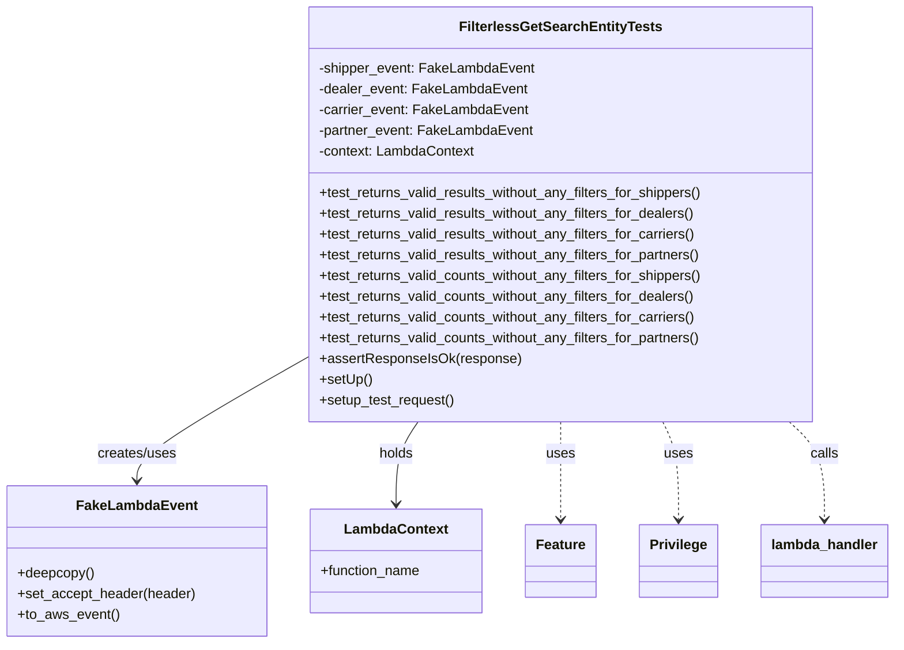

# Diagram: entity_core/entity_service/entity_service_tests/get_search_entity_tests/integration_tests/test_get_search_entity_without_filters.py


> Auto-generated by Obscura crawlers

## Diagram 1



### SVG

<svg id="container" width="1021.1328125" xmlns="http://www.w3.org/2000/svg" class="classDiagram" height="744" viewBox="0 0 1021.1328125 744" role="graphics-document document" aria-roledescription="class"><style>#container{font-family:"trebuchet ms",verdana,arial,sans-serif;font-size:16px;fill:#333;}@keyframes edge-animation-frame{from{stroke-dashoffset:0;}}@keyframes dash{to{stroke-dashoffset:0;}}#container .edge-animation-slow{stroke-dasharray:9,5!important;stroke-dashoffset:900;animation:dash 50s linear infinite;stroke-linecap:round;}#container .edge-animation-fast{stroke-dasharray:9,5!important;stroke-dashoffset:900;animation:dash 20s linear infinite;stroke-linecap:round;}#container .error-icon{fill:#552222;}#container .error-text{fill:#552222;stroke:#552222;}#container .edge-thickness-normal{stroke-width:1px;}#container .edge-thickness-thick{stroke-width:3.5px;}#container .edge-pattern-solid{stroke-dasharray:0;}#container .edge-thickness-invisible{stroke-width:0;fill:none;}#container .edge-pattern-dashed{stroke-dasharray:3;}#container .edge-pattern-dotted{stroke-dasharray:2;}#container .marker{fill:#333333;stroke:#333333;}#container .marker.cross{stroke:#333333;}#container svg{font-family:"trebuchet ms",verdana,arial,sans-serif;font-size:16px;}#container p{margin:0;}#container g.classGroup text{fill:#9370DB;stroke:none;font-family:"trebuchet ms",verdana,arial,sans-serif;font-size:10px;}#container g.classGroup text .title{font-weight:bolder;}#container .nodeLabel,#container .edgeLabel{color:#131300;}#container .edgeLabel .label rect{fill:#ECECFF;}#container .label text{fill:#131300;}#container .labelBkg{background:#ECECFF;}#container .edgeLabel .label span{background:#ECECFF;}#container .classTitle{font-weight:bolder;}#container .node rect,#container .node circle,#container .node ellipse,#container .node polygon,#container .node path{fill:#ECECFF;stroke:#9370DB;stroke-width:1px;}#container .divider{stroke:#9370DB;stroke-width:1;}#container g.clickable{cursor:pointer;}#container g.classGroup rect{fill:#ECECFF;stroke:#9370DB;}#container g.classGroup line{stroke:#9370DB;stroke-width:1;}#container .classLabel .box{stroke:none;stroke-width:0;fill:#ECECFF;opacity:0.5;}#container .classLabel .label{fill:#9370DB;font-size:10px;}#container .relation{stroke:#333333;stroke-width:1;fill:none;}#container .dashed-line{stroke-dasharray:3;}#container .dotted-line{stroke-dasharray:1 2;}#container #compositionStart,#container .composition{fill:#333333!important;stroke:#333333!important;stroke-width:1;}#container #compositionEnd,#container .composition{fill:#333333!important;stroke:#333333!important;stroke-width:1;}#container #dependencyStart,#container .dependency{fill:#333333!important;stroke:#333333!important;stroke-width:1;}#container #dependencyStart,#container .dependency{fill:#333333!important;stroke:#333333!important;stroke-width:1;}#container #extensionStart,#container .extension{fill:transparent!important;stroke:#333333!important;stroke-width:1;}#container #extensionEnd,#container .extension{fill:transparent!important;stroke:#333333!important;stroke-width:1;}#container #aggregationStart,#container .aggregation{fill:transparent!important;stroke:#333333!important;stroke-width:1;}#container #aggregationEnd,#container .aggregation{fill:transparent!important;stroke:#333333!important;stroke-width:1;}#container #lollipopStart,#container .lollipop{fill:#ECECFF!important;stroke:#333333!important;stroke-width:1;}#container #lollipopEnd,#container .lollipop{fill:#ECECFF!important;stroke:#333333!important;stroke-width:1;}#container .edgeTerminals{font-size:11px;line-height:initial;}#container .classTitleText{text-anchor:middle;font-size:18px;fill:#333;}#container .label-icon{display:inline-block;height:1em;overflow:visible;vertical-align:-0.125em;}#container .node .label-icon path{fill:currentColor;stroke:revert;stroke-width:revert;}#container :root{--mermaid-font-family:"trebuchet ms",verdana,arial,sans-serif;}</style><g><defs><marker id="container_class-aggregationStart" class="marker aggregation class" refX="18" refY="7" markerWidth="190" markerHeight="240" orient="auto"><path d="M 18,7 L9,13 L1,7 L9,1 Z"></path></marker></defs><defs><marker id="container_class-aggregationEnd" class="marker aggregation class" refX="1" refY="7" markerWidth="20" markerHeight="28" orient="auto"><path d="M 18,7 L9,13 L1,7 L9,1 Z"></path></marker></defs><defs><marker id="container_class-extensionStart" class="marker extension class" refX="18" refY="7" markerWidth="190" markerHeight="240" orient="auto"><path d="M 1,7 L18,13 V 1 Z"></path></marker></defs><defs><marker id="container_class-extensionEnd" class="marker extension class" refX="1" refY="7" markerWidth="20" markerHeight="28" orient="auto"><path d="M 1,1 V 13 L18,7 Z"></path></marker></defs><defs><marker id="container_class-compositionStart" class="marker composition class" refX="18" refY="7" markerWidth="190" markerHeight="240" orient="auto"><path d="M 18,7 L9,13 L1,7 L9,1 Z"></path></marker></defs><defs><marker id="container_class-compositionEnd" class="marker composition class" refX="1" refY="7" markerWidth="20" markerHeight="28" orient="auto"><path d="M 18,7 L9,13 L1,7 L9,1 Z"></path></marker></defs><defs><marker id="container_class-dependencyStart" class="marker dependency class" refX="6" refY="7" markerWidth="190" markerHeight="240" orient="auto"><path d="M 5,7 L9,13 L1,7 L9,1 Z"></path></marker></defs><defs><marker id="container_class-dependencyEnd" class="marker dependency class" refX="13" refY="7" markerWidth="20" markerHeight="28" orient="auto"><path d="M 18,7 L9,13 L14,7 L9,1 Z"></path></marker></defs><defs><marker id="container_class-lollipopStart" class="marker lollipop class" refX="13" refY="7" markerWidth="190" markerHeight="240" orient="auto"><circle stroke="black" fill="transparent" cx="7" cy="7" r="6"></circle></marker></defs><defs><marker id="container_class-lollipopEnd" class="marker lollipop class" refX="1" refY="7" markerWidth="190" markerHeight="240" orient="auto"><circle stroke="black" fill="transparent" cx="7" cy="7" r="6"></circle></marker></defs><g class="root"><g class="clusters"></g><g class="edgePaths"><path d="M349.211,414.905L317.016,433.254C284.822,451.603,220.432,488.302,188.238,511.817C156.043,535.333,156.043,545.667,156.043,550.833L156.043,556" id="id_FilterlessGetSearchEntityTests_FakeLambdaEvent_1" class="edge-thickness-normal edge-pattern-solid relation" style=";;;" data-edge="true" data-et="edge" data-id="id_FilterlessGetSearchEntityTests_FakeLambdaEvent_1" data-points="W3sieCI6MzQ5LjIxMDkzNzUsInkiOjQxNC45MDQ4NjE3OTc2MzU0fSx7IngiOjE1Ni4wNDI5Njg3NSwieSI6NTI1fSx7IngiOjE1Ni4wNDI5Njg3NSwieSI6NTYyfV0=" marker-end="url(#container_class-dependencyEnd)"></path><path d="M478.578,488L474.377,494.167C470.177,500.333,461.776,512.667,457.575,528.5C453.375,544.333,453.375,563.667,453.375,573.333L453.375,583" id="id_FilterlessGetSearchEntityTests_LambdaContext_2" class="edge-thickness-normal edge-pattern-solid relation" style=";;;" data-edge="true" data-et="edge" data-id="id_FilterlessGetSearchEntityTests_LambdaContext_2" data-points="W3sieCI6NDc4LjU3NzcwMTk0MDQzMzIsInkiOjQ4OH0seyJ4Ijo0NTMuMzc1LCJ5Ijo1MjV9LHsieCI6NDUzLjM3NSwieSI6NTg5fV0=" marker-end="url(#container_class-dependencyEnd)"></path><path d="M642.055,488L642.055,494.167C642.055,500.333,642.055,512.667,642.055,531.5C642.055,550.333,642.055,575.667,642.055,588.333L642.055,601" id="id_FilterlessGetSearchEntityTests_Feature_3" class="edge-thickness-normal edge-pattern-dashed relation" style=";;;" data-edge="true" data-et="edge" data-id="id_FilterlessGetSearchEntityTests_Feature_3" data-points="W3sieCI6NjQyLjA1NDY4NzUsInkiOjQ4OH0seyJ4Ijo2NDIuMDU0Njg3NSwieSI6NTI1fSx7IngiOjY0Mi4wNTQ2ODc1LCJ5Ijo2MDd9XQ==" marker-end="url(#container_class-dependencyEnd)"></path><path d="M757.513,488L760.479,494.167C763.446,500.333,769.379,512.667,772.346,531.5C775.313,550.333,775.313,575.667,775.313,588.333L775.313,601" id="id_FilterlessGetSearchEntityTests_Privilege_4" class="edge-thickness-normal edge-pattern-dashed relation" style=";;;" data-edge="true" data-et="edge" data-id="id_FilterlessGetSearchEntityTests_Privilege_4" data-points="W3sieCI6NzU3LjUxMjcxOTk5MDk3NDcsInkiOjQ4OH0seyJ4Ijo3NzUuMzEyNSwieSI6NTI1fSx7IngiOjc3NS4zMTI1LCJ5Ijo2MDd9XQ==" marker-end="url(#container_class-dependencyEnd)"></path><path d="M901.204,488L907.863,494.167C914.521,500.333,927.839,512.667,934.498,531.5C941.156,550.333,941.156,575.667,941.156,588.333L941.156,601" id="id_FilterlessGetSearchEntityTests_lambda_handler_5" class="edge-thickness-normal edge-pattern-dashed relation" style=";;;" data-edge="true" data-et="edge" data-id="id_FilterlessGetSearchEntityTests_lambda_handler_5" data-points="W3sieCI6OTAxLjIwNDA1NTczMTA0NywieSI6NDg4fSx7IngiOjk0MS4xNTYyNSwieSI6NTI1fSx7IngiOjk0MS4xNTYyNSwieSI6NjA3fV0=" marker-end="url(#container_class-dependencyEnd)"></path></g><g class="edgeLabels"><g class="edgeLabel" transform="translate(156.04296875, 525)"><g class="label" data-id="id_FilterlessGetSearchEntityTests_FakeLambdaEvent_1" transform="translate(-46.578125, -12)"><foreignObject width="93.15625" height="24"><div xmlns="http://www.w3.org/1999/xhtml" class="labelBkg" style="display: table-cell; white-space: nowrap; line-height: 1.5; max-width: 200px; text-align: center;"><span class="edgeLabel"><p>creates/uses</p></span></div></foreignObject></g></g><g class="edgeLabel" transform="translate(453.375, 525)"><g class="label" data-id="id_FilterlessGetSearchEntityTests_LambdaContext_2" transform="translate(-20.1875, -12)"><foreignObject width="40.375" height="24"><div xmlns="http://www.w3.org/1999/xhtml" class="labelBkg" style="display: table-cell; white-space: nowrap; line-height: 1.5; max-width: 200px; text-align: center;"><span class="edgeLabel"><p>holds</p></span></div></foreignObject></g></g><g class="edgeLabel" transform="translate(642.0546875, 525)"><g class="label" data-id="id_FilterlessGetSearchEntityTests_Feature_3" transform="translate(-16.4921875, -12)"><foreignObject width="32.984375" height="24"><div xmlns="http://www.w3.org/1999/xhtml" class="labelBkg" style="display: table-cell; white-space: nowrap; line-height: 1.5; max-width: 200px; text-align: center;"><span class="edgeLabel"><p>uses</p></span></div></foreignObject></g></g><g class="edgeLabel" transform="translate(775.3125, 525)"><g class="label" data-id="id_FilterlessGetSearchEntityTests_Privilege_4" transform="translate(-16.4921875, -12)"><foreignObject width="32.984375" height="24"><div xmlns="http://www.w3.org/1999/xhtml" class="labelBkg" style="display: table-cell; white-space: nowrap; line-height: 1.5; max-width: 200px; text-align: center;"><span class="edgeLabel"><p>uses</p></span></div></foreignObject></g></g><g class="edgeLabel" transform="translate(941.15625, 525)"><g class="label" data-id="id_FilterlessGetSearchEntityTests_lambda_handler_5" transform="translate(-16.4453125, -12)"><foreignObject width="32.890625" height="24"><div xmlns="http://www.w3.org/1999/xhtml" class="labelBkg" style="display: table-cell; white-space: nowrap; line-height: 1.5; max-width: 200px; text-align: center;"><span class="edgeLabel"><p>calls</p></span></div></foreignObject></g></g></g><g class="nodes"><g class="node default" id="classId-FilterlessGetSearchEntityTests-0" transform="translate(642.0546875, 248)"><g class="basic label-container"><path d="M-292.84375 -240 L292.84375 -240 L292.84375 240 L-292.84375 240" stroke="none" stroke-width="0" fill="#ECECFF" style=""></path><path d="M-292.84375 -240 C-174.07398913530037 -240, -55.30422827060073 -240, 292.84375 -240 M-292.84375 -240 C-134.21565878773697 -240, 24.41243242452606 -240, 292.84375 -240 M292.84375 -240 C292.84375 -104.06948448046305, 292.84375 31.861031039073907, 292.84375 240 M292.84375 -240 C292.84375 -83.5896435527822, 292.84375 72.82071289443559, 292.84375 240 M292.84375 240 C91.5964951315394 240, -109.6507597369212 240, -292.84375 240 M292.84375 240 C160.29771149882833 240, 27.75167299765667 240, -292.84375 240 M-292.84375 240 C-292.84375 110.531834046011, -292.84375 -18.936331907978, -292.84375 -240 M-292.84375 240 C-292.84375 114.00610029016418, -292.84375 -11.987799419671632, -292.84375 -240" stroke="#9370DB" stroke-width="1.3" fill="none" stroke-dasharray="0 0" style=""></path></g><g class="annotation-group text" transform="translate(0, -216)"></g><g class="label-group text" transform="translate(-111.0625, -216)"><g class="label" style="font-weight: bolder" transform="translate(0,-12)"><foreignObject width="222.125" height="24"><div xmlns="http://www.w3.org/1999/xhtml" style="display: table-cell; white-space: nowrap; line-height: 1.5; max-width: 267px; text-align: center;"><span class="nodeLabel markdown-node-label" style=""><p>FilterlessGetSearchEntityTests</p></span></div></foreignObject></g></g><g class="members-group text" transform="translate(-280.84375, -168)"><g class="label" style="" transform="translate(0,-12)"><foreignObject width="247.203125" height="24"><div xmlns="http://www.w3.org/1999/xhtml" style="display: table-cell; white-space: nowrap; line-height: 1.5; max-width: 305px; text-align: center;"><span class="nodeLabel markdown-node-label" style=""><p>-shipper_event: FakeLambdaEvent</p></span></div></foreignObject></g><g class="label" style="" transform="translate(0,12)"><foreignObject width="238.125" height="24"><div xmlns="http://www.w3.org/1999/xhtml" style="display: table-cell; white-space: nowrap; line-height: 1.5; max-width: 296px; text-align: center;"><span class="nodeLabel markdown-node-label" style=""><p>-dealer_event: FakeLambdaEvent</p></span></div></foreignObject></g><g class="label" style="" transform="translate(0,36)"><foreignObject width="239.890625" height="24"><div xmlns="http://www.w3.org/1999/xhtml" style="display: table-cell; white-space: nowrap; line-height: 1.5; max-width: 297px; text-align: center;"><span class="nodeLabel markdown-node-label" style=""><p>-carrier_event: FakeLambdaEvent</p></span></div></foreignObject></g><g class="label" style="" transform="translate(0,60)"><foreignObject width="246.21875" height="24"><div xmlns="http://www.w3.org/1999/xhtml" style="display: table-cell; white-space: nowrap; line-height: 1.5; max-width: 304px; text-align: center;"><span class="nodeLabel markdown-node-label" style=""><p>-partner_event: FakeLambdaEvent</p></span></div></foreignObject></g><g class="label" style="" transform="translate(0,84)"><foreignObject width="181.296875" height="24"><div xmlns="http://www.w3.org/1999/xhtml" style="display: table-cell; white-space: nowrap; line-height: 1.5; max-width: 239px; text-align: center;"><span class="nodeLabel markdown-node-label" style=""><p>-context: LambdaContext</p></span></div></foreignObject></g></g><g class="methods-group text" transform="translate(-280.84375, -24)"><g class="label" style="" transform="translate(0,-12)"><foreignObject width="450.625" height="24"><div xmlns="http://www.w3.org/1999/xhtml" style="display: table-cell; white-space: nowrap; line-height: 1.5; max-width: 508px; text-align: center;"><span class="nodeLabel markdown-node-label" style=""><p>+test_returns_valid_results_without_any_filters_for_shippers()</p></span></div></foreignObject></g><g class="label" style="" transform="translate(0,12)"><foreignObject width="441.21875" height="24"><div xmlns="http://www.w3.org/1999/xhtml" style="display: table-cell; white-space: nowrap; line-height: 1.5; max-width: 499px; text-align: center;"><span class="nodeLabel markdown-node-label" style=""><p>+test_returns_valid_results_without_any_filters_for_dealers()</p></span></div></foreignObject></g><g class="label" style="" transform="translate(0,36)"><foreignObject width="443" height="24"><div xmlns="http://www.w3.org/1999/xhtml" style="display: table-cell; white-space: nowrap; line-height: 1.5; max-width: 500px; text-align: center;"><span class="nodeLabel markdown-node-label" style=""><p>+test_returns_valid_results_without_any_filters_for_carriers()</p></span></div></foreignObject></g><g class="label" style="" transform="translate(0,60)"><foreignObject width="449.640625" height="24"><div xmlns="http://www.w3.org/1999/xhtml" style="display: table-cell; white-space: nowrap; line-height: 1.5; max-width: 507px; text-align: center;"><span class="nodeLabel markdown-node-label" style=""><p>+test_returns_valid_results_without_any_filters_for_partners()</p></span></div></foreignObject></g><g class="label" style="" transform="translate(0,84)"><foreignObject width="449.78125" height="24"><div xmlns="http://www.w3.org/1999/xhtml" style="display: table-cell; white-space: nowrap; line-height: 1.5; max-width: 507px; text-align: center;"><span class="nodeLabel markdown-node-label" style=""><p>+test_returns_valid_counts_without_any_filters_for_shippers()</p></span></div></foreignObject></g><g class="label" style="" transform="translate(0,108)"><foreignObject width="440.375" height="24"><div xmlns="http://www.w3.org/1999/xhtml" style="display: table-cell; white-space: nowrap; line-height: 1.5; max-width: 498px; text-align: center;"><span class="nodeLabel markdown-node-label" style=""><p>+test_returns_valid_counts_without_any_filters_for_dealers()</p></span></div></foreignObject></g><g class="label" style="" transform="translate(0,132)"><foreignObject width="442.15625" height="24"><div xmlns="http://www.w3.org/1999/xhtml" style="display: table-cell; white-space: nowrap; line-height: 1.5; max-width: 500px; text-align: center;"><span class="nodeLabel markdown-node-label" style=""><p>+test_returns_valid_counts_without_any_filters_for_carriers()</p></span></div></foreignObject></g><g class="label" style="" transform="translate(0,156)"><foreignObject width="448.796875" height="24"><div xmlns="http://www.w3.org/1999/xhtml" style="display: table-cell; white-space: nowrap; line-height: 1.5; max-width: 506px; text-align: center;"><span class="nodeLabel markdown-node-label" style=""><p>+test_returns_valid_counts_without_any_filters_for_partners()</p></span></div></foreignObject></g><g class="label" style="" transform="translate(0,180)"><foreignObject width="229.921875" height="24"><div xmlns="http://www.w3.org/1999/xhtml" style="display: table-cell; white-space: nowrap; line-height: 1.5; max-width: 287px; text-align: center;"><span class="nodeLabel markdown-node-label" style=""><p>+assertResponseIsOk(response)</p></span></div></foreignObject></g><g class="label" style="" transform="translate(0,204)"><foreignObject width="60.421875" height="24"><div xmlns="http://www.w3.org/1999/xhtml" style="display: table-cell; white-space: nowrap; line-height: 1.5; max-width: 118px; text-align: center;"><span class="nodeLabel markdown-node-label" style=""><p>+setUp()</p></span></div></foreignObject></g><g class="label" style="" transform="translate(0,228)"><foreignObject width="157.90625" height="24"><div xmlns="http://www.w3.org/1999/xhtml" style="display: table-cell; white-space: nowrap; line-height: 1.5; max-width: 215px; text-align: center;"><span class="nodeLabel markdown-node-label" style=""><p>+setup_test_request()</p></span></div></foreignObject></g></g><g class="divider" style=""><path d="M-292.84375 -192 C-150.72977796957522 -192, -8.615805939150448 -192, 292.84375 -192 M-292.84375 -192 C-125.43095115035277 -192, 41.98184769929446 -192, 292.84375 -192" stroke="#9370DB" stroke-width="1.3" fill="none" stroke-dasharray="0 0" style=""></path></g><g class="divider" style=""><path d="M-292.84375 -48 C-119.05794963330518 -48, 54.72785073338963 -48, 292.84375 -48 M-292.84375 -48 C-151.77220278405895 -48, -10.700655568117895 -48, 292.84375 -48" stroke="#9370DB" stroke-width="1.3" fill="none" stroke-dasharray="0 0" style=""></path></g></g><g class="node default" id="classId-FakeLambdaEvent-1" transform="translate(156.04296875, 649)"><g class="basic label-container"><path d="M-148.04296875 -87 L148.04296875 -87 L148.04296875 87 L-148.04296875 87" stroke="none" stroke-width="0" fill="#ECECFF" style=""></path><path d="M-148.04296875 -87 C-80.48883886255352 -87, -12.934708975107043 -87, 148.04296875 -87 M-148.04296875 -87 C-56.73600177077469 -87, 34.570965208450616 -87, 148.04296875 -87 M148.04296875 -87 C148.04296875 -40.57151019111265, 148.04296875 5.856979617774698, 148.04296875 87 M148.04296875 -87 C148.04296875 -30.75735457824978, 148.04296875 25.485290843500437, 148.04296875 87 M148.04296875 87 C39.33064876092445 87, -69.3816712281511 87, -148.04296875 87 M148.04296875 87 C31.437349616014586 87, -85.16826951797083 87, -148.04296875 87 M-148.04296875 87 C-148.04296875 26.659158980819115, -148.04296875 -33.68168203836177, -148.04296875 -87 M-148.04296875 87 C-148.04296875 24.34297731357632, -148.04296875 -38.31404537284736, -148.04296875 -87" stroke="#9370DB" stroke-width="1.3" fill="none" stroke-dasharray="0 0" style=""></path></g><g class="annotation-group text" transform="translate(0, -63)"></g><g class="label-group text" transform="translate(-65.8671875, -63)"><g class="label" style="font-weight: bolder" transform="translate(0,-12)"><foreignObject width="131.734375" height="24"><div xmlns="http://www.w3.org/1999/xhtml" style="display: table-cell; white-space: nowrap; line-height: 1.5; max-width: 181px; text-align: center;"><span class="nodeLabel markdown-node-label" style=""><p>FakeLambdaEvent</p></span></div></foreignObject></g></g><g class="members-group text" transform="translate(-136.04296875, -15)"></g><g class="methods-group text" transform="translate(-136.04296875, 15)"><g class="label" style="" transform="translate(0,-12)"><foreignObject width="88.859375" height="24"><div xmlns="http://www.w3.org/1999/xhtml" style="display: table-cell; white-space: nowrap; line-height: 1.5; max-width: 146px; text-align: center;"><span class="nodeLabel markdown-node-label" style=""><p>+deepcopy()</p></span></div></foreignObject></g><g class="label" style="" transform="translate(0,12)"><foreignObject width="206.21875" height="24"><div xmlns="http://www.w3.org/1999/xhtml" style="display: table-cell; white-space: nowrap; line-height: 1.5; max-width: 264px; text-align: center;"><span class="nodeLabel markdown-node-label" style=""><p>+set_accept_header(header)</p></span></div></foreignObject></g><g class="label" style="" transform="translate(0,36)"><foreignObject width="116.421875" height="24"><div xmlns="http://www.w3.org/1999/xhtml" style="display: table-cell; white-space: nowrap; line-height: 1.5; max-width: 174px; text-align: center;"><span class="nodeLabel markdown-node-label" style=""><p>+to_aws_event()</p></span></div></foreignObject></g></g><g class="divider" style=""><path d="M-148.04296875 -39 C-73.93986107222418 -39, 0.16324660555164883 -39, 148.04296875 -39 M-148.04296875 -39 C-69.61535110377314 -39, 8.812266542453727 -39, 148.04296875 -39" stroke="#9370DB" stroke-width="1.3" fill="none" stroke-dasharray="0 0" style=""></path></g><g class="divider" style=""><path d="M-148.04296875 -15 C-66.88690630164194 -15, 14.269156146716114 -15, 148.04296875 -15 M-148.04296875 -15 C-41.50709645729921 -15, 65.02877583540158 -15, 148.04296875 -15" stroke="#9370DB" stroke-width="1.3" fill="none" stroke-dasharray="0 0" style=""></path></g></g><g class="node default" id="classId-LambdaContext-2" transform="translate(453.375, 649)"><g class="basic label-container"><path d="M-99.2890625 -60 L99.2890625 -60 L99.2890625 60 L-99.2890625 60" stroke="none" stroke-width="0" fill="#ECECFF" style=""></path><path d="M-99.2890625 -60 C-52.349901333320695 -60, -5.410740166641389 -60, 99.2890625 -60 M-99.2890625 -60 C-27.481888897579324 -60, 44.32528470484135 -60, 99.2890625 -60 M99.2890625 -60 C99.2890625 -30.229156758866193, 99.2890625 -0.4583135177323854, 99.2890625 60 M99.2890625 -60 C99.2890625 -25.733389482642878, 99.2890625 8.533221034714245, 99.2890625 60 M99.2890625 60 C49.03575262077962 60, -1.2175572584407632 60, -99.2890625 60 M99.2890625 60 C53.82902324638786 60, 8.368983992775725 60, -99.2890625 60 M-99.2890625 60 C-99.2890625 17.79380370459466, -99.2890625 -24.412392590810683, -99.2890625 -60 M-99.2890625 60 C-99.2890625 18.286698995992197, -99.2890625 -23.426602008015607, -99.2890625 -60" stroke="#9370DB" stroke-width="1.3" fill="none" stroke-dasharray="0 0" style=""></path></g><g class="annotation-group text" transform="translate(0, -36)"></g><g class="label-group text" transform="translate(-57.296875, -36)"><g class="label" style="font-weight: bolder" transform="translate(0,-12)"><foreignObject width="114.59375" height="24"><div xmlns="http://www.w3.org/1999/xhtml" style="display: table-cell; white-space: nowrap; line-height: 1.5; max-width: 163px; text-align: center;"><span class="nodeLabel markdown-node-label" style=""><p>LambdaContext</p></span></div></foreignObject></g></g><g class="members-group text" transform="translate(-87.2890625, 12)"><g class="label" style="" transform="translate(0,-12)"><foreignObject width="117.28125" height="24"><div xmlns="http://www.w3.org/1999/xhtml" style="display: table-cell; white-space: nowrap; line-height: 1.5; max-width: 175px; text-align: center;"><span class="nodeLabel markdown-node-label" style=""><p>+function_name</p></span></div></foreignObject></g></g><g class="methods-group text" transform="translate(-87.2890625, 60)"></g><g class="divider" style=""><path d="M-99.2890625 -12 C-59.30609043330909 -12, -19.323118366618175 -12, 99.2890625 -12 M-99.2890625 -12 C-45.34818700805914 -12, 8.592688483881716 -12, 99.2890625 -12" stroke="#9370DB" stroke-width="1.3" fill="none" stroke-dasharray="0 0" style=""></path></g><g class="divider" style=""><path d="M-99.2890625 36 C-44.09437058109057 36, 11.100321337818855 36, 99.2890625 36 M-99.2890625 36 C-57.986359587122095 36, -16.68365667424419 36, 99.2890625 36" stroke="#9370DB" stroke-width="1.3" fill="none" stroke-dasharray="0 0" style=""></path></g></g><g class="node default" id="classId-Feature-3" transform="translate(642.0546875, 649)"><g class="basic label-container"><path d="M-39.390625 -42 L39.390625 -42 L39.390625 42 L-39.390625 42" stroke="none" stroke-width="0" fill="#ECECFF" style=""></path><path d="M-39.390625 -42 C-19.101650594551156 -42, 1.1873238108976878 -42, 39.390625 -42 M-39.390625 -42 C-13.818376217664202 -42, 11.753872564671596 -42, 39.390625 -42 M39.390625 -42 C39.390625 -9.577521307460877, 39.390625 22.844957385078246, 39.390625 42 M39.390625 -42 C39.390625 -12.351134332931341, 39.390625 17.297731334137318, 39.390625 42 M39.390625 42 C13.823264651160805 42, -11.74409569767839 42, -39.390625 42 M39.390625 42 C11.506865181434335 42, -16.37689463713133 42, -39.390625 42 M-39.390625 42 C-39.390625 10.763730988840258, -39.390625 -20.472538022319483, -39.390625 -42 M-39.390625 42 C-39.390625 23.375092989076705, -39.390625 4.750185978153411, -39.390625 -42" stroke="#9370DB" stroke-width="1.3" fill="none" stroke-dasharray="0 0" style=""></path></g><g class="annotation-group text" transform="translate(0, -18)"></g><g class="label-group text" transform="translate(-27.390625, -18)"><g class="label" style="font-weight: bolder" transform="translate(0,-12)"><foreignObject width="54.78125" height="24"><div xmlns="http://www.w3.org/1999/xhtml" style="display: table-cell; white-space: nowrap; line-height: 1.5; max-width: 104px; text-align: center;"><span class="nodeLabel markdown-node-label" style=""><p>Feature</p></span></div></foreignObject></g></g><g class="members-group text" transform="translate(-27.390625, 30)"></g><g class="methods-group text" transform="translate(-27.390625, 60)"></g><g class="divider" style=""><path d="M-39.390625 6 C-15.188877167615772 6, 9.012870664768457 6, 39.390625 6 M-39.390625 6 C-22.12633476987802 6, -4.862044539756042 6, 39.390625 6" stroke="#9370DB" stroke-width="1.3" fill="none" stroke-dasharray="0 0" style=""></path></g><g class="divider" style=""><path d="M-39.390625 24 C-14.611452247486966 24, 10.167720505026068 24, 39.390625 24 M-39.390625 24 C-22.107859227070765 24, -4.8250934541415305 24, 39.390625 24" stroke="#9370DB" stroke-width="1.3" fill="none" stroke-dasharray="0 0" style=""></path></g></g><g class="node default" id="classId-Privilege-4" transform="translate(775.3125, 649)"><g class="basic label-container"><path d="M-43.8671875 -42 L43.8671875 -42 L43.8671875 42 L-43.8671875 42" stroke="none" stroke-width="0" fill="#ECECFF" style=""></path><path d="M-43.8671875 -42 C-21.060605781715104 -42, 1.745975936569792 -42, 43.8671875 -42 M-43.8671875 -42 C-18.796651224754815 -42, 6.273885050490371 -42, 43.8671875 -42 M43.8671875 -42 C43.8671875 -17.920928762602557, 43.8671875 6.158142474794886, 43.8671875 42 M43.8671875 -42 C43.8671875 -19.528783997160758, 43.8671875 2.9424320056784836, 43.8671875 42 M43.8671875 42 C16.326419734193042 42, -11.214348031613916 42, -43.8671875 42 M43.8671875 42 C17.449257112152818 42, -8.968673275694364 42, -43.8671875 42 M-43.8671875 42 C-43.8671875 23.83567339466119, -43.8671875 5.671346789322378, -43.8671875 -42 M-43.8671875 42 C-43.8671875 11.987612778964959, -43.8671875 -18.024774442070083, -43.8671875 -42" stroke="#9370DB" stroke-width="1.3" fill="none" stroke-dasharray="0 0" style=""></path></g><g class="annotation-group text" transform="translate(0, -18)"></g><g class="label-group text" transform="translate(-31.8671875, -18)"><g class="label" style="font-weight: bolder" transform="translate(0,-12)"><foreignObject width="63.734375" height="24"><div xmlns="http://www.w3.org/1999/xhtml" style="display: table-cell; white-space: nowrap; line-height: 1.5; max-width: 112px; text-align: center;"><span class="nodeLabel markdown-node-label" style=""><p>Privilege</p></span></div></foreignObject></g></g><g class="members-group text" transform="translate(-31.8671875, 30)"></g><g class="methods-group text" transform="translate(-31.8671875, 60)"></g><g class="divider" style=""><path d="M-43.8671875 6 C-9.880028284007274 6, 24.107130931985452 6, 43.8671875 6 M-43.8671875 6 C-25.260928484287298 6, -6.654669468574596 6, 43.8671875 6" stroke="#9370DB" stroke-width="1.3" fill="none" stroke-dasharray="0 0" style=""></path></g><g class="divider" style=""><path d="M-43.8671875 24 C-12.312982364325674 24, 19.241222771348653 24, 43.8671875 24 M-43.8671875 24 C-13.573180280359793 24, 16.720826939280414 24, 43.8671875 24" stroke="#9370DB" stroke-width="1.3" fill="none" stroke-dasharray="0 0" style=""></path></g></g><g class="node default" id="classId-lambda_handler-5" transform="translate(941.15625, 649)"><g class="basic label-container"><path d="M-71.9765625 -42 L71.9765625 -42 L71.9765625 42 L-71.9765625 42" stroke="none" stroke-width="0" fill="#ECECFF" style=""></path><path d="M-71.9765625 -42 C-31.44936170723765 -42, 9.077839085524701 -42, 71.9765625 -42 M-71.9765625 -42 C-34.28525602482149 -42, 3.4060504503570144 -42, 71.9765625 -42 M71.9765625 -42 C71.9765625 -17.074609160122222, 71.9765625 7.850781679755556, 71.9765625 42 M71.9765625 -42 C71.9765625 -14.475115809014973, 71.9765625 13.049768381970054, 71.9765625 42 M71.9765625 42 C17.1840453406371 42, -37.6084718187258 42, -71.9765625 42 M71.9765625 42 C40.55870741716916 42, 9.14085233433832 42, -71.9765625 42 M-71.9765625 42 C-71.9765625 19.777667792413084, -71.9765625 -2.4446644151738326, -71.9765625 -42 M-71.9765625 42 C-71.9765625 18.26065694328233, -71.9765625 -5.478686113435337, -71.9765625 -42" stroke="#9370DB" stroke-width="1.3" fill="none" stroke-dasharray="0 0" style=""></path></g><g class="annotation-group text" transform="translate(0, -18)"></g><g class="label-group text" transform="translate(-59.9765625, -18)"><g class="label" style="font-weight: bolder" transform="translate(0,-12)"><foreignObject width="119.953125" height="24"><div xmlns="http://www.w3.org/1999/xhtml" style="display: table-cell; white-space: nowrap; line-height: 1.5; max-width: 170px; text-align: center;"><span class="nodeLabel markdown-node-label" style=""><p>lambda_handler</p></span></div></foreignObject></g></g><g class="members-group text" transform="translate(-59.9765625, 30)"></g><g class="methods-group text" transform="translate(-59.9765625, 60)"></g><g class="divider" style=""><path d="M-71.9765625 6 C-34.823832703921504 6, 2.3288970921569927 6, 71.9765625 6 M-71.9765625 6 C-42.30397143067147 6, -12.631380361342927 6, 71.9765625 6" stroke="#9370DB" stroke-width="1.3" fill="none" stroke-dasharray="0 0" style=""></path></g><g class="divider" style=""><path d="M-71.9765625 24 C-32.38247680045974 24, 7.211608899080517 24, 71.9765625 24 M-71.9765625 24 C-30.015960231226856 24, 11.944642037546288 24, 71.9765625 24" stroke="#9370DB" stroke-width="1.3" fill="none" stroke-dasharray="0 0" style=""></path></g></g></g></g></g></svg>

## Diagram 2

```mermaid
sequenceDiagram
participant TestCase as FilterlessGetSearchEntityTests
participant Setup as setup_test_request
participant Event as FakeLambdaEvent
participant Context as LambdaContext
participant Handler as lambda_handler
participant Assert as assertResponseIsOk

TestCase->>Setup: setUp() -> setup_test_request()
Setup->>Event: instantiate shipper/dealer/carrier/partner events
Setup->>Context: create LambdaContext(function_name="search_entity")
TestCase->>Event: event = deepcopy(); event.set_accept_header("application/json" / "application/json;version=count")
TestCase->>Handler: response = lambda_handler(event.to_aws_event(), context)
Handler-->>TestCase: return response
TestCase->>Assert: assertResponseIsOk(response)
Assert-->>TestCase: verify statusCode == "200"
```

> SVG rendering failed for this diagram.
