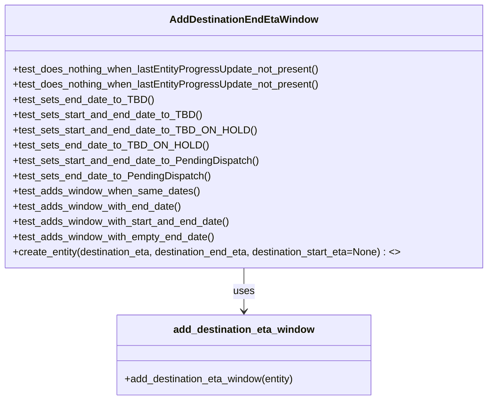

# Diagram: entity_core/entity_service/entity_service_tests/get_search_entity_tests/test_add_destination_eta_window.py


> Auto-generated by Obscura crawlers

## Diagram 1



### SVG

<svg id="container" width="775.0390625" xmlns="http://www.w3.org/2000/svg" class="classDiagram" height="630" viewBox="0 0 775.0390625 630" role="graphics-document document" aria-roledescription="class"><style>#container{font-family:"trebuchet ms",verdana,arial,sans-serif;font-size:16px;fill:#333;}@keyframes edge-animation-frame{from{stroke-dashoffset:0;}}@keyframes dash{to{stroke-dashoffset:0;}}#container .edge-animation-slow{stroke-dasharray:9,5!important;stroke-dashoffset:900;animation:dash 50s linear infinite;stroke-linecap:round;}#container .edge-animation-fast{stroke-dasharray:9,5!important;stroke-dashoffset:900;animation:dash 20s linear infinite;stroke-linecap:round;}#container .error-icon{fill:#552222;}#container .error-text{fill:#552222;stroke:#552222;}#container .edge-thickness-normal{stroke-width:1px;}#container .edge-thickness-thick{stroke-width:3.5px;}#container .edge-pattern-solid{stroke-dasharray:0;}#container .edge-thickness-invisible{stroke-width:0;fill:none;}#container .edge-pattern-dashed{stroke-dasharray:3;}#container .edge-pattern-dotted{stroke-dasharray:2;}#container .marker{fill:#333333;stroke:#333333;}#container .marker.cross{stroke:#333333;}#container svg{font-family:"trebuchet ms",verdana,arial,sans-serif;font-size:16px;}#container p{margin:0;}#container g.classGroup text{fill:#9370DB;stroke:none;font-family:"trebuchet ms",verdana,arial,sans-serif;font-size:10px;}#container g.classGroup text .title{font-weight:bolder;}#container .nodeLabel,#container .edgeLabel{color:#131300;}#container .edgeLabel .label rect{fill:#ECECFF;}#container .label text{fill:#131300;}#container .labelBkg{background:#ECECFF;}#container .edgeLabel .label span{background:#ECECFF;}#container .classTitle{font-weight:bolder;}#container .node rect,#container .node circle,#container .node ellipse,#container .node polygon,#container .node path{fill:#ECECFF;stroke:#9370DB;stroke-width:1px;}#container .divider{stroke:#9370DB;stroke-width:1;}#container g.clickable{cursor:pointer;}#container g.classGroup rect{fill:#ECECFF;stroke:#9370DB;}#container g.classGroup line{stroke:#9370DB;stroke-width:1;}#container .classLabel .box{stroke:none;stroke-width:0;fill:#ECECFF;opacity:0.5;}#container .classLabel .label{fill:#9370DB;font-size:10px;}#container .relation{stroke:#333333;stroke-width:1;fill:none;}#container .dashed-line{stroke-dasharray:3;}#container .dotted-line{stroke-dasharray:1 2;}#container #compositionStart,#container .composition{fill:#333333!important;stroke:#333333!important;stroke-width:1;}#container #compositionEnd,#container .composition{fill:#333333!important;stroke:#333333!important;stroke-width:1;}#container #dependencyStart,#container .dependency{fill:#333333!important;stroke:#333333!important;stroke-width:1;}#container #dependencyStart,#container .dependency{fill:#333333!important;stroke:#333333!important;stroke-width:1;}#container #extensionStart,#container .extension{fill:transparent!important;stroke:#333333!important;stroke-width:1;}#container #extensionEnd,#container .extension{fill:transparent!important;stroke:#333333!important;stroke-width:1;}#container #aggregationStart,#container .aggregation{fill:transparent!important;stroke:#333333!important;stroke-width:1;}#container #aggregationEnd,#container .aggregation{fill:transparent!important;stroke:#333333!important;stroke-width:1;}#container #lollipopStart,#container .lollipop{fill:#ECECFF!important;stroke:#333333!important;stroke-width:1;}#container #lollipopEnd,#container .lollipop{fill:#ECECFF!important;stroke:#333333!important;stroke-width:1;}#container .edgeTerminals{font-size:11px;line-height:initial;}#container .classTitleText{text-anchor:middle;font-size:18px;fill:#333;}#container .label-icon{display:inline-block;height:1em;overflow:visible;vertical-align:-0.125em;}#container .node .label-icon path{fill:currentColor;stroke:revert;stroke-width:revert;}#container :root{--mermaid-font-family:"trebuchet ms",verdana,arial,sans-serif;}</style><g><defs><marker id="container_class-aggregationStart" class="marker aggregation class" refX="18" refY="7" markerWidth="190" markerHeight="240" orient="auto"><path d="M 18,7 L9,13 L1,7 L9,1 Z"></path></marker></defs><defs><marker id="container_class-aggregationEnd" class="marker aggregation class" refX="1" refY="7" markerWidth="20" markerHeight="28" orient="auto"><path d="M 18,7 L9,13 L1,7 L9,1 Z"></path></marker></defs><defs><marker id="container_class-extensionStart" class="marker extension class" refX="18" refY="7" markerWidth="190" markerHeight="240" orient="auto"><path d="M 1,7 L18,13 V 1 Z"></path></marker></defs><defs><marker id="container_class-extensionEnd" class="marker extension class" refX="1" refY="7" markerWidth="20" markerHeight="28" orient="auto"><path d="M 1,1 V 13 L18,7 Z"></path></marker></defs><defs><marker id="container_class-compositionStart" class="marker composition class" refX="18" refY="7" markerWidth="190" markerHeight="240" orient="auto"><path d="M 18,7 L9,13 L1,7 L9,1 Z"></path></marker></defs><defs><marker id="container_class-compositionEnd" class="marker composition class" refX="1" refY="7" markerWidth="20" markerHeight="28" orient="auto"><path d="M 18,7 L9,13 L1,7 L9,1 Z"></path></marker></defs><defs><marker id="container_class-dependencyStart" class="marker dependency class" refX="6" refY="7" markerWidth="190" markerHeight="240" orient="auto"><path d="M 5,7 L9,13 L1,7 L9,1 Z"></path></marker></defs><defs><marker id="container_class-dependencyEnd" class="marker dependency class" refX="13" refY="7" markerWidth="20" markerHeight="28" orient="auto"><path d="M 18,7 L9,13 L14,7 L9,1 Z"></path></marker></defs><defs><marker id="container_class-lollipopStart" class="marker lollipop class" refX="13" refY="7" markerWidth="190" markerHeight="240" orient="auto"><circle stroke="black" fill="transparent" cx="7" cy="7" r="6"></circle></marker></defs><defs><marker id="container_class-lollipopEnd" class="marker lollipop class" refX="1" refY="7" markerWidth="190" markerHeight="240" orient="auto"><circle stroke="black" fill="transparent" cx="7" cy="7" r="6"></circle></marker></defs><g class="root"><g class="clusters"></g><g class="edgePaths"><path d="M387.52,422L387.52,428.167C387.52,434.333,387.52,446.667,387.52,458C387.52,469.333,387.52,479.667,387.52,484.833L387.52,490" id="id_AddDestinationEndEtaWindow_add_destination_eta_window_1" class="edge-thickness-normal edge-pattern-solid relation" style=";;;" data-edge="true" data-et="edge" data-id="id_AddDestinationEndEtaWindow_add_destination_eta_window_1" data-points="W3sieCI6Mzg3LjUxOTUzMTI1LCJ5Ijo0MjJ9LHsieCI6Mzg3LjUxOTUzMTI1LCJ5Ijo0NTl9LHsieCI6Mzg3LjUxOTUzMTI1LCJ5Ijo0OTZ9XQ==" marker-end="url(#container_class-dependencyEnd)"></path></g><g class="edgeLabels"><g class="edgeLabel" transform="translate(387.51953125, 459)"><g class="label" data-id="id_AddDestinationEndEtaWindow_add_destination_eta_window_1" transform="translate(-16.4921875, -12)"><foreignObject width="32.984375" height="24"><div xmlns="http://www.w3.org/1999/xhtml" class="labelBkg" style="display: table-cell; white-space: nowrap; line-height: 1.5; max-width: 200px; text-align: center;"><span class="edgeLabel"><p>uses</p></span></div></foreignObject></g></g></g><g class="nodes"><g class="node default" id="classId-AddDestinationEndEtaWindow-0" transform="translate(387.51953125, 215)"><g class="basic label-container"><path d="M-379.51953125 -207 L379.51953125 -207 L379.51953125 207 L-379.51953125 207" stroke="none" stroke-width="0" fill="#ECECFF" style=""></path><path d="M-379.51953125 -207 C-94.59793336036057 -207, 190.32366452927886 -207, 379.51953125 -207 M-379.51953125 -207 C-203.91803139023742 -207, -28.316531530474833 -207, 379.51953125 -207 M379.51953125 -207 C379.51953125 -74.33944398152167, 379.51953125 58.32111203695666, 379.51953125 207 M379.51953125 -207 C379.51953125 -97.52605565842376, 379.51953125 11.947888683152485, 379.51953125 207 M379.51953125 207 C91.87746973581108 207, -195.76459177837785 207, -379.51953125 207 M379.51953125 207 C104.9063192165246 207, -169.7068928169508 207, -379.51953125 207 M-379.51953125 207 C-379.51953125 99.56418689597177, -379.51953125 -7.871626208056455, -379.51953125 -207 M-379.51953125 207 C-379.51953125 116.46009729031233, -379.51953125 25.920194580624667, -379.51953125 -207" stroke="#9370DB" stroke-width="1.3" fill="none" stroke-dasharray="0 0" style=""></path></g><g class="annotation-group text" transform="translate(0, -183)"></g><g class="label-group text" transform="translate(-110.8828125, -183)"><g class="label" style="font-weight: bolder" transform="translate(0,-12)"><foreignObject width="221.765625" height="24"><div xmlns="http://www.w3.org/1999/xhtml" style="display: table-cell; white-space: nowrap; line-height: 1.5; max-width: 270px; text-align: center;"><span class="nodeLabel markdown-node-label" style=""><p>AddDestinationEndEtaWindow</p></span></div></foreignObject></g></g><g class="members-group text" transform="translate(-367.51953125, -135)"></g><g class="methods-group text" transform="translate(-367.51953125, -105)"><g class="label" style="" transform="translate(0,-12)"><foreignObject width="486.40625" height="24"><div xmlns="http://www.w3.org/1999/xhtml" style="display: table-cell; white-space: nowrap; line-height: 1.5; max-width: 544px; text-align: center;"><span class="nodeLabel markdown-node-label" style=""><p>+test_does_nothing_when_lastEntityProgressUpdate_not_present()</p></span></div></foreignObject></g><g class="label" style="" transform="translate(0,12)"><foreignObject width="486.40625" height="24"><div xmlns="http://www.w3.org/1999/xhtml" style="display: table-cell; white-space: nowrap; line-height: 1.5; max-width: 544px; text-align: center;"><span class="nodeLabel markdown-node-label" style=""><p>+test_does_nothing_when_lastEntityProgressUpdate_not_present()</p></span></div></foreignObject></g><g class="label" style="" transform="translate(0,36)"><foreignObject width="217.484375" height="24"><div xmlns="http://www.w3.org/1999/xhtml" style="display: table-cell; white-space: nowrap; line-height: 1.5; max-width: 275px; text-align: center;"><span class="nodeLabel markdown-node-label" style=""><p>+test_sets_end_date_to_TBD()</p></span></div></foreignObject></g><g class="label" style="" transform="translate(0,60)"><foreignObject width="295.234375" height="24"><div xmlns="http://www.w3.org/1999/xhtml" style="display: table-cell; white-space: nowrap; line-height: 1.5; max-width: 353px; text-align: center;"><span class="nodeLabel markdown-node-label" style=""><p>+test_sets_start_and_end_date_to_TBD()</p></span></div></foreignObject></g><g class="label" style="" transform="translate(0,84)"><foreignObject width="372.828125" height="24"><div xmlns="http://www.w3.org/1999/xhtml" style="display: table-cell; white-space: nowrap; line-height: 1.5; max-width: 430px; text-align: center;"><span class="nodeLabel markdown-node-label" style=""><p>+test_sets_start_and_end_date_to_TBD_ON_HOLD()</p></span></div></foreignObject></g><g class="label" style="" transform="translate(0,108)"><foreignObject width="295.0625" height="24"><div xmlns="http://www.w3.org/1999/xhtml" style="display: table-cell; white-space: nowrap; line-height: 1.5; max-width: 352px; text-align: center;"><span class="nodeLabel markdown-node-label" style=""><p>+test_sets_end_date_to_TBD_ON_HOLD()</p></span></div></foreignObject></g><g class="label" style="" transform="translate(0,132)"><foreignObject width="389.328125" height="24"><div xmlns="http://www.w3.org/1999/xhtml" style="display: table-cell; white-space: nowrap; line-height: 1.5; max-width: 447px; text-align: center;"><span class="nodeLabel markdown-node-label" style=""><p>+test_sets_start_and_end_date_to_PendingDispatch()</p></span></div></foreignObject></g><g class="label" style="" transform="translate(0,156)"><foreignObject width="311.5625" height="24"><div xmlns="http://www.w3.org/1999/xhtml" style="display: table-cell; white-space: nowrap; line-height: 1.5; max-width: 369px; text-align: center;"><span class="nodeLabel markdown-node-label" style=""><p>+test_sets_end_date_to_PendingDispatch()</p></span></div></foreignObject></g><g class="label" style="" transform="translate(0,180)"><foreignObject width="293.59375" height="24"><div xmlns="http://www.w3.org/1999/xhtml" style="display: table-cell; white-space: nowrap; line-height: 1.5; max-width: 351px; text-align: center;"><span class="nodeLabel markdown-node-label" style=""><p>+test_adds_window_when_same_dates()</p></span></div></foreignObject></g><g class="label" style="" transform="translate(0,204)"><foreignObject width="267.53125" height="24"><div xmlns="http://www.w3.org/1999/xhtml" style="display: table-cell; white-space: nowrap; line-height: 1.5; max-width: 325px; text-align: center;"><span class="nodeLabel markdown-node-label" style=""><p>+test_adds_window_with_end_date()</p></span></div></foreignObject></g><g class="label" style="" transform="translate(0,228)"><foreignObject width="345.28125" height="24"><div xmlns="http://www.w3.org/1999/xhtml" style="display: table-cell; white-space: nowrap; line-height: 1.5; max-width: 403px; text-align: center;"><span class="nodeLabel markdown-node-label" style=""><p>+test_adds_window_with_start_and_end_date()</p></span></div></foreignObject></g><g class="label" style="" transform="translate(0,252)"><foreignObject width="320.546875" height="24"><div xmlns="http://www.w3.org/1999/xhtml" style="display: table-cell; white-space: nowrap; line-height: 1.5; max-width: 378px; text-align: center;"><span class="nodeLabel markdown-node-label" style=""><p>+test_adds_window_with_empty_end_date()</p></span></div></foreignObject></g><g class="label" style="" transform="translate(0,276)"><foreignObject width="624.15625" height="24"><div xmlns="http://www.w3.org/1999/xhtml" style="display: table-cell; white-space: nowrap; line-height: 1.5; max-width: 721px; text-align: center;"><span class="nodeLabel markdown-node-label" style=""><p>+create_entity(destination_eta, destination_end_eta, destination_start_eta=None) : &lt;&gt;</p></span></div></foreignObject></g></g><g class="divider" style=""><path d="M-379.51953125 -159 C-105.10300760735458 -159, 169.31351603529083 -159, 379.51953125 -159 M-379.51953125 -159 C-139.03911524585374 -159, 101.44130075829253 -159, 379.51953125 -159" stroke="#9370DB" stroke-width="1.3" fill="none" stroke-dasharray="0 0" style=""></path></g><g class="divider" style=""><path d="M-379.51953125 -135 C-128.6248507194812 -135, 122.2698298110376 -135, 379.51953125 -135 M-379.51953125 -135 C-162.9556566586393 -135, 53.6082179327214 -135, 379.51953125 -135" stroke="#9370DB" stroke-width="1.3" fill="none" stroke-dasharray="0 0" style=""></path></g></g><g class="node default" id="classId-add_destination_eta_window-1" transform="translate(387.51953125, 559)"><g class="basic label-container"><path d="M-203.01953125 -63 L203.01953125 -63 L203.01953125 63 L-203.01953125 63" stroke="none" stroke-width="0" fill="#ECECFF" style=""></path><path d="M-203.01953125 -63 C-85.66993289027793 -63, 31.67966546944413 -63, 203.01953125 -63 M-203.01953125 -63 C-40.90286782567276 -63, 121.21379559865449 -63, 203.01953125 -63 M203.01953125 -63 C203.01953125 -19.487970968805953, 203.01953125 24.024058062388093, 203.01953125 63 M203.01953125 -63 C203.01953125 -33.26413193787298, 203.01953125 -3.5282638757459637, 203.01953125 63 M203.01953125 63 C108.12940109536942 63, 13.239270940738834 63, -203.01953125 63 M203.01953125 63 C47.782205007824814 63, -107.45512123435037 63, -203.01953125 63 M-203.01953125 63 C-203.01953125 15.1280782201868, -203.01953125 -32.7438435596264, -203.01953125 -63 M-203.01953125 63 C-203.01953125 34.12446312000544, -203.01953125 5.248926240010874, -203.01953125 -63" stroke="#9370DB" stroke-width="1.3" fill="none" stroke-dasharray="0 0" style=""></path></g><g class="annotation-group text" transform="translate(0, -39)"></g><g class="label-group text" transform="translate(-108.1640625, -39)"><g class="label" style="font-weight: bolder" transform="translate(0,-12)"><foreignObject width="216.328125" height="24"><div xmlns="http://www.w3.org/1999/xhtml" style="display: table-cell; white-space: nowrap; line-height: 1.5; max-width: 264px; text-align: center;"><span class="nodeLabel markdown-node-label" style=""><p>add_destination_eta_window</p></span></div></foreignObject></g></g><g class="members-group text" transform="translate(-191.01953125, 9)"></g><g class="methods-group text" transform="translate(-191.01953125, 39)"><g class="label" style="" transform="translate(0,-12)"><foreignObject width="273.875" height="24"><div xmlns="http://www.w3.org/1999/xhtml" style="display: table-cell; white-space: nowrap; line-height: 1.5; max-width: 331px; text-align: center;"><span class="nodeLabel markdown-node-label" style=""><p>+add_destination_eta_window(entity)</p></span></div></foreignObject></g></g><g class="divider" style=""><path d="M-203.01953125 -15 C-79.48426066676573 -15, 44.05100991646853 -15, 203.01953125 -15 M-203.01953125 -15 C-92.56524286800416 -15, 17.889045513991675 -15, 203.01953125 -15" stroke="#9370DB" stroke-width="1.3" fill="none" stroke-dasharray="0 0" style=""></path></g><g class="divider" style=""><path d="M-203.01953125 9 C-112.94200861228562 9, -22.864485974571238 9, 203.01953125 9 M-203.01953125 9 C-111.09329559691295 9, -19.167059943825905 9, 203.01953125 9" stroke="#9370DB" stroke-width="1.3" fill="none" stroke-dasharray="0 0" style=""></path></g></g></g></g></g></svg>

## Diagram 2

```mermaid
flowchart TD
    Start([start])
    A{lastEntityProgressUpdate present?}
    Start --> A
    A -- No --> EndNo[entity unchanged]
    A -- Yes --> B{destinationEta value}
    B -- "TBD" / "TBD - On Hold" / "Pending Dispatch" --> C[Set destinationEtaEnd = destinationEta\nSet destinationEtaStart = destinationEta if start exists]
    B -- other --> D{destinationStart and destinationEnd present?}
    D -- both present --> E[Set destinationEtaWindow = [destinationEtaStart, destinationEtaEnd]]
    D -- only end present --> F{destinationEnd empty?}
    F -- empty --> G[Set destinationEtaEnd = destinationEta (no window)]
    F -- not empty --> H[Set destinationEtaWindow = [destinationEta, destinationEtaEnd]]
    D -- neither present --> I[No destinationEtaWindow added]
    C --> J[Ensure destinationEtaWindow not present]
    E --> K([end])
    H --> K
    G --> K
    I --> K
    J --> K
    EndNo --> K
```

> SVG rendering failed for this diagram.
