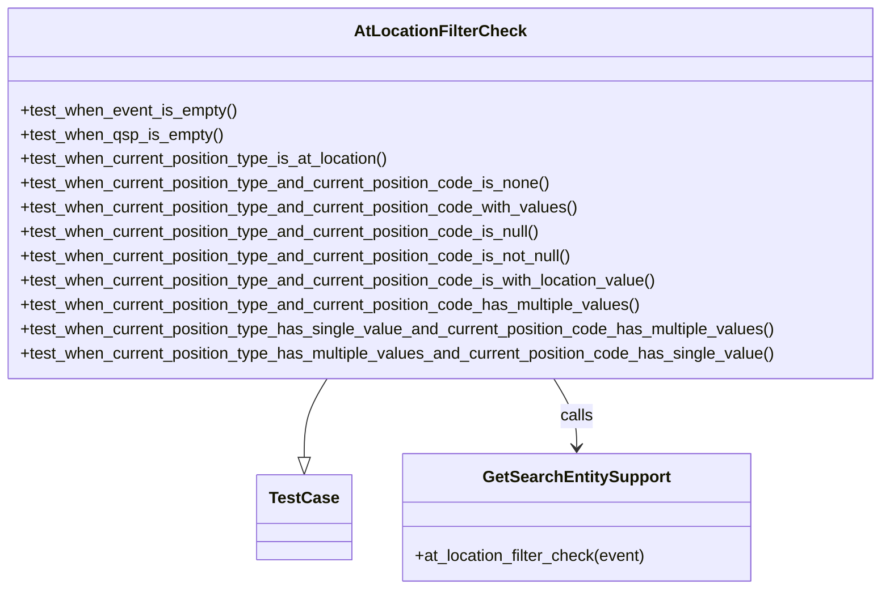

# Diagram: entity_core/entity_service/entity_service_tests/get_search_entity_tests/test_at_location_filter_check.py

> Auto-generated by Obscura crawlers

## Mermaid

### SVG

<svg id="container" width="874.9296875" xmlns="http://www.w3.org/2000/svg" class="classDiagram" height="582" viewBox="0 0 874.9296875 582" role="graphics-document document" aria-roledescription="class"><g><defs><marker id="container_class-aggregationStart" class="marker aggregation class" refX="18" refY="7" markerWidth="190" markerHeight="240" orient="auto"><path d="M 18,7 L9,13 L1,7 L9,1 Z"></path></marker></defs><defs><marker id="container_class-aggregationEnd" class="marker aggregation class" refX="1" refY="7" markerWidth="20" markerHeight="28" orient="auto"><path d="M 18,7 L9,13 L1,7 L9,1 Z"></path></marker></defs><defs><marker id="container_class-extensionStart" class="marker extension class" refX="18" refY="7" markerWidth="190" markerHeight="240" orient="auto"><path d="M 1,7 L18,13 V 1 Z"></path></marker></defs><defs><marker id="container_class-extensionEnd" class="marker extension class" refX="1" refY="7" markerWidth="20" markerHeight="28" orient="auto"><path d="M 1,1 V 13 L18,7 Z"></path></marker></defs><defs><marker id="container_class-compositionStart" class="marker composition class" refX="18" refY="7" markerWidth="190" markerHeight="240" orient="auto"><path d="M 18,7 L9,13 L1,7 L9,1 Z"></path></marker></defs><defs><marker id="container_class-compositionEnd" class="marker composition class" refX="1" refY="7" markerWidth="20" markerHeight="28" orient="auto"><path d="M 18,7 L9,13 L1,7 L9,1 Z"></path></marker></defs><defs><marker id="container_class-dependencyStart" class="marker dependency class" refX="6" refY="7" markerWidth="190" markerHeight="240" orient="auto"><path d="M 5,7 L9,13 L1,7 L9,1 Z"></path></marker></defs><defs><marker id="container_class-dependencyEnd" class="marker dependency class" refX="13" refY="7" markerWidth="20" markerHeight="28" orient="auto"><path d="M 18,7 L9,13 L14,7 L9,1 Z"></path></marker></defs><defs><marker id="container_class-lollipopStart" class="marker lollipop class" refX="13" refY="7" markerWidth="190" markerHeight="240" orient="auto"><circle stroke="black" fill="transparent" cx="7" cy="7" r="6"></circle></marker></defs><defs><marker id="container_class-lollipopEnd" class="marker lollipop class" refX="1" refY="7" markerWidth="190" markerHeight="240" orient="auto"><circle stroke="black" fill="transparent" cx="7" cy="7" r="6"></circle></marker></defs><g class="root"><g class="clusters"></g><g class="edgePaths"><path d="M326.848,374L323.12,380.167C319.393,386.333,311.937,398.667,308.21,411.625C304.482,424.583,304.482,438.167,304.482,444.958L304.482,451.75" id="id_AtLocationFilterCheck_TestCase_1" class="edge-thickness-normal edge-pattern-solid relation" style=";;;" data-edge="true" data-et="edge" data-id="id_AtLocationFilterCheck_TestCase_1" data-points="W3sieCI6MzI2Ljg0NzY0NzM3MjE1OTEsInkiOjM3NH0seyJ4IjozMDQuNDgyNDIxODc1LCJ5Ijo0MTF9LHsieCI6MzA0LjQ4MjQyMTg3NSwieSI6NDY5fV0=" marker-end="url(#container_class-extensionEnd)"></path><path d="M548.082,374L551.81,380.167C555.537,386.333,562.992,398.667,566.72,410C570.447,421.333,570.447,431.667,570.447,436.833L570.447,442" id="id_AtLocationFilterCheck_GetSearchEntitySupport_2" class="edge-thickness-normal edge-pattern-solid relation" style=";;;" data-edge="true" data-et="edge" data-id="id_AtLocationFilterCheck_GetSearchEntitySupport_2" data-points="W3sieCI6NTQ4LjA4MjA0MDEyNzg0MDksInkiOjM3NH0seyJ4Ijo1NzAuNDQ3MjY1NjI1LCJ5Ijo0MTF9LHsieCI6NTcwLjQ0NzI2NTYyNSwieSI6NDQ4fV0=" marker-end="url(#container_class-dependencyEnd)"></path></g><g class="edgeLabels"><g class="edgeLabel"><g class="label" data-id="id_AtLocationFilterCheck_TestCase_1" transform="translate(0, 0)"><foreignObject width="0" height="0">

</foreignObject></g></g><g class="edgeLabel" transform="translate(570.447265625, 411)"><g class="label" data-id="id_AtLocationFilterCheck_GetSearchEntitySupport_2" transform="translate(-16.4453125, -12)"><foreignObject width="32.890625" height="24">

calls

</foreignObject></g></g></g><g class="nodes"><g class="node default" id="classId-AtLocationFilterCheck-0" transform="translate(437.46484375, 191)"><g class="basic label-container"><path d="M-429.46484375 -183 L429.46484375 -183 L429.46484375 183 L-429.46484375 183" stroke="none" stroke-width="0" fill="#ECECFF" style=""></path><path d="M-429.46484375 -183 C-106.38831213109665 -183, 216.6882194878067 -183, 429.46484375 -183 M-429.46484375 -183 C-240.5000648437317 -183, -51.535285937463414 -183, 429.46484375 -183 M429.46484375 -183 C429.46484375 -59.817475704848235, 429.46484375 63.36504859030353, 429.46484375 183 M429.46484375 -183 C429.46484375 -81.00606887016353, 429.46484375 20.987862259672937, 429.46484375 183 M429.46484375 183 C124.5756673472348 183, -180.3135090555304 183, -429.46484375 183 M429.46484375 183 C144.24813264228493 183, -140.96857846543014 183, -429.46484375 183 M-429.46484375 183 C-429.46484375 45.65817864096391, -429.46484375 -91.68364271807218, -429.46484375 -183 M-429.46484375 183 C-429.46484375 50.06956789752249, -429.46484375 -82.86086420495502, -429.46484375 -183" stroke="#9370DB" stroke-width="1.3" fill="none" stroke-dasharray="0 0" style=""></path></g><g class="annotation-group text" transform="translate(0, -159)"></g><g class="label-group text" transform="translate(-79.8203125, -159)"><g class="label" style="font-weight: bolder" transform="translate(0,-12)"><foreignObject width="159.640625" height="24">

AtLocationFilterCheck

</foreignObject></g></g><g class="members-group text" transform="translate(-417.46484375, -111)"></g><g class="methods-group text" transform="translate(-417.46484375, -81)"><g class="label" style="" transform="translate(0,-12)"><foreignObject width="214.546875" height="24">

+test_when_event_is_empty()

</foreignObject></g><g class="label" style="" transform="translate(0,12)"><foreignObject width="200.4375" height="24">

+test_when_qsp_is_empty()

</foreignObject></g><g class="label" style="" transform="translate(0,36)"><foreignObject width="370.6875" height="24">

+test_when_current_position_type_is_at_location()

</foreignObject></g><g class="label" style="" transform="translate(0,60)"><foreignObject width="533.015625" height="24">

+test_when_current_position_type_and_current_position_code_is_none()

</foreignObject></g><g class="label" style="" transform="translate(0,84)"><foreignObject width="561.21875" height="24">

+test_when_current_position_type_and_current_position_code_with_values()

</foreignObject></g><g class="label" style="" transform="translate(0,108)"><foreignObject width="524.265625" height="24">

+test_when_current_position_type_and_current_position_code_is_null()

</foreignObject></g><g class="label" style="" transform="translate(0,132)"><foreignObject width="557.078125" height="24">

+test_when_current_position_type_and_current_position_code_is_not_null()

</foreignObject></g><g class="label" style="" transform="translate(0,156)"><foreignObject width="641.046875" height="24">

+test_when_current_position_type_and_current_position_code_is_with_location_value()

</foreignObject></g><g class="label" style="" transform="translate(0,180)"><foreignObject width="624.3125" height="24">

+test_when_current_position_type_and_current_position_code_has_multiple_values()

</foreignObject></g><g class="label" style="" transform="translate(0,204)"><foreignObject width="755.109375" height="24">

+test_when_current_position_type_has_single_value_and_current_position_code_has_multiple_values()

</foreignObject></g><g class="label" style="" transform="translate(0,228)"><foreignObject width="755.109375" height="24">

+test_when_current_position_type_has_multiple_values_and_current_position_code_has_single_value()

</foreignObject></g></g><g class="divider" style=""><path d="M-429.46484375 -135 C-252.72080112809246 -135, -75.97675850618492 -135, 429.46484375 -135 M-429.46484375 -135 C-164.0235707717436 -135, 101.41770220651279 -135, 429.46484375 -135" stroke="#9370DB" stroke-width="1.3" fill="none" stroke-dasharray="0 0" style=""></path></g><g class="divider" style=""><path d="M-429.46484375 -111 C-150.70967535127204 -111, 128.04549304745592 -111, 429.46484375 -111 M-429.46484375 -111 C-164.97825022824713 -111, 99.50834329350573 -111, 429.46484375 -111" stroke="#9370DB" stroke-width="1.3" fill="none" stroke-dasharray="0 0" style=""></path></g></g><g class="node default" id="classId-TestCase-1" transform="translate(304.482421875, 511)"><g class="basic label-container"><path d="M-44.359375 -42 L44.359375 -42 L44.359375 42 L-44.359375 42" stroke="none" stroke-width="0" fill="#ECECFF" style=""></path><path d="M-44.359375 -42 C-18.424152979600073 -42, 7.511069040799853 -42, 44.359375 -42 M-44.359375 -42 C-17.964299631341095 -42, 8.43077573731781 -42, 44.359375 -42 M44.359375 -42 C44.359375 -21.927523242012185, 44.359375 -1.8550464840243706, 44.359375 42 M44.359375 -42 C44.359375 -20.157137678148057, 44.359375 1.6857246437038853, 44.359375 42 M44.359375 42 C26.071394200809507 42, 7.783413401619015 42, -44.359375 42 M44.359375 42 C15.914267361192692 42, -12.530840277614615 42, -44.359375 42 M-44.359375 42 C-44.359375 12.386468681270216, -44.359375 -17.227062637459568, -44.359375 -42 M-44.359375 42 C-44.359375 10.574782552348072, -44.359375 -20.850434895303856, -44.359375 -42" stroke="#9370DB" stroke-width="1.3" fill="none" stroke-dasharray="0 0" style=""></path></g><g class="annotation-group text" transform="translate(0, -18)"></g><g class="label-group text" transform="translate(-32.359375, -18)"><g class="label" style="font-weight: bolder" transform="translate(0,-12)"><foreignObject width="64.71875" height="24">

TestCase

</foreignObject></g></g><g class="members-group text" transform="translate(-32.359375, 30)"></g><g class="methods-group text" transform="translate(-32.359375, 60)"></g><g class="divider" style=""><path d="M-44.359375 6 C-19.742136498072618 6, 4.875102003854764 6, 44.359375 6 M-44.359375 6 C-16.176510289377763 6, 12.006354421244474 6, 44.359375 6" stroke="#9370DB" stroke-width="1.3" fill="none" stroke-dasharray="0 0" style=""></path></g><g class="divider" style=""><path d="M-44.359375 24 C-15.089090467912314 24, 14.181194064175372 24, 44.359375 24 M-44.359375 24 C-21.50698354100163 24, 1.345407917996738 24, 44.359375 24" stroke="#9370DB" stroke-width="1.3" fill="none" stroke-dasharray="0 0" style=""></path></g></g><g class="node default" id="classId-GetSearchEntitySupport-2" transform="translate(570.447265625, 511)"><g class="basic label-container"><path d="M-171.60546875 -63 L171.60546875 -63 L171.60546875 63 L-171.60546875 63" stroke="none" stroke-width="0" fill="#ECECFF" style=""></path><path d="M-171.60546875 -63 C-44.355640449442376 -63, 82.89418785111525 -63, 171.60546875 -63 M-171.60546875 -63 C-64.06984896210126 -63, 43.46577082579748 -63, 171.60546875 -63 M171.60546875 -63 C171.60546875 -31.784239462716773, 171.60546875 -0.5684789254335456, 171.60546875 63 M171.60546875 -63 C171.60546875 -33.68868318228264, 171.60546875 -4.377366364565276, 171.60546875 63 M171.60546875 63 C56.34501483795336 63, -58.915439074093285 63, -171.60546875 63 M171.60546875 63 C62.544459147729086 63, -46.51655045454183 63, -171.60546875 63 M-171.60546875 63 C-171.60546875 20.167938729424925, -171.60546875 -22.66412254115015, -171.60546875 -63 M-171.60546875 63 C-171.60546875 16.552011913895562, -171.60546875 -29.895976172208876, -171.60546875 -63" stroke="#9370DB" stroke-width="1.3" fill="none" stroke-dasharray="0 0" style=""></path></g><g class="annotation-group text" transform="translate(0, -39)"></g><g class="label-group text" transform="translate(-88.3359375, -39)"><g class="label" style="font-weight: bolder" transform="translate(0,-12)"><foreignObject width="176.671875" height="24">

GetSearchEntitySupport

</foreignObject></g></g><g class="members-group text" transform="translate(-159.60546875, 9)"></g><g class="methods-group text" transform="translate(-159.60546875, 39)"><g class="label" style="" transform="translate(0,-12)"><foreignObject width="230.875" height="24">

+at_location_filter_check(event)

</foreignObject></g></g><g class="divider" style=""><path d="M-171.60546875 -15 C-100.9939549902454 -15, -30.382441230490798 -15, 171.60546875 -15 M-171.60546875 -15 C-57.40177088128985 -15, 56.8019269874203 -15, 171.60546875 -15" stroke="#9370DB" stroke-width="1.3" fill="none" stroke-dasharray="0 0" style=""></path></g><g class="divider" style=""><path d="M-171.60546875 9 C-35.768927355238844 9, 100.06761403952231 9, 171.60546875 9 M-171.60546875 9 C-46.994042465043705 9, 77.61738381991259 9, 171.60546875 9" stroke="#9370DB" stroke-width="1.3" fill="none" stroke-dasharray="0 0" style=""></path></g></g></g></g></g></svg>
