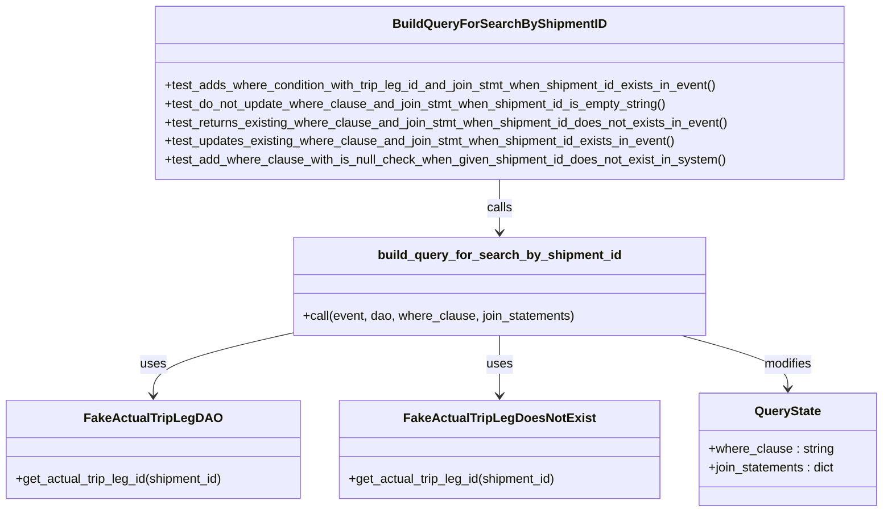
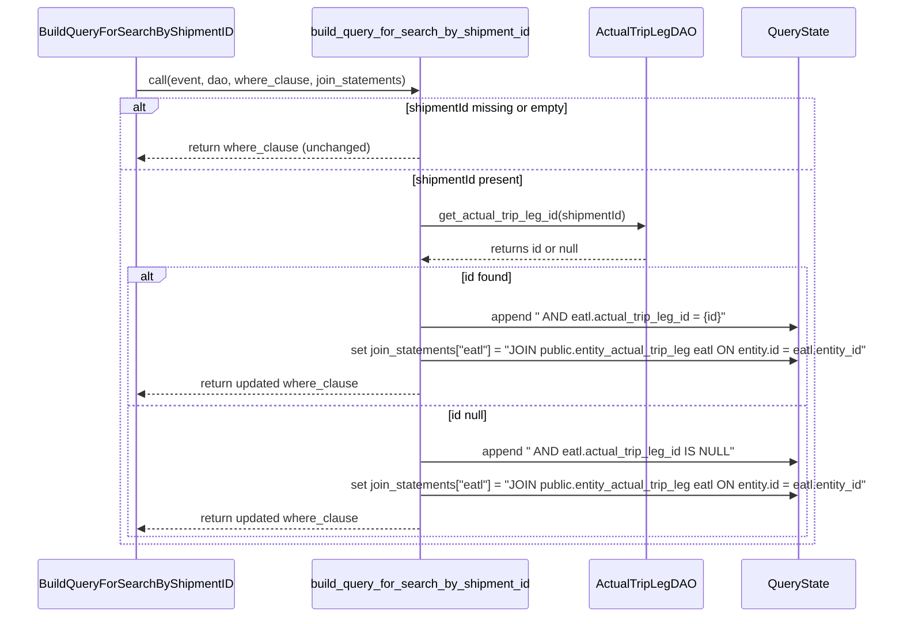

# Diagram: entity_core/entity_service/entity_service_tests/get_search_entity_tests/test_build_query_for_search_by_shipment_id.py

> Auto-generated by Obscura crawlers

## Diagram 1

### SVG

<svg id="container" width="1131.7265625" xmlns="http://www.w3.org/2000/svg" class="classDiagram" height="656" viewBox="0 0 1131.7265625 656" role="graphics-document document" aria-roledescription="class"><g><defs><marker id="container_class-aggregationStart" class="marker aggregation class" refX="18" refY="7" markerWidth="190" markerHeight="240" orient="auto"><path d="M 18,7 L9,13 L1,7 L9,1 Z"></path></marker></defs><defs><marker id="container_class-aggregationEnd" class="marker aggregation class" refX="1" refY="7" markerWidth="20" markerHeight="28" orient="auto"><path d="M 18,7 L9,13 L1,7 L9,1 Z"></path></marker></defs><defs><marker id="container_class-extensionStart" class="marker extension class" refX="18" refY="7" markerWidth="190" markerHeight="240" orient="auto"><path d="M 1,7 L18,13 V 1 Z"></path></marker></defs><defs><marker id="container_class-extensionEnd" class="marker extension class" refX="1" refY="7" markerWidth="20" markerHeight="28" orient="auto"><path d="M 1,1 V 13 L18,7 Z"></path></marker></defs><defs><marker id="container_class-compositionStart" class="marker composition class" refX="18" refY="7" markerWidth="190" markerHeight="240" orient="auto"><path d="M 18,7 L9,13 L1,7 L9,1 Z"></path></marker></defs><defs><marker id="container_class-compositionEnd" class="marker composition class" refX="1" refY="7" markerWidth="20" markerHeight="28" orient="auto"><path d="M 18,7 L9,13 L1,7 L9,1 Z"></path></marker></defs><defs><marker id="container_class-dependencyStart" class="marker dependency class" refX="6" refY="7" markerWidth="190" markerHeight="240" orient="auto"><path d="M 5,7 L9,13 L1,7 L9,1 Z"></path></marker></defs><defs><marker id="container_class-dependencyEnd" class="marker dependency class" refX="13" refY="7" markerWidth="20" markerHeight="28" orient="auto"><path d="M 18,7 L9,13 L14,7 L9,1 Z"></path></marker></defs><defs><marker id="container_class-lollipopStart" class="marker lollipop class" refX="13" refY="7" markerWidth="190" markerHeight="240" orient="auto"><circle stroke="black" fill="transparent" cx="7" cy="7" r="6"></circle></marker></defs><defs><marker id="container_class-lollipopEnd" class="marker lollipop class" refX="1" refY="7" markerWidth="190" markerHeight="240" orient="auto"><circle stroke="black" fill="transparent" cx="7" cy="7" r="6"></circle></marker></defs><g class="root"><g class="clusters"></g><g class="edgePaths"><path d="M638.918,230L638.918,236.167C638.918,242.333,638.918,254.667,638.918,266C638.918,277.333,638.918,287.667,638.918,292.833L638.918,298" id="id_BuildQueryForSearchByShipmentID_build_query_for_search_by_shipment_id_1" class="edge-thickness-normal edge-pattern-solid relation" style=";;;" data-edge="true" data-et="edge" data-id="id_BuildQueryForSearchByShipmentID_build_query_for_search_by_shipment_id_1" data-points="W3sieCI6NjM4LjkxNzk2ODc1LCJ5IjoyMzB9LHsieCI6NjM4LjkxNzk2ODc1LCJ5IjoyNjd9LHsieCI6NjM4LjkxNzk2ODc1LCJ5IjozMDR9XQ==" marker-end="url(#container_class-dependencyEnd)"></path><path d="M377.227,426.092L347.033,432.91C316.84,439.728,256.453,453.364,226.26,466.849C196.066,480.333,196.066,493.667,196.066,500.333L196.066,507" id="id_build_query_for_search_by_shipment_id_FakeActualTripLegDAO_2" class="edge-thickness-normal edge-pattern-solid relation" style=";;;" data-edge="true" data-et="edge" data-id="id_build_query_for_search_by_shipment_id_FakeActualTripLegDAO_2" data-points="W3sieCI6Mzc3LjIyNjU2MjUsInkiOjQyNi4wOTIzNTI0NzQxOTk1fSx7IngiOjE5Ni4wNjY0MDYyNSwieSI6NDY3fSx7IngiOjE5Ni4wNjY0MDYyNSwieSI6NTEzfV0=" marker-end="url(#container_class-dependencyEnd)"></path><path d="M638.918,430L638.918,436.167C638.918,442.333,638.918,454.667,638.918,467.5C638.918,480.333,638.918,493.667,638.918,500.333L638.918,507" id="id_build_query_for_search_by_shipment_id_FakeActualTripLegDoesNotExist_3" class="edge-thickness-normal edge-pattern-solid relation" style=";;;" data-edge="true" data-et="edge" data-id="id_build_query_for_search_by_shipment_id_FakeActualTripLegDoesNotExist_3" data-points="W3sieCI6NjM4LjkxNzk2ODc1LCJ5Ijo0MzB9LHsieCI6NjM4LjkxNzk2ODc1LCJ5Ijo0Njd9LHsieCI6NjM4LjkxNzk2ODc1LCJ5Ijo1MTN9XQ==" marker-end="url(#container_class-dependencyEnd)"></path><path d="M871.89,430L894.694,436.167C917.498,442.333,963.107,454.667,985.911,466C1008.715,477.333,1008.715,487.667,1008.715,492.833L1008.715,498" id="id_build_query_for_search_by_shipment_id_QueryState_4" class="edge-thickness-normal edge-pattern-solid relation" style=";;;" data-edge="true" data-et="edge" data-id="id_build_query_for_search_by_shipment_id_QueryState_4" data-points="W3sieCI6ODcxLjg5LCJ5Ijo0MzB9LHsieCI6MTAwOC43MTQ4NDM3NSwieSI6NDY3fSx7IngiOjEwMDguNzE0ODQzNzUsInkiOjUwNH1d" marker-end="url(#container_class-dependencyEnd)"></path></g><g class="edgeLabels"><g class="edgeLabel" transform="translate(638.91796875, 267)"><g class="label" data-id="id_BuildQueryForSearchByShipmentID_build_query_for_search_by_shipment_id_1" transform="translate(-16.4453125, -12)"><foreignObject width="32.890625" height="24">

calls

</foreignObject></g></g><g class="edgeLabel" transform="translate(196.06640625, 467)"><g class="label" data-id="id_build_query_for_search_by_shipment_id_FakeActualTripLegDAO_2" transform="translate(-16.4921875, -12)"><foreignObject width="32.984375" height="24">

uses

</foreignObject></g></g><g class="edgeLabel" transform="translate(638.91796875, 467)"><g class="label" data-id="id_build_query_for_search_by_shipment_id_FakeActualTripLegDoesNotExist_3" transform="translate(-16.4921875, -12)"><foreignObject width="32.984375" height="24">

uses

</foreignObject></g></g><g class="edgeLabel" transform="translate(1008.71484375, 467)"><g class="label" data-id="id_build_query_for_search_by_shipment_id_QueryState_4" transform="translate(-31.265625, -12)"><foreignObject width="62.53125" height="24">

modifies

</foreignObject></g></g></g><g class="nodes"><g class="node default" id="classId-BuildQueryForSearchByShipmentID-0" transform="translate(638.91796875, 119)"><g class="basic label-container"><path d="M-442.015625 -111 L442.015625 -111 L442.015625 111 L-442.015625 111" stroke="none" stroke-width="0" fill="#ECECFF" style=""></path><path d="M-442.015625 -111 C-260.5465871234699 -111, -79.07754924693984 -111, 442.015625 -111 M-442.015625 -111 C-127.29356488276142 -111, 187.42849523447717 -111, 442.015625 -111 M442.015625 -111 C442.015625 -32.777387504326285, 442.015625 45.44522499134743, 442.015625 111 M442.015625 -111 C442.015625 -27.456205531804798, 442.015625 56.087588936390404, 442.015625 111 M442.015625 111 C115.97259432753174 111, -210.07043634493652 111, -442.015625 111 M442.015625 111 C102.11101261552358 111, -237.79359976895284 111, -442.015625 111 M-442.015625 111 C-442.015625 62.38377331176937, -442.015625 13.767546623538735, -442.015625 -111 M-442.015625 111 C-442.015625 37.445831466282485, -442.015625 -36.10833706743503, -442.015625 -111" stroke="#9370DB" stroke-width="1.3" fill="none" stroke-dasharray="0 0" style=""></path></g><g class="annotation-group text" transform="translate(0, -87)"></g><g class="label-group text" transform="translate(-128.71875, -87)"><g class="label" style="font-weight: bolder" transform="translate(0,-12)"><foreignObject width="257.4375" height="24">

BuildQueryForSearchByShipmentID

</foreignObject></g></g><g class="members-group text" transform="translate(-430.015625, -39)"></g><g class="methods-group text" transform="translate(-430.015625, -9)"><g class="label" style="" transform="translate(0,-12)"><foreignObject width="721.84375" height="24">

+test_adds_where_condition_with_trip_leg_id_and_join_stmt_when_shipment_id_exists_in_event()

</foreignObject></g><g class="label" style="" transform="translate(0,12)"><foreignObject width="652.40625" height="24">

+test_do_not_update_where_clause_and_join_stmt_when_shipment_id_is_empty_string()

</foreignObject></g><g class="label" style="" transform="translate(0,36)"><foreignObject width="731.3125" height="24">

+test_returns_existing_where_clause_and_join_stmt_when_shipment_id_does_not_exists_in_event()

</foreignObject></g><g class="label" style="" transform="translate(0,60)"><foreignObject width="661.671875" height="24">

+test_updates_existing_where_clause_and_join_stmt_when_shipment_id_exists_in_event()

</foreignObject></g><g class="label" style="" transform="translate(0,84)"><foreignObject width="724.453125" height="24">

+test_add_where_clause_with_is_null_check_when_given_shipment_id_does_not_exist_in_system()

</foreignObject></g></g><g class="divider" style=""><path d="M-442.015625 -63 C-219.31524234022618 -63, 3.385140319547645 -63, 442.015625 -63 M-442.015625 -63 C-206.02283372370408 -63, 29.969957552591836 -63, 442.015625 -63" stroke="#9370DB" stroke-width="1.3" fill="none" stroke-dasharray="0 0" style=""></path></g><g class="divider" style=""><path d="M-442.015625 -39 C-136.73680422913822 -39, 168.54201654172357 -39, 442.015625 -39 M-442.015625 -39 C-189.4412215153039 -39, 63.13318196939218 -39, 442.015625 -39" stroke="#9370DB" stroke-width="1.3" fill="none" stroke-dasharray="0 0" style=""></path></g></g><g class="node default" id="classId-FakeActualTripLegDAO-1" transform="translate(196.06640625, 576)"><g class="basic label-container"><path d="M-188.06640625 -63 L188.06640625 -63 L188.06640625 63 L-188.06640625 63" stroke="none" stroke-width="0" fill="#ECECFF" style=""></path><path d="M-188.06640625 -63 C-76.16069464662613 -63, 35.74501695674775 -63, 188.06640625 -63 M-188.06640625 -63 C-111.37381487600483 -63, -34.68122350200966 -63, 188.06640625 -63 M188.06640625 -63 C188.06640625 -21.637939314310763, 188.06640625 19.724121371378473, 188.06640625 63 M188.06640625 -63 C188.06640625 -35.169530155845905, 188.06640625 -7.339060311691817, 188.06640625 63 M188.06640625 63 C46.438198405958815 63, -95.19000943808237 63, -188.06640625 63 M188.06640625 63 C110.83325137300528 63, 33.600096496010565 63, -188.06640625 63 M-188.06640625 63 C-188.06640625 28.834248705455465, -188.06640625 -5.3315025890890695, -188.06640625 -63 M-188.06640625 63 C-188.06640625 35.146648571618016, -188.06640625 7.293297143236032, -188.06640625 -63" stroke="#9370DB" stroke-width="1.3" fill="none" stroke-dasharray="0 0" style=""></path></g><g class="annotation-group text" transform="translate(0, -39)"></g><g class="label-group text" transform="translate(-81.7734375, -39)"><g class="label" style="font-weight: bolder" transform="translate(0,-12)"><foreignObject width="163.546875" height="24">

FakeActualTripLegDAO

</foreignObject></g></g><g class="members-group text" transform="translate(-176.06640625, 9)"></g><g class="methods-group text" transform="translate(-176.06640625, 39)"><g class="label" style="" transform="translate(0,-12)"><foreignObject width="270.359375" height="24">

+get_actual_trip_leg_id(shipment_id)

</foreignObject></g></g><g class="divider" style=""><path d="M-188.06640625 -15 C-54.2496073626142 -15, 79.5671915247716 -15, 188.06640625 -15 M-188.06640625 -15 C-70.46536393550811 -15, 47.13567837898378 -15, 188.06640625 -15" stroke="#9370DB" stroke-width="1.3" fill="none" stroke-dasharray="0 0" style=""></path></g><g class="divider" style=""><path d="M-188.06640625 9 C-106.98132633335894 9, -25.896246416717872 9, 188.06640625 9 M-188.06640625 9 C-99.88843211906405 9, -11.710457988128098 9, 188.06640625 9" stroke="#9370DB" stroke-width="1.3" fill="none" stroke-dasharray="0 0" style=""></path></g></g><g class="node default" id="classId-FakeActualTripLegDoesNotExist-2" transform="translate(638.91796875, 576)"><g class="basic label-container"><path d="M-204.78515625 -63 L204.78515625 -63 L204.78515625 63 L-204.78515625 63" stroke="none" stroke-width="0" fill="#ECECFF" style=""></path><path d="M-204.78515625 -63 C-122.14021000102032 -63, -39.49526375204064 -63, 204.78515625 -63 M-204.78515625 -63 C-57.50332129605462 -63, 89.77851365789076 -63, 204.78515625 -63 M204.78515625 -63 C204.78515625 -27.65947904467547, 204.78515625 7.681041910649057, 204.78515625 63 M204.78515625 -63 C204.78515625 -20.78487914005138, 204.78515625 21.43024171989724, 204.78515625 63 M204.78515625 63 C98.91753265258683 63, -6.950090944826343 63, -204.78515625 63 M204.78515625 63 C96.05582509495018 63, -12.67350606009964 63, -204.78515625 63 M-204.78515625 63 C-204.78515625 26.848409128533284, -204.78515625 -9.303181742933432, -204.78515625 -63 M-204.78515625 63 C-204.78515625 33.49896837450018, -204.78515625 3.9979367490003526, -204.78515625 -63" stroke="#9370DB" stroke-width="1.3" fill="none" stroke-dasharray="0 0" style=""></path></g><g class="annotation-group text" transform="translate(0, -39)"></g><g class="label-group text" transform="translate(-115.2109375, -39)"><g class="label" style="font-weight: bolder" transform="translate(0,-12)"><foreignObject width="230.421875" height="24">

FakeActualTripLegDoesNotExist

</foreignObject></g></g><g class="members-group text" transform="translate(-192.78515625, 9)"></g><g class="methods-group text" transform="translate(-192.78515625, 39)"><g class="label" style="" transform="translate(0,-12)"><foreignObject width="270.359375" height="24">

+get_actual_trip_leg_id(shipment_id)

</foreignObject></g></g><g class="divider" style=""><path d="M-204.78515625 -15 C-105.08896882618038 -15, -5.392781402360754 -15, 204.78515625 -15 M-204.78515625 -15 C-118.96390083948353 -15, -33.14264542896706 -15, 204.78515625 -15" stroke="#9370DB" stroke-width="1.3" fill="none" stroke-dasharray="0 0" style=""></path></g><g class="divider" style=""><path d="M-204.78515625 9 C-93.41710430436181 9, 17.95094764127637 9, 204.78515625 9 M-204.78515625 9 C-44.08307863814338 9, 116.61899897371325 9, 204.78515625 9" stroke="#9370DB" stroke-width="1.3" fill="none" stroke-dasharray="0 0" style=""></path></g></g><g class="node default" id="classId-build_query_for_search_by_shipment_id-3" transform="translate(638.91796875, 367)"><g class="basic label-container"><path d="M-261.69140625 -63 L261.69140625 -63 L261.69140625 63 L-261.69140625 63" stroke="none" stroke-width="0" fill="#ECECFF" style=""></path><path d="M-261.69140625 -63 C-70.250792341964 -63, 121.189821566072 -63, 261.69140625 -63 M-261.69140625 -63 C-124.76178524305087 -63, 12.167835763898267 -63, 261.69140625 -63 M261.69140625 -63 C261.69140625 -14.616046569035142, 261.69140625 33.76790686192972, 261.69140625 63 M261.69140625 -63 C261.69140625 -37.0692063884683, 261.69140625 -11.138412776936605, 261.69140625 63 M261.69140625 63 C54.12745937772982 63, -153.43648749454036 63, -261.69140625 63 M261.69140625 63 C140.27374184852653 63, 18.856077447053025 63, -261.69140625 63 M-261.69140625 63 C-261.69140625 17.339660539015362, -261.69140625 -28.320678921969275, -261.69140625 -63 M-261.69140625 63 C-261.69140625 34.397156922361106, -261.69140625 5.794313844722218, -261.69140625 -63" stroke="#9370DB" stroke-width="1.3" fill="none" stroke-dasharray="0 0" style=""></path></g><g class="annotation-group text" transform="translate(0, -39)"></g><g class="label-group text" transform="translate(-148.3671875, -39)"><g class="label" style="font-weight: bolder" transform="translate(0,-12)"><foreignObject width="296.734375" height="24">

build_query_for_search_by_shipment_id

</foreignObject></g></g><g class="members-group text" transform="translate(-249.69140625, 9)"></g><g class="methods-group text" transform="translate(-249.69140625, 39)"><g class="label" style="" transform="translate(0,-12)"><foreignObject width="351.015625" height="24">

+call(event, dao, where_clause, join_statements)

</foreignObject></g></g><g class="divider" style=""><path d="M-261.69140625 -15 C-76.49044665007816 -15, 108.71051294984369 -15, 261.69140625 -15 M-261.69140625 -15 C-123.63541803889945 -15, 14.42057017220111 -15, 261.69140625 -15" stroke="#9370DB" stroke-width="1.3" fill="none" stroke-dasharray="0 0" style=""></path></g><g class="divider" style=""><path d="M-261.69140625 9 C-58.33315580387563 9, 145.02509464224875 9, 261.69140625 9 M-261.69140625 9 C-78.48491751611377 9, 104.72157121777246 9, 261.69140625 9" stroke="#9370DB" stroke-width="1.3" fill="none" stroke-dasharray="0 0" style=""></path></g></g><g class="node default" id="classId-QueryState-4" transform="translate(1008.71484375, 576)"><g class="basic label-container"><path d="M-115.01171875 -72 L115.01171875 -72 L115.01171875 72 L-115.01171875 72" stroke="none" stroke-width="0" fill="#ECECFF" style=""></path><path d="M-115.01171875 -72 C-38.42398271951869 -72, 38.16375331096262 -72, 115.01171875 -72 M-115.01171875 -72 C-49.873201976911176 -72, 15.265314796177648 -72, 115.01171875 -72 M115.01171875 -72 C115.01171875 -24.298991581618793, 115.01171875 23.402016836762414, 115.01171875 72 M115.01171875 -72 C115.01171875 -29.45626452114322, 115.01171875 13.087470957713563, 115.01171875 72 M115.01171875 72 C56.25353978047596 72, -2.5046391890480777 72, -115.01171875 72 M115.01171875 72 C28.843866851802503 72, -57.323985046394995 72, -115.01171875 72 M-115.01171875 72 C-115.01171875 31.545465674200166, -115.01171875 -8.909068651599668, -115.01171875 -72 M-115.01171875 72 C-115.01171875 39.36301465767386, -115.01171875 6.726029315347716, -115.01171875 -72" stroke="#9370DB" stroke-width="1.3" fill="none" stroke-dasharray="0 0" style=""></path></g><g class="annotation-group text" transform="translate(0, -48)"></g><g class="label-group text" transform="translate(-41.1796875, -48)"><g class="label" style="font-weight: bolder" transform="translate(0,-12)"><foreignObject width="82.359375" height="24">

QueryState

</foreignObject></g></g><g class="members-group text" transform="translate(-103.01171875, 0)"><g class="label" style="" transform="translate(0,-12)"><foreignObject width="160.078125" height="24">

+where_clause : string

</foreignObject></g><g class="label" style="" transform="translate(0,12)"><foreignObject width="164.84375" height="24">

+join_statements : dict

</foreignObject></g></g><g class="methods-group text" transform="translate(-103.01171875, 72)"></g><g class="divider" style=""><path d="M-115.01171875 -24 C-48.692003542193504 -24, 17.627711665612992 -24, 115.01171875 -24 M-115.01171875 -24 C-23.300453528590523 -24, 68.41081169281895 -24, 115.01171875 -24" stroke="#9370DB" stroke-width="1.3" fill="none" stroke-dasharray="0 0" style=""></path></g><g class="divider" style=""><path d="M-115.01171875 48 C-64.89469539425727 48, -14.777672038514538 48, 115.01171875 48 M-115.01171875 48 C-50.570001898088336 48, 13.871714953823329 48, 115.01171875 48" stroke="#9370DB" stroke-width="1.3" fill="none" stroke-dasharray="0 0" style=""></path></g></g></g></g></g></svg>

## Diagram 2

### SVG

<svg id="container" width="1249.5" xmlns="http://www.w3.org/2000/svg" height="851" viewBox="-50 -10 1249.5 851" role="graphics-document document" aria-roledescription="sequence"><g><rect x="999.5" y="765" fill="#eaeaea" stroke="#666" width="150" height="65" name="State" rx="3" ry="3" class="actor actor-bottom"></rect><text x="1074.5" y="797.5" dominant-baseline="central" alignment-baseline="central" class="actor actor-box" style="text-anchor: middle; font-size: 16px; font-weight: 400;"><tspan x="1074.5" dy="0">QueryState</tspan></text></g><g><rect x="799.5" y="765" fill="#eaeaea" stroke="#666" width="150" height="65" name="DAO" rx="3" ry="3" class="actor actor-bottom"></rect><text x="874.5" y="797.5" dominant-baseline="central" alignment-baseline="central" class="actor actor-box" style="text-anchor: middle; font-size: 16px; font-weight: 400;"><tspan x="874.5" dy="0">ActualTripLegDAO</tspan></text></g><g><rect x="393.5" y="765" fill="#eaeaea" stroke="#666" width="314" height="65" name="Builder" rx="3" ry="3" class="actor actor-bottom"></rect><text x="550.5" y="797.5" dominant-baseline="central" alignment-baseline="central" class="actor actor-box" style="text-anchor: middle; font-size: 16px; font-weight: 400;"><tspan x="550.5" dy="0">build_query_for_search_by_shipment_id</tspan></text></g><g><rect x="0" y="765" fill="#eaeaea" stroke="#666" width="275" height="65" name="Test" rx="3" ry="3" class="actor actor-bottom"></rect><text x="137.5" y="797.5" dominant-baseline="central" alignment-baseline="central" class="actor actor-box" style="text-anchor: middle; font-size: 16px; font-weight: 400;"><tspan x="137.5" dy="0">BuildQueryForSearchByShipmentID</tspan></text></g><g><line id="actor3" x1="1074.5" y1="65" x2="1074.5" y2="765" class="actor-line 200" stroke-width="0.5px" stroke="#999" name="State"></line><g id="root-3"><rect x="999.5" y="0" fill="#eaeaea" stroke="#666" width="150" height="65" name="State" rx="3" ry="3" class="actor actor-top"></rect><text x="1074.5" y="32.5" dominant-baseline="central" alignment-baseline="central" class="actor actor-box" style="text-anchor: middle; font-size: 16px; font-weight: 400;"><tspan x="1074.5" dy="0">QueryState</tspan></text></g></g><g><line id="actor2" x1="874.5" y1="65" x2="874.5" y2="765" class="actor-line 200" stroke-width="0.5px" stroke="#999" name="DAO"></line><g id="root-2"><rect x="799.5" y="0" fill="#eaeaea" stroke="#666" width="150" height="65" name="DAO" rx="3" ry="3" class="actor actor-top"></rect><text x="874.5" y="32.5" dominant-baseline="central" alignment-baseline="central" class="actor actor-box" style="text-anchor: middle; font-size: 16px; font-weight: 400;"><tspan x="874.5" dy="0">ActualTripLegDAO</tspan></text></g></g><g><line id="actor1" x1="550.5" y1="65" x2="550.5" y2="765" class="actor-line 200" stroke-width="0.5px" stroke="#999" name="Builder"></line><g id="root-1"><rect x="393.5" y="0" fill="#eaeaea" stroke="#666" width="314" height="65" name="Builder" rx="3" ry="3" class="actor actor-top"></rect><text x="550.5" y="32.5" dominant-baseline="central" alignment-baseline="central" class="actor actor-box" style="text-anchor: middle; font-size: 16px; font-weight: 400;"><tspan x="550.5" dy="0">build_query_for_search_by_shipment_id</tspan></text></g></g><g><line id="actor0" x1="137.5" y1="65" x2="137.5" y2="765" class="actor-line 200" stroke-width="0.5px" stroke="#999" name="Test"></line><g id="root-0"><rect x="0" y="0" fill="#eaeaea" stroke="#666" width="275" height="65" name="Test" rx="3" ry="3" class="actor actor-top"></rect><text x="137.5" y="32.5" dominant-baseline="central" alignment-baseline="central" class="actor actor-box" style="text-anchor: middle; font-size: 16px; font-weight: 400;"><tspan x="137.5" dy="0">BuildQueryForSearchByShipmentID</tspan></text></g></g><g></g><defs><symbol id="computer" width="24" height="24"><path transform="scale(.5)" d="M2 2v13h20v-13h-20zm18 11h-16v-9h16v9zm-10.228 6l.466-1h3.524l.467 1h-4.457zm14.228 3h-24l2-6h2.104l-1.33 4h18.45l-1.297-4h2.073l2 6zm-5-10h-14v-7h14v7z"></path></symbol></defs><defs><symbol id="database" fill-rule="evenodd" clip-rule="evenodd"><path transform="scale(.5)" d="M12.258.001l.256.004.255.005.253.008.251.01.249.012.247.015.246.016.242.019.241.02.239.023.236.024.233.027.231.028.229.031.225.032.223.034.22.036.217.038.214.04.211.041.208.043.205.045.201.046.198.048.194.05.191.051.187.053.183.054.18.056.175.057.172.059.168.06.163.061.16.063.155.064.15.066.074.033.073.033.071.034.07.034.069.035.068.035.067.035.066.035.064.036.064.036.062.036.06.036.06.037.058.037.058.037.055.038.055.038.053.038.052.038.051.039.05.039.048.039.047.039.045.04.044.04.043.04.041.04.04.041.039.041.037.041.036.041.034.041.033.042.032.042.03.042.029.042.027.042.026.043.024.043.023.043.021.043.02.043.018.044.017.043.015.044.013.044.012.044.011.045.009.044.007.045.006.045.004.045.002.045.001.045v17l-.001.045-.002.045-.004.045-.006.045-.007.045-.009.044-.011.045-.012.044-.013.044-.015.044-.017.043-.018.044-.02.043-.021.043-.023.043-.024.043-.026.043-.027.042-.029.042-.03.042-.032.042-.033.042-.034.041-.036.041-.037.041-.039.041-.04.041-.041.04-.043.04-.044.04-.045.04-.047.039-.048.039-.05.039-.051.039-.052.038-.053.038-.055.038-.055.038-.058.037-.058.037-.06.037-.06.036-.062.036-.064.036-.064.036-.066.035-.067.035-.068.035-.069.035-.07.034-.071.034-.073.033-.074.033-.15.066-.155.064-.16.063-.163.061-.168.06-.172.059-.175.057-.18.056-.183.054-.187.053-.191.051-.194.05-.198.048-.201.046-.205.045-.208.043-.211.041-.214.04-.217.038-.22.036-.223.034-.225.032-.229.031-.231.028-.233.027-.236.024-.239.023-.241.02-.242.019-.246.016-.247.015-.249.012-.251.01-.253.008-.255.005-.256.004-.258.001-.258-.001-.256-.004-.255-.005-.253-.008-.251-.01-.249-.012-.247-.015-.245-.016-.243-.019-.241-.02-.238-.023-.236-.024-.234-.027-.231-.028-.228-.031-.226-.032-.223-.034-.22-.036-.217-.038-.214-.04-.211-.041-.208-.043-.204-.045-.201-.046-.198-.048-.195-.05-.19-.051-.187-.053-.184-.054-.179-.056-.176-.057-.172-.059-.167-.06-.164-.061-.159-.063-.155-.064-.151-.066-.074-.033-.072-.033-.072-.034-.07-.034-.069-.035-.068-.035-.067-.035-.066-.035-.064-.036-.063-.036-.062-.036-.061-.036-.06-.037-.058-.037-.057-.037-.056-.038-.055-.038-.053-.038-.052-.038-.051-.039-.049-.039-.049-.039-.046-.039-.046-.04-.044-.04-.043-.04-.041-.04-.04-.041-.039-.041-.037-.041-.036-.041-.034-.041-.033-.042-.032-.042-.03-.042-.029-.042-.027-.042-.026-.043-.024-.043-.023-.043-.021-.043-.02-.043-.018-.044-.017-.043-.015-.044-.013-.044-.012-.044-.011-.045-.009-.044-.007-.045-.006-.045-.004-.045-.002-.045-.001-.045v-17l.001-.045.002-.045.004-.045.006-.045.007-.045.009-.044.011-.045.012-.044.013-.044.015-.044.017-.043.018-.044.02-.043.021-.043.023-.043.024-.043.026-.043.027-.042.029-.042.03-.042.032-.042.033-.042.034-.041.036-.041.037-.041.039-.041.04-.041.041-.04.043-.04.044-.04.046-.04.046-.039.049-.039.049-.039.051-.039.052-.038.053-.038.055-.038.056-.038.057-.037.058-.037.06-.037.061-.036.062-.036.063-.036.064-.036.066-.035.067-.035.068-.035.069-.035.07-.034.072-.034.072-.033.074-.033.151-.066.155-.064.159-.063.164-.061.167-.06.172-.059.176-.057.179-.056.184-.054.187-.053.19-.051.195-.05.198-.048.201-.046.204-.045.208-.043.211-.041.214-.04.217-.038.22-.036.223-.034.226-.032.228-.031.231-.028.234-.027.236-.024.238-.023.241-.02.243-.019.245-.016.247-.015.249-.012.251-.01.253-.008.255-.005.256-.004.258-.001.258.001zm-9.258 20.499v.01l.001.021.003.021.004.022.005.021.006.022.007.022.009.023.01.022.011.023.012.023.013.023.015.023.016.024.017.023.018.024.019.024.021.024.022.025.023.024.024.025.052.049.056.05.061.051.066.051.07.051.075.051.079.052.084.052.088.052.092.052.097.052.102.051.105.052.11.052.114.051.119.051.123.051.127.05.131.05.135.05.139.048.144.049.147.047.152.047.155.047.16.045.163.045.167.043.171.043.176.041.178.041.183.039.187.039.19.037.194.035.197.035.202.033.204.031.209.03.212.029.216.027.219.025.222.024.226.021.23.02.233.018.236.016.24.015.243.012.246.01.249.008.253.005.256.004.259.001.26-.001.257-.004.254-.005.25-.008.247-.011.244-.012.241-.014.237-.016.233-.018.231-.021.226-.021.224-.024.22-.026.216-.027.212-.028.21-.031.205-.031.202-.034.198-.034.194-.036.191-.037.187-.039.183-.04.179-.04.175-.042.172-.043.168-.044.163-.045.16-.046.155-.046.152-.047.148-.048.143-.049.139-.049.136-.05.131-.05.126-.05.123-.051.118-.052.114-.051.11-.052.106-.052.101-.052.096-.052.092-.052.088-.053.083-.051.079-.052.074-.052.07-.051.065-.051.06-.051.056-.05.051-.05.023-.024.023-.025.021-.024.02-.024.019-.024.018-.024.017-.024.015-.023.014-.024.013-.023.012-.023.01-.023.01-.022.008-.022.006-.022.006-.022.004-.022.004-.021.001-.021.001-.021v-4.127l-.077.055-.08.053-.083.054-.085.053-.087.052-.09.052-.093.051-.095.05-.097.05-.1.049-.102.049-.105.048-.106.047-.109.047-.111.046-.114.045-.115.045-.118.044-.12.043-.122.042-.124.042-.126.041-.128.04-.13.04-.132.038-.134.038-.135.037-.138.037-.139.035-.142.035-.143.034-.144.033-.147.032-.148.031-.15.03-.151.03-.153.029-.154.027-.156.027-.158.026-.159.025-.161.024-.162.023-.163.022-.165.021-.166.02-.167.019-.169.018-.169.017-.171.016-.173.015-.173.014-.175.013-.175.012-.177.011-.178.01-.179.008-.179.008-.181.006-.182.005-.182.004-.184.003-.184.002h-.37l-.184-.002-.184-.003-.182-.004-.182-.005-.181-.006-.179-.008-.179-.008-.178-.01-.176-.011-.176-.012-.175-.013-.173-.014-.172-.015-.171-.016-.17-.017-.169-.018-.167-.019-.166-.02-.165-.021-.163-.022-.162-.023-.161-.024-.159-.025-.157-.026-.156-.027-.155-.027-.153-.029-.151-.03-.15-.03-.148-.031-.146-.032-.145-.033-.143-.034-.141-.035-.14-.035-.137-.037-.136-.037-.134-.038-.132-.038-.13-.04-.128-.04-.126-.041-.124-.042-.122-.042-.12-.044-.117-.043-.116-.045-.113-.045-.112-.046-.109-.047-.106-.047-.105-.048-.102-.049-.1-.049-.097-.05-.095-.05-.093-.052-.09-.051-.087-.052-.085-.053-.083-.054-.08-.054-.077-.054v4.127zm0-5.654v.011l.001.021.003.021.004.021.005.022.006.022.007.022.009.022.01.022.011.023.012.023.013.023.015.024.016.023.017.024.018.024.019.024.021.024.022.024.023.025.024.024.052.05.056.05.061.05.066.051.07.051.075.052.079.051.084.052.088.052.092.052.097.052.102.052.105.052.11.051.114.051.119.052.123.05.127.051.131.05.135.049.139.049.144.048.147.048.152.047.155.046.16.045.163.045.167.044.171.042.176.042.178.04.183.04.187.038.19.037.194.036.197.034.202.033.204.032.209.03.212.028.216.027.219.025.222.024.226.022.23.02.233.018.236.016.24.014.243.012.246.01.249.008.253.006.256.003.259.001.26-.001.257-.003.254-.006.25-.008.247-.01.244-.012.241-.015.237-.016.233-.018.231-.02.226-.022.224-.024.22-.025.216-.027.212-.029.21-.03.205-.032.202-.033.198-.035.194-.036.191-.037.187-.039.183-.039.179-.041.175-.042.172-.043.168-.044.163-.045.16-.045.155-.047.152-.047.148-.048.143-.048.139-.05.136-.049.131-.05.126-.051.123-.051.118-.051.114-.052.11-.052.106-.052.101-.052.096-.052.092-.052.088-.052.083-.052.079-.052.074-.051.07-.052.065-.051.06-.05.056-.051.051-.049.023-.025.023-.024.021-.025.02-.024.019-.024.018-.024.017-.024.015-.023.014-.023.013-.024.012-.022.01-.023.01-.023.008-.022.006-.022.006-.022.004-.021.004-.022.001-.021.001-.021v-4.139l-.077.054-.08.054-.083.054-.085.052-.087.053-.09.051-.093.051-.095.051-.097.05-.1.049-.102.049-.105.048-.106.047-.109.047-.111.046-.114.045-.115.044-.118.044-.12.044-.122.042-.124.042-.126.041-.128.04-.13.039-.132.039-.134.038-.135.037-.138.036-.139.036-.142.035-.143.033-.144.033-.147.033-.148.031-.15.03-.151.03-.153.028-.154.028-.156.027-.158.026-.159.025-.161.024-.162.023-.163.022-.165.021-.166.02-.167.019-.169.018-.169.017-.171.016-.173.015-.173.014-.175.013-.175.012-.177.011-.178.009-.179.009-.179.007-.181.007-.182.005-.182.004-.184.003-.184.002h-.37l-.184-.002-.184-.003-.182-.004-.182-.005-.181-.007-.179-.007-.179-.009-.178-.009-.176-.011-.176-.012-.175-.013-.173-.014-.172-.015-.171-.016-.17-.017-.169-.018-.167-.019-.166-.02-.165-.021-.163-.022-.162-.023-.161-.024-.159-.025-.157-.026-.156-.027-.155-.028-.153-.028-.151-.03-.15-.03-.148-.031-.146-.033-.145-.033-.143-.033-.141-.035-.14-.036-.137-.036-.136-.037-.134-.038-.132-.039-.13-.039-.128-.04-.126-.041-.124-.042-.122-.043-.12-.043-.117-.044-.116-.044-.113-.046-.112-.046-.109-.046-.106-.047-.105-.048-.102-.049-.1-.049-.097-.05-.095-.051-.093-.051-.09-.051-.087-.053-.085-.052-.083-.054-.08-.054-.077-.054v4.139zm0-5.666v.011l.001.02.003.022.004.021.005.022.006.021.007.022.009.023.01.022.011.023.012.023.013.023.015.023.016.024.017.024.018.023.019.024.021.025.022.024.023.024.024.025.052.05.056.05.061.05.066.051.07.051.075.052.079.051.084.052.088.052.092.052.097.052.102.052.105.051.11.052.114.051.119.051.123.051.127.05.131.05.135.05.139.049.144.048.147.048.152.047.155.046.16.045.163.045.167.043.171.043.176.042.178.04.183.04.187.038.19.037.194.036.197.034.202.033.204.032.209.03.212.028.216.027.219.025.222.024.226.021.23.02.233.018.236.017.24.014.243.012.246.01.249.008.253.006.256.003.259.001.26-.001.257-.003.254-.006.25-.008.247-.01.244-.013.241-.014.237-.016.233-.018.231-.02.226-.022.224-.024.22-.025.216-.027.212-.029.21-.03.205-.032.202-.033.198-.035.194-.036.191-.037.187-.039.183-.039.179-.041.175-.042.172-.043.168-.044.163-.045.16-.045.155-.047.152-.047.148-.048.143-.049.139-.049.136-.049.131-.051.126-.05.123-.051.118-.052.114-.051.11-.052.106-.052.101-.052.096-.052.092-.052.088-.052.083-.052.079-.052.074-.052.07-.051.065-.051.06-.051.056-.05.051-.049.023-.025.023-.025.021-.024.02-.024.019-.024.018-.024.017-.024.015-.023.014-.024.013-.023.012-.023.01-.022.01-.023.008-.022.006-.022.006-.022.004-.022.004-.021.001-.021.001-.021v-4.153l-.077.054-.08.054-.083.053-.085.053-.087.053-.09.051-.093.051-.095.051-.097.05-.1.049-.102.048-.105.048-.106.048-.109.046-.111.046-.114.046-.115.044-.118.044-.12.043-.122.043-.124.042-.126.041-.128.04-.13.039-.132.039-.134.038-.135.037-.138.036-.139.036-.142.034-.143.034-.144.033-.147.032-.148.032-.15.03-.151.03-.153.028-.154.028-.156.027-.158.026-.159.024-.161.024-.162.023-.163.023-.165.021-.166.02-.167.019-.169.018-.169.017-.171.016-.173.015-.173.014-.175.013-.175.012-.177.01-.178.01-.179.009-.179.007-.181.006-.182.006-.182.004-.184.003-.184.001-.185.001-.185-.001-.184-.001-.184-.003-.182-.004-.182-.006-.181-.006-.179-.007-.179-.009-.178-.01-.176-.01-.176-.012-.175-.013-.173-.014-.172-.015-.171-.016-.17-.017-.169-.018-.167-.019-.166-.02-.165-.021-.163-.023-.162-.023-.161-.024-.159-.024-.157-.026-.156-.027-.155-.028-.153-.028-.151-.03-.15-.03-.148-.032-.146-.032-.145-.033-.143-.034-.141-.034-.14-.036-.137-.036-.136-.037-.134-.038-.132-.039-.13-.039-.128-.041-.126-.041-.124-.041-.122-.043-.12-.043-.117-.044-.116-.044-.113-.046-.112-.046-.109-.046-.106-.048-.105-.048-.102-.048-.1-.05-.097-.049-.095-.051-.093-.051-.09-.052-.087-.052-.085-.053-.083-.053-.08-.054-.077-.054v4.153zm8.74-8.179l-.257.004-.254.005-.25.008-.247.011-.244.012-.241.014-.237.016-.233.018-.231.021-.226.022-.224.023-.22.026-.216.027-.212.028-.21.031-.205.032-.202.033-.198.034-.194.036-.191.038-.187.038-.183.04-.179.041-.175.042-.172.043-.168.043-.163.045-.16.046-.155.046-.152.048-.148.048-.143.048-.139.049-.136.05-.131.05-.126.051-.123.051-.118.051-.114.052-.11.052-.106.052-.101.052-.096.052-.092.052-.088.052-.083.052-.079.052-.074.051-.07.052-.065.051-.06.05-.056.05-.051.05-.023.025-.023.024-.021.024-.02.025-.019.024-.018.024-.017.023-.015.024-.014.023-.013.023-.012.023-.01.023-.01.022-.008.022-.006.023-.006.021-.004.022-.004.021-.001.021-.001.021.001.021.001.021.004.021.004.022.006.021.006.023.008.022.01.022.01.023.012.023.013.023.014.023.015.024.017.023.018.024.019.024.02.025.021.024.023.024.023.025.051.05.056.05.06.05.065.051.07.052.074.051.079.052.083.052.088.052.092.052.096.052.101.052.106.052.11.052.114.052.118.051.123.051.126.051.131.05.136.05.139.049.143.048.148.048.152.048.155.046.16.046.163.045.168.043.172.043.175.042.179.041.183.04.187.038.191.038.194.036.198.034.202.033.205.032.21.031.212.028.216.027.22.026.224.023.226.022.231.021.233.018.237.016.241.014.244.012.247.011.25.008.254.005.257.004.26.001.26-.001.257-.004.254-.005.25-.008.247-.011.244-.012.241-.014.237-.016.233-.018.231-.021.226-.022.224-.023.22-.026.216-.027.212-.028.21-.031.205-.032.202-.033.198-.034.194-.036.191-.038.187-.038.183-.04.179-.041.175-.042.172-.043.168-.043.163-.045.16-.046.155-.046.152-.048.148-.048.143-.048.139-.049.136-.05.131-.05.126-.051.123-.051.118-.051.114-.052.11-.052.106-.052.101-.052.096-.052.092-.052.088-.052.083-.052.079-.052.074-.051.07-.052.065-.051.06-.05.056-.05.051-.05.023-.025.023-.024.021-.024.02-.025.019-.024.018-.024.017-.023.015-.024.014-.023.013-.023.012-.023.01-.023.01-.022.008-.022.006-.023.006-.021.004-.022.004-.021.001-.021.001-.021-.001-.021-.001-.021-.004-.021-.004-.022-.006-.021-.006-.023-.008-.022-.01-.022-.01-.023-.012-.023-.013-.023-.014-.023-.015-.024-.017-.023-.018-.024-.019-.024-.02-.025-.021-.024-.023-.024-.023-.025-.051-.05-.056-.05-.06-.05-.065-.051-.07-.052-.074-.051-.079-.052-.083-.052-.088-.052-.092-.052-.096-.052-.101-.052-.106-.052-.11-.052-.114-.052-.118-.051-.123-.051-.126-.051-.131-.05-.136-.05-.139-.049-.143-.048-.148-.048-.152-.048-.155-.046-.16-.046-.163-.045-.168-.043-.172-.043-.175-.042-.179-.041-.183-.04-.187-.038-.191-.038-.194-.036-.198-.034-.202-.033-.205-.032-.21-.031-.212-.028-.216-.027-.22-.026-.224-.023-.226-.022-.231-.021-.233-.018-.237-.016-.241-.014-.244-.012-.247-.011-.25-.008-.254-.005-.257-.004-.26-.001-.26.001z"></path></symbol></defs><defs><symbol id="clock" width="24" height="24"><path transform="scale(.5)" d="M12 2c5.514 0 10 4.486 10 10s-4.486 10-10 10-10-4.486-10-10 4.486-10 10-10zm0-2c-6.627 0-12 5.373-12 12s5.373 12 12 12 12-5.373 12-12-5.373-12-12-12zm5.848 12.459c.202.038.202.333.001.372-1.907.361-6.045 1.111-6.547 1.111-.719 0-1.301-.582-1.301-1.301 0-.512.77-5.447 1.125-7.445.034-.192.312-.181.343.014l.985 6.238 5.394 1.011z"></path></symbol></defs><defs><marker id="arrowhead" refX="7.9" refY="5" markerUnits="userSpaceOnUse" markerWidth="12" markerHeight="12" orient="auto-start-reverse"><path d="M -1 0 L 10 5 L 0 10 z"></path></marker></defs><defs><marker id="crosshead" markerWidth="15" markerHeight="8" orient="auto" refX="4" refY="4.5"><path fill="none" stroke="#000000" stroke-width="1pt" d="M 1,2 L 6,7 M 6,2 L 1,7" style="stroke-dasharray: 0, 0;"></path></marker></defs><defs><marker id="filled-head" refX="15.5" refY="7" markerWidth="20" markerHeight="28" orient="auto"><path d="M 18,7 L9,13 L14,7 L9,1 Z"></path></marker></defs><defs><marker id="sequencenumber" refX="15" refY="15" markerWidth="60" markerHeight="40" orient="auto"><circle cx="15" cy="15" r="6"></circle></marker></defs><g><line x1="126.5" y1="357" x2="1085.5" y2="357" class="loopLine"></line><line x1="1085.5" y1="357" x2="1085.5" y2="735" class="loopLine"></line><line x1="126.5" y1="735" x2="1085.5" y2="735" class="loopLine"></line><line x1="126.5" y1="357" x2="126.5" y2="735" class="loopLine"></line><line x1="126.5" y1="551" x2="1085.5" y2="551" class="loopLine" style="stroke-dasharray: 3, 3;"></line><polygon points="126.5,357 176.5,357 176.5,370 168.1,377 126.5,377" class="labelBox"></polygon><text x="152" y="370" text-anchor="middle" dominant-baseline="middle" alignment-baseline="middle" class="labelText" style="font-size: 16px; font-weight: 400;">alt</text><text x="631" y="375" text-anchor="middle" class="loopText" style="font-size: 16px; font-weight: 400;"><tspan x="631">[id found]</tspan></text><text x="606" y="569" text-anchor="middle" class="loopText" style="font-size: 16px; font-weight: 400;">[id null]</text></g><g><line x1="116.5" y1="123" x2="1095.5" y2="123" class="loopLine"></line><line x1="1095.5" y1="123" x2="1095.5" y2="745" class="loopLine"></line><line x1="116.5" y1="745" x2="1095.5" y2="745" class="loopLine"></line><line x1="116.5" y1="123" x2="116.5" y2="745" class="loopLine"></line><line x1="116.5" y1="221" x2="1095.5" y2="221" class="loopLine" style="stroke-dasharray: 3, 3;"></line><polygon points="116.5,123 166.5,123 166.5,136 158.1,143 116.5,143" class="labelBox"></polygon><text x="142" y="136" text-anchor="middle" dominant-baseline="middle" alignment-baseline="middle" class="labelText" style="font-size: 16px; font-weight: 400;">alt</text><text x="631" y="141" text-anchor="middle" class="loopText" style="font-size: 16px; font-weight: 400;"><tspan x="631">[shipmentId missing or empty]</tspan></text><text x="606" y="239" text-anchor="middle" class="loopText" style="font-size: 16px; font-weight: 400;">[shipmentId present]</text></g><text x="343" y="80" text-anchor="middle" dominant-baseline="middle" alignment-baseline="middle" class="messageText" dy="1em" style="font-size: 16px; font-weight: 400;">call(event, dao, where_clause, join_statements)</text><line x1="138.5" y1="113" x2="546.5" y2="113" class="messageLine0" stroke-width="2" stroke="none" marker-end="url(#arrowhead)" style="fill: none;"></line><text x="346" y="173" text-anchor="middle" dominant-baseline="middle" alignment-baseline="middle" class="messageText" dy="1em" style="font-size: 16px; font-weight: 400;">return where_clause (unchanged)</text><line x1="549.5" y1="206" x2="141.5" y2="206" class="messageLine1" stroke-width="2" stroke="none" marker-end="url(#arrowhead)" style="stroke-dasharray: 3, 3; fill: none;"></line><text x="711" y="266" text-anchor="middle" dominant-baseline="middle" alignment-baseline="middle" class="messageText" dy="1em" style="font-size: 16px; font-weight: 400;">get_actual_trip_leg_id(shipmentId)</text><line x1="551.5" y1="299" x2="870.5" y2="299" class="messageLine0" stroke-width="2" stroke="none" marker-end="url(#arrowhead)" style="fill: none;"></line><text x="714" y="314" text-anchor="middle" dominant-baseline="middle" alignment-baseline="middle" class="messageText" dy="1em" style="font-size: 16px; font-weight: 400;">returns id or null</text><line x1="873.5" y1="347" x2="554.5" y2="347" class="messageLine1" stroke-width="2" stroke="none" marker-end="url(#arrowhead)" style="stroke-dasharray: 3, 3; fill: none;"></line><text x="811" y="407" text-anchor="middle" dominant-baseline="middle" alignment-baseline="middle" class="messageText" dy="1em" style="font-size: 16px; font-weight: 400;">append " AND eatl.actual_trip_leg_id = {id}"</text><line x1="551.5" y1="440" x2="1070.5" y2="440" class="messageLine0" stroke-width="2" stroke="none" marker-end="url(#arrowhead)" style="fill: none;"></line><text x="811" y="455" text-anchor="middle" dominant-baseline="middle" alignment-baseline="middle" class="messageText" dy="1em" style="font-size: 16px; font-weight: 400;">set join_statements["eatl"] = "JOIN public.entity_actual_trip_leg eatl ON entity.id = eatl.entity_id"</text><line x1="551.5" y1="488" x2="1070.5" y2="488" class="messageLine0" stroke-width="2" stroke="none" marker-end="url(#arrowhead)" style="fill: none;"></line><text x="346" y="503" text-anchor="middle" dominant-baseline="middle" alignment-baseline="middle" class="messageText" dy="1em" style="font-size: 16px; font-weight: 400;">return updated where_clause</text><line x1="549.5" y1="536" x2="141.5" y2="536" class="messageLine1" stroke-width="2" stroke="none" marker-end="url(#arrowhead)" style="stroke-dasharray: 3, 3; fill: none;"></line><text x="811" y="596" text-anchor="middle" dominant-baseline="middle" alignment-baseline="middle" class="messageText" dy="1em" style="font-size: 16px; font-weight: 400;">append " AND eatl.actual_trip_leg_id IS NULL"</text><line x1="551.5" y1="629" x2="1070.5" y2="629" class="messageLine0" stroke-width="2" stroke="none" marker-end="url(#arrowhead)" style="fill: none;"></line><text x="811" y="644" text-anchor="middle" dominant-baseline="middle" alignment-baseline="middle" class="messageText" dy="1em" style="font-size: 16px; font-weight: 400;">set join_statements["eatl"] = "JOIN public.entity_actual_trip_leg eatl ON entity.id = eatl.entity_id"</text><line x1="551.5" y1="677" x2="1070.5" y2="677" class="messageLine0" stroke-width="2" stroke="none" marker-end="url(#arrowhead)" style="fill: none;"></line><text x="346" y="692" text-anchor="middle" dominant-baseline="middle" alignment-baseline="middle" class="messageText" dy="1em" style="font-size: 16px; font-weight: 400;">return updated where_clause</text><line x1="549.5" y1="725" x2="141.5" y2="725" class="messageLine1" stroke-width="2" stroke="none" marker-end="url(#arrowhead)" style="stroke-dasharray: 3, 3; fill: none;"></line></svg>
