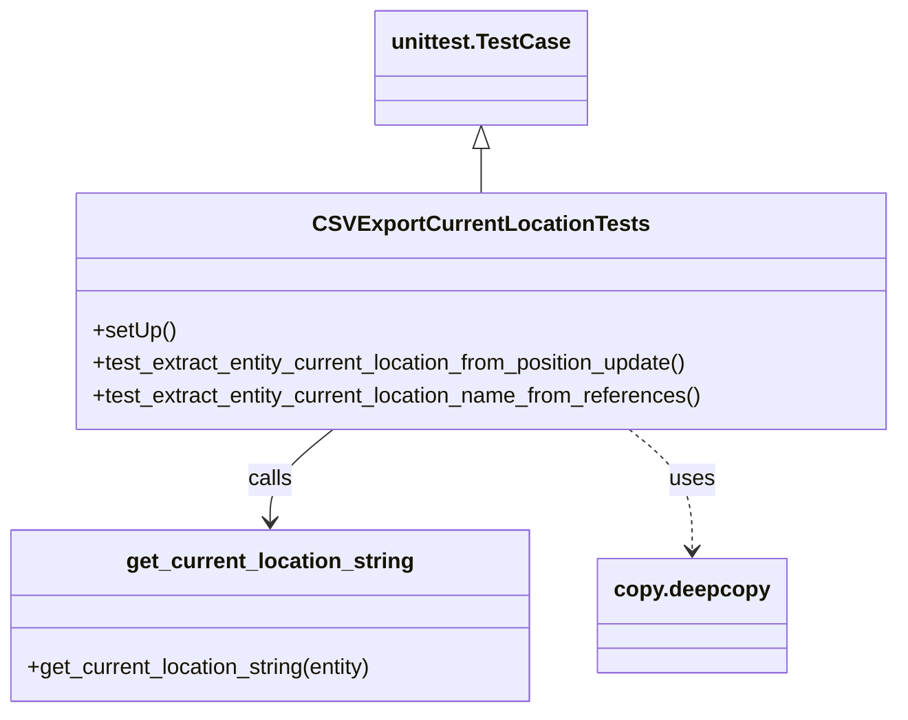

# Diagram: entity_core/entity_service/entity_service_tests/get_search_entity_tests/test_entity_current_location_for_csv_export.py


> Auto-generated by Obscura crawlers

## Diagram 1



### SVG

<svg id="container" width="661.501953125" xmlns="http://www.w3.org/2000/svg" class="classDiagram" height="524" viewBox="0 0 661.501953125 524" role="graphics-document document" aria-roledescription="class"><style>#container{font-family:"trebuchet ms",verdana,arial,sans-serif;font-size:16px;fill:#333;}@keyframes edge-animation-frame{from{stroke-dashoffset:0;}}@keyframes dash{to{stroke-dashoffset:0;}}#container .edge-animation-slow{stroke-dasharray:9,5!important;stroke-dashoffset:900;animation:dash 50s linear infinite;stroke-linecap:round;}#container .edge-animation-fast{stroke-dasharray:9,5!important;stroke-dashoffset:900;animation:dash 20s linear infinite;stroke-linecap:round;}#container .error-icon{fill:#552222;}#container .error-text{fill:#552222;stroke:#552222;}#container .edge-thickness-normal{stroke-width:1px;}#container .edge-thickness-thick{stroke-width:3.5px;}#container .edge-pattern-solid{stroke-dasharray:0;}#container .edge-thickness-invisible{stroke-width:0;fill:none;}#container .edge-pattern-dashed{stroke-dasharray:3;}#container .edge-pattern-dotted{stroke-dasharray:2;}#container .marker{fill:#333333;stroke:#333333;}#container .marker.cross{stroke:#333333;}#container svg{font-family:"trebuchet ms",verdana,arial,sans-serif;font-size:16px;}#container p{margin:0;}#container g.classGroup text{fill:#9370DB;stroke:none;font-family:"trebuchet ms",verdana,arial,sans-serif;font-size:10px;}#container g.classGroup text .title{font-weight:bolder;}#container .nodeLabel,#container .edgeLabel{color:#131300;}#container .edgeLabel .label rect{fill:#ECECFF;}#container .label text{fill:#131300;}#container .labelBkg{background:#ECECFF;}#container .edgeLabel .label span{background:#ECECFF;}#container .classTitle{font-weight:bolder;}#container .node rect,#container .node circle,#container .node ellipse,#container .node polygon,#container .node path{fill:#ECECFF;stroke:#9370DB;stroke-width:1px;}#container .divider{stroke:#9370DB;stroke-width:1;}#container g.clickable{cursor:pointer;}#container g.classGroup rect{fill:#ECECFF;stroke:#9370DB;}#container g.classGroup line{stroke:#9370DB;stroke-width:1;}#container .classLabel .box{stroke:none;stroke-width:0;fill:#ECECFF;opacity:0.5;}#container .classLabel .label{fill:#9370DB;font-size:10px;}#container .relation{stroke:#333333;stroke-width:1;fill:none;}#container .dashed-line{stroke-dasharray:3;}#container .dotted-line{stroke-dasharray:1 2;}#container #compositionStart,#container .composition{fill:#333333!important;stroke:#333333!important;stroke-width:1;}#container #compositionEnd,#container .composition{fill:#333333!important;stroke:#333333!important;stroke-width:1;}#container #dependencyStart,#container .dependency{fill:#333333!important;stroke:#333333!important;stroke-width:1;}#container #dependencyStart,#container .dependency{fill:#333333!important;stroke:#333333!important;stroke-width:1;}#container #extensionStart,#container .extension{fill:transparent!important;stroke:#333333!important;stroke-width:1;}#container #extensionEnd,#container .extension{fill:transparent!important;stroke:#333333!important;stroke-width:1;}#container #aggregationStart,#container .aggregation{fill:transparent!important;stroke:#333333!important;stroke-width:1;}#container #aggregationEnd,#container .aggregation{fill:transparent!important;stroke:#333333!important;stroke-width:1;}#container #lollipopStart,#container .lollipop{fill:#ECECFF!important;stroke:#333333!important;stroke-width:1;}#container #lollipopEnd,#container .lollipop{fill:#ECECFF!important;stroke:#333333!important;stroke-width:1;}#container .edgeTerminals{font-size:11px;line-height:initial;}#container .classTitleText{text-anchor:middle;font-size:18px;fill:#333;}#container .label-icon{display:inline-block;height:1em;overflow:visible;vertical-align:-0.125em;}#container .node .label-icon path{fill:currentColor;stroke:revert;stroke-width:revert;}#container :root{--mermaid-font-family:"trebuchet ms",verdana,arial,sans-serif;}</style><g><defs><marker id="container_class-aggregationStart" class="marker aggregation class" refX="18" refY="7" markerWidth="190" markerHeight="240" orient="auto"><path d="M 18,7 L9,13 L1,7 L9,1 Z"></path></marker></defs><defs><marker id="container_class-aggregationEnd" class="marker aggregation class" refX="1" refY="7" markerWidth="20" markerHeight="28" orient="auto"><path d="M 18,7 L9,13 L1,7 L9,1 Z"></path></marker></defs><defs><marker id="container_class-extensionStart" class="marker extension class" refX="18" refY="7" markerWidth="190" markerHeight="240" orient="auto"><path d="M 1,7 L18,13 V 1 Z"></path></marker></defs><defs><marker id="container_class-extensionEnd" class="marker extension class" refX="1" refY="7" markerWidth="20" markerHeight="28" orient="auto"><path d="M 1,1 V 13 L18,7 Z"></path></marker></defs><defs><marker id="container_class-compositionStart" class="marker composition class" refX="18" refY="7" markerWidth="190" markerHeight="240" orient="auto"><path d="M 18,7 L9,13 L1,7 L9,1 Z"></path></marker></defs><defs><marker id="container_class-compositionEnd" class="marker composition class" refX="1" refY="7" markerWidth="20" markerHeight="28" orient="auto"><path d="M 18,7 L9,13 L1,7 L9,1 Z"></path></marker></defs><defs><marker id="container_class-dependencyStart" class="marker dependency class" refX="6" refY="7" markerWidth="190" markerHeight="240" orient="auto"><path d="M 5,7 L9,13 L1,7 L9,1 Z"></path></marker></defs><defs><marker id="container_class-dependencyEnd" class="marker dependency class" refX="13" refY="7" markerWidth="20" markerHeight="28" orient="auto"><path d="M 18,7 L9,13 L14,7 L9,1 Z"></path></marker></defs><defs><marker id="container_class-lollipopStart" class="marker lollipop class" refX="13" refY="7" markerWidth="190" markerHeight="240" orient="auto"><circle stroke="black" fill="transparent" cx="7" cy="7" r="6"></circle></marker></defs><defs><marker id="container_class-lollipopEnd" class="marker lollipop class" refX="1" refY="7" markerWidth="190" markerHeight="240" orient="auto"><circle stroke="black" fill="transparent" cx="7" cy="7" r="6"></circle></marker></defs><g class="root"><g class="clusters"></g><g class="edgePaths"><path d="M356.045,109.25L356.045,110.542C356.045,111.833,356.045,114.417,356.045,119.875C356.045,125.333,356.045,133.667,356.045,137.833L356.045,142" id="id_unittest.TestCase_CSVExportCurrentLocationTests_1" class="edge-thickness-normal edge-pattern-solid relation" style=";;;" data-edge="true" data-et="edge" data-id="id_unittest.TestCase_CSVExportCurrentLocationTests_1" data-points="W3sieCI6MzU2LjA0NDkyMTg3NSwieSI6OTJ9LHsieCI6MzU2LjA0NDkyMTg3NSwieSI6MTE3fSx7IngiOjM1Ni4wNDQ5MjE4NzUsInkiOjE0Mn1d" marker-start="url(#container_class-extensionStart)"></path><path d="M247.442,316L239.744,322.167C232.046,328.333,216.65,340.667,208.952,352C201.254,363.333,201.254,373.667,201.254,378.833L201.254,384" id="id_CSVExportCurrentLocationTests_get_current_location_string_2" class="edge-thickness-normal edge-pattern-solid relation" style=";;;" data-edge="true" data-et="edge" data-id="id_CSVExportCurrentLocationTests_get_current_location_string_2" data-points="W3sieCI6MjQ3LjQ0MTU0ODAwOTA3MjU2LCJ5IjozMTZ9LHsieCI6MjAxLjI1MzkwNjI1LCJ5IjozNTN9LHsieCI6MjAxLjI1MzkwNjI1LCJ5IjozOTB9XQ==" marker-end="url(#container_class-dependencyEnd)"></path><path d="M464.648,316L472.346,322.167C480.044,328.333,495.44,340.667,503.138,355.5C510.836,370.333,510.836,387.667,510.836,396.333L510.836,405" id="id_CSVExportCurrentLocationTests_copy.deepcopy_3" class="edge-thickness-normal edge-pattern-dashed relation" style=";;;" data-edge="true" data-et="edge" data-id="id_CSVExportCurrentLocationTests_copy.deepcopy_3" data-points="W3sieCI6NDY0LjY0ODI5NTc0MDkyNzQ0LCJ5IjozMTZ9LHsieCI6NTEwLjgzNTkzNzUsInkiOjM1M30seyJ4Ijo1MTAuODM1OTM3NSwieSI6NDExfV0=" marker-end="url(#container_class-dependencyEnd)"></path></g><g class="edgeLabels"><g class="edgeLabel"><g class="label" data-id="id_unittest.TestCase_CSVExportCurrentLocationTests_1" transform="translate(0, 0)"><foreignObject width="0" height="0"><div xmlns="http://www.w3.org/1999/xhtml" class="labelBkg" style="display: table-cell; white-space: nowrap; line-height: 1.5; max-width: 200px; text-align: center;"><span class="edgeLabel"></span></div></foreignObject></g></g><g class="edgeLabel" transform="translate(201.25390625, 353)"><g class="label" data-id="id_CSVExportCurrentLocationTests_get_current_location_string_2" transform="translate(-16.4453125, -12)"><foreignObject width="32.890625" height="24"><div xmlns="http://www.w3.org/1999/xhtml" class="labelBkg" style="display: table-cell; white-space: nowrap; line-height: 1.5; max-width: 200px; text-align: center;"><span class="edgeLabel"><p>calls</p></span></div></foreignObject></g></g><g class="edgeLabel" transform="translate(510.8359375, 353)"><g class="label" data-id="id_CSVExportCurrentLocationTests_copy.deepcopy_3" transform="translate(-16.4921875, -12)"><foreignObject width="32.984375" height="24"><div xmlns="http://www.w3.org/1999/xhtml" class="labelBkg" style="display: table-cell; white-space: nowrap; line-height: 1.5; max-width: 200px; text-align: center;"><span class="edgeLabel"><p>uses</p></span></div></foreignObject></g></g></g><g class="nodes"><g class="node default" id="classId-CSVExportCurrentLocationTests-0" transform="translate(356.044921875, 229)"><g class="basic label-container"><path d="M-297.45703125 -87 L297.45703125 -87 L297.45703125 87 L-297.45703125 87" stroke="none" stroke-width="0" fill="#ECECFF" style=""></path><path d="M-297.45703125 -87 C-75.1765823607987 -87, 147.1038665284026 -87, 297.45703125 -87 M-297.45703125 -87 C-172.40497492116754 -87, -47.352918592335044 -87, 297.45703125 -87 M297.45703125 -87 C297.45703125 -35.133717041886875, 297.45703125 16.73256591622625, 297.45703125 87 M297.45703125 -87 C297.45703125 -35.86048028995705, 297.45703125 15.279039420085894, 297.45703125 87 M297.45703125 87 C130.56828159807773 87, -36.320468053844536 87, -297.45703125 87 M297.45703125 87 C157.13625769848358 87, 16.81548414696715 87, -297.45703125 87 M-297.45703125 87 C-297.45703125 36.002874438804625, -297.45703125 -14.99425112239075, -297.45703125 -87 M-297.45703125 87 C-297.45703125 45.82353211123308, -297.45703125 4.647064222466156, -297.45703125 -87" stroke="#9370DB" stroke-width="1.3" fill="none" stroke-dasharray="0 0" style=""></path></g><g class="annotation-group text" transform="translate(0, -63)"></g><g class="label-group text" transform="translate(-115.3515625, -63)"><g class="label" style="font-weight: bolder" transform="translate(0,-12)"><foreignObject width="230.703125" height="24"><div xmlns="http://www.w3.org/1999/xhtml" style="display: table-cell; white-space: nowrap; line-height: 1.5; max-width: 276px; text-align: center;"><span class="nodeLabel markdown-node-label" style=""><p>CSVExportCurrentLocationTests</p></span></div></foreignObject></g></g><g class="members-group text" transform="translate(-285.45703125, -15)"></g><g class="methods-group text" transform="translate(-285.45703125, 15)"><g class="label" style="" transform="translate(0,-12)"><foreignObject width="60.421875" height="24"><div xmlns="http://www.w3.org/1999/xhtml" style="display: table-cell; white-space: nowrap; line-height: 1.5; max-width: 118px; text-align: center;"><span class="nodeLabel markdown-node-label" style=""><p>+setUp()</p></span></div></foreignObject></g><g class="label" style="" transform="translate(0,12)"><foreignObject width="450.578125" height="24"><div xmlns="http://www.w3.org/1999/xhtml" style="display: table-cell; white-space: nowrap; line-height: 1.5; max-width: 508px; text-align: center;"><span class="nodeLabel markdown-node-label" style=""><p>+test_extract_entity_current_location_from_position_update()</p></span></div></foreignObject></g><g class="label" style="" transform="translate(0,36)"><foreignObject width="455.5625" height="24"><div xmlns="http://www.w3.org/1999/xhtml" style="display: table-cell; white-space: nowrap; line-height: 1.5; max-width: 513px; text-align: center;"><span class="nodeLabel markdown-node-label" style=""><p>+test_extract_entity_current_location_name_from_references()</p></span></div></foreignObject></g></g><g class="divider" style=""><path d="M-297.45703125 -39 C-64.43040464629823 -39, 168.59622195740354 -39, 297.45703125 -39 M-297.45703125 -39 C-123.41898454621759 -39, 50.61906215756483 -39, 297.45703125 -39" stroke="#9370DB" stroke-width="1.3" fill="none" stroke-dasharray="0 0" style=""></path></g><g class="divider" style=""><path d="M-297.45703125 -15 C-119.43205500982003 -15, 58.592921230359934 -15, 297.45703125 -15 M-297.45703125 -15 C-153.40455354002958 -15, -9.352075830059164 -15, 297.45703125 -15" stroke="#9370DB" stroke-width="1.3" fill="none" stroke-dasharray="0 0" style=""></path></g></g><g class="node default" id="classId-get_current_location_string-1" transform="translate(201.25390625, 453)"><g class="basic label-container"><path d="M-193.25390625 -63 L193.25390625 -63 L193.25390625 63 L-193.25390625 63" stroke="none" stroke-width="0" fill="#ECECFF" style=""></path><path d="M-193.25390625 -63 C-61.68445438314697 -63, 69.88499748370606 -63, 193.25390625 -63 M-193.25390625 -63 C-74.32888200132169 -63, 44.596142247356624 -63, 193.25390625 -63 M193.25390625 -63 C193.25390625 -24.27049521208812, 193.25390625 14.459009575823757, 193.25390625 63 M193.25390625 -63 C193.25390625 -31.66006272978644, 193.25390625 -0.3201254595728784, 193.25390625 63 M193.25390625 63 C64.45593953661304 63, -64.34202717677391 63, -193.25390625 63 M193.25390625 63 C53.18554377737402 63, -86.88281869525196 63, -193.25390625 63 M-193.25390625 63 C-193.25390625 28.596568509518697, -193.25390625 -5.806862980962606, -193.25390625 -63 M-193.25390625 63 C-193.25390625 21.513589126808107, -193.25390625 -19.972821746383786, -193.25390625 -63" stroke="#9370DB" stroke-width="1.3" fill="none" stroke-dasharray="0 0" style=""></path></g><g class="annotation-group text" transform="translate(0, -39)"></g><g class="label-group text" transform="translate(-101.8203125, -39)"><g class="label" style="font-weight: bolder" transform="translate(0,-12)"><foreignObject width="203.640625" height="24"><div xmlns="http://www.w3.org/1999/xhtml" style="display: table-cell; white-space: nowrap; line-height: 1.5; max-width: 251px; text-align: center;"><span class="nodeLabel markdown-node-label" style=""><p>get_current_location_string</p></span></div></foreignObject></g></g><g class="members-group text" transform="translate(-181.25390625, 9)"></g><g class="methods-group text" transform="translate(-181.25390625, 39)"><g class="label" style="" transform="translate(0,-12)"><foreignObject width="260.6875" height="24"><div xmlns="http://www.w3.org/1999/xhtml" style="display: table-cell; white-space: nowrap; line-height: 1.5; max-width: 318px; text-align: center;"><span class="nodeLabel markdown-node-label" style=""><p>+get_current_location_string(entity)</p></span></div></foreignObject></g></g><g class="divider" style=""><path d="M-193.25390625 -15 C-53.18633682361542 -15, 86.88123260276916 -15, 193.25390625 -15 M-193.25390625 -15 C-50.658454762618675 -15, 91.93699672476265 -15, 193.25390625 -15" stroke="#9370DB" stroke-width="1.3" fill="none" stroke-dasharray="0 0" style=""></path></g><g class="divider" style=""><path d="M-193.25390625 9 C-84.52542290501854 9, 24.20306043996291 9, 193.25390625 9 M-193.25390625 9 C-114.603826607127 9, -35.95374696425401 9, 193.25390625 9" stroke="#9370DB" stroke-width="1.3" fill="none" stroke-dasharray="0 0" style=""></path></g></g><g class="node default" id="classId-unittest.TestCase-2" transform="translate(356.044921875, 50)"><g class="basic label-container"><path d="M-74.7109375 -42 L74.7109375 -42 L74.7109375 42 L-74.7109375 42" stroke="none" stroke-width="0" fill="#ECECFF" style=""></path><path d="M-74.7109375 -42 C-44.431218672171454 -42, -14.1514998443429 -42, 74.7109375 -42 M-74.7109375 -42 C-25.18999023637489 -42, 24.33095702725022 -42, 74.7109375 -42 M74.7109375 -42 C74.7109375 -16.68088079897542, 74.7109375 8.638238402049161, 74.7109375 42 M74.7109375 -42 C74.7109375 -13.595466831234074, 74.7109375 14.809066337531853, 74.7109375 42 M74.7109375 42 C18.303166927672315 42, -38.10460364465537 42, -74.7109375 42 M74.7109375 42 C42.92144226689197 42, 11.131947033783952 42, -74.7109375 42 M-74.7109375 42 C-74.7109375 21.017229481628522, -74.7109375 0.03445896325704467, -74.7109375 -42 M-74.7109375 42 C-74.7109375 20.506116367928094, -74.7109375 -0.9877672641438124, -74.7109375 -42" stroke="#9370DB" stroke-width="1.3" fill="none" stroke-dasharray="0 0" style=""></path></g><g class="annotation-group text" transform="translate(0, -18)"></g><g class="label-group text" transform="translate(-62.7109375, -18)"><g class="label" style="font-weight: bolder" transform="translate(0,-12)"><foreignObject width="125.421875" height="24"><div xmlns="http://www.w3.org/1999/xhtml" style="display: table-cell; white-space: nowrap; line-height: 1.5; max-width: 172px; text-align: center;"><span class="nodeLabel markdown-node-label" style=""><p>unittest.TestCase</p></span></div></foreignObject></g></g><g class="members-group text" transform="translate(-62.7109375, 30)"></g><g class="methods-group text" transform="translate(-62.7109375, 60)"></g><g class="divider" style=""><path d="M-74.7109375 6 C-38.80710865999821 6, -2.9032798199964134 6, 74.7109375 6 M-74.7109375 6 C-23.75944824167169 6, 27.192041016656617 6, 74.7109375 6" stroke="#9370DB" stroke-width="1.3" fill="none" stroke-dasharray="0 0" style=""></path></g><g class="divider" style=""><path d="M-74.7109375 24 C-32.08482876507611 24, 10.541279969847778 24, 74.7109375 24 M-74.7109375 24 C-41.03782239393883 24, -7.364707287877664 24, 74.7109375 24" stroke="#9370DB" stroke-width="1.3" fill="none" stroke-dasharray="0 0" style=""></path></g></g><g class="node default" id="classId-copy.deepcopy-3" transform="translate(510.8359375, 453)"><g class="basic label-container"><path d="M-66.328125 -42 L66.328125 -42 L66.328125 42 L-66.328125 42" stroke="none" stroke-width="0" fill="#ECECFF" style=""></path><path d="M-66.328125 -42 C-22.268692747860598 -42, 21.790739504278804 -42, 66.328125 -42 M-66.328125 -42 C-30.599692153528153 -42, 5.128740692943694 -42, 66.328125 -42 M66.328125 -42 C66.328125 -12.997397007253472, 66.328125 16.005205985493056, 66.328125 42 M66.328125 -42 C66.328125 -23.710177952639256, 66.328125 -5.420355905278512, 66.328125 42 M66.328125 42 C26.322043721027377 42, -13.684037557945246 42, -66.328125 42 M66.328125 42 C36.16220152411479 42, 5.996278048229577 42, -66.328125 42 M-66.328125 42 C-66.328125 24.66874766097266, -66.328125 7.337495321945319, -66.328125 -42 M-66.328125 42 C-66.328125 22.993064593748233, -66.328125 3.9861291874964664, -66.328125 -42" stroke="#9370DB" stroke-width="1.3" fill="none" stroke-dasharray="0 0" style=""></path></g><g class="annotation-group text" transform="translate(0, -18)"></g><g class="label-group text" transform="translate(-54.328125, -18)"><g class="label" style="font-weight: bolder" transform="translate(0,-12)"><foreignObject width="108.65625" height="24"><div xmlns="http://www.w3.org/1999/xhtml" style="display: table-cell; white-space: nowrap; line-height: 1.5; max-width: 158px; text-align: center;"><span class="nodeLabel markdown-node-label" style=""><p>copy.deepcopy</p></span></div></foreignObject></g></g><g class="members-group text" transform="translate(-54.328125, 30)"></g><g class="methods-group text" transform="translate(-54.328125, 60)"></g><g class="divider" style=""><path d="M-66.328125 6 C-22.629477674870706 6, 21.069169650258587 6, 66.328125 6 M-66.328125 6 C-32.733081021634675 6, 0.8619629567306504 6, 66.328125 6" stroke="#9370DB" stroke-width="1.3" fill="none" stroke-dasharray="0 0" style=""></path></g><g class="divider" style=""><path d="M-66.328125 24 C-16.164446191303263 24, 33.999232617393474 24, 66.328125 24 M-66.328125 24 C-23.592403983275645 24, 19.14331703344871 24, 66.328125 24" stroke="#9370DB" stroke-width="1.3" fill="none" stroke-dasharray="0 0" style=""></path></g></g></g></g></g></svg>

## Diagram 2

```mermaid
flowchart TD
    Setup[setUp] --> Test1[Test: extract current location from position update]
    Test1 --> Call1[get_current_location_string(entity)]
    Call1 --> Assert1[assertEqual(expected, result)]
    Setup --> Test2[Test: extract current location name from references]
    Test2 --> Modify[deepcopy(entity) and remove locationName]
    Modify --> Call2[get_current_location_string(entity)]
    Call2 --> Assert2[assertEqual(expected, result)]
    Call1 --- Call2
```

> SVG rendering failed for this diagram.
