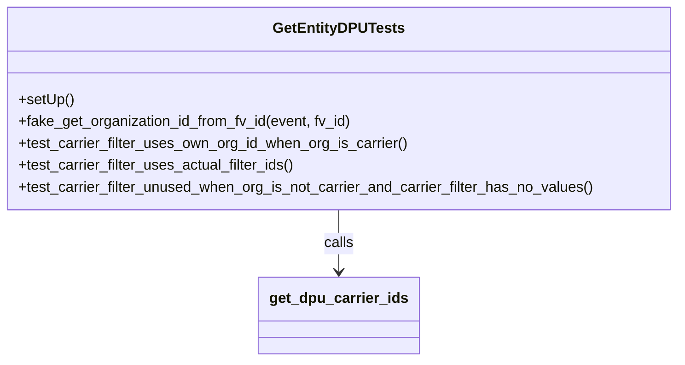

# Diagram: entity_core/entity_service/entity_service_tests/get_search_entity_tests/test_get_entity_dpu.py


> Auto-generated by Obscura crawlers

## Diagram 1



### SVG

<svg id="container" width="743.2734375" xmlns="http://www.w3.org/2000/svg" class="classDiagram" height="396" viewBox="0 0 743.2734375 396" role="graphics-document document" aria-roledescription="class"><style>#container{font-family:"trebuchet ms",verdana,arial,sans-serif;font-size:16px;fill:#333;}@keyframes edge-animation-frame{from{stroke-dashoffset:0;}}@keyframes dash{to{stroke-dashoffset:0;}}#container .edge-animation-slow{stroke-dasharray:9,5!important;stroke-dashoffset:900;animation:dash 50s linear infinite;stroke-linecap:round;}#container .edge-animation-fast{stroke-dasharray:9,5!important;stroke-dashoffset:900;animation:dash 20s linear infinite;stroke-linecap:round;}#container .error-icon{fill:#552222;}#container .error-text{fill:#552222;stroke:#552222;}#container .edge-thickness-normal{stroke-width:1px;}#container .edge-thickness-thick{stroke-width:3.5px;}#container .edge-pattern-solid{stroke-dasharray:0;}#container .edge-thickness-invisible{stroke-width:0;fill:none;}#container .edge-pattern-dashed{stroke-dasharray:3;}#container .edge-pattern-dotted{stroke-dasharray:2;}#container .marker{fill:#333333;stroke:#333333;}#container .marker.cross{stroke:#333333;}#container svg{font-family:"trebuchet ms",verdana,arial,sans-serif;font-size:16px;}#container p{margin:0;}#container g.classGroup text{fill:#9370DB;stroke:none;font-family:"trebuchet ms",verdana,arial,sans-serif;font-size:10px;}#container g.classGroup text .title{font-weight:bolder;}#container .nodeLabel,#container .edgeLabel{color:#131300;}#container .edgeLabel .label rect{fill:#ECECFF;}#container .label text{fill:#131300;}#container .labelBkg{background:#ECECFF;}#container .edgeLabel .label span{background:#ECECFF;}#container .classTitle{font-weight:bolder;}#container .node rect,#container .node circle,#container .node ellipse,#container .node polygon,#container .node path{fill:#ECECFF;stroke:#9370DB;stroke-width:1px;}#container .divider{stroke:#9370DB;stroke-width:1;}#container g.clickable{cursor:pointer;}#container g.classGroup rect{fill:#ECECFF;stroke:#9370DB;}#container g.classGroup line{stroke:#9370DB;stroke-width:1;}#container .classLabel .box{stroke:none;stroke-width:0;fill:#ECECFF;opacity:0.5;}#container .classLabel .label{fill:#9370DB;font-size:10px;}#container .relation{stroke:#333333;stroke-width:1;fill:none;}#container .dashed-line{stroke-dasharray:3;}#container .dotted-line{stroke-dasharray:1 2;}#container #compositionStart,#container .composition{fill:#333333!important;stroke:#333333!important;stroke-width:1;}#container #compositionEnd,#container .composition{fill:#333333!important;stroke:#333333!important;stroke-width:1;}#container #dependencyStart,#container .dependency{fill:#333333!important;stroke:#333333!important;stroke-width:1;}#container #dependencyStart,#container .dependency{fill:#333333!important;stroke:#333333!important;stroke-width:1;}#container #extensionStart,#container .extension{fill:transparent!important;stroke:#333333!important;stroke-width:1;}#container #extensionEnd,#container .extension{fill:transparent!important;stroke:#333333!important;stroke-width:1;}#container #aggregationStart,#container .aggregation{fill:transparent!important;stroke:#333333!important;stroke-width:1;}#container #aggregationEnd,#container .aggregation{fill:transparent!important;stroke:#333333!important;stroke-width:1;}#container #lollipopStart,#container .lollipop{fill:#ECECFF!important;stroke:#333333!important;stroke-width:1;}#container #lollipopEnd,#container .lollipop{fill:#ECECFF!important;stroke:#333333!important;stroke-width:1;}#container .edgeTerminals{font-size:11px;line-height:initial;}#container .classTitleText{text-anchor:middle;font-size:18px;fill:#333;}#container .label-icon{display:inline-block;height:1em;overflow:visible;vertical-align:-0.125em;}#container .node .label-icon path{fill:currentColor;stroke:revert;stroke-width:revert;}#container :root{--mermaid-font-family:"trebuchet ms",verdana,arial,sans-serif;}</style><g><defs><marker id="container_class-aggregationStart" class="marker aggregation class" refX="18" refY="7" markerWidth="190" markerHeight="240" orient="auto"><path d="M 18,7 L9,13 L1,7 L9,1 Z"></path></marker></defs><defs><marker id="container_class-aggregationEnd" class="marker aggregation class" refX="1" refY="7" markerWidth="20" markerHeight="28" orient="auto"><path d="M 18,7 L9,13 L1,7 L9,1 Z"></path></marker></defs><defs><marker id="container_class-extensionStart" class="marker extension class" refX="18" refY="7" markerWidth="190" markerHeight="240" orient="auto"><path d="M 1,7 L18,13 V 1 Z"></path></marker></defs><defs><marker id="container_class-extensionEnd" class="marker extension class" refX="1" refY="7" markerWidth="20" markerHeight="28" orient="auto"><path d="M 1,1 V 13 L18,7 Z"></path></marker></defs><defs><marker id="container_class-compositionStart" class="marker composition class" refX="18" refY="7" markerWidth="190" markerHeight="240" orient="auto"><path d="M 18,7 L9,13 L1,7 L9,1 Z"></path></marker></defs><defs><marker id="container_class-compositionEnd" class="marker composition class" refX="1" refY="7" markerWidth="20" markerHeight="28" orient="auto"><path d="M 18,7 L9,13 L1,7 L9,1 Z"></path></marker></defs><defs><marker id="container_class-dependencyStart" class="marker dependency class" refX="6" refY="7" markerWidth="190" markerHeight="240" orient="auto"><path d="M 5,7 L9,13 L1,7 L9,1 Z"></path></marker></defs><defs><marker id="container_class-dependencyEnd" class="marker dependency class" refX="13" refY="7" markerWidth="20" markerHeight="28" orient="auto"><path d="M 18,7 L9,13 L14,7 L9,1 Z"></path></marker></defs><defs><marker id="container_class-lollipopStart" class="marker lollipop class" refX="13" refY="7" markerWidth="190" markerHeight="240" orient="auto"><circle stroke="black" fill="transparent" cx="7" cy="7" r="6"></circle></marker></defs><defs><marker id="container_class-lollipopEnd" class="marker lollipop class" refX="1" refY="7" markerWidth="190" markerHeight="240" orient="auto"><circle stroke="black" fill="transparent" cx="7" cy="7" r="6"></circle></marker></defs><g class="root"><g class="clusters"></g><g class="edgePaths"><path d="M371.637,230L371.637,236.167C371.637,242.333,371.637,254.667,371.637,266C371.637,277.333,371.637,287.667,371.637,292.833L371.637,298" id="id_GetEntityDPUTests_get_dpu_carrier_ids_1" class="edge-thickness-normal edge-pattern-solid relation" style=";;;" data-edge="true" data-et="edge" data-id="id_GetEntityDPUTests_get_dpu_carrier_ids_1" data-points="W3sieCI6MzcxLjYzNjcxODc1LCJ5IjoyMzB9LHsieCI6MzcxLjYzNjcxODc1LCJ5IjoyNjd9LHsieCI6MzcxLjYzNjcxODc1LCJ5IjozMDR9XQ==" marker-end="url(#container_class-dependencyEnd)"></path></g><g class="edgeLabels"><g class="edgeLabel" transform="translate(371.63671875, 267)"><g class="label" data-id="id_GetEntityDPUTests_get_dpu_carrier_ids_1" transform="translate(-16.4453125, -12)"><foreignObject width="32.890625" height="24"><div xmlns="http://www.w3.org/1999/xhtml" class="labelBkg" style="display: table-cell; white-space: nowrap; line-height: 1.5; max-width: 200px; text-align: center;"><span class="edgeLabel"><p>calls</p></span></div></foreignObject></g></g></g><g class="nodes"><g class="node default" id="classId-GetEntityDPUTests-0" transform="translate(371.63671875, 119)"><g class="basic label-container"><path d="M-363.63671875 -111 L363.63671875 -111 L363.63671875 111 L-363.63671875 111" stroke="none" stroke-width="0" fill="#ECECFF" style=""></path><path d="M-363.63671875 -111 C-179.7210247163897 -111, 4.194669317220587 -111, 363.63671875 -111 M-363.63671875 -111 C-203.85721008457554 -111, -44.07770141915108 -111, 363.63671875 -111 M363.63671875 -111 C363.63671875 -48.70412601070052, 363.63671875 13.59174797859896, 363.63671875 111 M363.63671875 -111 C363.63671875 -27.61210684721243, 363.63671875 55.77578630557514, 363.63671875 111 M363.63671875 111 C104.26585115318352 111, -155.10501644363296 111, -363.63671875 111 M363.63671875 111 C192.90692849913532 111, 22.177138248270637 111, -363.63671875 111 M-363.63671875 111 C-363.63671875 30.485013265715935, -363.63671875 -50.02997346856813, -363.63671875 -111 M-363.63671875 111 C-363.63671875 41.72674196108949, -363.63671875 -27.546516077821025, -363.63671875 -111" stroke="#9370DB" stroke-width="1.3" fill="none" stroke-dasharray="0 0" style=""></path></g><g class="annotation-group text" transform="translate(0, -87)"></g><g class="label-group text" transform="translate(-68.2734375, -87)"><g class="label" style="font-weight: bolder" transform="translate(0,-12)"><foreignObject width="136.546875" height="24"><div xmlns="http://www.w3.org/1999/xhtml" style="display: table-cell; white-space: nowrap; line-height: 1.5; max-width: 183px; text-align: center;"><span class="nodeLabel markdown-node-label" style=""><p>GetEntityDPUTests</p></span></div></foreignObject></g></g><g class="members-group text" transform="translate(-351.63671875, -39)"></g><g class="methods-group text" transform="translate(-351.63671875, -9)"><g class="label" style="" transform="translate(0,-12)"><foreignObject width="60.421875" height="24"><div xmlns="http://www.w3.org/1999/xhtml" style="display: table-cell; white-space: nowrap; line-height: 1.5; max-width: 118px; text-align: center;"><span class="nodeLabel markdown-node-label" style=""><p>+setUp()</p></span></div></foreignObject></g><g class="label" style="" transform="translate(0,12)"><foreignObject width="368.953125" height="24"><div xmlns="http://www.w3.org/1999/xhtml" style="display: table-cell; white-space: nowrap; line-height: 1.5; max-width: 426px; text-align: center;"><span class="nodeLabel markdown-node-label" style=""><p>+fake_get_organization_id_from_fv_id(event, fv_id)</p></span></div></foreignObject></g><g class="label" style="" transform="translate(0,36)"><foreignObject width="428.953125" height="24"><div xmlns="http://www.w3.org/1999/xhtml" style="display: table-cell; white-space: nowrap; line-height: 1.5; max-width: 486px; text-align: center;"><span class="nodeLabel markdown-node-label" style=""><p>+test_carrier_filter_uses_own_org_id_when_org_is_carrier()</p></span></div></foreignObject></g><g class="label" style="" transform="translate(0,60)"><foreignObject width="305.734375" height="24"><div xmlns="http://www.w3.org/1999/xhtml" style="display: table-cell; white-space: nowrap; line-height: 1.5; max-width: 363px; text-align: center;"><span class="nodeLabel markdown-node-label" style=""><p>+test_carrier_filter_uses_actual_filter_ids()</p></span></div></foreignObject></g><g class="label" style="" transform="translate(0,84)"><foreignObject width="635" height="24"><div xmlns="http://www.w3.org/1999/xhtml" style="display: table-cell; white-space: nowrap; line-height: 1.5; max-width: 692px; text-align: center;"><span class="nodeLabel markdown-node-label" style=""><p>+test_carrier_filter_unused_when_org_is_not_carrier_and_carrier_filter_has_no_values()</p></span></div></foreignObject></g></g><g class="divider" style=""><path d="M-363.63671875 -63 C-92.49631792871196 -63, 178.64408289257608 -63, 363.63671875 -63 M-363.63671875 -63 C-86.57968831069991 -63, 190.47734212860018 -63, 363.63671875 -63" stroke="#9370DB" stroke-width="1.3" fill="none" stroke-dasharray="0 0" style=""></path></g><g class="divider" style=""><path d="M-363.63671875 -39 C-198.93942765446064 -39, -34.24213655892129 -39, 363.63671875 -39 M-363.63671875 -39 C-144.82030029797414 -39, 73.99611815405171 -39, 363.63671875 -39" stroke="#9370DB" stroke-width="1.3" fill="none" stroke-dasharray="0 0" style=""></path></g></g><g class="node default" id="classId-get_dpu_carrier_ids-1" transform="translate(371.63671875, 346)"><g class="basic label-container"><path d="M-84.765625 -42 L84.765625 -42 L84.765625 42 L-84.765625 42" stroke="none" stroke-width="0" fill="#ECECFF" style=""></path><path d="M-84.765625 -42 C-30.93622232468791 -42, 22.893180350624178 -42, 84.765625 -42 M-84.765625 -42 C-44.916226367383324 -42, -5.0668277347666475 -42, 84.765625 -42 M84.765625 -42 C84.765625 -23.94879809927517, 84.765625 -5.897596198550339, 84.765625 42 M84.765625 -42 C84.765625 -13.628259655730155, 84.765625 14.743480688539691, 84.765625 42 M84.765625 42 C45.683274816269396 42, 6.600924632538792 42, -84.765625 42 M84.765625 42 C26.32346912404322 42, -32.11868675191356 42, -84.765625 42 M-84.765625 42 C-84.765625 21.32791152613865, -84.765625 0.6558230522772988, -84.765625 -42 M-84.765625 42 C-84.765625 21.82130182862413, -84.765625 1.6426036572482587, -84.765625 -42" stroke="#9370DB" stroke-width="1.3" fill="none" stroke-dasharray="0 0" style=""></path></g><g class="annotation-group text" transform="translate(0, -18)"></g><g class="label-group text" transform="translate(-72.765625, -18)"><g class="label" style="font-weight: bolder" transform="translate(0,-12)"><foreignObject width="145.53125" height="24"><div xmlns="http://www.w3.org/1999/xhtml" style="display: table-cell; white-space: nowrap; line-height: 1.5; max-width: 194px; text-align: center;"><span class="nodeLabel markdown-node-label" style=""><p>get_dpu_carrier_ids</p></span></div></foreignObject></g></g><g class="members-group text" transform="translate(-72.765625, 30)"></g><g class="methods-group text" transform="translate(-72.765625, 60)"></g><g class="divider" style=""><path d="M-84.765625 6 C-39.60019735598526 6, 5.565230288029483 6, 84.765625 6 M-84.765625 6 C-36.77877588600131 6, 11.208073227997374 6, 84.765625 6" stroke="#9370DB" stroke-width="1.3" fill="none" stroke-dasharray="0 0" style=""></path></g><g class="divider" style=""><path d="M-84.765625 24 C-49.686576747948195 24, -14.60752849589639 24, 84.765625 24 M-84.765625 24 C-23.806253801113826 24, 37.15311739777235 24, 84.765625 24" stroke="#9370DB" stroke-width="1.3" fill="none" stroke-dasharray="0 0" style=""></path></g></g></g></g></g></svg>

## Diagram 2

```mermaid
sequenceDiagram
    participant Test as GetEntityDPUTests
    participant G as get_dpu_carrier_ids
    participant F as fake_get_organization_id_from_fv_id

    Note over Test,G: test_carrier_filter_uses_own_org_id_when_org_is_carrier
    Test->>G: call(event{authorizer.organization_id=1003}, carriers=['CR'], filter_ids=None)
    alt org is carrier
        G-->>Test: returns ("1003",)
    end

    Note over Test,G,F: test_carrier_filter_uses_actual_filter_ids
    Test->>G: call(event{authorizer.organization_id=1004}, carriers=['SH'], filter_ids=['FV123','FV456'])
    G->>F: get_organization_id_from_fv_id(event, 'FV123')
    F-->>G: returns 'FV123'
    G->>F: get_organization_id_from_fv_id(event, 'FV456')
    F-->>G: returns 'FV456'
    G-->>Test: returns ("FV123","FV456")

    Note over Test,G,F: test_carrier_filter_unused_when_org_is_not_carrier_and_carrier_filter_has_no_values
    Test->>G: call(event{authorizer.organization_id=1004}, carriers=['SH'], filter_ids=None)
    alt no filter values
        G-->>Test: returns null
    end
```

> SVG rendering failed for this diagram.
