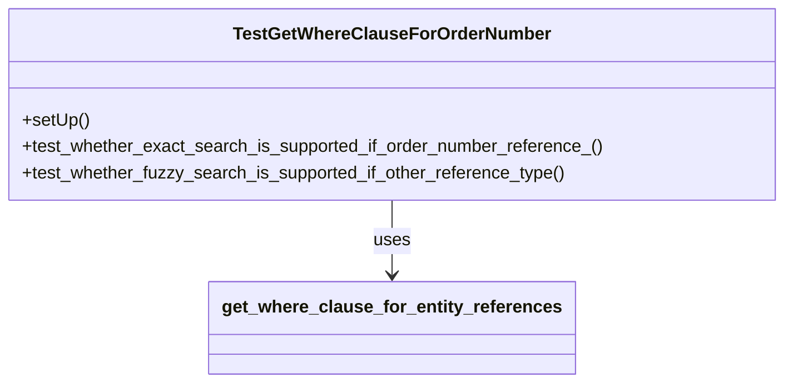

# Diagram: entity_core/entity_service/entity_service_tests/get_search_entity_tests/test_get_where_clause_for_entity_references.py


> Auto-generated by Obscura crawlers

## Diagram 1



### SVG

<svg id="container" width="706.4921875" xmlns="http://www.w3.org/2000/svg" class="classDiagram" height="348" viewBox="0 0 706.4921875 348" role="graphics-document document" aria-roledescription="class"><style>#container{font-family:"trebuchet ms",verdana,arial,sans-serif;font-size:16px;fill:#333;}@keyframes edge-animation-frame{from{stroke-dashoffset:0;}}@keyframes dash{to{stroke-dashoffset:0;}}#container .edge-animation-slow{stroke-dasharray:9,5!important;stroke-dashoffset:900;animation:dash 50s linear infinite;stroke-linecap:round;}#container .edge-animation-fast{stroke-dasharray:9,5!important;stroke-dashoffset:900;animation:dash 20s linear infinite;stroke-linecap:round;}#container .error-icon{fill:#552222;}#container .error-text{fill:#552222;stroke:#552222;}#container .edge-thickness-normal{stroke-width:1px;}#container .edge-thickness-thick{stroke-width:3.5px;}#container .edge-pattern-solid{stroke-dasharray:0;}#container .edge-thickness-invisible{stroke-width:0;fill:none;}#container .edge-pattern-dashed{stroke-dasharray:3;}#container .edge-pattern-dotted{stroke-dasharray:2;}#container .marker{fill:#333333;stroke:#333333;}#container .marker.cross{stroke:#333333;}#container svg{font-family:"trebuchet ms",verdana,arial,sans-serif;font-size:16px;}#container p{margin:0;}#container g.classGroup text{fill:#9370DB;stroke:none;font-family:"trebuchet ms",verdana,arial,sans-serif;font-size:10px;}#container g.classGroup text .title{font-weight:bolder;}#container .nodeLabel,#container .edgeLabel{color:#131300;}#container .edgeLabel .label rect{fill:#ECECFF;}#container .label text{fill:#131300;}#container .labelBkg{background:#ECECFF;}#container .edgeLabel .label span{background:#ECECFF;}#container .classTitle{font-weight:bolder;}#container .node rect,#container .node circle,#container .node ellipse,#container .node polygon,#container .node path{fill:#ECECFF;stroke:#9370DB;stroke-width:1px;}#container .divider{stroke:#9370DB;stroke-width:1;}#container g.clickable{cursor:pointer;}#container g.classGroup rect{fill:#ECECFF;stroke:#9370DB;}#container g.classGroup line{stroke:#9370DB;stroke-width:1;}#container .classLabel .box{stroke:none;stroke-width:0;fill:#ECECFF;opacity:0.5;}#container .classLabel .label{fill:#9370DB;font-size:10px;}#container .relation{stroke:#333333;stroke-width:1;fill:none;}#container .dashed-line{stroke-dasharray:3;}#container .dotted-line{stroke-dasharray:1 2;}#container #compositionStart,#container .composition{fill:#333333!important;stroke:#333333!important;stroke-width:1;}#container #compositionEnd,#container .composition{fill:#333333!important;stroke:#333333!important;stroke-width:1;}#container #dependencyStart,#container .dependency{fill:#333333!important;stroke:#333333!important;stroke-width:1;}#container #dependencyStart,#container .dependency{fill:#333333!important;stroke:#333333!important;stroke-width:1;}#container #extensionStart,#container .extension{fill:transparent!important;stroke:#333333!important;stroke-width:1;}#container #extensionEnd,#container .extension{fill:transparent!important;stroke:#333333!important;stroke-width:1;}#container #aggregationStart,#container .aggregation{fill:transparent!important;stroke:#333333!important;stroke-width:1;}#container #aggregationEnd,#container .aggregation{fill:transparent!important;stroke:#333333!important;stroke-width:1;}#container #lollipopStart,#container .lollipop{fill:#ECECFF!important;stroke:#333333!important;stroke-width:1;}#container #lollipopEnd,#container .lollipop{fill:#ECECFF!important;stroke:#333333!important;stroke-width:1;}#container .edgeTerminals{font-size:11px;line-height:initial;}#container .classTitleText{text-anchor:middle;font-size:18px;fill:#333;}#container .label-icon{display:inline-block;height:1em;overflow:visible;vertical-align:-0.125em;}#container .node .label-icon path{fill:currentColor;stroke:revert;stroke-width:revert;}#container :root{--mermaid-font-family:"trebuchet ms",verdana,arial,sans-serif;}</style><g><defs><marker id="container_class-aggregationStart" class="marker aggregation class" refX="18" refY="7" markerWidth="190" markerHeight="240" orient="auto"><path d="M 18,7 L9,13 L1,7 L9,1 Z"></path></marker></defs><defs><marker id="container_class-aggregationEnd" class="marker aggregation class" refX="1" refY="7" markerWidth="20" markerHeight="28" orient="auto"><path d="M 18,7 L9,13 L1,7 L9,1 Z"></path></marker></defs><defs><marker id="container_class-extensionStart" class="marker extension class" refX="18" refY="7" markerWidth="190" markerHeight="240" orient="auto"><path d="M 1,7 L18,13 V 1 Z"></path></marker></defs><defs><marker id="container_class-extensionEnd" class="marker extension class" refX="1" refY="7" markerWidth="20" markerHeight="28" orient="auto"><path d="M 1,1 V 13 L18,7 Z"></path></marker></defs><defs><marker id="container_class-compositionStart" class="marker composition class" refX="18" refY="7" markerWidth="190" markerHeight="240" orient="auto"><path d="M 18,7 L9,13 L1,7 L9,1 Z"></path></marker></defs><defs><marker id="container_class-compositionEnd" class="marker composition class" refX="1" refY="7" markerWidth="20" markerHeight="28" orient="auto"><path d="M 18,7 L9,13 L1,7 L9,1 Z"></path></marker></defs><defs><marker id="container_class-dependencyStart" class="marker dependency class" refX="6" refY="7" markerWidth="190" markerHeight="240" orient="auto"><path d="M 5,7 L9,13 L1,7 L9,1 Z"></path></marker></defs><defs><marker id="container_class-dependencyEnd" class="marker dependency class" refX="13" refY="7" markerWidth="20" markerHeight="28" orient="auto"><path d="M 18,7 L9,13 L14,7 L9,1 Z"></path></marker></defs><defs><marker id="container_class-lollipopStart" class="marker lollipop class" refX="13" refY="7" markerWidth="190" markerHeight="240" orient="auto"><circle stroke="black" fill="transparent" cx="7" cy="7" r="6"></circle></marker></defs><defs><marker id="container_class-lollipopEnd" class="marker lollipop class" refX="1" refY="7" markerWidth="190" markerHeight="240" orient="auto"><circle stroke="black" fill="transparent" cx="7" cy="7" r="6"></circle></marker></defs><g class="root"><g class="clusters"></g><g class="edgePaths"><path d="M353.246,182L353.246,188.167C353.246,194.333,353.246,206.667,353.246,218C353.246,229.333,353.246,239.667,353.246,244.833L353.246,250" id="id_TestGetWhereClauseForOrderNumber_get_where_clause_for_entity_references_1" class="edge-thickness-normal edge-pattern-solid relation" style=";;;" data-edge="true" data-et="edge" data-id="id_TestGetWhereClauseForOrderNumber_get_where_clause_for_entity_references_1" data-points="W3sieCI6MzUzLjI0NjA5Mzc1LCJ5IjoxODJ9LHsieCI6MzUzLjI0NjA5Mzc1LCJ5IjoyMTl9LHsieCI6MzUzLjI0NjA5Mzc1LCJ5IjoyNTZ9XQ==" marker-end="url(#container_class-dependencyEnd)"></path></g><g class="edgeLabels"><g class="edgeLabel" transform="translate(353.24609375, 219)"><g class="label" data-id="id_TestGetWhereClauseForOrderNumber_get_where_clause_for_entity_references_1" transform="translate(-16.4921875, -12)"><foreignObject width="32.984375" height="24"><div xmlns="http://www.w3.org/1999/xhtml" class="labelBkg" style="display: table-cell; white-space: nowrap; line-height: 1.5; max-width: 200px; text-align: center;"><span class="edgeLabel"><p>uses</p></span></div></foreignObject></g></g></g><g class="nodes"><g class="node default" id="classId-TestGetWhereClauseForOrderNumber-0" transform="translate(353.24609375, 95)"><g class="basic label-container"><path d="M-345.24609375 -87 L345.24609375 -87 L345.24609375 87 L-345.24609375 87" stroke="none" stroke-width="0" fill="#ECECFF" style=""></path><path d="M-345.24609375 -87 C-143.74226164785395 -87, 57.7615704542921 -87, 345.24609375 -87 M-345.24609375 -87 C-94.16574011368581 -87, 156.91461352262837 -87, 345.24609375 -87 M345.24609375 -87 C345.24609375 -19.88852242023863, 345.24609375 47.22295515952274, 345.24609375 87 M345.24609375 -87 C345.24609375 -21.032354035566627, 345.24609375 44.93529192886675, 345.24609375 87 M345.24609375 87 C95.48005708100374 87, -154.28597958799253 87, -345.24609375 87 M345.24609375 87 C77.77503464713794 87, -189.6960244557241 87, -345.24609375 87 M-345.24609375 87 C-345.24609375 43.709158772479114, -345.24609375 0.4183175449582279, -345.24609375 -87 M-345.24609375 87 C-345.24609375 23.79455386897883, -345.24609375 -39.41089226204234, -345.24609375 -87" stroke="#9370DB" stroke-width="1.3" fill="none" stroke-dasharray="0 0" style=""></path></g><g class="annotation-group text" transform="translate(0, -63)"></g><g class="label-group text" transform="translate(-136.6640625, -63)"><g class="label" style="font-weight: bolder" transform="translate(0,-12)"><foreignObject width="273.328125" height="24"><div xmlns="http://www.w3.org/1999/xhtml" style="display: table-cell; white-space: nowrap; line-height: 1.5; max-width: 321px; text-align: center;"><span class="nodeLabel markdown-node-label" style=""><p>TestGetWhereClauseForOrderNumber</p></span></div></foreignObject></g></g><g class="members-group text" transform="translate(-333.24609375, -15)"></g><g class="methods-group text" transform="translate(-333.24609375, 15)"><g class="label" style="" transform="translate(0,-12)"><foreignObject width="60.421875" height="24"><div xmlns="http://www.w3.org/1999/xhtml" style="display: table-cell; white-space: nowrap; line-height: 1.5; max-width: 118px; text-align: center;"><span class="nodeLabel markdown-node-label" style=""><p>+setUp()</p></span></div></foreignObject></g><g class="label" style="" transform="translate(0,12)"><foreignObject width="529.828125" height="24"><div xmlns="http://www.w3.org/1999/xhtml" style="display: table-cell; white-space: nowrap; line-height: 1.5; max-width: 587px; text-align: center;"><span class="nodeLabel markdown-node-label" style=""><p>+test_whether_exact_search_is_supported_if_order_number_reference_()</p></span></div></foreignObject></g><g class="label" style="" transform="translate(0,36)"><foreignObject width="495.171875" height="24"><div xmlns="http://www.w3.org/1999/xhtml" style="display: table-cell; white-space: nowrap; line-height: 1.5; max-width: 553px; text-align: center;"><span class="nodeLabel markdown-node-label" style=""><p>+test_whether_fuzzy_search_is_supported_if_other_reference_type()</p></span></div></foreignObject></g></g><g class="divider" style=""><path d="M-345.24609375 -39 C-115.56292273744555 -39, 114.1202482751089 -39, 345.24609375 -39 M-345.24609375 -39 C-137.88641588586972 -39, 69.47326197826055 -39, 345.24609375 -39" stroke="#9370DB" stroke-width="1.3" fill="none" stroke-dasharray="0 0" style=""></path></g><g class="divider" style=""><path d="M-345.24609375 -15 C-116.90849811673243 -15, 111.42909751653514 -15, 345.24609375 -15 M-345.24609375 -15 C-117.56129642766618 -15, 110.12350089466764 -15, 345.24609375 -15" stroke="#9370DB" stroke-width="1.3" fill="none" stroke-dasharray="0 0" style=""></path></g></g><g class="node default" id="classId-get_where_clause_for_entity_references-1" transform="translate(353.24609375, 298)"><g class="basic label-container"><path d="M-159.25 -42 L159.25 -42 L159.25 42 L-159.25 42" stroke="none" stroke-width="0" fill="#ECECFF" style=""></path><path d="M-159.25 -42 C-66.97631654098397 -42, 25.297366918032054 -42, 159.25 -42 M-159.25 -42 C-90.34882861236 -42, -21.44765722471999 -42, 159.25 -42 M159.25 -42 C159.25 -18.55796150344645, 159.25 4.884076993107101, 159.25 42 M159.25 -42 C159.25 -16.0798194310407, 159.25 9.840361137918599, 159.25 42 M159.25 42 C75.53541273591392 42, -8.179174528172155 42, -159.25 42 M159.25 42 C49.600870644977874 42, -60.04825871004425 42, -159.25 42 M-159.25 42 C-159.25 20.20467161761116, -159.25 -1.5906567647776768, -159.25 -42 M-159.25 42 C-159.25 20.15409466022015, -159.25 -1.6918106795597012, -159.25 -42" stroke="#9370DB" stroke-width="1.3" fill="none" stroke-dasharray="0 0" style=""></path></g><g class="annotation-group text" transform="translate(0, -18)"></g><g class="label-group text" transform="translate(-147.25, -18)"><g class="label" style="font-weight: bolder" transform="translate(0,-12)"><foreignObject width="294.5" height="24"><div xmlns="http://www.w3.org/1999/xhtml" style="display: table-cell; white-space: nowrap; line-height: 1.5; max-width: 339px; text-align: center;"><span class="nodeLabel markdown-node-label" style=""><p>get_where_clause_for_entity_references</p></span></div></foreignObject></g></g><g class="members-group text" transform="translate(-147.25, 30)"></g><g class="methods-group text" transform="translate(-147.25, 60)"></g><g class="divider" style=""><path d="M-159.25 6 C-42.226993265052286 6, 74.79601346989543 6, 159.25 6 M-159.25 6 C-74.08665784145845 6, 11.076684317083107 6, 159.25 6" stroke="#9370DB" stroke-width="1.3" fill="none" stroke-dasharray="0 0" style=""></path></g><g class="divider" style=""><path d="M-159.25 24 C-82.05206607294181 24, -4.854132145883625 24, 159.25 24 M-159.25 24 C-62.215493392879026 24, 34.81901321424195 24, 159.25 24" stroke="#9370DB" stroke-width="1.3" fill="none" stroke-dasharray="0 0" style=""></path></g></g></g></g></g></svg>

## Diagram 2

```mermaid
flowchart LR
Setup[setUp()] --> Call[get_where_clause_for_entity_references(qualifier, type, search_prep, value, where)]
Call --> Decision{qualifier == "OrderNumber"}
Decision -->|Yes| Exact[Exact match: er.value = %(OrderNumber_search_value)s]
Exact --> Assert1[assertIn "er.value = %(OrderNumber_search_value)s"<br/>assert search_prep returns "search_value"]
Decision -->|No| Fuzzy[Fuzzy match: er.value ILIKE %(OtherReference_search_value)s]
Fuzzy --> Assert2[assertIn "er.value ILIKE %(OtherReference_search_value)s"<br/>assert search_prep returns "%search_value%"]
```

> SVG rendering failed for this diagram.
