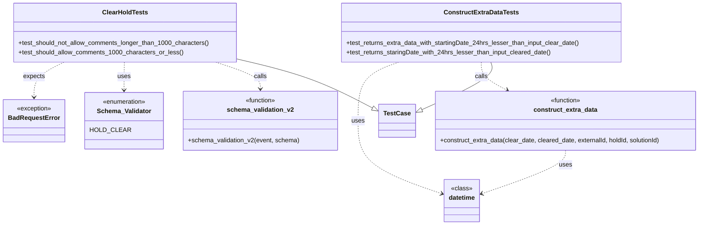
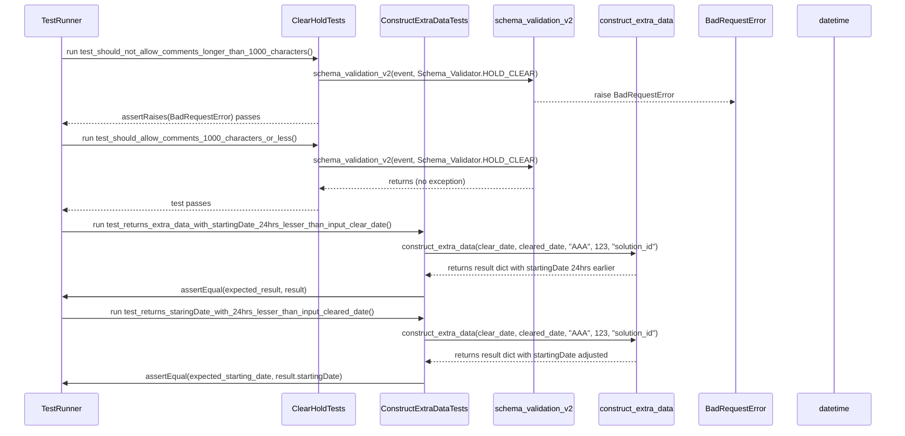

# Diagram: entity_core/entity_service/entity_service_tests/hold_tests/clear_hold_test.py

> Auto-generated by Obscura crawlers

## Diagram 1

### SVG

<svg id="container" width="1743.5859375" xmlns="http://www.w3.org/2000/svg" class="classDiagram" height="572" viewBox="0 0 1743.5859375 572" role="graphics-document document" aria-roledescription="class"><g><defs><marker id="container_class-aggregationStart" class="marker aggregation class" refX="18" refY="7" markerWidth="190" markerHeight="240" orient="auto"><path d="M 18,7 L9,13 L1,7 L9,1 Z"></path></marker></defs><defs><marker id="container_class-aggregationEnd" class="marker aggregation class" refX="1" refY="7" markerWidth="20" markerHeight="28" orient="auto"><path d="M 18,7 L9,13 L1,7 L9,1 Z"></path></marker></defs><defs><marker id="container_class-extensionStart" class="marker extension class" refX="18" refY="7" markerWidth="190" markerHeight="240" orient="auto"><path d="M 1,7 L18,13 V 1 Z"></path></marker></defs><defs><marker id="container_class-extensionEnd" class="marker extension class" refX="1" refY="7" markerWidth="20" markerHeight="28" orient="auto"><path d="M 1,1 V 13 L18,7 Z"></path></marker></defs><defs><marker id="container_class-compositionStart" class="marker composition class" refX="18" refY="7" markerWidth="190" markerHeight="240" orient="auto"><path d="M 18,7 L9,13 L1,7 L9,1 Z"></path></marker></defs><defs><marker id="container_class-compositionEnd" class="marker composition class" refX="1" refY="7" markerWidth="20" markerHeight="28" orient="auto"><path d="M 18,7 L9,13 L1,7 L9,1 Z"></path></marker></defs><defs><marker id="container_class-dependencyStart" class="marker dependency class" refX="6" refY="7" markerWidth="190" markerHeight="240" orient="auto"><path d="M 5,7 L9,13 L1,7 L9,1 Z"></path></marker></defs><defs><marker id="container_class-dependencyEnd" class="marker dependency class" refX="13" refY="7" markerWidth="20" markerHeight="28" orient="auto"><path d="M 18,7 L9,13 L14,7 L9,1 Z"></path></marker></defs><defs><marker id="container_class-lollipopStart" class="marker lollipop class" refX="13" refY="7" markerWidth="190" markerHeight="240" orient="auto"><circle stroke="black" fill="transparent" cx="7" cy="7" r="6"></circle></marker></defs><defs><marker id="container_class-lollipopEnd" class="marker lollipop class" refX="1" refY="7" markerWidth="190" markerHeight="240" orient="auto"><circle stroke="black" fill="transparent" cx="7" cy="7" r="6"></circle></marker></defs><g class="root"><g class="clusters"></g><g class="edgePaths"><path d="M572.76,150.018L604.239,157.515C635.718,165.012,698.676,180.006,755.23,200.874C811.784,221.743,861.934,248.485,887.009,261.857L912.084,275.228" id="id_ClearHoldTests_TestCase_1" class="edge-thickness-normal edge-pattern-solid relation" style=";;;" data-edge="true" data-et="edge" data-id="id_ClearHoldTests_TestCase_1" data-points="W3sieCI6NTcyLjc1OTc2NTYyNSwieSI6MTUwLjAxODAzMjkwOTQzNjc2fSx7IngiOjc2MS42MzQ3NjU2MjUsInkiOjE5NX0seyJ4Ijo5MjcuMzA0Njg3NSwieSI6MjgzLjM0NDk2Njc1NTAxfV0=" marker-end="url(#container_class-extensionEnd)"></path><path d="M1210.64,158L1212.646,164.167C1214.653,170.333,1218.666,182.667,1188.856,203.03C1159.045,223.393,1095.411,251.786,1063.594,265.982L1031.776,280.179" id="id_ConstructExtraDataTests_TestCase_2" class="edge-thickness-normal edge-pattern-solid relation" style=";;;" data-edge="true" data-et="edge" data-id="id_ConstructExtraDataTests_TestCase_2" data-points="W3sieCI6MTIxMC42Mzk3MTgxOTE5NjQyLCJ5IjoxNTh9LHsieCI6MTIyMi42Nzk2ODc1LCJ5IjoxOTV9LHsieCI6MTAxNi4wMjM0Mzc1LCJ5IjoyODcuMjA3NDA3NDA3NDA3NH1d" marker-end="url(#container_class-extensionEnd)"></path><path d="M518.804,158L537.506,164.167C556.207,170.333,593.609,182.667,612.311,194C631.012,205.333,631.012,215.667,631.012,220.833L631.012,226" id="id_ClearHoldTests_schema_validation_v2_3" class="edge-thickness-normal edge-pattern-dashed relation" style=";;;" data-edge="true" data-et="edge" data-id="id_ClearHoldTests_schema_validation_v2_3" data-points="W3sieCI6NTE4LjgwNDQ5NTY3NTIyMzMsInkiOjE1OH0seyJ4Ijo2MzEuMDExNzE4NzUsInkiOjE5NX0seyJ4Ijo2MzEuMDExNzE4NzUsInkiOjIzMn1d" marker-end="url(#container_class-dependencyEnd)"></path><path d="M295.225,158L295.543,164.167C295.861,170.333,296.497,182.667,296.815,194.5C297.133,206.333,297.133,217.667,297.133,223.333L297.133,229" id="id_ClearHoldTests_Schema_Validator_4" class="edge-thickness-normal edge-pattern-dashed relation" style=";;;" data-edge="true" data-et="edge" data-id="id_ClearHoldTests_Schema_Validator_4" data-points="W3sieCI6Mjk1LjIyNDg3MDk1NDI0MTA2LCJ5IjoxNTh9LHsieCI6Mjk3LjEzMjgxMjUsInkiOjE5NX0seyJ4IjoyOTcuMTMyODEyNSwieSI6MjM1fV0=" marker-end="url(#container_class-dependencyEnd)"></path><path d="M151.351,158L139.839,164.167C128.328,170.333,105.305,182.667,93.793,197.5C82.281,212.333,82.281,229.667,82.281,238.333L82.281,247" id="id_ClearHoldTests_BadRequestError_5" class="edge-thickness-normal edge-pattern-dashed relation" style=";;;" data-edge="true" data-et="edge" data-id="id_ClearHoldTests_BadRequestError_5" data-points="W3sieCI6MTUxLjM1MTA1Njc4MDEzMzkyLCJ5IjoxNTh9LHsieCI6ODIuMjgxMjUsInkiOjE5NX0seyJ4Ijo4Mi4yODEyNSwieSI6MjUzfV0=" marker-end="url(#container_class-dependencyEnd)"></path><path d="M1186.234,158L1186.234,164.167C1186.234,170.333,1186.234,182.667,1197.162,194.537C1208.09,206.408,1229.945,217.816,1240.873,223.52L1251.8,229.224" id="id_ConstructExtraDataTests_construct_extra_data_6" class="edge-thickness-normal edge-pattern-dashed relation" style=";;;" data-edge="true" data-et="edge" data-id="id_ConstructExtraDataTests_construct_extra_data_6" data-points="W3sieCI6MTE4Ni4yMzQzNzUsInkiOjE1OH0seyJ4IjoxMTg2LjIzNDM3NSwieSI6MTk1fSx7IngiOjEyNTcuMTE5MjEwMzc5NDY0MiwieSI6MjMyfV0=" marker-end="url(#container_class-dependencyEnd)"></path><path d="M978.363,158L961.271,164.167C944.179,170.333,909.996,182.667,892.904,207.5C875.813,232.333,875.813,269.667,875.813,307C875.813,344.333,875.813,381.667,911.105,412.568C946.398,443.47,1016.984,467.94,1052.276,480.175L1087.569,492.41" id="id_ConstructExtraDataTests_datetime_7" class="edge-thickness-normal edge-pattern-dashed relation" style=";;;" data-edge="true" data-et="edge" data-id="id_ConstructExtraDataTests_datetime_7" data-points="W3sieCI6OTc4LjM2MjU4MzcwNTM1NzEsInkiOjE1OH0seyJ4Ijo4NzUuODEyNSwieSI6MTk1fSx7IngiOjg3NS44MTI1LCJ5IjozMDd9LHsieCI6ODc1LjgxMjUsInkiOjQxOX0seyJ4IjoxMDkzLjIzODI4MTI1LCJ5Ijo0OTQuMzc1MzkyNDkwOTU5N31d" marker-end="url(#container_class-dependencyEnd)"></path><path d="M1400.805,382L1400.805,388.167C1400.805,394.333,1400.805,406.667,1365.512,425.068C1330.219,443.47,1259.634,467.94,1224.341,480.175L1189.048,492.41" id="id_construct_extra_data_datetime_8" class="edge-thickness-normal edge-pattern-dashed relation" style=";;;" data-edge="true" data-et="edge" data-id="id_construct_extra_data_datetime_8" data-points="W3sieCI6MTQwMC44MDQ2ODc1LCJ5IjozODJ9LHsieCI6MTQwMC44MDQ2ODc1LCJ5Ijo0MTl9LHsieCI6MTE4My4zNzg5MDYyNSwieSI6NDk0LjM3NTM5MjQ5MDk1OTd9XQ==" marker-end="url(#container_class-dependencyEnd)"></path></g><g class="edgeLabels"><g class="edgeLabel"><g class="label" data-id="id_ClearHoldTests_TestCase_1" transform="translate(0, 0)"><foreignObject width="0" height="0">

</foreignObject></g></g><g class="edgeLabel"><g class="label" data-id="id_ConstructExtraDataTests_TestCase_2" transform="translate(0, 0)"><foreignObject width="0" height="0">

</foreignObject></g></g><g class="edgeLabel" transform="translate(631.01171875, 195)"><g class="label" data-id="id_ClearHoldTests_schema_validation_v2_3" transform="translate(-16.4453125, -12)"><foreignObject width="32.890625" height="24">

calls

</foreignObject></g></g><g class="edgeLabel" transform="translate(297.1328125, 195)"><g class="label" data-id="id_ClearHoldTests_Schema_Validator_4" transform="translate(-16.4921875, -12)"><foreignObject width="32.984375" height="24">

uses

</foreignObject></g></g><g class="edgeLabel" transform="translate(82.28125, 195)"><g class="label" data-id="id_ClearHoldTests_BadRequestError_5" transform="translate(-27.734375, -12)"><foreignObject width="55.46875" height="24">

expects

</foreignObject></g></g><g class="edgeLabel" transform="translate(1186.234375, 195)"><g class="label" data-id="id_ConstructExtraDataTests_construct_extra_data_6" transform="translate(-16.4453125, -12)"><foreignObject width="32.890625" height="24">

calls

</foreignObject></g></g><g class="edgeLabel" transform="translate(875.8125, 307)"><g class="label" data-id="id_ConstructExtraDataTests_datetime_7" transform="translate(-16.4921875, -12)"><foreignObject width="32.984375" height="24">

uses

</foreignObject></g></g><g class="edgeLabel" transform="translate(1400.8046875, 419)"><g class="label" data-id="id_construct_extra_data_datetime_8" transform="translate(-16.4921875, -12)"><foreignObject width="32.984375" height="24">

uses

</foreignObject></g></g></g><g class="nodes"><g class="node default" id="classId-TestCase-0" transform="translate(971.6640625, 307)"><g class="basic label-container"><path d="M-44.359375 -42 L44.359375 -42 L44.359375 42 L-44.359375 42" stroke="none" stroke-width="0" fill="#ECECFF" style=""></path><path d="M-44.359375 -42 C-12.701361283723099 -42, 18.956652432553803 -42, 44.359375 -42 M-44.359375 -42 C-13.388832069063923 -42, 17.581710861872153 -42, 44.359375 -42 M44.359375 -42 C44.359375 -18.32615508715081, 44.359375 5.347689825698382, 44.359375 42 M44.359375 -42 C44.359375 -12.419385402313242, 44.359375 17.161229195373515, 44.359375 42 M44.359375 42 C23.431736265470864 42, 2.5040975309417277 42, -44.359375 42 M44.359375 42 C17.505040841181206 42, -9.349293317637589 42, -44.359375 42 M-44.359375 42 C-44.359375 22.553899404624573, -44.359375 3.1077988092491466, -44.359375 -42 M-44.359375 42 C-44.359375 23.972845484058645, -44.359375 5.94569096811729, -44.359375 -42" stroke="#9370DB" stroke-width="1.3" fill="none" stroke-dasharray="0 0" style=""></path></g><g class="annotation-group text" transform="translate(0, -18)"></g><g class="label-group text" transform="translate(-32.359375, -18)"><g class="label" style="font-weight: bolder" transform="translate(0,-12)"><foreignObject width="64.71875" height="24">

TestCase

</foreignObject></g></g><g class="members-group text" transform="translate(-32.359375, 30)"></g><g class="methods-group text" transform="translate(-32.359375, 60)"></g><g class="divider" style=""><path d="M-44.359375 6 C-24.942511937328156 6, -5.525648874656312 6, 44.359375 6 M-44.359375 6 C-19.89784210823487 6, 4.563690783530262 6, 44.359375 6" stroke="#9370DB" stroke-width="1.3" fill="none" stroke-dasharray="0 0" style=""></path></g><g class="divider" style=""><path d="M-44.359375 24 C-15.27632583414253 24, 13.806723331714942 24, 44.359375 24 M-44.359375 24 C-17.69765903019571 24, 8.964056939608582 24, 44.359375 24" stroke="#9370DB" stroke-width="1.3" fill="none" stroke-dasharray="0 0" style=""></path></g></g><g class="node default" id="classId-ClearHoldTests-1" transform="translate(291.357421875, 83)"><g class="basic label-container"><path d="M-281.40234375 -75 L281.40234375 -75 L281.40234375 75 L-281.40234375 75" stroke="none" stroke-width="0" fill="#ECECFF" style=""></path><path d="M-281.40234375 -75 C-140.64113380980908 -75, 0.12007613038184672 -75, 281.40234375 -75 M-281.40234375 -75 C-125.4614207566016 -75, 30.479502236796804 -75, 281.40234375 -75 M281.40234375 -75 C281.40234375 -28.023350043697242, 281.40234375 18.953299912605516, 281.40234375 75 M281.40234375 -75 C281.40234375 -28.710733463127326, 281.40234375 17.578533073745348, 281.40234375 75 M281.40234375 75 C82.97424056302296 75, -115.45386262395408 75, -281.40234375 75 M281.40234375 75 C154.42542746242844 75, 27.44851117485686 75, -281.40234375 75 M-281.40234375 75 C-281.40234375 36.89912188549848, -281.40234375 -1.2017562290030384, -281.40234375 -75 M-281.40234375 75 C-281.40234375 32.415784031867254, -281.40234375 -10.168431936265492, -281.40234375 -75" stroke="#9370DB" stroke-width="1.3" fill="none" stroke-dasharray="0 0" style=""></path></g><g class="annotation-group text" transform="translate(0, -51)"></g><g class="label-group text" transform="translate(-55.0390625, -51)"><g class="label" style="font-weight: bolder" transform="translate(0,-12)"><foreignObject width="110.078125" height="24">

ClearHoldTests

</foreignObject></g></g><g class="members-group text" transform="translate(-269.40234375, -3)"></g><g class="methods-group text" transform="translate(-269.40234375, 27)"><g class="label" style="" transform="translate(0,-12)"><foreignObject width="483.765625" height="24">

+test_should_not_allow_comments_longer_than_1000_characters()

</foreignObject></g><g class="label" style="" transform="translate(0,12)"><foreignObject width="414.75" height="24">

+test_should_allow_comments_1000_characters_or_less()

</foreignObject></g></g><g class="divider" style=""><path d="M-281.40234375 -27 C-73.56137272489039 -27, 134.27959830021922 -27, 281.40234375 -27 M-281.40234375 -27 C-133.11967332973154 -27, 15.16299709053692 -27, 281.40234375 -27" stroke="#9370DB" stroke-width="1.3" fill="none" stroke-dasharray="0 0" style=""></path></g><g class="divider" style=""><path d="M-281.40234375 -3 C-107.29805083618868 -3, 66.80624207762264 -3, 281.40234375 -3 M-281.40234375 -3 C-90.08513396264752 -3, 101.23207582470496 -3, 281.40234375 -3" stroke="#9370DB" stroke-width="1.3" fill="none" stroke-dasharray="0 0" style=""></path></g></g><g class="node default" id="classId-ConstructExtraDataTests-2" transform="translate(1186.234375, 83)"><g class="basic label-container"><path d="M-354.6796875 -75 L354.6796875 -75 L354.6796875 75 L-354.6796875 75" stroke="none" stroke-width="0" fill="#ECECFF" style=""></path><path d="M-354.6796875 -75 C-88.5874765437731 -75, 177.5047344124538 -75, 354.6796875 -75 M-354.6796875 -75 C-155.59937551678328 -75, 43.480936466433434 -75, 354.6796875 -75 M354.6796875 -75 C354.6796875 -25.17191290885183, 354.6796875 24.65617418229634, 354.6796875 75 M354.6796875 -75 C354.6796875 -39.78272783587813, 354.6796875 -4.565455671756254, 354.6796875 75 M354.6796875 75 C101.80741623836485 75, -151.0648550232703 75, -354.6796875 75 M354.6796875 75 C197.73818030113068 75, 40.796673102261366 75, -354.6796875 75 M-354.6796875 75 C-354.6796875 38.75861663138885, -354.6796875 2.517233262777694, -354.6796875 -75 M-354.6796875 75 C-354.6796875 15.77169164129397, -354.6796875 -43.45661671741206, -354.6796875 -75" stroke="#9370DB" stroke-width="1.3" fill="none" stroke-dasharray="0 0" style=""></path></g><g class="annotation-group text" transform="translate(0, -51)"></g><g class="label-group text" transform="translate(-90.09375, -51)"><g class="label" style="font-weight: bolder" transform="translate(0,-12)"><foreignObject width="180.1875" height="24">

ConstructExtraDataTests

</foreignObject></g></g><g class="members-group text" transform="translate(-342.6796875, -3)"></g><g class="methods-group text" transform="translate(-342.6796875, 27)"><g class="label" style="" transform="translate(0,-12)"><foreignObject width="595.265625" height="24">

+test_returns_extra_data_with_startingDate_24hrs_lesser_than_input_clear_date()

</foreignObject></g><g class="label" style="" transform="translate(0,12)"><foreignObject width="523.515625" height="24">

+test_returns_staringDate_with_24hrs_lesser_than_input_cleared_date()

</foreignObject></g></g><g class="divider" style=""><path d="M-354.6796875 -27 C-183.39985455088643 -27, -12.120021601772862 -27, 354.6796875 -27 M-354.6796875 -27 C-208.8885871885829 -27, -63.09748687716581 -27, 354.6796875 -27" stroke="#9370DB" stroke-width="1.3" fill="none" stroke-dasharray="0 0" style=""></path></g><g class="divider" style=""><path d="M-354.6796875 -3 C-191.15518931246402 -3, -27.630691124928035 -3, 354.6796875 -3 M-354.6796875 -3 C-106.36102509338454 -3, 141.95763731323092 -3, 354.6796875 -3" stroke="#9370DB" stroke-width="1.3" fill="none" stroke-dasharray="0 0" style=""></path></g></g><g class="node default" id="classId-Schema_Validator-3" transform="translate(297.1328125, 307)"><g class="basic label-container"><path d="M-90.5703125 -72 L90.5703125 -72 L90.5703125 72 L-90.5703125 72" stroke="none" stroke-width="0" fill="#ECECFF" style=""></path><path d="M-90.5703125 -72 C-45.031686229346214 -72, 0.5069400413075726 -72, 90.5703125 -72 M-90.5703125 -72 C-37.76869272210474 -72, 15.032927055790523 -72, 90.5703125 -72 M90.5703125 -72 C90.5703125 -16.236682014581973, 90.5703125 39.526635970836054, 90.5703125 72 M90.5703125 -72 C90.5703125 -27.508251270651606, 90.5703125 16.98349745869679, 90.5703125 72 M90.5703125 72 C52.355784701667645 72, 14.14125690333529 72, -90.5703125 72 M90.5703125 72 C21.902651141769752 72, -46.765010216460496 72, -90.5703125 72 M-90.5703125 72 C-90.5703125 29.388424468578563, -90.5703125 -13.223151062842874, -90.5703125 -72 M-90.5703125 72 C-90.5703125 42.962271064617354, -90.5703125 13.924542129234709, -90.5703125 -72" stroke="#9370DB" stroke-width="1.3" fill="none" stroke-dasharray="0 0" style=""></path></g><g class="annotation-group text" transform="translate(-55.5546875, -48)"><g class="label" style="" transform="translate(0,-12)"><foreignObject width="111.109375" height="24">

«enumeration»

</foreignObject></g></g><g class="label-group text" transform="translate(-65.53125, -24)"><g class="label" style="font-weight: bolder" transform="translate(0,-12)"><foreignObject width="131.0625" height="24">

Schema_Validator

</foreignObject></g></g><g class="members-group text" transform="translate(-78.5703125, 24)"><g class="label" style="" transform="translate(0,-12)"><foreignObject width="91.609375" height="24">

HOLD_CLEAR

</foreignObject></g></g><g class="methods-group text" transform="translate(-78.5703125, 72)"></g><g class="divider" style=""><path d="M-90.5703125 0 C-42.624972310103 0, 5.320367879794006 0, 90.5703125 0 M-90.5703125 0 C-39.270240793115015 0, 12.02983091376997 0, 90.5703125 0" stroke="#9370DB" stroke-width="1.3" fill="none" stroke-dasharray="0 0" style=""></path></g><g class="divider" style=""><path d="M-90.5703125 48 C-50.431189547660665 48, -10.29206659532133 48, 90.5703125 48 M-90.5703125 48 C-48.55194738927069 48, -6.533582278541374 48, 90.5703125 48" stroke="#9370DB" stroke-width="1.3" fill="none" stroke-dasharray="0 0" style=""></path></g></g><g class="node default" id="classId-schema_validation_v2-4" transform="translate(631.01171875, 307)"><g class="basic label-container"><path d="M-193.30859375 -75 L193.30859375 -75 L193.30859375 75 L-193.30859375 75" stroke="none" stroke-width="0" fill="#ECECFF" style=""></path><path d="M-193.30859375 -75 C-78.17792455616673 -75, 36.95274463766654 -75, 193.30859375 -75 M-193.30859375 -75 C-99.71959916312333 -75, -6.130604576246668 -75, 193.30859375 -75 M193.30859375 -75 C193.30859375 -30.577409299212867, 193.30859375 13.845181401574266, 193.30859375 75 M193.30859375 -75 C193.30859375 -24.12109083950157, 193.30859375 26.75781832099686, 193.30859375 75 M193.30859375 75 C87.86389011415912 75, -17.580813521681762 75, -193.30859375 75 M193.30859375 75 C44.86841332783993 75, -103.57176709432014 75, -193.30859375 75 M-193.30859375 75 C-193.30859375 26.468557240861664, -193.30859375 -22.062885518276673, -193.30859375 -75 M-193.30859375 75 C-193.30859375 41.501454739271786, -193.30859375 8.002909478543572, -193.30859375 -75" stroke="#9370DB" stroke-width="1.3" fill="none" stroke-dasharray="0 0" style=""></path></g><g class="annotation-group text" transform="translate(-39.484375, -51)"><g class="label" style="" transform="translate(0,-12)"><foreignObject width="78.96875" height="24">

«function»

</foreignObject></g></g><g class="label-group text" transform="translate(-80.5546875, -27)"><g class="label" style="font-weight: bolder" transform="translate(0,-12)"><foreignObject width="161.109375" height="24">

schema_validation_v2

</foreignObject></g></g><g class="members-group text" transform="translate(-181.30859375, 21)"></g><g class="methods-group text" transform="translate(-181.30859375, 51)"><g class="label" style="" transform="translate(0,-12)"><foreignObject width="282.0625" height="24">

+schema_validation_v2(event, schema)

</foreignObject></g></g><g class="divider" style=""><path d="M-193.30859375 -3 C-47.09548099536843 -3, 99.11763175926313 -3, 193.30859375 -3 M-193.30859375 -3 C-61.410426499405645 -3, 70.48774075118871 -3, 193.30859375 -3" stroke="#9370DB" stroke-width="1.3" fill="none" stroke-dasharray="0 0" style=""></path></g><g class="divider" style=""><path d="M-193.30859375 21 C-75.75117204427002 21, 41.80624966145996 21, 193.30859375 21 M-193.30859375 21 C-65.53103289802965 21, 62.2465279539407 21, 193.30859375 21" stroke="#9370DB" stroke-width="1.3" fill="none" stroke-dasharray="0 0" style=""></path></g></g><g class="node default" id="classId-construct_extra_data-5" transform="translate(1400.8046875, 307)"><g class="basic label-container"><path d="M-334.78125 -75 L334.78125 -75 L334.78125 75 L-334.78125 75" stroke="none" stroke-width="0" fill="#ECECFF" style=""></path><path d="M-334.78125 -75 C-112.57149818737398 -75, 109.63825362525205 -75, 334.78125 -75 M-334.78125 -75 C-197.98649848532472 -75, -61.19174697064943 -75, 334.78125 -75 M334.78125 -75 C334.78125 -15.847663310709265, 334.78125 43.30467337858147, 334.78125 75 M334.78125 -75 C334.78125 -26.942426262245704, 334.78125 21.115147475508593, 334.78125 75 M334.78125 75 C180.0860555382418 75, 25.39086107648359 75, -334.78125 75 M334.78125 75 C84.80996568297886 75, -165.1613186340423 75, -334.78125 75 M-334.78125 75 C-334.78125 21.069653283938997, -334.78125 -32.860693432122005, -334.78125 -75 M-334.78125 75 C-334.78125 44.9361362466708, -334.78125 14.872272493341598, -334.78125 -75" stroke="#9370DB" stroke-width="1.3" fill="none" stroke-dasharray="0 0" style=""></path></g><g class="annotation-group text" transform="translate(-39.484375, -51)"><g class="label" style="" transform="translate(0,-12)"><foreignObject width="78.96875" height="24">

«function»

</foreignObject></g></g><g class="label-group text" transform="translate(-77.984375, -27)"><g class="label" style="font-weight: bolder" transform="translate(0,-12)"><foreignObject width="155.96875" height="24">

construct_extra_data

</foreignObject></g></g><g class="members-group text" transform="translate(-322.78125, 21)"></g><g class="methods-group text" transform="translate(-322.78125, 51)"><g class="label" style="" transform="translate(0,-12)"><foreignObject width="567.578125" height="24">

+construct_extra_data(clear_date, cleared_date, externalId, holdId, solutionId)

</foreignObject></g></g><g class="divider" style=""><path d="M-334.78125 -3 C-71.93455521280907 -3, 190.91213957438185 -3, 334.78125 -3 M-334.78125 -3 C-100.65352536040794 -3, 133.47419927918412 -3, 334.78125 -3" stroke="#9370DB" stroke-width="1.3" fill="none" stroke-dasharray="0 0" style=""></path></g><g class="divider" style=""><path d="M-334.78125 21 C-125.89128957251543 21, 82.99867085496913 21, 334.78125 21 M-334.78125 21 C-161.53620914655227 21, 11.708831706895467 21, 334.78125 21" stroke="#9370DB" stroke-width="1.3" fill="none" stroke-dasharray="0 0" style=""></path></g></g><g class="node default" id="classId-BadRequestError-6" transform="translate(82.28125, 307)"><g class="basic label-container"><path d="M-74.28125 -54 L74.28125 -54 L74.28125 54 L-74.28125 54" stroke="none" stroke-width="0" fill="#ECECFF" style=""></path><path d="M-74.28125 -54 C-27.911576399669315 -54, 18.45809720066137 -54, 74.28125 -54 M-74.28125 -54 C-25.422884566149996 -54, 23.435480867700008 -54, 74.28125 -54 M74.28125 -54 C74.28125 -24.49822060777206, 74.28125 5.003558784455883, 74.28125 54 M74.28125 -54 C74.28125 -16.014251468521678, 74.28125 21.971497062956644, 74.28125 54 M74.28125 54 C33.66207086386001 54, -6.9571082722799815 54, -74.28125 54 M74.28125 54 C22.437603713469983 54, -29.406042573060034 54, -74.28125 54 M-74.28125 54 C-74.28125 29.507978086901105, -74.28125 5.015956173802209, -74.28125 -54 M-74.28125 54 C-74.28125 18.49526020177175, -74.28125 -17.0094795964565, -74.28125 -54" stroke="#9370DB" stroke-width="1.3" fill="none" stroke-dasharray="0 0" style=""></path></g><g class="annotation-group text" transform="translate(-44.3515625, -30)"><g class="label" style="" transform="translate(0,-12)"><foreignObject width="88.703125" height="24">

«exception»

</foreignObject></g></g><g class="label-group text" transform="translate(-62.28125, -6)"><g class="label" style="font-weight: bolder" transform="translate(0,-12)"><foreignObject width="124.5625" height="24">

BadRequestError

</foreignObject></g></g><g class="members-group text" transform="translate(-62.28125, 42)"></g><g class="methods-group text" transform="translate(-62.28125, 72)"></g><g class="divider" style=""><path d="M-74.28125 18 C-41.837429046605024 18, -9.393608093210048 18, 74.28125 18 M-74.28125 18 C-43.10720075536753 18, -11.933151510735065 18, 74.28125 18" stroke="#9370DB" stroke-width="1.3" fill="none" stroke-dasharray="0 0" style=""></path></g><g class="divider" style=""><path d="M-74.28125 36 C-35.39866137106849 36, 3.483927257863016 36, 74.28125 36 M-74.28125 36 C-44.07988225823729 36, -13.878514516474574 36, 74.28125 36" stroke="#9370DB" stroke-width="1.3" fill="none" stroke-dasharray="0 0" style=""></path></g></g><g class="node default" id="classId-datetime-7" transform="translate(1138.30859375, 510)"><g class="basic label-container"><path d="M-45.0703125 -54 L45.0703125 -54 L45.0703125 54 L-45.0703125 54" stroke="none" stroke-width="0" fill="#ECECFF" style=""></path><path d="M-45.0703125 -54 C-18.522865186876924 -54, 8.024582126246152 -54, 45.0703125 -54 M-45.0703125 -54 C-19.335005722786786 -54, 6.4003010544264285 -54, 45.0703125 -54 M45.0703125 -54 C45.0703125 -16.809793472320166, 45.0703125 20.380413055359668, 45.0703125 54 M45.0703125 -54 C45.0703125 -31.12901177791776, 45.0703125 -8.258023555835521, 45.0703125 54 M45.0703125 54 C12.841550005803647 54, -19.387212488392706 54, -45.0703125 54 M45.0703125 54 C26.306699280596728 54, 7.543086061193456 54, -45.0703125 54 M-45.0703125 54 C-45.0703125 16.949099902416037, -45.0703125 -20.101800195167925, -45.0703125 -54 M-45.0703125 54 C-45.0703125 27.196048172582163, -45.0703125 0.392096345164326, -45.0703125 -54" stroke="#9370DB" stroke-width="1.3" fill="none" stroke-dasharray="0 0" style=""></path></g><g class="annotation-group text" transform="translate(-26.765625, -30)"><g class="label" style="" transform="translate(0,-12)"><foreignObject width="53.53125" height="24">

«class»

</foreignObject></g></g><g class="label-group text" transform="translate(-33.0703125, -6)"><g class="label" style="font-weight: bolder" transform="translate(0,-12)"><foreignObject width="66.140625" height="24">

datetime

</foreignObject></g></g><g class="members-group text" transform="translate(-33.0703125, 42)"></g><g class="methods-group text" transform="translate(-33.0703125, 72)"></g><g class="divider" style=""><path d="M-45.0703125 18 C-12.309515414798923 18, 20.451281670402153 18, 45.0703125 18 M-45.0703125 18 C-12.626223351581686 18, 19.817865796836628 18, 45.0703125 18" stroke="#9370DB" stroke-width="1.3" fill="none" stroke-dasharray="0 0" style=""></path></g><g class="divider" style=""><path d="M-45.0703125 36 C-10.296914037378343 36, 24.476484425243314 36, 45.0703125 36 M-45.0703125 36 C-25.889249908221124 36, -6.708187316442249 36, 45.0703125 36" stroke="#9370DB" stroke-width="1.3" fill="none" stroke-dasharray="0 0" style=""></path></g></g></g></g></g></svg>

## Diagram 2

### SVG

<svg id="container" width="1924" xmlns="http://www.w3.org/2000/svg" height="939" viewBox="-50 -10 1924 939" role="graphics-document document" aria-roledescription="sequence"><g><rect x="1674" y="853" fill="#eaeaea" stroke="#666" width="150" height="65" name="datetime" rx="3" ry="3" class="actor actor-bottom"></rect><text x="1749" y="885.5" dominant-baseline="central" alignment-baseline="central" class="actor actor-box" style="text-anchor: middle; font-size: 16px; font-weight: 400;"><tspan x="1749" dy="0">datetime</tspan></text></g><g><rect x="1474" y="853" fill="#eaeaea" stroke="#666" width="150" height="65" name="BadRequestError" rx="3" ry="3" class="actor actor-bottom"></rect><text x="1549" y="885.5" dominant-baseline="central" alignment-baseline="central" class="actor actor-box" style="text-anchor: middle; font-size: 16px; font-weight: 400;"><tspan x="1549" dy="0">BadRequestError</tspan></text></g><g><rect x="1251" y="853" fill="#eaeaea" stroke="#666" width="173" height="65" name="construct_extra_data" rx="3" ry="3" class="actor actor-bottom"></rect><text x="1337.5" y="885.5" dominant-baseline="central" alignment-baseline="central" class="actor actor-box" style="text-anchor: middle; font-size: 16px; font-weight: 400;"><tspan x="1337.5" dy="0">construct_extra_data</tspan></text></g><g><rect x="1021" y="853" fill="#eaeaea" stroke="#666" width="180" height="65" name="schema_validation_v2" rx="3" ry="3" class="actor actor-bottom"></rect><text x="1111" y="885.5" dominant-baseline="central" alignment-baseline="central" class="actor actor-box" style="text-anchor: middle; font-size: 16px; font-weight: 400;"><tspan x="1111" dy="0">schema_validation_v2</tspan></text></g><g><rect x="775" y="853" fill="#eaeaea" stroke="#666" width="196" height="65" name="ConstructExtraDataTests" rx="3" ry="3" class="actor actor-bottom"></rect><text x="873" y="885.5" dominant-baseline="central" alignment-baseline="central" class="actor actor-box" style="text-anchor: middle; font-size: 16px; font-weight: 400;"><tspan x="873" dy="0">ConstructExtraDataTests</tspan></text></g><g><rect x="575" y="853" fill="#eaeaea" stroke="#666" width="150" height="65" name="ClearHoldTests" rx="3" ry="3" class="actor actor-bottom"></rect><text x="650" y="885.5" dominant-baseline="central" alignment-baseline="central" class="actor actor-box" style="text-anchor: middle; font-size: 16px; font-weight: 400;"><tspan x="650" dy="0">ClearHoldTests</tspan></text></g><g><rect x="0" y="853" fill="#eaeaea" stroke="#666" width="150" height="65" name="TestRunner" rx="3" ry="3" class="actor actor-bottom"></rect><text x="75" y="885.5" dominant-baseline="central" alignment-baseline="central" class="actor actor-box" style="text-anchor: middle; font-size: 16px; font-weight: 400;"><tspan x="75" dy="0">TestRunner</tspan></text></g><g><line id="actor6" x1="1749" y1="65" x2="1749" y2="853" class="actor-line 200" stroke-width="0.5px" stroke="#999" name="datetime"></line><g id="root-6"><rect x="1674" y="0" fill="#eaeaea" stroke="#666" width="150" height="65" name="datetime" rx="3" ry="3" class="actor actor-top"></rect><text x="1749" y="32.5" dominant-baseline="central" alignment-baseline="central" class="actor actor-box" style="text-anchor: middle; font-size: 16px; font-weight: 400;"><tspan x="1749" dy="0">datetime</tspan></text></g></g><g><line id="actor5" x1="1549" y1="65" x2="1549" y2="853" class="actor-line 200" stroke-width="0.5px" stroke="#999" name="BadRequestError"></line><g id="root-5"><rect x="1474" y="0" fill="#eaeaea" stroke="#666" width="150" height="65" name="BadRequestError" rx="3" ry="3" class="actor actor-top"></rect><text x="1549" y="32.5" dominant-baseline="central" alignment-baseline="central" class="actor actor-box" style="text-anchor: middle; font-size: 16px; font-weight: 400;"><tspan x="1549" dy="0">BadRequestError</tspan></text></g></g><g><line id="actor4" x1="1337.5" y1="65" x2="1337.5" y2="853" class="actor-line 200" stroke-width="0.5px" stroke="#999" name="construct_extra_data"></line><g id="root-4"><rect x="1251" y="0" fill="#eaeaea" stroke="#666" width="173" height="65" name="construct_extra_data" rx="3" ry="3" class="actor actor-top"></rect><text x="1337.5" y="32.5" dominant-baseline="central" alignment-baseline="central" class="actor actor-box" style="text-anchor: middle; font-size: 16px; font-weight: 400;"><tspan x="1337.5" dy="0">construct_extra_data</tspan></text></g></g><g><line id="actor3" x1="1111" y1="65" x2="1111" y2="853" class="actor-line 200" stroke-width="0.5px" stroke="#999" name="schema_validation_v2"></line><g id="root-3"><rect x="1021" y="0" fill="#eaeaea" stroke="#666" width="180" height="65" name="schema_validation_v2" rx="3" ry="3" class="actor actor-top"></rect><text x="1111" y="32.5" dominant-baseline="central" alignment-baseline="central" class="actor actor-box" style="text-anchor: middle; font-size: 16px; font-weight: 400;"><tspan x="1111" dy="0">schema_validation_v2</tspan></text></g></g><g><line id="actor2" x1="873" y1="65" x2="873" y2="853" class="actor-line 200" stroke-width="0.5px" stroke="#999" name="ConstructExtraDataTests"></line><g id="root-2"><rect x="775" y="0" fill="#eaeaea" stroke="#666" width="196" height="65" name="ConstructExtraDataTests" rx="3" ry="3" class="actor actor-top"></rect><text x="873" y="32.5" dominant-baseline="central" alignment-baseline="central" class="actor actor-box" style="text-anchor: middle; font-size: 16px; font-weight: 400;"><tspan x="873" dy="0">ConstructExtraDataTests</tspan></text></g></g><g><line id="actor1" x1="650" y1="65" x2="650" y2="853" class="actor-line 200" stroke-width="0.5px" stroke="#999" name="ClearHoldTests"></line><g id="root-1"><rect x="575" y="0" fill="#eaeaea" stroke="#666" width="150" height="65" name="ClearHoldTests" rx="3" ry="3" class="actor actor-top"></rect><text x="650" y="32.5" dominant-baseline="central" alignment-baseline="central" class="actor actor-box" style="text-anchor: middle; font-size: 16px; font-weight: 400;"><tspan x="650" dy="0">ClearHoldTests</tspan></text></g></g><g><line id="actor0" x1="75" y1="65" x2="75" y2="853" class="actor-line 200" stroke-width="0.5px" stroke="#999" name="TestRunner"></line><g id="root-0"><rect x="0" y="0" fill="#eaeaea" stroke="#666" width="150" height="65" name="TestRunner" rx="3" ry="3" class="actor actor-top"></rect><text x="75" y="32.5" dominant-baseline="central" alignment-baseline="central" class="actor actor-box" style="text-anchor: middle; font-size: 16px; font-weight: 400;"><tspan x="75" dy="0">TestRunner</tspan></text></g></g><g></g><defs><symbol id="computer" width="24" height="24"><path transform="scale(.5)" d="M2 2v13h20v-13h-20zm18 11h-16v-9h16v9zm-10.228 6l.466-1h3.524l.467 1h-4.457zm14.228 3h-24l2-6h2.104l-1.33 4h18.45l-1.297-4h2.073l2 6zm-5-10h-14v-7h14v7z"></path></symbol></defs><defs><symbol id="database" fill-rule="evenodd" clip-rule="evenodd"><path transform="scale(.5)" d="M12.258.001l.256.004.255.005.253.008.251.01.249.012.247.015.246.016.242.019.241.02.239.023.236.024.233.027.231.028.229.031.225.032.223.034.22.036.217.038.214.04.211.041.208.043.205.045.201.046.198.048.194.05.191.051.187.053.183.054.18.056.175.057.172.059.168.06.163.061.16.063.155.064.15.066.074.033.073.033.071.034.07.034.069.035.068.035.067.035.066.035.064.036.064.036.062.036.06.036.06.037.058.037.058.037.055.038.055.038.053.038.052.038.051.039.05.039.048.039.047.039.045.04.044.04.043.04.041.04.04.041.039.041.037.041.036.041.034.041.033.042.032.042.03.042.029.042.027.042.026.043.024.043.023.043.021.043.02.043.018.044.017.043.015.044.013.044.012.044.011.045.009.044.007.045.006.045.004.045.002.045.001.045v17l-.001.045-.002.045-.004.045-.006.045-.007.045-.009.044-.011.045-.012.044-.013.044-.015.044-.017.043-.018.044-.02.043-.021.043-.023.043-.024.043-.026.043-.027.042-.029.042-.03.042-.032.042-.033.042-.034.041-.036.041-.037.041-.039.041-.04.041-.041.04-.043.04-.044.04-.045.04-.047.039-.048.039-.05.039-.051.039-.052.038-.053.038-.055.038-.055.038-.058.037-.058.037-.06.037-.06.036-.062.036-.064.036-.064.036-.066.035-.067.035-.068.035-.069.035-.07.034-.071.034-.073.033-.074.033-.15.066-.155.064-.16.063-.163.061-.168.06-.172.059-.175.057-.18.056-.183.054-.187.053-.191.051-.194.05-.198.048-.201.046-.205.045-.208.043-.211.041-.214.04-.217.038-.22.036-.223.034-.225.032-.229.031-.231.028-.233.027-.236.024-.239.023-.241.02-.242.019-.246.016-.247.015-.249.012-.251.01-.253.008-.255.005-.256.004-.258.001-.258-.001-.256-.004-.255-.005-.253-.008-.251-.01-.249-.012-.247-.015-.245-.016-.243-.019-.241-.02-.238-.023-.236-.024-.234-.027-.231-.028-.228-.031-.226-.032-.223-.034-.22-.036-.217-.038-.214-.04-.211-.041-.208-.043-.204-.045-.201-.046-.198-.048-.195-.05-.19-.051-.187-.053-.184-.054-.179-.056-.176-.057-.172-.059-.167-.06-.164-.061-.159-.063-.155-.064-.151-.066-.074-.033-.072-.033-.072-.034-.07-.034-.069-.035-.068-.035-.067-.035-.066-.035-.064-.036-.063-.036-.062-.036-.061-.036-.06-.037-.058-.037-.057-.037-.056-.038-.055-.038-.053-.038-.052-.038-.051-.039-.049-.039-.049-.039-.046-.039-.046-.04-.044-.04-.043-.04-.041-.04-.04-.041-.039-.041-.037-.041-.036-.041-.034-.041-.033-.042-.032-.042-.03-.042-.029-.042-.027-.042-.026-.043-.024-.043-.023-.043-.021-.043-.02-.043-.018-.044-.017-.043-.015-.044-.013-.044-.012-.044-.011-.045-.009-.044-.007-.045-.006-.045-.004-.045-.002-.045-.001-.045v-17l.001-.045.002-.045.004-.045.006-.045.007-.045.009-.044.011-.045.012-.044.013-.044.015-.044.017-.043.018-.044.02-.043.021-.043.023-.043.024-.043.026-.043.027-.042.029-.042.03-.042.032-.042.033-.042.034-.041.036-.041.037-.041.039-.041.04-.041.041-.04.043-.04.044-.04.046-.04.046-.039.049-.039.049-.039.051-.039.052-.038.053-.038.055-.038.056-.038.057-.037.058-.037.06-.037.061-.036.062-.036.063-.036.064-.036.066-.035.067-.035.068-.035.069-.035.07-.034.072-.034.072-.033.074-.033.151-.066.155-.064.159-.063.164-.061.167-.06.172-.059.176-.057.179-.056.184-.054.187-.053.19-.051.195-.05.198-.048.201-.046.204-.045.208-.043.211-.041.214-.04.217-.038.22-.036.223-.034.226-.032.228-.031.231-.028.234-.027.236-.024.238-.023.241-.02.243-.019.245-.016.247-.015.249-.012.251-.01.253-.008.255-.005.256-.004.258-.001.258.001zm-9.258 20.499v.01l.001.021.003.021.004.022.005.021.006.022.007.022.009.023.01.022.011.023.012.023.013.023.015.023.016.024.017.023.018.024.019.024.021.024.022.025.023.024.024.025.052.049.056.05.061.051.066.051.07.051.075.051.079.052.084.052.088.052.092.052.097.052.102.051.105.052.11.052.114.051.119.051.123.051.127.05.131.05.135.05.139.048.144.049.147.047.152.047.155.047.16.045.163.045.167.043.171.043.176.041.178.041.183.039.187.039.19.037.194.035.197.035.202.033.204.031.209.03.212.029.216.027.219.025.222.024.226.021.23.02.233.018.236.016.24.015.243.012.246.01.249.008.253.005.256.004.259.001.26-.001.257-.004.254-.005.25-.008.247-.011.244-.012.241-.014.237-.016.233-.018.231-.021.226-.021.224-.024.22-.026.216-.027.212-.028.21-.031.205-.031.202-.034.198-.034.194-.036.191-.037.187-.039.183-.04.179-.04.175-.042.172-.043.168-.044.163-.045.16-.046.155-.046.152-.047.148-.048.143-.049.139-.049.136-.05.131-.05.126-.05.123-.051.118-.052.114-.051.11-.052.106-.052.101-.052.096-.052.092-.052.088-.053.083-.051.079-.052.074-.052.07-.051.065-.051.06-.051.056-.05.051-.05.023-.024.023-.025.021-.024.02-.024.019-.024.018-.024.017-.024.015-.023.014-.024.013-.023.012-.023.01-.023.01-.022.008-.022.006-.022.006-.022.004-.022.004-.021.001-.021.001-.021v-4.127l-.077.055-.08.053-.083.054-.085.053-.087.052-.09.052-.093.051-.095.05-.097.05-.1.049-.102.049-.105.048-.106.047-.109.047-.111.046-.114.045-.115.045-.118.044-.12.043-.122.042-.124.042-.126.041-.128.04-.13.04-.132.038-.134.038-.135.037-.138.037-.139.035-.142.035-.143.034-.144.033-.147.032-.148.031-.15.03-.151.03-.153.029-.154.027-.156.027-.158.026-.159.025-.161.024-.162.023-.163.022-.165.021-.166.02-.167.019-.169.018-.169.017-.171.016-.173.015-.173.014-.175.013-.175.012-.177.011-.178.01-.179.008-.179.008-.181.006-.182.005-.182.004-.184.003-.184.002h-.37l-.184-.002-.184-.003-.182-.004-.182-.005-.181-.006-.179-.008-.179-.008-.178-.01-.176-.011-.176-.012-.175-.013-.173-.014-.172-.015-.171-.016-.17-.017-.169-.018-.167-.019-.166-.02-.165-.021-.163-.022-.162-.023-.161-.024-.159-.025-.157-.026-.156-.027-.155-.027-.153-.029-.151-.03-.15-.03-.148-.031-.146-.032-.145-.033-.143-.034-.141-.035-.14-.035-.137-.037-.136-.037-.134-.038-.132-.038-.13-.04-.128-.04-.126-.041-.124-.042-.122-.042-.12-.044-.117-.043-.116-.045-.113-.045-.112-.046-.109-.047-.106-.047-.105-.048-.102-.049-.1-.049-.097-.05-.095-.05-.093-.052-.09-.051-.087-.052-.085-.053-.083-.054-.08-.054-.077-.054v4.127zm0-5.654v.011l.001.021.003.021.004.021.005.022.006.022.007.022.009.022.01.022.011.023.012.023.013.023.015.024.016.023.017.024.018.024.019.024.021.024.022.024.023.025.024.024.052.05.056.05.061.05.066.051.07.051.075.052.079.051.084.052.088.052.092.052.097.052.102.052.105.052.11.051.114.051.119.052.123.05.127.051.131.05.135.049.139.049.144.048.147.048.152.047.155.046.16.045.163.045.167.044.171.042.176.042.178.04.183.04.187.038.19.037.194.036.197.034.202.033.204.032.209.03.212.028.216.027.219.025.222.024.226.022.23.02.233.018.236.016.24.014.243.012.246.01.249.008.253.006.256.003.259.001.26-.001.257-.003.254-.006.25-.008.247-.01.244-.012.241-.015.237-.016.233-.018.231-.02.226-.022.224-.024.22-.025.216-.027.212-.029.21-.03.205-.032.202-.033.198-.035.194-.036.191-.037.187-.039.183-.039.179-.041.175-.042.172-.043.168-.044.163-.045.16-.045.155-.047.152-.047.148-.048.143-.048.139-.05.136-.049.131-.05.126-.051.123-.051.118-.051.114-.052.11-.052.106-.052.101-.052.096-.052.092-.052.088-.052.083-.052.079-.052.074-.051.07-.052.065-.051.06-.05.056-.051.051-.049.023-.025.023-.024.021-.025.02-.024.019-.024.018-.024.017-.024.015-.023.014-.023.013-.024.012-.022.01-.023.01-.023.008-.022.006-.022.006-.022.004-.021.004-.022.001-.021.001-.021v-4.139l-.077.054-.08.054-.083.054-.085.052-.087.053-.09.051-.093.051-.095.051-.097.05-.1.049-.102.049-.105.048-.106.047-.109.047-.111.046-.114.045-.115.044-.118.044-.12.044-.122.042-.124.042-.126.041-.128.04-.13.039-.132.039-.134.038-.135.037-.138.036-.139.036-.142.035-.143.033-.144.033-.147.033-.148.031-.15.03-.151.03-.153.028-.154.028-.156.027-.158.026-.159.025-.161.024-.162.023-.163.022-.165.021-.166.02-.167.019-.169.018-.169.017-.171.016-.173.015-.173.014-.175.013-.175.012-.177.011-.178.009-.179.009-.179.007-.181.007-.182.005-.182.004-.184.003-.184.002h-.37l-.184-.002-.184-.003-.182-.004-.182-.005-.181-.007-.179-.007-.179-.009-.178-.009-.176-.011-.176-.012-.175-.013-.173-.014-.172-.015-.171-.016-.17-.017-.169-.018-.167-.019-.166-.02-.165-.021-.163-.022-.162-.023-.161-.024-.159-.025-.157-.026-.156-.027-.155-.028-.153-.028-.151-.03-.15-.03-.148-.031-.146-.033-.145-.033-.143-.033-.141-.035-.14-.036-.137-.036-.136-.037-.134-.038-.132-.039-.13-.039-.128-.04-.126-.041-.124-.042-.122-.043-.12-.043-.117-.044-.116-.044-.113-.046-.112-.046-.109-.046-.106-.047-.105-.048-.102-.049-.1-.049-.097-.05-.095-.051-.093-.051-.09-.051-.087-.053-.085-.052-.083-.054-.08-.054-.077-.054v4.139zm0-5.666v.011l.001.02.003.022.004.021.005.022.006.021.007.022.009.023.01.022.011.023.012.023.013.023.015.023.016.024.017.024.018.023.019.024.021.025.022.024.023.024.024.025.052.05.056.05.061.05.066.051.07.051.075.052.079.051.084.052.088.052.092.052.097.052.102.052.105.051.11.052.114.051.119.051.123.051.127.05.131.05.135.05.139.049.144.048.147.048.152.047.155.046.16.045.163.045.167.043.171.043.176.042.178.04.183.04.187.038.19.037.194.036.197.034.202.033.204.032.209.03.212.028.216.027.219.025.222.024.226.021.23.02.233.018.236.017.24.014.243.012.246.01.249.008.253.006.256.003.259.001.26-.001.257-.003.254-.006.25-.008.247-.01.244-.013.241-.014.237-.016.233-.018.231-.02.226-.022.224-.024.22-.025.216-.027.212-.029.21-.03.205-.032.202-.033.198-.035.194-.036.191-.037.187-.039.183-.039.179-.041.175-.042.172-.043.168-.044.163-.045.16-.045.155-.047.152-.047.148-.048.143-.049.139-.049.136-.049.131-.051.126-.05.123-.051.118-.052.114-.051.11-.052.106-.052.101-.052.096-.052.092-.052.088-.052.083-.052.079-.052.074-.052.07-.051.065-.051.06-.051.056-.05.051-.049.023-.025.023-.025.021-.024.02-.024.019-.024.018-.024.017-.024.015-.023.014-.024.013-.023.012-.023.01-.022.01-.023.008-.022.006-.022.006-.022.004-.022.004-.021.001-.021.001-.021v-4.153l-.077.054-.08.054-.083.053-.085.053-.087.053-.09.051-.093.051-.095.051-.097.05-.1.049-.102.048-.105.048-.106.048-.109.046-.111.046-.114.046-.115.044-.118.044-.12.043-.122.043-.124.042-.126.041-.128.04-.13.039-.132.039-.134.038-.135.037-.138.036-.139.036-.142.034-.143.034-.144.033-.147.032-.148.032-.15.03-.151.03-.153.028-.154.028-.156.027-.158.026-.159.024-.161.024-.162.023-.163.023-.165.021-.166.02-.167.019-.169.018-.169.017-.171.016-.173.015-.173.014-.175.013-.175.012-.177.01-.178.01-.179.009-.179.007-.181.006-.182.006-.182.004-.184.003-.184.001-.185.001-.185-.001-.184-.001-.184-.003-.182-.004-.182-.006-.181-.006-.179-.007-.179-.009-.178-.01-.176-.01-.176-.012-.175-.013-.173-.014-.172-.015-.171-.016-.17-.017-.169-.018-.167-.019-.166-.02-.165-.021-.163-.023-.162-.023-.161-.024-.159-.024-.157-.026-.156-.027-.155-.028-.153-.028-.151-.03-.15-.03-.148-.032-.146-.032-.145-.033-.143-.034-.141-.034-.14-.036-.137-.036-.136-.037-.134-.038-.132-.039-.13-.039-.128-.041-.126-.041-.124-.041-.122-.043-.12-.043-.117-.044-.116-.044-.113-.046-.112-.046-.109-.046-.106-.048-.105-.048-.102-.048-.1-.05-.097-.049-.095-.051-.093-.051-.09-.052-.087-.052-.085-.053-.083-.053-.08-.054-.077-.054v4.153zm8.74-8.179l-.257.004-.254.005-.25.008-.247.011-.244.012-.241.014-.237.016-.233.018-.231.021-.226.022-.224.023-.22.026-.216.027-.212.028-.21.031-.205.032-.202.033-.198.034-.194.036-.191.038-.187.038-.183.04-.179.041-.175.042-.172.043-.168.043-.163.045-.16.046-.155.046-.152.048-.148.048-.143.048-.139.049-.136.05-.131.05-.126.051-.123.051-.118.051-.114.052-.11.052-.106.052-.101.052-.096.052-.092.052-.088.052-.083.052-.079.052-.074.051-.07.052-.065.051-.06.05-.056.05-.051.05-.023.025-.023.024-.021.024-.02.025-.019.024-.018.024-.017.023-.015.024-.014.023-.013.023-.012.023-.01.023-.01.022-.008.022-.006.023-.006.021-.004.022-.004.021-.001.021-.001.021.001.021.001.021.004.021.004.022.006.021.006.023.008.022.01.022.01.023.012.023.013.023.014.023.015.024.017.023.018.024.019.024.02.025.021.024.023.024.023.025.051.05.056.05.06.05.065.051.07.052.074.051.079.052.083.052.088.052.092.052.096.052.101.052.106.052.11.052.114.052.118.051.123.051.126.051.131.05.136.05.139.049.143.048.148.048.152.048.155.046.16.046.163.045.168.043.172.043.175.042.179.041.183.04.187.038.191.038.194.036.198.034.202.033.205.032.21.031.212.028.216.027.22.026.224.023.226.022.231.021.233.018.237.016.241.014.244.012.247.011.25.008.254.005.257.004.26.001.26-.001.257-.004.254-.005.25-.008.247-.011.244-.012.241-.014.237-.016.233-.018.231-.021.226-.022.224-.023.22-.026.216-.027.212-.028.21-.031.205-.032.202-.033.198-.034.194-.036.191-.038.187-.038.183-.04.179-.041.175-.042.172-.043.168-.043.163-.045.16-.046.155-.046.152-.048.148-.048.143-.048.139-.049.136-.05.131-.05.126-.051.123-.051.118-.051.114-.052.11-.052.106-.052.101-.052.096-.052.092-.052.088-.052.083-.052.079-.052.074-.051.07-.052.065-.051.06-.05.056-.05.051-.05.023-.025.023-.024.021-.024.02-.025.019-.024.018-.024.017-.023.015-.024.014-.023.013-.023.012-.023.01-.023.01-.022.008-.022.006-.023.006-.021.004-.022.004-.021.001-.021.001-.021-.001-.021-.001-.021-.004-.021-.004-.022-.006-.021-.006-.023-.008-.022-.01-.022-.01-.023-.012-.023-.013-.023-.014-.023-.015-.024-.017-.023-.018-.024-.019-.024-.02-.025-.021-.024-.023-.024-.023-.025-.051-.05-.056-.05-.06-.05-.065-.051-.07-.052-.074-.051-.079-.052-.083-.052-.088-.052-.092-.052-.096-.052-.101-.052-.106-.052-.11-.052-.114-.052-.118-.051-.123-.051-.126-.051-.131-.05-.136-.05-.139-.049-.143-.048-.148-.048-.152-.048-.155-.046-.16-.046-.163-.045-.168-.043-.172-.043-.175-.042-.179-.041-.183-.04-.187-.038-.191-.038-.194-.036-.198-.034-.202-.033-.205-.032-.21-.031-.212-.028-.216-.027-.22-.026-.224-.023-.226-.022-.231-.021-.233-.018-.237-.016-.241-.014-.244-.012-.247-.011-.25-.008-.254-.005-.257-.004-.26-.001-.26.001z"></path></symbol></defs><defs><symbol id="clock" width="24" height="24"><path transform="scale(.5)" d="M12 2c5.514 0 10 4.486 10 10s-4.486 10-10 10-10-4.486-10-10 4.486-10 10-10zm0-2c-6.627 0-12 5.373-12 12s5.373 12 12 12 12-5.373 12-12-5.373-12-12-12zm5.848 12.459c.202.038.202.333.001.372-1.907.361-6.045 1.111-6.547 1.111-.719 0-1.301-.582-1.301-1.301 0-.512.77-5.447 1.125-7.445.034-.192.312-.181.343.014l.985 6.238 5.394 1.011z"></path></symbol></defs><defs><marker id="arrowhead" refX="7.9" refY="5" markerUnits="userSpaceOnUse" markerWidth="12" markerHeight="12" orient="auto-start-reverse"><path d="M -1 0 L 10 5 L 0 10 z"></path></marker></defs><defs><marker id="crosshead" markerWidth="15" markerHeight="8" orient="auto" refX="4" refY="4.5"><path fill="none" stroke="#000000" stroke-width="1pt" d="M 1,2 L 6,7 M 6,2 L 1,7" style="stroke-dasharray: 0, 0;"></path></marker></defs><defs><marker id="filled-head" refX="15.5" refY="7" markerWidth="20" markerHeight="28" orient="auto"><path d="M 18,7 L9,13 L14,7 L9,1 Z"></path></marker></defs><defs><marker id="sequencenumber" refX="15" refY="15" markerWidth="60" markerHeight="40" orient="auto"><circle cx="15" cy="15" r="6"></circle></marker></defs><text x="361" y="80" text-anchor="middle" dominant-baseline="middle" alignment-baseline="middle" class="messageText" dy="1em" style="font-size: 16px; font-weight: 400;">run test_should_not_allow_comments_longer_than_1000_characters()</text><line x1="76" y1="113" x2="646" y2="113" class="messageLine0" stroke-width="2" stroke="none" marker-end="url(#arrowhead)" style="fill: none;"></line><text x="879" y="128" text-anchor="middle" dominant-baseline="middle" alignment-baseline="middle" class="messageText" dy="1em" style="font-size: 16px; font-weight: 400;">schema_validation_v2(event, Schema_Validator.HOLD_CLEAR)</text><line x1="651" y1="161" x2="1107" y2="161" class="messageLine0" stroke-width="2" stroke="none" marker-end="url(#arrowhead)" style="fill: none;"></line><text x="1329" y="176" text-anchor="middle" dominant-baseline="middle" alignment-baseline="middle" class="messageText" dy="1em" style="font-size: 16px; font-weight: 400;">raise BadRequestError</text><line x1="1112" y1="209" x2="1545" y2="209" class="messageLine1" stroke-width="2" stroke="none" marker-end="url(#arrowhead)" style="stroke-dasharray: 3, 3; fill: none;"></line><text x="364" y="224" text-anchor="middle" dominant-baseline="middle" alignment-baseline="middle" class="messageText" dy="1em" style="font-size: 16px; font-weight: 400;">assertRaises(BadRequestError) passes</text><line x1="649" y1="257" x2="79" y2="257" class="messageLine1" stroke-width="2" stroke="none" marker-end="url(#arrowhead)" style="stroke-dasharray: 3, 3; fill: none;"></line><text x="361" y="272" text-anchor="middle" dominant-baseline="middle" alignment-baseline="middle" class="messageText" dy="1em" style="font-size: 16px; font-weight: 400;">run test_should_allow_comments_1000_characters_or_less()</text><line x1="76" y1="305" x2="646" y2="305" class="messageLine0" stroke-width="2" stroke="none" marker-end="url(#arrowhead)" style="fill: none;"></line><text x="879" y="320" text-anchor="middle" dominant-baseline="middle" alignment-baseline="middle" class="messageText" dy="1em" style="font-size: 16px; font-weight: 400;">schema_validation_v2(event, Schema_Validator.HOLD_CLEAR)</text><line x1="651" y1="353" x2="1107" y2="353" class="messageLine0" stroke-width="2" stroke="none" marker-end="url(#arrowhead)" style="fill: none;"></line><text x="882" y="368" text-anchor="middle" dominant-baseline="middle" alignment-baseline="middle" class="messageText" dy="1em" style="font-size: 16px; font-weight: 400;">returns (no exception)</text><line x1="1110" y1="401" x2="654" y2="401" class="messageLine1" stroke-width="2" stroke="none" marker-end="url(#arrowhead)" style="stroke-dasharray: 3, 3; fill: none;"></line><text x="364" y="416" text-anchor="middle" dominant-baseline="middle" alignment-baseline="middle" class="messageText" dy="1em" style="font-size: 16px; font-weight: 400;">test passes</text><line x1="649" y1="449" x2="79" y2="449" class="messageLine1" stroke-width="2" stroke="none" marker-end="url(#arrowhead)" style="stroke-dasharray: 3, 3; fill: none;"></line><text x="473" y="464" text-anchor="middle" dominant-baseline="middle" alignment-baseline="middle" class="messageText" dy="1em" style="font-size: 16px; font-weight: 400;">run test_returns_extra_data_with_startingDate_24hrs_lesser_than_input_clear_date()</text><line x1="76" y1="497" x2="869" y2="497" class="messageLine0" stroke-width="2" stroke="none" marker-end="url(#arrowhead)" style="fill: none;"></line><text x="1104" y="512" text-anchor="middle" dominant-baseline="middle" alignment-baseline="middle" class="messageText" dy="1em" style="font-size: 16px; font-weight: 400;">construct_extra_data(clear_date, cleared_date, "AAA", 123, "solution_id")</text><line x1="874" y1="545" x2="1333.5" y2="545" class="messageLine0" stroke-width="2" stroke="none" marker-end="url(#arrowhead)" style="fill: none;"></line><text x="1107" y="560" text-anchor="middle" dominant-baseline="middle" alignment-baseline="middle" class="messageText" dy="1em" style="font-size: 16px; font-weight: 400;">returns result dict with startingDate 24hrs earlier</text><line x1="1336.5" y1="593" x2="877" y2="593" class="messageLine1" stroke-width="2" stroke="none" marker-end="url(#arrowhead)" style="stroke-dasharray: 3, 3; fill: none;"></line><text x="476" y="608" text-anchor="middle" dominant-baseline="middle" alignment-baseline="middle" class="messageText" dy="1em" style="font-size: 16px; font-weight: 400;">assertEqual(expected_result, result)</text><line x1="872" y1="641" x2="79" y2="641" class="messageLine0" stroke-width="2" stroke="none" marker-end="url(#arrowhead)" style="fill: none;"></line><text x="473" y="656" text-anchor="middle" dominant-baseline="middle" alignment-baseline="middle" class="messageText" dy="1em" style="font-size: 16px; font-weight: 400;">run test_returns_staringDate_with_24hrs_lesser_than_input_cleared_date()</text><line x1="76" y1="689" x2="869" y2="689" class="messageLine0" stroke-width="2" stroke="none" marker-end="url(#arrowhead)" style="fill: none;"></line><text x="1104" y="704" text-anchor="middle" dominant-baseline="middle" alignment-baseline="middle" class="messageText" dy="1em" style="font-size: 16px; font-weight: 400;">construct_extra_data(clear_date, cleared_date, "AAA", 123, "solution_id")</text><line x1="874" y1="737" x2="1333.5" y2="737" class="messageLine0" stroke-width="2" stroke="none" marker-end="url(#arrowhead)" style="fill: none;"></line><text x="1107" y="752" text-anchor="middle" dominant-baseline="middle" alignment-baseline="middle" class="messageText" dy="1em" style="font-size: 16px; font-weight: 400;">returns result dict with startingDate adjusted</text><line x1="1336.5" y1="785" x2="877" y2="785" class="messageLine1" stroke-width="2" stroke="none" marker-end="url(#arrowhead)" style="stroke-dasharray: 3, 3; fill: none;"></line><text x="476" y="800" text-anchor="middle" dominant-baseline="middle" alignment-baseline="middle" class="messageText" dy="1em" style="font-size: 16px; font-weight: 400;">assertEqual(expected_starting_date, result.startingDate)</text><line x1="872" y1="833" x2="79" y2="833" class="messageLine0" stroke-width="2" stroke="none" marker-end="url(#arrowhead)" style="fill: none;"></line></svg>
