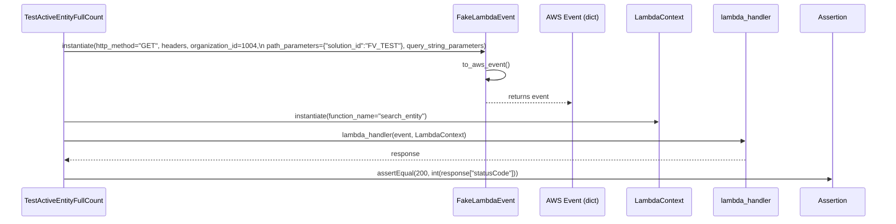
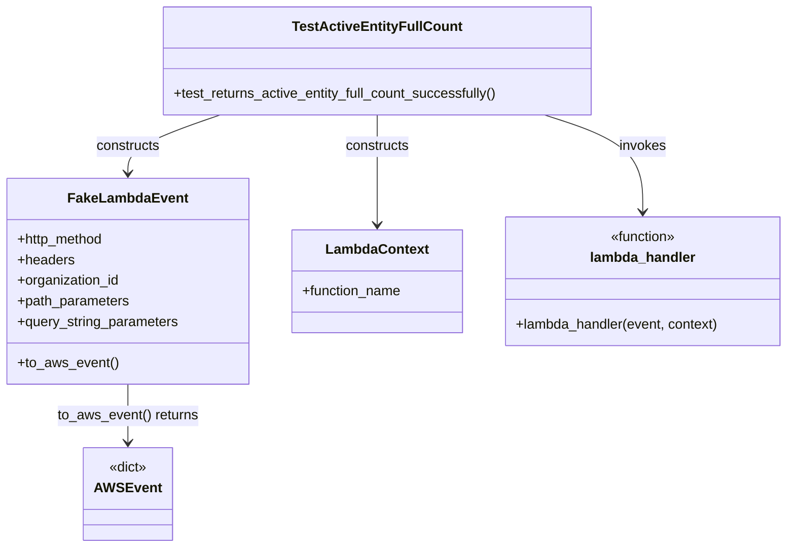

# Diagram: entity_core/entity_service/entity_service_tests/integration_tests/test_active_entity_full_count.py

> Auto-generated by Obscura crawlers

## Diagram 1

### SVG

<svg id="container" width="2130" xmlns="http://www.w3.org/2000/svg" height="537" viewBox="-50 -10 2130 537" role="graphics-document document" aria-roledescription="sequence"><g><rect x="1880" y="451" fill="#eaeaea" stroke="#666" width="150" height="65" name="Assert" rx="3" ry="3" class="actor actor-bottom"></rect><text x="1955" y="483.5" dominant-baseline="central" alignment-baseline="central" class="actor actor-box" style="text-anchor: middle; font-size: 16px; font-weight: 400;"><tspan x="1955" dy="0">Assertion</tspan></text></g><g><rect x="1680" y="451" fill="#eaeaea" stroke="#666" width="150" height="65" name="Handler" rx="3" ry="3" class="actor actor-bottom"></rect><text x="1755" y="483.5" dominant-baseline="central" alignment-baseline="central" class="actor actor-box" style="text-anchor: middle; font-size: 16px; font-weight: 400;"><tspan x="1755" dy="0">lambda_handler</tspan></text></g><g><rect x="1480" y="451" fill="#eaeaea" stroke="#666" width="150" height="65" name="LambdaCtx" rx="3" ry="3" class="actor actor-bottom"></rect><text x="1555" y="483.5" dominant-baseline="central" alignment-baseline="central" class="actor actor-box" style="text-anchor: middle; font-size: 16px; font-weight: 400;"><tspan x="1555" dy="0">LambdaContext</tspan></text></g><g><rect x="1280" y="451" fill="#eaeaea" stroke="#666" width="150" height="65" name="AWSEvent" rx="3" ry="3" class="actor actor-bottom"></rect><text x="1355" y="483.5" dominant-baseline="central" alignment-baseline="central" class="actor actor-box" style="text-anchor: middle; font-size: 16px; font-weight: 400;"><tspan x="1355" dy="0">AWS Event (dict)</tspan></text></g><g><rect x="1079" y="451" fill="#eaeaea" stroke="#666" width="151" height="65" name="FakeEvent" rx="3" ry="3" class="actor actor-bottom"></rect><text x="1154.5" y="483.5" dominant-baseline="central" alignment-baseline="central" class="actor actor-box" style="text-anchor: middle; font-size: 16px; font-weight: 400;"><tspan x="1154.5" dy="0">FakeLambdaEvent</tspan></text></g><g><rect x="0" y="451" fill="#eaeaea" stroke="#666" width="203" height="65" name="Test" rx="3" ry="3" class="actor actor-bottom"></rect><text x="101.5" y="483.5" dominant-baseline="central" alignment-baseline="central" class="actor actor-box" style="text-anchor: middle; font-size: 16px; font-weight: 400;"><tspan x="101.5" dy="0">TestActiveEntityFullCount</tspan></text></g><g><line id="actor5" x1="1955" y1="65" x2="1955" y2="451" class="actor-line 200" stroke-width="0.5px" stroke="#999" name="Assert"></line><g id="root-5"><rect x="1880" y="0" fill="#eaeaea" stroke="#666" width="150" height="65" name="Assert" rx="3" ry="3" class="actor actor-top"></rect><text x="1955" y="32.5" dominant-baseline="central" alignment-baseline="central" class="actor actor-box" style="text-anchor: middle; font-size: 16px; font-weight: 400;"><tspan x="1955" dy="0">Assertion</tspan></text></g></g><g><line id="actor4" x1="1755" y1="65" x2="1755" y2="451" class="actor-line 200" stroke-width="0.5px" stroke="#999" name="Handler"></line><g id="root-4"><rect x="1680" y="0" fill="#eaeaea" stroke="#666" width="150" height="65" name="Handler" rx="3" ry="3" class="actor actor-top"></rect><text x="1755" y="32.5" dominant-baseline="central" alignment-baseline="central" class="actor actor-box" style="text-anchor: middle; font-size: 16px; font-weight: 400;"><tspan x="1755" dy="0">lambda_handler</tspan></text></g></g><g><line id="actor3" x1="1555" y1="65" x2="1555" y2="451" class="actor-line 200" stroke-width="0.5px" stroke="#999" name="LambdaCtx"></line><g id="root-3"><rect x="1480" y="0" fill="#eaeaea" stroke="#666" width="150" height="65" name="LambdaCtx" rx="3" ry="3" class="actor actor-top"></rect><text x="1555" y="32.5" dominant-baseline="central" alignment-baseline="central" class="actor actor-box" style="text-anchor: middle; font-size: 16px; font-weight: 400;"><tspan x="1555" dy="0">LambdaContext</tspan></text></g></g><g><line id="actor2" x1="1355" y1="65" x2="1355" y2="451" class="actor-line 200" stroke-width="0.5px" stroke="#999" name="AWSEvent"></line><g id="root-2"><rect x="1280" y="0" fill="#eaeaea" stroke="#666" width="150" height="65" name="AWSEvent" rx="3" ry="3" class="actor actor-top"></rect><text x="1355" y="32.5" dominant-baseline="central" alignment-baseline="central" class="actor actor-box" style="text-anchor: middle; font-size: 16px; font-weight: 400;"><tspan x="1355" dy="0">AWS Event (dict)</tspan></text></g></g><g><line id="actor1" x1="1154.5" y1="65" x2="1154.5" y2="451" class="actor-line 200" stroke-width="0.5px" stroke="#999" name="FakeEvent"></line><g id="root-1"><rect x="1079" y="0" fill="#eaeaea" stroke="#666" width="151" height="65" name="FakeEvent" rx="3" ry="3" class="actor actor-top"></rect><text x="1154.5" y="32.5" dominant-baseline="central" alignment-baseline="central" class="actor actor-box" style="text-anchor: middle; font-size: 16px; font-weight: 400;"><tspan x="1154.5" dy="0">FakeLambdaEvent</tspan></text></g></g><g><line id="actor0" x1="101.5" y1="65" x2="101.5" y2="451" class="actor-line 200" stroke-width="0.5px" stroke="#999" name="Test"></line><g id="root-0"><rect x="0" y="0" fill="#eaeaea" stroke="#666" width="203" height="65" name="Test" rx="3" ry="3" class="actor actor-top"></rect><text x="101.5" y="32.5" dominant-baseline="central" alignment-baseline="central" class="actor actor-box" style="text-anchor: middle; font-size: 16px; font-weight: 400;"><tspan x="101.5" dy="0">TestActiveEntityFullCount</tspan></text></g></g><g></g><defs><symbol id="computer" width="24" height="24"><path transform="scale(.5)" d="M2 2v13h20v-13h-20zm18 11h-16v-9h16v9zm-10.228 6l.466-1h3.524l.467 1h-4.457zm14.228 3h-24l2-6h2.104l-1.33 4h18.45l-1.297-4h2.073l2 6zm-5-10h-14v-7h14v7z"></path></symbol></defs><defs><symbol id="database" fill-rule="evenodd" clip-rule="evenodd"><path transform="scale(.5)" d="M12.258.001l.256.004.255.005.253.008.251.01.249.012.247.015.246.016.242.019.241.02.239.023.236.024.233.027.231.028.229.031.225.032.223.034.22.036.217.038.214.04.211.041.208.043.205.045.201.046.198.048.194.05.191.051.187.053.183.054.18.056.175.057.172.059.168.06.163.061.16.063.155.064.15.066.074.033.073.033.071.034.07.034.069.035.068.035.067.035.066.035.064.036.064.036.062.036.06.036.06.037.058.037.058.037.055.038.055.038.053.038.052.038.051.039.05.039.048.039.047.039.045.04.044.04.043.04.041.04.04.041.039.041.037.041.036.041.034.041.033.042.032.042.03.042.029.042.027.042.026.043.024.043.023.043.021.043.02.043.018.044.017.043.015.044.013.044.012.044.011.045.009.044.007.045.006.045.004.045.002.045.001.045v17l-.001.045-.002.045-.004.045-.006.045-.007.045-.009.044-.011.045-.012.044-.013.044-.015.044-.017.043-.018.044-.02.043-.021.043-.023.043-.024.043-.026.043-.027.042-.029.042-.03.042-.032.042-.033.042-.034.041-.036.041-.037.041-.039.041-.04.041-.041.04-.043.04-.044.04-.045.04-.047.039-.048.039-.05.039-.051.039-.052.038-.053.038-.055.038-.055.038-.058.037-.058.037-.06.037-.06.036-.062.036-.064.036-.064.036-.066.035-.067.035-.068.035-.069.035-.07.034-.071.034-.073.033-.074.033-.15.066-.155.064-.16.063-.163.061-.168.06-.172.059-.175.057-.18.056-.183.054-.187.053-.191.051-.194.05-.198.048-.201.046-.205.045-.208.043-.211.041-.214.04-.217.038-.22.036-.223.034-.225.032-.229.031-.231.028-.233.027-.236.024-.239.023-.241.02-.242.019-.246.016-.247.015-.249.012-.251.01-.253.008-.255.005-.256.004-.258.001-.258-.001-.256-.004-.255-.005-.253-.008-.251-.01-.249-.012-.247-.015-.245-.016-.243-.019-.241-.02-.238-.023-.236-.024-.234-.027-.231-.028-.228-.031-.226-.032-.223-.034-.22-.036-.217-.038-.214-.04-.211-.041-.208-.043-.204-.045-.201-.046-.198-.048-.195-.05-.19-.051-.187-.053-.184-.054-.179-.056-.176-.057-.172-.059-.167-.06-.164-.061-.159-.063-.155-.064-.151-.066-.074-.033-.072-.033-.072-.034-.07-.034-.069-.035-.068-.035-.067-.035-.066-.035-.064-.036-.063-.036-.062-.036-.061-.036-.06-.037-.058-.037-.057-.037-.056-.038-.055-.038-.053-.038-.052-.038-.051-.039-.049-.039-.049-.039-.046-.039-.046-.04-.044-.04-.043-.04-.041-.04-.04-.041-.039-.041-.037-.041-.036-.041-.034-.041-.033-.042-.032-.042-.03-.042-.029-.042-.027-.042-.026-.043-.024-.043-.023-.043-.021-.043-.02-.043-.018-.044-.017-.043-.015-.044-.013-.044-.012-.044-.011-.045-.009-.044-.007-.045-.006-.045-.004-.045-.002-.045-.001-.045v-17l.001-.045.002-.045.004-.045.006-.045.007-.045.009-.044.011-.045.012-.044.013-.044.015-.044.017-.043.018-.044.02-.043.021-.043.023-.043.024-.043.026-.043.027-.042.029-.042.03-.042.032-.042.033-.042.034-.041.036-.041.037-.041.039-.041.04-.041.041-.04.043-.04.044-.04.046-.04.046-.039.049-.039.049-.039.051-.039.052-.038.053-.038.055-.038.056-.038.057-.037.058-.037.06-.037.061-.036.062-.036.063-.036.064-.036.066-.035.067-.035.068-.035.069-.035.07-.034.072-.034.072-.033.074-.033.151-.066.155-.064.159-.063.164-.061.167-.06.172-.059.176-.057.179-.056.184-.054.187-.053.19-.051.195-.05.198-.048.201-.046.204-.045.208-.043.211-.041.214-.04.217-.038.22-.036.223-.034.226-.032.228-.031.231-.028.234-.027.236-.024.238-.023.241-.02.243-.019.245-.016.247-.015.249-.012.251-.01.253-.008.255-.005.256-.004.258-.001.258.001zm-9.258 20.499v.01l.001.021.003.021.004.022.005.021.006.022.007.022.009.023.01.022.011.023.012.023.013.023.015.023.016.024.017.023.018.024.019.024.021.024.022.025.023.024.024.025.052.049.056.05.061.051.066.051.07.051.075.051.079.052.084.052.088.052.092.052.097.052.102.051.105.052.11.052.114.051.119.051.123.051.127.05.131.05.135.05.139.048.144.049.147.047.152.047.155.047.16.045.163.045.167.043.171.043.176.041.178.041.183.039.187.039.19.037.194.035.197.035.202.033.204.031.209.03.212.029.216.027.219.025.222.024.226.021.23.02.233.018.236.016.24.015.243.012.246.01.249.008.253.005.256.004.259.001.26-.001.257-.004.254-.005.25-.008.247-.011.244-.012.241-.014.237-.016.233-.018.231-.021.226-.021.224-.024.22-.026.216-.027.212-.028.21-.031.205-.031.202-.034.198-.034.194-.036.191-.037.187-.039.183-.04.179-.04.175-.042.172-.043.168-.044.163-.045.16-.046.155-.046.152-.047.148-.048.143-.049.139-.049.136-.05.131-.05.126-.05.123-.051.118-.052.114-.051.11-.052.106-.052.101-.052.096-.052.092-.052.088-.053.083-.051.079-.052.074-.052.07-.051.065-.051.06-.051.056-.05.051-.05.023-.024.023-.025.021-.024.02-.024.019-.024.018-.024.017-.024.015-.023.014-.024.013-.023.012-.023.01-.023.01-.022.008-.022.006-.022.006-.022.004-.022.004-.021.001-.021.001-.021v-4.127l-.077.055-.08.053-.083.054-.085.053-.087.052-.09.052-.093.051-.095.05-.097.05-.1.049-.102.049-.105.048-.106.047-.109.047-.111.046-.114.045-.115.045-.118.044-.12.043-.122.042-.124.042-.126.041-.128.04-.13.04-.132.038-.134.038-.135.037-.138.037-.139.035-.142.035-.143.034-.144.033-.147.032-.148.031-.15.03-.151.03-.153.029-.154.027-.156.027-.158.026-.159.025-.161.024-.162.023-.163.022-.165.021-.166.02-.167.019-.169.018-.169.017-.171.016-.173.015-.173.014-.175.013-.175.012-.177.011-.178.01-.179.008-.179.008-.181.006-.182.005-.182.004-.184.003-.184.002h-.37l-.184-.002-.184-.003-.182-.004-.182-.005-.181-.006-.179-.008-.179-.008-.178-.01-.176-.011-.176-.012-.175-.013-.173-.014-.172-.015-.171-.016-.17-.017-.169-.018-.167-.019-.166-.02-.165-.021-.163-.022-.162-.023-.161-.024-.159-.025-.157-.026-.156-.027-.155-.027-.153-.029-.151-.03-.15-.03-.148-.031-.146-.032-.145-.033-.143-.034-.141-.035-.14-.035-.137-.037-.136-.037-.134-.038-.132-.038-.13-.04-.128-.04-.126-.041-.124-.042-.122-.042-.12-.044-.117-.043-.116-.045-.113-.045-.112-.046-.109-.047-.106-.047-.105-.048-.102-.049-.1-.049-.097-.05-.095-.05-.093-.052-.09-.051-.087-.052-.085-.053-.083-.054-.08-.054-.077-.054v4.127zm0-5.654v.011l.001.021.003.021.004.021.005.022.006.022.007.022.009.022.01.022.011.023.012.023.013.023.015.024.016.023.017.024.018.024.019.024.021.024.022.024.023.025.024.024.052.05.056.05.061.05.066.051.07.051.075.052.079.051.084.052.088.052.092.052.097.052.102.052.105.052.11.051.114.051.119.052.123.05.127.051.131.05.135.049.139.049.144.048.147.048.152.047.155.046.16.045.163.045.167.044.171.042.176.042.178.04.183.04.187.038.19.037.194.036.197.034.202.033.204.032.209.03.212.028.216.027.219.025.222.024.226.022.23.02.233.018.236.016.24.014.243.012.246.01.249.008.253.006.256.003.259.001.26-.001.257-.003.254-.006.25-.008.247-.01.244-.012.241-.015.237-.016.233-.018.231-.02.226-.022.224-.024.22-.025.216-.027.212-.029.21-.03.205-.032.202-.033.198-.035.194-.036.191-.037.187-.039.183-.039.179-.041.175-.042.172-.043.168-.044.163-.045.16-.045.155-.047.152-.047.148-.048.143-.048.139-.05.136-.049.131-.05.126-.051.123-.051.118-.051.114-.052.11-.052.106-.052.101-.052.096-.052.092-.052.088-.052.083-.052.079-.052.074-.051.07-.052.065-.051.06-.05.056-.051.051-.049.023-.025.023-.024.021-.025.02-.024.019-.024.018-.024.017-.024.015-.023.014-.023.013-.024.012-.022.01-.023.01-.023.008-.022.006-.022.006-.022.004-.021.004-.022.001-.021.001-.021v-4.139l-.077.054-.08.054-.083.054-.085.052-.087.053-.09.051-.093.051-.095.051-.097.05-.1.049-.102.049-.105.048-.106.047-.109.047-.111.046-.114.045-.115.044-.118.044-.12.044-.122.042-.124.042-.126.041-.128.04-.13.039-.132.039-.134.038-.135.037-.138.036-.139.036-.142.035-.143.033-.144.033-.147.033-.148.031-.15.03-.151.03-.153.028-.154.028-.156.027-.158.026-.159.025-.161.024-.162.023-.163.022-.165.021-.166.02-.167.019-.169.018-.169.017-.171.016-.173.015-.173.014-.175.013-.175.012-.177.011-.178.009-.179.009-.179.007-.181.007-.182.005-.182.004-.184.003-.184.002h-.37l-.184-.002-.184-.003-.182-.004-.182-.005-.181-.007-.179-.007-.179-.009-.178-.009-.176-.011-.176-.012-.175-.013-.173-.014-.172-.015-.171-.016-.17-.017-.169-.018-.167-.019-.166-.02-.165-.021-.163-.022-.162-.023-.161-.024-.159-.025-.157-.026-.156-.027-.155-.028-.153-.028-.151-.03-.15-.03-.148-.031-.146-.033-.145-.033-.143-.033-.141-.035-.14-.036-.137-.036-.136-.037-.134-.038-.132-.039-.13-.039-.128-.04-.126-.041-.124-.042-.122-.043-.12-.043-.117-.044-.116-.044-.113-.046-.112-.046-.109-.046-.106-.047-.105-.048-.102-.049-.1-.049-.097-.05-.095-.051-.093-.051-.09-.051-.087-.053-.085-.052-.083-.054-.08-.054-.077-.054v4.139zm0-5.666v.011l.001.02.003.022.004.021.005.022.006.021.007.022.009.023.01.022.011.023.012.023.013.023.015.023.016.024.017.024.018.023.019.024.021.025.022.024.023.024.024.025.052.05.056.05.061.05.066.051.07.051.075.052.079.051.084.052.088.052.092.052.097.052.102.052.105.051.11.052.114.051.119.051.123.051.127.05.131.05.135.05.139.049.144.048.147.048.152.047.155.046.16.045.163.045.167.043.171.043.176.042.178.04.183.04.187.038.19.037.194.036.197.034.202.033.204.032.209.03.212.028.216.027.219.025.222.024.226.021.23.02.233.018.236.017.24.014.243.012.246.01.249.008.253.006.256.003.259.001.26-.001.257-.003.254-.006.25-.008.247-.01.244-.013.241-.014.237-.016.233-.018.231-.02.226-.022.224-.024.22-.025.216-.027.212-.029.21-.03.205-.032.202-.033.198-.035.194-.036.191-.037.187-.039.183-.039.179-.041.175-.042.172-.043.168-.044.163-.045.16-.045.155-.047.152-.047.148-.048.143-.049.139-.049.136-.049.131-.051.126-.05.123-.051.118-.052.114-.051.11-.052.106-.052.101-.052.096-.052.092-.052.088-.052.083-.052.079-.052.074-.052.07-.051.065-.051.06-.051.056-.05.051-.049.023-.025.023-.025.021-.024.02-.024.019-.024.018-.024.017-.024.015-.023.014-.024.013-.023.012-.023.01-.022.01-.023.008-.022.006-.022.006-.022.004-.022.004-.021.001-.021.001-.021v-4.153l-.077.054-.08.054-.083.053-.085.053-.087.053-.09.051-.093.051-.095.051-.097.05-.1.049-.102.048-.105.048-.106.048-.109.046-.111.046-.114.046-.115.044-.118.044-.12.043-.122.043-.124.042-.126.041-.128.04-.13.039-.132.039-.134.038-.135.037-.138.036-.139.036-.142.034-.143.034-.144.033-.147.032-.148.032-.15.03-.151.03-.153.028-.154.028-.156.027-.158.026-.159.024-.161.024-.162.023-.163.023-.165.021-.166.02-.167.019-.169.018-.169.017-.171.016-.173.015-.173.014-.175.013-.175.012-.177.01-.178.01-.179.009-.179.007-.181.006-.182.006-.182.004-.184.003-.184.001-.185.001-.185-.001-.184-.001-.184-.003-.182-.004-.182-.006-.181-.006-.179-.007-.179-.009-.178-.01-.176-.01-.176-.012-.175-.013-.173-.014-.172-.015-.171-.016-.17-.017-.169-.018-.167-.019-.166-.02-.165-.021-.163-.023-.162-.023-.161-.024-.159-.024-.157-.026-.156-.027-.155-.028-.153-.028-.151-.03-.15-.03-.148-.032-.146-.032-.145-.033-.143-.034-.141-.034-.14-.036-.137-.036-.136-.037-.134-.038-.132-.039-.13-.039-.128-.041-.126-.041-.124-.041-.122-.043-.12-.043-.117-.044-.116-.044-.113-.046-.112-.046-.109-.046-.106-.048-.105-.048-.102-.048-.1-.05-.097-.049-.095-.051-.093-.051-.09-.052-.087-.052-.085-.053-.083-.053-.08-.054-.077-.054v4.153zm8.74-8.179l-.257.004-.254.005-.25.008-.247.011-.244.012-.241.014-.237.016-.233.018-.231.021-.226.022-.224.023-.22.026-.216.027-.212.028-.21.031-.205.032-.202.033-.198.034-.194.036-.191.038-.187.038-.183.04-.179.041-.175.042-.172.043-.168.043-.163.045-.16.046-.155.046-.152.048-.148.048-.143.048-.139.049-.136.05-.131.05-.126.051-.123.051-.118.051-.114.052-.11.052-.106.052-.101.052-.096.052-.092.052-.088.052-.083.052-.079.052-.074.051-.07.052-.065.051-.06.05-.056.05-.051.05-.023.025-.023.024-.021.024-.02.025-.019.024-.018.024-.017.023-.015.024-.014.023-.013.023-.012.023-.01.023-.01.022-.008.022-.006.023-.006.021-.004.022-.004.021-.001.021-.001.021.001.021.001.021.004.021.004.022.006.021.006.023.008.022.01.022.01.023.012.023.013.023.014.023.015.024.017.023.018.024.019.024.02.025.021.024.023.024.023.025.051.05.056.05.06.05.065.051.07.052.074.051.079.052.083.052.088.052.092.052.096.052.101.052.106.052.11.052.114.052.118.051.123.051.126.051.131.05.136.05.139.049.143.048.148.048.152.048.155.046.16.046.163.045.168.043.172.043.175.042.179.041.183.04.187.038.191.038.194.036.198.034.202.033.205.032.21.031.212.028.216.027.22.026.224.023.226.022.231.021.233.018.237.016.241.014.244.012.247.011.25.008.254.005.257.004.26.001.26-.001.257-.004.254-.005.25-.008.247-.011.244-.012.241-.014.237-.016.233-.018.231-.021.226-.022.224-.023.22-.026.216-.027.212-.028.21-.031.205-.032.202-.033.198-.034.194-.036.191-.038.187-.038.183-.04.179-.041.175-.042.172-.043.168-.043.163-.045.16-.046.155-.046.152-.048.148-.048.143-.048.139-.049.136-.05.131-.05.126-.051.123-.051.118-.051.114-.052.11-.052.106-.052.101-.052.096-.052.092-.052.088-.052.083-.052.079-.052.074-.051.07-.052.065-.051.06-.05.056-.05.051-.05.023-.025.023-.024.021-.024.02-.025.019-.024.018-.024.017-.023.015-.024.014-.023.013-.023.012-.023.01-.023.01-.022.008-.022.006-.023.006-.021.004-.022.004-.021.001-.021.001-.021-.001-.021-.001-.021-.004-.021-.004-.022-.006-.021-.006-.023-.008-.022-.01-.022-.01-.023-.012-.023-.013-.023-.014-.023-.015-.024-.017-.023-.018-.024-.019-.024-.02-.025-.021-.024-.023-.024-.023-.025-.051-.05-.056-.05-.06-.05-.065-.051-.07-.052-.074-.051-.079-.052-.083-.052-.088-.052-.092-.052-.096-.052-.101-.052-.106-.052-.11-.052-.114-.052-.118-.051-.123-.051-.126-.051-.131-.05-.136-.05-.139-.049-.143-.048-.148-.048-.152-.048-.155-.046-.16-.046-.163-.045-.168-.043-.172-.043-.175-.042-.179-.041-.183-.04-.187-.038-.191-.038-.194-.036-.198-.034-.202-.033-.205-.032-.21-.031-.212-.028-.216-.027-.22-.026-.224-.023-.226-.022-.231-.021-.233-.018-.237-.016-.241-.014-.244-.012-.247-.011-.25-.008-.254-.005-.257-.004-.26-.001-.26.001z"></path></symbol></defs><defs><symbol id="clock" width="24" height="24"><path transform="scale(.5)" d="M12 2c5.514 0 10 4.486 10 10s-4.486 10-10 10-10-4.486-10-10 4.486-10 10-10zm0-2c-6.627 0-12 5.373-12 12s5.373 12 12 12 12-5.373 12-12-5.373-12-12-12zm5.848 12.459c.202.038.202.333.001.372-1.907.361-6.045 1.111-6.547 1.111-.719 0-1.301-.582-1.301-1.301 0-.512.77-5.447 1.125-7.445.034-.192.312-.181.343.014l.985 6.238 5.394 1.011z"></path></symbol></defs><defs><marker id="arrowhead" refX="7.9" refY="5" markerUnits="userSpaceOnUse" markerWidth="12" markerHeight="12" orient="auto-start-reverse"><path d="M -1 0 L 10 5 L 0 10 z"></path></marker></defs><defs><marker id="crosshead" markerWidth="15" markerHeight="8" orient="auto" refX="4" refY="4.5"><path fill="none" stroke="#000000" stroke-width="1pt" d="M 1,2 L 6,7 M 6,2 L 1,7" style="stroke-dasharray: 0, 0;"></path></marker></defs><defs><marker id="filled-head" refX="15.5" refY="7" markerWidth="20" markerHeight="28" orient="auto"><path d="M 18,7 L9,13 L14,7 L9,1 Z"></path></marker></defs><defs><marker id="sequencenumber" refX="15" refY="15" markerWidth="60" markerHeight="40" orient="auto"><circle cx="15" cy="15" r="6"></circle></marker></defs><text x="627" y="80" text-anchor="middle" dominant-baseline="middle" alignment-baseline="middle" class="messageText" dy="1em" style="font-size: 16px; font-weight: 400;">instantiate(http_method="GET", headers, organization_id=1004,\n  path_parameters={"solution_id":"FV_TEST"}, query_string_parameters)</text><line x1="102.5" y1="113" x2="1150.5" y2="113" class="messageLine0" stroke-width="2" stroke="none" marker-end="url(#arrowhead)" style="fill: none;"></line><text x="1156" y="128" text-anchor="middle" dominant-baseline="middle" alignment-baseline="middle" class="messageText" dy="1em" style="font-size: 16px; font-weight: 400;">to_aws_event()</text><path d="M 1155.5,161 C 1215.5,151 1215.5,191 1155.5,181" class="messageLine0" stroke-width="2" stroke="none" marker-end="url(#arrowhead)" style="fill: none;"></path><text x="1253" y="206" text-anchor="middle" dominant-baseline="middle" alignment-baseline="middle" class="messageText" dy="1em" style="font-size: 16px; font-weight: 400;">returns event</text><line x1="1155.5" y1="239" x2="1351" y2="239" class="messageLine1" stroke-width="2" stroke="none" marker-end="url(#arrowhead)" style="stroke-dasharray: 3, 3; fill: none;"></line><text x="827" y="254" text-anchor="middle" dominant-baseline="middle" alignment-baseline="middle" class="messageText" dy="1em" style="font-size: 16px; font-weight: 400;">instantiate(function_name="search_entity")</text><line x1="102.5" y1="287" x2="1551" y2="287" class="messageLine0" stroke-width="2" stroke="none" marker-end="url(#arrowhead)" style="fill: none;"></line><text x="927" y="302" text-anchor="middle" dominant-baseline="middle" alignment-baseline="middle" class="messageText" dy="1em" style="font-size: 16px; font-weight: 400;">lambda_handler(event, LambdaContext)</text><line x1="102.5" y1="335" x2="1751" y2="335" class="messageLine0" stroke-width="2" stroke="none" marker-end="url(#arrowhead)" style="fill: none;"></line><text x="930" y="350" text-anchor="middle" dominant-baseline="middle" alignment-baseline="middle" class="messageText" dy="1em" style="font-size: 16px; font-weight: 400;">response</text><line x1="1754" y1="383" x2="105.5" y2="383" class="messageLine1" stroke-width="2" stroke="none" marker-end="url(#arrowhead)" style="stroke-dasharray: 3, 3; fill: none;"></line><text x="1027" y="398" text-anchor="middle" dominant-baseline="middle" alignment-baseline="middle" class="messageText" dy="1em" style="font-size: 16px; font-weight: 400;">assertEqual(200, int(response["statusCode"]))</text><line x1="102.5" y1="431" x2="1951" y2="431" class="messageLine0" stroke-width="2" stroke="none" marker-end="url(#arrowhead)" style="fill: none;"></line></svg>

## Diagram 2

### SVG

<svg id="container" width="918.5625" xmlns="http://www.w3.org/2000/svg" class="classDiagram" height="638" viewBox="0 0 918.5625 638" role="graphics-document document" aria-roledescription="class"><g><defs><marker id="container_class-aggregationStart" class="marker aggregation class" refX="18" refY="7" markerWidth="190" markerHeight="240" orient="auto"><path d="M 18,7 L9,13 L1,7 L9,1 Z"></path></marker></defs><defs><marker id="container_class-aggregationEnd" class="marker aggregation class" refX="1" refY="7" markerWidth="20" markerHeight="28" orient="auto"><path d="M 18,7 L9,13 L1,7 L9,1 Z"></path></marker></defs><defs><marker id="container_class-extensionStart" class="marker extension class" refX="18" refY="7" markerWidth="190" markerHeight="240" orient="auto"><path d="M 1,7 L18,13 V 1 Z"></path></marker></defs><defs><marker id="container_class-extensionEnd" class="marker extension class" refX="1" refY="7" markerWidth="20" markerHeight="28" orient="auto"><path d="M 1,1 V 13 L18,7 Z"></path></marker></defs><defs><marker id="container_class-compositionStart" class="marker composition class" refX="18" refY="7" markerWidth="190" markerHeight="240" orient="auto"><path d="M 18,7 L9,13 L1,7 L9,1 Z"></path></marker></defs><defs><marker id="container_class-compositionEnd" class="marker composition class" refX="1" refY="7" markerWidth="20" markerHeight="28" orient="auto"><path d="M 18,7 L9,13 L1,7 L9,1 Z"></path></marker></defs><defs><marker id="container_class-dependencyStart" class="marker dependency class" refX="6" refY="7" markerWidth="190" markerHeight="240" orient="auto"><path d="M 5,7 L9,13 L1,7 L9,1 Z"></path></marker></defs><defs><marker id="container_class-dependencyEnd" class="marker dependency class" refX="13" refY="7" markerWidth="20" markerHeight="28" orient="auto"><path d="M 18,7 L9,13 L14,7 L9,1 Z"></path></marker></defs><defs><marker id="container_class-lollipopStart" class="marker lollipop class" refX="13" refY="7" markerWidth="190" markerHeight="240" orient="auto"><circle stroke="black" fill="transparent" cx="7" cy="7" r="6"></circle></marker></defs><defs><marker id="container_class-lollipopEnd" class="marker lollipop class" refX="1" refY="7" markerWidth="190" markerHeight="240" orient="auto"><circle stroke="black" fill="transparent" cx="7" cy="7" r="6"></circle></marker></defs><g class="root"><g class="clusters"></g><g class="edgePaths"><path d="M254.914,134L237.08,140.167C219.246,146.333,183.578,158.667,165.744,170C147.91,181.333,147.91,191.667,147.91,196.833L147.91,202" id="id_TestActiveEntityFullCount_FakeLambdaEvent_1" class="edge-thickness-normal edge-pattern-solid relation" style=";;;" data-edge="true" data-et="edge" data-id="id_TestActiveEntityFullCount_FakeLambdaEvent_1" data-points="W3sieCI6MjU0LjkxMzg2NzE4NzUsInkiOjEzNH0seyJ4IjoxNDcuOTEwMTU2MjUsInkiOjE3MX0seyJ4IjoxNDcuOTEwMTU2MjUsInkiOjIwOH1d" marker-end="url(#container_class-dependencyEnd)"></path><path d="M437.109,134L437.109,140.167C437.109,146.333,437.109,158.667,437.109,180C437.109,201.333,437.109,231.667,437.109,246.833L437.109,262" id="id_TestActiveEntityFullCount_LambdaContext_2" class="edge-thickness-normal edge-pattern-solid relation" style=";;;" data-edge="true" data-et="edge" data-id="id_TestActiveEntityFullCount_LambdaContext_2" data-points="W3sieCI6NDM3LjEwOTM3NSwieSI6MTM0fSx7IngiOjQzNy4xMDkzNzUsInkiOjE3MX0seyJ4Ijo0MzcuMTA5Mzc1LCJ5IjoyNjh9XQ==" marker-end="url(#container_class-dependencyEnd)"></path><path d="M633.273,134L652.474,140.167C671.676,146.333,710.078,158.667,729.279,177.5C748.48,196.333,748.48,221.667,748.48,234.333L748.48,247" id="id_TestActiveEntityFullCount_lambda_handler_3" class="edge-thickness-normal edge-pattern-solid relation" style=";;;" data-edge="true" data-et="edge" data-id="id_TestActiveEntityFullCount_lambda_handler_3" data-points="W3sieCI6NjMzLjI3MzE2NDA2MjUsInkiOjEzNH0seyJ4Ijo3NDguNDgwNDY4NzUsInkiOjE3MX0seyJ4Ijo3NDguNDgwNDY4NzUsInkiOjI1M31d" marker-end="url(#container_class-dependencyEnd)"></path><path d="M147.91,448L147.91,454.167C147.91,460.333,147.91,472.667,147.91,484C147.91,495.333,147.91,505.667,147.91,510.833L147.91,516" id="id_FakeLambdaEvent_AWSEvent_4" class="edge-thickness-normal edge-pattern-solid relation" style=";;;" data-edge="true" data-et="edge" data-id="id_FakeLambdaEvent_AWSEvent_4" data-points="W3sieCI6MTQ3LjkxMDE1NjI1LCJ5Ijo0NDh9LHsieCI6MTQ3LjkxMDE1NjI1LCJ5Ijo0ODV9LHsieCI6MTQ3LjkxMDE1NjI1LCJ5Ijo1MjJ9XQ==" marker-end="url(#container_class-dependencyEnd)"></path></g><g class="edgeLabels"><g class="edgeLabel" transform="translate(147.91015625, 171)"><g class="label" data-id="id_TestActiveEntityFullCount_FakeLambdaEvent_1" transform="translate(-37.84375, -12)"><foreignObject width="75.6875" height="24">

constructs

</foreignObject></g></g><g class="edgeLabel" transform="translate(437.109375, 171)"><g class="label" data-id="id_TestActiveEntityFullCount_LambdaContext_2" transform="translate(-37.84375, -12)"><foreignObject width="75.6875" height="24">

constructs

</foreignObject></g></g><g class="edgeLabel" transform="translate(748.48046875, 171)"><g class="label" data-id="id_TestActiveEntityFullCount_lambda_handler_3" transform="translate(-27.5859375, -12)"><foreignObject width="55.171875" height="24">

invokes

</foreignObject></g></g><g class="edgeLabel" transform="translate(147.91015625, 485)"><g class="label" data-id="id_FakeLambdaEvent_AWSEvent_4" transform="translate(-82.640625, -12)"><foreignObject width="165.28125" height="24">

to_aws_event() returns

</foreignObject></g></g></g><g class="nodes"><g class="node default" id="classId-TestActiveEntityFullCount-0" transform="translate(437.109375, 71)"><g class="basic label-container"><path d="M-250.02734375 -63 L250.02734375 -63 L250.02734375 63 L-250.02734375 63" stroke="none" stroke-width="0" fill="#ECECFF" style=""></path><path d="M-250.02734375 -63 C-89.70173011945718 -63, 70.62388351108564 -63, 250.02734375 -63 M-250.02734375 -63 C-110.09634406659686 -63, 29.834655616806288 -63, 250.02734375 -63 M250.02734375 -63 C250.02734375 -26.356005091701462, 250.02734375 10.287989816597076, 250.02734375 63 M250.02734375 -63 C250.02734375 -13.987325130715007, 250.02734375 35.025349738569986, 250.02734375 63 M250.02734375 63 C86.3597783130476 63, -77.3077871239048 63, -250.02734375 63 M250.02734375 63 C57.751889740322184 63, -134.52356426935563 63, -250.02734375 63 M-250.02734375 63 C-250.02734375 27.33732429512243, -250.02734375 -8.325351409755143, -250.02734375 -63 M-250.02734375 63 C-250.02734375 23.70542963986604, -250.02734375 -15.58914072026792, -250.02734375 -63" stroke="#9370DB" stroke-width="1.3" fill="none" stroke-dasharray="0 0" style=""></path></g><g class="annotation-group text" transform="translate(0, -39)"></g><g class="label-group text" transform="translate(-93.2109375, -39)"><g class="label" style="font-weight: bolder" transform="translate(0,-12)"><foreignObject width="186.421875" height="24">

TestActiveEntityFullCount

</foreignObject></g></g><g class="members-group text" transform="translate(-238.02734375, 9)"></g><g class="methods-group text" transform="translate(-238.02734375, 39)"><g class="label" style="" transform="translate(0,-12)"><foreignObject width="382.84375" height="24">

+test_returns_active_entity_full_count_successfully()

</foreignObject></g></g><g class="divider" style=""><path d="M-250.02734375 -15 C-145.22610388828343 -15, -40.424864026566866 -15, 250.02734375 -15 M-250.02734375 -15 C-104.09297908901505 -15, 41.84138557196991 -15, 250.02734375 -15" stroke="#9370DB" stroke-width="1.3" fill="none" stroke-dasharray="0 0" style=""></path></g><g class="divider" style=""><path d="M-250.02734375 9 C-83.86509586697889 9, 82.29715201604222 9, 250.02734375 9 M-250.02734375 9 C-128.29413718572738 9, -6.560930621454759 9, 250.02734375 9" stroke="#9370DB" stroke-width="1.3" fill="none" stroke-dasharray="0 0" style=""></path></g></g><g class="node default" id="classId-FakeLambdaEvent-1" transform="translate(147.91015625, 328)"><g class="basic label-container"><path d="M-139.91015625 -120 L139.91015625 -120 L139.91015625 120 L-139.91015625 120" stroke="none" stroke-width="0" fill="#ECECFF" style=""></path><path d="M-139.91015625 -120 C-47.49406901839919 -120, 44.922018213201625 -120, 139.91015625 -120 M-139.91015625 -120 C-50.16718486063846 -120, 39.575786528723086 -120, 139.91015625 -120 M139.91015625 -120 C139.91015625 -36.39678979258859, 139.91015625 47.206420414822816, 139.91015625 120 M139.91015625 -120 C139.91015625 -28.15196306976921, 139.91015625 63.69607386046158, 139.91015625 120 M139.91015625 120 C53.53381329501558 120, -32.84252965996885 120, -139.91015625 120 M139.91015625 120 C48.91802736376516 120, -42.074101522469675 120, -139.91015625 120 M-139.91015625 120 C-139.91015625 29.311456982538047, -139.91015625 -61.377086034923906, -139.91015625 -120 M-139.91015625 120 C-139.91015625 43.37901656086338, -139.91015625 -33.241966878273246, -139.91015625 -120" stroke="#9370DB" stroke-width="1.3" fill="none" stroke-dasharray="0 0" style=""></path></g><g class="annotation-group text" transform="translate(0, -96)"></g><g class="label-group text" transform="translate(-65.8671875, -96)"><g class="label" style="font-weight: bolder" transform="translate(0,-12)"><foreignObject width="131.734375" height="24">

FakeLambdaEvent

</foreignObject></g></g><g class="members-group text" transform="translate(-127.91015625, -48)"><g class="label" style="" transform="translate(0,-12)"><foreignObject width="102.921875" height="24">

+http_method

</foreignObject></g><g class="label" style="" transform="translate(0,12)"><foreignObject width="66.328125" height="24">

+headers

</foreignObject></g><g class="label" style="" transform="translate(0,36)"><foreignObject width="120.75" height="24">

+organization_id

</foreignObject></g><g class="label" style="" transform="translate(0,60)"><foreignObject width="131.96875" height="24">

+path_parameters

</foreignObject></g><g class="label" style="" transform="translate(0,84)"><foreignObject width="189.953125" height="24">

+query_string_parameters

</foreignObject></g></g><g class="methods-group text" transform="translate(-127.91015625, 96)"><g class="label" style="" transform="translate(0,-12)"><foreignObject width="116.421875" height="24">

+to_aws_event()

</foreignObject></g></g><g class="divider" style=""><path d="M-139.91015625 -72 C-81.11104538947053 -72, -22.311934528941066 -72, 139.91015625 -72 M-139.91015625 -72 C-37.54210994013444 -72, 64.82593636973112 -72, 139.91015625 -72" stroke="#9370DB" stroke-width="1.3" fill="none" stroke-dasharray="0 0" style=""></path></g><g class="divider" style=""><path d="M-139.91015625 72 C-56.07879288538082 72, 27.752570479238358 72, 139.91015625 72 M-139.91015625 72 C-50.14582176333715 72, 39.61851272332569 72, 139.91015625 72" stroke="#9370DB" stroke-width="1.3" fill="none" stroke-dasharray="0 0" style=""></path></g></g><g class="node default" id="classId-AWSEvent-2" transform="translate(147.91015625, 576)"><g class="basic label-container"><path d="M-48.203125 -54 L48.203125 -54 L48.203125 54 L-48.203125 54" stroke="none" stroke-width="0" fill="#ECECFF" style=""></path><path d="M-48.203125 -54 C-28.458892619317094 -54, -8.714660238634188 -54, 48.203125 -54 M-48.203125 -54 C-28.79769950740719 -54, -9.392274014814383 -54, 48.203125 -54 M48.203125 -54 C48.203125 -25.125707196135966, 48.203125 3.7485856077280673, 48.203125 54 M48.203125 -54 C48.203125 -19.62977837496181, 48.203125 14.740443250076382, 48.203125 54 M48.203125 54 C18.1168294012381 54, -11.9694661975238 54, -48.203125 54 M48.203125 54 C14.4251009185908 54, -19.3529231628184 54, -48.203125 54 M-48.203125 54 C-48.203125 28.404232575560354, -48.203125 2.808465151120707, -48.203125 -54 M-48.203125 54 C-48.203125 26.7247662316065, -48.203125 -0.5504675367869964, -48.203125 -54" stroke="#9370DB" stroke-width="1.3" fill="none" stroke-dasharray="0 0" style=""></path></g><g class="annotation-group text" transform="translate(-22.7265625, -30)"><g class="label" style="" transform="translate(0,-12)"><foreignObject width="45.453125" height="24">

«dict»

</foreignObject></g></g><g class="label-group text" transform="translate(-36.203125, -6)"><g class="label" style="font-weight: bolder" transform="translate(0,-12)"><foreignObject width="72.40625" height="24">

AWSEvent

</foreignObject></g></g><g class="members-group text" transform="translate(-36.203125, 42)"></g><g class="methods-group text" transform="translate(-36.203125, 72)"></g><g class="divider" style=""><path d="M-48.203125 18 C-14.473744296342922 18, 19.255636407314157 18, 48.203125 18 M-48.203125 18 C-23.801813744204992 18, 0.5994975115900161 18, 48.203125 18" stroke="#9370DB" stroke-width="1.3" fill="none" stroke-dasharray="0 0" style=""></path></g><g class="divider" style=""><path d="M-48.203125 36 C-24.814840385147527 36, -1.426555770295053 36, 48.203125 36 M-48.203125 36 C-23.731382086200032 36, 0.740360827599936 36, 48.203125 36" stroke="#9370DB" stroke-width="1.3" fill="none" stroke-dasharray="0 0" style=""></path></g></g><g class="node default" id="classId-LambdaContext-3" transform="translate(437.109375, 328)"><g class="basic label-container"><path d="M-99.2890625 -60 L99.2890625 -60 L99.2890625 60 L-99.2890625 60" stroke="none" stroke-width="0" fill="#ECECFF" style=""></path><path d="M-99.2890625 -60 C-50.624626702971334 -60, -1.9601909059426674 -60, 99.2890625 -60 M-99.2890625 -60 C-21.869100393559805 -60, 55.55086171288039 -60, 99.2890625 -60 M99.2890625 -60 C99.2890625 -34.14836160771283, 99.2890625 -8.29672321542565, 99.2890625 60 M99.2890625 -60 C99.2890625 -13.198880184590934, 99.2890625 33.60223963081813, 99.2890625 60 M99.2890625 60 C30.164602194323408 60, -38.959858111353185 60, -99.2890625 60 M99.2890625 60 C53.41120465049778 60, 7.5333468009955595 60, -99.2890625 60 M-99.2890625 60 C-99.2890625 23.680516929912315, -99.2890625 -12.63896614017537, -99.2890625 -60 M-99.2890625 60 C-99.2890625 25.837927663018604, -99.2890625 -8.324144673962792, -99.2890625 -60" stroke="#9370DB" stroke-width="1.3" fill="none" stroke-dasharray="0 0" style=""></path></g><g class="annotation-group text" transform="translate(0, -36)"></g><g class="label-group text" transform="translate(-57.296875, -36)"><g class="label" style="font-weight: bolder" transform="translate(0,-12)"><foreignObject width="114.59375" height="24">

LambdaContext

</foreignObject></g></g><g class="members-group text" transform="translate(-87.2890625, 12)"><g class="label" style="" transform="translate(0,-12)"><foreignObject width="117.28125" height="24">

+function_name

</foreignObject></g></g><g class="methods-group text" transform="translate(-87.2890625, 60)"></g><g class="divider" style=""><path d="M-99.2890625 -12 C-41.78100312528429 -12, 15.727056249431413 -12, 99.2890625 -12 M-99.2890625 -12 C-48.866032561286076 -12, 1.556997377427848 -12, 99.2890625 -12" stroke="#9370DB" stroke-width="1.3" fill="none" stroke-dasharray="0 0" style=""></path></g><g class="divider" style=""><path d="M-99.2890625 36 C-55.986835945366416 36, -12.684609390732831 36, 99.2890625 36 M-99.2890625 36 C-28.57697256821716 36, 42.13511736356568 36, 99.2890625 36" stroke="#9370DB" stroke-width="1.3" fill="none" stroke-dasharray="0 0" style=""></path></g></g><g class="node default" id="classId-lambda_handler-4" transform="translate(748.48046875, 328)"><g class="basic label-container"><path d="M-162.08203125 -75 L162.08203125 -75 L162.08203125 75 L-162.08203125 75" stroke="none" stroke-width="0" fill="#ECECFF" style=""></path><path d="M-162.08203125 -75 C-73.84504214092605 -75, 14.391946968147892 -75, 162.08203125 -75 M-162.08203125 -75 C-40.207075210901706 -75, 81.66788082819659 -75, 162.08203125 -75 M162.08203125 -75 C162.08203125 -18.182485027050063, 162.08203125 38.63502994589987, 162.08203125 75 M162.08203125 -75 C162.08203125 -26.80451780589692, 162.08203125 21.390964388206157, 162.08203125 75 M162.08203125 75 C85.35960120086199 75, 8.637171151723976 75, -162.08203125 75 M162.08203125 75 C82.79024388084231 75, 3.4984565116846227 75, -162.08203125 75 M-162.08203125 75 C-162.08203125 40.96963058849075, -162.08203125 6.939261176981503, -162.08203125 -75 M-162.08203125 75 C-162.08203125 36.060871501512146, -162.08203125 -2.8782569969757077, -162.08203125 -75" stroke="#9370DB" stroke-width="1.3" fill="none" stroke-dasharray="0 0" style=""></path></g><g class="annotation-group text" transform="translate(-39.484375, -51)"><g class="label" style="" transform="translate(0,-12)"><foreignObject width="78.96875" height="24">

«function»

</foreignObject></g></g><g class="label-group text" transform="translate(-59.9765625, -27)"><g class="label" style="font-weight: bolder" transform="translate(0,-12)"><foreignObject width="119.953125" height="24">

lambda_handler

</foreignObject></g></g><g class="members-group text" transform="translate(-150.08203125, 21)"></g><g class="methods-group text" transform="translate(-150.08203125, 51)"><g class="label" style="" transform="translate(0,-12)"><foreignObject width="240.1875" height="24">

+lambda_handler(event, context)

</foreignObject></g></g><g class="divider" style=""><path d="M-162.08203125 -3 C-57.42117505945092 -3, 47.239681131098166 -3, 162.08203125 -3 M-162.08203125 -3 C-56.118356623763475 -3, 49.84531800247305 -3, 162.08203125 -3" stroke="#9370DB" stroke-width="1.3" fill="none" stroke-dasharray="0 0" style=""></path></g><g class="divider" style=""><path d="M-162.08203125 21 C-50.460368155257754 21, 61.16129493948449 21, 162.08203125 21 M-162.08203125 21 C-41.428436374998924 21, 79.22515850000215 21, 162.08203125 21" stroke="#9370DB" stroke-width="1.3" fill="none" stroke-dasharray="0 0" style=""></path></g></g></g></g></g></svg>
