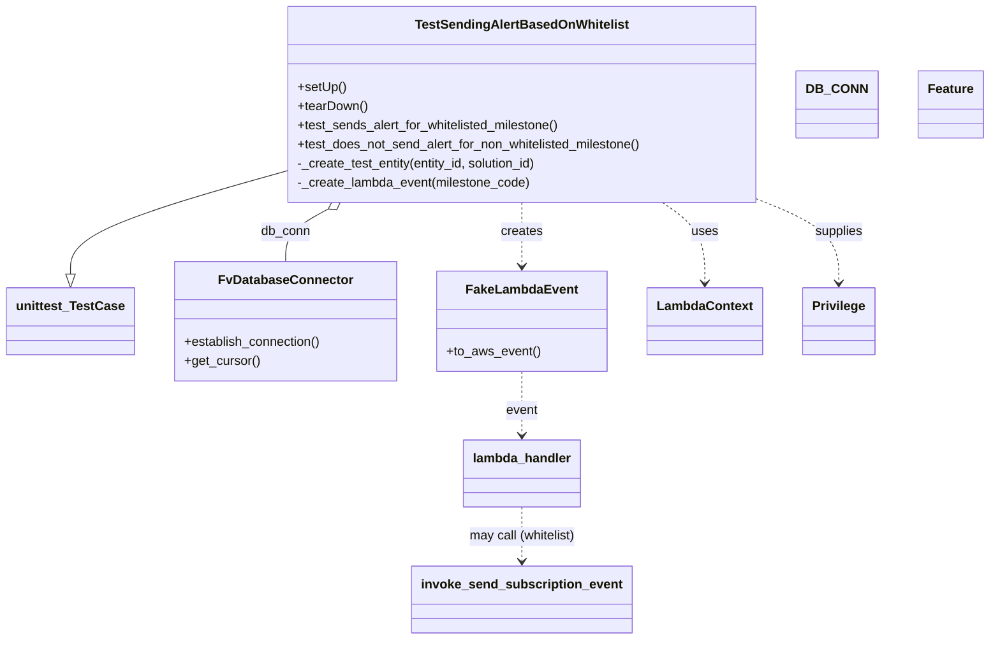
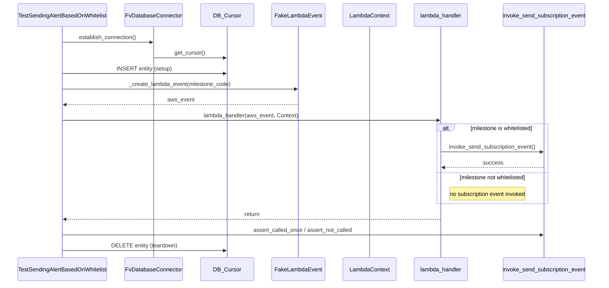

# Diagram: entity_core/entity_service/entity_service_tests/integration_tests/test_config_based_alert_trigger.py

> Auto-generated by Obscura crawlers

## Diagram 1

### SVG

<svg id="container" width="1216.58984375" xmlns="http://www.w3.org/2000/svg" class="classDiagram" height="802" viewBox="0 0 1216.58984375 802" role="graphics-document document" aria-roledescription="class"><g><defs><marker id="container_class-aggregationStart" class="marker aggregation class" refX="18" refY="7" markerWidth="190" markerHeight="240" orient="auto"><path d="M 18,7 L9,13 L1,7 L9,1 Z"></path></marker></defs><defs><marker id="container_class-aggregationEnd" class="marker aggregation class" refX="1" refY="7" markerWidth="20" markerHeight="28" orient="auto"><path d="M 18,7 L9,13 L1,7 L9,1 Z"></path></marker></defs><defs><marker id="container_class-extensionStart" class="marker extension class" refX="18" refY="7" markerWidth="190" markerHeight="240" orient="auto"><path d="M 1,7 L18,13 V 1 Z"></path></marker></defs><defs><marker id="container_class-extensionEnd" class="marker extension class" refX="1" refY="7" markerWidth="20" markerHeight="28" orient="auto"><path d="M 1,1 V 13 L18,7 Z"></path></marker></defs><defs><marker id="container_class-compositionStart" class="marker composition class" refX="18" refY="7" markerWidth="190" markerHeight="240" orient="auto"><path d="M 18,7 L9,13 L1,7 L9,1 Z"></path></marker></defs><defs><marker id="container_class-compositionEnd" class="marker composition class" refX="1" refY="7" markerWidth="20" markerHeight="28" orient="auto"><path d="M 18,7 L9,13 L1,7 L9,1 Z"></path></marker></defs><defs><marker id="container_class-dependencyStart" class="marker dependency class" refX="6" refY="7" markerWidth="190" markerHeight="240" orient="auto"><path d="M 5,7 L9,13 L1,7 L9,1 Z"></path></marker></defs><defs><marker id="container_class-dependencyEnd" class="marker dependency class" refX="13" refY="7" markerWidth="20" markerHeight="28" orient="auto"><path d="M 18,7 L9,13 L14,7 L9,1 Z"></path></marker></defs><defs><marker id="container_class-lollipopStart" class="marker lollipop class" refX="13" refY="7" markerWidth="190" markerHeight="240" orient="auto"><circle stroke="black" fill="transparent" cx="7" cy="7" r="6"></circle></marker></defs><defs><marker id="container_class-lollipopEnd" class="marker lollipop class" refX="1" refY="7" markerWidth="190" markerHeight="240" orient="auto"><circle stroke="black" fill="transparent" cx="7" cy="7" r="6"></circle></marker></defs><g class="root"><g class="clusters"></g><g class="edgePaths"><path d="M346.277,215.892L302.725,228.41C259.172,240.928,172.066,265.964,128.514,287.274C84.961,308.583,84.961,326.167,84.961,334.958L84.961,343.75" id="id_TestSendingAlertBasedOnWhitelist_unittest_TestCase_1" class="edge-thickness-normal edge-pattern-solid relation" style=";;;" data-edge="true" data-et="edge" data-id="id_TestSendingAlertBasedOnWhitelist_unittest_TestCase_1" data-points="W3sieCI6MzQ2LjI3NzM0Mzc1LCJ5IjoyMTUuODkyMzIyNTkwMTUyMjJ9LHsieCI6ODQuOTYwOTM3NSwieSI6MjkxfSx7IngiOjg0Ljk2MDkzNzUsInkiOjM2MX1d" marker-end="url(#container_class-extensionEnd)"></path><path d="M402.479,262.302L393.767,267.085C385.055,271.868,367.631,281.434,358.919,292.384C350.207,303.333,350.207,315.667,350.207,321.833L350.207,328" id="id_TestSendingAlertBasedOnWhitelist_FvDatabaseConnector_2" class="edge-thickness-normal edge-pattern-solid relation" style=";;;" data-edge="true" data-et="edge" data-id="id_TestSendingAlertBasedOnWhitelist_FvDatabaseConnector_2" data-points="W3sieCI6NDE3LjYwMDE0NjQ4NDM3NSwieSI6MjU0fSx7IngiOjM1MC4yMDcwMzEyNSwieSI6MjkxfSx7IngiOjM1MC4yMDcwMzEyNSwieSI6MzI4fV0=" marker-start="url(#container_class-aggregationStart)"></path><path d="M641.637,254L641.637,260.167C641.637,266.333,641.637,278.667,641.637,292C641.637,305.333,641.637,319.667,641.637,326.833L641.637,334" id="id_TestSendingAlertBasedOnWhitelist_FakeLambdaEvent_3" class="edge-thickness-normal edge-pattern-dashed relation" style=";;;" data-edge="true" data-et="edge" data-id="id_TestSendingAlertBasedOnWhitelist_FakeLambdaEvent_3" data-points="W3sieCI6NjQxLjYzNjcxODc1LCJ5IjoyNTR9LHsieCI6NjQxLjYzNjcxODc1LCJ5IjoyOTF9LHsieCI6NjQxLjYzNjcxODc1LCJ5IjozNDB9XQ==" marker-end="url(#container_class-dependencyEnd)"></path><path d="M812.639,254L821.212,260.167C829.785,266.333,846.932,278.667,855.505,295.5C864.078,312.333,864.078,333.667,864.078,344.333L864.078,355" id="id_TestSendingAlertBasedOnWhitelist_LambdaContext_4" class="edge-thickness-normal edge-pattern-dashed relation" style=";;;" data-edge="true" data-et="edge" data-id="id_TestSendingAlertBasedOnWhitelist_LambdaContext_4" data-points="W3sieCI6ODEyLjYzODU0OTgwNDY4NzUsInkiOjI1NH0seyJ4Ijo4NjQuMDc4MTI1LCJ5IjoyOTF9LHsieCI6ODY0LjA3ODEyNSwieSI6MzYxfV0=" marker-end="url(#container_class-dependencyEnd)"></path><path d="M936.996,253.554L952.037,259.795C967.078,266.036,997.16,278.518,1012.201,295.426C1027.242,312.333,1027.242,333.667,1027.242,344.333L1027.242,355" id="id_TestSendingAlertBasedOnWhitelist_Privilege_5" class="edge-thickness-normal edge-pattern-dashed relation" style=";;;" data-edge="true" data-et="edge" data-id="id_TestSendingAlertBasedOnWhitelist_Privilege_5" data-points="W3sieCI6OTM2Ljk5NjA5Mzc1LCJ5IjoyNTMuNTU0MDE5MTQ2MDI2NDN9LHsieCI6MTAyNy4yNDIxODc1LCJ5IjoyOTF9LHsieCI6MTAyNy4yNDIxODc1LCJ5IjozNjF9XQ==" marker-end="url(#container_class-dependencyEnd)"></path><path d="M641.637,466L641.637,474.167C641.637,482.333,641.637,498.667,641.637,512C641.637,525.333,641.637,535.667,641.637,540.833L641.637,546" id="id_FakeLambdaEvent_lambda_handler_6" class="edge-thickness-normal edge-pattern-dashed relation" style=";;;" data-edge="true" data-et="edge" data-id="id_FakeLambdaEvent_lambda_handler_6" data-points="W3sieCI6NjQxLjYzNjcxODc1LCJ5Ijo0NjZ9LHsieCI6NjQxLjYzNjcxODc1LCJ5Ijo1MTV9LHsieCI6NjQxLjYzNjcxODc1LCJ5Ijo1NTJ9XQ==" marker-end="url(#container_class-dependencyEnd)"></path><path d="M641.637,636L641.637,642.167C641.637,648.333,641.637,660.667,641.637,672C641.637,683.333,641.637,693.667,641.637,698.833L641.637,704" id="id_lambda_handler_invoke_send_subscription_event_7" class="edge-thickness-normal edge-pattern-dashed relation" style=";;;" data-edge="true" data-et="edge" data-id="id_lambda_handler_invoke_send_subscription_event_7" data-points="W3sieCI6NjQxLjYzNjcxODc1LCJ5Ijo2MzZ9LHsieCI6NjQxLjYzNjcxODc1LCJ5Ijo2NzN9LHsieCI6NjQxLjYzNjcxODc1LCJ5Ijo3MTB9XQ==" marker-end="url(#container_class-dependencyEnd)"></path></g><g class="edgeLabels"><g class="edgeLabel"><g class="label" data-id="id_TestSendingAlertBasedOnWhitelist_unittest_TestCase_1" transform="translate(0, 0)"><foreignObject width="0" height="0">

</foreignObject></g></g><g class="edgeLabel" transform="translate(350.20703125, 291)"><g class="label" data-id="id_TestSendingAlertBasedOnWhitelist_FvDatabaseConnector_2" transform="translate(-31.09375, -12)"><foreignObject width="62.1875" height="24">

db_conn

</foreignObject></g></g><g class="edgeLabel" transform="translate(641.63671875, 291)"><g class="label" data-id="id_TestSendingAlertBasedOnWhitelist_FakeLambdaEvent_3" transform="translate(-26.171875, -12)"><foreignObject width="52.34375" height="24">

creates

</foreignObject></g></g><g class="edgeLabel" transform="translate(864.078125, 291)"><g class="label" data-id="id_TestSendingAlertBasedOnWhitelist_LambdaContext_4" transform="translate(-16.4921875, -12)"><foreignObject width="32.984375" height="24">

uses

</foreignObject></g></g><g class="edgeLabel" transform="translate(1027.2421875, 291)"><g class="label" data-id="id_TestSendingAlertBasedOnWhitelist_Privilege_5" transform="translate(-30.59375, -12)"><foreignObject width="61.1875" height="24">

supplies

</foreignObject></g></g><g class="edgeLabel" transform="translate(641.63671875, 515)"><g class="label" data-id="id_FakeLambdaEvent_lambda_handler_6" transform="translate(-20.171875, -12)"><foreignObject width="40.34375" height="24">

event

</foreignObject></g></g><g class="edgeLabel" transform="translate(641.63671875, 673)"><g class="label" data-id="id_lambda_handler_invoke_send_subscription_event_7" transform="translate(-68.1875, -12)"><foreignObject width="136.375" height="24">

may call (whitelist)

</foreignObject></g></g></g><g class="nodes"><g class="node default" id="classId-TestSendingAlertBasedOnWhitelist-0" transform="translate(641.63671875, 131)"><g class="basic label-container"><path d="M-295.359375 -123 L295.359375 -123 L295.359375 123 L-295.359375 123" stroke="none" stroke-width="0" fill="#ECECFF" style=""></path><path d="M-295.359375 -123 C-157.32732885195074 -123, -19.295282703901478 -123, 295.359375 -123 M-295.359375 -123 C-78.86596672973639 -123, 137.62744154052723 -123, 295.359375 -123 M295.359375 -123 C295.359375 -71.40269971710512, 295.359375 -19.80539943421023, 295.359375 123 M295.359375 -123 C295.359375 -38.102481252989264, 295.359375 46.79503749402147, 295.359375 123 M295.359375 123 C159.72978981011644 123, 24.100204620232887 123, -295.359375 123 M295.359375 123 C158.82081315603756 123, 22.282251312075118 123, -295.359375 123 M-295.359375 123 C-295.359375 30.730438716505518, -295.359375 -61.539122566988965, -295.359375 -123 M-295.359375 123 C-295.359375 29.335210247575887, -295.359375 -64.32957950484823, -295.359375 -123" stroke="#9370DB" stroke-width="1.3" fill="none" stroke-dasharray="0 0" style=""></path></g><g class="annotation-group text" transform="translate(0, -99)"></g><g class="label-group text" transform="translate(-127.765625, -99)"><g class="label" style="font-weight: bolder" transform="translate(0,-12)"><foreignObject width="255.53125" height="24">

TestSendingAlertBasedOnWhitelist

</foreignObject></g></g><g class="members-group text" transform="translate(-283.359375, -51)"></g><g class="methods-group text" transform="translate(-283.359375, -21)"><g class="label" style="" transform="translate(0,-12)"><foreignObject width="60.421875" height="24">

+setUp()

</foreignObject></g><g class="label" style="" transform="translate(0,12)"><foreignObject width="87.75" height="24">

+tearDown()

</foreignObject></g><g class="label" style="" transform="translate(0,36)"><foreignObject width="334.09375" height="24">

+test_sends_alert_for_whitelisted_milestone()

</foreignObject></g><g class="label" style="" transform="translate(0,60)"><foreignObject width="438.953125" height="24">

+test_does_not_send_alert_for_non_whitelisted_milestone()

</foreignObject></g><g class="label" style="" transform="translate(0,84)"><foreignObject width="307.71875" height="24">

-_create_test_entity(entity_id, solution_id)

</foreignObject></g><g class="label" style="" transform="translate(0,108)"><foreignObject width="294.03125" height="24">

-_create_lambda_event(milestone_code)

</foreignObject></g></g><g class="divider" style=""><path d="M-295.359375 -75 C-119.82826555220697 -75, 55.70284389558606 -75, 295.359375 -75 M-295.359375 -75 C-142.44335613075148 -75, 10.472662738497036 -75, 295.359375 -75" stroke="#9370DB" stroke-width="1.3" fill="none" stroke-dasharray="0 0" style=""></path></g><g class="divider" style=""><path d="M-295.359375 -51 C-123.6100765695891 -51, 48.139221860821806 -51, 295.359375 -51 M-295.359375 -51 C-108.8046030437674 -51, 77.7501689124652 -51, 295.359375 -51" stroke="#9370DB" stroke-width="1.3" fill="none" stroke-dasharray="0 0" style=""></path></g></g><g class="node default" id="classId-unittest_TestCase-1" transform="translate(84.9609375, 403)"><g class="basic label-container"><path d="M-76.9609375 -42 L76.9609375 -42 L76.9609375 42 L-76.9609375 42" stroke="none" stroke-width="0" fill="#ECECFF" style=""></path><path d="M-76.9609375 -42 C-16.68007627921054 -42, 43.60078494157892 -42, 76.9609375 -42 M-76.9609375 -42 C-20.444812040041406 -42, 36.07131341991719 -42, 76.9609375 -42 M76.9609375 -42 C76.9609375 -11.149646907741552, 76.9609375 19.700706184516896, 76.9609375 42 M76.9609375 -42 C76.9609375 -13.095833769935055, 76.9609375 15.80833246012989, 76.9609375 42 M76.9609375 42 C29.36987201482463 42, -18.22119347035074 42, -76.9609375 42 M76.9609375 42 C37.455549922686814 42, -2.049837654626373 42, -76.9609375 42 M-76.9609375 42 C-76.9609375 14.439874890679189, -76.9609375 -13.120250218641623, -76.9609375 -42 M-76.9609375 42 C-76.9609375 17.576918679836577, -76.9609375 -6.846162640326845, -76.9609375 -42" stroke="#9370DB" stroke-width="1.3" fill="none" stroke-dasharray="0 0" style=""></path></g><g class="annotation-group text" transform="translate(0, -18)"></g><g class="label-group text" transform="translate(-64.9609375, -18)"><g class="label" style="font-weight: bolder" transform="translate(0,-12)"><foreignObject width="129.921875" height="24">

unittest_TestCase

</foreignObject></g></g><g class="members-group text" transform="translate(-64.9609375, 30)"></g><g class="methods-group text" transform="translate(-64.9609375, 60)"></g><g class="divider" style=""><path d="M-76.9609375 6 C-37.97319188518282 6, 1.0145537296343576 6, 76.9609375 6 M-76.9609375 6 C-40.552644753102165 6, -4.144352006204329 6, 76.9609375 6" stroke="#9370DB" stroke-width="1.3" fill="none" stroke-dasharray="0 0" style=""></path></g><g class="divider" style=""><path d="M-76.9609375 24 C-42.47305985145066 24, -7.9851822029013135 24, 76.9609375 24 M-76.9609375 24 C-37.515891013931736 24, 1.9291554721365287 24, 76.9609375 24" stroke="#9370DB" stroke-width="1.3" fill="none" stroke-dasharray="0 0" style=""></path></g></g><g class="node default" id="classId-FvDatabaseConnector-2" transform="translate(350.20703125, 403)"><g class="basic label-container"><path d="M-138.28515625 -75 L138.28515625 -75 L138.28515625 75 L-138.28515625 75" stroke="none" stroke-width="0" fill="#ECECFF" style=""></path><path d="M-138.28515625 -75 C-43.40556608258433 -75, 51.47402408483134 -75, 138.28515625 -75 M-138.28515625 -75 C-81.35604414251809 -75, -24.426932035036174 -75, 138.28515625 -75 M138.28515625 -75 C138.28515625 -18.702302712777012, 138.28515625 37.595394574445976, 138.28515625 75 M138.28515625 -75 C138.28515625 -19.80393068820647, 138.28515625 35.39213862358706, 138.28515625 75 M138.28515625 75 C37.32022029048714 75, -63.644715669025715 75, -138.28515625 75 M138.28515625 75 C32.41060314480181 75, -73.46394996039638 75, -138.28515625 75 M-138.28515625 75 C-138.28515625 19.529061521958482, -138.28515625 -35.941876956083036, -138.28515625 -75 M-138.28515625 75 C-138.28515625 41.486154616734076, -138.28515625 7.9723092334681525, -138.28515625 -75" stroke="#9370DB" stroke-width="1.3" fill="none" stroke-dasharray="0 0" style=""></path></g><g class="annotation-group text" transform="translate(0, -51)"></g><g class="label-group text" transform="translate(-79.3046875, -51)"><g class="label" style="font-weight: bolder" transform="translate(0,-12)"><foreignObject width="158.609375" height="24">

FvDatabaseConnector

</foreignObject></g></g><g class="members-group text" transform="translate(-126.28515625, -3)"></g><g class="methods-group text" transform="translate(-126.28515625, 27)"><g class="label" style="" transform="translate(0,-12)"><foreignObject width="173.265625" height="24">

+establish_connection()

</foreignObject></g><g class="label" style="" transform="translate(0,12)"><foreignObject width="94.640625" height="24">

+get_cursor()

</foreignObject></g></g><g class="divider" style=""><path d="M-138.28515625 -27 C-37.92067709315627 -27, 62.44380206368746 -27, 138.28515625 -27 M-138.28515625 -27 C-36.41131531318764 -27, 65.46252562362471 -27, 138.28515625 -27" stroke="#9370DB" stroke-width="1.3" fill="none" stroke-dasharray="0 0" style=""></path></g><g class="divider" style=""><path d="M-138.28515625 -3 C-35.34855230583695 -3, 67.5880516383261 -3, 138.28515625 -3 M-138.28515625 -3 C-74.23408906778543 -3, -10.183021885570867 -3, 138.28515625 -3" stroke="#9370DB" stroke-width="1.3" fill="none" stroke-dasharray="0 0" style=""></path></g></g><g class="node default" id="classId-DB_CONN-3" transform="translate(1033.40234375, 131)"><g class="basic label-container"><path d="M-46.40625 -42 L46.40625 -42 L46.40625 42 L-46.40625 42" stroke="none" stroke-width="0" fill="#ECECFF" style=""></path><path d="M-46.40625 -42 C-9.821755040776878 -42, 26.762739918446243 -42, 46.40625 -42 M-46.40625 -42 C-17.792985427056262 -42, 10.820279145887476 -42, 46.40625 -42 M46.40625 -42 C46.40625 -12.497629196337083, 46.40625 17.004741607325833, 46.40625 42 M46.40625 -42 C46.40625 -24.812988399096948, 46.40625 -7.625976798193896, 46.40625 42 M46.40625 42 C27.509557826577787 42, 8.612865653155573 42, -46.40625 42 M46.40625 42 C15.3688628284396 42, -15.6685243431208 42, -46.40625 42 M-46.40625 42 C-46.40625 19.200845238057415, -46.40625 -3.5983095238851703, -46.40625 -42 M-46.40625 42 C-46.40625 13.640700916753431, -46.40625 -14.718598166493138, -46.40625 -42" stroke="#9370DB" stroke-width="1.3" fill="none" stroke-dasharray="0 0" style=""></path></g><g class="annotation-group text" transform="translate(0, -18)"></g><g class="label-group text" transform="translate(-34.40625, -18)"><g class="label" style="font-weight: bolder" transform="translate(0,-12)"><foreignObject width="68.8125" height="24">

DB_CONN

</foreignObject></g></g><g class="members-group text" transform="translate(-34.40625, 30)"></g><g class="methods-group text" transform="translate(-34.40625, 60)"></g><g class="divider" style=""><path d="M-46.40625 6 C-14.502082792769862 6, 17.402084414460276 6, 46.40625 6 M-46.40625 6 C-22.67874120963447 6, 1.0487675807310595 6, 46.40625 6" stroke="#9370DB" stroke-width="1.3" fill="none" stroke-dasharray="0 0" style=""></path></g><g class="divider" style=""><path d="M-46.40625 24 C-25.51299819254909 24, -4.619746385098182 24, 46.40625 24 M-46.40625 24 C-19.98435652625222 24, 6.437536947495559 24, 46.40625 24" stroke="#9370DB" stroke-width="1.3" fill="none" stroke-dasharray="0 0" style=""></path></g></g><g class="node default" id="classId-FakeLambdaEvent-4" transform="translate(641.63671875, 403)"><g class="basic label-container"><path d="M-103.14453125 -63 L103.14453125 -63 L103.14453125 63 L-103.14453125 63" stroke="none" stroke-width="0" fill="#ECECFF" style=""></path><path d="M-103.14453125 -63 C-22.10192092875681 -63, 58.94068939248638 -63, 103.14453125 -63 M-103.14453125 -63 C-46.85910965887756 -63, 9.426311932244886 -63, 103.14453125 -63 M103.14453125 -63 C103.14453125 -37.24652668175816, 103.14453125 -11.493053363516324, 103.14453125 63 M103.14453125 -63 C103.14453125 -33.61533685888774, 103.14453125 -4.230673717775474, 103.14453125 63 M103.14453125 63 C50.74933860589578 63, -1.6458540382084408 63, -103.14453125 63 M103.14453125 63 C37.11277496525014 63, -28.91898131949972 63, -103.14453125 63 M-103.14453125 63 C-103.14453125 21.887752188176343, -103.14453125 -19.224495623647314, -103.14453125 -63 M-103.14453125 63 C-103.14453125 35.43255413718217, -103.14453125 7.865108274364346, -103.14453125 -63" stroke="#9370DB" stroke-width="1.3" fill="none" stroke-dasharray="0 0" style=""></path></g><g class="annotation-group text" transform="translate(0, -39)"></g><g class="label-group text" transform="translate(-65.8671875, -39)"><g class="label" style="font-weight: bolder" transform="translate(0,-12)"><foreignObject width="131.734375" height="24">

FakeLambdaEvent

</foreignObject></g></g><g class="members-group text" transform="translate(-91.14453125, 9)"></g><g class="methods-group text" transform="translate(-91.14453125, 39)"><g class="label" style="" transform="translate(0,-12)"><foreignObject width="116.421875" height="24">

+to_aws_event()

</foreignObject></g></g><g class="divider" style=""><path d="M-103.14453125 -15 C-46.55997248482496 -15, 10.024586280350078 -15, 103.14453125 -15 M-103.14453125 -15 C-34.71787554459969 -15, 33.708780160800615 -15, 103.14453125 -15" stroke="#9370DB" stroke-width="1.3" fill="none" stroke-dasharray="0 0" style=""></path></g><g class="divider" style=""><path d="M-103.14453125 9 C-33.579603964701136 9, 35.98532332059773 9, 103.14453125 9 M-103.14453125 9 C-52.399549550931816 9, -1.6545678518636322 9, 103.14453125 9" stroke="#9370DB" stroke-width="1.3" fill="none" stroke-dasharray="0 0" style=""></path></g></g><g class="node default" id="classId-LambdaContext-5" transform="translate(864.078125, 403)"><g class="basic label-container"><path d="M-69.296875 -42 L69.296875 -42 L69.296875 42 L-69.296875 42" stroke="none" stroke-width="0" fill="#ECECFF" style=""></path><path d="M-69.296875 -42 C-40.85075272186007 -42, -12.404630443720137 -42, 69.296875 -42 M-69.296875 -42 C-34.858051692296506 -42, -0.41922838459301204 -42, 69.296875 -42 M69.296875 -42 C69.296875 -19.193740854109524, 69.296875 3.612518291780951, 69.296875 42 M69.296875 -42 C69.296875 -21.81637253457157, 69.296875 -1.6327450691431409, 69.296875 42 M69.296875 42 C23.831446692482388 42, -21.633981615035225 42, -69.296875 42 M69.296875 42 C23.466477624419255 42, -22.36391975116149 42, -69.296875 42 M-69.296875 42 C-69.296875 24.720985362173362, -69.296875 7.441970724346724, -69.296875 -42 M-69.296875 42 C-69.296875 24.152026153202332, -69.296875 6.304052306404664, -69.296875 -42" stroke="#9370DB" stroke-width="1.3" fill="none" stroke-dasharray="0 0" style=""></path></g><g class="annotation-group text" transform="translate(0, -18)"></g><g class="label-group text" transform="translate(-57.296875, -18)"><g class="label" style="font-weight: bolder" transform="translate(0,-12)"><foreignObject width="114.59375" height="24">

LambdaContext

</foreignObject></g></g><g class="members-group text" transform="translate(-57.296875, 30)"></g><g class="methods-group text" transform="translate(-57.296875, 60)"></g><g class="divider" style=""><path d="M-69.296875 6 C-28.701531298596564 6, 11.893812402806873 6, 69.296875 6 M-69.296875 6 C-29.18034714927581 6, 10.936180701448379 6, 69.296875 6" stroke="#9370DB" stroke-width="1.3" fill="none" stroke-dasharray="0 0" style=""></path></g><g class="divider" style=""><path d="M-69.296875 24 C-30.119780006699344 24, 9.057314986601313 24, 69.296875 24 M-69.296875 24 C-17.82434692464485 24, 33.6481811507103 24, 69.296875 24" stroke="#9370DB" stroke-width="1.3" fill="none" stroke-dasharray="0 0" style=""></path></g></g><g class="node default" id="classId-Privilege-6" transform="translate(1027.2421875, 403)"><g class="basic label-container"><path d="M-43.8671875 -42 L43.8671875 -42 L43.8671875 42 L-43.8671875 42" stroke="none" stroke-width="0" fill="#ECECFF" style=""></path><path d="M-43.8671875 -42 C-19.96236844720818 -42, 3.9424506055836375 -42, 43.8671875 -42 M-43.8671875 -42 C-21.173135541363195 -42, 1.520916417273611 -42, 43.8671875 -42 M43.8671875 -42 C43.8671875 -15.456266359530776, 43.8671875 11.087467280938448, 43.8671875 42 M43.8671875 -42 C43.8671875 -17.65489225100838, 43.8671875 6.690215497983239, 43.8671875 42 M43.8671875 42 C11.576152656774113 42, -20.714882186451774 42, -43.8671875 42 M43.8671875 42 C13.04450800781563 42, -17.77817148436874 42, -43.8671875 42 M-43.8671875 42 C-43.8671875 22.159593006026142, -43.8671875 2.3191860120522847, -43.8671875 -42 M-43.8671875 42 C-43.8671875 15.23628754119893, -43.8671875 -11.52742491760214, -43.8671875 -42" stroke="#9370DB" stroke-width="1.3" fill="none" stroke-dasharray="0 0" style=""></path></g><g class="annotation-group text" transform="translate(0, -18)"></g><g class="label-group text" transform="translate(-31.8671875, -18)"><g class="label" style="font-weight: bolder" transform="translate(0,-12)"><foreignObject width="63.734375" height="24">

Privilege

</foreignObject></g></g><g class="members-group text" transform="translate(-31.8671875, 30)"></g><g class="methods-group text" transform="translate(-31.8671875, 60)"></g><g class="divider" style=""><path d="M-43.8671875 6 C-19.54878388319027 6, 4.769619733619457 6, 43.8671875 6 M-43.8671875 6 C-12.898925379427354 6, 18.069336741145293 6, 43.8671875 6" stroke="#9370DB" stroke-width="1.3" fill="none" stroke-dasharray="0 0" style=""></path></g><g class="divider" style=""><path d="M-43.8671875 24 C-23.711391230631218 24, -3.555594961262436 24, 43.8671875 24 M-43.8671875 24 C-18.233081027036455 24, 7.40102544592709 24, 43.8671875 24" stroke="#9370DB" stroke-width="1.3" fill="none" stroke-dasharray="0 0" style=""></path></g></g><g class="node default" id="classId-Feature-7" transform="translate(1169.19921875, 131)"><g class="basic label-container"><path d="M-39.390625 -42 L39.390625 -42 L39.390625 42 L-39.390625 42" stroke="none" stroke-width="0" fill="#ECECFF" style=""></path><path d="M-39.390625 -42 C-23.190746538747746 -42, -6.990868077495492 -42, 39.390625 -42 M-39.390625 -42 C-10.834941770947012 -42, 17.720741458105977 -42, 39.390625 -42 M39.390625 -42 C39.390625 -20.748442759562547, 39.390625 0.5031144808749062, 39.390625 42 M39.390625 -42 C39.390625 -11.515558005280322, 39.390625 18.968883989439355, 39.390625 42 M39.390625 42 C20.917173269241278 42, 2.4437215384825564 42, -39.390625 42 M39.390625 42 C15.078753669783499 42, -9.233117660433003 42, -39.390625 42 M-39.390625 42 C-39.390625 11.418617713608217, -39.390625 -19.162764572783566, -39.390625 -42 M-39.390625 42 C-39.390625 20.42631849783428, -39.390625 -1.1473630043314387, -39.390625 -42" stroke="#9370DB" stroke-width="1.3" fill="none" stroke-dasharray="0 0" style=""></path></g><g class="annotation-group text" transform="translate(0, -18)"></g><g class="label-group text" transform="translate(-27.390625, -18)"><g class="label" style="font-weight: bolder" transform="translate(0,-12)"><foreignObject width="54.78125" height="24">

Feature

</foreignObject></g></g><g class="members-group text" transform="translate(-27.390625, 30)"></g><g class="methods-group text" transform="translate(-27.390625, 60)"></g><g class="divider" style=""><path d="M-39.390625 6 C-14.96191516113969 6, 9.466794677720621 6, 39.390625 6 M-39.390625 6 C-18.29640627645857 6, 2.797812447082862 6, 39.390625 6" stroke="#9370DB" stroke-width="1.3" fill="none" stroke-dasharray="0 0" style=""></path></g><g class="divider" style=""><path d="M-39.390625 24 C-22.120951075478594 24, -4.851277150957188 24, 39.390625 24 M-39.390625 24 C-18.62736340994964 24, 2.1358981801007175 24, 39.390625 24" stroke="#9370DB" stroke-width="1.3" fill="none" stroke-dasharray="0 0" style=""></path></g></g><g class="node default" id="classId-lambda_handler-8" transform="translate(641.63671875, 594)"><g class="basic label-container"><path d="M-71.9765625 -42 L71.9765625 -42 L71.9765625 42 L-71.9765625 42" stroke="none" stroke-width="0" fill="#ECECFF" style=""></path><path d="M-71.9765625 -42 C-25.706437167389133 -42, 20.563688165221734 -42, 71.9765625 -42 M-71.9765625 -42 C-26.78642778642245 -42, 18.4037069271551 -42, 71.9765625 -42 M71.9765625 -42 C71.9765625 -19.76709585541234, 71.9765625 2.465808289175321, 71.9765625 42 M71.9765625 -42 C71.9765625 -22.961136820961347, 71.9765625 -3.9222736419226933, 71.9765625 42 M71.9765625 42 C25.036994312303257 42, -21.902573875393486 42, -71.9765625 42 M71.9765625 42 C24.432652770537985 42, -23.11125695892403 42, -71.9765625 42 M-71.9765625 42 C-71.9765625 20.188211142008647, -71.9765625 -1.6235777159827052, -71.9765625 -42 M-71.9765625 42 C-71.9765625 17.670448751636286, -71.9765625 -6.659102496727428, -71.9765625 -42" stroke="#9370DB" stroke-width="1.3" fill="none" stroke-dasharray="0 0" style=""></path></g><g class="annotation-group text" transform="translate(0, -18)"></g><g class="label-group text" transform="translate(-59.9765625, -18)"><g class="label" style="font-weight: bolder" transform="translate(0,-12)"><foreignObject width="119.953125" height="24">

lambda_handler

</foreignObject></g></g><g class="members-group text" transform="translate(-59.9765625, 30)"></g><g class="methods-group text" transform="translate(-59.9765625, 60)"></g><g class="divider" style=""><path d="M-71.9765625 6 C-23.797009724340292 6, 24.382543051319416 6, 71.9765625 6 M-71.9765625 6 C-34.033946903905175 6, 3.90866869218965 6, 71.9765625 6" stroke="#9370DB" stroke-width="1.3" fill="none" stroke-dasharray="0 0" style=""></path></g><g class="divider" style=""><path d="M-71.9765625 24 C-17.66104484477696 24, 36.65447281044608 24, 71.9765625 24 M-71.9765625 24 C-24.117072282585077 24, 23.742417934829845 24, 71.9765625 24" stroke="#9370DB" stroke-width="1.3" fill="none" stroke-dasharray="0 0" style=""></path></g></g><g class="node default" id="classId-invoke_send_subscription_event-9" transform="translate(641.63671875, 752)"><g class="basic label-container"><path d="M-132.421875 -42 L132.421875 -42 L132.421875 42 L-132.421875 42" stroke="none" stroke-width="0" fill="#ECECFF" style=""></path><path d="M-132.421875 -42 C-39.97785665495519 -42, 52.46616169008962 -42, 132.421875 -42 M-132.421875 -42 C-44.96286442773925 -42, 42.496146144521504 -42, 132.421875 -42 M132.421875 -42 C132.421875 -12.33257687988678, 132.421875 17.33484624022644, 132.421875 42 M132.421875 -42 C132.421875 -14.47294788622484, 132.421875 13.054104227550319, 132.421875 42 M132.421875 42 C71.32022795910967 42, 10.218580918219345 42, -132.421875 42 M132.421875 42 C41.636672995301595 42, -49.14852900939681 42, -132.421875 42 M-132.421875 42 C-132.421875 14.72651556672897, -132.421875 -12.54696886654206, -132.421875 -42 M-132.421875 42 C-132.421875 17.86536144049708, -132.421875 -6.269277119005842, -132.421875 -42" stroke="#9370DB" stroke-width="1.3" fill="none" stroke-dasharray="0 0" style=""></path></g><g class="annotation-group text" transform="translate(0, -18)"></g><g class="label-group text" transform="translate(-120.421875, -18)"><g class="label" style="font-weight: bolder" transform="translate(0,-12)"><foreignObject width="240.84375" height="24">

invoke_send_subscription_event

</foreignObject></g></g><g class="members-group text" transform="translate(-120.421875, 30)"></g><g class="methods-group text" transform="translate(-120.421875, 60)"></g><g class="divider" style=""><path d="M-132.421875 6 C-34.21007863555002 6, 64.00171772889996 6, 132.421875 6 M-132.421875 6 C-65.40555362576396 6, 1.6107677484720853 6, 132.421875 6" stroke="#9370DB" stroke-width="1.3" fill="none" stroke-dasharray="0 0" style=""></path></g><g class="divider" style=""><path d="M-132.421875 24 C-34.82134171207606 24, 62.779191575847875 24, 132.421875 24 M-132.421875 24 C-44.96634657369566 24, 42.48918185260868 24, 132.421875 24" stroke="#9370DB" stroke-width="1.3" fill="none" stroke-dasharray="0 0" style=""></path></g></g></g></g></g></svg>

## Diagram 2

### SVG

<svg id="container" width="1771" xmlns="http://www.w3.org/2000/svg" height="848" viewBox="-50 -10 1771 848" role="graphics-document document" aria-roledescription="sequence"><g><rect x="1413" y="762" fill="#eaeaea" stroke="#666" width="258" height="65" name="SubEvent" rx="3" ry="3" class="actor actor-bottom"></rect><text x="1542" y="794.5" dominant-baseline="central" alignment-baseline="central" class="actor actor-box" style="text-anchor: middle; font-size: 16px; font-weight: 400;"><tspan x="1542" dy="0">invoke_send_subscription_event</tspan></text></g><g><rect x="1149" y="762" fill="#eaeaea" stroke="#666" width="150" height="65" name="Lambda" rx="3" ry="3" class="actor actor-bottom"></rect><text x="1224" y="794.5" dominant-baseline="central" alignment-baseline="central" class="actor actor-box" style="text-anchor: middle; font-size: 16px; font-weight: 400;"><tspan x="1224" dy="0">lambda_handler</tspan></text></g><g><rect x="949" y="762" fill="#eaeaea" stroke="#666" width="150" height="65" name="Context" rx="3" ry="3" class="actor actor-bottom"></rect><text x="1024" y="794.5" dominant-baseline="central" alignment-baseline="central" class="actor actor-box" style="text-anchor: middle; font-size: 16px; font-weight: 400;"><tspan x="1024" dy="0">LambdaContext</tspan></text></g><g><rect x="748" y="762" fill="#eaeaea" stroke="#666" width="151" height="65" name="FakeEvent" rx="3" ry="3" class="actor actor-bottom"></rect><text x="823.5" y="794.5" dominant-baseline="central" alignment-baseline="central" class="actor actor-box" style="text-anchor: middle; font-size: 16px; font-weight: 400;"><tspan x="823.5" dy="0">FakeLambdaEvent</tspan></text></g><g><rect x="548" y="762" fill="#eaeaea" stroke="#666" width="150" height="65" name="Cursor" rx="3" ry="3" class="actor actor-bottom"></rect><text x="623" y="794.5" dominant-baseline="central" alignment-baseline="central" class="actor actor-box" style="text-anchor: middle; font-size: 16px; font-weight: 400;"><tspan x="623" dy="0">DB_Cursor</tspan></text></g><g><rect x="321" y="762" fill="#eaeaea" stroke="#666" width="177" height="65" name="DB" rx="3" ry="3" class="actor actor-bottom"></rect><text x="409.5" y="794.5" dominant-baseline="central" alignment-baseline="central" class="actor actor-box" style="text-anchor: middle; font-size: 16px; font-weight: 400;"><tspan x="409.5" dy="0">FvDatabaseConnector</tspan></text></g><g><rect x="0" y="762" fill="#eaeaea" stroke="#666" width="271" height="65" name="Test" rx="3" ry="3" class="actor actor-bottom"></rect><text x="135.5" y="794.5" dominant-baseline="central" alignment-baseline="central" class="actor actor-box" style="text-anchor: middle; font-size: 16px; font-weight: 400;"><tspan x="135.5" dy="0">TestSendingAlertBasedOnWhitelist</tspan></text></g><g><line id="actor6" x1="1542" y1="65" x2="1542" y2="762" class="actor-line 200" stroke-width="0.5px" stroke="#999" name="SubEvent"></line><g id="root-6"><rect x="1413" y="0" fill="#eaeaea" stroke="#666" width="258" height="65" name="SubEvent" rx="3" ry="3" class="actor actor-top"></rect><text x="1542" y="32.5" dominant-baseline="central" alignment-baseline="central" class="actor actor-box" style="text-anchor: middle; font-size: 16px; font-weight: 400;"><tspan x="1542" dy="0">invoke_send_subscription_event</tspan></text></g></g><g><line id="actor5" x1="1224" y1="65" x2="1224" y2="762" class="actor-line 200" stroke-width="0.5px" stroke="#999" name="Lambda"></line><g id="root-5"><rect x="1149" y="0" fill="#eaeaea" stroke="#666" width="150" height="65" name="Lambda" rx="3" ry="3" class="actor actor-top"></rect><text x="1224" y="32.5" dominant-baseline="central" alignment-baseline="central" class="actor actor-box" style="text-anchor: middle; font-size: 16px; font-weight: 400;"><tspan x="1224" dy="0">lambda_handler</tspan></text></g></g><g><line id="actor4" x1="1024" y1="65" x2="1024" y2="762" class="actor-line 200" stroke-width="0.5px" stroke="#999" name="Context"></line><g id="root-4"><rect x="949" y="0" fill="#eaeaea" stroke="#666" width="150" height="65" name="Context" rx="3" ry="3" class="actor actor-top"></rect><text x="1024" y="32.5" dominant-baseline="central" alignment-baseline="central" class="actor actor-box" style="text-anchor: middle; font-size: 16px; font-weight: 400;"><tspan x="1024" dy="0">LambdaContext</tspan></text></g></g><g><line id="actor3" x1="823.5" y1="65" x2="823.5" y2="762" class="actor-line 200" stroke-width="0.5px" stroke="#999" name="FakeEvent"></line><g id="root-3"><rect x="748" y="0" fill="#eaeaea" stroke="#666" width="151" height="65" name="FakeEvent" rx="3" ry="3" class="actor actor-top"></rect><text x="823.5" y="32.5" dominant-baseline="central" alignment-baseline="central" class="actor actor-box" style="text-anchor: middle; font-size: 16px; font-weight: 400;"><tspan x="823.5" dy="0">FakeLambdaEvent</tspan></text></g></g><g><line id="actor2" x1="623" y1="65" x2="623" y2="762" class="actor-line 200" stroke-width="0.5px" stroke="#999" name="Cursor"></line><g id="root-2"><rect x="548" y="0" fill="#eaeaea" stroke="#666" width="150" height="65" name="Cursor" rx="3" ry="3" class="actor actor-top"></rect><text x="623" y="32.5" dominant-baseline="central" alignment-baseline="central" class="actor actor-box" style="text-anchor: middle; font-size: 16px; font-weight: 400;"><tspan x="623" dy="0">DB_Cursor</tspan></text></g></g><g><line id="actor1" x1="409.5" y1="65" x2="409.5" y2="762" class="actor-line 200" stroke-width="0.5px" stroke="#999" name="DB"></line><g id="root-1"><rect x="321" y="0" fill="#eaeaea" stroke="#666" width="177" height="65" name="DB" rx="3" ry="3" class="actor actor-top"></rect><text x="409.5" y="32.5" dominant-baseline="central" alignment-baseline="central" class="actor actor-box" style="text-anchor: middle; font-size: 16px; font-weight: 400;"><tspan x="409.5" dy="0">FvDatabaseConnector</tspan></text></g></g><g><line id="actor0" x1="135.5" y1="65" x2="135.5" y2="762" class="actor-line 200" stroke-width="0.5px" stroke="#999" name="Test"></line><g id="root-0"><rect x="0" y="0" fill="#eaeaea" stroke="#666" width="271" height="65" name="Test" rx="3" ry="3" class="actor actor-top"></rect><text x="135.5" y="32.5" dominant-baseline="central" alignment-baseline="central" class="actor actor-box" style="text-anchor: middle; font-size: 16px; font-weight: 400;"><tspan x="135.5" dy="0">TestSendingAlertBasedOnWhitelist</tspan></text></g></g><g></g><defs><symbol id="computer" width="24" height="24"><path transform="scale(.5)" d="M2 2v13h20v-13h-20zm18 11h-16v-9h16v9zm-10.228 6l.466-1h3.524l.467 1h-4.457zm14.228 3h-24l2-6h2.104l-1.33 4h18.45l-1.297-4h2.073l2 6zm-5-10h-14v-7h14v7z"></path></symbol></defs><defs><symbol id="database" fill-rule="evenodd" clip-rule="evenodd"><path transform="scale(.5)" d="M12.258.001l.256.004.255.005.253.008.251.01.249.012.247.015.246.016.242.019.241.02.239.023.236.024.233.027.231.028.229.031.225.032.223.034.22.036.217.038.214.04.211.041.208.043.205.045.201.046.198.048.194.05.191.051.187.053.183.054.18.056.175.057.172.059.168.06.163.061.16.063.155.064.15.066.074.033.073.033.071.034.07.034.069.035.068.035.067.035.066.035.064.036.064.036.062.036.06.036.06.037.058.037.058.037.055.038.055.038.053.038.052.038.051.039.05.039.048.039.047.039.045.04.044.04.043.04.041.04.04.041.039.041.037.041.036.041.034.041.033.042.032.042.03.042.029.042.027.042.026.043.024.043.023.043.021.043.02.043.018.044.017.043.015.044.013.044.012.044.011.045.009.044.007.045.006.045.004.045.002.045.001.045v17l-.001.045-.002.045-.004.045-.006.045-.007.045-.009.044-.011.045-.012.044-.013.044-.015.044-.017.043-.018.044-.02.043-.021.043-.023.043-.024.043-.026.043-.027.042-.029.042-.03.042-.032.042-.033.042-.034.041-.036.041-.037.041-.039.041-.04.041-.041.04-.043.04-.044.04-.045.04-.047.039-.048.039-.05.039-.051.039-.052.038-.053.038-.055.038-.055.038-.058.037-.058.037-.06.037-.06.036-.062.036-.064.036-.064.036-.066.035-.067.035-.068.035-.069.035-.07.034-.071.034-.073.033-.074.033-.15.066-.155.064-.16.063-.163.061-.168.06-.172.059-.175.057-.18.056-.183.054-.187.053-.191.051-.194.05-.198.048-.201.046-.205.045-.208.043-.211.041-.214.04-.217.038-.22.036-.223.034-.225.032-.229.031-.231.028-.233.027-.236.024-.239.023-.241.02-.242.019-.246.016-.247.015-.249.012-.251.01-.253.008-.255.005-.256.004-.258.001-.258-.001-.256-.004-.255-.005-.253-.008-.251-.01-.249-.012-.247-.015-.245-.016-.243-.019-.241-.02-.238-.023-.236-.024-.234-.027-.231-.028-.228-.031-.226-.032-.223-.034-.22-.036-.217-.038-.214-.04-.211-.041-.208-.043-.204-.045-.201-.046-.198-.048-.195-.05-.19-.051-.187-.053-.184-.054-.179-.056-.176-.057-.172-.059-.167-.06-.164-.061-.159-.063-.155-.064-.151-.066-.074-.033-.072-.033-.072-.034-.07-.034-.069-.035-.068-.035-.067-.035-.066-.035-.064-.036-.063-.036-.062-.036-.061-.036-.06-.037-.058-.037-.057-.037-.056-.038-.055-.038-.053-.038-.052-.038-.051-.039-.049-.039-.049-.039-.046-.039-.046-.04-.044-.04-.043-.04-.041-.04-.04-.041-.039-.041-.037-.041-.036-.041-.034-.041-.033-.042-.032-.042-.03-.042-.029-.042-.027-.042-.026-.043-.024-.043-.023-.043-.021-.043-.02-.043-.018-.044-.017-.043-.015-.044-.013-.044-.012-.044-.011-.045-.009-.044-.007-.045-.006-.045-.004-.045-.002-.045-.001-.045v-17l.001-.045.002-.045.004-.045.006-.045.007-.045.009-.044.011-.045.012-.044.013-.044.015-.044.017-.043.018-.044.02-.043.021-.043.023-.043.024-.043.026-.043.027-.042.029-.042.03-.042.032-.042.033-.042.034-.041.036-.041.037-.041.039-.041.04-.041.041-.04.043-.04.044-.04.046-.04.046-.039.049-.039.049-.039.051-.039.052-.038.053-.038.055-.038.056-.038.057-.037.058-.037.06-.037.061-.036.062-.036.063-.036.064-.036.066-.035.067-.035.068-.035.069-.035.07-.034.072-.034.072-.033.074-.033.151-.066.155-.064.159-.063.164-.061.167-.06.172-.059.176-.057.179-.056.184-.054.187-.053.19-.051.195-.05.198-.048.201-.046.204-.045.208-.043.211-.041.214-.04.217-.038.22-.036.223-.034.226-.032.228-.031.231-.028.234-.027.236-.024.238-.023.241-.02.243-.019.245-.016.247-.015.249-.012.251-.01.253-.008.255-.005.256-.004.258-.001.258.001zm-9.258 20.499v.01l.001.021.003.021.004.022.005.021.006.022.007.022.009.023.01.022.011.023.012.023.013.023.015.023.016.024.017.023.018.024.019.024.021.024.022.025.023.024.024.025.052.049.056.05.061.051.066.051.07.051.075.051.079.052.084.052.088.052.092.052.097.052.102.051.105.052.11.052.114.051.119.051.123.051.127.05.131.05.135.05.139.048.144.049.147.047.152.047.155.047.16.045.163.045.167.043.171.043.176.041.178.041.183.039.187.039.19.037.194.035.197.035.202.033.204.031.209.03.212.029.216.027.219.025.222.024.226.021.23.02.233.018.236.016.24.015.243.012.246.01.249.008.253.005.256.004.259.001.26-.001.257-.004.254-.005.25-.008.247-.011.244-.012.241-.014.237-.016.233-.018.231-.021.226-.021.224-.024.22-.026.216-.027.212-.028.21-.031.205-.031.202-.034.198-.034.194-.036.191-.037.187-.039.183-.04.179-.04.175-.042.172-.043.168-.044.163-.045.16-.046.155-.046.152-.047.148-.048.143-.049.139-.049.136-.05.131-.05.126-.05.123-.051.118-.052.114-.051.11-.052.106-.052.101-.052.096-.052.092-.052.088-.053.083-.051.079-.052.074-.052.07-.051.065-.051.06-.051.056-.05.051-.05.023-.024.023-.025.021-.024.02-.024.019-.024.018-.024.017-.024.015-.023.014-.024.013-.023.012-.023.01-.023.01-.022.008-.022.006-.022.006-.022.004-.022.004-.021.001-.021.001-.021v-4.127l-.077.055-.08.053-.083.054-.085.053-.087.052-.09.052-.093.051-.095.05-.097.05-.1.049-.102.049-.105.048-.106.047-.109.047-.111.046-.114.045-.115.045-.118.044-.12.043-.122.042-.124.042-.126.041-.128.04-.13.04-.132.038-.134.038-.135.037-.138.037-.139.035-.142.035-.143.034-.144.033-.147.032-.148.031-.15.03-.151.03-.153.029-.154.027-.156.027-.158.026-.159.025-.161.024-.162.023-.163.022-.165.021-.166.02-.167.019-.169.018-.169.017-.171.016-.173.015-.173.014-.175.013-.175.012-.177.011-.178.01-.179.008-.179.008-.181.006-.182.005-.182.004-.184.003-.184.002h-.37l-.184-.002-.184-.003-.182-.004-.182-.005-.181-.006-.179-.008-.179-.008-.178-.01-.176-.011-.176-.012-.175-.013-.173-.014-.172-.015-.171-.016-.17-.017-.169-.018-.167-.019-.166-.02-.165-.021-.163-.022-.162-.023-.161-.024-.159-.025-.157-.026-.156-.027-.155-.027-.153-.029-.151-.03-.15-.03-.148-.031-.146-.032-.145-.033-.143-.034-.141-.035-.14-.035-.137-.037-.136-.037-.134-.038-.132-.038-.13-.04-.128-.04-.126-.041-.124-.042-.122-.042-.12-.044-.117-.043-.116-.045-.113-.045-.112-.046-.109-.047-.106-.047-.105-.048-.102-.049-.1-.049-.097-.05-.095-.05-.093-.052-.09-.051-.087-.052-.085-.053-.083-.054-.08-.054-.077-.054v4.127zm0-5.654v.011l.001.021.003.021.004.021.005.022.006.022.007.022.009.022.01.022.011.023.012.023.013.023.015.024.016.023.017.024.018.024.019.024.021.024.022.024.023.025.024.024.052.05.056.05.061.05.066.051.07.051.075.052.079.051.084.052.088.052.092.052.097.052.102.052.105.052.11.051.114.051.119.052.123.05.127.051.131.05.135.049.139.049.144.048.147.048.152.047.155.046.16.045.163.045.167.044.171.042.176.042.178.04.183.04.187.038.19.037.194.036.197.034.202.033.204.032.209.03.212.028.216.027.219.025.222.024.226.022.23.02.233.018.236.016.24.014.243.012.246.01.249.008.253.006.256.003.259.001.26-.001.257-.003.254-.006.25-.008.247-.01.244-.012.241-.015.237-.016.233-.018.231-.02.226-.022.224-.024.22-.025.216-.027.212-.029.21-.03.205-.032.202-.033.198-.035.194-.036.191-.037.187-.039.183-.039.179-.041.175-.042.172-.043.168-.044.163-.045.16-.045.155-.047.152-.047.148-.048.143-.048.139-.05.136-.049.131-.05.126-.051.123-.051.118-.051.114-.052.11-.052.106-.052.101-.052.096-.052.092-.052.088-.052.083-.052.079-.052.074-.051.07-.052.065-.051.06-.05.056-.051.051-.049.023-.025.023-.024.021-.025.02-.024.019-.024.018-.024.017-.024.015-.023.014-.023.013-.024.012-.022.01-.023.01-.023.008-.022.006-.022.006-.022.004-.021.004-.022.001-.021.001-.021v-4.139l-.077.054-.08.054-.083.054-.085.052-.087.053-.09.051-.093.051-.095.051-.097.05-.1.049-.102.049-.105.048-.106.047-.109.047-.111.046-.114.045-.115.044-.118.044-.12.044-.122.042-.124.042-.126.041-.128.04-.13.039-.132.039-.134.038-.135.037-.138.036-.139.036-.142.035-.143.033-.144.033-.147.033-.148.031-.15.03-.151.03-.153.028-.154.028-.156.027-.158.026-.159.025-.161.024-.162.023-.163.022-.165.021-.166.02-.167.019-.169.018-.169.017-.171.016-.173.015-.173.014-.175.013-.175.012-.177.011-.178.009-.179.009-.179.007-.181.007-.182.005-.182.004-.184.003-.184.002h-.37l-.184-.002-.184-.003-.182-.004-.182-.005-.181-.007-.179-.007-.179-.009-.178-.009-.176-.011-.176-.012-.175-.013-.173-.014-.172-.015-.171-.016-.17-.017-.169-.018-.167-.019-.166-.02-.165-.021-.163-.022-.162-.023-.161-.024-.159-.025-.157-.026-.156-.027-.155-.028-.153-.028-.151-.03-.15-.03-.148-.031-.146-.033-.145-.033-.143-.033-.141-.035-.14-.036-.137-.036-.136-.037-.134-.038-.132-.039-.13-.039-.128-.04-.126-.041-.124-.042-.122-.043-.12-.043-.117-.044-.116-.044-.113-.046-.112-.046-.109-.046-.106-.047-.105-.048-.102-.049-.1-.049-.097-.05-.095-.051-.093-.051-.09-.051-.087-.053-.085-.052-.083-.054-.08-.054-.077-.054v4.139zm0-5.666v.011l.001.02.003.022.004.021.005.022.006.021.007.022.009.023.01.022.011.023.012.023.013.023.015.023.016.024.017.024.018.023.019.024.021.025.022.024.023.024.024.025.052.05.056.05.061.05.066.051.07.051.075.052.079.051.084.052.088.052.092.052.097.052.102.052.105.051.11.052.114.051.119.051.123.051.127.05.131.05.135.05.139.049.144.048.147.048.152.047.155.046.16.045.163.045.167.043.171.043.176.042.178.04.183.04.187.038.19.037.194.036.197.034.202.033.204.032.209.03.212.028.216.027.219.025.222.024.226.021.23.02.233.018.236.017.24.014.243.012.246.01.249.008.253.006.256.003.259.001.26-.001.257-.003.254-.006.25-.008.247-.01.244-.013.241-.014.237-.016.233-.018.231-.02.226-.022.224-.024.22-.025.216-.027.212-.029.21-.03.205-.032.202-.033.198-.035.194-.036.191-.037.187-.039.183-.039.179-.041.175-.042.172-.043.168-.044.163-.045.16-.045.155-.047.152-.047.148-.048.143-.049.139-.049.136-.049.131-.051.126-.05.123-.051.118-.052.114-.051.11-.052.106-.052.101-.052.096-.052.092-.052.088-.052.083-.052.079-.052.074-.052.07-.051.065-.051.06-.051.056-.05.051-.049.023-.025.023-.025.021-.024.02-.024.019-.024.018-.024.017-.024.015-.023.014-.024.013-.023.012-.023.01-.022.01-.023.008-.022.006-.022.006-.022.004-.022.004-.021.001-.021.001-.021v-4.153l-.077.054-.08.054-.083.053-.085.053-.087.053-.09.051-.093.051-.095.051-.097.05-.1.049-.102.048-.105.048-.106.048-.109.046-.111.046-.114.046-.115.044-.118.044-.12.043-.122.043-.124.042-.126.041-.128.04-.13.039-.132.039-.134.038-.135.037-.138.036-.139.036-.142.034-.143.034-.144.033-.147.032-.148.032-.15.03-.151.03-.153.028-.154.028-.156.027-.158.026-.159.024-.161.024-.162.023-.163.023-.165.021-.166.02-.167.019-.169.018-.169.017-.171.016-.173.015-.173.014-.175.013-.175.012-.177.01-.178.01-.179.009-.179.007-.181.006-.182.006-.182.004-.184.003-.184.001-.185.001-.185-.001-.184-.001-.184-.003-.182-.004-.182-.006-.181-.006-.179-.007-.179-.009-.178-.01-.176-.01-.176-.012-.175-.013-.173-.014-.172-.015-.171-.016-.17-.017-.169-.018-.167-.019-.166-.02-.165-.021-.163-.023-.162-.023-.161-.024-.159-.024-.157-.026-.156-.027-.155-.028-.153-.028-.151-.03-.15-.03-.148-.032-.146-.032-.145-.033-.143-.034-.141-.034-.14-.036-.137-.036-.136-.037-.134-.038-.132-.039-.13-.039-.128-.041-.126-.041-.124-.041-.122-.043-.12-.043-.117-.044-.116-.044-.113-.046-.112-.046-.109-.046-.106-.048-.105-.048-.102-.048-.1-.05-.097-.049-.095-.051-.093-.051-.09-.052-.087-.052-.085-.053-.083-.053-.08-.054-.077-.054v4.153zm8.74-8.179l-.257.004-.254.005-.25.008-.247.011-.244.012-.241.014-.237.016-.233.018-.231.021-.226.022-.224.023-.22.026-.216.027-.212.028-.21.031-.205.032-.202.033-.198.034-.194.036-.191.038-.187.038-.183.04-.179.041-.175.042-.172.043-.168.043-.163.045-.16.046-.155.046-.152.048-.148.048-.143.048-.139.049-.136.05-.131.05-.126.051-.123.051-.118.051-.114.052-.11.052-.106.052-.101.052-.096.052-.092.052-.088.052-.083.052-.079.052-.074.051-.07.052-.065.051-.06.05-.056.05-.051.05-.023.025-.023.024-.021.024-.02.025-.019.024-.018.024-.017.023-.015.024-.014.023-.013.023-.012.023-.01.023-.01.022-.008.022-.006.023-.006.021-.004.022-.004.021-.001.021-.001.021.001.021.001.021.004.021.004.022.006.021.006.023.008.022.01.022.01.023.012.023.013.023.014.023.015.024.017.023.018.024.019.024.02.025.021.024.023.024.023.025.051.05.056.05.06.05.065.051.07.052.074.051.079.052.083.052.088.052.092.052.096.052.101.052.106.052.11.052.114.052.118.051.123.051.126.051.131.05.136.05.139.049.143.048.148.048.152.048.155.046.16.046.163.045.168.043.172.043.175.042.179.041.183.04.187.038.191.038.194.036.198.034.202.033.205.032.21.031.212.028.216.027.22.026.224.023.226.022.231.021.233.018.237.016.241.014.244.012.247.011.25.008.254.005.257.004.26.001.26-.001.257-.004.254-.005.25-.008.247-.011.244-.012.241-.014.237-.016.233-.018.231-.021.226-.022.224-.023.22-.026.216-.027.212-.028.21-.031.205-.032.202-.033.198-.034.194-.036.191-.038.187-.038.183-.04.179-.041.175-.042.172-.043.168-.043.163-.045.16-.046.155-.046.152-.048.148-.048.143-.048.139-.049.136-.05.131-.05.126-.051.123-.051.118-.051.114-.052.11-.052.106-.052.101-.052.096-.052.092-.052.088-.052.083-.052.079-.052.074-.051.07-.052.065-.051.06-.05.056-.05.051-.05.023-.025.023-.024.021-.024.02-.025.019-.024.018-.024.017-.023.015-.024.014-.023.013-.023.012-.023.01-.023.01-.022.008-.022.006-.023.006-.021.004-.022.004-.021.001-.021.001-.021-.001-.021-.001-.021-.004-.021-.004-.022-.006-.021-.006-.023-.008-.022-.01-.022-.01-.023-.012-.023-.013-.023-.014-.023-.015-.024-.017-.023-.018-.024-.019-.024-.02-.025-.021-.024-.023-.024-.023-.025-.051-.05-.056-.05-.06-.05-.065-.051-.07-.052-.074-.051-.079-.052-.083-.052-.088-.052-.092-.052-.096-.052-.101-.052-.106-.052-.11-.052-.114-.052-.118-.051-.123-.051-.126-.051-.131-.05-.136-.05-.139-.049-.143-.048-.148-.048-.152-.048-.155-.046-.16-.046-.163-.045-.168-.043-.172-.043-.175-.042-.179-.041-.183-.04-.187-.038-.191-.038-.194-.036-.198-.034-.202-.033-.205-.032-.21-.031-.212-.028-.216-.027-.22-.026-.224-.023-.226-.022-.231-.021-.233-.018-.237-.016-.241-.014-.244-.012-.247-.011-.25-.008-.254-.005-.257-.004-.26-.001-.26.001z"></path></symbol></defs><defs><symbol id="clock" width="24" height="24"><path transform="scale(.5)" d="M12 2c5.514 0 10 4.486 10 10s-4.486 10-10 10-10-4.486-10-10 4.486-10 10-10zm0-2c-6.627 0-12 5.373-12 12s5.373 12 12 12 12-5.373 12-12-5.373-12-12-12zm5.848 12.459c.202.038.202.333.001.372-1.907.361-6.045 1.111-6.547 1.111-.719 0-1.301-.582-1.301-1.301 0-.512.77-5.447 1.125-7.445.034-.192.312-.181.343.014l.985 6.238 5.394 1.011z"></path></symbol></defs><defs><marker id="arrowhead" refX="7.9" refY="5" markerUnits="userSpaceOnUse" markerWidth="12" markerHeight="12" orient="auto-start-reverse"><path d="M -1 0 L 10 5 L 0 10 z"></path></marker></defs><defs><marker id="crosshead" markerWidth="15" markerHeight="8" orient="auto" refX="4" refY="4.5"><path fill="none" stroke="#000000" stroke-width="1pt" d="M 1,2 L 6,7 M 6,2 L 1,7" style="stroke-dasharray: 0, 0;"></path></marker></defs><defs><marker id="filled-head" refX="15.5" refY="7" markerWidth="20" markerHeight="28" orient="auto"><path d="M 18,7 L9,13 L14,7 L9,1 Z"></path></marker></defs><defs><marker id="sequencenumber" refX="15" refY="15" markerWidth="60" markerHeight="40" orient="auto"><circle cx="15" cy="15" r="6"></circle></marker></defs><g><rect x="1249" y="549" fill="#EDF2AE" stroke="#666" width="240" height="39" class="note"></rect><text x="1369" y="554" text-anchor="middle" dominant-baseline="middle" alignment-baseline="middle" class="noteText" dy="1em" style="font-size: 16px; font-weight: 400;"><tspan x="1369">no subscription event invoked</tspan></text></g><g><line x1="1213" y1="363" x2="1553" y2="363" class="loopLine"></line><line x1="1553" y1="363" x2="1553" y2="598" class="loopLine"></line><line x1="1213" y1="598" x2="1553" y2="598" class="loopLine"></line><line x1="1213" y1="363" x2="1213" y2="598" class="loopLine"></line><line x1="1213" y1="509" x2="1553" y2="509" class="loopLine" style="stroke-dasharray: 3, 3;"></line><polygon points="1213,363 1263,363 1263,376 1254.6,383 1213,383" class="labelBox"></polygon><text x="1238" y="376" text-anchor="middle" dominant-baseline="middle" alignment-baseline="middle" class="labelText" style="font-size: 16px; font-weight: 400;">alt</text><text x="1408" y="381" text-anchor="middle" class="loopText" style="font-size: 16px; font-weight: 400;"><tspan x="1408">[milestone is whitelisted]</tspan></text><text x="1383" y="527" text-anchor="middle" class="loopText" style="font-size: 16px; font-weight: 400;">[milestone not whitelisted]</text></g><text x="271" y="80" text-anchor="middle" dominant-baseline="middle" alignment-baseline="middle" class="messageText" dy="1em" style="font-size: 16px; font-weight: 400;">establish_connection()</text><line x1="136.5" y1="113" x2="405.5" y2="113" class="messageLine0" stroke-width="2" stroke="none" marker-end="url(#arrowhead)" style="fill: none;"></line><text x="515" y="128" text-anchor="middle" dominant-baseline="middle" alignment-baseline="middle" class="messageText" dy="1em" style="font-size: 16px; font-weight: 400;">get_cursor()</text><line x1="410.5" y1="161" x2="619" y2="161" class="messageLine0" stroke-width="2" stroke="none" marker-end="url(#arrowhead)" style="fill: none;"></line><text x="378" y="176" text-anchor="middle" dominant-baseline="middle" alignment-baseline="middle" class="messageText" dy="1em" style="font-size: 16px; font-weight: 400;">INSERT entity (setup)</text><line x1="136.5" y1="209" x2="619" y2="209" class="messageLine0" stroke-width="2" stroke="none" marker-end="url(#arrowhead)" style="fill: none;"></line><text x="478" y="224" text-anchor="middle" dominant-baseline="middle" alignment-baseline="middle" class="messageText" dy="1em" style="font-size: 16px; font-weight: 400;">_create_lambda_event(milestone_code)</text><line x1="136.5" y1="257" x2="819.5" y2="257" class="messageLine0" stroke-width="2" stroke="none" marker-end="url(#arrowhead)" style="fill: none;"></line><text x="481" y="272" text-anchor="middle" dominant-baseline="middle" alignment-baseline="middle" class="messageText" dy="1em" style="font-size: 16px; font-weight: 400;">aws_event</text><line x1="822.5" y1="305" x2="139.5" y2="305" class="messageLine1" stroke-width="2" stroke="none" marker-end="url(#arrowhead)" style="stroke-dasharray: 3, 3; fill: none;"></line><text x="678" y="320" text-anchor="middle" dominant-baseline="middle" alignment-baseline="middle" class="messageText" dy="1em" style="font-size: 16px; font-weight: 400;">lambda_handler(aws_event, Context)</text><line x1="136.5" y1="353" x2="1220" y2="353" class="messageLine0" stroke-width="2" stroke="none" marker-end="url(#arrowhead)" style="fill: none;"></line><text x="1382" y="413" text-anchor="middle" dominant-baseline="middle" alignment-baseline="middle" class="messageText" dy="1em" style="font-size: 16px; font-weight: 400;">invoke_send_subscription_event()</text><line x1="1225" y1="446" x2="1538" y2="446" class="messageLine0" stroke-width="2" stroke="none" marker-end="url(#arrowhead)" style="fill: none;"></line><text x="1385" y="461" text-anchor="middle" dominant-baseline="middle" alignment-baseline="middle" class="messageText" dy="1em" style="font-size: 16px; font-weight: 400;">success</text><line x1="1541" y1="494" x2="1228" y2="494" class="messageLine1" stroke-width="2" stroke="none" marker-end="url(#arrowhead)" style="stroke-dasharray: 3, 3; fill: none;"></line><text x="681" y="613" text-anchor="middle" dominant-baseline="middle" alignment-baseline="middle" class="messageText" dy="1em" style="font-size: 16px; font-weight: 400;">return</text><line x1="1223" y1="646" x2="139.5" y2="646" class="messageLine1" stroke-width="2" stroke="none" marker-end="url(#arrowhead)" style="stroke-dasharray: 3, 3; fill: none;"></line><text x="837" y="661" text-anchor="middle" dominant-baseline="middle" alignment-baseline="middle" class="messageText" dy="1em" style="font-size: 16px; font-weight: 400;">assert_called_once / assert_not_called</text><line x1="136.5" y1="694" x2="1538" y2="694" class="messageLine0" stroke-width="2" stroke="none" marker-end="url(#arrowhead)" style="fill: none;"></line><text x="378" y="709" text-anchor="middle" dominant-baseline="middle" alignment-baseline="middle" class="messageText" dy="1em" style="font-size: 16px; font-weight: 400;">DELETE entity (teardown)</text><line x1="136.5" y1="742" x2="619" y2="742" class="messageLine0" stroke-width="2" stroke="none" marker-end="url(#arrowhead)" style="fill: none;"></line></svg>
