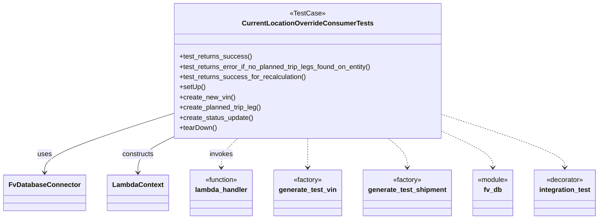

# Diagram: entity_core/entity_service/entity_service_tests/integration_tests/test_current_planned_trip_leg_override.py


> Auto-generated by Obscura crawlers

## Diagram 1



> SVG rendering failed for this diagram.

## Diagram 2

```mermaid
graph TD
    Start([Start Tests]) --> SetUp[setUp()]
    SetUp --> CreateVIN[create_new_vin()]
    CreateVIN --> CreateLeg[create_planned_trip_leg()]
    CreateLeg --> PrepareOverride[prepare override_event (valid override)]
    PrepareOverride --> Lambda1[lambda_handler(override_event, LambdaContext)]
    Lambda1 --> AssertSuccess[assert len(result.body) == 1]
    AssertSuccess --> TearDown[tearDown()]
    CreateLeg --> PrepareInvalid[prepare override_event (invalid origin/destination)]
    PrepareInvalid --> Lambda2[lambda_handler(override_event, LambdaContext)]
    Lambda2 --> AssertError[assert len(response.batchItemFailures) == 1]
    AssertError --> TearDown
    CreateLeg --> CreateStatus[create_status_update()]
    CreateStatus --> PrepareRecalc[prepare recalculate_event (no override)]
    PrepareRecalc --> Lambda3[lambda_handler(recalculate_event, LambdaContext)]
    Lambda3 --> AssertRecalc[assert len(result.body) == 1]
    AssertRecalc --> TearDown
    TearDown --> End([End Tests])
```

> SVG rendering failed for this diagram.
