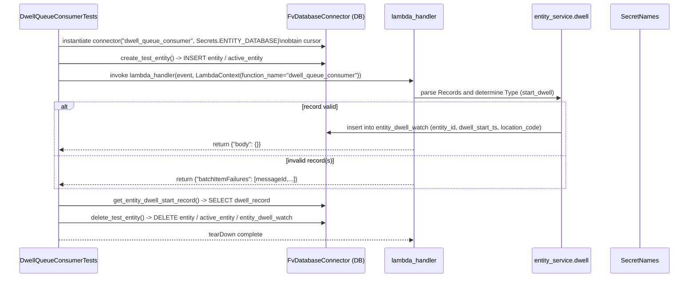
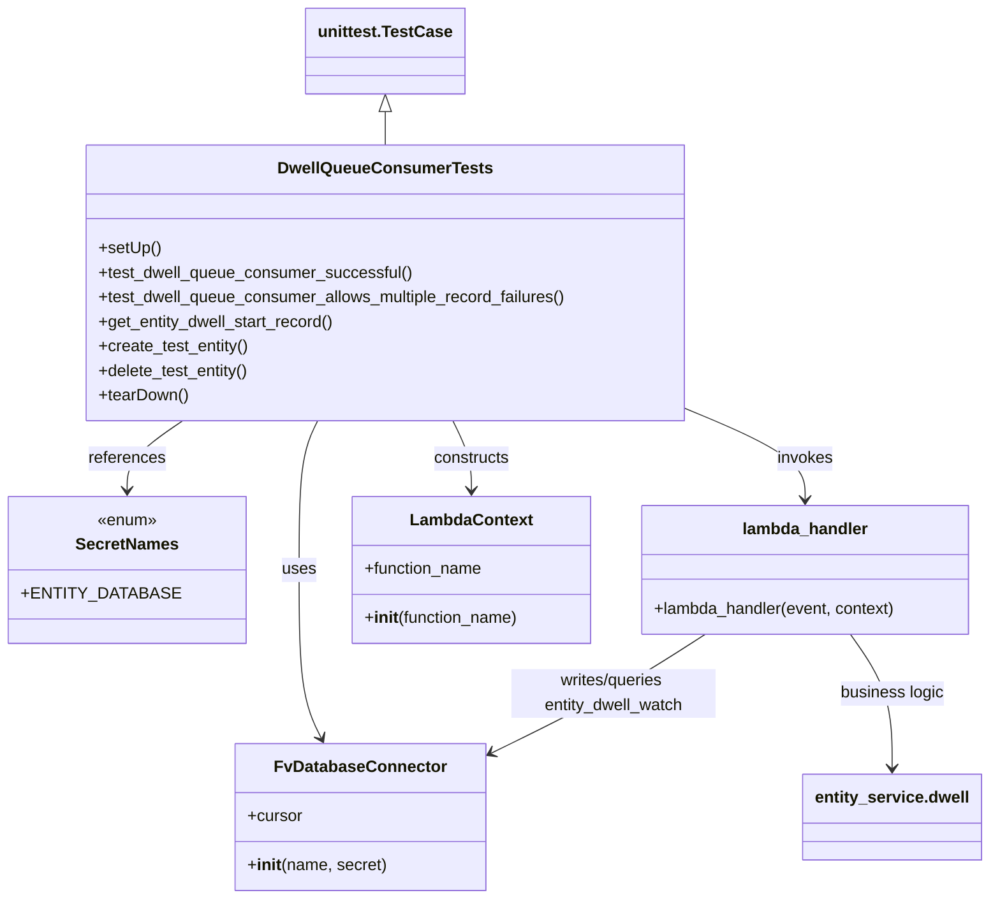

# Diagram: entity_core/entity_service/entity_service_tests/integration_tests/test_dwell_queue_consumer.py

> Auto-generated by Obscura crawlers

## Diagram 1

### SVG

<svg id="container" width="1865" xmlns="http://www.w3.org/2000/svg" height="751" viewBox="-50 -10 1865 751" role="graphics-document document" aria-roledescription="sequence"><g><rect x="1615" y="665" fill="#eaeaea" stroke="#666" width="150" height="65" name="Secrets" rx="3" ry="3" class="actor actor-bottom"></rect><text x="1690" y="697.5" dominant-baseline="central" alignment-baseline="central" class="actor actor-box" style="text-anchor: middle; font-size: 16px; font-weight: 400;"><tspan x="1690" dy="0">SecretNames</tspan></text></g><g><rect x="1401" y="665" fill="#eaeaea" stroke="#666" width="164" height="65" name="Entity" rx="3" ry="3" class="actor actor-bottom"></rect><text x="1483" y="697.5" dominant-baseline="central" alignment-baseline="central" class="actor actor-box" style="text-anchor: middle; font-size: 16px; font-weight: 400;"><tspan x="1483" dy="0">entity_service.dwell</tspan></text></g><g><rect x="991" y="665" fill="#eaeaea" stroke="#666" width="150" height="65" name="Lambda" rx="3" ry="3" class="actor actor-bottom"></rect><text x="1066" y="697.5" dominant-baseline="central" alignment-baseline="central" class="actor actor-box" style="text-anchor: middle; font-size: 16px; font-weight: 400;"><tspan x="1066" dy="0">lambda_handler</tspan></text></g><g><rect x="730" y="665" fill="#eaeaea" stroke="#666" width="211" height="65" name="FvDB" rx="3" ry="3" class="actor actor-bottom"></rect><text x="835.5" y="697.5" dominant-baseline="central" alignment-baseline="central" class="actor actor-box" style="text-anchor: middle; font-size: 16px; font-weight: 400;"><tspan x="835.5" dy="0">FvDatabaseConnector (DB)</tspan></text></g><g><rect x="0" y="665" fill="#eaeaea" stroke="#666" width="217" height="65" name="Test" rx="3" ry="3" class="actor actor-bottom"></rect><text x="108.5" y="697.5" dominant-baseline="central" alignment-baseline="central" class="actor actor-box" style="text-anchor: middle; font-size: 16px; font-weight: 400;"><tspan x="108.5" dy="0">DwellQueueConsumerTests</tspan></text></g><g><line id="actor4" x1="1690" y1="65" x2="1690" y2="665" class="actor-line 200" stroke-width="0.5px" stroke="#999" name="Secrets"></line><g id="root-4"><rect x="1615" y="0" fill="#eaeaea" stroke="#666" width="150" height="65" name="Secrets" rx="3" ry="3" class="actor actor-top"></rect><text x="1690" y="32.5" dominant-baseline="central" alignment-baseline="central" class="actor actor-box" style="text-anchor: middle; font-size: 16px; font-weight: 400;"><tspan x="1690" dy="0">SecretNames</tspan></text></g></g><g><line id="actor3" x1="1483" y1="65" x2="1483" y2="665" class="actor-line 200" stroke-width="0.5px" stroke="#999" name="Entity"></line><g id="root-3"><rect x="1401" y="0" fill="#eaeaea" stroke="#666" width="164" height="65" name="Entity" rx="3" ry="3" class="actor actor-top"></rect><text x="1483" y="32.5" dominant-baseline="central" alignment-baseline="central" class="actor actor-box" style="text-anchor: middle; font-size: 16px; font-weight: 400;"><tspan x="1483" dy="0">entity_service.dwell</tspan></text></g></g><g><line id="actor2" x1="1066" y1="65" x2="1066" y2="665" class="actor-line 200" stroke-width="0.5px" stroke="#999" name="Lambda"></line><g id="root-2"><rect x="991" y="0" fill="#eaeaea" stroke="#666" width="150" height="65" name="Lambda" rx="3" ry="3" class="actor actor-top"></rect><text x="1066" y="32.5" dominant-baseline="central" alignment-baseline="central" class="actor actor-box" style="text-anchor: middle; font-size: 16px; font-weight: 400;"><tspan x="1066" dy="0">lambda_handler</tspan></text></g></g><g><line id="actor1" x1="835.5" y1="65" x2="835.5" y2="665" class="actor-line 200" stroke-width="0.5px" stroke="#999" name="FvDB"></line><g id="root-1"><rect x="730" y="0" fill="#eaeaea" stroke="#666" width="211" height="65" name="FvDB" rx="3" ry="3" class="actor actor-top"></rect><text x="835.5" y="32.5" dominant-baseline="central" alignment-baseline="central" class="actor actor-box" style="text-anchor: middle; font-size: 16px; font-weight: 400;"><tspan x="835.5" dy="0">FvDatabaseConnector (DB)</tspan></text></g></g><g><line id="actor0" x1="108.5" y1="65" x2="108.5" y2="665" class="actor-line 200" stroke-width="0.5px" stroke="#999" name="Test"></line><g id="root-0"><rect x="0" y="0" fill="#eaeaea" stroke="#666" width="217" height="65" name="Test" rx="3" ry="3" class="actor actor-top"></rect><text x="108.5" y="32.5" dominant-baseline="central" alignment-baseline="central" class="actor actor-box" style="text-anchor: middle; font-size: 16px; font-weight: 400;"><tspan x="108.5" dy="0">DwellQueueConsumerTests</tspan></text></g></g><g></g><defs><symbol id="computer" width="24" height="24"><path transform="scale(.5)" d="M2 2v13h20v-13h-20zm18 11h-16v-9h16v9zm-10.228 6l.466-1h3.524l.467 1h-4.457zm14.228 3h-24l2-6h2.104l-1.33 4h18.45l-1.297-4h2.073l2 6zm-5-10h-14v-7h14v7z"></path></symbol></defs><defs><symbol id="database" fill-rule="evenodd" clip-rule="evenodd"><path transform="scale(.5)" d="M12.258.001l.256.004.255.005.253.008.251.01.249.012.247.015.246.016.242.019.241.02.239.023.236.024.233.027.231.028.229.031.225.032.223.034.22.036.217.038.214.04.211.041.208.043.205.045.201.046.198.048.194.05.191.051.187.053.183.054.18.056.175.057.172.059.168.06.163.061.16.063.155.064.15.066.074.033.073.033.071.034.07.034.069.035.068.035.067.035.066.035.064.036.064.036.062.036.06.036.06.037.058.037.058.037.055.038.055.038.053.038.052.038.051.039.05.039.048.039.047.039.045.04.044.04.043.04.041.04.04.041.039.041.037.041.036.041.034.041.033.042.032.042.03.042.029.042.027.042.026.043.024.043.023.043.021.043.02.043.018.044.017.043.015.044.013.044.012.044.011.045.009.044.007.045.006.045.004.045.002.045.001.045v17l-.001.045-.002.045-.004.045-.006.045-.007.045-.009.044-.011.045-.012.044-.013.044-.015.044-.017.043-.018.044-.02.043-.021.043-.023.043-.024.043-.026.043-.027.042-.029.042-.03.042-.032.042-.033.042-.034.041-.036.041-.037.041-.039.041-.04.041-.041.04-.043.04-.044.04-.045.04-.047.039-.048.039-.05.039-.051.039-.052.038-.053.038-.055.038-.055.038-.058.037-.058.037-.06.037-.06.036-.062.036-.064.036-.064.036-.066.035-.067.035-.068.035-.069.035-.07.034-.071.034-.073.033-.074.033-.15.066-.155.064-.16.063-.163.061-.168.06-.172.059-.175.057-.18.056-.183.054-.187.053-.191.051-.194.05-.198.048-.201.046-.205.045-.208.043-.211.041-.214.04-.217.038-.22.036-.223.034-.225.032-.229.031-.231.028-.233.027-.236.024-.239.023-.241.02-.242.019-.246.016-.247.015-.249.012-.251.01-.253.008-.255.005-.256.004-.258.001-.258-.001-.256-.004-.255-.005-.253-.008-.251-.01-.249-.012-.247-.015-.245-.016-.243-.019-.241-.02-.238-.023-.236-.024-.234-.027-.231-.028-.228-.031-.226-.032-.223-.034-.22-.036-.217-.038-.214-.04-.211-.041-.208-.043-.204-.045-.201-.046-.198-.048-.195-.05-.19-.051-.187-.053-.184-.054-.179-.056-.176-.057-.172-.059-.167-.06-.164-.061-.159-.063-.155-.064-.151-.066-.074-.033-.072-.033-.072-.034-.07-.034-.069-.035-.068-.035-.067-.035-.066-.035-.064-.036-.063-.036-.062-.036-.061-.036-.06-.037-.058-.037-.057-.037-.056-.038-.055-.038-.053-.038-.052-.038-.051-.039-.049-.039-.049-.039-.046-.039-.046-.04-.044-.04-.043-.04-.041-.04-.04-.041-.039-.041-.037-.041-.036-.041-.034-.041-.033-.042-.032-.042-.03-.042-.029-.042-.027-.042-.026-.043-.024-.043-.023-.043-.021-.043-.02-.043-.018-.044-.017-.043-.015-.044-.013-.044-.012-.044-.011-.045-.009-.044-.007-.045-.006-.045-.004-.045-.002-.045-.001-.045v-17l.001-.045.002-.045.004-.045.006-.045.007-.045.009-.044.011-.045.012-.044.013-.044.015-.044.017-.043.018-.044.02-.043.021-.043.023-.043.024-.043.026-.043.027-.042.029-.042.03-.042.032-.042.033-.042.034-.041.036-.041.037-.041.039-.041.04-.041.041-.04.043-.04.044-.04.046-.04.046-.039.049-.039.049-.039.051-.039.052-.038.053-.038.055-.038.056-.038.057-.037.058-.037.06-.037.061-.036.062-.036.063-.036.064-.036.066-.035.067-.035.068-.035.069-.035.07-.034.072-.034.072-.033.074-.033.151-.066.155-.064.159-.063.164-.061.167-.06.172-.059.176-.057.179-.056.184-.054.187-.053.19-.051.195-.05.198-.048.201-.046.204-.045.208-.043.211-.041.214-.04.217-.038.22-.036.223-.034.226-.032.228-.031.231-.028.234-.027.236-.024.238-.023.241-.02.243-.019.245-.016.247-.015.249-.012.251-.01.253-.008.255-.005.256-.004.258-.001.258.001zm-9.258 20.499v.01l.001.021.003.021.004.022.005.021.006.022.007.022.009.023.01.022.011.023.012.023.013.023.015.023.016.024.017.023.018.024.019.024.021.024.022.025.023.024.024.025.052.049.056.05.061.051.066.051.07.051.075.051.079.052.084.052.088.052.092.052.097.052.102.051.105.052.11.052.114.051.119.051.123.051.127.05.131.05.135.05.139.048.144.049.147.047.152.047.155.047.16.045.163.045.167.043.171.043.176.041.178.041.183.039.187.039.19.037.194.035.197.035.202.033.204.031.209.03.212.029.216.027.219.025.222.024.226.021.23.02.233.018.236.016.24.015.243.012.246.01.249.008.253.005.256.004.259.001.26-.001.257-.004.254-.005.25-.008.247-.011.244-.012.241-.014.237-.016.233-.018.231-.021.226-.021.224-.024.22-.026.216-.027.212-.028.21-.031.205-.031.202-.034.198-.034.194-.036.191-.037.187-.039.183-.04.179-.04.175-.042.172-.043.168-.044.163-.045.16-.046.155-.046.152-.047.148-.048.143-.049.139-.049.136-.05.131-.05.126-.05.123-.051.118-.052.114-.051.11-.052.106-.052.101-.052.096-.052.092-.052.088-.053.083-.051.079-.052.074-.052.07-.051.065-.051.06-.051.056-.05.051-.05.023-.024.023-.025.021-.024.02-.024.019-.024.018-.024.017-.024.015-.023.014-.024.013-.023.012-.023.01-.023.01-.022.008-.022.006-.022.006-.022.004-.022.004-.021.001-.021.001-.021v-4.127l-.077.055-.08.053-.083.054-.085.053-.087.052-.09.052-.093.051-.095.05-.097.05-.1.049-.102.049-.105.048-.106.047-.109.047-.111.046-.114.045-.115.045-.118.044-.12.043-.122.042-.124.042-.126.041-.128.04-.13.04-.132.038-.134.038-.135.037-.138.037-.139.035-.142.035-.143.034-.144.033-.147.032-.148.031-.15.03-.151.03-.153.029-.154.027-.156.027-.158.026-.159.025-.161.024-.162.023-.163.022-.165.021-.166.02-.167.019-.169.018-.169.017-.171.016-.173.015-.173.014-.175.013-.175.012-.177.011-.178.01-.179.008-.179.008-.181.006-.182.005-.182.004-.184.003-.184.002h-.37l-.184-.002-.184-.003-.182-.004-.182-.005-.181-.006-.179-.008-.179-.008-.178-.01-.176-.011-.176-.012-.175-.013-.173-.014-.172-.015-.171-.016-.17-.017-.169-.018-.167-.019-.166-.02-.165-.021-.163-.022-.162-.023-.161-.024-.159-.025-.157-.026-.156-.027-.155-.027-.153-.029-.151-.03-.15-.03-.148-.031-.146-.032-.145-.033-.143-.034-.141-.035-.14-.035-.137-.037-.136-.037-.134-.038-.132-.038-.13-.04-.128-.04-.126-.041-.124-.042-.122-.042-.12-.044-.117-.043-.116-.045-.113-.045-.112-.046-.109-.047-.106-.047-.105-.048-.102-.049-.1-.049-.097-.05-.095-.05-.093-.052-.09-.051-.087-.052-.085-.053-.083-.054-.08-.054-.077-.054v4.127zm0-5.654v.011l.001.021.003.021.004.021.005.022.006.022.007.022.009.022.01.022.011.023.012.023.013.023.015.024.016.023.017.024.018.024.019.024.021.024.022.024.023.025.024.024.052.05.056.05.061.05.066.051.07.051.075.052.079.051.084.052.088.052.092.052.097.052.102.052.105.052.11.051.114.051.119.052.123.05.127.051.131.05.135.049.139.049.144.048.147.048.152.047.155.046.16.045.163.045.167.044.171.042.176.042.178.04.183.04.187.038.19.037.194.036.197.034.202.033.204.032.209.03.212.028.216.027.219.025.222.024.226.022.23.02.233.018.236.016.24.014.243.012.246.01.249.008.253.006.256.003.259.001.26-.001.257-.003.254-.006.25-.008.247-.01.244-.012.241-.015.237-.016.233-.018.231-.02.226-.022.224-.024.22-.025.216-.027.212-.029.21-.03.205-.032.202-.033.198-.035.194-.036.191-.037.187-.039.183-.039.179-.041.175-.042.172-.043.168-.044.163-.045.16-.045.155-.047.152-.047.148-.048.143-.048.139-.05.136-.049.131-.05.126-.051.123-.051.118-.051.114-.052.11-.052.106-.052.101-.052.096-.052.092-.052.088-.052.083-.052.079-.052.074-.051.07-.052.065-.051.06-.05.056-.051.051-.049.023-.025.023-.024.021-.025.02-.024.019-.024.018-.024.017-.024.015-.023.014-.023.013-.024.012-.022.01-.023.01-.023.008-.022.006-.022.006-.022.004-.021.004-.022.001-.021.001-.021v-4.139l-.077.054-.08.054-.083.054-.085.052-.087.053-.09.051-.093.051-.095.051-.097.05-.1.049-.102.049-.105.048-.106.047-.109.047-.111.046-.114.045-.115.044-.118.044-.12.044-.122.042-.124.042-.126.041-.128.04-.13.039-.132.039-.134.038-.135.037-.138.036-.139.036-.142.035-.143.033-.144.033-.147.033-.148.031-.15.03-.151.03-.153.028-.154.028-.156.027-.158.026-.159.025-.161.024-.162.023-.163.022-.165.021-.166.02-.167.019-.169.018-.169.017-.171.016-.173.015-.173.014-.175.013-.175.012-.177.011-.178.009-.179.009-.179.007-.181.007-.182.005-.182.004-.184.003-.184.002h-.37l-.184-.002-.184-.003-.182-.004-.182-.005-.181-.007-.179-.007-.179-.009-.178-.009-.176-.011-.176-.012-.175-.013-.173-.014-.172-.015-.171-.016-.17-.017-.169-.018-.167-.019-.166-.02-.165-.021-.163-.022-.162-.023-.161-.024-.159-.025-.157-.026-.156-.027-.155-.028-.153-.028-.151-.03-.15-.03-.148-.031-.146-.033-.145-.033-.143-.033-.141-.035-.14-.036-.137-.036-.136-.037-.134-.038-.132-.039-.13-.039-.128-.04-.126-.041-.124-.042-.122-.043-.12-.043-.117-.044-.116-.044-.113-.046-.112-.046-.109-.046-.106-.047-.105-.048-.102-.049-.1-.049-.097-.05-.095-.051-.093-.051-.09-.051-.087-.053-.085-.052-.083-.054-.08-.054-.077-.054v4.139zm0-5.666v.011l.001.02.003.022.004.021.005.022.006.021.007.022.009.023.01.022.011.023.012.023.013.023.015.023.016.024.017.024.018.023.019.024.021.025.022.024.023.024.024.025.052.05.056.05.061.05.066.051.07.051.075.052.079.051.084.052.088.052.092.052.097.052.102.052.105.051.11.052.114.051.119.051.123.051.127.05.131.05.135.05.139.049.144.048.147.048.152.047.155.046.16.045.163.045.167.043.171.043.176.042.178.04.183.04.187.038.19.037.194.036.197.034.202.033.204.032.209.03.212.028.216.027.219.025.222.024.226.021.23.02.233.018.236.017.24.014.243.012.246.01.249.008.253.006.256.003.259.001.26-.001.257-.003.254-.006.25-.008.247-.01.244-.013.241-.014.237-.016.233-.018.231-.02.226-.022.224-.024.22-.025.216-.027.212-.029.21-.03.205-.032.202-.033.198-.035.194-.036.191-.037.187-.039.183-.039.179-.041.175-.042.172-.043.168-.044.163-.045.16-.045.155-.047.152-.047.148-.048.143-.049.139-.049.136-.049.131-.051.126-.05.123-.051.118-.052.114-.051.11-.052.106-.052.101-.052.096-.052.092-.052.088-.052.083-.052.079-.052.074-.052.07-.051.065-.051.06-.051.056-.05.051-.049.023-.025.023-.025.021-.024.02-.024.019-.024.018-.024.017-.024.015-.023.014-.024.013-.023.012-.023.01-.022.01-.023.008-.022.006-.022.006-.022.004-.022.004-.021.001-.021.001-.021v-4.153l-.077.054-.08.054-.083.053-.085.053-.087.053-.09.051-.093.051-.095.051-.097.05-.1.049-.102.048-.105.048-.106.048-.109.046-.111.046-.114.046-.115.044-.118.044-.12.043-.122.043-.124.042-.126.041-.128.04-.13.039-.132.039-.134.038-.135.037-.138.036-.139.036-.142.034-.143.034-.144.033-.147.032-.148.032-.15.03-.151.03-.153.028-.154.028-.156.027-.158.026-.159.024-.161.024-.162.023-.163.023-.165.021-.166.02-.167.019-.169.018-.169.017-.171.016-.173.015-.173.014-.175.013-.175.012-.177.01-.178.01-.179.009-.179.007-.181.006-.182.006-.182.004-.184.003-.184.001-.185.001-.185-.001-.184-.001-.184-.003-.182-.004-.182-.006-.181-.006-.179-.007-.179-.009-.178-.01-.176-.01-.176-.012-.175-.013-.173-.014-.172-.015-.171-.016-.17-.017-.169-.018-.167-.019-.166-.02-.165-.021-.163-.023-.162-.023-.161-.024-.159-.024-.157-.026-.156-.027-.155-.028-.153-.028-.151-.03-.15-.03-.148-.032-.146-.032-.145-.033-.143-.034-.141-.034-.14-.036-.137-.036-.136-.037-.134-.038-.132-.039-.13-.039-.128-.041-.126-.041-.124-.041-.122-.043-.12-.043-.117-.044-.116-.044-.113-.046-.112-.046-.109-.046-.106-.048-.105-.048-.102-.048-.1-.05-.097-.049-.095-.051-.093-.051-.09-.052-.087-.052-.085-.053-.083-.053-.08-.054-.077-.054v4.153zm8.74-8.179l-.257.004-.254.005-.25.008-.247.011-.244.012-.241.014-.237.016-.233.018-.231.021-.226.022-.224.023-.22.026-.216.027-.212.028-.21.031-.205.032-.202.033-.198.034-.194.036-.191.038-.187.038-.183.04-.179.041-.175.042-.172.043-.168.043-.163.045-.16.046-.155.046-.152.048-.148.048-.143.048-.139.049-.136.05-.131.05-.126.051-.123.051-.118.051-.114.052-.11.052-.106.052-.101.052-.096.052-.092.052-.088.052-.083.052-.079.052-.074.051-.07.052-.065.051-.06.05-.056.05-.051.05-.023.025-.023.024-.021.024-.02.025-.019.024-.018.024-.017.023-.015.024-.014.023-.013.023-.012.023-.01.023-.01.022-.008.022-.006.023-.006.021-.004.022-.004.021-.001.021-.001.021.001.021.001.021.004.021.004.022.006.021.006.023.008.022.01.022.01.023.012.023.013.023.014.023.015.024.017.023.018.024.019.024.02.025.021.024.023.024.023.025.051.05.056.05.06.05.065.051.07.052.074.051.079.052.083.052.088.052.092.052.096.052.101.052.106.052.11.052.114.052.118.051.123.051.126.051.131.05.136.05.139.049.143.048.148.048.152.048.155.046.16.046.163.045.168.043.172.043.175.042.179.041.183.04.187.038.191.038.194.036.198.034.202.033.205.032.21.031.212.028.216.027.22.026.224.023.226.022.231.021.233.018.237.016.241.014.244.012.247.011.25.008.254.005.257.004.26.001.26-.001.257-.004.254-.005.25-.008.247-.011.244-.012.241-.014.237-.016.233-.018.231-.021.226-.022.224-.023.22-.026.216-.027.212-.028.21-.031.205-.032.202-.033.198-.034.194-.036.191-.038.187-.038.183-.04.179-.041.175-.042.172-.043.168-.043.163-.045.16-.046.155-.046.152-.048.148-.048.143-.048.139-.049.136-.05.131-.05.126-.051.123-.051.118-.051.114-.052.11-.052.106-.052.101-.052.096-.052.092-.052.088-.052.083-.052.079-.052.074-.051.07-.052.065-.051.06-.05.056-.05.051-.05.023-.025.023-.024.021-.024.02-.025.019-.024.018-.024.017-.023.015-.024.014-.023.013-.023.012-.023.01-.023.01-.022.008-.022.006-.023.006-.021.004-.022.004-.021.001-.021.001-.021-.001-.021-.001-.021-.004-.021-.004-.022-.006-.021-.006-.023-.008-.022-.01-.022-.01-.023-.012-.023-.013-.023-.014-.023-.015-.024-.017-.023-.018-.024-.019-.024-.02-.025-.021-.024-.023-.024-.023-.025-.051-.05-.056-.05-.06-.05-.065-.051-.07-.052-.074-.051-.079-.052-.083-.052-.088-.052-.092-.052-.096-.052-.101-.052-.106-.052-.11-.052-.114-.052-.118-.051-.123-.051-.126-.051-.131-.05-.136-.05-.139-.049-.143-.048-.148-.048-.152-.048-.155-.046-.16-.046-.163-.045-.168-.043-.172-.043-.175-.042-.179-.041-.183-.04-.187-.038-.191-.038-.194-.036-.198-.034-.202-.033-.205-.032-.21-.031-.212-.028-.216-.027-.22-.026-.224-.023-.226-.022-.231-.021-.233-.018-.237-.016-.241-.014-.244-.012-.247-.011-.25-.008-.254-.005-.257-.004-.26-.001-.26.001z"></path></symbol></defs><defs><symbol id="clock" width="24" height="24"><path transform="scale(.5)" d="M12 2c5.514 0 10 4.486 10 10s-4.486 10-10 10-10-4.486-10-10 4.486-10 10-10zm0-2c-6.627 0-12 5.373-12 12s5.373 12 12 12 12-5.373 12-12-5.373-12-12-12zm5.848 12.459c.202.038.202.333.001.372-1.907.361-6.045 1.111-6.547 1.111-.719 0-1.301-.582-1.301-1.301 0-.512.77-5.447 1.125-7.445.034-.192.312-.181.343.014l.985 6.238 5.394 1.011z"></path></symbol></defs><defs><marker id="arrowhead" refX="7.9" refY="5" markerUnits="userSpaceOnUse" markerWidth="12" markerHeight="12" orient="auto-start-reverse"><path d="M -1 0 L 10 5 L 0 10 z"></path></marker></defs><defs><marker id="crosshead" markerWidth="15" markerHeight="8" orient="auto" refX="4" refY="4.5"><path fill="none" stroke="#000000" stroke-width="1pt" d="M 1,2 L 6,7 M 6,2 L 1,7" style="stroke-dasharray: 0, 0;"></path></marker></defs><defs><marker id="filled-head" refX="15.5" refY="7" markerWidth="20" markerHeight="28" orient="auto"><path d="M 18,7 L9,13 L14,7 L9,1 Z"></path></marker></defs><defs><marker id="sequencenumber" refX="15" refY="15" markerWidth="60" markerHeight="40" orient="auto"><circle cx="15" cy="15" r="6"></circle></marker></defs><g><line x1="97.5" y1="267" x2="1494" y2="267" class="loopLine"></line><line x1="1494" y1="267" x2="1494" y2="501" class="loopLine"></line><line x1="97.5" y1="501" x2="1494" y2="501" class="loopLine"></line><line x1="97.5" y1="267" x2="97.5" y2="501" class="loopLine"></line><line x1="97.5" y1="413" x2="1494" y2="413" class="loopLine" style="stroke-dasharray: 3, 3;"></line><polygon points="97.5,267 147.5,267 147.5,280 139.1,287 97.5,287" class="labelBox"></polygon><text x="123" y="280" text-anchor="middle" dominant-baseline="middle" alignment-baseline="middle" class="labelText" style="font-size: 16px; font-weight: 400;">alt</text><text x="820.75" y="285" text-anchor="middle" class="loopText" style="font-size: 16px; font-weight: 400;"><tspan x="820.75">[record valid]</tspan></text><text x="795.75" y="431" text-anchor="middle" class="loopText" style="font-size: 16px; font-weight: 400;">[invalid record(s)]</text></g><text x="471" y="80" text-anchor="middle" dominant-baseline="middle" alignment-baseline="middle" class="messageText" dy="1em" style="font-size: 16px; font-weight: 400;">instantiate connector("dwell_queue_consumer", Secrets.ENTITY_DATABASE)\nobtain cursor</text><line x1="109.5" y1="113" x2="831.5" y2="113" class="messageLine0" stroke-width="2" stroke="none" marker-end="url(#arrowhead)" style="fill: none;"></line><text x="471" y="128" text-anchor="middle" dominant-baseline="middle" alignment-baseline="middle" class="messageText" dy="1em" style="font-size: 16px; font-weight: 400;">create_test_entity() -&gt; INSERT entity / active_entity</text><line x1="109.5" y1="161" x2="831.5" y2="161" class="messageLine0" stroke-width="2" stroke="none" marker-end="url(#arrowhead)" style="fill: none;"></line><text x="586" y="176" text-anchor="middle" dominant-baseline="middle" alignment-baseline="middle" class="messageText" dy="1em" style="font-size: 16px; font-weight: 400;">invoke lambda_handler(event, LambdaContext(function_name="dwell_queue_consumer"))</text><line x1="109.5" y1="209" x2="1062" y2="209" class="messageLine0" stroke-width="2" stroke="none" marker-end="url(#arrowhead)" style="fill: none;"></line><text x="1273" y="224" text-anchor="middle" dominant-baseline="middle" alignment-baseline="middle" class="messageText" dy="1em" style="font-size: 16px; font-weight: 400;">parse Records and determine Type (start_dwell)</text><line x1="1067" y1="257" x2="1479" y2="257" class="messageLine0" stroke-width="2" stroke="none" marker-end="url(#arrowhead)" style="fill: none;"></line><text x="1161" y="317" text-anchor="middle" dominant-baseline="middle" alignment-baseline="middle" class="messageText" dy="1em" style="font-size: 16px; font-weight: 400;">insert into entity_dwell_watch (entity_id, dwell_start_ts, location_code)</text><line x1="1482" y1="350" x2="839.5" y2="350" class="messageLine0" stroke-width="2" stroke="none" marker-end="url(#arrowhead)" style="fill: none;"></line><text x="589" y="365" text-anchor="middle" dominant-baseline="middle" alignment-baseline="middle" class="messageText" dy="1em" style="font-size: 16px; font-weight: 400;">return {"body": {}}</text><line x1="1065" y1="398" x2="112.5" y2="398" class="messageLine1" stroke-width="2" stroke="none" marker-end="url(#arrowhead)" style="stroke-dasharray: 3, 3; fill: none;"></line><text x="589" y="458" text-anchor="middle" dominant-baseline="middle" alignment-baseline="middle" class="messageText" dy="1em" style="font-size: 16px; font-weight: 400;">return {"batchItemFailures": [messageId,...]}</text><line x1="1065" y1="491" x2="112.5" y2="491" class="messageLine1" stroke-width="2" stroke="none" marker-end="url(#arrowhead)" style="stroke-dasharray: 3, 3; fill: none;"></line><text x="471" y="516" text-anchor="middle" dominant-baseline="middle" alignment-baseline="middle" class="messageText" dy="1em" style="font-size: 16px; font-weight: 400;">get_entity_dwell_start_record() -&gt; SELECT dwell_record</text><line x1="109.5" y1="549" x2="831.5" y2="549" class="messageLine0" stroke-width="2" stroke="none" marker-end="url(#arrowhead)" style="fill: none;"></line><text x="471" y="564" text-anchor="middle" dominant-baseline="middle" alignment-baseline="middle" class="messageText" dy="1em" style="font-size: 16px; font-weight: 400;">delete_test_entity() -&gt; DELETE entity / active_entity / entity_dwell_watch</text><line x1="109.5" y1="597" x2="831.5" y2="597" class="messageLine0" stroke-width="2" stroke="none" marker-end="url(#arrowhead)" style="fill: none;"></line><text x="586" y="612" text-anchor="middle" dominant-baseline="middle" alignment-baseline="middle" class="messageText" dy="1em" style="font-size: 16px; font-weight: 400;">tearDown complete</text><line x1="109.5" y1="645" x2="1062" y2="645" class="messageLine1" stroke-width="2" stroke="none" marker-end="url(#arrowhead)" style="stroke-dasharray: 3, 3; fill: none;"></line></svg>

## Diagram 2

### SVG

<svg id="container" width="943.2890625" xmlns="http://www.w3.org/2000/svg" class="classDiagram" height="880" viewBox="0 0 943.2890625 880" role="graphics-document document" aria-roledescription="class"><g><defs><marker id="container_class-aggregationStart" class="marker aggregation class" refX="18" refY="7" markerWidth="190" markerHeight="240" orient="auto"><path d="M 18,7 L9,13 L1,7 L9,1 Z"></path></marker></defs><defs><marker id="container_class-aggregationEnd" class="marker aggregation class" refX="1" refY="7" markerWidth="20" markerHeight="28" orient="auto"><path d="M 18,7 L9,13 L1,7 L9,1 Z"></path></marker></defs><defs><marker id="container_class-extensionStart" class="marker extension class" refX="18" refY="7" markerWidth="190" markerHeight="240" orient="auto"><path d="M 1,7 L18,13 V 1 Z"></path></marker></defs><defs><marker id="container_class-extensionEnd" class="marker extension class" refX="1" refY="7" markerWidth="20" markerHeight="28" orient="auto"><path d="M 1,1 V 13 L18,7 Z"></path></marker></defs><defs><marker id="container_class-compositionStart" class="marker composition class" refX="18" refY="7" markerWidth="190" markerHeight="240" orient="auto"><path d="M 18,7 L9,13 L1,7 L9,1 Z"></path></marker></defs><defs><marker id="container_class-compositionEnd" class="marker composition class" refX="1" refY="7" markerWidth="20" markerHeight="28" orient="auto"><path d="M 18,7 L9,13 L1,7 L9,1 Z"></path></marker></defs><defs><marker id="container_class-dependencyStart" class="marker dependency class" refX="6" refY="7" markerWidth="190" markerHeight="240" orient="auto"><path d="M 5,7 L9,13 L1,7 L9,1 Z"></path></marker></defs><defs><marker id="container_class-dependencyEnd" class="marker dependency class" refX="13" refY="7" markerWidth="20" markerHeight="28" orient="auto"><path d="M 18,7 L9,13 L14,7 L9,1 Z"></path></marker></defs><defs><marker id="container_class-lollipopStart" class="marker lollipop class" refX="13" refY="7" markerWidth="190" markerHeight="240" orient="auto"><circle stroke="black" fill="transparent" cx="7" cy="7" r="6"></circle></marker></defs><defs><marker id="container_class-lollipopEnd" class="marker lollipop class" refX="1" refY="7" markerWidth="190" markerHeight="240" orient="auto"><circle stroke="black" fill="transparent" cx="7" cy="7" r="6"></circle></marker></defs><g class="root"><g class="clusters"></g><g class="edgePaths"><path d="M351.504,109.25L351.504,110.542C351.504,111.833,351.504,114.417,351.504,119.875C351.504,125.333,351.504,133.667,351.504,137.833L351.504,142" id="id_unittest.TestCase_DwellQueueConsumerTests_1" class="edge-thickness-normal edge-pattern-solid relation" style=";;;" data-edge="true" data-et="edge" data-id="id_unittest.TestCase_DwellQueueConsumerTests_1" data-points="W3sieCI6MzUxLjUwMzkwNjI1LCJ5Ijo5Mn0seyJ4IjozNTEuNTAzOTA2MjUsInkiOjExN30seyJ4IjozNTEuNTAzOTA2MjUsInkiOjE0Mn1d" marker-start="url(#container_class-extensionStart)"></path><path d="M285.454,412L282.437,418.167C279.42,424.333,273.386,436.667,270.369,461C267.352,485.333,267.352,521.667,267.352,560C267.352,598.333,267.352,638.667,270.957,666.104C274.562,693.542,281.773,708.083,285.378,715.354L288.984,722.625" id="id_DwellQueueConsumerTests_FvDatabaseConnector_2" class="edge-thickness-normal edge-pattern-solid relation" style=";;;" data-edge="true" data-et="edge" data-id="id_DwellQueueConsumerTests_FvDatabaseConnector_2" data-points="W3sieCI6Mjg1LjQ1NDEwMTU2MjUsInkiOjQxMn0seyJ4IjoyNjcuMzUxNTYyNSwieSI6NDQ5fSx7IngiOjI2Ny4zNTE1NjI1LCJ5Ijo1NTh9LHsieCI6MjY3LjM1MTU2MjUsInkiOjY3OX0seyJ4IjoyOTEuNjQ5MDgzMTYxMTU3LCJ5Ijo3Mjh9XQ==" marker-end="url(#container_class-dependencyEnd)"></path><path d="M163.466,412L154.877,418.167C146.287,424.333,129.108,436.667,120.519,448C111.93,459.333,111.93,469.667,111.93,474.833L111.93,480" id="id_DwellQueueConsumerTests_SecretNames_3" class="edge-thickness-normal edge-pattern-solid relation" style=";;;" data-edge="true" data-et="edge" data-id="id_DwellQueueConsumerTests_SecretNames_3" data-points="W3sieCI6MTYzLjQ2NjAwMTk5ODU0NjUyLCJ5Ijo0MTJ9LHsieCI6MTExLjkyOTY4NzUsInkiOjQ0OX0seyJ4IjoxMTEuOTI5Njg3NSwieSI6NDg2fV0=" marker-end="url(#container_class-dependencyEnd)"></path><path d="M645.18,399.292L665.075,407.576C684.97,415.861,724.76,432.431,744.656,447.382C764.551,462.333,764.551,475.667,764.551,482.333L764.551,489" id="id_DwellQueueConsumerTests_lambda_handler_4" class="edge-thickness-normal edge-pattern-solid relation" style=";;;" data-edge="true" data-et="edge" data-id="id_DwellQueueConsumerTests_lambda_handler_4" data-points="W3sieCI6NjQ1LjE3OTY4NzUsInkiOjM5OS4yOTE3NzIyNzE2MDk2fSx7IngiOjc2NC41NTA3ODEyNSwieSI6NDQ5fSx7IngiOjc2NC41NTA3ODEyNSwieSI6NDk1fV0=" marker-end="url(#container_class-dependencyEnd)"></path><path d="M417.554,412L420.571,418.167C423.588,424.333,429.622,436.667,432.639,448C435.656,459.333,435.656,469.667,435.656,474.833L435.656,480" id="id_DwellQueueConsumerTests_LambdaContext_5" class="edge-thickness-normal edge-pattern-solid relation" style=";;;" data-edge="true" data-et="edge" data-id="id_DwellQueueConsumerTests_LambdaContext_5" data-points="W3sieCI6NDE3LjU1MzcxMDkzNzUsInkiOjQxMn0seyJ4Ijo0MzUuNjU2MjUsInkiOjQ0OX0seyJ4Ijo0MzUuNjU2MjUsInkiOjQ4Nn1d" marker-end="url(#container_class-dependencyEnd)"></path><path d="M666.354,621L651.287,630.667C636.22,640.333,606.086,659.667,570.365,679.386C534.645,699.105,493.338,719.21,472.685,729.262L452.032,739.315" id="id_lambda_handler_FvDatabaseConnector_6" class="edge-thickness-normal edge-pattern-solid relation" style=";;;" data-edge="true" data-et="edge" data-id="id_lambda_handler_FvDatabaseConnector_6" data-points="W3sieCI6NjY2LjM1NDI5MDQxODM4ODUsInkiOjYyMX0seyJ4Ijo1NzUuOTUxMTcxODc1LCJ5Ijo2Nzl9LHsieCI6NDQ2LjYzNjcxODc1LCJ5Ijo3NDEuOTQwNzYxOTI0MjE2MX1d" marker-end="url(#container_class-dependencyEnd)"></path><path d="M809.114,621L815.952,630.667C822.79,640.333,836.465,659.667,843.303,681.5C850.141,703.333,850.141,727.667,850.141,739.833L850.141,752" id="id_lambda_handler_entity_service.dwell_7" class="edge-thickness-normal edge-pattern-solid relation" style=";;;" data-edge="true" data-et="edge" data-id="id_lambda_handler_entity_service.dwell_7" data-points="W3sieCI6ODA5LjExNDA4ODMyNjQ0NjMsInkiOjYyMX0seyJ4Ijo4NTAuMTQwNjI1LCJ5Ijo2Nzl9LHsieCI6ODUwLjE0MDYyNSwieSI6NzU4fV0=" marker-end="url(#container_class-dependencyEnd)"></path></g><g class="edgeLabels"><g class="edgeLabel"><g class="label" data-id="id_unittest.TestCase_DwellQueueConsumerTests_1" transform="translate(0, 0)"><foreignObject width="0" height="0">

</foreignObject></g></g><g class="edgeLabel" transform="translate(267.3515625, 558)"><g class="label" data-id="id_DwellQueueConsumerTests_FvDatabaseConnector_2" transform="translate(-16.4921875, -12)"><foreignObject width="32.984375" height="24">

uses

</foreignObject></g></g><g class="edgeLabel" transform="translate(111.9296875, 449)"><g class="label" data-id="id_DwellQueueConsumerTests_SecretNames_3" transform="translate(-37.828125, -12)"><foreignObject width="75.65625" height="24">

references

</foreignObject></g></g><g class="edgeLabel" transform="translate(764.55078125, 449)"><g class="label" data-id="id_DwellQueueConsumerTests_lambda_handler_4" transform="translate(-27.5859375, -12)"><foreignObject width="55.171875" height="24">

invokes

</foreignObject></g></g><g class="edgeLabel" transform="translate(435.65625, 449)"><g class="label" data-id="id_DwellQueueConsumerTests_LambdaContext_5" transform="translate(-37.84375, -12)"><foreignObject width="75.6875" height="24">

constructs

</foreignObject></g></g><g class="edgeLabel" transform="translate(575.951171875, 679)"><g class="label" data-id="id_lambda_handler_FvDatabaseConnector_6" transform="translate(-100, -24)"><foreignObject width="200" height="48">

writes/queries entity_dwell_watch

</foreignObject></g></g><g class="edgeLabel" transform="translate(850.140625, 679)"><g class="label" data-id="id_lambda_handler_entity_service.dwell_7" transform="translate(-51.1796875, -12)"><foreignObject width="102.359375" height="24">

business logic

</foreignObject></g></g></g><g class="nodes"><g class="node default" id="classId-unittest.TestCase-0" transform="translate(351.50390625, 50)"><g class="basic label-container"><path d="M-74.7109375 -42 L74.7109375 -42 L74.7109375 42 L-74.7109375 42" stroke="none" stroke-width="0" fill="#ECECFF" style=""></path><path d="M-74.7109375 -42 C-44.756559847237156 -42, -14.802182194474305 -42, 74.7109375 -42 M-74.7109375 -42 C-17.797903892167994 -42, 39.11512971566401 -42, 74.7109375 -42 M74.7109375 -42 C74.7109375 -23.13976021522982, 74.7109375 -4.279520430459641, 74.7109375 42 M74.7109375 -42 C74.7109375 -18.073818461801828, 74.7109375 5.852363076396344, 74.7109375 42 M74.7109375 42 C32.3622606965838 42, -9.986416106832394 42, -74.7109375 42 M74.7109375 42 C31.336352288365333 42, -12.038232923269334 42, -74.7109375 42 M-74.7109375 42 C-74.7109375 19.691897751664673, -74.7109375 -2.6162044966706546, -74.7109375 -42 M-74.7109375 42 C-74.7109375 11.917950670211813, -74.7109375 -18.164098659576375, -74.7109375 -42" stroke="#9370DB" stroke-width="1.3" fill="none" stroke-dasharray="0 0" style=""></path></g><g class="annotation-group text" transform="translate(0, -18)"></g><g class="label-group text" transform="translate(-62.7109375, -18)"><g class="label" style="font-weight: bolder" transform="translate(0,-12)"><foreignObject width="125.421875" height="24">

unittest.TestCase

</foreignObject></g></g><g class="members-group text" transform="translate(-62.7109375, 30)"></g><g class="methods-group text" transform="translate(-62.7109375, 60)"></g><g class="divider" style=""><path d="M-74.7109375 6 C-43.12822994396862 6, -11.545522387937247 6, 74.7109375 6 M-74.7109375 6 C-44.740136438143765 6, -14.769335376287529 6, 74.7109375 6" stroke="#9370DB" stroke-width="1.3" fill="none" stroke-dasharray="0 0" style=""></path></g><g class="divider" style=""><path d="M-74.7109375 24 C-37.33508712740902 24, 0.040763245181963725 24, 74.7109375 24 M-74.7109375 24 C-38.16909564239899 24, -1.6272537847979862 24, 74.7109375 24" stroke="#9370DB" stroke-width="1.3" fill="none" stroke-dasharray="0 0" style=""></path></g></g><g class="node default" id="classId-DwellQueueConsumerTests-1" transform="translate(351.50390625, 277)"><g class="basic label-container"><path d="M-293.67578125 -135 L293.67578125 -135 L293.67578125 135 L-293.67578125 135" stroke="none" stroke-width="0" fill="#ECECFF" style=""></path><path d="M-293.67578125 -135 C-69.56070975974734 -135, 154.55436173050532 -135, 293.67578125 -135 M-293.67578125 -135 C-127.26661034485366 -135, 39.14256056029268 -135, 293.67578125 -135 M293.67578125 -135 C293.67578125 -54.18916666169302, 293.67578125 26.621666676613955, 293.67578125 135 M293.67578125 -135 C293.67578125 -62.35025976596923, 293.67578125 10.299480468061546, 293.67578125 135 M293.67578125 135 C61.32242000784569 135, -171.0309412343086 135, -293.67578125 135 M293.67578125 135 C163.75599090487086 135, 33.83620055974171 135, -293.67578125 135 M-293.67578125 135 C-293.67578125 50.500654963906456, -293.67578125 -33.99869007218709, -293.67578125 -135 M-293.67578125 135 C-293.67578125 43.01638211963842, -293.67578125 -48.967235760723156, -293.67578125 -135" stroke="#9370DB" stroke-width="1.3" fill="none" stroke-dasharray="0 0" style=""></path></g><g class="annotation-group text" transform="translate(0, -111)"></g><g class="label-group text" transform="translate(-99.5390625, -111)"><g class="label" style="font-weight: bolder" transform="translate(0,-12)"><foreignObject width="199.078125" height="24">

DwellQueueConsumerTests

</foreignObject></g></g><g class="members-group text" transform="translate(-281.67578125, -63)"></g><g class="methods-group text" transform="translate(-281.67578125, -33)"><g class="label" style="" transform="translate(0,-12)"><foreignObject width="60.421875" height="24">

+setUp()

</foreignObject></g><g class="label" style="" transform="translate(0,12)"><foreignObject width="307.015625" height="24">

+test_dwell_queue_consumer_successful()

</foreignObject></g><g class="label" style="" transform="translate(0,36)"><foreignObject width="463.8125" height="24">

+test_dwell_queue_consumer_allows_multiple_record_failures()

</foreignObject></g><g class="label" style="" transform="translate(0,60)"><foreignObject width="234.3125" height="24">

+get_entity_dwell_start_record()

</foreignObject></g><g class="label" style="" transform="translate(0,84)"><foreignObject width="148.359375" height="24">

+create_test_entity()

</foreignObject></g><g class="label" style="" transform="translate(0,108)"><foreignObject width="149.375" height="24">

+delete_test_entity()

</foreignObject></g><g class="label" style="" transform="translate(0,132)"><foreignObject width="87.75" height="24">

+tearDown()

</foreignObject></g></g><g class="divider" style=""><path d="M-293.67578125 -87 C-82.40488361300606 -87, 128.86601402398787 -87, 293.67578125 -87 M-293.67578125 -87 C-96.05600844766894 -87, 101.56376435466211 -87, 293.67578125 -87" stroke="#9370DB" stroke-width="1.3" fill="none" stroke-dasharray="0 0" style=""></path></g><g class="divider" style=""><path d="M-293.67578125 -63 C-61.142605639595786 -63, 171.39056997080843 -63, 293.67578125 -63 M-293.67578125 -63 C-103.00278936929001 -63, 87.67020251141997 -63, 293.67578125 -63" stroke="#9370DB" stroke-width="1.3" fill="none" stroke-dasharray="0 0" style=""></path></g></g><g class="node default" id="classId-FvDatabaseConnector-2" transform="translate(327.3515625, 800)"><g class="basic label-container"><path d="M-119.28515625 -72 L119.28515625 -72 L119.28515625 72 L-119.28515625 72" stroke="none" stroke-width="0" fill="#ECECFF" style=""></path><path d="M-119.28515625 -72 C-29.235984814656092 -72, 60.813186620687816 -72, 119.28515625 -72 M-119.28515625 -72 C-44.730903497071566 -72, 29.82334925585687 -72, 119.28515625 -72 M119.28515625 -72 C119.28515625 -36.32139844374791, 119.28515625 -0.6427968874958196, 119.28515625 72 M119.28515625 -72 C119.28515625 -23.352494396771924, 119.28515625 25.295011206456152, 119.28515625 72 M119.28515625 72 C54.39960506439414 72, -10.485946121211725 72, -119.28515625 72 M119.28515625 72 C31.160864282146633 72, -56.96342768570673 72, -119.28515625 72 M-119.28515625 72 C-119.28515625 33.73351221752353, -119.28515625 -4.532975564952935, -119.28515625 -72 M-119.28515625 72 C-119.28515625 42.049255310618996, -119.28515625 12.098510621237992, -119.28515625 -72" stroke="#9370DB" stroke-width="1.3" fill="none" stroke-dasharray="0 0" style=""></path></g><g class="annotation-group text" transform="translate(0, -48)"></g><g class="label-group text" transform="translate(-79.3046875, -48)"><g class="label" style="font-weight: bolder" transform="translate(0,-12)"><foreignObject width="158.609375" height="24">

FvDatabaseConnector

</foreignObject></g></g><g class="members-group text" transform="translate(-107.28515625, 0)"><g class="label" style="" transform="translate(0,-12)"><foreignObject width="53.71875" height="24">

+cursor

</foreignObject></g></g><g class="methods-group text" transform="translate(-107.28515625, 48)"><g class="label" style="" transform="translate(0,-12)"><foreignObject width="135.265625" height="24">

+<strong>init</strong>(name, secret)

</foreignObject></g></g><g class="divider" style=""><path d="M-119.28515625 -24 C-69.3211281440446 -24, -19.357100038089186 -24, 119.28515625 -24 M-119.28515625 -24 C-70.7712589808699 -24, -22.25736171173982 -24, 119.28515625 -24" stroke="#9370DB" stroke-width="1.3" fill="none" stroke-dasharray="0 0" style=""></path></g><g class="divider" style=""><path d="M-119.28515625 24 C-59.80375818741704 24, -0.32236012483407706 24, 119.28515625 24 M-119.28515625 24 C-52.198923352871404 24, 14.887309544257192 24, 119.28515625 24" stroke="#9370DB" stroke-width="1.3" fill="none" stroke-dasharray="0 0" style=""></path></g></g><g class="node default" id="classId-SecretNames-3" transform="translate(111.9296875, 558)"><g class="basic label-container"><path d="M-103.9296875 -72 L103.9296875 -72 L103.9296875 72 L-103.9296875 72" stroke="none" stroke-width="0" fill="#ECECFF" style=""></path><path d="M-103.9296875 -72 C-23.19825258106377 -72, 57.53318233787246 -72, 103.9296875 -72 M-103.9296875 -72 C-47.17245519025627 -72, 9.584777119487455 -72, 103.9296875 -72 M103.9296875 -72 C103.9296875 -29.456492419817415, 103.9296875 13.08701516036517, 103.9296875 72 M103.9296875 -72 C103.9296875 -34.486767422984755, 103.9296875 3.0264651540304897, 103.9296875 72 M103.9296875 72 C40.84240548277097 72, -22.244876534458058 72, -103.9296875 72 M103.9296875 72 C51.141037490550836 72, -1.6476125188983275 72, -103.9296875 72 M-103.9296875 72 C-103.9296875 14.603925938329226, -103.9296875 -42.79214812334155, -103.9296875 -72 M-103.9296875 72 C-103.9296875 37.370483111092305, -103.9296875 2.7409662221846105, -103.9296875 -72" stroke="#9370DB" stroke-width="1.3" fill="none" stroke-dasharray="0 0" style=""></path></g><g class="annotation-group text" transform="translate(-29.53125, -48)"><g class="label" style="" transform="translate(0,-12)"><foreignObject width="59.0625" height="24">

«enum»

</foreignObject></g></g><g class="label-group text" transform="translate(-48.03125, -24)"><g class="label" style="font-weight: bolder" transform="translate(0,-12)"><foreignObject width="96.0625" height="24">

SecretNames

</foreignObject></g></g><g class="members-group text" transform="translate(-91.9296875, 24)"><g class="label" style="" transform="translate(0,-12)"><foreignObject width="135.828125" height="24">

+ENTITY_DATABASE

</foreignObject></g></g><g class="methods-group text" transform="translate(-91.9296875, 72)"></g><g class="divider" style=""><path d="M-103.9296875 0 C-44.59227368463531 0, 14.745140130729382 0, 103.9296875 0 M-103.9296875 0 C-25.971816817818038 0, 51.986053864363925 0, 103.9296875 0" stroke="#9370DB" stroke-width="1.3" fill="none" stroke-dasharray="0 0" style=""></path></g><g class="divider" style=""><path d="M-103.9296875 48 C-52.84316951063825 48, -1.7566515212764955 48, 103.9296875 48 M-103.9296875 48 C-31.41087020755397 48, 41.10794708489206 48, 103.9296875 48" stroke="#9370DB" stroke-width="1.3" fill="none" stroke-dasharray="0 0" style=""></path></g></g><g class="node default" id="classId-lambda_handler-4" transform="translate(764.55078125, 558)"><g class="basic label-container"><path d="M-162.08203125 -63 L162.08203125 -63 L162.08203125 63 L-162.08203125 63" stroke="none" stroke-width="0" fill="#ECECFF" style=""></path><path d="M-162.08203125 -63 C-59.66919020459616 -63, 42.743650840807675 -63, 162.08203125 -63 M-162.08203125 -63 C-73.92070158894946 -63, 14.240628072101089 -63, 162.08203125 -63 M162.08203125 -63 C162.08203125 -21.802547973221046, 162.08203125 19.39490405355791, 162.08203125 63 M162.08203125 -63 C162.08203125 -17.076631325108842, 162.08203125 28.846737349782316, 162.08203125 63 M162.08203125 63 C37.695262315498255 63, -86.69150661900349 63, -162.08203125 63 M162.08203125 63 C60.90308946269489 63, -40.27585232461021 63, -162.08203125 63 M-162.08203125 63 C-162.08203125 24.225320164595615, -162.08203125 -14.54935967080877, -162.08203125 -63 M-162.08203125 63 C-162.08203125 24.387246411561378, -162.08203125 -14.225507176877244, -162.08203125 -63" stroke="#9370DB" stroke-width="1.3" fill="none" stroke-dasharray="0 0" style=""></path></g><g class="annotation-group text" transform="translate(0, -39)"></g><g class="label-group text" transform="translate(-59.9765625, -39)"><g class="label" style="font-weight: bolder" transform="translate(0,-12)"><foreignObject width="119.953125" height="24">

lambda_handler

</foreignObject></g></g><g class="members-group text" transform="translate(-150.08203125, 9)"></g><g class="methods-group text" transform="translate(-150.08203125, 39)"><g class="label" style="" transform="translate(0,-12)"><foreignObject width="240.1875" height="24">

+lambda_handler(event, context)

</foreignObject></g></g><g class="divider" style=""><path d="M-162.08203125 -15 C-56.74649068245682 -15, 48.589049885086354 -15, 162.08203125 -15 M-162.08203125 -15 C-47.53910375017274 -15, 67.00382374965452 -15, 162.08203125 -15" stroke="#9370DB" stroke-width="1.3" fill="none" stroke-dasharray="0 0" style=""></path></g><g class="divider" style=""><path d="M-162.08203125 9 C-54.55264960964962 9, 52.97673203070076 9, 162.08203125 9 M-162.08203125 9 C-85.85213713641538 9, -9.622243022830759 9, 162.08203125 9" stroke="#9370DB" stroke-width="1.3" fill="none" stroke-dasharray="0 0" style=""></path></g></g><g class="node default" id="classId-LambdaContext-5" transform="translate(435.65625, 558)"><g class="basic label-container"><path d="M-116.8125 -72 L116.8125 -72 L116.8125 72 L-116.8125 72" stroke="none" stroke-width="0" fill="#ECECFF" style=""></path><path d="M-116.8125 -72 C-59.10204555624016 -72, -1.391591112480313 -72, 116.8125 -72 M-116.8125 -72 C-67.90000246216673 -72, -18.987504924333464 -72, 116.8125 -72 M116.8125 -72 C116.8125 -41.435477983947685, 116.8125 -10.87095596789537, 116.8125 72 M116.8125 -72 C116.8125 -21.247168801295054, 116.8125 29.505662397409893, 116.8125 72 M116.8125 72 C24.71940107146318 72, -67.37369785707364 72, -116.8125 72 M116.8125 72 C26.77073449371312 72, -63.27103101257376 72, -116.8125 72 M-116.8125 72 C-116.8125 16.73832887893375, -116.8125 -38.5233422421325, -116.8125 -72 M-116.8125 72 C-116.8125 32.19512803750169, -116.8125 -7.6097439249966214, -116.8125 -72" stroke="#9370DB" stroke-width="1.3" fill="none" stroke-dasharray="0 0" style=""></path></g><g class="annotation-group text" transform="translate(0, -48)"></g><g class="label-group text" transform="translate(-57.296875, -48)"><g class="label" style="font-weight: bolder" transform="translate(0,-12)"><foreignObject width="114.59375" height="24">

LambdaContext

</foreignObject></g></g><g class="members-group text" transform="translate(-104.8125, 0)"><g class="label" style="" transform="translate(0,-12)"><foreignObject width="117.28125" height="24">

+function_name

</foreignObject></g></g><g class="methods-group text" transform="translate(-104.8125, 48)"><g class="label" style="" transform="translate(0,-12)"><foreignObject width="152.328125" height="24">

+<strong>init</strong>(function_name)

</foreignObject></g></g><g class="divider" style=""><path d="M-116.8125 -24 C-53.00300434186899 -24, 10.806491316262026 -24, 116.8125 -24 M-116.8125 -24 C-53.85952764351434 -24, 9.09344471297132 -24, 116.8125 -24" stroke="#9370DB" stroke-width="1.3" fill="none" stroke-dasharray="0 0" style=""></path></g><g class="divider" style=""><path d="M-116.8125 24 C-31.89313656669539 24, 53.02622686660922 24, 116.8125 24 M-116.8125 24 C-31.896509273304403 24, 53.019481453391194 24, 116.8125 24" stroke="#9370DB" stroke-width="1.3" fill="none" stroke-dasharray="0 0" style=""></path></g></g><g class="node default" id="classId-entity_service.dwell-6" transform="translate(850.140625, 800)"><g class="basic label-container"><path d="M-85.1484375 -42 L85.1484375 -42 L85.1484375 42 L-85.1484375 42" stroke="none" stroke-width="0" fill="#ECECFF" style=""></path><path d="M-85.1484375 -42 C-37.729326212141224 -42, 9.689785075717552 -42, 85.1484375 -42 M-85.1484375 -42 C-38.14174674805226 -42, 8.864944003895474 -42, 85.1484375 -42 M85.1484375 -42 C85.1484375 -22.22827533030746, 85.1484375 -2.4565506606149228, 85.1484375 42 M85.1484375 -42 C85.1484375 -23.744924584999993, 85.1484375 -5.489849169999985, 85.1484375 42 M85.1484375 42 C33.10943582323047 42, -18.92956585353906 42, -85.1484375 42 M85.1484375 42 C28.948120657017427 42, -27.252196185965147 42, -85.1484375 42 M-85.1484375 42 C-85.1484375 16.538964762596464, -85.1484375 -8.922070474807072, -85.1484375 -42 M-85.1484375 42 C-85.1484375 8.41274084899694, -85.1484375 -25.17451830200612, -85.1484375 -42" stroke="#9370DB" stroke-width="1.3" fill="none" stroke-dasharray="0 0" style=""></path></g><g class="annotation-group text" transform="translate(0, -18)"></g><g class="label-group text" transform="translate(-73.1484375, -18)"><g class="label" style="font-weight: bolder" transform="translate(0,-12)"><foreignObject width="146.296875" height="24">

entity_service.dwell

</foreignObject></g></g><g class="members-group text" transform="translate(-73.1484375, 30)"></g><g class="methods-group text" transform="translate(-73.1484375, 60)"></g><g class="divider" style=""><path d="M-85.1484375 6 C-21.61011703266201 6, 41.92820343467598 6, 85.1484375 6 M-85.1484375 6 C-21.75870077622679 6, 41.63103594754642 6, 85.1484375 6" stroke="#9370DB" stroke-width="1.3" fill="none" stroke-dasharray="0 0" style=""></path></g><g class="divider" style=""><path d="M-85.1484375 24 C-19.54298314854708 24, 46.06247120290584 24, 85.1484375 24 M-85.1484375 24 C-23.270334633963742 24, 38.607768232072516 24, 85.1484375 24" stroke="#9370DB" stroke-width="1.3" fill="none" stroke-dasharray="0 0" style=""></path></g></g></g></g></g></svg>
