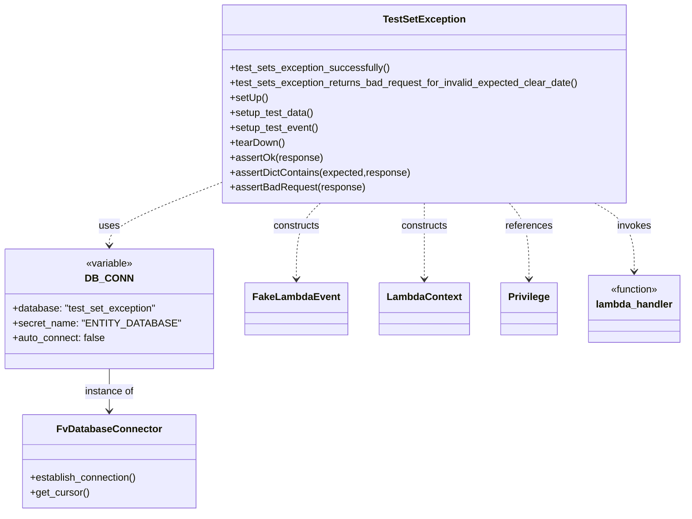

# Diagram: entity_core/entity_service/entity_service_tests/integration_tests/test_set_exception.py


> Auto-generated by Obscura crawlers

## Diagram 1



> SVG rendering failed for this diagram.

## Diagram 2

```mermaid
flowchart TD
setUp[setUp] --> setup_test_data[setup_test_data]
setup_test_data --> insert_entity[INSERT entity INTO DB\nRETURNING id -> entity_internal_id]
insert_entity --> setup_test_event[setup_test_event]
setup_test_event --> call_lambda[Call lambda_handler(event, LambdaContext("set_exception"))]
call_lambda --> check_date{expectedClearDate valid?}
check_date -- Yes --> success[assertOk(response)\nassertDictContains(expected,response)]
check_date -- No --> bad[assertBadRequest(response)\nassert body contains "expectedClearDate in invalid format"]
success --> tearDown[tearDown\nDELETE FROM exception; DELETE FROM entity]
bad --> tearDown
```

> SVG rendering failed for this diagram.
