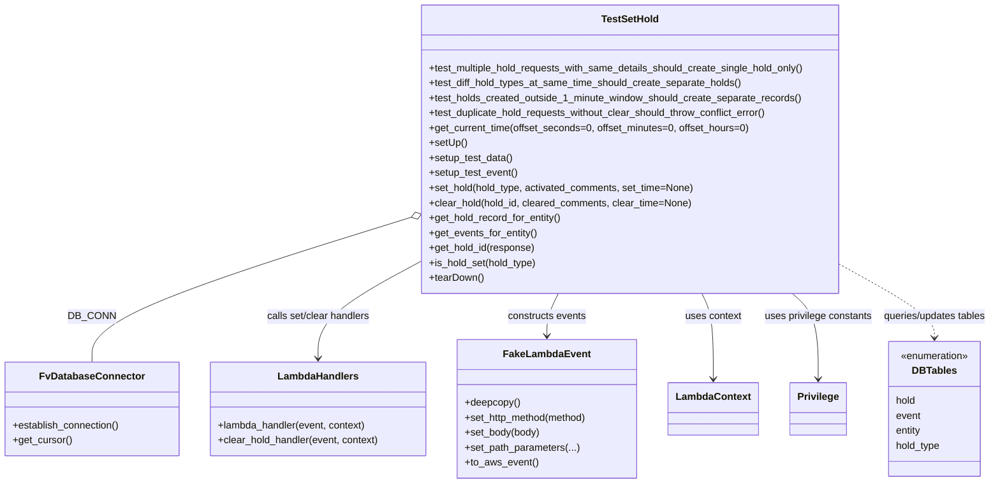
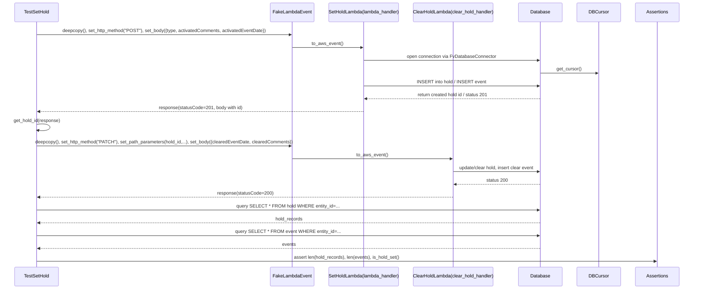

# Diagram: entity_core/entity_service/entity_service_tests/integration_tests/test_set_hold.py

> Auto-generated by Obscura crawlers

## Diagram 1

### SVG

<svg id="container" width="1589.375" xmlns="http://www.w3.org/2000/svg" class="classDiagram" height="774" viewBox="0 0 1589.375 774" role="graphics-document document" aria-roledescription="class"><g><defs><marker id="container_class-aggregationStart" class="marker aggregation class" refX="18" refY="7" markerWidth="190" markerHeight="240" orient="auto"><path d="M 18,7 L9,13 L1,7 L9,1 Z"></path></marker></defs><defs><marker id="container_class-aggregationEnd" class="marker aggregation class" refX="1" refY="7" markerWidth="20" markerHeight="28" orient="auto"><path d="M 18,7 L9,13 L1,7 L9,1 Z"></path></marker></defs><defs><marker id="container_class-extensionStart" class="marker extension class" refX="18" refY="7" markerWidth="190" markerHeight="240" orient="auto"><path d="M 1,7 L18,13 V 1 Z"></path></marker></defs><defs><marker id="container_class-extensionEnd" class="marker extension class" refX="1" refY="7" markerWidth="20" markerHeight="28" orient="auto"><path d="M 1,1 V 13 L18,7 Z"></path></marker></defs><defs><marker id="container_class-compositionStart" class="marker composition class" refX="18" refY="7" markerWidth="190" markerHeight="240" orient="auto"><path d="M 18,7 L9,13 L1,7 L9,1 Z"></path></marker></defs><defs><marker id="container_class-compositionEnd" class="marker composition class" refX="1" refY="7" markerWidth="20" markerHeight="28" orient="auto"><path d="M 18,7 L9,13 L1,7 L9,1 Z"></path></marker></defs><defs><marker id="container_class-dependencyStart" class="marker dependency class" refX="6" refY="7" markerWidth="190" markerHeight="240" orient="auto"><path d="M 5,7 L9,13 L1,7 L9,1 Z"></path></marker></defs><defs><marker id="container_class-dependencyEnd" class="marker dependency class" refX="13" refY="7" markerWidth="20" markerHeight="28" orient="auto"><path d="M 18,7 L9,13 L14,7 L9,1 Z"></path></marker></defs><defs><marker id="container_class-lollipopStart" class="marker lollipop class" refX="13" refY="7" markerWidth="190" markerHeight="240" orient="auto"><circle stroke="black" fill="transparent" cx="7" cy="7" r="6"></circle></marker></defs><defs><marker id="container_class-lollipopEnd" class="marker lollipop class" refX="1" refY="7" markerWidth="190" markerHeight="240" orient="auto"><circle stroke="black" fill="transparent" cx="7" cy="7" r="6"></circle></marker></defs><g class="root"><g class="clusters"></g><g class="edgePaths"><path d="M652.447,349.703L568.087,375.92C483.726,402.136,315.006,454.568,230.645,492.951C146.285,531.333,146.285,555.667,146.285,567.833L146.285,580" id="id_TestSetHold_FvDatabaseConnector_1" class="edge-thickness-normal edge-pattern-solid relation" style=";;;" data-edge="true" data-et="edge" data-id="id_TestSetHold_FvDatabaseConnector_1" data-points="W3sieCI6NjY4LjkxOTkyMTg3NSwieSI6MzQ0LjU4NDI3MzQwMzYxNjg2fSx7IngiOjE0Ni4yODUxNTYyNSwieSI6NTA3fSx7IngiOjE0Ni4yODUxNTYyNSwieSI6NTgwfV0=" marker-start="url(#container_class-aggregationStart)"></path><path d="M668.92,420.889L642.112,435.241C615.303,449.593,561.687,478.296,534.879,503.815C508.07,529.333,508.07,551.667,508.07,562.833L508.07,574" id="id_TestSetHold_LambdaHandlers_2" class="edge-thickness-normal edge-pattern-solid relation" style=";;;" data-edge="true" data-et="edge" data-id="id_TestSetHold_LambdaHandlers_2" data-points="W3sieCI6NjY4LjkxOTkyMTg3NSwieSI6NDIwLjg4OTIyMDUxNzI2MjIzfSx7IngiOjUwOC4wNzAzMTI1LCJ5Ijo1MDd9LHsieCI6NTA4LjA3MDMxMjUsInkiOjU4MH1d" marker-end="url(#container_class-dependencyEnd)"></path><path d="M894.785,470L891.745,476.167C888.705,482.333,882.624,494.667,879.583,506C876.543,517.333,876.543,527.667,876.543,532.833L876.543,538" id="id_TestSetHold_FakeLambdaEvent_3" class="edge-thickness-normal edge-pattern-solid relation" style=";;;" data-edge="true" data-et="edge" data-id="id_TestSetHold_FakeLambdaEvent_3" data-points="W3sieCI6ODk0Ljc4NTQ1NTA0ODk3MzksInkiOjQ3MH0seyJ4Ijo4NzYuNTQyOTY4NzUsInkiOjUwN30seyJ4Ijo4NzYuNTQyOTY4NzUsInkiOjU0NH1d" marker-end="url(#container_class-dependencyEnd)"></path><path d="M1122.57,470L1125.61,476.167C1128.651,482.333,1134.732,494.667,1137.772,517.5C1140.813,540.333,1140.813,573.667,1140.813,590.333L1140.813,607" id="id_TestSetHold_LambdaContext_4" class="edge-thickness-normal edge-pattern-solid relation" style=";;;" data-edge="true" data-et="edge" data-id="id_TestSetHold_LambdaContext_4" data-points="W3sieCI6MTEyMi41NzAwMTM3MDEwMjYsInkiOjQ3MH0seyJ4IjoxMTQwLjgxMjUsInkiOjUwN30seyJ4IjoxMTQwLjgxMjUsInkiOjYxM31d" marker-end="url(#container_class-dependencyEnd)"></path><path d="M1263.208,470L1270.003,476.167C1276.797,482.333,1290.387,494.667,1297.182,517.5C1303.977,540.333,1303.977,573.667,1303.977,590.333L1303.977,607" id="id_TestSetHold_Privilege_5" class="edge-thickness-normal edge-pattern-solid relation" style=";;;" data-edge="true" data-et="edge" data-id="id_TestSetHold_Privilege_5" data-points="W3sieCI6MTI2My4yMDc2OTQ0Mzc5NjY0LCJ5Ijo0NzB9LHsieCI6MTMwMy45NzY1NjI1LCJ5Ijo1MDd9LHsieCI6MTMwMy45NzY1NjI1LCJ5Ijo2MTN9XQ==" marker-end="url(#container_class-dependencyEnd)"></path><path d="M1348.436,425.716L1373.087,439.263C1397.738,452.811,1447.041,479.905,1471.692,499.119C1496.344,518.333,1496.344,529.667,1496.344,535.333L1496.344,541" id="id_TestSetHold_DBTables_6" class="edge-thickness-normal edge-pattern-dashed relation" style=";;;" data-edge="true" data-et="edge" data-id="id_TestSetHold_DBTables_6" data-points="W3sieCI6MTM0OC40MzU1NDY4NzUsInkiOjQyNS43MTYwOTQyNzg3OTEzfSx7IngiOjE0OTYuMzQzNzUsInkiOjUwN30seyJ4IjoxNDk2LjM0Mzc1LCJ5Ijo1NDd9XQ==" marker-end="url(#container_class-dependencyEnd)"></path></g><g class="edgeLabels"><g class="edgeLabel" transform="translate(146.28515625, 507)"><g class="label" data-id="id_TestSetHold_FvDatabaseConnector_1" transform="translate(-34.484375, -12)"><foreignObject width="68.96875" height="24">

DB_CONN

</foreignObject></g></g><g class="edgeLabel" transform="translate(508.0703125, 507)"><g class="label" data-id="id_TestSetHold_LambdaHandlers_2" transform="translate(-85.15625, -12)"><foreignObject width="170.3125" height="24">

calls set/clear handlers

</foreignObject></g></g><g class="edgeLabel" transform="translate(876.54296875, 507)"><g class="label" data-id="id_TestSetHold_FakeLambdaEvent_3" transform="translate(-63.8671875, -12)"><foreignObject width="127.734375" height="24">

constructs events

</foreignObject></g></g><g class="edgeLabel" transform="translate(1140.8125, 507)"><g class="label" data-id="id_TestSetHold_LambdaContext_4" transform="translate(-45.4609375, -12)"><foreignObject width="90.921875" height="24">

uses context

</foreignObject></g></g><g class="edgeLabel" transform="translate(1303.9765625, 507)"><g class="label" data-id="id_TestSetHold_Privilege_5" transform="translate(-87.3359375, -12)"><foreignObject width="174.671875" height="24">

uses privilege constants

</foreignObject></g></g><g class="edgeLabel" transform="translate(1496.34375, 507)"><g class="label" data-id="id_TestSetHold_DBTables_6" transform="translate(-85.03125, -12)"><foreignObject width="170.0625" height="24">

queries/updates tables

</foreignObject></g></g></g><g class="nodes"><g class="node default" id="classId-TestSetHold-0" transform="translate(1008.677734375, 239)"><g class="basic label-container"><path d="M-339.7578125 -231 L339.7578125 -231 L339.7578125 231 L-339.7578125 231" stroke="none" stroke-width="0" fill="#ECECFF" style=""></path><path d="M-339.7578125 -231 C-100.75312635969951 -231, 138.25155978060099 -231, 339.7578125 -231 M-339.7578125 -231 C-195.44613193505742 -231, -51.134451370114846 -231, 339.7578125 -231 M339.7578125 -231 C339.7578125 -82.52187197335556, 339.7578125 65.95625605328888, 339.7578125 231 M339.7578125 -231 C339.7578125 -69.69672158055533, 339.7578125 91.60655683888933, 339.7578125 231 M339.7578125 231 C185.2020306566092 231, 30.646248813218392 231, -339.7578125 231 M339.7578125 231 C114.78860872495386 231, -110.18059505009228 231, -339.7578125 231 M-339.7578125 231 C-339.7578125 129.5519220138125, -339.7578125 28.103844027624945, -339.7578125 -231 M-339.7578125 231 C-339.7578125 84.88135196761155, -339.7578125 -61.2372960647769, -339.7578125 -231" stroke="#9370DB" stroke-width="1.3" fill="none" stroke-dasharray="0 0" style=""></path></g><g class="annotation-group text" transform="translate(0, -207)"></g><g class="label-group text" transform="translate(-44.46875, -207)"><g class="label" style="font-weight: bolder" transform="translate(0,-12)"><foreignObject width="88.9375" height="24">

TestSetHold

</foreignObject></g></g><g class="members-group text" transform="translate(-327.7578125, -159)"></g><g class="methods-group text" transform="translate(-327.7578125, -129)"><g class="label" style="" transform="translate(0,-12)"><foreignObject width="611.046875" height="24">

+test_multiple_hold_requests_with_same_details_should_create_single_hold_only()

</foreignObject></g><g class="label" style="" transform="translate(0,12)"><foreignObject width="505.640625" height="24">

+test_diff_hold_types_at_same_time_should_create_separate_holds()

</foreignObject></g><g class="label" style="" transform="translate(0,36)"><foreignObject width="598.71875" height="24">

+test_holds_created_outside_1_minute_window_should_create_separate_records()

</foreignObject></g><g class="label" style="" transform="translate(0,60)"><foreignObject width="552.34375" height="24">

+test_duplicate_hold_requests_without_clear_should_throw_conflict_error()

</foreignObject></g><g class="label" style="" transform="translate(0,84)"><foreignObject width="518.921875" height="24">

+get_current_time(offset_seconds=0, offset_minutes=0, offset_hours=0)

</foreignObject></g><g class="label" style="" transform="translate(0,108)"><foreignObject width="60.421875" height="24">

+setUp()

</foreignObject></g><g class="label" style="" transform="translate(0,132)"><foreignObject width="134.96875" height="24">

+setup_test_data()

</foreignObject></g><g class="label" style="" transform="translate(0,156)"><foreignObject width="142.671875" height="24">

+setup_test_event()

</foreignObject></g><g class="label" style="" transform="translate(0,180)"><foreignObject width="429.515625" height="24">

+set_hold(hold_type, activated_comments, set_time=None)

</foreignObject></g><g class="label" style="" transform="translate(0,204)"><foreignObject width="423.890625" height="24">

+clear_hold(hold_id, cleared_comments, clear_time=None)

</foreignObject></g><g class="label" style="" transform="translate(0,228)"><foreignObject width="214.203125" height="24">

+get_hold_record_for_entity()

</foreignObject></g><g class="label" style="" transform="translate(0,252)"><foreignObject width="173.796875" height="24">

+get_events_for_entity()

</foreignObject></g><g class="label" style="" transform="translate(0,276)"><foreignObject width="170.84375" height="24">

+get_hold_id(response)

</foreignObject></g><g class="label" style="" transform="translate(0,300)"><foreignObject width="174.21875" height="24">

+is_hold_set(hold_type)

</foreignObject></g><g class="label" style="" transform="translate(0,324)"><foreignObject width="87.75" height="24">

+tearDown()

</foreignObject></g></g><g class="divider" style=""><path d="M-339.7578125 -183 C-119.99703062954043 -183, 99.76375124091913 -183, 339.7578125 -183 M-339.7578125 -183 C-79.86800878580027 -183, 180.02179492839946 -183, 339.7578125 -183" stroke="#9370DB" stroke-width="1.3" fill="none" stroke-dasharray="0 0" style=""></path></g><g class="divider" style=""><path d="M-339.7578125 -159 C-148.3939102853112 -159, 42.96999192937761 -159, 339.7578125 -159 M-339.7578125 -159 C-197.23773117626337 -159, -54.71764985252673 -159, 339.7578125 -159" stroke="#9370DB" stroke-width="1.3" fill="none" stroke-dasharray="0 0" style=""></path></g></g><g class="node default" id="classId-FvDatabaseConnector-1" transform="translate(146.28515625, 655)"><g class="basic label-container"><path d="M-138.28515625 -75 L138.28515625 -75 L138.28515625 75 L-138.28515625 75" stroke="none" stroke-width="0" fill="#ECECFF" style=""></path><path d="M-138.28515625 -75 C-38.96745998986137 -75, 60.350236270277264 -75, 138.28515625 -75 M-138.28515625 -75 C-31.518972774532102 -75, 75.2472107009358 -75, 138.28515625 -75 M138.28515625 -75 C138.28515625 -15.187231314830044, 138.28515625 44.62553737033991, 138.28515625 75 M138.28515625 -75 C138.28515625 -28.087495424485255, 138.28515625 18.82500915102949, 138.28515625 75 M138.28515625 75 C43.38517186441155 75, -51.51481252117691 75, -138.28515625 75 M138.28515625 75 C59.63668732692095 75, -19.0117815961581 75, -138.28515625 75 M-138.28515625 75 C-138.28515625 43.8565802676529, -138.28515625 12.71316053530581, -138.28515625 -75 M-138.28515625 75 C-138.28515625 39.075393322497405, -138.28515625 3.1507866449948096, -138.28515625 -75" stroke="#9370DB" stroke-width="1.3" fill="none" stroke-dasharray="0 0" style=""></path></g><g class="annotation-group text" transform="translate(0, -51)"></g><g class="label-group text" transform="translate(-79.3046875, -51)"><g class="label" style="font-weight: bolder" transform="translate(0,-12)"><foreignObject width="158.609375" height="24">

FvDatabaseConnector

</foreignObject></g></g><g class="members-group text" transform="translate(-126.28515625, -3)"></g><g class="methods-group text" transform="translate(-126.28515625, 27)"><g class="label" style="" transform="translate(0,-12)"><foreignObject width="173.265625" height="24">

+establish_connection()

</foreignObject></g><g class="label" style="" transform="translate(0,12)"><foreignObject width="94.640625" height="24">

+get_cursor()

</foreignObject></g></g><g class="divider" style=""><path d="M-138.28515625 -27 C-53.148245147414215 -27, 31.98866595517157 -27, 138.28515625 -27 M-138.28515625 -27 C-41.43536564115689 -27, 55.414424967686216 -27, 138.28515625 -27" stroke="#9370DB" stroke-width="1.3" fill="none" stroke-dasharray="0 0" style=""></path></g><g class="divider" style=""><path d="M-138.28515625 -3 C-50.861240897825525 -3, 36.56267445434895 -3, 138.28515625 -3 M-138.28515625 -3 C-40.9043100514977 -3, 56.476536147004595 -3, 138.28515625 -3" stroke="#9370DB" stroke-width="1.3" fill="none" stroke-dasharray="0 0" style=""></path></g></g><g class="node default" id="classId-LambdaHandlers-2" transform="translate(508.0703125, 655)"><g class="basic label-container"><path d="M-173.5 -75 L173.5 -75 L173.5 75 L-173.5 75" stroke="none" stroke-width="0" fill="#ECECFF" style=""></path><path d="M-173.5 -75 C-78.26380609879254 -75, 16.972387802414914 -75, 173.5 -75 M-173.5 -75 C-87.39389087916041 -75, -1.2877817583208184 -75, 173.5 -75 M173.5 -75 C173.5 -17.80985962851716, 173.5 39.38028074296568, 173.5 75 M173.5 -75 C173.5 -20.055716357818973, 173.5 34.888567284362054, 173.5 75 M173.5 75 C74.39417506026138 75, -24.71164987947725 75, -173.5 75 M173.5 75 C60.473105404093516 75, -52.55378919181297 75, -173.5 75 M-173.5 75 C-173.5 26.64036118090052, -173.5 -21.71927763819896, -173.5 -75 M-173.5 75 C-173.5 33.64428437781632, -173.5 -7.711431244367361, -173.5 -75" stroke="#9370DB" stroke-width="1.3" fill="none" stroke-dasharray="0 0" style=""></path></g><g class="annotation-group text" transform="translate(0, -51)"></g><g class="label-group text" transform="translate(-61.984375, -51)"><g class="label" style="font-weight: bolder" transform="translate(0,-12)"><foreignObject width="123.96875" height="24">

LambdaHandlers

</foreignObject></g></g><g class="members-group text" transform="translate(-161.5, -3)"></g><g class="methods-group text" transform="translate(-161.5, 27)"><g class="label" style="" transform="translate(0,-12)"><foreignObject width="240.1875" height="24">

+lambda_handler(event, context)

</foreignObject></g><g class="label" style="" transform="translate(0,12)"><foreignObject width="261.015625" height="24">

+clear_hold_handler(event, context)

</foreignObject></g></g><g class="divider" style=""><path d="M-173.5 -27 C-83.2508425386714 -27, 6.998314922657187 -27, 173.5 -27 M-173.5 -27 C-91.83171725408268 -27, -10.163434508165352 -27, 173.5 -27" stroke="#9370DB" stroke-width="1.3" fill="none" stroke-dasharray="0 0" style=""></path></g><g class="divider" style=""><path d="M-173.5 -3 C-83.4994167989729 -3, 6.501166402054196 -3, 173.5 -3 M-173.5 -3 C-69.42579235832615 -3, 34.6484152833477 -3, 173.5 -3" stroke="#9370DB" stroke-width="1.3" fill="none" stroke-dasharray="0 0" style=""></path></g></g><g class="node default" id="classId-FakeLambdaEvent-3" transform="translate(876.54296875, 655)"><g class="basic label-container"><path d="M-144.97265625 -111 L144.97265625 -111 L144.97265625 111 L-144.97265625 111" stroke="none" stroke-width="0" fill="#ECECFF" style=""></path><path d="M-144.97265625 -111 C-54.679454959012645 -111, 35.61374633197471 -111, 144.97265625 -111 M-144.97265625 -111 C-57.046228074600094 -111, 30.88020010079981 -111, 144.97265625 -111 M144.97265625 -111 C144.97265625 -27.714933940961387, 144.97265625 55.570132118077225, 144.97265625 111 M144.97265625 -111 C144.97265625 -47.44049725868272, 144.97265625 16.119005482634563, 144.97265625 111 M144.97265625 111 C76.41378827309894 111, 7.854920296197889 111, -144.97265625 111 M144.97265625 111 C42.917933399045566 111, -59.13678945190887 111, -144.97265625 111 M-144.97265625 111 C-144.97265625 62.066561572466085, -144.97265625 13.13312314493217, -144.97265625 -111 M-144.97265625 111 C-144.97265625 54.88533032996056, -144.97265625 -1.2293393400788801, -144.97265625 -111" stroke="#9370DB" stroke-width="1.3" fill="none" stroke-dasharray="0 0" style=""></path></g><g class="annotation-group text" transform="translate(0, -87)"></g><g class="label-group text" transform="translate(-65.8671875, -87)"><g class="label" style="font-weight: bolder" transform="translate(0,-12)"><foreignObject width="131.734375" height="24">

FakeLambdaEvent

</foreignObject></g></g><g class="members-group text" transform="translate(-132.97265625, -39)"></g><g class="methods-group text" transform="translate(-132.97265625, -9)"><g class="label" style="" transform="translate(0,-12)"><foreignObject width="88.859375" height="24">

+deepcopy()

</foreignObject></g><g class="label" style="" transform="translate(0,12)"><foreignObject width="200.078125" height="24">

+set_http_method(method)

</foreignObject></g><g class="label" style="" transform="translate(0,36)"><foreignObject width="121.21875" height="24">

+set_body(body)

</foreignObject></g><g class="label" style="" transform="translate(0,60)"><foreignObject width="184.15625" height="24">

+set_path_parameters(...)

</foreignObject></g><g class="label" style="" transform="translate(0,84)"><foreignObject width="116.421875" height="24">

+to_aws_event()

</foreignObject></g></g><g class="divider" style=""><path d="M-144.97265625 -63 C-51.69841110329227 -63, 41.575834043415455 -63, 144.97265625 -63 M-144.97265625 -63 C-51.20706019480535 -63, 42.5585358603893 -63, 144.97265625 -63" stroke="#9370DB" stroke-width="1.3" fill="none" stroke-dasharray="0 0" style=""></path></g><g class="divider" style=""><path d="M-144.97265625 -39 C-82.33355465710073 -39, -19.694453064201454 -39, 144.97265625 -39 M-144.97265625 -39 C-52.76884791849247 -39, 39.43496041301506 -39, 144.97265625 -39" stroke="#9370DB" stroke-width="1.3" fill="none" stroke-dasharray="0 0" style=""></path></g></g><g class="node default" id="classId-LambdaContext-4" transform="translate(1140.8125, 655)"><g class="basic label-container"><path d="M-69.296875 -42 L69.296875 -42 L69.296875 42 L-69.296875 42" stroke="none" stroke-width="0" fill="#ECECFF" style=""></path><path d="M-69.296875 -42 C-32.955987887482486 -42, 3.384899225035028 -42, 69.296875 -42 M-69.296875 -42 C-14.42105619821642 -42, 40.45476260356716 -42, 69.296875 -42 M69.296875 -42 C69.296875 -15.644806727862054, 69.296875 10.710386544275892, 69.296875 42 M69.296875 -42 C69.296875 -15.221735012842846, 69.296875 11.556529974314309, 69.296875 42 M69.296875 42 C41.55249024181082 42, 13.808105483621645 42, -69.296875 42 M69.296875 42 C22.350654484804096 42, -24.595566030391808 42, -69.296875 42 M-69.296875 42 C-69.296875 19.87148035678793, -69.296875 -2.2570392864241384, -69.296875 -42 M-69.296875 42 C-69.296875 23.654359545579787, -69.296875 5.308719091159574, -69.296875 -42" stroke="#9370DB" stroke-width="1.3" fill="none" stroke-dasharray="0 0" style=""></path></g><g class="annotation-group text" transform="translate(0, -18)"></g><g class="label-group text" transform="translate(-57.296875, -18)"><g class="label" style="font-weight: bolder" transform="translate(0,-12)"><foreignObject width="114.59375" height="24">

LambdaContext

</foreignObject></g></g><g class="members-group text" transform="translate(-57.296875, 30)"></g><g class="methods-group text" transform="translate(-57.296875, 60)"></g><g class="divider" style=""><path d="M-69.296875 6 C-27.11939087801678 6, 15.05809324396644 6, 69.296875 6 M-69.296875 6 C-36.75886745434788 6, -4.220859908695758 6, 69.296875 6" stroke="#9370DB" stroke-width="1.3" fill="none" stroke-dasharray="0 0" style=""></path></g><g class="divider" style=""><path d="M-69.296875 24 C-21.178160988677405 24, 26.94055302264519 24, 69.296875 24 M-69.296875 24 C-22.87580593303114 24, 23.545263133937723 24, 69.296875 24" stroke="#9370DB" stroke-width="1.3" fill="none" stroke-dasharray="0 0" style=""></path></g></g><g class="node default" id="classId-Privilege-5" transform="translate(1303.9765625, 655)"><g class="basic label-container"><path d="M-43.8671875 -42 L43.8671875 -42 L43.8671875 42 L-43.8671875 42" stroke="none" stroke-width="0" fill="#ECECFF" style=""></path><path d="M-43.8671875 -42 C-10.15433640484234 -42, 23.55851469031532 -42, 43.8671875 -42 M-43.8671875 -42 C-15.79447437869932 -42, 12.27823874260136 -42, 43.8671875 -42 M43.8671875 -42 C43.8671875 -10.542336096064698, 43.8671875 20.915327807870604, 43.8671875 42 M43.8671875 -42 C43.8671875 -18.28625792182244, 43.8671875 5.427484156355121, 43.8671875 42 M43.8671875 42 C21.562899291924992 42, -0.7413889161500151 42, -43.8671875 42 M43.8671875 42 C12.67690890525218 42, -18.51336968949564 42, -43.8671875 42 M-43.8671875 42 C-43.8671875 21.249070361734372, -43.8671875 0.49814072346874383, -43.8671875 -42 M-43.8671875 42 C-43.8671875 18.555245816976083, -43.8671875 -4.889508366047835, -43.8671875 -42" stroke="#9370DB" stroke-width="1.3" fill="none" stroke-dasharray="0 0" style=""></path></g><g class="annotation-group text" transform="translate(0, -18)"></g><g class="label-group text" transform="translate(-31.8671875, -18)"><g class="label" style="font-weight: bolder" transform="translate(0,-12)"><foreignObject width="63.734375" height="24">

Privilege

</foreignObject></g></g><g class="members-group text" transform="translate(-31.8671875, 30)"></g><g class="methods-group text" transform="translate(-31.8671875, 60)"></g><g class="divider" style=""><path d="M-43.8671875 6 C-23.99934129766284 6, -4.131495095325683 6, 43.8671875 6 M-43.8671875 6 C-12.598787238404132 6, 18.669613023191737 6, 43.8671875 6" stroke="#9370DB" stroke-width="1.3" fill="none" stroke-dasharray="0 0" style=""></path></g><g class="divider" style=""><path d="M-43.8671875 24 C-12.95762333779281 24, 17.95194082441438 24, 43.8671875 24 M-43.8671875 24 C-21.262591740218184 24, 1.3420040195636318 24, 43.8671875 24" stroke="#9370DB" stroke-width="1.3" fill="none" stroke-dasharray="0 0" style=""></path></g></g><g class="node default" id="classId-DBTables-6" transform="translate(1496.34375, 655)"><g class="basic label-container"><path d="M-76.12890625 -108 L76.12890625 -108 L76.12890625 108 L-76.12890625 108" stroke="none" stroke-width="0" fill="#ECECFF" style=""></path><path d="M-76.12890625 -108 C-29.384656487961877 -108, 17.359593274076246 -108, 76.12890625 -108 M-76.12890625 -108 C-23.20535087693169 -108, 29.71820449613662 -108, 76.12890625 -108 M76.12890625 -108 C76.12890625 -48.6855417113934, 76.12890625 10.628916577213204, 76.12890625 108 M76.12890625 -108 C76.12890625 -63.82387688918355, 76.12890625 -19.647753778367104, 76.12890625 108 M76.12890625 108 C34.05076316779265 108, -8.027379914414695 108, -76.12890625 108 M76.12890625 108 C29.05016500711868 108, -18.028576235762642 108, -76.12890625 108 M-76.12890625 108 C-76.12890625 29.52499050466129, -76.12890625 -48.95001899067742, -76.12890625 -108 M-76.12890625 108 C-76.12890625 24.91318255718579, -76.12890625 -58.17363488562842, -76.12890625 -108" stroke="#9370DB" stroke-width="1.3" fill="none" stroke-dasharray="0 0" style=""></path></g><g class="annotation-group text" transform="translate(-55.5546875, -84)"><g class="label" style="" transform="translate(0,-12)"><foreignObject width="111.109375" height="24">

«enumeration»

</foreignObject></g></g><g class="label-group text" transform="translate(-33.6875, -60)"><g class="label" style="font-weight: bolder" transform="translate(0,-12)"><foreignObject width="67.375" height="24">

DBTables

</foreignObject></g></g><g class="members-group text" transform="translate(-64.12890625, -12)"><g class="label" style="" transform="translate(0,-12)"><foreignObject width="32.90625" height="24">

hold

</foreignObject></g><g class="label" style="" transform="translate(0,12)"><foreignObject width="40.34375" height="24">

event

</foreignObject></g><g class="label" style="" transform="translate(0,36)"><foreignObject width="41.953125" height="24">

entity

</foreignObject></g><g class="label" style="" transform="translate(0,60)"><foreignObject width="72.703125" height="24">

hold_type

</foreignObject></g></g><g class="methods-group text" transform="translate(-64.12890625, 108)"></g><g class="divider" style=""><path d="M-76.12890625 -36 C-40.08413685428366 -36, -4.039367458567327 -36, 76.12890625 -36 M-76.12890625 -36 C-27.189761361311007 -36, 21.749383527377987 -36, 76.12890625 -36" stroke="#9370DB" stroke-width="1.3" fill="none" stroke-dasharray="0 0" style=""></path></g><g class="divider" style=""><path d="M-76.12890625 84 C-22.87006538212922 84, 30.38877548574156 84, 76.12890625 84 M-76.12890625 84 C-16.779044962643688 84, 42.570816324712624 84, 76.12890625 84" stroke="#9370DB" stroke-width="1.3" fill="none" stroke-dasharray="0 0" style=""></path></g></g></g></g></g></svg>

## Diagram 2

### SVG

<svg id="container" width="2539" xmlns="http://www.w3.org/2000/svg" height="1065" viewBox="-55.5 -10 2539 1065" role="graphics-document document" aria-roledescription="sequence"><g><rect x="2283.5" y="979" fill="#eaeaea" stroke="#666" width="150" height="65" name="Assertions" rx="3" ry="3" class="actor actor-bottom"></rect><text x="2358.5" y="1011.5" dominant-baseline="central" alignment-baseline="central" class="actor actor-box" style="text-anchor: middle; font-size: 16px; font-weight: 400;"><tspan x="2358.5" dy="0">Assertions</tspan></text></g><g><rect x="2083.5" y="979" fill="#eaeaea" stroke="#666" width="150" height="65" name="Cursor" rx="3" ry="3" class="actor actor-bottom"></rect><text x="2158.5" y="1011.5" dominant-baseline="central" alignment-baseline="central" class="actor actor-box" style="text-anchor: middle; font-size: 16px; font-weight: 400;"><tspan x="2158.5" dy="0">DBCursor</tspan></text></g><g><rect x="1883.5" y="979" fill="#eaeaea" stroke="#666" width="150" height="65" name="DB" rx="3" ry="3" class="actor actor-bottom"></rect><text x="1958.5" y="1011.5" dominant-baseline="central" alignment-baseline="central" class="actor actor-box" style="text-anchor: middle; font-size: 16px; font-weight: 400;"><tspan x="1958.5" dy="0">Database</tspan></text></g><g><rect x="1471.5" y="979" fill="#eaeaea" stroke="#666" width="300" height="65" name="ClearLambda" rx="3" ry="3" class="actor actor-bottom"></rect><text x="1621.5" y="1011.5" dominant-baseline="central" alignment-baseline="central" class="actor actor-box" style="text-anchor: middle; font-size: 16px; font-weight: 400;"><tspan x="1621.5" dy="0">ClearHoldLambda(clear_hold_handler)</tspan></text></g><g><rect x="1155.5" y="979" fill="#eaeaea" stroke="#666" width="266" height="65" name="SetLambda" rx="3" ry="3" class="actor actor-bottom"></rect><text x="1288.5" y="1011.5" dominant-baseline="central" alignment-baseline="central" class="actor actor-box" style="text-anchor: middle; font-size: 16px; font-weight: 400;"><tspan x="1288.5" dy="0">SetHoldLambda(lambda_handler)</tspan></text></g><g><rect x="954.5" y="979" fill="#eaeaea" stroke="#666" width="151" height="65" name="Event" rx="3" ry="3" class="actor actor-bottom"></rect><text x="1030" y="1011.5" dominant-baseline="central" alignment-baseline="central" class="actor actor-box" style="text-anchor: middle; font-size: 16px; font-weight: 400;"><tspan x="1030" dy="0">FakeLambdaEvent</tspan></text></g><g><rect x="0" y="979" fill="#eaeaea" stroke="#666" width="150" height="65" name="Test" rx="3" ry="3" class="actor actor-bottom"></rect><text x="75" y="1011.5" dominant-baseline="central" alignment-baseline="central" class="actor actor-box" style="text-anchor: middle; font-size: 16px; font-weight: 400;"><tspan x="75" dy="0">TestSetHold</tspan></text></g><g><line id="actor6" x1="2358.5" y1="65" x2="2358.5" y2="979" class="actor-line 200" stroke-width="0.5px" stroke="#999" name="Assertions"></line><g id="root-6"><rect x="2283.5" y="0" fill="#eaeaea" stroke="#666" width="150" height="65" name="Assertions" rx="3" ry="3" class="actor actor-top"></rect><text x="2358.5" y="32.5" dominant-baseline="central" alignment-baseline="central" class="actor actor-box" style="text-anchor: middle; font-size: 16px; font-weight: 400;"><tspan x="2358.5" dy="0">Assertions</tspan></text></g></g><g><line id="actor5" x1="2158.5" y1="65" x2="2158.5" y2="979" class="actor-line 200" stroke-width="0.5px" stroke="#999" name="Cursor"></line><g id="root-5"><rect x="2083.5" y="0" fill="#eaeaea" stroke="#666" width="150" height="65" name="Cursor" rx="3" ry="3" class="actor actor-top"></rect><text x="2158.5" y="32.5" dominant-baseline="central" alignment-baseline="central" class="actor actor-box" style="text-anchor: middle; font-size: 16px; font-weight: 400;"><tspan x="2158.5" dy="0">DBCursor</tspan></text></g></g><g><line id="actor4" x1="1958.5" y1="65" x2="1958.5" y2="979" class="actor-line 200" stroke-width="0.5px" stroke="#999" name="DB"></line><g id="root-4"><rect x="1883.5" y="0" fill="#eaeaea" stroke="#666" width="150" height="65" name="DB" rx="3" ry="3" class="actor actor-top"></rect><text x="1958.5" y="32.5" dominant-baseline="central" alignment-baseline="central" class="actor actor-box" style="text-anchor: middle; font-size: 16px; font-weight: 400;"><tspan x="1958.5" dy="0">Database</tspan></text></g></g><g><line id="actor3" x1="1621.5" y1="65" x2="1621.5" y2="979" class="actor-line 200" stroke-width="0.5px" stroke="#999" name="ClearLambda"></line><g id="root-3"><rect x="1471.5" y="0" fill="#eaeaea" stroke="#666" width="300" height="65" name="ClearLambda" rx="3" ry="3" class="actor actor-top"></rect><text x="1621.5" y="32.5" dominant-baseline="central" alignment-baseline="central" class="actor actor-box" style="text-anchor: middle; font-size: 16px; font-weight: 400;"><tspan x="1621.5" dy="0">ClearHoldLambda(clear_hold_handler)</tspan></text></g></g><g><line id="actor2" x1="1288.5" y1="65" x2="1288.5" y2="979" class="actor-line 200" stroke-width="0.5px" stroke="#999" name="SetLambda"></line><g id="root-2"><rect x="1155.5" y="0" fill="#eaeaea" stroke="#666" width="266" height="65" name="SetLambda" rx="3" ry="3" class="actor actor-top"></rect><text x="1288.5" y="32.5" dominant-baseline="central" alignment-baseline="central" class="actor actor-box" style="text-anchor: middle; font-size: 16px; font-weight: 400;"><tspan x="1288.5" dy="0">SetHoldLambda(lambda_handler)</tspan></text></g></g><g><line id="actor1" x1="1030" y1="65" x2="1030" y2="979" class="actor-line 200" stroke-width="0.5px" stroke="#999" name="Event"></line><g id="root-1"><rect x="954.5" y="0" fill="#eaeaea" stroke="#666" width="151" height="65" name="Event" rx="3" ry="3" class="actor actor-top"></rect><text x="1030" y="32.5" dominant-baseline="central" alignment-baseline="central" class="actor actor-box" style="text-anchor: middle; font-size: 16px; font-weight: 400;"><tspan x="1030" dy="0">FakeLambdaEvent</tspan></text></g></g><g><line id="actor0" x1="75" y1="65" x2="75" y2="979" class="actor-line 200" stroke-width="0.5px" stroke="#999" name="Test"></line><g id="root-0"><rect x="0" y="0" fill="#eaeaea" stroke="#666" width="150" height="65" name="Test" rx="3" ry="3" class="actor actor-top"></rect><text x="75" y="32.5" dominant-baseline="central" alignment-baseline="central" class="actor actor-box" style="text-anchor: middle; font-size: 16px; font-weight: 400;"><tspan x="75" dy="0">TestSetHold</tspan></text></g></g><g></g><defs><symbol id="computer" width="24" height="24"><path transform="scale(.5)" d="M2 2v13h20v-13h-20zm18 11h-16v-9h16v9zm-10.228 6l.466-1h3.524l.467 1h-4.457zm14.228 3h-24l2-6h2.104l-1.33 4h18.45l-1.297-4h2.073l2 6zm-5-10h-14v-7h14v7z"></path></symbol></defs><defs><symbol id="database" fill-rule="evenodd" clip-rule="evenodd"><path transform="scale(.5)" d="M12.258.001l.256.004.255.005.253.008.251.01.249.012.247.015.246.016.242.019.241.02.239.023.236.024.233.027.231.028.229.031.225.032.223.034.22.036.217.038.214.04.211.041.208.043.205.045.201.046.198.048.194.05.191.051.187.053.183.054.18.056.175.057.172.059.168.06.163.061.16.063.155.064.15.066.074.033.073.033.071.034.07.034.069.035.068.035.067.035.066.035.064.036.064.036.062.036.06.036.06.037.058.037.058.037.055.038.055.038.053.038.052.038.051.039.05.039.048.039.047.039.045.04.044.04.043.04.041.04.04.041.039.041.037.041.036.041.034.041.033.042.032.042.03.042.029.042.027.042.026.043.024.043.023.043.021.043.02.043.018.044.017.043.015.044.013.044.012.044.011.045.009.044.007.045.006.045.004.045.002.045.001.045v17l-.001.045-.002.045-.004.045-.006.045-.007.045-.009.044-.011.045-.012.044-.013.044-.015.044-.017.043-.018.044-.02.043-.021.043-.023.043-.024.043-.026.043-.027.042-.029.042-.03.042-.032.042-.033.042-.034.041-.036.041-.037.041-.039.041-.04.041-.041.04-.043.04-.044.04-.045.04-.047.039-.048.039-.05.039-.051.039-.052.038-.053.038-.055.038-.055.038-.058.037-.058.037-.06.037-.06.036-.062.036-.064.036-.064.036-.066.035-.067.035-.068.035-.069.035-.07.034-.071.034-.073.033-.074.033-.15.066-.155.064-.16.063-.163.061-.168.06-.172.059-.175.057-.18.056-.183.054-.187.053-.191.051-.194.05-.198.048-.201.046-.205.045-.208.043-.211.041-.214.04-.217.038-.22.036-.223.034-.225.032-.229.031-.231.028-.233.027-.236.024-.239.023-.241.02-.242.019-.246.016-.247.015-.249.012-.251.01-.253.008-.255.005-.256.004-.258.001-.258-.001-.256-.004-.255-.005-.253-.008-.251-.01-.249-.012-.247-.015-.245-.016-.243-.019-.241-.02-.238-.023-.236-.024-.234-.027-.231-.028-.228-.031-.226-.032-.223-.034-.22-.036-.217-.038-.214-.04-.211-.041-.208-.043-.204-.045-.201-.046-.198-.048-.195-.05-.19-.051-.187-.053-.184-.054-.179-.056-.176-.057-.172-.059-.167-.06-.164-.061-.159-.063-.155-.064-.151-.066-.074-.033-.072-.033-.072-.034-.07-.034-.069-.035-.068-.035-.067-.035-.066-.035-.064-.036-.063-.036-.062-.036-.061-.036-.06-.037-.058-.037-.057-.037-.056-.038-.055-.038-.053-.038-.052-.038-.051-.039-.049-.039-.049-.039-.046-.039-.046-.04-.044-.04-.043-.04-.041-.04-.04-.041-.039-.041-.037-.041-.036-.041-.034-.041-.033-.042-.032-.042-.03-.042-.029-.042-.027-.042-.026-.043-.024-.043-.023-.043-.021-.043-.02-.043-.018-.044-.017-.043-.015-.044-.013-.044-.012-.044-.011-.045-.009-.044-.007-.045-.006-.045-.004-.045-.002-.045-.001-.045v-17l.001-.045.002-.045.004-.045.006-.045.007-.045.009-.044.011-.045.012-.044.013-.044.015-.044.017-.043.018-.044.02-.043.021-.043.023-.043.024-.043.026-.043.027-.042.029-.042.03-.042.032-.042.033-.042.034-.041.036-.041.037-.041.039-.041.04-.041.041-.04.043-.04.044-.04.046-.04.046-.039.049-.039.049-.039.051-.039.052-.038.053-.038.055-.038.056-.038.057-.037.058-.037.06-.037.061-.036.062-.036.063-.036.064-.036.066-.035.067-.035.068-.035.069-.035.07-.034.072-.034.072-.033.074-.033.151-.066.155-.064.159-.063.164-.061.167-.06.172-.059.176-.057.179-.056.184-.054.187-.053.19-.051.195-.05.198-.048.201-.046.204-.045.208-.043.211-.041.214-.04.217-.038.22-.036.223-.034.226-.032.228-.031.231-.028.234-.027.236-.024.238-.023.241-.02.243-.019.245-.016.247-.015.249-.012.251-.01.253-.008.255-.005.256-.004.258-.001.258.001zm-9.258 20.499v.01l.001.021.003.021.004.022.005.021.006.022.007.022.009.023.01.022.011.023.012.023.013.023.015.023.016.024.017.023.018.024.019.024.021.024.022.025.023.024.024.025.052.049.056.05.061.051.066.051.07.051.075.051.079.052.084.052.088.052.092.052.097.052.102.051.105.052.11.052.114.051.119.051.123.051.127.05.131.05.135.05.139.048.144.049.147.047.152.047.155.047.16.045.163.045.167.043.171.043.176.041.178.041.183.039.187.039.19.037.194.035.197.035.202.033.204.031.209.03.212.029.216.027.219.025.222.024.226.021.23.02.233.018.236.016.24.015.243.012.246.01.249.008.253.005.256.004.259.001.26-.001.257-.004.254-.005.25-.008.247-.011.244-.012.241-.014.237-.016.233-.018.231-.021.226-.021.224-.024.22-.026.216-.027.212-.028.21-.031.205-.031.202-.034.198-.034.194-.036.191-.037.187-.039.183-.04.179-.04.175-.042.172-.043.168-.044.163-.045.16-.046.155-.046.152-.047.148-.048.143-.049.139-.049.136-.05.131-.05.126-.05.123-.051.118-.052.114-.051.11-.052.106-.052.101-.052.096-.052.092-.052.088-.053.083-.051.079-.052.074-.052.07-.051.065-.051.06-.051.056-.05.051-.05.023-.024.023-.025.021-.024.02-.024.019-.024.018-.024.017-.024.015-.023.014-.024.013-.023.012-.023.01-.023.01-.022.008-.022.006-.022.006-.022.004-.022.004-.021.001-.021.001-.021v-4.127l-.077.055-.08.053-.083.054-.085.053-.087.052-.09.052-.093.051-.095.05-.097.05-.1.049-.102.049-.105.048-.106.047-.109.047-.111.046-.114.045-.115.045-.118.044-.12.043-.122.042-.124.042-.126.041-.128.04-.13.04-.132.038-.134.038-.135.037-.138.037-.139.035-.142.035-.143.034-.144.033-.147.032-.148.031-.15.03-.151.03-.153.029-.154.027-.156.027-.158.026-.159.025-.161.024-.162.023-.163.022-.165.021-.166.02-.167.019-.169.018-.169.017-.171.016-.173.015-.173.014-.175.013-.175.012-.177.011-.178.01-.179.008-.179.008-.181.006-.182.005-.182.004-.184.003-.184.002h-.37l-.184-.002-.184-.003-.182-.004-.182-.005-.181-.006-.179-.008-.179-.008-.178-.01-.176-.011-.176-.012-.175-.013-.173-.014-.172-.015-.171-.016-.17-.017-.169-.018-.167-.019-.166-.02-.165-.021-.163-.022-.162-.023-.161-.024-.159-.025-.157-.026-.156-.027-.155-.027-.153-.029-.151-.03-.15-.03-.148-.031-.146-.032-.145-.033-.143-.034-.141-.035-.14-.035-.137-.037-.136-.037-.134-.038-.132-.038-.13-.04-.128-.04-.126-.041-.124-.042-.122-.042-.12-.044-.117-.043-.116-.045-.113-.045-.112-.046-.109-.047-.106-.047-.105-.048-.102-.049-.1-.049-.097-.05-.095-.05-.093-.052-.09-.051-.087-.052-.085-.053-.083-.054-.08-.054-.077-.054v4.127zm0-5.654v.011l.001.021.003.021.004.021.005.022.006.022.007.022.009.022.01.022.011.023.012.023.013.023.015.024.016.023.017.024.018.024.019.024.021.024.022.024.023.025.024.024.052.05.056.05.061.05.066.051.07.051.075.052.079.051.084.052.088.052.092.052.097.052.102.052.105.052.11.051.114.051.119.052.123.05.127.051.131.05.135.049.139.049.144.048.147.048.152.047.155.046.16.045.163.045.167.044.171.042.176.042.178.04.183.04.187.038.19.037.194.036.197.034.202.033.204.032.209.03.212.028.216.027.219.025.222.024.226.022.23.02.233.018.236.016.24.014.243.012.246.01.249.008.253.006.256.003.259.001.26-.001.257-.003.254-.006.25-.008.247-.01.244-.012.241-.015.237-.016.233-.018.231-.02.226-.022.224-.024.22-.025.216-.027.212-.029.21-.03.205-.032.202-.033.198-.035.194-.036.191-.037.187-.039.183-.039.179-.041.175-.042.172-.043.168-.044.163-.045.16-.045.155-.047.152-.047.148-.048.143-.048.139-.05.136-.049.131-.05.126-.051.123-.051.118-.051.114-.052.11-.052.106-.052.101-.052.096-.052.092-.052.088-.052.083-.052.079-.052.074-.051.07-.052.065-.051.06-.05.056-.051.051-.049.023-.025.023-.024.021-.025.02-.024.019-.024.018-.024.017-.024.015-.023.014-.023.013-.024.012-.022.01-.023.01-.023.008-.022.006-.022.006-.022.004-.021.004-.022.001-.021.001-.021v-4.139l-.077.054-.08.054-.083.054-.085.052-.087.053-.09.051-.093.051-.095.051-.097.05-.1.049-.102.049-.105.048-.106.047-.109.047-.111.046-.114.045-.115.044-.118.044-.12.044-.122.042-.124.042-.126.041-.128.04-.13.039-.132.039-.134.038-.135.037-.138.036-.139.036-.142.035-.143.033-.144.033-.147.033-.148.031-.15.03-.151.03-.153.028-.154.028-.156.027-.158.026-.159.025-.161.024-.162.023-.163.022-.165.021-.166.02-.167.019-.169.018-.169.017-.171.016-.173.015-.173.014-.175.013-.175.012-.177.011-.178.009-.179.009-.179.007-.181.007-.182.005-.182.004-.184.003-.184.002h-.37l-.184-.002-.184-.003-.182-.004-.182-.005-.181-.007-.179-.007-.179-.009-.178-.009-.176-.011-.176-.012-.175-.013-.173-.014-.172-.015-.171-.016-.17-.017-.169-.018-.167-.019-.166-.02-.165-.021-.163-.022-.162-.023-.161-.024-.159-.025-.157-.026-.156-.027-.155-.028-.153-.028-.151-.03-.15-.03-.148-.031-.146-.033-.145-.033-.143-.033-.141-.035-.14-.036-.137-.036-.136-.037-.134-.038-.132-.039-.13-.039-.128-.04-.126-.041-.124-.042-.122-.043-.12-.043-.117-.044-.116-.044-.113-.046-.112-.046-.109-.046-.106-.047-.105-.048-.102-.049-.1-.049-.097-.05-.095-.051-.093-.051-.09-.051-.087-.053-.085-.052-.083-.054-.08-.054-.077-.054v4.139zm0-5.666v.011l.001.02.003.022.004.021.005.022.006.021.007.022.009.023.01.022.011.023.012.023.013.023.015.023.016.024.017.024.018.023.019.024.021.025.022.024.023.024.024.025.052.05.056.05.061.05.066.051.07.051.075.052.079.051.084.052.088.052.092.052.097.052.102.052.105.051.11.052.114.051.119.051.123.051.127.05.131.05.135.05.139.049.144.048.147.048.152.047.155.046.16.045.163.045.167.043.171.043.176.042.178.04.183.04.187.038.19.037.194.036.197.034.202.033.204.032.209.03.212.028.216.027.219.025.222.024.226.021.23.02.233.018.236.017.24.014.243.012.246.01.249.008.253.006.256.003.259.001.26-.001.257-.003.254-.006.25-.008.247-.01.244-.013.241-.014.237-.016.233-.018.231-.02.226-.022.224-.024.22-.025.216-.027.212-.029.21-.03.205-.032.202-.033.198-.035.194-.036.191-.037.187-.039.183-.039.179-.041.175-.042.172-.043.168-.044.163-.045.16-.045.155-.047.152-.047.148-.048.143-.049.139-.049.136-.049.131-.051.126-.05.123-.051.118-.052.114-.051.11-.052.106-.052.101-.052.096-.052.092-.052.088-.052.083-.052.079-.052.074-.052.07-.051.065-.051.06-.051.056-.05.051-.049.023-.025.023-.025.021-.024.02-.024.019-.024.018-.024.017-.024.015-.023.014-.024.013-.023.012-.023.01-.022.01-.023.008-.022.006-.022.006-.022.004-.022.004-.021.001-.021.001-.021v-4.153l-.077.054-.08.054-.083.053-.085.053-.087.053-.09.051-.093.051-.095.051-.097.05-.1.049-.102.048-.105.048-.106.048-.109.046-.111.046-.114.046-.115.044-.118.044-.12.043-.122.043-.124.042-.126.041-.128.04-.13.039-.132.039-.134.038-.135.037-.138.036-.139.036-.142.034-.143.034-.144.033-.147.032-.148.032-.15.03-.151.03-.153.028-.154.028-.156.027-.158.026-.159.024-.161.024-.162.023-.163.023-.165.021-.166.02-.167.019-.169.018-.169.017-.171.016-.173.015-.173.014-.175.013-.175.012-.177.01-.178.01-.179.009-.179.007-.181.006-.182.006-.182.004-.184.003-.184.001-.185.001-.185-.001-.184-.001-.184-.003-.182-.004-.182-.006-.181-.006-.179-.007-.179-.009-.178-.01-.176-.01-.176-.012-.175-.013-.173-.014-.172-.015-.171-.016-.17-.017-.169-.018-.167-.019-.166-.02-.165-.021-.163-.023-.162-.023-.161-.024-.159-.024-.157-.026-.156-.027-.155-.028-.153-.028-.151-.03-.15-.03-.148-.032-.146-.032-.145-.033-.143-.034-.141-.034-.14-.036-.137-.036-.136-.037-.134-.038-.132-.039-.13-.039-.128-.041-.126-.041-.124-.041-.122-.043-.12-.043-.117-.044-.116-.044-.113-.046-.112-.046-.109-.046-.106-.048-.105-.048-.102-.048-.1-.05-.097-.049-.095-.051-.093-.051-.09-.052-.087-.052-.085-.053-.083-.053-.08-.054-.077-.054v4.153zm8.74-8.179l-.257.004-.254.005-.25.008-.247.011-.244.012-.241.014-.237.016-.233.018-.231.021-.226.022-.224.023-.22.026-.216.027-.212.028-.21.031-.205.032-.202.033-.198.034-.194.036-.191.038-.187.038-.183.04-.179.041-.175.042-.172.043-.168.043-.163.045-.16.046-.155.046-.152.048-.148.048-.143.048-.139.049-.136.05-.131.05-.126.051-.123.051-.118.051-.114.052-.11.052-.106.052-.101.052-.096.052-.092.052-.088.052-.083.052-.079.052-.074.051-.07.052-.065.051-.06.05-.056.05-.051.05-.023.025-.023.024-.021.024-.02.025-.019.024-.018.024-.017.023-.015.024-.014.023-.013.023-.012.023-.01.023-.01.022-.008.022-.006.023-.006.021-.004.022-.004.021-.001.021-.001.021.001.021.001.021.004.021.004.022.006.021.006.023.008.022.01.022.01.023.012.023.013.023.014.023.015.024.017.023.018.024.019.024.02.025.021.024.023.024.023.025.051.05.056.05.06.05.065.051.07.052.074.051.079.052.083.052.088.052.092.052.096.052.101.052.106.052.11.052.114.052.118.051.123.051.126.051.131.05.136.05.139.049.143.048.148.048.152.048.155.046.16.046.163.045.168.043.172.043.175.042.179.041.183.04.187.038.191.038.194.036.198.034.202.033.205.032.21.031.212.028.216.027.22.026.224.023.226.022.231.021.233.018.237.016.241.014.244.012.247.011.25.008.254.005.257.004.26.001.26-.001.257-.004.254-.005.25-.008.247-.011.244-.012.241-.014.237-.016.233-.018.231-.021.226-.022.224-.023.22-.026.216-.027.212-.028.21-.031.205-.032.202-.033.198-.034.194-.036.191-.038.187-.038.183-.04.179-.041.175-.042.172-.043.168-.043.163-.045.16-.046.155-.046.152-.048.148-.048.143-.048.139-.049.136-.05.131-.05.126-.051.123-.051.118-.051.114-.052.11-.052.106-.052.101-.052.096-.052.092-.052.088-.052.083-.052.079-.052.074-.051.07-.052.065-.051.06-.05.056-.05.051-.05.023-.025.023-.024.021-.024.02-.025.019-.024.018-.024.017-.023.015-.024.014-.023.013-.023.012-.023.01-.023.01-.022.008-.022.006-.023.006-.021.004-.022.004-.021.001-.021.001-.021-.001-.021-.001-.021-.004-.021-.004-.022-.006-.021-.006-.023-.008-.022-.01-.022-.01-.023-.012-.023-.013-.023-.014-.023-.015-.024-.017-.023-.018-.024-.019-.024-.02-.025-.021-.024-.023-.024-.023-.025-.051-.05-.056-.05-.06-.05-.065-.051-.07-.052-.074-.051-.079-.052-.083-.052-.088-.052-.092-.052-.096-.052-.101-.052-.106-.052-.11-.052-.114-.052-.118-.051-.123-.051-.126-.051-.131-.05-.136-.05-.139-.049-.143-.048-.148-.048-.152-.048-.155-.046-.16-.046-.163-.045-.168-.043-.172-.043-.175-.042-.179-.041-.183-.04-.187-.038-.191-.038-.194-.036-.198-.034-.202-.033-.205-.032-.21-.031-.212-.028-.216-.027-.22-.026-.224-.023-.226-.022-.231-.021-.233-.018-.237-.016-.241-.014-.244-.012-.247-.011-.25-.008-.254-.005-.257-.004-.26-.001-.26.001z"></path></symbol></defs><defs><symbol id="clock" width="24" height="24"><path transform="scale(.5)" d="M12 2c5.514 0 10 4.486 10 10s-4.486 10-10 10-10-4.486-10-10 4.486-10 10-10zm0-2c-6.627 0-12 5.373-12 12s5.373 12 12 12 12-5.373 12-12-5.373-12-12-12zm5.848 12.459c.202.038.202.333.001.372-1.907.361-6.045 1.111-6.547 1.111-.719 0-1.301-.582-1.301-1.301 0-.512.77-5.447 1.125-7.445.034-.192.312-.181.343.014l.985 6.238 5.394 1.011z"></path></symbol></defs><defs><marker id="arrowhead" refX="7.9" refY="5" markerUnits="userSpaceOnUse" markerWidth="12" markerHeight="12" orient="auto-start-reverse"><path d="M -1 0 L 10 5 L 0 10 z"></path></marker></defs><defs><marker id="crosshead" markerWidth="15" markerHeight="8" orient="auto" refX="4" refY="4.5"><path fill="none" stroke="#000000" stroke-width="1pt" d="M 1,2 L 6,7 M 6,2 L 1,7" style="stroke-dasharray: 0, 0;"></path></marker></defs><defs><marker id="filled-head" refX="15.5" refY="7" markerWidth="20" markerHeight="28" orient="auto"><path d="M 18,7 L9,13 L14,7 L9,1 Z"></path></marker></defs><defs><marker id="sequencenumber" refX="15" refY="15" markerWidth="60" markerHeight="40" orient="auto"><circle cx="15" cy="15" r="6"></circle></marker></defs><text x="551" y="80" text-anchor="middle" dominant-baseline="middle" alignment-baseline="middle" class="messageText" dy="1em" style="font-size: 16px; font-weight: 400;">deepcopy(), set_http_method("POST"), set_body({type, activatedComments, activatedEventDate})</text><line x1="76" y1="113" x2="1026" y2="113" class="messageLine0" stroke-width="2" stroke="none" marker-end="url(#arrowhead)" style="fill: none;"></line><text x="1158" y="128" text-anchor="middle" dominant-baseline="middle" alignment-baseline="middle" class="messageText" dy="1em" style="font-size: 16px; font-weight: 400;">to_aws_event()</text><line x1="1031" y1="161" x2="1284.5" y2="161" class="messageLine0" stroke-width="2" stroke="none" marker-end="url(#arrowhead)" style="fill: none;"></line><text x="1622" y="176" text-anchor="middle" dominant-baseline="middle" alignment-baseline="middle" class="messageText" dy="1em" style="font-size: 16px; font-weight: 400;">open connection via FvDatabaseConnector</text><line x1="1289.5" y1="209" x2="1954.5" y2="209" class="messageLine0" stroke-width="2" stroke="none" marker-end="url(#arrowhead)" style="fill: none;"></line><text x="2057" y="224" text-anchor="middle" dominant-baseline="middle" alignment-baseline="middle" class="messageText" dy="1em" style="font-size: 16px; font-weight: 400;">get_cursor()</text><line x1="1959.5" y1="257" x2="2154.5" y2="257" class="messageLine0" stroke-width="2" stroke="none" marker-end="url(#arrowhead)" style="fill: none;"></line><text x="1622" y="272" text-anchor="middle" dominant-baseline="middle" alignment-baseline="middle" class="messageText" dy="1em" style="font-size: 16px; font-weight: 400;">INSERT into hold / INSERT event</text><line x1="1289.5" y1="305" x2="1954.5" y2="305" class="messageLine0" stroke-width="2" stroke="none" marker-end="url(#arrowhead)" style="fill: none;"></line><text x="1625" y="320" text-anchor="middle" dominant-baseline="middle" alignment-baseline="middle" class="messageText" dy="1em" style="font-size: 16px; font-weight: 400;">return created hold id / status 201</text><line x1="1957.5" y1="353" x2="1292.5" y2="353" class="messageLine1" stroke-width="2" stroke="none" marker-end="url(#arrowhead)" style="stroke-dasharray: 3, 3; fill: none;"></line><text x="683" y="368" text-anchor="middle" dominant-baseline="middle" alignment-baseline="middle" class="messageText" dy="1em" style="font-size: 16px; font-weight: 400;">response(statusCode=201, body with id)</text><line x1="1287.5" y1="401" x2="79" y2="401" class="messageLine1" stroke-width="2" stroke="none" marker-end="url(#arrowhead)" style="stroke-dasharray: 3, 3; fill: none;"></line><text x="76" y="416" text-anchor="middle" dominant-baseline="middle" alignment-baseline="middle" class="messageText" dy="1em" style="font-size: 16px; font-weight: 400;">get_hold_id(response)</text><path d="M 76,449 C 136,439 136,479 76,469" class="messageLine0" stroke-width="2" stroke="none" marker-end="url(#arrowhead)" style="fill: none;"></path><text x="551" y="494" text-anchor="middle" dominant-baseline="middle" alignment-baseline="middle" class="messageText" dy="1em" style="font-size: 16px; font-weight: 400;">deepcopy(), set_http_method("PATCH"), set_path_parameters(hold_id,...), set_body({clearedEventDate, clearedComments})</text><line x1="76" y1="527" x2="1026" y2="527" class="messageLine0" stroke-width="2" stroke="none" marker-end="url(#arrowhead)" style="fill: none;"></line><text x="1324" y="542" text-anchor="middle" dominant-baseline="middle" alignment-baseline="middle" class="messageText" dy="1em" style="font-size: 16px; font-weight: 400;">to_aws_event()</text><line x1="1031" y1="575" x2="1617.5" y2="575" class="messageLine0" stroke-width="2" stroke="none" marker-end="url(#arrowhead)" style="fill: none;"></line><text x="1789" y="590" text-anchor="middle" dominant-baseline="middle" alignment-baseline="middle" class="messageText" dy="1em" style="font-size: 16px; font-weight: 400;">update/clear hold, insert clear event</text><line x1="1622.5" y1="623" x2="1954.5" y2="623" class="messageLine0" stroke-width="2" stroke="none" marker-end="url(#arrowhead)" style="fill: none;"></line><text x="1792" y="638" text-anchor="middle" dominant-baseline="middle" alignment-baseline="middle" class="messageText" dy="1em" style="font-size: 16px; font-weight: 400;">status 200</text><line x1="1957.5" y1="671" x2="1625.5" y2="671" class="messageLine1" stroke-width="2" stroke="none" marker-end="url(#arrowhead)" style="stroke-dasharray: 3, 3; fill: none;"></line><text x="850" y="686" text-anchor="middle" dominant-baseline="middle" alignment-baseline="middle" class="messageText" dy="1em" style="font-size: 16px; font-weight: 400;">response(statusCode=200)</text><line x1="1620.5" y1="719" x2="79" y2="719" class="messageLine1" stroke-width="2" stroke="none" marker-end="url(#arrowhead)" style="stroke-dasharray: 3, 3; fill: none;"></line><text x="1015" y="734" text-anchor="middle" dominant-baseline="middle" alignment-baseline="middle" class="messageText" dy="1em" style="font-size: 16px; font-weight: 400;">query SELECT * FROM hold WHERE entity_id=...</text><line x1="76" y1="767" x2="1954.5" y2="767" class="messageLine0" stroke-width="2" stroke="none" marker-end="url(#arrowhead)" style="fill: none;"></line><text x="1018" y="782" text-anchor="middle" dominant-baseline="middle" alignment-baseline="middle" class="messageText" dy="1em" style="font-size: 16px; font-weight: 400;">hold_records</text><line x1="1957.5" y1="815" x2="79" y2="815" class="messageLine1" stroke-width="2" stroke="none" marker-end="url(#arrowhead)" style="stroke-dasharray: 3, 3; fill: none;"></line><text x="1015" y="830" text-anchor="middle" dominant-baseline="middle" alignment-baseline="middle" class="messageText" dy="1em" style="font-size: 16px; font-weight: 400;">query SELECT * FROM event WHERE entity_id=...</text><line x1="76" y1="863" x2="1954.5" y2="863" class="messageLine0" stroke-width="2" stroke="none" marker-end="url(#arrowhead)" style="fill: none;"></line><text x="1018" y="878" text-anchor="middle" dominant-baseline="middle" alignment-baseline="middle" class="messageText" dy="1em" style="font-size: 16px; font-weight: 400;">events</text><line x1="1957.5" y1="911" x2="79" y2="911" class="messageLine1" stroke-width="2" stroke="none" marker-end="url(#arrowhead)" style="stroke-dasharray: 3, 3; fill: none;"></line><text x="1215" y="926" text-anchor="middle" dominant-baseline="middle" alignment-baseline="middle" class="messageText" dy="1em" style="font-size: 16px; font-weight: 400;">assert len(hold_records), len(events), is_hold_set()</text><line x1="76" y1="959" x2="2354.5" y2="959" class="messageLine0" stroke-width="2" stroke="none" marker-end="url(#arrowhead)" style="fill: none;"></line></svg>
