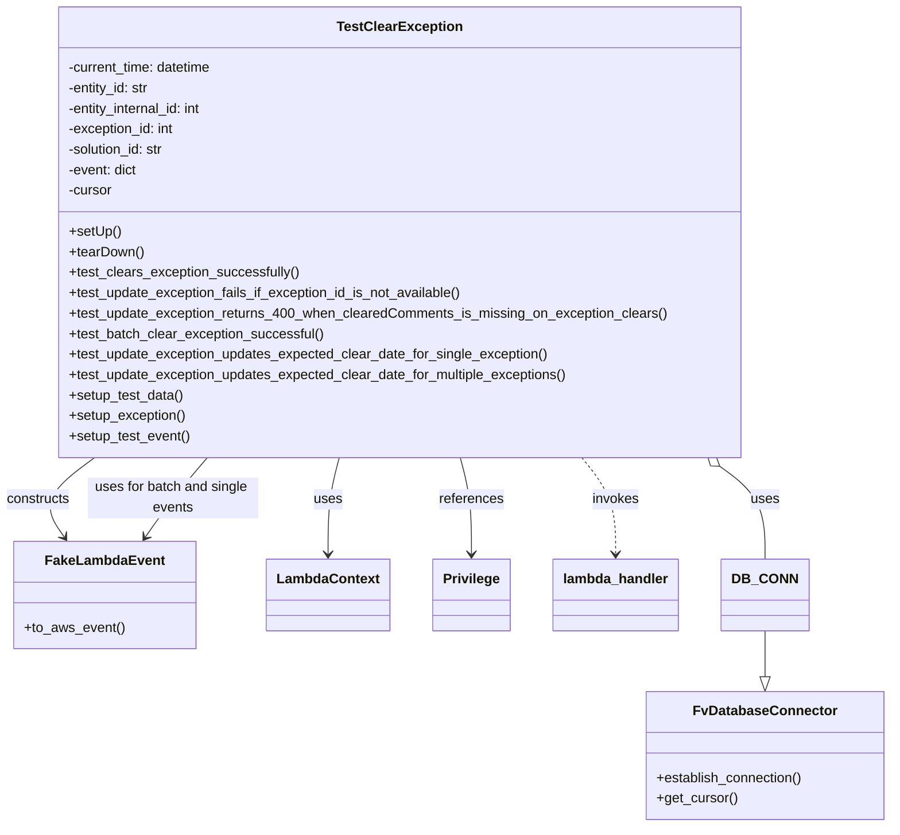
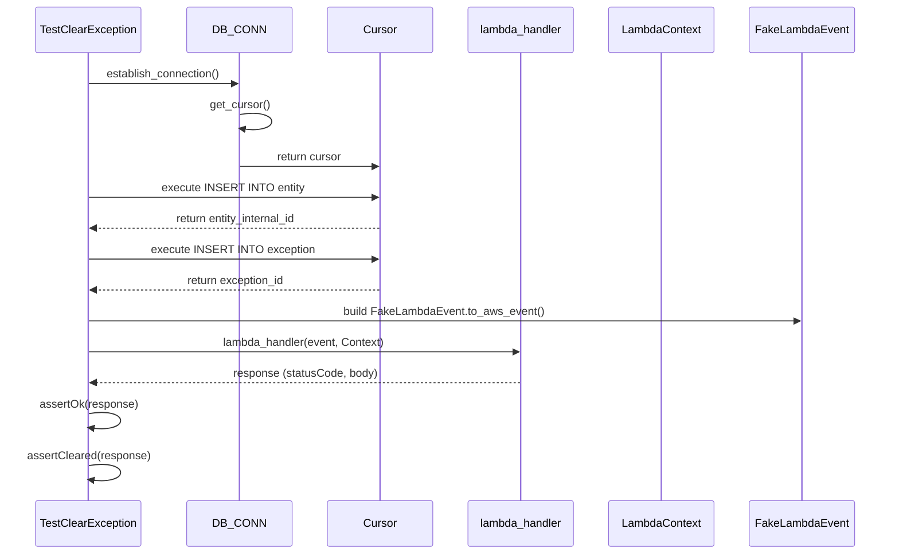

# Diagram: entity_core/entity_service/entity_service_tests/integration_tests/test_update_exception.py

> Auto-generated by Obscura crawlers

## Diagram 1

### SVG

<svg id="container" width="1018.0508422851562" xmlns="http://www.w3.org/2000/svg" class="classDiagram" height="968" viewBox="8.779239654541016 0 1018.0508422851562 968" role="graphics-document document" aria-roledescription="class"><g><defs><marker id="container_class-aggregationStart" class="marker aggregation class" refX="18" refY="7" markerWidth="190" markerHeight="240" orient="auto"><path d="M 18,7 L9,13 L1,7 L9,1 Z"></path></marker></defs><defs><marker id="container_class-aggregationEnd" class="marker aggregation class" refX="1" refY="7" markerWidth="20" markerHeight="28" orient="auto"><path d="M 18,7 L9,13 L1,7 L9,1 Z"></path></marker></defs><defs><marker id="container_class-extensionStart" class="marker extension class" refX="18" refY="7" markerWidth="190" markerHeight="240" orient="auto"><path d="M 1,7 L18,13 V 1 Z"></path></marker></defs><defs><marker id="container_class-extensionEnd" class="marker extension class" refX="1" refY="7" markerWidth="20" markerHeight="28" orient="auto"><path d="M 1,1 V 13 L18,7 Z"></path></marker></defs><defs><marker id="container_class-compositionStart" class="marker composition class" refX="18" refY="7" markerWidth="190" markerHeight="240" orient="auto"><path d="M 18,7 L9,13 L1,7 L9,1 Z"></path></marker></defs><defs><marker id="container_class-compositionEnd" class="marker composition class" refX="1" refY="7" markerWidth="20" markerHeight="28" orient="auto"><path d="M 18,7 L9,13 L1,7 L9,1 Z"></path></marker></defs><defs><marker id="container_class-dependencyStart" class="marker dependency class" refX="6" refY="7" markerWidth="190" markerHeight="240" orient="auto"><path d="M 5,7 L9,13 L1,7 L9,1 Z"></path></marker></defs><defs><marker id="container_class-dependencyEnd" class="marker dependency class" refX="13" refY="7" markerWidth="20" markerHeight="28" orient="auto"><path d="M 18,7 L9,13 L14,7 L9,1 Z"></path></marker></defs><defs><marker id="container_class-lollipopStart" class="marker lollipop class" refX="13" refY="7" markerWidth="190" markerHeight="240" orient="auto"><circle stroke="black" fill="transparent" cx="7" cy="7" r="6"></circle></marker></defs><defs><marker id="container_class-lollipopEnd" class="marker lollipop class" refX="1" refY="7" markerWidth="190" markerHeight="240" orient="auto"><circle stroke="black" fill="transparent" cx="7" cy="7" r="6"></circle></marker></defs><g class="root"><g class="clusters"></g><g class="edgePaths"><path d="M829.232,546.374L837.784,552.812C846.336,559.249,863.441,572.125,871.993,590.229C880.545,608.333,880.545,631.667,880.545,643.333L880.545,655" id="id_TestClearException_DB_CONN_1" class="edge-thickness-normal edge-pattern-solid relation" style=";;;" data-edge="true" data-et="edge" data-id="id_TestClearException_DB_CONN_1" data-points="W3sieCI6ODE1LjQ1MDI4NTc5MjczMTYsInkiOjUzNn0seyJ4Ijo4ODAuNTQ0OTIxODc1LCJ5Ijo1ODV9LHsieCI6ODgwLjU0NDkyMTg3NSwieSI6NjU1fV0=" marker-start="url(#container_class-aggregationStart)"></path><path d="M880.545,739L880.545,746.667C880.545,754.333,880.545,769.667,880.545,778.625C880.545,787.583,880.545,790.167,880.545,791.458L880.545,792.75" id="id_DB_CONN_FvDatabaseConnector_2" class="edge-thickness-normal edge-pattern-solid relation" style=";;;" data-edge="true" data-et="edge" data-id="id_DB_CONN_FvDatabaseConnector_2" data-points="W3sieCI6ODgwLjU0NDkyMTg3NSwieSI6NzM5fSx7IngiOjg4MC41NDQ5MjE4NzUsInkiOjc4NX0seyJ4Ijo4ODAuNTQ0OTIxODc1LCJ5Ijo4MTB9XQ==" marker-end="url(#container_class-extensionEnd)"></path><path d="M111.421,536L100.492,544.167C89.562,552.333,67.703,568.667,61.952,584.183C56.201,599.698,66.559,614.397,71.737,621.746L76.916,629.095" id="id_TestClearException_FakeLambdaEvent_3" class="edge-thickness-normal edge-pattern-solid relation" style=";;;" data-edge="true" data-et="edge" data-id="id_TestClearException_FakeLambdaEvent_3" data-points="W3sieCI6MTExLjQyMTE4MjM1ODIyNjgyLCJ5Ijo1MzZ9LHsieCI6NDUuODQzNzUsInkiOjU4NX0seyJ4Ijo4MC4zNzIwNzAzMTI1LCJ5Ijo2MzR9XQ==" marker-end="url(#container_class-dependencyEnd)"></path><path d="M395.926,536L393.797,544.167C391.669,552.333,387.412,568.667,385.283,587.5C383.154,606.333,383.154,627.667,383.154,638.333L383.154,649" id="id_TestClearException_LambdaContext_4" class="edge-thickness-normal edge-pattern-solid relation" style=";;;" data-edge="true" data-et="edge" data-id="id_TestClearException_LambdaContext_4" data-points="W3sieCI6Mzk1LjkyNTkyNDc3MDM2NzQzLCJ5Ijo1MzZ9LHsieCI6MzgzLjE1NDI5Njg3NSwieSI6NTg1fSx7IngiOjM4My4xNTQyOTY4NzUsInkiOjY1NX1d" marker-end="url(#container_class-dependencyEnd)"></path><path d="M673.428,536L679.883,544.167C686.339,552.333,699.251,568.667,705.706,587.5C712.162,606.333,712.162,627.667,712.162,638.333L712.162,649" id="id_TestClearException_lambda_handler_5" class="edge-thickness-normal edge-pattern-dashed relation" style=";;;" data-edge="true" data-et="edge" data-id="id_TestClearException_lambda_handler_5" data-points="W3sieCI6NjczLjQyNzcyMTg5NDk2OCwieSI6NTM2fSx7IngiOjcxMi4xNjIxMDkzNzUsInkiOjU4NX0seyJ4Ijo3MTIuMTYyMTA5Mzc1LCJ5Ijo2NTV9XQ==" marker-end="url(#container_class-dependencyEnd)"></path><path d="M533.547,536L535.675,544.167C537.804,552.333,542.061,568.667,544.19,587.5C546.318,606.333,546.318,627.667,546.318,638.333L546.318,649" id="id_TestClearException_Privilege_6" class="edge-thickness-normal edge-pattern-solid relation" style=";;;" data-edge="true" data-et="edge" data-id="id_TestClearException_Privilege_6" data-points="W3sieCI6NTMzLjU0NjczMTQ3OTYzMjYsInkiOjUzNn0seyJ4Ijo1NDYuMzE4MzU5Mzc1LCJ5Ijo1ODV9LHsieCI6NTQ2LjMxODM1OTM3NSwieSI6NjU1fV0=" marker-end="url(#container_class-dependencyEnd)"></path><path d="M244.555,536L237.743,544.167C230.932,552.333,217.31,568.667,205.32,584.183C193.33,599.698,182.973,614.397,177.794,621.746L172.615,629.095" id="id_TestClearException_FakeLambdaEvent_7" class="edge-thickness-normal edge-pattern-solid relation" style=";;;" data-edge="true" data-et="edge" data-id="id_TestClearException_FakeLambdaEvent_7" data-points="W3sieCI6MjQ0LjU1NDU2ODkzOTY5NjQ4LCJ5Ijo1MzZ9LHsieCI6MjAzLjY4NzUsInkiOjU4NX0seyJ4IjoxNjkuMTU5MTc5Njg3NSwieSI6NjM0fV0=" marker-end="url(#container_class-dependencyEnd)"></path></g><g class="edgeLabels"><g class="edgeLabel" transform="translate(880.544921875, 585)"><g class="label" data-id="id_TestClearException_DB_CONN_1" transform="translate(-16.4921875, -12)"><foreignObject width="32.984375" height="24">

uses

</foreignObject></g></g><g class="edgeLabel"><g class="label" data-id="id_DB_CONN_FvDatabaseConnector_2" transform="translate(0, 0)"><foreignObject width="0" height="0">

</foreignObject></g></g><g class="edgeLabel" transform="translate(54.62299, 578.44008)"><g class="label" data-id="id_TestClearException_FakeLambdaEvent_3" transform="translate(-37.84375, -12)"><foreignObject width="75.6875" height="24">

constructs

</foreignObject></g></g><g class="edgeLabel" transform="translate(383.154296875, 585)"><g class="label" data-id="id_TestClearException_LambdaContext_4" transform="translate(-16.4921875, -12)"><foreignObject width="32.984375" height="24">

uses

</foreignObject></g></g><g class="edgeLabel" transform="translate(712.162109375, 585)"><g class="label" data-id="id_TestClearException_lambda_handler_5" transform="translate(-27.5859375, -12)"><foreignObject width="55.171875" height="24">

invokes

</foreignObject></g></g><g class="edgeLabel" transform="translate(546.318359375, 585)"><g class="label" data-id="id_TestClearException_Privilege_6" transform="translate(-37.828125, -12)"><foreignObject width="75.65625" height="24">

references

</foreignObject></g></g><g class="edgeLabel" transform="translate(204.92429, 583.51708)"><g class="label" data-id="id_TestClearException_FakeLambdaEvent_7" transform="translate(-100, -24)"><foreignObject width="200" height="48">

uses for batch and single events

</foreignObject></g></g></g><g class="nodes"><g class="node default" id="classId-TestClearException-0" transform="translate(464.736328125, 272)"><g class="basic label-container"><path d="M-397.484375 -264 L397.484375 -264 L397.484375 264 L-397.484375 264" stroke="none" stroke-width="0" fill="#ECECFF" style=""></path><path d="M-397.484375 -264 C-170.89451891648355 -264, 55.6953371670329 -264, 397.484375 -264 M-397.484375 -264 C-161.7455882194277 -264, 73.9931985611446 -264, 397.484375 -264 M397.484375 -264 C397.484375 -63.59695547213565, 397.484375 136.8060890557287, 397.484375 264 M397.484375 -264 C397.484375 -86.44078021763997, 397.484375 91.11843956472006, 397.484375 264 M397.484375 264 C141.44774944160588 264, -114.58887611678824 264, -397.484375 264 M397.484375 264 C197.09184012802567 264, -3.300694743948668 264, -397.484375 264 M-397.484375 264 C-397.484375 110.05865072143169, -397.484375 -43.88269855713662, -397.484375 -264 M-397.484375 264 C-397.484375 56.79657348016053, -397.484375 -150.40685303967894, -397.484375 -264" stroke="#9370DB" stroke-width="1.3" fill="none" stroke-dasharray="0 0" style=""></path></g><g class="annotation-group text" transform="translate(0, -240)"></g><g class="label-group text" transform="translate(-69.734375, -240)"><g class="label" style="font-weight: bolder" transform="translate(0,-12)"><foreignObject width="139.46875" height="24">

TestClearException

</foreignObject></g></g><g class="members-group text" transform="translate(-385.484375, -192)"><g class="label" style="" transform="translate(0,-12)"><foreignObject width="173.046875" height="24">

-current_time: datetime

</foreignObject></g><g class="label" style="" transform="translate(0,12)"><foreignObject width="97.828125" height="24">

-entity_id: str

</foreignObject></g><g class="label" style="" transform="translate(0,36)"><foreignObject width="163.3125" height="24">

-entity_internal_id: int

</foreignObject></g><g class="label" style="" transform="translate(0,60)"><foreignObject width="127.359375" height="24">

-exception_id: int

</foreignObject></g><g class="label" style="" transform="translate(0,84)"><foreignObject width="116.1875" height="24">

-solution_id: str

</foreignObject></g><g class="label" style="" transform="translate(0,108)"><foreignObject width="82.4375" height="24">

-event: dict

</foreignObject></g><g class="label" style="" transform="translate(0,132)"><foreignObject width="52.1875" height="24">

-cursor

</foreignObject></g></g><g class="methods-group text" transform="translate(-385.484375, 0)"><g class="label" style="" transform="translate(0,-12)"><foreignObject width="60.421875" height="24">

+setUp()

</foreignObject></g><g class="label" style="" transform="translate(0,12)"><foreignObject width="87.75" height="24">

+tearDown()

</foreignObject></g><g class="label" style="" transform="translate(0,36)"><foreignObject width="270.171875" height="24">

+test_clears_exception_successfully()

</foreignObject></g><g class="label" style="" transform="translate(0,60)"><foreignObject width="466.734375" height="24">

+test_update_exception_fails_if_exception_id_is_not_available()

</foreignObject></g><g class="label" style="" transform="translate(0,84)"><foreignObject width="701.234375" height="24">

+test_update_exception_returns_400_when_clearedComments_is_missing_on_exception_clears()

</foreignObject></g><g class="label" style="" transform="translate(0,108)"><foreignObject width="298.5" height="24">

+test_batch_clear_exception_successful()

</foreignObject></g><g class="label" style="" transform="translate(0,132)"><foreignObject width="563.90625" height="24">

+test_update_exception_updates_expected_clear_date_for_single_exception()

</foreignObject></g><g class="label" style="" transform="translate(0,156)"><foreignObject width="589.203125" height="24">

+test_update_exception_updates_expected_clear_date_for_multiple_exceptions()

</foreignObject></g><g class="label" style="" transform="translate(0,180)"><foreignObject width="134.96875" height="24">

+setup_test_data()

</foreignObject></g><g class="label" style="" transform="translate(0,204)"><foreignObject width="137.578125" height="24">

+setup_exception()

</foreignObject></g><g class="label" style="" transform="translate(0,228)"><foreignObject width="142.671875" height="24">

+setup_test_event()

</foreignObject></g></g><g class="divider" style=""><path d="M-397.484375 -216 C-224.6371474036504 -216, -51.789919807300805 -216, 397.484375 -216 M-397.484375 -216 C-229.40495314564836 -216, -61.32553129129673 -216, 397.484375 -216" stroke="#9370DB" stroke-width="1.3" fill="none" stroke-dasharray="0 0" style=""></path></g><g class="divider" style=""><path d="M-397.484375 -24 C-211.8837835719188 -24, -26.283192143837596 -24, 397.484375 -24 M-397.484375 -24 C-130.46869611240868 -24, 136.54698277518264 -24, 397.484375 -24" stroke="#9370DB" stroke-width="1.3" fill="none" stroke-dasharray="0 0" style=""></path></g></g><g class="node default" id="classId-FvDatabaseConnector-1" transform="translate(880.544921875, 885)"><g class="basic label-container"><path d="M-138.28515625 -75 L138.28515625 -75 L138.28515625 75 L-138.28515625 75" stroke="none" stroke-width="0" fill="#ECECFF" style=""></path><path d="M-138.28515625 -75 C-69.14487742833946 -75, -0.00459860667891121 -75, 138.28515625 -75 M-138.28515625 -75 C-33.071748080693354 -75, 72.14166008861329 -75, 138.28515625 -75 M138.28515625 -75 C138.28515625 -28.22189606292627, 138.28515625 18.55620787414746, 138.28515625 75 M138.28515625 -75 C138.28515625 -38.18664994842099, 138.28515625 -1.373299896841985, 138.28515625 75 M138.28515625 75 C49.96792213672134 75, -38.34931197655732 75, -138.28515625 75 M138.28515625 75 C41.15101439334147 75, -55.98312746331706 75, -138.28515625 75 M-138.28515625 75 C-138.28515625 28.760560592377487, -138.28515625 -17.478878815245025, -138.28515625 -75 M-138.28515625 75 C-138.28515625 44.62857317351205, -138.28515625 14.257146347024097, -138.28515625 -75" stroke="#9370DB" stroke-width="1.3" fill="none" stroke-dasharray="0 0" style=""></path></g><g class="annotation-group text" transform="translate(0, -51)"></g><g class="label-group text" transform="translate(-79.3046875, -51)"><g class="label" style="font-weight: bolder" transform="translate(0,-12)"><foreignObject width="158.609375" height="24">

FvDatabaseConnector

</foreignObject></g></g><g class="members-group text" transform="translate(-126.28515625, -3)"></g><g class="methods-group text" transform="translate(-126.28515625, 27)"><g class="label" style="" transform="translate(0,-12)"><foreignObject width="173.265625" height="24">

+establish_connection()

</foreignObject></g><g class="label" style="" transform="translate(0,12)"><foreignObject width="94.640625" height="24">

+get_cursor()

</foreignObject></g></g><g class="divider" style=""><path d="M-138.28515625 -27 C-56.699013996677465 -27, 24.88712825664507 -27, 138.28515625 -27 M-138.28515625 -27 C-68.92676309872007 -27, 0.43163005255985354 -27, 138.28515625 -27" stroke="#9370DB" stroke-width="1.3" fill="none" stroke-dasharray="0 0" style=""></path></g><g class="divider" style=""><path d="M-138.28515625 -3 C-39.01794810911623 -3, 60.249260031767534 -3, 138.28515625 -3 M-138.28515625 -3 C-46.54899826063061 -3, 45.18715972873878 -3, 138.28515625 -3" stroke="#9370DB" stroke-width="1.3" fill="none" stroke-dasharray="0 0" style=""></path></g></g><g class="node default" id="classId-FakeLambdaEvent-2" transform="translate(124.765625, 697)"><g class="basic label-container"><path d="M-103.14453125 -63 L103.14453125 -63 L103.14453125 63 L-103.14453125 63" stroke="none" stroke-width="0" fill="#ECECFF" style=""></path><path d="M-103.14453125 -63 C-30.345055625052666 -63, 42.45441999989467 -63, 103.14453125 -63 M-103.14453125 -63 C-36.90524641971585 -63, 29.334038410568297 -63, 103.14453125 -63 M103.14453125 -63 C103.14453125 -37.65166991553933, 103.14453125 -12.30333983107866, 103.14453125 63 M103.14453125 -63 C103.14453125 -20.745970972761008, 103.14453125 21.508058054477985, 103.14453125 63 M103.14453125 63 C22.43760090113925 63, -58.2693294477215 63, -103.14453125 63 M103.14453125 63 C21.741489520961224 63, -59.66155220807755 63, -103.14453125 63 M-103.14453125 63 C-103.14453125 32.709654019365246, -103.14453125 2.4193080387304917, -103.14453125 -63 M-103.14453125 63 C-103.14453125 35.58435038050159, -103.14453125 8.168700761003173, -103.14453125 -63" stroke="#9370DB" stroke-width="1.3" fill="none" stroke-dasharray="0 0" style=""></path></g><g class="annotation-group text" transform="translate(0, -39)"></g><g class="label-group text" transform="translate(-65.8671875, -39)"><g class="label" style="font-weight: bolder" transform="translate(0,-12)"><foreignObject width="131.734375" height="24">

FakeLambdaEvent

</foreignObject></g></g><g class="members-group text" transform="translate(-91.14453125, 9)"></g><g class="methods-group text" transform="translate(-91.14453125, 39)"><g class="label" style="" transform="translate(0,-12)"><foreignObject width="116.421875" height="24">

+to_aws_event()

</foreignObject></g></g><g class="divider" style=""><path d="M-103.14453125 -15 C-49.631364466220134 -15, 3.881802317559732 -15, 103.14453125 -15 M-103.14453125 -15 C-54.18960090399255 -15, -5.234670557985098 -15, 103.14453125 -15" stroke="#9370DB" stroke-width="1.3" fill="none" stroke-dasharray="0 0" style=""></path></g><g class="divider" style=""><path d="M-103.14453125 9 C-29.16185563133095 9, 44.8208199873381 9, 103.14453125 9 M-103.14453125 9 C-45.91817412771715 9, 11.308182994565698 9, 103.14453125 9" stroke="#9370DB" stroke-width="1.3" fill="none" stroke-dasharray="0 0" style=""></path></g></g><g class="node default" id="classId-LambdaContext-3" transform="translate(383.154296875, 697)"><g class="basic label-container"><path d="M-69.296875 -42 L69.296875 -42 L69.296875 42 L-69.296875 42" stroke="none" stroke-width="0" fill="#ECECFF" style=""></path><path d="M-69.296875 -42 C-30.62587977970673 -42, 8.045115440586542 -42, 69.296875 -42 M-69.296875 -42 C-19.131592933231197 -42, 31.033689133537607 -42, 69.296875 -42 M69.296875 -42 C69.296875 -18.487939629444494, 69.296875 5.0241207411110125, 69.296875 42 M69.296875 -42 C69.296875 -12.866670224139597, 69.296875 16.266659551720807, 69.296875 42 M69.296875 42 C35.538485517089725 42, 1.7800960341794507 42, -69.296875 42 M69.296875 42 C38.517789907352594 42, 7.738704814705194 42, -69.296875 42 M-69.296875 42 C-69.296875 19.780791181122847, -69.296875 -2.4384176377543056, -69.296875 -42 M-69.296875 42 C-69.296875 12.24678242696649, -69.296875 -17.50643514606702, -69.296875 -42" stroke="#9370DB" stroke-width="1.3" fill="none" stroke-dasharray="0 0" style=""></path></g><g class="annotation-group text" transform="translate(0, -18)"></g><g class="label-group text" transform="translate(-57.296875, -18)"><g class="label" style="font-weight: bolder" transform="translate(0,-12)"><foreignObject width="114.59375" height="24">

LambdaContext

</foreignObject></g></g><g class="members-group text" transform="translate(-57.296875, 30)"></g><g class="methods-group text" transform="translate(-57.296875, 60)"></g><g class="divider" style=""><path d="M-69.296875 6 C-21.80321371883219 6, 25.69044756233562 6, 69.296875 6 M-69.296875 6 C-14.749105541244425 6, 39.79866391751115 6, 69.296875 6" stroke="#9370DB" stroke-width="1.3" fill="none" stroke-dasharray="0 0" style=""></path></g><g class="divider" style=""><path d="M-69.296875 24 C-40.78523248655439 24, -12.273589973108784 24, 69.296875 24 M-69.296875 24 C-18.51382356304663 24, 32.26922787390674 24, 69.296875 24" stroke="#9370DB" stroke-width="1.3" fill="none" stroke-dasharray="0 0" style=""></path></g></g><g class="node default" id="classId-Privilege-4" transform="translate(546.318359375, 697)"><g class="basic label-container"><path d="M-43.8671875 -42 L43.8671875 -42 L43.8671875 42 L-43.8671875 42" stroke="none" stroke-width="0" fill="#ECECFF" style=""></path><path d="M-43.8671875 -42 C-20.664720631141662 -42, 2.537746237716675 -42, 43.8671875 -42 M-43.8671875 -42 C-12.344917091487986 -42, 19.17735331702403 -42, 43.8671875 -42 M43.8671875 -42 C43.8671875 -23.48304119050298, 43.8671875 -4.966082381005961, 43.8671875 42 M43.8671875 -42 C43.8671875 -23.56892138335549, 43.8671875 -5.137842766710982, 43.8671875 42 M43.8671875 42 C11.511728459198387 42, -20.843730581603225 42, -43.8671875 42 M43.8671875 42 C24.644332207854045 42, 5.421476915708091 42, -43.8671875 42 M-43.8671875 42 C-43.8671875 15.614584471247504, -43.8671875 -10.770831057504992, -43.8671875 -42 M-43.8671875 42 C-43.8671875 14.79576892234865, -43.8671875 -12.4084621553027, -43.8671875 -42" stroke="#9370DB" stroke-width="1.3" fill="none" stroke-dasharray="0 0" style=""></path></g><g class="annotation-group text" transform="translate(0, -18)"></g><g class="label-group text" transform="translate(-31.8671875, -18)"><g class="label" style="font-weight: bolder" transform="translate(0,-12)"><foreignObject width="63.734375" height="24">

Privilege

</foreignObject></g></g><g class="members-group text" transform="translate(-31.8671875, 30)"></g><g class="methods-group text" transform="translate(-31.8671875, 60)"></g><g class="divider" style=""><path d="M-43.8671875 6 C-15.715866831307707 6, 12.435453837384586 6, 43.8671875 6 M-43.8671875 6 C-11.518546132288968 6, 20.830095235422064 6, 43.8671875 6" stroke="#9370DB" stroke-width="1.3" fill="none" stroke-dasharray="0 0" style=""></path></g><g class="divider" style=""><path d="M-43.8671875 24 C-19.17109176178076 24, 5.525003976438477 24, 43.8671875 24 M-43.8671875 24 C-21.821521297375906 24, 0.2241449052481883 24, 43.8671875 24" stroke="#9370DB" stroke-width="1.3" fill="none" stroke-dasharray="0 0" style=""></path></g></g><g class="node default" id="classId-lambda_handler-5" transform="translate(712.162109375, 697)"><g class="basic label-container"><path d="M-71.9765625 -42 L71.9765625 -42 L71.9765625 42 L-71.9765625 42" stroke="none" stroke-width="0" fill="#ECECFF" style=""></path><path d="M-71.9765625 -42 C-26.563903524490613 -42, 18.848755451018775 -42, 71.9765625 -42 M-71.9765625 -42 C-38.079269652417445 -42, -4.181976804834889 -42, 71.9765625 -42 M71.9765625 -42 C71.9765625 -16.701945529519712, 71.9765625 8.596108940960576, 71.9765625 42 M71.9765625 -42 C71.9765625 -22.311296006646042, 71.9765625 -2.622592013292085, 71.9765625 42 M71.9765625 42 C37.18633374941145 42, 2.3961049988229064 42, -71.9765625 42 M71.9765625 42 C27.6126975270923 42, -16.751167445815398 42, -71.9765625 42 M-71.9765625 42 C-71.9765625 14.097027977785174, -71.9765625 -13.805944044429651, -71.9765625 -42 M-71.9765625 42 C-71.9765625 21.127660418844798, -71.9765625 0.25532083768959524, -71.9765625 -42" stroke="#9370DB" stroke-width="1.3" fill="none" stroke-dasharray="0 0" style=""></path></g><g class="annotation-group text" transform="translate(0, -18)"></g><g class="label-group text" transform="translate(-59.9765625, -18)"><g class="label" style="font-weight: bolder" transform="translate(0,-12)"><foreignObject width="119.953125" height="24">

lambda_handler

</foreignObject></g></g><g class="members-group text" transform="translate(-59.9765625, 30)"></g><g class="methods-group text" transform="translate(-59.9765625, 60)"></g><g class="divider" style=""><path d="M-71.9765625 6 C-38.528258733250304 6, -5.079954966500608 6, 71.9765625 6 M-71.9765625 6 C-21.432545879991252 6, 29.111470740017495 6, 71.9765625 6" stroke="#9370DB" stroke-width="1.3" fill="none" stroke-dasharray="0 0" style=""></path></g><g class="divider" style=""><path d="M-71.9765625 24 C-41.08186435434823 24, -10.187166208696453 24, 71.9765625 24 M-71.9765625 24 C-39.574820084293435 24, -7.1730776685868705 24, 71.9765625 24" stroke="#9370DB" stroke-width="1.3" fill="none" stroke-dasharray="0 0" style=""></path></g></g><g class="node default" id="classId-DB_CONN-6" transform="translate(880.544921875, 697)"><g class="basic label-container"><path d="M-46.40625 -42 L46.40625 -42 L46.40625 42 L-46.40625 42" stroke="none" stroke-width="0" fill="#ECECFF" style=""></path><path d="M-46.40625 -42 C-14.581826459382253 -42, 17.242597081235495 -42, 46.40625 -42 M-46.40625 -42 C-22.240176706245826 -42, 1.9258965875083476 -42, 46.40625 -42 M46.40625 -42 C46.40625 -11.69788233266356, 46.40625 18.60423533467288, 46.40625 42 M46.40625 -42 C46.40625 -20.386566019518522, 46.40625 1.2268679609629558, 46.40625 42 M46.40625 42 C26.286971561006126 42, 6.167693122012253 42, -46.40625 42 M46.40625 42 C21.37668452991415 42, -3.6528809401716984 42, -46.40625 42 M-46.40625 42 C-46.40625 16.165374633769773, -46.40625 -9.669250732460455, -46.40625 -42 M-46.40625 42 C-46.40625 23.50814723737225, -46.40625 5.016294474744498, -46.40625 -42" stroke="#9370DB" stroke-width="1.3" fill="none" stroke-dasharray="0 0" style=""></path></g><g class="annotation-group text" transform="translate(0, -18)"></g><g class="label-group text" transform="translate(-34.40625, -18)"><g class="label" style="font-weight: bolder" transform="translate(0,-12)"><foreignObject width="68.8125" height="24">

DB_CONN

</foreignObject></g></g><g class="members-group text" transform="translate(-34.40625, 30)"></g><g class="methods-group text" transform="translate(-34.40625, 60)"></g><g class="divider" style=""><path d="M-46.40625 6 C-16.93288742962583 6, 12.540475140748342 6, 46.40625 6 M-46.40625 6 C-9.558099454398864 6, 27.290051091202272 6, 46.40625 6" stroke="#9370DB" stroke-width="1.3" fill="none" stroke-dasharray="0 0" style=""></path></g><g class="divider" style=""><path d="M-46.40625 24 C-25.708029485190565 24, -5.00980897038113 24, 46.40625 24 M-46.40625 24 C-12.60499533895181 24, 21.19625932209638 24, 46.40625 24" stroke="#9370DB" stroke-width="1.3" fill="none" stroke-dasharray="0 0" style=""></path></g></g></g></g></g></svg>

## Diagram 2

### SVG

<svg id="container" width="1297.5" xmlns="http://www.w3.org/2000/svg" height="837" viewBox="-58 -10 1297.5 837" role="graphics-document document" aria-roledescription="sequence"><g><rect x="1038.5" y="751" fill="#eaeaea" stroke="#666" width="151" height="65" name="Event" rx="3" ry="3" class="actor actor-bottom"></rect><text x="1114" y="783.5" dominant-baseline="central" alignment-baseline="central" class="actor actor-box" style="text-anchor: middle; font-size: 16px; font-weight: 400;"><tspan x="1114" dy="0">FakeLambdaEvent</tspan></text></g><g><rect x="838.5" y="751" fill="#eaeaea" stroke="#666" width="150" height="65" name="Context" rx="3" ry="3" class="actor actor-bottom"></rect><text x="913.5" y="783.5" dominant-baseline="central" alignment-baseline="central" class="actor actor-box" style="text-anchor: middle; font-size: 16px; font-weight: 400;"><tspan x="913.5" dy="0">LambdaContext</tspan></text></g><g><rect x="638.5" y="751" fill="#eaeaea" stroke="#666" width="150" height="65" name="LambdaHandler" rx="3" ry="3" class="actor actor-bottom"></rect><text x="713.5" y="783.5" dominant-baseline="central" alignment-baseline="central" class="actor actor-box" style="text-anchor: middle; font-size: 16px; font-weight: 400;"><tspan x="713.5" dy="0">lambda_handler</tspan></text></g><g><rect x="438.5" y="751" fill="#eaeaea" stroke="#666" width="150" height="65" name="Cursor" rx="3" ry="3" class="actor actor-bottom"></rect><text x="513.5" y="783.5" dominant-baseline="central" alignment-baseline="central" class="actor actor-box" style="text-anchor: middle; font-size: 16px; font-weight: 400;"><tspan x="513.5" dy="0">Cursor</tspan></text></g><g><rect x="238.5" y="751" fill="#eaeaea" stroke="#666" width="150" height="65" name="DB" rx="3" ry="3" class="actor actor-bottom"></rect><text x="313.5" y="783.5" dominant-baseline="central" alignment-baseline="central" class="actor actor-box" style="text-anchor: middle; font-size: 16px; font-weight: 400;"><tspan x="313.5" dy="0">DB_CONN</tspan></text></g><g><rect x="0" y="751" fill="#eaeaea" stroke="#666" width="157" height="65" name="Test" rx="3" ry="3" class="actor actor-bottom"></rect><text x="78.5" y="783.5" dominant-baseline="central" alignment-baseline="central" class="actor actor-box" style="text-anchor: middle; font-size: 16px; font-weight: 400;"><tspan x="78.5" dy="0">TestClearException</tspan></text></g><g><line id="actor5" x1="1114" y1="65" x2="1114" y2="751" class="actor-line 200" stroke-width="0.5px" stroke="#999" name="Event"></line><g id="root-5"><rect x="1038.5" y="0" fill="#eaeaea" stroke="#666" width="151" height="65" name="Event" rx="3" ry="3" class="actor actor-top"></rect><text x="1114" y="32.5" dominant-baseline="central" alignment-baseline="central" class="actor actor-box" style="text-anchor: middle; font-size: 16px; font-weight: 400;"><tspan x="1114" dy="0">FakeLambdaEvent</tspan></text></g></g><g><line id="actor4" x1="913.5" y1="65" x2="913.5" y2="751" class="actor-line 200" stroke-width="0.5px" stroke="#999" name="Context"></line><g id="root-4"><rect x="838.5" y="0" fill="#eaeaea" stroke="#666" width="150" height="65" name="Context" rx="3" ry="3" class="actor actor-top"></rect><text x="913.5" y="32.5" dominant-baseline="central" alignment-baseline="central" class="actor actor-box" style="text-anchor: middle; font-size: 16px; font-weight: 400;"><tspan x="913.5" dy="0">LambdaContext</tspan></text></g></g><g><line id="actor3" x1="713.5" y1="65" x2="713.5" y2="751" class="actor-line 200" stroke-width="0.5px" stroke="#999" name="LambdaHandler"></line><g id="root-3"><rect x="638.5" y="0" fill="#eaeaea" stroke="#666" width="150" height="65" name="LambdaHandler" rx="3" ry="3" class="actor actor-top"></rect><text x="713.5" y="32.5" dominant-baseline="central" alignment-baseline="central" class="actor actor-box" style="text-anchor: middle; font-size: 16px; font-weight: 400;"><tspan x="713.5" dy="0">lambda_handler</tspan></text></g></g><g><line id="actor2" x1="513.5" y1="65" x2="513.5" y2="751" class="actor-line 200" stroke-width="0.5px" stroke="#999" name="Cursor"></line><g id="root-2"><rect x="438.5" y="0" fill="#eaeaea" stroke="#666" width="150" height="65" name="Cursor" rx="3" ry="3" class="actor actor-top"></rect><text x="513.5" y="32.5" dominant-baseline="central" alignment-baseline="central" class="actor actor-box" style="text-anchor: middle; font-size: 16px; font-weight: 400;"><tspan x="513.5" dy="0">Cursor</tspan></text></g></g><g><line id="actor1" x1="313.5" y1="65" x2="313.5" y2="751" class="actor-line 200" stroke-width="0.5px" stroke="#999" name="DB"></line><g id="root-1"><rect x="238.5" y="0" fill="#eaeaea" stroke="#666" width="150" height="65" name="DB" rx="3" ry="3" class="actor actor-top"></rect><text x="313.5" y="32.5" dominant-baseline="central" alignment-baseline="central" class="actor actor-box" style="text-anchor: middle; font-size: 16px; font-weight: 400;"><tspan x="313.5" dy="0">DB_CONN</tspan></text></g></g><g><line id="actor0" x1="78.5" y1="65" x2="78.5" y2="751" class="actor-line 200" stroke-width="0.5px" stroke="#999" name="Test"></line><g id="root-0"><rect x="0" y="0" fill="#eaeaea" stroke="#666" width="157" height="65" name="Test" rx="3" ry="3" class="actor actor-top"></rect><text x="78.5" y="32.5" dominant-baseline="central" alignment-baseline="central" class="actor actor-box" style="text-anchor: middle; font-size: 16px; font-weight: 400;"><tspan x="78.5" dy="0">TestClearException</tspan></text></g></g><g></g><defs><symbol id="computer" width="24" height="24"><path transform="scale(.5)" d="M2 2v13h20v-13h-20zm18 11h-16v-9h16v9zm-10.228 6l.466-1h3.524l.467 1h-4.457zm14.228 3h-24l2-6h2.104l-1.33 4h18.45l-1.297-4h2.073l2 6zm-5-10h-14v-7h14v7z"></path></symbol></defs><defs><symbol id="database" fill-rule="evenodd" clip-rule="evenodd"><path transform="scale(.5)" d="M12.258.001l.256.004.255.005.253.008.251.01.249.012.247.015.246.016.242.019.241.02.239.023.236.024.233.027.231.028.229.031.225.032.223.034.22.036.217.038.214.04.211.041.208.043.205.045.201.046.198.048.194.05.191.051.187.053.183.054.18.056.175.057.172.059.168.06.163.061.16.063.155.064.15.066.074.033.073.033.071.034.07.034.069.035.068.035.067.035.066.035.064.036.064.036.062.036.06.036.06.037.058.037.058.037.055.038.055.038.053.038.052.038.051.039.05.039.048.039.047.039.045.04.044.04.043.04.041.04.04.041.039.041.037.041.036.041.034.041.033.042.032.042.03.042.029.042.027.042.026.043.024.043.023.043.021.043.02.043.018.044.017.043.015.044.013.044.012.044.011.045.009.044.007.045.006.045.004.045.002.045.001.045v17l-.001.045-.002.045-.004.045-.006.045-.007.045-.009.044-.011.045-.012.044-.013.044-.015.044-.017.043-.018.044-.02.043-.021.043-.023.043-.024.043-.026.043-.027.042-.029.042-.03.042-.032.042-.033.042-.034.041-.036.041-.037.041-.039.041-.04.041-.041.04-.043.04-.044.04-.045.04-.047.039-.048.039-.05.039-.051.039-.052.038-.053.038-.055.038-.055.038-.058.037-.058.037-.06.037-.06.036-.062.036-.064.036-.064.036-.066.035-.067.035-.068.035-.069.035-.07.034-.071.034-.073.033-.074.033-.15.066-.155.064-.16.063-.163.061-.168.06-.172.059-.175.057-.18.056-.183.054-.187.053-.191.051-.194.05-.198.048-.201.046-.205.045-.208.043-.211.041-.214.04-.217.038-.22.036-.223.034-.225.032-.229.031-.231.028-.233.027-.236.024-.239.023-.241.02-.242.019-.246.016-.247.015-.249.012-.251.01-.253.008-.255.005-.256.004-.258.001-.258-.001-.256-.004-.255-.005-.253-.008-.251-.01-.249-.012-.247-.015-.245-.016-.243-.019-.241-.02-.238-.023-.236-.024-.234-.027-.231-.028-.228-.031-.226-.032-.223-.034-.22-.036-.217-.038-.214-.04-.211-.041-.208-.043-.204-.045-.201-.046-.198-.048-.195-.05-.19-.051-.187-.053-.184-.054-.179-.056-.176-.057-.172-.059-.167-.06-.164-.061-.159-.063-.155-.064-.151-.066-.074-.033-.072-.033-.072-.034-.07-.034-.069-.035-.068-.035-.067-.035-.066-.035-.064-.036-.063-.036-.062-.036-.061-.036-.06-.037-.058-.037-.057-.037-.056-.038-.055-.038-.053-.038-.052-.038-.051-.039-.049-.039-.049-.039-.046-.039-.046-.04-.044-.04-.043-.04-.041-.04-.04-.041-.039-.041-.037-.041-.036-.041-.034-.041-.033-.042-.032-.042-.03-.042-.029-.042-.027-.042-.026-.043-.024-.043-.023-.043-.021-.043-.02-.043-.018-.044-.017-.043-.015-.044-.013-.044-.012-.044-.011-.045-.009-.044-.007-.045-.006-.045-.004-.045-.002-.045-.001-.045v-17l.001-.045.002-.045.004-.045.006-.045.007-.045.009-.044.011-.045.012-.044.013-.044.015-.044.017-.043.018-.044.02-.043.021-.043.023-.043.024-.043.026-.043.027-.042.029-.042.03-.042.032-.042.033-.042.034-.041.036-.041.037-.041.039-.041.04-.041.041-.04.043-.04.044-.04.046-.04.046-.039.049-.039.049-.039.051-.039.052-.038.053-.038.055-.038.056-.038.057-.037.058-.037.06-.037.061-.036.062-.036.063-.036.064-.036.066-.035.067-.035.068-.035.069-.035.07-.034.072-.034.072-.033.074-.033.151-.066.155-.064.159-.063.164-.061.167-.06.172-.059.176-.057.179-.056.184-.054.187-.053.19-.051.195-.05.198-.048.201-.046.204-.045.208-.043.211-.041.214-.04.217-.038.22-.036.223-.034.226-.032.228-.031.231-.028.234-.027.236-.024.238-.023.241-.02.243-.019.245-.016.247-.015.249-.012.251-.01.253-.008.255-.005.256-.004.258-.001.258.001zm-9.258 20.499v.01l.001.021.003.021.004.022.005.021.006.022.007.022.009.023.01.022.011.023.012.023.013.023.015.023.016.024.017.023.018.024.019.024.021.024.022.025.023.024.024.025.052.049.056.05.061.051.066.051.07.051.075.051.079.052.084.052.088.052.092.052.097.052.102.051.105.052.11.052.114.051.119.051.123.051.127.05.131.05.135.05.139.048.144.049.147.047.152.047.155.047.16.045.163.045.167.043.171.043.176.041.178.041.183.039.187.039.19.037.194.035.197.035.202.033.204.031.209.03.212.029.216.027.219.025.222.024.226.021.23.02.233.018.236.016.24.015.243.012.246.01.249.008.253.005.256.004.259.001.26-.001.257-.004.254-.005.25-.008.247-.011.244-.012.241-.014.237-.016.233-.018.231-.021.226-.021.224-.024.22-.026.216-.027.212-.028.21-.031.205-.031.202-.034.198-.034.194-.036.191-.037.187-.039.183-.04.179-.04.175-.042.172-.043.168-.044.163-.045.16-.046.155-.046.152-.047.148-.048.143-.049.139-.049.136-.05.131-.05.126-.05.123-.051.118-.052.114-.051.11-.052.106-.052.101-.052.096-.052.092-.052.088-.053.083-.051.079-.052.074-.052.07-.051.065-.051.06-.051.056-.05.051-.05.023-.024.023-.025.021-.024.02-.024.019-.024.018-.024.017-.024.015-.023.014-.024.013-.023.012-.023.01-.023.01-.022.008-.022.006-.022.006-.022.004-.022.004-.021.001-.021.001-.021v-4.127l-.077.055-.08.053-.083.054-.085.053-.087.052-.09.052-.093.051-.095.05-.097.05-.1.049-.102.049-.105.048-.106.047-.109.047-.111.046-.114.045-.115.045-.118.044-.12.043-.122.042-.124.042-.126.041-.128.04-.13.04-.132.038-.134.038-.135.037-.138.037-.139.035-.142.035-.143.034-.144.033-.147.032-.148.031-.15.03-.151.03-.153.029-.154.027-.156.027-.158.026-.159.025-.161.024-.162.023-.163.022-.165.021-.166.02-.167.019-.169.018-.169.017-.171.016-.173.015-.173.014-.175.013-.175.012-.177.011-.178.01-.179.008-.179.008-.181.006-.182.005-.182.004-.184.003-.184.002h-.37l-.184-.002-.184-.003-.182-.004-.182-.005-.181-.006-.179-.008-.179-.008-.178-.01-.176-.011-.176-.012-.175-.013-.173-.014-.172-.015-.171-.016-.17-.017-.169-.018-.167-.019-.166-.02-.165-.021-.163-.022-.162-.023-.161-.024-.159-.025-.157-.026-.156-.027-.155-.027-.153-.029-.151-.03-.15-.03-.148-.031-.146-.032-.145-.033-.143-.034-.141-.035-.14-.035-.137-.037-.136-.037-.134-.038-.132-.038-.13-.04-.128-.04-.126-.041-.124-.042-.122-.042-.12-.044-.117-.043-.116-.045-.113-.045-.112-.046-.109-.047-.106-.047-.105-.048-.102-.049-.1-.049-.097-.05-.095-.05-.093-.052-.09-.051-.087-.052-.085-.053-.083-.054-.08-.054-.077-.054v4.127zm0-5.654v.011l.001.021.003.021.004.021.005.022.006.022.007.022.009.022.01.022.011.023.012.023.013.023.015.024.016.023.017.024.018.024.019.024.021.024.022.024.023.025.024.024.052.05.056.05.061.05.066.051.07.051.075.052.079.051.084.052.088.052.092.052.097.052.102.052.105.052.11.051.114.051.119.052.123.05.127.051.131.05.135.049.139.049.144.048.147.048.152.047.155.046.16.045.163.045.167.044.171.042.176.042.178.04.183.04.187.038.19.037.194.036.197.034.202.033.204.032.209.03.212.028.216.027.219.025.222.024.226.022.23.02.233.018.236.016.24.014.243.012.246.01.249.008.253.006.256.003.259.001.26-.001.257-.003.254-.006.25-.008.247-.01.244-.012.241-.015.237-.016.233-.018.231-.02.226-.022.224-.024.22-.025.216-.027.212-.029.21-.03.205-.032.202-.033.198-.035.194-.036.191-.037.187-.039.183-.039.179-.041.175-.042.172-.043.168-.044.163-.045.16-.045.155-.047.152-.047.148-.048.143-.048.139-.05.136-.049.131-.05.126-.051.123-.051.118-.051.114-.052.11-.052.106-.052.101-.052.096-.052.092-.052.088-.052.083-.052.079-.052.074-.051.07-.052.065-.051.06-.05.056-.051.051-.049.023-.025.023-.024.021-.025.02-.024.019-.024.018-.024.017-.024.015-.023.014-.023.013-.024.012-.022.01-.023.01-.023.008-.022.006-.022.006-.022.004-.021.004-.022.001-.021.001-.021v-4.139l-.077.054-.08.054-.083.054-.085.052-.087.053-.09.051-.093.051-.095.051-.097.05-.1.049-.102.049-.105.048-.106.047-.109.047-.111.046-.114.045-.115.044-.118.044-.12.044-.122.042-.124.042-.126.041-.128.04-.13.039-.132.039-.134.038-.135.037-.138.036-.139.036-.142.035-.143.033-.144.033-.147.033-.148.031-.15.03-.151.03-.153.028-.154.028-.156.027-.158.026-.159.025-.161.024-.162.023-.163.022-.165.021-.166.02-.167.019-.169.018-.169.017-.171.016-.173.015-.173.014-.175.013-.175.012-.177.011-.178.009-.179.009-.179.007-.181.007-.182.005-.182.004-.184.003-.184.002h-.37l-.184-.002-.184-.003-.182-.004-.182-.005-.181-.007-.179-.007-.179-.009-.178-.009-.176-.011-.176-.012-.175-.013-.173-.014-.172-.015-.171-.016-.17-.017-.169-.018-.167-.019-.166-.02-.165-.021-.163-.022-.162-.023-.161-.024-.159-.025-.157-.026-.156-.027-.155-.028-.153-.028-.151-.03-.15-.03-.148-.031-.146-.033-.145-.033-.143-.033-.141-.035-.14-.036-.137-.036-.136-.037-.134-.038-.132-.039-.13-.039-.128-.04-.126-.041-.124-.042-.122-.043-.12-.043-.117-.044-.116-.044-.113-.046-.112-.046-.109-.046-.106-.047-.105-.048-.102-.049-.1-.049-.097-.05-.095-.051-.093-.051-.09-.051-.087-.053-.085-.052-.083-.054-.08-.054-.077-.054v4.139zm0-5.666v.011l.001.02.003.022.004.021.005.022.006.021.007.022.009.023.01.022.011.023.012.023.013.023.015.023.016.024.017.024.018.023.019.024.021.025.022.024.023.024.024.025.052.05.056.05.061.05.066.051.07.051.075.052.079.051.084.052.088.052.092.052.097.052.102.052.105.051.11.052.114.051.119.051.123.051.127.05.131.05.135.05.139.049.144.048.147.048.152.047.155.046.16.045.163.045.167.043.171.043.176.042.178.04.183.04.187.038.19.037.194.036.197.034.202.033.204.032.209.03.212.028.216.027.219.025.222.024.226.021.23.02.233.018.236.017.24.014.243.012.246.01.249.008.253.006.256.003.259.001.26-.001.257-.003.254-.006.25-.008.247-.01.244-.013.241-.014.237-.016.233-.018.231-.02.226-.022.224-.024.22-.025.216-.027.212-.029.21-.03.205-.032.202-.033.198-.035.194-.036.191-.037.187-.039.183-.039.179-.041.175-.042.172-.043.168-.044.163-.045.16-.045.155-.047.152-.047.148-.048.143-.049.139-.049.136-.049.131-.051.126-.05.123-.051.118-.052.114-.051.11-.052.106-.052.101-.052.096-.052.092-.052.088-.052.083-.052.079-.052.074-.052.07-.051.065-.051.06-.051.056-.05.051-.049.023-.025.023-.025.021-.024.02-.024.019-.024.018-.024.017-.024.015-.023.014-.024.013-.023.012-.023.01-.022.01-.023.008-.022.006-.022.006-.022.004-.022.004-.021.001-.021.001-.021v-4.153l-.077.054-.08.054-.083.053-.085.053-.087.053-.09.051-.093.051-.095.051-.097.05-.1.049-.102.048-.105.048-.106.048-.109.046-.111.046-.114.046-.115.044-.118.044-.12.043-.122.043-.124.042-.126.041-.128.04-.13.039-.132.039-.134.038-.135.037-.138.036-.139.036-.142.034-.143.034-.144.033-.147.032-.148.032-.15.03-.151.03-.153.028-.154.028-.156.027-.158.026-.159.024-.161.024-.162.023-.163.023-.165.021-.166.02-.167.019-.169.018-.169.017-.171.016-.173.015-.173.014-.175.013-.175.012-.177.01-.178.01-.179.009-.179.007-.181.006-.182.006-.182.004-.184.003-.184.001-.185.001-.185-.001-.184-.001-.184-.003-.182-.004-.182-.006-.181-.006-.179-.007-.179-.009-.178-.01-.176-.01-.176-.012-.175-.013-.173-.014-.172-.015-.171-.016-.17-.017-.169-.018-.167-.019-.166-.02-.165-.021-.163-.023-.162-.023-.161-.024-.159-.024-.157-.026-.156-.027-.155-.028-.153-.028-.151-.03-.15-.03-.148-.032-.146-.032-.145-.033-.143-.034-.141-.034-.14-.036-.137-.036-.136-.037-.134-.038-.132-.039-.13-.039-.128-.041-.126-.041-.124-.041-.122-.043-.12-.043-.117-.044-.116-.044-.113-.046-.112-.046-.109-.046-.106-.048-.105-.048-.102-.048-.1-.05-.097-.049-.095-.051-.093-.051-.09-.052-.087-.052-.085-.053-.083-.053-.08-.054-.077-.054v4.153zm8.74-8.179l-.257.004-.254.005-.25.008-.247.011-.244.012-.241.014-.237.016-.233.018-.231.021-.226.022-.224.023-.22.026-.216.027-.212.028-.21.031-.205.032-.202.033-.198.034-.194.036-.191.038-.187.038-.183.04-.179.041-.175.042-.172.043-.168.043-.163.045-.16.046-.155.046-.152.048-.148.048-.143.048-.139.049-.136.05-.131.05-.126.051-.123.051-.118.051-.114.052-.11.052-.106.052-.101.052-.096.052-.092.052-.088.052-.083.052-.079.052-.074.051-.07.052-.065.051-.06.05-.056.05-.051.05-.023.025-.023.024-.021.024-.02.025-.019.024-.018.024-.017.023-.015.024-.014.023-.013.023-.012.023-.01.023-.01.022-.008.022-.006.023-.006.021-.004.022-.004.021-.001.021-.001.021.001.021.001.021.004.021.004.022.006.021.006.023.008.022.01.022.01.023.012.023.013.023.014.023.015.024.017.023.018.024.019.024.02.025.021.024.023.024.023.025.051.05.056.05.06.05.065.051.07.052.074.051.079.052.083.052.088.052.092.052.096.052.101.052.106.052.11.052.114.052.118.051.123.051.126.051.131.05.136.05.139.049.143.048.148.048.152.048.155.046.16.046.163.045.168.043.172.043.175.042.179.041.183.04.187.038.191.038.194.036.198.034.202.033.205.032.21.031.212.028.216.027.22.026.224.023.226.022.231.021.233.018.237.016.241.014.244.012.247.011.25.008.254.005.257.004.26.001.26-.001.257-.004.254-.005.25-.008.247-.011.244-.012.241-.014.237-.016.233-.018.231-.021.226-.022.224-.023.22-.026.216-.027.212-.028.21-.031.205-.032.202-.033.198-.034.194-.036.191-.038.187-.038.183-.04.179-.041.175-.042.172-.043.168-.043.163-.045.16-.046.155-.046.152-.048.148-.048.143-.048.139-.049.136-.05.131-.05.126-.051.123-.051.118-.051.114-.052.11-.052.106-.052.101-.052.096-.052.092-.052.088-.052.083-.052.079-.052.074-.051.07-.052.065-.051.06-.05.056-.05.051-.05.023-.025.023-.024.021-.024.02-.025.019-.024.018-.024.017-.023.015-.024.014-.023.013-.023.012-.023.01-.023.01-.022.008-.022.006-.023.006-.021.004-.022.004-.021.001-.021.001-.021-.001-.021-.001-.021-.004-.021-.004-.022-.006-.021-.006-.023-.008-.022-.01-.022-.01-.023-.012-.023-.013-.023-.014-.023-.015-.024-.017-.023-.018-.024-.019-.024-.02-.025-.021-.024-.023-.024-.023-.025-.051-.05-.056-.05-.06-.05-.065-.051-.07-.052-.074-.051-.079-.052-.083-.052-.088-.052-.092-.052-.096-.052-.101-.052-.106-.052-.11-.052-.114-.052-.118-.051-.123-.051-.126-.051-.131-.05-.136-.05-.139-.049-.143-.048-.148-.048-.152-.048-.155-.046-.16-.046-.163-.045-.168-.043-.172-.043-.175-.042-.179-.041-.183-.04-.187-.038-.191-.038-.194-.036-.198-.034-.202-.033-.205-.032-.21-.031-.212-.028-.216-.027-.22-.026-.224-.023-.226-.022-.231-.021-.233-.018-.237-.016-.241-.014-.244-.012-.247-.011-.25-.008-.254-.005-.257-.004-.26-.001-.26.001z"></path></symbol></defs><defs><symbol id="clock" width="24" height="24"><path transform="scale(.5)" d="M12 2c5.514 0 10 4.486 10 10s-4.486 10-10 10-10-4.486-10-10 4.486-10 10-10zm0-2c-6.627 0-12 5.373-12 12s5.373 12 12 12 12-5.373 12-12-5.373-12-12-12zm5.848 12.459c.202.038.202.333.001.372-1.907.361-6.045 1.111-6.547 1.111-.719 0-1.301-.582-1.301-1.301 0-.512.77-5.447 1.125-7.445.034-.192.312-.181.343.014l.985 6.238 5.394 1.011z"></path></symbol></defs><defs><marker id="arrowhead" refX="7.9" refY="5" markerUnits="userSpaceOnUse" markerWidth="12" markerHeight="12" orient="auto-start-reverse"><path d="M -1 0 L 10 5 L 0 10 z"></path></marker></defs><defs><marker id="crosshead" markerWidth="15" markerHeight="8" orient="auto" refX="4" refY="4.5"><path fill="none" stroke="#000000" stroke-width="1pt" d="M 1,2 L 6,7 M 6,2 L 1,7" style="stroke-dasharray: 0, 0;"></path></marker></defs><defs><marker id="filled-head" refX="15.5" refY="7" markerWidth="20" markerHeight="28" orient="auto"><path d="M 18,7 L9,13 L14,7 L9,1 Z"></path></marker></defs><defs><marker id="sequencenumber" refX="15" refY="15" markerWidth="60" markerHeight="40" orient="auto"><circle cx="15" cy="15" r="6"></circle></marker></defs><text x="195" y="80" text-anchor="middle" dominant-baseline="middle" alignment-baseline="middle" class="messageText" dy="1em" style="font-size: 16px; font-weight: 400;">establish_connection()</text><line x1="79.5" y1="113" x2="309.5" y2="113" class="messageLine0" stroke-width="2" stroke="none" marker-end="url(#arrowhead)" style="fill: none;"></line><text x="315" y="128" text-anchor="middle" dominant-baseline="middle" alignment-baseline="middle" class="messageText" dy="1em" style="font-size: 16px; font-weight: 400;">get_cursor()</text><path d="M 314.5,161 C 374.5,151 374.5,191 314.5,181" class="messageLine0" stroke-width="2" stroke="none" marker-end="url(#arrowhead)" style="fill: none;"></path><text x="412" y="206" text-anchor="middle" dominant-baseline="middle" alignment-baseline="middle" class="messageText" dy="1em" style="font-size: 16px; font-weight: 400;">return cursor</text><line x1="314.5" y1="239" x2="509.5" y2="239" class="messageLine0" stroke-width="2" stroke="none" marker-end="url(#arrowhead)" style="fill: none;"></line><text x="295" y="254" text-anchor="middle" dominant-baseline="middle" alignment-baseline="middle" class="messageText" dy="1em" style="font-size: 16px; font-weight: 400;">execute INSERT INTO entity</text><line x1="79.5" y1="287" x2="509.5" y2="287" class="messageLine0" stroke-width="2" stroke="none" marker-end="url(#arrowhead)" style="fill: none;"></line><text x="298" y="302" text-anchor="middle" dominant-baseline="middle" alignment-baseline="middle" class="messageText" dy="1em" style="font-size: 16px; font-weight: 400;">return entity_internal_id</text><line x1="512.5" y1="335" x2="82.5" y2="335" class="messageLine1" stroke-width="2" stroke="none" marker-end="url(#arrowhead)" style="stroke-dasharray: 3, 3; fill: none;"></line><text x="295" y="350" text-anchor="middle" dominant-baseline="middle" alignment-baseline="middle" class="messageText" dy="1em" style="font-size: 16px; font-weight: 400;">execute INSERT INTO exception</text><line x1="79.5" y1="383" x2="509.5" y2="383" class="messageLine0" stroke-width="2" stroke="none" marker-end="url(#arrowhead)" style="fill: none;"></line><text x="298" y="398" text-anchor="middle" dominant-baseline="middle" alignment-baseline="middle" class="messageText" dy="1em" style="font-size: 16px; font-weight: 400;">return exception_id</text><line x1="512.5" y1="431" x2="82.5" y2="431" class="messageLine1" stroke-width="2" stroke="none" marker-end="url(#arrowhead)" style="stroke-dasharray: 3, 3; fill: none;"></line><text x="595" y="446" text-anchor="middle" dominant-baseline="middle" alignment-baseline="middle" class="messageText" dy="1em" style="font-size: 16px; font-weight: 400;">build FakeLambdaEvent.to_aws_event()</text><line x1="79.5" y1="479" x2="1110" y2="479" class="messageLine0" stroke-width="2" stroke="none" marker-end="url(#arrowhead)" style="fill: none;"></line><text x="395" y="494" text-anchor="middle" dominant-baseline="middle" alignment-baseline="middle" class="messageText" dy="1em" style="font-size: 16px; font-weight: 400;">lambda_handler(event, Context)</text><line x1="79.5" y1="527" x2="709.5" y2="527" class="messageLine0" stroke-width="2" stroke="none" marker-end="url(#arrowhead)" style="fill: none;"></line><text x="398" y="542" text-anchor="middle" dominant-baseline="middle" alignment-baseline="middle" class="messageText" dy="1em" style="font-size: 16px; font-weight: 400;">response (statusCode, body)</text><line x1="712.5" y1="575" x2="82.5" y2="575" class="messageLine1" stroke-width="2" stroke="none" marker-end="url(#arrowhead)" style="stroke-dasharray: 3, 3; fill: none;"></line><text x="80" y="590" text-anchor="middle" dominant-baseline="middle" alignment-baseline="middle" class="messageText" dy="1em" style="font-size: 16px; font-weight: 400;">assertOk(response)</text><path d="M 79.5,623 C 139.5,613 139.5,653 79.5,643" class="messageLine0" stroke-width="2" stroke="none" marker-end="url(#arrowhead)" style="fill: none;"></path><text x="80" y="668" text-anchor="middle" dominant-baseline="middle" alignment-baseline="middle" class="messageText" dy="1em" style="font-size: 16px; font-weight: 400;">assertCleared(response)</text><path d="M 79.5,701 C 139.5,691 139.5,731 79.5,721" class="messageLine0" stroke-width="2" stroke="none" marker-end="url(#arrowhead)" style="fill: none;"></path></svg>
