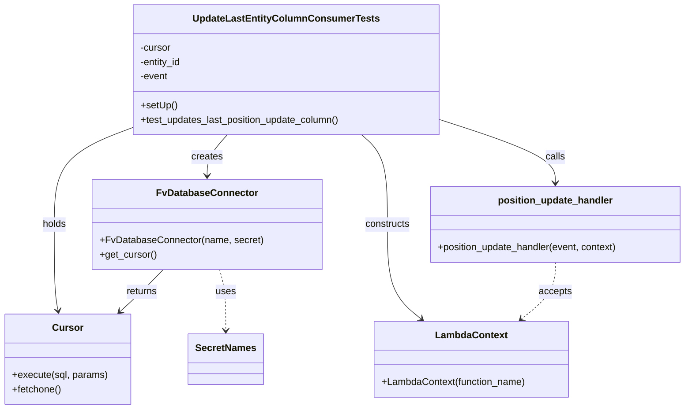
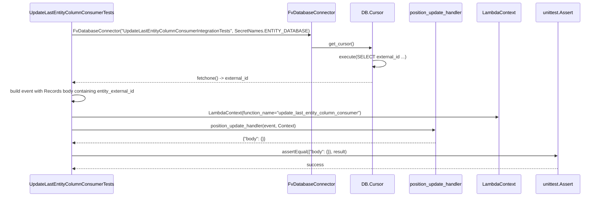

# Diagram: entity_core/entity_service/entity_service_tests/integration_tests/test_update_last_entity_column_consumer.py

> Auto-generated by Obscura crawlers

## Diagram 1

### SVG

<svg id="container" width="1135.16796875" xmlns="http://www.w3.org/2000/svg" class="classDiagram" height="680" viewBox="0 0 1135.16796875 680" role="graphics-document document" aria-roledescription="class"><g><defs><marker id="container_class-aggregationStart" class="marker aggregation class" refX="18" refY="7" markerWidth="190" markerHeight="240" orient="auto"><path d="M 18,7 L9,13 L1,7 L9,1 Z"></path></marker></defs><defs><marker id="container_class-aggregationEnd" class="marker aggregation class" refX="1" refY="7" markerWidth="20" markerHeight="28" orient="auto"><path d="M 18,7 L9,13 L1,7 L9,1 Z"></path></marker></defs><defs><marker id="container_class-extensionStart" class="marker extension class" refX="18" refY="7" markerWidth="190" markerHeight="240" orient="auto"><path d="M 1,7 L18,13 V 1 Z"></path></marker></defs><defs><marker id="container_class-extensionEnd" class="marker extension class" refX="1" refY="7" markerWidth="20" markerHeight="28" orient="auto"><path d="M 1,1 V 13 L18,7 Z"></path></marker></defs><defs><marker id="container_class-compositionStart" class="marker composition class" refX="18" refY="7" markerWidth="190" markerHeight="240" orient="auto"><path d="M 18,7 L9,13 L1,7 L9,1 Z"></path></marker></defs><defs><marker id="container_class-compositionEnd" class="marker composition class" refX="1" refY="7" markerWidth="20" markerHeight="28" orient="auto"><path d="M 18,7 L9,13 L1,7 L9,1 Z"></path></marker></defs><defs><marker id="container_class-dependencyStart" class="marker dependency class" refX="6" refY="7" markerWidth="190" markerHeight="240" orient="auto"><path d="M 5,7 L9,13 L1,7 L9,1 Z"></path></marker></defs><defs><marker id="container_class-dependencyEnd" class="marker dependency class" refX="13" refY="7" markerWidth="20" markerHeight="28" orient="auto"><path d="M 18,7 L9,13 L14,7 L9,1 Z"></path></marker></defs><defs><marker id="container_class-lollipopStart" class="marker lollipop class" refX="13" refY="7" markerWidth="190" markerHeight="240" orient="auto"><circle stroke="black" fill="transparent" cx="7" cy="7" r="6"></circle></marker></defs><defs><marker id="container_class-lollipopEnd" class="marker lollipop class" refX="1" refY="7" markerWidth="190" markerHeight="240" orient="auto"><circle stroke="black" fill="transparent" cx="7" cy="7" r="6"></circle></marker></defs><g class="root"><g class="clusters"></g><g class="edgePaths"><path d="M370.487,224L364.996,230.167C359.505,236.333,348.523,248.667,343.032,260C337.541,271.333,337.541,281.667,337.541,286.833L337.541,292" id="id_UpdateLastEntityColumnConsumerTests_FvDatabaseConnector_1" class="edge-thickness-normal edge-pattern-solid relation" style=";;;" data-edge="true" data-et="edge" data-id="id_UpdateLastEntityColumnConsumerTests_FvDatabaseConnector_1" data-points="W3sieCI6MzcwLjQ4NjY2NDg3MDY4OTY1LCJ5IjoyMjR9LHsieCI6MzM3LjU0MTAxNTYyNSwieSI6MjYxfSx7IngiOjMzNy41NDEwMTU2MjUsInkiOjI5OH1d" marker-end="url(#container_class-dependencyEnd)"></path><path d="M213.664,212.801L192.669,220.834C171.674,228.867,129.685,244.934,108.69,271.633C87.695,298.333,87.695,335.667,87.695,373C87.695,410.333,87.695,447.667,88.767,471.521C89.838,495.375,91.981,505.749,93.052,510.937L94.124,516.124" id="id_UpdateLastEntityColumnConsumerTests_Cursor_2" class="edge-thickness-normal edge-pattern-solid relation" style=";;;" data-edge="true" data-et="edge" data-id="id_UpdateLastEntityColumnConsumerTests_Cursor_2" data-points="W3sieCI6MjEzLjY2NDA2MjUsInkiOjIxMi44MDA2ODY1MDU5MzIyfSx7IngiOjg3LjY5NTMxMjUsInkiOjI2MX0seyJ4Ijo4Ny42OTUzMTI1LCJ5IjozNzN9LHsieCI6ODcuNjk1MzEyNSwieSI6NDg1fSx7IngiOjk1LjMzNzQwMjM0Mzc1LCJ5Ijo1MjJ9XQ==" marker-end="url(#container_class-dependencyEnd)"></path><path d="M719.641,197.491L752.501,208.076C785.362,218.661,851.083,239.83,883.944,257.582C916.805,275.333,916.805,289.667,916.805,296.833L916.805,304" id="id_UpdateLastEntityColumnConsumerTests_position_update_handler_3" class="edge-thickness-normal edge-pattern-solid relation" style=";;;" data-edge="true" data-et="edge" data-id="id_UpdateLastEntityColumnConsumerTests_position_update_handler_3" data-points="W3sieCI6NzE5LjY0MDYyNSwieSI6MTk3LjQ5MDg1ODEyOTYyNjI1fSx7IngiOjkxNi44MDQ2ODc1LCJ5IjoyNjF9LHsieCI6OTE2LjgwNDY4NzUsInkiOjMxMH1d" marker-end="url(#container_class-dependencyEnd)"></path><path d="M590.998,224L598.098,230.167C605.198,236.333,619.398,248.667,626.498,273.5C633.598,298.333,633.598,335.667,633.598,373C633.598,410.333,633.598,447.667,643.139,473.88C652.68,500.093,671.761,515.185,681.302,522.732L690.843,530.278" id="id_UpdateLastEntityColumnConsumerTests_LambdaContext_4" class="edge-thickness-normal edge-pattern-solid relation" style=";;;" data-edge="true" data-et="edge" data-id="id_UpdateLastEntityColumnConsumerTests_LambdaContext_4" data-points="W3sieCI6NTkwLjk5NzgxNzg4NzkzMSwieSI6MjI0fSx7IngiOjYzMy41OTc2NTYyNSwieSI6MjYxfSx7IngiOjYzMy41OTc2NTYyNSwieSI6MzczfSx7IngiOjYzMy41OTc2NTYyNSwieSI6NDg1fSx7IngiOjY5NS41NDkxOTQzMzU5Mzc1LCJ5Ijo1MzR9XQ==" marker-end="url(#container_class-dependencyEnd)"></path><path d="M266.271,448L260.411,454.167C254.551,460.333,242.831,472.667,231.08,484.319C219.33,495.97,207.548,506.941,201.657,512.426L195.766,517.911" id="id_FvDatabaseConnector_Cursor_5" class="edge-thickness-normal edge-pattern-solid relation" style=";;;" data-edge="true" data-et="edge" data-id="id_FvDatabaseConnector_Cursor_5" data-points="W3sieCI6MjY2LjI3MTEzNTYwMjY3ODU2LCJ5Ijo0NDh9LHsieCI6MjMxLjExMTMyODEyNSwieSI6NDg1fSx7IngiOjE5MS4zNzQ5MTI4MDY5MTk2NCwieSI6NTIyfV0=" marker-end="url(#container_class-dependencyEnd)"></path><path d="M358.554,448L360.281,454.167C362.009,460.333,365.465,472.667,367.192,489.5C368.92,506.333,368.92,527.667,368.92,538.333L368.92,549" id="id_FvDatabaseConnector_SecretNames_6" class="edge-thickness-normal edge-pattern-dashed relation" style=";;;" data-edge="true" data-et="edge" data-id="id_FvDatabaseConnector_SecretNames_6" data-points="W3sieCI6MzU4LjU1MzY3NjA2MDI2NzgzLCJ5Ijo0NDh9LHsieCI6MzY4LjkxOTkyMTg3NSwieSI6NDg1fSx7IngiOjM2OC45MTk5MjE4NzUsInkiOjU1NX1d" marker-end="url(#container_class-dependencyEnd)"></path><path d="M916.805,436L916.805,444.167C916.805,452.333,916.805,468.667,907.264,484.38C897.723,500.093,878.641,515.185,869.1,522.732L859.559,530.278" id="id_position_update_handler_LambdaContext_7" class="edge-thickness-normal edge-pattern-dashed relation" style=";;;" data-edge="true" data-et="edge" data-id="id_position_update_handler_LambdaContext_7" data-points="W3sieCI6OTE2LjgwNDY4NzUsInkiOjQzNn0seyJ4Ijo5MTYuODA0Njg3NSwieSI6NDg1fSx7IngiOjg1NC44NTMxNDk0MTQwNjI1LCJ5Ijo1MzR9XQ==" marker-end="url(#container_class-dependencyEnd)"></path></g><g class="edgeLabels"><g class="edgeLabel" transform="translate(337.541015625, 261)"><g class="label" data-id="id_UpdateLastEntityColumnConsumerTests_FvDatabaseConnector_1" transform="translate(-26.171875, -12)"><foreignObject width="52.34375" height="24">

creates

</foreignObject></g></g><g class="edgeLabel" transform="translate(87.6953125, 373)"><g class="label" data-id="id_UpdateLastEntityColumnConsumerTests_Cursor_2" transform="translate(-20.1875, -12)"><foreignObject width="40.375" height="24">

holds

</foreignObject></g></g><g class="edgeLabel" transform="translate(916.8046875, 261)"><g class="label" data-id="id_UpdateLastEntityColumnConsumerTests_position_update_handler_3" transform="translate(-16.4453125, -12)"><foreignObject width="32.890625" height="24">

calls

</foreignObject></g></g><g class="edgeLabel" transform="translate(633.59765625, 373)"><g class="label" data-id="id_UpdateLastEntityColumnConsumerTests_LambdaContext_4" transform="translate(-37.84375, -12)"><foreignObject width="75.6875" height="24">

constructs

</foreignObject></g></g><g class="edgeLabel" transform="translate(231.111328125, 485)"><g class="label" data-id="id_FvDatabaseConnector_Cursor_5" transform="translate(-26.265625, -12)"><foreignObject width="52.53125" height="24">

returns

</foreignObject></g></g><g class="edgeLabel" transform="translate(368.919921875, 485)"><g class="label" data-id="id_FvDatabaseConnector_SecretNames_6" transform="translate(-16.4921875, -12)"><foreignObject width="32.984375" height="24">

uses

</foreignObject></g></g><g class="edgeLabel" transform="translate(916.8046875, 485)"><g class="label" data-id="id_position_update_handler_LambdaContext_7" transform="translate(-27.421875, -12)"><foreignObject width="54.84375" height="24">

accepts

</foreignObject></g></g></g><g class="nodes"><g class="node default" id="classId-UpdateLastEntityColumnConsumerTests-0" transform="translate(466.65234375, 116)"><g class="basic label-container"><path d="M-252.98828125 -108 L252.98828125 -108 L252.98828125 108 L-252.98828125 108" stroke="none" stroke-width="0" fill="#ECECFF" style=""></path><path d="M-252.98828125 -108 C-61.49337102214403 -108, 130.00153920571194 -108, 252.98828125 -108 M-252.98828125 -108 C-114.61833681515583 -108, 23.751607619688343 -108, 252.98828125 -108 M252.98828125 -108 C252.98828125 -41.52123706577764, 252.98828125 24.95752586844472, 252.98828125 108 M252.98828125 -108 C252.98828125 -29.293183080478883, 252.98828125 49.413633839042234, 252.98828125 108 M252.98828125 108 C97.47806664623457 108, -58.03214795753087 108, -252.98828125 108 M252.98828125 108 C124.4429294452905 108, -4.102422359418995 108, -252.98828125 108 M-252.98828125 108 C-252.98828125 57.91528210137113, -252.98828125 7.830564202742266, -252.98828125 -108 M-252.98828125 108 C-252.98828125 57.606200739245146, -252.98828125 7.212401478490293, -252.98828125 -108" stroke="#9370DB" stroke-width="1.3" fill="none" stroke-dasharray="0 0" style=""></path></g><g class="annotation-group text" transform="translate(0, -84)"></g><g class="label-group text" transform="translate(-146.1953125, -84)"><g class="label" style="font-weight: bolder" transform="translate(0,-12)"><foreignObject width="292.390625" height="24">

UpdateLastEntityColumnConsumerTests

</foreignObject></g></g><g class="members-group text" transform="translate(-240.98828125, -36)"><g class="label" style="" transform="translate(0,-12)"><foreignObject width="52.1875" height="24">

-cursor

</foreignObject></g><g class="label" style="" transform="translate(0,12)"><foreignObject width="70.328125" height="24">

-entity_id

</foreignObject></g><g class="label" style="" transform="translate(0,36)"><foreignObject width="46.796875" height="24">

-event

</foreignObject></g></g><g class="methods-group text" transform="translate(-240.98828125, 60)"><g class="label" style="" transform="translate(0,-12)"><foreignObject width="60.421875" height="24">

+setUp()

</foreignObject></g><g class="label" style="" transform="translate(0,12)"><foreignObject width="335.78125" height="24">

+test_updates_last_position_update_column()

</foreignObject></g></g><g class="divider" style=""><path d="M-252.98828125 -60 C-57.042683815594245 -60, 138.9029136188115 -60, 252.98828125 -60 M-252.98828125 -60 C-100.92094907170443 -60, 51.146383106591145 -60, 252.98828125 -60" stroke="#9370DB" stroke-width="1.3" fill="none" stroke-dasharray="0 0" style=""></path></g><g class="divider" style=""><path d="M-252.98828125 36 C-127.66551883156363 36, -2.342756413127262 36, 252.98828125 36 M-252.98828125 36 C-149.37528030401285 36, -45.76227935802572 36, 252.98828125 36" stroke="#9370DB" stroke-width="1.3" fill="none" stroke-dasharray="0 0" style=""></path></g></g><g class="node default" id="classId-FvDatabaseConnector-1" transform="translate(337.541015625, 373)"><g class="basic label-container"><path d="M-185.37890625 -75 L185.37890625 -75 L185.37890625 75 L-185.37890625 75" stroke="none" stroke-width="0" fill="#ECECFF" style=""></path><path d="M-185.37890625 -75 C-72.84524623931445 -75, 39.6884137713711 -75, 185.37890625 -75 M-185.37890625 -75 C-76.96797824913632 -75, 31.442949751727355 -75, 185.37890625 -75 M185.37890625 -75 C185.37890625 -31.864443780559, 185.37890625 11.271112438882, 185.37890625 75 M185.37890625 -75 C185.37890625 -44.501221391268686, 185.37890625 -14.002442782537372, 185.37890625 75 M185.37890625 75 C47.48271467445764 75, -90.41347690108472 75, -185.37890625 75 M185.37890625 75 C59.16507292925249 75, -67.04876039149502 75, -185.37890625 75 M-185.37890625 75 C-185.37890625 32.72153481019029, -185.37890625 -9.556930379619416, -185.37890625 -75 M-185.37890625 75 C-185.37890625 23.559956846010337, -185.37890625 -27.880086307979326, -185.37890625 -75" stroke="#9370DB" stroke-width="1.3" fill="none" stroke-dasharray="0 0" style=""></path></g><g class="annotation-group text" transform="translate(0, -51)"></g><g class="label-group text" transform="translate(-79.3046875, -51)"><g class="label" style="font-weight: bolder" transform="translate(0,-12)"><foreignObject width="158.609375" height="24">

FvDatabaseConnector

</foreignObject></g></g><g class="members-group text" transform="translate(-173.37890625, -3)"></g><g class="methods-group text" transform="translate(-173.37890625, 27)"><g class="label" style="" transform="translate(0,-12)"><foreignObject width="267.453125" height="24">

+FvDatabaseConnector(name, secret)

</foreignObject></g><g class="label" style="" transform="translate(0,12)"><foreignObject width="94.640625" height="24">

+get_cursor()

</foreignObject></g></g><g class="divider" style=""><path d="M-185.37890625 -27 C-63.325625571033626 -27, 58.72765510793275 -27, 185.37890625 -27 M-185.37890625 -27 C-47.794721846996566 -27, 89.78946255600687 -27, 185.37890625 -27" stroke="#9370DB" stroke-width="1.3" fill="none" stroke-dasharray="0 0" style=""></path></g><g class="divider" style=""><path d="M-185.37890625 -3 C-76.51474886373413 -3, 32.349408522531746 -3, 185.37890625 -3 M-185.37890625 -3 C-37.94376270540073 -3, 109.49138083919854 -3, 185.37890625 -3" stroke="#9370DB" stroke-width="1.3" fill="none" stroke-dasharray="0 0" style=""></path></g></g><g class="node default" id="classId-Cursor-2" transform="translate(110.828125, 597)"><g class="basic label-container"><path d="M-102.828125 -75 L102.828125 -75 L102.828125 75 L-102.828125 75" stroke="none" stroke-width="0" fill="#ECECFF" style=""></path><path d="M-102.828125 -75 C-48.281331740167175 -75, 6.265461519665649 -75, 102.828125 -75 M-102.828125 -75 C-56.082336490920156 -75, -9.336547981840312 -75, 102.828125 -75 M102.828125 -75 C102.828125 -29.024654796867225, 102.828125 16.95069040626555, 102.828125 75 M102.828125 -75 C102.828125 -41.775230870206464, 102.828125 -8.550461740412928, 102.828125 75 M102.828125 75 C24.315683654332346 75, -54.19675769133531 75, -102.828125 75 M102.828125 75 C25.42988908920219 75, -51.96834682159562 75, -102.828125 75 M-102.828125 75 C-102.828125 37.864870624624565, -102.828125 0.7297412492491304, -102.828125 -75 M-102.828125 75 C-102.828125 29.74509203443374, -102.828125 -15.509815931132522, -102.828125 -75" stroke="#9370DB" stroke-width="1.3" fill="none" stroke-dasharray="0 0" style=""></path></g><g class="annotation-group text" transform="translate(0, -51)"></g><g class="label-group text" transform="translate(-23.90625, -51)"><g class="label" style="font-weight: bolder" transform="translate(0,-12)"><foreignObject width="47.8125" height="24">

Cursor

</foreignObject></g></g><g class="members-group text" transform="translate(-90.828125, -3)"></g><g class="methods-group text" transform="translate(-90.828125, 27)"><g class="label" style="" transform="translate(0,-12)"><foreignObject width="157.75" height="24">

+execute(sql, params)

</foreignObject></g><g class="label" style="" transform="translate(0,12)"><foreignObject width="82.046875" height="24">

+fetchone()

</foreignObject></g></g><g class="divider" style=""><path d="M-102.828125 -27 C-28.258304505512868 -27, 46.311515988974264 -27, 102.828125 -27 M-102.828125 -27 C-49.42946687357168 -27, 3.969191252856646 -27, 102.828125 -27" stroke="#9370DB" stroke-width="1.3" fill="none" stroke-dasharray="0 0" style=""></path></g><g class="divider" style=""><path d="M-102.828125 -3 C-27.61922075942688 -3, 47.58968348114624 -3, 102.828125 -3 M-102.828125 -3 C-24.696525676484498 -3, 53.435073647031004 -3, 102.828125 -3" stroke="#9370DB" stroke-width="1.3" fill="none" stroke-dasharray="0 0" style=""></path></g></g><g class="node default" id="classId-position_update_handler-3" transform="translate(916.8046875, 373)"><g class="basic label-container"><path d="M-210.36328125 -63 L210.36328125 -63 L210.36328125 63 L-210.36328125 63" stroke="none" stroke-width="0" fill="#ECECFF" style=""></path><path d="M-210.36328125 -63 C-117.09343109671924 -63, -23.823580943438486 -63, 210.36328125 -63 M-210.36328125 -63 C-123.20971638381036 -63, -36.05615151762072 -63, 210.36328125 -63 M210.36328125 -63 C210.36328125 -21.11468451900393, 210.36328125 20.77063096199214, 210.36328125 63 M210.36328125 -63 C210.36328125 -32.13247375209507, 210.36328125 -1.2649475041901468, 210.36328125 63 M210.36328125 63 C55.45011930538229 63, -99.46304263923543 63, -210.36328125 63 M210.36328125 63 C100.8412950791925 63, -8.680691091614989 63, -210.36328125 63 M-210.36328125 63 C-210.36328125 37.56094494613552, -210.36328125 12.121889892271035, -210.36328125 -63 M-210.36328125 63 C-210.36328125 17.281844344627693, -210.36328125 -28.436311310744614, -210.36328125 -63" stroke="#9370DB" stroke-width="1.3" fill="none" stroke-dasharray="0 0" style=""></path></g><g class="annotation-group text" transform="translate(0, -39)"></g><g class="label-group text" transform="translate(-92.4765625, -39)"><g class="label" style="font-weight: bolder" transform="translate(0,-12)"><foreignObject width="184.953125" height="24">

position_update_handler

</foreignObject></g></g><g class="members-group text" transform="translate(-198.36328125, 9)"></g><g class="methods-group text" transform="translate(-198.36328125, 39)"><g class="label" style="" transform="translate(0,-12)"><foreignObject width="304.25" height="24">

+position_update_handler(event, context)

</foreignObject></g></g><g class="divider" style=""><path d="M-210.36328125 -15 C-78.80065328137664 -15, 52.76197468724672 -15, 210.36328125 -15 M-210.36328125 -15 C-55.175858503788106 -15, 100.01156424242379 -15, 210.36328125 -15" stroke="#9370DB" stroke-width="1.3" fill="none" stroke-dasharray="0 0" style=""></path></g><g class="divider" style=""><path d="M-210.36328125 9 C-101.20501156776093 9, 7.953258114478132 9, 210.36328125 9 M-210.36328125 9 C-86.62974428716004 9, 37.10379267567993 9, 210.36328125 9" stroke="#9370DB" stroke-width="1.3" fill="none" stroke-dasharray="0 0" style=""></path></g></g><g class="node default" id="classId-LambdaContext-4" transform="translate(775.201171875, 597)"><g class="basic label-container"><path d="M-161.1015625 -63 L161.1015625 -63 L161.1015625 63 L-161.1015625 63" stroke="none" stroke-width="0" fill="#ECECFF" style=""></path><path d="M-161.1015625 -63 C-85.02292244739145 -63, -8.944282394782903 -63, 161.1015625 -63 M-161.1015625 -63 C-42.45618556817931 -63, 76.18919136364138 -63, 161.1015625 -63 M161.1015625 -63 C161.1015625 -30.424940335528966, 161.1015625 2.1501193289420684, 161.1015625 63 M161.1015625 -63 C161.1015625 -31.398328145758292, 161.1015625 0.2033437084834162, 161.1015625 63 M161.1015625 63 C51.24126825606173 63, -58.61902598787654 63, -161.1015625 63 M161.1015625 63 C70.47096152933221 63, -20.15963944133557 63, -161.1015625 63 M-161.1015625 63 C-161.1015625 33.80493577869011, -161.1015625 4.609871557380224, -161.1015625 -63 M-161.1015625 63 C-161.1015625 29.32774000957142, -161.1015625 -4.344519980857157, -161.1015625 -63" stroke="#9370DB" stroke-width="1.3" fill="none" stroke-dasharray="0 0" style=""></path></g><g class="annotation-group text" transform="translate(0, -39)"></g><g class="label-group text" transform="translate(-57.296875, -39)"><g class="label" style="font-weight: bolder" transform="translate(0,-12)"><foreignObject width="114.59375" height="24">

LambdaContext

</foreignObject></g></g><g class="members-group text" transform="translate(-149.1015625, 9)"></g><g class="methods-group text" transform="translate(-149.1015625, 39)"><g class="label" style="" transform="translate(0,-12)"><foreignObject width="240.90625" height="24">

+LambdaContext(function_name)

</foreignObject></g></g><g class="divider" style=""><path d="M-161.1015625 -15 C-96.44183389393511 -15, -31.782105287870223 -15, 161.1015625 -15 M-161.1015625 -15 C-70.21825067626247 -15, 20.665061147475058 -15, 161.1015625 -15" stroke="#9370DB" stroke-width="1.3" fill="none" stroke-dasharray="0 0" style=""></path></g><g class="divider" style=""><path d="M-161.1015625 9 C-90.09841989180764 9, -19.095277283615275 9, 161.1015625 9 M-161.1015625 9 C-81.31121043075804 9, -1.5208583615160762 9, 161.1015625 9" stroke="#9370DB" stroke-width="1.3" fill="none" stroke-dasharray="0 0" style=""></path></g></g><g class="node default" id="classId-SecretNames-5" transform="translate(368.919921875, 597)"><g class="basic label-container"><path d="M-60.03125 -42 L60.03125 -42 L60.03125 42 L-60.03125 42" stroke="none" stroke-width="0" fill="#ECECFF" style=""></path><path d="M-60.03125 -42 C-32.13742155001995 -42, -4.243593100039895 -42, 60.03125 -42 M-60.03125 -42 C-26.144283259141076 -42, 7.742683481717847 -42, 60.03125 -42 M60.03125 -42 C60.03125 -14.418494633900881, 60.03125 13.163010732198238, 60.03125 42 M60.03125 -42 C60.03125 -22.665993980749985, 60.03125 -3.3319879614999692, 60.03125 42 M60.03125 42 C14.832147828853124 42, -30.366954342293752 42, -60.03125 42 M60.03125 42 C34.8779518752784 42, 9.724653750556797 42, -60.03125 42 M-60.03125 42 C-60.03125 19.762981892249545, -60.03125 -2.4740362155009095, -60.03125 -42 M-60.03125 42 C-60.03125 25.051964584810083, -60.03125 8.103929169620166, -60.03125 -42" stroke="#9370DB" stroke-width="1.3" fill="none" stroke-dasharray="0 0" style=""></path></g><g class="annotation-group text" transform="translate(0, -18)"></g><g class="label-group text" transform="translate(-48.03125, -18)"><g class="label" style="font-weight: bolder" transform="translate(0,-12)"><foreignObject width="96.0625" height="24">

SecretNames

</foreignObject></g></g><g class="members-group text" transform="translate(-48.03125, 30)"></g><g class="methods-group text" transform="translate(-48.03125, 60)"></g><g class="divider" style=""><path d="M-60.03125 6 C-24.142385789062047 6, 11.746478421875906 6, 60.03125 6 M-60.03125 6 C-30.66452099925567 6, -1.297791998511343 6, 60.03125 6" stroke="#9370DB" stroke-width="1.3" fill="none" stroke-dasharray="0 0" style=""></path></g><g class="divider" style=""><path d="M-60.03125 24 C-15.09926349634393 24, 29.83272300731214 24, 60.03125 24 M-60.03125 24 C-32.46034402581596 24, -4.88943805163192 24, 60.03125 24" stroke="#9370DB" stroke-width="1.3" fill="none" stroke-dasharray="0 0" style=""></path></g></g></g></g></g></svg>

## Diagram 2

### SVG

<svg id="container" width="2111.5" xmlns="http://www.w3.org/2000/svg" height="711" viewBox="-112.5 -10 2111.5 711" role="graphics-document document" aria-roledescription="sequence"><g><rect x="1799" y="625" fill="#eaeaea" stroke="#666" width="150" height="65" name="Assert" rx="3" ry="3" class="actor actor-bottom"></rect><text x="1874" y="657.5" dominant-baseline="central" alignment-baseline="central" class="actor actor-box" style="text-anchor: middle; font-size: 16px; font-weight: 400;"><tspan x="1874" dy="0">unittest.Assert</tspan></text></g><g><rect x="1599" y="625" fill="#eaeaea" stroke="#666" width="150" height="65" name="Context" rx="3" ry="3" class="actor actor-bottom"></rect><text x="1674" y="657.5" dominant-baseline="central" alignment-baseline="central" class="actor actor-box" style="text-anchor: middle; font-size: 16px; font-weight: 400;"><tspan x="1674" dy="0">LambdaContext</tspan></text></g><g><rect x="1344" y="625" fill="#eaeaea" stroke="#666" width="205" height="65" name="Handler" rx="3" ry="3" class="actor actor-bottom"></rect><text x="1446.5" y="657.5" dominant-baseline="central" alignment-baseline="central" class="actor actor-box" style="text-anchor: middle; font-size: 16px; font-weight: 400;"><tspan x="1446.5" dy="0">position_update_handler</tspan></text></g><g><rect x="1144" y="625" fill="#eaeaea" stroke="#666" width="150" height="65" name="Cursor" rx="3" ry="3" class="actor actor-bottom"></rect><text x="1219" y="657.5" dominant-baseline="central" alignment-baseline="central" class="actor actor-box" style="text-anchor: middle; font-size: 16px; font-weight: 400;"><tspan x="1219" dy="0">DB.Cursor</tspan></text></g><g><rect x="917" y="625" fill="#eaeaea" stroke="#666" width="177" height="65" name="DB" rx="3" ry="3" class="actor actor-bottom"></rect><text x="1005.5" y="657.5" dominant-baseline="central" alignment-baseline="central" class="actor actor-box" style="text-anchor: middle; font-size: 16px; font-weight: 400;"><tspan x="1005.5" dy="0">FvDatabaseConnector</tspan></text></g><g><rect x="0" y="625" fill="#eaeaea" stroke="#666" width="309" height="65" name="Test" rx="3" ry="3" class="actor actor-bottom"></rect><text x="154.5" y="657.5" dominant-baseline="central" alignment-baseline="central" class="actor actor-box" style="text-anchor: middle; font-size: 16px; font-weight: 400;"><tspan x="154.5" dy="0">UpdateLastEntityColumnConsumerTests</tspan></text></g><g><line id="actor5" x1="1874" y1="65" x2="1874" y2="625" class="actor-line 200" stroke-width="0.5px" stroke="#999" name="Assert"></line><g id="root-5"><rect x="1799" y="0" fill="#eaeaea" stroke="#666" width="150" height="65" name="Assert" rx="3" ry="3" class="actor actor-top"></rect><text x="1874" y="32.5" dominant-baseline="central" alignment-baseline="central" class="actor actor-box" style="text-anchor: middle; font-size: 16px; font-weight: 400;"><tspan x="1874" dy="0">unittest.Assert</tspan></text></g></g><g><line id="actor4" x1="1674" y1="65" x2="1674" y2="625" class="actor-line 200" stroke-width="0.5px" stroke="#999" name="Context"></line><g id="root-4"><rect x="1599" y="0" fill="#eaeaea" stroke="#666" width="150" height="65" name="Context" rx="3" ry="3" class="actor actor-top"></rect><text x="1674" y="32.5" dominant-baseline="central" alignment-baseline="central" class="actor actor-box" style="text-anchor: middle; font-size: 16px; font-weight: 400;"><tspan x="1674" dy="0">LambdaContext</tspan></text></g></g><g><line id="actor3" x1="1446.5" y1="65" x2="1446.5" y2="625" class="actor-line 200" stroke-width="0.5px" stroke="#999" name="Handler"></line><g id="root-3"><rect x="1344" y="0" fill="#eaeaea" stroke="#666" width="205" height="65" name="Handler" rx="3" ry="3" class="actor actor-top"></rect><text x="1446.5" y="32.5" dominant-baseline="central" alignment-baseline="central" class="actor actor-box" style="text-anchor: middle; font-size: 16px; font-weight: 400;"><tspan x="1446.5" dy="0">position_update_handler</tspan></text></g></g><g><line id="actor2" x1="1219" y1="65" x2="1219" y2="625" class="actor-line 200" stroke-width="0.5px" stroke="#999" name="Cursor"></line><g id="root-2"><rect x="1144" y="0" fill="#eaeaea" stroke="#666" width="150" height="65" name="Cursor" rx="3" ry="3" class="actor actor-top"></rect><text x="1219" y="32.5" dominant-baseline="central" alignment-baseline="central" class="actor actor-box" style="text-anchor: middle; font-size: 16px; font-weight: 400;"><tspan x="1219" dy="0">DB.Cursor</tspan></text></g></g><g><line id="actor1" x1="1005.5" y1="65" x2="1005.5" y2="625" class="actor-line 200" stroke-width="0.5px" stroke="#999" name="DB"></line><g id="root-1"><rect x="917" y="0" fill="#eaeaea" stroke="#666" width="177" height="65" name="DB" rx="3" ry="3" class="actor actor-top"></rect><text x="1005.5" y="32.5" dominant-baseline="central" alignment-baseline="central" class="actor actor-box" style="text-anchor: middle; font-size: 16px; font-weight: 400;"><tspan x="1005.5" dy="0">FvDatabaseConnector</tspan></text></g></g><g><line id="actor0" x1="154.5" y1="65" x2="154.5" y2="625" class="actor-line 200" stroke-width="0.5px" stroke="#999" name="Test"></line><g id="root-0"><rect x="0" y="0" fill="#eaeaea" stroke="#666" width="309" height="65" name="Test" rx="3" ry="3" class="actor actor-top"></rect><text x="154.5" y="32.5" dominant-baseline="central" alignment-baseline="central" class="actor actor-box" style="text-anchor: middle; font-size: 16px; font-weight: 400;"><tspan x="154.5" dy="0">UpdateLastEntityColumnConsumerTests</tspan></text></g></g><g></g><defs><symbol id="computer" width="24" height="24"><path transform="scale(.5)" d="M2 2v13h20v-13h-20zm18 11h-16v-9h16v9zm-10.228 6l.466-1h3.524l.467 1h-4.457zm14.228 3h-24l2-6h2.104l-1.33 4h18.45l-1.297-4h2.073l2 6zm-5-10h-14v-7h14v7z"></path></symbol></defs><defs><symbol id="database" fill-rule="evenodd" clip-rule="evenodd"><path transform="scale(.5)" d="M12.258.001l.256.004.255.005.253.008.251.01.249.012.247.015.246.016.242.019.241.02.239.023.236.024.233.027.231.028.229.031.225.032.223.034.22.036.217.038.214.04.211.041.208.043.205.045.201.046.198.048.194.05.191.051.187.053.183.054.18.056.175.057.172.059.168.06.163.061.16.063.155.064.15.066.074.033.073.033.071.034.07.034.069.035.068.035.067.035.066.035.064.036.064.036.062.036.06.036.06.037.058.037.058.037.055.038.055.038.053.038.052.038.051.039.05.039.048.039.047.039.045.04.044.04.043.04.041.04.04.041.039.041.037.041.036.041.034.041.033.042.032.042.03.042.029.042.027.042.026.043.024.043.023.043.021.043.02.043.018.044.017.043.015.044.013.044.012.044.011.045.009.044.007.045.006.045.004.045.002.045.001.045v17l-.001.045-.002.045-.004.045-.006.045-.007.045-.009.044-.011.045-.012.044-.013.044-.015.044-.017.043-.018.044-.02.043-.021.043-.023.043-.024.043-.026.043-.027.042-.029.042-.03.042-.032.042-.033.042-.034.041-.036.041-.037.041-.039.041-.04.041-.041.04-.043.04-.044.04-.045.04-.047.039-.048.039-.05.039-.051.039-.052.038-.053.038-.055.038-.055.038-.058.037-.058.037-.06.037-.06.036-.062.036-.064.036-.064.036-.066.035-.067.035-.068.035-.069.035-.07.034-.071.034-.073.033-.074.033-.15.066-.155.064-.16.063-.163.061-.168.06-.172.059-.175.057-.18.056-.183.054-.187.053-.191.051-.194.05-.198.048-.201.046-.205.045-.208.043-.211.041-.214.04-.217.038-.22.036-.223.034-.225.032-.229.031-.231.028-.233.027-.236.024-.239.023-.241.02-.242.019-.246.016-.247.015-.249.012-.251.01-.253.008-.255.005-.256.004-.258.001-.258-.001-.256-.004-.255-.005-.253-.008-.251-.01-.249-.012-.247-.015-.245-.016-.243-.019-.241-.02-.238-.023-.236-.024-.234-.027-.231-.028-.228-.031-.226-.032-.223-.034-.22-.036-.217-.038-.214-.04-.211-.041-.208-.043-.204-.045-.201-.046-.198-.048-.195-.05-.19-.051-.187-.053-.184-.054-.179-.056-.176-.057-.172-.059-.167-.06-.164-.061-.159-.063-.155-.064-.151-.066-.074-.033-.072-.033-.072-.034-.07-.034-.069-.035-.068-.035-.067-.035-.066-.035-.064-.036-.063-.036-.062-.036-.061-.036-.06-.037-.058-.037-.057-.037-.056-.038-.055-.038-.053-.038-.052-.038-.051-.039-.049-.039-.049-.039-.046-.039-.046-.04-.044-.04-.043-.04-.041-.04-.04-.041-.039-.041-.037-.041-.036-.041-.034-.041-.033-.042-.032-.042-.03-.042-.029-.042-.027-.042-.026-.043-.024-.043-.023-.043-.021-.043-.02-.043-.018-.044-.017-.043-.015-.044-.013-.044-.012-.044-.011-.045-.009-.044-.007-.045-.006-.045-.004-.045-.002-.045-.001-.045v-17l.001-.045.002-.045.004-.045.006-.045.007-.045.009-.044.011-.045.012-.044.013-.044.015-.044.017-.043.018-.044.02-.043.021-.043.023-.043.024-.043.026-.043.027-.042.029-.042.03-.042.032-.042.033-.042.034-.041.036-.041.037-.041.039-.041.04-.041.041-.04.043-.04.044-.04.046-.04.046-.039.049-.039.049-.039.051-.039.052-.038.053-.038.055-.038.056-.038.057-.037.058-.037.06-.037.061-.036.062-.036.063-.036.064-.036.066-.035.067-.035.068-.035.069-.035.07-.034.072-.034.072-.033.074-.033.151-.066.155-.064.159-.063.164-.061.167-.06.172-.059.176-.057.179-.056.184-.054.187-.053.19-.051.195-.05.198-.048.201-.046.204-.045.208-.043.211-.041.214-.04.217-.038.22-.036.223-.034.226-.032.228-.031.231-.028.234-.027.236-.024.238-.023.241-.02.243-.019.245-.016.247-.015.249-.012.251-.01.253-.008.255-.005.256-.004.258-.001.258.001zm-9.258 20.499v.01l.001.021.003.021.004.022.005.021.006.022.007.022.009.023.01.022.011.023.012.023.013.023.015.023.016.024.017.023.018.024.019.024.021.024.022.025.023.024.024.025.052.049.056.05.061.051.066.051.07.051.075.051.079.052.084.052.088.052.092.052.097.052.102.051.105.052.11.052.114.051.119.051.123.051.127.05.131.05.135.05.139.048.144.049.147.047.152.047.155.047.16.045.163.045.167.043.171.043.176.041.178.041.183.039.187.039.19.037.194.035.197.035.202.033.204.031.209.03.212.029.216.027.219.025.222.024.226.021.23.02.233.018.236.016.24.015.243.012.246.01.249.008.253.005.256.004.259.001.26-.001.257-.004.254-.005.25-.008.247-.011.244-.012.241-.014.237-.016.233-.018.231-.021.226-.021.224-.024.22-.026.216-.027.212-.028.21-.031.205-.031.202-.034.198-.034.194-.036.191-.037.187-.039.183-.04.179-.04.175-.042.172-.043.168-.044.163-.045.16-.046.155-.046.152-.047.148-.048.143-.049.139-.049.136-.05.131-.05.126-.05.123-.051.118-.052.114-.051.11-.052.106-.052.101-.052.096-.052.092-.052.088-.053.083-.051.079-.052.074-.052.07-.051.065-.051.06-.051.056-.05.051-.05.023-.024.023-.025.021-.024.02-.024.019-.024.018-.024.017-.024.015-.023.014-.024.013-.023.012-.023.01-.023.01-.022.008-.022.006-.022.006-.022.004-.022.004-.021.001-.021.001-.021v-4.127l-.077.055-.08.053-.083.054-.085.053-.087.052-.09.052-.093.051-.095.05-.097.05-.1.049-.102.049-.105.048-.106.047-.109.047-.111.046-.114.045-.115.045-.118.044-.12.043-.122.042-.124.042-.126.041-.128.04-.13.04-.132.038-.134.038-.135.037-.138.037-.139.035-.142.035-.143.034-.144.033-.147.032-.148.031-.15.03-.151.03-.153.029-.154.027-.156.027-.158.026-.159.025-.161.024-.162.023-.163.022-.165.021-.166.02-.167.019-.169.018-.169.017-.171.016-.173.015-.173.014-.175.013-.175.012-.177.011-.178.01-.179.008-.179.008-.181.006-.182.005-.182.004-.184.003-.184.002h-.37l-.184-.002-.184-.003-.182-.004-.182-.005-.181-.006-.179-.008-.179-.008-.178-.01-.176-.011-.176-.012-.175-.013-.173-.014-.172-.015-.171-.016-.17-.017-.169-.018-.167-.019-.166-.02-.165-.021-.163-.022-.162-.023-.161-.024-.159-.025-.157-.026-.156-.027-.155-.027-.153-.029-.151-.03-.15-.03-.148-.031-.146-.032-.145-.033-.143-.034-.141-.035-.14-.035-.137-.037-.136-.037-.134-.038-.132-.038-.13-.04-.128-.04-.126-.041-.124-.042-.122-.042-.12-.044-.117-.043-.116-.045-.113-.045-.112-.046-.109-.047-.106-.047-.105-.048-.102-.049-.1-.049-.097-.05-.095-.05-.093-.052-.09-.051-.087-.052-.085-.053-.083-.054-.08-.054-.077-.054v4.127zm0-5.654v.011l.001.021.003.021.004.021.005.022.006.022.007.022.009.022.01.022.011.023.012.023.013.023.015.024.016.023.017.024.018.024.019.024.021.024.022.024.023.025.024.024.052.05.056.05.061.05.066.051.07.051.075.052.079.051.084.052.088.052.092.052.097.052.102.052.105.052.11.051.114.051.119.052.123.05.127.051.131.05.135.049.139.049.144.048.147.048.152.047.155.046.16.045.163.045.167.044.171.042.176.042.178.04.183.04.187.038.19.037.194.036.197.034.202.033.204.032.209.03.212.028.216.027.219.025.222.024.226.022.23.02.233.018.236.016.24.014.243.012.246.01.249.008.253.006.256.003.259.001.26-.001.257-.003.254-.006.25-.008.247-.01.244-.012.241-.015.237-.016.233-.018.231-.02.226-.022.224-.024.22-.025.216-.027.212-.029.21-.03.205-.032.202-.033.198-.035.194-.036.191-.037.187-.039.183-.039.179-.041.175-.042.172-.043.168-.044.163-.045.16-.045.155-.047.152-.047.148-.048.143-.048.139-.05.136-.049.131-.05.126-.051.123-.051.118-.051.114-.052.11-.052.106-.052.101-.052.096-.052.092-.052.088-.052.083-.052.079-.052.074-.051.07-.052.065-.051.06-.05.056-.051.051-.049.023-.025.023-.024.021-.025.02-.024.019-.024.018-.024.017-.024.015-.023.014-.023.013-.024.012-.022.01-.023.01-.023.008-.022.006-.022.006-.022.004-.021.004-.022.001-.021.001-.021v-4.139l-.077.054-.08.054-.083.054-.085.052-.087.053-.09.051-.093.051-.095.051-.097.05-.1.049-.102.049-.105.048-.106.047-.109.047-.111.046-.114.045-.115.044-.118.044-.12.044-.122.042-.124.042-.126.041-.128.04-.13.039-.132.039-.134.038-.135.037-.138.036-.139.036-.142.035-.143.033-.144.033-.147.033-.148.031-.15.03-.151.03-.153.028-.154.028-.156.027-.158.026-.159.025-.161.024-.162.023-.163.022-.165.021-.166.02-.167.019-.169.018-.169.017-.171.016-.173.015-.173.014-.175.013-.175.012-.177.011-.178.009-.179.009-.179.007-.181.007-.182.005-.182.004-.184.003-.184.002h-.37l-.184-.002-.184-.003-.182-.004-.182-.005-.181-.007-.179-.007-.179-.009-.178-.009-.176-.011-.176-.012-.175-.013-.173-.014-.172-.015-.171-.016-.17-.017-.169-.018-.167-.019-.166-.02-.165-.021-.163-.022-.162-.023-.161-.024-.159-.025-.157-.026-.156-.027-.155-.028-.153-.028-.151-.03-.15-.03-.148-.031-.146-.033-.145-.033-.143-.033-.141-.035-.14-.036-.137-.036-.136-.037-.134-.038-.132-.039-.13-.039-.128-.04-.126-.041-.124-.042-.122-.043-.12-.043-.117-.044-.116-.044-.113-.046-.112-.046-.109-.046-.106-.047-.105-.048-.102-.049-.1-.049-.097-.05-.095-.051-.093-.051-.09-.051-.087-.053-.085-.052-.083-.054-.08-.054-.077-.054v4.139zm0-5.666v.011l.001.02.003.022.004.021.005.022.006.021.007.022.009.023.01.022.011.023.012.023.013.023.015.023.016.024.017.024.018.023.019.024.021.025.022.024.023.024.024.025.052.05.056.05.061.05.066.051.07.051.075.052.079.051.084.052.088.052.092.052.097.052.102.052.105.051.11.052.114.051.119.051.123.051.127.05.131.05.135.05.139.049.144.048.147.048.152.047.155.046.16.045.163.045.167.043.171.043.176.042.178.04.183.04.187.038.19.037.194.036.197.034.202.033.204.032.209.03.212.028.216.027.219.025.222.024.226.021.23.02.233.018.236.017.24.014.243.012.246.01.249.008.253.006.256.003.259.001.26-.001.257-.003.254-.006.25-.008.247-.01.244-.013.241-.014.237-.016.233-.018.231-.02.226-.022.224-.024.22-.025.216-.027.212-.029.21-.03.205-.032.202-.033.198-.035.194-.036.191-.037.187-.039.183-.039.179-.041.175-.042.172-.043.168-.044.163-.045.16-.045.155-.047.152-.047.148-.048.143-.049.139-.049.136-.049.131-.051.126-.05.123-.051.118-.052.114-.051.11-.052.106-.052.101-.052.096-.052.092-.052.088-.052.083-.052.079-.052.074-.052.07-.051.065-.051.06-.051.056-.05.051-.049.023-.025.023-.025.021-.024.02-.024.019-.024.018-.024.017-.024.015-.023.014-.024.013-.023.012-.023.01-.022.01-.023.008-.022.006-.022.006-.022.004-.022.004-.021.001-.021.001-.021v-4.153l-.077.054-.08.054-.083.053-.085.053-.087.053-.09.051-.093.051-.095.051-.097.05-.1.049-.102.048-.105.048-.106.048-.109.046-.111.046-.114.046-.115.044-.118.044-.12.043-.122.043-.124.042-.126.041-.128.04-.13.039-.132.039-.134.038-.135.037-.138.036-.139.036-.142.034-.143.034-.144.033-.147.032-.148.032-.15.03-.151.03-.153.028-.154.028-.156.027-.158.026-.159.024-.161.024-.162.023-.163.023-.165.021-.166.02-.167.019-.169.018-.169.017-.171.016-.173.015-.173.014-.175.013-.175.012-.177.01-.178.01-.179.009-.179.007-.181.006-.182.006-.182.004-.184.003-.184.001-.185.001-.185-.001-.184-.001-.184-.003-.182-.004-.182-.006-.181-.006-.179-.007-.179-.009-.178-.01-.176-.01-.176-.012-.175-.013-.173-.014-.172-.015-.171-.016-.17-.017-.169-.018-.167-.019-.166-.02-.165-.021-.163-.023-.162-.023-.161-.024-.159-.024-.157-.026-.156-.027-.155-.028-.153-.028-.151-.03-.15-.03-.148-.032-.146-.032-.145-.033-.143-.034-.141-.034-.14-.036-.137-.036-.136-.037-.134-.038-.132-.039-.13-.039-.128-.041-.126-.041-.124-.041-.122-.043-.12-.043-.117-.044-.116-.044-.113-.046-.112-.046-.109-.046-.106-.048-.105-.048-.102-.048-.1-.05-.097-.049-.095-.051-.093-.051-.09-.052-.087-.052-.085-.053-.083-.053-.08-.054-.077-.054v4.153zm8.74-8.179l-.257.004-.254.005-.25.008-.247.011-.244.012-.241.014-.237.016-.233.018-.231.021-.226.022-.224.023-.22.026-.216.027-.212.028-.21.031-.205.032-.202.033-.198.034-.194.036-.191.038-.187.038-.183.04-.179.041-.175.042-.172.043-.168.043-.163.045-.16.046-.155.046-.152.048-.148.048-.143.048-.139.049-.136.05-.131.05-.126.051-.123.051-.118.051-.114.052-.11.052-.106.052-.101.052-.096.052-.092.052-.088.052-.083.052-.079.052-.074.051-.07.052-.065.051-.06.05-.056.05-.051.05-.023.025-.023.024-.021.024-.02.025-.019.024-.018.024-.017.023-.015.024-.014.023-.013.023-.012.023-.01.023-.01.022-.008.022-.006.023-.006.021-.004.022-.004.021-.001.021-.001.021.001.021.001.021.004.021.004.022.006.021.006.023.008.022.01.022.01.023.012.023.013.023.014.023.015.024.017.023.018.024.019.024.02.025.021.024.023.024.023.025.051.05.056.05.06.05.065.051.07.052.074.051.079.052.083.052.088.052.092.052.096.052.101.052.106.052.11.052.114.052.118.051.123.051.126.051.131.05.136.05.139.049.143.048.148.048.152.048.155.046.16.046.163.045.168.043.172.043.175.042.179.041.183.04.187.038.191.038.194.036.198.034.202.033.205.032.21.031.212.028.216.027.22.026.224.023.226.022.231.021.233.018.237.016.241.014.244.012.247.011.25.008.254.005.257.004.26.001.26-.001.257-.004.254-.005.25-.008.247-.011.244-.012.241-.014.237-.016.233-.018.231-.021.226-.022.224-.023.22-.026.216-.027.212-.028.21-.031.205-.032.202-.033.198-.034.194-.036.191-.038.187-.038.183-.04.179-.041.175-.042.172-.043.168-.043.163-.045.16-.046.155-.046.152-.048.148-.048.143-.048.139-.049.136-.05.131-.05.126-.051.123-.051.118-.051.114-.052.11-.052.106-.052.101-.052.096-.052.092-.052.088-.052.083-.052.079-.052.074-.051.07-.052.065-.051.06-.05.056-.05.051-.05.023-.025.023-.024.021-.024.02-.025.019-.024.018-.024.017-.023.015-.024.014-.023.013-.023.012-.023.01-.023.01-.022.008-.022.006-.023.006-.021.004-.022.004-.021.001-.021.001-.021-.001-.021-.001-.021-.004-.021-.004-.022-.006-.021-.006-.023-.008-.022-.01-.022-.01-.023-.012-.023-.013-.023-.014-.023-.015-.024-.017-.023-.018-.024-.019-.024-.02-.025-.021-.024-.023-.024-.023-.025-.051-.05-.056-.05-.06-.05-.065-.051-.07-.052-.074-.051-.079-.052-.083-.052-.088-.052-.092-.052-.096-.052-.101-.052-.106-.052-.11-.052-.114-.052-.118-.051-.123-.051-.126-.051-.131-.05-.136-.05-.139-.049-.143-.048-.148-.048-.152-.048-.155-.046-.16-.046-.163-.045-.168-.043-.172-.043-.175-.042-.179-.041-.183-.04-.187-.038-.191-.038-.194-.036-.198-.034-.202-.033-.205-.032-.21-.031-.212-.028-.216-.027-.22-.026-.224-.023-.226-.022-.231-.021-.233-.018-.237-.016-.241-.014-.244-.012-.247-.011-.25-.008-.254-.005-.257-.004-.26-.001-.26.001z"></path></symbol></defs><defs><symbol id="clock" width="24" height="24"><path transform="scale(.5)" d="M12 2c5.514 0 10 4.486 10 10s-4.486 10-10 10-10-4.486-10-10 4.486-10 10-10zm0-2c-6.627 0-12 5.373-12 12s5.373 12 12 12 12-5.373 12-12-5.373-12-12-12zm5.848 12.459c.202.038.202.333.001.372-1.907.361-6.045 1.111-6.547 1.111-.719 0-1.301-.582-1.301-1.301 0-.512.77-5.447 1.125-7.445.034-.192.312-.181.343.014l.985 6.238 5.394 1.011z"></path></symbol></defs><defs><marker id="arrowhead" refX="7.9" refY="5" markerUnits="userSpaceOnUse" markerWidth="12" markerHeight="12" orient="auto-start-reverse"><path d="M -1 0 L 10 5 L 0 10 z"></path></marker></defs><defs><marker id="crosshead" markerWidth="15" markerHeight="8" orient="auto" refX="4" refY="4.5"><path fill="none" stroke="#000000" stroke-width="1pt" d="M 1,2 L 6,7 M 6,2 L 1,7" style="stroke-dasharray: 0, 0;"></path></marker></defs><defs><marker id="filled-head" refX="15.5" refY="7" markerWidth="20" markerHeight="28" orient="auto"><path d="M 18,7 L9,13 L14,7 L9,1 Z"></path></marker></defs><defs><marker id="sequencenumber" refX="15" refY="15" markerWidth="60" markerHeight="40" orient="auto"><circle cx="15" cy="15" r="6"></circle></marker></defs><text x="579" y="80" text-anchor="middle" dominant-baseline="middle" alignment-baseline="middle" class="messageText" dy="1em" style="font-size: 16px; font-weight: 400;">FvDatabaseConnector("UpdateLastEntityColumnConsumerIntegrationTests", SecretNames.ENTITY_DATABASE)</text><line x1="155.5" y1="113" x2="1001.5" y2="113" class="messageLine0" stroke-width="2" stroke="none" marker-end="url(#arrowhead)" style="fill: none;"></line><text x="1111" y="128" text-anchor="middle" dominant-baseline="middle" alignment-baseline="middle" class="messageText" dy="1em" style="font-size: 16px; font-weight: 400;">get_cursor()</text><line x1="1006.5" y1="161" x2="1215" y2="161" class="messageLine0" stroke-width="2" stroke="none" marker-end="url(#arrowhead)" style="fill: none;"></line><text x="1220" y="176" text-anchor="middle" dominant-baseline="middle" alignment-baseline="middle" class="messageText" dy="1em" style="font-size: 16px; font-weight: 400;">execute(SELECT external_id ...)</text><path d="M 1220,209 C 1280,199 1280,239 1220,229" class="messageLine0" stroke-width="2" stroke="none" marker-end="url(#arrowhead)" style="fill: none;"></path><text x="688" y="254" text-anchor="middle" dominant-baseline="middle" alignment-baseline="middle" class="messageText" dy="1em" style="font-size: 16px; font-weight: 400;">fetchone() -&gt; external_id</text><line x1="1218" y1="287" x2="158.5" y2="287" class="messageLine1" stroke-width="2" stroke="none" marker-end="url(#arrowhead)" style="stroke-dasharray: 3, 3; fill: none;"></line><text x="156" y="302" text-anchor="middle" dominant-baseline="middle" alignment-baseline="middle" class="messageText" dy="1em" style="font-size: 16px; font-weight: 400;">build event with Records body containing entity_external_id</text><path d="M 155.5,335 C 215.5,325 215.5,365 155.5,355" class="messageLine0" stroke-width="2" stroke="none" marker-end="url(#arrowhead)" style="fill: none;"></path><text x="913" y="380" text-anchor="middle" dominant-baseline="middle" alignment-baseline="middle" class="messageText" dy="1em" style="font-size: 16px; font-weight: 400;">LambdaContext(function_name="update_last_entity_column_consumer")</text><line x1="155.5" y1="413" x2="1670" y2="413" class="messageLine0" stroke-width="2" stroke="none" marker-end="url(#arrowhead)" style="fill: none;"></line><text x="799" y="428" text-anchor="middle" dominant-baseline="middle" alignment-baseline="middle" class="messageText" dy="1em" style="font-size: 16px; font-weight: 400;">position_update_handler(event, Context)</text><line x1="155.5" y1="461" x2="1442.5" y2="461" class="messageLine0" stroke-width="2" stroke="none" marker-end="url(#arrowhead)" style="fill: none;"></line><text x="802" y="476" text-anchor="middle" dominant-baseline="middle" alignment-baseline="middle" class="messageText" dy="1em" style="font-size: 16px; font-weight: 400;">{"body": {}}</text><line x1="1445.5" y1="509" x2="158.5" y2="509" class="messageLine1" stroke-width="2" stroke="none" marker-end="url(#arrowhead)" style="stroke-dasharray: 3, 3; fill: none;"></line><text x="1013" y="524" text-anchor="middle" dominant-baseline="middle" alignment-baseline="middle" class="messageText" dy="1em" style="font-size: 16px; font-weight: 400;">assertEqual({"body": {}}, result)</text><line x1="155.5" y1="557" x2="1870" y2="557" class="messageLine0" stroke-width="2" stroke="none" marker-end="url(#arrowhead)" style="fill: none;"></line><text x="1016" y="572" text-anchor="middle" dominant-baseline="middle" alignment-baseline="middle" class="messageText" dy="1em" style="font-size: 16px; font-weight: 400;">success</text><line x1="1873" y1="605" x2="158.5" y2="605" class="messageLine1" stroke-width="2" stroke="none" marker-end="url(#arrowhead)" style="stroke-dasharray: 3, 3; fill: none;"></line></svg>
