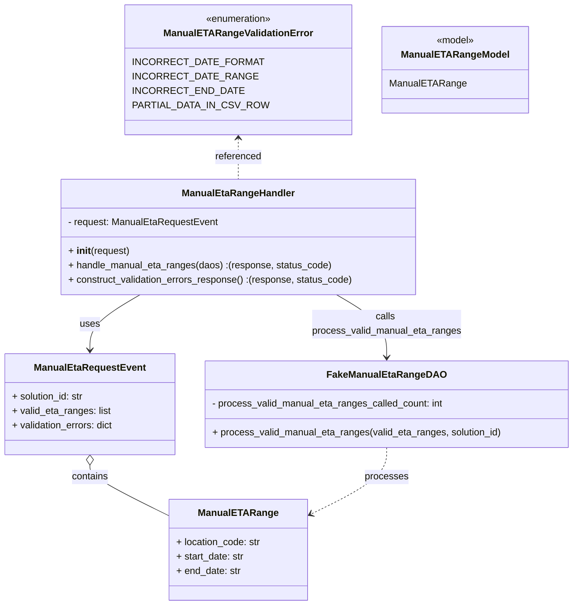
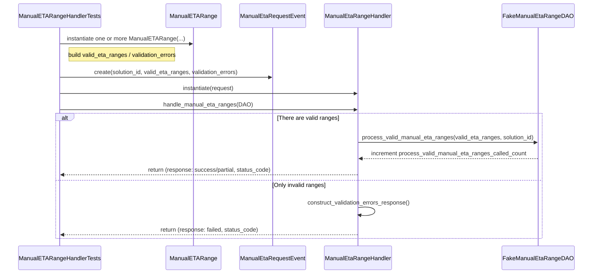

# Diagram: entity_core/entity_service/entity_service_tests/manual_eta_range_tests/test_manual_eta_range_handler.py

> Auto-generated by Obscura crawlers

## Diagram 1

### SVG

<svg id="container" width="949.3125" xmlns="http://www.w3.org/2000/svg" class="classDiagram" height="1006" viewBox="0 0 949.3125 1006" role="graphics-document document" aria-roledescription="class"><g><defs><marker id="container_class-aggregationStart" class="marker aggregation class" refX="18" refY="7" markerWidth="190" markerHeight="240" orient="auto"><path d="M 18,7 L9,13 L1,7 L9,1 Z"></path></marker></defs><defs><marker id="container_class-aggregationEnd" class="marker aggregation class" refX="1" refY="7" markerWidth="20" markerHeight="28" orient="auto"><path d="M 18,7 L9,13 L1,7 L9,1 Z"></path></marker></defs><defs><marker id="container_class-extensionStart" class="marker extension class" refX="18" refY="7" markerWidth="190" markerHeight="240" orient="auto"><path d="M 1,7 L18,13 V 1 Z"></path></marker></defs><defs><marker id="container_class-extensionEnd" class="marker extension class" refX="1" refY="7" markerWidth="20" markerHeight="28" orient="auto"><path d="M 1,1 V 13 L18,7 Z"></path></marker></defs><defs><marker id="container_class-compositionStart" class="marker composition class" refX="18" refY="7" markerWidth="190" markerHeight="240" orient="auto"><path d="M 18,7 L9,13 L1,7 L9,1 Z"></path></marker></defs><defs><marker id="container_class-compositionEnd" class="marker composition class" refX="1" refY="7" markerWidth="20" markerHeight="28" orient="auto"><path d="M 18,7 L9,13 L1,7 L9,1 Z"></path></marker></defs><defs><marker id="container_class-dependencyStart" class="marker dependency class" refX="6" refY="7" markerWidth="190" markerHeight="240" orient="auto"><path d="M 5,7 L9,13 L1,7 L9,1 Z"></path></marker></defs><defs><marker id="container_class-dependencyEnd" class="marker dependency class" refX="13" refY="7" markerWidth="20" markerHeight="28" orient="auto"><path d="M 18,7 L9,13 L14,7 L9,1 Z"></path></marker></defs><defs><marker id="container_class-lollipopStart" class="marker lollipop class" refX="13" refY="7" markerWidth="190" markerHeight="240" orient="auto"><circle stroke="black" fill="transparent" cx="7" cy="7" r="6"></circle></marker></defs><defs><marker id="container_class-lollipopEnd" class="marker lollipop class" refX="1" refY="7" markerWidth="190" markerHeight="240" orient="auto"><circle stroke="black" fill="transparent" cx="7" cy="7" r="6"></circle></marker></defs><g class="root"><g class="clusters"></g><g class="edgePaths"><path d="M149.984,773.25L149.984,776.542C149.984,779.833,149.984,786.417,171.977,800.534C193.97,814.65,237.956,836.301,259.949,847.126L281.941,857.951" id="id_ManualEtaRequestEvent_ManualETARange_1" class="edge-thickness-normal edge-pattern-solid relation" style=";;;" data-edge="true" data-et="edge" data-id="id_ManualEtaRequestEvent_ManualETARange_1" data-points="W3sieCI6MTQ5Ljk4NDM3NSwieSI6NzU2fSx7IngiOjE0OS45ODQzNzUsInkiOjc5M30seyJ4IjoyODEuOTQxNDA2MjUsInkiOjg1Ny45NTEwNzQxNzUzMDAzfV0=" marker-start="url(#container_class-aggregationStart)"></path><path d="M233.057,490L219.212,498.167C205.366,506.333,177.675,522.667,163.83,538C149.984,553.333,149.984,567.667,149.984,574.833L149.984,582" id="id_ManualEtaRangeHandler_ManualEtaRequestEvent_2" class="edge-thickness-normal edge-pattern-solid relation" style=";;;" data-edge="true" data-et="edge" data-id="id_ManualEtaRangeHandler_ManualEtaRequestEvent_2" data-points="W3sieCI6MjMzLjA1NzMyNzU4NjIwNjksInkiOjQ5MH0seyJ4IjoxNDkuOTg0Mzc1LCJ5Ijo1Mzl9LHsieCI6MTQ5Ljk4NDM3NSwieSI6NTg4fV0=" marker-end="url(#container_class-dependencyEnd)"></path><path d="M558.568,490L572.413,498.167C586.259,506.333,613.95,522.667,627.795,540C641.641,557.333,641.641,575.667,641.641,584.833L641.641,594" id="id_ManualEtaRangeHandler_FakeManualEtaRangeDAO_3" class="edge-thickness-normal edge-pattern-solid relation" style=";;;" data-edge="true" data-et="edge" data-id="id_ManualEtaRangeHandler_FakeManualEtaRangeDAO_3" data-points="W3sieCI6NTU4LjU2NzY3MjQxMzc5MzIsInkiOjQ5MH0seyJ4Ijo2NDEuNjQwNjI1LCJ5Ijo1Mzl9LHsieCI6NjQxLjY0MDYyNSwieSI6NjAwfV0=" marker-end="url(#container_class-dependencyEnd)"></path><path d="M395.813,230L395.813,235.167C395.813,240.333,395.813,250.667,395.813,262C395.813,273.333,395.813,285.667,395.813,291.833L395.813,298" id="id_ManualETARangeValidationError_ManualEtaRangeHandler_4" class="edge-thickness-normal edge-pattern-dashed relation" style=";;;" data-edge="true" data-et="edge" data-id="id_ManualETARangeValidationError_ManualEtaRangeHandler_4" data-points="W3sieCI6Mzk1LjgxMjUsInkiOjIyNH0seyJ4IjozOTUuODEyNSwieSI6MjYxfSx7IngiOjM5NS44MTI1LCJ5IjoyOTh9XQ==" marker-start="url(#container_class-dependencyStart)"></path><path d="M641.641,744L641.641,752.167C641.641,760.333,641.641,776.667,620.545,795.217C599.449,813.767,557.258,834.534,536.162,844.918L515.067,855.301" id="id_FakeManualEtaRangeDAO_ManualETARange_5" class="edge-thickness-normal edge-pattern-dashed relation" style=";;;" data-edge="true" data-et="edge" data-id="id_FakeManualEtaRangeDAO_ManualETARange_5" data-points="W3sieCI6NjQxLjY0MDYyNSwieSI6NzQ0fSx7IngiOjY0MS42NDA2MjUsInkiOjc5M30seyJ4Ijo1MDkuNjgzNTkzNzUsInkiOjg1Ny45NTEwNzQxNzUzMDAzfV0=" marker-end="url(#container_class-dependencyEnd)"></path></g><g class="edgeLabels"><g class="edgeLabel" transform="translate(149.984375, 793)"><g class="label" data-id="id_ManualEtaRequestEvent_ManualETARange_1" transform="translate(-30.890625, -12)"><foreignObject width="61.78125" height="24">

contains

</foreignObject></g></g><g class="edgeLabel" transform="translate(149.984375, 539)"><g class="label" data-id="id_ManualEtaRangeHandler_ManualEtaRequestEvent_2" transform="translate(-16.4921875, -12)"><foreignObject width="32.984375" height="24">

uses

</foreignObject></g></g><g class="edgeLabel" transform="translate(641.640625, 539)"><g class="label" data-id="id_ManualEtaRangeHandler_FakeManualEtaRangeDAO_3" transform="translate(-123.921875, -24)"><foreignObject width="247.84375" height="48">

calls process_valid_manual_eta_ranges

</foreignObject></g></g><g class="edgeLabel" transform="translate(395.8125, 261)"><g class="label" data-id="id_ManualETARangeValidationError_ManualEtaRangeHandler_4" transform="translate(-38.875, -12)"><foreignObject width="77.75" height="24">

referenced

</foreignObject></g></g><g class="edgeLabel" transform="translate(641.640625, 793)"><g class="label" data-id="id_FakeManualEtaRangeDAO_ManualETARange_5" transform="translate(-35.7890625, -12)"><foreignObject width="71.578125" height="24">

processes

</foreignObject></g></g></g><g class="nodes"><g class="node default" id="classId-FakeManualEtaRangeDAO-0" transform="translate(641.640625, 672)"><g class="basic label-container"><path d="M-299.671875 -72 L299.671875 -72 L299.671875 72 L-299.671875 72" stroke="none" stroke-width="0" fill="#ECECFF" style=""></path><path d="M-299.671875 -72 C-105.35580179814778 -72, 88.96027140370444 -72, 299.671875 -72 M-299.671875 -72 C-179.3911024683577 -72, -59.11032993671543 -72, 299.671875 -72 M299.671875 -72 C299.671875 -27.22223203228784, 299.671875 17.555535935424317, 299.671875 72 M299.671875 -72 C299.671875 -17.745648572338006, 299.671875 36.50870285532399, 299.671875 72 M299.671875 72 C166.8679500490279 72, 34.06402509805582 72, -299.671875 72 M299.671875 72 C158.42612034143212 72, 17.18036568286425 72, -299.671875 72 M-299.671875 72 C-299.671875 30.23721248926386, -299.671875 -11.525575021472278, -299.671875 -72 M-299.671875 72 C-299.671875 29.59688820388594, -299.671875 -12.806223592228122, -299.671875 -72" stroke="#9370DB" stroke-width="1.3" fill="none" stroke-dasharray="0 0" style=""></path></g><g class="annotation-group text" transform="translate(0, -48)"></g><g class="label-group text" transform="translate(-92.3125, -48)"><g class="label" style="font-weight: bolder" transform="translate(0,-12)"><foreignObject width="184.625" height="24">

FakeManualEtaRangeDAO

</foreignObject></g></g><g class="members-group text" transform="translate(-287.671875, 0)"><g class="label" style="" transform="translate(0,-12)"><foreignObject width="386.78125" height="24">

- process_valid_manual_eta_ranges_called_count: int

</foreignObject></g></g><g class="methods-group text" transform="translate(-287.671875, 48)"><g class="label" style="" transform="translate(0,-12)"><foreignObject width="483.03125" height="24">

+ process_valid_manual_eta_ranges(valid_eta_ranges, solution_id)

</foreignObject></g></g><g class="divider" style=""><path d="M-299.671875 -24 C-157.75157989840025 -24, -15.831284796800503 -24, 299.671875 -24 M-299.671875 -24 C-63.11002443009252 -24, 173.45182613981495 -24, 299.671875 -24" stroke="#9370DB" stroke-width="1.3" fill="none" stroke-dasharray="0 0" style=""></path></g><g class="divider" style=""><path d="M-299.671875 24 C-68.13772674849795 24, 163.3964215030041 24, 299.671875 24 M-299.671875 24 C-113.37128782348299 24, 72.92929935303403 24, 299.671875 24" stroke="#9370DB" stroke-width="1.3" fill="none" stroke-dasharray="0 0" style=""></path></g></g><g class="node default" id="classId-ManualETARange-1" transform="translate(395.8125, 914)"><g class="basic label-container"><path d="M-113.87109375 -84 L113.87109375 -84 L113.87109375 84 L-113.87109375 84" stroke="none" stroke-width="0" fill="#ECECFF" style=""></path><path d="M-113.87109375 -84 C-56.03119296466535 -84, 1.808707820669298 -84, 113.87109375 -84 M-113.87109375 -84 C-63.28045749116259 -84, -12.689821232325187 -84, 113.87109375 -84 M113.87109375 -84 C113.87109375 -33.56906175315965, 113.87109375 16.861876493680697, 113.87109375 84 M113.87109375 -84 C113.87109375 -26.464262200058563, 113.87109375 31.071475599882874, 113.87109375 84 M113.87109375 84 C30.88023200726647 84, -52.11062973546706 84, -113.87109375 84 M113.87109375 84 C28.895281185050834 84, -56.08053137989833 84, -113.87109375 84 M-113.87109375 84 C-113.87109375 41.41585708237568, -113.87109375 -1.1682858352486392, -113.87109375 -84 M-113.87109375 84 C-113.87109375 17.104848919280855, -113.87109375 -49.79030216143829, -113.87109375 -84" stroke="#9370DB" stroke-width="1.3" fill="none" stroke-dasharray="0 0" style=""></path></g><g class="annotation-group text" transform="translate(0, -60)"></g><g class="label-group text" transform="translate(-61.8984375, -60)"><g class="label" style="font-weight: bolder" transform="translate(0,-12)"><foreignObject width="123.796875" height="24">

ManualETARange

</foreignObject></g></g><g class="members-group text" transform="translate(-101.87109375, -12)"><g class="label" style="" transform="translate(0,-12)"><foreignObject width="141.84375" height="24">

+ location_code: str

</foreignObject></g><g class="label" style="" transform="translate(0,12)"><foreignObject width="114.0625" height="24">

+ start_date: str

</foreignObject></g><g class="label" style="" transform="translate(0,36)"><foreignObject width="107.921875" height="24">

+ end_date: str

</foreignObject></g></g><g class="methods-group text" transform="translate(-101.87109375, 84)"></g><g class="divider" style=""><path d="M-113.87109375 -36 C-35.35679955692828 -36, 43.15749463614344 -36, 113.87109375 -36 M-113.87109375 -36 C-67.31048261917431 -36, -20.749871488348603 -36, 113.87109375 -36" stroke="#9370DB" stroke-width="1.3" fill="none" stroke-dasharray="0 0" style=""></path></g><g class="divider" style=""><path d="M-113.87109375 60 C-40.110195146819066 60, 33.65070345636187 60, 113.87109375 60 M-113.87109375 60 C-51.35039116212763 60, 11.170311425744742 60, 113.87109375 60" stroke="#9370DB" stroke-width="1.3" fill="none" stroke-dasharray="0 0" style=""></path></g></g><g class="node default" id="classId-ManualEtaRequestEvent-2" transform="translate(149.984375, 672)"><g class="basic label-container"><path d="M-141.984375 -84 L141.984375 -84 L141.984375 84 L-141.984375 84" stroke="none" stroke-width="0" fill="#ECECFF" style=""></path><path d="M-141.984375 -84 C-39.59745759882388 -84, 62.78945980235224 -84, 141.984375 -84 M-141.984375 -84 C-48.37918621694136 -84, 45.22600256611727 -84, 141.984375 -84 M141.984375 -84 C141.984375 -27.900570255143357, 141.984375 28.198859489713286, 141.984375 84 M141.984375 -84 C141.984375 -41.68253991084531, 141.984375 0.6349201783093861, 141.984375 84 M141.984375 84 C32.93067939226455 84, -76.1230162154709 84, -141.984375 84 M141.984375 84 C61.24757256244389 84, -19.489229875112215 84, -141.984375 84 M-141.984375 84 C-141.984375 29.165306742135584, -141.984375 -25.66938651572883, -141.984375 -84 M-141.984375 84 C-141.984375 46.672489916993335, -141.984375 9.34497983398667, -141.984375 -84" stroke="#9370DB" stroke-width="1.3" fill="none" stroke-dasharray="0 0" style=""></path></g><g class="annotation-group text" transform="translate(0, -60)"></g><g class="label-group text" transform="translate(-88.171875, -60)"><g class="label" style="font-weight: bolder" transform="translate(0,-12)"><foreignObject width="176.34375" height="24">

ManualEtaRequestEvent

</foreignObject></g></g><g class="members-group text" transform="translate(-129.984375, -12)"><g class="label" style="" transform="translate(0,-12)"><foreignObject width="121.953125" height="24">

+ solution_id: str

</foreignObject></g><g class="label" style="" transform="translate(0,12)"><foreignObject width="165.046875" height="24">

+ valid_eta_ranges: list

</foreignObject></g><g class="label" style="" transform="translate(0,36)"><foreignObject width="171.796875" height="24">

+ validation_errors: dict

</foreignObject></g></g><g class="methods-group text" transform="translate(-129.984375, 84)"></g><g class="divider" style=""><path d="M-141.984375 -36 C-73.92060483416584 -36, -5.856834668331686 -36, 141.984375 -36 M-141.984375 -36 C-55.74834845578931 -36, 30.487678088421376 -36, 141.984375 -36" stroke="#9370DB" stroke-width="1.3" fill="none" stroke-dasharray="0 0" style=""></path></g><g class="divider" style=""><path d="M-141.984375 60 C-76.35332745482134 60, -10.72227990964268 60, 141.984375 60 M-141.984375 60 C-51.44860754352078 60, 39.08715991295844 60, 141.984375 60" stroke="#9370DB" stroke-width="1.3" fill="none" stroke-dasharray="0 0" style=""></path></g></g><g class="node default" id="classId-ManualEtaRangeHandler-3" transform="translate(395.8125, 394)"><g class="basic label-container"><path d="M-295.1171875 -96 L295.1171875 -96 L295.1171875 96 L-295.1171875 96" stroke="none" stroke-width="0" fill="#ECECFF" style=""></path><path d="M-295.1171875 -96 C-60.090258144559755 -96, 174.9366712108805 -96, 295.1171875 -96 M-295.1171875 -96 C-82.9380565537771 -96, 129.2410743924458 -96, 295.1171875 -96 M295.1171875 -96 C295.1171875 -34.53384403750725, 295.1171875 26.9323119249855, 295.1171875 96 M295.1171875 -96 C295.1171875 -52.991735379833386, 295.1171875 -9.983470759666773, 295.1171875 96 M295.1171875 96 C90.09317227268477 96, -114.93084295463046 96, -295.1171875 96 M295.1171875 96 C65.05086603795377 96, -165.01545542409247 96, -295.1171875 96 M-295.1171875 96 C-295.1171875 26.113686233895038, -295.1171875 -43.772627532209924, -295.1171875 -96 M-295.1171875 96 C-295.1171875 42.0445031756708, -295.1171875 -11.910993648658405, -295.1171875 -96" stroke="#9370DB" stroke-width="1.3" fill="none" stroke-dasharray="0 0" style=""></path></g><g class="annotation-group text" transform="translate(0, -72)"></g><g class="label-group text" transform="translate(-89.578125, -72)"><g class="label" style="font-weight: bolder" transform="translate(0,-12)"><foreignObject width="179.15625" height="24">

ManualEtaRangeHandler

</foreignObject></g></g><g class="members-group text" transform="translate(-283.1171875, -24)"><g class="label" style="" transform="translate(0,-12)"><foreignObject width="248.8125" height="24">

- request: ManualEtaRequestEvent

</foreignObject></g></g><g class="methods-group text" transform="translate(-283.1171875, 24)"><g class="label" style="" transform="translate(0,-12)"><foreignObject width="102.3125" height="24">

+ <strong>init</strong>(request)

</foreignObject></g><g class="label" style="" transform="translate(0,12)"><foreignObject width="437.453125" height="24">

+ handle_manual_eta_ranges(daos) :(response, status_code)

</foreignObject></g><g class="label" style="" transform="translate(0,36)"><foreignObject width="476.65625" height="24">

+ construct_validation_errors_response() :(response, status_code)

</foreignObject></g></g><g class="divider" style=""><path d="M-295.1171875 -48 C-128.06462623848418 -48, 38.98793502303164 -48, 295.1171875 -48 M-295.1171875 -48 C-143.23806784520295 -48, 8.641051809594103 -48, 295.1171875 -48" stroke="#9370DB" stroke-width="1.3" fill="none" stroke-dasharray="0 0" style=""></path></g><g class="divider" style=""><path d="M-295.1171875 0 C-110.40867450881098 0, 74.29983848237805 0, 295.1171875 0 M-295.1171875 0 C-127.041144899073 0, 41.03489770185399 0, 295.1171875 0" stroke="#9370DB" stroke-width="1.3" fill="none" stroke-dasharray="0 0" style=""></path></g></g><g class="node default" id="classId-ManualETARangeValidationError-4" transform="translate(395.8125, 116)"><g class="basic label-container"><path d="M-170.3203125 -108 L170.3203125 -108 L170.3203125 108 L-170.3203125 108" stroke="none" stroke-width="0" fill="#ECECFF" style=""></path><path d="M-170.3203125 -108 C-37.44347175613086 -108, 95.43336898773828 -108, 170.3203125 -108 M-170.3203125 -108 C-44.59875441162012 -108, 81.12280367675976 -108, 170.3203125 -108 M170.3203125 -108 C170.3203125 -35.79890952081915, 170.3203125 36.4021809583617, 170.3203125 108 M170.3203125 -108 C170.3203125 -51.235831771136596, 170.3203125 5.528336457726809, 170.3203125 108 M170.3203125 108 C95.60779752577056 108, 20.89528255154113 108, -170.3203125 108 M170.3203125 108 C38.9018602367162 108, -92.5165920265676 108, -170.3203125 108 M-170.3203125 108 C-170.3203125 32.077577897468885, -170.3203125 -43.84484420506223, -170.3203125 -108 M-170.3203125 108 C-170.3203125 48.81343906248489, -170.3203125 -10.373121875030222, -170.3203125 -108" stroke="#9370DB" stroke-width="1.3" fill="none" stroke-dasharray="0 0" style=""></path></g><g class="annotation-group text" transform="translate(-55.5546875, -84)"><g class="label" style="" transform="translate(0,-12)"><foreignObject width="111.109375" height="24">

«enumeration»

</foreignObject></g></g><g class="label-group text" transform="translate(-117.078125, -60)"><g class="label" style="font-weight: bolder" transform="translate(0,-12)"><foreignObject width="234.15625" height="24">

ManualETARangeValidationError

</foreignObject></g></g><g class="members-group text" transform="translate(-158.3203125, -12)"><g class="label" style="" transform="translate(0,-12)"><foreignObject width="188.78125" height="24">

INCORRECT_DATE_FORMAT

</foreignObject></g><g class="label" style="" transform="translate(0,12)"><foreignObject width="179.78125" height="24">

INCORRECT_DATE_RANGE

</foreignObject></g><g class="label" style="" transform="translate(0,36)"><foreignObject width="160.5" height="24">

INCORRECT_END_DATE

</foreignObject></g><g class="label" style="" transform="translate(0,60)"><foreignObject width="199.5625" height="24">

PARTIAL_DATA_IN_CSV_ROW

</foreignObject></g></g><g class="methods-group text" transform="translate(-158.3203125, 108)"></g><g class="divider" style=""><path d="M-170.3203125 -36 C-59.428385551768315 -36, 51.46354139646337 -36, 170.3203125 -36 M-170.3203125 -36 C-83.191638501458 -36, 3.937035497083997 -36, 170.3203125 -36" stroke="#9370DB" stroke-width="1.3" fill="none" stroke-dasharray="0 0" style=""></path></g><g class="divider" style=""><path d="M-170.3203125 84 C-64.5955309147766 84, 41.129250670446794 84, 170.3203125 84 M-170.3203125 84 C-97.32540385928466 84, -24.330495218569325 84, 170.3203125 84" stroke="#9370DB" stroke-width="1.3" fill="none" stroke-dasharray="0 0" style=""></path></g></g><g class="node default" id="classId-ManualETARangeModel-5" transform="translate(731.6953125, 116)"><g class="basic label-container"><path d="M-115.5625 -72 L115.5625 -72 L115.5625 72 L-115.5625 72" stroke="none" stroke-width="0" fill="#ECECFF" style=""></path><path d="M-115.5625 -72 C-26.696030385189616 -72, 62.17043922962077 -72, 115.5625 -72 M-115.5625 -72 C-46.17551027088882 -72, 23.211479458222357 -72, 115.5625 -72 M115.5625 -72 C115.5625 -36.585890382676865, 115.5625 -1.1717807653537307, 115.5625 72 M115.5625 -72 C115.5625 -18.566032640073864, 115.5625 34.86793471985227, 115.5625 72 M115.5625 72 C54.15418930461339 72, -7.254121390773221 72, -115.5625 72 M115.5625 72 C37.97869300871379 72, -39.60511398257242 72, -115.5625 72 M-115.5625 72 C-115.5625 40.323101138219954, -115.5625 8.646202276439901, -115.5625 -72 M-115.5625 72 C-115.5625 28.494525673928777, -115.5625 -15.010948652142446, -115.5625 -72" stroke="#9370DB" stroke-width="1.3" fill="none" stroke-dasharray="0 0" style=""></path></g><g class="annotation-group text" transform="translate(-32.1484375, -48)"><g class="label" style="" transform="translate(0,-12)"><foreignObject width="64.296875" height="24">

«model»

</foreignObject></g></g><g class="label-group text" transform="translate(-84.453125, -24)"><g class="label" style="font-weight: bolder" transform="translate(0,-12)"><foreignObject width="168.90625" height="24">

ManualETARangeModel

</foreignObject></g></g><g class="members-group text" transform="translate(-103.5625, 24)"><g class="label" style="" transform="translate(0,-12)"><foreignObject width="122.671875" height="24">

ManualETARange

</foreignObject></g></g><g class="methods-group text" transform="translate(-103.5625, 72)"></g><g class="divider" style=""><path d="M-115.5625 0 C-53.198027948245 0, 9.166444103510003 0, 115.5625 0 M-115.5625 0 C-24.410751871944015 0, 66.74099625611197 0, 115.5625 0" stroke="#9370DB" stroke-width="1.3" fill="none" stroke-dasharray="0 0" style=""></path></g><g class="divider" style=""><path d="M-115.5625 48 C-25.567655331908256 48, 64.42718933618349 48, 115.5625 48 M-115.5625 48 C-56.57993436673397 48, 2.4026312665320546 48, 115.5625 48" stroke="#9370DB" stroke-width="1.3" fill="none" stroke-dasharray="0 0" style=""></path></g></g></g></g></g></svg>

## Diagram 2

### SVG

<svg id="container" width="1721" xmlns="http://www.w3.org/2000/svg" height="782" viewBox="-50 -10 1721 782" role="graphics-document document" aria-roledescription="sequence"><g><rect x="1418" y="696" fill="#eaeaea" stroke="#666" width="203" height="65" name="DAO" rx="3" ry="3" class="actor actor-bottom"></rect><text x="1519.5" y="728.5" dominant-baseline="central" alignment-baseline="central" class="actor actor-box" style="text-anchor: middle; font-size: 16px; font-weight: 400;"><tspan x="1519.5" dy="0">FakeManualEtaRangeDAO</tspan></text></g><g><rect x="879" y="696" fill="#eaeaea" stroke="#666" width="199" height="65" name="Handler" rx="3" ry="3" class="actor actor-bottom"></rect><text x="978.5" y="728.5" dominant-baseline="central" alignment-baseline="central" class="actor actor-box" style="text-anchor: middle; font-size: 16px; font-weight: 400;"><tspan x="978.5" dy="0">ManualEtaRangeHandler</tspan></text></g><g><rect x="634" y="696" fill="#eaeaea" stroke="#666" width="195" height="65" name="Request" rx="3" ry="3" class="actor actor-bottom"></rect><text x="731.5" y="728.5" dominant-baseline="central" alignment-baseline="central" class="actor actor-box" style="text-anchor: middle; font-size: 16px; font-weight: 400;"><tspan x="731.5" dy="0">ManualEtaRequestEvent</tspan></text></g><g><rect x="434" y="696" fill="#eaeaea" stroke="#666" width="150" height="65" name="Model" rx="3" ry="3" class="actor actor-bottom"></rect><text x="509" y="728.5" dominant-baseline="central" alignment-baseline="central" class="actor actor-box" style="text-anchor: middle; font-size: 16px; font-weight: 400;"><tspan x="509" dy="0">ManualETARange</tspan></text></g><g><rect x="0" y="696" fill="#eaeaea" stroke="#666" width="238" height="65" name="Test" rx="3" ry="3" class="actor actor-bottom"></rect><text x="119" y="728.5" dominant-baseline="central" alignment-baseline="central" class="actor actor-box" style="text-anchor: middle; font-size: 16px; font-weight: 400;"><tspan x="119" dy="0">ManualETARangeHandlerTests</tspan></text></g><g><line id="actor4" x1="1519.5" y1="65" x2="1519.5" y2="696" class="actor-line 200" stroke-width="0.5px" stroke="#999" name="DAO"></line><g id="root-4"><rect x="1418" y="0" fill="#eaeaea" stroke="#666" width="203" height="65" name="DAO" rx="3" ry="3" class="actor actor-top"></rect><text x="1519.5" y="32.5" dominant-baseline="central" alignment-baseline="central" class="actor actor-box" style="text-anchor: middle; font-size: 16px; font-weight: 400;"><tspan x="1519.5" dy="0">FakeManualEtaRangeDAO</tspan></text></g></g><g><line id="actor3" x1="978.5" y1="65" x2="978.5" y2="696" class="actor-line 200" stroke-width="0.5px" stroke="#999" name="Handler"></line><g id="root-3"><rect x="879" y="0" fill="#eaeaea" stroke="#666" width="199" height="65" name="Handler" rx="3" ry="3" class="actor actor-top"></rect><text x="978.5" y="32.5" dominant-baseline="central" alignment-baseline="central" class="actor actor-box" style="text-anchor: middle; font-size: 16px; font-weight: 400;"><tspan x="978.5" dy="0">ManualEtaRangeHandler</tspan></text></g></g><g><line id="actor2" x1="731.5" y1="65" x2="731.5" y2="696" class="actor-line 200" stroke-width="0.5px" stroke="#999" name="Request"></line><g id="root-2"><rect x="634" y="0" fill="#eaeaea" stroke="#666" width="195" height="65" name="Request" rx="3" ry="3" class="actor actor-top"></rect><text x="731.5" y="32.5" dominant-baseline="central" alignment-baseline="central" class="actor actor-box" style="text-anchor: middle; font-size: 16px; font-weight: 400;"><tspan x="731.5" dy="0">ManualEtaRequestEvent</tspan></text></g></g><g><line id="actor1" x1="509" y1="65" x2="509" y2="696" class="actor-line 200" stroke-width="0.5px" stroke="#999" name="Model"></line><g id="root-1"><rect x="434" y="0" fill="#eaeaea" stroke="#666" width="150" height="65" name="Model" rx="3" ry="3" class="actor actor-top"></rect><text x="509" y="32.5" dominant-baseline="central" alignment-baseline="central" class="actor actor-box" style="text-anchor: middle; font-size: 16px; font-weight: 400;"><tspan x="509" dy="0">ManualETARange</tspan></text></g></g><g><line id="actor0" x1="119" y1="65" x2="119" y2="696" class="actor-line 200" stroke-width="0.5px" stroke="#999" name="Test"></line><g id="root-0"><rect x="0" y="0" fill="#eaeaea" stroke="#666" width="238" height="65" name="Test" rx="3" ry="3" class="actor actor-top"></rect><text x="119" y="32.5" dominant-baseline="central" alignment-baseline="central" class="actor actor-box" style="text-anchor: middle; font-size: 16px; font-weight: 400;"><tspan x="119" dy="0">ManualETARangeHandlerTests</tspan></text></g></g><g></g><defs><symbol id="computer" width="24" height="24"><path transform="scale(.5)" d="M2 2v13h20v-13h-20zm18 11h-16v-9h16v9zm-10.228 6l.466-1h3.524l.467 1h-4.457zm14.228 3h-24l2-6h2.104l-1.33 4h18.45l-1.297-4h2.073l2 6zm-5-10h-14v-7h14v7z"></path></symbol></defs><defs><symbol id="database" fill-rule="evenodd" clip-rule="evenodd"><path transform="scale(.5)" d="M12.258.001l.256.004.255.005.253.008.251.01.249.012.247.015.246.016.242.019.241.02.239.023.236.024.233.027.231.028.229.031.225.032.223.034.22.036.217.038.214.04.211.041.208.043.205.045.201.046.198.048.194.05.191.051.187.053.183.054.18.056.175.057.172.059.168.06.163.061.16.063.155.064.15.066.074.033.073.033.071.034.07.034.069.035.068.035.067.035.066.035.064.036.064.036.062.036.06.036.06.037.058.037.058.037.055.038.055.038.053.038.052.038.051.039.05.039.048.039.047.039.045.04.044.04.043.04.041.04.04.041.039.041.037.041.036.041.034.041.033.042.032.042.03.042.029.042.027.042.026.043.024.043.023.043.021.043.02.043.018.044.017.043.015.044.013.044.012.044.011.045.009.044.007.045.006.045.004.045.002.045.001.045v17l-.001.045-.002.045-.004.045-.006.045-.007.045-.009.044-.011.045-.012.044-.013.044-.015.044-.017.043-.018.044-.02.043-.021.043-.023.043-.024.043-.026.043-.027.042-.029.042-.03.042-.032.042-.033.042-.034.041-.036.041-.037.041-.039.041-.04.041-.041.04-.043.04-.044.04-.045.04-.047.039-.048.039-.05.039-.051.039-.052.038-.053.038-.055.038-.055.038-.058.037-.058.037-.06.037-.06.036-.062.036-.064.036-.064.036-.066.035-.067.035-.068.035-.069.035-.07.034-.071.034-.073.033-.074.033-.15.066-.155.064-.16.063-.163.061-.168.06-.172.059-.175.057-.18.056-.183.054-.187.053-.191.051-.194.05-.198.048-.201.046-.205.045-.208.043-.211.041-.214.04-.217.038-.22.036-.223.034-.225.032-.229.031-.231.028-.233.027-.236.024-.239.023-.241.02-.242.019-.246.016-.247.015-.249.012-.251.01-.253.008-.255.005-.256.004-.258.001-.258-.001-.256-.004-.255-.005-.253-.008-.251-.01-.249-.012-.247-.015-.245-.016-.243-.019-.241-.02-.238-.023-.236-.024-.234-.027-.231-.028-.228-.031-.226-.032-.223-.034-.22-.036-.217-.038-.214-.04-.211-.041-.208-.043-.204-.045-.201-.046-.198-.048-.195-.05-.19-.051-.187-.053-.184-.054-.179-.056-.176-.057-.172-.059-.167-.06-.164-.061-.159-.063-.155-.064-.151-.066-.074-.033-.072-.033-.072-.034-.07-.034-.069-.035-.068-.035-.067-.035-.066-.035-.064-.036-.063-.036-.062-.036-.061-.036-.06-.037-.058-.037-.057-.037-.056-.038-.055-.038-.053-.038-.052-.038-.051-.039-.049-.039-.049-.039-.046-.039-.046-.04-.044-.04-.043-.04-.041-.04-.04-.041-.039-.041-.037-.041-.036-.041-.034-.041-.033-.042-.032-.042-.03-.042-.029-.042-.027-.042-.026-.043-.024-.043-.023-.043-.021-.043-.02-.043-.018-.044-.017-.043-.015-.044-.013-.044-.012-.044-.011-.045-.009-.044-.007-.045-.006-.045-.004-.045-.002-.045-.001-.045v-17l.001-.045.002-.045.004-.045.006-.045.007-.045.009-.044.011-.045.012-.044.013-.044.015-.044.017-.043.018-.044.02-.043.021-.043.023-.043.024-.043.026-.043.027-.042.029-.042.03-.042.032-.042.033-.042.034-.041.036-.041.037-.041.039-.041.04-.041.041-.04.043-.04.044-.04.046-.04.046-.039.049-.039.049-.039.051-.039.052-.038.053-.038.055-.038.056-.038.057-.037.058-.037.06-.037.061-.036.062-.036.063-.036.064-.036.066-.035.067-.035.068-.035.069-.035.07-.034.072-.034.072-.033.074-.033.151-.066.155-.064.159-.063.164-.061.167-.06.172-.059.176-.057.179-.056.184-.054.187-.053.19-.051.195-.05.198-.048.201-.046.204-.045.208-.043.211-.041.214-.04.217-.038.22-.036.223-.034.226-.032.228-.031.231-.028.234-.027.236-.024.238-.023.241-.02.243-.019.245-.016.247-.015.249-.012.251-.01.253-.008.255-.005.256-.004.258-.001.258.001zm-9.258 20.499v.01l.001.021.003.021.004.022.005.021.006.022.007.022.009.023.01.022.011.023.012.023.013.023.015.023.016.024.017.023.018.024.019.024.021.024.022.025.023.024.024.025.052.049.056.05.061.051.066.051.07.051.075.051.079.052.084.052.088.052.092.052.097.052.102.051.105.052.11.052.114.051.119.051.123.051.127.05.131.05.135.05.139.048.144.049.147.047.152.047.155.047.16.045.163.045.167.043.171.043.176.041.178.041.183.039.187.039.19.037.194.035.197.035.202.033.204.031.209.03.212.029.216.027.219.025.222.024.226.021.23.02.233.018.236.016.24.015.243.012.246.01.249.008.253.005.256.004.259.001.26-.001.257-.004.254-.005.25-.008.247-.011.244-.012.241-.014.237-.016.233-.018.231-.021.226-.021.224-.024.22-.026.216-.027.212-.028.21-.031.205-.031.202-.034.198-.034.194-.036.191-.037.187-.039.183-.04.179-.04.175-.042.172-.043.168-.044.163-.045.16-.046.155-.046.152-.047.148-.048.143-.049.139-.049.136-.05.131-.05.126-.05.123-.051.118-.052.114-.051.11-.052.106-.052.101-.052.096-.052.092-.052.088-.053.083-.051.079-.052.074-.052.07-.051.065-.051.06-.051.056-.05.051-.05.023-.024.023-.025.021-.024.02-.024.019-.024.018-.024.017-.024.015-.023.014-.024.013-.023.012-.023.01-.023.01-.022.008-.022.006-.022.006-.022.004-.022.004-.021.001-.021.001-.021v-4.127l-.077.055-.08.053-.083.054-.085.053-.087.052-.09.052-.093.051-.095.05-.097.05-.1.049-.102.049-.105.048-.106.047-.109.047-.111.046-.114.045-.115.045-.118.044-.12.043-.122.042-.124.042-.126.041-.128.04-.13.04-.132.038-.134.038-.135.037-.138.037-.139.035-.142.035-.143.034-.144.033-.147.032-.148.031-.15.03-.151.03-.153.029-.154.027-.156.027-.158.026-.159.025-.161.024-.162.023-.163.022-.165.021-.166.02-.167.019-.169.018-.169.017-.171.016-.173.015-.173.014-.175.013-.175.012-.177.011-.178.01-.179.008-.179.008-.181.006-.182.005-.182.004-.184.003-.184.002h-.37l-.184-.002-.184-.003-.182-.004-.182-.005-.181-.006-.179-.008-.179-.008-.178-.01-.176-.011-.176-.012-.175-.013-.173-.014-.172-.015-.171-.016-.17-.017-.169-.018-.167-.019-.166-.02-.165-.021-.163-.022-.162-.023-.161-.024-.159-.025-.157-.026-.156-.027-.155-.027-.153-.029-.151-.03-.15-.03-.148-.031-.146-.032-.145-.033-.143-.034-.141-.035-.14-.035-.137-.037-.136-.037-.134-.038-.132-.038-.13-.04-.128-.04-.126-.041-.124-.042-.122-.042-.12-.044-.117-.043-.116-.045-.113-.045-.112-.046-.109-.047-.106-.047-.105-.048-.102-.049-.1-.049-.097-.05-.095-.05-.093-.052-.09-.051-.087-.052-.085-.053-.083-.054-.08-.054-.077-.054v4.127zm0-5.654v.011l.001.021.003.021.004.021.005.022.006.022.007.022.009.022.01.022.011.023.012.023.013.023.015.024.016.023.017.024.018.024.019.024.021.024.022.024.023.025.024.024.052.05.056.05.061.05.066.051.07.051.075.052.079.051.084.052.088.052.092.052.097.052.102.052.105.052.11.051.114.051.119.052.123.05.127.051.131.05.135.049.139.049.144.048.147.048.152.047.155.046.16.045.163.045.167.044.171.042.176.042.178.04.183.04.187.038.19.037.194.036.197.034.202.033.204.032.209.03.212.028.216.027.219.025.222.024.226.022.23.02.233.018.236.016.24.014.243.012.246.01.249.008.253.006.256.003.259.001.26-.001.257-.003.254-.006.25-.008.247-.01.244-.012.241-.015.237-.016.233-.018.231-.02.226-.022.224-.024.22-.025.216-.027.212-.029.21-.03.205-.032.202-.033.198-.035.194-.036.191-.037.187-.039.183-.039.179-.041.175-.042.172-.043.168-.044.163-.045.16-.045.155-.047.152-.047.148-.048.143-.048.139-.05.136-.049.131-.05.126-.051.123-.051.118-.051.114-.052.11-.052.106-.052.101-.052.096-.052.092-.052.088-.052.083-.052.079-.052.074-.051.07-.052.065-.051.06-.05.056-.051.051-.049.023-.025.023-.024.021-.025.02-.024.019-.024.018-.024.017-.024.015-.023.014-.023.013-.024.012-.022.01-.023.01-.023.008-.022.006-.022.006-.022.004-.021.004-.022.001-.021.001-.021v-4.139l-.077.054-.08.054-.083.054-.085.052-.087.053-.09.051-.093.051-.095.051-.097.05-.1.049-.102.049-.105.048-.106.047-.109.047-.111.046-.114.045-.115.044-.118.044-.12.044-.122.042-.124.042-.126.041-.128.04-.13.039-.132.039-.134.038-.135.037-.138.036-.139.036-.142.035-.143.033-.144.033-.147.033-.148.031-.15.03-.151.03-.153.028-.154.028-.156.027-.158.026-.159.025-.161.024-.162.023-.163.022-.165.021-.166.02-.167.019-.169.018-.169.017-.171.016-.173.015-.173.014-.175.013-.175.012-.177.011-.178.009-.179.009-.179.007-.181.007-.182.005-.182.004-.184.003-.184.002h-.37l-.184-.002-.184-.003-.182-.004-.182-.005-.181-.007-.179-.007-.179-.009-.178-.009-.176-.011-.176-.012-.175-.013-.173-.014-.172-.015-.171-.016-.17-.017-.169-.018-.167-.019-.166-.02-.165-.021-.163-.022-.162-.023-.161-.024-.159-.025-.157-.026-.156-.027-.155-.028-.153-.028-.151-.03-.15-.03-.148-.031-.146-.033-.145-.033-.143-.033-.141-.035-.14-.036-.137-.036-.136-.037-.134-.038-.132-.039-.13-.039-.128-.04-.126-.041-.124-.042-.122-.043-.12-.043-.117-.044-.116-.044-.113-.046-.112-.046-.109-.046-.106-.047-.105-.048-.102-.049-.1-.049-.097-.05-.095-.051-.093-.051-.09-.051-.087-.053-.085-.052-.083-.054-.08-.054-.077-.054v4.139zm0-5.666v.011l.001.02.003.022.004.021.005.022.006.021.007.022.009.023.01.022.011.023.012.023.013.023.015.023.016.024.017.024.018.023.019.024.021.025.022.024.023.024.024.025.052.05.056.05.061.05.066.051.07.051.075.052.079.051.084.052.088.052.092.052.097.052.102.052.105.051.11.052.114.051.119.051.123.051.127.05.131.05.135.05.139.049.144.048.147.048.152.047.155.046.16.045.163.045.167.043.171.043.176.042.178.04.183.04.187.038.19.037.194.036.197.034.202.033.204.032.209.03.212.028.216.027.219.025.222.024.226.021.23.02.233.018.236.017.24.014.243.012.246.01.249.008.253.006.256.003.259.001.26-.001.257-.003.254-.006.25-.008.247-.01.244-.013.241-.014.237-.016.233-.018.231-.02.226-.022.224-.024.22-.025.216-.027.212-.029.21-.03.205-.032.202-.033.198-.035.194-.036.191-.037.187-.039.183-.039.179-.041.175-.042.172-.043.168-.044.163-.045.16-.045.155-.047.152-.047.148-.048.143-.049.139-.049.136-.049.131-.051.126-.05.123-.051.118-.052.114-.051.11-.052.106-.052.101-.052.096-.052.092-.052.088-.052.083-.052.079-.052.074-.052.07-.051.065-.051.06-.051.056-.05.051-.049.023-.025.023-.025.021-.024.02-.024.019-.024.018-.024.017-.024.015-.023.014-.024.013-.023.012-.023.01-.022.01-.023.008-.022.006-.022.006-.022.004-.022.004-.021.001-.021.001-.021v-4.153l-.077.054-.08.054-.083.053-.085.053-.087.053-.09.051-.093.051-.095.051-.097.05-.1.049-.102.048-.105.048-.106.048-.109.046-.111.046-.114.046-.115.044-.118.044-.12.043-.122.043-.124.042-.126.041-.128.04-.13.039-.132.039-.134.038-.135.037-.138.036-.139.036-.142.034-.143.034-.144.033-.147.032-.148.032-.15.03-.151.03-.153.028-.154.028-.156.027-.158.026-.159.024-.161.024-.162.023-.163.023-.165.021-.166.02-.167.019-.169.018-.169.017-.171.016-.173.015-.173.014-.175.013-.175.012-.177.01-.178.01-.179.009-.179.007-.181.006-.182.006-.182.004-.184.003-.184.001-.185.001-.185-.001-.184-.001-.184-.003-.182-.004-.182-.006-.181-.006-.179-.007-.179-.009-.178-.01-.176-.01-.176-.012-.175-.013-.173-.014-.172-.015-.171-.016-.17-.017-.169-.018-.167-.019-.166-.02-.165-.021-.163-.023-.162-.023-.161-.024-.159-.024-.157-.026-.156-.027-.155-.028-.153-.028-.151-.03-.15-.03-.148-.032-.146-.032-.145-.033-.143-.034-.141-.034-.14-.036-.137-.036-.136-.037-.134-.038-.132-.039-.13-.039-.128-.041-.126-.041-.124-.041-.122-.043-.12-.043-.117-.044-.116-.044-.113-.046-.112-.046-.109-.046-.106-.048-.105-.048-.102-.048-.1-.05-.097-.049-.095-.051-.093-.051-.09-.052-.087-.052-.085-.053-.083-.053-.08-.054-.077-.054v4.153zm8.74-8.179l-.257.004-.254.005-.25.008-.247.011-.244.012-.241.014-.237.016-.233.018-.231.021-.226.022-.224.023-.22.026-.216.027-.212.028-.21.031-.205.032-.202.033-.198.034-.194.036-.191.038-.187.038-.183.04-.179.041-.175.042-.172.043-.168.043-.163.045-.16.046-.155.046-.152.048-.148.048-.143.048-.139.049-.136.05-.131.05-.126.051-.123.051-.118.051-.114.052-.11.052-.106.052-.101.052-.096.052-.092.052-.088.052-.083.052-.079.052-.074.051-.07.052-.065.051-.06.05-.056.05-.051.05-.023.025-.023.024-.021.024-.02.025-.019.024-.018.024-.017.023-.015.024-.014.023-.013.023-.012.023-.01.023-.01.022-.008.022-.006.023-.006.021-.004.022-.004.021-.001.021-.001.021.001.021.001.021.004.021.004.022.006.021.006.023.008.022.01.022.01.023.012.023.013.023.014.023.015.024.017.023.018.024.019.024.02.025.021.024.023.024.023.025.051.05.056.05.06.05.065.051.07.052.074.051.079.052.083.052.088.052.092.052.096.052.101.052.106.052.11.052.114.052.118.051.123.051.126.051.131.05.136.05.139.049.143.048.148.048.152.048.155.046.16.046.163.045.168.043.172.043.175.042.179.041.183.04.187.038.191.038.194.036.198.034.202.033.205.032.21.031.212.028.216.027.22.026.224.023.226.022.231.021.233.018.237.016.241.014.244.012.247.011.25.008.254.005.257.004.26.001.26-.001.257-.004.254-.005.25-.008.247-.011.244-.012.241-.014.237-.016.233-.018.231-.021.226-.022.224-.023.22-.026.216-.027.212-.028.21-.031.205-.032.202-.033.198-.034.194-.036.191-.038.187-.038.183-.04.179-.041.175-.042.172-.043.168-.043.163-.045.16-.046.155-.046.152-.048.148-.048.143-.048.139-.049.136-.05.131-.05.126-.051.123-.051.118-.051.114-.052.11-.052.106-.052.101-.052.096-.052.092-.052.088-.052.083-.052.079-.052.074-.051.07-.052.065-.051.06-.05.056-.05.051-.05.023-.025.023-.024.021-.024.02-.025.019-.024.018-.024.017-.023.015-.024.014-.023.013-.023.012-.023.01-.023.01-.022.008-.022.006-.023.006-.021.004-.022.004-.021.001-.021.001-.021-.001-.021-.001-.021-.004-.021-.004-.022-.006-.021-.006-.023-.008-.022-.01-.022-.01-.023-.012-.023-.013-.023-.014-.023-.015-.024-.017-.023-.018-.024-.019-.024-.02-.025-.021-.024-.023-.024-.023-.025-.051-.05-.056-.05-.06-.05-.065-.051-.07-.052-.074-.051-.079-.052-.083-.052-.088-.052-.092-.052-.096-.052-.101-.052-.106-.052-.11-.052-.114-.052-.118-.051-.123-.051-.126-.051-.131-.05-.136-.05-.139-.049-.143-.048-.148-.048-.152-.048-.155-.046-.16-.046-.163-.045-.168-.043-.172-.043-.175-.042-.179-.041-.183-.04-.187-.038-.191-.038-.194-.036-.198-.034-.202-.033-.205-.032-.21-.031-.212-.028-.216-.027-.22-.026-.224-.023-.226-.022-.231-.021-.233-.018-.237-.016-.241-.014-.244-.012-.247-.011-.25-.008-.254-.005-.257-.004-.26-.001-.26.001z"></path></symbol></defs><defs><symbol id="clock" width="24" height="24"><path transform="scale(.5)" d="M12 2c5.514 0 10 4.486 10 10s-4.486 10-10 10-10-4.486-10-10 4.486-10 10-10zm0-2c-6.627 0-12 5.373-12 12s5.373 12 12 12 12-5.373 12-12-5.373-12-12-12zm5.848 12.459c.202.038.202.333.001.372-1.907.361-6.045 1.111-6.547 1.111-.719 0-1.301-.582-1.301-1.301 0-.512.77-5.447 1.125-7.445.034-.192.312-.181.343.014l.985 6.238 5.394 1.011z"></path></symbol></defs><defs><marker id="arrowhead" refX="7.9" refY="5" markerUnits="userSpaceOnUse" markerWidth="12" markerHeight="12" orient="auto-start-reverse"><path d="M -1 0 L 10 5 L 0 10 z"></path></marker></defs><defs><marker id="crosshead" markerWidth="15" markerHeight="8" orient="auto" refX="4" refY="4.5"><path fill="none" stroke="#000000" stroke-width="1pt" d="M 1,2 L 6,7 M 6,2 L 1,7" style="stroke-dasharray: 0, 0;"></path></marker></defs><defs><marker id="filled-head" refX="15.5" refY="7" markerWidth="20" markerHeight="28" orient="auto"><path d="M 18,7 L9,13 L14,7 L9,1 Z"></path></marker></defs><defs><marker id="sequencenumber" refX="15" refY="15" markerWidth="60" markerHeight="40" orient="auto"><circle cx="15" cy="15" r="6"></circle></marker></defs><g><rect x="144" y="123" fill="#EDF2AE" stroke="#666" width="325" height="39" class="note"></rect><text x="307" y="128" text-anchor="middle" dominant-baseline="middle" alignment-baseline="middle" class="noteText" dy="1em" style="font-size: 16px; font-weight: 400;"><tspan x="307">build valid_eta_ranges / validation_errors</tspan></text></g><g><line x1="108" y1="316" x2="1530.5" y2="316" class="loopLine"></line><line x1="1530.5" y1="316" x2="1530.5" y2="676" class="loopLine"></line><line x1="108" y1="676" x2="1530.5" y2="676" class="loopLine"></line><line x1="108" y1="316" x2="108" y2="676" class="loopLine"></line><line x1="108" y1="510" x2="1530.5" y2="510" class="loopLine" style="stroke-dasharray: 3, 3;"></line><polygon points="108,316 158,316 158,329 149.6,336 108,336" class="labelBox"></polygon><text x="133" y="329" text-anchor="middle" dominant-baseline="middle" alignment-baseline="middle" class="labelText" style="font-size: 16px; font-weight: 400;">alt</text><text x="844.25" y="334" text-anchor="middle" class="loopText" style="font-size: 16px; font-weight: 400;"><tspan x="844.25">[There are valid ranges]</tspan></text><text x="819.25" y="528" text-anchor="middle" class="loopText" style="font-size: 16px; font-weight: 400;">[Only invalid ranges]</text></g><text x="313" y="80" text-anchor="middle" dominant-baseline="middle" alignment-baseline="middle" class="messageText" dy="1em" style="font-size: 16px; font-weight: 400;">instantiate one or more ManualETARange(...)</text><line x1="120" y1="113" x2="505" y2="113" class="messageLine0" stroke-width="2" stroke="none" marker-end="url(#arrowhead)" style="fill: none;"></line><text x="424" y="177" text-anchor="middle" dominant-baseline="middle" alignment-baseline="middle" class="messageText" dy="1em" style="font-size: 16px; font-weight: 400;">create(solution_id, valid_eta_ranges, validation_errors)</text><line x1="120" y1="210" x2="727.5" y2="210" class="messageLine0" stroke-width="2" stroke="none" marker-end="url(#arrowhead)" style="fill: none;"></line><text x="547" y="225" text-anchor="middle" dominant-baseline="middle" alignment-baseline="middle" class="messageText" dy="1em" style="font-size: 16px; font-weight: 400;">instantiate(request)</text><line x1="120" y1="258" x2="974.5" y2="258" class="messageLine0" stroke-width="2" stroke="none" marker-end="url(#arrowhead)" style="fill: none;"></line><text x="547" y="273" text-anchor="middle" dominant-baseline="middle" alignment-baseline="middle" class="messageText" dy="1em" style="font-size: 16px; font-weight: 400;">handle_manual_eta_ranges(DAO)</text><line x1="120" y1="306" x2="974.5" y2="306" class="messageLine0" stroke-width="2" stroke="none" marker-end="url(#arrowhead)" style="fill: none;"></line><text x="1248" y="366" text-anchor="middle" dominant-baseline="middle" alignment-baseline="middle" class="messageText" dy="1em" style="font-size: 16px; font-weight: 400;">process_valid_manual_eta_ranges(valid_eta_ranges, solution_id)</text><line x1="979.5" y1="399" x2="1515.5" y2="399" class="messageLine0" stroke-width="2" stroke="none" marker-end="url(#arrowhead)" style="fill: none;"></line><text x="1251" y="414" text-anchor="middle" dominant-baseline="middle" alignment-baseline="middle" class="messageText" dy="1em" style="font-size: 16px; font-weight: 400;">increment process_valid_manual_eta_ranges_called_count</text><line x1="1518.5" y1="447" x2="982.5" y2="447" class="messageLine1" stroke-width="2" stroke="none" marker-end="url(#arrowhead)" style="stroke-dasharray: 3, 3; fill: none;"></line><text x="550" y="462" text-anchor="middle" dominant-baseline="middle" alignment-baseline="middle" class="messageText" dy="1em" style="font-size: 16px; font-weight: 400;">return (response: success/partial, status_code)</text><line x1="977.5" y1="495" x2="123" y2="495" class="messageLine1" stroke-width="2" stroke="none" marker-end="url(#arrowhead)" style="stroke-dasharray: 3, 3; fill: none;"></line><text x="980" y="555" text-anchor="middle" dominant-baseline="middle" alignment-baseline="middle" class="messageText" dy="1em" style="font-size: 16px; font-weight: 400;">construct_validation_errors_response()</text><path d="M 979.5,588 C 1039.5,578 1039.5,618 979.5,608" class="messageLine0" stroke-width="2" stroke="none" marker-end="url(#arrowhead)" style="fill: none;"></path><text x="550" y="633" text-anchor="middle" dominant-baseline="middle" alignment-baseline="middle" class="messageText" dy="1em" style="font-size: 16px; font-weight: 400;">return (response: failed, status_code)</text><line x1="977.5" y1="666" x2="123" y2="666" class="messageLine1" stroke-width="2" stroke="none" marker-end="url(#arrowhead)" style="stroke-dasharray: 3, 3; fill: none;"></line></svg>
