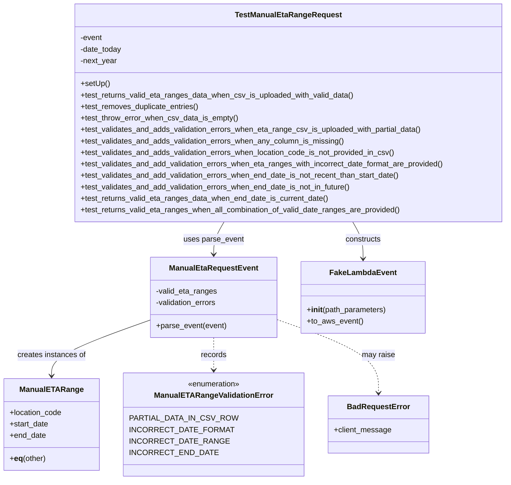
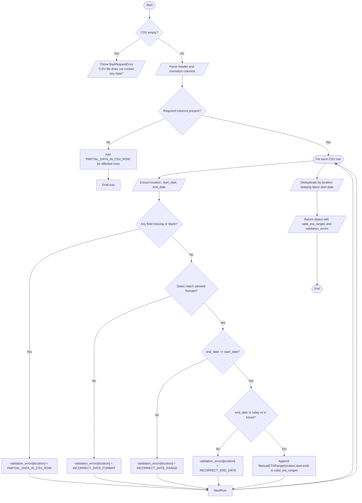

# Diagram: entity_core/entity_service/entity_service_tests/manual_eta_range_tests/test_manual_eta_range_request.py

> Auto-generated by Obscura crawlers

## Diagram 1

### SVG

<svg id="container" width="1035.435546875" xmlns="http://www.w3.org/2000/svg" class="classDiagram" height="1004" viewBox="0 0 1035.435546875 1004" role="graphics-document document" aria-roledescription="class"><g><defs><marker id="container_class-aggregationStart" class="marker aggregation class" refX="18" refY="7" markerWidth="190" markerHeight="240" orient="auto"><path d="M 18,7 L9,13 L1,7 L9,1 Z"></path></marker></defs><defs><marker id="container_class-aggregationEnd" class="marker aggregation class" refX="1" refY="7" markerWidth="20" markerHeight="28" orient="auto"><path d="M 18,7 L9,13 L1,7 L9,1 Z"></path></marker></defs><defs><marker id="container_class-extensionStart" class="marker extension class" refX="18" refY="7" markerWidth="190" markerHeight="240" orient="auto"><path d="M 1,7 L18,13 V 1 Z"></path></marker></defs><defs><marker id="container_class-extensionEnd" class="marker extension class" refX="1" refY="7" markerWidth="20" markerHeight="28" orient="auto"><path d="M 1,1 V 13 L18,7 Z"></path></marker></defs><defs><marker id="container_class-compositionStart" class="marker composition class" refX="18" refY="7" markerWidth="190" markerHeight="240" orient="auto"><path d="M 18,7 L9,13 L1,7 L9,1 Z"></path></marker></defs><defs><marker id="container_class-compositionEnd" class="marker composition class" refX="1" refY="7" markerWidth="20" markerHeight="28" orient="auto"><path d="M 18,7 L9,13 L1,7 L9,1 Z"></path></marker></defs><defs><marker id="container_class-dependencyStart" class="marker dependency class" refX="6" refY="7" markerWidth="190" markerHeight="240" orient="auto"><path d="M 5,7 L9,13 L1,7 L9,1 Z"></path></marker></defs><defs><marker id="container_class-dependencyEnd" class="marker dependency class" refX="13" refY="7" markerWidth="20" markerHeight="28" orient="auto"><path d="M 18,7 L9,13 L14,7 L9,1 Z"></path></marker></defs><defs><marker id="container_class-lollipopStart" class="marker lollipop class" refX="13" refY="7" markerWidth="190" markerHeight="240" orient="auto"><circle stroke="black" fill="transparent" cx="7" cy="7" r="6"></circle></marker></defs><defs><marker id="container_class-lollipopEnd" class="marker lollipop class" refX="1" refY="7" markerWidth="190" markerHeight="240" orient="auto"><circle stroke="black" fill="transparent" cx="7" cy="7" r="6"></circle></marker></defs><g class="root"><g class="clusters"></g><g class="edgePaths"><path d="M445.82,464L442.238,470.167C438.656,476.333,431.492,488.667,427.91,500C424.328,511.333,424.328,521.667,424.328,526.833L424.328,532" id="id_TestManualEtaRangeRequest_ManualEtaRequestEvent_1" class="edge-thickness-normal edge-pattern-solid relation" style=";;;" data-edge="true" data-et="edge" data-id="id_TestManualEtaRangeRequest_ManualEtaRequestEvent_1" data-points="W3sieCI6NDQ1LjgxOTkyMTg3NSwieSI6NDY0fSx7IngiOjQyNC4zMjgxMjUsInkiOjUwMX0seyJ4Ijo0MjQuMzI4MTI1LCJ5Ijo1Mzh9XQ==" marker-end="url(#container_class-dependencyEnd)"></path><path d="M710.692,464L714.274,470.167C717.856,476.333,725.02,488.667,728.602,501.5C732.184,514.333,732.184,527.667,732.184,534.333L732.184,541" id="id_TestManualEtaRangeRequest_FakeLambdaEvent_2" class="edge-thickness-normal edge-pattern-solid relation" style=";;;" data-edge="true" data-et="edge" data-id="id_TestManualEtaRangeRequest_FakeLambdaEvent_2" data-points="W3sieCI6NzEwLjY5MTc5Njg3NSwieSI6NDY0fSx7IngiOjczMi4xODM1OTM3NSwieSI6NTAxfSx7IngiOjczMi4xODM1OTM3NSwieSI6NTQ3fV0=" marker-end="url(#container_class-dependencyEnd)"></path><path d="M294.797,671.237L263.331,683.197C231.866,695.158,168.935,719.079,137.469,738.206C106.004,757.333,106.004,771.667,106.004,778.833L106.004,786" id="id_ManualEtaRequestEvent_ManualETARange_3" class="edge-thickness-normal edge-pattern-solid relation" style=";;;" data-edge="true" data-et="edge" data-id="id_ManualEtaRequestEvent_ManualETARange_3" data-points="W3sieCI6Mjk0Ljc5Njg3NSwieSI6NjcxLjIzNjg0ODI0MDkxfSx7IngiOjEwNi4wMDM5MDYyNSwieSI6NzQzfSx7IngiOjEwNi4wMDM5MDYyNSwieSI6NzkyfV0=" marker-end="url(#container_class-dependencyEnd)"></path><path d="M424.328,706L424.328,712.167C424.328,718.333,424.328,730.667,424.328,742C424.328,753.333,424.328,763.667,424.328,768.833L424.328,774" id="id_ManualEtaRequestEvent_ManualETARangeValidationError_4" class="edge-thickness-normal edge-pattern-dashed relation" style=";;;" data-edge="true" data-et="edge" data-id="id_ManualEtaRequestEvent_ManualETARangeValidationError_4" data-points="W3sieCI6NDI0LjMyODEyNSwieSI6NzA2fSx7IngiOjQyNC4zMjgxMjUsInkiOjc0M30seyJ4Ijo0MjQuMzI4MTI1LCJ5Ijo3ODB9XQ==" marker-end="url(#container_class-dependencyEnd)"></path><path d="M553.859,670.498L586.133,682.582C618.406,694.666,682.953,718.833,715.227,744.083C747.5,769.333,747.5,795.667,747.5,808.833L747.5,822" id="id_ManualEtaRequestEvent_BadRequestError_5" class="edge-thickness-normal edge-pattern-dashed relation" style=";;;" data-edge="true" data-et="edge" data-id="id_ManualEtaRequestEvent_BadRequestError_5" data-points="W3sieCI6NTUzLjg1OTM3NSwieSI6NjcwLjQ5ODI4MzYxNDU2MjZ9LHsieCI6NzQ3LjUsInkiOjc0M30seyJ4Ijo3NDcuNSwieSI6ODI4fV0=" marker-end="url(#container_class-dependencyEnd)"></path></g><g class="edgeLabels"><g class="edgeLabel" transform="translate(424.328125, 501)"><g class="label" data-id="id_TestManualEtaRangeRequest_ManualEtaRequestEvent_1" transform="translate(-62.7109375, -12)"><foreignObject width="125.421875" height="24">

uses parse_event

</foreignObject></g></g><g class="edgeLabel" transform="translate(732.18359375, 501)"><g class="label" data-id="id_TestManualEtaRangeRequest_FakeLambdaEvent_2" transform="translate(-37.84375, -12)"><foreignObject width="75.6875" height="24">

constructs

</foreignObject></g></g><g class="edgeLabel" transform="translate(106.00390625, 743)"><g class="label" data-id="id_ManualEtaRequestEvent_ManualETARange_3" transform="translate(-72.078125, -12)"><foreignObject width="144.15625" height="24">

creates instances of

</foreignObject></g></g><g class="edgeLabel" transform="translate(424.328125, 743)"><g class="label" data-id="id_ManualEtaRequestEvent_ManualETARangeValidationError_4" transform="translate(-26.9140625, -12)"><foreignObject width="53.828125" height="24">

records

</foreignObject></g></g><g class="edgeLabel" transform="translate(747.5, 743)"><g class="label" data-id="id_ManualEtaRequestEvent_BadRequestError_5" transform="translate(-34.65625, -12)"><foreignObject width="69.3125" height="24">

may raise

</foreignObject></g></g></g><g class="nodes"><g class="node default" id="classId-TestManualEtaRangeRequest-0" transform="translate(578.255859375, 236)"><g class="basic label-container"><path d="M-449.1796875 -228 L449.1796875 -228 L449.1796875 228 L-449.1796875 228" stroke="none" stroke-width="0" fill="#ECECFF" style=""></path><path d="M-449.1796875 -228 C-246.7768413269228 -228, -44.37399515384561 -228, 449.1796875 -228 M-449.1796875 -228 C-122.63496750290568 -228, 203.90975249418864 -228, 449.1796875 -228 M449.1796875 -228 C449.1796875 -84.13604465342877, 449.1796875 59.72791069314246, 449.1796875 228 M449.1796875 -228 C449.1796875 -75.73406747622835, 449.1796875 76.5318650475433, 449.1796875 228 M449.1796875 228 C246.84995305430894 228, 44.52021860861788 228, -449.1796875 228 M449.1796875 228 C96.1794593111764 228, -256.8207688776472 228, -449.1796875 228 M-449.1796875 228 C-449.1796875 51.67425806635708, -449.1796875 -124.65148386728583, -449.1796875 -228 M-449.1796875 228 C-449.1796875 125.189917571788, -449.1796875 22.379835143576003, -449.1796875 -228" stroke="#9370DB" stroke-width="1.3" fill="none" stroke-dasharray="0 0" style=""></path></g><g class="annotation-group text" transform="translate(0, -204)"></g><g class="label-group text" transform="translate(-105.71875, -204)"><g class="label" style="font-weight: bolder" transform="translate(0,-12)"><foreignObject width="211.4375" height="24">

TestManualEtaRangeRequest

</foreignObject></g></g><g class="members-group text" transform="translate(-437.1796875, -156)"><g class="label" style="" transform="translate(0,-12)"><foreignObject width="46.796875" height="24">

-event

</foreignObject></g><g class="label" style="" transform="translate(0,12)"><foreignObject width="87.453125" height="24">

-date_today

</foreignObject></g><g class="label" style="" transform="translate(0,36)"><foreignObject width="77.359375" height="24">

-next_year

</foreignObject></g></g><g class="methods-group text" transform="translate(-437.1796875, -60)"><g class="label" style="" transform="translate(0,-12)"><foreignObject width="60.421875" height="24">

+setUp()

</foreignObject></g><g class="label" style="" transform="translate(0,12)"><foreignObject width="573.640625" height="24">

+test_returns_valid_eta_ranges_data_when_csv_is_uploaded_with_valid_data()

</foreignObject></g><g class="label" style="" transform="translate(0,36)"><foreignObject width="249.65625" height="24">

+test_removes_duplicate_entries()

</foreignObject></g><g class="label" style="" transform="translate(0,60)"><foreignObject width="329.265625" height="24">

+test_throw_error_when_csv_data_is_empty()

</foreignObject></g><g class="label" style="" transform="translate(0,84)"><foreignObject width="718.546875" height="24">

+test_validates_and_adds_validation_errors_when_eta_range_csv_is_uploaded_with_partial_data()

</foreignObject></g><g class="label" style="" transform="translate(0,108)"><foreignObject width="554.390625" height="24">

+test_validates_and_adds_validation_errors_when_any_column_is_missing()

</foreignObject></g><g class="label" style="" transform="translate(0,132)"><foreignObject width="664.46875" height="24">

+test_validates_and_adds_validation_errors_when_location_code_is_not_provided_in_csv()

</foreignObject></g><g class="label" style="" transform="translate(0,156)"><foreignObject width="768.640625" height="24">

+test_validates_and_add_validation_errors_when_eta_ranges_with_incorrect_date_format_are_provided()

</foreignObject></g><g class="label" style="" transform="translate(0,180)"><foreignObject width="675.078125" height="24">

+test_validates_and_add_validation_errors_when_end_date_is_not_recent_than_start_date()

</foreignObject></g><g class="label" style="" transform="translate(0,204)"><foreignObject width="571.65625" height="24">

+test_validates_and_add_validation_errors_when_end_date_is_not_in_future()

</foreignObject></g><g class="label" style="" transform="translate(0,228)"><foreignObject width="520.640625" height="24">

+test_returns_valid_eta_ranges_data_when_end_date_is_current_date()

</foreignObject></g><g class="label" style="" transform="translate(0,252)"><foreignObject width="673.46875" height="24">

+test_returns_valid_eta_ranges_when_all_combination_of_valid_date_ranges_are_provided()

</foreignObject></g></g><g class="divider" style=""><path d="M-449.1796875 -180 C-121.203776979868 -180, 206.772133540264 -180, 449.1796875 -180 M-449.1796875 -180 C-158.7362143296324 -180, 131.70725884073522 -180, 449.1796875 -180" stroke="#9370DB" stroke-width="1.3" fill="none" stroke-dasharray="0 0" style=""></path></g><g class="divider" style=""><path d="M-449.1796875 -84 C-172.81084569021874 -84, 103.55799611956252 -84, 449.1796875 -84 M-449.1796875 -84 C-243.00696319993543 -84, -36.834238899870854 -84, 449.1796875 -84" stroke="#9370DB" stroke-width="1.3" fill="none" stroke-dasharray="0 0" style=""></path></g></g><g class="node default" id="classId-ManualEtaRequestEvent-1" transform="translate(424.328125, 622)"><g class="basic label-container"><path d="M-129.53125 -84 L129.53125 -84 L129.53125 84 L-129.53125 84" stroke="none" stroke-width="0" fill="#ECECFF" style=""></path><path d="M-129.53125 -84 C-67.44105871496313 -84, -5.350867429926254 -84, 129.53125 -84 M-129.53125 -84 C-56.3756694885048 -84, 16.779911022990404 -84, 129.53125 -84 M129.53125 -84 C129.53125 -24.22623586304151, 129.53125 35.54752827391698, 129.53125 84 M129.53125 -84 C129.53125 -36.58815157135765, 129.53125 10.823696857284702, 129.53125 84 M129.53125 84 C32.25553233633339 84, -65.02018532733322 84, -129.53125 84 M129.53125 84 C55.202864455127084 84, -19.12552108974583 84, -129.53125 84 M-129.53125 84 C-129.53125 23.35891186254721, -129.53125 -37.28217627490558, -129.53125 -84 M-129.53125 84 C-129.53125 31.451653625835988, -129.53125 -21.096692748328024, -129.53125 -84" stroke="#9370DB" stroke-width="1.3" fill="none" stroke-dasharray="0 0" style=""></path></g><g class="annotation-group text" transform="translate(0, -60)"></g><g class="label-group text" transform="translate(-88.171875, -60)"><g class="label" style="font-weight: bolder" transform="translate(0,-12)"><foreignObject width="176.34375" height="24">

ManualEtaRequestEvent

</foreignObject></g></g><g class="members-group text" transform="translate(-117.53125, -12)"><g class="label" style="" transform="translate(0,-12)"><foreignObject width="128.578125" height="24">

-valid_eta_ranges

</foreignObject></g><g class="label" style="" transform="translate(0,12)"><foreignObject width="130.28125" height="24">

-validation_errors

</foreignObject></g></g><g class="methods-group text" transform="translate(-117.53125, 60)"><g class="label" style="" transform="translate(0,-12)"><foreignObject width="146.890625" height="24">

+parse_event(event)

</foreignObject></g></g><g class="divider" style=""><path d="M-129.53125 -36 C-61.874994400697574 -36, 5.781261198604852 -36, 129.53125 -36 M-129.53125 -36 C-36.51060446112116 -36, 56.51004107775768 -36, 129.53125 -36" stroke="#9370DB" stroke-width="1.3" fill="none" stroke-dasharray="0 0" style=""></path></g><g class="divider" style=""><path d="M-129.53125 36 C-47.80040489863137 36, 33.93044020273726 36, 129.53125 36 M-129.53125 36 C-42.65115180968225 36, 44.228946380635506 36, 129.53125 36" stroke="#9370DB" stroke-width="1.3" fill="none" stroke-dasharray="0 0" style=""></path></g></g><g class="node default" id="classId-ManualETARange-2" transform="translate(106.00390625, 888)"><g class="basic label-container"><path d="M-98.00390625 -96 L98.00390625 -96 L98.00390625 96 L-98.00390625 96" stroke="none" stroke-width="0" fill="#ECECFF" style=""></path><path d="M-98.00390625 -96 C-28.2062055952523 -96, 41.5914950594954 -96, 98.00390625 -96 M-98.00390625 -96 C-56.01413997014728 -96, -14.024373690294567 -96, 98.00390625 -96 M98.00390625 -96 C98.00390625 -33.2838197616063, 98.00390625 29.432360476787395, 98.00390625 96 M98.00390625 -96 C98.00390625 -24.185096606571932, 98.00390625 47.629806786856136, 98.00390625 96 M98.00390625 96 C32.488783790951004 96, -33.02633866809799 96, -98.00390625 96 M98.00390625 96 C35.176231659439345 96, -27.65144293112131 96, -98.00390625 96 M-98.00390625 96 C-98.00390625 33.760810583496294, -98.00390625 -28.47837883300741, -98.00390625 -96 M-98.00390625 96 C-98.00390625 38.94986922646574, -98.00390625 -18.100261547068527, -98.00390625 -96" stroke="#9370DB" stroke-width="1.3" fill="none" stroke-dasharray="0 0" style=""></path></g><g class="annotation-group text" transform="translate(0, -72)"></g><g class="label-group text" transform="translate(-61.8984375, -72)"><g class="label" style="font-weight: bolder" transform="translate(0,-12)"><foreignObject width="123.796875" height="24">

ManualETARange

</foreignObject></g></g><g class="members-group text" transform="translate(-86.00390625, -24)"><g class="label" style="" transform="translate(0,-12)"><foreignObject width="110.109375" height="24">

+location_code

</foreignObject></g><g class="label" style="" transform="translate(0,12)"><foreignObject width="82.3125" height="24">

+start_date

</foreignObject></g><g class="label" style="" transform="translate(0,36)"><foreignObject width="76.1875" height="24">

+end_date

</foreignObject></g></g><g class="methods-group text" transform="translate(-86.00390625, 72)"><g class="label" style="" transform="translate(0,-12)"><foreignObject width="76.1875" height="24">

+<strong>eq</strong>(other)

</foreignObject></g></g><g class="divider" style=""><path d="M-98.00390625 -48 C-51.53190411007647 -48, -5.059901970152936 -48, 98.00390625 -48 M-98.00390625 -48 C-23.273956949268367 -48, 51.455992351463266 -48, 98.00390625 -48" stroke="#9370DB" stroke-width="1.3" fill="none" stroke-dasharray="0 0" style=""></path></g><g class="divider" style=""><path d="M-98.00390625 48 C-57.97017830408797 48, -17.936450358175946 48, 98.00390625 48 M-98.00390625 48 C-52.45005213143528 48, -6.896198012870556 48, 98.00390625 48" stroke="#9370DB" stroke-width="1.3" fill="none" stroke-dasharray="0 0" style=""></path></g></g><g class="node default" id="classId-ManualETARangeValidationError-3" transform="translate(424.328125, 888)"><g class="basic label-container"><path d="M-170.3203125 -108 L170.3203125 -108 L170.3203125 108 L-170.3203125 108" stroke="none" stroke-width="0" fill="#ECECFF" style=""></path><path d="M-170.3203125 -108 C-73.75276084929529 -108, 22.81479080140943 -108, 170.3203125 -108 M-170.3203125 -108 C-38.518991614587435 -108, 93.28232927082513 -108, 170.3203125 -108 M170.3203125 -108 C170.3203125 -34.155664336613356, 170.3203125 39.68867132677329, 170.3203125 108 M170.3203125 -108 C170.3203125 -41.51733476872364, 170.3203125 24.965330462552714, 170.3203125 108 M170.3203125 108 C75.14357110694854 108, -20.033170286102916 108, -170.3203125 108 M170.3203125 108 C101.9767118177666 108, 33.6331111355332 108, -170.3203125 108 M-170.3203125 108 C-170.3203125 25.026053138229756, -170.3203125 -57.94789372354049, -170.3203125 -108 M-170.3203125 108 C-170.3203125 50.481457843871446, -170.3203125 -7.037084312257107, -170.3203125 -108" stroke="#9370DB" stroke-width="1.3" fill="none" stroke-dasharray="0 0" style=""></path></g><g class="annotation-group text" transform="translate(-55.5546875, -84)"><g class="label" style="" transform="translate(0,-12)"><foreignObject width="111.109375" height="24">

«enumeration»

</foreignObject></g></g><g class="label-group text" transform="translate(-117.078125, -60)"><g class="label" style="font-weight: bolder" transform="translate(0,-12)"><foreignObject width="234.15625" height="24">

ManualETARangeValidationError

</foreignObject></g></g><g class="members-group text" transform="translate(-158.3203125, -12)"><g class="label" style="" transform="translate(0,-12)"><foreignObject width="199.5625" height="24">

PARTIAL_DATA_IN_CSV_ROW

</foreignObject></g><g class="label" style="" transform="translate(0,12)"><foreignObject width="188.78125" height="24">

INCORRECT_DATE_FORMAT

</foreignObject></g><g class="label" style="" transform="translate(0,36)"><foreignObject width="179.78125" height="24">

INCORRECT_DATE_RANGE

</foreignObject></g><g class="label" style="" transform="translate(0,60)"><foreignObject width="160.5" height="24">

INCORRECT_END_DATE

</foreignObject></g></g><g class="methods-group text" transform="translate(-158.3203125, 108)"></g><g class="divider" style=""><path d="M-170.3203125 -36 C-62.43293559164127 -36, 45.454441316717464 -36, 170.3203125 -36 M-170.3203125 -36 C-84.74372440040659 -36, 0.8328636991868166 -36, 170.3203125 -36" stroke="#9370DB" stroke-width="1.3" fill="none" stroke-dasharray="0 0" style=""></path></g><g class="divider" style=""><path d="M-170.3203125 84 C-55.59568619321125 84, 59.1289401135775 84, 170.3203125 84 M-170.3203125 84 C-69.17650618100468 84, 31.967300137990634 84, 170.3203125 84" stroke="#9370DB" stroke-width="1.3" fill="none" stroke-dasharray="0 0" style=""></path></g></g><g class="node default" id="classId-FakeLambdaEvent-4" transform="translate(732.18359375, 622)"><g class="basic label-container"><path d="M-128.32421875 -75 L128.32421875 -75 L128.32421875 75 L-128.32421875 75" stroke="none" stroke-width="0" fill="#ECECFF" style=""></path><path d="M-128.32421875 -75 C-68.16213581740865 -75, -8.000052884817293 -75, 128.32421875 -75 M-128.32421875 -75 C-48.111765530018886 -75, 32.10068768996223 -75, 128.32421875 -75 M128.32421875 -75 C128.32421875 -22.140180290906144, 128.32421875 30.71963941818771, 128.32421875 75 M128.32421875 -75 C128.32421875 -42.06069686584398, 128.32421875 -9.12139373168796, 128.32421875 75 M128.32421875 75 C31.389878354530566 75, -65.54446204093887 75, -128.32421875 75 M128.32421875 75 C73.83220491132512 75, 19.340191072650242 75, -128.32421875 75 M-128.32421875 75 C-128.32421875 21.65193754331154, -128.32421875 -31.69612491337692, -128.32421875 -75 M-128.32421875 75 C-128.32421875 22.094290130183417, -128.32421875 -30.811419739633166, -128.32421875 -75" stroke="#9370DB" stroke-width="1.3" fill="none" stroke-dasharray="0 0" style=""></path></g><g class="annotation-group text" transform="translate(0, -51)"></g><g class="label-group text" transform="translate(-65.8671875, -51)"><g class="label" style="font-weight: bolder" transform="translate(0,-12)"><foreignObject width="131.734375" height="24">

FakeLambdaEvent

</foreignObject></g></g><g class="members-group text" transform="translate(-116.32421875, -3)"></g><g class="methods-group text" transform="translate(-116.32421875, 27)"><g class="label" style="" transform="translate(0,-12)"><foreignObject width="166.78125" height="24">

+<strong>init</strong>(path_parameters)

</foreignObject></g><g class="label" style="" transform="translate(0,12)"><foreignObject width="116.421875" height="24">

+to_aws_event()

</foreignObject></g></g><g class="divider" style=""><path d="M-128.32421875 -27 C-64.72377051744496 -27, -1.1233222848899374 -27, 128.32421875 -27 M-128.32421875 -27 C-48.63592244103576 -27, 31.05237386792848 -27, 128.32421875 -27" stroke="#9370DB" stroke-width="1.3" fill="none" stroke-dasharray="0 0" style=""></path></g><g class="divider" style=""><path d="M-128.32421875 -3 C-43.40747451614811 -3, 41.50926971770377 -3, 128.32421875 -3 M-128.32421875 -3 C-74.05766754264799 -3, -19.791116335295982 -3, 128.32421875 -3" stroke="#9370DB" stroke-width="1.3" fill="none" stroke-dasharray="0 0" style=""></path></g></g><g class="node default" id="classId-BadRequestError-5" transform="translate(747.5, 888)"><g class="basic label-container"><path d="M-102.8515625 -60 L102.8515625 -60 L102.8515625 60 L-102.8515625 60" stroke="none" stroke-width="0" fill="#ECECFF" style=""></path><path d="M-102.8515625 -60 C-39.18734590104656 -60, 24.476870697906875 -60, 102.8515625 -60 M-102.8515625 -60 C-49.88186810368982 -60, 3.0878262926203632 -60, 102.8515625 -60 M102.8515625 -60 C102.8515625 -13.518378179530124, 102.8515625 32.96324364093975, 102.8515625 60 M102.8515625 -60 C102.8515625 -30.87826261935529, 102.8515625 -1.75652523871058, 102.8515625 60 M102.8515625 60 C45.47157027991701 60, -11.90842194016598 60, -102.8515625 60 M102.8515625 60 C33.54993465508008 60, -35.75169318983984 60, -102.8515625 60 M-102.8515625 60 C-102.8515625 17.726516600572722, -102.8515625 -24.546966798854555, -102.8515625 -60 M-102.8515625 60 C-102.8515625 12.940594283615141, -102.8515625 -34.11881143276972, -102.8515625 -60" stroke="#9370DB" stroke-width="1.3" fill="none" stroke-dasharray="0 0" style=""></path></g><g class="annotation-group text" transform="translate(0, -36)"></g><g class="label-group text" transform="translate(-62.28125, -36)"><g class="label" style="font-weight: bolder" transform="translate(0,-12)"><foreignObject width="124.5625" height="24">

BadRequestError

</foreignObject></g></g><g class="members-group text" transform="translate(-90.8515625, 12)"><g class="label" style="" transform="translate(0,-12)"><foreignObject width="119.421875" height="24">

+client_message

</foreignObject></g></g><g class="methods-group text" transform="translate(-90.8515625, 60)"></g><g class="divider" style=""><path d="M-102.8515625 -12 C-40.344759028409925 -12, 22.16204444318015 -12, 102.8515625 -12 M-102.8515625 -12 C-60.82324282133627 -12, -18.794923142672545 -12, 102.8515625 -12" stroke="#9370DB" stroke-width="1.3" fill="none" stroke-dasharray="0 0" style=""></path></g><g class="divider" style=""><path d="M-102.8515625 36 C-31.729639341078226 36, 39.39228381784355 36, 102.8515625 36 M-102.8515625 36 C-51.86695308815915 36, -0.8823436763182997 36, 102.8515625 36" stroke="#9370DB" stroke-width="1.3" fill="none" stroke-dasharray="0 0" style=""></path></g></g></g></g></g></svg>

## Diagram 2

### SVG

<svg id="container" width="1794.636962890625" xmlns="http://www.w3.org/2000/svg" class="flowchart" height="2600.25" viewBox="0 0 1794.636962890625 2600.25" role="graphics-document document" aria-roledescription="flowchart-v2"><g><marker id="container_flowchart-v2-pointEnd" class="marker flowchart-v2" viewBox="0 0 10 10" refX="5" refY="5" markerUnits="userSpaceOnUse" markerWidth="8" markerHeight="8" orient="auto"><path d="M 0 0 L 10 5 L 0 10 z" class="arrowMarkerPath" style="stroke-width: 1; stroke-dasharray: 1, 0;"></path></marker><marker id="container_flowchart-v2-pointStart" class="marker flowchart-v2" viewBox="0 0 10 10" refX="4.5" refY="5" markerUnits="userSpaceOnUse" markerWidth="8" markerHeight="8" orient="auto"><path d="M 0 5 L 10 10 L 10 0 z" class="arrowMarkerPath" style="stroke-width: 1; stroke-dasharray: 1, 0;"></path></marker><marker id="container_flowchart-v2-circleEnd" class="marker flowchart-v2" viewBox="0 0 10 10" refX="11" refY="5" markerUnits="userSpaceOnUse" markerWidth="11" markerHeight="11" orient="auto"><circle cx="5" cy="5" r="5" class="arrowMarkerPath" style="stroke-width: 1; stroke-dasharray: 1, 0;"></circle></marker><marker id="container_flowchart-v2-circleStart" class="marker flowchart-v2" viewBox="0 0 10 10" refX="-1" refY="5" markerUnits="userSpaceOnUse" markerWidth="11" markerHeight="11" orient="auto"><circle cx="5" cy="5" r="5" class="arrowMarkerPath" style="stroke-width: 1; stroke-dasharray: 1, 0;"></circle></marker><marker id="container_flowchart-v2-crossEnd" class="marker cross flowchart-v2" viewBox="0 0 11 11" refX="12" refY="5.2" markerUnits="userSpaceOnUse" markerWidth="11" markerHeight="11" orient="auto"><path d="M 1,1 l 9,9 M 10,1 l -9,9" class="arrowMarkerPath" style="stroke-width: 2; stroke-dasharray: 1, 0;"></path></marker><marker id="container_flowchart-v2-crossStart" class="marker cross flowchart-v2" viewBox="0 0 11 11" refX="-1" refY="5.2" markerUnits="userSpaceOnUse" markerWidth="11" markerHeight="11" orient="auto"><path d="M 1,1 l 9,9 M 10,1 l -9,9" class="arrowMarkerPath" style="stroke-width: 2; stroke-dasharray: 1, 0;"></path></marker><g class="root"><g class="clusters"></g><g class="edgePaths"><path d="M730.602,47.5L730.518,51.583C730.435,55.667,730.268,63.833,730.185,71.417C730.102,79,730.102,86,730.102,89.5L730.102,93" id="L_Start_CheckEmpty_0" class="edge-thickness-normal edge-pattern-solid edge-thickness-normal edge-pattern-solid flowchart-link" style=";" data-edge="true" data-et="edge" data-id="L_Start_CheckEmpty_0" data-points="W3sieCI6NzMwLjYwMTU2MjUsInkiOjQ3LjV9LHsieCI6NzMwLjEwMTU2MjUsInkiOjcyfSx7IngiOjczMC4xMDE1NjI1LCJ5Ijo5N31d" marker-end="url(#container_flowchart-v2-pointEnd)"></path><path d="M687.34,190.958L665.134,204.251C642.927,217.545,598.515,244.132,576.382,263.009C554.25,281.886,554.399,293.052,554.474,298.636L554.548,304.219" id="L_CheckEmpty_ThrowBad_0" class="edge-thickness-normal edge-pattern-solid edge-thickness-normal edge-pattern-solid flowchart-link" style=";" data-edge="true" data-et="edge" data-id="L_CheckEmpty_ThrowBad_0" data-points="W3sieCI6Njg3LjM0MDQxNDA1NzcyNzYsInkiOjE5MC45NTc2MDE1NTc3Mjc1NH0seyJ4Ijo1NTQuMTAxNTYyNSwieSI6MjcwLjcxODc1fSx7IngiOjU1NC42MDE1NjI1LCJ5IjozMDguMjE4NzV9XQ==" marker-end="url(#container_flowchart-v2-pointEnd)"></path><path d="M772.863,190.958L795.069,204.251C817.276,217.545,861.689,244.132,883.973,267.009C906.257,289.885,906.413,309.052,906.491,318.636L906.569,328.219" id="L_CheckEmpty_ParseHeader_0" class="edge-thickness-normal edge-pattern-solid edge-thickness-normal edge-pattern-solid flowchart-link" style=";" data-edge="true" data-et="edge" data-id="L_CheckEmpty_ParseHeader_0" data-points="W3sieCI6NzcyLjg2MjcxMDk0MjI3MjQsInkiOjE5MC45NTc2MDE1NTc3Mjc1NH0seyJ4Ijo5MDYuMTAxNTYyNSwieSI6MjcwLjcxODc1fSx7IngiOjkwNi42MDE1NjI1LCJ5IjozMzIuMjE4NzV9XQ==" marker-end="url(#container_flowchart-v2-pointEnd)"></path><path d="M906.602,395.219L906.518,403.302C906.435,411.385,906.268,427.552,906.185,439.135C906.102,450.719,906.102,457.719,906.102,461.219L906.102,464.719" id="L_ParseHeader_CheckColumns_0" class="edge-thickness-normal edge-pattern-solid edge-thickness-normal edge-pattern-solid flowchart-link" style=";" data-edge="true" data-et="edge" data-id="L_ParseHeader_CheckColumns_0" data-points="W3sieCI6OTA2LjYwMTU2MjUsInkiOjM5NS4yMTg3NX0seyJ4Ijo5MDYuMTAxNTYyNSwieSI6NDQzLjcxODc1fSx7IngiOjkwNi4xMDE1NjI1LCJ5Ijo0NjguNzE4NzV9XQ==" marker-end="url(#container_flowchart-v2-pointEnd)"></path><path d="M817.931,631.939L768.913,652.801C719.895,673.662,621.86,715.386,572.842,741.748C523.824,768.109,523.824,779.109,523.824,784.609L523.824,790.109" id="L_CheckColumns_AddMissing_0" class="edge-thickness-normal edge-pattern-solid edge-thickness-normal edge-pattern-solid flowchart-link" style=";" data-edge="true" data-et="edge" data-id="L_CheckColumns_AddMissing_0" data-points="W3sieCI6ODE3LjkzMTEzODQ3MzY1NDgsInkiOjYzMS45Mzg5NTA5NzM2NTQ4fSx7IngiOjUyMy44MjQyMTg3NSwieSI6NzU3LjEwOTM3NX0seyJ4Ijo1MjMuODI0MjE4NzUsInkiOjc5NC4xMDkzNzV9XQ==" marker-end="url(#container_flowchart-v2-pointEnd)"></path><path d="M523.824,896.109L523.824,900.276C523.824,904.443,523.824,912.776,523.824,921.193C523.824,929.609,523.824,938.109,523.824,942.359L523.824,946.609" id="L_AddMissing_EndLoop_0" class="edge-thickness-normal edge-pattern-solid edge-thickness-normal edge-pattern-solid flowchart-link" style=";" data-edge="true" data-et="edge" data-id="L_AddMissing_EndLoop_0" data-points="W3sieCI6NTIzLjgyNDIxODc1LCJ5Ijo4OTYuMTA5Mzc1fSx7IngiOjUyMy44MjQyMTg3NSwieSI6OTIxLjEwOTM3NX0seyJ4Ijo1MjMuODI0MjE4NzUsInkiOjk1MC42MDkzNzV9XQ==" marker-end="url(#container_flowchart-v2-pointEnd)"></path><path d="M1008.821,617.39L1112.931,640.676C1217.041,663.963,1425.261,710.536,1529.449,744.656C1633.637,778.776,1633.794,800.443,1633.873,811.276L1633.951,822.109" id="L_CheckColumns_RowLoop_0" class="edge-thickness-normal edge-pattern-solid edge-thickness-normal edge-pattern-solid flowchart-link" style=";" data-edge="true" data-et="edge" data-id="L_CheckColumns_RowLoop_0" data-points="W3sieCI6MTAwOC44MjEyMjAwMzA4MDg1LCJ5Ijo2MTcuMzg5NzE3NDY5MTkxNX0seyJ4IjoxNjMzLjQ4MDQ2ODc1LCJ5Ijo3NTcuMTA5Mzc1fSx7IngiOjE2MzMuOTgwNDY4NzUsInkiOjgyNi4xMDkzNzV9XQ==" marker-end="url(#container_flowchart-v2-pointEnd)"></path><path d="M1561.486,852.041L1430.712,863.552C1299.938,875.064,1038.39,898.087,907.687,913.181C776.983,928.276,777.124,935.443,777.194,939.027L777.264,942.61" id="L_RowLoop_Extract_0" class="edge-thickness-normal edge-pattern-solid edge-thickness-normal edge-pattern-solid flowchart-link" style=";" data-edge="true" data-et="edge" data-id="L_RowLoop_Extract_0" data-points="W3sieCI6MTU2MS40ODU5ODUyNTE4NTEyLCJ5Ijo4NTIuMDQxMDA4Nzc3NDU1fSx7IngiOjc3Ni44NDI2NDc1NTI0OTAyLCJ5Ijo5MjEuMTA5Mzc1fSx7IngiOjc3Ny4zNDI2NDc1NTI0OTAyLCJ5Ijo5NDYuNjA5Mzc1fV0=" marker-end="url(#container_flowchart-v2-pointEnd)"></path><path d="M777.343,1009.609L777.259,1013.693C777.176,1017.776,777.009,1025.943,776.926,1033.526C776.843,1041.109,776.843,1048.109,776.843,1051.609L776.843,1055.109" id="L_Extract_MissingField_0" class="edge-thickness-normal edge-pattern-solid edge-thickness-normal edge-pattern-solid flowchart-link" style=";" data-edge="true" data-et="edge" data-id="L_Extract_MissingField_0" data-points="W3sieCI6Nzc3LjM0MjY0NzU1MjQ5MDIsInkiOjEwMDkuNjA5Mzc1fSx7IngiOjc3Ni44NDI2NDc1NTI0OTAyLCJ5IjoxMDM0LjEwOTM3NX0seyJ4Ijo3NzYuODQyNjQ3NTUyNDkwMiwieSI6MTA1OS4xMDkzNzV9XQ==" marker-end="url(#container_flowchart-v2-pointEnd)"></path><path d="M677.992,1207.697L587.994,1230.338C497.995,1252.98,317.997,1298.263,227.999,1350.239C138,1402.214,138,1460.88,138,1519.547C138,1578.214,138,1636.88,138,1691.355C138,1745.831,138,1796.115,138,1846.398C138,1896.682,138,1946.966,138,2001.441C138,2055.917,138,2114.583,138,2173.25C138,2231.917,138,2290.583,138,2325.417C138,2360.25,138,2371.25,138,2376.75L138,2382.25" id="L_MissingField_MarkPartial_0" class="edge-thickness-normal edge-pattern-solid edge-thickness-normal edge-pattern-solid flowchart-link" style=";" data-edge="true" data-et="edge" data-id="L_MissingField_MarkPartial_0" data-points="W3sieCI6Njc3Ljk5MjQzNTM2ODg4MzcsInkiOjEyMDcuNjk2NjYyODE2MzkzNH0seyJ4IjoxMzgsInkiOjEzNDMuNTQ2ODc1fSx7IngiOjEzOCwieSI6MTUxOS41NDY4NzV9LHsieCI6MTM4LCJ5IjoxNjk1LjU0Njg3NX0seyJ4IjoxMzgsInkiOjE4NDYuMzk4NDM3NX0seyJ4IjoxMzgsInkiOjE5OTcuMjV9LHsieCI6MTM4LCJ5IjoyMTczLjI1fSx7IngiOjEzOCwieSI6MjM0OS4yNX0seyJ4IjoxMzgsInkiOjIzODYuMjV9XQ==" marker-end="url(#container_flowchart-v2-pointEnd)"></path><path d="M837.582,1245.808L853.292,1262.098C869.002,1278.388,900.422,1310.967,916.132,1332.757C931.843,1354.547,931.843,1365.547,931.843,1371.047L931.843,1376.547" id="L_MissingField_CheckFormat_0" class="edge-thickness-normal edge-pattern-solid edge-thickness-normal edge-pattern-solid flowchart-link" style=";" data-edge="true" data-et="edge" data-id="L_MissingField_CheckFormat_0" data-points="W3sieCI6ODM3LjU4MTUzNjk5MTI3MDgsInkiOjEyNDUuODA3OTg1NTYxMjE5NX0seyJ4Ijo5MzEuODQyNjQ3NTUyNDkwMiwieSI6MTM0My41NDY4NzV9LHsieCI6OTMxLjg0MjY0NzU1MjQ5MDIsInkiOjEzODAuNTQ2ODc1fV0=" marker-end="url(#container_flowchart-v2-pointEnd)"></path><path d="M829.918,1556.622L766.265,1579.776C702.612,1602.931,575.306,1649.239,511.653,1697.535C448,1745.831,448,1796.115,448,1846.398C448,1896.682,448,1946.966,448,2001.441C448,2055.917,448,2114.583,448,2173.25C448,2231.917,448,2290.583,448,2325.417C448,2360.25,448,2371.25,448,2376.75L448,2382.25" id="L_CheckFormat_MarkFormat_0" class="edge-thickness-normal edge-pattern-solid edge-thickness-normal edge-pattern-solid flowchart-link" style=";" data-edge="true" data-et="edge" data-id="L_CheckFormat_MarkFormat_0" data-points="W3sieCI6ODI5LjkxODE1MzQ5NDMxMjUsInkiOjE1NTYuNjIyMzgwOTQxODIyfSx7IngiOjQ0OCwieSI6MTY5NS41NDY4NzV9LHsieCI6NDQ4LCJ5IjoxODQ2LjM5ODQzNzV9LHsieCI6NDQ4LCJ5IjoxOTk3LjI1fSx7IngiOjQ0OCwieSI6MjE3My4yNX0seyJ4Ijo0NDgsInkiOjIzNDkuMjV9LHsieCI6NDQ4LCJ5IjoyMzg2LjI1fV0=" marker-end="url(#container_flowchart-v2-pointEnd)"></path><path d="M996.933,1593.456L1011.918,1610.471C1026.903,1627.486,1056.873,1661.517,1071.858,1684.032C1086.843,1706.547,1086.843,1717.547,1086.843,1723.047L1086.843,1728.547" id="L_CheckFormat_CheckOrder_0" class="edge-thickness-normal edge-pattern-solid edge-thickness-normal edge-pattern-solid flowchart-link" style=";" data-edge="true" data-et="edge" data-id="L_CheckFormat_CheckOrder_0" data-points="W3sieCI6OTk2LjkzMzI4MTk5MzU3NzgsInkiOjE1OTMuNDU2MjQwNTU4OTEyNH0seyJ4IjoxMDg2Ljg0MjY0NzU1MjQ5MDIsInkiOjE2OTUuNTQ2ODc1fSx7IngiOjEwODYuODQyNjQ3NTUyNDkwMiwieSI6MTczMi41NDY4NzV9XQ==" marker-end="url(#container_flowchart-v2-pointEnd)"></path><path d="M1008.794,1882.202L966.995,1901.377C925.196,1920.551,841.598,1958.901,799.799,2007.409C758,2055.917,758,2114.583,758,2173.25C758,2231.917,758,2290.583,758,2327.417C758,2364.25,758,2379.25,758,2386.75L758,2394.25" id="L_CheckOrder_MarkRange_0" class="edge-thickness-normal edge-pattern-solid edge-thickness-normal edge-pattern-solid flowchart-link" style=";" data-edge="true" data-et="edge" data-id="L_CheckOrder_MarkRange_0" data-points="W3sieCI6MTAwOC43OTQ0OTAwODkwMjg0LCJ5IjoxODgyLjIwMTg0MjUzNjUzOH0seyJ4Ijo3NTgsInkiOjE5OTcuMjV9LHsieCI6NzU4LCJ5IjoyMTczLjI1fSx7IngiOjc1OCwieSI6MjM0OS4yNX0seyJ4Ijo3NTgsInkiOjIzOTguMjV9XQ==" marker-end="url(#container_flowchart-v2-pointEnd)"></path><path d="M1144.085,1903.008L1159.967,1918.715C1175.849,1934.422,1207.614,1965.836,1223.497,1987.043C1239.379,2008.25,1239.379,2019.25,1239.379,2024.75L1239.379,2030.25" id="L_CheckOrder_CheckEndFuture_0" class="edge-thickness-normal edge-pattern-solid edge-thickness-normal edge-pattern-solid flowchart-link" style=";" data-edge="true" data-et="edge" data-id="L_CheckOrder_CheckEndFuture_0" data-points="W3sieCI6MTE0NC4wODQ1MzQ1OTM1MzIyLCJ5IjoxOTAzLjAwODExMjk1ODk1OH0seyJ4IjoxMjM5LjM3ODkwNjI1LCJ5IjoxOTk3LjI1fSx7IngiOjEyMzkuMzc4OTA2MjUsInkiOjIwMzQuMjV9XQ==" marker-end="url(#container_flowchart-v2-pointEnd)"></path><path d="M1170.803,2243.675L1153.67,2261.27C1136.536,2278.866,1102.268,2314.058,1085.134,2339.154C1068,2364.25,1068,2379.25,1068,2386.75L1068,2394.25" id="L_CheckEndFuture_MarkEnd_0" class="edge-thickness-normal edge-pattern-solid edge-thickness-normal edge-pattern-solid flowchart-link" style=";" data-edge="true" data-et="edge" data-id="L_CheckEndFuture_MarkEnd_0" data-points="W3sieCI6MTE3MC44MDM0NDcxNzU5MDcyLCJ5IjoyMjQzLjY3NDU0MDkyNTkwN30seyJ4IjoxMDY4LCJ5IjoyMzQ5LjI1fSx7IngiOjEwNjgsInkiOjIzOTguMjV9XQ==" marker-end="url(#container_flowchart-v2-pointEnd)"></path><path d="M1307.954,2243.675L1325.088,2261.27C1342.222,2278.866,1376.49,2314.058,1393.624,2337.154C1410.758,2360.25,1410.758,2371.25,1410.758,2376.75L1410.758,2382.25" id="L_CheckEndFuture_AddValid_0" class="edge-thickness-normal edge-pattern-solid edge-thickness-normal edge-pattern-solid flowchart-link" style=";" data-edge="true" data-et="edge" data-id="L_CheckEndFuture_AddValid_0" data-points="W3sieCI6MTMwNy45NTQzNjUzMjQwOTI4LCJ5IjoyMjQzLjY3NDU0MDkyNTkwN30seyJ4IjoxNDEwLjc1NzgxMjUsInkiOjIzNDkuMjV9LHsieCI6MTQxMC43NTc4MTI1LCJ5IjoyMzg2LjI1fV0=" marker-end="url(#container_flowchart-v2-pointEnd)"></path><path d="M138,2488.25L138,2492.417C138,2496.583,138,2504.917,282.47,2517.14C426.941,2529.363,715.881,2545.476,860.351,2553.533L1004.822,2561.589" id="L_MarkPartial_NextRow_0" class="edge-thickness-normal edge-pattern-solid edge-thickness-normal edge-pattern-solid flowchart-link" style=";" data-edge="true" data-et="edge" data-id="L_MarkPartial_NextRow_0" data-points="W3sieCI6MTM4LCJ5IjoyNDg4LjI1fSx7IngiOjEzOCwieSI6MjUxMy4yNX0seyJ4IjoxMDA4LjgxNTMwMzgwMjQ5MDIsInkiOjI1NjEuODEyMDk4MjI2NDQ0NX1d" marker-end="url(#container_flowchart-v2-pointEnd)"></path><path d="M1132.112,2560.645L1237.866,2552.746C1343.62,2544.847,1555.129,2529.048,1660.883,2508.483C1766.637,2487.917,1766.637,2462.583,1766.637,2435.25C1766.637,2407.917,1766.637,2378.583,1766.637,2334.583C1766.637,2290.583,1766.637,2231.917,1766.637,2173.25C1766.637,2114.583,1766.637,2055.917,1766.637,2001.441C1766.637,1946.966,1766.637,1896.682,1766.637,1846.398C1766.637,1796.115,1766.637,1745.831,1766.637,1691.355C1766.637,1636.88,1766.637,1578.214,1766.637,1519.547C1766.637,1460.88,1766.637,1402.214,1766.637,1346.094C1766.637,1289.974,1766.637,1236.401,1766.637,1184.828C1766.637,1133.255,1766.637,1083.682,1766.637,1049.479C1766.637,1015.276,1766.637,996.443,1766.637,977.609C1766.637,958.776,1766.637,939.943,1750.801,921.522C1734.965,903.102,1703.294,885.094,1687.458,876.09L1671.623,867.086" id="L_NextRow_RowLoop_0" class="edge-thickness-normal edge-pattern-solid edge-thickness-normal edge-pattern-solid flowchart-link" style=";" data-edge="true" data-et="edge" data-id="L_NextRow_RowLoop_0" data-points="W3sieCI6MTEzMi4xMTIxNzg4MDI0OTAyLCJ5IjoyNTYwLjY0NTIyNjY4MzgxNH0seyJ4IjoxNzY2LjYzNjcxODc1LCJ5IjoyNTEzLjI1fSx7IngiOjE3NjYuNjM2NzE4NzUsInkiOjI0MzcuMjV9LHsieCI6MTc2Ni42MzY3MTg3NSwieSI6MjM0OS4yNX0seyJ4IjoxNzY2LjYzNjcxODc1LCJ5IjoyMTczLjI1fSx7IngiOjE3NjYuNjM2NzE4NzUsInkiOjE5OTcuMjV9LHsieCI6MTc2Ni42MzY3MTg3NSwieSI6MTg0Ni4zOTg0Mzc1fSx7IngiOjE3NjYuNjM2NzE4NzUsInkiOjE2OTUuNTQ2ODc1fSx7IngiOjE3NjYuNjM2NzE4NzUsInkiOjE1MTkuNTQ2ODc1fSx7IngiOjE3NjYuNjM2NzE4NzUsInkiOjEzNDMuNTQ2ODc1fSx7IngiOjE3NjYuNjM2NzE4NzUsInkiOjExODIuODI4MTI1fSx7IngiOjE3NjYuNjM2NzE4NzUsInkiOjEwMzQuMTA5Mzc1fSx7IngiOjE3NjYuNjM2NzE4NzUsInkiOjk3Ny42MDkzNzV9LHsieCI6MTc2Ni42MzY3MTg3NSwieSI6OTIxLjEwOTM3NX0seyJ4IjoxNjY4LjE0NTU1OTIxMDUyNjIsInkiOjg2NS4xMDkzNzV9XQ==" marker-end="url(#container_flowchart-v2-pointEnd)"></path><path d="M448,2488.25L448,2492.417C448,2496.583,448,2504.917,540.805,2516.836C633.61,2528.756,819.219,2544.261,912.024,2552.014L1004.829,2559.767" id="L_MarkFormat_NextRow_0" class="edge-thickness-normal edge-pattern-solid edge-thickness-normal edge-pattern-solid flowchart-link" style=";" data-edge="true" data-et="edge" data-id="L_MarkFormat_NextRow_0" data-points="W3sieCI6NDQ4LCJ5IjoyNDg4LjI1fSx7IngiOjQ0OCwieSI6MjUxMy4yNX0seyJ4IjoxMDA4LjgxNTMwMzgwMjQ5MDIsInkiOjI1NjAuMDk5OTUxMDI5NjF9XQ==" marker-end="url(#container_flowchart-v2-pointEnd)"></path><path d="M758,2476.25L758,2482.417C758,2488.583,758,2500.917,799.145,2513.931C840.29,2526.945,922.58,2540.639,963.725,2547.487L1004.87,2554.334" id="L_MarkRange_NextRow_0" class="edge-thickness-normal edge-pattern-solid edge-thickness-normal edge-pattern-solid flowchart-link" style=";" data-edge="true" data-et="edge" data-id="L_MarkRange_NextRow_0" data-points="W3sieCI6NzU4LCJ5IjoyNDc2LjI1fSx7IngiOjc1OCwieSI6MjUxMy4yNX0seyJ4IjoxMDA4LjgxNTMwMzgwMjQ5MDIsInkiOjI1NTQuOTkwNTA5NjEzNTcyNn1d" marker-end="url(#container_flowchart-v2-pointEnd)"></path><path d="M1068,2476.25L1068,2482.417C1068,2488.583,1068,2500.917,1068.166,2510.584C1068.332,2520.251,1068.663,2527.253,1068.829,2530.754L1068.995,2534.254" id="L_MarkEnd_NextRow_0" class="edge-thickness-normal edge-pattern-solid edge-thickness-normal edge-pattern-solid flowchart-link" style=";" data-edge="true" data-et="edge" data-id="L_MarkEnd_NextRow_0" data-points="W3sieCI6MTA2OCwieSI6MjQ3Ni4yNX0seyJ4IjoxMDY4LCJ5IjoyNTEzLjI1fSx7IngiOjEwNjkuMTg0NDkxMDEwODEyNSwieSI6MjUzOC4yNX1d" marker-end="url(#container_flowchart-v2-pointEnd)"></path><path d="M1410.758,2488.25L1410.758,2492.417C1410.758,2496.583,1410.758,2504.917,1364.976,2516.079C1319.194,2527.242,1227.63,2541.234,1181.848,2548.229L1136.066,2555.225" id="L_AddValid_NextRow_0" class="edge-thickness-normal edge-pattern-solid edge-thickness-normal edge-pattern-solid flowchart-link" style=";" data-edge="true" data-et="edge" data-id="L_AddValid_NextRow_0" data-points="W3sieCI6MTQxMC43NTc4MTI1LCJ5IjoyNDg4LjI1fSx7IngiOjE0MTAuNzU3ODEyNSwieSI6MjUxMy4yNX0seyJ4IjoxMTMyLjExMjE3ODgwMjQ5MDIsInkiOjI1NTUuODI5NTYzMzIwODY4Nn1d" marker-end="url(#container_flowchart-v2-pointEnd)"></path><path d="M1132.112,2560.774L1241.2,2552.853C1350.287,2544.933,1568.462,2529.091,1677.549,2508.504C1786.637,2487.917,1786.637,2462.583,1786.637,2435.25C1786.637,2407.917,1786.637,2378.583,1786.637,2334.583C1786.637,2290.583,1786.637,2231.917,1786.637,2173.25C1786.637,2114.583,1786.637,2055.917,1786.637,2001.441C1786.637,1946.966,1786.637,1896.682,1786.637,1846.398C1786.637,1796.115,1786.637,1745.831,1786.637,1691.355C1786.637,1636.88,1786.637,1578.214,1786.637,1519.547C1786.637,1460.88,1786.637,1402.214,1786.637,1346.094C1786.637,1289.974,1786.637,1236.401,1786.637,1184.828C1786.637,1133.255,1786.637,1083.682,1786.637,1049.479C1786.637,1015.276,1786.637,996.443,1786.637,977.609C1786.637,958.776,1786.637,939.943,1768.341,921.488C1750.046,903.033,1713.455,884.957,1695.159,875.919L1676.863,866.881" id="L_NextRow_RowLoop_2" class="edge-thickness-normal edge-pattern-solid edge-thickness-normal edge-pattern-solid flowchart-link" style=";" data-edge="true" data-et="edge" data-id="L_NextRow_RowLoop_2" data-points="W3sieCI6MTEzMi4xMTIxNzg4MDI0OTAyLCJ5IjoyNTYwLjc3MzgyMDU2OTk2MTZ9LHsieCI6MTc4Ni42MzY3MTg3NSwieSI6MjUxMy4yNX0seyJ4IjoxNzg2LjYzNjcxODc1LCJ5IjoyNDM3LjI1fSx7IngiOjE3ODYuNjM2NzE4NzUsInkiOjIzNDkuMjV9LHsieCI6MTc4Ni42MzY3MTg3NSwieSI6MjE3My4yNX0seyJ4IjoxNzg2LjYzNjcxODc1LCJ5IjoxOTk3LjI1fSx7IngiOjE3ODYuNjM2NzE4NzUsInkiOjE4NDYuMzk4NDM3NX0seyJ4IjoxNzg2LjYzNjcxODc1LCJ5IjoxNjk1LjU0Njg3NX0seyJ4IjoxNzg2LjYzNjcxODc1LCJ5IjoxNTE5LjU0Njg3NX0seyJ4IjoxNzg2LjYzNjcxODc1LCJ5IjoxMzQzLjU0Njg3NX0seyJ4IjoxNzg2LjYzNjcxODc1LCJ5IjoxMTgyLjgyODEyNX0seyJ4IjoxNzg2LjYzNjcxODc1LCJ5IjoxMDM0LjEwOTM3NX0seyJ4IjoxNzg2LjYzNjcxODc1LCJ5Ijo5NzcuNjA5Mzc1fSx7IngiOjE3ODYuNjM2NzE4NzUsInkiOjkyMS4xMDkzNzV9LHsieCI6MTY3My4yNzcxMzgxNTc4OTQ4LCJ5Ijo4NjUuMTA5Mzc1fV0=" marker-end="url(#container_flowchart-v2-pointEnd)"></path><path d="M1620.422,865.109L1613.791,874.443C1607.16,883.776,1593.898,902.443,1587.338,915.36C1580.777,928.276,1580.918,935.443,1580.988,939.027L1581.058,942.61" id="L_RowLoop_Deduplicate_0" class="edge-thickness-normal edge-pattern-solid edge-thickness-normal edge-pattern-solid flowchart-link" style=";" data-edge="true" data-et="edge" data-id="L_RowLoop_Deduplicate_0" data-points="W3sieCI6MTYyMC40MjE4NzUsInkiOjg2NS4xMDkzNzV9LHsieCI6MTU4MC42MzY3MTg3NSwieSI6OTIxLjEwOTM3NX0seyJ4IjoxNTgxLjEzNjcxODc1LCJ5Ijo5NDYuNjA5Mzc1fV0=" marker-end="url(#container_flowchart-v2-pointEnd)"></path><path d="M1581.137,1009.609L1581.053,1013.693C1580.97,1017.776,1580.803,1025.943,1580.8,1046.979C1580.797,1068.016,1580.957,1101.922,1581.038,1118.875L1581.118,1135.828" id="L_Deduplicate_ReturnObj_0" class="edge-thickness-normal edge-pattern-solid edge-thickness-normal edge-pattern-solid flowchart-link" style=";" data-edge="true" data-et="edge" data-id="L_Deduplicate_ReturnObj_0" data-points="W3sieCI6MTU4MS4xMzY3MTg3NSwieSI6MTAwOS42MDkzNzV9LHsieCI6MTU4MC42MzY3MTg3NSwieSI6MTAzNC4xMDkzNzV9LHsieCI6MTU4MS4xMzY3MTg3NSwieSI6MTEzOS44MjgxMjV9XQ==" marker-end="url(#container_flowchart-v2-pointEnd)"></path><path d="M1581.137,1226.828L1581.053,1246.281C1580.97,1265.734,1580.803,1304.641,1580.801,1349.594C1580.799,1394.547,1580.962,1445.547,1581.043,1471.047L1581.124,1496.547" id="L_ReturnObj_End_0" class="edge-thickness-normal edge-pattern-solid edge-thickness-normal edge-pattern-solid flowchart-link" style=";" data-edge="true" data-et="edge" data-id="L_ReturnObj_End_0" data-points="W3sieCI6MTU4MS4xMzY3MTg3NSwieSI6MTIyNi44MjgxMjV9LHsieCI6MTU4MC42MzY3MTg3NSwieSI6MTM0My41NDY4NzV9LHsieCI6MTU4MS4xMzY3MTg3NSwieSI6MTUwMC41NDY4NzV9XQ==" marker-end="url(#container_flowchart-v2-pointEnd)"></path></g><g class="edgeLabels"><g class="edgeLabel"><g class="label" data-id="L_Start_CheckEmpty_0" transform="translate(0, 0)"><foreignObject width="0" height="0">

</foreignObject></g></g><g class="edgeLabel" transform="translate(554.1015625, 270.71875)"><g class="label" data-id="L_CheckEmpty_ThrowBad_0" transform="translate(-12.03125, -12)"><foreignObject width="24.0625" height="24">

Yes

</foreignObject></g></g><g class="edgeLabel" transform="translate(906.1015625, 270.71875)"><g class="label" data-id="L_CheckEmpty_ParseHeader_0" transform="translate(-10.140625, -12)"><foreignObject width="20.28125" height="24">

No

</foreignObject></g></g><g class="edgeLabel"><g class="label" data-id="L_ParseHeader_CheckColumns_0" transform="translate(0, 0)"><foreignObject width="0" height="0">

</foreignObject></g></g><g class="edgeLabel" transform="translate(523.82421875, 757.109375)"><g class="label" data-id="L_CheckColumns_AddMissing_0" transform="translate(-10.140625, -12)"><foreignObject width="20.28125" height="24">

No

</foreignObject></g></g><g class="edgeLabel"><g class="label" data-id="L_AddMissing_EndLoop_0" transform="translate(0, 0)"><foreignObject width="0" height="0">

</foreignObject></g></g><g class="edgeLabel" transform="translate(1354.8198, 694.7804)"><g class="label" data-id="L_CheckColumns_RowLoop_0" transform="translate(-12.03125, -12)"><foreignObject width="24.0625" height="24">

Yes

</foreignObject></g></g><g class="edgeLabel"><g class="label" data-id="L_RowLoop_Extract_0" transform="translate(0, 0)"><foreignObject width="0" height="0">

</foreignObject></g></g><g class="edgeLabel"><g class="label" data-id="L_Extract_MissingField_0" transform="translate(0, 0)"><foreignObject width="0" height="0">

</foreignObject></g></g><g class="edgeLabel" transform="translate(138, 1846.3984375)"><g class="label" data-id="L_MissingField_MarkPartial_0" transform="translate(-12.03125, -12)"><foreignObject width="24.0625" height="24">

Yes

</foreignObject></g></g><g class="edgeLabel" transform="translate(931.8426475524902, 1343.546875)"><g class="label" data-id="L_MissingField_CheckFormat_0" transform="translate(-10.140625, -12)"><foreignObject width="20.28125" height="24">

No

</foreignObject></g></g><g class="edgeLabel" transform="translate(448, 1997.25)"><g class="label" data-id="L_CheckFormat_MarkFormat_0" transform="translate(-10.140625, -12)"><foreignObject width="20.28125" height="24">

No

</foreignObject></g></g><g class="edgeLabel" transform="translate(1086.8426475524902, 1695.546875)"><g class="label" data-id="L_CheckFormat_CheckOrder_0" transform="translate(-12.03125, -12)"><foreignObject width="24.0625" height="24">

Yes

</foreignObject></g></g><g class="edgeLabel" transform="translate(758, 2173.25)"><g class="label" data-id="L_CheckOrder_MarkRange_0" transform="translate(-10.140625, -12)"><foreignObject width="20.28125" height="24">

No

</foreignObject></g></g><g class="edgeLabel" transform="translate(1239.37890625, 1997.25)"><g class="label" data-id="L_CheckOrder_CheckEndFuture_0" transform="translate(-12.03125, -12)"><foreignObject width="24.0625" height="24">

Yes

</foreignObject></g></g><g class="edgeLabel" transform="translate(1068, 2349.25)"><g class="label" data-id="L_CheckEndFuture_MarkEnd_0" transform="translate(-10.140625, -12)"><foreignObject width="20.28125" height="24">

No

</foreignObject></g></g><g class="edgeLabel" transform="translate(1410.7578125, 2349.25)"><g class="label" data-id="L_CheckEndFuture_AddValid_0" transform="translate(-12.03125, -12)"><foreignObject width="24.0625" height="24">

Yes

</foreignObject></g></g><g class="edgeLabel"><g class="label" data-id="L_MarkPartial_NextRow_0" transform="translate(0, 0)"><foreignObject width="0" height="0">

</foreignObject></g></g><g class="edgeLabel"><g class="label" data-id="L_NextRow_RowLoop_0" transform="translate(0, 0)"><foreignObject width="0" height="0">

</foreignObject></g></g><g class="edgeLabel"><g class="label" data-id="L_MarkFormat_NextRow_0" transform="translate(0, 0)"><foreignObject width="0" height="0">

</foreignObject></g></g><g class="edgeLabel"><g class="label" data-id="L_MarkRange_NextRow_0" transform="translate(0, 0)"><foreignObject width="0" height="0">

</foreignObject></g></g><g class="edgeLabel"><g class="label" data-id="L_MarkEnd_NextRow_0" transform="translate(0, 0)"><foreignObject width="0" height="0">

</foreignObject></g></g><g class="edgeLabel"><g class="label" data-id="L_AddValid_NextRow_0" transform="translate(0, 0)"><foreignObject width="0" height="0">

</foreignObject></g></g><g class="edgeLabel"><g class="label" data-id="L_NextRow_RowLoop_2" transform="translate(0, 0)"><foreignObject width="0" height="0">

</foreignObject></g></g><g class="edgeLabel"><g class="label" data-id="L_RowLoop_Deduplicate_0" transform="translate(0, 0)"><foreignObject width="0" height="0">

</foreignObject></g></g><g class="edgeLabel"><g class="label" data-id="L_Deduplicate_ReturnObj_0" transform="translate(0, 0)"><foreignObject width="0" height="0">

</foreignObject></g></g><g class="edgeLabel"><g class="label" data-id="L_ReturnObj_End_0" transform="translate(0, 0)"><foreignObject width="0" height="0">

</foreignObject></g></g></g><g class="nodes"><g class="node default" id="flowchart-Start-0" transform="translate(730.1015625, 27.5)"><g class="basic label-container outer-path"><path d="M-10.3984375 -19.5 C-4.718768225394863 -19.5, 0.9609010492102747 -19.5, 10.3984375 -19.5 C10.3984375 -19.5, 10.3984375 -19.5, 10.398437499999998 -19.5 C10.679370957244485 -19.490991010829973, 10.960304414488972 -19.48198202165994, 11.6478067896239 -19.45993515863156 C12.086924449814173 -19.417574006069255, 12.526042110004447 -19.37521285350695, 12.892042152847864 -19.3399052695533 C13.25737686742016 -19.280840786114275, 13.622711581992455 -19.221776302675256, 14.126030759676757 -19.140403561325776 C14.499316224801952 -19.05520358982626, 14.872601689927146 -18.97000361832674, 15.34470188623539 -18.862249829261074 C15.60726516530521 -18.78432242625593, 15.86982844437503 -18.70639502325078, 16.543047751460602 -18.50658706670804 C17.00371475774654 -18.33705735003569, 17.464381764032478 -18.16752763336334, 17.716144095147794 -18.074876768247425 C18.15532661501301 -17.880463694589665, 18.59450913487823 -17.6860506209319, 18.85917041279238 -17.568892924097174 C19.271344928898326 -17.35386174305508, 19.683519445004276 -17.138830562012984, 19.967429764076783 -16.990714730406097 C20.387781432476224 -16.735895078761757, 20.80813310087567 -16.481075427117414, 21.036368073605697 -16.342718045390892 C21.336350384963723 -16.133463371012496, 21.636332696321748 -15.924208696634096, 22.061592844578712 -15.627565626425154 C22.320823899023413 -15.42083575893358, 22.580054953468114 -15.214105891442005, 23.03889120850187 -14.848196188198123 C23.37580655915081 -14.542218581030447, 23.71272190979975 -14.23624097386277, 23.964247236767985 -14.007812326905688 C24.27873086857697 -13.683082157476557, 24.59321450038596 -13.358351988047424, 24.833858442968648 -13.10986736009568 C25.025698677011082 -12.884520905170886, 25.217538911053516 -12.65917445024609, 25.644151408126582 -12.158051136245305 C25.821866983847077 -11.919928455001852, 25.999582559567575 -11.681805773758398, 26.391796464640635 -11.156274872382312 C26.576046409127013 -10.873217479613563, 26.76029635361339 -10.590160086844813, 27.073721378604247 -10.108655082055241 C27.25971016111189 -9.778413165306471, 27.44569894361953 -9.448171248557701, 27.6871239742735 -9.019496659696287 C27.796628023967298 -8.7921091574958, 27.906132073661094 -8.56472165529531, 28.22948364880834 -7.893275190886684 C28.33226757507166 -7.639396905824255, 28.435051501334982 -7.385518620761826, 28.698571729970325 -6.734618561215508 C28.839662553072994 -6.309675481800118, 28.980753376175663 -5.88473240238473, 29.09246063421488 -5.548287939305138 C29.184258913008982 -5.198221316637524, 29.276057191803087 -4.848154693969911, 29.40953178754556 -4.339158212148133 C29.489911225238995 -3.9264267877925256, 29.57029066293243 -3.5136953634369177, 29.648482276581777 -3.1121979531509023 C29.698632573096234 -2.7232421566809677, 29.74878286961069 -2.3342863602110335, 29.808330202509367 -1.872449005199798 C29.838035693484866 -1.4097620054156705, 29.86774118446036 -0.9470750056315431, 29.888418715913414 -0.6250057626472757 C29.888418715913414 -0.3169592348702273, 29.888418715913414 -0.008912707093178929, 29.888418715913414 0.625005762647271 C29.856440615796306 1.1230904842290519, 29.824462515679198 1.6211752058108329, 29.808330202509367 1.8724490051997846 C29.76460495565385 2.211573385284545, 29.720879708798336 2.5506977653693057, 29.648482276581777 3.1121979531508885 C29.57134091595588 3.5083025361325357, 29.49419955532998 3.904407119114183, 29.40953178754556 4.339158212148129 C29.310515004986463 4.716752118190991, 29.211498222427366 5.094346024233852, 29.092460634214884 5.548287939305125 C29.0063075069085 5.807767432115232, 28.920154379602117 6.067246924925337, 28.69857172997033 6.734618561215495 C28.60320465187271 6.970177087913643, 28.507837573775085 7.2057356146117915, 28.229483648808344 7.893275190886679 C28.05743248202071 8.250543120026434, 27.88538131523308 8.607811049166187, 27.687123974273504 9.019496659696284 C27.46118017356645 9.420682757142423, 27.235236372859397 9.821868854588562, 27.07372137860425 10.108655082055236 C26.927023134212202 10.334022979435721, 26.780324889820154 10.559390876816206, 26.39179646464064 11.156274872382301 C26.22056396911814 11.385710816781199, 26.049331473595636 11.615146761180098, 25.644151408126582 12.158051136245302 C25.4804727320609 12.350317422732562, 25.316794055995217 12.542583709219823, 24.83385844296866 13.10986736009567 C24.55067718034558 13.402275263368043, 24.267495917722506 13.694683166640415, 23.96424723676799 14.007812326905684 C23.708946355619787 14.239669832273323, 23.453645474471585 14.471527337640962, 23.038891208501887 14.848196188198111 C22.69410335975105 15.123155322386916, 22.349315511000214 15.398114456575719, 22.061592844578715 15.627565626425152 C21.810416330539383 15.802775489362945, 21.55923981650005 15.977985352300738, 21.036368073605708 16.34271804539089 C20.613502926781024 16.59906138242745, 20.190637779956337 16.855404719464012, 19.967429764076787 16.990714730406093 C19.72753312053159 17.11586865568249, 19.48763647698639 17.241022580958887, 18.859170412792388 17.56889292409717 C18.4451507159391 17.752167162436173, 18.031131019085816 17.93544140077518, 17.716144095147804 18.07487676824742 C17.475417471971763 18.163466390828717, 17.23469084879572 18.25205601341001, 16.543047751460616 18.506587066708033 C16.12777329903814 18.62983834436694, 15.712498846615665 18.75308962202585, 15.344701886235413 18.86224982926107 C15.05370681287828 18.92866755583452, 14.762711739521148 18.995085282407967, 14.126030759676766 19.140403561325773 C13.865985834152335 19.182445608206045, 13.605940908627902 19.22448765508632, 12.892042152847878 19.3399052695533 C12.432206312421613 19.38426508004571, 11.972370471995346 19.428624890538124, 11.6478067896239 19.45993515863156 C11.285417497478464 19.471556277882698, 10.923028205333027 19.483177397133833, 10.398437500000004 19.5 C10.398437500000002 19.5, 10.398437500000002 19.5, 10.3984375 19.5 C3.3340671464877163 19.5, -3.7303032070245674 19.5, -10.398437499999996 19.5 C-10.730454394658045 19.48935286442, -11.062471289316093 19.478705728839994, -11.647806789623893 19.45993515863156 C-12.136432400881821 19.412798033571782, -12.62505801213975 19.365660908512005, -12.892042152847871 19.3399052695533 C-13.309717721575716 19.272378722723793, -13.727393290303562 19.204852175894285, -14.126030759676759 19.140403561325773 C-14.549699877776993 19.043703849818765, -14.973368995877228 18.94700413831176, -15.344701886235388 18.862249829261074 C-15.692398192423395 18.759055390679627, -16.040094498611403 18.655860952098184, -16.54304775146059 18.506587066708043 C-16.993477664173795 18.340824695101116, -17.443907576887003 18.175062323494185, -17.716144095147797 18.074876768247425 C-18.12358411789904 17.894515156454297, -18.531024140650285 17.71415354466117, -18.85917041279238 17.568892924097174 C-19.272726325107683 17.353141069537486, -19.686282237422986 17.137389214977794, -19.96742976407678 16.990714730406097 C-20.28921286586436 16.79564792309506, -20.61099596765194 16.600581115784024, -21.036368073605686 16.3427180453909 C-21.27270109288369 16.17786236183408, -21.509034112161693 16.01300667827726, -22.061592844578712 15.627565626425156 C-22.275758297491528 15.45677437690924, -22.48992375040434 15.28598312739332, -23.03889120850187 14.848196188198125 C-23.339673594719148 14.575033583301432, -23.64045598093643 14.301870978404736, -23.964247236767974 14.007812326905697 C-24.176808195529738 13.788325685404907, -24.389369154291504 13.568839043904116, -24.833858442968655 13.109867360095677 C-25.053362236689487 12.852025713871493, -25.272866030410324 12.594184067647307, -25.64415140812658 12.158051136245307 C-25.828782301738542 11.910662559025708, -26.013413195350505 11.66327398180611, -26.391796464640635 11.156274872382316 C-26.606308912513377 10.826726147792117, -26.82082136038612 10.497177423201919, -27.073721378604244 10.108655082055249 C-27.29884389018742 9.708927266613095, -27.523966401770597 9.309199451170942, -27.6871239742735 9.019496659696289 C-27.85350995848755 8.673992603386068, -28.0198959427016 8.328488547075848, -28.22948364880834 7.893275190886686 C-28.331098978732598 7.642283361375018, -28.432714308656855 7.3912915318633505, -28.698571729970325 6.73461856121551 C-28.833822087672377 6.327266033034981, -28.969072445374433 5.919913504854453, -29.09246063421488 5.5482879393051325 C-29.1646768298258 5.272896286743524, -29.236893025436725 4.997504634181916, -29.409531787545557 4.339158212148136 C-29.46084585965104 4.075671297119465, -29.51215993175652 3.812184382090795, -29.648482276581777 3.112197953150904 C-29.6938628749394 2.76023499370194, -29.73924347329702 2.4082720342529758, -29.808330202509364 1.872449005199809 C-29.83176546711167 1.5074258424137832, -29.855200731713975 1.1424026796277573, -29.888418715913414 0.6250057626472781 C-29.888418715913414 0.2525138396895394, -29.888418715913414 -0.11997808326819936, -29.888418715913414 -0.6250057626472687 C-29.871615954618747 -0.8867223327564948, -29.85481319332408 -1.148438902865721, -29.808330202509367 -1.8724490051997822 C-29.75568808250105 -2.2807308926218988, -29.703045962492734 -2.689012780044015, -29.648482276581777 -3.112197953150895 C-29.5693547073826 -3.5185012973709933, -29.490227138183425 -3.9248046415910913, -29.40953178754556 -4.339158212148126 C-29.34506804815145 -4.584986389219252, -29.28060430875734 -4.830814566290377, -29.092460634214884 -5.548287939305123 C-28.99267605391005 -5.848823196669477, -28.892891473605214 -6.14935845403383, -28.698571729970332 -6.734618561215485 C-28.525389585050323 -7.162381807416904, -28.35220744013031 -7.590145053618322, -28.229483648808344 -7.893275190886676 C-28.042770213505772 -8.280989634319992, -27.8560567782032 -8.668704077753308, -27.687123974273504 -9.019496659696282 C-27.471206067796025 -9.40288076670593, -27.25528816131855 -9.78626487371558, -27.073721378604247 -10.108655082055243 C-26.906258408231142 -10.365923174652286, -26.738795437858037 -10.623191267249327, -26.39179646464064 -11.156274872382308 C-26.22791767390956 -11.375857522296991, -26.064038883178476 -11.595440172211672, -25.644151408126586 -12.158051136245302 C-25.40345697409626 -12.440784514358604, -25.162762540065938 -12.723517892471907, -24.833858442968662 -13.10986736009567 C-24.619374090232995 -13.331340063788097, -24.404889737497324 -13.552812767480527, -23.964247236767996 -14.007812326905677 C-23.767950356921418 -14.186083959451505, -23.571653477074843 -14.364355591997333, -23.038891208501887 -14.848196188198107 C-22.741483402433726 -15.085370999183366, -22.44407559636556 -15.322545810168627, -22.06159284457872 -15.627565626425149 C-21.670112764401598 -15.900645183457176, -21.278632684224473 -16.173724740489202, -21.03636807360571 -16.342718045390885 C-20.78085843992474 -16.497609486869568, -20.52534880624377 -16.652500928348246, -19.96742976407679 -16.99071473040609 C-19.5808472091288 -17.19239460170451, -19.194264654180817 -17.39407447300293, -18.859170412792388 -17.56889292409717 C-18.48975582530028 -17.732421803685536, -18.120341237808173 -17.895950683273906, -17.716144095147804 -18.07487676824742 C-17.42092725629528 -18.183519293899693, -17.12571041744275 -18.292161819551968, -16.54304775146062 -18.506587066708033 C-16.075730057917575 -18.64528450515098, -15.60841236437453 -18.783981943593925, -15.344701886235413 -18.862249829261067 C-15.023493729403535 -18.935563494978833, -14.702285572571656 -19.008877160696596, -14.126030759676768 -19.140403561325773 C-13.645179518397391 -19.218143860958754, -13.164328277118015 -19.295884160591733, -12.89204215284788 -19.3399052695533 C-12.540562729511501 -19.373812066806707, -12.189083306175123 -19.407718864060115, -11.647806789623903 -19.45993515863156 C-11.39591851660211 -19.468012725276587, -11.144030243580318 -19.476090291921615, -10.398437500000005 -19.5 C-10.398437500000004 -19.5, -10.398437500000002 -19.5, -10.3984375 -19.5" stroke="none" stroke-width="0" fill="#ECECFF" style=""></path><path d="M-10.3984375 -19.5 C-4.363002918586806 -19.5, 1.6724316628263889 -19.5, 10.3984375 -19.5 M-10.3984375 -19.5 C-5.496811555230147 -19.5, -0.5951856104602946 -19.5, 10.3984375 -19.5 M10.3984375 -19.5 C10.3984375 -19.5, 10.398437499999998 -19.5, 10.398437499999998 -19.5 M10.3984375 -19.5 C10.3984375 -19.5, 10.398437499999998 -19.5, 10.398437499999998 -19.5 M10.398437499999998 -19.5 C10.872719133074533 -19.484790711160496, 11.347000766149069 -19.469581422320992, 11.6478067896239 -19.45993515863156 M10.398437499999998 -19.5 C10.777374490291205 -19.487848228277468, 11.156311480582412 -19.475696456554935, 11.6478067896239 -19.45993515863156 M11.6478067896239 -19.45993515863156 C11.911373323282534 -19.434509212114644, 12.174939856941169 -19.40908326559773, 12.892042152847864 -19.3399052695533 M11.6478067896239 -19.45993515863156 C11.93728769561609 -19.432009283782218, 12.226768601608283 -19.404083408932877, 12.892042152847864 -19.3399052695533 M12.892042152847864 -19.3399052695533 C13.240517662277444 -19.28356645165666, 13.588993171707024 -19.227227633760027, 14.126030759676757 -19.140403561325776 M12.892042152847864 -19.3399052695533 C13.327469558798915 -19.2695087433491, 13.762896964749965 -19.1991122171449, 14.126030759676757 -19.140403561325776 M14.126030759676757 -19.140403561325776 C14.389061542909511 -19.08036850148917, 14.652092326142263 -19.020333441652564, 15.34470188623539 -18.862249829261074 M14.126030759676757 -19.140403561325776 C14.43864722858302 -19.06905089231103, 14.751263697489284 -18.997698223296283, 15.34470188623539 -18.862249829261074 M15.34470188623539 -18.862249829261074 C15.696918103646544 -18.757713904754098, 16.0491343210577 -18.65317798024712, 16.543047751460602 -18.50658706670804 M15.34470188623539 -18.862249829261074 C15.588748188509017 -18.789818167771443, 15.832794490782643 -18.717386506281812, 16.543047751460602 -18.50658706670804 M16.543047751460602 -18.50658706670804 C16.89179697793792 -18.378244127561878, 17.24054620441524 -18.249901188415713, 17.716144095147794 -18.074876768247425 M16.543047751460602 -18.50658706670804 C16.946110332473676 -18.35825631102557, 17.349172913486754 -18.209925555343105, 17.716144095147794 -18.074876768247425 M17.716144095147794 -18.074876768247425 C18.15566197695204 -17.880315239807413, 18.59517985875629 -17.6857537113674, 18.85917041279238 -17.568892924097174 M17.716144095147794 -18.074876768247425 C18.11546020975642 -17.89811136960186, 18.514776324365045 -17.7213459709563, 18.85917041279238 -17.568892924097174 M18.85917041279238 -17.568892924097174 C19.23536481924903 -17.37263254321276, 19.611559225705673 -17.176372162328345, 19.967429764076783 -16.990714730406097 M18.85917041279238 -17.568892924097174 C19.08325317289327 -17.4519890916844, 19.307335932994157 -17.335085259271626, 19.967429764076783 -16.990714730406097 M19.967429764076783 -16.990714730406097 C20.265274317773752 -16.810159611626112, 20.563118871470717 -16.62960449284613, 21.036368073605697 -16.342718045390892 M19.967429764076783 -16.990714730406097 C20.24904427386384 -16.819998359622627, 20.530658783650896 -16.649281988839157, 21.036368073605697 -16.342718045390892 M21.036368073605697 -16.342718045390892 C21.305102934201013 -16.15526023998422, 21.57383779479633 -15.967802434577546, 22.061592844578712 -15.627565626425154 M21.036368073605697 -16.342718045390892 C21.404248111417992 -16.086100856283203, 21.772128149230287 -15.829483667175513, 22.061592844578712 -15.627565626425154 M22.061592844578712 -15.627565626425154 C22.401391935502925 -15.356584893846662, 22.74119102642714 -15.085604161268169, 23.03889120850187 -14.848196188198123 M22.061592844578712 -15.627565626425154 C22.344200058701503 -15.402193893656035, 22.626807272824298 -15.176822160886918, 23.03889120850187 -14.848196188198123 M23.03889120850187 -14.848196188198123 C23.330347905986816 -14.583502927063932, 23.621804603471762 -14.318809665929743, 23.964247236767985 -14.007812326905688 M23.03889120850187 -14.848196188198123 C23.280571302444397 -14.628708721384399, 23.522251396386924 -14.409221254570674, 23.964247236767985 -14.007812326905688 M23.964247236767985 -14.007812326905688 C24.246486400698984 -13.716377217880625, 24.528725564629983 -13.424942108855564, 24.833858442968648 -13.10986736009568 M23.964247236767985 -14.007812326905688 C24.17656258865528 -13.788579294667485, 24.388877940542574 -13.569346262429283, 24.833858442968648 -13.10986736009568 M24.833858442968648 -13.10986736009568 C25.033087296827187 -12.875841811910508, 25.23231615068573 -12.641816263725335, 25.644151408126582 -12.158051136245305 M24.833858442968648 -13.10986736009568 C25.04343717041697 -12.86368426146746, 25.253015897865293 -12.61750116283924, 25.644151408126582 -12.158051136245305 M25.644151408126582 -12.158051136245305 C25.81715610268268 -11.926240606592042, 25.990160797238776 -11.69443007693878, 26.391796464640635 -11.156274872382312 M25.644151408126582 -12.158051136245305 C25.851754282767708 -11.879882197237151, 26.059357157408837 -11.601713258228997, 26.391796464640635 -11.156274872382312 M26.391796464640635 -11.156274872382312 C26.579080081274487 -10.868556944540009, 26.76636369790834 -10.580839016697706, 27.073721378604247 -10.108655082055241 M26.391796464640635 -11.156274872382312 C26.561495460484938 -10.8955716442046, 26.731194456329238 -10.634868416026888, 27.073721378604247 -10.108655082055241 M27.073721378604247 -10.108655082055241 C27.310448920008774 -9.688321361028581, 27.5471764614133 -9.267987640001921, 27.6871239742735 -9.019496659696287 M27.073721378604247 -10.108655082055241 C27.261188267506075 -9.775788637729095, 27.4486551564079 -9.442922193402946, 27.6871239742735 -9.019496659696287 M27.6871239742735 -9.019496659696287 C27.876541825633446 -8.626166438454602, 28.06595967699339 -8.232836217212917, 28.22948364880834 -7.893275190886684 M27.6871239742735 -9.019496659696287 C27.861979484891826 -8.656405450588752, 28.036834995510155 -8.293314241481214, 28.22948364880834 -7.893275190886684 M28.22948364880834 -7.893275190886684 C28.361320812951043 -7.567634846556041, 28.493157977093745 -7.241994502225397, 28.698571729970325 -6.734618561215508 M28.22948364880834 -7.893275190886684 C28.416931567009232 -7.430275208871526, 28.604379485210124 -6.967275226856367, 28.698571729970325 -6.734618561215508 M28.698571729970325 -6.734618561215508 C28.853687485913266 -6.267434618654807, 29.008803241856207 -5.800250676094105, 29.09246063421488 -5.548287939305138 M28.698571729970325 -6.734618561215508 C28.77937874480159 -6.491240707393112, 28.860185759632856 -6.247862853570717, 29.09246063421488 -5.548287939305138 M29.09246063421488 -5.548287939305138 C29.171345670835763 -5.247465105678578, 29.250230707456645 -4.946642272052017, 29.40953178754556 -4.339158212148133 M29.09246063421488 -5.548287939305138 C29.20189826914147 -5.130954806759042, 29.311335904068063 -4.713621674212947, 29.40953178754556 -4.339158212148133 M29.40953178754556 -4.339158212148133 C29.48434702088605 -3.9549978011498865, 29.55916225422654 -3.5708373901516404, 29.648482276581777 -3.1121979531509023 M29.40953178754556 -4.339158212148133 C29.47155549267565 -4.020679595019862, 29.533579197805732 -3.702200977891591, 29.648482276581777 -3.1121979531509023 M29.648482276581777 -3.1121979531509023 C29.697482084328826 -2.732165120371288, 29.74648189207587 -2.3521322875916733, 29.808330202509367 -1.872449005199798 M29.648482276581777 -3.1121979531509023 C29.703989570688755 -2.6816943412122076, 29.75949686479573 -2.251190729273513, 29.808330202509367 -1.872449005199798 M29.808330202509367 -1.872449005199798 C29.832463778222262 -1.496549083199728, 29.85659735393516 -1.1206491611996576, 29.888418715913414 -0.6250057626472757 M29.808330202509367 -1.872449005199798 C29.825595271854716 -1.603531614032863, 29.842860341200062 -1.3346142228659281, 29.888418715913414 -0.6250057626472757 M29.888418715913414 -0.6250057626472757 C29.888418715913414 -0.30144780042889463, 29.888418715913414 0.022110161789486438, 29.888418715913414 0.625005762647271 M29.888418715913414 -0.6250057626472757 C29.888418715913414 -0.2798302715201681, 29.888418715913414 0.06534521960693951, 29.888418715913414 0.625005762647271 M29.888418715913414 0.625005762647271 C29.867699425688798 0.9477254322057328, 29.84698013546418 1.2704451017641945, 29.808330202509367 1.8724490051997846 M29.888418715913414 0.625005762647271 C29.865730864615987 0.978387359908637, 29.84304301331856 1.3317689571700029, 29.808330202509367 1.8724490051997846 M29.808330202509367 1.8724490051997846 C29.775998282249375 2.1232089940764616, 29.743666361989387 2.3739689829531385, 29.648482276581777 3.1121979531508885 M29.808330202509367 1.8724490051997846 C29.752415496946583 2.306112419937233, 29.696500791383798 2.739775834674682, 29.648482276581777 3.1121979531508885 M29.648482276581777 3.1121979531508885 C29.5905783726854 3.4095222616643603, 29.532674468789025 3.7068465701778326, 29.40953178754556 4.339158212148129 M29.648482276581777 3.1121979531508885 C29.565148281887577 3.5401004032595997, 29.481814287193373 3.9680028533683105, 29.40953178754556 4.339158212148129 M29.40953178754556 4.339158212148129 C29.30713405550045 4.729645143893941, 29.204736323455336 5.120132075639753, 29.092460634214884 5.548287939305125 M29.40953178754556 4.339158212148129 C29.321208923732577 4.675971571238357, 29.232886059919593 5.012784930328585, 29.092460634214884 5.548287939305125 M29.092460634214884 5.548287939305125 C28.97442472381454 5.903793294962614, 28.856388813414192 6.259298650620102, 28.69857172997033 6.734618561215495 M29.092460634214884 5.548287939305125 C28.964454574973626 5.9338217947439515, 28.836448515732368 6.319355650182777, 28.69857172997033 6.734618561215495 M28.69857172997033 6.734618561215495 C28.55264667537464 7.09505626733585, 28.40672162077895 7.455493973456205, 28.229483648808344 7.893275190886679 M28.69857172997033 6.734618561215495 C28.57044501726619 7.051094018756185, 28.442318304562054 7.367569476296875, 28.229483648808344 7.893275190886679 M28.229483648808344 7.893275190886679 C28.01361143952412 8.341538452390713, 27.797739230239895 8.789801713894747, 27.687123974273504 9.019496659696284 M28.229483648808344 7.893275190886679 C28.073380329491073 8.217427073524957, 27.9172770101738 8.541578956163235, 27.687123974273504 9.019496659696284 M27.687123974273504 9.019496659696284 C27.54772564466255 9.267012509532051, 27.408327315051594 9.51452835936782, 27.07372137860425 10.108655082055236 M27.687123974273504 9.019496659696284 C27.51002889566825 9.333946904581188, 27.332933817062997 9.648397149466094, 27.07372137860425 10.108655082055236 M27.07372137860425 10.108655082055236 C26.847276333711676 10.456535480018848, 26.6208312888191 10.80441587798246, 26.39179646464064 11.156274872382301 M27.07372137860425 10.108655082055236 C26.807892757549755 10.517039228974534, 26.54206413649526 10.925423375893832, 26.39179646464064 11.156274872382301 M26.39179646464064 11.156274872382301 C26.196513533289483 11.417936209751819, 26.001230601938328 11.679597547121336, 25.644151408126582 12.158051136245302 M26.39179646464064 11.156274872382301 C26.164312510524248 11.46108264668371, 25.936828556407857 11.765890420985121, 25.644151408126582 12.158051136245302 M25.644151408126582 12.158051136245302 C25.353659137081515 12.49927988729332, 25.063166866036447 12.840508638341339, 24.83385844296866 13.10986736009567 M25.644151408126582 12.158051136245302 C25.3641634898585 12.486940876806871, 25.08417557159041 12.81583061736844, 24.83385844296866 13.10986736009567 M24.83385844296866 13.10986736009567 C24.556231476984507 13.396539996072114, 24.27860451100036 13.68321263204856, 23.96424723676799 14.007812326905684 M24.83385844296866 13.10986736009567 C24.646616212756655 13.303210335662559, 24.459373982544655 13.49655331122945, 23.96424723676799 14.007812326905684 M23.96424723676799 14.007812326905684 C23.617360108441137 14.322846038721664, 23.27047298011428 14.637879750537644, 23.038891208501887 14.848196188198111 M23.96424723676799 14.007812326905684 C23.622107852550702 14.31853426313978, 23.279968468333415 14.629256199373877, 23.038891208501887 14.848196188198111 M23.038891208501887 14.848196188198111 C22.815777721338613 15.026123256911578, 22.592664234175338 15.204050325625047, 22.061592844578715 15.627565626425152 M23.038891208501887 14.848196188198111 C22.826598124907967 15.01749427300805, 22.61430504131405 15.186792357817986, 22.061592844578715 15.627565626425152 M22.061592844578715 15.627565626425152 C21.720175386301193 15.86572366559599, 21.378757928023674 16.103881704766827, 21.036368073605708 16.34271804539089 M22.061592844578715 15.627565626425152 C21.793034023503914 15.814900634282944, 21.524475202429112 16.002235642140736, 21.036368073605708 16.34271804539089 M21.036368073605708 16.34271804539089 C20.76899071195148 16.50480377330947, 20.501613350297255 16.666889501228045, 19.967429764076787 16.990714730406093 M21.036368073605708 16.34271804539089 C20.782485215430984 16.49662332599769, 20.528602357256265 16.650528606604485, 19.967429764076787 16.990714730406093 M19.967429764076787 16.990714730406093 C19.72854041282095 17.11534315194033, 19.489651061565112 17.23997157347457, 18.859170412792388 17.56889292409717 M19.967429764076787 16.990714730406093 C19.567701613272785 17.199252650642443, 19.167973462468783 17.407790570878788, 18.859170412792388 17.56889292409717 M18.859170412792388 17.56889292409717 C18.47014457448201 17.7411031226757, 18.08111873617163 17.91331332125423, 17.716144095147804 18.07487676824742 M18.859170412792388 17.56889292409717 C18.474488243433566 17.739180309281206, 18.089806074074747 17.909467694465242, 17.716144095147804 18.07487676824742 M17.716144095147804 18.07487676824742 C17.36656560734663 18.203524883226372, 17.016987119545455 18.33217299820532, 16.543047751460616 18.506587066708033 M17.716144095147804 18.07487676824742 C17.330148823701737 18.216926596240747, 16.94415355225567 18.358976424234076, 16.543047751460616 18.506587066708033 M16.543047751460616 18.506587066708033 C16.133367131156284 18.6281781243569, 15.72368651085195 18.74976918200577, 15.344701886235413 18.86224982926107 M16.543047751460616 18.506587066708033 C16.10560902534911 18.6364165844552, 15.668170299237605 18.766246102202366, 15.344701886235413 18.86224982926107 M15.344701886235413 18.86224982926107 C14.94764172494599 18.952876220015682, 14.550581563656568 19.043502610770293, 14.126030759676766 19.140403561325773 M15.344701886235413 18.86224982926107 C14.959027072740739 18.950277588677867, 14.573352259246063 19.038305348094664, 14.126030759676766 19.140403561325773 M14.126030759676766 19.140403561325773 C13.648210505693907 19.21765383443831, 13.170390251711046 19.294904107550845, 12.892042152847878 19.3399052695533 M14.126030759676766 19.140403561325773 C13.651637885512613 19.21709972224895, 13.177245011348461 19.293795883172123, 12.892042152847878 19.3399052695533 M12.892042152847878 19.3399052695533 C12.482165141011283 19.379445611935946, 12.072288129174689 19.418985954318597, 11.6478067896239 19.45993515863156 M12.892042152847878 19.3399052695533 C12.614156386310672 19.366712575244613, 12.336270619773464 19.393519880935926, 11.6478067896239 19.45993515863156 M11.6478067896239 19.45993515863156 C11.38514482996643 19.468358216437284, 11.122482870308962 19.47678127424301, 10.398437500000004 19.5 M11.6478067896239 19.45993515863156 C11.216142942347398 19.473777778031007, 10.784479095070896 19.487620397430458, 10.398437500000004 19.5 M10.398437500000004 19.5 C10.398437500000002 19.5, 10.398437500000002 19.5, 10.3984375 19.5 M10.398437500000004 19.5 C10.398437500000002 19.5, 10.398437500000002 19.5, 10.3984375 19.5 M10.3984375 19.5 C4.829710989032211 19.5, -0.7390155219355776 19.5, -10.398437499999996 19.5 M10.3984375 19.5 C4.599409931644057 19.5, -1.1996176367118867 19.5, -10.398437499999996 19.5 M-10.398437499999996 19.5 C-10.719214760468656 19.489713297611832, -11.039992020937314 19.47942659522366, -11.647806789623893 19.45993515863156 M-10.398437499999996 19.5 C-10.744792321942708 19.488893074999062, -11.091147143885417 19.47778614999812, -11.647806789623893 19.45993515863156 M-11.647806789623893 19.45993515863156 C-11.991130206076232 19.426815161553222, -12.33445362252857 19.39369516447488, -12.892042152847871 19.3399052695533 M-11.647806789623893 19.45993515863156 C-12.067237390192203 19.419473193033834, -12.486667990760512 19.37901122743611, -12.892042152847871 19.3399052695533 M-12.892042152847871 19.3399052695533 C-13.376675658588615 19.261553482734104, -13.861309164329358 19.183201695914907, -14.126030759676759 19.140403561325773 M-12.892042152847871 19.3399052695533 C-13.266857464156516 19.27930803675707, -13.64167277546516 19.218710803960835, -14.126030759676759 19.140403561325773 M-14.126030759676759 19.140403561325773 C-14.514966369042673 19.051631546530047, -14.903901978408587 18.96285953173432, -15.344701886235388 18.862249829261074 M-14.126030759676759 19.140403561325773 C-14.429100271562639 19.07122992295121, -14.73216978344852 19.002056284576653, -15.344701886235388 18.862249829261074 M-15.344701886235388 18.862249829261074 C-15.652458042165339 18.770909417626093, -15.96021419809529 18.679569005991112, -16.54304775146059 18.506587066708043 M-15.344701886235388 18.862249829261074 C-15.624189221498439 18.779299455213962, -15.90367655676149 18.696349081166847, -16.54304775146059 18.506587066708043 M-16.54304775146059 18.506587066708043 C-16.802868185508206 18.410970745224756, -17.06268861955582 18.31535442374147, -17.716144095147797 18.074876768247425 M-16.54304775146059 18.506587066708043 C-16.960027273150192 18.353134748209825, -17.377006794839794 18.199682429711608, -17.716144095147797 18.074876768247425 M-17.716144095147797 18.074876768247425 C-17.980276476791293 17.957953198102565, -18.244408858434785 17.841029627957706, -18.85917041279238 17.568892924097174 M-17.716144095147797 18.074876768247425 C-18.004789265773553 17.947102113566167, -18.293434436399306 17.819327458884914, -18.85917041279238 17.568892924097174 M-18.85917041279238 17.568892924097174 C-19.13893759560972 17.422938564020804, -19.418704778427053 17.27698420394443, -19.96742976407678 16.990714730406097 M-18.85917041279238 17.568892924097174 C-19.25393577449138 17.362944087758088, -19.648701136190386 17.156995251418998, -19.96742976407678 16.990714730406097 M-19.96742976407678 16.990714730406097 C-20.3332777341658 16.76893554097682, -20.699125704254822 16.54715635154754, -21.036368073605686 16.3427180453909 M-19.96742976407678 16.990714730406097 C-20.36663011890175 16.74871712934952, -20.76583047372672 16.506719528292937, -21.036368073605686 16.3427180453909 M-21.036368073605686 16.3427180453909 C-21.245936977098932 16.196531850405627, -21.45550588059218 16.050345655420355, -22.061592844578712 15.627565626425156 M-21.036368073605686 16.3427180453909 C-21.40831686051595 16.08326267304578, -21.78026564742621 15.823807300700658, -22.061592844578712 15.627565626425156 M-22.061592844578712 15.627565626425156 C-22.331724081436796 15.412143153524942, -22.601855318294884 15.196720680624729, -23.03889120850187 14.848196188198125 M-22.061592844578712 15.627565626425156 C-22.379906116295984 15.373719262902535, -22.69821938801326 15.119872899379915, -23.03889120850187 14.848196188198125 M-23.03889120850187 14.848196188198125 C-23.260167537685458 14.647238880684434, -23.48144386686905 14.446281573170744, -23.964247236767974 14.007812326905697 M-23.03889120850187 14.848196188198125 C-23.23196999893358 14.6728471393129, -23.425048789365288 14.497498090427673, -23.964247236767974 14.007812326905697 M-23.964247236767974 14.007812326905697 C-24.272993798632744 13.689006153216175, -24.581740360497513 13.370199979526653, -24.833858442968655 13.109867360095677 M-23.964247236767974 14.007812326905697 C-24.282310353714255 13.679386045191118, -24.60037347066054 13.350959763476537, -24.833858442968655 13.109867360095677 M-24.833858442968655 13.109867360095677 C-25.073790983886838 12.82802894498484, -25.31372352480502 12.546190529874005, -25.64415140812658 12.158051136245307 M-24.833858442968655 13.109867360095677 C-25.030651944556343 12.878702515263317, -25.227445446144028 12.647537670430959, -25.64415140812658 12.158051136245307 M-25.64415140812658 12.158051136245307 C-25.916264838548756 11.793443929523082, -26.18837826897093 11.428836722800858, -26.391796464640635 11.156274872382316 M-25.64415140812658 12.158051136245307 C-25.883367914806826 11.837522810365861, -26.122584421487073 11.516994484486418, -26.391796464640635 11.156274872382316 M-26.391796464640635 11.156274872382316 C-26.529933748006147 10.944058910078509, -26.66807103137166 10.7318429477747, -27.073721378604244 10.108655082055249 M-26.391796464640635 11.156274872382316 C-26.541043335353876 10.926991600570483, -26.69029020606712 10.697708328758651, -27.073721378604244 10.108655082055249 M-27.073721378604244 10.108655082055249 C-27.27625001285003 9.749044983703797, -27.47877864709582 9.389434885352346, -27.6871239742735 9.019496659696289 M-27.073721378604244 10.108655082055249 C-27.316809953746915 9.677026701502001, -27.559898528889587 9.245398320948754, -27.6871239742735 9.019496659696289 M-27.6871239742735 9.019496659696289 C-27.81389331068341 8.756257420211831, -27.940662647093323 8.493018180727374, -28.22948364880834 7.893275190886686 M-27.6871239742735 9.019496659696289 C-27.82252618322103 8.738331075673587, -27.957928392168558 8.457165491650885, -28.22948364880834 7.893275190886686 M-28.22948364880834 7.893275190886686 C-28.346855518076044 7.603364404564742, -28.464227387343747 7.313453618242797, -28.698571729970325 6.73461856121551 M-28.22948364880834 7.893275190886686 C-28.368449180293997 7.55002764140134, -28.507414711779653 7.206780091915995, -28.698571729970325 6.73461856121551 M-28.698571729970325 6.73461856121551 C-28.802426713325506 6.4218238983941704, -28.906281696680686 6.109029235572831, -29.09246063421488 5.5482879393051325 M-28.698571729970325 6.73461856121551 C-28.83447738944556 6.32529236850232, -28.97038304892079 5.915966175789131, -29.09246063421488 5.5482879393051325 M-29.09246063421488 5.5482879393051325 C-29.208316103180508 5.106480824061315, -29.32417157214614 4.664673708817498, -29.409531787545557 4.339158212148136 M-29.09246063421488 5.5482879393051325 C-29.168787218369424 5.257221593773032, -29.245113802523967 4.966155248240931, -29.409531787545557 4.339158212148136 M-29.409531787545557 4.339158212148136 C-29.46500643149073 4.054307640059832, -29.5204810754359 3.769457067971529, -29.648482276581777 3.112197953150904 M-29.409531787545557 4.339158212148136 C-29.475725858879812 3.9992656459686735, -29.541919930214068 3.6593730797892112, -29.648482276581777 3.112197953150904 M-29.648482276581777 3.112197953150904 C-29.7044959704178 2.6777668049136745, -29.760509664253817 2.2433356566764444, -29.808330202509364 1.872449005199809 M-29.648482276581777 3.112197953150904 C-29.711615514911877 2.6225490237306834, -29.774748753241976 2.1329000943104632, -29.808330202509364 1.872449005199809 M-29.808330202509364 1.872449005199809 C-29.830553863412824 1.526297548012208, -29.852777524316284 1.180146090824607, -29.888418715913414 0.6250057626472781 M-29.808330202509364 1.872449005199809 C-29.83715447037001 1.4234877667400205, -29.865978738230652 0.9745265282802318, -29.888418715913414 0.6250057626472781 M-29.888418715913414 0.6250057626472781 C-29.888418715913414 0.3063708450732831, -29.888418715913414 -0.012264072500711931, -29.888418715913414 -0.6250057626472687 M-29.888418715913414 0.6250057626472781 C-29.888418715913414 0.339688437397572, -29.888418715913414 0.05437111214786583, -29.888418715913414 -0.6250057626472687 M-29.888418715913414 -0.6250057626472687 C-29.871759249193147 -0.8844904040949066, -29.855099782472884 -1.1439750455425446, -29.808330202509367 -1.8724490051997822 M-29.888418715913414 -0.6250057626472687 C-29.869014245150485 -0.9272460577867838, -29.849609774387556 -1.229486352926299, -29.808330202509367 -1.8724490051997822 M-29.808330202509367 -1.8724490051997822 C-29.754863513728 -2.287126085196159, -29.70139682494663 -2.7018031651925356, -29.648482276581777 -3.112197953150895 M-29.808330202509367 -1.8724490051997822 C-29.762426397017297 -2.2284698558645912, -29.716522591525226 -2.5844907065294005, -29.648482276581777 -3.112197953150895 M-29.648482276581777 -3.112197953150895 C-29.55885910457118 -3.572393999561207, -29.46923593256058 -4.032590045971519, -29.40953178754556 -4.339158212148126 M-29.648482276581777 -3.112197953150895 C-29.5645096871217 -3.5433794524153375, -29.480537097661617 -3.9745609516797797, -29.40953178754556 -4.339158212148126 M-29.40953178754556 -4.339158212148126 C-29.2911420913109 -4.790629434309809, -29.17275239507624 -5.242100656471491, -29.092460634214884 -5.548287939305123 M-29.40953178754556 -4.339158212148126 C-29.300597358794736 -4.754572401455097, -29.191662930043908 -5.1699865907620675, -29.092460634214884 -5.548287939305123 M-29.092460634214884 -5.548287939305123 C-28.998577859346913 -5.831047899018641, -28.90469508447894 -6.113807858732159, -28.698571729970332 -6.734618561215485 M-29.092460634214884 -5.548287939305123 C-28.986584582629426 -5.86716973762257, -28.880708531043965 -6.186051535940018, -28.698571729970332 -6.734618561215485 M-28.698571729970332 -6.734618561215485 C-28.55345393422049 -7.09306232237931, -28.40833613847065 -7.4515060835431335, -28.229483648808344 -7.893275190886676 M-28.698571729970332 -6.734618561215485 C-28.55962499320468 -7.077819687379054, -28.420678256439025 -7.421020813542622, -28.229483648808344 -7.893275190886676 M-28.229483648808344 -7.893275190886676 C-28.0235125218966 -8.32097864299503, -27.817541394984858 -8.748682095103382, -27.687123974273504 -9.019496659696282 M-28.229483648808344 -7.893275190886676 C-28.03550993097027 -8.296065766350122, -27.841536213132198 -8.698856341813567, -27.687123974273504 -9.019496659696282 M-27.687123974273504 -9.019496659696282 C-27.462981583329505 -9.417484171695598, -27.23883919238551 -9.815471683694915, -27.073721378604247 -10.108655082055243 M-27.687123974273504 -9.019496659696282 C-27.514496540257 -9.326014149215794, -27.34186910624049 -9.632531638735307, -27.073721378604247 -10.108655082055243 M-27.073721378604247 -10.108655082055243 C-26.818034195761804 -10.501459256523365, -26.56234701291936 -10.894263430991488, -26.39179646464064 -11.156274872382308 M-27.073721378604247 -10.108655082055243 C-26.871871042096362 -10.418751403336042, -26.670020705588474 -10.728847724616841, -26.39179646464064 -11.156274872382308 M-26.39179646464064 -11.156274872382308 C-26.15739275958749 -11.470354482536692, -25.922989054534344 -11.784434092691077, -25.644151408126586 -12.158051136245302 M-26.39179646464064 -11.156274872382308 C-26.1885269186785 -11.428637545734983, -25.98525737271636 -11.701000219087659, -25.644151408126586 -12.158051136245302 M-25.644151408126586 -12.158051136245302 C-25.464162413210744 -12.369476451337395, -25.284173418294902 -12.580901766429488, -24.833858442968662 -13.10986736009567 M-25.644151408126586 -12.158051136245302 C-25.35018971083403 -12.503355272779563, -25.056228013541478 -12.848659409313827, -24.833858442968662 -13.10986736009567 M-24.833858442968662 -13.10986736009567 C-24.656782954872856 -13.292712339722534, -24.479707466777054 -13.475557319349397, -23.964247236767996 -14.007812326905677 M-24.833858442968662 -13.10986736009567 C-24.60303419696571 -13.348212345116755, -24.37220995096276 -13.58655733013784, -23.964247236767996 -14.007812326905677 M-23.964247236767996 -14.007812326905677 C-23.658924770386044 -14.285098112483988, -23.35360230400409 -14.562383898062297, -23.038891208501887 -14.848196188198107 M-23.964247236767996 -14.007812326905677 C-23.612349862015982 -14.32739621196113, -23.26045248726397 -14.646980097016582, -23.038891208501887 -14.848196188198107 M-23.038891208501887 -14.848196188198107 C-22.843355721073912 -15.004130536004066, -22.64782023364594 -15.160064883810026, -22.06159284457872 -15.627565626425149 M-23.038891208501887 -14.848196188198107 C-22.76448832893438 -15.067025182485898, -22.490085449366873 -15.285854176773688, -22.06159284457872 -15.627565626425149 M-22.06159284457872 -15.627565626425149 C-21.684796305520607 -15.890402580812802, -21.307999766462498 -16.153239535200456, -21.03636807360571 -16.342718045390885 M-22.06159284457872 -15.627565626425149 C-21.785210814686074 -15.820357766093016, -21.508828784793426 -16.013149905760883, -21.03636807360571 -16.342718045390885 M-21.03636807360571 -16.342718045390885 C-20.78268867930623 -16.496499985000828, -20.529009285006747 -16.650281924610766, -19.96742976407679 -16.99071473040609 M-21.03636807360571 -16.342718045390885 C-20.643143308376526 -16.581093208918038, -20.249918543147338 -16.81946837244519, -19.96742976407679 -16.99071473040609 M-19.96742976407679 -16.99071473040609 C-19.71767526823559 -17.121011490911055, -19.46792077239439 -17.25130825141602, -18.859170412792388 -17.56889292409717 M-19.96742976407679 -16.99071473040609 C-19.52594493160933 -17.221037084719832, -19.084460099141868 -17.451359439033578, -18.859170412792388 -17.56889292409717 M-18.859170412792388 -17.56889292409717 C-18.539554207205565 -17.71037753723258, -18.219938001618743 -17.851862150367992, -17.716144095147804 -18.07487676824742 M-18.859170412792388 -17.56889292409717 C-18.487111608288075 -17.73359232011893, -18.115052803783758 -17.89829171614069, -17.716144095147804 -18.07487676824742 M-17.716144095147804 -18.07487676824742 C-17.331664355786888 -18.216368866423988, -16.947184616425968 -18.357860964600558, -16.54304775146062 -18.506587066708033 M-17.716144095147804 -18.07487676824742 C-17.262361007039296 -18.241873139396237, -16.808577918930787 -18.40886951054505, -16.54304775146062 -18.506587066708033 M-16.54304775146062 -18.506587066708033 C-16.2878227894967 -18.582336495715758, -16.032597827532786 -18.658085924723487, -15.344701886235413 -18.862249829261067 M-16.54304775146062 -18.506587066708033 C-16.2188865889319 -18.60279639818989, -15.894725426403177 -18.699005729671754, -15.344701886235413 -18.862249829261067 M-15.344701886235413 -18.862249829261067 C-14.94669470855173 -18.95309237032781, -14.548687530868047 -19.04393491139455, -14.126030759676768 -19.140403561325773 M-15.344701886235413 -18.862249829261067 C-14.946380361107389 -18.95316411808067, -14.548058835979365 -19.044078406900276, -14.126030759676768 -19.140403561325773 M-14.126030759676768 -19.140403561325773 C-13.793556248250063 -19.1941554619549, -13.46108173682336 -19.247907362584023, -12.89204215284788 -19.3399052695533 M-14.126030759676768 -19.140403561325773 C-13.710585399003348 -19.20756954541256, -13.295140038329926 -19.274735529499353, -12.89204215284788 -19.3399052695533 M-12.89204215284788 -19.3399052695533 C-12.500510702327116 -19.377675837699574, -12.10897925180635 -19.415446405845852, -11.647806789623903 -19.45993515863156 M-12.89204215284788 -19.3399052695533 C-12.433465026569252 -19.384143653405715, -11.974887900290623 -19.428382037258128, -11.647806789623903 -19.45993515863156 M-11.647806789623903 -19.45993515863156 C-11.308954184483392 -19.470801502141832, -10.97010157934288 -19.4816678456521, -10.398437500000005 -19.5 M-11.647806789623903 -19.45993515863156 C-11.237199188934259 -19.473102545186464, -10.826591588244614 -19.486269931741372, -10.398437500000005 -19.5 M-10.398437500000005 -19.5 C-10.398437500000004 -19.5, -10.398437500000004 -19.5, -10.3984375 -19.5 M-10.398437500000005 -19.5 C-10.398437500000004 -19.5, -10.398437500000004 -19.5, -10.3984375 -19.5" stroke="#9370DB" stroke-width="1.3" fill="none" stroke-dasharray="0 0" style=""></path></g><g class="label" style="" transform="translate(-17.5234375, -12)"><rect></rect><foreignObject width="35.046875" height="24">

Start

</foreignObject></g></g><g class="node default" id="flowchart-CheckEmpty-1" transform="translate(730.1015625, 165.359375)"><polygon points="68.359375,0 136.71875,-68.359375 68.359375,-136.71875 0,-68.359375" class="label-container" transform="translate(-67.859375, 68.359375)"></polygon><g class="label" style="" transform="translate(-41.359375, -12)"><rect></rect><foreignObject width="82.71875" height="24">

CSV empty?

</foreignObject></g></g><g class="node default" id="flowchart-ThrowBad-3" transform="translate(554.1015625, 363.21875)"><polygon points="-55.5,0 215,0 270.5,-111 0,-111" class="label-container" transform="translate(-107.5,55.5)"></polygon><g class="label" style="" transform="translate(-100, -48)"><rect></rect><foreignObject width="200" height="96">

Throw BadRequestError\n"CSV file does not contain any data!"

</foreignObject></g></g><g class="node default" id="flowchart-ParseHeader-5" transform="translate(906.1015625, 363.21875)"><polygon points="-31.5,0 215,0 246.5,-63 0,-63" class="label-container" transform="translate(-107.5,31.5)"></polygon><g class="label" style="" transform="translate(-100, -24)"><rect></rect><foreignObject width="200" height="48">

Parse header and normalize columns

</foreignObject></g></g><g class="node default" id="flowchart-CheckColumns-7" transform="translate(906.1015625, 594.4140625)"><polygon points="125.6953125,0 251.390625,-125.6953125 125.6953125,-251.390625 0,-125.6953125" class="label-container" transform="translate(-125.1953125, 125.6953125)"></polygon><g class="label" style="" transform="translate(-98.6953125, -12)"><rect></rect><foreignObject width="197.390625" height="24">

Required columns present?

</foreignObject></g></g><g class="node default" id="flowchart-AddMissing-9" transform="translate(523.82421875, 845.109375)"><rect class="basic label-container" style="" x="-131.8984375" y="-51" width="263.796875" height="102"></rect><g class="label" style="" transform="translate(-101.8984375, -36)"><rect></rect><foreignObject width="203.796875" height="72">

Add PARTIAL_DATA_IN_CSV_ROW for affected rows

</foreignObject></g></g><g class="node default" id="flowchart-EndLoop-11" transform="translate(523.82421875, 977.609375)"><rect class="basic label-container" style="" x="-61.5546875" y="-27" width="123.109375" height="54"></rect><g class="label" style="" transform="translate(-31.5546875, -12)"><rect></rect><foreignObject width="63.109375" height="24">

EndLoop

</foreignObject></g></g><g class="node default" id="flowchart-RowLoop-13" transform="translate(1633.48046875, 845.109375)"><g class="basic label-container outer-path"><path d="M-54.09375 -19.5 C-13.825716909210584 -19.5, 26.442316181578832 -19.5, 54.09375 -19.5 C54.09375 -19.5, 54.09375 -19.5, 54.09375 -19.5 C54.45330759647749 -19.488469687717373, 54.81286519295497 -19.476939375434746, 55.3431192896239 -19.45993515863156 C55.83052216346901 -19.41291598957944, 56.317925037314126 -19.36589682052732, 56.587354652847864 -19.3399052695533 C56.91583773958208 -19.286798671514493, 57.2443208263163 -19.23369207347569, 57.82134325967676 -19.140403561325776 C58.23189156711285 -19.046698589231568, 58.64243987454893 -18.95299361713736, 59.04001438623539 -18.862249829261074 C59.369671168593285 -18.764409426661015, 59.69932795095117 -18.666569024060955, 60.238360251460605 -18.50658706670804 C60.70016665457097 -18.33663804147183, 61.16197305768134 -18.166689016235622, 61.4114565951478 -18.074876768247425 C61.69972042639239 -17.94727092119818, 61.98798425763699 -17.81966507414893, 62.55448291279238 -17.568892924097174 C62.95195605120328 -17.361531442381903, 63.349429189614185 -17.154169960666632, 63.66274226407678 -16.990714730406097 C63.98578318853098 -16.794885423602768, 64.30882411298518 -16.599056116799442, 64.7316805736057 -16.342718045390892 C64.99854850629735 -16.15656252807181, 65.26541643898899 -15.970407010752728, 65.75690534457871 -15.627565626425154 C66.08761653431851 -15.363832253202023, 66.41832772405832 -15.100098879978892, 66.73420370850187 -14.848196188198123 C66.98654580832091 -14.619025769748566, 67.23888790813994 -14.389855351299008, 67.65955973676799 -14.007812326905688 C67.955963810444 -13.701750785608173, 68.25236788412003 -13.39568924431066, 68.52917094296865 -13.10986736009568 C68.77478011053236 -12.821360856317792, 69.02038927809609 -12.532854352539903, 69.33946390812658 -12.158051136245305 C69.63061472160588 -11.767935570567808, 69.92176553508519 -11.37782000489031, 70.08710896464063 -11.156274872382312 C70.27745053074405 -10.863859112980352, 70.46779209684746 -10.571443353578392, 70.76903387860425 -10.108655082055241 C70.90352505216862 -9.869852384683616, 71.03801622573299 -9.631049687311993, 71.3824364742735 -9.019496659696287 C71.5491393472112 -8.673334577171085, 71.71584222014889 -8.327172494645882, 71.92479614880834 -7.893275190886684 C72.05112062113253 -7.581251301928415, 72.17744509345673 -7.269227412970146, 72.39388422997033 -6.734618561215508 C72.52059439399059 -6.352987735709431, 72.64730455801087 -5.971356910203354, 72.78777313421489 -5.548287939305138 C72.89775661112789 -5.1288732746954215, 73.00774008804089 -4.709458610085705, 73.10484428754556 -4.339158212148133 C73.15716077616757 -4.070524100167894, 73.20947726478958 -3.8018899881876544, 73.34379477658177 -3.1121979531509023 C73.39180118509495 -2.7398697286603286, 73.43980759360812 -2.367541504169755, 73.50364270250937 -1.872449005199798 C73.53050495874079 -1.4540476815723296, 73.55736721497223 -1.0356463579448612, 73.58373121591342 -0.6250057626472757 C73.58373121591342 -0.3126069521104827, 73.58373121591342 -0.0002081415736897574, 73.58373121591342 0.625005762647271 C73.5658602344766 0.903360723722326, 73.54798925303977 1.181715684797381, 73.50364270250937 1.8724490051997846 C73.46438965637381 2.1768878796364204, 73.42513661023827 2.481326754073056, 73.34379477658177 3.1121979531508885 C73.26339844917653 3.5250161026069575, 73.18300212177131 3.9378342520630265, 73.10484428754556 4.339158212148129 C73.01752842772385 4.67213142858134, 72.93021256790215 5.00510464501455, 72.78777313421489 5.548287939305125 C72.656760604199 5.942876805701069, 72.52574807418311 6.337465672097013, 72.39388422997033 6.734618561215495 C72.28261179770085 7.009463620227224, 72.17133936543138 7.2843086792389515, 71.92479614880834 7.893275190886679 C71.75554807647258 8.244722434420508, 71.58630000413682 8.596169677954336, 71.3824364742735 9.019496659696284 C71.1387539463329 9.452179663586508, 70.89507141839229 9.884862667476732, 70.76903387860425 10.108655082055236 C70.62489157207685 10.330096372510214, 70.48074926554943 10.551537662965192, 70.08710896464065 11.156274872382301 C69.80056350151631 11.540219688140205, 69.51401803839197 11.924164503898107, 69.33946390812659 12.158051136245302 C69.09706789361165 12.4427832876185, 68.85467187909671 12.727515438991698, 68.52917094296866 13.10986736009567 C68.296621852169 13.349993388981755, 68.06407276136933 13.59011941786784, 67.65955973676799 14.007812326905684 C67.29258749240441 14.34108680968317, 66.92561524804084 14.674361292460654, 66.7342037085019 14.848196188198111 C66.34671005834375 15.157212062560145, 65.95921640818558 15.466227936922177, 65.75690534457871 15.627565626425152 C65.44872921184096 15.842535955893242, 65.1405530791032 16.05750628536133, 64.7316805736057 16.34271804539089 C64.44660459804872 16.515532777065918, 64.16152862249173 16.68834750874095, 63.66274226407678 16.990714730406093 C63.33075689606453 17.163911284251313, 62.998771528052266 17.33710783809653, 62.55448291279239 17.56889292409717 C62.21431101159974 17.719476933914233, 61.8741391104071 17.870060943731296, 61.411456595147804 18.07487676824742 C60.971261576230496 18.23687260432714, 60.531066557313196 18.398868440406854, 60.23836025146062 18.506587066708033 C59.81552496351867 18.632082360661485, 59.39268967557672 18.75757765461494, 59.04001438623541 18.86224982926107 C58.5609693272165 18.97158873792098, 58.08192426819758 19.080927646580893, 57.821343259676766 19.140403561325773 C57.49268939339101 19.193537769678056, 57.16403552710526 19.24667197803034, 56.58735465284788 19.3399052695533 C56.20072511276899 19.377202956294656, 55.81409557269011 19.414500643036014, 55.3431192896239 19.45993515863156 C55.05781064801613 19.46908445144834, 54.77250200640835 19.47823374426512, 54.09375000000001 19.5 C54.09375000000001 19.5, 54.09375000000001 19.5, 54.09375 19.5 C16.508974448305004 19.5, -21.075801103389992 19.5, -54.09374999999999 19.5 C-54.39841539988652 19.490229973620867, -54.70308079977303 19.48045994724173, -55.34311928962389 19.45993515863156 C-55.67248561433462 19.428161585407675, -56.001851939045345 19.39638801218379, -56.58735465284787 19.3399052695533 C-57.07617955375002 19.260875850469162, -57.56500445465217 19.181846431385026, -57.82134325967676 19.140403561325773 C-58.23076711100295 19.046955239000887, -58.640190962329136 18.953506916676, -59.040014386235384 18.862249829261074 C-59.380469688410784 18.761204482661764, -59.720924990586184 18.660159136062457, -60.23836025146059 18.506587066708043 C-60.695698903987406 18.338282214986016, -61.15303755651422 18.16997736326399, -61.4114565951478 18.074876768247425 C-61.6761060510648 17.957724304660147, -61.940755506981795 17.840571841072872, -62.55448291279238 17.568892924097174 C-62.82365904483623 17.42846390842544, -63.09283517688009 17.2880348927537, -63.66274226407678 16.990714730406097 C-64.00929748603326 16.780630918271537, -64.35585270798974 16.570547106136978, -64.73168057360569 16.3427180453909 C-65.10769299209151 16.080428059570437, -65.48370541057736 15.81813807374997, -65.75690534457871 15.627565626425156 C-66.09296160280778 15.35956970332008, -66.42901786103684 15.091573780215006, -66.73420370850187 14.848196188198125 C-66.96936509758328 14.634628836663783, -67.20452648666469 14.421061485129442, -67.65955973676797 14.007812326905697 C-67.97214837933713 13.685038889448201, -68.2847370219063 13.362265451990703, -68.52917094296865 13.109867360095677 C-68.74598686191227 12.85518304452922, -68.96280278085588 12.600498728962762, -69.33946390812658 12.158051136245307 C-69.55898874771249 11.86390785032448, -69.77851358729842 11.569764564403654, -70.08710896464063 11.156274872382316 C-70.34416602482379 10.761366198455285, -70.60122308500695 10.366457524528254, -70.76903387860425 10.108655082055249 C-70.9972860714899 9.703370200545956, -71.22553826437554 9.298085319036664, -71.3824364742735 9.019496659696289 C-71.5055154041689 8.763920628301252, -71.62859433406432 8.508344596906216, -71.92479614880834 7.893275190886686 C-72.07682625427435 7.5177578910835186, -72.22885635974036 7.142240591280351, -72.39388422997033 6.73461856121551 C-72.4783906446332 6.480098704519637, -72.56289705929606 6.2255788478237655, -72.78777313421489 5.5482879393051325 C-72.8876447813821 5.1674340640108785, -72.9875164285493 4.7865801887166235, -73.10484428754556 4.339158212148136 C-73.17916291468869 3.957547769015604, -73.2534815418318 3.5759373258830722, -73.34379477658177 3.112197953150904 C-73.38835668686902 2.7665845767076, -73.43291859715625 2.4209712002642956, -73.50364270250937 1.872449005199809 C-73.52765604437431 1.4984218224326136, -73.55166938623925 1.1243946396654183, -73.58373121591342 0.6250057626472781 C-73.58373121591342 0.25269011830770016, -73.58373121591342 -0.11962552603187782, -73.58373121591342 -0.6250057626472687 C-73.55947254082722 -1.0028542083649186, -73.53521386574101 -1.3807026540825684, -73.50364270250937 -1.8724490051997822 C-73.44022636366599 -2.3642936062964415, -73.37681002482262 -2.856138207393101, -73.34379477658177 -3.112197953150895 C-73.25195439261245 -3.5837789143613894, -73.1601140086431 -4.055359875571884, -73.10484428754556 -4.339158212148126 C-72.99842694259252 -4.744973670023166, -72.89200959763946 -5.1507891278982045, -72.78777313421489 -5.548287939305123 C-72.65056878046168 -5.961525592264719, -72.51336442670848 -6.374763245224315, -72.39388422997033 -6.734618561215485 C-72.28221507943131 -7.010443522023021, -72.17054592889228 -7.286268482830557, -71.92479614880834 -7.893275190886676 C-71.76739733183037 -8.220117202136615, -71.60999851485239 -8.546959213386554, -71.3824364742735 -9.019496659696282 C-71.19276337697826 -9.356280450427768, -71.00309027968302 -9.693064241159252, -70.76903387860425 -10.108655082055243 C-70.62120230938928 -10.33576407070406, -70.4733707401743 -10.56287305935288, -70.08710896464063 -11.156274872382308 C-69.90446080605483 -11.401006765297746, -69.72181264746901 -11.645738658213183, -69.33946390812659 -12.158051136245302 C-69.08946901688661 -12.451709360608074, -68.83947412564663 -12.745367584970849, -68.52917094296866 -13.10986736009567 C-68.22194351403994 -13.427104904305585, -67.91471608511122 -13.744342448515502, -67.65955973676799 -14.007812326905677 C-67.37441723650203 -14.266771201190096, -67.08927473623606 -14.525730075474515, -66.7342037085019 -14.848196188198107 C-66.48380222275794 -15.047884709615516, -66.23340073701401 -15.247573231032927, -65.75690534457871 -15.627565626425149 C-65.45731969602217 -15.83654360600449, -65.15773404746562 -16.04552158558383, -64.73168057360571 -16.342718045390885 C-64.40258497689334 -16.542217730098326, -64.07348938018094 -16.74171741480577, -63.66274226407679 -16.99071473040609 C-63.220735929116984 -17.221309152236053, -62.77872959415717 -17.451903574066016, -62.55448291279239 -17.56889292409717 C-62.18794179363023 -17.73114980449428, -61.82140067446807 -17.89340668489139, -61.411456595147804 -18.07487676824742 C-61.04549448311984 -18.209554208390394, -60.679532371091874 -18.344231648533363, -60.23836025146062 -18.506587066708033 C-59.99259194488042 -18.57952981003687, -59.74682363830022 -18.652472553365705, -59.04001438623541 -18.862249829261067 C-58.79416314883757 -18.918363769867867, -58.54831191143973 -18.97447771047467, -57.821343259676766 -19.140403561325773 C-57.35195161659688 -19.21629116199237, -56.882559973517 -19.29217876265897, -56.58735465284788 -19.3399052695533 C-56.33352033683183 -19.36439236073894, -56.07968602081578 -19.388879451924577, -55.3431192896239 -19.45993515863156 C-54.865747934655396 -19.475243528838423, -54.3883765796869 -19.49055189904529, -54.09375000000001 -19.5 C-54.09375000000001 -19.5, -54.09375000000001 -19.5, -54.09375 -19.5" stroke="none" stroke-width="0" fill="#ECECFF" style=""></path><path d="M-54.09375 -19.5 C-15.722665880451608 -19.5, 22.648418239096785 -19.5, 54.09375 -19.5 M-54.09375 -19.5 C-29.03405011038975 -19.5, -3.974350220779499 -19.5, 54.09375 -19.5 M54.09375 -19.5 C54.09375 -19.5, 54.09375 -19.5, 54.09375 -19.5 M54.09375 -19.5 C54.09375 -19.5, 54.09375 -19.5, 54.09375 -19.5 M54.09375 -19.5 C54.45400076224068 -19.48844745924051, 54.814251524481364 -19.476894918481023, 55.3431192896239 -19.45993515863156 M54.09375 -19.5 C54.57229017874983 -19.484654147889444, 55.05083035749966 -19.46930829577889, 55.3431192896239 -19.45993515863156 M55.3431192896239 -19.45993515863156 C55.643215543226866 -19.43098523396503, 55.943311796829825 -19.4020353092985, 56.587354652847864 -19.3399052695533 M55.3431192896239 -19.45993515863156 C55.62655359616394 -19.432592591959267, 55.90998790270398 -19.405250025286975, 56.587354652847864 -19.3399052695533 M56.587354652847864 -19.3399052695533 C56.86344472731442 -19.295269167424053, 57.13953480178098 -19.250633065294803, 57.82134325967676 -19.140403561325776 M56.587354652847864 -19.3399052695533 C56.99143038269506 -19.274577439205693, 57.39550611254224 -19.209249608858084, 57.82134325967676 -19.140403561325776 M57.82134325967676 -19.140403561325776 C58.14571571881524 -19.06636766425553, 58.47008817795373 -18.992331767185288, 59.04001438623539 -18.862249829261074 M57.82134325967676 -19.140403561325776 C58.193853044926286 -19.055380633696096, 58.566362830175805 -18.970357706066416, 59.04001438623539 -18.862249829261074 M59.04001438623539 -18.862249829261074 C59.42128006275571 -18.74909217777422, 59.802545739276034 -18.635934526287365, 60.238360251460605 -18.50658706670804 M59.04001438623539 -18.862249829261074 C59.302524006160326 -18.78433835200847, 59.56503362608527 -18.70642687475586, 60.238360251460605 -18.50658706670804 M60.238360251460605 -18.50658706670804 C60.508323083940404 -18.407238248846404, 60.7782859164202 -18.307889430984773, 61.4114565951478 -18.074876768247425 M60.238360251460605 -18.50658706670804 C60.68055551354259 -18.343855122653675, 61.12275077562458 -18.181123178599307, 61.4114565951478 -18.074876768247425 M61.4114565951478 -18.074876768247425 C61.72647572252946 -17.93542714526596, 62.04149484991111 -17.795977522284495, 62.55448291279238 -17.568892924097174 M61.4114565951478 -18.074876768247425 C61.74031826236871 -17.929299463503476, 62.069179929589616 -17.78372215875953, 62.55448291279238 -17.568892924097174 M62.55448291279238 -17.568892924097174 C62.970319808825145 -17.351951081793125, 63.38615670485791 -17.135009239489076, 63.66274226407678 -16.990714730406097 M62.55448291279238 -17.568892924097174 C62.836486425177235 -17.421771872317866, 63.11848993756209 -17.274650820538557, 63.66274226407678 -16.990714730406097 M63.66274226407678 -16.990714730406097 C64.08470795934159 -16.7349166461909, 64.50667365460639 -16.479118561975703, 64.7316805736057 -16.342718045390892 M63.66274226407678 -16.990714730406097 C63.97411790697068 -16.801956985837425, 64.28549354986458 -16.613199241268752, 64.7316805736057 -16.342718045390892 M64.7316805736057 -16.342718045390892 C65.11355821193214 -16.076336736110893, 65.49543585025859 -15.80995542683089, 65.75690534457871 -15.627565626425154 M64.7316805736057 -16.342718045390892 C65.07454115683919 -16.103553344722645, 65.41740174007268 -15.864388644054394, 65.75690534457871 -15.627565626425154 M65.75690534457871 -15.627565626425154 C66.13850158355905 -15.32325278054072, 66.5200978225394 -15.018939934656286, 66.73420370850187 -14.848196188198123 M65.75690534457871 -15.627565626425154 C66.05457807449629 -15.390179545719906, 66.35225080441387 -15.152793465014659, 66.73420370850187 -14.848196188198123 M66.73420370850187 -14.848196188198123 C67.06594675719961 -14.54691592881091, 67.39768980589737 -14.245635669423695, 67.65955973676799 -14.007812326905688 M66.73420370850187 -14.848196188198123 C67.05752183484745 -14.55456722037992, 67.38083996119303 -14.260938252561715, 67.65955973676799 -14.007812326905688 M67.65955973676799 -14.007812326905688 C67.84184072110041 -13.819592245035329, 68.02412170543282 -13.631372163164972, 68.52917094296865 -13.10986736009568 M67.65955973676799 -14.007812326905688 C67.938695639706 -13.719581589638357, 68.21783154264399 -13.431350852371027, 68.52917094296865 -13.10986736009568 M68.52917094296865 -13.10986736009568 C68.81530634217782 -12.77375643861914, 69.10144174138698 -12.437645517142599, 69.33946390812658 -12.158051136245305 M68.52917094296865 -13.10986736009568 C68.76903947844083 -12.828104129423735, 69.008908013913 -12.546340898751788, 69.33946390812658 -12.158051136245305 M69.33946390812658 -12.158051136245305 C69.61129146365876 -11.793826975831939, 69.88311901919093 -11.429602815418573, 70.08710896464063 -11.156274872382312 M69.33946390812658 -12.158051136245305 C69.54702454736204 -11.879938788833021, 69.7545851865975 -11.601826441420737, 70.08710896464063 -11.156274872382312 M70.08710896464063 -11.156274872382312 C70.25130897018772 -10.904019569986772, 70.41550897573481 -10.651764267591233, 70.76903387860425 -10.108655082055241 M70.08710896464063 -11.156274872382312 C70.23607217698942 -10.927427375991213, 70.38503538933821 -10.698579879600114, 70.76903387860425 -10.108655082055241 M70.76903387860425 -10.108655082055241 C70.89428508745026 -9.886258877688952, 71.01953629629627 -9.663862673322663, 71.3824364742735 -9.019496659696287 M70.76903387860425 -10.108655082055241 C71.00174341823013 -9.695455730053354, 71.23445295785602 -9.282256378051466, 71.3824364742735 -9.019496659696287 M71.3824364742735 -9.019496659696287 C71.51293150797409 -8.748520930070592, 71.64342654167467 -8.477545200444899, 71.92479614880834 -7.893275190886684 M71.3824364742735 -9.019496659696287 C71.59676230390696 -8.574444488624314, 71.8110881335404 -8.12939231755234, 71.92479614880834 -7.893275190886684 M71.92479614880834 -7.893275190886684 C72.10192649179601 -7.455759819124935, 72.27905683478367 -7.018244447363186, 72.39388422997033 -6.734618561215508 M71.92479614880834 -7.893275190886684 C72.09725454130009 -7.467299627175864, 72.26971293379185 -7.041324063465043, 72.39388422997033 -6.734618561215508 M72.39388422997033 -6.734618561215508 C72.48473287324389 -6.460996922441163, 72.57558151651743 -6.187375283666819, 72.78777313421489 -5.548287939305138 M72.39388422997033 -6.734618561215508 C72.51390354320553 -6.373139512231747, 72.63392285644075 -6.011660463247987, 72.78777313421489 -5.548287939305138 M72.78777313421489 -5.548287939305138 C72.90130616340232 -5.115337293487305, 73.01483919258978 -4.682386647669472, 73.10484428754556 -4.339158212148133 M72.78777313421489 -5.548287939305138 C72.85685377747058 -5.284853506831042, 72.92593442072625 -5.021419074356946, 73.10484428754556 -4.339158212148133 M73.10484428754556 -4.339158212148133 C73.16423828321031 -4.034182597335091, 73.22363227887504 -3.72920698252205, 73.34379477658177 -3.1121979531509023 M73.10484428754556 -4.339158212148133 C73.16099501363871 -4.050836101119956, 73.21714573973186 -3.76251399009178, 73.34379477658177 -3.1121979531509023 M73.34379477658177 -3.1121979531509023 C73.3889999261934 -2.7615957395295987, 73.43420507580502 -2.410993525908295, 73.50364270250937 -1.872449005199798 M73.34379477658177 -3.1121979531509023 C73.38845590732987 -2.7658150424065155, 73.43311703807795 -2.419432131662129, 73.50364270250937 -1.872449005199798 M73.50364270250937 -1.872449005199798 C73.53320301626839 -1.4120232577472174, 73.56276333002741 -0.951597510294637, 73.58373121591342 -0.6250057626472757 M73.50364270250937 -1.872449005199798 C73.53244827893367 -1.4237789009484496, 73.56125385535798 -0.9751087966971012, 73.58373121591342 -0.6250057626472757 M73.58373121591342 -0.6250057626472757 C73.58373121591342 -0.1902652408442514, 73.58373121591342 0.2444752809587729, 73.58373121591342 0.625005762647271 M73.58373121591342 -0.6250057626472757 C73.58373121591342 -0.2885980554215815, 73.58373121591342 0.047809651804112674, 73.58373121591342 0.625005762647271 M73.58373121591342 0.625005762647271 C73.5659168514633 0.9024788684539653, 73.54810248701318 1.1799519742606597, 73.50364270250937 1.8724490051997846 M73.58373121591342 0.625005762647271 C73.56638585089392 0.8951738237524878, 73.54904048587443 1.1653418848577044, 73.50364270250937 1.8724490051997846 M73.50364270250937 1.8724490051997846 C73.46367726671579 2.182413033146803, 73.42371183092222 2.492377061093822, 73.34379477658177 3.1121979531508885 M73.50364270250937 1.8724490051997846 C73.44390573957043 2.335757093356621, 73.38416877663148 2.7990651815134573, 73.34379477658177 3.1121979531508885 M73.34379477658177 3.1121979531508885 C73.29196429624707 3.378336515293719, 73.24013381591236 3.6444750774365495, 73.10484428754556 4.339158212148129 M73.34379477658177 3.1121979531508885 C73.253518633354 3.57574686875589, 73.16324249012622 4.039295784360892, 73.10484428754556 4.339158212148129 M73.10484428754556 4.339158212148129 C72.9969010442707 4.75079258165274, 72.88895780099584 5.162426951157352, 72.78777313421489 5.548287939305125 M73.10484428754556 4.339158212148129 C73.02281007885102 4.651990203751345, 72.94077587015649 4.964822195354563, 72.78777313421489 5.548287939305125 M72.78777313421489 5.548287939305125 C72.69621662326537 5.824041562736066, 72.60466011231586 6.099795186167007, 72.39388422997033 6.734618561215495 M72.78777313421489 5.548287939305125 C72.6723771018917 5.895842402801674, 72.55698106956851 6.243396866298222, 72.39388422997033 6.734618561215495 M72.39388422997033 6.734618561215495 C72.2427807352696 7.107847114513591, 72.0916772405689 7.481075667811687, 71.92479614880834 7.893275190886679 M72.39388422997033 6.734618561215495 C72.23949625087702 7.115959854464469, 72.08510827178372 7.497301147713444, 71.92479614880834 7.893275190886679 M71.92479614880834 7.893275190886679 C71.74168249084968 8.273514619642473, 71.55856883289101 8.653754048398266, 71.3824364742735 9.019496659696284 M71.92479614880834 7.893275190886679 C71.76730185265492 8.220315466687351, 71.60980755650151 8.547355742488023, 71.3824364742735 9.019496659696284 M71.3824364742735 9.019496659696284 C71.17887247731665 9.380945149383077, 70.9753084803598 9.742393639069869, 70.76903387860425 10.108655082055236 M71.3824364742735 9.019496659696284 C71.16692662040889 9.402156227971988, 70.95141676654427 9.784815796247694, 70.76903387860425 10.108655082055236 M70.76903387860425 10.108655082055236 C70.56950067279031 10.415191668353422, 70.36996746697636 10.721728254651609, 70.08710896464065 11.156274872382301 M70.76903387860425 10.108655082055236 C70.58110154098382 10.397369619538885, 70.39316920336341 10.686084157022533, 70.08710896464065 11.156274872382301 M70.08710896464065 11.156274872382301 C69.9281865491246 11.369216431043906, 69.76926413360856 11.582157989705511, 69.33946390812659 12.158051136245302 M70.08710896464065 11.156274872382301 C69.81857181979292 11.516090182241086, 69.5500346749452 11.87590549209987, 69.33946390812659 12.158051136245302 M69.33946390812659 12.158051136245302 C69.10749509179317 12.430534907310117, 68.87552627545973 12.703018678374931, 68.52917094296866 13.10986736009567 M69.33946390812659 12.158051136245302 C69.09458547259791 12.445699280595003, 68.84970703706922 12.733347424944705, 68.52917094296866 13.10986736009567 M68.52917094296866 13.10986736009567 C68.28175816449327 13.365341366838395, 68.03434538601788 13.62081537358112, 67.65955973676799 14.007812326905684 M68.52917094296866 13.10986736009567 C68.23787799723884 13.410651242157327, 67.94658505150902 13.711435124218983, 67.65955973676799 14.007812326905684 M67.65955973676799 14.007812326905684 C67.45362971938137 14.194832520086527, 67.24769970199475 14.381852713267369, 66.7342037085019 14.848196188198111 M67.65955973676799 14.007812326905684 C67.37820595531954 14.26333038700404, 67.0968521738711 14.518848447102394, 66.7342037085019 14.848196188198111 M66.7342037085019 14.848196188198111 C66.3841899515017 15.12732284514852, 66.0341761945015 15.40644950209893, 65.75690534457871 15.627565626425152 M66.7342037085019 14.848196188198111 C66.40551399720194 15.11031748615926, 66.07682428590199 15.372438784120408, 65.75690534457871 15.627565626425152 M65.75690534457871 15.627565626425152 C65.51485930786734 15.79640646363095, 65.27281327115597 15.965247300836747, 64.7316805736057 16.34271804539089 M65.75690534457871 15.627565626425152 C65.53282476238955 15.783874540268245, 65.3087441802004 15.940183454111338, 64.7316805736057 16.34271804539089 M64.7316805736057 16.34271804539089 C64.42232439940955 16.530251576167267, 64.1129682252134 16.717785106943648, 63.66274226407678 16.990714730406093 M64.7316805736057 16.34271804539089 C64.45504973764427 16.510413283813943, 64.17841890168285 16.678108522236997, 63.66274226407678 16.990714730406093 M63.66274226407678 16.990714730406093 C63.3277060156674 17.165502926600308, 62.99266976725802 17.340291122794522, 62.55448291279239 17.56889292409717 M63.66274226407678 16.990714730406093 C63.24113427697448 17.210667347224565, 62.819526289872165 17.430619964043036, 62.55448291279239 17.56889292409717 M62.55448291279239 17.56889292409717 C62.236804110806354 17.709519906129547, 61.91912530882032 17.850146888161927, 61.411456595147804 18.07487676824742 M62.55448291279239 17.56889292409717 C62.22309249598472 17.715589631270483, 61.89170207917706 17.862286338443795, 61.411456595147804 18.07487676824742 M61.411456595147804 18.07487676824742 C61.15822836359058 18.16806709827659, 60.905000132033365 18.26125742830576, 60.23836025146062 18.506587066708033 M61.411456595147804 18.07487676824742 C61.14896629150989 18.17147562641994, 60.886475987871975 18.26807448459246, 60.23836025146062 18.506587066708033 M60.23836025146062 18.506587066708033 C59.76987369031288 18.64563141892054, 59.30138712916514 18.78467577113305, 59.04001438623541 18.86224982926107 M60.23836025146062 18.506587066708033 C59.86921727115773 18.616146765590887, 59.50007429085485 18.72570646447374, 59.04001438623541 18.86224982926107 M59.04001438623541 18.86224982926107 C58.687094737239825 18.942801436128374, 58.33417508824424 19.02335304299568, 57.821343259676766 19.140403561325773 M59.04001438623541 18.86224982926107 C58.612788561879775 18.959761335761197, 58.18556273752414 19.057272842261323, 57.821343259676766 19.140403561325773 M57.821343259676766 19.140403561325773 C57.484573032302656 19.1948499599955, 57.147802804928546 19.249296358665227, 56.58735465284788 19.3399052695533 M57.821343259676766 19.140403561325773 C57.45332840120603 19.19990134964547, 57.08531354273529 19.25939913796517, 56.58735465284788 19.3399052695533 M56.58735465284788 19.3399052695533 C56.12046900879015 19.38494516612341, 55.65358336473242 19.429985062693518, 55.3431192896239 19.45993515863156 M56.58735465284788 19.3399052695533 C56.226601804196065 19.37470666299396, 55.86584895554426 19.409508056434625, 55.3431192896239 19.45993515863156 M55.3431192896239 19.45993515863156 C55.049589371576495 19.469348091782013, 54.7560594535291 19.478761024932467, 54.09375000000001 19.5 M55.3431192896239 19.45993515863156 C54.94995587836598 19.472543143984446, 54.556792467108046 19.485151129337332, 54.09375000000001 19.5 M54.09375000000001 19.5 C54.09375000000001 19.5, 54.09375000000001 19.5, 54.09375 19.5 M54.09375000000001 19.5 C54.09375000000001 19.5, 54.09375 19.5, 54.09375 19.5 M54.09375 19.5 C31.23827565480414 19.5, 8.382801309608283 19.5, -54.09374999999999 19.5 M54.09375 19.5 C23.724190588655656 19.5, -6.645368822688688 19.5, -54.09374999999999 19.5 M-54.09374999999999 19.5 C-54.36903385971646 19.49117218242642, -54.644317719432934 19.482344364852842, -55.34311928962389 19.45993515863156 M-54.09374999999999 19.5 C-54.43788870195816 19.48896414165355, -54.78202740391632 19.477928283307097, -55.34311928962389 19.45993515863156 M-55.34311928962389 19.45993515863156 C-55.798898502251106 19.415966686144113, -56.254677714878326 19.371998213656667, -56.58735465284787 19.3399052695533 M-55.34311928962389 19.45993515863156 C-55.62428724114685 19.432811224502075, -55.90545519266982 19.40568729037259, -56.58735465284787 19.3399052695533 M-56.58735465284787 19.3399052695533 C-56.91969834410694 19.28617451891435, -57.252042035366 19.232443768275402, -57.82134325967676 19.140403561325773 M-56.58735465284787 19.3399052695533 C-56.88733661200347 19.29140651279186, -57.187318571159075 19.24290775603042, -57.82134325967676 19.140403561325773 M-57.82134325967676 19.140403561325773 C-58.235258509158314 19.045930106681038, -58.64917375863987 18.951456652036303, -59.040014386235384 18.862249829261074 M-57.82134325967676 19.140403561325773 C-58.072275914812 19.08312982027976, -58.32320856994724 19.025856079233748, -59.040014386235384 18.862249829261074 M-59.040014386235384 18.862249829261074 C-59.43763169917833 18.744239097915475, -59.835249012121274 18.626228366569876, -60.23836025146059 18.506587066708043 M-59.040014386235384 18.862249829261074 C-59.45569241894147 18.738878771092427, -59.87137045164756 18.615507712923783, -60.23836025146059 18.506587066708043 M-60.23836025146059 18.506587066708043 C-60.524219079604315 18.40138837550111, -60.810077907748045 18.29618968429418, -61.4114565951478 18.074876768247425 M-60.23836025146059 18.506587066708043 C-60.61811662150934 18.366833212100705, -60.997872991558076 18.227079357493363, -61.4114565951478 18.074876768247425 M-61.4114565951478 18.074876768247425 C-61.7691398240393 17.916541013113157, -62.126823052930796 17.75820525797889, -62.55448291279238 17.568892924097174 M-61.4114565951478 18.074876768247425 C-61.7665897843127 17.917669840055883, -62.1217229734776 17.76046291186434, -62.55448291279238 17.568892924097174 M-62.55448291279238 17.568892924097174 C-62.837309709631135 17.421342365345605, -63.12013650646988 17.27379180659404, -63.66274226407678 16.990714730406097 M-62.55448291279238 17.568892924097174 C-62.977469310867626 17.34822119115704, -63.400455708942864 17.127549458216905, -63.66274226407678 16.990714730406097 M-63.66274226407678 16.990714730406097 C-63.89268154034347 16.85132418986006, -64.12262081661015 16.711933649314016, -64.73168057360569 16.3427180453909 M-63.66274226407678 16.990714730406097 C-63.942956178733624 16.820847408621376, -64.22317009339046 16.65098008683665, -64.73168057360569 16.3427180453909 M-64.73168057360569 16.3427180453909 C-64.94645887990927 16.192897996516553, -65.16123718621284 16.043077947642203, -65.75690534457871 15.627565626425156 M-64.73168057360569 16.3427180453909 C-65.04995623657449 16.120702720835254, -65.36823189954329 15.89868739627961, -65.75690534457871 15.627565626425156 M-65.75690534457871 15.627565626425156 C-66.02615410361639 15.412846906102994, -66.29540286265407 15.19812818578083, -66.73420370850187 14.848196188198125 M-65.75690534457871 15.627565626425156 C-66.05196745141185 15.392261448158147, -66.347029558245 15.156957269891137, -66.73420370850187 14.848196188198125 M-66.73420370850187 14.848196188198125 C-66.95613835391859 14.64664101529959, -67.17807299933533 14.445085842401054, -67.65955973676797 14.007812326905697 M-66.73420370850187 14.848196188198125 C-66.930750288187 14.669697784865615, -67.12729686787213 14.491199381533105, -67.65955973676797 14.007812326905697 M-67.65955973676797 14.007812326905697 C-67.88718393075087 13.772771658324478, -68.11480812473376 13.53773098974326, -68.52917094296865 13.109867360095677 M-67.65955973676797 14.007812326905697 C-67.90816747597724 13.751104425097148, -68.1567752151865 13.4943965232886, -68.52917094296865 13.109867360095677 M-68.52917094296865 13.109867360095677 C-68.74792779907503 12.85290310929539, -68.9666846551814 12.595938858495101, -69.33946390812658 12.158051136245307 M-68.52917094296865 13.109867360095677 C-68.82191216657016 12.765996861405833, -69.11465339017167 12.42212636271599, -69.33946390812658 12.158051136245307 M-69.33946390812658 12.158051136245307 C-69.6178483175103 11.785041389012552, -69.89623272689401 11.412031641779796, -70.08710896464063 11.156274872382316 M-69.33946390812658 12.158051136245307 C-69.55467095490023 11.869693299333893, -69.7698780016739 11.581335462422476, -70.08710896464063 11.156274872382316 M-70.08710896464063 11.156274872382316 C-70.33947899387925 10.768566736630145, -70.59184902311786 10.380858600877973, -70.76903387860425 10.108655082055249 M-70.08710896464063 11.156274872382316 C-70.26811697949626 10.87819795410641, -70.44912499435188 10.600121035830504, -70.76903387860425 10.108655082055249 M-70.76903387860425 10.108655082055249 C-71.00123186138404 9.696364051034347, -71.23342984416384 9.284073020013448, -71.3824364742735 9.019496659696289 M-70.76903387860425 10.108655082055249 C-70.94198939744044 9.801555044716189, -71.11494491627664 9.494455007377127, -71.3824364742735 9.019496659696289 M-71.3824364742735 9.019496659696289 C-71.52321414707659 8.727168809961023, -71.66399181987967 8.43484096022576, -71.92479614880834 7.893275190886686 M-71.3824364742735 9.019496659696289 C-71.5921285246779 8.584066630340429, -71.8018205750823 8.148636600984567, -71.92479614880834 7.893275190886686 M-71.92479614880834 7.893275190886686 C-72.03438654137669 7.62258480245675, -72.14397693394505 7.351894414026813, -72.39388422997033 6.73461856121551 M-71.92479614880834 7.893275190886686 C-72.03038614832018 7.632465850648702, -72.135976147832 7.371656510410719, -72.39388422997033 6.73461856121551 M-72.39388422997033 6.73461856121551 C-72.48388485936466 6.4635510051326905, -72.573885488759 6.192483449049871, -72.78777313421489 5.5482879393051325 M-72.39388422997033 6.73461856121551 C-72.48726645401918 6.45336618081723, -72.58064867806803 6.172113800418949, -72.78777313421489 5.5482879393051325 M-72.78777313421489 5.5482879393051325 C-72.86483368467134 5.254422662160837, -72.94189423512779 4.960557385016543, -73.10484428754556 4.339158212148136 M-72.78777313421489 5.5482879393051325 C-72.8968243732002 5.13242830194817, -73.00587561218552 4.716568664591207, -73.10484428754556 4.339158212148136 M-73.10484428754556 4.339158212148136 C-73.1709018872647 3.9999663988689536, -73.23695948698385 3.6607745855897718, -73.34379477658177 3.112197953150904 M-73.10484428754556 4.339158212148136 C-73.18430705929967 3.9311336736535285, -73.26376983105378 3.5231091351589217, -73.34379477658177 3.112197953150904 M-73.34379477658177 3.112197953150904 C-73.3981111034305 2.690931248084197, -73.4524274302792 2.2696645430174898, -73.50364270250937 1.872449005199809 M-73.34379477658177 3.112197953150904 C-73.40023798296367 2.674435590424692, -73.45668118934557 2.23667322769848, -73.50364270250937 1.872449005199809 M-73.50364270250937 1.872449005199809 C-73.52809083579444 1.4916495951066362, -73.55253896907954 1.1108501850134633, -73.58373121591342 0.6250057626472781 M-73.50364270250937 1.872449005199809 C-73.52211166580113 1.5847799940517031, -73.5405806290929 1.2971109829035972, -73.58373121591342 0.6250057626472781 M-73.58373121591342 0.6250057626472781 C-73.58373121591342 0.2608892499734219, -73.58373121591342 -0.10322726270043436, -73.58373121591342 -0.6250057626472687 M-73.58373121591342 0.6250057626472781 C-73.58373121591342 0.24850511621111876, -73.58373121591342 -0.12799553022504062, -73.58373121591342 -0.6250057626472687 M-73.58373121591342 -0.6250057626472687 C-73.55296723061309 -1.1041796659417142, -73.52220324531278 -1.5833535692361598, -73.50364270250937 -1.8724490051997822 M-73.58373121591342 -0.6250057626472687 C-73.56015457312893 -0.9922310047393108, -73.53657793034442 -1.359456246831353, -73.50364270250937 -1.8724490051997822 M-73.50364270250937 -1.8724490051997822 C-73.4713953143058 -2.122553380139597, -73.43914792610222 -2.372657755079412, -73.34379477658177 -3.112197953150895 M-73.50364270250937 -1.8724490051997822 C-73.44958454751938 -2.2917133803119434, -73.3955263925294 -2.7109777554241044, -73.34379477658177 -3.112197953150895 M-73.34379477658177 -3.112197953150895 C-73.27013891467476 -3.4904052368714944, -73.19648305276775 -3.868612520592094, -73.10484428754556 -4.339158212148126 M-73.34379477658177 -3.112197953150895 C-73.26813425632216 -3.5006987338273934, -73.19247373606255 -3.889199514503891, -73.10484428754556 -4.339158212148126 M-73.10484428754556 -4.339158212148126 C-73.00235315826717 -4.730001308023054, -72.89986202898878 -5.120844403897982, -72.78777313421489 -5.548287939305123 M-73.10484428754556 -4.339158212148126 C-73.00426613853723 -4.722706285162416, -72.9036879895289 -5.106254358176705, -72.78777313421489 -5.548287939305123 M-72.78777313421489 -5.548287939305123 C-72.65144716651663 -5.958880033419035, -72.51512119881836 -6.369472127532947, -72.39388422997033 -6.734618561215485 M-72.78777313421489 -5.548287939305123 C-72.63143825898382 -6.019143674921387, -72.47510338375274 -6.48999941053765, -72.39388422997033 -6.734618561215485 M-72.39388422997033 -6.734618561215485 C-72.27611682437889 -7.0255063299042275, -72.15834941878745 -7.316394098592971, -71.92479614880834 -7.893275190886676 M-72.39388422997033 -6.734618561215485 C-72.21758343155076 -7.170084941855844, -72.04128263313122 -7.605551322496203, -71.92479614880834 -7.893275190886676 M-71.92479614880834 -7.893275190886676 C-71.74856824983176 -8.259216193784539, -71.57234035085517 -8.625157196682402, -71.3824364742735 -9.019496659696282 M-71.92479614880834 -7.893275190886676 C-71.76304384885168 -8.22915730269148, -71.601291548895 -8.565039414496283, -71.3824364742735 -9.019496659696282 M-71.3824364742735 -9.019496659696282 C-71.1690697372516 -9.398350907003643, -70.95570300022969 -9.777205154311003, -70.76903387860425 -10.108655082055243 M-71.3824364742735 -9.019496659696282 C-71.17710413235757 -9.384085024922253, -70.97177179044165 -9.748673390148225, -70.76903387860425 -10.108655082055243 M-70.76903387860425 -10.108655082055243 C-70.60339649229081 -10.363118587298665, -70.43775910597738 -10.617582092542088, -70.08710896464063 -11.156274872382308 M-70.76903387860425 -10.108655082055243 C-70.62658915144338 -10.327488434739317, -70.48414442428253 -10.546321787423391, -70.08710896464063 -11.156274872382308 M-70.08710896464063 -11.156274872382308 C-69.81080495732456 -11.526497070372947, -69.53450095000849 -11.896719268363585, -69.33946390812659 -12.158051136245302 M-70.08710896464063 -11.156274872382308 C-69.83075479912058 -11.499766099834261, -69.57440063360053 -11.843257327286212, -69.33946390812659 -12.158051136245302 M-69.33946390812659 -12.158051136245302 C-69.0624127915169 -12.483491142470156, -68.78536167490724 -12.808931148695011, -68.52917094296866 -13.10986736009567 M-69.33946390812659 -12.158051136245302 C-69.17463699148259 -12.35166621145259, -69.0098100748386 -12.545281286659877, -68.52917094296866 -13.10986736009567 M-68.52917094296866 -13.10986736009567 C-68.2769618643882 -13.370293940480437, -68.02475278580775 -13.630720520865204, -67.65955973676799 -14.007812326905677 M-68.52917094296866 -13.10986736009567 C-68.24217611617965 -13.406213081468815, -67.95518128939062 -13.70255880284196, -67.65955973676799 -14.007812326905677 M-67.65955973676799 -14.007812326905677 C-67.3847035941333 -14.257429403351486, -67.1098474514986 -14.507046479797296, -66.7342037085019 -14.848196188198107 M-67.65955973676799 -14.007812326905677 C-67.44026557307674 -14.206969484164453, -67.22097140938548 -14.40612664142323, -66.7342037085019 -14.848196188198107 M-66.7342037085019 -14.848196188198107 C-66.52187587136304 -15.017521988035307, -66.30954803422416 -15.186847787872505, -65.75690534457871 -15.627565626425149 M-66.7342037085019 -14.848196188198107 C-66.4075780122803 -15.108671489060017, -66.0809523160587 -15.369146789921924, -65.75690534457871 -15.627565626425149 M-65.75690534457871 -15.627565626425149 C-65.48781092686995 -15.81527424330919, -65.21871650916118 -16.00298286019323, -64.73168057360571 -16.342718045390885 M-65.75690534457871 -15.627565626425149 C-65.37184474650098 -15.896167230639541, -64.98678414842325 -16.164768834853934, -64.73168057360571 -16.342718045390885 M-64.73168057360571 -16.342718045390885 C-64.37922235060566 -16.556380291447947, -64.02676412760559 -16.77004253750501, -63.66274226407679 -16.99071473040609 M-64.73168057360571 -16.342718045390885 C-64.45657614369794 -16.509487967494056, -64.18147171379017 -16.676257889597224, -63.66274226407679 -16.99071473040609 M-63.66274226407679 -16.99071473040609 C-63.224916988132904 -17.21912789642554, -62.787091712189024 -17.447541062444994, -62.55448291279239 -17.56889292409717 M-63.66274226407679 -16.99071473040609 C-63.36873145236325 -17.14409998255413, -63.07472064064971 -17.297485234702172, -62.55448291279239 -17.56889292409717 M-62.55448291279239 -17.56889292409717 C-62.29048019459621 -17.68575909608023, -62.02647747640004 -17.80262526806329, -61.411456595147804 -18.07487676824742 M-62.55448291279239 -17.56889292409717 C-62.19723625583717 -17.72703542178569, -61.83998959888196 -17.88517791947421, -61.411456595147804 -18.07487676824742 M-61.411456595147804 -18.07487676824742 C-61.116656802118484 -18.183365817181624, -60.82185700908916 -18.29185486611583, -60.23836025146062 -18.506587066708033 M-61.411456595147804 -18.07487676824742 C-61.01314427100929 -18.221459385489158, -60.614831946870765 -18.368042002730895, -60.23836025146062 -18.506587066708033 M-60.23836025146062 -18.506587066708033 C-59.79391679580365 -18.638495551415716, -59.34947334014669 -18.770404036123395, -59.04001438623541 -18.862249829261067 M-60.23836025146062 -18.506587066708033 C-59.99852786590279 -18.577768059835716, -59.75869548034496 -18.6489490529634, -59.04001438623541 -18.862249829261067 M-59.04001438623541 -18.862249829261067 C-58.74869808945057 -18.928740872985713, -58.45738179266572 -18.99523191671036, -57.821343259676766 -19.140403561325773 M-59.04001438623541 -18.862249829261067 C-58.590978593760234 -18.964739318661138, -58.141942801285055 -19.067228808061206, -57.821343259676766 -19.140403561325773 M-57.821343259676766 -19.140403561325773 C-57.51894631413236 -19.189292754358057, -57.21654936858794 -19.23818194739034, -56.58735465284788 -19.3399052695533 M-57.821343259676766 -19.140403561325773 C-57.551846451429334 -19.183973715304255, -57.2823496431819 -19.22754386928274, -56.58735465284788 -19.3399052695533 M-56.58735465284788 -19.3399052695533 C-56.194584274186624 -19.377795355607258, -55.80181389552537 -19.415685441661218, -55.3431192896239 -19.45993515863156 M-56.58735465284788 -19.3399052695533 C-56.283827198607135 -19.36918619801873, -55.9802997443664 -19.398467126484164, -55.3431192896239 -19.45993515863156 M-55.3431192896239 -19.45993515863156 C-55.00712261931319 -19.47070991787058, -54.67112594900248 -19.4814846771096, -54.09375000000001 -19.5 M-55.3431192896239 -19.45993515863156 C-54.943518001298415 -19.472749594171436, -54.54391671297293 -19.48556402971131, -54.09375000000001 -19.5 M-54.09375000000001 -19.5 C-54.09375000000001 -19.5, -54.09375 -19.5, -54.09375 -19.5 M-54.09375000000001 -19.5 C-54.09375000000001 -19.5, -54.09375 -19.5, -54.09375 -19.5" stroke="#9370DB" stroke-width="1.3" fill="none" stroke-dasharray="0 0" style=""></path></g><g class="label" style="" transform="translate(-61.21875, -12)"><rect></rect><foreignObject width="122.4375" height="24">

For each CSV row

</foreignObject></g></g><g class="node default" id="flowchart-Extract-15" transform="translate(776.8426475524902, 977.609375)"><polygon points="-31.5,0 215,0 246.5,-63 0,-63" class="label-container" transform="translate(-107.5,31.5)"></polygon><g class="label" style="" transform="translate(-100, -24)"><rect></rect><foreignObject width="200" height="48">

Extract location, start_date, end_date

</foreignObject></g></g><g class="node default" id="flowchart-MissingField-17" transform="translate(776.8426475524902, 1182.828125)"><polygon points="123.71875,0 247.4375,-123.71875 123.71875,-247.4375 0,-123.71875" class="label-container" transform="translate(-123.21875, 123.71875)"></polygon><g class="label" style="" transform="translate(-96.71875, -12)"><rect></rect><foreignObject width="193.4375" height="24">

Any field missing or blank?

</foreignObject></g></g><g class="node default" id="flowchart-MarkPartial-19" transform="translate(138, 2437.25)"><rect class="basic label-container" style="" x="-130" y="-51" width="260" height="102"></rect><g class="label" style="" transform="translate(-100, -36)"><rect></rect><foreignObject width="200" height="72">

validation_errors[location] = PARTIAL_DATA_IN_CSV_ROW

</foreignObject></g></g><g class="node default" id="flowchart-CheckFormat-21" transform="translate(931.8426475524902, 1519.546875)"><polygon points="139,0 278,-139 139,-278 0,-139" class="label-container" transform="translate(-138.5, 139)"></polygon><g class="label" style="" transform="translate(-100, -24)"><rect></rect><foreignObject width="200" height="48">

Dates match allowed formats?

</foreignObject></g></g><g class="node default" id="flowchart-MarkFormat-23" transform="translate(448, 2437.25)"><rect class="basic label-container" style="" x="-130" y="-51" width="260" height="102"></rect><g class="label" style="" transform="translate(-100, -36)"><rect></rect><foreignObject width="200" height="72">

validation_errors[location] = INCORRECT_DATE_FORMAT

</foreignObject></g></g><g class="node default" id="flowchart-CheckOrder-25" transform="translate(1086.8426475524902, 1846.3984375)"><polygon points="113.8515625,0 227.703125,-113.8515625 113.8515625,-227.703125 0,-113.8515625" class="label-container" transform="translate(-113.3515625, 113.8515625)"></polygon><g class="label" style="" transform="translate(-86.8515625, -12)"><rect></rect><foreignObject width="173.703125" height="24">

end_date &gt;= start_date?

</foreignObject></g></g><g class="node default" id="flowchart-MarkRange-27" transform="translate(758, 2437.25)"><rect class="basic label-container" style="" x="-130" y="-39" width="260" height="78"></rect><g class="label" style="" transform="translate(-100, -24)"><rect></rect><foreignObject width="200" height="48">

validation_errors[location] = INCORRECT_DATE_RANGE

</foreignObject></g></g><g class="node default" id="flowchart-CheckEndFuture-29" transform="translate(1239.37890625, 2173.25)"><polygon points="139,0 278,-139 139,-278 0,-139" class="label-container" transform="translate(-138.5, 139)"></polygon><g class="label" style="" transform="translate(-100, -24)"><rect></rect><foreignObject width="200" height="48">

end_date is today or in future?

</foreignObject></g></g><g class="node default" id="flowchart-MarkEnd-31" transform="translate(1068, 2437.25)"><rect class="basic label-container" style="" x="-130" y="-39" width="260" height="78"></rect><g class="label" style="" transform="translate(-100, -24)"><rect></rect><foreignObject width="200" height="48">

validation_errors[location] = INCORRECT_END_DATE

</foreignObject></g></g><g class="node default" id="flowchart-AddValid-33" transform="translate(1410.7578125, 2437.25)"><rect class="basic label-container" style="" x="-162.7578125" y="-51" width="325.515625" height="102"></rect><g class="label" style="" transform="translate(-132.7578125, -36)"><rect></rect><foreignObject width="265.515625" height="72">

Append ManualETARange(location,start,end) to valid_eta_ranges

</foreignObject></g></g><g class="node default" id="flowchart-NextRow-35" transform="translate(1070.4637413024902, 2565.25)"><rect class="basic label-container" style="" x="-61.6484375" y="-27" width="123.296875" height="54"></rect><g class="label" style="" transform="translate(-31.6484375, -12)"><rect></rect><foreignObject width="63.296875" height="24">

NextRow

</foreignObject></g></g><g class="node default" id="flowchart-Deduplicate-48" transform="translate(1580.63671875, 977.609375)"><polygon points="-31.5,0 215,0 246.5,-63 0,-63" class="label-container" transform="translate(-107.5,31.5)"></polygon><g class="label" style="" transform="translate(-100, -24)"><rect></rect><foreignObject width="200" height="48">

Deduplicate by location keeping latest start date

</foreignObject></g></g><g class="node default" id="flowchart-ReturnObj-50" transform="translate(1580.63671875, 1182.828125)"><polygon points="-43.5,0 215,0 258.5,-87 0,-87" class="label-container" transform="translate(-107.5,43.5)"></polygon><g class="label" style="" transform="translate(-100, -36)"><rect></rect><foreignObject width="200" height="72">

Return object with valid_eta_ranges and validation_errors

</foreignObject></g></g><g class="node default" id="flowchart-End-52" transform="translate(1580.63671875, 1519.546875)"><g class="basic label-container outer-path"><path d="M-6.5546875 -19.5 C-3.0282789666016128 -19.5, 0.49812956679677445 -19.5, 6.5546875 -19.5 C6.5546875 -19.5, 6.554687499999999 -19.5, 6.554687499999999 -19.5 C6.893486415995017 -19.489135378196124, 7.232285331990036 -19.47827075639225, 7.8040567896239 -19.45993515863156 C8.179382593812136 -19.42372792969684, 8.554708398000372 -19.38752070076212, 9.048292152847864 -19.3399052695533 C9.455504894319162 -19.274070271494196, 9.862717635790458 -19.20823527343509, 10.282280759676757 -19.140403561325776 C10.726086001455485 -19.03910791098964, 11.169891243234215 -18.9378122606535, 11.50095188623539 -18.862249829261074 C11.88577826884374 -18.748035378897818, 12.270604651452093 -18.633820928534565, 12.699297751460602 -18.50658706670804 C13.01228961499472 -18.391403167662414, 13.325281478528838 -18.27621926861679, 13.872394095147794 -18.074876768247425 C14.101691817096937 -17.97337346861579, 14.330989539046078 -17.871870168984156, 15.015420412792382 -17.568892924097174 C15.363527100523271 -17.387285888080946, 15.71163378825416 -17.205678852064715, 16.123679764076783 -16.990714730406097 C16.374654088923997 -16.83857261979487, 16.625628413771214 -16.686430509183644, 17.192618073605697 -16.342718045390892 C17.430748138045015 -16.176608820922368, 17.668878202484336 -16.010499596453847, 18.217842844578712 -15.627565626425154 C18.528153291926053 -15.380101302373454, 18.838463739273394 -15.132636978321756, 19.19514120850187 -14.848196188198123 C19.450850770576935 -14.615967529625813, 19.706560332652 -14.383738871053504, 20.120497236767985 -14.007812326905688 C20.305917703866548 -13.816350471322957, 20.49133817096511 -13.624888615740227, 20.990108442968648 -13.10986736009568 C21.221238388621472 -12.838368974265395, 21.452368334274297 -12.56687058843511, 21.800401408126582 -12.158051136245305 C22.071520693948123 -11.794775992719492, 22.342639979769668 -11.431500849193677, 22.548046464640635 -11.156274872382312 C22.736367081309318 -10.866963834013008, 22.924687697978 -10.577652795643703, 23.229971378604247 -10.108655082055241 C23.35942661858299 -9.878794194708469, 23.488881858561733 -9.648933307361697, 23.8433739742735 -9.019496659696287 C23.988500832656825 -8.718137633045988, 24.133627691040154 -8.416778606395688, 24.38573364880834 -7.893275190886684 C24.507273287377664 -7.593069933811399, 24.62881292594699 -7.292864676736112, 24.854821729970325 -6.734618561215508 C24.990891794385345 -6.324797207018061, 25.12696185880036 -5.9149758528206124, 25.24871063421488 -5.548287939305138 C25.348857765607022 -5.166383523265598, 25.449004896999163 -4.784479107226057, 25.56578178754556 -4.339158212148133 C25.649952110517972 -3.9069613930888605, 25.734122433490384 -3.474764574029588, 25.804732276581777 -3.1121979531509023 C25.85451485129684 -2.7260941343421723, 25.904297426011905 -2.3399903155334423, 25.964580202509367 -1.872449005199798 C25.983095084549785 -1.584064772476499, 26.001609966590202 -1.2956805397531999, 26.044668715913414 -0.6250057626472757 C26.044668715913414 -0.32885617503039727, 26.044668715913414 -0.03270658741351884, 26.044668715913414 0.625005762647271 C26.01516113346687 1.0846101773440704, 25.985653551020324 1.5442145920408699, 25.964580202509367 1.8724490051997846 C25.907161886309073 2.3177741271202636, 25.849743570108778 2.7630992490407422, 25.804732276581777 3.1121979531508885 C25.732211661699292 3.4845759833350654, 25.65969104681681 3.856954013519242, 25.56578178754556 4.339158212148129 C25.484998359205694 4.6472204361673635, 25.404214930865823 4.955282660186597, 25.248710634214884 5.548287939305125 C25.092398139660975 6.019076267887659, 24.936085645107067 6.489864596470191, 24.85482172997033 6.734618561215495 C24.674096644049722 7.181013017521228, 24.493371558129116 7.6274074738269615, 24.385733648808344 7.893275190886679 C24.241229878981454 8.19334036081758, 24.096726109154567 8.493405530748479, 23.843373974273504 9.019496659696284 C23.611959385028776 9.430396696168474, 23.38054479578405 9.841296732640663, 23.22997137860425 10.108655082055236 C23.024457384014315 10.424379765980005, 22.81894338942438 10.740104449904772, 22.54804646464064 11.156274872382301 C22.346897428392623 11.425796255900465, 22.1457483921446 11.69531763941863, 21.800401408126582 12.158051136245302 C21.51898464893863 12.488619274654699, 21.23756788975068 12.819187413064096, 20.99010844296866 13.10986736009567 C20.684301653879437 13.425637977034606, 20.378494864790216 13.74140859397354, 20.12049723676799 14.007812326905684 C19.757312136479104 14.337647425636872, 19.394127036190223 14.66748252436806, 19.195141208501887 14.848196188198111 C18.974388930604984 15.024240255356064, 18.75363665270808 15.200284322514019, 18.217842844578715 15.627565626425152 C17.933761714669284 15.825728324976062, 17.649680584759853 16.02389102352697, 17.192618073605708 16.34271804539089 C16.855347995694125 16.547173148639867, 16.51807791778254 16.75162825188885, 16.123679764076787 16.990714730406093 C15.68264949132847 17.220799941205517, 15.241619218580155 17.450885152004943, 15.015420412792386 17.56889292409717 C14.770613347508682 17.677261749954692, 14.525806282224979 17.785630575812213, 13.872394095147804 18.07487676824742 C13.609500855822082 18.171623910477752, 13.346607616496362 18.26837105270808, 12.699297751460616 18.506587066708033 C12.22929166846305 18.64608240502944, 11.759285585465486 18.785577743350842, 11.500951886235413 18.86224982926107 C11.164363921448219 18.939073835782008, 10.827775956661023 19.015897842302948, 10.282280759676766 19.140403561325773 C9.949419433268147 19.194217999201378, 9.616558106859527 19.248032437076986, 9.048292152847878 19.3399052695533 C8.679102053255585 19.37552059444491, 8.30991195366329 19.411135919336523, 7.804056789623901 19.45993515863156 C7.387768514709454 19.473284713352093, 6.971480239795008 19.486634268072628, 6.5546875000000036 19.5 C6.554687500000003 19.5, 6.554687500000001 19.5, 6.5546875 19.5 C3.727009380212876 19.5, 0.8993312604257522 19.5, -6.5546874999999964 19.5 C-7.025677772784166 19.484896258678763, -7.496668045568335 19.469792517357526, -7.8040567896238935 19.45993515863156 C-8.287219168370243 19.413325065041676, -8.770381547116592 19.366714971451792, -9.048292152847871 19.3399052695533 C-9.491084562444554 19.268318026676127, -9.933876972041237 19.19673078379896, -10.282280759676759 19.140403561325773 C-10.666297347536752 19.052754281089157, -11.050313935396746 18.965105000852542, -11.500951886235388 18.862249829261074 C-11.87136716382144 18.752312519223004, -12.24178244140749 18.642375209184934, -12.699297751460593 18.506587066708043 C-13.05964418928021 18.37397624658447, -13.419990627099825 18.24136542646089, -13.872394095147797 18.074876768247425 C-14.118883236915197 17.965763337027596, -14.365372378682597 17.85664990580777, -15.01542041279238 17.568892924097174 C-15.31890063322538 17.410567487485636, -15.622380853658381 17.2522420508741, -16.12367976407678 16.990714730406097 C-16.456986565319934 16.788662188764317, -16.790293366563088 16.58660964712254, -17.192618073605686 16.3427180453909 C-17.467504241071023 16.150969354597482, -17.74239040853636 15.959220663804066, -18.217842844578712 15.627565626425156 C-18.51935233565381 15.387119830797289, -18.820861826728905 15.146674035169422, -19.19514120850187 14.848196188198125 C-19.536431024540878 14.538245807305199, -19.877720840579887 14.228295426412274, -20.120497236767974 14.007812326905697 C-20.318517047136268 13.803340614971649, -20.516536857504565 13.598868903037602, -20.990108442968655 13.109867360095677 C-21.218688896899256 12.841363752312505, -21.447269350829853 12.572860144529333, -21.80040140812658 12.158051136245307 C-21.96519415216296 11.937243872164382, -22.12998689619934 11.716436608083459, -22.548046464640635 11.156274872382316 C-22.71603167909254 10.898204472638064, -22.884016893544445 10.640134072893813, -23.229971378604244 10.108655082055249 C-23.433998691228414 9.74638392848534, -23.638026003852584 9.38411277491543, -23.8433739742735 9.019496659696289 C-24.01180245740776 8.669751310675776, -24.18023094054202 8.320005961655262, -24.38573364880834 7.893275190886686 C-24.53595307818378 7.522230296034264, -24.686172507559217 7.151185401181841, -24.854821729970325 6.73461856121551 C-25.007882361741764 6.273624325219804, -25.1609429935132 5.812630089224098, -25.24871063421488 5.5482879393051325 C-25.312768944028885 5.304005840937244, -25.376827253842887 5.059723742569356, -25.565781787545557 4.339158212148136 C-25.648658908832104 3.9136017104275185, -25.731536030118647 3.4880452087069016, -25.804732276581777 3.112197953150904 C-25.84978822662284 2.7627529019360866, -25.89484417666391 2.4133078507212695, -25.964580202509364 1.872449005199809 C-25.992306655891262 1.4405871133863692, -26.020033109273164 1.0087252215729294, -26.044668715913414 0.6250057626472781 C-26.044668715913414 0.31488012789590714, -26.044668715913414 0.004754493144536132, -26.044668715913414 -0.6250057626472687 C-26.019146944567343 -1.022527952165349, -25.993625173221275 -1.4200501416834292, -25.964580202509367 -1.8724490051997822 C-25.927591207670616 -2.159328344865932, -25.890602212831865 -2.446207684532082, -25.804732276581777 -3.112197953150895 C-25.71850593023606 -3.5549520176914116, -25.632279583890337 -3.997706082231928, -25.56578178754556 -4.339158212148126 C-25.46095458690136 -4.738909760600619, -25.356127386257157 -5.138661309053114, -25.248710634214884 -5.548287939305123 C-25.145410300631315 -5.859412085385807, -25.042109967047747 -6.170536231466491, -24.854821729970332 -6.734618561215485 C-24.67256218233147 -7.184803167632114, -24.490302634692604 -7.634987774048742, -24.385733648808344 -7.893275190886676 C-24.172059281627813 -8.336974586236101, -23.958384914447283 -8.780673981585526, -23.843373974273504 -9.019496659696282 C-23.635447930124066 -9.388690405878684, -23.427521885974627 -9.757884152061088, -23.229971378604247 -10.108655082055243 C-23.07142591349067 -10.352223491888203, -22.91288044837709 -10.595791901721162, -22.54804646464064 -11.156274872382308 C-22.34585213622088 -11.427196852182531, -22.143657807801116 -11.698118831982752, -21.800401408126586 -12.158051136245302 C-21.627546889974578 -12.361095888967364, -21.454692371822574 -12.564140641689427, -20.990108442968662 -13.10986736009567 C-20.749510404710815 -13.358304588063204, -20.508912366452964 -13.606741816030736, -20.120497236767996 -14.007812326905677 C-19.922978646284975 -14.187193484726834, -19.72546005580195 -14.36657464254799, -19.195141208501887 -14.848196188198107 C-18.95284967919327 -15.04141723517335, -18.71055814988466 -15.234638282148591, -18.21784284457872 -15.627565626425149 C-17.980786167671262 -15.792926102217642, -17.743729490763805 -15.958286578010135, -17.19261807360571 -16.342718045390885 C-16.863464579214654 -16.542252828011385, -16.534311084823592 -16.74178761063188, -16.12367976407679 -16.99071473040609 C-15.803338692235902 -17.15783646239723, -15.482997620395016 -17.324958194388376, -15.01542041279239 -17.56889292409717 C-14.616122406971936 -17.745650306519387, -14.216824401151484 -17.922407688941604, -13.872394095147806 -18.07487676824742 C-13.606377159055228 -18.17277345976309, -13.34036022296265 -18.27067015127876, -12.699297751460618 -18.506587066708033 C-12.285246966435055 -18.629475166306698, -11.871196181409493 -18.752363265905363, -11.500951886235413 -18.862249829261067 C-11.145356240435532 -18.94341221493644, -10.789760594635652 -19.024574600611817, -10.282280759676768 -19.140403561325773 C-9.962577592774815 -19.19209069001539, -9.642874425872863 -19.243777818705013, -9.04829215284788 -19.3399052695533 C-8.585009031769578 -19.384597635064253, -8.121725910691275 -19.429290000575204, -7.804056789623903 -19.45993515863156 C-7.409126708769383 -19.472599797639795, -7.014196627914863 -19.48526443664803, -6.554687500000006 -19.5 C-6.5546875000000036 -19.5, -6.554687500000002 -19.5, -6.5546875 -19.5" stroke="none" stroke-width="0" fill="#ECECFF" style=""></path><path d="M-6.5546875 -19.5 C-1.5642871657243171 -19.5, 3.4261131685513657 -19.5, 6.5546875 -19.5 M-6.5546875 -19.5 C-2.4377948677355104 -19.5, 1.6790977645289793 -19.5, 6.5546875 -19.5 M6.5546875 -19.5 C6.5546875 -19.5, 6.554687499999999 -19.5, 6.554687499999999 -19.5 M6.5546875 -19.5 C6.5546875 -19.5, 6.554687499999999 -19.5, 6.554687499999999 -19.5 M6.554687499999999 -19.5 C6.809779086750837 -19.491819709318552, 7.064870673501675 -19.483639418637107, 7.8040567896239 -19.45993515863156 M6.554687499999999 -19.5 C6.986372016107527 -19.48615671779137, 7.418056532215054 -19.472313435582738, 7.8040567896239 -19.45993515863156 M7.8040567896239 -19.45993515863156 C8.110975951677359 -19.43032703619256, 8.417895113730818 -19.400718913753558, 9.048292152847864 -19.3399052695533 M7.8040567896239 -19.45993515863156 C8.207296717724864 -19.421035087734627, 8.61053664582583 -19.38213501683769, 9.048292152847864 -19.3399052695533 M9.048292152847864 -19.3399052695533 C9.54023414150209 -19.260371903894786, 10.032176130156316 -19.18083853823627, 10.282280759676757 -19.140403561325776 M9.048292152847864 -19.3399052695533 C9.49392238551351 -19.267859229449986, 9.939552618179157 -19.195813189346673, 10.282280759676757 -19.140403561325776 M10.282280759676757 -19.140403561325776 C10.560923383754314 -19.076805200693126, 10.839566007831872 -19.013206840060477, 11.50095188623539 -18.862249829261074 M10.282280759676757 -19.140403561325776 C10.68723122505144 -19.04797626015275, 11.092181690426122 -18.955548958979723, 11.50095188623539 -18.862249829261074 M11.50095188623539 -18.862249829261074 C11.767747817137835 -18.78306619740965, 12.03454374804028 -18.70388256555822, 12.699297751460602 -18.50658706670804 M11.50095188623539 -18.862249829261074 C11.905511933087489 -18.742178530934392, 12.310071979939588 -18.62210723260771, 12.699297751460602 -18.50658706670804 M12.699297751460602 -18.50658706670804 C13.115140585724774 -18.3535530596898, 13.530983419988948 -18.200519052671567, 13.872394095147794 -18.074876768247425 M12.699297751460602 -18.50658706670804 C13.065897094986486 -18.37167511948333, 13.43249643851237 -18.236763172258623, 13.872394095147794 -18.074876768247425 M13.872394095147794 -18.074876768247425 C14.135073749618192 -17.958596277328475, 14.39775340408859 -17.842315786409525, 15.015420412792382 -17.568892924097174 M13.872394095147794 -18.074876768247425 C14.246476705631116 -17.90928149335283, 14.620559316114438 -17.743686218458237, 15.015420412792382 -17.568892924097174 M15.015420412792382 -17.568892924097174 C15.407283212873615 -17.364458352294896, 15.799146012954846 -17.160023780492622, 16.123679764076783 -16.990714730406097 M15.015420412792382 -17.568892924097174 C15.3503332346441 -17.394169119459033, 15.685246056495819 -17.21944531482089, 16.123679764076783 -16.990714730406097 M16.123679764076783 -16.990714730406097 C16.368015652044722 -16.842596879242873, 16.61235154001266 -16.694479028079652, 17.192618073605697 -16.342718045390892 M16.123679764076783 -16.990714730406097 C16.44768611778565 -16.794300174715097, 16.771692471494518 -16.597885619024098, 17.192618073605697 -16.342718045390892 M17.192618073605697 -16.342718045390892 C17.43436179198848 -16.17408809236397, 17.676105510371258 -16.005458139337048, 18.217842844578712 -15.627565626425154 M17.192618073605697 -16.342718045390892 C17.45749803868371 -16.157949248221353, 17.722378003761726 -15.97318045105181, 18.217842844578712 -15.627565626425154 M18.217842844578712 -15.627565626425154 C18.41648867273005 -15.469150864661955, 18.615134500881386 -15.310736102898757, 19.19514120850187 -14.848196188198123 M18.217842844578712 -15.627565626425154 C18.426330764363623 -15.461302058493237, 18.634818684148538 -15.29503849056132, 19.19514120850187 -14.848196188198123 M19.19514120850187 -14.848196188198123 C19.534270703811327 -14.54020775343282, 19.873400199120788 -14.23221931866752, 20.120497236767985 -14.007812326905688 M19.19514120850187 -14.848196188198123 C19.42049662543417 -14.643534361117801, 19.64585204236647 -14.438872534037479, 20.120497236767985 -14.007812326905688 M20.120497236767985 -14.007812326905688 C20.45884447938923 -13.658441020074017, 20.797191722010474 -13.309069713242346, 20.990108442968648 -13.10986736009568 M20.120497236767985 -14.007812326905688 C20.434690155991394 -13.683382342089114, 20.748883075214806 -13.358952357272539, 20.990108442968648 -13.10986736009568 M20.990108442968648 -13.10986736009568 C21.28973442746227 -12.757909629507973, 21.589360411955894 -12.405951898920266, 21.800401408126582 -12.158051136245305 M20.990108442968648 -13.10986736009568 C21.1964083281091 -12.867535776213694, 21.402708213249554 -12.62520419233171, 21.800401408126582 -12.158051136245305 M21.800401408126582 -12.158051136245305 C22.002710601525727 -11.886975247837125, 22.205019794924873 -11.615899359428944, 22.548046464640635 -11.156274872382312 M21.800401408126582 -12.158051136245305 C22.082289191344877 -11.780347187238137, 22.364176974563172 -11.402643238230969, 22.548046464640635 -11.156274872382312 M22.548046464640635 -11.156274872382312 C22.76393979908244 -10.824604735202072, 22.97983313352424 -10.492934598021831, 23.229971378604247 -10.108655082055241 M22.548046464640635 -11.156274872382312 C22.798049662033765 -10.77220282592814, 23.048052859426896 -10.388130779473968, 23.229971378604247 -10.108655082055241 M23.229971378604247 -10.108655082055241 C23.38393323950948 -9.835280207689022, 23.537895100414715 -9.561905333322805, 23.8433739742735 -9.019496659696287 M23.229971378604247 -10.108655082055241 C23.39370893709919 -9.817922466721772, 23.55744649559414 -9.527189851388302, 23.8433739742735 -9.019496659696287 M23.8433739742735 -9.019496659696287 C24.007351060089622 -8.67899473245153, 24.171328145905747 -8.338492805206773, 24.38573364880834 -7.893275190886684 M23.8433739742735 -9.019496659696287 C24.008098731048435 -8.677442177707965, 24.172823487823365 -8.335387695719643, 24.38573364880834 -7.893275190886684 M24.38573364880834 -7.893275190886684 C24.53437896781009 -7.526118379090633, 24.683024286811836 -7.158961567294582, 24.854821729970325 -6.734618561215508 M24.38573364880834 -7.893275190886684 C24.527521599739593 -7.543056210802944, 24.66930955067085 -7.1928372307192046, 24.854821729970325 -6.734618561215508 M24.854821729970325 -6.734618561215508 C24.974691112767644 -6.373591078822496, 25.09456049556496 -6.0125635964294855, 25.24871063421488 -5.548287939305138 M24.854821729970325 -6.734618561215508 C24.97643055655628 -6.368352151273846, 25.09803938314224 -6.002085741332183, 25.24871063421488 -5.548287939305138 M25.24871063421488 -5.548287939305138 C25.313364859575284 -5.301733356687399, 25.378019084935687 -5.0551787740696605, 25.56578178754556 -4.339158212148133 M25.24871063421488 -5.548287939305138 C25.37463112929365 -5.068098517282002, 25.50055162437242 -4.587909095258866, 25.56578178754556 -4.339158212148133 M25.56578178754556 -4.339158212148133 C25.63696345012916 -3.9736554190310804, 25.708145112712753 -3.6081526259140277, 25.804732276581777 -3.1121979531509023 M25.56578178754556 -4.339158212148133 C25.624482845844312 -4.03774068425711, 25.683183904143064 -3.7363231563660873, 25.804732276581777 -3.1121979531509023 M25.804732276581777 -3.1121979531509023 C25.84001940151993 -2.838517980361574, 25.875306526458083 -2.564838007572246, 25.964580202509367 -1.872449005199798 M25.804732276581777 -3.1121979531509023 C25.86326919625745 -2.6581971635686497, 25.92180611593312 -2.204196373986397, 25.964580202509367 -1.872449005199798 M25.964580202509367 -1.872449005199798 C25.986094458309005 -1.5373471051257224, 26.007608714108642 -1.202245205051647, 26.044668715913414 -0.6250057626472757 M25.964580202509367 -1.872449005199798 C25.98656937684826 -1.529949865529473, 26.008558551187154 -1.187450725859148, 26.044668715913414 -0.6250057626472757 M26.044668715913414 -0.6250057626472757 C26.044668715913414 -0.2977830533742508, 26.044668715913414 0.029439655898774064, 26.044668715913414 0.625005762647271 M26.044668715913414 -0.6250057626472757 C26.044668715913414 -0.1548964532694227, 26.044668715913414 0.3152128561084303, 26.044668715913414 0.625005762647271 M26.044668715913414 0.625005762647271 C26.015211867566794 1.0838199527858925, 25.985755019220175 1.5426341429245138, 25.964580202509367 1.8724490051997846 M26.044668715913414 0.625005762647271 C26.016622285047312 1.0618515620583346, 25.98857585418121 1.4986973614693981, 25.964580202509367 1.8724490051997846 M25.964580202509367 1.8724490051997846 C25.927923042342627 2.1567547006779746, 25.89126588217589 2.4410603961561645, 25.804732276581777 3.1121979531508885 M25.964580202509367 1.8724490051997846 C25.928262740818706 2.1541200663785722, 25.891945279128045 2.4357911275573594, 25.804732276581777 3.1121979531508885 M25.804732276581777 3.1121979531508885 C25.736801581305897 3.4610077162349993, 25.66887088603002 3.8098174793191104, 25.56578178754556 4.339158212148129 M25.804732276581777 3.1121979531508885 C25.723971020147076 3.5268899360454937, 25.643209763712374 3.9415819189400985, 25.56578178754556 4.339158212148129 M25.56578178754556 4.339158212148129 C25.479535685431596 4.668051978805783, 25.39328958331763 4.996945745463437, 25.248710634214884 5.548287939305125 M25.56578178754556 4.339158212148129 C25.454882894184927 4.76206375641664, 25.343984000824296 5.184969300685151, 25.248710634214884 5.548287939305125 M25.248710634214884 5.548287939305125 C25.160506593953965 5.813944455165688, 25.072302553693046 6.079600971026251, 24.85482172997033 6.734618561215495 M25.248710634214884 5.548287939305125 C25.128551327441656 5.910188626520473, 25.008392020668424 6.272089313735821, 24.85482172997033 6.734618561215495 M24.85482172997033 6.734618561215495 C24.691072577393783 7.139082133954058, 24.527323424817236 7.543545706692621, 24.385733648808344 7.893275190886679 M24.85482172997033 6.734618561215495 C24.744082304403356 7.0081470833670645, 24.63334287883638 7.281675605518633, 24.385733648808344 7.893275190886679 M24.385733648808344 7.893275190886679 C24.23793349624118 8.200185370109052, 24.090133343674015 8.507095549331426, 23.843373974273504 9.019496659696284 M24.385733648808344 7.893275190886679 C24.195966269325815 8.287331214753612, 24.006198889843287 8.681387238620545, 23.843373974273504 9.019496659696284 M23.843373974273504 9.019496659696284 C23.61223374635873 9.429909539845045, 23.381093518443954 9.840322419993807, 23.22997137860425 10.108655082055236 M23.843373974273504 9.019496659696284 C23.621664301868993 9.413164633589275, 23.39995462946448 9.806832607482267, 23.22997137860425 10.108655082055236 M23.22997137860425 10.108655082055236 C23.02514204773374 10.423327938649013, 22.820312716863235 10.73800079524279, 22.54804646464064 11.156274872382301 M23.22997137860425 10.108655082055236 C23.02840829858395 10.418310100231933, 22.82684521856365 10.727965118408628, 22.54804646464064 11.156274872382301 M22.54804646464064 11.156274872382301 C22.283947651576188 11.510143221991843, 22.01984883851173 11.864011571601385, 21.800401408126582 12.158051136245302 M22.54804646464064 11.156274872382301 C22.349947323603242 11.421709674169405, 22.15184818256584 11.687144475956508, 21.800401408126582 12.158051136245302 M21.800401408126582 12.158051136245302 C21.494288759659195 12.517628471438229, 21.18817611119181 12.877205806631157, 20.99010844296866 13.10986736009567 M21.800401408126582 12.158051136245302 C21.53189294856856 12.473456451406323, 21.263384489010544 12.788861766567344, 20.99010844296866 13.10986736009567 M20.99010844296866 13.10986736009567 C20.660740598450307 13.449966701163808, 20.33137275393196 13.790066042231945, 20.12049723676799 14.007812326905684 M20.99010844296866 13.10986736009567 C20.68344869397978 13.426518728160314, 20.3767889449909 13.743170096224956, 20.12049723676799 14.007812326905684 M20.12049723676799 14.007812326905684 C19.919831359752045 14.190051767083402, 19.719165482736102 14.372291207261119, 19.195141208501887 14.848196188198111 M20.12049723676799 14.007812326905684 C19.86988677729149 14.235410115412837, 19.619276317814997 14.46300790391999, 19.195141208501887 14.848196188198111 M19.195141208501887 14.848196188198111 C18.82678190236887 15.141952932386378, 18.458422596235856 15.435709676574644, 18.217842844578715 15.627565626425152 M19.195141208501887 14.848196188198111 C18.807479047907066 15.15734644514914, 18.41981688731224 15.466496702100168, 18.217842844578715 15.627565626425152 M18.217842844578715 15.627565626425152 C17.906658680983355 15.84463422800395, 17.59547451738799 16.061702829582746, 17.192618073605708 16.34271804539089 M18.217842844578715 15.627565626425152 C17.922794318504067 15.833378705769988, 17.627745792429423 16.039191785114824, 17.192618073605708 16.34271804539089 M17.192618073605708 16.34271804539089 C16.952502160728532 16.488277722854765, 16.71238624785136 16.633837400318637, 16.123679764076787 16.990714730406093 M17.192618073605708 16.34271804539089 C16.963495502528982 16.481613494451285, 16.73437293145226 16.620508943511677, 16.123679764076787 16.990714730406093 M16.123679764076787 16.990714730406093 C15.686673293537151 17.218700726170617, 15.249666822997515 17.44668672193514, 15.015420412792386 17.56889292409717 M16.123679764076787 16.990714730406093 C15.724659247850385 17.19888347813657, 15.325638731623982 17.407052225867044, 15.015420412792386 17.56889292409717 M15.015420412792386 17.56889292409717 C14.604967468042634 17.75058826708388, 14.194514523292884 17.93228361007059, 13.872394095147804 18.07487676824742 M15.015420412792386 17.56889292409717 C14.61831956251604 17.744677690936314, 14.221218712239695 17.920462457775457, 13.872394095147804 18.07487676824742 M13.872394095147804 18.07487676824742 C13.619928386532658 18.16778648278522, 13.36746267791751 18.26069619732302, 12.699297751460616 18.506587066708033 M13.872394095147804 18.07487676824742 C13.531136467479655 18.200462729780227, 13.189878839811506 18.326048691313037, 12.699297751460616 18.506587066708033 M12.699297751460616 18.506587066708033 C12.297078862869082 18.62596352155197, 11.894859974277548 18.74533997639591, 11.500951886235413 18.86224982926107 M12.699297751460616 18.506587066708033 C12.35961973477893 18.607401719052863, 12.019941718097241 18.708216371397697, 11.500951886235413 18.86224982926107 M11.500951886235413 18.86224982926107 C11.209450379566169 18.92878314593322, 10.917948872896927 18.995316462605373, 10.282280759676766 19.140403561325773 M11.500951886235413 18.86224982926107 C11.065411939766683 18.96165897987879, 10.629871993297952 19.061068130496515, 10.282280759676766 19.140403561325773 M10.282280759676766 19.140403561325773 C9.832049799273195 19.21319341141058, 9.381818838869625 19.28598326149538, 9.048292152847878 19.3399052695533 M10.282280759676766 19.140403561325773 C9.862591093194721 19.208255731860618, 9.442901426712677 19.27610790239546, 9.048292152847878 19.3399052695533 M9.048292152847878 19.3399052695533 C8.602390107364153 19.382920903605445, 8.15648806188043 19.42593653765759, 7.804056789623901 19.45993515863156 M9.048292152847878 19.3399052695533 C8.609230407792497 19.382261028049786, 8.170168662737115 19.424616786546274, 7.804056789623901 19.45993515863156 M7.804056789623901 19.45993515863156 C7.407263169680331 19.47265955771122, 7.01046954973676 19.485383956790884, 6.5546875000000036 19.5 M7.804056789623901 19.45993515863156 C7.309259495926825 19.475802344775918, 6.81446220222975 19.491669530920277, 6.5546875000000036 19.5 M6.5546875000000036 19.5 C6.554687500000002 19.5, 6.554687500000001 19.5, 6.5546875 19.5 M6.5546875000000036 19.5 C6.554687500000003 19.5, 6.554687500000002 19.5, 6.5546875 19.5 M6.5546875 19.5 C1.810211604306863 19.5, -2.934264291386274 19.5, -6.5546874999999964 19.5 M6.5546875 19.5 C1.7831421842391695 19.5, -2.988403131521661 19.5, -6.5546874999999964 19.5 M-6.5546874999999964 19.5 C-6.954098620229771 19.487191662780816, -7.353509740459546 19.47438332556163, -7.8040567896238935 19.45993515863156 M-6.5546874999999964 19.5 C-7.012518362252922 19.48531825536126, -7.470349224505847 19.470636510722525, -7.8040567896238935 19.45993515863156 M-7.8040567896238935 19.45993515863156 C-8.261516485962456 19.415804571901557, -8.718976182301018 19.371673985171554, -9.048292152847871 19.3399052695533 M-7.8040567896238935 19.45993515863156 C-8.19104632529364 19.42260274354851, -8.578035860963384 19.38527032846546, -9.048292152847871 19.3399052695533 M-9.048292152847871 19.3399052695533 C-9.453158057283927 19.274449689906056, -9.858023961719983 19.208994110258818, -10.282280759676759 19.140403561325773 M-9.048292152847871 19.3399052695533 C-9.508076290424112 19.265570935869214, -9.967860428000355 19.191236602185125, -10.282280759676759 19.140403561325773 M-10.282280759676759 19.140403561325773 C-10.761053505826698 19.0311268063012, -11.239826251976636 18.921850051276625, -11.500951886235388 18.862249829261074 M-10.282280759676759 19.140403561325773 C-10.532886432390793 19.083204451883642, -10.783492105104827 19.026005342441508, -11.500951886235388 18.862249829261074 M-11.500951886235388 18.862249829261074 C-11.785702267519362 18.777737410781242, -12.070452648803338 18.693224992301413, -12.699297751460593 18.506587066708043 M-11.500951886235388 18.862249829261074 C-11.867975110877099 18.753319262731637, -12.234998335518808 18.644388696202196, -12.699297751460593 18.506587066708043 M-12.699297751460593 18.506587066708043 C-13.108691645653648 18.355926329249325, -13.518085539846703 18.20526559179061, -13.872394095147797 18.074876768247425 M-12.699297751460593 18.506587066708043 C-12.996193424087293 18.397326714707905, -13.293089096713995 18.288066362707767, -13.872394095147797 18.074876768247425 M-13.872394095147797 18.074876768247425 C-14.297172249775304 17.886840079790083, -14.721950404402811 17.698803391332742, -15.01542041279238 17.568892924097174 M-13.872394095147797 18.074876768247425 C-14.214786510838337 17.923309802531364, -14.557178926528875 17.771742836815307, -15.01542041279238 17.568892924097174 M-15.01542041279238 17.568892924097174 C-15.317205587482297 17.411451791764076, -15.618990762172213 17.254010659430975, -16.12367976407678 16.990714730406097 M-15.01542041279238 17.568892924097174 C-15.330704406360018 17.404409466601972, -15.645988399927656 17.239926009106775, -16.12367976407678 16.990714730406097 M-16.12367976407678 16.990714730406097 C-16.536180047655133 16.74065463438016, -16.948680331233483 16.490594538354223, -17.192618073605686 16.3427180453909 M-16.12367976407678 16.990714730406097 C-16.471366319703822 16.779945097151987, -16.819052875330865 16.569175463897878, -17.192618073605686 16.3427180453909 M-17.192618073605686 16.3427180453909 C-17.470384522962764 16.148960194635197, -17.74815097231984 15.955202343879495, -18.217842844578712 15.627565626425156 M-17.192618073605686 16.3427180453909 C-17.44399147698613 16.16737084097195, -17.695364880366572 15.992023636553004, -18.217842844578712 15.627565626425156 M-18.217842844578712 15.627565626425156 C-18.420943328271896 15.465598395410698, -18.624043811965077 15.30363116439624, -19.19514120850187 14.848196188198125 M-18.217842844578712 15.627565626425156 C-18.448414716879043 15.44369069404085, -18.678986589179374 15.259815761656544, -19.19514120850187 14.848196188198125 M-19.19514120850187 14.848196188198125 C-19.52434432458371 14.549222628409744, -19.853547440665547 14.250249068621361, -20.120497236767974 14.007812326905697 M-19.19514120850187 14.848196188198125 C-19.42952574328558 14.63533435518252, -19.663910278069288 14.422472522166913, -20.120497236767974 14.007812326905697 M-20.120497236767974 14.007812326905697 C-20.4083195570782 13.710612150533422, -20.696141877388428 13.413411974161148, -20.990108442968655 13.109867360095677 M-20.120497236767974 14.007812326905697 C-20.41562876472637 13.703064793539578, -20.710760292684764 13.398317260173462, -20.990108442968655 13.109867360095677 M-20.990108442968655 13.109867360095677 C-21.196611533463923 12.867297079641213, -21.40311462395919 12.624726799186748, -21.80040140812658 12.158051136245307 M-20.990108442968655 13.109867360095677 C-21.25133349342042 12.80301755170858, -21.51255854387219 12.496167743321482, -21.80040140812658 12.158051136245307 M-21.80040140812658 12.158051136245307 C-21.996830901873917 11.89485350971889, -22.19326039562126 11.631655883192472, -22.548046464640635 11.156274872382316 M-21.80040140812658 12.158051136245307 C-21.972983692789178 11.926806597367, -22.14556597745178 11.695562058488692, -22.548046464640635 11.156274872382316 M-22.548046464640635 11.156274872382316 C-22.728136500891296 10.879608215755395, -22.90822653714196 10.602941559128473, -23.229971378604244 10.108655082055249 M-22.548046464640635 11.156274872382316 C-22.80787267536149 10.757112039608344, -23.06769888608235 10.357949206834373, -23.229971378604244 10.108655082055249 M-23.229971378604244 10.108655082055249 C-23.428510600010295 9.756128590172604, -23.627049821416346 9.403602098289959, -23.8433739742735 9.019496659696289 M-23.229971378604244 10.108655082055249 C-23.464326262444978 9.692534254790738, -23.698681146285708 9.276413427526228, -23.8433739742735 9.019496659696289 M-23.8433739742735 9.019496659696289 C-23.972521069578345 8.751319952990613, -24.10166816488319 8.483143246284937, -24.38573364880834 7.893275190886686 M-23.8433739742735 9.019496659696289 C-24.023879284681918 8.644673520438277, -24.20438459509034 8.269850381180262, -24.38573364880834 7.893275190886686 M-24.38573364880834 7.893275190886686 C-24.56307925623999 7.455228111786442, -24.740424863671645 7.0171810326861985, -24.854821729970325 6.73461856121551 M-24.38573364880834 7.893275190886686 C-24.559133871442093 7.46497328851608, -24.732534094075845 7.036671386145474, -24.854821729970325 6.73461856121551 M-24.854821729970325 6.73461856121551 C-25.0081978241477 6.27267420271523, -25.161573918325075 5.81072984421495, -25.24871063421488 5.5482879393051325 M-24.854821729970325 6.73461856121551 C-24.969569321058405 6.389017099404034, -25.084316912146484 6.043415637592558, -25.24871063421488 5.5482879393051325 M-25.24871063421488 5.5482879393051325 C-25.314684295905096 5.296701774114494, -25.38065795759531 5.0451156089238545, -25.565781787545557 4.339158212148136 M-25.24871063421488 5.5482879393051325 C-25.369174908939584 5.088905450232905, -25.48963918366429 4.629522961160678, -25.565781787545557 4.339158212148136 M-25.565781787545557 4.339158212148136 C-25.645034692363318 3.932211296016297, -25.724287597181082 3.5252643798844585, -25.804732276581777 3.112197953150904 M-25.565781787545557 4.339158212148136 C-25.655278629479202 3.879610843983109, -25.74477547141285 3.4200634758180826, -25.804732276581777 3.112197953150904 M-25.804732276581777 3.112197953150904 C-25.860137772096035 2.6824838709949272, -25.915543267610293 2.252769788838951, -25.964580202509364 1.872449005199809 M-25.804732276581777 3.112197953150904 C-25.859689098422614 2.685963695405349, -25.91464592026345 2.259729437659794, -25.964580202509364 1.872449005199809 M-25.964580202509364 1.872449005199809 C-25.993049894514684 1.4290105718951995, -26.02151958652 0.9855721385905901, -26.044668715913414 0.6250057626472781 M-25.964580202509364 1.872449005199809 C-25.986505428303676 1.5309459157296967, -26.008430654097985 1.1894428262595844, -26.044668715913414 0.6250057626472781 M-26.044668715913414 0.6250057626472781 C-26.044668715913414 0.3699776172876712, -26.044668715913414 0.11494947192806426, -26.044668715913414 -0.6250057626472687 M-26.044668715913414 0.6250057626472781 C-26.044668715913414 0.37357425710354564, -26.044668715913414 0.12214275155981313, -26.044668715913414 -0.6250057626472687 M-26.044668715913414 -0.6250057626472687 C-26.02617312693819 -0.9130894903070998, -26.007677537962966 -1.201173217966931, -25.964580202509367 -1.8724490051997822 M-26.044668715913414 -0.6250057626472687 C-26.020776958942413 -0.9971391625497549, -25.99688520197141 -1.369272562452241, -25.964580202509367 -1.8724490051997822 M-25.964580202509367 -1.8724490051997822 C-25.90982077065714 -2.2971523451727416, -25.855061338804916 -2.721855685145701, -25.804732276581777 -3.112197953150895 M-25.964580202509367 -1.8724490051997822 C-25.91493323807201 -2.2575010574738923, -25.865286273634656 -2.642553109748002, -25.804732276581777 -3.112197953150895 M-25.804732276581777 -3.112197953150895 C-25.75180447060358 -3.3839710505531757, -25.698876664625384 -3.6557441479554567, -25.56578178754556 -4.339158212148126 M-25.804732276581777 -3.112197953150895 C-25.71321518410623 -3.582118880868495, -25.62169809163068 -4.052039808586095, -25.56578178754556 -4.339158212148126 M-25.56578178754556 -4.339158212148126 C-25.497133129781417 -4.600945296719281, -25.428484472017274 -4.862732381290437, -25.248710634214884 -5.548287939305123 M-25.56578178754556 -4.339158212148126 C-25.46096020296324 -4.738888344122658, -25.356138618380914 -5.1386184760971885, -25.248710634214884 -5.548287939305123 M-25.248710634214884 -5.548287939305123 C-25.115815762926925 -5.948546117702197, -24.982920891638962 -6.348804296099272, -24.854821729970332 -6.734618561215485 M-25.248710634214884 -5.548287939305123 C-25.16319626160082 -5.805843604753698, -25.07768188898676 -6.063399270202274, -24.854821729970332 -6.734618561215485 M-24.854821729970332 -6.734618561215485 C-24.74818066740416 -6.998024047518611, -24.64153960483799 -7.261429533821738, -24.385733648808344 -7.893275190886676 M-24.854821729970332 -6.734618561215485 C-24.67447610872075 -7.180075732447336, -24.49413048747117 -7.625532903679188, -24.385733648808344 -7.893275190886676 M-24.385733648808344 -7.893275190886676 C-24.18063607207376 -8.319164697361177, -23.975538495339176 -8.74505420383568, -23.843373974273504 -9.019496659696282 M-24.385733648808344 -7.893275190886676 C-24.20855455909818 -8.261191361695047, -24.03137546938801 -8.629107532503419, -23.843373974273504 -9.019496659696282 M-23.843373974273504 -9.019496659696282 C-23.605418753643285 -9.44201024950416, -23.367463533013066 -9.864523839312037, -23.229971378604247 -10.108655082055243 M-23.843373974273504 -9.019496659696282 C-23.69798633484272 -9.27764713560054, -23.552598695411934 -9.535797611504801, -23.229971378604247 -10.108655082055243 M-23.229971378604247 -10.108655082055243 C-22.973598806669653 -10.50251219822165, -22.717226234735058 -10.896369314388059, -22.54804646464064 -11.156274872382308 M-23.229971378604247 -10.108655082055243 C-23.088004307448937 -10.326754626846201, -22.946037236293623 -10.544854171637157, -22.54804646464064 -11.156274872382308 M-22.54804646464064 -11.156274872382308 C-22.28321412647086 -11.511126078807475, -22.018381788301078 -11.865977285232644, -21.800401408126586 -12.158051136245302 M-22.54804646464064 -11.156274872382308 C-22.256266819106884 -11.547233015725, -21.964487173573126 -11.938191159067692, -21.800401408126586 -12.158051136245302 M-21.800401408126586 -12.158051136245302 C-21.635913786490004 -12.351267656230448, -21.471426164853423 -12.544484176215594, -20.990108442968662 -13.10986736009567 M-21.800401408126586 -12.158051136245302 C-21.57174955584598 -12.426638612593072, -21.343097703565373 -12.695226088940842, -20.990108442968662 -13.10986736009567 M-20.990108442968662 -13.10986736009567 C-20.78813573223449 -13.318420766196642, -20.58616302150032 -13.526974172297614, -20.120497236767996 -14.007812326905677 M-20.990108442968662 -13.10986736009567 C-20.742717401023096 -13.365318922086749, -20.495326359077527 -13.620770484077825, -20.120497236767996 -14.007812326905677 M-20.120497236767996 -14.007812326905677 C-19.83452408087747 -14.267525580650377, -19.54855092498694 -14.527238834395076, -19.195141208501887 -14.848196188198107 M-20.120497236767996 -14.007812326905677 C-19.935044032320608 -14.176236020361891, -19.74959082787322 -14.344659713818103, -19.195141208501887 -14.848196188198107 M-19.195141208501887 -14.848196188198107 C-18.917428182076915 -15.06966493651802, -18.639715155651942 -15.291133684837932, -18.21784284457872 -15.627565626425149 M-19.195141208501887 -14.848196188198107 C-18.825417993402723 -15.143040613491738, -18.455694778303556 -15.43788503878537, -18.21784284457872 -15.627565626425149 M-18.21784284457872 -15.627565626425149 C-17.846525345786194 -15.886580639507361, -17.47520784699367 -16.145595652589574, -17.19261807360571 -16.342718045390885 M-18.21784284457872 -15.627565626425149 C-17.880072897469805 -15.86317931970298, -17.54230295036089 -16.09879301298081, -17.19261807360571 -16.342718045390885 M-17.19261807360571 -16.342718045390885 C-16.861141115273227 -16.543661325506864, -16.529664156940743 -16.744604605622847, -16.12367976407679 -16.99071473040609 M-17.19261807360571 -16.342718045390885 C-16.90165521162999 -16.51910144220814, -16.61069234965427 -16.695484839025394, -16.12367976407679 -16.99071473040609 M-16.12367976407679 -16.99071473040609 C-15.89177670616866 -17.111698407175766, -15.659873648260527 -17.23268208394544, -15.01542041279239 -17.56889292409717 M-16.12367976407679 -16.99071473040609 C-15.766769164804915 -17.17691476143408, -15.409858565533039 -17.363114792462067, -15.01542041279239 -17.56889292409717 M-15.01542041279239 -17.56889292409717 C-14.649286537507935 -17.73096952971008, -14.28315266222348 -17.893046135322987, -13.872394095147806 -18.07487676824742 M-15.01542041279239 -17.56889292409717 C-14.579530240612476 -17.76184857309867, -14.143640068432562 -17.954804222100172, -13.872394095147806 -18.07487676824742 M-13.872394095147806 -18.07487676824742 C-13.615751902111683 -18.16932346765914, -13.359109709075558 -18.26377016707086, -12.699297751460618 -18.506587066708033 M-13.872394095147806 -18.07487676824742 C-13.409426263321304 -18.245253209987297, -12.946458431494802 -18.415629651727173, -12.699297751460618 -18.506587066708033 M-12.699297751460618 -18.506587066708033 C-12.429304484446403 -18.586719651134274, -12.159311217432187 -18.666852235560512, -11.500951886235413 -18.862249829261067 M-12.699297751460618 -18.506587066708033 C-12.28303761556269 -18.6301308900485, -11.866777479664764 -18.75367471338896, -11.500951886235413 -18.862249829261067 M-11.500951886235413 -18.862249829261067 C-11.106472713328392 -18.952287126259918, -10.711993540421371 -19.04232442325877, -10.282280759676768 -19.140403561325773 M-11.500951886235413 -18.862249829261067 C-11.126177217049246 -18.94778970186954, -10.751402547863078 -19.033329574478007, -10.282280759676768 -19.140403561325773 M-10.282280759676768 -19.140403561325773 C-9.886610650352152 -19.204372436133852, -9.490940541027536 -19.26834131094193, -9.04829215284788 -19.3399052695533 M-10.282280759676768 -19.140403561325773 C-9.90300725568161 -19.20172156014176, -9.52373375168645 -19.263039558957743, -9.04829215284788 -19.3399052695533 M-9.04829215284788 -19.3399052695533 C-8.603584231289135 -19.382805707906545, -8.158876309730392 -19.42570614625979, -7.804056789623903 -19.45993515863156 M-9.04829215284788 -19.3399052695533 C-8.648189760893484 -19.37850266611161, -8.248087368939087 -19.417100062669924, -7.804056789623903 -19.45993515863156 M-7.804056789623903 -19.45993515863156 C-7.3693669774048045 -19.473874814837036, -6.934677165185705 -19.48781447104251, -6.554687500000006 -19.5 M-7.804056789623903 -19.45993515863156 C-7.344153791791706 -19.474683352625156, -6.88425079395951 -19.489431546618757, -6.554687500000006 -19.5 M-6.554687500000006 -19.5 C-6.554687500000004 -19.5, -6.554687500000003 -19.5, -6.5546875 -19.5 M-6.554687500000006 -19.5 C-6.554687500000004 -19.5, -6.554687500000003 -19.5, -6.5546875 -19.5" stroke="#9370DB" stroke-width="1.3" fill="none" stroke-dasharray="0 0" style=""></path></g><g class="label" style="" transform="translate(-13.6796875, -12)"><rect></rect><foreignObject width="27.359375" height="24">

End

</foreignObject></g></g></g></g></g></svg>
