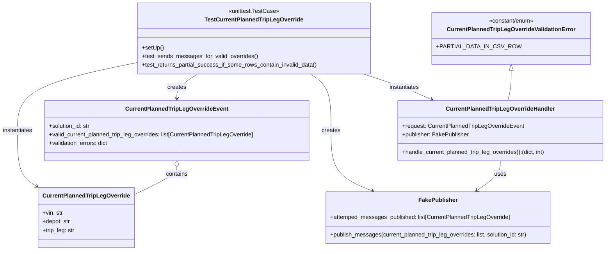
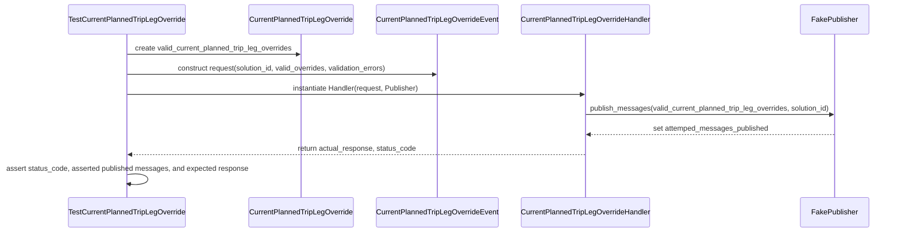

# Diagram: entity_core/entity_service/entity_service_tests/override_current_planned_trip_leg/test_current_planned_trip_leg_override.py

> Auto-generated by Obscura crawlers

## Diagram 1

### SVG

<svg id="container" width="1689.29296875" xmlns="http://www.w3.org/2000/svg" class="classDiagram" height="698" viewBox="0 0 1689.29296875 698" role="graphics-document document" aria-roledescription="class"><g><defs><marker id="container_class-aggregationStart" class="marker aggregation class" refX="18" refY="7" markerWidth="190" markerHeight="240" orient="auto"><path d="M 18,7 L9,13 L1,7 L9,1 Z"></path></marker></defs><defs><marker id="container_class-aggregationEnd" class="marker aggregation class" refX="1" refY="7" markerWidth="20" markerHeight="28" orient="auto"><path d="M 18,7 L9,13 L1,7 L9,1 Z"></path></marker></defs><defs><marker id="container_class-extensionStart" class="marker extension class" refX="18" refY="7" markerWidth="190" markerHeight="240" orient="auto"><path d="M 1,7 L18,13 V 1 Z"></path></marker></defs><defs><marker id="container_class-extensionEnd" class="marker extension class" refX="1" refY="7" markerWidth="20" markerHeight="28" orient="auto"><path d="M 1,1 V 13 L18,7 Z"></path></marker></defs><defs><marker id="container_class-compositionStart" class="marker composition class" refX="18" refY="7" markerWidth="190" markerHeight="240" orient="auto"><path d="M 18,7 L9,13 L1,7 L9,1 Z"></path></marker></defs><defs><marker id="container_class-compositionEnd" class="marker composition class" refX="1" refY="7" markerWidth="20" markerHeight="28" orient="auto"><path d="M 18,7 L9,13 L1,7 L9,1 Z"></path></marker></defs><defs><marker id="container_class-dependencyStart" class="marker dependency class" refX="6" refY="7" markerWidth="190" markerHeight="240" orient="auto"><path d="M 5,7 L9,13 L1,7 L9,1 Z"></path></marker></defs><defs><marker id="container_class-dependencyEnd" class="marker dependency class" refX="13" refY="7" markerWidth="20" markerHeight="28" orient="auto"><path d="M 18,7 L9,13 L14,7 L9,1 Z"></path></marker></defs><defs><marker id="container_class-lollipopStart" class="marker lollipop class" refX="13" refY="7" markerWidth="190" markerHeight="240" orient="auto"><circle stroke="black" fill="transparent" cx="7" cy="7" r="6"></circle></marker></defs><defs><marker id="container_class-lollipopEnd" class="marker lollipop class" refX="1" refY="7" markerWidth="190" markerHeight="240" orient="auto"><circle stroke="black" fill="transparent" cx="7" cy="7" r="6"></circle></marker></defs><g class="root"><g class="clusters"></g><g class="edgePaths"><path d="M558.168,206L548.379,212.167C538.59,218.333,519.012,230.667,509.223,242C499.434,253.333,499.434,263.667,499.434,268.833L499.434,274" id="id_TestCurrentPlannedTripLegOverride_CurrentPlannedTripLegOverrideEvent_1" class="edge-thickness-normal edge-pattern-solid relation" style=";;;" data-edge="true" data-et="edge" data-id="id_TestCurrentPlannedTripLegOverride_CurrentPlannedTripLegOverrideEvent_1" data-points="W3sieCI6NTU4LjE2ODAxMTgzMzYzOTYsInkiOjIwNn0seyJ4Ijo0OTkuNDMzNTkzNzUsInkiOjI0M30seyJ4Ijo0OTkuNDMzNTkzNzUsInkiOjI4MH1d" marker-end="url(#container_class-dependencyEnd)"></path><path d="M391.502,173.284L334.737,184.903C277.973,196.523,164.443,219.761,107.679,251.547C50.914,283.333,50.914,323.667,50.914,364C50.914,404.333,50.914,444.667,60.841,471.064C70.769,497.461,90.624,509.921,100.551,516.151L110.478,522.382" id="id_TestCurrentPlannedTripLegOverride_CurrentPlannedTripLegOverride_2" class="edge-thickness-normal edge-pattern-solid relation" style=";;;" data-edge="true" data-et="edge" data-id="id_TestCurrentPlannedTripLegOverride_CurrentPlannedTripLegOverride_2" data-points="W3sieCI6MzkxLjUwMTk1MzEyNSwieSI6MTczLjI4Mzg5MzM4NDkxNDM0fSx7IngiOjUwLjkxNDA2MjUsInkiOjI0M30seyJ4Ijo1MC45MTQwNjI1LCJ5IjozNjR9LHsieCI6NTAuOTE0MDYyNSwieSI6NDg1fSx7IngiOjExNS41NjA1NDY4NzUsInkiOjUyNS41NzExMjkwMDc3NDk2fV0=" marker-end="url(#container_class-dependencyEnd)"></path><path d="M872.477,206L882.266,212.167C892.055,218.333,911.633,230.667,921.422,257C931.211,283.333,931.211,323.667,931.211,364C931.211,404.333,931.211,444.667,949.702,472.612C968.194,500.558,1005.176,516.116,1023.668,523.895L1042.159,531.673" id="id_TestCurrentPlannedTripLegOverride_FakePublisher_3" class="edge-thickness-normal edge-pattern-solid relation" style=";;;" data-edge="true" data-et="edge" data-id="id_TestCurrentPlannedTripLegOverride_FakePublisher_3" data-points="W3sieCI6ODcyLjQ3NjUxOTQxNjM2MDQsInkiOjIwNn0seyJ4Ijo5MzEuMjEwOTM3NSwieSI6MjQzfSx7IngiOjkzMS4yMTA5Mzc1LCJ5IjozNjR9LHsieCI6OTMxLjIxMDkzNzUsInkiOjQ4NX0seyJ4IjoxMDQ3LjY4OTU0OTk3NDE3MzYsInkiOjUzNH1d" marker-end="url(#container_class-dependencyEnd)"></path><path d="M1022.431,206L1041.561,212.167C1060.69,218.333,1098.95,230.667,1130.231,242.573C1161.512,254.479,1185.815,265.958,1197.966,271.698L1210.118,277.437" id="id_TestCurrentPlannedTripLegOverride_CurrentPlannedTripLegOverrideHandler_4" class="edge-thickness-normal edge-pattern-solid relation" style=";;;" data-edge="true" data-et="edge" data-id="id_TestCurrentPlannedTripLegOverride_CurrentPlannedTripLegOverrideHandler_4" data-points="W3sieCI6MTAyMi40MzA5ODAwMDkxOTEyLCJ5IjoyMDZ9LHsieCI6MTEzNy4yMDg5ODQzNzUsInkiOjI0M30seyJ4IjoxMjE1LjU0MzEzMDE2NTI4OTMsInkiOjI4MH1d" marker-end="url(#container_class-dependencyEnd)"></path><path d="M499.434,465.25L499.434,468.542C499.434,471.833,499.434,478.417,478.174,491.768C456.913,505.12,414.393,525.239,393.133,535.299L371.873,545.359" id="id_CurrentPlannedTripLegOverrideEvent_CurrentPlannedTripLegOverride_5" class="edge-thickness-normal edge-pattern-solid relation" style=";;;" data-edge="true" data-et="edge" data-id="id_CurrentPlannedTripLegOverrideEvent_CurrentPlannedTripLegOverride_5" data-points="W3sieCI6NDk5LjQzMzU5Mzc1LCJ5Ijo0NDh9LHsieCI6NDk5LjQzMzU5Mzc1LCJ5Ijo0ODV9LHsieCI6MzcxLjg3MzA0Njg3NSwieSI6NTQ1LjM1OTA2MjY4Mzc4NTZ9XQ==" marker-start="url(#container_class-aggregationStart)"></path><path d="M1393.383,448L1393.383,454.167C1393.383,460.333,1393.383,472.667,1382.424,486.43C1371.466,500.194,1349.549,515.388,1338.59,522.985L1327.632,530.582" id="id_CurrentPlannedTripLegOverrideHandler_FakePublisher_6" class="edge-thickness-normal edge-pattern-solid relation" style=";;;" data-edge="true" data-et="edge" data-id="id_CurrentPlannedTripLegOverrideHandler_FakePublisher_6" data-points="W3sieCI6MTM5My4zODI4MTI1LCJ5Ijo0NDh9LHsieCI6MTM5My4zODI4MTI1LCJ5Ijo0ODV9LHsieCI6MTMyMi43MDA5MTM2MTA1MzcsInkiOjUzNH1d" marker-end="url(#container_class-dependencyEnd)"></path><path d="M1424.84,196.25L1424.84,204.042C1424.84,211.833,1424.84,227.417,1423.237,241.375C1421.633,255.333,1418.427,267.667,1416.824,273.833L1415.221,280" id="id_CurrentPlannedTripLegOverrideValidationError_CurrentPlannedTripLegOverrideHandler_7" class="edge-thickness-normal edge-pattern-solid relation" style=";;;" data-edge="true" data-et="edge" data-id="id_CurrentPlannedTripLegOverrideValidationError_CurrentPlannedTripLegOverrideHandler_7" data-points="W3sieCI6MTQyNC44Mzk4NDM3NSwieSI6MTc5fSx7IngiOjE0MjQuODM5ODQzNzUsInkiOjI0M30seyJ4IjoxNDE1LjIyMDc1MTU0OTU4NjgsInkiOjI4MH1d" marker-start="url(#container_class-extensionStart)"></path></g><g class="edgeLabels"><g class="edgeLabel" transform="translate(499.43359375, 243)"><g class="label" data-id="id_TestCurrentPlannedTripLegOverride_CurrentPlannedTripLegOverrideEvent_1" transform="translate(-26.171875, -12)"><foreignObject width="52.34375" height="24">

creates

</foreignObject></g></g><g class="edgeLabel" transform="translate(50.9140625, 364)"><g class="label" data-id="id_TestCurrentPlannedTripLegOverride_CurrentPlannedTripLegOverride_2" transform="translate(-42.9140625, -12)"><foreignObject width="85.828125" height="24">

instantiates

</foreignObject></g></g><g class="edgeLabel" transform="translate(931.2109375, 364)"><g class="label" data-id="id_TestCurrentPlannedTripLegOverride_FakePublisher_3" transform="translate(-26.171875, -12)"><foreignObject width="52.34375" height="24">

creates

</foreignObject></g></g><g class="edgeLabel" transform="translate(1137.208984375, 243)"><g class="label" data-id="id_TestCurrentPlannedTripLegOverride_CurrentPlannedTripLegOverrideHandler_4" transform="translate(-42.9140625, -12)"><foreignObject width="85.828125" height="24">

instantiates

</foreignObject></g></g><g class="edgeLabel" transform="translate(499.43359375, 485)"><g class="label" data-id="id_CurrentPlannedTripLegOverrideEvent_CurrentPlannedTripLegOverride_5" transform="translate(-30.890625, -12)"><foreignObject width="61.78125" height="24">

contains

</foreignObject></g></g><g class="edgeLabel" transform="translate(1393.3828125, 485)"><g class="label" data-id="id_CurrentPlannedTripLegOverrideHandler_FakePublisher_6" transform="translate(-16.4921875, -12)"><foreignObject width="32.984375" height="24">

uses

</foreignObject></g></g><g class="edgeLabel"><g class="label" data-id="id_CurrentPlannedTripLegOverrideValidationError_CurrentPlannedTripLegOverrideHandler_7" transform="translate(0, 0)"><foreignObject width="0" height="0">

</foreignObject></g></g></g><g class="nodes"><g class="node default" id="classId-TestCurrentPlannedTripLegOverride-0" transform="translate(715.322265625, 107)"><g class="basic label-container"><path d="M-323.8203125 -99 L323.8203125 -99 L323.8203125 99 L-323.8203125 99" stroke="none" stroke-width="0" fill="#ECECFF" style=""></path><path d="M-323.8203125 -99 C-141.3496440213406 -99, 41.12102445731881 -99, 323.8203125 -99 M-323.8203125 -99 C-110.53913193353017 -99, 102.74204863293966 -99, 323.8203125 -99 M323.8203125 -99 C323.8203125 -52.319190698258396, 323.8203125 -5.638381396516792, 323.8203125 99 M323.8203125 -99 C323.8203125 -25.862865150559884, 323.8203125 47.27426969888023, 323.8203125 99 M323.8203125 99 C169.14898952598915 99, 14.477666551978302 99, -323.8203125 99 M323.8203125 99 C191.52855930101938 99, 59.23680610203877 99, -323.8203125 99 M-323.8203125 99 C-323.8203125 39.028876493163885, -323.8203125 -20.94224701367223, -323.8203125 -99 M-323.8203125 99 C-323.8203125 46.257519242018084, -323.8203125 -6.484961515963832, -323.8203125 -99" stroke="#9370DB" stroke-width="1.3" fill="none" stroke-dasharray="0 0" style=""></path></g><g class="annotation-group text" transform="translate(-70.1328125, -75)"><g class="label" style="" transform="translate(0,-12)"><foreignObject width="140.265625" height="24">

«unittest.TestCase»

</foreignObject></g></g><g class="label-group text" transform="translate(-131.40625, -51)"><g class="label" style="font-weight: bolder" transform="translate(0,-12)"><foreignObject width="262.8125" height="24">

TestCurrentPlannedTripLegOverride

</foreignObject></g></g><g class="members-group text" transform="translate(-311.8203125, -3)"></g><g class="methods-group text" transform="translate(-311.8203125, 27)"><g class="label" style="" transform="translate(0,-12)"><foreignObject width="60.421875" height="24">

+setUp()

</foreignObject></g><g class="label" style="" transform="translate(0,12)"><foreignObject width="320.890625" height="24">

+test_sends_messages_for_valid_overrides()

</foreignObject></g><g class="label" style="" transform="translate(0,36)"><foreignObject width="492.234375" height="24">

+test_returns_partial_success_if_some_rows_contain_invalid_data()

</foreignObject></g></g><g class="divider" style=""><path d="M-323.8203125 -27 C-90.7514522030771 -27, 142.3174080938458 -27, 323.8203125 -27 M-323.8203125 -27 C-103.03709913963101 -27, 117.74611422073798 -27, 323.8203125 -27" stroke="#9370DB" stroke-width="1.3" fill="none" stroke-dasharray="0 0" style=""></path></g><g class="divider" style=""><path d="M-323.8203125 -3 C-147.97982955519407 -3, 27.860653389611855 -3, 323.8203125 -3 M-323.8203125 -3 C-98.21110915915781 -3, 127.39809418168437 -3, 323.8203125 -3" stroke="#9370DB" stroke-width="1.3" fill="none" stroke-dasharray="0 0" style=""></path></g></g><g class="node default" id="classId-CurrentPlannedTripLegOverride-1" transform="translate(243.716796875, 606)"><g class="basic label-container"><path d="M-128.15625 -84 L128.15625 -84 L128.15625 84 L-128.15625 84" stroke="none" stroke-width="0" fill="#ECECFF" style=""></path><path d="M-128.15625 -84 C-55.0063471603234 -84, 18.1435556793532 -84, 128.15625 -84 M-128.15625 -84 C-76.52825489375138 -84, -24.900259787502748 -84, 128.15625 -84 M128.15625 -84 C128.15625 -24.53609579433055, 128.15625 34.9278084113389, 128.15625 84 M128.15625 -84 C128.15625 -18.94753046350303, 128.15625 46.10493907299394, 128.15625 84 M128.15625 84 C69.70348794181844 84, 11.250725883636875 84, -128.15625 84 M128.15625 84 C69.84400830151912 84, 11.531766603038236 84, -128.15625 84 M-128.15625 84 C-128.15625 18.255527629027867, -128.15625 -47.488944741944266, -128.15625 -84 M-128.15625 84 C-128.15625 17.637347748419998, -128.15625 -48.725304503160004, -128.15625 -84" stroke="#9370DB" stroke-width="1.3" fill="none" stroke-dasharray="0 0" style=""></path></g><g class="annotation-group text" transform="translate(0, -60)"></g><g class="label-group text" transform="translate(-116.15625, -60)"><g class="label" style="font-weight: bolder" transform="translate(0,-12)"><foreignObject width="232.3125" height="24">

CurrentPlannedTripLegOverride

</foreignObject></g></g><g class="members-group text" transform="translate(-116.15625, -12)"><g class="label" style="" transform="translate(0,-12)"><foreignObject width="57.09375" height="24">

+vin: str

</foreignObject></g><g class="label" style="" transform="translate(0,12)"><foreignObject width="78.46875" height="24">

+depot: str

</foreignObject></g><g class="label" style="" transform="translate(0,36)"><foreignObject width="90.875" height="24">

+trip_leg: str

</foreignObject></g></g><g class="methods-group text" transform="translate(-116.15625, 84)"></g><g class="divider" style=""><path d="M-128.15625 -36 C-28.267497045198155 -36, 71.62125590960369 -36, 128.15625 -36 M-128.15625 -36 C-48.88896117382323 -36, 30.378327652353533 -36, 128.15625 -36" stroke="#9370DB" stroke-width="1.3" fill="none" stroke-dasharray="0 0" style=""></path></g><g class="divider" style=""><path d="M-128.15625 60 C-72.58040034011202 60, -17.00455068022403 60, 128.15625 60 M-128.15625 60 C-37.858951097292405 60, 52.43834780541519 60, 128.15625 60" stroke="#9370DB" stroke-width="1.3" fill="none" stroke-dasharray="0 0" style=""></path></g></g><g class="node default" id="classId-CurrentPlannedTripLegOverrideEvent-2" transform="translate(499.43359375, 364)"><g class="basic label-container"><path d="M-370.60546875 -84 L370.60546875 -84 L370.60546875 84 L-370.60546875 84" stroke="none" stroke-width="0" fill="#ECECFF" style=""></path><path d="M-370.60546875 -84 C-126.20166592705993 -84, 118.20213689588013 -84, 370.60546875 -84 M-370.60546875 -84 C-177.0570505071759 -84, 16.491367735648225 -84, 370.60546875 -84 M370.60546875 -84 C370.60546875 -27.660624645707287, 370.60546875 28.678750708585426, 370.60546875 84 M370.60546875 -84 C370.60546875 -32.16710755685481, 370.60546875 19.665784886290382, 370.60546875 84 M370.60546875 84 C190.48595077356057 84, 10.36643279712115 84, -370.60546875 84 M370.60546875 84 C217.13837006159963 84, 63.67127137319926 84, -370.60546875 84 M-370.60546875 84 C-370.60546875 45.47354410724884, -370.60546875 6.947088214497683, -370.60546875 -84 M-370.60546875 84 C-370.60546875 26.246420375824016, -370.60546875 -31.507159248351968, -370.60546875 -84" stroke="#9370DB" stroke-width="1.3" fill="none" stroke-dasharray="0 0" style=""></path></g><g class="annotation-group text" transform="translate(0, -60)"></g><g class="label-group text" transform="translate(-136.3671875, -60)"><g class="label" style="font-weight: bolder" transform="translate(0,-12)"><foreignObject width="272.734375" height="24">

CurrentPlannedTripLegOverrideEvent

</foreignObject></g></g><g class="members-group text" transform="translate(-358.60546875, -12)"><g class="label" style="" transform="translate(0,-12)"><foreignObject width="117.71875" height="24">

+solution_id: str

</foreignObject></g><g class="label" style="" transform="translate(0,12)"><foreignObject width="580.84375" height="24">

+valid_current_planned_trip_leg_overrides: list[CurrentPlannedTripLegOverride]

</foreignObject></g><g class="label" style="" transform="translate(0,36)"><foreignObject width="167.40625" height="24">

+validation_errors: dict

</foreignObject></g></g><g class="methods-group text" transform="translate(-358.60546875, 84)"></g><g class="divider" style=""><path d="M-370.60546875 -36 C-80.50792461588787 -36, 209.58961951822425 -36, 370.60546875 -36 M-370.60546875 -36 C-198.60628607555077 -36, -26.60710340110154 -36, 370.60546875 -36" stroke="#9370DB" stroke-width="1.3" fill="none" stroke-dasharray="0 0" style=""></path></g><g class="divider" style=""><path d="M-370.60546875 60 C-179.52409405012233 60, 11.557280649755342 60, 370.60546875 60 M-370.60546875 60 C-217.1810194308333 60, -63.756570111666576 60, 370.60546875 60" stroke="#9370DB" stroke-width="1.3" fill="none" stroke-dasharray="0 0" style=""></path></g></g><g class="node default" id="classId-CurrentPlannedTripLegOverrideHandler-3" transform="translate(1393.3828125, 364)"><g class="basic label-container"><path d="M-287.91015625 -84 L287.91015625 -84 L287.91015625 84 L-287.91015625 84" stroke="none" stroke-width="0" fill="#ECECFF" style=""></path><path d="M-287.91015625 -84 C-104.13534978717536 -84, 79.63945667564928 -84, 287.91015625 -84 M-287.91015625 -84 C-137.91530653484037 -84, 12.079543180319263 -84, 287.91015625 -84 M287.91015625 -84 C287.91015625 -26.585297951541442, 287.91015625 30.829404096917116, 287.91015625 84 M287.91015625 -84 C287.91015625 -44.725130285356315, 287.91015625 -5.450260570712629, 287.91015625 84 M287.91015625 84 C141.33660113558008 84, -5.236953978839836 84, -287.91015625 84 M287.91015625 84 C170.20115274834683 84, 52.49214924669366 84, -287.91015625 84 M-287.91015625 84 C-287.91015625 40.12765284991881, -287.91015625 -3.7446943001623794, -287.91015625 -84 M-287.91015625 84 C-287.91015625 19.560281150811676, -287.91015625 -44.87943769837665, -287.91015625 -84" stroke="#9370DB" stroke-width="1.3" fill="none" stroke-dasharray="0 0" style=""></path></g><g class="annotation-group text" transform="translate(0, -60)"></g><g class="label-group text" transform="translate(-145.2421875, -60)"><g class="label" style="font-weight: bolder" transform="translate(0,-12)"><foreignObject width="290.484375" height="24">

CurrentPlannedTripLegOverrideHandler

</foreignObject></g></g><g class="members-group text" transform="translate(-275.91015625, -12)"><g class="label" style="" transform="translate(0,-12)"><foreignObject width="339.890625" height="24">

+request: CurrentPlannedTripLegOverrideEvent

</foreignObject></g><g class="label" style="" transform="translate(0,12)"><foreignObject width="186.484375" height="24">

+publisher: FakePublisher

</foreignObject></g></g><g class="methods-group text" transform="translate(-275.91015625, 60)"><g class="label" style="" transform="translate(0,-12)"><foreignObject width="406.578125" height="24">

+handle_current_planned_trip_leg_overrides():(dict, int)

</foreignObject></g></g><g class="divider" style=""><path d="M-287.91015625 -36 C-59.16277219153008 -36, 169.58461186693984 -36, 287.91015625 -36 M-287.91015625 -36 C-77.99210479906043 -36, 131.92594665187914 -36, 287.91015625 -36" stroke="#9370DB" stroke-width="1.3" fill="none" stroke-dasharray="0 0" style=""></path></g><g class="divider" style=""><path d="M-287.91015625 36 C-112.06813941407114 36, 63.77387742185772 36, 287.91015625 36 M-287.91015625 36 C-137.15781599277824 36, 13.594524264443521 36, 287.91015625 36" stroke="#9370DB" stroke-width="1.3" fill="none" stroke-dasharray="0 0" style=""></path></g></g><g class="node default" id="classId-CurrentPlannedTripLegOverrideValidationError-4" transform="translate(1424.83984375, 107)"><g class="basic label-container"><path d="M-201.44140625 -72 L201.44140625 -72 L201.44140625 72 L-201.44140625 72" stroke="none" stroke-width="0" fill="#ECECFF" style=""></path><path d="M-201.44140625 -72 C-42.03219219947758 -72, 117.37702185104484 -72, 201.44140625 -72 M-201.44140625 -72 C-55.12802865193237 -72, 91.18534894613526 -72, 201.44140625 -72 M201.44140625 -72 C201.44140625 -30.95935378614835, 201.44140625 10.081292427703303, 201.44140625 72 M201.44140625 -72 C201.44140625 -28.561531546671695, 201.44140625 14.87693690665661, 201.44140625 72 M201.44140625 72 C83.50001719518794 72, -34.44137185962413 72, -201.44140625 72 M201.44140625 72 C79.33057851799103 72, -42.78024921401794 72, -201.44140625 72 M-201.44140625 72 C-201.44140625 24.96903047167566, -201.44140625 -22.061939056648683, -201.44140625 -72 M-201.44140625 72 C-201.44140625 18.68129459241436, -201.44140625 -34.63741081517128, -201.44140625 -72" stroke="#9370DB" stroke-width="1.3" fill="none" stroke-dasharray="0 0" style=""></path></g><g class="annotation-group text" transform="translate(-64.8125, -48)"><g class="label" style="" transform="translate(0,-12)"><foreignObject width="129.625" height="24">

«constant/enum»

</foreignObject></g></g><g class="label-group text" transform="translate(-171.3359375, -24)"><g class="label" style="font-weight: bolder" transform="translate(0,-12)"><foreignObject width="342.671875" height="24">

CurrentPlannedTripLegOverrideValidationError

</foreignObject></g></g><g class="members-group text" transform="translate(-189.44140625, 24)"><g class="label" style="" transform="translate(0,-12)"><foreignObject width="207.546875" height="24">

+PARTIAL_DATA_IN_CSV_ROW

</foreignObject></g></g><g class="methods-group text" transform="translate(-189.44140625, 72)"></g><g class="divider" style=""><path d="M-201.44140625 0 C-93.10177791402481 0, 15.237850421950384 0, 201.44140625 0 M-201.44140625 0 C-98.73271898385224 0, 3.9759682822955256 0, 201.44140625 0" stroke="#9370DB" stroke-width="1.3" fill="none" stroke-dasharray="0 0" style=""></path></g><g class="divider" style=""><path d="M-201.44140625 48 C-56.647706512737614 48, 88.14599322452477 48, 201.44140625 48 M-201.44140625 48 C-84.76187076725064 48, 31.917664715498717 48, 201.44140625 48" stroke="#9370DB" stroke-width="1.3" fill="none" stroke-dasharray="0 0" style=""></path></g></g><g class="node default" id="classId-FakePublisher-5" transform="translate(1218.841796875, 606)"><g class="basic label-container"><path d="M-317.59765625 -72 L317.59765625 -72 L317.59765625 72 L-317.59765625 72" stroke="none" stroke-width="0" fill="#ECECFF" style=""></path><path d="M-317.59765625 -72 C-63.72216901371553 -72, 190.15331822256894 -72, 317.59765625 -72 M-317.59765625 -72 C-109.74665405737434 -72, 98.10434813525131 -72, 317.59765625 -72 M317.59765625 -72 C317.59765625 -27.08760152248226, 317.59765625 17.82479695503548, 317.59765625 72 M317.59765625 -72 C317.59765625 -24.454481068834347, 317.59765625 23.091037862331305, 317.59765625 72 M317.59765625 72 C153.32503210818132 72, -10.947592033637363 72, -317.59765625 72 M317.59765625 72 C166.10130704292726 72, 14.60495783585452 72, -317.59765625 72 M-317.59765625 72 C-317.59765625 38.44406788099056, -317.59765625 4.888135761981118, -317.59765625 -72 M-317.59765625 72 C-317.59765625 26.631303927746465, -317.59765625 -18.73739214450707, -317.59765625 -72" stroke="#9370DB" stroke-width="1.3" fill="none" stroke-dasharray="0 0" style=""></path></g><g class="annotation-group text" transform="translate(0, -48)"></g><g class="label-group text" transform="translate(-51.2109375, -48)"><g class="label" style="font-weight: bolder" transform="translate(0,-12)"><foreignObject width="102.421875" height="24">

FakePublisher

</foreignObject></g></g><g class="members-group text" transform="translate(-305.59765625, 0)"><g class="label" style="" transform="translate(0,-12)"><foreignObject width="506.234375" height="24">

+attemped_messages_published: list[CurrentPlannedTripLegOverride]

</foreignObject></g></g><g class="methods-group text" transform="translate(-305.59765625, 48)"><g class="label" style="" transform="translate(0,-12)"><foreignObject width="559.984375" height="24">

+publish_messages(current_planned_trip_leg_overrides: list, solution_id: str)

</foreignObject></g></g><g class="divider" style=""><path d="M-317.59765625 -24 C-94.70592225962261 -24, 128.18581173075478 -24, 317.59765625 -24 M-317.59765625 -24 C-156.78112012108534 -24, 4.035416007829326 -24, 317.59765625 -24" stroke="#9370DB" stroke-width="1.3" fill="none" stroke-dasharray="0 0" style=""></path></g><g class="divider" style=""><path d="M-317.59765625 24 C-74.86980516526305 24, 167.8580459194739 24, 317.59765625 24 M-317.59765625 24 C-162.92622461706895 24, -8.254792984137907 24, 317.59765625 24" stroke="#9370DB" stroke-width="1.3" fill="none" stroke-dasharray="0 0" style=""></path></g></g></g></g></g></svg>

## Diagram 2

### SVG

<svg id="container" width="2137.5" xmlns="http://www.w3.org/2000/svg" height="537" viewBox="-176.5 -10 2137.5 537" role="graphics-document document" aria-roledescription="sequence"><g><rect x="1761" y="451" fill="#eaeaea" stroke="#666" width="150" height="65" name="Publisher" rx="3" ry="3" class="actor actor-bottom"></rect><text x="1836" y="483.5" dominant-baseline="central" alignment-baseline="central" class="actor actor-box" style="text-anchor: middle; font-size: 16px; font-weight: 400;"><tspan x="1836" dy="0">FakePublisher</tspan></text></g><g><rect x="1075.5" y="451" fill="#eaeaea" stroke="#666" width="307" height="65" name="Handler" rx="3" ry="3" class="actor actor-bottom"></rect><text x="1229" y="483.5" dominant-baseline="central" alignment-baseline="central" class="actor actor-box" style="text-anchor: middle; font-size: 16px; font-weight: 400;"><tspan x="1229" dy="0">CurrentPlannedTripLegOverrideHandler</tspan></text></g><g><rect x="736.5" y="451" fill="#eaeaea" stroke="#666" width="289" height="65" name="Event" rx="3" ry="3" class="actor actor-bottom"></rect><text x="881" y="483.5" dominant-baseline="central" alignment-baseline="central" class="actor actor-box" style="text-anchor: middle; font-size: 16px; font-weight: 400;"><tspan x="881" dy="0">CurrentPlannedTripLegOverrideEvent</tspan></text></g><g><rect x="437.5" y="451" fill="#eaeaea" stroke="#666" width="249" height="65" name="Model" rx="3" ry="3" class="actor actor-bottom"></rect><text x="562" y="483.5" dominant-baseline="central" alignment-baseline="central" class="actor actor-box" style="text-anchor: middle; font-size: 16px; font-weight: 400;"><tspan x="562" dy="0">CurrentPlannedTripLegOverride</tspan></text></g><g><rect x="0" y="451" fill="#eaeaea" stroke="#666" width="278" height="65" name="Test" rx="3" ry="3" class="actor actor-bottom"></rect><text x="139" y="483.5" dominant-baseline="central" alignment-baseline="central" class="actor actor-box" style="text-anchor: middle; font-size: 16px; font-weight: 400;"><tspan x="139" dy="0">TestCurrentPlannedTripLegOverride</tspan></text></g><g><line id="actor4" x1="1836" y1="65" x2="1836" y2="451" class="actor-line 200" stroke-width="0.5px" stroke="#999" name="Publisher"></line><g id="root-4"><rect x="1761" y="0" fill="#eaeaea" stroke="#666" width="150" height="65" name="Publisher" rx="3" ry="3" class="actor actor-top"></rect><text x="1836" y="32.5" dominant-baseline="central" alignment-baseline="central" class="actor actor-box" style="text-anchor: middle; font-size: 16px; font-weight: 400;"><tspan x="1836" dy="0">FakePublisher</tspan></text></g></g><g><line id="actor3" x1="1229" y1="65" x2="1229" y2="451" class="actor-line 200" stroke-width="0.5px" stroke="#999" name="Handler"></line><g id="root-3"><rect x="1075.5" y="0" fill="#eaeaea" stroke="#666" width="307" height="65" name="Handler" rx="3" ry="3" class="actor actor-top"></rect><text x="1229" y="32.5" dominant-baseline="central" alignment-baseline="central" class="actor actor-box" style="text-anchor: middle; font-size: 16px; font-weight: 400;"><tspan x="1229" dy="0">CurrentPlannedTripLegOverrideHandler</tspan></text></g></g><g><line id="actor2" x1="881" y1="65" x2="881" y2="451" class="actor-line 200" stroke-width="0.5px" stroke="#999" name="Event"></line><g id="root-2"><rect x="736.5" y="0" fill="#eaeaea" stroke="#666" width="289" height="65" name="Event" rx="3" ry="3" class="actor actor-top"></rect><text x="881" y="32.5" dominant-baseline="central" alignment-baseline="central" class="actor actor-box" style="text-anchor: middle; font-size: 16px; font-weight: 400;"><tspan x="881" dy="0">CurrentPlannedTripLegOverrideEvent</tspan></text></g></g><g><line id="actor1" x1="562" y1="65" x2="562" y2="451" class="actor-line 200" stroke-width="0.5px" stroke="#999" name="Model"></line><g id="root-1"><rect x="437.5" y="0" fill="#eaeaea" stroke="#666" width="249" height="65" name="Model" rx="3" ry="3" class="actor actor-top"></rect><text x="562" y="32.5" dominant-baseline="central" alignment-baseline="central" class="actor actor-box" style="text-anchor: middle; font-size: 16px; font-weight: 400;"><tspan x="562" dy="0">CurrentPlannedTripLegOverride</tspan></text></g></g><g><line id="actor0" x1="139" y1="65" x2="139" y2="451" class="actor-line 200" stroke-width="0.5px" stroke="#999" name="Test"></line><g id="root-0"><rect x="0" y="0" fill="#eaeaea" stroke="#666" width="278" height="65" name="Test" rx="3" ry="3" class="actor actor-top"></rect><text x="139" y="32.5" dominant-baseline="central" alignment-baseline="central" class="actor actor-box" style="text-anchor: middle; font-size: 16px; font-weight: 400;"><tspan x="139" dy="0">TestCurrentPlannedTripLegOverride</tspan></text></g></g><g></g><defs><symbol id="computer" width="24" height="24"><path transform="scale(.5)" d="M2 2v13h20v-13h-20zm18 11h-16v-9h16v9zm-10.228 6l.466-1h3.524l.467 1h-4.457zm14.228 3h-24l2-6h2.104l-1.33 4h18.45l-1.297-4h2.073l2 6zm-5-10h-14v-7h14v7z"></path></symbol></defs><defs><symbol id="database" fill-rule="evenodd" clip-rule="evenodd"><path transform="scale(.5)" d="M12.258.001l.256.004.255.005.253.008.251.01.249.012.247.015.246.016.242.019.241.02.239.023.236.024.233.027.231.028.229.031.225.032.223.034.22.036.217.038.214.04.211.041.208.043.205.045.201.046.198.048.194.05.191.051.187.053.183.054.18.056.175.057.172.059.168.06.163.061.16.063.155.064.15.066.074.033.073.033.071.034.07.034.069.035.068.035.067.035.066.035.064.036.064.036.062.036.06.036.06.037.058.037.058.037.055.038.055.038.053.038.052.038.051.039.05.039.048.039.047.039.045.04.044.04.043.04.041.04.04.041.039.041.037.041.036.041.034.041.033.042.032.042.03.042.029.042.027.042.026.043.024.043.023.043.021.043.02.043.018.044.017.043.015.044.013.044.012.044.011.045.009.044.007.045.006.045.004.045.002.045.001.045v17l-.001.045-.002.045-.004.045-.006.045-.007.045-.009.044-.011.045-.012.044-.013.044-.015.044-.017.043-.018.044-.02.043-.021.043-.023.043-.024.043-.026.043-.027.042-.029.042-.03.042-.032.042-.033.042-.034.041-.036.041-.037.041-.039.041-.04.041-.041.04-.043.04-.044.04-.045.04-.047.039-.048.039-.05.039-.051.039-.052.038-.053.038-.055.038-.055.038-.058.037-.058.037-.06.037-.06.036-.062.036-.064.036-.064.036-.066.035-.067.035-.068.035-.069.035-.07.034-.071.034-.073.033-.074.033-.15.066-.155.064-.16.063-.163.061-.168.06-.172.059-.175.057-.18.056-.183.054-.187.053-.191.051-.194.05-.198.048-.201.046-.205.045-.208.043-.211.041-.214.04-.217.038-.22.036-.223.034-.225.032-.229.031-.231.028-.233.027-.236.024-.239.023-.241.02-.242.019-.246.016-.247.015-.249.012-.251.01-.253.008-.255.005-.256.004-.258.001-.258-.001-.256-.004-.255-.005-.253-.008-.251-.01-.249-.012-.247-.015-.245-.016-.243-.019-.241-.02-.238-.023-.236-.024-.234-.027-.231-.028-.228-.031-.226-.032-.223-.034-.22-.036-.217-.038-.214-.04-.211-.041-.208-.043-.204-.045-.201-.046-.198-.048-.195-.05-.19-.051-.187-.053-.184-.054-.179-.056-.176-.057-.172-.059-.167-.06-.164-.061-.159-.063-.155-.064-.151-.066-.074-.033-.072-.033-.072-.034-.07-.034-.069-.035-.068-.035-.067-.035-.066-.035-.064-.036-.063-.036-.062-.036-.061-.036-.06-.037-.058-.037-.057-.037-.056-.038-.055-.038-.053-.038-.052-.038-.051-.039-.049-.039-.049-.039-.046-.039-.046-.04-.044-.04-.043-.04-.041-.04-.04-.041-.039-.041-.037-.041-.036-.041-.034-.041-.033-.042-.032-.042-.03-.042-.029-.042-.027-.042-.026-.043-.024-.043-.023-.043-.021-.043-.02-.043-.018-.044-.017-.043-.015-.044-.013-.044-.012-.044-.011-.045-.009-.044-.007-.045-.006-.045-.004-.045-.002-.045-.001-.045v-17l.001-.045.002-.045.004-.045.006-.045.007-.045.009-.044.011-.045.012-.044.013-.044.015-.044.017-.043.018-.044.02-.043.021-.043.023-.043.024-.043.026-.043.027-.042.029-.042.03-.042.032-.042.033-.042.034-.041.036-.041.037-.041.039-.041.04-.041.041-.04.043-.04.044-.04.046-.04.046-.039.049-.039.049-.039.051-.039.052-.038.053-.038.055-.038.056-.038.057-.037.058-.037.06-.037.061-.036.062-.036.063-.036.064-.036.066-.035.067-.035.068-.035.069-.035.07-.034.072-.034.072-.033.074-.033.151-.066.155-.064.159-.063.164-.061.167-.06.172-.059.176-.057.179-.056.184-.054.187-.053.19-.051.195-.05.198-.048.201-.046.204-.045.208-.043.211-.041.214-.04.217-.038.22-.036.223-.034.226-.032.228-.031.231-.028.234-.027.236-.024.238-.023.241-.02.243-.019.245-.016.247-.015.249-.012.251-.01.253-.008.255-.005.256-.004.258-.001.258.001zm-9.258 20.499v.01l.001.021.003.021.004.022.005.021.006.022.007.022.009.023.01.022.011.023.012.023.013.023.015.023.016.024.017.023.018.024.019.024.021.024.022.025.023.024.024.025.052.049.056.05.061.051.066.051.07.051.075.051.079.052.084.052.088.052.092.052.097.052.102.051.105.052.11.052.114.051.119.051.123.051.127.05.131.05.135.05.139.048.144.049.147.047.152.047.155.047.16.045.163.045.167.043.171.043.176.041.178.041.183.039.187.039.19.037.194.035.197.035.202.033.204.031.209.03.212.029.216.027.219.025.222.024.226.021.23.02.233.018.236.016.24.015.243.012.246.01.249.008.253.005.256.004.259.001.26-.001.257-.004.254-.005.25-.008.247-.011.244-.012.241-.014.237-.016.233-.018.231-.021.226-.021.224-.024.22-.026.216-.027.212-.028.21-.031.205-.031.202-.034.198-.034.194-.036.191-.037.187-.039.183-.04.179-.04.175-.042.172-.043.168-.044.163-.045.16-.046.155-.046.152-.047.148-.048.143-.049.139-.049.136-.05.131-.05.126-.05.123-.051.118-.052.114-.051.11-.052.106-.052.101-.052.096-.052.092-.052.088-.053.083-.051.079-.052.074-.052.07-.051.065-.051.06-.051.056-.05.051-.05.023-.024.023-.025.021-.024.02-.024.019-.024.018-.024.017-.024.015-.023.014-.024.013-.023.012-.023.01-.023.01-.022.008-.022.006-.022.006-.022.004-.022.004-.021.001-.021.001-.021v-4.127l-.077.055-.08.053-.083.054-.085.053-.087.052-.09.052-.093.051-.095.05-.097.05-.1.049-.102.049-.105.048-.106.047-.109.047-.111.046-.114.045-.115.045-.118.044-.12.043-.122.042-.124.042-.126.041-.128.04-.13.04-.132.038-.134.038-.135.037-.138.037-.139.035-.142.035-.143.034-.144.033-.147.032-.148.031-.15.03-.151.03-.153.029-.154.027-.156.027-.158.026-.159.025-.161.024-.162.023-.163.022-.165.021-.166.02-.167.019-.169.018-.169.017-.171.016-.173.015-.173.014-.175.013-.175.012-.177.011-.178.01-.179.008-.179.008-.181.006-.182.005-.182.004-.184.003-.184.002h-.37l-.184-.002-.184-.003-.182-.004-.182-.005-.181-.006-.179-.008-.179-.008-.178-.01-.176-.011-.176-.012-.175-.013-.173-.014-.172-.015-.171-.016-.17-.017-.169-.018-.167-.019-.166-.02-.165-.021-.163-.022-.162-.023-.161-.024-.159-.025-.157-.026-.156-.027-.155-.027-.153-.029-.151-.03-.15-.03-.148-.031-.146-.032-.145-.033-.143-.034-.141-.035-.14-.035-.137-.037-.136-.037-.134-.038-.132-.038-.13-.04-.128-.04-.126-.041-.124-.042-.122-.042-.12-.044-.117-.043-.116-.045-.113-.045-.112-.046-.109-.047-.106-.047-.105-.048-.102-.049-.1-.049-.097-.05-.095-.05-.093-.052-.09-.051-.087-.052-.085-.053-.083-.054-.08-.054-.077-.054v4.127zm0-5.654v.011l.001.021.003.021.004.021.005.022.006.022.007.022.009.022.01.022.011.023.012.023.013.023.015.024.016.023.017.024.018.024.019.024.021.024.022.024.023.025.024.024.052.05.056.05.061.05.066.051.07.051.075.052.079.051.084.052.088.052.092.052.097.052.102.052.105.052.11.051.114.051.119.052.123.05.127.051.131.05.135.049.139.049.144.048.147.048.152.047.155.046.16.045.163.045.167.044.171.042.176.042.178.04.183.04.187.038.19.037.194.036.197.034.202.033.204.032.209.03.212.028.216.027.219.025.222.024.226.022.23.02.233.018.236.016.24.014.243.012.246.01.249.008.253.006.256.003.259.001.26-.001.257-.003.254-.006.25-.008.247-.01.244-.012.241-.015.237-.016.233-.018.231-.02.226-.022.224-.024.22-.025.216-.027.212-.029.21-.03.205-.032.202-.033.198-.035.194-.036.191-.037.187-.039.183-.039.179-.041.175-.042.172-.043.168-.044.163-.045.16-.045.155-.047.152-.047.148-.048.143-.048.139-.05.136-.049.131-.05.126-.051.123-.051.118-.051.114-.052.11-.052.106-.052.101-.052.096-.052.092-.052.088-.052.083-.052.079-.052.074-.051.07-.052.065-.051.06-.05.056-.051.051-.049.023-.025.023-.024.021-.025.02-.024.019-.024.018-.024.017-.024.015-.023.014-.023.013-.024.012-.022.01-.023.01-.023.008-.022.006-.022.006-.022.004-.021.004-.022.001-.021.001-.021v-4.139l-.077.054-.08.054-.083.054-.085.052-.087.053-.09.051-.093.051-.095.051-.097.05-.1.049-.102.049-.105.048-.106.047-.109.047-.111.046-.114.045-.115.044-.118.044-.12.044-.122.042-.124.042-.126.041-.128.04-.13.039-.132.039-.134.038-.135.037-.138.036-.139.036-.142.035-.143.033-.144.033-.147.033-.148.031-.15.03-.151.03-.153.028-.154.028-.156.027-.158.026-.159.025-.161.024-.162.023-.163.022-.165.021-.166.02-.167.019-.169.018-.169.017-.171.016-.173.015-.173.014-.175.013-.175.012-.177.011-.178.009-.179.009-.179.007-.181.007-.182.005-.182.004-.184.003-.184.002h-.37l-.184-.002-.184-.003-.182-.004-.182-.005-.181-.007-.179-.007-.179-.009-.178-.009-.176-.011-.176-.012-.175-.013-.173-.014-.172-.015-.171-.016-.17-.017-.169-.018-.167-.019-.166-.02-.165-.021-.163-.022-.162-.023-.161-.024-.159-.025-.157-.026-.156-.027-.155-.028-.153-.028-.151-.03-.15-.03-.148-.031-.146-.033-.145-.033-.143-.033-.141-.035-.14-.036-.137-.036-.136-.037-.134-.038-.132-.039-.13-.039-.128-.04-.126-.041-.124-.042-.122-.043-.12-.043-.117-.044-.116-.044-.113-.046-.112-.046-.109-.046-.106-.047-.105-.048-.102-.049-.1-.049-.097-.05-.095-.051-.093-.051-.09-.051-.087-.053-.085-.052-.083-.054-.08-.054-.077-.054v4.139zm0-5.666v.011l.001.02.003.022.004.021.005.022.006.021.007.022.009.023.01.022.011.023.012.023.013.023.015.023.016.024.017.024.018.023.019.024.021.025.022.024.023.024.024.025.052.05.056.05.061.05.066.051.07.051.075.052.079.051.084.052.088.052.092.052.097.052.102.052.105.051.11.052.114.051.119.051.123.051.127.05.131.05.135.05.139.049.144.048.147.048.152.047.155.046.16.045.163.045.167.043.171.043.176.042.178.04.183.04.187.038.19.037.194.036.197.034.202.033.204.032.209.03.212.028.216.027.219.025.222.024.226.021.23.02.233.018.236.017.24.014.243.012.246.01.249.008.253.006.256.003.259.001.26-.001.257-.003.254-.006.25-.008.247-.01.244-.013.241-.014.237-.016.233-.018.231-.02.226-.022.224-.024.22-.025.216-.027.212-.029.21-.03.205-.032.202-.033.198-.035.194-.036.191-.037.187-.039.183-.039.179-.041.175-.042.172-.043.168-.044.163-.045.16-.045.155-.047.152-.047.148-.048.143-.049.139-.049.136-.049.131-.051.126-.05.123-.051.118-.052.114-.051.11-.052.106-.052.101-.052.096-.052.092-.052.088-.052.083-.052.079-.052.074-.052.07-.051.065-.051.06-.051.056-.05.051-.049.023-.025.023-.025.021-.024.02-.024.019-.024.018-.024.017-.024.015-.023.014-.024.013-.023.012-.023.01-.022.01-.023.008-.022.006-.022.006-.022.004-.022.004-.021.001-.021.001-.021v-4.153l-.077.054-.08.054-.083.053-.085.053-.087.053-.09.051-.093.051-.095.051-.097.05-.1.049-.102.048-.105.048-.106.048-.109.046-.111.046-.114.046-.115.044-.118.044-.12.043-.122.043-.124.042-.126.041-.128.04-.13.039-.132.039-.134.038-.135.037-.138.036-.139.036-.142.034-.143.034-.144.033-.147.032-.148.032-.15.03-.151.03-.153.028-.154.028-.156.027-.158.026-.159.024-.161.024-.162.023-.163.023-.165.021-.166.02-.167.019-.169.018-.169.017-.171.016-.173.015-.173.014-.175.013-.175.012-.177.01-.178.01-.179.009-.179.007-.181.006-.182.006-.182.004-.184.003-.184.001-.185.001-.185-.001-.184-.001-.184-.003-.182-.004-.182-.006-.181-.006-.179-.007-.179-.009-.178-.01-.176-.01-.176-.012-.175-.013-.173-.014-.172-.015-.171-.016-.17-.017-.169-.018-.167-.019-.166-.02-.165-.021-.163-.023-.162-.023-.161-.024-.159-.024-.157-.026-.156-.027-.155-.028-.153-.028-.151-.03-.15-.03-.148-.032-.146-.032-.145-.033-.143-.034-.141-.034-.14-.036-.137-.036-.136-.037-.134-.038-.132-.039-.13-.039-.128-.041-.126-.041-.124-.041-.122-.043-.12-.043-.117-.044-.116-.044-.113-.046-.112-.046-.109-.046-.106-.048-.105-.048-.102-.048-.1-.05-.097-.049-.095-.051-.093-.051-.09-.052-.087-.052-.085-.053-.083-.053-.08-.054-.077-.054v4.153zm8.74-8.179l-.257.004-.254.005-.25.008-.247.011-.244.012-.241.014-.237.016-.233.018-.231.021-.226.022-.224.023-.22.026-.216.027-.212.028-.21.031-.205.032-.202.033-.198.034-.194.036-.191.038-.187.038-.183.04-.179.041-.175.042-.172.043-.168.043-.163.045-.16.046-.155.046-.152.048-.148.048-.143.048-.139.049-.136.05-.131.05-.126.051-.123.051-.118.051-.114.052-.11.052-.106.052-.101.052-.096.052-.092.052-.088.052-.083.052-.079.052-.074.051-.07.052-.065.051-.06.05-.056.05-.051.05-.023.025-.023.024-.021.024-.02.025-.019.024-.018.024-.017.023-.015.024-.014.023-.013.023-.012.023-.01.023-.01.022-.008.022-.006.023-.006.021-.004.022-.004.021-.001.021-.001.021.001.021.001.021.004.021.004.022.006.021.006.023.008.022.01.022.01.023.012.023.013.023.014.023.015.024.017.023.018.024.019.024.02.025.021.024.023.024.023.025.051.05.056.05.06.05.065.051.07.052.074.051.079.052.083.052.088.052.092.052.096.052.101.052.106.052.11.052.114.052.118.051.123.051.126.051.131.05.136.05.139.049.143.048.148.048.152.048.155.046.16.046.163.045.168.043.172.043.175.042.179.041.183.04.187.038.191.038.194.036.198.034.202.033.205.032.21.031.212.028.216.027.22.026.224.023.226.022.231.021.233.018.237.016.241.014.244.012.247.011.25.008.254.005.257.004.26.001.26-.001.257-.004.254-.005.25-.008.247-.011.244-.012.241-.014.237-.016.233-.018.231-.021.226-.022.224-.023.22-.026.216-.027.212-.028.21-.031.205-.032.202-.033.198-.034.194-.036.191-.038.187-.038.183-.04.179-.041.175-.042.172-.043.168-.043.163-.045.16-.046.155-.046.152-.048.148-.048.143-.048.139-.049.136-.05.131-.05.126-.051.123-.051.118-.051.114-.052.11-.052.106-.052.101-.052.096-.052.092-.052.088-.052.083-.052.079-.052.074-.051.07-.052.065-.051.06-.05.056-.05.051-.05.023-.025.023-.024.021-.024.02-.025.019-.024.018-.024.017-.023.015-.024.014-.023.013-.023.012-.023.01-.023.01-.022.008-.022.006-.023.006-.021.004-.022.004-.021.001-.021.001-.021-.001-.021-.001-.021-.004-.021-.004-.022-.006-.021-.006-.023-.008-.022-.01-.022-.01-.023-.012-.023-.013-.023-.014-.023-.015-.024-.017-.023-.018-.024-.019-.024-.02-.025-.021-.024-.023-.024-.023-.025-.051-.05-.056-.05-.06-.05-.065-.051-.07-.052-.074-.051-.079-.052-.083-.052-.088-.052-.092-.052-.096-.052-.101-.052-.106-.052-.11-.052-.114-.052-.118-.051-.123-.051-.126-.051-.131-.05-.136-.05-.139-.049-.143-.048-.148-.048-.152-.048-.155-.046-.16-.046-.163-.045-.168-.043-.172-.043-.175-.042-.179-.041-.183-.04-.187-.038-.191-.038-.194-.036-.198-.034-.202-.033-.205-.032-.21-.031-.212-.028-.216-.027-.22-.026-.224-.023-.226-.022-.231-.021-.233-.018-.237-.016-.241-.014-.244-.012-.247-.011-.25-.008-.254-.005-.257-.004-.26-.001-.26.001z"></path></symbol></defs><defs><symbol id="clock" width="24" height="24"><path transform="scale(.5)" d="M12 2c5.514 0 10 4.486 10 10s-4.486 10-10 10-10-4.486-10-10 4.486-10 10-10zm0-2c-6.627 0-12 5.373-12 12s5.373 12 12 12 12-5.373 12-12-5.373-12-12-12zm5.848 12.459c.202.038.202.333.001.372-1.907.361-6.045 1.111-6.547 1.111-.719 0-1.301-.582-1.301-1.301 0-.512.77-5.447 1.125-7.445.034-.192.312-.181.343.014l.985 6.238 5.394 1.011z"></path></symbol></defs><defs><marker id="arrowhead" refX="7.9" refY="5" markerUnits="userSpaceOnUse" markerWidth="12" markerHeight="12" orient="auto-start-reverse"><path d="M -1 0 L 10 5 L 0 10 z"></path></marker></defs><defs><marker id="crosshead" markerWidth="15" markerHeight="8" orient="auto" refX="4" refY="4.5"><path fill="none" stroke="#000000" stroke-width="1pt" d="M 1,2 L 6,7 M 6,2 L 1,7" style="stroke-dasharray: 0, 0;"></path></marker></defs><defs><marker id="filled-head" refX="15.5" refY="7" markerWidth="20" markerHeight="28" orient="auto"><path d="M 18,7 L9,13 L14,7 L9,1 Z"></path></marker></defs><defs><marker id="sequencenumber" refX="15" refY="15" markerWidth="60" markerHeight="40" orient="auto"><circle cx="15" cy="15" r="6"></circle></marker></defs><text x="349" y="80" text-anchor="middle" dominant-baseline="middle" alignment-baseline="middle" class="messageText" dy="1em" style="font-size: 16px; font-weight: 400;">create valid_current_planned_trip_leg_overrides</text><line x1="140" y1="113" x2="558" y2="113" class="messageLine0" stroke-width="2" stroke="none" marker-end="url(#arrowhead)" style="fill: none;"></line><text x="509" y="128" text-anchor="middle" dominant-baseline="middle" alignment-baseline="middle" class="messageText" dy="1em" style="font-size: 16px; font-weight: 400;">construct request(solution_id, valid_overrides, validation_errors)</text><line x1="140" y1="161" x2="877" y2="161" class="messageLine0" stroke-width="2" stroke="none" marker-end="url(#arrowhead)" style="fill: none;"></line><text x="683" y="176" text-anchor="middle" dominant-baseline="middle" alignment-baseline="middle" class="messageText" dy="1em" style="font-size: 16px; font-weight: 400;">instantiate Handler(request, Publisher)</text><line x1="140" y1="209" x2="1225" y2="209" class="messageLine0" stroke-width="2" stroke="none" marker-end="url(#arrowhead)" style="fill: none;"></line><text x="1531" y="224" text-anchor="middle" dominant-baseline="middle" alignment-baseline="middle" class="messageText" dy="1em" style="font-size: 16px; font-weight: 400;">publish_messages(valid_current_planned_trip_leg_overrides, solution_id)</text><line x1="1230" y1="257" x2="1832" y2="257" class="messageLine0" stroke-width="2" stroke="none" marker-end="url(#arrowhead)" style="fill: none;"></line><text x="1534" y="272" text-anchor="middle" dominant-baseline="middle" alignment-baseline="middle" class="messageText" dy="1em" style="font-size: 16px; font-weight: 400;">set attemped_messages_published</text><line x1="1835" y1="305" x2="1233" y2="305" class="messageLine1" stroke-width="2" stroke="none" marker-end="url(#arrowhead)" style="stroke-dasharray: 3, 3; fill: none;"></line><text x="686" y="320" text-anchor="middle" dominant-baseline="middle" alignment-baseline="middle" class="messageText" dy="1em" style="font-size: 16px; font-weight: 400;">return actual_response, status_code</text><line x1="1228" y1="353" x2="143" y2="353" class="messageLine1" stroke-width="2" stroke="none" marker-end="url(#arrowhead)" style="stroke-dasharray: 3, 3; fill: none;"></line><text x="140" y="368" text-anchor="middle" dominant-baseline="middle" alignment-baseline="middle" class="messageText" dy="1em" style="font-size: 16px; font-weight: 400;">assert status_code, asserted published messages, and expected response</text><path d="M 140,401 C 200,391 200,431 140,421" class="messageLine0" stroke-width="2" stroke="none" marker-end="url(#arrowhead)" style="fill: none;"></path></svg>
