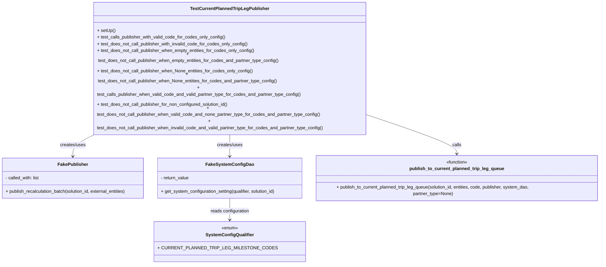
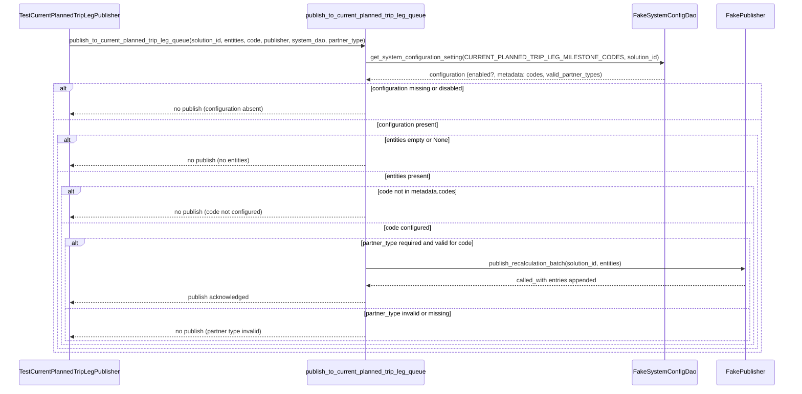

# Diagram: entity_core/entity_service/entity_service_tests/override_current_planned_trip_leg/test_current_planned_trip_leg_publisher.py

> Auto-generated by Obscura crawlers

## Diagram 1

### SVG

<svg id="container" width="2189.65625" xmlns="http://www.w3.org/2000/svg" class="classDiagram" height="824" viewBox="0 0 2189.65625 824" role="graphics-document document" aria-roledescription="class"><g><defs><marker id="container_class-aggregationStart" class="marker aggregation class" refX="18" refY="7" markerWidth="190" markerHeight="240" orient="auto"><path d="M 18,7 L9,13 L1,7 L9,1 Z"></path></marker></defs><defs><marker id="container_class-aggregationEnd" class="marker aggregation class" refX="1" refY="7" markerWidth="20" markerHeight="28" orient="auto"><path d="M 18,7 L9,13 L1,7 L9,1 Z"></path></marker></defs><defs><marker id="container_class-extensionStart" class="marker extension class" refX="18" refY="7" markerWidth="190" markerHeight="240" orient="auto"><path d="M 1,7 L18,13 V 1 Z"></path></marker></defs><defs><marker id="container_class-extensionEnd" class="marker extension class" refX="1" refY="7" markerWidth="20" markerHeight="28" orient="auto"><path d="M 1,1 V 13 L18,7 Z"></path></marker></defs><defs><marker id="container_class-compositionStart" class="marker composition class" refX="18" refY="7" markerWidth="190" markerHeight="240" orient="auto"><path d="M 18,7 L9,13 L1,7 L9,1 Z"></path></marker></defs><defs><marker id="container_class-compositionEnd" class="marker composition class" refX="1" refY="7" markerWidth="20" markerHeight="28" orient="auto"><path d="M 18,7 L9,13 L1,7 L9,1 Z"></path></marker></defs><defs><marker id="container_class-dependencyStart" class="marker dependency class" refX="6" refY="7" markerWidth="190" markerHeight="240" orient="auto"><path d="M 5,7 L9,13 L1,7 L9,1 Z"></path></marker></defs><defs><marker id="container_class-dependencyEnd" class="marker dependency class" refX="13" refY="7" markerWidth="20" markerHeight="28" orient="auto"><path d="M 18,7 L9,13 L14,7 L9,1 Z"></path></marker></defs><defs><marker id="container_class-lollipopStart" class="marker lollipop class" refX="13" refY="7" markerWidth="190" markerHeight="240" orient="auto"><circle stroke="black" fill="transparent" cx="7" cy="7" r="6"></circle></marker></defs><defs><marker id="container_class-lollipopEnd" class="marker lollipop class" refX="1" refY="7" markerWidth="190" markerHeight="240" orient="auto"><circle stroke="black" fill="transparent" cx="7" cy="7" r="6"></circle></marker></defs><g class="root"><g class="clusters"></g><g class="edgePaths"><path d="M361.625,374L345.7,380.167C329.775,386.333,297.925,398.667,281.999,410.5C266.074,422.333,266.074,433.667,266.074,439.333L266.074,445" id="id_TestCurrentPlannedTripLegPublisher_FakePublisher_1" class="edge-thickness-normal edge-pattern-solid relation" style=";;;" data-edge="true" data-et="edge" data-id="id_TestCurrentPlannedTripLegPublisher_FakePublisher_1" data-points="W3sieCI6MzYxLjYyNTE0MjA0NTQ1NDU0LCJ5IjozNzR9LHsieCI6MjY2LjA3NDIxODc1LCJ5Ijo0MTF9LHsieCI6MjY2LjA3NDIxODc1LCJ5Ijo0NTF9XQ==" marker-end="url(#container_class-dependencyEnd)"></path><path d="M834.215,374L834.215,380.167C834.215,386.333,834.215,398.667,834.215,410.5C834.215,422.333,834.215,433.667,834.215,439.333L834.215,445" id="id_TestCurrentPlannedTripLegPublisher_FakeSystemConfigDao_2" class="edge-thickness-normal edge-pattern-solid relation" style=";;;" data-edge="true" data-et="edge" data-id="id_TestCurrentPlannedTripLegPublisher_FakeSystemConfigDao_2" data-points="W3sieCI6ODM0LjIxNDg0Mzc1LCJ5IjozNzR9LHsieCI6ODM0LjIxNDg0Mzc1LCJ5Ijo0MTF9LHsieCI6ODM0LjIxNDg0Mzc1LCJ5Ijo0NTF9XQ==" marker-end="url(#container_class-dependencyEnd)"></path><path d="M1326.711,321.737L1382.754,336.615C1438.797,351.492,1550.883,381.246,1606.926,401.29C1662.969,421.333,1662.969,431.667,1662.969,436.833L1662.969,442" id="id_TestCurrentPlannedTripLegPublisher_publish_to_current_planned_trip_leg_queue_3" class="edge-thickness-normal edge-pattern-solid relation" style=";;;" data-edge="true" data-et="edge" data-id="id_TestCurrentPlannedTripLegPublisher_publish_to_current_planned_trip_leg_queue_3" data-points="W3sieCI6MTMyNi43MTA5Mzc1LCJ5IjozMjEuNzM3NDExNjgyNjM3MjN9LHsieCI6MTY2Mi45Njg3NSwieSI6NDExfSx7IngiOjE2NjIuOTY4NzUsInkiOjQ0OH1d" marker-end="url(#container_class-dependencyEnd)"></path><path d="M834.215,595L834.215,601.667C834.215,608.333,834.215,621.667,834.215,633.5C834.215,645.333,834.215,655.667,834.215,660.833L834.215,666" id="id_FakeSystemConfigDao_SystemConfigQualifier_4" class="edge-thickness-normal edge-pattern-solid relation" style=";;;" data-edge="true" data-et="edge" data-id="id_FakeSystemConfigDao_SystemConfigQualifier_4" data-points="W3sieCI6ODM0LjIxNDg0Mzc1LCJ5Ijo1OTV9LHsieCI6ODM0LjIxNDg0Mzc1LCJ5Ijo2MzV9LHsieCI6ODM0LjIxNDg0Mzc1LCJ5Ijo2NzJ9XQ==" marker-end="url(#container_class-dependencyEnd)"></path></g><g class="edgeLabels"><g class="edgeLabel" transform="translate(266.07421875, 411)"><g class="label" data-id="id_TestCurrentPlannedTripLegPublisher_FakePublisher_1" transform="translate(-46.578125, -12)"><foreignObject width="93.15625" height="24">

creates/uses

</foreignObject></g></g><g class="edgeLabel" transform="translate(834.21484375, 411)"><g class="label" data-id="id_TestCurrentPlannedTripLegPublisher_FakeSystemConfigDao_2" transform="translate(-46.578125, -12)"><foreignObject width="93.15625" height="24">

creates/uses

</foreignObject></g></g><g class="edgeLabel" transform="translate(1662.96875, 411)"><g class="label" data-id="id_TestCurrentPlannedTripLegPublisher_publish_to_current_planned_trip_leg_queue_3" transform="translate(-16.4453125, -12)"><foreignObject width="32.890625" height="24">

calls

</foreignObject></g></g><g class="edgeLabel" transform="translate(834.21484375, 635)"><g class="label" data-id="id_FakeSystemConfigDao_SystemConfigQualifier_4" transform="translate(-70.1484375, -12)"><foreignObject width="140.296875" height="24">

reads configuration

</foreignObject></g></g></g><g class="nodes"><g class="node default" id="classId-FakePublisher-0" transform="translate(266.07421875, 523)"><g class="basic label-container"><path d="M-258.07421875 -72 L258.07421875 -72 L258.07421875 72 L-258.07421875 72" stroke="none" stroke-width="0" fill="#ECECFF" style=""></path><path d="M-258.07421875 -72 C-153.39264780993508 -72, -48.71107686987017 -72, 258.07421875 -72 M-258.07421875 -72 C-133.81379984125863 -72, -9.553380932517257 -72, 258.07421875 -72 M258.07421875 -72 C258.07421875 -22.487337024696338, 258.07421875 27.025325950607325, 258.07421875 72 M258.07421875 -72 C258.07421875 -26.90901787082722, 258.07421875 18.18196425834556, 258.07421875 72 M258.07421875 72 C79.04533494518762 72, -99.98354885962476 72, -258.07421875 72 M258.07421875 72 C77.98715780417115 72, -102.0999031416577 72, -258.07421875 72 M-258.07421875 72 C-258.07421875 39.465723376009386, -258.07421875 6.931446752018772, -258.07421875 -72 M-258.07421875 72 C-258.07421875 28.1700107217084, -258.07421875 -15.659978556583198, -258.07421875 -72" stroke="#9370DB" stroke-width="1.3" fill="none" stroke-dasharray="0 0" style=""></path></g><g class="annotation-group text" transform="translate(0, -48)"></g><g class="label-group text" transform="translate(-51.2109375, -48)"><g class="label" style="font-weight: bolder" transform="translate(0,-12)"><foreignObject width="102.421875" height="24">

FakePublisher

</foreignObject></g></g><g class="members-group text" transform="translate(-246.07421875, 0)"><g class="label" style="" transform="translate(0,-12)"><foreignObject width="123.96875" height="24">

- called_with: list

</foreignObject></g></g><g class="methods-group text" transform="translate(-246.07421875, 48)"><g class="label" style="" transform="translate(0,-12)"><foreignObject width="440.9375" height="24">

+ publish_recalculation_batch(solution_id, external_entities)

</foreignObject></g></g><g class="divider" style=""><path d="M-258.07421875 -24 C-141.73004990370129 -24, -25.385881057402543 -24, 258.07421875 -24 M-258.07421875 -24 C-118.05732850174067 -24, 21.95956174651866 -24, 258.07421875 -24" stroke="#9370DB" stroke-width="1.3" fill="none" stroke-dasharray="0 0" style=""></path></g><g class="divider" style=""><path d="M-258.07421875 24 C-71.26086194197813 24, 115.55249486604373 24, 258.07421875 24 M-258.07421875 24 C-55.52568598165874 24, 147.02284678668252 24, 258.07421875 24" stroke="#9370DB" stroke-width="1.3" fill="none" stroke-dasharray="0 0" style=""></path></g></g><g class="node default" id="classId-FakeSystemConfigDao-1" transform="translate(834.21484375, 523)"><g class="basic label-container"><path d="M-260.06640625 -72 L260.06640625 -72 L260.06640625 72 L-260.06640625 72" stroke="none" stroke-width="0" fill="#ECECFF" style=""></path><path d="M-260.06640625 -72 C-122.27862960429559 -72, 15.509147041408823 -72, 260.06640625 -72 M-260.06640625 -72 C-149.71020719958995 -72, -39.35400814917989 -72, 260.06640625 -72 M260.06640625 -72 C260.06640625 -19.84855615151327, 260.06640625 32.30288769697346, 260.06640625 72 M260.06640625 -72 C260.06640625 -17.011877570700342, 260.06640625 37.976244858599316, 260.06640625 72 M260.06640625 72 C90.40449625811212 72, -79.25741373377576 72, -260.06640625 72 M260.06640625 72 C101.54361935527297 72, -56.97916753945407 72, -260.06640625 72 M-260.06640625 72 C-260.06640625 30.860898259815585, -260.06640625 -10.27820348036883, -260.06640625 -72 M-260.06640625 72 C-260.06640625 39.4157008232999, -260.06640625 6.831401646599801, -260.06640625 -72" stroke="#9370DB" stroke-width="1.3" fill="none" stroke-dasharray="0 0" style=""></path></g><g class="annotation-group text" transform="translate(0, -48)"></g><g class="label-group text" transform="translate(-80.1953125, -48)"><g class="label" style="font-weight: bolder" transform="translate(0,-12)"><foreignObject width="160.390625" height="24">

FakeSystemConfigDao

</foreignObject></g></g><g class="members-group text" transform="translate(-248.06640625, 0)"><g class="label" style="" transform="translate(0,-12)"><foreignObject width="102.46875" height="24">

- return_value

</foreignObject></g></g><g class="methods-group text" transform="translate(-248.06640625, 48)"><g class="label" style="" transform="translate(0,-12)"><foreignObject width="415.9375" height="24">

+ get_system_configuration_setting(qualifier, solution_id)

</foreignObject></g></g><g class="divider" style=""><path d="M-260.06640625 -24 C-154.45510502294565 -24, -48.84380379589132 -24, 260.06640625 -24 M-260.06640625 -24 C-70.98065025177516 -24, 118.10510574644968 -24, 260.06640625 -24" stroke="#9370DB" stroke-width="1.3" fill="none" stroke-dasharray="0 0" style=""></path></g><g class="divider" style=""><path d="M-260.06640625 24 C-127.14792408746825 24, 5.770558075063491 24, 260.06640625 24 M-260.06640625 24 C-118.69926081493108 24, 22.66788462013784 24, 260.06640625 24" stroke="#9370DB" stroke-width="1.3" fill="none" stroke-dasharray="0 0" style=""></path></g></g><g class="node default" id="classId-SystemConfigQualifier-2" transform="translate(834.21484375, 744)"><g class="basic label-container"><path d="M-236.83203125 -72 L236.83203125 -72 L236.83203125 72 L-236.83203125 72" stroke="none" stroke-width="0" fill="#ECECFF" style=""></path><path d="M-236.83203125 -72 C-139.7347953278147 -72, -42.63755940562942 -72, 236.83203125 -72 M-236.83203125 -72 C-84.50121353076028 -72, 67.82960418847944 -72, 236.83203125 -72 M236.83203125 -72 C236.83203125 -32.11643111310374, 236.83203125 7.767137773792527, 236.83203125 72 M236.83203125 -72 C236.83203125 -27.18032746727414, 236.83203125 17.63934506545172, 236.83203125 72 M236.83203125 72 C95.4379551552986 72, -45.95612093940281 72, -236.83203125 72 M236.83203125 72 C52.81438253247234 72, -131.20326618505533 72, -236.83203125 72 M-236.83203125 72 C-236.83203125 32.35497019108456, -236.83203125 -7.290059617830877, -236.83203125 -72 M-236.83203125 72 C-236.83203125 33.26682861764036, -236.83203125 -5.466342764719286, -236.83203125 -72" stroke="#9370DB" stroke-width="1.3" fill="none" stroke-dasharray="0 0" style=""></path></g><g class="annotation-group text" transform="translate(-29.53125, -48)"><g class="label" style="" transform="translate(0,-12)"><foreignObject width="59.0625" height="24">

«enum»

</foreignObject></g></g><g class="label-group text" transform="translate(-80.9296875, -24)"><g class="label" style="font-weight: bolder" transform="translate(0,-12)"><foreignObject width="161.859375" height="24">

SystemConfigQualifier

</foreignObject></g></g><g class="members-group text" transform="translate(-224.83203125, 24)"><g class="label" style="" transform="translate(0,-12)"><foreignObject width="368.734375" height="24">

+ CURRENT_PLANNED_TRIP_LEG_MILESTONE_CODES

</foreignObject></g></g><g class="methods-group text" transform="translate(-224.83203125, 72)"></g><g class="divider" style=""><path d="M-236.83203125 0 C-96.71447934753996 0, 43.40307255492007 0, 236.83203125 0 M-236.83203125 0 C-48.1586820692022 0, 140.5146671115956 0, 236.83203125 0" stroke="#9370DB" stroke-width="1.3" fill="none" stroke-dasharray="0 0" style=""></path></g><g class="divider" style=""><path d="M-236.83203125 48 C-117.90793679552735 48, 1.0161576589453034 48, 236.83203125 48 M-236.83203125 48 C-58.33691322381 48, 120.15820480238 48, 236.83203125 48" stroke="#9370DB" stroke-width="1.3" fill="none" stroke-dasharray="0 0" style=""></path></g></g><g class="node default" id="classId-TestCurrentPlannedTripLegPublisher-3" transform="translate(834.21484375, 191)"><g class="basic label-container"><path d="M-492.49609375 -183 L492.49609375 -183 L492.49609375 183 L-492.49609375 183" stroke="none" stroke-width="0" fill="#ECECFF" style=""></path><path d="M-492.49609375 -183 C-270.0846820660986 -183, -47.67327038219719 -183, 492.49609375 -183 M-492.49609375 -183 C-261.8131832589374 -183, -31.13027276787477 -183, 492.49609375 -183 M492.49609375 -183 C492.49609375 -84.22588953215349, 492.49609375 14.548220935693024, 492.49609375 183 M492.49609375 -183 C492.49609375 -61.409158497455905, 492.49609375 60.18168300508819, 492.49609375 183 M492.49609375 183 C164.8966903035519 183, -162.7027131428962 183, -492.49609375 183 M492.49609375 183 C161.64295307557666 183, -169.2101875988467 183, -492.49609375 183 M-492.49609375 183 C-492.49609375 100.92567606273285, -492.49609375 18.851352125465695, -492.49609375 -183 M-492.49609375 183 C-492.49609375 39.92370270065999, -492.49609375 -103.15259459868003, -492.49609375 -183" stroke="#9370DB" stroke-width="1.3" fill="none" stroke-dasharray="0 0" style=""></path></g><g class="annotation-group text" transform="translate(0, -159)"></g><g class="label-group text" transform="translate(-134.2109375, -159)"><g class="label" style="font-weight: bolder" transform="translate(0,-12)"><foreignObject width="268.421875" height="24">

TestCurrentPlannedTripLegPublisher

</foreignObject></g></g><g class="members-group text" transform="translate(-480.49609375, -111)"></g><g class="methods-group text" transform="translate(-480.49609375, -81)"><g class="label" style="" transform="translate(0,-12)"><foreignObject width="64.65625" height="24">

+ setUp()

</foreignObject></g><g class="label" style="" transform="translate(0,12)"><foreignObject width="459.265625" height="24">

+ test_calls_publisher_with_valid_code_for_codes_only_config()

</foreignObject></g><g class="label" style="" transform="translate(0,36)"><foreignObject width="541.984375" height="24">

+ test_does_not_call_publisher_with_invalid_code_for_codes_only_config()

</foreignObject></g><g class="label" style="" transform="translate(0,60)"><foreignObject width="565.6875" height="24">

+ test_does_not_call_publisher_when_empty_entities_for_codes_only_config()

</foreignObject></g><g class="label" style="" transform="translate(0,84)"><foreignObject width="663.484375" height="24">

+ test_does_not_call_publisher_when_empty_entities_for_codes_and_partner_type_config()

</foreignObject></g><g class="label" style="" transform="translate(0,108)"><foreignObject width="559.03125" height="24">

+ test_does_not_call_publisher_when_None_entities_for_codes_only_config()

</foreignObject></g><g class="label" style="" transform="translate(0,132)"><foreignObject width="656.828125" height="24">

+ test_does_not_call_publisher_when_None_entities_for_codes_and_partner_type_config()

</foreignObject></g><g class="label" style="" transform="translate(0,156)"><foreignObject width="744.078125" height="24">

+ test_calls_publisher_when_valid_code_and_valid_partner_type_for_codes_and_partner_type_config()

</foreignObject></g><g class="label" style="" transform="translate(0,180)"><foreignObject width="474.515625" height="24">

+ test_does_not_call_publisher_for_non_configured_solution_id()

</foreignObject></g><g class="label" style="" transform="translate(0,204)"><foreignObject width="814.5625" height="24">

+ test_does_not_call_publisher_when_valid_code_and_none_partner_type_for_codes_and_partner_type_config()

</foreignObject></g><g class="label" style="" transform="translate(0,228)"><foreignObject width="826.78125" height="24">

+ test_does_not_call_publisher_when_invalid_code_and_valid_partner_type_for_codes_and_partner_type_config()

</foreignObject></g></g><g class="divider" style=""><path d="M-492.49609375 -135 C-231.17442634908502 -135, 30.14724105182995 -135, 492.49609375 -135 M-492.49609375 -135 C-195.45385686111962 -135, 101.58838002776076 -135, 492.49609375 -135" stroke="#9370DB" stroke-width="1.3" fill="none" stroke-dasharray="0 0" style=""></path></g><g class="divider" style=""><path d="M-492.49609375 -111 C-237.33843960231277 -111, 17.81921454537445 -111, 492.49609375 -111 M-492.49609375 -111 C-198.2444074852619 -111, 96.00727877947622 -111, 492.49609375 -111" stroke="#9370DB" stroke-width="1.3" fill="none" stroke-dasharray="0 0" style=""></path></g></g><g class="node default" id="classId-publish_to_current_planned_trip_leg_queue-4" transform="translate(1662.96875, 523)"><g class="basic label-container"><path d="M-518.6875 -75 L518.6875 -75 L518.6875 75 L-518.6875 75" stroke="none" stroke-width="0" fill="#ECECFF" style=""></path><path d="M-518.6875 -75 C-155.43218578114335 -75, 207.8231284377133 -75, 518.6875 -75 M-518.6875 -75 C-256.6202029983882 -75, 5.447094003223583 -75, 518.6875 -75 M518.6875 -75 C518.6875 -44.95689747928684, 518.6875 -14.913794958573675, 518.6875 75 M518.6875 -75 C518.6875 -28.384689488570338, 518.6875 18.230621022859324, 518.6875 75 M518.6875 75 C305.08174979353623 75, 91.47599958707252 75, -518.6875 75 M518.6875 75 C197.06877801940988 75, -124.54994396118025 75, -518.6875 75 M-518.6875 75 C-518.6875 36.720490814055964, -518.6875 -1.5590183718880724, -518.6875 -75 M-518.6875 75 C-518.6875 41.78879236935331, -518.6875 8.57758473870662, -518.6875 -75" stroke="#9370DB" stroke-width="1.3" fill="none" stroke-dasharray="0 0" style=""></path></g><g class="annotation-group text" transform="translate(-39.484375, -51)"><g class="label" style="" transform="translate(0,-12)"><foreignObject width="78.96875" height="24">

«function»

</foreignObject></g></g><g class="label-group text" transform="translate(-162.6875, -27)"><g class="label" style="font-weight: bolder" transform="translate(0,-12)"><foreignObject width="325.375" height="24">

publish_to_current_planned_trip_leg_queue

</foreignObject></g></g><g class="members-group text" transform="translate(-506.6875, 21)"></g><g class="methods-group text" transform="translate(-506.6875, 51)"><g class="label" style="" transform="translate(0,-12)"><foreignObject width="850.6875" height="24">

+ publish_to_current_planned_trip_leg_queue(solution_id, entities, code, publisher, system_dao, partner_type=None)

</foreignObject></g></g><g class="divider" style=""><path d="M-518.6875 -3 C-305.5951813100677 -3, -92.50286262013537 -3, 518.6875 -3 M-518.6875 -3 C-290.63195251876107 -3, -62.576405037522136 -3, 518.6875 -3" stroke="#9370DB" stroke-width="1.3" fill="none" stroke-dasharray="0 0" style=""></path></g><g class="divider" style=""><path d="M-518.6875 21 C-272.3807431156388 21, -26.07398623127756 21, 518.6875 21 M-518.6875 21 C-175.62405968289698 21, 167.43938063420603 21, 518.6875 21" stroke="#9370DB" stroke-width="1.3" fill="none" stroke-dasharray="0 0" style=""></path></g></g></g></g></g></svg>

## Diagram 2

### SVG

<svg id="container" width="2164" xmlns="http://www.w3.org/2000/svg" height="1051" viewBox="-50 -10 2164 1051" role="graphics-document document" aria-roledescription="sequence"><g><rect x="1914" y="965" fill="#eaeaea" stroke="#666" width="150" height="65" name="Pub" rx="3" ry="3" class="actor actor-bottom"></rect><text x="1989" y="997.5" dominant-baseline="central" alignment-baseline="central" class="actor actor-box" style="text-anchor: middle; font-size: 16px; font-weight: 400;"><tspan x="1989" dy="0">FakePublisher</tspan></text></g><g><rect x="1687" y="965" fill="#eaeaea" stroke="#666" width="177" height="65" name="DAO" rx="3" ry="3" class="actor actor-bottom"></rect><text x="1775.5" y="997.5" dominant-baseline="central" alignment-baseline="central" class="actor actor-box" style="text-anchor: middle; font-size: 16px; font-weight: 400;"><tspan x="1775.5" dy="0">FakeSystemConfigDao</tspan></text></g><g><rect x="833" y="965" fill="#eaeaea" stroke="#666" width="343" height="65" name="Func" rx="3" ry="3" class="actor actor-bottom"></rect><text x="1004.5" y="997.5" dominant-baseline="central" alignment-baseline="central" class="actor actor-box" style="text-anchor: middle; font-size: 16px; font-weight: 400;"><tspan x="1004.5" dy="0">publish_to_current_planned_trip_leg_queue</tspan></text></g><g><rect x="0" y="965" fill="#eaeaea" stroke="#666" width="285" height="65" name="Test" rx="3" ry="3" class="actor actor-bottom"></rect><text x="142.5" y="997.5" dominant-baseline="central" alignment-baseline="central" class="actor actor-box" style="text-anchor: middle; font-size: 16px; font-weight: 400;"><tspan x="142.5" dy="0">TestCurrentPlannedTripLegPublisher</tspan></text></g><g><line id="actor3" x1="1989" y1="65" x2="1989" y2="965" class="actor-line 200" stroke-width="0.5px" stroke="#999" name="Pub"></line><g id="root-3"><rect x="1914" y="0" fill="#eaeaea" stroke="#666" width="150" height="65" name="Pub" rx="3" ry="3" class="actor actor-top"></rect><text x="1989" y="32.5" dominant-baseline="central" alignment-baseline="central" class="actor actor-box" style="text-anchor: middle; font-size: 16px; font-weight: 400;"><tspan x="1989" dy="0">FakePublisher</tspan></text></g></g><g><line id="actor2" x1="1775.5" y1="65" x2="1775.5" y2="965" class="actor-line 200" stroke-width="0.5px" stroke="#999" name="DAO"></line><g id="root-2"><rect x="1687" y="0" fill="#eaeaea" stroke="#666" width="177" height="65" name="DAO" rx="3" ry="3" class="actor actor-top"></rect><text x="1775.5" y="32.5" dominant-baseline="central" alignment-baseline="central" class="actor actor-box" style="text-anchor: middle; font-size: 16px; font-weight: 400;"><tspan x="1775.5" dy="0">FakeSystemConfigDao</tspan></text></g></g><g><line id="actor1" x1="1004.5" y1="65" x2="1004.5" y2="965" class="actor-line 200" stroke-width="0.5px" stroke="#999" name="Func"></line><g id="root-1"><rect x="833" y="0" fill="#eaeaea" stroke="#666" width="343" height="65" name="Func" rx="3" ry="3" class="actor actor-top"></rect><text x="1004.5" y="32.5" dominant-baseline="central" alignment-baseline="central" class="actor actor-box" style="text-anchor: middle; font-size: 16px; font-weight: 400;"><tspan x="1004.5" dy="0">publish_to_current_planned_trip_leg_queue</tspan></text></g></g><g><line id="actor0" x1="142.5" y1="65" x2="142.5" y2="965" class="actor-line 200" stroke-width="0.5px" stroke="#999" name="Test"></line><g id="root-0"><rect x="0" y="0" fill="#eaeaea" stroke="#666" width="285" height="65" name="Test" rx="3" ry="3" class="actor actor-top"></rect><text x="142.5" y="32.5" dominant-baseline="central" alignment-baseline="central" class="actor actor-box" style="text-anchor: middle; font-size: 16px; font-weight: 400;"><tspan x="142.5" dy="0">TestCurrentPlannedTripLegPublisher</tspan></text></g></g><g></g><defs><symbol id="computer" width="24" height="24"><path transform="scale(.5)" d="M2 2v13h20v-13h-20zm18 11h-16v-9h16v9zm-10.228 6l.466-1h3.524l.467 1h-4.457zm14.228 3h-24l2-6h2.104l-1.33 4h18.45l-1.297-4h2.073l2 6zm-5-10h-14v-7h14v7z"></path></symbol></defs><defs><symbol id="database" fill-rule="evenodd" clip-rule="evenodd"><path transform="scale(.5)" d="M12.258.001l.256.004.255.005.253.008.251.01.249.012.247.015.246.016.242.019.241.02.239.023.236.024.233.027.231.028.229.031.225.032.223.034.22.036.217.038.214.04.211.041.208.043.205.045.201.046.198.048.194.05.191.051.187.053.183.054.18.056.175.057.172.059.168.06.163.061.16.063.155.064.15.066.074.033.073.033.071.034.07.034.069.035.068.035.067.035.066.035.064.036.064.036.062.036.06.036.06.037.058.037.058.037.055.038.055.038.053.038.052.038.051.039.05.039.048.039.047.039.045.04.044.04.043.04.041.04.04.041.039.041.037.041.036.041.034.041.033.042.032.042.03.042.029.042.027.042.026.043.024.043.023.043.021.043.02.043.018.044.017.043.015.044.013.044.012.044.011.045.009.044.007.045.006.045.004.045.002.045.001.045v17l-.001.045-.002.045-.004.045-.006.045-.007.045-.009.044-.011.045-.012.044-.013.044-.015.044-.017.043-.018.044-.02.043-.021.043-.023.043-.024.043-.026.043-.027.042-.029.042-.03.042-.032.042-.033.042-.034.041-.036.041-.037.041-.039.041-.04.041-.041.04-.043.04-.044.04-.045.04-.047.039-.048.039-.05.039-.051.039-.052.038-.053.038-.055.038-.055.038-.058.037-.058.037-.06.037-.06.036-.062.036-.064.036-.064.036-.066.035-.067.035-.068.035-.069.035-.07.034-.071.034-.073.033-.074.033-.15.066-.155.064-.16.063-.163.061-.168.06-.172.059-.175.057-.18.056-.183.054-.187.053-.191.051-.194.05-.198.048-.201.046-.205.045-.208.043-.211.041-.214.04-.217.038-.22.036-.223.034-.225.032-.229.031-.231.028-.233.027-.236.024-.239.023-.241.02-.242.019-.246.016-.247.015-.249.012-.251.01-.253.008-.255.005-.256.004-.258.001-.258-.001-.256-.004-.255-.005-.253-.008-.251-.01-.249-.012-.247-.015-.245-.016-.243-.019-.241-.02-.238-.023-.236-.024-.234-.027-.231-.028-.228-.031-.226-.032-.223-.034-.22-.036-.217-.038-.214-.04-.211-.041-.208-.043-.204-.045-.201-.046-.198-.048-.195-.05-.19-.051-.187-.053-.184-.054-.179-.056-.176-.057-.172-.059-.167-.06-.164-.061-.159-.063-.155-.064-.151-.066-.074-.033-.072-.033-.072-.034-.07-.034-.069-.035-.068-.035-.067-.035-.066-.035-.064-.036-.063-.036-.062-.036-.061-.036-.06-.037-.058-.037-.057-.037-.056-.038-.055-.038-.053-.038-.052-.038-.051-.039-.049-.039-.049-.039-.046-.039-.046-.04-.044-.04-.043-.04-.041-.04-.04-.041-.039-.041-.037-.041-.036-.041-.034-.041-.033-.042-.032-.042-.03-.042-.029-.042-.027-.042-.026-.043-.024-.043-.023-.043-.021-.043-.02-.043-.018-.044-.017-.043-.015-.044-.013-.044-.012-.044-.011-.045-.009-.044-.007-.045-.006-.045-.004-.045-.002-.045-.001-.045v-17l.001-.045.002-.045.004-.045.006-.045.007-.045.009-.044.011-.045.012-.044.013-.044.015-.044.017-.043.018-.044.02-.043.021-.043.023-.043.024-.043.026-.043.027-.042.029-.042.03-.042.032-.042.033-.042.034-.041.036-.041.037-.041.039-.041.04-.041.041-.04.043-.04.044-.04.046-.04.046-.039.049-.039.049-.039.051-.039.052-.038.053-.038.055-.038.056-.038.057-.037.058-.037.06-.037.061-.036.062-.036.063-.036.064-.036.066-.035.067-.035.068-.035.069-.035.07-.034.072-.034.072-.033.074-.033.151-.066.155-.064.159-.063.164-.061.167-.06.172-.059.176-.057.179-.056.184-.054.187-.053.19-.051.195-.05.198-.048.201-.046.204-.045.208-.043.211-.041.214-.04.217-.038.22-.036.223-.034.226-.032.228-.031.231-.028.234-.027.236-.024.238-.023.241-.02.243-.019.245-.016.247-.015.249-.012.251-.01.253-.008.255-.005.256-.004.258-.001.258.001zm-9.258 20.499v.01l.001.021.003.021.004.022.005.021.006.022.007.022.009.023.01.022.011.023.012.023.013.023.015.023.016.024.017.023.018.024.019.024.021.024.022.025.023.024.024.025.052.049.056.05.061.051.066.051.07.051.075.051.079.052.084.052.088.052.092.052.097.052.102.051.105.052.11.052.114.051.119.051.123.051.127.05.131.05.135.05.139.048.144.049.147.047.152.047.155.047.16.045.163.045.167.043.171.043.176.041.178.041.183.039.187.039.19.037.194.035.197.035.202.033.204.031.209.03.212.029.216.027.219.025.222.024.226.021.23.02.233.018.236.016.24.015.243.012.246.01.249.008.253.005.256.004.259.001.26-.001.257-.004.254-.005.25-.008.247-.011.244-.012.241-.014.237-.016.233-.018.231-.021.226-.021.224-.024.22-.026.216-.027.212-.028.21-.031.205-.031.202-.034.198-.034.194-.036.191-.037.187-.039.183-.04.179-.04.175-.042.172-.043.168-.044.163-.045.16-.046.155-.046.152-.047.148-.048.143-.049.139-.049.136-.05.131-.05.126-.05.123-.051.118-.052.114-.051.11-.052.106-.052.101-.052.096-.052.092-.052.088-.053.083-.051.079-.052.074-.052.07-.051.065-.051.06-.051.056-.05.051-.05.023-.024.023-.025.021-.024.02-.024.019-.024.018-.024.017-.024.015-.023.014-.024.013-.023.012-.023.01-.023.01-.022.008-.022.006-.022.006-.022.004-.022.004-.021.001-.021.001-.021v-4.127l-.077.055-.08.053-.083.054-.085.053-.087.052-.09.052-.093.051-.095.05-.097.05-.1.049-.102.049-.105.048-.106.047-.109.047-.111.046-.114.045-.115.045-.118.044-.12.043-.122.042-.124.042-.126.041-.128.04-.13.04-.132.038-.134.038-.135.037-.138.037-.139.035-.142.035-.143.034-.144.033-.147.032-.148.031-.15.03-.151.03-.153.029-.154.027-.156.027-.158.026-.159.025-.161.024-.162.023-.163.022-.165.021-.166.02-.167.019-.169.018-.169.017-.171.016-.173.015-.173.014-.175.013-.175.012-.177.011-.178.01-.179.008-.179.008-.181.006-.182.005-.182.004-.184.003-.184.002h-.37l-.184-.002-.184-.003-.182-.004-.182-.005-.181-.006-.179-.008-.179-.008-.178-.01-.176-.011-.176-.012-.175-.013-.173-.014-.172-.015-.171-.016-.17-.017-.169-.018-.167-.019-.166-.02-.165-.021-.163-.022-.162-.023-.161-.024-.159-.025-.157-.026-.156-.027-.155-.027-.153-.029-.151-.03-.15-.03-.148-.031-.146-.032-.145-.033-.143-.034-.141-.035-.14-.035-.137-.037-.136-.037-.134-.038-.132-.038-.13-.04-.128-.04-.126-.041-.124-.042-.122-.042-.12-.044-.117-.043-.116-.045-.113-.045-.112-.046-.109-.047-.106-.047-.105-.048-.102-.049-.1-.049-.097-.05-.095-.05-.093-.052-.09-.051-.087-.052-.085-.053-.083-.054-.08-.054-.077-.054v4.127zm0-5.654v.011l.001.021.003.021.004.021.005.022.006.022.007.022.009.022.01.022.011.023.012.023.013.023.015.024.016.023.017.024.018.024.019.024.021.024.022.024.023.025.024.024.052.05.056.05.061.05.066.051.07.051.075.052.079.051.084.052.088.052.092.052.097.052.102.052.105.052.11.051.114.051.119.052.123.05.127.051.131.05.135.049.139.049.144.048.147.048.152.047.155.046.16.045.163.045.167.044.171.042.176.042.178.04.183.04.187.038.19.037.194.036.197.034.202.033.204.032.209.03.212.028.216.027.219.025.222.024.226.022.23.02.233.018.236.016.24.014.243.012.246.01.249.008.253.006.256.003.259.001.26-.001.257-.003.254-.006.25-.008.247-.01.244-.012.241-.015.237-.016.233-.018.231-.02.226-.022.224-.024.22-.025.216-.027.212-.029.21-.03.205-.032.202-.033.198-.035.194-.036.191-.037.187-.039.183-.039.179-.041.175-.042.172-.043.168-.044.163-.045.16-.045.155-.047.152-.047.148-.048.143-.048.139-.05.136-.049.131-.05.126-.051.123-.051.118-.051.114-.052.11-.052.106-.052.101-.052.096-.052.092-.052.088-.052.083-.052.079-.052.074-.051.07-.052.065-.051.06-.05.056-.051.051-.049.023-.025.023-.024.021-.025.02-.024.019-.024.018-.024.017-.024.015-.023.014-.023.013-.024.012-.022.01-.023.01-.023.008-.022.006-.022.006-.022.004-.021.004-.022.001-.021.001-.021v-4.139l-.077.054-.08.054-.083.054-.085.052-.087.053-.09.051-.093.051-.095.051-.097.05-.1.049-.102.049-.105.048-.106.047-.109.047-.111.046-.114.045-.115.044-.118.044-.12.044-.122.042-.124.042-.126.041-.128.04-.13.039-.132.039-.134.038-.135.037-.138.036-.139.036-.142.035-.143.033-.144.033-.147.033-.148.031-.15.03-.151.03-.153.028-.154.028-.156.027-.158.026-.159.025-.161.024-.162.023-.163.022-.165.021-.166.02-.167.019-.169.018-.169.017-.171.016-.173.015-.173.014-.175.013-.175.012-.177.011-.178.009-.179.009-.179.007-.181.007-.182.005-.182.004-.184.003-.184.002h-.37l-.184-.002-.184-.003-.182-.004-.182-.005-.181-.007-.179-.007-.179-.009-.178-.009-.176-.011-.176-.012-.175-.013-.173-.014-.172-.015-.171-.016-.17-.017-.169-.018-.167-.019-.166-.02-.165-.021-.163-.022-.162-.023-.161-.024-.159-.025-.157-.026-.156-.027-.155-.028-.153-.028-.151-.03-.15-.03-.148-.031-.146-.033-.145-.033-.143-.033-.141-.035-.14-.036-.137-.036-.136-.037-.134-.038-.132-.039-.13-.039-.128-.04-.126-.041-.124-.042-.122-.043-.12-.043-.117-.044-.116-.044-.113-.046-.112-.046-.109-.046-.106-.047-.105-.048-.102-.049-.1-.049-.097-.05-.095-.051-.093-.051-.09-.051-.087-.053-.085-.052-.083-.054-.08-.054-.077-.054v4.139zm0-5.666v.011l.001.02.003.022.004.021.005.022.006.021.007.022.009.023.01.022.011.023.012.023.013.023.015.023.016.024.017.024.018.023.019.024.021.025.022.024.023.024.024.025.052.05.056.05.061.05.066.051.07.051.075.052.079.051.084.052.088.052.092.052.097.052.102.052.105.051.11.052.114.051.119.051.123.051.127.05.131.05.135.05.139.049.144.048.147.048.152.047.155.046.16.045.163.045.167.043.171.043.176.042.178.04.183.04.187.038.19.037.194.036.197.034.202.033.204.032.209.03.212.028.216.027.219.025.222.024.226.021.23.02.233.018.236.017.24.014.243.012.246.01.249.008.253.006.256.003.259.001.26-.001.257-.003.254-.006.25-.008.247-.01.244-.013.241-.014.237-.016.233-.018.231-.02.226-.022.224-.024.22-.025.216-.027.212-.029.21-.03.205-.032.202-.033.198-.035.194-.036.191-.037.187-.039.183-.039.179-.041.175-.042.172-.043.168-.044.163-.045.16-.045.155-.047.152-.047.148-.048.143-.049.139-.049.136-.049.131-.051.126-.05.123-.051.118-.052.114-.051.11-.052.106-.052.101-.052.096-.052.092-.052.088-.052.083-.052.079-.052.074-.052.07-.051.065-.051.06-.051.056-.05.051-.049.023-.025.023-.025.021-.024.02-.024.019-.024.018-.024.017-.024.015-.023.014-.024.013-.023.012-.023.01-.022.01-.023.008-.022.006-.022.006-.022.004-.022.004-.021.001-.021.001-.021v-4.153l-.077.054-.08.054-.083.053-.085.053-.087.053-.09.051-.093.051-.095.051-.097.05-.1.049-.102.048-.105.048-.106.048-.109.046-.111.046-.114.046-.115.044-.118.044-.12.043-.122.043-.124.042-.126.041-.128.04-.13.039-.132.039-.134.038-.135.037-.138.036-.139.036-.142.034-.143.034-.144.033-.147.032-.148.032-.15.03-.151.03-.153.028-.154.028-.156.027-.158.026-.159.024-.161.024-.162.023-.163.023-.165.021-.166.02-.167.019-.169.018-.169.017-.171.016-.173.015-.173.014-.175.013-.175.012-.177.01-.178.01-.179.009-.179.007-.181.006-.182.006-.182.004-.184.003-.184.001-.185.001-.185-.001-.184-.001-.184-.003-.182-.004-.182-.006-.181-.006-.179-.007-.179-.009-.178-.01-.176-.01-.176-.012-.175-.013-.173-.014-.172-.015-.171-.016-.17-.017-.169-.018-.167-.019-.166-.02-.165-.021-.163-.023-.162-.023-.161-.024-.159-.024-.157-.026-.156-.027-.155-.028-.153-.028-.151-.03-.15-.03-.148-.032-.146-.032-.145-.033-.143-.034-.141-.034-.14-.036-.137-.036-.136-.037-.134-.038-.132-.039-.13-.039-.128-.041-.126-.041-.124-.041-.122-.043-.12-.043-.117-.044-.116-.044-.113-.046-.112-.046-.109-.046-.106-.048-.105-.048-.102-.048-.1-.05-.097-.049-.095-.051-.093-.051-.09-.052-.087-.052-.085-.053-.083-.053-.08-.054-.077-.054v4.153zm8.74-8.179l-.257.004-.254.005-.25.008-.247.011-.244.012-.241.014-.237.016-.233.018-.231.021-.226.022-.224.023-.22.026-.216.027-.212.028-.21.031-.205.032-.202.033-.198.034-.194.036-.191.038-.187.038-.183.04-.179.041-.175.042-.172.043-.168.043-.163.045-.16.046-.155.046-.152.048-.148.048-.143.048-.139.049-.136.05-.131.05-.126.051-.123.051-.118.051-.114.052-.11.052-.106.052-.101.052-.096.052-.092.052-.088.052-.083.052-.079.052-.074.051-.07.052-.065.051-.06.05-.056.05-.051.05-.023.025-.023.024-.021.024-.02.025-.019.024-.018.024-.017.023-.015.024-.014.023-.013.023-.012.023-.01.023-.01.022-.008.022-.006.023-.006.021-.004.022-.004.021-.001.021-.001.021.001.021.001.021.004.021.004.022.006.021.006.023.008.022.01.022.01.023.012.023.013.023.014.023.015.024.017.023.018.024.019.024.02.025.021.024.023.024.023.025.051.05.056.05.06.05.065.051.07.052.074.051.079.052.083.052.088.052.092.052.096.052.101.052.106.052.11.052.114.052.118.051.123.051.126.051.131.05.136.05.139.049.143.048.148.048.152.048.155.046.16.046.163.045.168.043.172.043.175.042.179.041.183.04.187.038.191.038.194.036.198.034.202.033.205.032.21.031.212.028.216.027.22.026.224.023.226.022.231.021.233.018.237.016.241.014.244.012.247.011.25.008.254.005.257.004.26.001.26-.001.257-.004.254-.005.25-.008.247-.011.244-.012.241-.014.237-.016.233-.018.231-.021.226-.022.224-.023.22-.026.216-.027.212-.028.21-.031.205-.032.202-.033.198-.034.194-.036.191-.038.187-.038.183-.04.179-.041.175-.042.172-.043.168-.043.163-.045.16-.046.155-.046.152-.048.148-.048.143-.048.139-.049.136-.05.131-.05.126-.051.123-.051.118-.051.114-.052.11-.052.106-.052.101-.052.096-.052.092-.052.088-.052.083-.052.079-.052.074-.051.07-.052.065-.051.06-.05.056-.05.051-.05.023-.025.023-.024.021-.024.02-.025.019-.024.018-.024.017-.023.015-.024.014-.023.013-.023.012-.023.01-.023.01-.022.008-.022.006-.023.006-.021.004-.022.004-.021.001-.021.001-.021-.001-.021-.001-.021-.004-.021-.004-.022-.006-.021-.006-.023-.008-.022-.01-.022-.01-.023-.012-.023-.013-.023-.014-.023-.015-.024-.017-.023-.018-.024-.019-.024-.02-.025-.021-.024-.023-.024-.023-.025-.051-.05-.056-.05-.06-.05-.065-.051-.07-.052-.074-.051-.079-.052-.083-.052-.088-.052-.092-.052-.096-.052-.101-.052-.106-.052-.11-.052-.114-.052-.118-.051-.123-.051-.126-.051-.131-.05-.136-.05-.139-.049-.143-.048-.148-.048-.152-.048-.155-.046-.16-.046-.163-.045-.168-.043-.172-.043-.175-.042-.179-.041-.183-.04-.187-.038-.191-.038-.194-.036-.198-.034-.202-.033-.205-.032-.21-.031-.212-.028-.216-.027-.22-.026-.224-.023-.226-.022-.231-.021-.233-.018-.237-.016-.241-.014-.244-.012-.247-.011-.25-.008-.254-.005-.257-.004-.26-.001-.26.001z"></path></symbol></defs><defs><symbol id="clock" width="24" height="24"><path transform="scale(.5)" d="M12 2c5.514 0 10 4.486 10 10s-4.486 10-10 10-10-4.486-10-10 4.486-10 10-10zm0-2c-6.627 0-12 5.373-12 12s5.373 12 12 12 12-5.373 12-12-5.373-12-12-12zm5.848 12.459c.202.038.202.333.001.372-1.907.361-6.045 1.111-6.547 1.111-.719 0-1.301-.582-1.301-1.301 0-.512.77-5.447 1.125-7.445.034-.192.312-.181.343.014l.985 6.238 5.394 1.011z"></path></symbol></defs><defs><marker id="arrowhead" refX="7.9" refY="5" markerUnits="userSpaceOnUse" markerWidth="12" markerHeight="12" orient="auto-start-reverse"><path d="M -1 0 L 10 5 L 0 10 z"></path></marker></defs><defs><marker id="crosshead" markerWidth="15" markerHeight="8" orient="auto" refX="4" refY="4.5"><path fill="none" stroke="#000000" stroke-width="1pt" d="M 1,2 L 6,7 M 6,2 L 1,7" style="stroke-dasharray: 0, 0;"></path></marker></defs><defs><marker id="filled-head" refX="15.5" refY="7" markerWidth="20" markerHeight="28" orient="auto"><path d="M 18,7 L9,13 L14,7 L9,1 Z"></path></marker></defs><defs><marker id="sequencenumber" refX="15" refY="15" markerWidth="60" markerHeight="40" orient="auto"><circle cx="15" cy="15" r="6"></circle></marker></defs><g><line x1="131.5" y1="633" x2="2000" y2="633" class="loopLine"></line><line x1="2000" y1="633" x2="2000" y2="915" class="loopLine"></line><line x1="131.5" y1="915" x2="2000" y2="915" class="loopLine"></line><line x1="131.5" y1="633" x2="131.5" y2="915" class="loopLine"></line><line x1="131.5" y1="827" x2="2000" y2="827" class="loopLine" style="stroke-dasharray: 3, 3;"></line><polygon points="131.5,633 181.5,633 181.5,646 173.1,653 131.5,653" class="labelBox"></polygon><text x="157" y="646" text-anchor="middle" dominant-baseline="middle" alignment-baseline="middle" class="labelText" style="font-size: 16px; font-weight: 400;">alt</text><text x="1090.75" y="651" text-anchor="middle" class="loopText" style="font-size: 16px; font-weight: 400;"><tspan x="1090.75">[partner_type required and valid for code]</tspan></text><text x="1065.75" y="845" text-anchor="middle" class="loopText" style="font-size: 16px; font-weight: 400;">[partner_type invalid or missing]</text></g><g><line x1="121.5" y1="495" x2="2010" y2="495" class="loopLine"></line><line x1="2010" y1="495" x2="2010" y2="925" class="loopLine"></line><line x1="121.5" y1="925" x2="2010" y2="925" class="loopLine"></line><line x1="121.5" y1="495" x2="121.5" y2="925" class="loopLine"></line><line x1="121.5" y1="593" x2="2010" y2="593" class="loopLine" style="stroke-dasharray: 3, 3;"></line><polygon points="121.5,495 171.5,495 171.5,508 163.1,515 121.5,515" class="labelBox"></polygon><text x="147" y="508" text-anchor="middle" dominant-baseline="middle" alignment-baseline="middle" class="labelText" style="font-size: 16px; font-weight: 400;">alt</text><text x="1090.75" y="513" text-anchor="middle" class="loopText" style="font-size: 16px; font-weight: 400;"><tspan x="1090.75">[code not in metadata.codes]</tspan></text><text x="1065.75" y="611" text-anchor="middle" class="loopText" style="font-size: 16px; font-weight: 400;">[code configured]</text></g><g><line x1="111.5" y1="357" x2="2020" y2="357" class="loopLine"></line><line x1="2020" y1="357" x2="2020" y2="935" class="loopLine"></line><line x1="111.5" y1="935" x2="2020" y2="935" class="loopLine"></line><line x1="111.5" y1="357" x2="111.5" y2="935" class="loopLine"></line><line x1="111.5" y1="455" x2="2020" y2="455" class="loopLine" style="stroke-dasharray: 3, 3;"></line><polygon points="111.5,357 161.5,357 161.5,370 153.1,377 111.5,377" class="labelBox"></polygon><text x="137" y="370" text-anchor="middle" dominant-baseline="middle" alignment-baseline="middle" class="labelText" style="font-size: 16px; font-weight: 400;">alt</text><text x="1090.75" y="375" text-anchor="middle" class="loopText" style="font-size: 16px; font-weight: 400;"><tspan x="1090.75">[entities empty or None]</tspan></text><text x="1065.75" y="473" text-anchor="middle" class="loopText" style="font-size: 16px; font-weight: 400;">[entities present]</text></g><g><line x1="101.5" y1="219" x2="2030" y2="219" class="loopLine"></line><line x1="2030" y1="219" x2="2030" y2="945" class="loopLine"></line><line x1="101.5" y1="945" x2="2030" y2="945" class="loopLine"></line><line x1="101.5" y1="219" x2="101.5" y2="945" class="loopLine"></line><line x1="101.5" y1="317" x2="2030" y2="317" class="loopLine" style="stroke-dasharray: 3, 3;"></line><polygon points="101.5,219 151.5,219 151.5,232 143.1,239 101.5,239" class="labelBox"></polygon><text x="127" y="232" text-anchor="middle" dominant-baseline="middle" alignment-baseline="middle" class="labelText" style="font-size: 16px; font-weight: 400;">alt</text><text x="1090.75" y="237" text-anchor="middle" class="loopText" style="font-size: 16px; font-weight: 400;"><tspan x="1090.75">[configuration missing or disabled]</tspan></text><text x="1065.75" y="335" text-anchor="middle" class="loopText" style="font-size: 16px; font-weight: 400;">[configuration present]</text></g><text x="572" y="80" text-anchor="middle" dominant-baseline="middle" alignment-baseline="middle" class="messageText" dy="1em" style="font-size: 16px; font-weight: 400;">publish_to_current_planned_trip_leg_queue(solution_id, entities, code, publisher, system_dao, partner_type)</text><line x1="143.5" y1="113" x2="1000.5" y2="113" class="messageLine0" stroke-width="2" stroke="none" marker-end="url(#arrowhead)" style="fill: none;"></line><text x="1389" y="128" text-anchor="middle" dominant-baseline="middle" alignment-baseline="middle" class="messageText" dy="1em" style="font-size: 16px; font-weight: 400;">get_system_configuration_setting(CURRENT_PLANNED_TRIP_LEG_MILESTONE_CODES, solution_id)</text><line x1="1005.5" y1="161" x2="1771.5" y2="161" class="messageLine0" stroke-width="2" stroke="none" marker-end="url(#arrowhead)" style="fill: none;"></line><text x="1392" y="176" text-anchor="middle" dominant-baseline="middle" alignment-baseline="middle" class="messageText" dy="1em" style="font-size: 16px; font-weight: 400;">configuration (enabled?, metadata: codes, valid_partner_types)</text><line x1="1774.5" y1="209" x2="1008.5" y2="209" class="messageLine1" stroke-width="2" stroke="none" marker-end="url(#arrowhead)" style="stroke-dasharray: 3, 3; fill: none;"></line><text x="575" y="269" text-anchor="middle" dominant-baseline="middle" alignment-baseline="middle" class="messageText" dy="1em" style="font-size: 16px; font-weight: 400;">no publish (configuration absent)</text><line x1="1003.5" y1="302" x2="146.5" y2="302" class="messageLine1" stroke-width="2" stroke="none" marker-end="url(#arrowhead)" style="stroke-dasharray: 3, 3; fill: none;"></line><text x="575" y="407" text-anchor="middle" dominant-baseline="middle" alignment-baseline="middle" class="messageText" dy="1em" style="font-size: 16px; font-weight: 400;">no publish (no entities)</text><line x1="1003.5" y1="440" x2="146.5" y2="440" class="messageLine1" stroke-width="2" stroke="none" marker-end="url(#arrowhead)" style="stroke-dasharray: 3, 3; fill: none;"></line><text x="575" y="545" text-anchor="middle" dominant-baseline="middle" alignment-baseline="middle" class="messageText" dy="1em" style="font-size: 16px; font-weight: 400;">no publish (code not configured)</text><line x1="1003.5" y1="578" x2="146.5" y2="578" class="messageLine1" stroke-width="2" stroke="none" marker-end="url(#arrowhead)" style="stroke-dasharray: 3, 3; fill: none;"></line><text x="1495" y="683" text-anchor="middle" dominant-baseline="middle" alignment-baseline="middle" class="messageText" dy="1em" style="font-size: 16px; font-weight: 400;">publish_recalculation_batch(solution_id, entities)</text><line x1="1005.5" y1="716" x2="1985" y2="716" class="messageLine0" stroke-width="2" stroke="none" marker-end="url(#arrowhead)" style="fill: none;"></line><text x="1498" y="731" text-anchor="middle" dominant-baseline="middle" alignment-baseline="middle" class="messageText" dy="1em" style="font-size: 16px; font-weight: 400;">called_with entries appended</text><line x1="1988" y1="764" x2="1008.5" y2="764" class="messageLine1" stroke-width="2" stroke="none" marker-end="url(#arrowhead)" style="stroke-dasharray: 3, 3; fill: none;"></line><text x="575" y="779" text-anchor="middle" dominant-baseline="middle" alignment-baseline="middle" class="messageText" dy="1em" style="font-size: 16px; font-weight: 400;">publish acknowledged</text><line x1="1003.5" y1="812" x2="146.5" y2="812" class="messageLine1" stroke-width="2" stroke="none" marker-end="url(#arrowhead)" style="stroke-dasharray: 3, 3; fill: none;"></line><text x="575" y="872" text-anchor="middle" dominant-baseline="middle" alignment-baseline="middle" class="messageText" dy="1em" style="font-size: 16px; font-weight: 400;">no publish (partner type invalid)</text><line x1="1003.5" y1="905" x2="146.5" y2="905" class="messageLine1" stroke-width="2" stroke="none" marker-end="url(#arrowhead)" style="stroke-dasharray: 3, 3; fill: none;"></line></svg>
