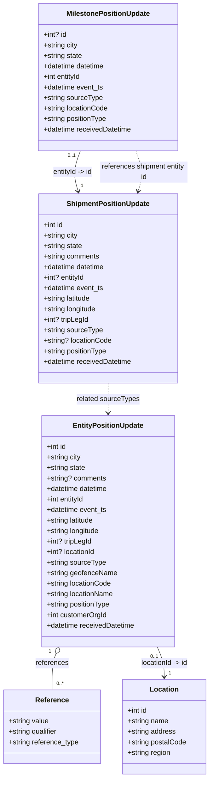

# Diagram: entity_core/entity_service/entity_service_tests/position_update_tests/test_data.py

> Auto-generated by Obscura crawlers

## Mermaid

### SVG

<svg id="container" width="478.734375" xmlns="http://www.w3.org/2000/svg" class="classDiagram" height="1774" viewBox="0 0 478.734375 1774" role="graphics-document document" aria-roledescription="class"><g><defs><marker id="container_class-aggregationStart" class="marker aggregation class" refX="18" refY="7" markerWidth="190" markerHeight="240" orient="auto"><path d="M 18,7 L9,13 L1,7 L9,1 Z"></path></marker></defs><defs><marker id="container_class-aggregationEnd" class="marker aggregation class" refX="1" refY="7" markerWidth="20" markerHeight="28" orient="auto"><path d="M 18,7 L9,13 L1,7 L9,1 Z"></path></marker></defs><defs><marker id="container_class-extensionStart" class="marker extension class" refX="18" refY="7" markerWidth="190" markerHeight="240" orient="auto"><path d="M 1,7 L18,13 V 1 Z"></path></marker></defs><defs><marker id="container_class-extensionEnd" class="marker extension class" refX="1" refY="7" markerWidth="20" markerHeight="28" orient="auto"><path d="M 1,1 V 13 L18,7 Z"></path></marker></defs><defs><marker id="container_class-compositionStart" class="marker composition class" refX="18" refY="7" markerWidth="190" markerHeight="240" orient="auto"><path d="M 18,7 L9,13 L1,7 L9,1 Z"></path></marker></defs><defs><marker id="container_class-compositionEnd" class="marker composition class" refX="1" refY="7" markerWidth="20" markerHeight="28" orient="auto"><path d="M 18,7 L9,13 L1,7 L9,1 Z"></path></marker></defs><defs><marker id="container_class-dependencyStart" class="marker dependency class" refX="6" refY="7" markerWidth="190" markerHeight="240" orient="auto"><path d="M 5,7 L9,13 L1,7 L9,1 Z"></path></marker></defs><defs><marker id="container_class-dependencyEnd" class="marker dependency class" refX="13" refY="7" markerWidth="20" markerHeight="28" orient="auto"><path d="M 18,7 L9,13 L14,7 L9,1 Z"></path></marker></defs><defs><marker id="container_class-lollipopStart" class="marker lollipop class" refX="13" refY="7" markerWidth="190" markerHeight="240" orient="auto"><circle stroke="black" fill="transparent" cx="7" cy="7" r="6"></circle></marker></defs><defs><marker id="container_class-lollipopEnd" class="marker lollipop class" refX="1" refY="7" markerWidth="190" markerHeight="240" orient="auto"><circle stroke="black" fill="transparent" cx="7" cy="7" r="6"></circle></marker></defs><g class="root"><g class="clusters"></g><g class="edgePaths"><path d="M182.695,344L179.56,352.167C176.424,360.333,170.154,376.667,169.286,392.046C168.418,407.425,172.953,421.851,175.221,429.064L177.488,436.276" id="id_MilestonePositionUpdate_ShipmentPositionUpdate_1" class="edge-thickness-normal edge-pattern-solid relation" style=";;;" data-edge="true" data-et="edge" data-id="id_MilestonePositionUpdate_ShipmentPositionUpdate_1" data-points="W3sieCI6MTgyLjY5NTMxMjUsInkiOjM0NH0seyJ4IjoxNjMuODgyODEyNSwieSI6MzkzfSx7IngiOjE3OS4yODc3NjUzMzAxODg2OCwieSI6NDQyfV0=" marker-end="url(#container_class-dependencyEnd)"></path><path d="M128.01,1491.871L126.51,1495.392C125.01,1498.914,122.011,1505.957,120.511,1519.645C119.012,1533.333,119.012,1553.667,119.012,1563.833L119.012,1574" id="id_EntityPositionUpdate_Reference_2" class="edge-thickness-normal edge-pattern-solid relation" style=";;;" data-edge="true" data-et="edge" data-id="id_EntityPositionUpdate_Reference_2" data-points="W3sieCI6MTM0Ljc2ODUwNjAyMTU5NDcsInkiOjE0NzZ9LHsieCI6MTE5LjAxMTcxODc1LCJ5IjoxNTEzfSx7IngiOjExOS4wMTE3MTg3NSwieSI6MTU3NH1d" marker-start="url(#container_class-aggregationStart)"></path><path d="M359.622,1476L362.248,1482.167C364.874,1488.333,370.127,1500.667,372.753,1512C375.379,1523.333,375.379,1533.667,375.379,1538.833L375.379,1544" id="id_EntityPositionUpdate_Location_3" class="edge-thickness-normal edge-pattern-solid relation" style=";;;" data-edge="true" data-et="edge" data-id="id_EntityPositionUpdate_Location_3" data-points="W3sieCI6MzU5LjYyMjExODk3ODQwNTMsInkiOjE0NzZ9LHsieCI6Mzc1LjM3ODkwNjI1LCJ5IjoxNTEzfSx7IngiOjM3NS4zNzg5MDYyNSwieSI6MTU1MH1d" marker-end="url(#container_class-dependencyEnd)"></path><path d="M247.195,874L247.195,880.167C247.195,886.333,247.195,898.667,247.195,910C247.195,921.333,247.195,931.667,247.195,936.833L247.195,942" id="id_ShipmentPositionUpdate_EntityPositionUpdate_4" class="edge-thickness-normal edge-pattern-dashed relation" style=";;;" data-edge="true" data-et="edge" data-id="id_ShipmentPositionUpdate_EntityPositionUpdate_4" data-points="W3sieCI6MjQ3LjE5NTMxMjUsInkiOjg3NH0seyJ4IjoyNDcuMTk1MzEyNSwieSI6OTExfSx7IngiOjI0Ny4xOTUzMTI1LCJ5Ijo5NDh9XQ==" marker-end="url(#container_class-dependencyEnd)"></path><path d="M311.695,344L314.831,352.167C317.966,360.333,324.237,376.667,325.105,392.046C325.973,407.425,321.438,421.851,319.17,429.064L316.902,436.276" id="id_MilestonePositionUpdate_ShipmentPositionUpdate_5" class="edge-thickness-normal edge-pattern-dashed relation" style=";;;" data-edge="true" data-et="edge" data-id="id_MilestonePositionUpdate_ShipmentPositionUpdate_5" data-points="W3sieCI6MzExLjY5NTMxMjUsInkiOjM0NH0seyJ4IjozMzAuNTA3ODEyNSwieSI6MzkzfSx7IngiOjMxNS4xMDI4NTk2Njk4MTEzLCJ5Ijo0NDJ9XQ==" marker-end="url(#container_class-dependencyEnd)"></path></g><g class="edgeLabels"><g class="edgeLabel" transform="translate(164.08402, 392.47593)"><g class="label" data-id="id_MilestonePositionUpdate_ShipmentPositionUpdate_1" transform="translate(-46.625, -12)"><foreignObject width="93.25" height="24">

entityId -&gt; id

</foreignObject></g></g><g class="edgeLabel" transform="translate(119.01171875, 1513)"><g class="label" data-id="id_EntityPositionUpdate_Reference_2" transform="translate(-37.828125, -12)"><foreignObject width="75.65625" height="24">

references

</foreignObject></g></g><g class="edgeLabel" transform="translate(375.37890625, 1513)"><g class="label" data-id="id_EntityPositionUpdate_Location_3" transform="translate(-55.2265625, -12)"><foreignObject width="110.453125" height="24">

locationId -&gt; id

</foreignObject></g></g><g class="edgeLabel" transform="translate(247.1953125, 911)"><g class="label" data-id="id_ShipmentPositionUpdate_EntityPositionUpdate_4" transform="translate(-72.4375, -12)"><foreignObject width="144.875" height="24">

related sourceTypes

</foreignObject></g></g><g class="edgeLabel" transform="translate(330.30661, 392.47593)"><g class="label" data-id="id_MilestonePositionUpdate_ShipmentPositionUpdate_5" transform="translate(-100, -24)"><foreignObject width="200" height="48">

references shipment entity id

</foreignObject></g></g><g class="edgeTerminals" transform="translate(162.4195516805582, 354.9609995339261)"><g class="inner" transform="translate(0, 0)"><foreignObject style="width: 36px; height: 12px;">
0..1
</foreignObject></g></g><g class="edgeTerminals" transform="translate(114.11113699668371, 1486.2236519874468)"><g class="inner" transform="translate(0, 0)"><foreignObject style="width: 9px; height: 12px;">
1
</foreignObject></g></g><g class="edgeTerminals" transform="translate(352.6781027026245, 1497.977956198657)"><g class="inner" transform="translate(0, 0)"><foreignObject style="width: 36px; height: 12px;">
0..1
</foreignObject></g></g><g class="edgeTerminals" transform="translate(183.34875410119432, 415.80687797842813)"><g class="inner" transform="translate(0, 0)"></g><foreignObject style="width: 9px; height: 12px;">
1
</foreignObject></g><g class="edgeTerminals" transform="translate(129.01171937499998, 1551.5000005357142)"><g class="inner" transform="translate(0, 0)"></g><foreignObject style="width: 36px; height: 12px;">
0..*
</foreignObject></g><g class="edgeTerminals" transform="translate(385.3789081249999, 1527.5000016071428)"><g class="inner" transform="translate(0, 0)"></g><foreignObject style="width: 9px; height: 12px;">
1
</foreignObject></g></g><g class="nodes"><g class="node default" id="classId-ShipmentPositionUpdate-0" transform="translate(247.1953125, 658)"><g class="basic label-container"><path d="M-159.99609375 -216 L159.99609375 -216 L159.99609375 216 L-159.99609375 216" stroke="none" stroke-width="0" fill="#ECECFF" style=""></path><path d="M-159.99609375 -216 C-34.74318390706999 -216, 90.50972593586002 -216, 159.99609375 -216 M-159.99609375 -216 C-78.25033914472327 -216, 3.4954154605534598 -216, 159.99609375 -216 M159.99609375 -216 C159.99609375 -90.78126099073143, 159.99609375 34.43747801853715, 159.99609375 216 M159.99609375 -216 C159.99609375 -104.83811704451101, 159.99609375 6.323765910977983, 159.99609375 216 M159.99609375 216 C56.60853434378335 216, -46.779025062433305 216, -159.99609375 216 M159.99609375 216 C38.98405782133834 216, -82.02797810732332 216, -159.99609375 216 M-159.99609375 216 C-159.99609375 79.05366829410724, -159.99609375 -57.89266341178552, -159.99609375 -216 M-159.99609375 216 C-159.99609375 47.886885401246474, -159.99609375 -120.22622919750705, -159.99609375 -216" stroke="#9370DB" stroke-width="1.3" fill="none" stroke-dasharray="0 0" style=""></path></g><g class="annotation-group text" transform="translate(0, -192)"></g><g class="label-group text" transform="translate(-91.6171875, -192)"><g class="label" style="font-weight: bolder" transform="translate(0,-12)"><foreignObject width="183.234375" height="24">

ShipmentPositionUpdate

</foreignObject></g></g><g class="members-group text" transform="translate(-147.99609375, -144)"><g class="label" style="" transform="translate(0,-12)"><foreignObject width="45.96875" height="24">

+int id

</foreignObject></g><g class="label" style="" transform="translate(0,12)"><foreignObject width="79.59375" height="24">

+string city

</foreignObject></g><g class="label" style="" transform="translate(0,36)"><foreignObject width="89.953125" height="24">

+string state

</foreignObject></g><g class="label" style="" transform="translate(0,60)"><foreignObject width="129.296875" height="24">

+string comments

</foreignObject></g><g class="label" style="" transform="translate(0,84)"><foreignObject width="142.734375" height="24">

+datetime datetime

</foreignObject></g><g class="label" style="" transform="translate(0,108)"><foreignObject width="95" height="24">

+int? entityId

</foreignObject></g><g class="label" style="" transform="translate(0,132)"><foreignObject width="139.0625" height="24">

+datetime event_ts

</foreignObject></g><g class="label" style="" transform="translate(0,156)"><foreignObject width="110.84375" height="24">

+string latitude

</foreignObject></g><g class="label" style="" transform="translate(0,180)"><foreignObject width="123.40625" height="24">

+string longitude

</foreignObject></g><g class="label" style="" transform="translate(0,204)"><foreignObject width="103.625" height="24">

+int? tripLegId

</foreignObject></g><g class="label" style="" transform="translate(0,228)"><foreignObject width="135.46875" height="24">

+string sourceType

</foreignObject></g><g class="label" style="" transform="translate(0,252)"><foreignObject width="156.3125" height="24">

+string? locationCode

</foreignObject></g><g class="label" style="" transform="translate(0,276)"><foreignObject width="147.4375" height="24">

+string positionType

</foreignObject></g><g class="label" style="" transform="translate(0,300)"><foreignObject width="204.375" height="24">

+datetime receivedDatetime

</foreignObject></g></g><g class="methods-group text" transform="translate(-147.99609375, 216)"></g><g class="divider" style=""><path d="M-159.99609375 -168 C-66.7011952198653 -168, 26.593703310269404 -168, 159.99609375 -168 M-159.99609375 -168 C-71.9473237807999 -168, 16.10144618840019 -168, 159.99609375 -168" stroke="#9370DB" stroke-width="1.3" fill="none" stroke-dasharray="0 0" style=""></path></g><g class="divider" style=""><path d="M-159.99609375 192 C-49.050743958914225 192, 61.89460583217155 192, 159.99609375 192 M-159.99609375 192 C-84.67849735132309 192, -9.360900952646176 192, 159.99609375 192" stroke="#9370DB" stroke-width="1.3" fill="none" stroke-dasharray="0 0" style=""></path></g></g><g class="node default" id="classId-MilestonePositionUpdate-1" transform="translate(247.1953125, 176)"><g class="basic label-container"><path d="M-160.34765625 -168 L160.34765625 -168 L160.34765625 168 L-160.34765625 168" stroke="none" stroke-width="0" fill="#ECECFF" style=""></path><path d="M-160.34765625 -168 C-71.79741215609018 -168, 16.75283193781965 -168, 160.34765625 -168 M-160.34765625 -168 C-51.76539568994505 -168, 56.816864870109896 -168, 160.34765625 -168 M160.34765625 -168 C160.34765625 -33.97545686725519, 160.34765625 100.04908626548962, 160.34765625 168 M160.34765625 -168 C160.34765625 -67.91524760776662, 160.34765625 32.16950478446677, 160.34765625 168 M160.34765625 168 C72.58248590994161 168, -15.18268443011678 168, -160.34765625 168 M160.34765625 168 C86.03378173614612 168, 11.71990722229225 168, -160.34765625 168 M-160.34765625 168 C-160.34765625 97.15409728589957, -160.34765625 26.308194571799135, -160.34765625 -168 M-160.34765625 168 C-160.34765625 39.22913308354879, -160.34765625 -89.54173383290242, -160.34765625 -168" stroke="#9370DB" stroke-width="1.3" fill="none" stroke-dasharray="0 0" style=""></path></g><g class="annotation-group text" transform="translate(0, -144)"></g><g class="label-group text" transform="translate(-92.3203125, -144)"><g class="label" style="font-weight: bolder" transform="translate(0,-12)"><foreignObject width="184.640625" height="24">

MilestonePositionUpdate

</foreignObject></g></g><g class="members-group text" transform="translate(-148.34765625, -96)"><g class="label" style="" transform="translate(0,-12)"><foreignObject width="52.84375" height="24">

+int? id

</foreignObject></g><g class="label" style="" transform="translate(0,12)"><foreignObject width="79.59375" height="24">

+string city

</foreignObject></g><g class="label" style="" transform="translate(0,36)"><foreignObject width="89.953125" height="24">

+string state

</foreignObject></g><g class="label" style="" transform="translate(0,60)"><foreignObject width="142.734375" height="24">

+datetime datetime

</foreignObject></g><g class="label" style="" transform="translate(0,84)"><foreignObject width="88.140625" height="24">

+int entityId

</foreignObject></g><g class="label" style="" transform="translate(0,108)"><foreignObject width="139.0625" height="24">

+datetime event_ts

</foreignObject></g><g class="label" style="" transform="translate(0,132)"><foreignObject width="135.46875" height="24">

+string sourceType

</foreignObject></g><g class="label" style="" transform="translate(0,156)"><foreignObject width="149.28125" height="24">

+string locationCode

</foreignObject></g><g class="label" style="" transform="translate(0,180)"><foreignObject width="147.4375" height="24">

+string positionType

</foreignObject></g><g class="label" style="" transform="translate(0,204)"><foreignObject width="204.375" height="24">

+datetime receivedDatetime

</foreignObject></g></g><g class="methods-group text" transform="translate(-148.34765625, 168)"></g><g class="divider" style=""><path d="M-160.34765625 -120 C-95.92717388269476 -120, -31.50669151538952 -120, 160.34765625 -120 M-160.34765625 -120 C-90.26537421165841 -120, -20.183092173316822 -120, 160.34765625 -120" stroke="#9370DB" stroke-width="1.3" fill="none" stroke-dasharray="0 0" style=""></path></g><g class="divider" style=""><path d="M-160.34765625 144 C-68.22096322523291 144, 23.905729799534186 144, 160.34765625 144 M-160.34765625 144 C-72.75277343930452 144, 14.842109371390961 144, 160.34765625 144" stroke="#9370DB" stroke-width="1.3" fill="none" stroke-dasharray="0 0" style=""></path></g></g><g class="node default" id="classId-EntityPositionUpdate-2" transform="translate(247.1953125, 1212)"><g class="basic label-container"><path d="M-153.0859375 -264 L153.0859375 -264 L153.0859375 264 L-153.0859375 264" stroke="none" stroke-width="0" fill="#ECECFF" style=""></path><path d="M-153.0859375 -264 C-73.69734515790715 -264, 5.691247184185698 -264, 153.0859375 -264 M-153.0859375 -264 C-39.191095666763346 -264, 74.70374616647331 -264, 153.0859375 -264 M153.0859375 -264 C153.0859375 -89.32421477897537, 153.0859375 85.35157044204925, 153.0859375 264 M153.0859375 -264 C153.0859375 -119.44447662574518, 153.0859375 25.111046748509636, 153.0859375 264 M153.0859375 264 C45.31858377455376 264, -62.44876995089248 264, -153.0859375 264 M153.0859375 264 C89.25400293164753 264, 25.422068363295054 264, -153.0859375 264 M-153.0859375 264 C-153.0859375 55.659963870247054, -153.0859375 -152.6800722595059, -153.0859375 -264 M-153.0859375 264 C-153.0859375 146.99356317980101, -153.0859375 29.987126359602, -153.0859375 -264" stroke="#9370DB" stroke-width="1.3" fill="none" stroke-dasharray="0 0" style=""></path></g><g class="annotation-group text" transform="translate(0, -240)"></g><g class="label-group text" transform="translate(-77.796875, -240)"><g class="label" style="font-weight: bolder" transform="translate(0,-12)"><foreignObject width="155.59375" height="24">

EntityPositionUpdate

</foreignObject></g></g><g class="members-group text" transform="translate(-141.0859375, -192)"><g class="label" style="" transform="translate(0,-12)"><foreignObject width="45.96875" height="24">

+int id

</foreignObject></g><g class="label" style="" transform="translate(0,12)"><foreignObject width="79.59375" height="24">

+string city

</foreignObject></g><g class="label" style="" transform="translate(0,36)"><foreignObject width="89.953125" height="24">

+string state

</foreignObject></g><g class="label" style="" transform="translate(0,60)"><foreignObject width="136.328125" height="24">

+string? comments

</foreignObject></g><g class="label" style="" transform="translate(0,84)"><foreignObject width="142.734375" height="24">

+datetime datetime

</foreignObject></g><g class="label" style="" transform="translate(0,108)"><foreignObject width="88.140625" height="24">

+int entityId

</foreignObject></g><g class="label" style="" transform="translate(0,132)"><foreignObject width="139.0625" height="24">

+datetime event_ts

</foreignObject></g><g class="label" style="" transform="translate(0,156)"><foreignObject width="110.84375" height="24">

+string latitude

</foreignObject></g><g class="label" style="" transform="translate(0,180)"><foreignObject width="123.40625" height="24">

+string longitude

</foreignObject></g><g class="label" style="" transform="translate(0,204)"><foreignObject width="103.625" height="24">

+int? tripLegId

</foreignObject></g><g class="label" style="" transform="translate(0,228)"><foreignObject width="112.203125" height="24">

+int? locationId

</foreignObject></g><g class="label" style="" transform="translate(0,252)"><foreignObject width="135.46875" height="24">

+string sourceType

</foreignObject></g><g class="label" style="" transform="translate(0,276)"><foreignObject width="161.40625" height="24">

+string geofenceName

</foreignObject></g><g class="label" style="" transform="translate(0,300)"><foreignObject width="149.28125" height="24">

+string locationCode

</foreignObject></g><g class="label" style="" transform="translate(0,324)"><foreignObject width="155.078125" height="24">

+string locationName

</foreignObject></g><g class="label" style="" transform="translate(0,348)"><foreignObject width="147.4375" height="24">

+string positionType

</foreignObject></g><g class="label" style="" transform="translate(0,372)"><foreignObject width="139.265625" height="24">

+int customerOrgId

</foreignObject></g><g class="label" style="" transform="translate(0,396)"><foreignObject width="204.375" height="24">

+datetime receivedDatetime

</foreignObject></g></g><g class="methods-group text" transform="translate(-141.0859375, 264)"></g><g class="divider" style=""><path d="M-153.0859375 -216 C-31.758173856075246 -216, 89.56958978784951 -216, 153.0859375 -216 M-153.0859375 -216 C-90.08345678323033 -216, -27.08097606646068 -216, 153.0859375 -216" stroke="#9370DB" stroke-width="1.3" fill="none" stroke-dasharray="0 0" style=""></path></g><g class="divider" style=""><path d="M-153.0859375 240 C-61.33576502150707 240, 30.414407456985856 240, 153.0859375 240 M-153.0859375 240 C-57.71776774293794 240, 37.650402014124126 240, 153.0859375 240" stroke="#9370DB" stroke-width="1.3" fill="none" stroke-dasharray="0 0" style=""></path></g></g><g class="node default" id="classId-Reference-3" transform="translate(119.01171875, 1658)"><g class="basic label-container"><path d="M-111.01171875 -84 L111.01171875 -84 L111.01171875 84 L-111.01171875 84" stroke="none" stroke-width="0" fill="#ECECFF" style=""></path><path d="M-111.01171875 -84 C-38.01830263958523 -84, 34.97511347082954 -84, 111.01171875 -84 M-111.01171875 -84 C-33.580957711510024 -84, 43.84980332697995 -84, 111.01171875 -84 M111.01171875 -84 C111.01171875 -48.77874205113501, 111.01171875 -13.557484102270024, 111.01171875 84 M111.01171875 -84 C111.01171875 -18.682660667862166, 111.01171875 46.63467866427567, 111.01171875 84 M111.01171875 84 C27.403198118580747 84, -56.20532251283851 84, -111.01171875 84 M111.01171875 84 C61.18853417364345 84, 11.365349597286894 84, -111.01171875 84 M-111.01171875 84 C-111.01171875 39.24364824349701, -111.01171875 -5.512703513005974, -111.01171875 -84 M-111.01171875 84 C-111.01171875 43.82391280563716, -111.01171875 3.647825611274314, -111.01171875 -84" stroke="#9370DB" stroke-width="1.3" fill="none" stroke-dasharray="0 0" style=""></path></g><g class="annotation-group text" transform="translate(0, -60)"></g><g class="label-group text" transform="translate(-36.5078125, -60)"><g class="label" style="font-weight: bolder" transform="translate(0,-12)"><foreignObject width="73.015625" height="24">

Reference

</foreignObject></g></g><g class="members-group text" transform="translate(-99.01171875, -12)"><g class="label" style="" transform="translate(0,-12)"><foreignObject width="92.75" height="24">

+string value

</foreignObject></g><g class="label" style="" transform="translate(0,12)"><foreignObject width="114.578125" height="24">

+string qualifier

</foreignObject></g><g class="label" style="" transform="translate(0,36)"><foreignObject width="161.515625" height="24">

+string reference_type

</foreignObject></g></g><g class="methods-group text" transform="translate(-99.01171875, 84)"></g><g class="divider" style=""><path d="M-111.01171875 -36 C-48.6119642473149 -36, 13.787790255370197 -36, 111.01171875 -36 M-111.01171875 -36 C-22.966442675902798 -36, 65.0788333981944 -36, 111.01171875 -36" stroke="#9370DB" stroke-width="1.3" fill="none" stroke-dasharray="0 0" style=""></path></g><g class="divider" style=""><path d="M-111.01171875 60 C-37.316986356927416 60, 36.37774603614517 60, 111.01171875 60 M-111.01171875 60 C-33.02405269358913 60, 44.96361336282175 60, 111.01171875 60" stroke="#9370DB" stroke-width="1.3" fill="none" stroke-dasharray="0 0" style=""></path></g></g><g class="node default" id="classId-Location-4" transform="translate(375.37890625, 1658)"><g class="basic label-container"><path d="M-95.35546875 -108 L95.35546875 -108 L95.35546875 108 L-95.35546875 108" stroke="none" stroke-width="0" fill="#ECECFF" style=""></path><path d="M-95.35546875 -108 C-28.89568842224905 -108, 37.5640919055019 -108, 95.35546875 -108 M-95.35546875 -108 C-46.04913289000178 -108, 3.2572029699964418 -108, 95.35546875 -108 M95.35546875 -108 C95.35546875 -49.91650525665463, 95.35546875 8.166989486690738, 95.35546875 108 M95.35546875 -108 C95.35546875 -22.567117527584998, 95.35546875 62.865764944830005, 95.35546875 108 M95.35546875 108 C39.45484938242642 108, -16.445769985147166 108, -95.35546875 108 M95.35546875 108 C39.445452837211946 108, -16.46456307557611 108, -95.35546875 108 M-95.35546875 108 C-95.35546875 42.15891940174346, -95.35546875 -23.68216119651308, -95.35546875 -108 M-95.35546875 108 C-95.35546875 33.595572723112795, -95.35546875 -40.80885455377441, -95.35546875 -108" stroke="#9370DB" stroke-width="1.3" fill="none" stroke-dasharray="0 0" style=""></path></g><g class="annotation-group text" transform="translate(0, -84)"></g><g class="label-group text" transform="translate(-31.3515625, -84)"><g class="label" style="font-weight: bolder" transform="translate(0,-12)"><foreignObject width="62.703125" height="24">

Location

</foreignObject></g></g><g class="members-group text" transform="translate(-83.35546875, -36)"><g class="label" style="" transform="translate(0,-12)"><foreignObject width="45.96875" height="24">

+int id

</foreignObject></g><g class="label" style="" transform="translate(0,12)"><foreignObject width="94.375" height="24">

+string name

</foreignObject></g><g class="label" style="" transform="translate(0,36)"><foreignObject width="110.90625" height="24">

+string address

</foreignObject></g><g class="label" style="" transform="translate(0,60)"><foreignObject width="135.359375" height="24">

+string postalCode

</foreignObject></g><g class="label" style="" transform="translate(0,84)"><foreignObject width="99.828125" height="24">

+string region

</foreignObject></g></g><g class="methods-group text" transform="translate(-83.35546875, 108)"></g><g class="divider" style=""><path d="M-95.35546875 -60 C-56.80197490959305 -60, -18.2484810691861 -60, 95.35546875 -60 M-95.35546875 -60 C-33.404314948171475 -60, 28.54683885365705 -60, 95.35546875 -60" stroke="#9370DB" stroke-width="1.3" fill="none" stroke-dasharray="0 0" style=""></path></g><g class="divider" style=""><path d="M-95.35546875 84 C-49.68156938099203 84, -4.007670011984061 84, 95.35546875 84 M-95.35546875 84 C-29.179971961256783 84, 36.995524827486435 84, 95.35546875 84" stroke="#9370DB" stroke-width="1.3" fill="none" stroke-dasharray="0 0" style=""></path></g></g></g></g></g></svg>
