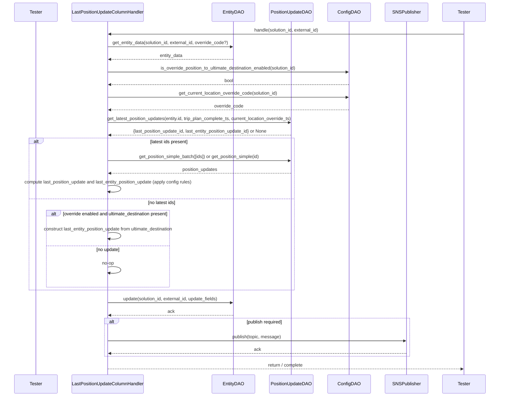

# Diagram: entity_core/entity_service/entity_service_tests/position_update_tests/test_update_last_entity_column_handler.py

> Auto-generated by Obscura crawlers

## Diagram 1

```mermaid
classDiagram
class LastPositionUpdateColumnHandler {
  +handle(solution_id, external_id)
}
class LastPositionUpdateColumnHandlerTests {
  +test_*()
  +assertLastPositionUpdateEquals(update_data, expected)
  +assertLastEntityPositionUpdateEquals(update_data, expected)
}
class FakeEntityDAO {
  +get_entity_data(solution_id, entity_external_id, current_location_override_code)
  +update(solution_id, external_id, update_fields)
}
class FakePositionUpdateDAO {
  +get_latest_position_updates(internal_entity_id, trip_plan_complete_ts, current_location_override_ts)
  +get_position_simple(position_update_id)
  +get_position_simple_batch(position_update_ids)
}
class FakeSystemConfigWithOverrideToUltimateDestinationDisabled {
  +is_override_position_to_ultimate_destination_enabled(solution_id)
  +get_current_location_override_code(solution_id)
  +get_custom_connected_car_position_type(canonical_position_type, solution_id)
}
class FakeSystemConfigWithOverrideToUltimateDestinationEnabled {
  +is_override_position_to_ultimate_destination_enabled(solution_id)
  +get_current_location_override_code(solution_id)
  +get_custom_connected_car_position_type(canonical_position_type, solution_id)
}
class FakeSystemConfigurationWithCustomPositionType {
  +is_override_position_to_ultimate_destination_enabled(solution_id)
  +get_current_location_override_code(solution_id)
  +get_custom_connected_car_position_type(canonical_position_type, solution_id)
}
class FakeSNSMessagePublisher {
  +publish(sns_topic, message, deduplication_id=None, group_id=None)
}
class DataObjects {
  brighton_position_update
  brighton_position_update_2
  aadl_ultimate_destination
  vdc_ultimate_destination
  aadl_last_position_update
  aadl_last_position_update_2
  aadl_override_position_update
  last_entity_position_update_for_entity
}
LastPositionUpdateColumnHandler --> FakeEntityDAO : uses
LastPositionUpdateColumnHandler --> FakePositionUpdateDAO : uses
LastPositionUpdateColumnHandler --> FakeSystemConfigWithOverrideToUltimateDestinationDisabled : config option (variant)
LastPositionUpdateColumnHandler --> FakeSystemConfigWithOverrideToUltimateDestinationEnabled : config option (variant)
LastPositionUpdateColumnHandler --> FakeSystemConfigurationWithCustomPositionType : config option (variant)
LastPositionUpdateColumnHandler --> FakeSNSMessagePublisher : publishes events
LastPositionUpdateColumnHandlerTests --> LastPositionUpdateColumnHandler : exercises
FakeEntityDAO ..> DataObjects : returns/updates
FakePositionUpdateDAO ..> DataObjects : returns
DataObjects <|-- brighton_position_update
DataObjects <|-- aadl_last_position_update
```

### SVG

<svg id="container" width="4900.296875" xmlns="http://www.w3.org/2000/svg" class="classDiagram" height="1134" viewBox="0 0 4900.296875 1134" role="graphics-document document" aria-roledescription="class"><g><defs><marker id="container_class-aggregationStart" class="marker aggregation class" refX="18" refY="7" markerWidth="190" markerHeight="240" orient="auto"><path d="M 18,7 L9,13 L1,7 L9,1 Z"></path></marker></defs><defs><marker id="container_class-aggregationEnd" class="marker aggregation class" refX="1" refY="7" markerWidth="20" markerHeight="28" orient="auto"><path d="M 18,7 L9,13 L1,7 L9,1 Z"></path></marker></defs><defs><marker id="container_class-extensionStart" class="marker extension class" refX="18" refY="7" markerWidth="190" markerHeight="240" orient="auto"><path d="M 1,7 L18,13 V 1 Z"></path></marker></defs><defs><marker id="container_class-extensionEnd" class="marker extension class" refX="1" refY="7" markerWidth="20" markerHeight="28" orient="auto"><path d="M 1,1 V 13 L18,7 Z"></path></marker></defs><defs><marker id="container_class-compositionStart" class="marker composition class" refX="18" refY="7" markerWidth="190" markerHeight="240" orient="auto"><path d="M 18,7 L9,13 L1,7 L9,1 Z"></path></marker></defs><defs><marker id="container_class-compositionEnd" class="marker composition class" refX="1" refY="7" markerWidth="20" markerHeight="28" orient="auto"><path d="M 18,7 L9,13 L1,7 L9,1 Z"></path></marker></defs><defs><marker id="container_class-dependencyStart" class="marker dependency class" refX="6" refY="7" markerWidth="190" markerHeight="240" orient="auto"><path d="M 5,7 L9,13 L1,7 L9,1 Z"></path></marker></defs><defs><marker id="container_class-dependencyEnd" class="marker dependency class" refX="13" refY="7" markerWidth="20" markerHeight="28" orient="auto"><path d="M 18,7 L9,13 L14,7 L9,1 Z"></path></marker></defs><defs><marker id="container_class-lollipopStart" class="marker lollipop class" refX="13" refY="7" markerWidth="190" markerHeight="240" orient="auto"><circle stroke="black" fill="transparent" cx="7" cy="7" r="6"></circle></marker></defs><defs><marker id="container_class-lollipopEnd" class="marker lollipop class" refX="1" refY="7" markerWidth="190" markerHeight="240" orient="auto"><circle stroke="black" fill="transparent" cx="7" cy="7" r="6"></circle></marker></defs><g class="root"><g class="clusters"></g><g class="edgePaths"><path d="M2302.627,328.114L1975.959,343.262C1649.29,358.41,995.954,388.705,669.285,411.019C342.617,433.333,342.617,447.667,342.617,454.833L342.617,462" id="id_LastPositionUpdateColumnHandler_FakeEntityDAO_1" class="edge-thickness-normal edge-pattern-solid relation" style=";;;" data-edge="true" data-et="edge" data-id="id_LastPositionUpdateColumnHandler_FakeEntityDAO_1" data-points="W3sieCI6MjMwMi42MjY5NTMxMjUsInkiOjMyOC4xMTQ0MTUxNzIzOTc1N30seyJ4IjozNDIuNjE3MTg3NSwieSI6NDE5fSx7IngiOjM0Mi42MTcxODc1LCJ5Ijo0Njh9XQ==" marker-end="url(#container_class-dependencyEnd)"></path><path d="M2302.627,333.617L2111.269,347.848C1919.91,362.078,1537.193,390.539,1345.835,409.936C1154.477,429.333,1154.477,439.667,1154.477,444.833L1154.477,450" id="id_LastPositionUpdateColumnHandler_FakePositionUpdateDAO_2" class="edge-thickness-normal edge-pattern-solid relation" style=";;;" data-edge="true" data-et="edge" data-id="id_LastPositionUpdateColumnHandler_FakePositionUpdateDAO_2" data-points="W3sieCI6MjMwMi42MjY5NTMxMjUsInkiOjMzMy42MTcxODQ1MzgzNn0seyJ4IjoxMTU0LjQ3NjU2MjUsInkiOjQxOX0seyJ4IjoxMTU0LjQ3NjU2MjUsInkiOjQ1Nn1d" marker-end="url(#container_class-dependencyEnd)"></path><path d="M2302.627,363.079L2261.067,372.399C2219.507,381.72,2136.386,400.36,2094.826,414.847C2053.266,429.333,2053.266,439.667,2053.266,444.833L2053.266,450" id="id_LastPositionUpdateColumnHandler_FakeSystemConfigWithOverrideToUltimateDestinationDisabled_3" class="edge-thickness-normal edge-pattern-solid relation" style=";;;" data-edge="true" data-et="edge" data-id="id_LastPositionUpdateColumnHandler_FakeSystemConfigWithOverrideToUltimateDestinationDisabled_3" data-points="W3sieCI6MjMwMi42MjY5NTMxMjUsInkiOjM2My4wNzkzNDc5MDcwMjE1NH0seyJ4IjoyMDUzLjI2NTYyNSwieSI6NDE5fSx7IngiOjIwNTMuMjY1NjI1LCJ5Ijo0NTZ9XQ==" marker-end="url(#container_class-dependencyEnd)"></path><path d="M2695.744,363.079L2737.304,372.399C2778.865,381.72,2861.985,400.36,2903.545,414.847C2945.105,429.333,2945.105,439.667,2945.105,444.833L2945.105,450" id="id_LastPositionUpdateColumnHandler_FakeSystemConfigWithOverrideToUltimateDestinationEnabled_4" class="edge-thickness-normal edge-pattern-solid relation" style=";;;" data-edge="true" data-et="edge" data-id="id_LastPositionUpdateColumnHandler_FakeSystemConfigWithOverrideToUltimateDestinationEnabled_4" data-points="W3sieCI6MjY5NS43NDQxNDA2MjUsInkiOjM2My4wNzkzNDc5MDcwMjE1NH0seyJ4IjoyOTQ1LjEwNTQ2ODc1LCJ5Ijo0MTl9LHsieCI6Mjk0NS4xMDU0Njg3NSwieSI6NDU2fV0=" marker-end="url(#container_class-dependencyEnd)"></path><path d="M2695.744,333.946L2882.175,348.122C3068.605,362.297,3441.467,390.649,3627.897,409.991C3814.328,429.333,3814.328,439.667,3814.328,444.833L3814.328,450" id="id_LastPositionUpdateColumnHandler_FakeSystemConfigurationWithCustomPositionType_5" class="edge-thickness-normal edge-pattern-solid relation" style=";;;" data-edge="true" data-et="edge" data-id="id_LastPositionUpdateColumnHandler_FakeSystemConfigurationWithCustomPositionType_5" data-points="W3sieCI6MjY5NS43NDQxNDA2MjUsInkiOjMzMy45NDU4MDEwODc5ODh9LHsieCI6MzgxNC4zMjgxMjUsInkiOjQxOX0seyJ4IjozODE0LjMyODEyNSwieSI6NDU2fV0=" marker-end="url(#container_class-dependencyEnd)"></path><path d="M2695.744,328.456L3009.416,343.547C3323.089,358.638,3950.433,388.819,4264.105,413.076C4577.777,437.333,4577.777,455.667,4577.777,464.833L4577.777,474" id="id_LastPositionUpdateColumnHandler_FakeSNSMessagePublisher_6" class="edge-thickness-normal edge-pattern-solid relation" style=";;;" data-edge="true" data-et="edge" data-id="id_LastPositionUpdateColumnHandler_FakeSNSMessagePublisher_6" data-points="W3sieCI6MjY5NS43NDQxNDA2MjUsInkiOjMyOC40NTYzMzQ1MjYzNjExfSx7IngiOjQ1NzcuNzc3MzQzNzUsInkiOjQxOX0seyJ4Ijo0NTc3Ljc3NzM0Mzc1LCJ5Ijo0ODB9XQ==" marker-end="url(#container_class-dependencyEnd)"></path><path d="M2499.186,182L2499.186,188.167C2499.186,194.333,2499.186,206.667,2499.186,218C2499.186,229.333,2499.186,239.667,2499.186,244.833L2499.186,250" id="id_LastPositionUpdateColumnHandlerTests_LastPositionUpdateColumnHandler_7" class="edge-thickness-normal edge-pattern-solid relation" style=";;;" data-edge="true" data-et="edge" data-id="id_LastPositionUpdateColumnHandlerTests_LastPositionUpdateColumnHandler_7" data-points="W3sieCI6MjQ5OS4xODU1NDY4NzUsInkiOjE4Mn0seyJ4IjoyNDk5LjE4NTU0Njg3NSwieSI6MjE5fSx7IngiOjI0OTkuMTg1NTQ2ODc1LCJ5IjoyNTZ9XQ==" marker-end="url(#container_class-dependencyEnd)"></path><path d="M342.617,618L342.617,626.167C342.617,634.333,342.617,650.667,380.268,675.621C417.918,700.576,493.219,734.152,530.87,750.94L568.52,767.728" id="id_FakeEntityDAO_DataObjects_8" class="edge-thickness-normal edge-pattern-dashed relation" style=";;;" data-edge="true" data-et="edge" data-id="id_FakeEntityDAO_DataObjects_8" data-points="W3sieCI6MzQyLjYxNzE4NzUsInkiOjYxOH0seyJ4IjozNDIuNjE3MTg3NSwieSI6NjY3fSx7IngiOjU3NCwieSI6NzcwLjE3MTI4ODkwMDg2NDJ9XQ==" marker-end="url(#container_class-dependencyEnd)"></path><path d="M1154.477,630L1154.477,636.167C1154.477,642.333,1154.477,654.667,1116.826,677.621C1079.176,700.576,1003.875,734.152,966.224,750.94L928.574,767.728" id="id_FakePositionUpdateDAO_DataObjects_9" class="edge-thickness-normal edge-pattern-dashed relation" style=";;;" data-edge="true" data-et="edge" data-id="id_FakePositionUpdateDAO_DataObjects_9" data-points="W3sieCI6MTE1NC40NzY1NjI1LCJ5Ijo2MzB9LHsieCI6MTE1NC40NzY1NjI1LCJ5Ijo2Njd9LHsieCI6OTIzLjA5Mzc1LCJ5Ijo3NzAuMTcxMjg4OTAwODY0Mn1d" marker-end="url(#container_class-dependencyEnd)"></path><path d="M623.835,1005.525L622.321,1007.437C620.807,1009.35,617.778,1013.175,616.264,1019.254C614.75,1025.333,614.75,1033.667,614.75,1037.833L614.75,1042" id="id_DataObjects_brighton_position_update_10" class="edge-thickness-normal edge-pattern-solid relation" style=";;;" data-edge="true" data-et="edge" data-id="id_DataObjects_brighton_position_update_10" data-points="W3sieCI6NjM0LjU0MjQzNzEzMDE3NzUsInkiOjk5Mn0seyJ4Ijo2MTQuNzUsInkiOjEwMTd9LHsieCI6NjE0Ljc1LCJ5IjoxMDQyfV0=" marker-start="url(#container_class-extensionStart)"></path><path d="M873.259,1005.525L874.773,1007.437C876.287,1009.35,879.315,1013.175,880.83,1019.254C882.344,1025.333,882.344,1033.667,882.344,1037.833L882.344,1042" id="id_DataObjects_aadl_last_position_update_11" class="edge-thickness-normal edge-pattern-solid relation" style=";;;" data-edge="true" data-et="edge" data-id="id_DataObjects_aadl_last_position_update_11" data-points="W3sieCI6ODYyLjU1MTMxMjg2OTgyMjUsInkiOjk5Mn0seyJ4Ijo4ODIuMzQzNzUsInkiOjEwMTd9LHsieCI6ODgyLjM0Mzc1LCJ5IjoxMDQyfV0=" marker-start="url(#container_class-extensionStart)"></path></g><g class="edgeLabels"><g class="edgeLabel" transform="translate(342.6171875, 419)"><g class="label" data-id="id_LastPositionUpdateColumnHandler_FakeEntityDAO_1" transform="translate(-16.4921875, -12)"><foreignObject width="32.984375" height="24">

uses

</foreignObject></g></g><g class="edgeLabel" transform="translate(1154.4765625, 419)"><g class="label" data-id="id_LastPositionUpdateColumnHandler_FakePositionUpdateDAO_2" transform="translate(-16.4921875, -12)"><foreignObject width="32.984375" height="24">

uses

</foreignObject></g></g><g class="edgeLabel" transform="translate(2053.265625, 419)"><g class="label" data-id="id_LastPositionUpdateColumnHandler_FakeSystemConfigWithOverrideToUltimateDestinationDisabled_3" transform="translate(-80.5703125, -12)"><foreignObject width="161.140625" height="24">

config option (variant)

</foreignObject></g></g><g class="edgeLabel" transform="translate(2945.10546875, 419)"><g class="label" data-id="id_LastPositionUpdateColumnHandler_FakeSystemConfigWithOverrideToUltimateDestinationEnabled_4" transform="translate(-80.5703125, -12)"><foreignObject width="161.140625" height="24">

config option (variant)

</foreignObject></g></g><g class="edgeLabel" transform="translate(3814.328125, 419)"><g class="label" data-id="id_LastPositionUpdateColumnHandler_FakeSystemConfigurationWithCustomPositionType_5" transform="translate(-80.5703125, -12)"><foreignObject width="161.140625" height="24">

config option (variant)

</foreignObject></g></g><g class="edgeLabel" transform="translate(4577.77734375, 419)"><g class="label" data-id="id_LastPositionUpdateColumnHandler_FakeSNSMessagePublisher_6" transform="translate(-61.3046875, -12)"><foreignObject width="122.609375" height="24">

publishes events

</foreignObject></g></g><g class="edgeLabel" transform="translate(2499.185546875, 219)"><g class="label" data-id="id_LastPositionUpdateColumnHandlerTests_LastPositionUpdateColumnHandler_7" transform="translate(-33.21875, -12)"><foreignObject width="66.4375" height="24">

exercises

</foreignObject></g></g><g class="edgeLabel" transform="translate(342.6171875, 667)"><g class="label" data-id="id_FakeEntityDAO_DataObjects_8" transform="translate(-59.59375, -12)"><foreignObject width="119.1875" height="24">

returns/updates

</foreignObject></g></g><g class="edgeLabel" transform="translate(1154.4765625, 667)"><g class="label" data-id="id_FakePositionUpdateDAO_DataObjects_9" transform="translate(-26.265625, -12)"><foreignObject width="52.53125" height="24">

returns

</foreignObject></g></g><g class="edgeLabel"><g class="label" data-id="id_DataObjects_brighton_position_update_10" transform="translate(0, 0)"><foreignObject width="0" height="0">

</foreignObject></g></g><g class="edgeLabel"><g class="label" data-id="id_DataObjects_aadl_last_position_update_11" transform="translate(0, 0)"><foreignObject width="0" height="0">

</foreignObject></g></g></g><g class="nodes"><g class="node default" id="classId-LastPositionUpdateColumnHandler-0" transform="translate(2499.185546875, 319)"><g class="basic label-container"><path d="M-196.55859375 -63 L196.55859375 -63 L196.55859375 63 L-196.55859375 63" stroke="none" stroke-width="0" fill="#ECECFF" style=""></path><path d="M-196.55859375 -63 C-41.99555056751308 -63, 112.56749261497384 -63, 196.55859375 -63 M-196.55859375 -63 C-111.67100180999091 -63, -26.783409869981824 -63, 196.55859375 -63 M196.55859375 -63 C196.55859375 -28.30304728883646, 196.55859375 6.39390542232708, 196.55859375 63 M196.55859375 -63 C196.55859375 -36.020882738520626, 196.55859375 -9.04176547704126, 196.55859375 63 M196.55859375 63 C103.34938262369162 63, 10.14017149738325 63, -196.55859375 63 M196.55859375 63 C66.46053304145457 63, -63.637527667090865 63, -196.55859375 63 M-196.55859375 63 C-196.55859375 36.71839397190617, -196.55859375 10.436787943812341, -196.55859375 -63 M-196.55859375 63 C-196.55859375 22.87943773092455, -196.55859375 -17.2411245381509, -196.55859375 -63" stroke="#9370DB" stroke-width="1.3" fill="none" stroke-dasharray="0 0" style=""></path></g><g class="annotation-group text" transform="translate(0, -39)"></g><g class="label-group text" transform="translate(-128.3203125, -39)"><g class="label" style="font-weight: bolder" transform="translate(0,-12)"><foreignObject width="256.640625" height="24">

LastPositionUpdateColumnHandler

</foreignObject></g></g><g class="members-group text" transform="translate(-184.55859375, 9)"></g><g class="methods-group text" transform="translate(-184.55859375, 39)"><g class="label" style="" transform="translate(0,-12)"><foreignObject width="240.796875" height="24">

+handle(solution_id, external_id)

</foreignObject></g></g><g class="divider" style=""><path d="M-196.55859375 -15 C-76.55416664840193 -15, 43.45026045319614 -15, 196.55859375 -15 M-196.55859375 -15 C-109.89445951336313 -15, -23.230325276726262 -15, 196.55859375 -15" stroke="#9370DB" stroke-width="1.3" fill="none" stroke-dasharray="0 0" style=""></path></g><g class="divider" style=""><path d="M-196.55859375 9 C-52.595699836617 9, 91.367194076766 9, 196.55859375 9 M-196.55859375 9 C-47.34367111648237 9, 101.87125151703526 9, 196.55859375 9" stroke="#9370DB" stroke-width="1.3" fill="none" stroke-dasharray="0 0" style=""></path></g></g><g class="node default" id="classId-LastPositionUpdateColumnHandlerTests-1" transform="translate(2499.185546875, 95)"><g class="basic label-container"><path d="M-315.0859375 -87 L315.0859375 -87 L315.0859375 87 L-315.0859375 87" stroke="none" stroke-width="0" fill="#ECECFF" style=""></path><path d="M-315.0859375 -87 C-149.337448484564 -87, 16.411040530872015 -87, 315.0859375 -87 M-315.0859375 -87 C-69.62926661309515 -87, 175.8274042738097 -87, 315.0859375 -87 M315.0859375 -87 C315.0859375 -36.17588746276027, 315.0859375 14.648225074479456, 315.0859375 87 M315.0859375 -87 C315.0859375 -19.992263686968826, 315.0859375 47.01547262606235, 315.0859375 87 M315.0859375 87 C163.92979020628204 87, 12.773642912564071 87, -315.0859375 87 M315.0859375 87 C129.1108905973266 87, -56.864156305346796 87, -315.0859375 87 M-315.0859375 87 C-315.0859375 47.53332464727846, -315.0859375 8.066649294556925, -315.0859375 -87 M-315.0859375 87 C-315.0859375 18.62304677223878, -315.0859375 -49.75390645552244, -315.0859375 -87" stroke="#9370DB" stroke-width="1.3" fill="none" stroke-dasharray="0 0" style=""></path></g><g class="annotation-group text" transform="translate(0, -63)"></g><g class="label-group text" transform="translate(-147.4375, -63)"><g class="label" style="font-weight: bolder" transform="translate(0,-12)"><foreignObject width="294.875" height="24">

LastPositionUpdateColumnHandlerTests

</foreignObject></g></g><g class="members-group text" transform="translate(-303.0859375, -15)"></g><g class="methods-group text" transform="translate(-303.0859375, 15)"><g class="label" style="" transform="translate(0,-12)"><foreignObject width="59.53125" height="24">

+test_*()

</foreignObject></g><g class="label" style="" transform="translate(0,12)"><foreignObject width="417.09375" height="24">

+assertLastPositionUpdateEquals(update_data, expected)

</foreignObject></g><g class="label" style="" transform="translate(0,36)"><foreignObject width="458.734375" height="24">

+assertLastEntityPositionUpdateEquals(update_data, expected)

</foreignObject></g></g><g class="divider" style=""><path d="M-315.0859375 -39 C-151.059628342934 -39, 12.966680814132019 -39, 315.0859375 -39 M-315.0859375 -39 C-166.3868962204114 -39, -17.687854940822774 -39, 315.0859375 -39" stroke="#9370DB" stroke-width="1.3" fill="none" stroke-dasharray="0 0" style=""></path></g><g class="divider" style=""><path d="M-315.0859375 -15 C-75.66046134302402 -15, 163.76501481395195 -15, 315.0859375 -15 M-315.0859375 -15 C-65.49208099455817 -15, 184.10177551088367 -15, 315.0859375 -15" stroke="#9370DB" stroke-width="1.3" fill="none" stroke-dasharray="0 0" style=""></path></g></g><g class="node default" id="classId-FakeEntityDAO-2" transform="translate(342.6171875, 543)"><g class="basic label-container"><path d="M-334.6171875 -75 L334.6171875 -75 L334.6171875 75 L-334.6171875 75" stroke="none" stroke-width="0" fill="#ECECFF" style=""></path><path d="M-334.6171875 -75 C-126.9573967627847 -75, 80.7023939744306 -75, 334.6171875 -75 M-334.6171875 -75 C-127.01275192430947 -75, 80.59168365138106 -75, 334.6171875 -75 M334.6171875 -75 C334.6171875 -34.1288918383261, 334.6171875 6.7422163233478045, 334.6171875 75 M334.6171875 -75 C334.6171875 -26.37976958555739, 334.6171875 22.24046082888522, 334.6171875 75 M334.6171875 75 C181.26600917914573 75, 27.914830858291452 75, -334.6171875 75 M334.6171875 75 C135.8738694970896 75, -62.8694485058208 75, -334.6171875 75 M-334.6171875 75 C-334.6171875 44.922583599276784, -334.6171875 14.845167198553568, -334.6171875 -75 M-334.6171875 75 C-334.6171875 16.17924210742933, -334.6171875 -42.64151578514134, -334.6171875 -75" stroke="#9370DB" stroke-width="1.3" fill="none" stroke-dasharray="0 0" style=""></path></g><g class="annotation-group text" transform="translate(0, -51)"></g><g class="label-group text" transform="translate(-53.109375, -51)"><g class="label" style="font-weight: bolder" transform="translate(0,-12)"><foreignObject width="106.21875" height="24">

FakeEntityDAO

</foreignObject></g></g><g class="members-group text" transform="translate(-322.6171875, -3)"></g><g class="methods-group text" transform="translate(-322.6171875, 27)"><g class="label" style="" transform="translate(0,-12)"><foreignObject width="592.125" height="24">

+get_entity_data(solution_id, entity_external_id, current_location_override_code)

</foreignObject></g><g class="label" style="" transform="translate(0,12)"><foreignObject width="348.453125" height="24">

+update(solution_id, external_id, update_fields)

</foreignObject></g></g><g class="divider" style=""><path d="M-334.6171875 -27 C-110.46112534763563 -27, 113.69493680472874 -27, 334.6171875 -27 M-334.6171875 -27 C-87.94349118434252 -27, 158.73020513131496 -27, 334.6171875 -27" stroke="#9370DB" stroke-width="1.3" fill="none" stroke-dasharray="0 0" style=""></path></g><g class="divider" style=""><path d="M-334.6171875 -3 C-89.49107464110082 -3, 155.63503821779835 -3, 334.6171875 -3 M-334.6171875 -3 C-85.74517783597574 -3, 163.12683182804852 -3, 334.6171875 -3" stroke="#9370DB" stroke-width="1.3" fill="none" stroke-dasharray="0 0" style=""></path></g></g><g class="node default" id="classId-FakePositionUpdateDAO-3" transform="translate(1154.4765625, 543)"><g class="basic label-container"><path d="M-427.2421875 -87 L427.2421875 -87 L427.2421875 87 L-427.2421875 87" stroke="none" stroke-width="0" fill="#ECECFF" style=""></path><path d="M-427.2421875 -87 C-247.15790306827958 -87, -67.07361863655916 -87, 427.2421875 -87 M-427.2421875 -87 C-144.34752259646655 -87, 138.5471423070669 -87, 427.2421875 -87 M427.2421875 -87 C427.2421875 -43.50028824896073, 427.2421875 -0.0005764979214575305, 427.2421875 87 M427.2421875 -87 C427.2421875 -28.3638375792752, 427.2421875 30.272324841449603, 427.2421875 87 M427.2421875 87 C167.58010424079316 87, -92.08197901841368 87, -427.2421875 87 M427.2421875 87 C171.77185513507473 87, -83.69847722985054 87, -427.2421875 87 M-427.2421875 87 C-427.2421875 38.84598668710252, -427.2421875 -9.308026625794966, -427.2421875 -87 M-427.2421875 87 C-427.2421875 34.140174200529344, -427.2421875 -18.71965159894131, -427.2421875 -87" stroke="#9370DB" stroke-width="1.3" fill="none" stroke-dasharray="0 0" style=""></path></g><g class="annotation-group text" transform="translate(0, -63)"></g><g class="label-group text" transform="translate(-88.34375, -63)"><g class="label" style="font-weight: bolder" transform="translate(0,-12)"><foreignObject width="176.6875" height="24">

FakePositionUpdateDAO

</foreignObject></g></g><g class="members-group text" transform="translate(-415.2421875, -15)"></g><g class="methods-group text" transform="translate(-415.2421875, 15)"><g class="label" style="" transform="translate(0,-12)"><foreignObject width="742.140625" height="24">

+get_latest_position_updates(internal_entity_id, trip_plan_complete_ts, current_location_override_ts)

</foreignObject></g><g class="label" style="" transform="translate(0,12)"><foreignObject width="307.1875" height="24">

+get_position_simple(position_update_id)

</foreignObject></g><g class="label" style="" transform="translate(0,36)"><foreignObject width="363.265625" height="24">

+get_position_simple_batch(position_update_ids)

</foreignObject></g></g><g class="divider" style=""><path d="M-427.2421875 -39 C-249.28264315898588 -39, -71.32309881797175 -39, 427.2421875 -39 M-427.2421875 -39 C-146.37080572884923 -39, 134.50057604230153 -39, 427.2421875 -39" stroke="#9370DB" stroke-width="1.3" fill="none" stroke-dasharray="0 0" style=""></path></g><g class="divider" style=""><path d="M-427.2421875 -15 C-218.46593330418122 -15, -9.68967910836244 -15, 427.2421875 -15 M-427.2421875 -15 C-100.63529496603553 -15, 225.97159756792894 -15, 427.2421875 -15" stroke="#9370DB" stroke-width="1.3" fill="none" stroke-dasharray="0 0" style=""></path></g></g><g class="node default" id="classId-FakeSystemConfigWithOverrideToUltimateDestinationDisabled-4" transform="translate(2053.265625, 543)"><g class="basic label-container"><path d="M-421.546875 -87 L421.546875 -87 L421.546875 87 L-421.546875 87" stroke="none" stroke-width="0" fill="#ECECFF" style=""></path><path d="M-421.546875 -87 C-229.0782751284589 -87, -36.6096752569178 -87, 421.546875 -87 M-421.546875 -87 C-195.11553189591896 -87, 31.315811208162074 -87, 421.546875 -87 M421.546875 -87 C421.546875 -22.63748529835651, 421.546875 41.72502940328698, 421.546875 87 M421.546875 -87 C421.546875 -43.89518844322395, 421.546875 -0.7903768864479019, 421.546875 87 M421.546875 87 C193.5530803769218 87, -34.4407142461564 87, -421.546875 87 M421.546875 87 C134.17454668809592 87, -153.19778162380817 87, -421.546875 87 M-421.546875 87 C-421.546875 27.589610051845803, -421.546875 -31.820779896308395, -421.546875 -87 M-421.546875 87 C-421.546875 36.00133608072563, -421.546875 -14.997327838548742, -421.546875 -87" stroke="#9370DB" stroke-width="1.3" fill="none" stroke-dasharray="0 0" style=""></path></g><g class="annotation-group text" transform="translate(0, -63)"></g><g class="label-group text" transform="translate(-229.03125, -63)"><g class="label" style="font-weight: bolder" transform="translate(0,-12)"><foreignObject width="458.0625" height="24">

FakeSystemConfigWithOverrideToUltimateDestinationDisabled

</foreignObject></g></g><g class="members-group text" transform="translate(-409.546875, -15)"></g><g class="methods-group text" transform="translate(-409.546875, 15)"><g class="label" style="" transform="translate(0,-12)"><foreignObject width="498.578125" height="24">

+is_override_position_to_ultimate_destination_enabled(solution_id)

</foreignObject></g><g class="label" style="" transform="translate(0,12)"><foreignObject width="362.59375" height="24">

+get_current_location_override_code(solution_id)

</foreignObject></g><g class="label" style="" transform="translate(0,36)"><foreignObject width="590.0625" height="24">

+get_custom_connected_car_position_type(canonical_position_type, solution_id)

</foreignObject></g></g><g class="divider" style=""><path d="M-421.546875 -39 C-173.9835636546312 -39, 73.57974769073758 -39, 421.546875 -39 M-421.546875 -39 C-152.57257405414737 -39, 116.40172689170527 -39, 421.546875 -39" stroke="#9370DB" stroke-width="1.3" fill="none" stroke-dasharray="0 0" style=""></path></g><g class="divider" style=""><path d="M-421.546875 -15 C-97.10712811906075 -15, 227.3326187618785 -15, 421.546875 -15 M-421.546875 -15 C-233.19779851892707 -15, -44.848722037854145 -15, 421.546875 -15" stroke="#9370DB" stroke-width="1.3" fill="none" stroke-dasharray="0 0" style=""></path></g></g><g class="node default" id="classId-FakeSystemConfigWithOverrideToUltimateDestinationEnabled-5" transform="translate(2945.10546875, 543)"><g class="basic label-container"><path d="M-420.29296875 -87 L420.29296875 -87 L420.29296875 87 L-420.29296875 87" stroke="none" stroke-width="0" fill="#ECECFF" style=""></path><path d="M-420.29296875 -87 C-248.9338040775861 -87, -77.5746394051722 -87, 420.29296875 -87 M-420.29296875 -87 C-153.41611783267024 -87, 113.46073308465952 -87, 420.29296875 -87 M420.29296875 -87 C420.29296875 -44.46663749161877, 420.29296875 -1.9332749832375384, 420.29296875 87 M420.29296875 -87 C420.29296875 -30.1689767021742, 420.29296875 26.662046595651603, 420.29296875 87 M420.29296875 87 C241.0909415534938 87, 61.888914356987584 87, -420.29296875 87 M420.29296875 87 C97.48813986781238 87, -225.31668901437524 87, -420.29296875 87 M-420.29296875 87 C-420.29296875 30.283256901965466, -420.29296875 -26.43348619606907, -420.29296875 -87 M-420.29296875 87 C-420.29296875 19.254839914811726, -420.29296875 -48.49032017037655, -420.29296875 -87" stroke="#9370DB" stroke-width="1.3" fill="none" stroke-dasharray="0 0" style=""></path></g><g class="annotation-group text" transform="translate(0, -63)"></g><g class="label-group text" transform="translate(-226.5234375, -63)"><g class="label" style="font-weight: bolder" transform="translate(0,-12)"><foreignObject width="453.046875" height="24">

FakeSystemConfigWithOverrideToUltimateDestinationEnabled

</foreignObject></g></g><g class="members-group text" transform="translate(-408.29296875, -15)"></g><g class="methods-group text" transform="translate(-408.29296875, 15)"><g class="label" style="" transform="translate(0,-12)"><foreignObject width="498.578125" height="24">

+is_override_position_to_ultimate_destination_enabled(solution_id)

</foreignObject></g><g class="label" style="" transform="translate(0,12)"><foreignObject width="362.59375" height="24">

+get_current_location_override_code(solution_id)

</foreignObject></g><g class="label" style="" transform="translate(0,36)"><foreignObject width="590.0625" height="24">

+get_custom_connected_car_position_type(canonical_position_type, solution_id)

</foreignObject></g></g><g class="divider" style=""><path d="M-420.29296875 -39 C-153.14268160293267 -39, 114.00760554413466 -39, 420.29296875 -39 M-420.29296875 -39 C-119.6429112336096 -39, 181.0071462827808 -39, 420.29296875 -39" stroke="#9370DB" stroke-width="1.3" fill="none" stroke-dasharray="0 0" style=""></path></g><g class="divider" style=""><path d="M-420.29296875 -15 C-189.02706514124694 -15, 42.23883846750613 -15, 420.29296875 -15 M-420.29296875 -15 C-152.35404180635436 -15, 115.58488513729128 -15, 420.29296875 -15" stroke="#9370DB" stroke-width="1.3" fill="none" stroke-dasharray="0 0" style=""></path></g></g><g class="node default" id="classId-FakeSystemConfigurationWithCustomPositionType-6" transform="translate(3814.328125, 543)"><g class="basic label-container"><path d="M-398.9296875 -87 L398.9296875 -87 L398.9296875 87 L-398.9296875 87" stroke="none" stroke-width="0" fill="#ECECFF" style=""></path><path d="M-398.9296875 -87 C-113.55400151309078 -87, 171.82168447381844 -87, 398.9296875 -87 M-398.9296875 -87 C-226.02775510175695 -87, -53.125822703513904 -87, 398.9296875 -87 M398.9296875 -87 C398.9296875 -45.90060807162086, 398.9296875 -4.801216143241717, 398.9296875 87 M398.9296875 -87 C398.9296875 -19.20361491848746, 398.9296875 48.59277016302508, 398.9296875 87 M398.9296875 87 C214.75422170984749 87, 30.57875591969497 87, -398.9296875 87 M398.9296875 87 C153.20705852542804 87, -92.51557044914392 87, -398.9296875 87 M-398.9296875 87 C-398.9296875 47.260420810781824, -398.9296875 7.5208416215636475, -398.9296875 -87 M-398.9296875 87 C-398.9296875 21.941434223955554, -398.9296875 -43.11713155208889, -398.9296875 -87" stroke="#9370DB" stroke-width="1.3" fill="none" stroke-dasharray="0 0" style=""></path></g><g class="annotation-group text" transform="translate(0, -63)"></g><g class="label-group text" transform="translate(-183.796875, -63)"><g class="label" style="font-weight: bolder" transform="translate(0,-12)"><foreignObject width="367.59375" height="24">

FakeSystemConfigurationWithCustomPositionType

</foreignObject></g></g><g class="members-group text" transform="translate(-386.9296875, -15)"></g><g class="methods-group text" transform="translate(-386.9296875, 15)"><g class="label" style="" transform="translate(0,-12)"><foreignObject width="498.578125" height="24">

+is_override_position_to_ultimate_destination_enabled(solution_id)

</foreignObject></g><g class="label" style="" transform="translate(0,12)"><foreignObject width="362.59375" height="24">

+get_current_location_override_code(solution_id)

</foreignObject></g><g class="label" style="" transform="translate(0,36)"><foreignObject width="590.0625" height="24">

+get_custom_connected_car_position_type(canonical_position_type, solution_id)

</foreignObject></g></g><g class="divider" style=""><path d="M-398.9296875 -39 C-117.106360401779 -39, 164.716966696442 -39, 398.9296875 -39 M-398.9296875 -39 C-169.270975047705 -39, 60.387737404589984 -39, 398.9296875 -39" stroke="#9370DB" stroke-width="1.3" fill="none" stroke-dasharray="0 0" style=""></path></g><g class="divider" style=""><path d="M-398.9296875 -15 C-235.2365815377556 -15, -71.5434755755112 -15, 398.9296875 -15 M-398.9296875 -15 C-104.86095338698016 -15, 189.2077807260397 -15, 398.9296875 -15" stroke="#9370DB" stroke-width="1.3" fill="none" stroke-dasharray="0 0" style=""></path></g></g><g class="node default" id="classId-FakeSNSMessagePublisher-7" transform="translate(4577.77734375, 543)"><g class="basic label-container"><path d="M-314.51953125 -63 L314.51953125 -63 L314.51953125 63 L-314.51953125 63" stroke="none" stroke-width="0" fill="#ECECFF" style=""></path><path d="M-314.51953125 -63 C-71.57333168217647 -63, 171.37286788564705 -63, 314.51953125 -63 M-314.51953125 -63 C-90.03835292078915 -63, 134.4428254084217 -63, 314.51953125 -63 M314.51953125 -63 C314.51953125 -18.761456743597158, 314.51953125 25.477086512805684, 314.51953125 63 M314.51953125 -63 C314.51953125 -18.940586853289503, 314.51953125 25.118826293420994, 314.51953125 63 M314.51953125 63 C74.14080587859686 63, -166.23791949280627 63, -314.51953125 63 M314.51953125 63 C108.44044750036556 63, -97.63863624926887 63, -314.51953125 63 M-314.51953125 63 C-314.51953125 16.805514596827834, -314.51953125 -29.388970806344332, -314.51953125 -63 M-314.51953125 63 C-314.51953125 21.902704469414623, -314.51953125 -19.194591061170755, -314.51953125 -63" stroke="#9370DB" stroke-width="1.3" fill="none" stroke-dasharray="0 0" style=""></path></g><g class="annotation-group text" transform="translate(0, -39)"></g><g class="label-group text" transform="translate(-96.8359375, -39)"><g class="label" style="font-weight: bolder" transform="translate(0,-12)"><foreignObject width="193.671875" height="24">

FakeSNSMessagePublisher

</foreignObject></g></g><g class="members-group text" transform="translate(-302.51953125, 9)"></g><g class="methods-group text" transform="translate(-302.51953125, 39)"><g class="label" style="" transform="translate(0,-12)"><foreignObject width="508.203125" height="24">

+publish(sns_topic, message, deduplication_id=None, group_id=None)

</foreignObject></g></g><g class="divider" style=""><path d="M-314.51953125 -15 C-113.04763325476355 -15, 88.42426474047289 -15, 314.51953125 -15 M-314.51953125 -15 C-106.75371783379563 -15, 101.01209558240873 -15, 314.51953125 -15" stroke="#9370DB" stroke-width="1.3" fill="none" stroke-dasharray="0 0" style=""></path></g><g class="divider" style=""><path d="M-314.51953125 9 C-89.29648953296868 9, 135.92655218406264 9, 314.51953125 9 M-314.51953125 9 C-137.24147021317637 9, 40.03659082364726 9, 314.51953125 9" stroke="#9370DB" stroke-width="1.3" fill="none" stroke-dasharray="0 0" style=""></path></g></g><g class="node default" id="classId-DataObjects-8" transform="translate(748.546875, 848)"><g class="basic label-container"><path d="M-174.546875 -144 L174.546875 -144 L174.546875 144 L-174.546875 144" stroke="none" stroke-width="0" fill="#ECECFF" style=""></path><path d="M-174.546875 -144 C-53.308829260623966 -144, 67.92921647875207 -144, 174.546875 -144 M-174.546875 -144 C-66.65960307352505 -144, 41.227668852949904 -144, 174.546875 -144 M174.546875 -144 C174.546875 -73.68421964509945, 174.546875 -3.368439290198893, 174.546875 144 M174.546875 -144 C174.546875 -79.91836178622087, 174.546875 -15.836723572441741, 174.546875 144 M174.546875 144 C37.86178629129469 144, -98.82330241741062 144, -174.546875 144 M174.546875 144 C52.50111416586702 144, -69.54464666826595 144, -174.546875 144 M-174.546875 144 C-174.546875 70.80230271144991, -174.546875 -2.395394577100177, -174.546875 -144 M-174.546875 144 C-174.546875 47.476464302618, -174.546875 -49.047071394764004, -174.546875 -144" stroke="#9370DB" stroke-width="1.3" fill="none" stroke-dasharray="0 0" style=""></path></g><g class="annotation-group text" transform="translate(0, -120)"></g><g class="label-group text" transform="translate(-44.640625, -120)"><g class="label" style="font-weight: bolder" transform="translate(0,-12)"><foreignObject width="89.28125" height="24">

DataObjects

</foreignObject></g></g><g class="members-group text" transform="translate(-162.546875, -72)"><g class="label" style="" transform="translate(0,-12)"><foreignObject width="189.65625" height="24">

brighton_position_update

</foreignObject></g><g class="label" style="" transform="translate(0,12)"><foreignObject width="205.578125" height="24">

brighton_position_update_2

</foreignObject></g><g class="label" style="" transform="translate(0,36)"><foreignObject width="191.375" height="24">

aadl_ultimate_destination

</foreignObject></g><g class="label" style="" transform="translate(0,60)"><foreignObject width="184.8125" height="24">

vdc_ultimate_destination

</foreignObject></g><g class="label" style="" transform="translate(0,84)"><foreignObject width="193.65625" height="24">

aadl_last_position_update

</foreignObject></g><g class="label" style="" transform="translate(0,108)"><foreignObject width="209.578125" height="24">

aadl_last_position_update_2

</foreignObject></g><g class="label" style="" transform="translate(0,132)"><foreignObject width="227.734375" height="24">

aadl_override_position_update

</foreignObject></g><g class="label" style="" transform="translate(0,156)"><foreignObject width="280.453125" height="24">

last_entity_position_update_for_entity

</foreignObject></g></g><g class="methods-group text" transform="translate(-162.546875, 144)"></g><g class="divider" style=""><path d="M-174.546875 -96 C-91.25463715862436 -96, -7.962399317248725 -96, 174.546875 -96 M-174.546875 -96 C-101.72163068504257 -96, -28.89638637008514 -96, 174.546875 -96" stroke="#9370DB" stroke-width="1.3" fill="none" stroke-dasharray="0 0" style=""></path></g><g class="divider" style=""><path d="M-174.546875 120 C-85.84020856698741 120, 2.866457866025172 120, 174.546875 120 M-174.546875 120 C-78.71068053860547 120, 17.125513922789054 120, 174.546875 120" stroke="#9370DB" stroke-width="1.3" fill="none" stroke-dasharray="0 0" style=""></path></g></g><g class="node default" id="classId-brighton_position_update-9" transform="translate(614.75, 1084)"><g class="basic label-container"><path d="M-107.7578125 -42 L107.7578125 -42 L107.7578125 42 L-107.7578125 42" stroke="none" stroke-width="0" fill="#ECECFF" style=""></path><path d="M-107.7578125 -42 C-40.51313901006961 -42, 26.731534479860784 -42, 107.7578125 -42 M-107.7578125 -42 C-52.30488956899023 -42, 3.1480333620195466 -42, 107.7578125 -42 M107.7578125 -42 C107.7578125 -16.516637994848605, 107.7578125 8.96672401030279, 107.7578125 42 M107.7578125 -42 C107.7578125 -15.218993819744497, 107.7578125 11.562012360511005, 107.7578125 42 M107.7578125 42 C28.161733230343103 42, -51.434346039313795 42, -107.7578125 42 M107.7578125 42 C46.969368998023995 42, -13.81907450395201 42, -107.7578125 42 M-107.7578125 42 C-107.7578125 15.416322511916729, -107.7578125 -11.167354976166543, -107.7578125 -42 M-107.7578125 42 C-107.7578125 21.90733022261511, -107.7578125 1.814660445230217, -107.7578125 -42" stroke="#9370DB" stroke-width="1.3" fill="none" stroke-dasharray="0 0" style=""></path></g><g class="annotation-group text" transform="translate(0, -18)"></g><g class="label-group text" transform="translate(-95.7578125, -18)"><g class="label" style="font-weight: bolder" transform="translate(0,-12)"><foreignObject width="191.515625" height="24">

brighton_position_update

</foreignObject></g></g><g class="members-group text" transform="translate(-95.7578125, 30)"></g><g class="methods-group text" transform="translate(-95.7578125, 60)"></g><g class="divider" style=""><path d="M-107.7578125 6 C-27.25705822539986 6, 53.24369604920028 6, 107.7578125 6 M-107.7578125 6 C-63.563127346191614 6, -19.368442192383228 6, 107.7578125 6" stroke="#9370DB" stroke-width="1.3" fill="none" stroke-dasharray="0 0" style=""></path></g><g class="divider" style=""><path d="M-107.7578125 24 C-39.638468510437605 24, 28.48087547912479 24, 107.7578125 24 M-107.7578125 24 C-40.55564019335564 24, 26.646532113288714 24, 107.7578125 24" stroke="#9370DB" stroke-width="1.3" fill="none" stroke-dasharray="0 0" style=""></path></g></g><g class="node default" id="classId-aadl_last_position_update-10" transform="translate(882.34375, 1084)"><g class="basic label-container"><path d="M-109.8359375 -42 L109.8359375 -42 L109.8359375 42 L-109.8359375 42" stroke="none" stroke-width="0" fill="#ECECFF" style=""></path><path d="M-109.8359375 -42 C-58.99282439176885 -42, -8.149711283537698 -42, 109.8359375 -42 M-109.8359375 -42 C-55.28827032830703 -42, -0.740603156614057 -42, 109.8359375 -42 M109.8359375 -42 C109.8359375 -10.847004552019229, 109.8359375 20.305990895961543, 109.8359375 42 M109.8359375 -42 C109.8359375 -10.083651301632997, 109.8359375 21.832697396734005, 109.8359375 42 M109.8359375 42 C53.348928512726246 42, -3.1380804745475075 42, -109.8359375 42 M109.8359375 42 C57.03974442883207 42, 4.2435513576641455 42, -109.8359375 42 M-109.8359375 42 C-109.8359375 11.125348330193646, -109.8359375 -19.74930333961271, -109.8359375 -42 M-109.8359375 42 C-109.8359375 10.277792186796063, -109.8359375 -21.444415626407874, -109.8359375 -42" stroke="#9370DB" stroke-width="1.3" fill="none" stroke-dasharray="0 0" style=""></path></g><g class="annotation-group text" transform="translate(0, -18)"></g><g class="label-group text" transform="translate(-97.8359375, -18)"><g class="label" style="font-weight: bolder" transform="translate(0,-12)"><foreignObject width="195.671875" height="24">

aadl_last_position_update

</foreignObject></g></g><g class="members-group text" transform="translate(-97.8359375, 30)"></g><g class="methods-group text" transform="translate(-97.8359375, 60)"></g><g class="divider" style=""><path d="M-109.8359375 6 C-50.657197926183684 6, 8.521541647632631 6, 109.8359375 6 M-109.8359375 6 C-39.17520961265754 6, 31.48551827468492 6, 109.8359375 6" stroke="#9370DB" stroke-width="1.3" fill="none" stroke-dasharray="0 0" style=""></path></g><g class="divider" style=""><path d="M-109.8359375 24 C-64.57997383184252 24, -19.32401016368506 24, 109.8359375 24 M-109.8359375 24 C-33.684184391994336 24, 42.46756871601133 24, 109.8359375 24" stroke="#9370DB" stroke-width="1.3" fill="none" stroke-dasharray="0 0" style=""></path></g></g></g></g></g></svg>

## Diagram 2

### SVG

<svg id="container" width="1808.5" xmlns="http://www.w3.org/2000/svg" height="1458" viewBox="-50 -10 1808.5 1458" role="graphics-document document" aria-roledescription="sequence"><g><rect x="1558.5" y="1372" fill="#eaeaea" stroke="#666" width="150" height="65" name="Tester" rx="3" ry="3" class="actor actor-bottom"></rect><text x="1633.5" y="1404.5" dominant-baseline="central" alignment-baseline="central" class="actor actor-box" style="text-anchor: middle; font-size: 16px; font-weight: 400;"><tspan x="1633.5" dy="0">Tester</tspan></text></g><g><rect x="1358.5" y="1372" fill="#eaeaea" stroke="#666" width="150" height="65" name="SNS" rx="3" ry="3" class="actor actor-bottom"></rect><text x="1433.5" y="1404.5" dominant-baseline="central" alignment-baseline="central" class="actor actor-box" style="text-anchor: middle; font-size: 16px; font-weight: 400;"><tspan x="1433.5" dy="0">SNSPublisher</tspan></text></g><g><rect x="1158.5" y="1372" fill="#eaeaea" stroke="#666" width="150" height="65" name="Config" rx="3" ry="3" class="actor actor-bottom"></rect><text x="1233.5" y="1404.5" dominant-baseline="central" alignment-baseline="central" class="actor actor-box" style="text-anchor: middle; font-size: 16px; font-weight: 400;"><tspan x="1233.5" dy="0">ConfigDAO</tspan></text></g><g><rect x="946.5" y="1372" fill="#eaeaea" stroke="#666" width="162" height="65" name="PosDAO" rx="3" ry="3" class="actor actor-bottom"></rect><text x="1027.5" y="1404.5" dominant-baseline="central" alignment-baseline="central" class="actor actor-box" style="text-anchor: middle; font-size: 16px; font-weight: 400;"><tspan x="1027.5" dy="0">PositionUpdateDAO</tspan></text></g><g><rect x="746.5" y="1372" fill="#eaeaea" stroke="#666" width="150" height="65" name="Entity" rx="3" ry="3" class="actor actor-bottom"></rect><text x="821.5" y="1404.5" dominant-baseline="central" alignment-baseline="central" class="actor actor-box" style="text-anchor: middle; font-size: 16px; font-weight: 400;"><tspan x="821.5" dy="0">EntityDAO</tspan></text></g><g><rect x="200" y="1372" fill="#eaeaea" stroke="#666" width="275" height="65" name="Handler" rx="3" ry="3" class="actor actor-bottom"></rect><text x="337.5" y="1404.5" dominant-baseline="central" alignment-baseline="central" class="actor actor-box" style="text-anchor: middle; font-size: 16px; font-weight: 400;"><tspan x="337.5" dy="0">LastPositionUpdateColumnHandler</tspan></text></g><g><rect x="0" y="1372" fill="#eaeaea" stroke="#666" width="150" height="65" name="Test" rx="3" ry="3" class="actor actor-bottom"></rect><text x="75" y="1404.5" dominant-baseline="central" alignment-baseline="central" class="actor actor-box" style="text-anchor: middle; font-size: 16px; font-weight: 400;"><tspan x="75" dy="0">Tester</tspan></text></g><g><line id="actor6" x1="1633.5" y1="65" x2="1633.5" y2="1372" class="actor-line 200" stroke-width="0.5px" stroke="#999" name="Tester"></line><g id="root-6"><rect x="1558.5" y="0" fill="#eaeaea" stroke="#666" width="150" height="65" name="Tester" rx="3" ry="3" class="actor actor-top"></rect><text x="1633.5" y="32.5" dominant-baseline="central" alignment-baseline="central" class="actor actor-box" style="text-anchor: middle; font-size: 16px; font-weight: 400;"><tspan x="1633.5" dy="0">Tester</tspan></text></g></g><g><line id="actor5" x1="1433.5" y1="65" x2="1433.5" y2="1372" class="actor-line 200" stroke-width="0.5px" stroke="#999" name="SNS"></line><g id="root-5"><rect x="1358.5" y="0" fill="#eaeaea" stroke="#666" width="150" height="65" name="SNS" rx="3" ry="3" class="actor actor-top"></rect><text x="1433.5" y="32.5" dominant-baseline="central" alignment-baseline="central" class="actor actor-box" style="text-anchor: middle; font-size: 16px; font-weight: 400;"><tspan x="1433.5" dy="0">SNSPublisher</tspan></text></g></g><g><line id="actor4" x1="1233.5" y1="65" x2="1233.5" y2="1372" class="actor-line 200" stroke-width="0.5px" stroke="#999" name="Config"></line><g id="root-4"><rect x="1158.5" y="0" fill="#eaeaea" stroke="#666" width="150" height="65" name="Config" rx="3" ry="3" class="actor actor-top"></rect><text x="1233.5" y="32.5" dominant-baseline="central" alignment-baseline="central" class="actor actor-box" style="text-anchor: middle; font-size: 16px; font-weight: 400;"><tspan x="1233.5" dy="0">ConfigDAO</tspan></text></g></g><g><line id="actor3" x1="1027.5" y1="65" x2="1027.5" y2="1372" class="actor-line 200" stroke-width="0.5px" stroke="#999" name="PosDAO"></line><g id="root-3"><rect x="946.5" y="0" fill="#eaeaea" stroke="#666" width="162" height="65" name="PosDAO" rx="3" ry="3" class="actor actor-top"></rect><text x="1027.5" y="32.5" dominant-baseline="central" alignment-baseline="central" class="actor actor-box" style="text-anchor: middle; font-size: 16px; font-weight: 400;"><tspan x="1027.5" dy="0">PositionUpdateDAO</tspan></text></g></g><g><line id="actor2" x1="821.5" y1="65" x2="821.5" y2="1372" class="actor-line 200" stroke-width="0.5px" stroke="#999" name="Entity"></line><g id="root-2"><rect x="746.5" y="0" fill="#eaeaea" stroke="#666" width="150" height="65" name="Entity" rx="3" ry="3" class="actor actor-top"></rect><text x="821.5" y="32.5" dominant-baseline="central" alignment-baseline="central" class="actor actor-box" style="text-anchor: middle; font-size: 16px; font-weight: 400;"><tspan x="821.5" dy="0">EntityDAO</tspan></text></g></g><g><line id="actor1" x1="337.5" y1="65" x2="337.5" y2="1372" class="actor-line 200" stroke-width="0.5px" stroke="#999" name="Handler"></line><g id="root-1"><rect x="200" y="0" fill="#eaeaea" stroke="#666" width="275" height="65" name="Handler" rx="3" ry="3" class="actor actor-top"></rect><text x="337.5" y="32.5" dominant-baseline="central" alignment-baseline="central" class="actor actor-box" style="text-anchor: middle; font-size: 16px; font-weight: 400;"><tspan x="337.5" dy="0">LastPositionUpdateColumnHandler</tspan></text></g></g><g><line id="actor0" x1="75" y1="65" x2="75" y2="1372" class="actor-line 200" stroke-width="0.5px" stroke="#999" name="Test"></line><g id="root-0"><rect x="0" y="0" fill="#eaeaea" stroke="#666" width="150" height="65" name="Test" rx="3" ry="3" class="actor actor-top"></rect><text x="75" y="32.5" dominant-baseline="central" alignment-baseline="central" class="actor actor-box" style="text-anchor: middle; font-size: 16px; font-weight: 400;"><tspan x="75" dy="0">Tester</tspan></text></g></g><g></g><defs><symbol id="computer" width="24" height="24"><path transform="scale(.5)" d="M2 2v13h20v-13h-20zm18 11h-16v-9h16v9zm-10.228 6l.466-1h3.524l.467 1h-4.457zm14.228 3h-24l2-6h2.104l-1.33 4h18.45l-1.297-4h2.073l2 6zm-5-10h-14v-7h14v7z"></path></symbol></defs><defs><symbol id="database" fill-rule="evenodd" clip-rule="evenodd"><path transform="scale(.5)" d="M12.258.001l.256.004.255.005.253.008.251.01.249.012.247.015.246.016.242.019.241.02.239.023.236.024.233.027.231.028.229.031.225.032.223.034.22.036.217.038.214.04.211.041.208.043.205.045.201.046.198.048.194.05.191.051.187.053.183.054.18.056.175.057.172.059.168.06.163.061.16.063.155.064.15.066.074.033.073.033.071.034.07.034.069.035.068.035.067.035.066.035.064.036.064.036.062.036.06.036.06.037.058.037.058.037.055.038.055.038.053.038.052.038.051.039.05.039.048.039.047.039.045.04.044.04.043.04.041.04.04.041.039.041.037.041.036.041.034.041.033.042.032.042.03.042.029.042.027.042.026.043.024.043.023.043.021.043.02.043.018.044.017.043.015.044.013.044.012.044.011.045.009.044.007.045.006.045.004.045.002.045.001.045v17l-.001.045-.002.045-.004.045-.006.045-.007.045-.009.044-.011.045-.012.044-.013.044-.015.044-.017.043-.018.044-.02.043-.021.043-.023.043-.024.043-.026.043-.027.042-.029.042-.03.042-.032.042-.033.042-.034.041-.036.041-.037.041-.039.041-.04.041-.041.04-.043.04-.044.04-.045.04-.047.039-.048.039-.05.039-.051.039-.052.038-.053.038-.055.038-.055.038-.058.037-.058.037-.06.037-.06.036-.062.036-.064.036-.064.036-.066.035-.067.035-.068.035-.069.035-.07.034-.071.034-.073.033-.074.033-.15.066-.155.064-.16.063-.163.061-.168.06-.172.059-.175.057-.18.056-.183.054-.187.053-.191.051-.194.05-.198.048-.201.046-.205.045-.208.043-.211.041-.214.04-.217.038-.22.036-.223.034-.225.032-.229.031-.231.028-.233.027-.236.024-.239.023-.241.02-.242.019-.246.016-.247.015-.249.012-.251.01-.253.008-.255.005-.256.004-.258.001-.258-.001-.256-.004-.255-.005-.253-.008-.251-.01-.249-.012-.247-.015-.245-.016-.243-.019-.241-.02-.238-.023-.236-.024-.234-.027-.231-.028-.228-.031-.226-.032-.223-.034-.22-.036-.217-.038-.214-.04-.211-.041-.208-.043-.204-.045-.201-.046-.198-.048-.195-.05-.19-.051-.187-.053-.184-.054-.179-.056-.176-.057-.172-.059-.167-.06-.164-.061-.159-.063-.155-.064-.151-.066-.074-.033-.072-.033-.072-.034-.07-.034-.069-.035-.068-.035-.067-.035-.066-.035-.064-.036-.063-.036-.062-.036-.061-.036-.06-.037-.058-.037-.057-.037-.056-.038-.055-.038-.053-.038-.052-.038-.051-.039-.049-.039-.049-.039-.046-.039-.046-.04-.044-.04-.043-.04-.041-.04-.04-.041-.039-.041-.037-.041-.036-.041-.034-.041-.033-.042-.032-.042-.03-.042-.029-.042-.027-.042-.026-.043-.024-.043-.023-.043-.021-.043-.02-.043-.018-.044-.017-.043-.015-.044-.013-.044-.012-.044-.011-.045-.009-.044-.007-.045-.006-.045-.004-.045-.002-.045-.001-.045v-17l.001-.045.002-.045.004-.045.006-.045.007-.045.009-.044.011-.045.012-.044.013-.044.015-.044.017-.043.018-.044.02-.043.021-.043.023-.043.024-.043.026-.043.027-.042.029-.042.03-.042.032-.042.033-.042.034-.041.036-.041.037-.041.039-.041.04-.041.041-.04.043-.04.044-.04.046-.04.046-.039.049-.039.049-.039.051-.039.052-.038.053-.038.055-.038.056-.038.057-.037.058-.037.06-.037.061-.036.062-.036.063-.036.064-.036.066-.035.067-.035.068-.035.069-.035.07-.034.072-.034.072-.033.074-.033.151-.066.155-.064.159-.063.164-.061.167-.06.172-.059.176-.057.179-.056.184-.054.187-.053.19-.051.195-.05.198-.048.201-.046.204-.045.208-.043.211-.041.214-.04.217-.038.22-.036.223-.034.226-.032.228-.031.231-.028.234-.027.236-.024.238-.023.241-.02.243-.019.245-.016.247-.015.249-.012.251-.01.253-.008.255-.005.256-.004.258-.001.258.001zm-9.258 20.499v.01l.001.021.003.021.004.022.005.021.006.022.007.022.009.023.01.022.011.023.012.023.013.023.015.023.016.024.017.023.018.024.019.024.021.024.022.025.023.024.024.025.052.049.056.05.061.051.066.051.07.051.075.051.079.052.084.052.088.052.092.052.097.052.102.051.105.052.11.052.114.051.119.051.123.051.127.05.131.05.135.05.139.048.144.049.147.047.152.047.155.047.16.045.163.045.167.043.171.043.176.041.178.041.183.039.187.039.19.037.194.035.197.035.202.033.204.031.209.03.212.029.216.027.219.025.222.024.226.021.23.02.233.018.236.016.24.015.243.012.246.01.249.008.253.005.256.004.259.001.26-.001.257-.004.254-.005.25-.008.247-.011.244-.012.241-.014.237-.016.233-.018.231-.021.226-.021.224-.024.22-.026.216-.027.212-.028.21-.031.205-.031.202-.034.198-.034.194-.036.191-.037.187-.039.183-.04.179-.04.175-.042.172-.043.168-.044.163-.045.16-.046.155-.046.152-.047.148-.048.143-.049.139-.049.136-.05.131-.05.126-.05.123-.051.118-.052.114-.051.11-.052.106-.052.101-.052.096-.052.092-.052.088-.053.083-.051.079-.052.074-.052.07-.051.065-.051.06-.051.056-.05.051-.05.023-.024.023-.025.021-.024.02-.024.019-.024.018-.024.017-.024.015-.023.014-.024.013-.023.012-.023.01-.023.01-.022.008-.022.006-.022.006-.022.004-.022.004-.021.001-.021.001-.021v-4.127l-.077.055-.08.053-.083.054-.085.053-.087.052-.09.052-.093.051-.095.05-.097.05-.1.049-.102.049-.105.048-.106.047-.109.047-.111.046-.114.045-.115.045-.118.044-.12.043-.122.042-.124.042-.126.041-.128.04-.13.04-.132.038-.134.038-.135.037-.138.037-.139.035-.142.035-.143.034-.144.033-.147.032-.148.031-.15.03-.151.03-.153.029-.154.027-.156.027-.158.026-.159.025-.161.024-.162.023-.163.022-.165.021-.166.02-.167.019-.169.018-.169.017-.171.016-.173.015-.173.014-.175.013-.175.012-.177.011-.178.01-.179.008-.179.008-.181.006-.182.005-.182.004-.184.003-.184.002h-.37l-.184-.002-.184-.003-.182-.004-.182-.005-.181-.006-.179-.008-.179-.008-.178-.01-.176-.011-.176-.012-.175-.013-.173-.014-.172-.015-.171-.016-.17-.017-.169-.018-.167-.019-.166-.02-.165-.021-.163-.022-.162-.023-.161-.024-.159-.025-.157-.026-.156-.027-.155-.027-.153-.029-.151-.03-.15-.03-.148-.031-.146-.032-.145-.033-.143-.034-.141-.035-.14-.035-.137-.037-.136-.037-.134-.038-.132-.038-.13-.04-.128-.04-.126-.041-.124-.042-.122-.042-.12-.044-.117-.043-.116-.045-.113-.045-.112-.046-.109-.047-.106-.047-.105-.048-.102-.049-.1-.049-.097-.05-.095-.05-.093-.052-.09-.051-.087-.052-.085-.053-.083-.054-.08-.054-.077-.054v4.127zm0-5.654v.011l.001.021.003.021.004.021.005.022.006.022.007.022.009.022.01.022.011.023.012.023.013.023.015.024.016.023.017.024.018.024.019.024.021.024.022.024.023.025.024.024.052.05.056.05.061.05.066.051.07.051.075.052.079.051.084.052.088.052.092.052.097.052.102.052.105.052.11.051.114.051.119.052.123.05.127.051.131.05.135.049.139.049.144.048.147.048.152.047.155.046.16.045.163.045.167.044.171.042.176.042.178.04.183.04.187.038.19.037.194.036.197.034.202.033.204.032.209.03.212.028.216.027.219.025.222.024.226.022.23.02.233.018.236.016.24.014.243.012.246.01.249.008.253.006.256.003.259.001.26-.001.257-.003.254-.006.25-.008.247-.01.244-.012.241-.015.237-.016.233-.018.231-.02.226-.022.224-.024.22-.025.216-.027.212-.029.21-.03.205-.032.202-.033.198-.035.194-.036.191-.037.187-.039.183-.039.179-.041.175-.042.172-.043.168-.044.163-.045.16-.045.155-.047.152-.047.148-.048.143-.048.139-.05.136-.049.131-.05.126-.051.123-.051.118-.051.114-.052.11-.052.106-.052.101-.052.096-.052.092-.052.088-.052.083-.052.079-.052.074-.051.07-.052.065-.051.06-.05.056-.051.051-.049.023-.025.023-.024.021-.025.02-.024.019-.024.018-.024.017-.024.015-.023.014-.023.013-.024.012-.022.01-.023.01-.023.008-.022.006-.022.006-.022.004-.021.004-.022.001-.021.001-.021v-4.139l-.077.054-.08.054-.083.054-.085.052-.087.053-.09.051-.093.051-.095.051-.097.05-.1.049-.102.049-.105.048-.106.047-.109.047-.111.046-.114.045-.115.044-.118.044-.12.044-.122.042-.124.042-.126.041-.128.04-.13.039-.132.039-.134.038-.135.037-.138.036-.139.036-.142.035-.143.033-.144.033-.147.033-.148.031-.15.03-.151.03-.153.028-.154.028-.156.027-.158.026-.159.025-.161.024-.162.023-.163.022-.165.021-.166.02-.167.019-.169.018-.169.017-.171.016-.173.015-.173.014-.175.013-.175.012-.177.011-.178.009-.179.009-.179.007-.181.007-.182.005-.182.004-.184.003-.184.002h-.37l-.184-.002-.184-.003-.182-.004-.182-.005-.181-.007-.179-.007-.179-.009-.178-.009-.176-.011-.176-.012-.175-.013-.173-.014-.172-.015-.171-.016-.17-.017-.169-.018-.167-.019-.166-.02-.165-.021-.163-.022-.162-.023-.161-.024-.159-.025-.157-.026-.156-.027-.155-.028-.153-.028-.151-.03-.15-.03-.148-.031-.146-.033-.145-.033-.143-.033-.141-.035-.14-.036-.137-.036-.136-.037-.134-.038-.132-.039-.13-.039-.128-.04-.126-.041-.124-.042-.122-.043-.12-.043-.117-.044-.116-.044-.113-.046-.112-.046-.109-.046-.106-.047-.105-.048-.102-.049-.1-.049-.097-.05-.095-.051-.093-.051-.09-.051-.087-.053-.085-.052-.083-.054-.08-.054-.077-.054v4.139zm0-5.666v.011l.001.02.003.022.004.021.005.022.006.021.007.022.009.023.01.022.011.023.012.023.013.023.015.023.016.024.017.024.018.023.019.024.021.025.022.024.023.024.024.025.052.05.056.05.061.05.066.051.07.051.075.052.079.051.084.052.088.052.092.052.097.052.102.052.105.051.11.052.114.051.119.051.123.051.127.05.131.05.135.05.139.049.144.048.147.048.152.047.155.046.16.045.163.045.167.043.171.043.176.042.178.04.183.04.187.038.19.037.194.036.197.034.202.033.204.032.209.03.212.028.216.027.219.025.222.024.226.021.23.02.233.018.236.017.24.014.243.012.246.01.249.008.253.006.256.003.259.001.26-.001.257-.003.254-.006.25-.008.247-.01.244-.013.241-.014.237-.016.233-.018.231-.02.226-.022.224-.024.22-.025.216-.027.212-.029.21-.03.205-.032.202-.033.198-.035.194-.036.191-.037.187-.039.183-.039.179-.041.175-.042.172-.043.168-.044.163-.045.16-.045.155-.047.152-.047.148-.048.143-.049.139-.049.136-.049.131-.051.126-.05.123-.051.118-.052.114-.051.11-.052.106-.052.101-.052.096-.052.092-.052.088-.052.083-.052.079-.052.074-.052.07-.051.065-.051.06-.051.056-.05.051-.049.023-.025.023-.025.021-.024.02-.024.019-.024.018-.024.017-.024.015-.023.014-.024.013-.023.012-.023.01-.022.01-.023.008-.022.006-.022.006-.022.004-.022.004-.021.001-.021.001-.021v-4.153l-.077.054-.08.054-.083.053-.085.053-.087.053-.09.051-.093.051-.095.051-.097.05-.1.049-.102.048-.105.048-.106.048-.109.046-.111.046-.114.046-.115.044-.118.044-.12.043-.122.043-.124.042-.126.041-.128.04-.13.039-.132.039-.134.038-.135.037-.138.036-.139.036-.142.034-.143.034-.144.033-.147.032-.148.032-.15.03-.151.03-.153.028-.154.028-.156.027-.158.026-.159.024-.161.024-.162.023-.163.023-.165.021-.166.02-.167.019-.169.018-.169.017-.171.016-.173.015-.173.014-.175.013-.175.012-.177.01-.178.01-.179.009-.179.007-.181.006-.182.006-.182.004-.184.003-.184.001-.185.001-.185-.001-.184-.001-.184-.003-.182-.004-.182-.006-.181-.006-.179-.007-.179-.009-.178-.01-.176-.01-.176-.012-.175-.013-.173-.014-.172-.015-.171-.016-.17-.017-.169-.018-.167-.019-.166-.02-.165-.021-.163-.023-.162-.023-.161-.024-.159-.024-.157-.026-.156-.027-.155-.028-.153-.028-.151-.03-.15-.03-.148-.032-.146-.032-.145-.033-.143-.034-.141-.034-.14-.036-.137-.036-.136-.037-.134-.038-.132-.039-.13-.039-.128-.041-.126-.041-.124-.041-.122-.043-.12-.043-.117-.044-.116-.044-.113-.046-.112-.046-.109-.046-.106-.048-.105-.048-.102-.048-.1-.05-.097-.049-.095-.051-.093-.051-.09-.052-.087-.052-.085-.053-.083-.053-.08-.054-.077-.054v4.153zm8.74-8.179l-.257.004-.254.005-.25.008-.247.011-.244.012-.241.014-.237.016-.233.018-.231.021-.226.022-.224.023-.22.026-.216.027-.212.028-.21.031-.205.032-.202.033-.198.034-.194.036-.191.038-.187.038-.183.04-.179.041-.175.042-.172.043-.168.043-.163.045-.16.046-.155.046-.152.048-.148.048-.143.048-.139.049-.136.05-.131.05-.126.051-.123.051-.118.051-.114.052-.11.052-.106.052-.101.052-.096.052-.092.052-.088.052-.083.052-.079.052-.074.051-.07.052-.065.051-.06.05-.056.05-.051.05-.023.025-.023.024-.021.024-.02.025-.019.024-.018.024-.017.023-.015.024-.014.023-.013.023-.012.023-.01.023-.01.022-.008.022-.006.023-.006.021-.004.022-.004.021-.001.021-.001.021.001.021.001.021.004.021.004.022.006.021.006.023.008.022.01.022.01.023.012.023.013.023.014.023.015.024.017.023.018.024.019.024.02.025.021.024.023.024.023.025.051.05.056.05.06.05.065.051.07.052.074.051.079.052.083.052.088.052.092.052.096.052.101.052.106.052.11.052.114.052.118.051.123.051.126.051.131.05.136.05.139.049.143.048.148.048.152.048.155.046.16.046.163.045.168.043.172.043.175.042.179.041.183.04.187.038.191.038.194.036.198.034.202.033.205.032.21.031.212.028.216.027.22.026.224.023.226.022.231.021.233.018.237.016.241.014.244.012.247.011.25.008.254.005.257.004.26.001.26-.001.257-.004.254-.005.25-.008.247-.011.244-.012.241-.014.237-.016.233-.018.231-.021.226-.022.224-.023.22-.026.216-.027.212-.028.21-.031.205-.032.202-.033.198-.034.194-.036.191-.038.187-.038.183-.04.179-.041.175-.042.172-.043.168-.043.163-.045.16-.046.155-.046.152-.048.148-.048.143-.048.139-.049.136-.05.131-.05.126-.051.123-.051.118-.051.114-.052.11-.052.106-.052.101-.052.096-.052.092-.052.088-.052.083-.052.079-.052.074-.051.07-.052.065-.051.06-.05.056-.05.051-.05.023-.025.023-.024.021-.024.02-.025.019-.024.018-.024.017-.023.015-.024.014-.023.013-.023.012-.023.01-.023.01-.022.008-.022.006-.023.006-.021.004-.022.004-.021.001-.021.001-.021-.001-.021-.001-.021-.004-.021-.004-.022-.006-.021-.006-.023-.008-.022-.01-.022-.01-.023-.012-.023-.013-.023-.014-.023-.015-.024-.017-.023-.018-.024-.019-.024-.02-.025-.021-.024-.023-.024-.023-.025-.051-.05-.056-.05-.06-.05-.065-.051-.07-.052-.074-.051-.079-.052-.083-.052-.088-.052-.092-.052-.096-.052-.101-.052-.106-.052-.11-.052-.114-.052-.118-.051-.123-.051-.126-.051-.131-.05-.136-.05-.139-.049-.143-.048-.148-.048-.152-.048-.155-.046-.16-.046-.163-.045-.168-.043-.172-.043-.175-.042-.179-.041-.183-.04-.187-.038-.191-.038-.194-.036-.198-.034-.202-.033-.205-.032-.21-.031-.212-.028-.216-.027-.22-.026-.224-.023-.226-.022-.231-.021-.233-.018-.237-.016-.241-.014-.244-.012-.247-.011-.25-.008-.254-.005-.257-.004-.26-.001-.26.001z"></path></symbol></defs><defs><symbol id="clock" width="24" height="24"><path transform="scale(.5)" d="M12 2c5.514 0 10 4.486 10 10s-4.486 10-10 10-10-4.486-10-10 4.486-10 10-10zm0-2c-6.627 0-12 5.373-12 12s5.373 12 12 12 12-5.373 12-12-5.373-12-12-12zm5.848 12.459c.202.038.202.333.001.372-1.907.361-6.045 1.111-6.547 1.111-.719 0-1.301-.582-1.301-1.301 0-.512.77-5.447 1.125-7.445.034-.192.312-.181.343.014l.985 6.238 5.394 1.011z"></path></symbol></defs><defs><marker id="arrowhead" refX="7.9" refY="5" markerUnits="userSpaceOnUse" markerWidth="12" markerHeight="12" orient="auto-start-reverse"><path d="M -1 0 L 10 5 L 0 10 z"></path></marker></defs><defs><marker id="crosshead" markerWidth="15" markerHeight="8" orient="auto" refX="4" refY="4.5"><path fill="none" stroke="#000000" stroke-width="1pt" d="M 1,2 L 6,7 M 6,2 L 1,7" style="stroke-dasharray: 0, 0;"></path></marker></defs><defs><marker id="filled-head" refX="15.5" refY="7" markerWidth="20" markerHeight="28" orient="auto"><path d="M 18,7 L9,13 L14,7 L9,1 Z"></path></marker></defs><defs><marker id="sequencenumber" refX="15" refY="15" markerWidth="60" markerHeight="40" orient="auto"><circle cx="15" cy="15" r="6"></circle></marker></defs><g><line x1="93.5" y1="771" x2="583.5" y2="771" class="loopLine"></line><line x1="583.5" y1="771" x2="583.5" y2="1047" class="loopLine"></line><line x1="93.5" y1="1047" x2="583.5" y2="1047" class="loopLine"></line><line x1="93.5" y1="771" x2="93.5" y2="1047" class="loopLine"></line><line x1="93.5" y1="899" x2="583.5" y2="899" class="loopLine" style="stroke-dasharray: 3, 3;"></line><polygon points="93.5,771 143.5,771 143.5,784 135.1,791 93.5,791" class="labelBox"></polygon><text x="119" y="784" text-anchor="middle" dominant-baseline="middle" alignment-baseline="middle" class="labelText" style="font-size: 16px; font-weight: 400;">alt</text><text x="363.5" y="789" text-anchor="middle" class="loopText" style="font-size: 16px; font-weight: 400;"><tspan x="363.5">[override enabled and ultimate_destination present]</tspan></text><text x="338.5" y="917" text-anchor="middle" class="loopText" style="font-size: 16px; font-weight: 400;">[no update]</text></g><g><line x1="26.5" y1="507" x2="1038.5" y2="507" class="loopLine"></line><line x1="1038.5" y1="507" x2="1038.5" y2="1057" class="loopLine"></line><line x1="26.5" y1="1057" x2="1038.5" y2="1057" class="loopLine"></line><line x1="26.5" y1="507" x2="26.5" y2="1057" class="loopLine"></line><line x1="26.5" y1="731" x2="1038.5" y2="731" class="loopLine" style="stroke-dasharray: 3, 3;"></line><polygon points="26.5,507 76.5,507 76.5,520 68.1,527 26.5,527" class="labelBox"></polygon><text x="52" y="520" text-anchor="middle" dominant-baseline="middle" alignment-baseline="middle" class="labelText" style="font-size: 16px; font-weight: 400;">alt</text><text x="557.5" y="525" text-anchor="middle" class="loopText" style="font-size: 16px; font-weight: 400;"><tspan x="557.5">[latest ids present]</tspan></text><text x="532.5" y="749" text-anchor="middle" class="loopText" style="font-size: 16px; font-weight: 400;">[no latest ids]</text></g><g><line x1="326.5" y1="1163" x2="1444.5" y2="1163" class="loopLine"></line><line x1="1444.5" y1="1163" x2="1444.5" y2="1304" class="loopLine"></line><line x1="326.5" y1="1304" x2="1444.5" y2="1304" class="loopLine"></line><line x1="326.5" y1="1163" x2="326.5" y2="1304" class="loopLine"></line><polygon points="326.5,1163 376.5,1163 376.5,1176 368.1,1183 326.5,1183" class="labelBox"></polygon><text x="352" y="1176" text-anchor="middle" dominant-baseline="middle" alignment-baseline="middle" class="labelText" style="font-size: 16px; font-weight: 400;">alt</text><text x="910.5" y="1181" text-anchor="middle" class="loopText" style="font-size: 16px; font-weight: 400;"><tspan x="910.5">[publish required]</tspan></text></g><text x="987" y="80" text-anchor="middle" dominant-baseline="middle" alignment-baseline="middle" class="messageText" dy="1em" style="font-size: 16px; font-weight: 400;">handle(solution_id, external_id)</text><line x1="1632.5" y1="113" x2="341.5" y2="113" class="messageLine0" stroke-width="2" stroke="none" marker-end="url(#arrowhead)" style="fill: none;"></line><text x="578" y="128" text-anchor="middle" dominant-baseline="middle" alignment-baseline="middle" class="messageText" dy="1em" style="font-size: 16px; font-weight: 400;">get_entity_data(solution_id, external_id, override_code?)</text><line x1="338.5" y1="161" x2="817.5" y2="161" class="messageLine0" stroke-width="2" stroke="none" marker-end="url(#arrowhead)" style="fill: none;"></line><text x="581" y="176" text-anchor="middle" dominant-baseline="middle" alignment-baseline="middle" class="messageText" dy="1em" style="font-size: 16px; font-weight: 400;">entity_data</text><line x1="820.5" y1="209" x2="341.5" y2="209" class="messageLine1" stroke-width="2" stroke="none" marker-end="url(#arrowhead)" style="stroke-dasharray: 3, 3; fill: none;"></line><text x="784" y="224" text-anchor="middle" dominant-baseline="middle" alignment-baseline="middle" class="messageText" dy="1em" style="font-size: 16px; font-weight: 400;">is_override_position_to_ultimate_destination_enabled(solution_id)</text><line x1="338.5" y1="257" x2="1229.5" y2="257" class="messageLine0" stroke-width="2" stroke="none" marker-end="url(#arrowhead)" style="fill: none;"></line><text x="787" y="272" text-anchor="middle" dominant-baseline="middle" alignment-baseline="middle" class="messageText" dy="1em" style="font-size: 16px; font-weight: 400;">bool</text><line x1="1232.5" y1="305" x2="341.5" y2="305" class="messageLine1" stroke-width="2" stroke="none" marker-end="url(#arrowhead)" style="stroke-dasharray: 3, 3; fill: none;"></line><text x="784" y="320" text-anchor="middle" dominant-baseline="middle" alignment-baseline="middle" class="messageText" dy="1em" style="font-size: 16px; font-weight: 400;">get_current_location_override_code(solution_id)</text><line x1="338.5" y1="353" x2="1229.5" y2="353" class="messageLine0" stroke-width="2" stroke="none" marker-end="url(#arrowhead)" style="fill: none;"></line><text x="787" y="368" text-anchor="middle" dominant-baseline="middle" alignment-baseline="middle" class="messageText" dy="1em" style="font-size: 16px; font-weight: 400;">override_code</text><line x1="1232.5" y1="401" x2="341.5" y2="401" class="messageLine1" stroke-width="2" stroke="none" marker-end="url(#arrowhead)" style="stroke-dasharray: 3, 3; fill: none;"></line><text x="681" y="416" text-anchor="middle" dominant-baseline="middle" alignment-baseline="middle" class="messageText" dy="1em" style="font-size: 16px; font-weight: 400;">get_latest_position_updates(entity.id, trip_plan_complete_ts, current_location_override_ts)</text><line x1="338.5" y1="449" x2="1023.5" y2="449" class="messageLine0" stroke-width="2" stroke="none" marker-end="url(#arrowhead)" style="fill: none;"></line><text x="684" y="464" text-anchor="middle" dominant-baseline="middle" alignment-baseline="middle" class="messageText" dy="1em" style="font-size: 16px; font-weight: 400;">{last_position_update_id, last_entity_position_update_id} or None</text><line x1="1026.5" y1="497" x2="341.5" y2="497" class="messageLine1" stroke-width="2" stroke="none" marker-end="url(#arrowhead)" style="stroke-dasharray: 3, 3; fill: none;"></line><text x="681" y="557" text-anchor="middle" dominant-baseline="middle" alignment-baseline="middle" class="messageText" dy="1em" style="font-size: 16px; font-weight: 400;">get_position_simple_batch([ids]) or get_position_simple(id)</text><line x1="338.5" y1="590" x2="1023.5" y2="590" class="messageLine0" stroke-width="2" stroke="none" marker-end="url(#arrowhead)" style="fill: none;"></line><text x="684" y="605" text-anchor="middle" dominant-baseline="middle" alignment-baseline="middle" class="messageText" dy="1em" style="font-size: 16px; font-weight: 400;">position_updates</text><line x1="1026.5" y1="638" x2="341.5" y2="638" class="messageLine1" stroke-width="2" stroke="none" marker-end="url(#arrowhead)" style="stroke-dasharray: 3, 3; fill: none;"></line><text x="339" y="653" text-anchor="middle" dominant-baseline="middle" alignment-baseline="middle" class="messageText" dy="1em" style="font-size: 16px; font-weight: 400;">compute last_position_update and last_entity_position_update (apply config rules)</text><path d="M 338.5,686 C 398.5,676 398.5,716 338.5,706" class="messageLine0" stroke-width="2" stroke="none" marker-end="url(#arrowhead)" style="fill: none;"></path><text x="339" y="821" text-anchor="middle" dominant-baseline="middle" alignment-baseline="middle" class="messageText" dy="1em" style="font-size: 16px; font-weight: 400;">construct last_entity_position_update from ultimate_destination</text><path d="M 338.5,854 C 398.5,844 398.5,884 338.5,874" class="messageLine0" stroke-width="2" stroke="none" marker-end="url(#arrowhead)" style="fill: none;"></path><text x="339" y="944" text-anchor="middle" dominant-baseline="middle" alignment-baseline="middle" class="messageText" dy="1em" style="font-size: 16px; font-weight: 400;">no-op</text><path d="M 338.5,977 C 398.5,967 398.5,1007 338.5,997" class="messageLine0" stroke-width="2" stroke="none" marker-end="url(#arrowhead)" style="fill: none;"></path><text x="578" y="1072" text-anchor="middle" dominant-baseline="middle" alignment-baseline="middle" class="messageText" dy="1em" style="font-size: 16px; font-weight: 400;">update(solution_id, external_id, update_fields)</text><line x1="338.5" y1="1105" x2="817.5" y2="1105" class="messageLine0" stroke-width="2" stroke="none" marker-end="url(#arrowhead)" style="fill: none;"></line><text x="581" y="1120" text-anchor="middle" dominant-baseline="middle" alignment-baseline="middle" class="messageText" dy="1em" style="font-size: 16px; font-weight: 400;">ack</text><line x1="820.5" y1="1153" x2="341.5" y2="1153" class="messageLine1" stroke-width="2" stroke="none" marker-end="url(#arrowhead)" style="stroke-dasharray: 3, 3; fill: none;"></line><text x="884" y="1213" text-anchor="middle" dominant-baseline="middle" alignment-baseline="middle" class="messageText" dy="1em" style="font-size: 16px; font-weight: 400;">publish(topic, message)</text><line x1="338.5" y1="1246" x2="1429.5" y2="1246" class="messageLine0" stroke-width="2" stroke="none" marker-end="url(#arrowhead)" style="fill: none;"></line><text x="887" y="1261" text-anchor="middle" dominant-baseline="middle" alignment-baseline="middle" class="messageText" dy="1em" style="font-size: 16px; font-weight: 400;">ack</text><line x1="1432.5" y1="1294" x2="341.5" y2="1294" class="messageLine1" stroke-width="2" stroke="none" marker-end="url(#arrowhead)" style="stroke-dasharray: 3, 3; fill: none;"></line><text x="984" y="1319" text-anchor="middle" dominant-baseline="middle" alignment-baseline="middle" class="messageText" dy="1em" style="font-size: 16px; font-weight: 400;">return / complete</text><line x1="338.5" y1="1352" x2="1629.5" y2="1352" class="messageLine1" stroke-width="2" stroke="none" marker-end="url(#arrowhead)" style="stroke-dasharray: 3, 3; fill: none;"></line></svg>
