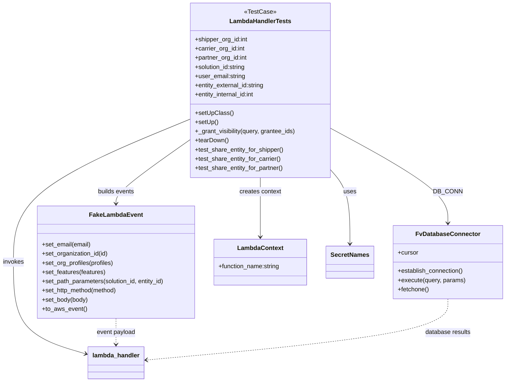

# Diagram: entity_core/entity_service/entity_service_tests/share_entity_tests/test_share_entity.py


> Auto-generated by Obscura crawlers

## Diagram 1



### SVG

<svg id="container" width="1317.40625" xmlns="http://www.w3.org/2000/svg" class="classDiagram" height="998" viewBox="0 0 1317.40625 998" role="graphics-document document" aria-roledescription="class"><style>#container{font-family:"trebuchet ms",verdana,arial,sans-serif;font-size:16px;fill:#333;}@keyframes edge-animation-frame{from{stroke-dashoffset:0;}}@keyframes dash{to{stroke-dashoffset:0;}}#container .edge-animation-slow{stroke-dasharray:9,5!important;stroke-dashoffset:900;animation:dash 50s linear infinite;stroke-linecap:round;}#container .edge-animation-fast{stroke-dasharray:9,5!important;stroke-dashoffset:900;animation:dash 20s linear infinite;stroke-linecap:round;}#container .error-icon{fill:#552222;}#container .error-text{fill:#552222;stroke:#552222;}#container .edge-thickness-normal{stroke-width:1px;}#container .edge-thickness-thick{stroke-width:3.5px;}#container .edge-pattern-solid{stroke-dasharray:0;}#container .edge-thickness-invisible{stroke-width:0;fill:none;}#container .edge-pattern-dashed{stroke-dasharray:3;}#container .edge-pattern-dotted{stroke-dasharray:2;}#container .marker{fill:#333333;stroke:#333333;}#container .marker.cross{stroke:#333333;}#container svg{font-family:"trebuchet ms",verdana,arial,sans-serif;font-size:16px;}#container p{margin:0;}#container g.classGroup text{fill:#9370DB;stroke:none;font-family:"trebuchet ms",verdana,arial,sans-serif;font-size:10px;}#container g.classGroup text .title{font-weight:bolder;}#container .nodeLabel,#container .edgeLabel{color:#131300;}#container .edgeLabel .label rect{fill:#ECECFF;}#container .label text{fill:#131300;}#container .labelBkg{background:#ECECFF;}#container .edgeLabel .label span{background:#ECECFF;}#container .classTitle{font-weight:bolder;}#container .node rect,#container .node circle,#container .node ellipse,#container .node polygon,#container .node path{fill:#ECECFF;stroke:#9370DB;stroke-width:1px;}#container .divider{stroke:#9370DB;stroke-width:1;}#container g.clickable{cursor:pointer;}#container g.classGroup rect{fill:#ECECFF;stroke:#9370DB;}#container g.classGroup line{stroke:#9370DB;stroke-width:1;}#container .classLabel .box{stroke:none;stroke-width:0;fill:#ECECFF;opacity:0.5;}#container .classLabel .label{fill:#9370DB;font-size:10px;}#container .relation{stroke:#333333;stroke-width:1;fill:none;}#container .dashed-line{stroke-dasharray:3;}#container .dotted-line{stroke-dasharray:1 2;}#container #compositionStart,#container .composition{fill:#333333!important;stroke:#333333!important;stroke-width:1;}#container #compositionEnd,#container .composition{fill:#333333!important;stroke:#333333!important;stroke-width:1;}#container #dependencyStart,#container .dependency{fill:#333333!important;stroke:#333333!important;stroke-width:1;}#container #dependencyStart,#container .dependency{fill:#333333!important;stroke:#333333!important;stroke-width:1;}#container #extensionStart,#container .extension{fill:transparent!important;stroke:#333333!important;stroke-width:1;}#container #extensionEnd,#container .extension{fill:transparent!important;stroke:#333333!important;stroke-width:1;}#container #aggregationStart,#container .aggregation{fill:transparent!important;stroke:#333333!important;stroke-width:1;}#container #aggregationEnd,#container .aggregation{fill:transparent!important;stroke:#333333!important;stroke-width:1;}#container #lollipopStart,#container .lollipop{fill:#ECECFF!important;stroke:#333333!important;stroke-width:1;}#container #lollipopEnd,#container .lollipop{fill:#ECECFF!important;stroke:#333333!important;stroke-width:1;}#container .edgeTerminals{font-size:11px;line-height:initial;}#container .classTitleText{text-anchor:middle;font-size:18px;fill:#333;}#container .label-icon{display:inline-block;height:1em;overflow:visible;vertical-align:-0.125em;}#container .node .label-icon path{fill:currentColor;stroke:revert;stroke-width:revert;}#container :root{--mermaid-font-family:"trebuchet ms",verdana,arial,sans-serif;}</style><g><defs><marker id="container_class-aggregationStart" class="marker aggregation class" refX="18" refY="7" markerWidth="190" markerHeight="240" orient="auto"><path d="M 18,7 L9,13 L1,7 L9,1 Z"></path></marker></defs><defs><marker id="container_class-aggregationEnd" class="marker aggregation class" refX="1" refY="7" markerWidth="20" markerHeight="28" orient="auto"><path d="M 18,7 L9,13 L1,7 L9,1 Z"></path></marker></defs><defs><marker id="container_class-extensionStart" class="marker extension class" refX="18" refY="7" markerWidth="190" markerHeight="240" orient="auto"><path d="M 1,7 L18,13 V 1 Z"></path></marker></defs><defs><marker id="container_class-extensionEnd" class="marker extension class" refX="1" refY="7" markerWidth="20" markerHeight="28" orient="auto"><path d="M 1,1 V 13 L18,7 Z"></path></marker></defs><defs><marker id="container_class-compositionStart" class="marker composition class" refX="18" refY="7" markerWidth="190" markerHeight="240" orient="auto"><path d="M 18,7 L9,13 L1,7 L9,1 Z"></path></marker></defs><defs><marker id="container_class-compositionEnd" class="marker composition class" refX="1" refY="7" markerWidth="20" markerHeight="28" orient="auto"><path d="M 18,7 L9,13 L1,7 L9,1 Z"></path></marker></defs><defs><marker id="container_class-dependencyStart" class="marker dependency class" refX="6" refY="7" markerWidth="190" markerHeight="240" orient="auto"><path d="M 5,7 L9,13 L1,7 L9,1 Z"></path></marker></defs><defs><marker id="container_class-dependencyEnd" class="marker dependency class" refX="13" refY="7" markerWidth="20" markerHeight="28" orient="auto"><path d="M 18,7 L9,13 L14,7 L9,1 Z"></path></marker></defs><defs><marker id="container_class-lollipopStart" class="marker lollipop class" refX="13" refY="7" markerWidth="190" markerHeight="240" orient="auto"><circle stroke="black" fill="transparent" cx="7" cy="7" r="6"></circle></marker></defs><defs><marker id="container_class-lollipopEnd" class="marker lollipop class" refX="1" refY="7" markerWidth="190" markerHeight="240" orient="auto"><circle stroke="black" fill="transparent" cx="7" cy="7" r="6"></circle></marker></defs><g class="root"><g class="clusters"></g><g class="edgePaths"><path d="M870.605,336.902L920.383,364.251C970.16,391.601,1069.715,446.301,1119.492,487.317C1169.27,528.333,1169.27,555.667,1169.27,569.333L1169.27,583" id="id_LambdaHandlerTests_FvDatabaseConnector_1" class="edge-thickness-normal edge-pattern-solid relation" style=";;;" data-edge="true" data-et="edge" data-id="id_LambdaHandlerTests_FvDatabaseConnector_1" data-points="W3sieCI6ODcwLjYwNTQ2ODc1LCJ5IjozMzYuOTAxNzkwNzAzODl9LHsieCI6MTE2OS4yNjk1MzEyNSwieSI6NTAxfSx7IngiOjExNjkuMjY5NTMxMjUsInkiOjU4OX1d" marker-end="url(#container_class-dependencyEnd)"></path><path d="M503.316,363.917L470.516,386.764C437.715,409.611,372.113,455.306,339.313,483.319C306.512,511.333,306.512,521.667,306.512,526.833L306.512,532" id="id_LambdaHandlerTests_FakeLambdaEvent_2" class="edge-thickness-normal edge-pattern-solid relation" style=";;;" data-edge="true" data-et="edge" data-id="id_LambdaHandlerTests_FakeLambdaEvent_2" data-points="W3sieCI6NTAzLjMxNjQwNjI1LCJ5IjozNjMuOTE2Njc5NTAxMDAxMX0seyJ4IjozMDYuNTExNzE4NzUsInkiOjUwMX0seyJ4IjozMDYuNTExNzE4NzUsInkiOjUzOH1d" marker-end="url(#container_class-dependencyEnd)"></path><path d="M686.961,464L686.961,470.167C686.961,476.333,686.961,488.667,686.961,514.5C686.961,540.333,686.961,579.667,686.961,599.333L686.961,619" id="id_LambdaHandlerTests_LambdaContext_3" class="edge-thickness-normal edge-pattern-solid relation" style=";;;" data-edge="true" data-et="edge" data-id="id_LambdaHandlerTests_LambdaContext_3" data-points="W3sieCI6Njg2Ljk2MDkzNzUsInkiOjQ2NH0seyJ4Ijo2ODYuOTYwOTM3NSwieSI6NTAxfSx7IngiOjY4Ni45NjA5Mzc1LCJ5Ijo2MjV9XQ==" marker-end="url(#container_class-dependencyEnd)"></path><path d="M503.316,310.712L425.361,342.427C347.406,374.142,191.496,437.571,113.541,499.952C35.586,562.333,35.586,623.667,35.586,685C35.586,746.333,35.586,807.667,67.784,847.722C99.982,887.778,164.379,906.555,196.577,915.944L228.775,925.333" id="id_LambdaHandlerTests_lambda_handler_4" class="edge-thickness-normal edge-pattern-solid relation" style=";;;" data-edge="true" data-et="edge" data-id="id_LambdaHandlerTests_lambda_handler_4" data-points="W3sieCI6NTAzLjMxNjQwNjI1LCJ5IjozMTAuNzEyNDE3MjQyMzcxOX0seyJ4IjozNS41ODU5Mzc1LCJ5Ijo1MDF9LHsieCI6MzUuNTg1OTM3NSwieSI6Njg1fSx7IngiOjM1LjU4NTkzNzUsInkiOjg2OX0seyJ4IjoyMzQuNTM1MTU2MjUsInkiOjkyNy4wMTIxNTQ1MDQ5NTI2fV0=" marker-end="url(#container_class-dependencyEnd)"></path><path d="M870.605,445.639L878.688,454.866C886.771,464.093,902.936,482.546,911.019,514.44C919.102,546.333,919.102,591.667,919.102,614.333L919.102,637" id="id_LambdaHandlerTests_SecretNames_5" class="edge-thickness-normal edge-pattern-solid relation" style=";;;" data-edge="true" data-et="edge" data-id="id_LambdaHandlerTests_SecretNames_5" data-points="W3sieCI6ODcwLjYwNTQ2ODc1LCJ5Ijo0NDUuNjM5MzExNDM1Njg2ODZ9LHsieCI6OTE5LjEwMTU2MjUsInkiOjUwMX0seyJ4Ijo5MTkuMTAxNTYyNSwieSI6NjQzfV0=" marker-end="url(#container_class-dependencyEnd)"></path><path d="M306.512,832L306.512,838.167C306.512,844.333,306.512,856.667,306.512,868C306.512,879.333,306.512,889.667,306.512,894.833L306.512,900" id="id_FakeLambdaEvent_lambda_handler_6" class="edge-thickness-normal edge-pattern-dashed relation" style=";;;" data-edge="true" data-et="edge" data-id="id_FakeLambdaEvent_lambda_handler_6" data-points="W3sieCI6MzA2LjUxMTcxODc1LCJ5Ijo4MzJ9LHsieCI6MzA2LjUxMTcxODc1LCJ5Ijo4Njl9LHsieCI6MzA2LjUxMTcxODc1LCJ5Ijo5MDZ9XQ==" marker-end="url(#container_class-dependencyEnd)"></path><path d="M1169.27,781L1169.27,795.667C1169.27,810.333,1169.27,839.667,1038.468,866.31C907.667,892.954,646.065,916.908,515.264,928.885L384.463,940.862" id="id_FvDatabaseConnector_lambda_handler_7" class="edge-thickness-normal edge-pattern-dashed relation" style=";;;" data-edge="true" data-et="edge" data-id="id_FvDatabaseConnector_lambda_handler_7" data-points="W3sieCI6MTE2OS4yNjk1MzEyNSwieSI6NzgxfSx7IngiOjExNjkuMjY5NTMxMjUsInkiOjg2OX0seyJ4IjozNzguNDg4MjgxMjUsInkiOjk0MS40MDkzMzQxNjY0MTc3fV0=" marker-end="url(#container_class-dependencyEnd)"></path></g><g class="edgeLabels"><g class="edgeLabel" transform="translate(1169.26953125, 501)"><g class="label" data-id="id_LambdaHandlerTests_FvDatabaseConnector_1" transform="translate(-34.484375, -12)"><foreignObject width="68.96875" height="24"><div xmlns="http://www.w3.org/1999/xhtml" class="labelBkg" style="display: table-cell; white-space: nowrap; line-height: 1.5; max-width: 200px; text-align: center;"><span class="edgeLabel"><p>DB_CONN</p></span></div></foreignObject></g></g><g class="edgeLabel" transform="translate(306.51171875, 501)"><g class="label" data-id="id_LambdaHandlerTests_FakeLambdaEvent_2" transform="translate(-48.515625, -12)"><foreignObject width="97.03125" height="24"><div xmlns="http://www.w3.org/1999/xhtml" class="labelBkg" style="display: table-cell; white-space: nowrap; line-height: 1.5; max-width: 200px; text-align: center;"><span class="edgeLabel"><p>builds events</p></span></div></foreignObject></g></g><g class="edgeLabel" transform="translate(686.9609375, 501)"><g class="label" data-id="id_LambdaHandlerTests_LambdaContext_3" transform="translate(-55.140625, -12)"><foreignObject width="110.28125" height="24"><div xmlns="http://www.w3.org/1999/xhtml" class="labelBkg" style="display: table-cell; white-space: nowrap; line-height: 1.5; max-width: 200px; text-align: center;"><span class="edgeLabel"><p>creates context</p></span></div></foreignObject></g></g><g class="edgeLabel" transform="translate(35.5859375, 685)"><g class="label" data-id="id_LambdaHandlerTests_lambda_handler_4" transform="translate(-27.5859375, -12)"><foreignObject width="55.171875" height="24"><div xmlns="http://www.w3.org/1999/xhtml" class="labelBkg" style="display: table-cell; white-space: nowrap; line-height: 1.5; max-width: 200px; text-align: center;"><span class="edgeLabel"><p>invokes</p></span></div></foreignObject></g></g><g class="edgeLabel" transform="translate(919.1015625, 501)"><g class="label" data-id="id_LambdaHandlerTests_SecretNames_5" transform="translate(-16.4921875, -12)"><foreignObject width="32.984375" height="24"><div xmlns="http://www.w3.org/1999/xhtml" class="labelBkg" style="display: table-cell; white-space: nowrap; line-height: 1.5; max-width: 200px; text-align: center;"><span class="edgeLabel"><p>uses</p></span></div></foreignObject></g></g><g class="edgeLabel" transform="translate(306.51171875, 869)"><g class="label" data-id="id_FakeLambdaEvent_lambda_handler_6" transform="translate(-51.1640625, -12)"><foreignObject width="102.328125" height="24"><div xmlns="http://www.w3.org/1999/xhtml" class="labelBkg" style="display: table-cell; white-space: nowrap; line-height: 1.5; max-width: 200px; text-align: center;"><span class="edgeLabel"><p>event payload</p></span></div></foreignObject></g></g><g class="edgeLabel" transform="translate(1169.26953125, 869)"><g class="label" data-id="id_FvDatabaseConnector_lambda_handler_7" transform="translate(-60.0546875, -12)"><foreignObject width="120.109375" height="24"><div xmlns="http://www.w3.org/1999/xhtml" class="labelBkg" style="display: table-cell; white-space: nowrap; line-height: 1.5; max-width: 200px; text-align: center;"><span class="edgeLabel"><p>database results</p></span></div></foreignObject></g></g></g><g class="nodes"><g class="node default" id="classId-LambdaHandlerTests-0" transform="translate(686.9609375, 236)"><g class="basic label-container"><path d="M-183.64453125 -228 L183.64453125 -228 L183.64453125 228 L-183.64453125 228" stroke="none" stroke-width="0" fill="#ECECFF" style=""></path><path d="M-183.64453125 -228 C-98.54194350897049 -228, -13.439355767940981 -228, 183.64453125 -228 M-183.64453125 -228 C-54.28004857944285 -228, 75.0844340911143 -228, 183.64453125 -228 M183.64453125 -228 C183.64453125 -121.77918585015125, 183.64453125 -15.558371700302501, 183.64453125 228 M183.64453125 -228 C183.64453125 -118.96739891022604, 183.64453125 -9.934797820452076, 183.64453125 228 M183.64453125 228 C62.076912416696615 228, -59.49070641660677 228, -183.64453125 228 M183.64453125 228 C47.09874061953755 228, -89.4470500109249 228, -183.64453125 228 M-183.64453125 228 C-183.64453125 116.58126798604404, -183.64453125 5.1625359720880795, -183.64453125 -228 M-183.64453125 228 C-183.64453125 60.25262684667078, -183.64453125 -107.49474630665844, -183.64453125 -228" stroke="#9370DB" stroke-width="1.3" fill="none" stroke-dasharray="0 0" style=""></path></g><g class="annotation-group text" transform="translate(-40.2578125, -204)"><g class="label" style="" transform="translate(0,-12)"><foreignObject width="80.515625" height="24"><div xmlns="http://www.w3.org/1999/xhtml" style="display: table-cell; white-space: nowrap; line-height: 1.5; max-width: 131px; text-align: center;"><span class="nodeLabel markdown-node-label" style=""><p>«TestCase»</p></span></div></foreignObject></g></g><g class="label-group text" transform="translate(-77.3359375, -180)"><g class="label" style="font-weight: bolder" transform="translate(0,-12)"><foreignObject width="154.671875" height="24"><div xmlns="http://www.w3.org/1999/xhtml" style="display: table-cell; white-space: nowrap; line-height: 1.5; max-width: 203px; text-align: center;"><span class="nodeLabel markdown-node-label" style=""><p>LambdaHandlerTests</p></span></div></foreignObject></g></g><g class="members-group text" transform="translate(-171.64453125, -132)"><g class="label" style="" transform="translate(0,-12)"><foreignObject width="139.546875" height="24"><div xmlns="http://www.w3.org/1999/xhtml" style="display: table-cell; white-space: nowrap; line-height: 1.5; max-width: 197px; text-align: center;"><span class="nodeLabel markdown-node-label" style=""><p>+shipper_org_id:int</p></span></div></foreignObject></g><g class="label" style="" transform="translate(0,12)"><foreignObject width="132.234375" height="24"><div xmlns="http://www.w3.org/1999/xhtml" style="display: table-cell; white-space: nowrap; line-height: 1.5; max-width: 190px; text-align: center;"><span class="nodeLabel markdown-node-label" style=""><p>+carrier_org_id:int</p></span></div></foreignObject></g><g class="label" style="" transform="translate(0,36)"><foreignObject width="138.546875" height="24"><div xmlns="http://www.w3.org/1999/xhtml" style="display: table-cell; white-space: nowrap; line-height: 1.5; max-width: 196px; text-align: center;"><span class="nodeLabel markdown-node-label" style=""><p>+partner_org_id:int</p></span></div></foreignObject></g><g class="label" style="" transform="translate(0,60)"><foreignObject width="135.84375" height="24"><div xmlns="http://www.w3.org/1999/xhtml" style="display: table-cell; white-space: nowrap; line-height: 1.5; max-width: 194px; text-align: center;"><span class="nodeLabel markdown-node-label" style=""><p>+solution_id:string</p></span></div></foreignObject></g><g class="label" style="" transform="translate(0,84)"><foreignObject width="132.515625" height="24"><div xmlns="http://www.w3.org/1999/xhtml" style="display: table-cell; white-space: nowrap; line-height: 1.5; max-width: 191px; text-align: center;"><span class="nodeLabel markdown-node-label" style=""><p>+user_email:string</p></span></div></foreignObject></g><g class="label" style="" transform="translate(0,108)"><foreignObject width="184.875" height="24"><div xmlns="http://www.w3.org/1999/xhtml" style="display: table-cell; white-space: nowrap; line-height: 1.5; max-width: 243px; text-align: center;"><span class="nodeLabel markdown-node-label" style=""><p>+entity_external_id:string</p></span></div></foreignObject></g><g class="label" style="" transform="translate(0,132)"><foreignObject width="160.609375" height="24"><div xmlns="http://www.w3.org/1999/xhtml" style="display: table-cell; white-space: nowrap; line-height: 1.5; max-width: 218px; text-align: center;"><span class="nodeLabel markdown-node-label" style=""><p>+entity_internal_id:int</p></span></div></foreignObject></g></g><g class="methods-group text" transform="translate(-171.64453125, 60)"><g class="label" style="" transform="translate(0,-12)"><foreignObject width="97.15625" height="24"><div xmlns="http://www.w3.org/1999/xhtml" style="display: table-cell; white-space: nowrap; line-height: 1.5; max-width: 155px; text-align: center;"><span class="nodeLabel markdown-node-label" style=""><p>+setUpClass()</p></span></div></foreignObject></g><g class="label" style="" transform="translate(0,12)"><foreignObject width="60.421875" height="24"><div xmlns="http://www.w3.org/1999/xhtml" style="display: table-cell; white-space: nowrap; line-height: 1.5; max-width: 118px; text-align: center;"><span class="nodeLabel markdown-node-label" style=""><p>+setUp()</p></span></div></foreignObject></g><g class="label" style="" transform="translate(0,36)"><foreignObject width="265.953125" height="24"><div xmlns="http://www.w3.org/1999/xhtml" style="display: table-cell; white-space: nowrap; line-height: 1.5; max-width: 323px; text-align: center;"><span class="nodeLabel markdown-node-label" style=""><p>+_grant_visibility(query, grantee_ids)</p></span></div></foreignObject></g><g class="label" style="" transform="translate(0,60)"><foreignObject width="87.75" height="24"><div xmlns="http://www.w3.org/1999/xhtml" style="display: table-cell; white-space: nowrap; line-height: 1.5; max-width: 145px; text-align: center;"><span class="nodeLabel markdown-node-label" style=""><p>+tearDown()</p></span></div></foreignObject></g><g class="label" style="" transform="translate(0,84)"><foreignObject width="234.25" height="24"><div xmlns="http://www.w3.org/1999/xhtml" style="display: table-cell; white-space: nowrap; line-height: 1.5; max-width: 292px; text-align: center;"><span class="nodeLabel markdown-node-label" style=""><p>+test_share_entity_for_shipper()</p></span></div></foreignObject></g><g class="label" style="" transform="translate(0,108)"><foreignObject width="226.609375" height="24"><div xmlns="http://www.w3.org/1999/xhtml" style="display: table-cell; white-space: nowrap; line-height: 1.5; max-width: 284px; text-align: center;"><span class="nodeLabel markdown-node-label" style=""><p>+test_share_entity_for_carrier()</p></span></div></foreignObject></g><g class="label" style="" transform="translate(0,132)"><foreignObject width="233.25" height="24"><div xmlns="http://www.w3.org/1999/xhtml" style="display: table-cell; white-space: nowrap; line-height: 1.5; max-width: 291px; text-align: center;"><span class="nodeLabel markdown-node-label" style=""><p>+test_share_entity_for_partner()</p></span></div></foreignObject></g></g><g class="divider" style=""><path d="M-183.64453125 -156 C-38.491706150087595 -156, 106.66111894982481 -156, 183.64453125 -156 M-183.64453125 -156 C-65.93125392690722 -156, 51.782023396185565 -156, 183.64453125 -156" stroke="#9370DB" stroke-width="1.3" fill="none" stroke-dasharray="0 0" style=""></path></g><g class="divider" style=""><path d="M-183.64453125 36 C-62.20133426939161 36, 59.24186271121678 36, 183.64453125 36 M-183.64453125 36 C-109.16428728143032 36, -34.68404331286064 36, 183.64453125 36" stroke="#9370DB" stroke-width="1.3" fill="none" stroke-dasharray="0 0" style=""></path></g></g><g class="node default" id="classId-FvDatabaseConnector-1" transform="translate(1169.26953125, 685)"><g class="basic label-container"><path d="M-140.13671875 -96 L140.13671875 -96 L140.13671875 96 L-140.13671875 96" stroke="none" stroke-width="0" fill="#ECECFF" style=""></path><path d="M-140.13671875 -96 C-74.09042371070198 -96, -8.044128671403968 -96, 140.13671875 -96 M-140.13671875 -96 C-80.16692348835329 -96, -20.19712822670658 -96, 140.13671875 -96 M140.13671875 -96 C140.13671875 -32.73611043845584, 140.13671875 30.527779123088322, 140.13671875 96 M140.13671875 -96 C140.13671875 -28.943612812603106, 140.13671875 38.11277437479379, 140.13671875 96 M140.13671875 96 C56.1413437174986 96, -27.8540313150028 96, -140.13671875 96 M140.13671875 96 C84.00848396284353 96, 27.880249175687055 96, -140.13671875 96 M-140.13671875 96 C-140.13671875 21.423292699187755, -140.13671875 -53.15341460162449, -140.13671875 -96 M-140.13671875 96 C-140.13671875 33.9330023223129, -140.13671875 -28.133995355374196, -140.13671875 -96" stroke="#9370DB" stroke-width="1.3" fill="none" stroke-dasharray="0 0" style=""></path></g><g class="annotation-group text" transform="translate(0, -72)"></g><g class="label-group text" transform="translate(-79.3046875, -72)"><g class="label" style="font-weight: bolder" transform="translate(0,-12)"><foreignObject width="158.609375" height="24"><div xmlns="http://www.w3.org/1999/xhtml" style="display: table-cell; white-space: nowrap; line-height: 1.5; max-width: 207px; text-align: center;"><span class="nodeLabel markdown-node-label" style=""><p>FvDatabaseConnector</p></span></div></foreignObject></g></g><g class="members-group text" transform="translate(-128.13671875, -24)"><g class="label" style="" transform="translate(0,-12)"><foreignObject width="53.71875" height="24"><div xmlns="http://www.w3.org/1999/xhtml" style="display: table-cell; white-space: nowrap; line-height: 1.5; max-width: 112px; text-align: center;"><span class="nodeLabel markdown-node-label" style=""><p>+cursor</p></span></div></foreignObject></g></g><g class="methods-group text" transform="translate(-128.13671875, 24)"><g class="label" style="" transform="translate(0,-12)"><foreignObject width="173.265625" height="24"><div xmlns="http://www.w3.org/1999/xhtml" style="display: table-cell; white-space: nowrap; line-height: 1.5; max-width: 231px; text-align: center;"><span class="nodeLabel markdown-node-label" style=""><p>+establish_connection()</p></span></div></foreignObject></g><g class="label" style="" transform="translate(0,12)"><foreignObject width="176.96875" height="24"><div xmlns="http://www.w3.org/1999/xhtml" style="display: table-cell; white-space: nowrap; line-height: 1.5; max-width: 234px; text-align: center;"><span class="nodeLabel markdown-node-label" style=""><p>+execute(query, params)</p></span></div></foreignObject></g><g class="label" style="" transform="translate(0,36)"><foreignObject width="82.046875" height="24"><div xmlns="http://www.w3.org/1999/xhtml" style="display: table-cell; white-space: nowrap; line-height: 1.5; max-width: 139px; text-align: center;"><span class="nodeLabel markdown-node-label" style=""><p>+fetchone()</p></span></div></foreignObject></g></g><g class="divider" style=""><path d="M-140.13671875 -48 C-31.90688793614335 -48, 76.3229428777133 -48, 140.13671875 -48 M-140.13671875 -48 C-40.23641607868247 -48, 59.663886592635066 -48, 140.13671875 -48" stroke="#9370DB" stroke-width="1.3" fill="none" stroke-dasharray="0 0" style=""></path></g><g class="divider" style=""><path d="M-140.13671875 0 C-34.37495794270063 0, 71.38680286459874 0, 140.13671875 0 M-140.13671875 0 C-29.05430230498881 0, 82.02811414002238 0, 140.13671875 0" stroke="#9370DB" stroke-width="1.3" fill="none" stroke-dasharray="0 0" style=""></path></g></g><g class="node default" id="classId-FakeLambdaEvent-2" transform="translate(306.51171875, 685)"><g class="basic label-container"><path d="M-208.33984375 -147 L208.33984375 -147 L208.33984375 147 L-208.33984375 147" stroke="none" stroke-width="0" fill="#ECECFF" style=""></path><path d="M-208.33984375 -147 C-56.83704585779364 -147, 94.66575203441272 -147, 208.33984375 -147 M-208.33984375 -147 C-52.2630760365721 -147, 103.8136916768558 -147, 208.33984375 -147 M208.33984375 -147 C208.33984375 -32.90376430352056, 208.33984375 81.19247139295888, 208.33984375 147 M208.33984375 -147 C208.33984375 -78.91373173374559, 208.33984375 -10.827463467491185, 208.33984375 147 M208.33984375 147 C124.26564071084998 147, 40.19143767169996 147, -208.33984375 147 M208.33984375 147 C54.42263041520141 147, -99.49458291959718 147, -208.33984375 147 M-208.33984375 147 C-208.33984375 87.0493149937243, -208.33984375 27.09862998744859, -208.33984375 -147 M-208.33984375 147 C-208.33984375 85.1086372234806, -208.33984375 23.217274446961213, -208.33984375 -147" stroke="#9370DB" stroke-width="1.3" fill="none" stroke-dasharray="0 0" style=""></path></g><g class="annotation-group text" transform="translate(0, -123)"></g><g class="label-group text" transform="translate(-65.8671875, -123)"><g class="label" style="font-weight: bolder" transform="translate(0,-12)"><foreignObject width="131.734375" height="24"><div xmlns="http://www.w3.org/1999/xhtml" style="display: table-cell; white-space: nowrap; line-height: 1.5; max-width: 181px; text-align: center;"><span class="nodeLabel markdown-node-label" style=""><p>FakeLambdaEvent</p></span></div></foreignObject></g></g><g class="members-group text" transform="translate(-196.33984375, -75)"></g><g class="methods-group text" transform="translate(-196.33984375, -45)"><g class="label" style="" transform="translate(0,-12)"><foreignObject width="129" height="24"><div xmlns="http://www.w3.org/1999/xhtml" style="display: table-cell; white-space: nowrap; line-height: 1.5; max-width: 186px; text-align: center;"><span class="nodeLabel markdown-node-label" style=""><p>+set_email(email)</p></span></div></foreignObject></g><g class="label" style="" transform="translate(0,12)"><foreignObject width="175.15625" height="24"><div xmlns="http://www.w3.org/1999/xhtml" style="display: table-cell; white-space: nowrap; line-height: 1.5; max-width: 233px; text-align: center;"><span class="nodeLabel markdown-node-label" style=""><p>+set_organization_id(id)</p></span></div></foreignObject></g><g class="label" style="" transform="translate(0,36)"><foreignObject width="189.40625" height="24"><div xmlns="http://www.w3.org/1999/xhtml" style="display: table-cell; white-space: nowrap; line-height: 1.5; max-width: 247px; text-align: center;"><span class="nodeLabel markdown-node-label" style=""><p>+set_org_profiles(profiles)</p></span></div></foreignObject></g><g class="label" style="" transform="translate(0,60)"><foreignObject width="167.203125" height="24"><div xmlns="http://www.w3.org/1999/xhtml" style="display: table-cell; white-space: nowrap; line-height: 1.5; max-width: 225px; text-align: center;"><span class="nodeLabel markdown-node-label" style=""><p>+set_features(features)</p></span></div></foreignObject></g><g class="label" style="" transform="translate(0,84)"><foreignObject width="326.8125" height="24"><div xmlns="http://www.w3.org/1999/xhtml" style="display: table-cell; white-space: nowrap; line-height: 1.5; max-width: 384px; text-align: center;"><span class="nodeLabel markdown-node-label" style=""><p>+set_path_parameters(solution_id, entity_id)</p></span></div></foreignObject></g><g class="label" style="" transform="translate(0,108)"><foreignObject width="200.078125" height="24"><div xmlns="http://www.w3.org/1999/xhtml" style="display: table-cell; white-space: nowrap; line-height: 1.5; max-width: 257px; text-align: center;"><span class="nodeLabel markdown-node-label" style=""><p>+set_http_method(method)</p></span></div></foreignObject></g><g class="label" style="" transform="translate(0,132)"><foreignObject width="121.21875" height="24"><div xmlns="http://www.w3.org/1999/xhtml" style="display: table-cell; white-space: nowrap; line-height: 1.5; max-width: 179px; text-align: center;"><span class="nodeLabel markdown-node-label" style=""><p>+set_body(body)</p></span></div></foreignObject></g><g class="label" style="" transform="translate(0,156)"><foreignObject width="116.421875" height="24"><div xmlns="http://www.w3.org/1999/xhtml" style="display: table-cell; white-space: nowrap; line-height: 1.5; max-width: 174px; text-align: center;"><span class="nodeLabel markdown-node-label" style=""><p>+to_aws_event()</p></span></div></foreignObject></g></g><g class="divider" style=""><path d="M-208.33984375 -99 C-121.52137853408739 -99, -34.70291331817478 -99, 208.33984375 -99 M-208.33984375 -99 C-109.64670218841208 -99, -10.953560626824157 -99, 208.33984375 -99" stroke="#9370DB" stroke-width="1.3" fill="none" stroke-dasharray="0 0" style=""></path></g><g class="divider" style=""><path d="M-208.33984375 -75 C-88.35988487779738 -75, 31.62007399440523 -75, 208.33984375 -75 M-208.33984375 -75 C-89.19412695427006 -75, 29.951589841459878 -75, 208.33984375 -75" stroke="#9370DB" stroke-width="1.3" fill="none" stroke-dasharray="0 0" style=""></path></g></g><g class="node default" id="classId-LambdaContext-3" transform="translate(686.9609375, 685)"><g class="basic label-container"><path d="M-122.109375 -60 L122.109375 -60 L122.109375 60 L-122.109375 60" stroke="none" stroke-width="0" fill="#ECECFF" style=""></path><path d="M-122.109375 -60 C-58.14793810570486 -60, 5.81349878859028 -60, 122.109375 -60 M-122.109375 -60 C-61.072735417626745 -60, -0.036095835253490804 -60, 122.109375 -60 M122.109375 -60 C122.109375 -29.81729184393394, 122.109375 0.365416312132119, 122.109375 60 M122.109375 -60 C122.109375 -21.306988784521295, 122.109375 17.38602243095741, 122.109375 60 M122.109375 60 C43.38742477830772 60, -35.334525443384564 60, -122.109375 60 M122.109375 60 C53.55665073387648 60, -14.996073532247038 60, -122.109375 60 M-122.109375 60 C-122.109375 14.723393033058336, -122.109375 -30.553213933883328, -122.109375 -60 M-122.109375 60 C-122.109375 17.92513829560965, -122.109375 -24.1497234087807, -122.109375 -60" stroke="#9370DB" stroke-width="1.3" fill="none" stroke-dasharray="0 0" style=""></path></g><g class="annotation-group text" transform="translate(0, -36)"></g><g class="label-group text" transform="translate(-57.296875, -36)"><g class="label" style="font-weight: bolder" transform="translate(0,-12)"><foreignObject width="114.59375" height="24"><div xmlns="http://www.w3.org/1999/xhtml" style="display: table-cell; white-space: nowrap; line-height: 1.5; max-width: 163px; text-align: center;"><span class="nodeLabel markdown-node-label" style=""><p>LambdaContext</p></span></div></foreignObject></g></g><g class="members-group text" transform="translate(-110.109375, 12)"><g class="label" style="" transform="translate(0,-12)"><foreignObject width="162.921875" height="24"><div xmlns="http://www.w3.org/1999/xhtml" style="display: table-cell; white-space: nowrap; line-height: 1.5; max-width: 221px; text-align: center;"><span class="nodeLabel markdown-node-label" style=""><p>+function_name:string</p></span></div></foreignObject></g></g><g class="methods-group text" transform="translate(-110.109375, 60)"></g><g class="divider" style=""><path d="M-122.109375 -12 C-60.128942128465106 -12, 1.851490743069789 -12, 122.109375 -12 M-122.109375 -12 C-41.429014355135976 -12, 39.25134628972805 -12, 122.109375 -12" stroke="#9370DB" stroke-width="1.3" fill="none" stroke-dasharray="0 0" style=""></path></g><g class="divider" style=""><path d="M-122.109375 36 C-39.7475330387102 36, 42.614308922579596 36, 122.109375 36 M-122.109375 36 C-56.223296549035 36, 9.662781901930003 36, 122.109375 36" stroke="#9370DB" stroke-width="1.3" fill="none" stroke-dasharray="0 0" style=""></path></g></g><g class="node default" id="classId-SecretNames-4" transform="translate(919.1015625, 685)"><g class="basic label-container"><path d="M-60.03125 -42 L60.03125 -42 L60.03125 42 L-60.03125 42" stroke="none" stroke-width="0" fill="#ECECFF" style=""></path><path d="M-60.03125 -42 C-14.380095572709713 -42, 31.271058854580573 -42, 60.03125 -42 M-60.03125 -42 C-24.616547041328253 -42, 10.798155917343493 -42, 60.03125 -42 M60.03125 -42 C60.03125 -24.701718401770197, 60.03125 -7.403436803540394, 60.03125 42 M60.03125 -42 C60.03125 -9.3088924970058, 60.03125 23.3822150059884, 60.03125 42 M60.03125 42 C16.861264863170142 42, -26.308720273659716 42, -60.03125 42 M60.03125 42 C17.122171425279156 42, -25.78690714944169 42, -60.03125 42 M-60.03125 42 C-60.03125 11.7002116991545, -60.03125 -18.599576601691, -60.03125 -42 M-60.03125 42 C-60.03125 23.32257806148145, -60.03125 4.645156122962902, -60.03125 -42" stroke="#9370DB" stroke-width="1.3" fill="none" stroke-dasharray="0 0" style=""></path></g><g class="annotation-group text" transform="translate(0, -18)"></g><g class="label-group text" transform="translate(-48.03125, -18)"><g class="label" style="font-weight: bolder" transform="translate(0,-12)"><foreignObject width="96.0625" height="24"><div xmlns="http://www.w3.org/1999/xhtml" style="display: table-cell; white-space: nowrap; line-height: 1.5; max-width: 145px; text-align: center;"><span class="nodeLabel markdown-node-label" style=""><p>SecretNames</p></span></div></foreignObject></g></g><g class="members-group text" transform="translate(-48.03125, 30)"></g><g class="methods-group text" transform="translate(-48.03125, 60)"></g><g class="divider" style=""><path d="M-60.03125 6 C-23.998776247137393 6, 12.033697505725215 6, 60.03125 6 M-60.03125 6 C-32.6778705343027 6, -5.32449106860539 6, 60.03125 6" stroke="#9370DB" stroke-width="1.3" fill="none" stroke-dasharray="0 0" style=""></path></g><g class="divider" style=""><path d="M-60.03125 24 C-13.171228107087344 24, 33.68879378582531 24, 60.03125 24 M-60.03125 24 C-30.29149749023458 24, -0.5517449804691594 24, 60.03125 24" stroke="#9370DB" stroke-width="1.3" fill="none" stroke-dasharray="0 0" style=""></path></g></g><g class="node default" id="classId-lambda_handler-5" transform="translate(306.51171875, 948)"><g class="basic label-container"><path d="M-71.9765625 -42 L71.9765625 -42 L71.9765625 42 L-71.9765625 42" stroke="none" stroke-width="0" fill="#ECECFF" style=""></path><path d="M-71.9765625 -42 C-18.95186648395849 -42, 34.07282953208302 -42, 71.9765625 -42 M-71.9765625 -42 C-27.628487905215906 -42, 16.71958668956819 -42, 71.9765625 -42 M71.9765625 -42 C71.9765625 -10.424031212791157, 71.9765625 21.151937574417687, 71.9765625 42 M71.9765625 -42 C71.9765625 -23.649513786341657, 71.9765625 -5.299027572683315, 71.9765625 42 M71.9765625 42 C39.60910107663174 42, 7.241639653263476 42, -71.9765625 42 M71.9765625 42 C37.38857843623074 42, 2.8005943724614752 42, -71.9765625 42 M-71.9765625 42 C-71.9765625 20.75759451181007, -71.9765625 -0.4848109763798618, -71.9765625 -42 M-71.9765625 42 C-71.9765625 24.740703166893525, -71.9765625 7.481406333787049, -71.9765625 -42" stroke="#9370DB" stroke-width="1.3" fill="none" stroke-dasharray="0 0" style=""></path></g><g class="annotation-group text" transform="translate(0, -18)"></g><g class="label-group text" transform="translate(-59.9765625, -18)"><g class="label" style="font-weight: bolder" transform="translate(0,-12)"><foreignObject width="119.953125" height="24"><div xmlns="http://www.w3.org/1999/xhtml" style="display: table-cell; white-space: nowrap; line-height: 1.5; max-width: 170px; text-align: center;"><span class="nodeLabel markdown-node-label" style=""><p>lambda_handler</p></span></div></foreignObject></g></g><g class="members-group text" transform="translate(-59.9765625, 30)"></g><g class="methods-group text" transform="translate(-59.9765625, 60)"></g><g class="divider" style=""><path d="M-71.9765625 6 C-24.149833718897035 6, 23.67689506220593 6, 71.9765625 6 M-71.9765625 6 C-28.70111943464795 6, 14.5743236307041 6, 71.9765625 6" stroke="#9370DB" stroke-width="1.3" fill="none" stroke-dasharray="0 0" style=""></path></g><g class="divider" style=""><path d="M-71.9765625 24 C-30.295200601682325 24, 11.38616129663535 24, 71.9765625 24 M-71.9765625 24 C-33.6728422230696 24, 4.630878053860798 24, 71.9765625 24" stroke="#9370DB" stroke-width="1.3" fill="none" stroke-dasharray="0 0" style=""></path></g></g></g></g></g></svg>

## Diagram 2

```mermaid
sequenceDiagram
participant Test as "LambdaHandlerTests"
participant Event as "FakeLambdaEvent"
participant Context as "LambdaContext"
participant Handler as "lambda_handler"
participant DB as "FvDatabaseConnector"
participant Assert as "unittest.Assert"

Test->>Event: set_email(...)/set_organization_id(...)/set_org_profiles(...)/set_features(...)/set_path_parameters(...)/set_http_method(...)/set_body(...)
Event-->>Test: to_aws_event()
Test->>Context: LambdaContext(function_name="entity_share_lambda")
Test->>Handler: lambda_handler(event, context)
activate Handler
Handler->>DB: establish_connection(); execute INSERT/visibility queries
DB-->>Handler: query results (entity_internal_id / success)
Handler-->>Test: response {statusCode: "200"}
deactivate Handler
Test->>Assert: assertEqual(response["statusCode"], "200")
Assert-->>Test: assertion result (pass)
```

> SVG rendering failed for this diagram.
