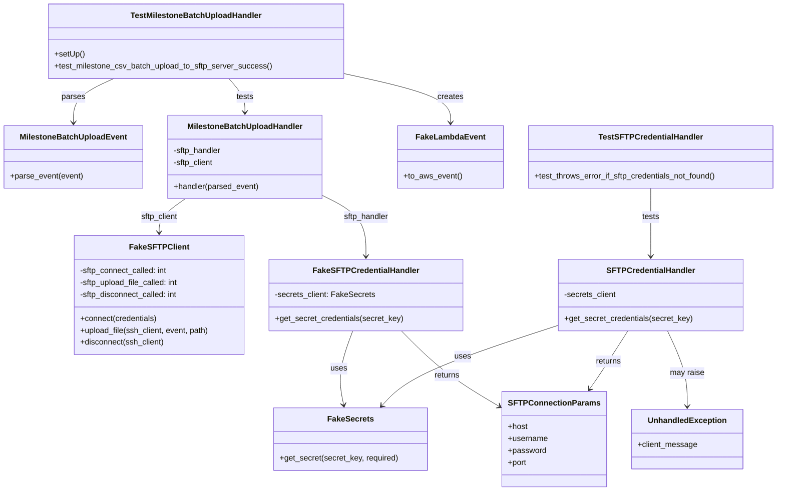
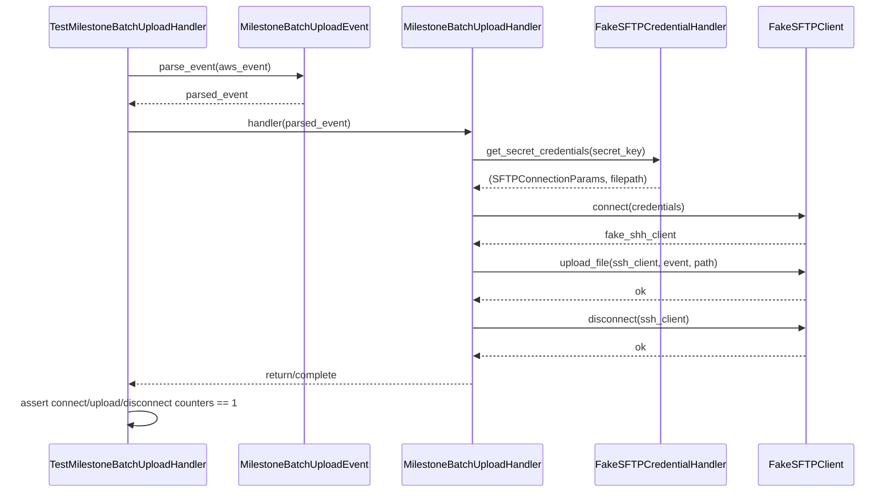

# Diagram: entity_core/entity_service/entity_service_tests/status_update/test_milestone_batch_upload_handler.py


> Auto-generated by Obscura crawlers

## Diagram 1



### SVG

<svg id="container" width="1550.66015625" xmlns="http://www.w3.org/2000/svg" class="classDiagram" height="988" viewBox="0 0 1550.66015625 988" role="graphics-document document" aria-roledescription="class"><style>#container{font-family:"trebuchet ms",verdana,arial,sans-serif;font-size:16px;fill:#333;}@keyframes edge-animation-frame{from{stroke-dashoffset:0;}}@keyframes dash{to{stroke-dashoffset:0;}}#container .edge-animation-slow{stroke-dasharray:9,5!important;stroke-dashoffset:900;animation:dash 50s linear infinite;stroke-linecap:round;}#container .edge-animation-fast{stroke-dasharray:9,5!important;stroke-dashoffset:900;animation:dash 20s linear infinite;stroke-linecap:round;}#container .error-icon{fill:#552222;}#container .error-text{fill:#552222;stroke:#552222;}#container .edge-thickness-normal{stroke-width:1px;}#container .edge-thickness-thick{stroke-width:3.5px;}#container .edge-pattern-solid{stroke-dasharray:0;}#container .edge-thickness-invisible{stroke-width:0;fill:none;}#container .edge-pattern-dashed{stroke-dasharray:3;}#container .edge-pattern-dotted{stroke-dasharray:2;}#container .marker{fill:#333333;stroke:#333333;}#container .marker.cross{stroke:#333333;}#container svg{font-family:"trebuchet ms",verdana,arial,sans-serif;font-size:16px;}#container p{margin:0;}#container g.classGroup text{fill:#9370DB;stroke:none;font-family:"trebuchet ms",verdana,arial,sans-serif;font-size:10px;}#container g.classGroup text .title{font-weight:bolder;}#container .nodeLabel,#container .edgeLabel{color:#131300;}#container .edgeLabel .label rect{fill:#ECECFF;}#container .label text{fill:#131300;}#container .labelBkg{background:#ECECFF;}#container .edgeLabel .label span{background:#ECECFF;}#container .classTitle{font-weight:bolder;}#container .node rect,#container .node circle,#container .node ellipse,#container .node polygon,#container .node path{fill:#ECECFF;stroke:#9370DB;stroke-width:1px;}#container .divider{stroke:#9370DB;stroke-width:1;}#container g.clickable{cursor:pointer;}#container g.classGroup rect{fill:#ECECFF;stroke:#9370DB;}#container g.classGroup line{stroke:#9370DB;stroke-width:1;}#container .classLabel .box{stroke:none;stroke-width:0;fill:#ECECFF;opacity:0.5;}#container .classLabel .label{fill:#9370DB;font-size:10px;}#container .relation{stroke:#333333;stroke-width:1;fill:none;}#container .dashed-line{stroke-dasharray:3;}#container .dotted-line{stroke-dasharray:1 2;}#container #compositionStart,#container .composition{fill:#333333!important;stroke:#333333!important;stroke-width:1;}#container #compositionEnd,#container .composition{fill:#333333!important;stroke:#333333!important;stroke-width:1;}#container #dependencyStart,#container .dependency{fill:#333333!important;stroke:#333333!important;stroke-width:1;}#container #dependencyStart,#container .dependency{fill:#333333!important;stroke:#333333!important;stroke-width:1;}#container #extensionStart,#container .extension{fill:transparent!important;stroke:#333333!important;stroke-width:1;}#container #extensionEnd,#container .extension{fill:transparent!important;stroke:#333333!important;stroke-width:1;}#container #aggregationStart,#container .aggregation{fill:transparent!important;stroke:#333333!important;stroke-width:1;}#container #aggregationEnd,#container .aggregation{fill:transparent!important;stroke:#333333!important;stroke-width:1;}#container #lollipopStart,#container .lollipop{fill:#ECECFF!important;stroke:#333333!important;stroke-width:1;}#container #lollipopEnd,#container .lollipop{fill:#ECECFF!important;stroke:#333333!important;stroke-width:1;}#container .edgeTerminals{font-size:11px;line-height:initial;}#container .classTitleText{text-anchor:middle;font-size:18px;fill:#333;}#container .label-icon{display:inline-block;height:1em;overflow:visible;vertical-align:-0.125em;}#container .node .label-icon path{fill:currentColor;stroke:revert;stroke-width:revert;}#container :root{--mermaid-font-family:"trebuchet ms",verdana,arial,sans-serif;}</style><g><defs><marker id="container_class-aggregationStart" class="marker aggregation class" refX="18" refY="7" markerWidth="190" markerHeight="240" orient="auto"><path d="M 18,7 L9,13 L1,7 L9,1 Z"></path></marker></defs><defs><marker id="container_class-aggregationEnd" class="marker aggregation class" refX="1" refY="7" markerWidth="20" markerHeight="28" orient="auto"><path d="M 18,7 L9,13 L1,7 L9,1 Z"></path></marker></defs><defs><marker id="container_class-extensionStart" class="marker extension class" refX="18" refY="7" markerWidth="190" markerHeight="240" orient="auto"><path d="M 1,7 L18,13 V 1 Z"></path></marker></defs><defs><marker id="container_class-extensionEnd" class="marker extension class" refX="1" refY="7" markerWidth="20" markerHeight="28" orient="auto"><path d="M 1,1 V 13 L18,7 Z"></path></marker></defs><defs><marker id="container_class-compositionStart" class="marker composition class" refX="18" refY="7" markerWidth="190" markerHeight="240" orient="auto"><path d="M 18,7 L9,13 L1,7 L9,1 Z"></path></marker></defs><defs><marker id="container_class-compositionEnd" class="marker composition class" refX="1" refY="7" markerWidth="20" markerHeight="28" orient="auto"><path d="M 18,7 L9,13 L1,7 L9,1 Z"></path></marker></defs><defs><marker id="container_class-dependencyStart" class="marker dependency class" refX="6" refY="7" markerWidth="190" markerHeight="240" orient="auto"><path d="M 5,7 L9,13 L1,7 L9,1 Z"></path></marker></defs><defs><marker id="container_class-dependencyEnd" class="marker dependency class" refX="13" refY="7" markerWidth="20" markerHeight="28" orient="auto"><path d="M 18,7 L9,13 L14,7 L9,1 Z"></path></marker></defs><defs><marker id="container_class-lollipopStart" class="marker lollipop class" refX="13" refY="7" markerWidth="190" markerHeight="240" orient="auto"><circle stroke="black" fill="transparent" cx="7" cy="7" r="6"></circle></marker></defs><defs><marker id="container_class-lollipopEnd" class="marker lollipop class" refX="1" refY="7" markerWidth="190" markerHeight="240" orient="auto"><circle stroke="black" fill="transparent" cx="7" cy="7" r="6"></circle></marker></defs><g class="root"><g class="clusters"></g><g class="edgePaths"><path d="M701.79,666L696.569,680.167C691.347,694.333,680.903,722.667,677.809,747.519C674.716,772.372,678.973,793.744,681.102,804.43L683.23,815.116" id="id_FakeSFTPCredentialHandler_FakeSecrets_1" class="edge-thickness-normal edge-pattern-solid relation" style=";;;" data-edge="true" data-et="edge" data-id="id_FakeSFTPCredentialHandler_FakeSecrets_1" data-points="W3sieCI6NzAxLjc5MDQ2ODI1MjM4ODYsInkiOjY2Nn0seyJ4Ijo2NzAuNDU4OTg0Mzc1LCJ5Ijo3NTF9LHsieCI6Njg0LjQwMjI0MDk1Mzk0NzQsInkiOjgyMX1d" marker-end="url(#container_class-dependencyEnd)"></path><path d="M1111.512,654.194L1062.279,670.328C1013.047,686.463,914.582,718.731,855.564,745.788C796.545,772.844,776.974,794.688,767.188,805.609L757.402,816.531" id="id_SFTPCredentialHandler_FakeSecrets_2" class="edge-thickness-normal edge-pattern-solid relation" style=";;;" data-edge="true" data-et="edge" data-id="id_SFTPCredentialHandler_FakeSecrets_2" data-points="W3sieCI6MTExMS41MTE3MTg3NSwieSI6NjU0LjE5Mzg3MzIyNDUwNzF9LHsieCI6ODE2LjExNzE4NzUsInkiOjc1MX0seyJ4Ijo3NTMuMzk4MjMxOTA3ODk0OCwieSI6ODIxfV0=" marker-end="url(#container_class-dependencyEnd)"></path><path d="M797.37,666L810.954,680.167C824.538,694.333,851.707,722.667,885.769,748.908C919.831,775.15,960.787,799.299,981.266,811.374L1001.744,823.449" id="id_FakeSFTPCredentialHandler_SFTPConnectionParams_3" class="edge-thickness-normal edge-pattern-solid relation" style=";;;" data-edge="true" data-et="edge" data-id="id_FakeSFTPCredentialHandler_SFTPConnectionParams_3" data-points="W3sieCI6Nzk3LjM2OTc4NzUxOTkwNDQsInkiOjY2Nn0seyJ4Ijo4NzguODc1LCJ5Ijo3NTF9LHsieCI6MTAwNi45MTIxMDkzNzUsInkiOjgyNi40OTYwNzMxNTEwOTA2fV0=" marker-end="url(#container_class-dependencyEnd)"></path><path d="M1248.079,666L1238.81,680.167C1229.541,694.333,1211.003,722.667,1198.204,742.166C1185.406,761.666,1178.346,772.331,1174.817,777.664L1171.287,782.997" id="id_SFTPCredentialHandler_SFTPConnectionParams_4" class="edge-thickness-normal edge-pattern-solid relation" style=";;;" data-edge="true" data-et="edge" data-id="id_SFTPCredentialHandler_SFTPConnectionParams_4" data-points="W3sieCI6MTI0OC4wNzkwMjA3MDA2MzY5LCJ5Ijo2NjZ9LHsieCI6MTE5Mi40NjQ4NDM3NSwieSI6NzUxfSx7IngiOjExNjcuOTc1NDkwNDg0MDIyNywieSI6Nzg4fV0=" marker-end="url(#container_class-dependencyEnd)"></path><path d="M640.398,393.083L655.054,400.403C669.709,407.722,699.02,422.361,713.675,442.847C728.33,463.333,728.33,489.667,728.33,502.833L728.33,516" id="id_MilestoneBatchUploadHandler_FakeSFTPCredentialHandler_5" class="edge-thickness-normal edge-pattern-solid relation" style=";;;" data-edge="true" data-et="edge" data-id="id_MilestoneBatchUploadHandler_FakeSFTPCredentialHandler_5" data-points="W3sieCI6NjQwLjM5ODQzNzUsInkiOjM5My4wODM0NDY4NjkyMzA4NH0seyJ4Ijo3MjguMzMwMDc4MTI1LCJ5Ijo0Mzd9LHsieCI6NzI4LjMzMDA3ODEyNSwieSI6NTIyfV0=" marker-end="url(#container_class-dependencyEnd)"></path><path d="M367.626,400L358.931,406.167C350.237,412.333,332.848,424.667,324.153,436C315.459,447.333,315.459,457.667,315.459,462.833L315.459,468" id="id_MilestoneBatchUploadHandler_FakeSFTPClient_6" class="edge-thickness-normal edge-pattern-solid relation" style=";;;" data-edge="true" data-et="edge" data-id="id_MilestoneBatchUploadHandler_FakeSFTPClient_6" data-points="W3sieCI6MzY3LjYyNTgwNzA3NjQ0NjMsInkiOjQwMH0seyJ4IjozMTUuNDU4OTg0Mzc1LCJ5Ijo0Mzd9LHsieCI6MzE1LjQ1ODk4NDM3NSwieSI6NDc0fV0=" marker-end="url(#container_class-dependencyEnd)"></path><path d="M455.45,158L460.551,164.167C465.653,170.333,475.856,182.667,480.957,194C486.059,205.333,486.059,215.667,486.059,220.833L486.059,226" id="id_TestMilestoneBatchUploadHandler_MilestoneBatchUploadHandler_7" class="edge-thickness-normal edge-pattern-solid relation" style=";;;" data-edge="true" data-et="edge" data-id="id_TestMilestoneBatchUploadHandler_MilestoneBatchUploadHandler_7" data-points="W3sieCI6NDU1LjQ0OTU4NDk2MDkzNzUsInkiOjE1OH0seyJ4Ijo0ODYuMDU4NTkzNzUsInkiOjE5NX0seyJ4Ijo0ODYuMDU4NTkzNzUsInkiOjIzMn1d" marker-end="url(#container_class-dependencyEnd)"></path><path d="M687.818,148.795L722.277,156.496C756.736,164.197,825.653,179.598,860.112,195.966C894.57,212.333,894.57,229.667,894.57,238.333L894.57,247" id="id_TestMilestoneBatchUploadHandler_FakeLambdaEvent_8" class="edge-thickness-normal edge-pattern-solid relation" style=";;;" data-edge="true" data-et="edge" data-id="id_TestMilestoneBatchUploadHandler_FakeLambdaEvent_8" data-points="W3sieCI6Njg3LjgxODM1OTM3NSwieSI6MTQ4Ljc5NTMxMzI3MzM0MzAzfSx7IngiOjg5NC41NzAzMTI1LCJ5IjoxOTV9LHsieCI6ODk0LjU3MDMxMjUsInkiOjI1M31d" marker-end="url(#container_class-dependencyEnd)"></path><path d="M226.968,158L213.283,164.167C199.598,170.333,172.229,182.667,158.544,197.5C144.859,212.333,144.859,229.667,144.859,238.333L144.859,247" id="id_TestMilestoneBatchUploadHandler_MilestoneBatchUploadEvent_9" class="edge-thickness-normal edge-pattern-solid relation" style=";;;" data-edge="true" data-et="edge" data-id="id_TestMilestoneBatchUploadHandler_MilestoneBatchUploadEvent_9" data-points="W3sieCI6MjI2Ljk2Nzk2NTI2MjI3Njc4LCJ5IjoxNTh9LHsieCI6MTQ0Ljg1OTM3NSwieSI6MTk1fSx7IngiOjE0NC44NTkzNzUsInkiOjI1M31d" marker-end="url(#container_class-dependencyEnd)"></path><path d="M1295.188,379L1295.188,388.667C1295.188,398.333,1295.188,417.667,1295.188,440.5C1295.188,463.333,1295.188,489.667,1295.188,502.833L1295.188,516" id="id_TestSFTPCredentialHandler_SFTPCredentialHandler_10" class="edge-thickness-normal edge-pattern-solid relation" style=";;;" data-edge="true" data-et="edge" data-id="id_TestSFTPCredentialHandler_SFTPCredentialHandler_10" data-points="W3sieCI6MTI5NS4xODc1LCJ5IjozNzl9LHsieCI6MTI5NS4xODc1LCJ5Ijo0Mzd9LHsieCI6MTI5NS4xODc1LCJ5Ijo1MjJ9XQ==" marker-end="url(#container_class-dependencyEnd)"></path><path d="M1325.56,666L1331.536,680.167C1337.512,694.333,1349.464,722.667,1355.44,748C1361.416,773.333,1361.416,795.667,1361.416,806.833L1361.416,818" id="id_SFTPCredentialHandler_UnhandledException_11" class="edge-thickness-normal edge-pattern-solid relation" style=";;;" data-edge="true" data-et="edge" data-id="id_SFTPCredentialHandler_UnhandledException_11" data-points="W3sieCI6MTMyNS41NTk4MTI4OTgwODkxLCJ5Ijo2NjZ9LHsieCI6MTM2MS40MTYwMTU2MjUsInkiOjc1MX0seyJ4IjoxMzYxLjQxNjAxNTYyNSwieSI6ODI0fV0=" marker-end="url(#container_class-dependencyEnd)"></path></g><g class="edgeLabels"><g class="edgeLabel" transform="translate(673.78189, 741.98519)"><g class="label" data-id="id_FakeSFTPCredentialHandler_FakeSecrets_1" transform="translate(-16.4921875, -12)"><foreignObject width="32.984375" height="24"><div xmlns="http://www.w3.org/1999/xhtml" class="labelBkg" style="display: table-cell; white-space: nowrap; line-height: 1.5; max-width: 200px; text-align: center;"><span class="edgeLabel"><p>uses</p></span></div></foreignObject></g></g><g class="edgeLabel" transform="translate(919.15757, 717.23181)"><g class="label" data-id="id_SFTPCredentialHandler_FakeSecrets_2" transform="translate(-16.4921875, -12)"><foreignObject width="32.984375" height="24"><div xmlns="http://www.w3.org/1999/xhtml" class="labelBkg" style="display: table-cell; white-space: nowrap; line-height: 1.5; max-width: 200px; text-align: center;"><span class="edgeLabel"><p>uses</p></span></div></foreignObject></g></g><g class="edgeLabel" transform="translate(892.17283, 758.84096)"><g class="label" data-id="id_FakeSFTPCredentialHandler_SFTPConnectionParams_3" transform="translate(-26.265625, -12)"><foreignObject width="52.53125" height="24"><div xmlns="http://www.w3.org/1999/xhtml" class="labelBkg" style="display: table-cell; white-space: nowrap; line-height: 1.5; max-width: 200px; text-align: center;"><span class="edgeLabel"><p>returns</p></span></div></foreignObject></g></g><g class="edgeLabel" transform="translate(1208.12541, 727.06459)"><g class="label" data-id="id_SFTPCredentialHandler_SFTPConnectionParams_4" transform="translate(-26.265625, -12)"><foreignObject width="52.53125" height="24"><div xmlns="http://www.w3.org/1999/xhtml" class="labelBkg" style="display: table-cell; white-space: nowrap; line-height: 1.5; max-width: 200px; text-align: center;"><span class="edgeLabel"><p>returns</p></span></div></foreignObject></g></g><g class="edgeLabel" transform="translate(728.330078125, 437)"><g class="label" data-id="id_MilestoneBatchUploadHandler_FakeSFTPCredentialHandler_5" transform="translate(-46.3203125, -12)"><foreignObject width="92.640625" height="24"><div xmlns="http://www.w3.org/1999/xhtml" class="labelBkg" style="display: table-cell; white-space: nowrap; line-height: 1.5; max-width: 200px; text-align: center;"><span class="edgeLabel"><p>sftp_handler</p></span></div></foreignObject></g></g><g class="edgeLabel" transform="translate(315.458984375, 437)"><g class="label" data-id="id_MilestoneBatchUploadHandler_FakeSFTPClient_6" transform="translate(-38.2578125, -12)"><foreignObject width="76.515625" height="24"><div xmlns="http://www.w3.org/1999/xhtml" class="labelBkg" style="display: table-cell; white-space: nowrap; line-height: 1.5; max-width: 200px; text-align: center;"><span class="edgeLabel"><p>sftp_client</p></span></div></foreignObject></g></g><g class="edgeLabel" transform="translate(486.05859375, 195)"><g class="label" data-id="id_TestMilestoneBatchUploadHandler_MilestoneBatchUploadHandler_7" transform="translate(-17.4921875, -12)"><foreignObject width="34.984375" height="24"><div xmlns="http://www.w3.org/1999/xhtml" class="labelBkg" style="display: table-cell; white-space: nowrap; line-height: 1.5; max-width: 200px; text-align: center;"><span class="edgeLabel"><p>tests</p></span></div></foreignObject></g></g><g class="edgeLabel" transform="translate(894.5703125, 195)"><g class="label" data-id="id_TestMilestoneBatchUploadHandler_FakeLambdaEvent_8" transform="translate(-26.171875, -12)"><foreignObject width="52.34375" height="24"><div xmlns="http://www.w3.org/1999/xhtml" class="labelBkg" style="display: table-cell; white-space: nowrap; line-height: 1.5; max-width: 200px; text-align: center;"><span class="edgeLabel"><p>creates</p></span></div></foreignObject></g></g><g class="edgeLabel" transform="translate(144.859375, 195)"><g class="label" data-id="id_TestMilestoneBatchUploadHandler_MilestoneBatchUploadEvent_9" transform="translate(-23.828125, -12)"><foreignObject width="47.65625" height="24"><div xmlns="http://www.w3.org/1999/xhtml" class="labelBkg" style="display: table-cell; white-space: nowrap; line-height: 1.5; max-width: 200px; text-align: center;"><span class="edgeLabel"><p>parses</p></span></div></foreignObject></g></g><g class="edgeLabel" transform="translate(1295.1875, 437)"><g class="label" data-id="id_TestSFTPCredentialHandler_SFTPCredentialHandler_10" transform="translate(-17.4921875, -12)"><foreignObject width="34.984375" height="24"><div xmlns="http://www.w3.org/1999/xhtml" class="labelBkg" style="display: table-cell; white-space: nowrap; line-height: 1.5; max-width: 200px; text-align: center;"><span class="edgeLabel"><p>tests</p></span></div></foreignObject></g></g><g class="edgeLabel" transform="translate(1361.416015625, 751)"><g class="label" data-id="id_SFTPCredentialHandler_UnhandledException_11" transform="translate(-34.65625, -12)"><foreignObject width="69.3125" height="24"><div xmlns="http://www.w3.org/1999/xhtml" class="labelBkg" style="display: table-cell; white-space: nowrap; line-height: 1.5; max-width: 200px; text-align: center;"><span class="edgeLabel"><p>may raise</p></span></div></foreignObject></g></g></g><g class="nodes"><g class="node default" id="classId-FakeSecrets-0" transform="translate(696.951171875, 884)"><g class="basic label-container"><path d="M-153.56640625 -63 L153.56640625 -63 L153.56640625 63 L-153.56640625 63" stroke="none" stroke-width="0" fill="#ECECFF" style=""></path><path d="M-153.56640625 -63 C-79.17605700198285 -63, -4.78570775396571 -63, 153.56640625 -63 M-153.56640625 -63 C-74.92778759354769 -63, 3.7108310629046173 -63, 153.56640625 -63 M153.56640625 -63 C153.56640625 -26.311250793160063, 153.56640625 10.377498413679874, 153.56640625 63 M153.56640625 -63 C153.56640625 -15.519817400596644, 153.56640625 31.960365198806713, 153.56640625 63 M153.56640625 63 C51.91315480084192 63, -49.740096648316154 63, -153.56640625 63 M153.56640625 63 C72.71426622598165 63, -8.137873798036708 63, -153.56640625 63 M-153.56640625 63 C-153.56640625 36.36580393770741, -153.56640625 9.731607875414824, -153.56640625 -63 M-153.56640625 63 C-153.56640625 27.40901551879483, -153.56640625 -8.181968962410338, -153.56640625 -63" stroke="#9370DB" stroke-width="1.3" fill="none" stroke-dasharray="0 0" style=""></path></g><g class="annotation-group text" transform="translate(0, -39)"></g><g class="label-group text" transform="translate(-43.6953125, -39)"><g class="label" style="font-weight: bolder" transform="translate(0,-12)"><foreignObject width="87.390625" height="24"><div xmlns="http://www.w3.org/1999/xhtml" style="display: table-cell; white-space: nowrap; line-height: 1.5; max-width: 135px; text-align: center;"><span class="nodeLabel markdown-node-label" style=""><p>FakeSecrets</p></span></div></foreignObject></g></g><g class="members-group text" transform="translate(-141.56640625, 9)"></g><g class="methods-group text" transform="translate(-141.56640625, 39)"><g class="label" style="" transform="translate(0,-12)"><foreignObject width="239.4375" height="24"><div xmlns="http://www.w3.org/1999/xhtml" style="display: table-cell; white-space: nowrap; line-height: 1.5; max-width: 297px; text-align: center;"><span class="nodeLabel markdown-node-label" style=""><p>+get_secret(secret_key, required)</p></span></div></foreignObject></g></g><g class="divider" style=""><path d="M-153.56640625 -15 C-91.20814372365739 -15, -28.849881197314772 -15, 153.56640625 -15 M-153.56640625 -15 C-61.84303931714834 -15, 29.880327615703322 -15, 153.56640625 -15" stroke="#9370DB" stroke-width="1.3" fill="none" stroke-dasharray="0 0" style=""></path></g><g class="divider" style=""><path d="M-153.56640625 9 C-76.75084104111559 9, 0.06472416776881573 9, 153.56640625 9 M-153.56640625 9 C-83.83449382036655 9, -14.102581390733093 9, 153.56640625 9" stroke="#9370DB" stroke-width="1.3" fill="none" stroke-dasharray="0 0" style=""></path></g></g><g class="node default" id="classId-FakeSFTPClient-1" transform="translate(315.458984375, 594)"><g class="basic label-container"><path d="M-170.93359375 -120 L170.93359375 -120 L170.93359375 120 L-170.93359375 120" stroke="none" stroke-width="0" fill="#ECECFF" style=""></path><path d="M-170.93359375 -120 C-94.80602455425719 -120, -18.678455358514384 -120, 170.93359375 -120 M-170.93359375 -120 C-100.79276733379572 -120, -30.651940917591446 -120, 170.93359375 -120 M170.93359375 -120 C170.93359375 -53.66157807851755, 170.93359375 12.6768438429649, 170.93359375 120 M170.93359375 -120 C170.93359375 -48.99917907524764, 170.93359375 22.001641849504722, 170.93359375 120 M170.93359375 120 C68.74650825735951 120, -33.44057723528098 120, -170.93359375 120 M170.93359375 120 C66.26873858875426 120, -38.39611657249148 120, -170.93359375 120 M-170.93359375 120 C-170.93359375 43.820387087061064, -170.93359375 -32.35922582587787, -170.93359375 -120 M-170.93359375 120 C-170.93359375 25.7683209950807, -170.93359375 -68.4633580098386, -170.93359375 -120" stroke="#9370DB" stroke-width="1.3" fill="none" stroke-dasharray="0 0" style=""></path></g><g class="annotation-group text" transform="translate(0, -96)"></g><g class="label-group text" transform="translate(-55.3984375, -96)"><g class="label" style="font-weight: bolder" transform="translate(0,-12)"><foreignObject width="110.796875" height="24"><div xmlns="http://www.w3.org/1999/xhtml" style="display: table-cell; white-space: nowrap; line-height: 1.5; max-width: 159px; text-align: center;"><span class="nodeLabel markdown-node-label" style=""><p>FakeSFTPClient</p></span></div></foreignObject></g></g><g class="members-group text" transform="translate(-158.93359375, -48)"><g class="label" style="" transform="translate(0,-12)"><foreignObject width="179.171875" height="24"><div xmlns="http://www.w3.org/1999/xhtml" style="display: table-cell; white-space: nowrap; line-height: 1.5; max-width: 237px; text-align: center;"><span class="nodeLabel markdown-node-label" style=""><p>-sftp_connect_called: int</p></span></div></foreignObject></g><g class="label" style="" transform="translate(0,12)"><foreignObject width="202.703125" height="24"><div xmlns="http://www.w3.org/1999/xhtml" style="display: table-cell; white-space: nowrap; line-height: 1.5; max-width: 260px; text-align: center;"><span class="nodeLabel markdown-node-label" style=""><p>-sftp_upload_file_called: int</p></span></div></foreignObject></g><g class="label" style="" transform="translate(0,36)"><foreignObject width="200.734375" height="24"><div xmlns="http://www.w3.org/1999/xhtml" style="display: table-cell; white-space: nowrap; line-height: 1.5; max-width: 258px; text-align: center;"><span class="nodeLabel markdown-node-label" style=""><p>-sftp_disconnect_called: int</p></span></div></foreignObject></g></g><g class="methods-group text" transform="translate(-158.93359375, 48)"><g class="label" style="" transform="translate(0,-12)"><foreignObject width="156.640625" height="24"><div xmlns="http://www.w3.org/1999/xhtml" style="display: table-cell; white-space: nowrap; line-height: 1.5; max-width: 214px; text-align: center;"><span class="nodeLabel markdown-node-label" style=""><p>+connect(credentials)</p></span></div></foreignObject></g><g class="label" style="" transform="translate(0,12)"><foreignObject width="262.46875" height="24"><div xmlns="http://www.w3.org/1999/xhtml" style="display: table-cell; white-space: nowrap; line-height: 1.5; max-width: 320px; text-align: center;"><span class="nodeLabel markdown-node-label" style=""><p>+upload_file(ssh_client, event, path)</p></span></div></foreignObject></g><g class="label" style="" transform="translate(0,36)"><foreignObject width="170.359375" height="24"><div xmlns="http://www.w3.org/1999/xhtml" style="display: table-cell; white-space: nowrap; line-height: 1.5; max-width: 228px; text-align: center;"><span class="nodeLabel markdown-node-label" style=""><p>+disconnect(ssh_client)</p></span></div></foreignObject></g></g><g class="divider" style=""><path d="M-170.93359375 -72 C-40.64676215290709 -72, 89.64006944418583 -72, 170.93359375 -72 M-170.93359375 -72 C-77.44201029993762 -72, 16.049573150124758 -72, 170.93359375 -72" stroke="#9370DB" stroke-width="1.3" fill="none" stroke-dasharray="0 0" style=""></path></g><g class="divider" style=""><path d="M-170.93359375 24 C-37.47439272099632 24, 95.98480830800736 24, 170.93359375 24 M-170.93359375 24 C-54.43993197914345 24, 62.053729791713096 24, 170.93359375 24" stroke="#9370DB" stroke-width="1.3" fill="none" stroke-dasharray="0 0" style=""></path></g></g><g class="node default" id="classId-FakeSFTPCredentialHandler-2" transform="translate(728.330078125, 594)"><g class="basic label-container"><path d="M-191.9375 -72 L191.9375 -72 L191.9375 72 L-191.9375 72" stroke="none" stroke-width="0" fill="#ECECFF" style=""></path><path d="M-191.9375 -72 C-92.53324971212808 -72, 6.871000575743835 -72, 191.9375 -72 M-191.9375 -72 C-72.75408129179998 -72, 46.429337416400045 -72, 191.9375 -72 M191.9375 -72 C191.9375 -21.956992667994562, 191.9375 28.086014664010875, 191.9375 72 M191.9375 -72 C191.9375 -15.43068567336455, 191.9375 41.1386286532709, 191.9375 72 M191.9375 72 C66.19181620322472 72, -59.553867593550564 72, -191.9375 72 M191.9375 72 C83.06084107225062 72, -25.81581785549875 72, -191.9375 72 M-191.9375 72 C-191.9375 40.85442662000982, -191.9375 9.708853240019636, -191.9375 -72 M-191.9375 72 C-191.9375 33.173269843653785, -191.9375 -5.653460312692431, -191.9375 -72" stroke="#9370DB" stroke-width="1.3" fill="none" stroke-dasharray="0 0" style=""></path></g><g class="annotation-group text" transform="translate(0, -48)"></g><g class="label-group text" transform="translate(-100.953125, -48)"><g class="label" style="font-weight: bolder" transform="translate(0,-12)"><foreignObject width="201.90625" height="24"><div xmlns="http://www.w3.org/1999/xhtml" style="display: table-cell; white-space: nowrap; line-height: 1.5; max-width: 250px; text-align: center;"><span class="nodeLabel markdown-node-label" style=""><p>FakeSFTPCredentialHandler</p></span></div></foreignObject></g></g><g class="members-group text" transform="translate(-179.9375, 0)"><g class="label" style="" transform="translate(0,-12)"><foreignObject width="199.625" height="24"><div xmlns="http://www.w3.org/1999/xhtml" style="display: table-cell; white-space: nowrap; line-height: 1.5; max-width: 257px; text-align: center;"><span class="nodeLabel markdown-node-label" style=""><p>-secrets_client: FakeSecrets</p></span></div></foreignObject></g></g><g class="methods-group text" transform="translate(-179.9375, 48)"><g class="label" style="" transform="translate(0,-12)"><foreignObject width="258.921875" height="24"><div xmlns="http://www.w3.org/1999/xhtml" style="display: table-cell; white-space: nowrap; line-height: 1.5; max-width: 316px; text-align: center;"><span class="nodeLabel markdown-node-label" style=""><p>+get_secret_credentials(secret_key)</p></span></div></foreignObject></g></g><g class="divider" style=""><path d="M-191.9375 -24 C-93.379336300302 -24, 5.178827399395999 -24, 191.9375 -24 M-191.9375 -24 C-52.80279950354196 -24, 86.33190099291608 -24, 191.9375 -24" stroke="#9370DB" stroke-width="1.3" fill="none" stroke-dasharray="0 0" style=""></path></g><g class="divider" style=""><path d="M-191.9375 24 C-102.30880724329724 24, -12.680114486594476 24, 191.9375 24 M-191.9375 24 C-108.99444407805719 24, -26.05138815611437 24, 191.9375 24" stroke="#9370DB" stroke-width="1.3" fill="none" stroke-dasharray="0 0" style=""></path></g></g><g class="node default" id="classId-SFTPCredentialHandler-3" transform="translate(1295.1875, 594)"><g class="basic label-container"><path d="M-183.67578125 -72 L183.67578125 -72 L183.67578125 72 L-183.67578125 72" stroke="none" stroke-width="0" fill="#ECECFF" style=""></path><path d="M-183.67578125 -72 C-107.5760000910181 -72, -31.476218932036204 -72, 183.67578125 -72 M-183.67578125 -72 C-95.96243875434904 -72, -8.249096258698074 -72, 183.67578125 -72 M183.67578125 -72 C183.67578125 -29.712140195308926, 183.67578125 12.575719609382148, 183.67578125 72 M183.67578125 -72 C183.67578125 -20.673977953901527, 183.67578125 30.652044092196945, 183.67578125 72 M183.67578125 72 C48.37148799508935 72, -86.9328052598213 72, -183.67578125 72 M183.67578125 72 C59.47668936343396 72, -64.72240252313208 72, -183.67578125 72 M-183.67578125 72 C-183.67578125 37.5868918149311, -183.67578125 3.1737836298622, -183.67578125 -72 M-183.67578125 72 C-183.67578125 20.85393042711324, -183.67578125 -30.29213914577352, -183.67578125 -72" stroke="#9370DB" stroke-width="1.3" fill="none" stroke-dasharray="0 0" style=""></path></g><g class="annotation-group text" transform="translate(0, -48)"></g><g class="label-group text" transform="translate(-84.4296875, -48)"><g class="label" style="font-weight: bolder" transform="translate(0,-12)"><foreignObject width="168.859375" height="24"><div xmlns="http://www.w3.org/1999/xhtml" style="display: table-cell; white-space: nowrap; line-height: 1.5; max-width: 217px; text-align: center;"><span class="nodeLabel markdown-node-label" style=""><p>SFTPCredentialHandler</p></span></div></foreignObject></g></g><g class="members-group text" transform="translate(-171.67578125, 0)"><g class="label" style="" transform="translate(0,-12)"><foreignObject width="106.359375" height="24"><div xmlns="http://www.w3.org/1999/xhtml" style="display: table-cell; white-space: nowrap; line-height: 1.5; max-width: 164px; text-align: center;"><span class="nodeLabel markdown-node-label" style=""><p>-secrets_client</p></span></div></foreignObject></g></g><g class="methods-group text" transform="translate(-171.67578125, 48)"><g class="label" style="" transform="translate(0,-12)"><foreignObject width="258.921875" height="24"><div xmlns="http://www.w3.org/1999/xhtml" style="display: table-cell; white-space: nowrap; line-height: 1.5; max-width: 316px; text-align: center;"><span class="nodeLabel markdown-node-label" style=""><p>+get_secret_credentials(secret_key)</p></span></div></foreignObject></g></g><g class="divider" style=""><path d="M-183.67578125 -24 C-87.56908899306224 -24, 8.537603263875525 -24, 183.67578125 -24 M-183.67578125 -24 C-94.50453681413741 -24, -5.33329237827482 -24, 183.67578125 -24" stroke="#9370DB" stroke-width="1.3" fill="none" stroke-dasharray="0 0" style=""></path></g><g class="divider" style=""><path d="M-183.67578125 24 C-85.23059807789238 24, 13.214585094215238 24, 183.67578125 24 M-183.67578125 24 C-91.45532298407043 24, 0.7651352818591306 24, 183.67578125 24" stroke="#9370DB" stroke-width="1.3" fill="none" stroke-dasharray="0 0" style=""></path></g></g><g class="node default" id="classId-SFTPConnectionParams-4" transform="translate(1104.435546875, 884)"><g class="basic label-container"><path d="M-97.5234375 -96 L97.5234375 -96 L97.5234375 96 L-97.5234375 96" stroke="none" stroke-width="0" fill="#ECECFF" style=""></path><path d="M-97.5234375 -96 C-51.755994900024746 -96, -5.988552300049491 -96, 97.5234375 -96 M-97.5234375 -96 C-23.77160178641043 -96, 49.98023392717914 -96, 97.5234375 -96 M97.5234375 -96 C97.5234375 -33.32483286006632, 97.5234375 29.350334279867354, 97.5234375 96 M97.5234375 -96 C97.5234375 -56.83890454105055, 97.5234375 -17.677809082101106, 97.5234375 96 M97.5234375 96 C49.901628783608245 96, 2.279820067216491 96, -97.5234375 96 M97.5234375 96 C35.547330648519626 96, -26.428776202960748 96, -97.5234375 96 M-97.5234375 96 C-97.5234375 32.73193634556825, -97.5234375 -30.5361273088635, -97.5234375 -96 M-97.5234375 96 C-97.5234375 26.51968858481851, -97.5234375 -42.96062283036298, -97.5234375 -96" stroke="#9370DB" stroke-width="1.3" fill="none" stroke-dasharray="0 0" style=""></path></g><g class="annotation-group text" transform="translate(0, -72)"></g><g class="label-group text" transform="translate(-85.5234375, -72)"><g class="label" style="font-weight: bolder" transform="translate(0,-12)"><foreignObject width="171.046875" height="24"><div xmlns="http://www.w3.org/1999/xhtml" style="display: table-cell; white-space: nowrap; line-height: 1.5; max-width: 219px; text-align: center;"><span class="nodeLabel markdown-node-label" style=""><p>SFTPConnectionParams</p></span></div></foreignObject></g></g><g class="members-group text" transform="translate(-85.5234375, -24)"><g class="label" style="" transform="translate(0,-12)"><foreignObject width="39.953125" height="24"><div xmlns="http://www.w3.org/1999/xhtml" style="display: table-cell; white-space: nowrap; line-height: 1.5; max-width: 98px; text-align: center;"><span class="nodeLabel markdown-node-label" style=""><p>+host</p></span></div></foreignObject></g><g class="label" style="" transform="translate(0,12)"><foreignObject width="80.1875" height="24"><div xmlns="http://www.w3.org/1999/xhtml" style="display: table-cell; white-space: nowrap; line-height: 1.5; max-width: 138px; text-align: center;"><span class="nodeLabel markdown-node-label" style=""><p>+username</p></span></div></foreignObject></g><g class="label" style="" transform="translate(0,36)"><foreignObject width="76.625" height="24"><div xmlns="http://www.w3.org/1999/xhtml" style="display: table-cell; white-space: nowrap; line-height: 1.5; max-width: 134px; text-align: center;"><span class="nodeLabel markdown-node-label" style=""><p>+password</p></span></div></foreignObject></g><g class="label" style="" transform="translate(0,60)"><foreignObject width="38.796875" height="24"><div xmlns="http://www.w3.org/1999/xhtml" style="display: table-cell; white-space: nowrap; line-height: 1.5; max-width: 96px; text-align: center;"><span class="nodeLabel markdown-node-label" style=""><p>+port</p></span></div></foreignObject></g></g><g class="methods-group text" transform="translate(-85.5234375, 96)"></g><g class="divider" style=""><path d="M-97.5234375 -48 C-25.828718294511773 -48, 45.86600091097645 -48, 97.5234375 -48 M-97.5234375 -48 C-44.43482766334823 -48, 8.65378217330354 -48, 97.5234375 -48" stroke="#9370DB" stroke-width="1.3" fill="none" stroke-dasharray="0 0" style=""></path></g><g class="divider" style=""><path d="M-97.5234375 72 C-57.90901408764098 72, -18.294590675281967 72, 97.5234375 72 M-97.5234375 72 C-38.45758109100836 72, 20.608275317983285 72, 97.5234375 72" stroke="#9370DB" stroke-width="1.3" fill="none" stroke-dasharray="0 0" style=""></path></g></g><g class="node default" id="classId-MilestoneBatchUploadEvent-5" transform="translate(144.859375, 316)"><g class="basic label-container"><path d="M-136.859375 -63 L136.859375 -63 L136.859375 63 L-136.859375 63" stroke="none" stroke-width="0" fill="#ECECFF" style=""></path><path d="M-136.859375 -63 C-29.966451758634832 -63, 76.92647148273034 -63, 136.859375 -63 M-136.859375 -63 C-57.236057406123535 -63, 22.38726018775293 -63, 136.859375 -63 M136.859375 -63 C136.859375 -37.4445593284923, 136.859375 -11.889118656984607, 136.859375 63 M136.859375 -63 C136.859375 -17.46203272021681, 136.859375 28.075934559566377, 136.859375 63 M136.859375 63 C43.03679247368983 63, -50.78579005262034 63, -136.859375 63 M136.859375 63 C67.42553987493876 63, -2.0082952501224725 63, -136.859375 63 M-136.859375 63 C-136.859375 24.323877039331713, -136.859375 -14.352245921336575, -136.859375 -63 M-136.859375 63 C-136.859375 25.9083125334056, -136.859375 -11.183374933188801, -136.859375 -63" stroke="#9370DB" stroke-width="1.3" fill="none" stroke-dasharray="0 0" style=""></path></g><g class="annotation-group text" transform="translate(0, -39)"></g><g class="label-group text" transform="translate(-102.828125, -39)"><g class="label" style="font-weight: bolder" transform="translate(0,-12)"><foreignObject width="205.65625" height="24"><div xmlns="http://www.w3.org/1999/xhtml" style="display: table-cell; white-space: nowrap; line-height: 1.5; max-width: 254px; text-align: center;"><span class="nodeLabel markdown-node-label" style=""><p>MilestoneBatchUploadEvent</p></span></div></foreignObject></g></g><g class="members-group text" transform="translate(-124.859375, 9)"></g><g class="methods-group text" transform="translate(-124.859375, 39)"><g class="label" style="" transform="translate(0,-12)"><foreignObject width="146.890625" height="24"><div xmlns="http://www.w3.org/1999/xhtml" style="display: table-cell; white-space: nowrap; line-height: 1.5; max-width: 204px; text-align: center;"><span class="nodeLabel markdown-node-label" style=""><p>+parse_event(event)</p></span></div></foreignObject></g></g><g class="divider" style=""><path d="M-136.859375 -15 C-81.39559535532041 -15, -25.931815710640805 -15, 136.859375 -15 M-136.859375 -15 C-80.67639507923394 -15, -24.49341515846787 -15, 136.859375 -15" stroke="#9370DB" stroke-width="1.3" fill="none" stroke-dasharray="0 0" style=""></path></g><g class="divider" style=""><path d="M-136.859375 9 C-59.689652055809646 9, 17.48007088838071 9, 136.859375 9 M-136.859375 9 C-56.815746366741806 9, 23.22788226651639 9, 136.859375 9" stroke="#9370DB" stroke-width="1.3" fill="none" stroke-dasharray="0 0" style=""></path></g></g><g class="node default" id="classId-MilestoneBatchUploadHandler-6" transform="translate(486.05859375, 316)"><g class="basic label-container"><path d="M-154.33984375 -84 L154.33984375 -84 L154.33984375 84 L-154.33984375 84" stroke="none" stroke-width="0" fill="#ECECFF" style=""></path><path d="M-154.33984375 -84 C-59.346870030928216 -84, 35.64610368814357 -84, 154.33984375 -84 M-154.33984375 -84 C-86.6407345681632 -84, -18.941625386326393 -84, 154.33984375 -84 M154.33984375 -84 C154.33984375 -37.575176078425635, 154.33984375 8.84964784314873, 154.33984375 84 M154.33984375 -84 C154.33984375 -26.449563436994097, 154.33984375 31.100873126011805, 154.33984375 84 M154.33984375 84 C81.73973400940801 84, 9.139624268816021 84, -154.33984375 84 M154.33984375 84 C51.632274742259014 84, -51.07529426548197 84, -154.33984375 84 M-154.33984375 84 C-154.33984375 22.516602246485554, -154.33984375 -38.96679550702889, -154.33984375 -84 M-154.33984375 84 C-154.33984375 41.12338794727295, -154.33984375 -1.7532241054540947, -154.33984375 -84" stroke="#9370DB" stroke-width="1.3" fill="none" stroke-dasharray="0 0" style=""></path></g><g class="annotation-group text" transform="translate(0, -60)"></g><g class="label-group text" transform="translate(-111.7109375, -60)"><g class="label" style="font-weight: bolder" transform="translate(0,-12)"><foreignObject width="223.421875" height="24"><div xmlns="http://www.w3.org/1999/xhtml" style="display: table-cell; white-space: nowrap; line-height: 1.5; max-width: 273px; text-align: center;"><span class="nodeLabel markdown-node-label" style=""><p>MilestoneBatchUploadHandler</p></span></div></foreignObject></g></g><g class="members-group text" transform="translate(-142.33984375, -12)"><g class="label" style="" transform="translate(0,-12)"><foreignObject width="99.09375" height="24"><div xmlns="http://www.w3.org/1999/xhtml" style="display: table-cell; white-space: nowrap; line-height: 1.5; max-width: 157px; text-align: center;"><span class="nodeLabel markdown-node-label" style=""><p>-sftp_handler</p></span></div></foreignObject></g><g class="label" style="" transform="translate(0,12)"><foreignObject width="82.96875" height="24"><div xmlns="http://www.w3.org/1999/xhtml" style="display: table-cell; white-space: nowrap; line-height: 1.5; max-width: 141px; text-align: center;"><span class="nodeLabel markdown-node-label" style=""><p>-sftp_client</p></span></div></foreignObject></g></g><g class="methods-group text" transform="translate(-142.33984375, 60)"><g class="label" style="" transform="translate(0,-12)"><foreignObject width="172.96875" height="24"><div xmlns="http://www.w3.org/1999/xhtml" style="display: table-cell; white-space: nowrap; line-height: 1.5; max-width: 230px; text-align: center;"><span class="nodeLabel markdown-node-label" style=""><p>+handler(parsed_event)</p></span></div></foreignObject></g></g><g class="divider" style=""><path d="M-154.33984375 -36 C-61.601505402184856 -36, 31.13683294563029 -36, 154.33984375 -36 M-154.33984375 -36 C-34.48988940121998 -36, 85.36006494756003 -36, 154.33984375 -36" stroke="#9370DB" stroke-width="1.3" fill="none" stroke-dasharray="0 0" style=""></path></g><g class="divider" style=""><path d="M-154.33984375 36 C-44.78053405267231 36, 64.77877564465538 36, 154.33984375 36 M-154.33984375 36 C-52.993232320900745 36, 48.35337910819851 36, 154.33984375 36" stroke="#9370DB" stroke-width="1.3" fill="none" stroke-dasharray="0 0" style=""></path></g></g><g class="node default" id="classId-FakeLambdaEvent-7" transform="translate(894.5703125, 316)"><g class="basic label-container"><path d="M-103.14453125 -63 L103.14453125 -63 L103.14453125 63 L-103.14453125 63" stroke="none" stroke-width="0" fill="#ECECFF" style=""></path><path d="M-103.14453125 -63 C-28.060551383730342 -63, 47.023428482539316 -63, 103.14453125 -63 M-103.14453125 -63 C-25.585440936945957 -63, 51.973649376108085 -63, 103.14453125 -63 M103.14453125 -63 C103.14453125 -33.49478610319785, 103.14453125 -3.9895722063957066, 103.14453125 63 M103.14453125 -63 C103.14453125 -33.341204268338174, 103.14453125 -3.6824085366763484, 103.14453125 63 M103.14453125 63 C54.92481942433443 63, 6.70510759866886 63, -103.14453125 63 M103.14453125 63 C53.79327552423177 63, 4.442019798463534 63, -103.14453125 63 M-103.14453125 63 C-103.14453125 13.933599326218449, -103.14453125 -35.1328013475631, -103.14453125 -63 M-103.14453125 63 C-103.14453125 28.708462890657373, -103.14453125 -5.583074218685255, -103.14453125 -63" stroke="#9370DB" stroke-width="1.3" fill="none" stroke-dasharray="0 0" style=""></path></g><g class="annotation-group text" transform="translate(0, -39)"></g><g class="label-group text" transform="translate(-65.8671875, -39)"><g class="label" style="font-weight: bolder" transform="translate(0,-12)"><foreignObject width="131.734375" height="24"><div xmlns="http://www.w3.org/1999/xhtml" style="display: table-cell; white-space: nowrap; line-height: 1.5; max-width: 181px; text-align: center;"><span class="nodeLabel markdown-node-label" style=""><p>FakeLambdaEvent</p></span></div></foreignObject></g></g><g class="members-group text" transform="translate(-91.14453125, 9)"></g><g class="methods-group text" transform="translate(-91.14453125, 39)"><g class="label" style="" transform="translate(0,-12)"><foreignObject width="116.421875" height="24"><div xmlns="http://www.w3.org/1999/xhtml" style="display: table-cell; white-space: nowrap; line-height: 1.5; max-width: 174px; text-align: center;"><span class="nodeLabel markdown-node-label" style=""><p>+to_aws_event()</p></span></div></foreignObject></g></g><g class="divider" style=""><path d="M-103.14453125 -15 C-43.82498603524494 -15, 15.49455917951012 -15, 103.14453125 -15 M-103.14453125 -15 C-41.21981559338617 -15, 20.704900063227655 -15, 103.14453125 -15" stroke="#9370DB" stroke-width="1.3" fill="none" stroke-dasharray="0 0" style=""></path></g><g class="divider" style=""><path d="M-103.14453125 9 C-46.336019369822864 9, 10.472492510354272 9, 103.14453125 9 M-103.14453125 9 C-24.32395256743669 9, 54.49662611512662 9, 103.14453125 9" stroke="#9370DB" stroke-width="1.3" fill="none" stroke-dasharray="0 0" style=""></path></g></g><g class="node default" id="classId-UnhandledException-8" transform="translate(1361.416015625, 884)"><g class="basic label-container"><path d="M-109.45703125 -60 L109.45703125 -60 L109.45703125 60 L-109.45703125 60" stroke="none" stroke-width="0" fill="#ECECFF" style=""></path><path d="M-109.45703125 -60 C-23.545385613350064 -60, 62.36626002329987 -60, 109.45703125 -60 M-109.45703125 -60 C-35.452102659017584 -60, 38.55282593196483 -60, 109.45703125 -60 M109.45703125 -60 C109.45703125 -20.586912814341126, 109.45703125 18.826174371317748, 109.45703125 60 M109.45703125 -60 C109.45703125 -30.160005846754423, 109.45703125 -0.32001169350884595, 109.45703125 60 M109.45703125 60 C42.35604657141084 60, -24.744938107178314 60, -109.45703125 60 M109.45703125 60 C58.58230596472126 60, 7.707580679442515 60, -109.45703125 60 M-109.45703125 60 C-109.45703125 20.504583480077542, -109.45703125 -18.990833039844915, -109.45703125 -60 M-109.45703125 60 C-109.45703125 30.80786839135587, -109.45703125 1.6157367827117426, -109.45703125 -60" stroke="#9370DB" stroke-width="1.3" fill="none" stroke-dasharray="0 0" style=""></path></g><g class="annotation-group text" transform="translate(0, -36)"></g><g class="label-group text" transform="translate(-75.4921875, -36)"><g class="label" style="font-weight: bolder" transform="translate(0,-12)"><foreignObject width="150.984375" height="24"><div xmlns="http://www.w3.org/1999/xhtml" style="display: table-cell; white-space: nowrap; line-height: 1.5; max-width: 201px; text-align: center;"><span class="nodeLabel markdown-node-label" style=""><p>UnhandledException</p></span></div></foreignObject></g></g><g class="members-group text" transform="translate(-97.45703125, 12)"><g class="label" style="" transform="translate(0,-12)"><foreignObject width="119.421875" height="24"><div xmlns="http://www.w3.org/1999/xhtml" style="display: table-cell; white-space: nowrap; line-height: 1.5; max-width: 177px; text-align: center;"><span class="nodeLabel markdown-node-label" style=""><p>+client_message</p></span></div></foreignObject></g></g><g class="methods-group text" transform="translate(-97.45703125, 60)"></g><g class="divider" style=""><path d="M-109.45703125 -12 C-41.50620410961349 -12, 26.444623030773016 -12, 109.45703125 -12 M-109.45703125 -12 C-34.211951555101365 -12, 41.03312813979727 -12, 109.45703125 -12" stroke="#9370DB" stroke-width="1.3" fill="none" stroke-dasharray="0 0" style=""></path></g><g class="divider" style=""><path d="M-109.45703125 36 C-36.01192203615105 36, 37.4331871776979 36, 109.45703125 36 M-109.45703125 36 C-49.64963543509835 36, 10.157760379803307 36, 109.45703125 36" stroke="#9370DB" stroke-width="1.3" fill="none" stroke-dasharray="0 0" style=""></path></g></g><g class="node default" id="classId-TestMilestoneBatchUploadHandler-9" transform="translate(393.404296875, 83)"><g class="basic label-container"><path d="M-294.4140625 -75 L294.4140625 -75 L294.4140625 75 L-294.4140625 75" stroke="none" stroke-width="0" fill="#ECECFF" style=""></path><path d="M-294.4140625 -75 C-171.04168479530802 -75, -47.669307090616 -75, 294.4140625 -75 M-294.4140625 -75 C-151.53626278122556 -75, -8.65846306245112 -75, 294.4140625 -75 M294.4140625 -75 C294.4140625 -27.989381882700094, 294.4140625 19.02123623459981, 294.4140625 75 M294.4140625 -75 C294.4140625 -22.45399735999319, 294.4140625 30.092005280013623, 294.4140625 75 M294.4140625 75 C170.09813646878504 75, 45.782210437570086 75, -294.4140625 75 M294.4140625 75 C87.97671115014765 75, -118.4606401997047 75, -294.4140625 75 M-294.4140625 75 C-294.4140625 36.00977246266059, -294.4140625 -2.980455074678815, -294.4140625 -75 M-294.4140625 75 C-294.4140625 18.274684423025917, -294.4140625 -38.450631153948166, -294.4140625 -75" stroke="#9370DB" stroke-width="1.3" fill="none" stroke-dasharray="0 0" style=""></path></g><g class="annotation-group text" transform="translate(0, -51)"></g><g class="label-group text" transform="translate(-126.953125, -51)"><g class="label" style="font-weight: bolder" transform="translate(0,-12)"><foreignObject width="253.90625" height="24"><div xmlns="http://www.w3.org/1999/xhtml" style="display: table-cell; white-space: nowrap; line-height: 1.5; max-width: 302px; text-align: center;"><span class="nodeLabel markdown-node-label" style=""><p>TestMilestoneBatchUploadHandler</p></span></div></foreignObject></g></g><g class="members-group text" transform="translate(-282.4140625, -3)"></g><g class="methods-group text" transform="translate(-282.4140625, 27)"><g class="label" style="" transform="translate(0,-12)"><foreignObject width="60.421875" height="24"><div xmlns="http://www.w3.org/1999/xhtml" style="display: table-cell; white-space: nowrap; line-height: 1.5; max-width: 118px; text-align: center;"><span class="nodeLabel markdown-node-label" style=""><p>+setUp()</p></span></div></foreignObject></g><g class="label" style="" transform="translate(0,12)"><foreignObject width="437.875" height="24"><div xmlns="http://www.w3.org/1999/xhtml" style="display: table-cell; white-space: nowrap; line-height: 1.5; max-width: 495px; text-align: center;"><span class="nodeLabel markdown-node-label" style=""><p>+test_milestone_csv_batch_upload_to_sftp_server_success()</p></span></div></foreignObject></g></g><g class="divider" style=""><path d="M-294.4140625 -27 C-157.74289202312175 -27, -21.07172154624351 -27, 294.4140625 -27 M-294.4140625 -27 C-143.1671827578762 -27, 8.079696984247619 -27, 294.4140625 -27" stroke="#9370DB" stroke-width="1.3" fill="none" stroke-dasharray="0 0" style=""></path></g><g class="divider" style=""><path d="M-294.4140625 -3 C-154.11619528017792 -3, -13.818328060355839 -3, 294.4140625 -3 M-294.4140625 -3 C-124.04585171694342 -3, 46.322359066113165 -3, 294.4140625 -3" stroke="#9370DB" stroke-width="1.3" fill="none" stroke-dasharray="0 0" style=""></path></g></g><g class="node default" id="classId-TestSFTPCredentialHandler-10" transform="translate(1295.1875, 316)"><g class="basic label-container"><path d="M-247.47265625 -63 L247.47265625 -63 L247.47265625 63 L-247.47265625 63" stroke="none" stroke-width="0" fill="#ECECFF" style=""></path><path d="M-247.47265625 -63 C-51.85801718584605 -63, 143.7566218783079 -63, 247.47265625 -63 M-247.47265625 -63 C-101.39744217117672 -63, 44.67777190764656 -63, 247.47265625 -63 M247.47265625 -63 C247.47265625 -29.374163372054916, 247.47265625 4.251673255890168, 247.47265625 63 M247.47265625 -63 C247.47265625 -27.837955764536574, 247.47265625 7.324088470926853, 247.47265625 63 M247.47265625 63 C54.49280699289966 63, -138.48704226420068 63, -247.47265625 63 M247.47265625 63 C61.59440562605951 63, -124.28384499788098 63, -247.47265625 63 M-247.47265625 63 C-247.47265625 22.236055721757133, -247.47265625 -18.527888556485735, -247.47265625 -63 M-247.47265625 63 C-247.47265625 18.33476109424933, -247.47265625 -26.33047781150134, -247.47265625 -63" stroke="#9370DB" stroke-width="1.3" fill="none" stroke-dasharray="0 0" style=""></path></g><g class="annotation-group text" transform="translate(0, -39)"></g><g class="label-group text" transform="translate(-99.6796875, -39)"><g class="label" style="font-weight: bolder" transform="translate(0,-12)"><foreignObject width="199.359375" height="24"><div xmlns="http://www.w3.org/1999/xhtml" style="display: table-cell; white-space: nowrap; line-height: 1.5; max-width: 247px; text-align: center;"><span class="nodeLabel markdown-node-label" style=""><p>TestSFTPCredentialHandler</p></span></div></foreignObject></g></g><g class="members-group text" transform="translate(-235.47265625, 9)"></g><g class="methods-group text" transform="translate(-235.47265625, 39)"><g class="label" style="" transform="translate(0,-12)"><foreignObject width="371.265625" height="24"><div xmlns="http://www.w3.org/1999/xhtml" style="display: table-cell; white-space: nowrap; line-height: 1.5; max-width: 429px; text-align: center;"><span class="nodeLabel markdown-node-label" style=""><p>+test_throws_error_if_sftp_credentials_not_found()</p></span></div></foreignObject></g></g><g class="divider" style=""><path d="M-247.47265625 -15 C-124.16011966431091 -15, -0.8475830786218239 -15, 247.47265625 -15 M-247.47265625 -15 C-125.34248350647849 -15, -3.2123107629569745 -15, 247.47265625 -15" stroke="#9370DB" stroke-width="1.3" fill="none" stroke-dasharray="0 0" style=""></path></g><g class="divider" style=""><path d="M-247.47265625 9 C-88.90268895242201 9, 69.66727834515598 9, 247.47265625 9 M-247.47265625 9 C-108.2464175413646 9, 30.979821167270813 9, 247.47265625 9" stroke="#9370DB" stroke-width="1.3" fill="none" stroke-dasharray="0 0" style=""></path></g></g></g></g></g></svg>

## Diagram 2



### SVG

<svg id="container" width="1486.5" xmlns="http://www.w3.org/2000/svg" height="825" viewBox="-88 -10 1486.5 825" role="graphics-document document" aria-roledescription="sequence"><g><rect x="1198.5" y="739" fill="#eaeaea" stroke="#666" width="150" height="65" name="SFTP" rx="3" ry="3" class="actor actor-bottom"></rect><text x="1273.5" y="771.5" dominant-baseline="central" alignment-baseline="central" class="actor actor-box" style="text-anchor: middle; font-size: 16px; font-weight: 400;"><tspan x="1273.5" dy="0">FakeSFTPClient</tspan></text></g><g><rect x="928.5" y="739" fill="#eaeaea" stroke="#666" width="220" height="65" name="Cred" rx="3" ry="3" class="actor actor-bottom"></rect><text x="1038.5" y="771.5" dominant-baseline="central" alignment-baseline="central" class="actor actor-box" style="text-anchor: middle; font-size: 16px; font-weight: 400;"><tspan x="1038.5" dy="0">FakeSFTPCredentialHandler</tspan></text></g><g><rect x="596" y="739" fill="#eaeaea" stroke="#666" width="243" height="65" name="Handler" rx="3" ry="3" class="actor actor-bottom"></rect><text x="717.5" y="771.5" dominant-baseline="central" alignment-baseline="central" class="actor actor-box" style="text-anchor: middle; font-size: 16px; font-weight: 400;"><tspan x="717.5" dy="0">MilestoneBatchUploadHandler</tspan></text></g><g><rect x="322" y="739" fill="#eaeaea" stroke="#666" width="224" height="65" name="Event" rx="3" ry="3" class="actor actor-bottom"></rect><text x="434" y="771.5" dominant-baseline="central" alignment-baseline="central" class="actor actor-box" style="text-anchor: middle; font-size: 16px; font-weight: 400;"><tspan x="434" dy="0">MilestoneBatchUploadEvent</tspan></text></g><g><rect x="0" y="739" fill="#eaeaea" stroke="#666" width="272" height="65" name="Test" rx="3" ry="3" class="actor actor-bottom"></rect><text x="136" y="771.5" dominant-baseline="central" alignment-baseline="central" class="actor actor-box" style="text-anchor: middle; font-size: 16px; font-weight: 400;"><tspan x="136" dy="0">TestMilestoneBatchUploadHandler</tspan></text></g><g><line id="actor4" x1="1273.5" y1="65" x2="1273.5" y2="739" class="actor-line 200" stroke-width="0.5px" stroke="#999" name="SFTP"></line><g id="root-4"><rect x="1198.5" y="0" fill="#eaeaea" stroke="#666" width="150" height="65" name="SFTP" rx="3" ry="3" class="actor actor-top"></rect><text x="1273.5" y="32.5" dominant-baseline="central" alignment-baseline="central" class="actor actor-box" style="text-anchor: middle; font-size: 16px; font-weight: 400;"><tspan x="1273.5" dy="0">FakeSFTPClient</tspan></text></g></g><g><line id="actor3" x1="1038.5" y1="65" x2="1038.5" y2="739" class="actor-line 200" stroke-width="0.5px" stroke="#999" name="Cred"></line><g id="root-3"><rect x="928.5" y="0" fill="#eaeaea" stroke="#666" width="220" height="65" name="Cred" rx="3" ry="3" class="actor actor-top"></rect><text x="1038.5" y="32.5" dominant-baseline="central" alignment-baseline="central" class="actor actor-box" style="text-anchor: middle; font-size: 16px; font-weight: 400;"><tspan x="1038.5" dy="0">FakeSFTPCredentialHandler</tspan></text></g></g><g><line id="actor2" x1="717.5" y1="65" x2="717.5" y2="739" class="actor-line 200" stroke-width="0.5px" stroke="#999" name="Handler"></line><g id="root-2"><rect x="596" y="0" fill="#eaeaea" stroke="#666" width="243" height="65" name="Handler" rx="3" ry="3" class="actor actor-top"></rect><text x="717.5" y="32.5" dominant-baseline="central" alignment-baseline="central" class="actor actor-box" style="text-anchor: middle; font-size: 16px; font-weight: 400;"><tspan x="717.5" dy="0">MilestoneBatchUploadHandler</tspan></text></g></g><g><line id="actor1" x1="434" y1="65" x2="434" y2="739" class="actor-line 200" stroke-width="0.5px" stroke="#999" name="Event"></line><g id="root-1"><rect x="322" y="0" fill="#eaeaea" stroke="#666" width="224" height="65" name="Event" rx="3" ry="3" class="actor actor-top"></rect><text x="434" y="32.5" dominant-baseline="central" alignment-baseline="central" class="actor actor-box" style="text-anchor: middle; font-size: 16px; font-weight: 400;"><tspan x="434" dy="0">MilestoneBatchUploadEvent</tspan></text></g></g><g><line id="actor0" x1="136" y1="65" x2="136" y2="739" class="actor-line 200" stroke-width="0.5px" stroke="#999" name="Test"></line><g id="root-0"><rect x="0" y="0" fill="#eaeaea" stroke="#666" width="272" height="65" name="Test" rx="3" ry="3" class="actor actor-top"></rect><text x="136" y="32.5" dominant-baseline="central" alignment-baseline="central" class="actor actor-box" style="text-anchor: middle; font-size: 16px; font-weight: 400;"><tspan x="136" dy="0">TestMilestoneBatchUploadHandler</tspan></text></g></g><style>#container{font-family:"trebuchet ms",verdana,arial,sans-serif;font-size:16px;fill:#333;}@keyframes edge-animation-frame{from{stroke-dashoffset:0;}}@keyframes dash{to{stroke-dashoffset:0;}}#container .edge-animation-slow{stroke-dasharray:9,5!important;stroke-dashoffset:900;animation:dash 50s linear infinite;stroke-linecap:round;}#container .edge-animation-fast{stroke-dasharray:9,5!important;stroke-dashoffset:900;animation:dash 20s linear infinite;stroke-linecap:round;}#container .error-icon{fill:#552222;}#container .error-text{fill:#552222;stroke:#552222;}#container .edge-thickness-normal{stroke-width:1px;}#container .edge-thickness-thick{stroke-width:3.5px;}#container .edge-pattern-solid{stroke-dasharray:0;}#container .edge-thickness-invisible{stroke-width:0;fill:none;}#container .edge-pattern-dashed{stroke-dasharray:3;}#container .edge-pattern-dotted{stroke-dasharray:2;}#container .marker{fill:#333333;stroke:#333333;}#container .marker.cross{stroke:#333333;}#container svg{font-family:"trebuchet ms",verdana,arial,sans-serif;font-size:16px;}#container p{margin:0;}#container .actor{stroke:hsl(259.6261682243, 59.7765363128%, 87.9019607843%);fill:#ECECFF;}#container text.actor&gt;tspan{fill:black;stroke:none;}#container .actor-line{stroke:hsl(259.6261682243, 59.7765363128%, 87.9019607843%);}#container .innerArc{stroke-width:1.5;stroke-dasharray:none;}#container .messageLine0{stroke-width:1.5;stroke-dasharray:none;stroke:#333;}#container .messageLine1{stroke-width:1.5;stroke-dasharray:2,2;stroke:#333;}#container #arrowhead path{fill:#333;stroke:#333;}#container .sequenceNumber{fill:white;}#container #sequencenumber{fill:#333;}#container #crosshead path{fill:#333;stroke:#333;}#container .messageText{fill:#333;stroke:none;}#container .labelBox{stroke:hsl(259.6261682243, 59.7765363128%, 87.9019607843%);fill:#ECECFF;}#container .labelText,#container .labelText&gt;tspan{fill:black;stroke:none;}#container .loopText,#container .loopText&gt;tspan{fill:black;stroke:none;}#container .loopLine{stroke-width:2px;stroke-dasharray:2,2;stroke:hsl(259.6261682243, 59.7765363128%, 87.9019607843%);fill:hsl(259.6261682243, 59.7765363128%, 87.9019607843%);}#container .note{stroke:#aaaa33;fill:#fff5ad;}#container .noteText,#container .noteText&gt;tspan{fill:black;stroke:none;}#container .activation0{fill:#f4f4f4;stroke:#666;}#container .activation1{fill:#f4f4f4;stroke:#666;}#container .activation2{fill:#f4f4f4;stroke:#666;}#container .actorPopupMenu{position:absolute;}#container .actorPopupMenuPanel{position:absolute;fill:#ECECFF;box-shadow:0px 8px 16px 0px rgba(0,0,0,0.2);filter:drop-shadow(3px 5px 2px rgb(0 0 0 / 0.4));}#container .actor-man line{stroke:hsl(259.6261682243, 59.7765363128%, 87.9019607843%);fill:#ECECFF;}#container .actor-man circle,#container line{stroke:hsl(259.6261682243, 59.7765363128%, 87.9019607843%);fill:#ECECFF;stroke-width:2px;}#container :root{--mermaid-font-family:"trebuchet ms",verdana,arial,sans-serif;}</style><g></g><defs><symbol id="computer" width="24" height="24"><path transform="scale(.5)" d="M2 2v13h20v-13h-20zm18 11h-16v-9h16v9zm-10.228 6l.466-1h3.524l.467 1h-4.457zm14.228 3h-24l2-6h2.104l-1.33 4h18.45l-1.297-4h2.073l2 6zm-5-10h-14v-7h14v7z"></path></symbol></defs><defs><symbol id="database" fill-rule="evenodd" clip-rule="evenodd"><path transform="scale(.5)" d="M12.258.001l.256.004.255.005.253.008.251.01.249.012.247.015.246.016.242.019.241.02.239.023.236.024.233.027.231.028.229.031.225.032.223.034.22.036.217.038.214.04.211.041.208.043.205.045.201.046.198.048.194.05.191.051.187.053.183.054.18.056.175.057.172.059.168.06.163.061.16.063.155.064.15.066.074.033.073.033.071.034.07.034.069.035.068.035.067.035.066.035.064.036.064.036.062.036.06.036.06.037.058.037.058.037.055.038.055.038.053.038.052.038.051.039.05.039.048.039.047.039.045.04.044.04.043.04.041.04.04.041.039.041.037.041.036.041.034.041.033.042.032.042.03.042.029.042.027.042.026.043.024.043.023.043.021.043.02.043.018.044.017.043.015.044.013.044.012.044.011.045.009.044.007.045.006.045.004.045.002.045.001.045v17l-.001.045-.002.045-.004.045-.006.045-.007.045-.009.044-.011.045-.012.044-.013.044-.015.044-.017.043-.018.044-.02.043-.021.043-.023.043-.024.043-.026.043-.027.042-.029.042-.03.042-.032.042-.033.042-.034.041-.036.041-.037.041-.039.041-.04.041-.041.04-.043.04-.044.04-.045.04-.047.039-.048.039-.05.039-.051.039-.052.038-.053.038-.055.038-.055.038-.058.037-.058.037-.06.037-.06.036-.062.036-.064.036-.064.036-.066.035-.067.035-.068.035-.069.035-.07.034-.071.034-.073.033-.074.033-.15.066-.155.064-.16.063-.163.061-.168.06-.172.059-.175.057-.18.056-.183.054-.187.053-.191.051-.194.05-.198.048-.201.046-.205.045-.208.043-.211.041-.214.04-.217.038-.22.036-.223.034-.225.032-.229.031-.231.028-.233.027-.236.024-.239.023-.241.02-.242.019-.246.016-.247.015-.249.012-.251.01-.253.008-.255.005-.256.004-.258.001-.258-.001-.256-.004-.255-.005-.253-.008-.251-.01-.249-.012-.247-.015-.245-.016-.243-.019-.241-.02-.238-.023-.236-.024-.234-.027-.231-.028-.228-.031-.226-.032-.223-.034-.22-.036-.217-.038-.214-.04-.211-.041-.208-.043-.204-.045-.201-.046-.198-.048-.195-.05-.19-.051-.187-.053-.184-.054-.179-.056-.176-.057-.172-.059-.167-.06-.164-.061-.159-.063-.155-.064-.151-.066-.074-.033-.072-.033-.072-.034-.07-.034-.069-.035-.068-.035-.067-.035-.066-.035-.064-.036-.063-.036-.062-.036-.061-.036-.06-.037-.058-.037-.057-.037-.056-.038-.055-.038-.053-.038-.052-.038-.051-.039-.049-.039-.049-.039-.046-.039-.046-.04-.044-.04-.043-.04-.041-.04-.04-.041-.039-.041-.037-.041-.036-.041-.034-.041-.033-.042-.032-.042-.03-.042-.029-.042-.027-.042-.026-.043-.024-.043-.023-.043-.021-.043-.02-.043-.018-.044-.017-.043-.015-.044-.013-.044-.012-.044-.011-.045-.009-.044-.007-.045-.006-.045-.004-.045-.002-.045-.001-.045v-17l.001-.045.002-.045.004-.045.006-.045.007-.045.009-.044.011-.045.012-.044.013-.044.015-.044.017-.043.018-.044.02-.043.021-.043.023-.043.024-.043.026-.043.027-.042.029-.042.03-.042.032-.042.033-.042.034-.041.036-.041.037-.041.039-.041.04-.041.041-.04.043-.04.044-.04.046-.04.046-.039.049-.039.049-.039.051-.039.052-.038.053-.038.055-.038.056-.038.057-.037.058-.037.06-.037.061-.036.062-.036.063-.036.064-.036.066-.035.067-.035.068-.035.069-.035.07-.034.072-.034.072-.033.074-.033.151-.066.155-.064.159-.063.164-.061.167-.06.172-.059.176-.057.179-.056.184-.054.187-.053.19-.051.195-.05.198-.048.201-.046.204-.045.208-.043.211-.041.214-.04.217-.038.22-.036.223-.034.226-.032.228-.031.231-.028.234-.027.236-.024.238-.023.241-.02.243-.019.245-.016.247-.015.249-.012.251-.01.253-.008.255-.005.256-.004.258-.001.258.001zm-9.258 20.499v.01l.001.021.003.021.004.022.005.021.006.022.007.022.009.023.01.022.011.023.012.023.013.023.015.023.016.024.017.023.018.024.019.024.021.024.022.025.023.024.024.025.052.049.056.05.061.051.066.051.07.051.075.051.079.052.084.052.088.052.092.052.097.052.102.051.105.052.11.052.114.051.119.051.123.051.127.05.131.05.135.05.139.048.144.049.147.047.152.047.155.047.16.045.163.045.167.043.171.043.176.041.178.041.183.039.187.039.19.037.194.035.197.035.202.033.204.031.209.03.212.029.216.027.219.025.222.024.226.021.23.02.233.018.236.016.24.015.243.012.246.01.249.008.253.005.256.004.259.001.26-.001.257-.004.254-.005.25-.008.247-.011.244-.012.241-.014.237-.016.233-.018.231-.021.226-.021.224-.024.22-.026.216-.027.212-.028.21-.031.205-.031.202-.034.198-.034.194-.036.191-.037.187-.039.183-.04.179-.04.175-.042.172-.043.168-.044.163-.045.16-.046.155-.046.152-.047.148-.048.143-.049.139-.049.136-.05.131-.05.126-.05.123-.051.118-.052.114-.051.11-.052.106-.052.101-.052.096-.052.092-.052.088-.053.083-.051.079-.052.074-.052.07-.051.065-.051.06-.051.056-.05.051-.05.023-.024.023-.025.021-.024.02-.024.019-.024.018-.024.017-.024.015-.023.014-.024.013-.023.012-.023.01-.023.01-.022.008-.022.006-.022.006-.022.004-.022.004-.021.001-.021.001-.021v-4.127l-.077.055-.08.053-.083.054-.085.053-.087.052-.09.052-.093.051-.095.05-.097.05-.1.049-.102.049-.105.048-.106.047-.109.047-.111.046-.114.045-.115.045-.118.044-.12.043-.122.042-.124.042-.126.041-.128.04-.13.04-.132.038-.134.038-.135.037-.138.037-.139.035-.142.035-.143.034-.144.033-.147.032-.148.031-.15.03-.151.03-.153.029-.154.027-.156.027-.158.026-.159.025-.161.024-.162.023-.163.022-.165.021-.166.02-.167.019-.169.018-.169.017-.171.016-.173.015-.173.014-.175.013-.175.012-.177.011-.178.01-.179.008-.179.008-.181.006-.182.005-.182.004-.184.003-.184.002h-.37l-.184-.002-.184-.003-.182-.004-.182-.005-.181-.006-.179-.008-.179-.008-.178-.01-.176-.011-.176-.012-.175-.013-.173-.014-.172-.015-.171-.016-.17-.017-.169-.018-.167-.019-.166-.02-.165-.021-.163-.022-.162-.023-.161-.024-.159-.025-.157-.026-.156-.027-.155-.027-.153-.029-.151-.03-.15-.03-.148-.031-.146-.032-.145-.033-.143-.034-.141-.035-.14-.035-.137-.037-.136-.037-.134-.038-.132-.038-.13-.04-.128-.04-.126-.041-.124-.042-.122-.042-.12-.044-.117-.043-.116-.045-.113-.045-.112-.046-.109-.047-.106-.047-.105-.048-.102-.049-.1-.049-.097-.05-.095-.05-.093-.052-.09-.051-.087-.052-.085-.053-.083-.054-.08-.054-.077-.054v4.127zm0-5.654v.011l.001.021.003.021.004.021.005.022.006.022.007.022.009.022.01.022.011.023.012.023.013.023.015.024.016.023.017.024.018.024.019.024.021.024.022.024.023.025.024.024.052.05.056.05.061.05.066.051.07.051.075.052.079.051.084.052.088.052.092.052.097.052.102.052.105.052.11.051.114.051.119.052.123.05.127.051.131.05.135.049.139.049.144.048.147.048.152.047.155.046.16.045.163.045.167.044.171.042.176.042.178.04.183.04.187.038.19.037.194.036.197.034.202.033.204.032.209.03.212.028.216.027.219.025.222.024.226.022.23.02.233.018.236.016.24.014.243.012.246.01.249.008.253.006.256.003.259.001.26-.001.257-.003.254-.006.25-.008.247-.01.244-.012.241-.015.237-.016.233-.018.231-.02.226-.022.224-.024.22-.025.216-.027.212-.029.21-.03.205-.032.202-.033.198-.035.194-.036.191-.037.187-.039.183-.039.179-.041.175-.042.172-.043.168-.044.163-.045.16-.045.155-.047.152-.047.148-.048.143-.048.139-.05.136-.049.131-.05.126-.051.123-.051.118-.051.114-.052.11-.052.106-.052.101-.052.096-.052.092-.052.088-.052.083-.052.079-.052.074-.051.07-.052.065-.051.06-.05.056-.051.051-.049.023-.025.023-.024.021-.025.02-.024.019-.024.018-.024.017-.024.015-.023.014-.023.013-.024.012-.022.01-.023.01-.023.008-.022.006-.022.006-.022.004-.021.004-.022.001-.021.001-.021v-4.139l-.077.054-.08.054-.083.054-.085.052-.087.053-.09.051-.093.051-.095.051-.097.05-.1.049-.102.049-.105.048-.106.047-.109.047-.111.046-.114.045-.115.044-.118.044-.12.044-.122.042-.124.042-.126.041-.128.04-.13.039-.132.039-.134.038-.135.037-.138.036-.139.036-.142.035-.143.033-.144.033-.147.033-.148.031-.15.03-.151.03-.153.028-.154.028-.156.027-.158.026-.159.025-.161.024-.162.023-.163.022-.165.021-.166.02-.167.019-.169.018-.169.017-.171.016-.173.015-.173.014-.175.013-.175.012-.177.011-.178.009-.179.009-.179.007-.181.007-.182.005-.182.004-.184.003-.184.002h-.37l-.184-.002-.184-.003-.182-.004-.182-.005-.181-.007-.179-.007-.179-.009-.178-.009-.176-.011-.176-.012-.175-.013-.173-.014-.172-.015-.171-.016-.17-.017-.169-.018-.167-.019-.166-.02-.165-.021-.163-.022-.162-.023-.161-.024-.159-.025-.157-.026-.156-.027-.155-.028-.153-.028-.151-.03-.15-.03-.148-.031-.146-.033-.145-.033-.143-.033-.141-.035-.14-.036-.137-.036-.136-.037-.134-.038-.132-.039-.13-.039-.128-.04-.126-.041-.124-.042-.122-.043-.12-.043-.117-.044-.116-.044-.113-.046-.112-.046-.109-.046-.106-.047-.105-.048-.102-.049-.1-.049-.097-.05-.095-.051-.093-.051-.09-.051-.087-.053-.085-.052-.083-.054-.08-.054-.077-.054v4.139zm0-5.666v.011l.001.02.003.022.004.021.005.022.006.021.007.022.009.023.01.022.011.023.012.023.013.023.015.023.016.024.017.024.018.023.019.024.021.025.022.024.023.024.024.025.052.05.056.05.061.05.066.051.07.051.075.052.079.051.084.052.088.052.092.052.097.052.102.052.105.051.11.052.114.051.119.051.123.051.127.05.131.05.135.05.139.049.144.048.147.048.152.047.155.046.16.045.163.045.167.043.171.043.176.042.178.04.183.04.187.038.19.037.194.036.197.034.202.033.204.032.209.03.212.028.216.027.219.025.222.024.226.021.23.02.233.018.236.017.24.014.243.012.246.01.249.008.253.006.256.003.259.001.26-.001.257-.003.254-.006.25-.008.247-.01.244-.013.241-.014.237-.016.233-.018.231-.02.226-.022.224-.024.22-.025.216-.027.212-.029.21-.03.205-.032.202-.033.198-.035.194-.036.191-.037.187-.039.183-.039.179-.041.175-.042.172-.043.168-.044.163-.045.16-.045.155-.047.152-.047.148-.048.143-.049.139-.049.136-.049.131-.051.126-.05.123-.051.118-.052.114-.051.11-.052.106-.052.101-.052.096-.052.092-.052.088-.052.083-.052.079-.052.074-.052.07-.051.065-.051.06-.051.056-.05.051-.049.023-.025.023-.025.021-.024.02-.024.019-.024.018-.024.017-.024.015-.023.014-.024.013-.023.012-.023.01-.022.01-.023.008-.022.006-.022.006-.022.004-.022.004-.021.001-.021.001-.021v-4.153l-.077.054-.08.054-.083.053-.085.053-.087.053-.09.051-.093.051-.095.051-.097.05-.1.049-.102.048-.105.048-.106.048-.109.046-.111.046-.114.046-.115.044-.118.044-.12.043-.122.043-.124.042-.126.041-.128.04-.13.039-.132.039-.134.038-.135.037-.138.036-.139.036-.142.034-.143.034-.144.033-.147.032-.148.032-.15.03-.151.03-.153.028-.154.028-.156.027-.158.026-.159.024-.161.024-.162.023-.163.023-.165.021-.166.02-.167.019-.169.018-.169.017-.171.016-.173.015-.173.014-.175.013-.175.012-.177.01-.178.01-.179.009-.179.007-.181.006-.182.006-.182.004-.184.003-.184.001-.185.001-.185-.001-.184-.001-.184-.003-.182-.004-.182-.006-.181-.006-.179-.007-.179-.009-.178-.01-.176-.01-.176-.012-.175-.013-.173-.014-.172-.015-.171-.016-.17-.017-.169-.018-.167-.019-.166-.02-.165-.021-.163-.023-.162-.023-.161-.024-.159-.024-.157-.026-.156-.027-.155-.028-.153-.028-.151-.03-.15-.03-.148-.032-.146-.032-.145-.033-.143-.034-.141-.034-.14-.036-.137-.036-.136-.037-.134-.038-.132-.039-.13-.039-.128-.041-.126-.041-.124-.041-.122-.043-.12-.043-.117-.044-.116-.044-.113-.046-.112-.046-.109-.046-.106-.048-.105-.048-.102-.048-.1-.05-.097-.049-.095-.051-.093-.051-.09-.052-.087-.052-.085-.053-.083-.053-.08-.054-.077-.054v4.153zm8.74-8.179l-.257.004-.254.005-.25.008-.247.011-.244.012-.241.014-.237.016-.233.018-.231.021-.226.022-.224.023-.22.026-.216.027-.212.028-.21.031-.205.032-.202.033-.198.034-.194.036-.191.038-.187.038-.183.04-.179.041-.175.042-.172.043-.168.043-.163.045-.16.046-.155.046-.152.048-.148.048-.143.048-.139.049-.136.05-.131.05-.126.051-.123.051-.118.051-.114.052-.11.052-.106.052-.101.052-.096.052-.092.052-.088.052-.083.052-.079.052-.074.051-.07.052-.065.051-.06.05-.056.05-.051.05-.023.025-.023.024-.021.024-.02.025-.019.024-.018.024-.017.023-.015.024-.014.023-.013.023-.012.023-.01.023-.01.022-.008.022-.006.023-.006.021-.004.022-.004.021-.001.021-.001.021.001.021.001.021.004.021.004.022.006.021.006.023.008.022.01.022.01.023.012.023.013.023.014.023.015.024.017.023.018.024.019.024.02.025.021.024.023.024.023.025.051.05.056.05.06.05.065.051.07.052.074.051.079.052.083.052.088.052.092.052.096.052.101.052.106.052.11.052.114.052.118.051.123.051.126.051.131.05.136.05.139.049.143.048.148.048.152.048.155.046.16.046.163.045.168.043.172.043.175.042.179.041.183.04.187.038.191.038.194.036.198.034.202.033.205.032.21.031.212.028.216.027.22.026.224.023.226.022.231.021.233.018.237.016.241.014.244.012.247.011.25.008.254.005.257.004.26.001.26-.001.257-.004.254-.005.25-.008.247-.011.244-.012.241-.014.237-.016.233-.018.231-.021.226-.022.224-.023.22-.026.216-.027.212-.028.21-.031.205-.032.202-.033.198-.034.194-.036.191-.038.187-.038.183-.04.179-.041.175-.042.172-.043.168-.043.163-.045.16-.046.155-.046.152-.048.148-.048.143-.048.139-.049.136-.05.131-.05.126-.051.123-.051.118-.051.114-.052.11-.052.106-.052.101-.052.096-.052.092-.052.088-.052.083-.052.079-.052.074-.051.07-.052.065-.051.06-.05.056-.05.051-.05.023-.025.023-.024.021-.024.02-.025.019-.024.018-.024.017-.023.015-.024.014-.023.013-.023.012-.023.01-.023.01-.022.008-.022.006-.023.006-.021.004-.022.004-.021.001-.021.001-.021-.001-.021-.001-.021-.004-.021-.004-.022-.006-.021-.006-.023-.008-.022-.01-.022-.01-.023-.012-.023-.013-.023-.014-.023-.015-.024-.017-.023-.018-.024-.019-.024-.02-.025-.021-.024-.023-.024-.023-.025-.051-.05-.056-.05-.06-.05-.065-.051-.07-.052-.074-.051-.079-.052-.083-.052-.088-.052-.092-.052-.096-.052-.101-.052-.106-.052-.11-.052-.114-.052-.118-.051-.123-.051-.126-.051-.131-.05-.136-.05-.139-.049-.143-.048-.148-.048-.152-.048-.155-.046-.16-.046-.163-.045-.168-.043-.172-.043-.175-.042-.179-.041-.183-.04-.187-.038-.191-.038-.194-.036-.198-.034-.202-.033-.205-.032-.21-.031-.212-.028-.216-.027-.22-.026-.224-.023-.226-.022-.231-.021-.233-.018-.237-.016-.241-.014-.244-.012-.247-.011-.25-.008-.254-.005-.257-.004-.26-.001-.26.001z"></path></symbol></defs><defs><symbol id="clock" width="24" height="24"><path transform="scale(.5)" d="M12 2c5.514 0 10 4.486 10 10s-4.486 10-10 10-10-4.486-10-10 4.486-10 10-10zm0-2c-6.627 0-12 5.373-12 12s5.373 12 12 12 12-5.373 12-12-5.373-12-12-12zm5.848 12.459c.202.038.202.333.001.372-1.907.361-6.045 1.111-6.547 1.111-.719 0-1.301-.582-1.301-1.301 0-.512.77-5.447 1.125-7.445.034-.192.312-.181.343.014l.985 6.238 5.394 1.011z"></path></symbol></defs><defs><marker id="arrowhead" refX="7.9" refY="5" markerUnits="userSpaceOnUse" markerWidth="12" markerHeight="12" orient="auto-start-reverse"><path d="M -1 0 L 10 5 L 0 10 z"></path></marker></defs><defs><marker id="crosshead" markerWidth="15" markerHeight="8" orient="auto" refX="4" refY="4.5"><path fill="none" stroke="#000000" stroke-width="1pt" d="M 1,2 L 6,7 M 6,2 L 1,7" style="stroke-dasharray: 0, 0;"></path></marker></defs><defs><marker id="filled-head" refX="15.5" refY="7" markerWidth="20" markerHeight="28" orient="auto"><path d="M 18,7 L9,13 L14,7 L9,1 Z"></path></marker></defs><defs><marker id="sequencenumber" refX="15" refY="15" markerWidth="60" markerHeight="40" orient="auto"><circle cx="15" cy="15" r="6"></circle></marker></defs><text x="284" y="80" text-anchor="middle" dominant-baseline="middle" alignment-baseline="middle" class="messageText" dy="1em" style="font-size: 16px; font-weight: 400;">parse_event(aws_event)</text><line x1="137" y1="113" x2="430" y2="113" class="messageLine0" stroke-width="2" stroke="none" marker-end="url(#arrowhead)" style="fill: none;"></line><text x="287" y="128" text-anchor="middle" dominant-baseline="middle" alignment-baseline="middle" class="messageText" dy="1em" style="font-size: 16px; font-weight: 400;">parsed_event</text><line x1="433" y1="161" x2="140" y2="161" class="messageLine1" stroke-width="2" stroke="none" marker-end="url(#arrowhead)" style="stroke-dasharray: 3, 3; fill: none;"></line><text x="425" y="176" text-anchor="middle" dominant-baseline="middle" alignment-baseline="middle" class="messageText" dy="1em" style="font-size: 16px; font-weight: 400;">handler(parsed_event)</text><line x1="137" y1="209" x2="713.5" y2="209" class="messageLine0" stroke-width="2" stroke="none" marker-end="url(#arrowhead)" style="fill: none;"></line><text x="877" y="224" text-anchor="middle" dominant-baseline="middle" alignment-baseline="middle" class="messageText" dy="1em" style="font-size: 16px; font-weight: 400;">get_secret_credentials(secret_key)</text><line x1="718.5" y1="257" x2="1034.5" y2="257" class="messageLine0" stroke-width="2" stroke="none" marker-end="url(#arrowhead)" style="fill: none;"></line><text x="880" y="272" text-anchor="middle" dominant-baseline="middle" alignment-baseline="middle" class="messageText" dy="1em" style="font-size: 16px; font-weight: 400;">(SFTPConnectionParams, filepath)</text><line x1="1037.5" y1="305" x2="721.5" y2="305" class="messageLine1" stroke-width="2" stroke="none" marker-end="url(#arrowhead)" style="stroke-dasharray: 3, 3; fill: none;"></line><text x="994" y="320" text-anchor="middle" dominant-baseline="middle" alignment-baseline="middle" class="messageText" dy="1em" style="font-size: 16px; font-weight: 400;">connect(credentials)</text><line x1="718.5" y1="353" x2="1269.5" y2="353" class="messageLine0" stroke-width="2" stroke="none" marker-end="url(#arrowhead)" style="fill: none;"></line><text x="997" y="368" text-anchor="middle" dominant-baseline="middle" alignment-baseline="middle" class="messageText" dy="1em" style="font-size: 16px; font-weight: 400;">fake_shh_client</text><line x1="1272.5" y1="401" x2="721.5" y2="401" class="messageLine1" stroke-width="2" stroke="none" marker-end="url(#arrowhead)" style="stroke-dasharray: 3, 3; fill: none;"></line><text x="994" y="416" text-anchor="middle" dominant-baseline="middle" alignment-baseline="middle" class="messageText" dy="1em" style="font-size: 16px; font-weight: 400;">upload_file(ssh_client, event, path)</text><line x1="718.5" y1="449" x2="1269.5" y2="449" class="messageLine0" stroke-width="2" stroke="none" marker-end="url(#arrowhead)" style="fill: none;"></line><text x="997" y="464" text-anchor="middle" dominant-baseline="middle" alignment-baseline="middle" class="messageText" dy="1em" style="font-size: 16px; font-weight: 400;">ok</text><line x1="1272.5" y1="497" x2="721.5" y2="497" class="messageLine1" stroke-width="2" stroke="none" marker-end="url(#arrowhead)" style="stroke-dasharray: 3, 3; fill: none;"></line><text x="994" y="512" text-anchor="middle" dominant-baseline="middle" alignment-baseline="middle" class="messageText" dy="1em" style="font-size: 16px; font-weight: 400;">disconnect(ssh_client)</text><line x1="718.5" y1="545" x2="1269.5" y2="545" class="messageLine0" stroke-width="2" stroke="none" marker-end="url(#arrowhead)" style="fill: none;"></line><text x="997" y="560" text-anchor="middle" dominant-baseline="middle" alignment-baseline="middle" class="messageText" dy="1em" style="font-size: 16px; font-weight: 400;">ok</text><line x1="1272.5" y1="593" x2="721.5" y2="593" class="messageLine1" stroke-width="2" stroke="none" marker-end="url(#arrowhead)" style="stroke-dasharray: 3, 3; fill: none;"></line><text x="428" y="608" text-anchor="middle" dominant-baseline="middle" alignment-baseline="middle" class="messageText" dy="1em" style="font-size: 16px; font-weight: 400;">return/complete</text><line x1="716.5" y1="641" x2="140" y2="641" class="messageLine1" stroke-width="2" stroke="none" marker-end="url(#arrowhead)" style="stroke-dasharray: 3, 3; fill: none;"></line><text x="137" y="656" text-anchor="middle" dominant-baseline="middle" alignment-baseline="middle" class="messageText" dy="1em" style="font-size: 16px; font-weight: 400;">assert connect/upload/disconnect counters == 1</text><path d="M 137,689 C 197,679 197,719 137,709" class="messageLine0" stroke-width="2" stroke="none" marker-end="url(#arrowhead)" style="fill: none;"></path></svg>

## Diagram 3

```mermaid
flowchart TD
A[Start Test: SFTPCredentialHandler error case] --> B[Instantiate SFTPCredentialHandler with FakeSecrets returning {}]
B --> C{Secrets empty or missing required keys?}
C -- Yes --> D[Raise UnhandledException: "SFTP connection credential retrieval failed"]
C -- No --> E[Return SFTPConnectionParams and filepath]
D --> F[Test asserts exception and message]
E --> F[Test would proceed to use credentials]
F --> G[End]
```

> SVG rendering failed for this diagram.
