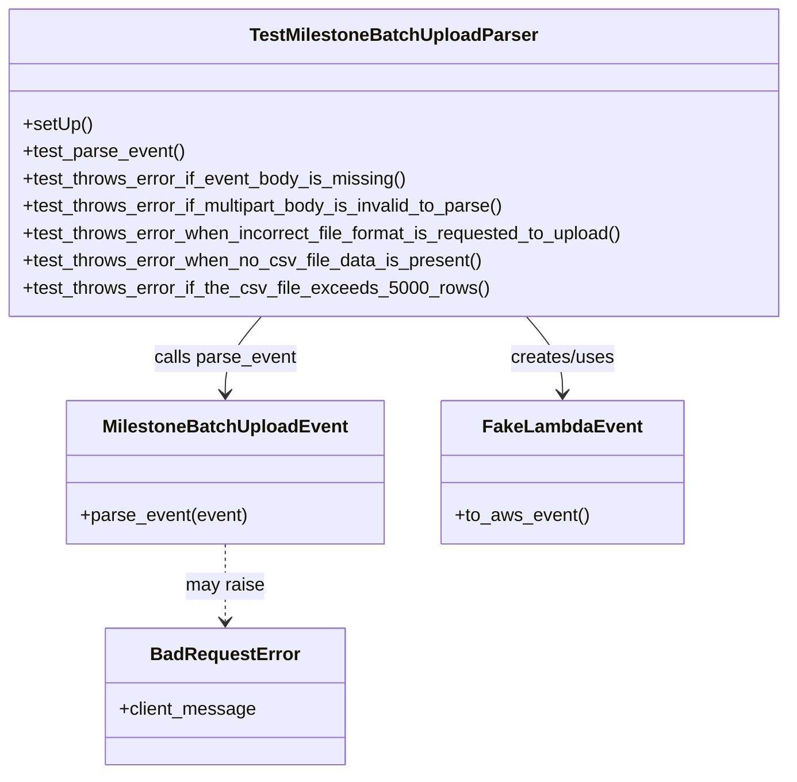

# Diagram: entity_core/entity_service/entity_service_tests/status_update/test_milestone_batch_upload_parser.py


> Auto-generated by Obscura crawlers

## Diagram 1



### SVG

<svg id="container" width="696.6875" xmlns="http://www.w3.org/2000/svg" class="classDiagram" height="680" viewBox="0 0 696.6875 680" role="graphics-document document" aria-roledescription="class"><style>#container{font-family:"trebuchet ms",verdana,arial,sans-serif;font-size:16px;fill:#333;}@keyframes edge-animation-frame{from{stroke-dashoffset:0;}}@keyframes dash{to{stroke-dashoffset:0;}}#container .edge-animation-slow{stroke-dasharray:9,5!important;stroke-dashoffset:900;animation:dash 50s linear infinite;stroke-linecap:round;}#container .edge-animation-fast{stroke-dasharray:9,5!important;stroke-dashoffset:900;animation:dash 20s linear infinite;stroke-linecap:round;}#container .error-icon{fill:#552222;}#container .error-text{fill:#552222;stroke:#552222;}#container .edge-thickness-normal{stroke-width:1px;}#container .edge-thickness-thick{stroke-width:3.5px;}#container .edge-pattern-solid{stroke-dasharray:0;}#container .edge-thickness-invisible{stroke-width:0;fill:none;}#container .edge-pattern-dashed{stroke-dasharray:3;}#container .edge-pattern-dotted{stroke-dasharray:2;}#container .marker{fill:#333333;stroke:#333333;}#container .marker.cross{stroke:#333333;}#container svg{font-family:"trebuchet ms",verdana,arial,sans-serif;font-size:16px;}#container p{margin:0;}#container g.classGroup text{fill:#9370DB;stroke:none;font-family:"trebuchet ms",verdana,arial,sans-serif;font-size:10px;}#container g.classGroup text .title{font-weight:bolder;}#container .nodeLabel,#container .edgeLabel{color:#131300;}#container .edgeLabel .label rect{fill:#ECECFF;}#container .label text{fill:#131300;}#container .labelBkg{background:#ECECFF;}#container .edgeLabel .label span{background:#ECECFF;}#container .classTitle{font-weight:bolder;}#container .node rect,#container .node circle,#container .node ellipse,#container .node polygon,#container .node path{fill:#ECECFF;stroke:#9370DB;stroke-width:1px;}#container .divider{stroke:#9370DB;stroke-width:1;}#container g.clickable{cursor:pointer;}#container g.classGroup rect{fill:#ECECFF;stroke:#9370DB;}#container g.classGroup line{stroke:#9370DB;stroke-width:1;}#container .classLabel .box{stroke:none;stroke-width:0;fill:#ECECFF;opacity:0.5;}#container .classLabel .label{fill:#9370DB;font-size:10px;}#container .relation{stroke:#333333;stroke-width:1;fill:none;}#container .dashed-line{stroke-dasharray:3;}#container .dotted-line{stroke-dasharray:1 2;}#container #compositionStart,#container .composition{fill:#333333!important;stroke:#333333!important;stroke-width:1;}#container #compositionEnd,#container .composition{fill:#333333!important;stroke:#333333!important;stroke-width:1;}#container #dependencyStart,#container .dependency{fill:#333333!important;stroke:#333333!important;stroke-width:1;}#container #dependencyStart,#container .dependency{fill:#333333!important;stroke:#333333!important;stroke-width:1;}#container #extensionStart,#container .extension{fill:transparent!important;stroke:#333333!important;stroke-width:1;}#container #extensionEnd,#container .extension{fill:transparent!important;stroke:#333333!important;stroke-width:1;}#container #aggregationStart,#container .aggregation{fill:transparent!important;stroke:#333333!important;stroke-width:1;}#container #aggregationEnd,#container .aggregation{fill:transparent!important;stroke:#333333!important;stroke-width:1;}#container #lollipopStart,#container .lollipop{fill:#ECECFF!important;stroke:#333333!important;stroke-width:1;}#container #lollipopEnd,#container .lollipop{fill:#ECECFF!important;stroke:#333333!important;stroke-width:1;}#container .edgeTerminals{font-size:11px;line-height:initial;}#container .classTitleText{text-anchor:middle;font-size:18px;fill:#333;}#container .label-icon{display:inline-block;height:1em;overflow:visible;vertical-align:-0.125em;}#container .node .label-icon path{fill:currentColor;stroke:revert;stroke-width:revert;}#container :root{--mermaid-font-family:"trebuchet ms",verdana,arial,sans-serif;}</style><g><defs><marker id="container_class-aggregationStart" class="marker aggregation class" refX="18" refY="7" markerWidth="190" markerHeight="240" orient="auto"><path d="M 18,7 L9,13 L1,7 L9,1 Z"></path></marker></defs><defs><marker id="container_class-aggregationEnd" class="marker aggregation class" refX="1" refY="7" markerWidth="20" markerHeight="28" orient="auto"><path d="M 18,7 L9,13 L1,7 L9,1 Z"></path></marker></defs><defs><marker id="container_class-extensionStart" class="marker extension class" refX="18" refY="7" markerWidth="190" markerHeight="240" orient="auto"><path d="M 1,7 L18,13 V 1 Z"></path></marker></defs><defs><marker id="container_class-extensionEnd" class="marker extension class" refX="1" refY="7" markerWidth="20" markerHeight="28" orient="auto"><path d="M 1,1 V 13 L18,7 Z"></path></marker></defs><defs><marker id="container_class-compositionStart" class="marker composition class" refX="18" refY="7" markerWidth="190" markerHeight="240" orient="auto"><path d="M 18,7 L9,13 L1,7 L9,1 Z"></path></marker></defs><defs><marker id="container_class-compositionEnd" class="marker composition class" refX="1" refY="7" markerWidth="20" markerHeight="28" orient="auto"><path d="M 18,7 L9,13 L1,7 L9,1 Z"></path></marker></defs><defs><marker id="container_class-dependencyStart" class="marker dependency class" refX="6" refY="7" markerWidth="190" markerHeight="240" orient="auto"><path d="M 5,7 L9,13 L1,7 L9,1 Z"></path></marker></defs><defs><marker id="container_class-dependencyEnd" class="marker dependency class" refX="13" refY="7" markerWidth="20" markerHeight="28" orient="auto"><path d="M 18,7 L9,13 L14,7 L9,1 Z"></path></marker></defs><defs><marker id="container_class-lollipopStart" class="marker lollipop class" refX="13" refY="7" markerWidth="190" markerHeight="240" orient="auto"><circle stroke="black" fill="transparent" cx="7" cy="7" r="6"></circle></marker></defs><defs><marker id="container_class-lollipopEnd" class="marker lollipop class" refX="1" refY="7" markerWidth="190" markerHeight="240" orient="auto"><circle stroke="black" fill="transparent" cx="7" cy="7" r="6"></circle></marker></defs><g class="root"><g class="clusters"></g><g class="edgePaths"><path d="M462.153,278L467.352,284.167C472.551,290.333,482.948,302.667,488.147,314C493.346,325.333,493.346,335.667,493.346,340.833L493.346,346" id="id_TestMilestoneBatchUploadParser_FakeLambdaEvent_1" class="edge-thickness-normal edge-pattern-solid relation" style=";;;" data-edge="true" data-et="edge" data-id="id_TestMilestoneBatchUploadParser_FakeLambdaEvent_1" data-points="W3sieCI6NDYyLjE1MzQyMjUxMDkwMTIsInkiOjI3OH0seyJ4Ijo0OTMuMzQ1NzAzMTI1LCJ5IjozMTV9LHsieCI6NDkzLjM0NTcwMzEyNSwieSI6MzUyfV0=" marker-end="url(#container_class-dependencyEnd)"></path><path d="M234.534,278L229.335,284.167C224.137,290.333,213.739,302.667,208.541,314C203.342,325.333,203.342,335.667,203.342,340.833L203.342,346" id="id_TestMilestoneBatchUploadParser_MilestoneBatchUploadEvent_2" class="edge-thickness-normal edge-pattern-solid relation" style=";;;" data-edge="true" data-et="edge" data-id="id_TestMilestoneBatchUploadParser_MilestoneBatchUploadEvent_2" data-points="W3sieCI6MjM0LjUzNDA3NzQ4OTA5ODgyLCJ5IjoyNzh9LHsieCI6MjAzLjM0MTc5Njg3NSwieSI6MzE1fSx7IngiOjIwMy4zNDE3OTY4NzUsInkiOjM1Mn1d" marker-end="url(#container_class-dependencyEnd)"></path><path d="M203.342,478L203.342,484.167C203.342,490.333,203.342,502.667,203.342,514C203.342,525.333,203.342,535.667,203.342,540.833L203.342,546" id="id_MilestoneBatchUploadEvent_BadRequestError_3" class="edge-thickness-normal edge-pattern-dashed relation" style=";;;" data-edge="true" data-et="edge" data-id="id_MilestoneBatchUploadEvent_BadRequestError_3" data-points="W3sieCI6MjAzLjM0MTc5Njg3NSwieSI6NDc4fSx7IngiOjIwMy4zNDE3OTY4NzUsInkiOjUxNX0seyJ4IjoyMDMuMzQxNzk2ODc1LCJ5Ijo1NTJ9XQ==" marker-end="url(#container_class-dependencyEnd)"></path></g><g class="edgeLabels"><g class="edgeLabel" transform="translate(493.345703125, 315)"><g class="label" data-id="id_TestMilestoneBatchUploadParser_FakeLambdaEvent_1" transform="translate(-46.578125, -12)"><foreignObject width="93.15625" height="24"><div xmlns="http://www.w3.org/1999/xhtml" class="labelBkg" style="display: table-cell; white-space: nowrap; line-height: 1.5; max-width: 200px; text-align: center;"><span class="edgeLabel"><p>creates/uses</p></span></div></foreignObject></g></g><g class="edgeLabel" transform="translate(203.341796875, 315)"><g class="label" data-id="id_TestMilestoneBatchUploadParser_MilestoneBatchUploadEvent_2" transform="translate(-62.65625, -12)"><foreignObject width="125.3125" height="24"><div xmlns="http://www.w3.org/1999/xhtml" class="labelBkg" style="display: table-cell; white-space: nowrap; line-height: 1.5; max-width: 200px; text-align: center;"><span class="edgeLabel"><p>calls parse_event</p></span></div></foreignObject></g></g><g class="edgeLabel" transform="translate(203.341796875, 515)"><g class="label" data-id="id_MilestoneBatchUploadEvent_BadRequestError_3" transform="translate(-34.65625, -12)"><foreignObject width="69.3125" height="24"><div xmlns="http://www.w3.org/1999/xhtml" class="labelBkg" style="display: table-cell; white-space: nowrap; line-height: 1.5; max-width: 200px; text-align: center;"><span class="edgeLabel"><p>may raise</p></span></div></foreignObject></g></g></g><g class="nodes"><g class="node default" id="classId-TestMilestoneBatchUploadParser-0" transform="translate(348.34375, 143)"><g class="basic label-container"><path d="M-340.34375 -135 L340.34375 -135 L340.34375 135 L-340.34375 135" stroke="none" stroke-width="0" fill="#ECECFF" style=""></path><path d="M-340.34375 -135 C-171.8599151458894 -135, -3.3760802917788055 -135, 340.34375 -135 M-340.34375 -135 C-131.75435271031463 -135, 76.83504457937073 -135, 340.34375 -135 M340.34375 -135 C340.34375 -49.50833948887227, 340.34375 35.98332102225547, 340.34375 135 M340.34375 -135 C340.34375 -27.67508981712318, 340.34375 79.64982036575364, 340.34375 135 M340.34375 135 C72.09080394386336 135, -196.16214211227327 135, -340.34375 135 M340.34375 135 C126.0328533391934 135, -88.27804332161321 135, -340.34375 135 M-340.34375 135 C-340.34375 29.04549733893728, -340.34375 -76.90900532212544, -340.34375 -135 M-340.34375 135 C-340.34375 74.40213710587297, -340.34375 13.804274211745934, -340.34375 -135" stroke="#9370DB" stroke-width="1.3" fill="none" stroke-dasharray="0 0" style=""></path></g><g class="annotation-group text" transform="translate(0, -111)"></g><g class="label-group text" transform="translate(-121.234375, -111)"><g class="label" style="font-weight: bolder" transform="translate(0,-12)"><foreignObject width="242.46875" height="24"><div xmlns="http://www.w3.org/1999/xhtml" style="display: table-cell; white-space: nowrap; line-height: 1.5; max-width: 289px; text-align: center;"><span class="nodeLabel markdown-node-label" style=""><p>TestMilestoneBatchUploadParser</p></span></div></foreignObject></g></g><g class="members-group text" transform="translate(-328.34375, -63)"></g><g class="methods-group text" transform="translate(-328.34375, -33)"><g class="label" style="" transform="translate(0,-12)"><foreignObject width="60.421875" height="24"><div xmlns="http://www.w3.org/1999/xhtml" style="display: table-cell; white-space: nowrap; line-height: 1.5; max-width: 118px; text-align: center;"><span class="nodeLabel markdown-node-label" style=""><p>+setUp()</p></span></div></foreignObject></g><g class="label" style="" transform="translate(0,12)"><foreignObject width="142.296875" height="24"><div xmlns="http://www.w3.org/1999/xhtml" style="display: table-cell; white-space: nowrap; line-height: 1.5; max-width: 200px; text-align: center;"><span class="nodeLabel markdown-node-label" style=""><p>+test_parse_event()</p></span></div></foreignObject></g><g class="label" style="" transform="translate(0,36)"><foreignObject width="339.125" height="24"><div xmlns="http://www.w3.org/1999/xhtml" style="display: table-cell; white-space: nowrap; line-height: 1.5; max-width: 396px; text-align: center;"><span class="nodeLabel markdown-node-label" style=""><p>+test_throws_error_if_event_body_is_missing()</p></span></div></foreignObject></g><g class="label" style="" transform="translate(0,60)"><foreignObject width="431.65625" height="24"><div xmlns="http://www.w3.org/1999/xhtml" style="display: table-cell; white-space: nowrap; line-height: 1.5; max-width: 489px; text-align: center;"><span class="nodeLabel markdown-node-label" style=""><p>+test_throws_error_if_multipart_body_is_invalid_to_parse()</p></span></div></foreignObject></g><g class="label" style="" transform="translate(0,84)"><foreignObject width="535.453125" height="24"><div xmlns="http://www.w3.org/1999/xhtml" style="display: table-cell; white-space: nowrap; line-height: 1.5; max-width: 593px; text-align: center;"><span class="nodeLabel markdown-node-label" style=""><p>+test_throws_error_when_incorrect_file_format_is_requested_to_upload()</p></span></div></foreignObject></g><g class="label" style="" transform="translate(0,108)"><foreignObject width="403.75" height="24"><div xmlns="http://www.w3.org/1999/xhtml" style="display: table-cell; white-space: nowrap; line-height: 1.5; max-width: 461px; text-align: center;"><span class="nodeLabel markdown-node-label" style=""><p>+test_throws_error_when_no_csv_file_data_is_present()</p></span></div></foreignObject></g><g class="label" style="" transform="translate(0,132)"><foreignObject width="405.765625" height="24"><div xmlns="http://www.w3.org/1999/xhtml" style="display: table-cell; white-space: nowrap; line-height: 1.5; max-width: 463px; text-align: center;"><span class="nodeLabel markdown-node-label" style=""><p>+test_throws_error_if_the_csv_file_exceeds_5000_rows()</p></span></div></foreignObject></g></g><g class="divider" style=""><path d="M-340.34375 -87 C-84.97749341860808 -87, 170.38876316278385 -87, 340.34375 -87 M-340.34375 -87 C-166.3538647293343 -87, 7.636020541331391 -87, 340.34375 -87" stroke="#9370DB" stroke-width="1.3" fill="none" stroke-dasharray="0 0" style=""></path></g><g class="divider" style=""><path d="M-340.34375 -63 C-95.61486824626903 -63, 149.11401350746195 -63, 340.34375 -63 M-340.34375 -63 C-89.36681307518126 -63, 161.6101238496375 -63, 340.34375 -63" stroke="#9370DB" stroke-width="1.3" fill="none" stroke-dasharray="0 0" style=""></path></g></g><g class="node default" id="classId-MilestoneBatchUploadEvent-1" transform="translate(203.341796875, 415)"><g class="basic label-container"><path d="M-136.859375 -63 L136.859375 -63 L136.859375 63 L-136.859375 63" stroke="none" stroke-width="0" fill="#ECECFF" style=""></path><path d="M-136.859375 -63 C-69.34005344898178 -63, -1.8207318979635545 -63, 136.859375 -63 M-136.859375 -63 C-76.84211869628592 -63, -16.82486239257186 -63, 136.859375 -63 M136.859375 -63 C136.859375 -32.344562157995796, 136.859375 -1.6891243159915845, 136.859375 63 M136.859375 -63 C136.859375 -14.06792945935733, 136.859375 34.86414108128534, 136.859375 63 M136.859375 63 C79.96174475663993 63, 23.06411451327986 63, -136.859375 63 M136.859375 63 C38.98318120173671 63, -58.893012596526574 63, -136.859375 63 M-136.859375 63 C-136.859375 14.994641887134456, -136.859375 -33.01071622573109, -136.859375 -63 M-136.859375 63 C-136.859375 26.766024983558943, -136.859375 -9.467950032882115, -136.859375 -63" stroke="#9370DB" stroke-width="1.3" fill="none" stroke-dasharray="0 0" style=""></path></g><g class="annotation-group text" transform="translate(0, -39)"></g><g class="label-group text" transform="translate(-102.828125, -39)"><g class="label" style="font-weight: bolder" transform="translate(0,-12)"><foreignObject width="205.65625" height="24"><div xmlns="http://www.w3.org/1999/xhtml" style="display: table-cell; white-space: nowrap; line-height: 1.5; max-width: 254px; text-align: center;"><span class="nodeLabel markdown-node-label" style=""><p>MilestoneBatchUploadEvent</p></span></div></foreignObject></g></g><g class="members-group text" transform="translate(-124.859375, 9)"></g><g class="methods-group text" transform="translate(-124.859375, 39)"><g class="label" style="" transform="translate(0,-12)"><foreignObject width="146.890625" height="24"><div xmlns="http://www.w3.org/1999/xhtml" style="display: table-cell; white-space: nowrap; line-height: 1.5; max-width: 204px; text-align: center;"><span class="nodeLabel markdown-node-label" style=""><p>+parse_event(event)</p></span></div></foreignObject></g></g><g class="divider" style=""><path d="M-136.859375 -15 C-80.60474010446481 -15, -24.350105208929634 -15, 136.859375 -15 M-136.859375 -15 C-38.87636718628501 -15, 59.10664062742998 -15, 136.859375 -15" stroke="#9370DB" stroke-width="1.3" fill="none" stroke-dasharray="0 0" style=""></path></g><g class="divider" style=""><path d="M-136.859375 9 C-28.905402414385662 9, 79.04857017122868 9, 136.859375 9 M-136.859375 9 C-43.59065821739111 9, 49.67805856521778 9, 136.859375 9" stroke="#9370DB" stroke-width="1.3" fill="none" stroke-dasharray="0 0" style=""></path></g></g><g class="node default" id="classId-FakeLambdaEvent-2" transform="translate(493.345703125, 415)"><g class="basic label-container"><path d="M-103.14453125 -63 L103.14453125 -63 L103.14453125 63 L-103.14453125 63" stroke="none" stroke-width="0" fill="#ECECFF" style=""></path><path d="M-103.14453125 -63 C-39.129988653482314 -63, 24.88455394303537 -63, 103.14453125 -63 M-103.14453125 -63 C-39.10206102045382 -63, 24.940409209092365 -63, 103.14453125 -63 M103.14453125 -63 C103.14453125 -36.536508502993506, 103.14453125 -10.073017005987012, 103.14453125 63 M103.14453125 -63 C103.14453125 -17.9142038119436, 103.14453125 27.171592376112798, 103.14453125 63 M103.14453125 63 C60.58099623216002 63, 18.017461214320036 63, -103.14453125 63 M103.14453125 63 C51.21483594204729 63, -0.7148593659054256 63, -103.14453125 63 M-103.14453125 63 C-103.14453125 33.564579664520195, -103.14453125 4.129159329040398, -103.14453125 -63 M-103.14453125 63 C-103.14453125 27.00513620339479, -103.14453125 -8.989727593210418, -103.14453125 -63" stroke="#9370DB" stroke-width="1.3" fill="none" stroke-dasharray="0 0" style=""></path></g><g class="annotation-group text" transform="translate(0, -39)"></g><g class="label-group text" transform="translate(-65.8671875, -39)"><g class="label" style="font-weight: bolder" transform="translate(0,-12)"><foreignObject width="131.734375" height="24"><div xmlns="http://www.w3.org/1999/xhtml" style="display: table-cell; white-space: nowrap; line-height: 1.5; max-width: 181px; text-align: center;"><span class="nodeLabel markdown-node-label" style=""><p>FakeLambdaEvent</p></span></div></foreignObject></g></g><g class="members-group text" transform="translate(-91.14453125, 9)"></g><g class="methods-group text" transform="translate(-91.14453125, 39)"><g class="label" style="" transform="translate(0,-12)"><foreignObject width="116.421875" height="24"><div xmlns="http://www.w3.org/1999/xhtml" style="display: table-cell; white-space: nowrap; line-height: 1.5; max-width: 174px; text-align: center;"><span class="nodeLabel markdown-node-label" style=""><p>+to_aws_event()</p></span></div></foreignObject></g></g><g class="divider" style=""><path d="M-103.14453125 -15 C-56.01656893787296 -15, -8.888606625745922 -15, 103.14453125 -15 M-103.14453125 -15 C-28.649027094023182 -15, 45.846477061953635 -15, 103.14453125 -15" stroke="#9370DB" stroke-width="1.3" fill="none" stroke-dasharray="0 0" style=""></path></g><g class="divider" style=""><path d="M-103.14453125 9 C-59.87064367169372 9, -16.59675609338744 9, 103.14453125 9 M-103.14453125 9 C-28.792474477907476 9, 45.55958229418505 9, 103.14453125 9" stroke="#9370DB" stroke-width="1.3" fill="none" stroke-dasharray="0 0" style=""></path></g></g><g class="node default" id="classId-BadRequestError-3" transform="translate(203.341796875, 612)"><g class="basic label-container"><path d="M-102.8515625 -60 L102.8515625 -60 L102.8515625 60 L-102.8515625 60" stroke="none" stroke-width="0" fill="#ECECFF" style=""></path><path d="M-102.8515625 -60 C-39.26179373459952 -60, 24.327975030800957 -60, 102.8515625 -60 M-102.8515625 -60 C-25.212539802024608 -60, 52.426482895950784 -60, 102.8515625 -60 M102.8515625 -60 C102.8515625 -20.30432633996864, 102.8515625 19.39134732006272, 102.8515625 60 M102.8515625 -60 C102.8515625 -15.108821606990936, 102.8515625 29.782356786018127, 102.8515625 60 M102.8515625 60 C46.90912683540298 60, -9.033308829194041 60, -102.8515625 60 M102.8515625 60 C51.96668858550201 60, 1.0818146710040253 60, -102.8515625 60 M-102.8515625 60 C-102.8515625 34.83643970391684, -102.8515625 9.672879407833676, -102.8515625 -60 M-102.8515625 60 C-102.8515625 29.202728529590118, -102.8515625 -1.594542940819764, -102.8515625 -60" stroke="#9370DB" stroke-width="1.3" fill="none" stroke-dasharray="0 0" style=""></path></g><g class="annotation-group text" transform="translate(0, -36)"></g><g class="label-group text" transform="translate(-62.28125, -36)"><g class="label" style="font-weight: bolder" transform="translate(0,-12)"><foreignObject width="124.5625" height="24"><div xmlns="http://www.w3.org/1999/xhtml" style="display: table-cell; white-space: nowrap; line-height: 1.5; max-width: 174px; text-align: center;"><span class="nodeLabel markdown-node-label" style=""><p>BadRequestError</p></span></div></foreignObject></g></g><g class="members-group text" transform="translate(-90.8515625, 12)"><g class="label" style="" transform="translate(0,-12)"><foreignObject width="119.421875" height="24"><div xmlns="http://www.w3.org/1999/xhtml" style="display: table-cell; white-space: nowrap; line-height: 1.5; max-width: 177px; text-align: center;"><span class="nodeLabel markdown-node-label" style=""><p>+client_message</p></span></div></foreignObject></g></g><g class="methods-group text" transform="translate(-90.8515625, 60)"></g><g class="divider" style=""><path d="M-102.8515625 -12 C-57.74309632626678 -12, -12.63463015253356 -12, 102.8515625 -12 M-102.8515625 -12 C-48.98123235658406 -12, 4.889097786831883 -12, 102.8515625 -12" stroke="#9370DB" stroke-width="1.3" fill="none" stroke-dasharray="0 0" style=""></path></g><g class="divider" style=""><path d="M-102.8515625 36 C-48.060152995649496 36, 6.731256508701009 36, 102.8515625 36 M-102.8515625 36 C-58.49070020375041 36, -14.129837907500814 36, 102.8515625 36" stroke="#9370DB" stroke-width="1.3" fill="none" stroke-dasharray="0 0" style=""></path></g></g></g></g></g></svg>

## Diagram 2

```mermaid
sequenceDiagram
    participant Test as TestMilestoneBatchUploadParser
    participant Fake as FakeLambdaEvent
    participant Parser as MilestoneBatchUploadEvent
    participant Error as BadRequestError
    Test->>Fake: instantiate FakeLambdaEvent and call to_aws_event()
    Test->>Parser: parse_event(event)
    alt valid multipart with CSV
        Parser-->>Test: return result_event (solution_id, csv_content, filename)
    else missing body
        Parser-->>Error: raise BadRequestError("Event body not found.")
        Error-->>Test: exception propagated
    else invalid multipart body
        Parser-->>Error: raise BadRequestError("Failed to parse the content due to invalid data")
        Error-->>Test: exception propagated
    else unsupported file type
        Parser-->>Error: raise BadRequestError("Unsupported file type.")
        Error-->>Test: exception propagated
    else no CSV data
        Parser-->>Error: raise BadRequestError("No CSV file found in the request.")
        Error-->>Test: exception propagated
    else exceeds 5000 rows
        Parser-->>Error: raise BadRequestError("CSV payload size greater than 5000 row threshold, size 5002")
        Error-->>Test: exception propagated
```

> SVG rendering failed for this diagram.
