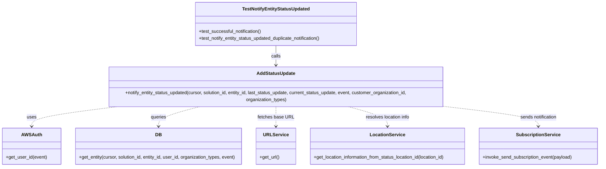
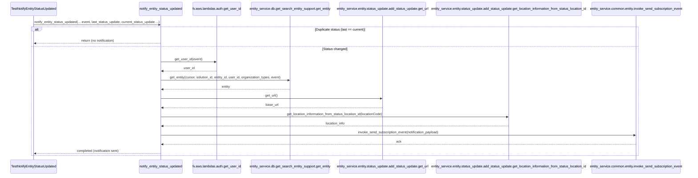

# Diagram: entity_core/entity_service/entity_service_tests/status_update/test_notification_logic.py

> Auto-generated by Obscura crawlers

## Diagram 1

### SVG

<svg id="container" width="2097.328125" xmlns="http://www.w3.org/2000/svg" class="classDiagram" height="566" viewBox="0 0 2097.328125 566" role="graphics-document document" aria-roledescription="class"><g><defs><marker id="container_class-aggregationStart" class="marker aggregation class" refX="18" refY="7" markerWidth="190" markerHeight="240" orient="auto"><path d="M 18,7 L9,13 L1,7 L9,1 Z"></path></marker></defs><defs><marker id="container_class-aggregationEnd" class="marker aggregation class" refX="1" refY="7" markerWidth="20" markerHeight="28" orient="auto"><path d="M 18,7 L9,13 L1,7 L9,1 Z"></path></marker></defs><defs><marker id="container_class-extensionStart" class="marker extension class" refX="18" refY="7" markerWidth="190" markerHeight="240" orient="auto"><path d="M 1,7 L18,13 V 1 Z"></path></marker></defs><defs><marker id="container_class-extensionEnd" class="marker extension class" refX="1" refY="7" markerWidth="20" markerHeight="28" orient="auto"><path d="M 1,1 V 13 L18,7 Z"></path></marker></defs><defs><marker id="container_class-compositionStart" class="marker composition class" refX="18" refY="7" markerWidth="190" markerHeight="240" orient="auto"><path d="M 18,7 L9,13 L1,7 L9,1 Z"></path></marker></defs><defs><marker id="container_class-compositionEnd" class="marker composition class" refX="1" refY="7" markerWidth="20" markerHeight="28" orient="auto"><path d="M 18,7 L9,13 L1,7 L9,1 Z"></path></marker></defs><defs><marker id="container_class-dependencyStart" class="marker dependency class" refX="6" refY="7" markerWidth="190" markerHeight="240" orient="auto"><path d="M 5,7 L9,13 L1,7 L9,1 Z"></path></marker></defs><defs><marker id="container_class-dependencyEnd" class="marker dependency class" refX="13" refY="7" markerWidth="20" markerHeight="28" orient="auto"><path d="M 18,7 L9,13 L14,7 L9,1 Z"></path></marker></defs><defs><marker id="container_class-lollipopStart" class="marker lollipop class" refX="13" refY="7" markerWidth="190" markerHeight="240" orient="auto"><circle stroke="black" fill="transparent" cx="7" cy="7" r="6"></circle></marker></defs><defs><marker id="container_class-lollipopEnd" class="marker lollipop class" refX="1" refY="7" markerWidth="190" markerHeight="240" orient="auto"><circle stroke="black" fill="transparent" cx="7" cy="7" r="6"></circle></marker></defs><g class="root"><g class="clusters"></g><g class="edgePaths"><path d="M960.676,158L960.676,164.167C960.676,170.333,960.676,182.667,960.676,194C960.676,205.333,960.676,215.667,960.676,220.833L960.676,226" id="id_TestNotifyEntityStatusUpdated_AddStatusUpdate_1" class="edge-thickness-normal edge-pattern-solid relation" style=";;;" data-edge="true" data-et="edge" data-id="id_TestNotifyEntityStatusUpdated_AddStatusUpdate_1" data-points="W3sieCI6OTYwLjY3NTc4MTI1LCJ5IjoxNTh9LHsieCI6OTYwLjY3NTc4MTI1LCJ5IjoxOTV9LHsieCI6OTYwLjY3NTc4MTI1LCJ5IjoyMzJ9XQ==" marker-end="url(#container_class-dependencyEnd)"></path><path d="M423.18,358L370.568,364.167C317.956,370.333,212.732,382.667,160.12,394C107.508,405.333,107.508,415.667,107.508,420.833L107.508,426" id="id_AddStatusUpdate_AWSAuth_2" class="edge-thickness-normal edge-pattern-dashed relation" style=";;;" data-edge="true" data-et="edge" data-id="id_AddStatusUpdate_AWSAuth_2" data-points="W3sieCI6NDIzLjE3OTk2MDkzNzUsInkiOjM1OH0seyJ4IjoxMDcuNTA3ODEyNSwieSI6Mzk1fSx7IngiOjEwNy41MDc4MTI1LCJ5Ijo0MzJ9XQ==" marker-end="url(#container_class-dependencyEnd)"></path><path d="M702.184,358L676.882,364.167C651.58,370.333,600.975,382.667,575.673,394C550.371,405.333,550.371,415.667,550.371,420.833L550.371,426" id="id_AddStatusUpdate_DB_3" class="edge-thickness-normal edge-pattern-dashed relation" style=";;;" data-edge="true" data-et="edge" data-id="id_AddStatusUpdate_DB_3" data-points="W3sieCI6NzAyLjE4MzgyODEyNSwieSI6MzU4fSx7IngiOjU1MC4zNzEwOTM3NSwieSI6Mzk1fSx7IngiOjU1MC4zNzEwOTM3NSwieSI6NDMyfV0=" marker-end="url(#container_class-dependencyEnd)"></path><path d="M960.676,358L960.676,364.167C960.676,370.333,960.676,382.667,960.676,394C960.676,405.333,960.676,415.667,960.676,420.833L960.676,426" id="id_AddStatusUpdate_URLService_4" class="edge-thickness-normal edge-pattern-dashed relation" style=";;;" data-edge="true" data-et="edge" data-id="id_AddStatusUpdate_URLService_4" data-points="W3sieCI6OTYwLjY3NTc4MTI1LCJ5IjozNTh9LHsieCI6OTYwLjY3NTc4MTI1LCJ5IjozOTV9LHsieCI6OTYwLjY3NTc4MTI1LCJ5Ijo0MzJ9XQ==" marker-end="url(#container_class-dependencyEnd)"></path><path d="M1207.715,358L1231.896,364.167C1256.077,370.333,1304.439,382.667,1328.62,394C1352.801,405.333,1352.801,415.667,1352.801,420.833L1352.801,426" id="id_AddStatusUpdate_LocationService_5" class="edge-thickness-normal edge-pattern-dashed relation" style=";;;" data-edge="true" data-et="edge" data-id="id_AddStatusUpdate_LocationService_5" data-points="W3sieCI6MTIwNy43MTQ1MzEyNSwieSI6MzU4fSx7IngiOjEzNTIuODAwNzgxMjUsInkiOjM5NX0seyJ4IjoxMzUyLjgwMDc4MTI1LCJ5Ijo0MzJ9XQ==" marker-end="url(#container_class-dependencyEnd)"></path><path d="M1542.151,358L1599.068,364.167C1655.985,370.333,1769.819,382.667,1826.735,394C1883.652,405.333,1883.652,415.667,1883.652,420.833L1883.652,426" id="id_AddStatusUpdate_SubscriptionService_6" class="edge-thickness-normal edge-pattern-dashed relation" style=";;;" data-edge="true" data-et="edge" data-id="id_AddStatusUpdate_SubscriptionService_6" data-points="W3sieCI6MTU0Mi4xNTEwMTU2MjUwMDAxLCJ5IjozNTh9LHsieCI6MTg4My42NTIzNDM3NSwieSI6Mzk1fSx7IngiOjE4ODMuNjUyMzQzNzUsInkiOjQzMn1d" marker-end="url(#container_class-dependencyEnd)"></path></g><g class="edgeLabels"><g class="edgeLabel" transform="translate(960.67578125, 195)"><g class="label" data-id="id_TestNotifyEntityStatusUpdated_AddStatusUpdate_1" transform="translate(-16.4453125, -12)"><foreignObject width="32.890625" height="24">

calls

</foreignObject></g></g><g class="edgeLabel" transform="translate(107.5078125, 395)"><g class="label" data-id="id_AddStatusUpdate_AWSAuth_2" transform="translate(-16.4921875, -12)"><foreignObject width="32.984375" height="24">

uses

</foreignObject></g></g><g class="edgeLabel" transform="translate(550.37109375, 395)"><g class="label" data-id="id_AddStatusUpdate_DB_3" transform="translate(-27.2421875, -12)"><foreignObject width="54.484375" height="24">

queries

</foreignObject></g></g><g class="edgeLabel" transform="translate(960.67578125, 395)"><g class="label" data-id="id_AddStatusUpdate_URLService_4" transform="translate(-61.7421875, -12)"><foreignObject width="123.484375" height="24">

fetches base URL

</foreignObject></g></g><g class="edgeLabel" transform="translate(1352.80078125, 395)"><g class="label" data-id="id_AddStatusUpdate_LocationService_5" transform="translate(-77.9140625, -12)"><foreignObject width="155.828125" height="24">

resolves location info

</foreignObject></g></g><g class="edgeLabel" transform="translate(1883.65234375, 395)"><g class="label" data-id="id_AddStatusUpdate_SubscriptionService_6" transform="translate(-65.1328125, -12)"><foreignObject width="130.265625" height="24">

sends notification

</foreignObject></g></g></g><g class="nodes"><g class="node default" id="classId-TestNotifyEntityStatusUpdated-0" transform="translate(960.67578125, 83)"><g class="basic label-container"><path d="M-285.87109375 -75 L285.87109375 -75 L285.87109375 75 L-285.87109375 75" stroke="none" stroke-width="0" fill="#ECECFF" style=""></path><path d="M-285.87109375 -75 C-130.4086197929665 -75, 25.05385416406699 -75, 285.87109375 -75 M-285.87109375 -75 C-165.31131217076143 -75, -44.75153059152285 -75, 285.87109375 -75 M285.87109375 -75 C285.87109375 -35.15547736669379, 285.87109375 4.689045266612425, 285.87109375 75 M285.87109375 -75 C285.87109375 -27.255153453485704, 285.87109375 20.489693093028592, 285.87109375 75 M285.87109375 75 C61.93368923919047 75, -162.00371527161906 75, -285.87109375 75 M285.87109375 75 C106.86014544037607 75, -72.15080286924785 75, -285.87109375 75 M-285.87109375 75 C-285.87109375 26.96597081122396, -285.87109375 -21.068058377552077, -285.87109375 -75 M-285.87109375 75 C-285.87109375 15.126719228725243, -285.87109375 -44.746561542549514, -285.87109375 -75" stroke="#9370DB" stroke-width="1.3" fill="none" stroke-dasharray="0 0" style=""></path></g><g class="annotation-group text" transform="translate(0, -51)"></g><g class="label-group text" transform="translate(-113.6484375, -51)"><g class="label" style="font-weight: bolder" transform="translate(0,-12)"><foreignObject width="227.296875" height="24">

TestNotifyEntityStatusUpdated

</foreignObject></g></g><g class="members-group text" transform="translate(-273.87109375, -3)"></g><g class="methods-group text" transform="translate(-273.87109375, 27)"><g class="label" style="" transform="translate(0,-12)"><foreignObject width="220.140625" height="24">

+test_successful_notification()

</foreignObject></g><g class="label" style="" transform="translate(0,12)"><foreignObject width="434.09375" height="24">

+test_notify_entity_status_updated_duplicate_notification()

</foreignObject></g></g><g class="divider" style=""><path d="M-285.87109375 -27 C-144.18343310173367 -27, -2.495772453467339 -27, 285.87109375 -27 M-285.87109375 -27 C-107.41744736240938 -27, 71.03619902518125 -27, 285.87109375 -27" stroke="#9370DB" stroke-width="1.3" fill="none" stroke-dasharray="0 0" style=""></path></g><g class="divider" style=""><path d="M-285.87109375 -3 C-170.0964989520876 -3, -54.3219041541752 -3, 285.87109375 -3 M-285.87109375 -3 C-169.83355569399043 -3, -53.796017637980896 -3, 285.87109375 -3" stroke="#9370DB" stroke-width="1.3" fill="none" stroke-dasharray="0 0" style=""></path></g></g><g class="node default" id="classId-AddStatusUpdate-1" transform="translate(960.67578125, 295)"><g class="basic label-container"><path d="M-616.85546875 -63 L616.85546875 -63 L616.85546875 63 L-616.85546875 63" stroke="none" stroke-width="0" fill="#ECECFF" style=""></path><path d="M-616.85546875 -63 C-343.78324046262946 -63, -70.71101217525893 -63, 616.85546875 -63 M-616.85546875 -63 C-229.57860441552526 -63, 157.69825991894947 -63, 616.85546875 -63 M616.85546875 -63 C616.85546875 -36.36593792144427, 616.85546875 -9.731875842888535, 616.85546875 63 M616.85546875 -63 C616.85546875 -25.648853110113244, 616.85546875 11.702293779773512, 616.85546875 63 M616.85546875 63 C283.4566104587175 63, -49.942247832565045 63, -616.85546875 63 M616.85546875 63 C315.1462644619496 63, 13.437060173899226 63, -616.85546875 63 M-616.85546875 63 C-616.85546875 27.32113913834157, -616.85546875 -8.357721723316857, -616.85546875 -63 M-616.85546875 63 C-616.85546875 24.263924480525944, -616.85546875 -14.472151038948113, -616.85546875 -63" stroke="#9370DB" stroke-width="1.3" fill="none" stroke-dasharray="0 0" style=""></path></g><g class="annotation-group text" transform="translate(0, -39)"></g><g class="label-group text" transform="translate(-64.3359375, -39)"><g class="label" style="font-weight: bolder" transform="translate(0,-12)"><foreignObject width="128.671875" height="24">

AddStatusUpdate

</foreignObject></g></g><g class="members-group text" transform="translate(-604.85546875, 9)"></g><g class="methods-group text" transform="translate(-604.85546875, 39)"><g class="label" style="" transform="translate(0,-12)"><foreignObject width="1145.375" height="24">

+notify_entity_status_updated(cursor, solution_id, entity_id, last_status_update, current_status_update, event, customer_organization_id, organization_types)

</foreignObject></g></g><g class="divider" style=""><path d="M-616.85546875 -15 C-330.66201573015593 -15, -44.46856271031186 -15, 616.85546875 -15 M-616.85546875 -15 C-137.73000453764752 -15, 341.39545967470497 -15, 616.85546875 -15" stroke="#9370DB" stroke-width="1.3" fill="none" stroke-dasharray="0 0" style=""></path></g><g class="divider" style=""><path d="M-616.85546875 9 C-290.0239383850904 9, 36.80759197981922 9, 616.85546875 9 M-616.85546875 9 C-233.36549965230165 9, 150.1244694453967 9, 616.85546875 9" stroke="#9370DB" stroke-width="1.3" fill="none" stroke-dasharray="0 0" style=""></path></g></g><g class="node default" id="classId-AWSAuth-2" transform="translate(107.5078125, 495)"><g class="basic label-container"><path d="M-99.5078125 -63 L99.5078125 -63 L99.5078125 63 L-99.5078125 63" stroke="none" stroke-width="0" fill="#ECECFF" style=""></path><path d="M-99.5078125 -63 C-42.49329192545218 -63, 14.521228649095633 -63, 99.5078125 -63 M-99.5078125 -63 C-49.00258779536495 -63, 1.5026369092700946 -63, 99.5078125 -63 M99.5078125 -63 C99.5078125 -26.376988071114546, 99.5078125 10.246023857770908, 99.5078125 63 M99.5078125 -63 C99.5078125 -23.578850201702785, 99.5078125 15.84229959659443, 99.5078125 63 M99.5078125 63 C28.28760180852059 63, -42.93260888295882 63, -99.5078125 63 M99.5078125 63 C33.098398759889164 63, -33.31101498022167 63, -99.5078125 63 M-99.5078125 63 C-99.5078125 35.55715973550343, -99.5078125 8.114319471006873, -99.5078125 -63 M-99.5078125 63 C-99.5078125 14.418384443307886, -99.5078125 -34.16323111338423, -99.5078125 -63" stroke="#9370DB" stroke-width="1.3" fill="none" stroke-dasharray="0 0" style=""></path></g><g class="annotation-group text" transform="translate(0, -39)"></g><g class="label-group text" transform="translate(-32.953125, -39)"><g class="label" style="font-weight: bolder" transform="translate(0,-12)"><foreignObject width="65.90625" height="24">

AWSAuth

</foreignObject></g></g><g class="members-group text" transform="translate(-87.5078125, 9)"></g><g class="methods-group text" transform="translate(-87.5078125, 39)"><g class="label" style="" transform="translate(0,-12)"><foreignObject width="142.0625" height="24">

+get_user_id(event)

</foreignObject></g></g><g class="divider" style=""><path d="M-99.5078125 -15 C-46.26772913588702 -15, 6.972354228225953 -15, 99.5078125 -15 M-99.5078125 -15 C-24.605956489029325 -15, 50.29589952194135 -15, 99.5078125 -15" stroke="#9370DB" stroke-width="1.3" fill="none" stroke-dasharray="0 0" style=""></path></g><g class="divider" style=""><path d="M-99.5078125 9 C-49.42341589519592 9, 0.6609807096081539 9, 99.5078125 9 M-99.5078125 9 C-51.77866379056119 9, -4.0495150811223795 9, 99.5078125 9" stroke="#9370DB" stroke-width="1.3" fill="none" stroke-dasharray="0 0" style=""></path></g></g><g class="node default" id="classId-DB-3" transform="translate(550.37109375, 495)"><g class="basic label-container"><path d="M-293.35546875 -63 L293.35546875 -63 L293.35546875 63 L-293.35546875 63" stroke="none" stroke-width="0" fill="#ECECFF" style=""></path><path d="M-293.35546875 -63 C-69.21176039907928 -63, 154.93194795184144 -63, 293.35546875 -63 M-293.35546875 -63 C-103.01889669932348 -63, 87.31767535135305 -63, 293.35546875 -63 M293.35546875 -63 C293.35546875 -15.409053166742126, 293.35546875 32.18189366651575, 293.35546875 63 M293.35546875 -63 C293.35546875 -15.388914508903724, 293.35546875 32.22217098219255, 293.35546875 63 M293.35546875 63 C159.22409993678005 63, 25.0927311235601 63, -293.35546875 63 M293.35546875 63 C82.88156798255784 63, -127.59233278488432 63, -293.35546875 63 M-293.35546875 63 C-293.35546875 18.41238420005339, -293.35546875 -26.175231599893223, -293.35546875 -63 M-293.35546875 63 C-293.35546875 27.619656840372862, -293.35546875 -7.760686319254276, -293.35546875 -63" stroke="#9370DB" stroke-width="1.3" fill="none" stroke-dasharray="0 0" style=""></path></g><g class="annotation-group text" transform="translate(0, -39)"></g><g class="label-group text" transform="translate(-10.1484375, -39)"><g class="label" style="font-weight: bolder" transform="translate(0,-12)"><foreignObject width="20.296875" height="24">

DB

</foreignObject></g></g><g class="members-group text" transform="translate(-281.35546875, 9)"></g><g class="methods-group text" transform="translate(-281.35546875, 39)"><g class="label" style="" transform="translate(0,-12)"><foreignObject width="552.5625" height="24">

+get_entity(cursor, solution_id, entity_id, user_id, organization_types, event)

</foreignObject></g></g><g class="divider" style=""><path d="M-293.35546875 -15 C-134.43201300962517 -15, 24.491442730749668 -15, 293.35546875 -15 M-293.35546875 -15 C-141.44953111665865 -15, 10.456406516682705 -15, 293.35546875 -15" stroke="#9370DB" stroke-width="1.3" fill="none" stroke-dasharray="0 0" style=""></path></g><g class="divider" style=""><path d="M-293.35546875 9 C-103.59347734005354 9, 86.16851406989292 9, 293.35546875 9 M-293.35546875 9 C-138.43368659693735 9, 16.4880955561253 9, 293.35546875 9" stroke="#9370DB" stroke-width="1.3" fill="none" stroke-dasharray="0 0" style=""></path></g></g><g class="node default" id="classId-URLService-4" transform="translate(960.67578125, 495)"><g class="basic label-container"><path d="M-66.94921875 -63 L66.94921875 -63 L66.94921875 63 L-66.94921875 63" stroke="none" stroke-width="0" fill="#ECECFF" style=""></path><path d="M-66.94921875 -63 C-19.859559161925702 -63, 27.230100426148596 -63, 66.94921875 -63 M-66.94921875 -63 C-18.204864886726362 -63, 30.539488976547275 -63, 66.94921875 -63 M66.94921875 -63 C66.94921875 -29.019975443033545, 66.94921875 4.960049113932911, 66.94921875 63 M66.94921875 -63 C66.94921875 -23.898267111886632, 66.94921875 15.203465776226736, 66.94921875 63 M66.94921875 63 C29.828735345287264 63, -7.291748059425473 63, -66.94921875 63 M66.94921875 63 C32.65897420974719 63, -1.6312703305056147 63, -66.94921875 63 M-66.94921875 63 C-66.94921875 29.527299290282265, -66.94921875 -3.94540141943547, -66.94921875 -63 M-66.94921875 63 C-66.94921875 37.107897060547344, -66.94921875 11.215794121094696, -66.94921875 -63" stroke="#9370DB" stroke-width="1.3" fill="none" stroke-dasharray="0 0" style=""></path></g><g class="annotation-group text" transform="translate(0, -39)"></g><g class="label-group text" transform="translate(-40.8046875, -39)"><g class="label" style="font-weight: bolder" transform="translate(0,-12)"><foreignObject width="81.609375" height="24">

URLService

</foreignObject></g></g><g class="members-group text" transform="translate(-54.94921875, 9)"></g><g class="methods-group text" transform="translate(-54.94921875, 39)"><g class="label" style="" transform="translate(0,-12)"><foreignObject width="69.09375" height="24">

+get_url()

</foreignObject></g></g><g class="divider" style=""><path d="M-66.94921875 -15 C-28.487260155609704 -15, 9.974698438780592 -15, 66.94921875 -15 M-66.94921875 -15 C-15.737187104902446 -15, 35.47484454019511 -15, 66.94921875 -15" stroke="#9370DB" stroke-width="1.3" fill="none" stroke-dasharray="0 0" style=""></path></g><g class="divider" style=""><path d="M-66.94921875 9 C-39.08310140318679 9, -11.216984056373576 9, 66.94921875 9 M-66.94921875 9 C-19.75178949922146 9, 27.44563975155708 9, 66.94921875 9" stroke="#9370DB" stroke-width="1.3" fill="none" stroke-dasharray="0 0" style=""></path></g></g><g class="node default" id="classId-LocationService-5" transform="translate(1352.80078125, 495)"><g class="basic label-container"><path d="M-275.17578125 -63 L275.17578125 -63 L275.17578125 63 L-275.17578125 63" stroke="none" stroke-width="0" fill="#ECECFF" style=""></path><path d="M-275.17578125 -63 C-94.08163690212518 -63, 87.01250744574963 -63, 275.17578125 -63 M-275.17578125 -63 C-107.5144882292922 -63, 60.146804791415605 -63, 275.17578125 -63 M275.17578125 -63 C275.17578125 -16.70538058997088, 275.17578125 29.58923882005824, 275.17578125 63 M275.17578125 -63 C275.17578125 -25.597807344003286, 275.17578125 11.804385311993428, 275.17578125 63 M275.17578125 63 C76.94010911354371 63, -121.29556302291257 63, -275.17578125 63 M275.17578125 63 C76.91998794461077 63, -121.33580536077847 63, -275.17578125 63 M-275.17578125 63 C-275.17578125 18.372455201586213, -275.17578125 -26.255089596827574, -275.17578125 -63 M-275.17578125 63 C-275.17578125 16.557640996588766, -275.17578125 -29.884718006822467, -275.17578125 -63" stroke="#9370DB" stroke-width="1.3" fill="none" stroke-dasharray="0 0" style=""></path></g><g class="annotation-group text" transform="translate(0, -39)"></g><g class="label-group text" transform="translate(-57.9921875, -39)"><g class="label" style="font-weight: bolder" transform="translate(0,-12)"><foreignObject width="115.984375" height="24">

LocationService

</foreignObject></g></g><g class="members-group text" transform="translate(-263.17578125, 9)"></g><g class="methods-group text" transform="translate(-263.17578125, 39)"><g class="label" style="" transform="translate(0,-12)"><foreignObject width="468.359375" height="24">

+get_location_information_from_status_location_id(location_id)

</foreignObject></g></g><g class="divider" style=""><path d="M-275.17578125 -15 C-59.18680991626792 -15, 156.80216141746416 -15, 275.17578125 -15 M-275.17578125 -15 C-62.16981704220231 -15, 150.83614716559538 -15, 275.17578125 -15" stroke="#9370DB" stroke-width="1.3" fill="none" stroke-dasharray="0 0" style=""></path></g><g class="divider" style=""><path d="M-275.17578125 9 C-70.62160848573347 9, 133.93256427853305 9, 275.17578125 9 M-275.17578125 9 C-129.89585494673045 9, 15.384071356539096 9, 275.17578125 9" stroke="#9370DB" stroke-width="1.3" fill="none" stroke-dasharray="0 0" style=""></path></g></g><g class="node default" id="classId-SubscriptionService-6" transform="translate(1883.65234375, 495)"><g class="basic label-container"><path d="M-205.67578125 -63 L205.67578125 -63 L205.67578125 63 L-205.67578125 63" stroke="none" stroke-width="0" fill="#ECECFF" style=""></path><path d="M-205.67578125 -63 C-52.57806535076219 -63, 100.51965054847562 -63, 205.67578125 -63 M-205.67578125 -63 C-121.96112464365086 -63, -38.246468037301725 -63, 205.67578125 -63 M205.67578125 -63 C205.67578125 -31.54636067104404, 205.67578125 -0.09272134208808325, 205.67578125 63 M205.67578125 -63 C205.67578125 -31.355471718398757, 205.67578125 0.28905656320248596, 205.67578125 63 M205.67578125 63 C106.9714218316675 63, 8.267062413334997 63, -205.67578125 63 M205.67578125 63 C122.63784352601023 63, 39.59990580202046 63, -205.67578125 63 M-205.67578125 63 C-205.67578125 27.194499081037577, -205.67578125 -8.611001837924846, -205.67578125 -63 M-205.67578125 63 C-205.67578125 13.143758229465064, -205.67578125 -36.71248354106987, -205.67578125 -63" stroke="#9370DB" stroke-width="1.3" fill="none" stroke-dasharray="0 0" style=""></path></g><g class="annotation-group text" transform="translate(0, -39)"></g><g class="label-group text" transform="translate(-73.1484375, -39)"><g class="label" style="font-weight: bolder" transform="translate(0,-12)"><foreignObject width="146.296875" height="24">

SubscriptionService

</foreignObject></g></g><g class="members-group text" transform="translate(-193.67578125, 9)"></g><g class="methods-group text" transform="translate(-193.67578125, 39)"><g class="label" style="" transform="translate(0,-12)"><foreignObject width="314.203125" height="24">

+invoke_send_subscription_event(payload)

</foreignObject></g></g><g class="divider" style=""><path d="M-205.67578125 -15 C-51.52015224880665 -15, 102.6354767523867 -15, 205.67578125 -15 M-205.67578125 -15 C-52.621605072303964 -15, 100.43257110539207 -15, 205.67578125 -15" stroke="#9370DB" stroke-width="1.3" fill="none" stroke-dasharray="0 0" style=""></path></g><g class="divider" style=""><path d="M-205.67578125 9 C-77.68679817817583 9, 50.30218489364833 9, 205.67578125 9 M-205.67578125 9 C-65.55430666901253 9, 74.56716791197493 9, 205.67578125 9" stroke="#9370DB" stroke-width="1.3" fill="none" stroke-dasharray="0 0" style=""></path></g></g></g></g></g></svg>

## Diagram 2

### SVG

<svg id="container" width="3674" xmlns="http://www.w3.org/2000/svg" height="895" viewBox="-50 -10 3674 895" role="graphics-document document" aria-roledescription="sequence"><g><rect x="3100" y="809" fill="#eaeaea" stroke="#666" width="474" height="65" name="Service" rx="3" ry="3" class="actor actor-bottom"></rect><text x="3337" y="841.5" dominant-baseline="central" alignment-baseline="central" class="actor actor-box" style="text-anchor: middle; font-size: 16px; font-weight: 400;"><tspan x="3337" dy="0">entity_service.common.entity.invoke_send_subscription_event</tspan></text></g><g><rect x="2262" y="809" fill="#eaeaea" stroke="#666" width="788" height="65" name="Location" rx="3" ry="3" class="actor actor-bottom"></rect><text x="2656" y="841.5" dominant-baseline="central" alignment-baseline="central" class="actor actor-box" style="text-anchor: middle; font-size: 16px; font-weight: 400;"><tspan x="2656" dy="0">entity_service.entity.status_update.add_status_update.get_location_information_from_status_location_id</tspan></text></g><g><rect x="1741" y="809" fill="#eaeaea" stroke="#666" width="471" height="65" rx="3" ry="3" class="actor actor-bottom"></rect><text x="1976.5" y="841.5" dominant-baseline="central" alignment-baseline="central" class="actor actor-box" style="text-anchor: middle; font-size: 16px; font-weight: 400;"><tspan x="1976.5" dy="0">entity_service.entity.status_update.add_status_update.get_url</tspan></text></g><g><rect x="1275" y="809" fill="#eaeaea" stroke="#666" width="416" height="65" name="DB" rx="3" ry="3" class="actor actor-bottom"></rect><text x="1483" y="841.5" dominant-baseline="central" alignment-baseline="central" class="actor actor-box" style="text-anchor: middle; font-size: 16px; font-weight: 400;"><tspan x="1483" dy="0">entity_service.db.get_search_entity_support.get_entity</tspan></text></g><g><rect x="971" y="809" fill="#eaeaea" stroke="#666" width="254" height="65" name="Auth" rx="3" ry="3" class="actor actor-bottom"></rect><text x="1098" y="841.5" dominant-baseline="central" alignment-baseline="central" class="actor actor-box" style="text-anchor: middle; font-size: 16px; font-weight: 400;"><tspan x="1098" dy="0">fv.aws.lambdas.auth.get_user_id</tspan></text></g><g><rect x="688" y="809" fill="#eaeaea" stroke="#666" width="233" height="65" name="Add" rx="3" ry="3" class="actor actor-bottom"></rect><text x="804.5" y="841.5" dominant-baseline="central" alignment-baseline="central" class="actor actor-box" style="text-anchor: middle; font-size: 16px; font-weight: 400;"><tspan x="804.5" dy="0">notify_entity_status_updated</tspan></text></g><g><rect x="0" y="809" fill="#eaeaea" stroke="#666" width="243" height="65" name="Test" rx="3" ry="3" class="actor actor-bottom"></rect><text x="121.5" y="841.5" dominant-baseline="central" alignment-baseline="central" class="actor actor-box" style="text-anchor: middle; font-size: 16px; font-weight: 400;"><tspan x="121.5" dy="0">TestNotifyEntityStatusUpdated</tspan></text></g><g><line id="actor6" x1="3337" y1="65" x2="3337" y2="809" class="actor-line 200" stroke-width="0.5px" stroke="#999" name="Service"></line><g id="root-6"><rect x="3100" y="0" fill="#eaeaea" stroke="#666" width="474" height="65" name="Service" rx="3" ry="3" class="actor actor-top"></rect><text x="3337" y="32.5" dominant-baseline="central" alignment-baseline="central" class="actor actor-box" style="text-anchor: middle; font-size: 16px; font-weight: 400;"><tspan x="3337" dy="0">entity_service.common.entity.invoke_send_subscription_event</tspan></text></g></g><g><line id="actor5" x1="2656" y1="65" x2="2656" y2="809" class="actor-line 200" stroke-width="0.5px" stroke="#999" name="Location"></line><g id="root-5"><rect x="2262" y="0" fill="#eaeaea" stroke="#666" width="788" height="65" name="Location" rx="3" ry="3" class="actor actor-top"></rect><text x="2656" y="32.5" dominant-baseline="central" alignment-baseline="central" class="actor actor-box" style="text-anchor: middle; font-size: 16px; font-weight: 400;"><tspan x="2656" dy="0">entity_service.entity.status_update.add_status_update.get_location_information_from_status_location_id</tspan></text></g></g><g><line id="actor4" x1="1976.5" y1="65" x2="1976.5" y2="809" class="actor-line 200" stroke-width="0.5px" stroke="#999"></line><g id="root-4"><rect x="1741" y="0" fill="#eaeaea" stroke="#666" width="471" height="65" rx="3" ry="3" class="actor actor-top"></rect><text x="1976.5" y="32.5" dominant-baseline="central" alignment-baseline="central" class="actor actor-box" style="text-anchor: middle; font-size: 16px; font-weight: 400;"><tspan x="1976.5" dy="0">entity_service.entity.status_update.add_status_update.get_url</tspan></text></g></g><g><line id="actor3" x1="1483" y1="65" x2="1483" y2="809" class="actor-line 200" stroke-width="0.5px" stroke="#999" name="DB"></line><g id="root-3"><rect x="1275" y="0" fill="#eaeaea" stroke="#666" width="416" height="65" name="DB" rx="3" ry="3" class="actor actor-top"></rect><text x="1483" y="32.5" dominant-baseline="central" alignment-baseline="central" class="actor actor-box" style="text-anchor: middle; font-size: 16px; font-weight: 400;"><tspan x="1483" dy="0">entity_service.db.get_search_entity_support.get_entity</tspan></text></g></g><g><line id="actor2" x1="1098" y1="65" x2="1098" y2="809" class="actor-line 200" stroke-width="0.5px" stroke="#999" name="Auth"></line><g id="root-2"><rect x="971" y="0" fill="#eaeaea" stroke="#666" width="254" height="65" name="Auth" rx="3" ry="3" class="actor actor-top"></rect><text x="1098" y="32.5" dominant-baseline="central" alignment-baseline="central" class="actor actor-box" style="text-anchor: middle; font-size: 16px; font-weight: 400;"><tspan x="1098" dy="0">fv.aws.lambdas.auth.get_user_id</tspan></text></g></g><g><line id="actor1" x1="804.5" y1="65" x2="804.5" y2="809" class="actor-line 200" stroke-width="0.5px" stroke="#999" name="Add"></line><g id="root-1"><rect x="688" y="0" fill="#eaeaea" stroke="#666" width="233" height="65" name="Add" rx="3" ry="3" class="actor actor-top"></rect><text x="804.5" y="32.5" dominant-baseline="central" alignment-baseline="central" class="actor actor-box" style="text-anchor: middle; font-size: 16px; font-weight: 400;"><tspan x="804.5" dy="0">notify_entity_status_updated</tspan></text></g></g><g><line id="actor0" x1="121.5" y1="65" x2="121.5" y2="809" class="actor-line 200" stroke-width="0.5px" stroke="#999" name="Test"></line><g id="root-0"><rect x="0" y="0" fill="#eaeaea" stroke="#666" width="243" height="65" name="Test" rx="3" ry="3" class="actor actor-top"></rect><text x="121.5" y="32.5" dominant-baseline="central" alignment-baseline="central" class="actor actor-box" style="text-anchor: middle; font-size: 16px; font-weight: 400;"><tspan x="121.5" dy="0">TestNotifyEntityStatusUpdated</tspan></text></g></g><g></g><defs><symbol id="computer" width="24" height="24"><path transform="scale(.5)" d="M2 2v13h20v-13h-20zm18 11h-16v-9h16v9zm-10.228 6l.466-1h3.524l.467 1h-4.457zm14.228 3h-24l2-6h2.104l-1.33 4h18.45l-1.297-4h2.073l2 6zm-5-10h-14v-7h14v7z"></path></symbol></defs><defs><symbol id="database" fill-rule="evenodd" clip-rule="evenodd"><path transform="scale(.5)" d="M12.258.001l.256.004.255.005.253.008.251.01.249.012.247.015.246.016.242.019.241.02.239.023.236.024.233.027.231.028.229.031.225.032.223.034.22.036.217.038.214.04.211.041.208.043.205.045.201.046.198.048.194.05.191.051.187.053.183.054.18.056.175.057.172.059.168.06.163.061.16.063.155.064.15.066.074.033.073.033.071.034.07.034.069.035.068.035.067.035.066.035.064.036.064.036.062.036.06.036.06.037.058.037.058.037.055.038.055.038.053.038.052.038.051.039.05.039.048.039.047.039.045.04.044.04.043.04.041.04.04.041.039.041.037.041.036.041.034.041.033.042.032.042.03.042.029.042.027.042.026.043.024.043.023.043.021.043.02.043.018.044.017.043.015.044.013.044.012.044.011.045.009.044.007.045.006.045.004.045.002.045.001.045v17l-.001.045-.002.045-.004.045-.006.045-.007.045-.009.044-.011.045-.012.044-.013.044-.015.044-.017.043-.018.044-.02.043-.021.043-.023.043-.024.043-.026.043-.027.042-.029.042-.03.042-.032.042-.033.042-.034.041-.036.041-.037.041-.039.041-.04.041-.041.04-.043.04-.044.04-.045.04-.047.039-.048.039-.05.039-.051.039-.052.038-.053.038-.055.038-.055.038-.058.037-.058.037-.06.037-.06.036-.062.036-.064.036-.064.036-.066.035-.067.035-.068.035-.069.035-.07.034-.071.034-.073.033-.074.033-.15.066-.155.064-.16.063-.163.061-.168.06-.172.059-.175.057-.18.056-.183.054-.187.053-.191.051-.194.05-.198.048-.201.046-.205.045-.208.043-.211.041-.214.04-.217.038-.22.036-.223.034-.225.032-.229.031-.231.028-.233.027-.236.024-.239.023-.241.02-.242.019-.246.016-.247.015-.249.012-.251.01-.253.008-.255.005-.256.004-.258.001-.258-.001-.256-.004-.255-.005-.253-.008-.251-.01-.249-.012-.247-.015-.245-.016-.243-.019-.241-.02-.238-.023-.236-.024-.234-.027-.231-.028-.228-.031-.226-.032-.223-.034-.22-.036-.217-.038-.214-.04-.211-.041-.208-.043-.204-.045-.201-.046-.198-.048-.195-.05-.19-.051-.187-.053-.184-.054-.179-.056-.176-.057-.172-.059-.167-.06-.164-.061-.159-.063-.155-.064-.151-.066-.074-.033-.072-.033-.072-.034-.07-.034-.069-.035-.068-.035-.067-.035-.066-.035-.064-.036-.063-.036-.062-.036-.061-.036-.06-.037-.058-.037-.057-.037-.056-.038-.055-.038-.053-.038-.052-.038-.051-.039-.049-.039-.049-.039-.046-.039-.046-.04-.044-.04-.043-.04-.041-.04-.04-.041-.039-.041-.037-.041-.036-.041-.034-.041-.033-.042-.032-.042-.03-.042-.029-.042-.027-.042-.026-.043-.024-.043-.023-.043-.021-.043-.02-.043-.018-.044-.017-.043-.015-.044-.013-.044-.012-.044-.011-.045-.009-.044-.007-.045-.006-.045-.004-.045-.002-.045-.001-.045v-17l.001-.045.002-.045.004-.045.006-.045.007-.045.009-.044.011-.045.012-.044.013-.044.015-.044.017-.043.018-.044.02-.043.021-.043.023-.043.024-.043.026-.043.027-.042.029-.042.03-.042.032-.042.033-.042.034-.041.036-.041.037-.041.039-.041.04-.041.041-.04.043-.04.044-.04.046-.04.046-.039.049-.039.049-.039.051-.039.052-.038.053-.038.055-.038.056-.038.057-.037.058-.037.06-.037.061-.036.062-.036.063-.036.064-.036.066-.035.067-.035.068-.035.069-.035.07-.034.072-.034.072-.033.074-.033.151-.066.155-.064.159-.063.164-.061.167-.06.172-.059.176-.057.179-.056.184-.054.187-.053.19-.051.195-.05.198-.048.201-.046.204-.045.208-.043.211-.041.214-.04.217-.038.22-.036.223-.034.226-.032.228-.031.231-.028.234-.027.236-.024.238-.023.241-.02.243-.019.245-.016.247-.015.249-.012.251-.01.253-.008.255-.005.256-.004.258-.001.258.001zm-9.258 20.499v.01l.001.021.003.021.004.022.005.021.006.022.007.022.009.023.01.022.011.023.012.023.013.023.015.023.016.024.017.023.018.024.019.024.021.024.022.025.023.024.024.025.052.049.056.05.061.051.066.051.07.051.075.051.079.052.084.052.088.052.092.052.097.052.102.051.105.052.11.052.114.051.119.051.123.051.127.05.131.05.135.05.139.048.144.049.147.047.152.047.155.047.16.045.163.045.167.043.171.043.176.041.178.041.183.039.187.039.19.037.194.035.197.035.202.033.204.031.209.03.212.029.216.027.219.025.222.024.226.021.23.02.233.018.236.016.24.015.243.012.246.01.249.008.253.005.256.004.259.001.26-.001.257-.004.254-.005.25-.008.247-.011.244-.012.241-.014.237-.016.233-.018.231-.021.226-.021.224-.024.22-.026.216-.027.212-.028.21-.031.205-.031.202-.034.198-.034.194-.036.191-.037.187-.039.183-.04.179-.04.175-.042.172-.043.168-.044.163-.045.16-.046.155-.046.152-.047.148-.048.143-.049.139-.049.136-.05.131-.05.126-.05.123-.051.118-.052.114-.051.11-.052.106-.052.101-.052.096-.052.092-.052.088-.053.083-.051.079-.052.074-.052.07-.051.065-.051.06-.051.056-.05.051-.05.023-.024.023-.025.021-.024.02-.024.019-.024.018-.024.017-.024.015-.023.014-.024.013-.023.012-.023.01-.023.01-.022.008-.022.006-.022.006-.022.004-.022.004-.021.001-.021.001-.021v-4.127l-.077.055-.08.053-.083.054-.085.053-.087.052-.09.052-.093.051-.095.05-.097.05-.1.049-.102.049-.105.048-.106.047-.109.047-.111.046-.114.045-.115.045-.118.044-.12.043-.122.042-.124.042-.126.041-.128.04-.13.04-.132.038-.134.038-.135.037-.138.037-.139.035-.142.035-.143.034-.144.033-.147.032-.148.031-.15.03-.151.03-.153.029-.154.027-.156.027-.158.026-.159.025-.161.024-.162.023-.163.022-.165.021-.166.02-.167.019-.169.018-.169.017-.171.016-.173.015-.173.014-.175.013-.175.012-.177.011-.178.01-.179.008-.179.008-.181.006-.182.005-.182.004-.184.003-.184.002h-.37l-.184-.002-.184-.003-.182-.004-.182-.005-.181-.006-.179-.008-.179-.008-.178-.01-.176-.011-.176-.012-.175-.013-.173-.014-.172-.015-.171-.016-.17-.017-.169-.018-.167-.019-.166-.02-.165-.021-.163-.022-.162-.023-.161-.024-.159-.025-.157-.026-.156-.027-.155-.027-.153-.029-.151-.03-.15-.03-.148-.031-.146-.032-.145-.033-.143-.034-.141-.035-.14-.035-.137-.037-.136-.037-.134-.038-.132-.038-.13-.04-.128-.04-.126-.041-.124-.042-.122-.042-.12-.044-.117-.043-.116-.045-.113-.045-.112-.046-.109-.047-.106-.047-.105-.048-.102-.049-.1-.049-.097-.05-.095-.05-.093-.052-.09-.051-.087-.052-.085-.053-.083-.054-.08-.054-.077-.054v4.127zm0-5.654v.011l.001.021.003.021.004.021.005.022.006.022.007.022.009.022.01.022.011.023.012.023.013.023.015.024.016.023.017.024.018.024.019.024.021.024.022.024.023.025.024.024.052.05.056.05.061.05.066.051.07.051.075.052.079.051.084.052.088.052.092.052.097.052.102.052.105.052.11.051.114.051.119.052.123.05.127.051.131.05.135.049.139.049.144.048.147.048.152.047.155.046.16.045.163.045.167.044.171.042.176.042.178.04.183.04.187.038.19.037.194.036.197.034.202.033.204.032.209.03.212.028.216.027.219.025.222.024.226.022.23.02.233.018.236.016.24.014.243.012.246.01.249.008.253.006.256.003.259.001.26-.001.257-.003.254-.006.25-.008.247-.01.244-.012.241-.015.237-.016.233-.018.231-.02.226-.022.224-.024.22-.025.216-.027.212-.029.21-.03.205-.032.202-.033.198-.035.194-.036.191-.037.187-.039.183-.039.179-.041.175-.042.172-.043.168-.044.163-.045.16-.045.155-.047.152-.047.148-.048.143-.048.139-.05.136-.049.131-.05.126-.051.123-.051.118-.051.114-.052.11-.052.106-.052.101-.052.096-.052.092-.052.088-.052.083-.052.079-.052.074-.051.07-.052.065-.051.06-.05.056-.051.051-.049.023-.025.023-.024.021-.025.02-.024.019-.024.018-.024.017-.024.015-.023.014-.023.013-.024.012-.022.01-.023.01-.023.008-.022.006-.022.006-.022.004-.021.004-.022.001-.021.001-.021v-4.139l-.077.054-.08.054-.083.054-.085.052-.087.053-.09.051-.093.051-.095.051-.097.05-.1.049-.102.049-.105.048-.106.047-.109.047-.111.046-.114.045-.115.044-.118.044-.12.044-.122.042-.124.042-.126.041-.128.04-.13.039-.132.039-.134.038-.135.037-.138.036-.139.036-.142.035-.143.033-.144.033-.147.033-.148.031-.15.03-.151.03-.153.028-.154.028-.156.027-.158.026-.159.025-.161.024-.162.023-.163.022-.165.021-.166.02-.167.019-.169.018-.169.017-.171.016-.173.015-.173.014-.175.013-.175.012-.177.011-.178.009-.179.009-.179.007-.181.007-.182.005-.182.004-.184.003-.184.002h-.37l-.184-.002-.184-.003-.182-.004-.182-.005-.181-.007-.179-.007-.179-.009-.178-.009-.176-.011-.176-.012-.175-.013-.173-.014-.172-.015-.171-.016-.17-.017-.169-.018-.167-.019-.166-.02-.165-.021-.163-.022-.162-.023-.161-.024-.159-.025-.157-.026-.156-.027-.155-.028-.153-.028-.151-.03-.15-.03-.148-.031-.146-.033-.145-.033-.143-.033-.141-.035-.14-.036-.137-.036-.136-.037-.134-.038-.132-.039-.13-.039-.128-.04-.126-.041-.124-.042-.122-.043-.12-.043-.117-.044-.116-.044-.113-.046-.112-.046-.109-.046-.106-.047-.105-.048-.102-.049-.1-.049-.097-.05-.095-.051-.093-.051-.09-.051-.087-.053-.085-.052-.083-.054-.08-.054-.077-.054v4.139zm0-5.666v.011l.001.02.003.022.004.021.005.022.006.021.007.022.009.023.01.022.011.023.012.023.013.023.015.023.016.024.017.024.018.023.019.024.021.025.022.024.023.024.024.025.052.05.056.05.061.05.066.051.07.051.075.052.079.051.084.052.088.052.092.052.097.052.102.052.105.051.11.052.114.051.119.051.123.051.127.05.131.05.135.05.139.049.144.048.147.048.152.047.155.046.16.045.163.045.167.043.171.043.176.042.178.04.183.04.187.038.19.037.194.036.197.034.202.033.204.032.209.03.212.028.216.027.219.025.222.024.226.021.23.02.233.018.236.017.24.014.243.012.246.01.249.008.253.006.256.003.259.001.26-.001.257-.003.254-.006.25-.008.247-.01.244-.013.241-.014.237-.016.233-.018.231-.02.226-.022.224-.024.22-.025.216-.027.212-.029.21-.03.205-.032.202-.033.198-.035.194-.036.191-.037.187-.039.183-.039.179-.041.175-.042.172-.043.168-.044.163-.045.16-.045.155-.047.152-.047.148-.048.143-.049.139-.049.136-.049.131-.051.126-.05.123-.051.118-.052.114-.051.11-.052.106-.052.101-.052.096-.052.092-.052.088-.052.083-.052.079-.052.074-.052.07-.051.065-.051.06-.051.056-.05.051-.049.023-.025.023-.025.021-.024.02-.024.019-.024.018-.024.017-.024.015-.023.014-.024.013-.023.012-.023.01-.022.01-.023.008-.022.006-.022.006-.022.004-.022.004-.021.001-.021.001-.021v-4.153l-.077.054-.08.054-.083.053-.085.053-.087.053-.09.051-.093.051-.095.051-.097.05-.1.049-.102.048-.105.048-.106.048-.109.046-.111.046-.114.046-.115.044-.118.044-.12.043-.122.043-.124.042-.126.041-.128.04-.13.039-.132.039-.134.038-.135.037-.138.036-.139.036-.142.034-.143.034-.144.033-.147.032-.148.032-.15.03-.151.03-.153.028-.154.028-.156.027-.158.026-.159.024-.161.024-.162.023-.163.023-.165.021-.166.02-.167.019-.169.018-.169.017-.171.016-.173.015-.173.014-.175.013-.175.012-.177.01-.178.01-.179.009-.179.007-.181.006-.182.006-.182.004-.184.003-.184.001-.185.001-.185-.001-.184-.001-.184-.003-.182-.004-.182-.006-.181-.006-.179-.007-.179-.009-.178-.01-.176-.01-.176-.012-.175-.013-.173-.014-.172-.015-.171-.016-.17-.017-.169-.018-.167-.019-.166-.02-.165-.021-.163-.023-.162-.023-.161-.024-.159-.024-.157-.026-.156-.027-.155-.028-.153-.028-.151-.03-.15-.03-.148-.032-.146-.032-.145-.033-.143-.034-.141-.034-.14-.036-.137-.036-.136-.037-.134-.038-.132-.039-.13-.039-.128-.041-.126-.041-.124-.041-.122-.043-.12-.043-.117-.044-.116-.044-.113-.046-.112-.046-.109-.046-.106-.048-.105-.048-.102-.048-.1-.05-.097-.049-.095-.051-.093-.051-.09-.052-.087-.052-.085-.053-.083-.053-.08-.054-.077-.054v4.153zm8.74-8.179l-.257.004-.254.005-.25.008-.247.011-.244.012-.241.014-.237.016-.233.018-.231.021-.226.022-.224.023-.22.026-.216.027-.212.028-.21.031-.205.032-.202.033-.198.034-.194.036-.191.038-.187.038-.183.04-.179.041-.175.042-.172.043-.168.043-.163.045-.16.046-.155.046-.152.048-.148.048-.143.048-.139.049-.136.05-.131.05-.126.051-.123.051-.118.051-.114.052-.11.052-.106.052-.101.052-.096.052-.092.052-.088.052-.083.052-.079.052-.074.051-.07.052-.065.051-.06.05-.056.05-.051.05-.023.025-.023.024-.021.024-.02.025-.019.024-.018.024-.017.023-.015.024-.014.023-.013.023-.012.023-.01.023-.01.022-.008.022-.006.023-.006.021-.004.022-.004.021-.001.021-.001.021.001.021.001.021.004.021.004.022.006.021.006.023.008.022.01.022.01.023.012.023.013.023.014.023.015.024.017.023.018.024.019.024.02.025.021.024.023.024.023.025.051.05.056.05.06.05.065.051.07.052.074.051.079.052.083.052.088.052.092.052.096.052.101.052.106.052.11.052.114.052.118.051.123.051.126.051.131.05.136.05.139.049.143.048.148.048.152.048.155.046.16.046.163.045.168.043.172.043.175.042.179.041.183.04.187.038.191.038.194.036.198.034.202.033.205.032.21.031.212.028.216.027.22.026.224.023.226.022.231.021.233.018.237.016.241.014.244.012.247.011.25.008.254.005.257.004.26.001.26-.001.257-.004.254-.005.25-.008.247-.011.244-.012.241-.014.237-.016.233-.018.231-.021.226-.022.224-.023.22-.026.216-.027.212-.028.21-.031.205-.032.202-.033.198-.034.194-.036.191-.038.187-.038.183-.04.179-.041.175-.042.172-.043.168-.043.163-.045.16-.046.155-.046.152-.048.148-.048.143-.048.139-.049.136-.05.131-.05.126-.051.123-.051.118-.051.114-.052.11-.052.106-.052.101-.052.096-.052.092-.052.088-.052.083-.052.079-.052.074-.051.07-.052.065-.051.06-.05.056-.05.051-.05.023-.025.023-.024.021-.024.02-.025.019-.024.018-.024.017-.023.015-.024.014-.023.013-.023.012-.023.01-.023.01-.022.008-.022.006-.023.006-.021.004-.022.004-.021.001-.021.001-.021-.001-.021-.001-.021-.004-.021-.004-.022-.006-.021-.006-.023-.008-.022-.01-.022-.01-.023-.012-.023-.013-.023-.014-.023-.015-.024-.017-.023-.018-.024-.019-.024-.02-.025-.021-.024-.023-.024-.023-.025-.051-.05-.056-.05-.06-.05-.065-.051-.07-.052-.074-.051-.079-.052-.083-.052-.088-.052-.092-.052-.096-.052-.101-.052-.106-.052-.11-.052-.114-.052-.118-.051-.123-.051-.126-.051-.131-.05-.136-.05-.139-.049-.143-.048-.148-.048-.152-.048-.155-.046-.16-.046-.163-.045-.168-.043-.172-.043-.175-.042-.179-.041-.183-.04-.187-.038-.191-.038-.194-.036-.198-.034-.202-.033-.205-.032-.21-.031-.212-.028-.216-.027-.22-.026-.224-.023-.226-.022-.231-.021-.233-.018-.237-.016-.241-.014-.244-.012-.247-.011-.25-.008-.254-.005-.257-.004-.26-.001-.26.001z"></path></symbol></defs><defs><symbol id="clock" width="24" height="24"><path transform="scale(.5)" d="M12 2c5.514 0 10 4.486 10 10s-4.486 10-10 10-10-4.486-10-10 4.486-10 10-10zm0-2c-6.627 0-12 5.373-12 12s5.373 12 12 12 12-5.373 12-12-5.373-12-12-12zm5.848 12.459c.202.038.202.333.001.372-1.907.361-6.045 1.111-6.547 1.111-.719 0-1.301-.582-1.301-1.301 0-.512.77-5.447 1.125-7.445.034-.192.312-.181.343.014l.985 6.238 5.394 1.011z"></path></symbol></defs><defs><marker id="arrowhead" refX="7.9" refY="5" markerUnits="userSpaceOnUse" markerWidth="12" markerHeight="12" orient="auto-start-reverse"><path d="M -1 0 L 10 5 L 0 10 z"></path></marker></defs><defs><marker id="crosshead" markerWidth="15" markerHeight="8" orient="auto" refX="4" refY="4.5"><path fill="none" stroke="#000000" stroke-width="1pt" d="M 1,2 L 6,7 M 6,2 L 1,7" style="stroke-dasharray: 0, 0;"></path></marker></defs><defs><marker id="filled-head" refX="15.5" refY="7" markerWidth="20" markerHeight="28" orient="auto"><path d="M 18,7 L9,13 L14,7 L9,1 Z"></path></marker></defs><defs><marker id="sequencenumber" refX="15" refY="15" markerWidth="60" markerHeight="40" orient="auto"><circle cx="15" cy="15" r="6"></circle></marker></defs><g><line x1="110.5" y1="123" x2="3348" y2="123" class="loopLine"></line><line x1="3348" y1="123" x2="3348" y2="789" class="loopLine"></line><line x1="110.5" y1="789" x2="3348" y2="789" class="loopLine"></line><line x1="110.5" y1="123" x2="110.5" y2="789" class="loopLine"></line><line x1="110.5" y1="221" x2="3348" y2="221" class="loopLine" style="stroke-dasharray: 3, 3;"></line><polygon points="110.5,123 160.5,123 160.5,136 152.1,143 110.5,143" class="labelBox"></polygon><text x="136" y="136" text-anchor="middle" dominant-baseline="middle" alignment-baseline="middle" class="labelText" style="font-size: 16px; font-weight: 400;">alt</text><text x="1754.25" y="141" text-anchor="middle" class="loopText" style="font-size: 16px; font-weight: 400;"><tspan x="1754.25">[Duplicate status (last == current)]</tspan></text><text x="1729.25" y="239" text-anchor="middle" class="loopText" style="font-size: 16px; font-weight: 400;">[Status changed]</text></g><text x="462" y="80" text-anchor="middle" dominant-baseline="middle" alignment-baseline="middle" class="messageText" dy="1em" style="font-size: 16px; font-weight: 400;">notify_entity_status_updated(... event, last_status_update, current_status_update ...)</text><line x1="122.5" y1="113" x2="800.5" y2="113" class="messageLine0" stroke-width="2" stroke="none" marker-end="url(#arrowhead)" style="fill: none;"></line><text x="465" y="173" text-anchor="middle" dominant-baseline="middle" alignment-baseline="middle" class="messageText" dy="1em" style="font-size: 16px; font-weight: 400;">return (no notification)</text><line x1="803.5" y1="206" x2="125.5" y2="206" class="messageLine1" stroke-width="2" stroke="none" marker-end="url(#arrowhead)" style="stroke-dasharray: 3, 3; fill: none;"></line><text x="950" y="266" text-anchor="middle" dominant-baseline="middle" alignment-baseline="middle" class="messageText" dy="1em" style="font-size: 16px; font-weight: 400;">get_user_id(event)</text><line x1="805.5" y1="299" x2="1094" y2="299" class="messageLine0" stroke-width="2" stroke="none" marker-end="url(#arrowhead)" style="fill: none;"></line><text x="953" y="314" text-anchor="middle" dominant-baseline="middle" alignment-baseline="middle" class="messageText" dy="1em" style="font-size: 16px; font-weight: 400;">user_id</text><line x1="1097" y1="347" x2="808.5" y2="347" class="messageLine1" stroke-width="2" stroke="none" marker-end="url(#arrowhead)" style="stroke-dasharray: 3, 3; fill: none;"></line><text x="1142" y="362" text-anchor="middle" dominant-baseline="middle" alignment-baseline="middle" class="messageText" dy="1em" style="font-size: 16px; font-weight: 400;">get_entity(cursor, solution_id, entity_id, user_id, organization_types, event)</text><line x1="805.5" y1="395" x2="1479" y2="395" class="messageLine0" stroke-width="2" stroke="none" marker-end="url(#arrowhead)" style="fill: none;"></line><text x="1145" y="410" text-anchor="middle" dominant-baseline="middle" alignment-baseline="middle" class="messageText" dy="1em" style="font-size: 16px; font-weight: 400;">entity</text><line x1="1482" y1="443" x2="808.5" y2="443" class="messageLine1" stroke-width="2" stroke="none" marker-end="url(#arrowhead)" style="stroke-dasharray: 3, 3; fill: none;"></line><text x="1389" y="458" text-anchor="middle" dominant-baseline="middle" alignment-baseline="middle" class="messageText" dy="1em" style="font-size: 16px; font-weight: 400;">get_url()</text><line x1="805.5" y1="491" x2="1972.5" y2="491" class="messageLine0" stroke-width="2" stroke="none" marker-end="url(#arrowhead)" style="fill: none;"></line><text x="1392" y="506" text-anchor="middle" dominant-baseline="middle" alignment-baseline="middle" class="messageText" dy="1em" style="font-size: 16px; font-weight: 400;">base_url</text><line x1="1975.5" y1="539" x2="808.5" y2="539" class="messageLine1" stroke-width="2" stroke="none" marker-end="url(#arrowhead)" style="stroke-dasharray: 3, 3; fill: none;"></line><text x="1729" y="554" text-anchor="middle" dominant-baseline="middle" alignment-baseline="middle" class="messageText" dy="1em" style="font-size: 16px; font-weight: 400;">get_location_information_from_status_location_id(locationCode)</text><line x1="805.5" y1="587" x2="2652" y2="587" class="messageLine0" stroke-width="2" stroke="none" marker-end="url(#arrowhead)" style="fill: none;"></line><text x="1732" y="602" text-anchor="middle" dominant-baseline="middle" alignment-baseline="middle" class="messageText" dy="1em" style="font-size: 16px; font-weight: 400;">location_info</text><line x1="2655" y1="635" x2="808.5" y2="635" class="messageLine1" stroke-width="2" stroke="none" marker-end="url(#arrowhead)" style="stroke-dasharray: 3, 3; fill: none;"></line><text x="2069" y="650" text-anchor="middle" dominant-baseline="middle" alignment-baseline="middle" class="messageText" dy="1em" style="font-size: 16px; font-weight: 400;">invoke_send_subscription_event(notification_payload)</text><line x1="805.5" y1="683" x2="3333" y2="683" class="messageLine0" stroke-width="2" stroke="none" marker-end="url(#arrowhead)" style="fill: none;"></line><text x="2072" y="698" text-anchor="middle" dominant-baseline="middle" alignment-baseline="middle" class="messageText" dy="1em" style="font-size: 16px; font-weight: 400;">ack</text><line x1="3336" y1="731" x2="808.5" y2="731" class="messageLine1" stroke-width="2" stroke="none" marker-end="url(#arrowhead)" style="stroke-dasharray: 3, 3; fill: none;"></line><text x="465" y="746" text-anchor="middle" dominant-baseline="middle" alignment-baseline="middle" class="messageText" dy="1em" style="font-size: 16px; font-weight: 400;">completed (notification sent)</text><line x1="803.5" y1="779" x2="125.5" y2="779" class="messageLine1" stroke-width="2" stroke="none" marker-end="url(#arrowhead)" style="stroke-dasharray: 3, 3; fill: none;"></line></svg>
