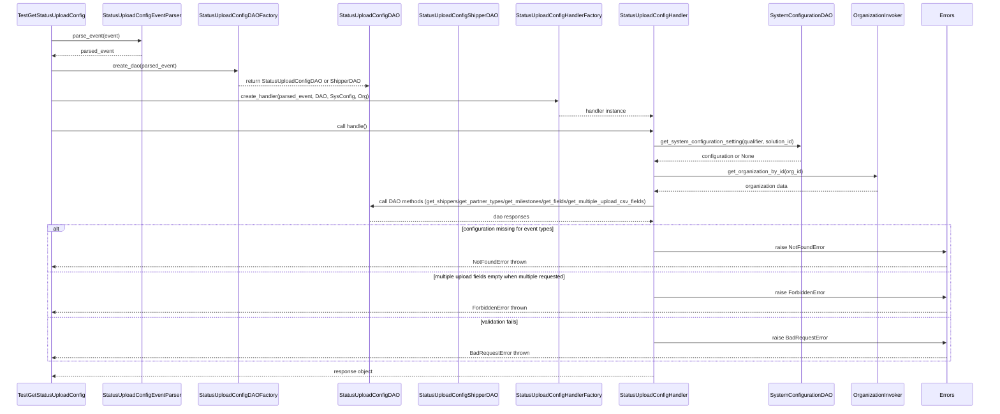

# Diagram: entity_core/entity_service/entity_service_tests/status_update/test_status_upload_config.py

> Auto-generated by Obscura crawlers

## Diagram 1

```mermaid
classDiagram
    class TestGetStatusUploadConfig {
        +setUp()
        +test_event_parsing()
        +test_dao_factory()
        +test_get_shippers_as_shipper()
        +test_get_shippers_as_non_shipper()
        +test_get_partner_types()
        +test_get_event_types()
        +test_get_milestones()
        +test_get_fields_when_event_type_is_single()
        +test_get_fields_when_event_type_is_multiple()
        +assert_raises_error()
    }
    class MockStatusUploadConfigDAO {
        +get_shippers()
        +get_partner_types(solution_id)
        +get_milestones(solution_id, partner_type)
        +get_fields(solution_id, partner_type, code, subcode=None)
        +get_multiple_upload_csv_fields(solution_id)
    }
    class MockStatusUploadConfigShipperDAO {
        +get_shippers()
    }
    class MockSystemConfigurationDAOWithBothOptions {
        +get_system_configuration_setting(qualifier, solution_id)
    }
    class MockSystemConfigurationDAOWithSingleOption {
        +get_system_configuration_setting(qualifier, solution_id)
    }
    class MockSystemConfigurationDAOWithMultipleOption {
        +get_system_configuration_setting(qualifier, solution_id)
    }
    class MockSystemConfigurationDAOWithoutEventTypeConfiguration {
        +get_system_configuration_setting(qualifier, solution_id)
    }
    class MockOrganizationInvoker {
        +get_organization_by_id(org_id)
    }
    class StatusUploadConfigEventParser
    class StatusUploadConfigDAOFactory
    class StatusUploadConfigDAO
    class StatusUploadConfigShipperDAO
    class StatusUploadConfigHandlerFactory
    class MilestoneConfigHandler
    class MultipleTypeFieldConfigHandler
    class SingleTypeFieldConfigHandler
    class PartnerTypeConfigHandler
    class ForbiddenError
    class BadRequestError
    class NotFoundError

    TestGetStatusUploadConfig o-- MockStatusUploadConfigDAO
    TestGetStatusUploadConfig o-- MockStatusUploadConfigShipperDAO
    TestGetStatusUploadConfig o-- MockSystemConfigurationDAOWithBothOptions
    TestGetStatusUploadConfig o-- MockSystemConfigurationDAOWithSingleOption
    TestGetStatusUploadConfig o-- MockSystemConfigurationDAOWithMultipleOption
    TestGetStatusUploadConfig o-- MockSystemConfigurationDAOWithoutEventTypeConfiguration
    TestGetStatusUploadConfig o-- MockOrganizationInvoker

    MockStatusUploadConfigDAO <|-- MockStatusUploadConfigShipperDAO

    TestGetStatusUploadConfig ..> StatusUploadConfigEventParser : uses
    StatusUploadConfigDAOFactory ..> StatusUploadConfigDAO : creates
    StatusUploadConfigDAOFactory ..> StatusUploadConfigShipperDAO : creates
    StatusUploadConfigHandlerFactory ..> MilestoneConfigHandler : creates
    StatusUploadConfigHandlerFactory ..> MultipleTypeFieldConfigHandler : creates
    StatusUploadConfigHandlerFactory ..> SingleTypeFieldConfigHandler : creates
    StatusUploadConfigHandlerFactory ..> PartnerTypeConfigHandler : creates

    MilestoneConfigHandler ..> BadRequestError : may raise
    SingleTypeFieldConfigHandler ..> BadRequestError : may raise
    MultipleTypeFieldConfigHandler ..> BadRequestError : may raise
    StatusUploadConfigHandlerFactory ..> NotFoundError : may raise
    StatusUploadConfigHandlerFactory ..> ForbiddenError : may raise
    StatusUploadConfigHandlerFactory ..> MockSystemConfigurationDAOWithBothOptions : queries
    StatusUploadConfigHandlerFactory ..> MockOrganizationInvoker : queries
```

### SVG

<svg id="container" width="6042.9140625" xmlns="http://www.w3.org/2000/svg" class="classDiagram" height="878" viewBox="0 0 6042.9140625 878" role="graphics-document document" aria-roledescription="class"><g><defs><marker id="container_class-aggregationStart" class="marker aggregation class" refX="18" refY="7" markerWidth="190" markerHeight="240" orient="auto"><path d="M 18,7 L9,13 L1,7 L9,1 Z"></path></marker></defs><defs><marker id="container_class-aggregationEnd" class="marker aggregation class" refX="1" refY="7" markerWidth="20" markerHeight="28" orient="auto"><path d="M 18,7 L9,13 L1,7 L9,1 Z"></path></marker></defs><defs><marker id="container_class-extensionStart" class="marker extension class" refX="18" refY="7" markerWidth="190" markerHeight="240" orient="auto"><path d="M 1,7 L18,13 V 1 Z"></path></marker></defs><defs><marker id="container_class-extensionEnd" class="marker extension class" refX="1" refY="7" markerWidth="20" markerHeight="28" orient="auto"><path d="M 1,1 V 13 L18,7 Z"></path></marker></defs><defs><marker id="container_class-compositionStart" class="marker composition class" refX="18" refY="7" markerWidth="190" markerHeight="240" orient="auto"><path d="M 18,7 L9,13 L1,7 L9,1 Z"></path></marker></defs><defs><marker id="container_class-compositionEnd" class="marker composition class" refX="1" refY="7" markerWidth="20" markerHeight="28" orient="auto"><path d="M 18,7 L9,13 L1,7 L9,1 Z"></path></marker></defs><defs><marker id="container_class-dependencyStart" class="marker dependency class" refX="6" refY="7" markerWidth="190" markerHeight="240" orient="auto"><path d="M 5,7 L9,13 L1,7 L9,1 Z"></path></marker></defs><defs><marker id="container_class-dependencyEnd" class="marker dependency class" refX="13" refY="7" markerWidth="20" markerHeight="28" orient="auto"><path d="M 18,7 L9,13 L14,7 L9,1 Z"></path></marker></defs><defs><marker id="container_class-lollipopStart" class="marker lollipop class" refX="13" refY="7" markerWidth="190" markerHeight="240" orient="auto"><circle stroke="black" fill="transparent" cx="7" cy="7" r="6"></circle></marker></defs><defs><marker id="container_class-lollipopEnd" class="marker lollipop class" refX="1" refY="7" markerWidth="190" markerHeight="240" orient="auto"><circle stroke="black" fill="transparent" cx="7" cy="7" r="6"></circle></marker></defs><g class="root"><g class="clusters"></g><g class="edgePaths"><path d="M2592.358,268.659L2669.544,292.382C2746.731,316.106,2901.104,363.553,2978.29,393.443C3055.477,423.333,3055.477,435.667,3055.477,441.833L3055.477,448" id="id_TestGetStatusUploadConfig_MockStatusUploadConfigDAO_1" class="edge-thickness-normal edge-pattern-solid relation" style=";;;" data-edge="true" data-et="edge" data-id="id_TestGetStatusUploadConfig_MockStatusUploadConfigDAO_1" data-points="W3sieCI6MjU3NS44NjkxNDA2MjUsInkiOjI2My41OTA3NjEzNzIyODc0fSx7IngiOjMwNTUuNDc2NTYyNSwieSI6NDExfSx7IngiOjMwNTUuNDc2NTYyNSwieSI6NDQ4fV0=" marker-start="url(#container_class-aggregationStart)"></path><path d="M2590.986,329.117L2615.817,342.764C2640.647,356.411,2690.308,383.706,2715.138,422.019C2739.969,460.333,2739.969,509.667,2739.969,559C2739.969,608.333,2739.969,657.667,2749.307,688.5C2758.646,719.333,2777.322,731.667,2786.661,737.833L2795.999,744" id="id_TestGetStatusUploadConfig_MockStatusUploadConfigShipperDAO_2" class="edge-thickness-normal edge-pattern-solid relation" style=";;;" data-edge="true" data-et="edge" data-id="id_TestGetStatusUploadConfig_MockStatusUploadConfigShipperDAO_2" data-points="W3sieCI6MjU3NS44NjkxNDA2MjUsInkiOjMyMC44MDgxOTA1NzAwNjA5fSx7IngiOjI3MzkuOTY4NzUsInkiOjQxMX0seyJ4IjoyNzM5Ljk2ODc1LCJ5Ijo1NTl9LHsieCI6MjczOS45Njg3NSwieSI6NzA3fSx7IngiOjI3OTUuOTk5MTc5Njg3NSwieSI6NzQ0fV0=" marker-start="url(#container_class-aggregationStart)"></path><path d="M2590.068,363.744L2601.483,371.62C2612.899,379.496,2635.73,395.248,2819.526,422.181C3003.322,449.113,3348.083,487.226,3520.463,506.283L3692.844,525.339" id="id_TestGetStatusUploadConfig_MockSystemConfigurationDAOWithBothOptions_3" class="edge-thickness-normal edge-pattern-solid relation" style=";;;" data-edge="true" data-et="edge" data-id="id_TestGetStatusUploadConfig_MockSystemConfigurationDAOWithBothOptions_3" data-points="W3sieCI6MjU3NS44NjkxNDA2MjUsInkiOjM1My45NDgzODk3MDQ4OTE1fSx7IngiOjI2NTguNTYwNTQ2ODc1LCJ5Ijo0MTF9LHsieCI6MzY5Mi44NDM3NSwieSI6NTI1LjMzOTA5MDYxMzMzMzR9XQ==" marker-start="url(#container_class-aggregationStart)"></path><path d="M2293.002,390.797L2292.215,394.165C2291.428,397.532,2289.855,404.266,2261.417,421.8C2232.979,439.333,2177.677,467.667,2150.027,481.833L2122.376,496" id="id_TestGetStatusUploadConfig_MockSystemConfigurationDAOWithSingleOption_4" class="edge-thickness-normal edge-pattern-solid relation" style=";;;" data-edge="true" data-et="edge" data-id="id_TestGetStatusUploadConfig_MockSystemConfigurationDAOWithSingleOption_4" data-points="W3sieCI6MjI5Ni45MjcxNzUwNzEwMjI3LCJ5IjozNzR9LHsieCI6MjI4OC4yODEyNSwieSI6NDExfSx7IngiOjIxMjIuMzc1NTU0MjY1MjAyNSwieSI6NDk2fV0=" marker-start="url(#container_class-aggregationStart)"></path><path d="M2088.453,331.466L2064.744,344.722C2041.035,357.977,1993.617,384.489,1911.427,411.911C1829.237,439.333,1712.276,467.667,1653.795,481.833L1595.314,496" id="id_TestGetStatusUploadConfig_MockSystemConfigurationDAOWithMultipleOption_5" class="edge-thickness-normal edge-pattern-solid relation" style=";;;" data-edge="true" data-et="edge" data-id="id_TestGetStatusUploadConfig_MockSystemConfigurationDAOWithMultipleOption_5" data-points="W3sieCI6MjEwMy41MDk3NjU2MjUsInkiOjMyMy4wNDc4MjkxNzMwMTU5NH0seyJ4IjoxOTQ2LjE5OTIxODc1LCJ5Ijo0MTF9LHsieCI6MTU5NS4zMTM5NzgwNDA1NDA0LCJ5Ijo0OTZ9XQ==" marker-start="url(#container_class-aggregationStart)"></path><path d="M2086.96,265.283L2004.332,289.569C1921.704,313.855,1756.448,362.428,1571.336,402.748C1386.224,443.068,1181.257,475.136,1078.773,491.17L976.289,507.204" id="id_TestGetStatusUploadConfig_MockSystemConfigurationDAOWithoutEventTypeConfiguration_6" class="edge-thickness-normal edge-pattern-solid relation" style=";;;" data-edge="true" data-et="edge" data-id="id_TestGetStatusUploadConfig_MockSystemConfigurationDAOWithoutEventTypeConfiguration_6" data-points="W3sieCI6MjEwMy41MDk3NjU2MjUsInkiOjI2MC40MTgzOTI1NjIxODgzM30seyJ4IjoxNTkxLjE5MTQwNjI1LCJ5Ijo0MTF9LHsieCI6OTc2LjI4OTA2MjUsInkiOjUwNy4yMDQzMzkxNzIzMDMzfV0=" marker-start="url(#container_class-aggregationStart)"></path><path d="M2086.926,263.359L2000.97,287.966C1915.014,312.573,1743.103,361.786,1787.718,406.552C1832.333,451.318,2093.475,491.636,2224.046,511.795L2354.617,531.954" id="id_TestGetStatusUploadConfig_MockOrganizationInvoker_7" class="edge-thickness-normal edge-pattern-solid relation" style=";;;" data-edge="true" data-et="edge" data-id="id_TestGetStatusUploadConfig_MockOrganizationInvoker_7" data-points="W3sieCI6MjEwMy41MDk3NjU2MjUsInkiOjI1OC42MTE3OTM0OTkzOTM4NX0seyJ4IjoxNTcxLjE5MTQwNjI1LCJ5Ijo0MTF9LHsieCI6MjM1NC42MTcxODc1LCJ5Ijo1MzEuOTU0MzM2MTUwNDc5N31d" marker-start="url(#container_class-aggregationStart)"></path><path d="M3055.477,687.25L3055.477,690.542C3055.477,693.833,3055.477,700.417,3045.359,709.875C3035.241,719.333,3015.005,731.667,3004.887,737.833L2994.769,744" id="id_MockStatusUploadConfigDAO_MockStatusUploadConfigShipperDAO_8" class="edge-thickness-normal edge-pattern-solid relation" style=";;;" data-edge="true" data-et="edge" data-id="id_MockStatusUploadConfigDAO_MockStatusUploadConfigShipperDAO_8" data-points="W3sieCI6MzA1NS40NzY1NjI1LCJ5Ijo2NzB9LHsieCI6MzA1NS40NzY1NjI1LCJ5Ijo3MDd9LHsieCI6Mjk5NC43NjkxMDE1NjI1LCJ5Ijo3NDR9XQ==" marker-start="url(#container_class-extensionStart)"></path><path d="M2103.51,214.579L1775.606,247.316C1447.702,280.053,791.894,345.526,463.99,394.93C136.086,444.333,136.086,477.667,136.086,494.333L136.086,511" id="id_TestGetStatusUploadConfig_StatusUploadConfigEventParser_9" class="edge-thickness-normal edge-pattern-dashed relation" style=";;;" data-edge="true" data-et="edge" data-id="id_TestGetStatusUploadConfig_StatusUploadConfigEventParser_9" data-points="W3sieCI6MjEwMy41MDk3NjU2MjUsInkiOjIxNC41NzkzNDY2ODQ0NTI0fSx7IngiOjEzNi4wODU5Mzc1LCJ5Ijo0MTF9LHsieCI6MTM2LjA4NTkzNzUsInkiOjUxN31d" marker-end="url(#container_class-dependencyEnd)"></path><path d="M3663.914,233L3743.963,262.667C3824.012,292.333,3984.111,351.667,4099.955,398.566C4215.799,445.466,4287.389,479.932,4323.184,497.164L4358.979,514.397" id="id_StatusUploadConfigDAOFactory_StatusUploadConfigDAO_10" class="edge-thickness-normal edge-pattern-dashed relation" style=";;;" data-edge="true" data-et="edge" data-id="id_StatusUploadConfigDAOFactory_StatusUploadConfigDAO_10" data-points="W3sieCI6MzY2My45MTM5NzM3MjE1OTEsInkiOjIzM30seyJ4Ijo0MTQ0LjIwODk4NDM3NSwieSI6NDExfSx7IngiOjQzNjQuMzg1MzE5ODkwMjAyNSwieSI6NTE3fV0=" marker-end="url(#container_class-dependencyEnd)"></path><path d="M3543.68,233L3538.803,262.667C3533.925,292.333,3524.17,351.667,3519.292,398C3514.414,444.333,3514.414,477.667,3514.414,494.333L3514.414,511" id="id_StatusUploadConfigDAOFactory_StatusUploadConfigShipperDAO_11" class="edge-thickness-normal edge-pattern-dashed relation" style=";;;" data-edge="true" data-et="edge" data-id="id_StatusUploadConfigDAOFactory_StatusUploadConfigShipperDAO_11" data-points="W3sieCI6MzU0My42ODAzOTc3MjcyNzI1LCJ5IjoyMzN9LHsieCI6MzUxNC40MTQwNjI1LCJ5Ijo0MTF9LHsieCI6MzUxNC40MTQwNjI1LCJ5Ijo1MTd9XQ==" marker-end="url(#container_class-dependencyEnd)"></path><path d="M5110.273,222.961L5247.742,254.301C5385.211,285.641,5660.148,348.32,5797.617,396.327C5935.086,444.333,5935.086,477.667,5935.086,494.333L5935.086,511" id="id_StatusUploadConfigHandlerFactory_MilestoneConfigHandler_12" class="edge-thickness-normal edge-pattern-dashed relation" style=";;;" data-edge="true" data-et="edge" data-id="id_StatusUploadConfigHandlerFactory_MilestoneConfigHandler_12" data-points="W3sieCI6NTExMC4yNzM0Mzc1LCJ5IjoyMjIuOTYxMzY2ODkzMDc4OTJ9LHsieCI6NTkzNS4wODU5Mzc1LCJ5Ijo0MTF9LHsieCI6NTkzNS4wODU5Mzc1LCJ5Ijo1MTd9XQ==" marker-end="url(#container_class-dependencyEnd)"></path><path d="M5101.088,233L5193.627,262.667C5286.165,292.333,5471.243,351.667,5563.782,398C5656.32,444.333,5656.32,477.667,5656.32,494.333L5656.32,511" id="id_StatusUploadConfigHandlerFactory_MultipleTypeFieldConfigHandler_13" class="edge-thickness-normal edge-pattern-dashed relation" style=";;;" data-edge="true" data-et="edge" data-id="id_StatusUploadConfigHandlerFactory_MultipleTypeFieldConfigHandler_13" data-points="W3sieCI6NTEwMS4wODc5OTcxNTkwOTEsInkiOjIzM30seyJ4Ijo1NjU2LjMyMDMxMjUsInkiOjQxMX0seyJ4Ijo1NjU2LjMyMDMxMjUsInkiOjUxN31d" marker-end="url(#container_class-dependencyEnd)"></path><path d="M5043.744,233L5095.777,262.667C5147.811,292.333,5251.878,351.667,5303.912,398C5355.945,444.333,5355.945,477.667,5355.945,494.333L5355.945,511" id="id_StatusUploadConfigHandlerFactory_SingleTypeFieldConfigHandler_14" class="edge-thickness-normal edge-pattern-dashed relation" style=";;;" data-edge="true" data-et="edge" data-id="id_StatusUploadConfigHandlerFactory_SingleTypeFieldConfigHandler_14" data-points="W3sieCI6NTA0My43NDM2Nzg5NzcyNzMsInkiOjIzM30seyJ4Ijo1MzU1Ljk0NTMxMjUsInkiOjQxMX0seyJ4Ijo1MzU1Ljk0NTMxMjUsInkiOjUxN31d" marker-end="url(#container_class-dependencyEnd)"></path><path d="M4990.271,233L5004.535,262.667C5018.798,292.333,5047.325,351.667,5061.588,398C5075.852,444.333,5075.852,477.667,5075.852,494.333L5075.852,511" id="id_StatusUploadConfigHandlerFactory_PartnerTypeConfigHandler_15" class="edge-thickness-normal edge-pattern-dashed relation" style=";;;" data-edge="true" data-et="edge" data-id="id_StatusUploadConfigHandlerFactory_PartnerTypeConfigHandler_15" data-points="W3sieCI6NDk5MC4yNzEyMzU3OTU0NTQsInkiOjIzM30seyJ4Ijo1MDc1Ljg1MTU2MjUsInkiOjQxMX0seyJ4Ijo1MDc1Ljg1MTU2MjUsInkiOjUxN31d" marker-end="url(#container_class-dependencyEnd)"></path><path d="M5935.086,601L5935.086,618.667C5935.086,636.333,5935.086,671.667,5901.946,701.221C5868.807,730.776,5802.528,754.552,5769.389,766.44L5736.249,778.328" id="id_MilestoneConfigHandler_BadRequestError_16" class="edge-thickness-normal edge-pattern-dashed relation" style=";;;" data-edge="true" data-et="edge" data-id="id_MilestoneConfigHandler_BadRequestError_16" data-points="W3sieCI6NTkzNS4wODU5Mzc1LCJ5Ijo2MDF9LHsieCI6NTkzNS4wODU5Mzc1LCJ5Ijo3MDd9LHsieCI6NTczMC42MDE1NjI1LCJ5Ijo3ODAuMzUzNTExNTc0NDYzNH1d" marker-end="url(#container_class-dependencyEnd)"></path><path d="M5355.945,601L5355.945,618.667C5355.945,636.333,5355.945,671.667,5392.679,701.563C5429.412,731.458,5502.879,755.917,5539.613,768.146L5576.346,780.375" id="id_SingleTypeFieldConfigHandler_BadRequestError_17" class="edge-thickness-normal edge-pattern-dashed relation" style=";;;" data-edge="true" data-et="edge" data-id="id_SingleTypeFieldConfigHandler_BadRequestError_17" data-points="W3sieCI6NTM1NS45NDUzMTI1LCJ5Ijo2MDF9LHsieCI6NTM1NS45NDUzMTI1LCJ5Ijo3MDd9LHsieCI6NTU4Mi4wMzkwNjI1LCJ5Ijo3ODIuMjcwNDk1MjE0MzE1NX1d" marker-end="url(#container_class-dependencyEnd)"></path><path d="M5656.32,601L5656.32,618.667C5656.32,636.333,5656.32,671.667,5656.32,698C5656.32,724.333,5656.32,741.667,5656.32,750.333L5656.32,759" id="id_MultipleTypeFieldConfigHandler_BadRequestError_18" class="edge-thickness-normal edge-pattern-dashed relation" style=";;;" data-edge="true" data-et="edge" data-id="id_MultipleTypeFieldConfigHandler_BadRequestError_18" data-points="W3sieCI6NTY1Ni4zMjAzMTI1LCJ5Ijo2MDF9LHsieCI6NTY1Ni4zMjAzMTI1LCJ5Ijo3MDd9LHsieCI6NTY1Ni4zMjAzMTI1LCJ5Ijo3NjV9XQ==" marker-end="url(#container_class-dependencyEnd)"></path><path d="M4947.472,233L4931.504,262.667C4915.536,292.333,4883.6,351.667,4867.632,398C4851.664,444.333,4851.664,477.667,4851.664,494.333L4851.664,511" id="id_StatusUploadConfigHandlerFactory_NotFoundError_19" class="edge-thickness-normal edge-pattern-dashed relation" style=";;;" data-edge="true" data-et="edge" data-id="id_StatusUploadConfigHandlerFactory_NotFoundError_19" data-points="W3sieCI6NDk0Ny40NzE4MDM5NzcyNzIsInkiOjIzM30seyJ4Ijo0ODUxLjY2NDA2MjUsInkiOjQxMX0seyJ4Ijo0ODUxLjY2NDA2MjUsInkiOjUxN31d" marker-end="url(#container_class-dependencyEnd)"></path><path d="M4912.558,233L4871.928,262.667C4831.299,292.333,4750.04,351.667,4709.411,398C4668.781,444.333,4668.781,477.667,4668.781,494.333L4668.781,511" id="id_StatusUploadConfigHandlerFactory_ForbiddenError_20" class="edge-thickness-normal edge-pattern-dashed relation" style=";;;" data-edge="true" data-et="edge" data-id="id_StatusUploadConfigHandlerFactory_ForbiddenError_20" data-points="W3sieCI6NDkxMi41NTc4MTI1LCJ5IjoyMzN9LHsieCI6NDY2OC43ODEyNSwieSI6NDExfSx7IngiOjQ2NjguNzgxMjUsInkiOjUxN31d" marker-end="url(#container_class-dependencyEnd)"></path><path d="M4840.647,233L4749.224,262.667C4657.801,292.333,4474.954,351.667,4356.208,395.051C4237.463,438.436,4182.818,465.872,4155.495,479.59L4128.173,493.308" id="id_StatusUploadConfigHandlerFactory_MockSystemConfigurationDAOWithBothOptions_21" class="edge-thickness-normal edge-pattern-dashed relation" style=";;;" data-edge="true" data-et="edge" data-id="id_StatusUploadConfigHandlerFactory_MockSystemConfigurationDAOWithBothOptions_21" data-points="W3sieCI6NDg0MC42NDczNTQ0MDM0MDksInkiOjIzM30seyJ4Ijo0MjkyLjEwNzQyMTg3NSwieSI6NDExfSx7IngiOjQxMjIuODEwNzQ0ODI2ODU4LCJ5Ijo0OTZ9XQ==" marker-end="url(#container_class-dependencyEnd)"></path><path d="M4829.883,231.99L4727.84,261.825C4625.796,291.66,4421.71,351.33,4068.553,403.184C3715.397,455.038,3213.172,499.077,2962.059,521.096L2710.946,543.115" id="id_StatusUploadConfigHandlerFactory_MockOrganizationInvoker_22" class="edge-thickness-normal edge-pattern-dashed relation" style=";;;" data-edge="true" data-et="edge" data-id="id_StatusUploadConfigHandlerFactory_MockOrganizationInvoker_22" data-points="W3sieCI6NDgyOS44ODI4MTI1LCJ5IjoyMzEuOTg5NzgwODQ3NTkwMDV9LHsieCI6NDIxNy42MjMwNDY4NzUsInkiOjQxMX0seyJ4IjoyNzA0Ljk2ODc1LCJ5Ijo1NDMuNjM5NDM5NzM5MjE3N31d" marker-end="url(#container_class-dependencyEnd)"></path></g><g class="edgeLabels"><g class="edgeLabel"><g class="label" data-id="id_TestGetStatusUploadConfig_MockStatusUploadConfigDAO_1" transform="translate(0, 0)"><foreignObject width="0" height="0">

</foreignObject></g></g><g class="edgeLabel"><g class="label" data-id="id_TestGetStatusUploadConfig_MockStatusUploadConfigShipperDAO_2" transform="translate(0, 0)"><foreignObject width="0" height="0">

</foreignObject></g></g><g class="edgeLabel"><g class="label" data-id="id_TestGetStatusUploadConfig_MockSystemConfigurationDAOWithBothOptions_3" transform="translate(0, 0)"><foreignObject width="0" height="0">

</foreignObject></g></g><g class="edgeLabel"><g class="label" data-id="id_TestGetStatusUploadConfig_MockSystemConfigurationDAOWithSingleOption_4" transform="translate(0, 0)"><foreignObject width="0" height="0">

</foreignObject></g></g><g class="edgeLabel"><g class="label" data-id="id_TestGetStatusUploadConfig_MockSystemConfigurationDAOWithMultipleOption_5" transform="translate(0, 0)"><foreignObject width="0" height="0">

</foreignObject></g></g><g class="edgeLabel"><g class="label" data-id="id_TestGetStatusUploadConfig_MockSystemConfigurationDAOWithoutEventTypeConfiguration_6" transform="translate(0, 0)"><foreignObject width="0" height="0">

</foreignObject></g></g><g class="edgeLabel"><g class="label" data-id="id_TestGetStatusUploadConfig_MockOrganizationInvoker_7" transform="translate(0, 0)"><foreignObject width="0" height="0">

</foreignObject></g></g><g class="edgeLabel"><g class="label" data-id="id_MockStatusUploadConfigDAO_MockStatusUploadConfigShipperDAO_8" transform="translate(0, 0)"><foreignObject width="0" height="0">

</foreignObject></g></g><g class="edgeLabel" transform="translate(136.0859375, 411)"><g class="label" data-id="id_TestGetStatusUploadConfig_StatusUploadConfigEventParser_9" transform="translate(-16.4921875, -12)"><foreignObject width="32.984375" height="24">

uses

</foreignObject></g></g><g class="edgeLabel" transform="translate(4018.62858, 364.4592)"><g class="label" data-id="id_StatusUploadConfigDAOFactory_StatusUploadConfigDAO_10" transform="translate(-26.171875, -12)"><foreignObject width="52.34375" height="24">

creates

</foreignObject></g></g><g class="edgeLabel" transform="translate(3514.4140625, 411)"><g class="label" data-id="id_StatusUploadConfigDAOFactory_StatusUploadConfigShipperDAO_11" transform="translate(-26.171875, -12)"><foreignObject width="52.34375" height="24">

creates

</foreignObject></g></g><g class="edgeLabel" transform="translate(5935.0859375, 411)"><g class="label" data-id="id_StatusUploadConfigHandlerFactory_MilestoneConfigHandler_12" transform="translate(-26.171875, -12)"><foreignObject width="52.34375" height="24">

creates

</foreignObject></g></g><g class="edgeLabel" transform="translate(5656.3203125, 411)"><g class="label" data-id="id_StatusUploadConfigHandlerFactory_MultipleTypeFieldConfigHandler_13" transform="translate(-26.171875, -12)"><foreignObject width="52.34375" height="24">

creates

</foreignObject></g></g><g class="edgeLabel" transform="translate(5355.9453125, 411)"><g class="label" data-id="id_StatusUploadConfigHandlerFactory_SingleTypeFieldConfigHandler_14" transform="translate(-26.171875, -12)"><foreignObject width="52.34375" height="24">

creates

</foreignObject></g></g><g class="edgeLabel" transform="translate(5075.8515625, 411)"><g class="label" data-id="id_StatusUploadConfigHandlerFactory_PartnerTypeConfigHandler_15" transform="translate(-26.171875, -12)"><foreignObject width="52.34375" height="24">

creates

</foreignObject></g></g><g class="edgeLabel" transform="translate(5935.0859375, 707)"><g class="label" data-id="id_MilestoneConfigHandler_BadRequestError_16" transform="translate(-34.65625, -12)"><foreignObject width="69.3125" height="24">

may raise

</foreignObject></g></g><g class="edgeLabel" transform="translate(5355.9453125, 707)"><g class="label" data-id="id_SingleTypeFieldConfigHandler_BadRequestError_17" transform="translate(-34.65625, -12)"><foreignObject width="69.3125" height="24">

may raise

</foreignObject></g></g><g class="edgeLabel" transform="translate(5656.3203125, 707)"><g class="label" data-id="id_MultipleTypeFieldConfigHandler_BadRequestError_18" transform="translate(-34.65625, -12)"><foreignObject width="69.3125" height="24">

may raise

</foreignObject></g></g><g class="edgeLabel" transform="translate(4851.6640625, 411)"><g class="label" data-id="id_StatusUploadConfigHandlerFactory_NotFoundError_19" transform="translate(-34.65625, -12)"><foreignObject width="69.3125" height="24">

may raise

</foreignObject></g></g><g class="edgeLabel" transform="translate(4668.78125, 411)"><g class="label" data-id="id_StatusUploadConfigHandlerFactory_ForbiddenError_20" transform="translate(-34.65625, -12)"><foreignObject width="69.3125" height="24">

may raise

</foreignObject></g></g><g class="edgeLabel" transform="translate(4476.28359, 351.23524)"><g class="label" data-id="id_StatusUploadConfigHandlerFactory_MockSystemConfigurationDAOWithBothOptions_21" transform="translate(-27.2421875, -12)"><foreignObject width="54.484375" height="24">

queries

</foreignObject></g></g><g class="edgeLabel" transform="translate(3779.02293, 449.45933)"><g class="label" data-id="id_StatusUploadConfigHandlerFactory_MockOrganizationInvoker_22" transform="translate(-27.2421875, -12)"><foreignObject width="54.484375" height="24">

queries

</foreignObject></g></g></g><g class="nodes"><g class="node default" id="classId-TestGetStatusUploadConfig-0" transform="translate(2339.689453125, 191)"><g class="basic label-container"><path d="M-236.1796875 -183 L236.1796875 -183 L236.1796875 183 L-236.1796875 183" stroke="none" stroke-width="0" fill="#ECECFF" style=""></path><path d="M-236.1796875 -183 C-106.29012660184392 -183, 23.599434296312154 -183, 236.1796875 -183 M-236.1796875 -183 C-80.97118051942354 -183, 74.23732646115292 -183, 236.1796875 -183 M236.1796875 -183 C236.1796875 -88.7190579933834, 236.1796875 5.561884013233197, 236.1796875 183 M236.1796875 -183 C236.1796875 -92.64056972693905, 236.1796875 -2.2811394538780974, 236.1796875 183 M236.1796875 183 C81.9777529379052 183, -72.22418162418961 183, -236.1796875 183 M236.1796875 183 C129.53974062741986 183, 22.899793754839692 183, -236.1796875 183 M-236.1796875 183 C-236.1796875 106.77735760841078, -236.1796875 30.554715216821563, -236.1796875 -183 M-236.1796875 183 C-236.1796875 97.01751334415957, -236.1796875 11.035026688319135, -236.1796875 -183" stroke="#9370DB" stroke-width="1.3" fill="none" stroke-dasharray="0 0" style=""></path></g><g class="annotation-group text" transform="translate(0, -159)"></g><g class="label-group text" transform="translate(-100.421875, -159)"><g class="label" style="font-weight: bolder" transform="translate(0,-12)"><foreignObject width="200.84375" height="24">

TestGetStatusUploadConfig

</foreignObject></g></g><g class="members-group text" transform="translate(-224.1796875, -111)"></g><g class="methods-group text" transform="translate(-224.1796875, -81)"><g class="label" style="" transform="translate(0,-12)"><foreignObject width="60.421875" height="24">

+setUp()

</foreignObject></g><g class="label" style="" transform="translate(0,12)"><foreignObject width="156.109375" height="24">

+test_event_parsing()

</foreignObject></g><g class="label" style="" transform="translate(0,36)"><foreignObject width="139.375" height="24">

+test_dao_factory()

</foreignObject></g><g class="label" style="" transform="translate(0,60)"><foreignObject width="234.578125" height="24">

+test_get_shippers_as_shipper()

</foreignObject></g><g class="label" style="" transform="translate(0,84)"><foreignObject width="271" height="24">

+test_get_shippers_as_non_shipper()

</foreignObject></g><g class="label" style="" transform="translate(0,108)"><foreignObject width="185.390625" height="24">

+test_get_partner_types()

</foreignObject></g><g class="label" style="" transform="translate(0,132)"><foreignObject width="172.40625" height="24">

+test_get_event_types()

</foreignObject></g><g class="label" style="" transform="translate(0,156)"><foreignObject width="164.59375" height="24">

+test_get_milestones()

</foreignObject></g><g class="label" style="" transform="translate(0,180)"><foreignObject width="330.125" height="24">

+test_get_fields_when_event_type_is_single()

</foreignObject></g><g class="label" style="" transform="translate(0,204)"><foreignObject width="347.9375" height="24">

+test_get_fields_when_event_type_is_multiple()

</foreignObject></g><g class="label" style="" transform="translate(0,228)"><foreignObject width="156.734375" height="24">

+assert_raises_error()

</foreignObject></g></g><g class="divider" style=""><path d="M-236.1796875 -135 C-71.25970754737676 -135, 93.66027240524647 -135, 236.1796875 -135 M-236.1796875 -135 C-92.61399701134636 -135, 50.95169347730729 -135, 236.1796875 -135" stroke="#9370DB" stroke-width="1.3" fill="none" stroke-dasharray="0 0" style=""></path></g><g class="divider" style=""><path d="M-236.1796875 -111 C-76.78192101259222 -111, 82.61584547481556 -111, 236.1796875 -111 M-236.1796875 -111 C-97.10904878838602 -111, 41.96158992322796 -111, 236.1796875 -111" stroke="#9370DB" stroke-width="1.3" fill="none" stroke-dasharray="0 0" style=""></path></g></g><g class="node default" id="classId-MockStatusUploadConfigDAO-1" transform="translate(3055.4765625, 559)"><g class="basic label-container"><path d="M-280.5078125 -111 L280.5078125 -111 L280.5078125 111 L-280.5078125 111" stroke="none" stroke-width="0" fill="#ECECFF" style=""></path><path d="M-280.5078125 -111 C-58.41093913509607 -111, 163.68593422980786 -111, 280.5078125 -111 M-280.5078125 -111 C-95.24720833390899 -111, 90.01339583218203 -111, 280.5078125 -111 M280.5078125 -111 C280.5078125 -28.258046736528073, 280.5078125 54.483906526943855, 280.5078125 111 M280.5078125 -111 C280.5078125 -64.9894749000565, 280.5078125 -18.978949800113014, 280.5078125 111 M280.5078125 111 C94.74194041829622 111, -91.02393166340755 111, -280.5078125 111 M280.5078125 111 C135.53819123328083 111, -9.431430033438346 111, -280.5078125 111 M-280.5078125 111 C-280.5078125 49.50184560933456, -280.5078125 -11.996308781330882, -280.5078125 -111 M-280.5078125 111 C-280.5078125 22.47507604265155, -280.5078125 -66.0498479146969, -280.5078125 -111" stroke="#9370DB" stroke-width="1.3" fill="none" stroke-dasharray="0 0" style=""></path></g><g class="annotation-group text" transform="translate(0, -87)"></g><g class="label-group text" transform="translate(-107.015625, -87)"><g class="label" style="font-weight: bolder" transform="translate(0,-12)"><foreignObject width="214.03125" height="24">

MockStatusUploadConfigDAO

</foreignObject></g></g><g class="members-group text" transform="translate(-268.5078125, -39)"></g><g class="methods-group text" transform="translate(-268.5078125, -9)"><g class="label" style="" transform="translate(0,-12)"><foreignObject width="111.734375" height="24">

+get_shippers()

</foreignObject></g><g class="label" style="" transform="translate(0,12)"><foreignObject width="231.71875" height="24">

+get_partner_types(solution_id)

</foreignObject></g><g class="label" style="" transform="translate(0,36)"><foreignObject width="311.796875" height="24">

+get_milestones(solution_id, partner_type)

</foreignObject></g><g class="label" style="" transform="translate(0,60)"><foreignObject width="430" height="24">

+get_fields(solution_id, partner_type, code, subcode=None)

</foreignObject></g><g class="label" style="" transform="translate(0,84)"><foreignObject width="328.671875" height="24">

+get_multiple_upload_csv_fields(solution_id)

</foreignObject></g></g><g class="divider" style=""><path d="M-280.5078125 -63 C-70.82785538392258 -63, 138.85210173215484 -63, 280.5078125 -63 M-280.5078125 -63 C-150.6164640613533 -63, -20.725115622706596 -63, 280.5078125 -63" stroke="#9370DB" stroke-width="1.3" fill="none" stroke-dasharray="0 0" style=""></path></g><g class="divider" style=""><path d="M-280.5078125 -39 C-129.74476997466877 -39, 21.01827255066246 -39, 280.5078125 -39 M-280.5078125 -39 C-99.55783628351517 -39, 81.39213993296966 -39, 280.5078125 -39" stroke="#9370DB" stroke-width="1.3" fill="none" stroke-dasharray="0 0" style=""></path></g></g><g class="node default" id="classId-MockStatusUploadConfigShipperDAO-2" transform="translate(2891.40234375, 807)"><g class="basic label-container"><path d="M-147.6328125 -63 L147.6328125 -63 L147.6328125 63 L-147.6328125 63" stroke="none" stroke-width="0" fill="#ECECFF" style=""></path><path d="M-147.6328125 -63 C-62.56357075904255 -63, 22.505670981914903 -63, 147.6328125 -63 M-147.6328125 -63 C-29.83212934742886 -63, 87.96855380514228 -63, 147.6328125 -63 M147.6328125 -63 C147.6328125 -23.59492352062245, 147.6328125 15.810152958755097, 147.6328125 63 M147.6328125 -63 C147.6328125 -31.594268391177984, 147.6328125 -0.1885367823559676, 147.6328125 63 M147.6328125 63 C38.71027502944523 63, -70.21226244110954 63, -147.6328125 63 M147.6328125 63 C68.5074443002648 63, -10.617923899470412 63, -147.6328125 63 M-147.6328125 63 C-147.6328125 23.560588392429977, -147.6328125 -15.878823215140045, -147.6328125 -63 M-147.6328125 63 C-147.6328125 29.861129590662188, -147.6328125 -3.2777408186756247, -147.6328125 -63" stroke="#9370DB" stroke-width="1.3" fill="none" stroke-dasharray="0 0" style=""></path></g><g class="annotation-group text" transform="translate(0, -39)"></g><g class="label-group text" transform="translate(-135.6328125, -39)"><g class="label" style="font-weight: bolder" transform="translate(0,-12)"><foreignObject width="271.265625" height="24">

MockStatusUploadConfigShipperDAO

</foreignObject></g></g><g class="members-group text" transform="translate(-135.6328125, 9)"></g><g class="methods-group text" transform="translate(-135.6328125, 39)"><g class="label" style="" transform="translate(0,-12)"><foreignObject width="111.734375" height="24">

+get_shippers()

</foreignObject></g></g><g class="divider" style=""><path d="M-147.6328125 -15 C-39.900875098016485 -15, 67.83106230396703 -15, 147.6328125 -15 M-147.6328125 -15 C-87.28848869004632 -15, -26.944164880092643 -15, 147.6328125 -15" stroke="#9370DB" stroke-width="1.3" fill="none" stroke-dasharray="0 0" style=""></path></g><g class="divider" style=""><path d="M-147.6328125 9 C-84.41603488770133 9, -21.19925727540266 9, 147.6328125 9 M-147.6328125 9 C-30.762994404348305 9, 86.10682369130339 9, 147.6328125 9" stroke="#9370DB" stroke-width="1.3" fill="none" stroke-dasharray="0 0" style=""></path></g></g><g class="node default" id="classId-MockSystemConfigurationDAOWithBothOptions-3" transform="translate(3997.33203125, 559)"><g class="basic label-container"><path d="M-304.48828125 -63 L304.48828125 -63 L304.48828125 63 L-304.48828125 63" stroke="none" stroke-width="0" fill="#ECECFF" style=""></path><path d="M-304.48828125 -63 C-69.31473853163351 -63, 165.85880418673298 -63, 304.48828125 -63 M-304.48828125 -63 C-165.2419833336522 -63, -25.9956854173044 -63, 304.48828125 -63 M304.48828125 -63 C304.48828125 -30.00902137271744, 304.48828125 2.981957254565117, 304.48828125 63 M304.48828125 -63 C304.48828125 -37.08687031549225, 304.48828125 -11.173740630984504, 304.48828125 63 M304.48828125 63 C125.05852915626721 63, -54.371222937465575 63, -304.48828125 63 M304.48828125 63 C80.70362914136919 63, -143.08102296726162 63, -304.48828125 63 M-304.48828125 63 C-304.48828125 37.02137044430245, -304.48828125 11.042740888604897, -304.48828125 -63 M-304.48828125 63 C-304.48828125 16.28460726919584, -304.48828125 -30.430785461608323, -304.48828125 -63" stroke="#9370DB" stroke-width="1.3" fill="none" stroke-dasharray="0 0" style=""></path></g><g class="annotation-group text" transform="translate(0, -39)"></g><g class="label-group text" transform="translate(-173.2734375, -39)"><g class="label" style="font-weight: bolder" transform="translate(0,-12)"><foreignObject width="346.546875" height="24">

MockSystemConfigurationDAOWithBothOptions

</foreignObject></g></g><g class="members-group text" transform="translate(-292.48828125, 9)"></g><g class="methods-group text" transform="translate(-292.48828125, 39)"><g class="label" style="" transform="translate(0,-12)"><foreignObject width="411.703125" height="24">

+get_system_configuration_setting(qualifier, solution_id)

</foreignObject></g></g><g class="divider" style=""><path d="M-304.48828125 -15 C-169.038748244018 -15, -33.58921523803599 -15, 304.48828125 -15 M-304.48828125 -15 C-93.91989510615514 -15, 116.64849103768972 -15, 304.48828125 -15" stroke="#9370DB" stroke-width="1.3" fill="none" stroke-dasharray="0 0" style=""></path></g><g class="divider" style=""><path d="M-304.48828125 9 C-168.2525736989885 9, -32.016866147977 9, 304.48828125 9 M-304.48828125 9 C-174.47392590655332 9, -44.45957056310664 9, 304.48828125 9" stroke="#9370DB" stroke-width="1.3" fill="none" stroke-dasharray="0 0" style=""></path></g></g><g class="node default" id="classId-MockSystemConfigurationDAOWithSingleOption-4" transform="translate(1999.41015625, 559)"><g class="basic label-container"><path d="M-305.20703125 -63 L305.20703125 -63 L305.20703125 63 L-305.20703125 63" stroke="none" stroke-width="0" fill="#ECECFF" style=""></path><path d="M-305.20703125 -63 C-110.08575159383071 -63, 85.03552806233859 -63, 305.20703125 -63 M-305.20703125 -63 C-136.6772985671989 -63, 31.852434115602193 -63, 305.20703125 -63 M305.20703125 -63 C305.20703125 -16.37422966342553, 305.20703125 30.251540673148938, 305.20703125 63 M305.20703125 -63 C305.20703125 -15.789467669576766, 305.20703125 31.42106466084647, 305.20703125 63 M305.20703125 63 C66.71039129695276 63, -171.78624865609447 63, -305.20703125 63 M305.20703125 63 C120.21927867291546 63, -64.76847390416907 63, -305.20703125 63 M-305.20703125 63 C-305.20703125 27.478392156082222, -305.20703125 -8.043215687835556, -305.20703125 -63 M-305.20703125 63 C-305.20703125 37.07056079674167, -305.20703125 11.141121593483334, -305.20703125 -63" stroke="#9370DB" stroke-width="1.3" fill="none" stroke-dasharray="0 0" style=""></path></g><g class="annotation-group text" transform="translate(0, -39)"></g><g class="label-group text" transform="translate(-174.7109375, -39)"><g class="label" style="font-weight: bolder" transform="translate(0,-12)"><foreignObject width="349.421875" height="24">

MockSystemConfigurationDAOWithSingleOption

</foreignObject></g></g><g class="members-group text" transform="translate(-293.20703125, 9)"></g><g class="methods-group text" transform="translate(-293.20703125, 39)"><g class="label" style="" transform="translate(0,-12)"><foreignObject width="411.703125" height="24">

+get_system_configuration_setting(qualifier, solution_id)

</foreignObject></g></g><g class="divider" style=""><path d="M-305.20703125 -15 C-123.20100691114268 -15, 58.80501742771463 -15, 305.20703125 -15 M-305.20703125 -15 C-111.716519735703 -15, 81.773991778594 -15, 305.20703125 -15" stroke="#9370DB" stroke-width="1.3" fill="none" stroke-dasharray="0 0" style=""></path></g><g class="divider" style=""><path d="M-305.20703125 9 C-66.24302555802686 9, 172.72098013394628 9, 305.20703125 9 M-305.20703125 9 C-133.13122627639535 9, 38.944578697209295 9, 305.20703125 9" stroke="#9370DB" stroke-width="1.3" fill="none" stroke-dasharray="0 0" style=""></path></g></g><g class="node default" id="classId-MockSystemConfigurationDAOWithMultipleOption-5" transform="translate(1335.24609375, 559)"><g class="basic label-container"><path d="M-308.95703125 -63 L308.95703125 -63 L308.95703125 63 L-308.95703125 63" stroke="none" stroke-width="0" fill="#ECECFF" style=""></path><path d="M-308.95703125 -63 C-181.49279947142523 -63, -54.02856769285046 -63, 308.95703125 -63 M-308.95703125 -63 C-117.47167090363206 -63, 74.01368944273588 -63, 308.95703125 -63 M308.95703125 -63 C308.95703125 -22.868518908933538, 308.95703125 17.262962182132924, 308.95703125 63 M308.95703125 -63 C308.95703125 -29.530802535607094, 308.95703125 3.9383949287858115, 308.95703125 63 M308.95703125 63 C79.84187754295712 63, -149.27327616408576 63, -308.95703125 63 M308.95703125 63 C108.39894395037203 63, -92.15914334925594 63, -308.95703125 63 M-308.95703125 63 C-308.95703125 20.55788635197755, -308.95703125 -21.884227296044898, -308.95703125 -63 M-308.95703125 63 C-308.95703125 15.596174937988536, -308.95703125 -31.807650124022928, -308.95703125 -63" stroke="#9370DB" stroke-width="1.3" fill="none" stroke-dasharray="0 0" style=""></path></g><g class="annotation-group text" transform="translate(0, -39)"></g><g class="label-group text" transform="translate(-182.2109375, -39)"><g class="label" style="font-weight: bolder" transform="translate(0,-12)"><foreignObject width="364.421875" height="24">

MockSystemConfigurationDAOWithMultipleOption

</foreignObject></g></g><g class="members-group text" transform="translate(-296.95703125, 9)"></g><g class="methods-group text" transform="translate(-296.95703125, 39)"><g class="label" style="" transform="translate(0,-12)"><foreignObject width="411.703125" height="24">

+get_system_configuration_setting(qualifier, solution_id)

</foreignObject></g></g><g class="divider" style=""><path d="M-308.95703125 -15 C-80.23792864989804 -15, 148.48117395020392 -15, 308.95703125 -15 M-308.95703125 -15 C-107.29119525401666 -15, 94.37464074196669 -15, 308.95703125 -15" stroke="#9370DB" stroke-width="1.3" fill="none" stroke-dasharray="0 0" style=""></path></g><g class="divider" style=""><path d="M-308.95703125 9 C-150.26921424641202 9, 8.418602757175961 9, 308.95703125 9 M-308.95703125 9 C-88.8750658888878 9, 131.2068994722244 9, 308.95703125 9" stroke="#9370DB" stroke-width="1.3" fill="none" stroke-dasharray="0 0" style=""></path></g></g><g class="node default" id="classId-MockSystemConfigurationDAOWithoutEventTypeConfiguration-6" transform="translate(645.23046875, 559)"><g class="basic label-container"><path d="M-331.05859375 -63 L331.05859375 -63 L331.05859375 63 L-331.05859375 63" stroke="none" stroke-width="0" fill="#ECECFF" style=""></path><path d="M-331.05859375 -63 C-117.09629275505674 -63, 96.86600823988653 -63, 331.05859375 -63 M-331.05859375 -63 C-121.21073773843304 -63, 88.63711827313392 -63, 331.05859375 -63 M331.05859375 -63 C331.05859375 -14.73714722664787, 331.05859375 33.52570554670426, 331.05859375 63 M331.05859375 -63 C331.05859375 -14.190139964049976, 331.05859375 34.61972007190005, 331.05859375 63 M331.05859375 63 C126.50424587014899 63, -78.05010200970202 63, -331.05859375 63 M331.05859375 63 C103.52722781956683 63, -124.00413811086634 63, -331.05859375 63 M-331.05859375 63 C-331.05859375 17.403780175672466, -331.05859375 -28.192439648655068, -331.05859375 -63 M-331.05859375 63 C-331.05859375 30.480078647413684, -331.05859375 -2.0398427051726316, -331.05859375 -63" stroke="#9370DB" stroke-width="1.3" fill="none" stroke-dasharray="0 0" style=""></path></g><g class="annotation-group text" transform="translate(0, -39)"></g><g class="label-group text" transform="translate(-226.4140625, -39)"><g class="label" style="font-weight: bolder" transform="translate(0,-12)"><foreignObject width="452.828125" height="24">

MockSystemConfigurationDAOWithoutEventTypeConfiguration

</foreignObject></g></g><g class="members-group text" transform="translate(-319.05859375, 9)"></g><g class="methods-group text" transform="translate(-319.05859375, 39)"><g class="label" style="" transform="translate(0,-12)"><foreignObject width="411.703125" height="24">

+get_system_configuration_setting(qualifier, solution_id)

</foreignObject></g></g><g class="divider" style=""><path d="M-331.05859375 -15 C-80.43619916292593 -15, 170.18619542414814 -15, 331.05859375 -15 M-331.05859375 -15 C-125.54706378348004 -15, 79.96446618303992 -15, 331.05859375 -15" stroke="#9370DB" stroke-width="1.3" fill="none" stroke-dasharray="0 0" style=""></path></g><g class="divider" style=""><path d="M-331.05859375 9 C-97.96674542284362 9, 135.12510290431277 9, 331.05859375 9 M-331.05859375 9 C-75.66055554502219 9, 179.73748265995562 9, 331.05859375 9" stroke="#9370DB" stroke-width="1.3" fill="none" stroke-dasharray="0 0" style=""></path></g></g><g class="node default" id="classId-MockOrganizationInvoker-7" transform="translate(2529.79296875, 559)"><g class="basic label-container"><path d="M-175.17578125 -63 L175.17578125 -63 L175.17578125 63 L-175.17578125 63" stroke="none" stroke-width="0" fill="#ECECFF" style=""></path><path d="M-175.17578125 -63 C-98.88023732010174 -63, -22.584693390203483 -63, 175.17578125 -63 M-175.17578125 -63 C-83.2061483127179 -63, 8.7634846245642 -63, 175.17578125 -63 M175.17578125 -63 C175.17578125 -28.70555266685924, 175.17578125 5.588894666281519, 175.17578125 63 M175.17578125 -63 C175.17578125 -13.67200935067514, 175.17578125 35.65598129864972, 175.17578125 63 M175.17578125 63 C102.62181483613477 63, 30.06784842226955 63, -175.17578125 63 M175.17578125 63 C47.25704354822496 63, -80.66169415355009 63, -175.17578125 63 M-175.17578125 63 C-175.17578125 25.48023425980631, -175.17578125 -12.039531480387382, -175.17578125 -63 M-175.17578125 63 C-175.17578125 31.47263443350522, -175.17578125 -0.05473113298955923, -175.17578125 -63" stroke="#9370DB" stroke-width="1.3" fill="none" stroke-dasharray="0 0" style=""></path></g><g class="annotation-group text" transform="translate(0, -39)"></g><g class="label-group text" transform="translate(-93.4609375, -39)"><g class="label" style="font-weight: bolder" transform="translate(0,-12)"><foreignObject width="186.921875" height="24">

MockOrganizationInvoker

</foreignObject></g></g><g class="members-group text" transform="translate(-163.17578125, 9)"></g><g class="methods-group text" transform="translate(-163.17578125, 39)"><g class="label" style="" transform="translate(0,-12)"><foreignObject width="232.890625" height="24">

+get_organization_by_id(org_id)

</foreignObject></g></g><g class="divider" style=""><path d="M-175.17578125 -15 C-85.63143149473115 -15, 3.912918260537708 -15, 175.17578125 -15 M-175.17578125 -15 C-57.347748444432426 -15, 60.48028436113515 -15, 175.17578125 -15" stroke="#9370DB" stroke-width="1.3" fill="none" stroke-dasharray="0 0" style=""></path></g><g class="divider" style=""><path d="M-175.17578125 9 C-95.52225660330345 9, -15.868731956606894 9, 175.17578125 9 M-175.17578125 9 C-83.45629381810197 9, 8.263193613796062 9, 175.17578125 9" stroke="#9370DB" stroke-width="1.3" fill="none" stroke-dasharray="0 0" style=""></path></g></g><g class="node default" id="classId-StatusUploadConfigEventParser-8" transform="translate(136.0859375, 559)"><g class="basic label-container"><path d="M-128.0859375 -42 L128.0859375 -42 L128.0859375 42 L-128.0859375 42" stroke="none" stroke-width="0" fill="#ECECFF" style=""></path><path d="M-128.0859375 -42 C-62.55567667558299 -42, 2.974584148834026 -42, 128.0859375 -42 M-128.0859375 -42 C-45.22570244538936 -42, 37.63453260922128 -42, 128.0859375 -42 M128.0859375 -42 C128.0859375 -8.568726286503633, 128.0859375 24.862547426992734, 128.0859375 42 M128.0859375 -42 C128.0859375 -14.724208090958722, 128.0859375 12.551583818082555, 128.0859375 42 M128.0859375 42 C39.03286523405485 42, -50.020207031890294 42, -128.0859375 42 M128.0859375 42 C75.00273980878885 42, 21.919542117577677 42, -128.0859375 42 M-128.0859375 42 C-128.0859375 8.41954663931265, -128.0859375 -25.1609067213747, -128.0859375 -42 M-128.0859375 42 C-128.0859375 12.222387772729004, -128.0859375 -17.555224454541992, -128.0859375 -42" stroke="#9370DB" stroke-width="1.3" fill="none" stroke-dasharray="0 0" style=""></path></g><g class="annotation-group text" transform="translate(0, -18)"></g><g class="label-group text" transform="translate(-116.0859375, -18)"><g class="label" style="font-weight: bolder" transform="translate(0,-12)"><foreignObject width="232.171875" height="24">

StatusUploadConfigEventParser

</foreignObject></g></g><g class="members-group text" transform="translate(-116.0859375, 30)"></g><g class="methods-group text" transform="translate(-116.0859375, 60)"></g><g class="divider" style=""><path d="M-128.0859375 6 C-44.76005835523338 6, 38.565820789533234 6, 128.0859375 6 M-128.0859375 6 C-69.48178808658804 6, -10.877638673176065 6, 128.0859375 6" stroke="#9370DB" stroke-width="1.3" fill="none" stroke-dasharray="0 0" style=""></path></g><g class="divider" style=""><path d="M-128.0859375 24 C-72.80897802133595 24, -17.532018542671892 24, 128.0859375 24 M-128.0859375 24 C-53.17145597934764 24, 21.743025541304718 24, 128.0859375 24" stroke="#9370DB" stroke-width="1.3" fill="none" stroke-dasharray="0 0" style=""></path></g></g><g class="node default" id="classId-StatusUploadConfigDAOFactory-9" transform="translate(3550.5859375, 191)"><g class="basic label-container"><path d="M-126.40625 -42 L126.40625 -42 L126.40625 42 L-126.40625 42" stroke="none" stroke-width="0" fill="#ECECFF" style=""></path><path d="M-126.40625 -42 C-54.153845491602425 -42, 18.09855901679515 -42, 126.40625 -42 M-126.40625 -42 C-52.09896055389737 -42, 22.20832889220526 -42, 126.40625 -42 M126.40625 -42 C126.40625 -11.265848528336381, 126.40625 19.468302943327238, 126.40625 42 M126.40625 -42 C126.40625 -15.041352666376866, 126.40625 11.917294667246267, 126.40625 42 M126.40625 42 C45.856402774518756 42, -34.69344445096249 42, -126.40625 42 M126.40625 42 C46.554308120037945 42, -33.29763375992411 42, -126.40625 42 M-126.40625 42 C-126.40625 18.90412018701872, -126.40625 -4.191759625962561, -126.40625 -42 M-126.40625 42 C-126.40625 20.599229621377336, -126.40625 -0.801540757245327, -126.40625 -42" stroke="#9370DB" stroke-width="1.3" fill="none" stroke-dasharray="0 0" style=""></path></g><g class="annotation-group text" transform="translate(0, -18)"></g><g class="label-group text" transform="translate(-114.40625, -18)"><g class="label" style="font-weight: bolder" transform="translate(0,-12)"><foreignObject width="228.8125" height="24">

StatusUploadConfigDAOFactory

</foreignObject></g></g><g class="members-group text" transform="translate(-114.40625, 30)"></g><g class="methods-group text" transform="translate(-114.40625, 60)"></g><g class="divider" style=""><path d="M-126.40625 6 C-27.00015292931748 6, 72.40594414136504 6, 126.40625 6 M-126.40625 6 C-43.43249759888033 6, 39.54125480223934 6, 126.40625 6" stroke="#9370DB" stroke-width="1.3" fill="none" stroke-dasharray="0 0" style=""></path></g><g class="divider" style=""><path d="M-126.40625 24 C-70.22387914539328 24, -14.041508290786581 24, 126.40625 24 M-126.40625 24 C-69.64046858865301 24, -12.874687177306015 24, 126.40625 24" stroke="#9370DB" stroke-width="1.3" fill="none" stroke-dasharray="0 0" style=""></path></g></g><g class="node default" id="classId-StatusUploadConfigDAO-10" transform="translate(4451.625, 559)"><g class="basic label-container"><path d="M-99.8046875 -42 L99.8046875 -42 L99.8046875 42 L-99.8046875 42" stroke="none" stroke-width="0" fill="#ECECFF" style=""></path><path d="M-99.8046875 -42 C-32.51333816391245 -42, 34.7780111721751 -42, 99.8046875 -42 M-99.8046875 -42 C-26.231594604096145 -42, 47.34149829180771 -42, 99.8046875 -42 M99.8046875 -42 C99.8046875 -22.211560633634807, 99.8046875 -2.4231212672696145, 99.8046875 42 M99.8046875 -42 C99.8046875 -8.546287863899416, 99.8046875 24.90742427220117, 99.8046875 42 M99.8046875 42 C29.125873726576927 42, -41.552940046846146 42, -99.8046875 42 M99.8046875 42 C39.299775026124216 42, -21.205137447751568 42, -99.8046875 42 M-99.8046875 42 C-99.8046875 15.487109734190508, -99.8046875 -11.025780531618985, -99.8046875 -42 M-99.8046875 42 C-99.8046875 9.513112579954694, -99.8046875 -22.973774840090613, -99.8046875 -42" stroke="#9370DB" stroke-width="1.3" fill="none" stroke-dasharray="0 0" style=""></path></g><g class="annotation-group text" transform="translate(0, -18)"></g><g class="label-group text" transform="translate(-87.8046875, -18)"><g class="label" style="font-weight: bolder" transform="translate(0,-12)"><foreignObject width="175.609375" height="24">

StatusUploadConfigDAO

</foreignObject></g></g><g class="members-group text" transform="translate(-87.8046875, 30)"></g><g class="methods-group text" transform="translate(-87.8046875, 60)"></g><g class="divider" style=""><path d="M-99.8046875 6 C-34.32351275531778 6, 31.157661989364442 6, 99.8046875 6 M-99.8046875 6 C-53.15656060711713 6, -6.508433714234258 6, 99.8046875 6" stroke="#9370DB" stroke-width="1.3" fill="none" stroke-dasharray="0 0" style=""></path></g><g class="divider" style=""><path d="M-99.8046875 24 C-35.14188010715411 24, 29.520927285691783 24, 99.8046875 24 M-99.8046875 24 C-45.162106156363315 24, 9.48047518727337 24, 99.8046875 24" stroke="#9370DB" stroke-width="1.3" fill="none" stroke-dasharray="0 0" style=""></path></g></g><g class="node default" id="classId-StatusUploadConfigShipperDAO-11" transform="translate(3514.4140625, 559)"><g class="basic label-container"><path d="M-128.4296875 -42 L128.4296875 -42 L128.4296875 42 L-128.4296875 42" stroke="none" stroke-width="0" fill="#ECECFF" style=""></path><path d="M-128.4296875 -42 C-35.121391111072526 -42, 58.18690527785495 -42, 128.4296875 -42 M-128.4296875 -42 C-61.4739348563173 -42, 5.481817787365401 -42, 128.4296875 -42 M128.4296875 -42 C128.4296875 -19.159536153402314, 128.4296875 3.680927693195372, 128.4296875 42 M128.4296875 -42 C128.4296875 -15.808263614300412, 128.4296875 10.383472771399177, 128.4296875 42 M128.4296875 42 C73.71714259951212 42, 19.00459769902423 42, -128.4296875 42 M128.4296875 42 C74.74395260419303 42, 21.058217708386053 42, -128.4296875 42 M-128.4296875 42 C-128.4296875 12.67652909991854, -128.4296875 -16.64694180016292, -128.4296875 -42 M-128.4296875 42 C-128.4296875 13.361895552301771, -128.4296875 -15.276208895396458, -128.4296875 -42" stroke="#9370DB" stroke-width="1.3" fill="none" stroke-dasharray="0 0" style=""></path></g><g class="annotation-group text" transform="translate(0, -18)"></g><g class="label-group text" transform="translate(-116.4296875, -18)"><g class="label" style="font-weight: bolder" transform="translate(0,-12)"><foreignObject width="232.859375" height="24">

StatusUploadConfigShipperDAO

</foreignObject></g></g><g class="members-group text" transform="translate(-116.4296875, 30)"></g><g class="methods-group text" transform="translate(-116.4296875, 60)"></g><g class="divider" style=""><path d="M-128.4296875 6 C-71.11078030595093 6, -13.79187311190185 6, 128.4296875 6 M-128.4296875 6 C-27.827708342178596 6, 72.77427081564281 6, 128.4296875 6" stroke="#9370DB" stroke-width="1.3" fill="none" stroke-dasharray="0 0" style=""></path></g><g class="divider" style=""><path d="M-128.4296875 24 C-46.01238814809409 24, 36.40491120381182 24, 128.4296875 24 M-128.4296875 24 C-39.502746521789916 24, 49.42419445642017 24, 128.4296875 24" stroke="#9370DB" stroke-width="1.3" fill="none" stroke-dasharray="0 0" style=""></path></g></g><g class="node default" id="classId-StatusUploadConfigHandlerFactory-12" transform="translate(4970.078125, 191)"><g class="basic label-container"><path d="M-140.1953125 -42 L140.1953125 -42 L140.1953125 42 L-140.1953125 42" stroke="none" stroke-width="0" fill="#ECECFF" style=""></path><path d="M-140.1953125 -42 C-31.540768618281575 -42, 77.11377526343685 -42, 140.1953125 -42 M-140.1953125 -42 C-78.96392527453722 -42, -17.732538049074435 -42, 140.1953125 -42 M140.1953125 -42 C140.1953125 -16.939263725690857, 140.1953125 8.121472548618286, 140.1953125 42 M140.1953125 -42 C140.1953125 -14.909583699429795, 140.1953125 12.180832601140409, 140.1953125 42 M140.1953125 42 C69.43104626047729 42, -1.333219979045424 42, -140.1953125 42 M140.1953125 42 C60.17858884942851 42, -19.838134801142985 42, -140.1953125 42 M-140.1953125 42 C-140.1953125 21.55153145397402, -140.1953125 1.1030629079480434, -140.1953125 -42 M-140.1953125 42 C-140.1953125 17.79439329153429, -140.1953125 -6.411213416931417, -140.1953125 -42" stroke="#9370DB" stroke-width="1.3" fill="none" stroke-dasharray="0 0" style=""></path></g><g class="annotation-group text" transform="translate(0, -18)"></g><g class="label-group text" transform="translate(-128.1953125, -18)"><g class="label" style="font-weight: bolder" transform="translate(0,-12)"><foreignObject width="256.390625" height="24">

StatusUploadConfigHandlerFactory

</foreignObject></g></g><g class="members-group text" transform="translate(-128.1953125, 30)"></g><g class="methods-group text" transform="translate(-128.1953125, 60)"></g><g class="divider" style=""><path d="M-140.1953125 6 C-36.97471886320798 6, 66.24587477358403 6, 140.1953125 6 M-140.1953125 6 C-40.739981057913695 6, 58.71535038417261 6, 140.1953125 6" stroke="#9370DB" stroke-width="1.3" fill="none" stroke-dasharray="0 0" style=""></path></g><g class="divider" style=""><path d="M-140.1953125 24 C-51.696480503206004 24, 36.80235149358799 24, 140.1953125 24 M-140.1953125 24 C-75.18316163159054 24, -10.171010763181073 24, 140.1953125 24" stroke="#9370DB" stroke-width="1.3" fill="none" stroke-dasharray="0 0" style=""></path></g></g><g class="node default" id="classId-MilestoneConfigHandler-13" transform="translate(5935.0859375, 559)"><g class="basic label-container"><path d="M-99.828125 -42 L99.828125 -42 L99.828125 42 L-99.828125 42" stroke="none" stroke-width="0" fill="#ECECFF" style=""></path><path d="M-99.828125 -42 C-50.0209279678195 -42, -0.21373093563900625 -42, 99.828125 -42 M-99.828125 -42 C-57.644499161615975 -42, -15.46087332323195 -42, 99.828125 -42 M99.828125 -42 C99.828125 -22.233818862696975, 99.828125 -2.467637725393949, 99.828125 42 M99.828125 -42 C99.828125 -16.34710209709606, 99.828125 9.305795805807882, 99.828125 42 M99.828125 42 C55.9800015307391 42, 12.131878061478204 42, -99.828125 42 M99.828125 42 C36.099687718715415 42, -27.62874956256917 42, -99.828125 42 M-99.828125 42 C-99.828125 10.532119418071144, -99.828125 -20.935761163857713, -99.828125 -42 M-99.828125 42 C-99.828125 15.043907233214803, -99.828125 -11.912185533570394, -99.828125 -42" stroke="#9370DB" stroke-width="1.3" fill="none" stroke-dasharray="0 0" style=""></path></g><g class="annotation-group text" transform="translate(0, -18)"></g><g class="label-group text" transform="translate(-87.828125, -18)"><g class="label" style="font-weight: bolder" transform="translate(0,-12)"><foreignObject width="175.65625" height="24">

MilestoneConfigHandler

</foreignObject></g></g><g class="members-group text" transform="translate(-87.828125, 30)"></g><g class="methods-group text" transform="translate(-87.828125, 60)"></g><g class="divider" style=""><path d="M-99.828125 6 C-33.0969770032583 6, 33.634170993483394 6, 99.828125 6 M-99.828125 6 C-58.3921490993605 6, -16.956173198721004 6, 99.828125 6" stroke="#9370DB" stroke-width="1.3" fill="none" stroke-dasharray="0 0" style=""></path></g><g class="divider" style=""><path d="M-99.828125 24 C-27.94445869440615 24, 43.9392076111877 24, 99.828125 24 M-99.828125 24 C-33.86194844393002 24, 32.104228112139964 24, 99.828125 24" stroke="#9370DB" stroke-width="1.3" fill="none" stroke-dasharray="0 0" style=""></path></g></g><g class="node default" id="classId-MultipleTypeFieldConfigHandler-14" transform="translate(5656.3203125, 559)"><g class="basic label-container"><path d="M-128.9375 -42 L128.9375 -42 L128.9375 42 L-128.9375 42" stroke="none" stroke-width="0" fill="#ECECFF" style=""></path><path d="M-128.9375 -42 C-30.059583255367514 -42, 68.81833348926497 -42, 128.9375 -42 M-128.9375 -42 C-70.85135606195206 -42, -12.765212123904135 -42, 128.9375 -42 M128.9375 -42 C128.9375 -20.97154329498239, 128.9375 0.056913410035221546, 128.9375 42 M128.9375 -42 C128.9375 -9.751357984286528, 128.9375 22.497284031426943, 128.9375 42 M128.9375 42 C48.23315982850275 42, -32.4711803429945 42, -128.9375 42 M128.9375 42 C64.57819733415828 42, 0.21889466831655113 42, -128.9375 42 M-128.9375 42 C-128.9375 9.634422817052858, -128.9375 -22.731154365894284, -128.9375 -42 M-128.9375 42 C-128.9375 20.982942303472324, -128.9375 -0.03411539305535172, -128.9375 -42" stroke="#9370DB" stroke-width="1.3" fill="none" stroke-dasharray="0 0" style=""></path></g><g class="annotation-group text" transform="translate(0, -18)"></g><g class="label-group text" transform="translate(-116.9375, -18)"><g class="label" style="font-weight: bolder" transform="translate(0,-12)"><foreignObject width="233.875" height="24">

MultipleTypeFieldConfigHandler

</foreignObject></g></g><g class="members-group text" transform="translate(-116.9375, 30)"></g><g class="methods-group text" transform="translate(-116.9375, 60)"></g><g class="divider" style=""><path d="M-128.9375 6 C-38.14983516904901 6, 52.637829661901975 6, 128.9375 6 M-128.9375 6 C-43.482678114613435 6, 41.97214377077313 6, 128.9375 6" stroke="#9370DB" stroke-width="1.3" fill="none" stroke-dasharray="0 0" style=""></path></g><g class="divider" style=""><path d="M-128.9375 24 C-30.915331595795237 24, 67.10683680840953 24, 128.9375 24 M-128.9375 24 C-68.3270705095195 24, -7.716641019038988 24, 128.9375 24" stroke="#9370DB" stroke-width="1.3" fill="none" stroke-dasharray="0 0" style=""></path></g></g><g class="node default" id="classId-SingleTypeFieldConfigHandler-15" transform="translate(5355.9453125, 559)"><g class="basic label-container"><path d="M-121.4375 -42 L121.4375 -42 L121.4375 42 L-121.4375 42" stroke="none" stroke-width="0" fill="#ECECFF" style=""></path><path d="M-121.4375 -42 C-38.10337450100563 -42, 45.230750997988736 -42, 121.4375 -42 M-121.4375 -42 C-35.253292883170616 -42, 50.93091423365877 -42, 121.4375 -42 M121.4375 -42 C121.4375 -20.881958059852227, 121.4375 0.2360838802955456, 121.4375 42 M121.4375 -42 C121.4375 -20.02321971786975, 121.4375 1.9535605642604992, 121.4375 42 M121.4375 42 C71.23498386281071 42, 21.03246772562143 42, -121.4375 42 M121.4375 42 C62.00703392192098 42, 2.576567843841957 42, -121.4375 42 M-121.4375 42 C-121.4375 21.575788378615613, -121.4375 1.1515767572312257, -121.4375 -42 M-121.4375 42 C-121.4375 14.03450057273934, -121.4375 -13.93099885452132, -121.4375 -42" stroke="#9370DB" stroke-width="1.3" fill="none" stroke-dasharray="0 0" style=""></path></g><g class="annotation-group text" transform="translate(0, -18)"></g><g class="label-group text" transform="translate(-109.4375, -18)"><g class="label" style="font-weight: bolder" transform="translate(0,-12)"><foreignObject width="218.875" height="24">

SingleTypeFieldConfigHandler

</foreignObject></g></g><g class="members-group text" transform="translate(-109.4375, 30)"></g><g class="methods-group text" transform="translate(-109.4375, 60)"></g><g class="divider" style=""><path d="M-121.4375 6 C-52.090971462897045 6, 17.25555707420591 6, 121.4375 6 M-121.4375 6 C-37.15719152336271 6, 47.123116953274575 6, 121.4375 6" stroke="#9370DB" stroke-width="1.3" fill="none" stroke-dasharray="0 0" style=""></path></g><g class="divider" style=""><path d="M-121.4375 24 C-46.941687039766734 24, 27.554125920466532 24, 121.4375 24 M-121.4375 24 C-48.26285629889088 24, 24.911787402218238 24, 121.4375 24" stroke="#9370DB" stroke-width="1.3" fill="none" stroke-dasharray="0 0" style=""></path></g></g><g class="node default" id="classId-PartnerTypeConfigHandler-16" transform="translate(5075.8515625, 559)"><g class="basic label-container"><path d="M-108.65625 -42 L108.65625 -42 L108.65625 42 L-108.65625 42" stroke="none" stroke-width="0" fill="#ECECFF" style=""></path><path d="M-108.65625 -42 C-61.282807257502895 -42, -13.909364515005791 -42, 108.65625 -42 M-108.65625 -42 C-35.01368465003432 -42, 38.62888069993136 -42, 108.65625 -42 M108.65625 -42 C108.65625 -21.043822717664103, 108.65625 -0.08764543532820568, 108.65625 42 M108.65625 -42 C108.65625 -13.8108629954828, 108.65625 14.3782740090344, 108.65625 42 M108.65625 42 C22.38230183720887 42, -63.89164632558226 42, -108.65625 42 M108.65625 42 C26.93067480692757 42, -54.79490038614486 42, -108.65625 42 M-108.65625 42 C-108.65625 24.710221341546355, -108.65625 7.420442683092709, -108.65625 -42 M-108.65625 42 C-108.65625 20.924267465868763, -108.65625 -0.15146506826247474, -108.65625 -42" stroke="#9370DB" stroke-width="1.3" fill="none" stroke-dasharray="0 0" style=""></path></g><g class="annotation-group text" transform="translate(0, -18)"></g><g class="label-group text" transform="translate(-96.65625, -18)"><g class="label" style="font-weight: bolder" transform="translate(0,-12)"><foreignObject width="193.3125" height="24">

PartnerTypeConfigHandler

</foreignObject></g></g><g class="members-group text" transform="translate(-96.65625, 30)"></g><g class="methods-group text" transform="translate(-96.65625, 60)"></g><g class="divider" style=""><path d="M-108.65625 6 C-43.73175808003717 6, 21.192733839925666 6, 108.65625 6 M-108.65625 6 C-33.290061459561954 6, 42.07612708087609 6, 108.65625 6" stroke="#9370DB" stroke-width="1.3" fill="none" stroke-dasharray="0 0" style=""></path></g><g class="divider" style=""><path d="M-108.65625 24 C-52.52536425325455 24, 3.6055214934908975 24, 108.65625 24 M-108.65625 24 C-48.4843725440775 24, 11.687504911844997 24, 108.65625 24" stroke="#9370DB" stroke-width="1.3" fill="none" stroke-dasharray="0 0" style=""></path></g></g><g class="node default" id="classId-ForbiddenError-17" transform="translate(4668.78125, 559)"><g class="basic label-container"><path d="M-67.3515625 -42 L67.3515625 -42 L67.3515625 42 L-67.3515625 42" stroke="none" stroke-width="0" fill="#ECECFF" style=""></path><path d="M-67.3515625 -42 C-36.666546972493535 -42, -5.981531444987077 -42, 67.3515625 -42 M-67.3515625 -42 C-15.290480302652917 -42, 36.77060189469417 -42, 67.3515625 -42 M67.3515625 -42 C67.3515625 -17.494026203617977, 67.3515625 7.011947592764045, 67.3515625 42 M67.3515625 -42 C67.3515625 -13.58952825825061, 67.3515625 14.82094348349878, 67.3515625 42 M67.3515625 42 C29.014314481550052 42, -9.322933536899896 42, -67.3515625 42 M67.3515625 42 C26.370160829091333 42, -14.611240841817335 42, -67.3515625 42 M-67.3515625 42 C-67.3515625 15.696360910702147, -67.3515625 -10.607278178595706, -67.3515625 -42 M-67.3515625 42 C-67.3515625 22.248502748170367, -67.3515625 2.4970054963407335, -67.3515625 -42" stroke="#9370DB" stroke-width="1.3" fill="none" stroke-dasharray="0 0" style=""></path></g><g class="annotation-group text" transform="translate(0, -18)"></g><g class="label-group text" transform="translate(-55.3515625, -18)"><g class="label" style="font-weight: bolder" transform="translate(0,-12)"><foreignObject width="110.703125" height="24">

ForbiddenError

</foreignObject></g></g><g class="members-group text" transform="translate(-55.3515625, 30)"></g><g class="methods-group text" transform="translate(-55.3515625, 60)"></g><g class="divider" style=""><path d="M-67.3515625 6 C-36.384899611388136 6, -5.418236722776264 6, 67.3515625 6 M-67.3515625 6 C-32.82558156009866 6, 1.7003993798026755 6, 67.3515625 6" stroke="#9370DB" stroke-width="1.3" fill="none" stroke-dasharray="0 0" style=""></path></g><g class="divider" style=""><path d="M-67.3515625 24 C-23.624750789805887 24, 20.102060920388226 24, 67.3515625 24 M-67.3515625 24 C-33.160998429015834 24, 1.0295656419683326 24, 67.3515625 24" stroke="#9370DB" stroke-width="1.3" fill="none" stroke-dasharray="0 0" style=""></path></g></g><g class="node default" id="classId-BadRequestError-18" transform="translate(5656.3203125, 807)"><g class="basic label-container"><path d="M-74.28125 -42 L74.28125 -42 L74.28125 42 L-74.28125 42" stroke="none" stroke-width="0" fill="#ECECFF" style=""></path><path d="M-74.28125 -42 C-32.4774177031399 -42, 9.326414593720202 -42, 74.28125 -42 M-74.28125 -42 C-20.462217460194253 -42, 33.35681507961149 -42, 74.28125 -42 M74.28125 -42 C74.28125 -15.086413766859447, 74.28125 11.827172466281105, 74.28125 42 M74.28125 -42 C74.28125 -19.50897723146468, 74.28125 2.98204553707064, 74.28125 42 M74.28125 42 C34.41036330371443 42, -5.460523392571133 42, -74.28125 42 M74.28125 42 C28.65370176186463 42, -16.973846476270737 42, -74.28125 42 M-74.28125 42 C-74.28125 24.718228677431046, -74.28125 7.4364573548620925, -74.28125 -42 M-74.28125 42 C-74.28125 24.278029408051843, -74.28125 6.556058816103686, -74.28125 -42" stroke="#9370DB" stroke-width="1.3" fill="none" stroke-dasharray="0 0" style=""></path></g><g class="annotation-group text" transform="translate(0, -18)"></g><g class="label-group text" transform="translate(-62.28125, -18)"><g class="label" style="font-weight: bolder" transform="translate(0,-12)"><foreignObject width="124.5625" height="24">

BadRequestError

</foreignObject></g></g><g class="members-group text" transform="translate(-62.28125, 30)"></g><g class="methods-group text" transform="translate(-62.28125, 60)"></g><g class="divider" style=""><path d="M-74.28125 6 C-36.07551243576266 6, 2.1302251284746774 6, 74.28125 6 M-74.28125 6 C-15.74260170050951 6, 42.79604659898098 6, 74.28125 6" stroke="#9370DB" stroke-width="1.3" fill="none" stroke-dasharray="0 0" style=""></path></g><g class="divider" style=""><path d="M-74.28125 24 C-27.454004271474233 24, 19.373241457051535 24, 74.28125 24 M-74.28125 24 C-43.792293041562246 24, -13.303336083124485 24, 74.28125 24" stroke="#9370DB" stroke-width="1.3" fill="none" stroke-dasharray="0 0" style=""></path></g></g><g class="node default" id="classId-NotFoundError-19" transform="translate(4851.6640625, 559)"><g class="basic label-container"><path d="M-65.53125 -42 L65.53125 -42 L65.53125 42 L-65.53125 42" stroke="none" stroke-width="0" fill="#ECECFF" style=""></path><path d="M-65.53125 -42 C-31.13309737129059 -42, 3.2650552574188225 -42, 65.53125 -42 M-65.53125 -42 C-26.209184967616586 -42, 13.112880064766827 -42, 65.53125 -42 M65.53125 -42 C65.53125 -24.515946022196125, 65.53125 -7.031892044392251, 65.53125 42 M65.53125 -42 C65.53125 -17.812070651412743, 65.53125 6.375858697174515, 65.53125 42 M65.53125 42 C21.425793630721962 42, -22.679662738556075 42, -65.53125 42 M65.53125 42 C26.481293266411036 42, -12.568663467177927 42, -65.53125 42 M-65.53125 42 C-65.53125 9.921378750029092, -65.53125 -22.157242499941816, -65.53125 -42 M-65.53125 42 C-65.53125 24.63385053815401, -65.53125 7.267701076308022, -65.53125 -42" stroke="#9370DB" stroke-width="1.3" fill="none" stroke-dasharray="0 0" style=""></path></g><g class="annotation-group text" transform="translate(0, -18)"></g><g class="label-group text" transform="translate(-53.53125, -18)"><g class="label" style="font-weight: bolder" transform="translate(0,-12)"><foreignObject width="107.0625" height="24">

NotFoundError

</foreignObject></g></g><g class="members-group text" transform="translate(-53.53125, 30)"></g><g class="methods-group text" transform="translate(-53.53125, 60)"></g><g class="divider" style=""><path d="M-65.53125 6 C-24.104801396312347 6, 17.321647207375307 6, 65.53125 6 M-65.53125 6 C-34.70858898855049 6, -3.8859279771009696 6, 65.53125 6" stroke="#9370DB" stroke-width="1.3" fill="none" stroke-dasharray="0 0" style=""></path></g><g class="divider" style=""><path d="M-65.53125 24 C-27.28387159368598 24, 10.96350681262804 24, 65.53125 24 M-65.53125 24 C-21.27744941956704 24, 22.976351160865917 24, 65.53125 24" stroke="#9370DB" stroke-width="1.3" fill="none" stroke-dasharray="0 0" style=""></path></g></g></g></g></g></svg>

## Diagram 2

### SVG

<svg id="container" width="3061.5" xmlns="http://www.w3.org/2000/svg" height="1276" viewBox="-50 -10 3061.5 1276" role="graphics-document document" aria-roledescription="sequence"><g><rect x="2811.5" y="1190" fill="#eaeaea" stroke="#666" width="150" height="65" name="Errors" rx="3" ry="3" class="actor actor-bottom"></rect><text x="2886.5" y="1222.5" dominant-baseline="central" alignment-baseline="central" class="actor actor-box" style="text-anchor: middle; font-size: 16px; font-weight: 400;"><tspan x="2886.5" dy="0">Errors</tspan></text></g><g><rect x="2594.5" y="1190" fill="#eaeaea" stroke="#666" width="167" height="65" name="Org" rx="3" ry="3" class="actor actor-bottom"></rect><text x="2678" y="1222.5" dominant-baseline="central" alignment-baseline="central" class="actor actor-box" style="text-anchor: middle; font-size: 16px; font-weight: 400;"><tspan x="2678" dy="0">OrganizationInvoker</tspan></text></g><g><rect x="2345.5" y="1190" fill="#eaeaea" stroke="#666" width="199" height="65" name="SysConfig" rx="3" ry="3" class="actor actor-bottom"></rect><text x="2445" y="1222.5" dominant-baseline="central" alignment-baseline="central" class="actor actor-box" style="text-anchor: middle; font-size: 16px; font-weight: 400;"><tspan x="2445" dy="0">SystemConfigurationDAO</tspan></text></g><g><rect x="1860" y="1190" fill="#eaeaea" stroke="#666" width="222" height="65" name="Handler" rx="3" ry="3" class="actor actor-bottom"></rect><text x="1971" y="1222.5" dominant-baseline="central" alignment-baseline="central" class="actor actor-box" style="text-anchor: middle; font-size: 16px; font-weight: 400;"><tspan x="1971" dy="0">StatusUploadConfigHandler</tspan></text></g><g><rect x="1537" y="1190" fill="#eaeaea" stroke="#666" width="273" height="65" name="HandlerFactory" rx="3" ry="3" class="actor actor-bottom"></rect><text x="1673.5" y="1222.5" dominant-baseline="central" alignment-baseline="central" class="actor actor-box" style="text-anchor: middle; font-size: 16px; font-weight: 400;"><tspan x="1673.5" dy="0">StatusUploadConfigHandlerFactory</tspan></text></g><g><rect x="1238" y="1190" fill="#eaeaea" stroke="#666" width="249" height="65" name="ShipperDAO" rx="3" ry="3" class="actor actor-bottom"></rect><text x="1362.5" y="1222.5" dominant-baseline="central" alignment-baseline="central" class="actor actor-box" style="text-anchor: middle; font-size: 16px; font-weight: 400;"><tspan x="1362.5" dy="0">StatusUploadConfigShipperDAO</tspan></text></g><g><rect x="995" y="1190" fill="#eaeaea" stroke="#666" width="193" height="65" name="DAO" rx="3" ry="3" class="actor actor-bottom"></rect><text x="1091.5" y="1222.5" dominant-baseline="central" alignment-baseline="central" class="actor actor-box" style="text-anchor: middle; font-size: 16px; font-weight: 400;"><tspan x="1091.5" dy="0">StatusUploadConfigDAO</tspan></text></g><g><rect x="566" y="1190" fill="#eaeaea" stroke="#666" width="245" height="65" name="DAOFactory" rx="3" ry="3" class="actor actor-bottom"></rect><text x="688.5" y="1222.5" dominant-baseline="central" alignment-baseline="central" class="actor actor-box" style="text-anchor: middle; font-size: 16px; font-weight: 400;"><tspan x="688.5" dy="0">StatusUploadConfigDAOFactory</tspan></text></g><g><rect x="267" y="1190" fill="#eaeaea" stroke="#666" width="249" height="65" name="Parser" rx="3" ry="3" class="actor actor-bottom"></rect><text x="391.5" y="1222.5" dominant-baseline="central" alignment-baseline="central" class="actor actor-box" style="text-anchor: middle; font-size: 16px; font-weight: 400;"><tspan x="391.5" dy="0">StatusUploadConfigEventParser</tspan></text></g><g><rect x="0" y="1190" fill="#eaeaea" stroke="#666" width="217" height="65" name="Test" rx="3" ry="3" class="actor actor-bottom"></rect><text x="108.5" y="1222.5" dominant-baseline="central" alignment-baseline="central" class="actor actor-box" style="text-anchor: middle; font-size: 16px; font-weight: 400;"><tspan x="108.5" dy="0">TestGetStatusUploadConfig</tspan></text></g><g><line id="actor9" x1="2886.5" y1="65" x2="2886.5" y2="1190" class="actor-line 200" stroke-width="0.5px" stroke="#999" name="Errors"></line><g id="root-9"><rect x="2811.5" y="0" fill="#eaeaea" stroke="#666" width="150" height="65" name="Errors" rx="3" ry="3" class="actor actor-top"></rect><text x="2886.5" y="32.5" dominant-baseline="central" alignment-baseline="central" class="actor actor-box" style="text-anchor: middle; font-size: 16px; font-weight: 400;"><tspan x="2886.5" dy="0">Errors</tspan></text></g></g><g><line id="actor8" x1="2678" y1="65" x2="2678" y2="1190" class="actor-line 200" stroke-width="0.5px" stroke="#999" name="Org"></line><g id="root-8"><rect x="2594.5" y="0" fill="#eaeaea" stroke="#666" width="167" height="65" name="Org" rx="3" ry="3" class="actor actor-top"></rect><text x="2678" y="32.5" dominant-baseline="central" alignment-baseline="central" class="actor actor-box" style="text-anchor: middle; font-size: 16px; font-weight: 400;"><tspan x="2678" dy="0">OrganizationInvoker</tspan></text></g></g><g><line id="actor7" x1="2445" y1="65" x2="2445" y2="1190" class="actor-line 200" stroke-width="0.5px" stroke="#999" name="SysConfig"></line><g id="root-7"><rect x="2345.5" y="0" fill="#eaeaea" stroke="#666" width="199" height="65" name="SysConfig" rx="3" ry="3" class="actor actor-top"></rect><text x="2445" y="32.5" dominant-baseline="central" alignment-baseline="central" class="actor actor-box" style="text-anchor: middle; font-size: 16px; font-weight: 400;"><tspan x="2445" dy="0">SystemConfigurationDAO</tspan></text></g></g><g><line id="actor6" x1="1971" y1="65" x2="1971" y2="1190" class="actor-line 200" stroke-width="0.5px" stroke="#999" name="Handler"></line><g id="root-6"><rect x="1860" y="0" fill="#eaeaea" stroke="#666" width="222" height="65" name="Handler" rx="3" ry="3" class="actor actor-top"></rect><text x="1971" y="32.5" dominant-baseline="central" alignment-baseline="central" class="actor actor-box" style="text-anchor: middle; font-size: 16px; font-weight: 400;"><tspan x="1971" dy="0">StatusUploadConfigHandler</tspan></text></g></g><g><line id="actor5" x1="1673.5" y1="65" x2="1673.5" y2="1190" class="actor-line 200" stroke-width="0.5px" stroke="#999" name="HandlerFactory"></line><g id="root-5"><rect x="1537" y="0" fill="#eaeaea" stroke="#666" width="273" height="65" name="HandlerFactory" rx="3" ry="3" class="actor actor-top"></rect><text x="1673.5" y="32.5" dominant-baseline="central" alignment-baseline="central" class="actor actor-box" style="text-anchor: middle; font-size: 16px; font-weight: 400;"><tspan x="1673.5" dy="0">StatusUploadConfigHandlerFactory</tspan></text></g></g><g><line id="actor4" x1="1362.5" y1="65" x2="1362.5" y2="1190" class="actor-line 200" stroke-width="0.5px" stroke="#999" name="ShipperDAO"></line><g id="root-4"><rect x="1238" y="0" fill="#eaeaea" stroke="#666" width="249" height="65" name="ShipperDAO" rx="3" ry="3" class="actor actor-top"></rect><text x="1362.5" y="32.5" dominant-baseline="central" alignment-baseline="central" class="actor actor-box" style="text-anchor: middle; font-size: 16px; font-weight: 400;"><tspan x="1362.5" dy="0">StatusUploadConfigShipperDAO</tspan></text></g></g><g><line id="actor3" x1="1091.5" y1="65" x2="1091.5" y2="1190" class="actor-line 200" stroke-width="0.5px" stroke="#999" name="DAO"></line><g id="root-3"><rect x="995" y="0" fill="#eaeaea" stroke="#666" width="193" height="65" name="DAO" rx="3" ry="3" class="actor actor-top"></rect><text x="1091.5" y="32.5" dominant-baseline="central" alignment-baseline="central" class="actor actor-box" style="text-anchor: middle; font-size: 16px; font-weight: 400;"><tspan x="1091.5" dy="0">StatusUploadConfigDAO</tspan></text></g></g><g><line id="actor2" x1="688.5" y1="65" x2="688.5" y2="1190" class="actor-line 200" stroke-width="0.5px" stroke="#999" name="DAOFactory"></line><g id="root-2"><rect x="566" y="0" fill="#eaeaea" stroke="#666" width="245" height="65" name="DAOFactory" rx="3" ry="3" class="actor actor-top"></rect><text x="688.5" y="32.5" dominant-baseline="central" alignment-baseline="central" class="actor actor-box" style="text-anchor: middle; font-size: 16px; font-weight: 400;"><tspan x="688.5" dy="0">StatusUploadConfigDAOFactory</tspan></text></g></g><g><line id="actor1" x1="391.5" y1="65" x2="391.5" y2="1190" class="actor-line 200" stroke-width="0.5px" stroke="#999" name="Parser"></line><g id="root-1"><rect x="267" y="0" fill="#eaeaea" stroke="#666" width="249" height="65" name="Parser" rx="3" ry="3" class="actor actor-top"></rect><text x="391.5" y="32.5" dominant-baseline="central" alignment-baseline="central" class="actor actor-box" style="text-anchor: middle; font-size: 16px; font-weight: 400;"><tspan x="391.5" dy="0">StatusUploadConfigEventParser</tspan></text></g></g><g><line id="actor0" x1="108.5" y1="65" x2="108.5" y2="1190" class="actor-line 200" stroke-width="0.5px" stroke="#999" name="Test"></line><g id="root-0"><rect x="0" y="0" fill="#eaeaea" stroke="#666" width="217" height="65" name="Test" rx="3" ry="3" class="actor actor-top"></rect><text x="108.5" y="32.5" dominant-baseline="central" alignment-baseline="central" class="actor actor-box" style="text-anchor: middle; font-size: 16px; font-weight: 400;"><tspan x="108.5" dy="0">TestGetStatusUploadConfig</tspan></text></g></g><g></g><defs><symbol id="computer" width="24" height="24"><path transform="scale(.5)" d="M2 2v13h20v-13h-20zm18 11h-16v-9h16v9zm-10.228 6l.466-1h3.524l.467 1h-4.457zm14.228 3h-24l2-6h2.104l-1.33 4h18.45l-1.297-4h2.073l2 6zm-5-10h-14v-7h14v7z"></path></symbol></defs><defs><symbol id="database" fill-rule="evenodd" clip-rule="evenodd"><path transform="scale(.5)" d="M12.258.001l.256.004.255.005.253.008.251.01.249.012.247.015.246.016.242.019.241.02.239.023.236.024.233.027.231.028.229.031.225.032.223.034.22.036.217.038.214.04.211.041.208.043.205.045.201.046.198.048.194.05.191.051.187.053.183.054.18.056.175.057.172.059.168.06.163.061.16.063.155.064.15.066.074.033.073.033.071.034.07.034.069.035.068.035.067.035.066.035.064.036.064.036.062.036.06.036.06.037.058.037.058.037.055.038.055.038.053.038.052.038.051.039.05.039.048.039.047.039.045.04.044.04.043.04.041.04.04.041.039.041.037.041.036.041.034.041.033.042.032.042.03.042.029.042.027.042.026.043.024.043.023.043.021.043.02.043.018.044.017.043.015.044.013.044.012.044.011.045.009.044.007.045.006.045.004.045.002.045.001.045v17l-.001.045-.002.045-.004.045-.006.045-.007.045-.009.044-.011.045-.012.044-.013.044-.015.044-.017.043-.018.044-.02.043-.021.043-.023.043-.024.043-.026.043-.027.042-.029.042-.03.042-.032.042-.033.042-.034.041-.036.041-.037.041-.039.041-.04.041-.041.04-.043.04-.044.04-.045.04-.047.039-.048.039-.05.039-.051.039-.052.038-.053.038-.055.038-.055.038-.058.037-.058.037-.06.037-.06.036-.062.036-.064.036-.064.036-.066.035-.067.035-.068.035-.069.035-.07.034-.071.034-.073.033-.074.033-.15.066-.155.064-.16.063-.163.061-.168.06-.172.059-.175.057-.18.056-.183.054-.187.053-.191.051-.194.05-.198.048-.201.046-.205.045-.208.043-.211.041-.214.04-.217.038-.22.036-.223.034-.225.032-.229.031-.231.028-.233.027-.236.024-.239.023-.241.02-.242.019-.246.016-.247.015-.249.012-.251.01-.253.008-.255.005-.256.004-.258.001-.258-.001-.256-.004-.255-.005-.253-.008-.251-.01-.249-.012-.247-.015-.245-.016-.243-.019-.241-.02-.238-.023-.236-.024-.234-.027-.231-.028-.228-.031-.226-.032-.223-.034-.22-.036-.217-.038-.214-.04-.211-.041-.208-.043-.204-.045-.201-.046-.198-.048-.195-.05-.19-.051-.187-.053-.184-.054-.179-.056-.176-.057-.172-.059-.167-.06-.164-.061-.159-.063-.155-.064-.151-.066-.074-.033-.072-.033-.072-.034-.07-.034-.069-.035-.068-.035-.067-.035-.066-.035-.064-.036-.063-.036-.062-.036-.061-.036-.06-.037-.058-.037-.057-.037-.056-.038-.055-.038-.053-.038-.052-.038-.051-.039-.049-.039-.049-.039-.046-.039-.046-.04-.044-.04-.043-.04-.041-.04-.04-.041-.039-.041-.037-.041-.036-.041-.034-.041-.033-.042-.032-.042-.03-.042-.029-.042-.027-.042-.026-.043-.024-.043-.023-.043-.021-.043-.02-.043-.018-.044-.017-.043-.015-.044-.013-.044-.012-.044-.011-.045-.009-.044-.007-.045-.006-.045-.004-.045-.002-.045-.001-.045v-17l.001-.045.002-.045.004-.045.006-.045.007-.045.009-.044.011-.045.012-.044.013-.044.015-.044.017-.043.018-.044.02-.043.021-.043.023-.043.024-.043.026-.043.027-.042.029-.042.03-.042.032-.042.033-.042.034-.041.036-.041.037-.041.039-.041.04-.041.041-.04.043-.04.044-.04.046-.04.046-.039.049-.039.049-.039.051-.039.052-.038.053-.038.055-.038.056-.038.057-.037.058-.037.06-.037.061-.036.062-.036.063-.036.064-.036.066-.035.067-.035.068-.035.069-.035.07-.034.072-.034.072-.033.074-.033.151-.066.155-.064.159-.063.164-.061.167-.06.172-.059.176-.057.179-.056.184-.054.187-.053.19-.051.195-.05.198-.048.201-.046.204-.045.208-.043.211-.041.214-.04.217-.038.22-.036.223-.034.226-.032.228-.031.231-.028.234-.027.236-.024.238-.023.241-.02.243-.019.245-.016.247-.015.249-.012.251-.01.253-.008.255-.005.256-.004.258-.001.258.001zm-9.258 20.499v.01l.001.021.003.021.004.022.005.021.006.022.007.022.009.023.01.022.011.023.012.023.013.023.015.023.016.024.017.023.018.024.019.024.021.024.022.025.023.024.024.025.052.049.056.05.061.051.066.051.07.051.075.051.079.052.084.052.088.052.092.052.097.052.102.051.105.052.11.052.114.051.119.051.123.051.127.05.131.05.135.05.139.048.144.049.147.047.152.047.155.047.16.045.163.045.167.043.171.043.176.041.178.041.183.039.187.039.19.037.194.035.197.035.202.033.204.031.209.03.212.029.216.027.219.025.222.024.226.021.23.02.233.018.236.016.24.015.243.012.246.01.249.008.253.005.256.004.259.001.26-.001.257-.004.254-.005.25-.008.247-.011.244-.012.241-.014.237-.016.233-.018.231-.021.226-.021.224-.024.22-.026.216-.027.212-.028.21-.031.205-.031.202-.034.198-.034.194-.036.191-.037.187-.039.183-.04.179-.04.175-.042.172-.043.168-.044.163-.045.16-.046.155-.046.152-.047.148-.048.143-.049.139-.049.136-.05.131-.05.126-.05.123-.051.118-.052.114-.051.11-.052.106-.052.101-.052.096-.052.092-.052.088-.053.083-.051.079-.052.074-.052.07-.051.065-.051.06-.051.056-.05.051-.05.023-.024.023-.025.021-.024.02-.024.019-.024.018-.024.017-.024.015-.023.014-.024.013-.023.012-.023.01-.023.01-.022.008-.022.006-.022.006-.022.004-.022.004-.021.001-.021.001-.021v-4.127l-.077.055-.08.053-.083.054-.085.053-.087.052-.09.052-.093.051-.095.05-.097.05-.1.049-.102.049-.105.048-.106.047-.109.047-.111.046-.114.045-.115.045-.118.044-.12.043-.122.042-.124.042-.126.041-.128.04-.13.04-.132.038-.134.038-.135.037-.138.037-.139.035-.142.035-.143.034-.144.033-.147.032-.148.031-.15.03-.151.03-.153.029-.154.027-.156.027-.158.026-.159.025-.161.024-.162.023-.163.022-.165.021-.166.02-.167.019-.169.018-.169.017-.171.016-.173.015-.173.014-.175.013-.175.012-.177.011-.178.01-.179.008-.179.008-.181.006-.182.005-.182.004-.184.003-.184.002h-.37l-.184-.002-.184-.003-.182-.004-.182-.005-.181-.006-.179-.008-.179-.008-.178-.01-.176-.011-.176-.012-.175-.013-.173-.014-.172-.015-.171-.016-.17-.017-.169-.018-.167-.019-.166-.02-.165-.021-.163-.022-.162-.023-.161-.024-.159-.025-.157-.026-.156-.027-.155-.027-.153-.029-.151-.03-.15-.03-.148-.031-.146-.032-.145-.033-.143-.034-.141-.035-.14-.035-.137-.037-.136-.037-.134-.038-.132-.038-.13-.04-.128-.04-.126-.041-.124-.042-.122-.042-.12-.044-.117-.043-.116-.045-.113-.045-.112-.046-.109-.047-.106-.047-.105-.048-.102-.049-.1-.049-.097-.05-.095-.05-.093-.052-.09-.051-.087-.052-.085-.053-.083-.054-.08-.054-.077-.054v4.127zm0-5.654v.011l.001.021.003.021.004.021.005.022.006.022.007.022.009.022.01.022.011.023.012.023.013.023.015.024.016.023.017.024.018.024.019.024.021.024.022.024.023.025.024.024.052.05.056.05.061.05.066.051.07.051.075.052.079.051.084.052.088.052.092.052.097.052.102.052.105.052.11.051.114.051.119.052.123.05.127.051.131.05.135.049.139.049.144.048.147.048.152.047.155.046.16.045.163.045.167.044.171.042.176.042.178.04.183.04.187.038.19.037.194.036.197.034.202.033.204.032.209.03.212.028.216.027.219.025.222.024.226.022.23.02.233.018.236.016.24.014.243.012.246.01.249.008.253.006.256.003.259.001.26-.001.257-.003.254-.006.25-.008.247-.01.244-.012.241-.015.237-.016.233-.018.231-.02.226-.022.224-.024.22-.025.216-.027.212-.029.21-.03.205-.032.202-.033.198-.035.194-.036.191-.037.187-.039.183-.039.179-.041.175-.042.172-.043.168-.044.163-.045.16-.045.155-.047.152-.047.148-.048.143-.048.139-.05.136-.049.131-.05.126-.051.123-.051.118-.051.114-.052.11-.052.106-.052.101-.052.096-.052.092-.052.088-.052.083-.052.079-.052.074-.051.07-.052.065-.051.06-.05.056-.051.051-.049.023-.025.023-.024.021-.025.02-.024.019-.024.018-.024.017-.024.015-.023.014-.023.013-.024.012-.022.01-.023.01-.023.008-.022.006-.022.006-.022.004-.021.004-.022.001-.021.001-.021v-4.139l-.077.054-.08.054-.083.054-.085.052-.087.053-.09.051-.093.051-.095.051-.097.05-.1.049-.102.049-.105.048-.106.047-.109.047-.111.046-.114.045-.115.044-.118.044-.12.044-.122.042-.124.042-.126.041-.128.04-.13.039-.132.039-.134.038-.135.037-.138.036-.139.036-.142.035-.143.033-.144.033-.147.033-.148.031-.15.03-.151.03-.153.028-.154.028-.156.027-.158.026-.159.025-.161.024-.162.023-.163.022-.165.021-.166.02-.167.019-.169.018-.169.017-.171.016-.173.015-.173.014-.175.013-.175.012-.177.011-.178.009-.179.009-.179.007-.181.007-.182.005-.182.004-.184.003-.184.002h-.37l-.184-.002-.184-.003-.182-.004-.182-.005-.181-.007-.179-.007-.179-.009-.178-.009-.176-.011-.176-.012-.175-.013-.173-.014-.172-.015-.171-.016-.17-.017-.169-.018-.167-.019-.166-.02-.165-.021-.163-.022-.162-.023-.161-.024-.159-.025-.157-.026-.156-.027-.155-.028-.153-.028-.151-.03-.15-.03-.148-.031-.146-.033-.145-.033-.143-.033-.141-.035-.14-.036-.137-.036-.136-.037-.134-.038-.132-.039-.13-.039-.128-.04-.126-.041-.124-.042-.122-.043-.12-.043-.117-.044-.116-.044-.113-.046-.112-.046-.109-.046-.106-.047-.105-.048-.102-.049-.1-.049-.097-.05-.095-.051-.093-.051-.09-.051-.087-.053-.085-.052-.083-.054-.08-.054-.077-.054v4.139zm0-5.666v.011l.001.02.003.022.004.021.005.022.006.021.007.022.009.023.01.022.011.023.012.023.013.023.015.023.016.024.017.024.018.023.019.024.021.025.022.024.023.024.024.025.052.05.056.05.061.05.066.051.07.051.075.052.079.051.084.052.088.052.092.052.097.052.102.052.105.051.11.052.114.051.119.051.123.051.127.05.131.05.135.05.139.049.144.048.147.048.152.047.155.046.16.045.163.045.167.043.171.043.176.042.178.04.183.04.187.038.19.037.194.036.197.034.202.033.204.032.209.03.212.028.216.027.219.025.222.024.226.021.23.02.233.018.236.017.24.014.243.012.246.01.249.008.253.006.256.003.259.001.26-.001.257-.003.254-.006.25-.008.247-.01.244-.013.241-.014.237-.016.233-.018.231-.02.226-.022.224-.024.22-.025.216-.027.212-.029.21-.03.205-.032.202-.033.198-.035.194-.036.191-.037.187-.039.183-.039.179-.041.175-.042.172-.043.168-.044.163-.045.16-.045.155-.047.152-.047.148-.048.143-.049.139-.049.136-.049.131-.051.126-.05.123-.051.118-.052.114-.051.11-.052.106-.052.101-.052.096-.052.092-.052.088-.052.083-.052.079-.052.074-.052.07-.051.065-.051.06-.051.056-.05.051-.049.023-.025.023-.025.021-.024.02-.024.019-.024.018-.024.017-.024.015-.023.014-.024.013-.023.012-.023.01-.022.01-.023.008-.022.006-.022.006-.022.004-.022.004-.021.001-.021.001-.021v-4.153l-.077.054-.08.054-.083.053-.085.053-.087.053-.09.051-.093.051-.095.051-.097.05-.1.049-.102.048-.105.048-.106.048-.109.046-.111.046-.114.046-.115.044-.118.044-.12.043-.122.043-.124.042-.126.041-.128.04-.13.039-.132.039-.134.038-.135.037-.138.036-.139.036-.142.034-.143.034-.144.033-.147.032-.148.032-.15.03-.151.03-.153.028-.154.028-.156.027-.158.026-.159.024-.161.024-.162.023-.163.023-.165.021-.166.02-.167.019-.169.018-.169.017-.171.016-.173.015-.173.014-.175.013-.175.012-.177.01-.178.01-.179.009-.179.007-.181.006-.182.006-.182.004-.184.003-.184.001-.185.001-.185-.001-.184-.001-.184-.003-.182-.004-.182-.006-.181-.006-.179-.007-.179-.009-.178-.01-.176-.01-.176-.012-.175-.013-.173-.014-.172-.015-.171-.016-.17-.017-.169-.018-.167-.019-.166-.02-.165-.021-.163-.023-.162-.023-.161-.024-.159-.024-.157-.026-.156-.027-.155-.028-.153-.028-.151-.03-.15-.03-.148-.032-.146-.032-.145-.033-.143-.034-.141-.034-.14-.036-.137-.036-.136-.037-.134-.038-.132-.039-.13-.039-.128-.041-.126-.041-.124-.041-.122-.043-.12-.043-.117-.044-.116-.044-.113-.046-.112-.046-.109-.046-.106-.048-.105-.048-.102-.048-.1-.05-.097-.049-.095-.051-.093-.051-.09-.052-.087-.052-.085-.053-.083-.053-.08-.054-.077-.054v4.153zm8.74-8.179l-.257.004-.254.005-.25.008-.247.011-.244.012-.241.014-.237.016-.233.018-.231.021-.226.022-.224.023-.22.026-.216.027-.212.028-.21.031-.205.032-.202.033-.198.034-.194.036-.191.038-.187.038-.183.04-.179.041-.175.042-.172.043-.168.043-.163.045-.16.046-.155.046-.152.048-.148.048-.143.048-.139.049-.136.05-.131.05-.126.051-.123.051-.118.051-.114.052-.11.052-.106.052-.101.052-.096.052-.092.052-.088.052-.083.052-.079.052-.074.051-.07.052-.065.051-.06.05-.056.05-.051.05-.023.025-.023.024-.021.024-.02.025-.019.024-.018.024-.017.023-.015.024-.014.023-.013.023-.012.023-.01.023-.01.022-.008.022-.006.023-.006.021-.004.022-.004.021-.001.021-.001.021.001.021.001.021.004.021.004.022.006.021.006.023.008.022.01.022.01.023.012.023.013.023.014.023.015.024.017.023.018.024.019.024.02.025.021.024.023.024.023.025.051.05.056.05.06.05.065.051.07.052.074.051.079.052.083.052.088.052.092.052.096.052.101.052.106.052.11.052.114.052.118.051.123.051.126.051.131.05.136.05.139.049.143.048.148.048.152.048.155.046.16.046.163.045.168.043.172.043.175.042.179.041.183.04.187.038.191.038.194.036.198.034.202.033.205.032.21.031.212.028.216.027.22.026.224.023.226.022.231.021.233.018.237.016.241.014.244.012.247.011.25.008.254.005.257.004.26.001.26-.001.257-.004.254-.005.25-.008.247-.011.244-.012.241-.014.237-.016.233-.018.231-.021.226-.022.224-.023.22-.026.216-.027.212-.028.21-.031.205-.032.202-.033.198-.034.194-.036.191-.038.187-.038.183-.04.179-.041.175-.042.172-.043.168-.043.163-.045.16-.046.155-.046.152-.048.148-.048.143-.048.139-.049.136-.05.131-.05.126-.051.123-.051.118-.051.114-.052.11-.052.106-.052.101-.052.096-.052.092-.052.088-.052.083-.052.079-.052.074-.051.07-.052.065-.051.06-.05.056-.05.051-.05.023-.025.023-.024.021-.024.02-.025.019-.024.018-.024.017-.023.015-.024.014-.023.013-.023.012-.023.01-.023.01-.022.008-.022.006-.023.006-.021.004-.022.004-.021.001-.021.001-.021-.001-.021-.001-.021-.004-.021-.004-.022-.006-.021-.006-.023-.008-.022-.01-.022-.01-.023-.012-.023-.013-.023-.014-.023-.015-.024-.017-.023-.018-.024-.019-.024-.02-.025-.021-.024-.023-.024-.023-.025-.051-.05-.056-.05-.06-.05-.065-.051-.07-.052-.074-.051-.079-.052-.083-.052-.088-.052-.092-.052-.096-.052-.101-.052-.106-.052-.11-.052-.114-.052-.118-.051-.123-.051-.126-.051-.131-.05-.136-.05-.139-.049-.143-.048-.148-.048-.152-.048-.155-.046-.16-.046-.163-.045-.168-.043-.172-.043-.175-.042-.179-.041-.183-.04-.187-.038-.191-.038-.194-.036-.198-.034-.202-.033-.205-.032-.21-.031-.212-.028-.216-.027-.22-.026-.224-.023-.226-.022-.231-.021-.233-.018-.237-.016-.241-.014-.244-.012-.247-.011-.25-.008-.254-.005-.257-.004-.26-.001-.26.001z"></path></symbol></defs><defs><symbol id="clock" width="24" height="24"><path transform="scale(.5)" d="M12 2c5.514 0 10 4.486 10 10s-4.486 10-10 10-10-4.486-10-10 4.486-10 10-10zm0-2c-6.627 0-12 5.373-12 12s5.373 12 12 12 12-5.373 12-12-5.373-12-12-12zm5.848 12.459c.202.038.202.333.001.372-1.907.361-6.045 1.111-6.547 1.111-.719 0-1.301-.582-1.301-1.301 0-.512.77-5.447 1.125-7.445.034-.192.312-.181.343.014l.985 6.238 5.394 1.011z"></path></symbol></defs><defs><marker id="arrowhead" refX="7.9" refY="5" markerUnits="userSpaceOnUse" markerWidth="12" markerHeight="12" orient="auto-start-reverse"><path d="M -1 0 L 10 5 L 0 10 z"></path></marker></defs><defs><marker id="crosshead" markerWidth="15" markerHeight="8" orient="auto" refX="4" refY="4.5"><path fill="none" stroke="#000000" stroke-width="1pt" d="M 1,2 L 6,7 M 6,2 L 1,7" style="stroke-dasharray: 0, 0;"></path></marker></defs><defs><marker id="filled-head" refX="15.5" refY="7" markerWidth="20" markerHeight="28" orient="auto"><path d="M 18,7 L9,13 L14,7 L9,1 Z"></path></marker></defs><defs><marker id="sequencenumber" refX="15" refY="15" markerWidth="60" markerHeight="40" orient="auto"><circle cx="15" cy="15" r="6"></circle></marker></defs><g><line x1="97.5" y1="699" x2="2897.5" y2="699" class="loopLine"></line><line x1="2897.5" y1="699" x2="2897.5" y2="1122" class="loopLine"></line><line x1="97.5" y1="1122" x2="2897.5" y2="1122" class="loopLine"></line><line x1="97.5" y1="699" x2="97.5" y2="1122" class="loopLine"></line><line x1="97.5" y1="845" x2="2897.5" y2="845" class="loopLine" style="stroke-dasharray: 3, 3;"></line><line x1="97.5" y1="986" x2="2897.5" y2="986" class="loopLine" style="stroke-dasharray: 3, 3;"></line><polygon points="97.5,699 147.5,699 147.5,712 139.1,719 97.5,719" class="labelBox"></polygon><text x="123" y="712" text-anchor="middle" dominant-baseline="middle" alignment-baseline="middle" class="labelText" style="font-size: 16px; font-weight: 400;">alt</text><text x="1522.5" y="717" text-anchor="middle" class="loopText" style="font-size: 16px; font-weight: 400;"><tspan x="1522.5">[configuration missing for event types]</tspan></text><text x="1497.5" y="863" text-anchor="middle" class="loopText" style="font-size: 16px; font-weight: 400;">[multiple upload fields empty when multiple requested]</text><text x="1497.5" y="1004" text-anchor="middle" class="loopText" style="font-size: 16px; font-weight: 400;">[validation fails]</text></g><text x="249" y="80" text-anchor="middle" dominant-baseline="middle" alignment-baseline="middle" class="messageText" dy="1em" style="font-size: 16px; font-weight: 400;">parse_event(event)</text><line x1="109.5" y1="113" x2="387.5" y2="113" class="messageLine0" stroke-width="2" stroke="none" marker-end="url(#arrowhead)" style="fill: none;"></line><text x="252" y="128" text-anchor="middle" dominant-baseline="middle" alignment-baseline="middle" class="messageText" dy="1em" style="font-size: 16px; font-weight: 400;">parsed_event</text><line x1="390.5" y1="161" x2="112.5" y2="161" class="messageLine1" stroke-width="2" stroke="none" marker-end="url(#arrowhead)" style="stroke-dasharray: 3, 3; fill: none;"></line><text x="397" y="176" text-anchor="middle" dominant-baseline="middle" alignment-baseline="middle" class="messageText" dy="1em" style="font-size: 16px; font-weight: 400;">create_dao(parsed_event)</text><line x1="109.5" y1="209" x2="684.5" y2="209" class="messageLine0" stroke-width="2" stroke="none" marker-end="url(#arrowhead)" style="fill: none;"></line><text x="889" y="224" text-anchor="middle" dominant-baseline="middle" alignment-baseline="middle" class="messageText" dy="1em" style="font-size: 16px; font-weight: 400;">return StatusUploadConfigDAO or ShipperDAO</text><line x1="689.5" y1="257" x2="1087.5" y2="257" class="messageLine1" stroke-width="2" stroke="none" marker-end="url(#arrowhead)" style="stroke-dasharray: 3, 3; fill: none;"></line><text x="890" y="272" text-anchor="middle" dominant-baseline="middle" alignment-baseline="middle" class="messageText" dy="1em" style="font-size: 16px; font-weight: 400;">create_handler(parsed_event, DAO, SysConfig, Org)</text><line x1="109.5" y1="305" x2="1669.5" y2="305" class="messageLine0" stroke-width="2" stroke="none" marker-end="url(#arrowhead)" style="fill: none;"></line><text x="1821" y="320" text-anchor="middle" dominant-baseline="middle" alignment-baseline="middle" class="messageText" dy="1em" style="font-size: 16px; font-weight: 400;">handler instance</text><line x1="1674.5" y1="353" x2="1967" y2="353" class="messageLine1" stroke-width="2" stroke="none" marker-end="url(#arrowhead)" style="stroke-dasharray: 3, 3; fill: none;"></line><text x="1038" y="368" text-anchor="middle" dominant-baseline="middle" alignment-baseline="middle" class="messageText" dy="1em" style="font-size: 16px; font-weight: 400;">call handle()</text><line x1="109.5" y1="401" x2="1967" y2="401" class="messageLine0" stroke-width="2" stroke="none" marker-end="url(#arrowhead)" style="fill: none;"></line><text x="2207" y="416" text-anchor="middle" dominant-baseline="middle" alignment-baseline="middle" class="messageText" dy="1em" style="font-size: 16px; font-weight: 400;">get_system_configuration_setting(qualifier, solution_id)</text><line x1="1972" y1="449" x2="2441" y2="449" class="messageLine0" stroke-width="2" stroke="none" marker-end="url(#arrowhead)" style="fill: none;"></line><text x="2210" y="464" text-anchor="middle" dominant-baseline="middle" alignment-baseline="middle" class="messageText" dy="1em" style="font-size: 16px; font-weight: 400;">configuration or None</text><line x1="2444" y1="497" x2="1975" y2="497" class="messageLine1" stroke-width="2" stroke="none" marker-end="url(#arrowhead)" style="stroke-dasharray: 3, 3; fill: none;"></line><text x="2323" y="512" text-anchor="middle" dominant-baseline="middle" alignment-baseline="middle" class="messageText" dy="1em" style="font-size: 16px; font-weight: 400;">get_organization_by_id(org_id)</text><line x1="1972" y1="545" x2="2674" y2="545" class="messageLine0" stroke-width="2" stroke="none" marker-end="url(#arrowhead)" style="fill: none;"></line><text x="2326" y="560" text-anchor="middle" dominant-baseline="middle" alignment-baseline="middle" class="messageText" dy="1em" style="font-size: 16px; font-weight: 400;">organization data</text><line x1="2677" y1="593" x2="1975" y2="593" class="messageLine1" stroke-width="2" stroke="none" marker-end="url(#arrowhead)" style="stroke-dasharray: 3, 3; fill: none;"></line><text x="1533" y="608" text-anchor="middle" dominant-baseline="middle" alignment-baseline="middle" class="messageText" dy="1em" style="font-size: 16px; font-weight: 400;">call DAO methods (get_shippers/get_partner_types/get_milestones/get_fields/get_multiple_upload_csv_fields)</text><line x1="1970" y1="641" x2="1095.5" y2="641" class="messageLine0" stroke-width="2" stroke="none" marker-end="url(#arrowhead)" style="fill: none;"></line><text x="1530" y="656" text-anchor="middle" dominant-baseline="middle" alignment-baseline="middle" class="messageText" dy="1em" style="font-size: 16px; font-weight: 400;">dao responses</text><line x1="1092.5" y1="689" x2="1967" y2="689" class="messageLine1" stroke-width="2" stroke="none" marker-end="url(#arrowhead)" style="stroke-dasharray: 3, 3; fill: none;"></line><text x="2427" y="749" text-anchor="middle" dominant-baseline="middle" alignment-baseline="middle" class="messageText" dy="1em" style="font-size: 16px; font-weight: 400;">raise NotFoundError</text><line x1="1972" y1="782" x2="2882.5" y2="782" class="messageLine0" stroke-width="2" stroke="none" marker-end="url(#arrowhead)" style="fill: none;"></line><text x="1499" y="797" text-anchor="middle" dominant-baseline="middle" alignment-baseline="middle" class="messageText" dy="1em" style="font-size: 16px; font-weight: 400;">NotFoundError thrown</text><line x1="2885.5" y1="830" x2="112.5" y2="830" class="messageLine1" stroke-width="2" stroke="none" marker-end="url(#arrowhead)" style="stroke-dasharray: 3, 3; fill: none;"></line><text x="2427" y="890" text-anchor="middle" dominant-baseline="middle" alignment-baseline="middle" class="messageText" dy="1em" style="font-size: 16px; font-weight: 400;">raise ForbiddenError</text><line x1="1972" y1="923" x2="2882.5" y2="923" class="messageLine0" stroke-width="2" stroke="none" marker-end="url(#arrowhead)" style="fill: none;"></line><text x="1499" y="938" text-anchor="middle" dominant-baseline="middle" alignment-baseline="middle" class="messageText" dy="1em" style="font-size: 16px; font-weight: 400;">ForbiddenError thrown</text><line x1="2885.5" y1="971" x2="112.5" y2="971" class="messageLine1" stroke-width="2" stroke="none" marker-end="url(#arrowhead)" style="stroke-dasharray: 3, 3; fill: none;"></line><text x="2427" y="1031" text-anchor="middle" dominant-baseline="middle" alignment-baseline="middle" class="messageText" dy="1em" style="font-size: 16px; font-weight: 400;">raise BadRequestError</text><line x1="1972" y1="1064" x2="2882.5" y2="1064" class="messageLine0" stroke-width="2" stroke="none" marker-end="url(#arrowhead)" style="fill: none;"></line><text x="1499" y="1079" text-anchor="middle" dominant-baseline="middle" alignment-baseline="middle" class="messageText" dy="1em" style="font-size: 16px; font-weight: 400;">BadRequestError thrown</text><line x1="2885.5" y1="1112" x2="112.5" y2="1112" class="messageLine1" stroke-width="2" stroke="none" marker-end="url(#arrowhead)" style="stroke-dasharray: 3, 3; fill: none;"></line><text x="1041" y="1137" text-anchor="middle" dominant-baseline="middle" alignment-baseline="middle" class="messageText" dy="1em" style="font-size: 16px; font-weight: 400;">response object</text><line x1="1970" y1="1170" x2="112.5" y2="1170" class="messageLine1" stroke-width="2" stroke="none" marker-end="url(#arrowhead)" style="stroke-dasharray: 3, 3; fill: none;"></line></svg>
