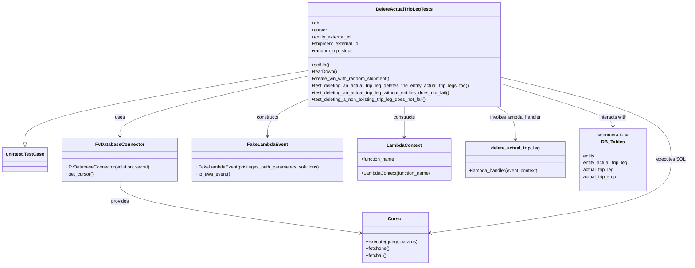
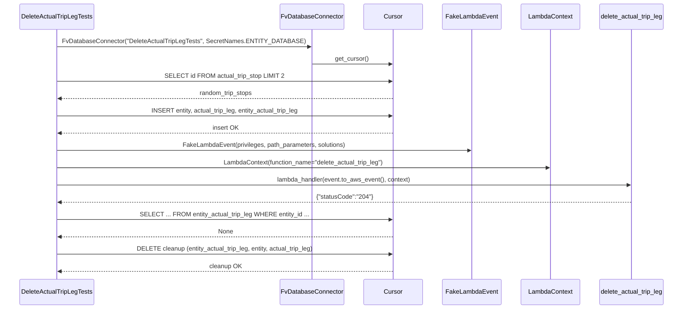

# Diagram: entity_core/entity_service/entity_service_tests/test_delete_actual_trip_leg.py

> Auto-generated by Obscura crawlers

## Diagram 1

### SVG

<svg id="container" width="2357.8984375" xmlns="http://www.w3.org/2000/svg" class="classDiagram" height="914" viewBox="0 0 2357.8984375 914" role="graphics-document document" aria-roledescription="class"><g><defs><marker id="container_class-aggregationStart" class="marker aggregation class" refX="18" refY="7" markerWidth="190" markerHeight="240" orient="auto"><path d="M 18,7 L9,13 L1,7 L9,1 Z"></path></marker></defs><defs><marker id="container_class-aggregationEnd" class="marker aggregation class" refX="1" refY="7" markerWidth="20" markerHeight="28" orient="auto"><path d="M 18,7 L9,13 L1,7 L9,1 Z"></path></marker></defs><defs><marker id="container_class-extensionStart" class="marker extension class" refX="18" refY="7" markerWidth="190" markerHeight="240" orient="auto"><path d="M 1,7 L18,13 V 1 Z"></path></marker></defs><defs><marker id="container_class-extensionEnd" class="marker extension class" refX="1" refY="7" markerWidth="20" markerHeight="28" orient="auto"><path d="M 1,1 V 13 L18,7 Z"></path></marker></defs><defs><marker id="container_class-compositionStart" class="marker composition class" refX="18" refY="7" markerWidth="190" markerHeight="240" orient="auto"><path d="M 18,7 L9,13 L1,7 L9,1 Z"></path></marker></defs><defs><marker id="container_class-compositionEnd" class="marker composition class" refX="1" refY="7" markerWidth="20" markerHeight="28" orient="auto"><path d="M 18,7 L9,13 L1,7 L9,1 Z"></path></marker></defs><defs><marker id="container_class-dependencyStart" class="marker dependency class" refX="6" refY="7" markerWidth="190" markerHeight="240" orient="auto"><path d="M 5,7 L9,13 L1,7 L9,1 Z"></path></marker></defs><defs><marker id="container_class-dependencyEnd" class="marker dependency class" refX="13" refY="7" markerWidth="20" markerHeight="28" orient="auto"><path d="M 18,7 L9,13 L14,7 L9,1 Z"></path></marker></defs><defs><marker id="container_class-lollipopStart" class="marker lollipop class" refX="13" refY="7" markerWidth="190" markerHeight="240" orient="auto"><circle stroke="black" fill="transparent" cx="7" cy="7" r="6"></circle></marker></defs><defs><marker id="container_class-lollipopEnd" class="marker lollipop class" refX="1" refY="7" markerWidth="190" markerHeight="240" orient="auto"><circle stroke="black" fill="transparent" cx="7" cy="7" r="6"></circle></marker></defs><g class="root"><g class="clusters"></g><g class="edgePaths"><path d="M1039.891,244.255L880.361,271.046C720.831,297.836,401.771,351.418,242.241,392.501C82.711,433.583,82.711,462.167,82.711,476.458L82.711,490.75" id="id_DeleteActualTripLegTests_unittest.TestCase_1" class="edge-thickness-normal edge-pattern-solid relation" style=";;;" data-edge="true" data-et="edge" data-id="id_DeleteActualTripLegTests_unittest.TestCase_1" data-points="W3sieCI6MTAzOS44OTA2MjUsInkiOjI0NC4yNTQ3NDAxMzg4MTgzNn0seyJ4Ijo4Mi43MTA5Mzc1LCJ5Ijo0MDV9LHsieCI6ODIuNzEwOTM3NSwieSI6NTA4fV0=" marker-end="url(#container_class-extensionEnd)"></path><path d="M1039.891,262.758L933.665,286.465C827.439,310.172,614.987,357.586,508.761,391.96C402.535,426.333,402.535,447.667,402.535,458.333L402.535,469" id="id_DeleteActualTripLegTests_FvDatabaseConnector_2" class="edge-thickness-normal edge-pattern-solid relation" style=";;;" data-edge="true" data-et="edge" data-id="id_DeleteActualTripLegTests_FvDatabaseConnector_2" data-points="W3sieCI6MTAzOS44OTA2MjUsInkiOjI2Mi43NTgzMjUwNjQxNzgwNX0seyJ4Ijo0MDIuNTM1MTU2MjUsInkiOjQwNX0seyJ4Ijo0MDIuNTM1MTU2MjUsInkiOjQ3NX1d" marker-end="url(#container_class-dependencyEnd)"></path><path d="M402.535,625L402.535,636.667C402.535,648.333,402.535,671.667,541.108,701.424C679.68,731.181,956.825,767.363,1095.398,785.454L1233.97,803.544" id="id_FvDatabaseConnector_Cursor_3" class="edge-thickness-normal edge-pattern-solid relation" style=";;;" data-edge="true" data-et="edge" data-id="id_FvDatabaseConnector_Cursor_3" data-points="W3sieCI6NDAyLjUzNTE1NjI1LCJ5Ijo2MjV9LHsieCI6NDAyLjUzNTE1NjI1LCJ5Ijo2OTV9LHsieCI6MTIzOS45MTk5MjE4NzUsInkiOjgwNC4zMjEyMDExMjkzMjMxfV0=" marker-end="url(#container_class-dependencyEnd)"></path><path d="M1709.844,266.388L1808.566,289.49C1907.289,312.592,2104.734,358.796,2203.457,406.065C2302.18,453.333,2302.18,501.667,2302.18,550C2302.18,598.333,2302.18,646.667,2163.607,688.924C2025.035,731.181,1747.89,767.363,1609.317,785.454L1470.744,803.544" id="id_DeleteActualTripLegTests_Cursor_4" class="edge-thickness-normal edge-pattern-solid relation" style=";;;" data-edge="true" data-et="edge" data-id="id_DeleteActualTripLegTests_Cursor_4" data-points="W3sieCI6MTcwOS44NDM3NSwieSI6MjY2LjM4NzcyMTU3NDQ0MjI1fSx7IngiOjIzMDIuMTc5Njg3NSwieSI6NDA1fSx7IngiOjIzMDIuMTc5Njg3NSwieSI6NTUwfSx7IngiOjIzMDIuMTc5Njg3NSwieSI6Njk1fSx7IngiOjE0NjQuNzk0OTIxODc1LCJ5Ijo4MDQuMzIxMjAxMTI5MzIzMX1d" marker-end="url(#container_class-dependencyEnd)"></path><path d="M1039.891,342.936L1017.527,353.28C995.163,363.624,950.435,384.312,928.071,405.323C905.707,426.333,905.707,447.667,905.707,458.333L905.707,469" id="id_DeleteActualTripLegTests_FakeLambdaEvent_5" class="edge-thickness-normal edge-pattern-solid relation" style=";;;" data-edge="true" data-et="edge" data-id="id_DeleteActualTripLegTests_FakeLambdaEvent_5" data-points="W3sieCI6MTAzOS44OTA2MjUsInkiOjM0Mi45MzYyNDc0NTAxNDc4fSx7IngiOjkwNS43MDcwMzEyNSwieSI6NDA1fSx7IngiOjkwNS43MDcwMzEyNSwieSI6NDc1fV0=" marker-end="url(#container_class-dependencyEnd)"></path><path d="M1374.867,368L1374.867,374.167C1374.867,380.333,1374.867,392.667,1374.867,410C1374.867,427.333,1374.867,449.667,1374.867,460.833L1374.867,472" id="id_DeleteActualTripLegTests_LambdaContext_6" class="edge-thickness-normal edge-pattern-solid relation" style=";;;" data-edge="true" data-et="edge" data-id="id_DeleteActualTripLegTests_LambdaContext_6" data-points="W3sieCI6MTM3NC44NjcxODc1LCJ5IjozNjh9LHsieCI6MTM3NC44NjcxODc1LCJ5Ijo0MDV9LHsieCI6MTM3NC44NjcxODc1LCJ5Ijo0Nzh9XQ==" marker-end="url(#container_class-dependencyEnd)"></path><path d="M1693.613,368L1704.533,374.167C1715.453,380.333,1737.293,392.667,1748.213,411.5C1759.133,430.333,1759.133,455.667,1759.133,468.333L1759.133,481" id="id_DeleteActualTripLegTests_delete_actual_trip_leg_7" class="edge-thickness-normal edge-pattern-solid relation" style=";;;" data-edge="true" data-et="edge" data-id="id_DeleteActualTripLegTests_delete_actual_trip_leg_7" data-points="W3sieCI6MTY5My42MTI4NjcyMjM1MDIyLCJ5IjozNjh9LHsieCI6MTc1OS4xMzI4MTI1LCJ5Ijo0MDV9LHsieCI6MTc1OS4xMzI4MTI1LCJ5Ijo0ODd9XQ==" marker-end="url(#container_class-dependencyEnd)"></path><path d="M1709.844,288.122L1775.016,307.602C1840.189,327.081,1970.534,366.041,2035.706,390.687C2100.879,415.333,2100.879,425.667,2100.879,430.833L2100.879,436" id="id_DeleteActualTripLegTests_DB_Tables_8" class="edge-thickness-normal edge-pattern-solid relation" style=";;;" data-edge="true" data-et="edge" data-id="id_DeleteActualTripLegTests_DB_Tables_8" data-points="W3sieCI6MTcwOS44NDM3NSwieSI6Mjg4LjEyMjIzMjQ0NTAyNTUzfSx7IngiOjIxMDAuODc4OTA2MjUsInkiOjQwNX0seyJ4IjoyMTAwLjg3ODkwNjI1LCJ5Ijo0NDJ9XQ==" marker-end="url(#container_class-dependencyEnd)"></path></g><g class="edgeLabels"><g class="edgeLabel"><g class="label" data-id="id_DeleteActualTripLegTests_unittest.TestCase_1" transform="translate(0, 0)"><foreignObject width="0" height="0">

</foreignObject></g></g><g class="edgeLabel" transform="translate(402.53515625, 405)"><g class="label" data-id="id_DeleteActualTripLegTests_FvDatabaseConnector_2" transform="translate(-16.4921875, -12)"><foreignObject width="32.984375" height="24">

uses

</foreignObject></g></g><g class="edgeLabel" transform="translate(402.53515625, 695)"><g class="label" data-id="id_FvDatabaseConnector_Cursor_3" transform="translate(-31.3125, -12)"><foreignObject width="62.625" height="24">

provides

</foreignObject></g></g><g class="edgeLabel" transform="translate(2302.1796875, 550)"><g class="label" data-id="id_DeleteActualTripLegTests_Cursor_4" transform="translate(-47.71875, -12)"><foreignObject width="95.4375" height="24">

executes SQL

</foreignObject></g></g><g class="edgeLabel" transform="translate(905.70703125, 405)"><g class="label" data-id="id_DeleteActualTripLegTests_FakeLambdaEvent_5" transform="translate(-37.84375, -12)"><foreignObject width="75.6875" height="24">

constructs

</foreignObject></g></g><g class="edgeLabel" transform="translate(1374.8671875, 405)"><g class="label" data-id="id_DeleteActualTripLegTests_LambdaContext_6" transform="translate(-37.84375, -12)"><foreignObject width="75.6875" height="24">

constructs

</foreignObject></g></g><g class="edgeLabel" transform="translate(1759.1328125, 405)"><g class="label" data-id="id_DeleteActualTripLegTests_delete_actual_trip_leg_7" transform="translate(-89.53125, -12)"><foreignObject width="179.0625" height="24">

invokes lambda_handler

</foreignObject></g></g><g class="edgeLabel" transform="translate(2100.87890625, 405)"><g class="label" data-id="id_DeleteActualTripLegTests_DB_Tables_8" transform="translate(-49.375, -12)"><foreignObject width="98.75" height="24">

interacts with

</foreignObject></g></g></g><g class="nodes"><g class="node default" id="classId-DeleteActualTripLegTests-0" transform="translate(1374.8671875, 188)"><g class="basic label-container"><path d="M-334.9765625 -180 L334.9765625 -180 L334.9765625 180 L-334.9765625 180" stroke="none" stroke-width="0" fill="#ECECFF" style=""></path><path d="M-334.9765625 -180 C-107.25957594983475 -180, 120.45741060033049 -180, 334.9765625 -180 M-334.9765625 -180 C-137.4404828857334 -180, 60.09559672853322 -180, 334.9765625 -180 M334.9765625 -180 C334.9765625 -73.88719631110445, 334.9765625 32.22560737779111, 334.9765625 180 M334.9765625 -180 C334.9765625 -57.88112498919705, 334.9765625 64.2377500216059, 334.9765625 180 M334.9765625 180 C104.34320499920244 180, -126.29015250159512 180, -334.9765625 180 M334.9765625 180 C67.18664433057552 180, -200.60327383884896 180, -334.9765625 180 M-334.9765625 180 C-334.9765625 68.99756818497518, -334.9765625 -42.00486363004964, -334.9765625 -180 M-334.9765625 180 C-334.9765625 71.2371794677755, -334.9765625 -37.52564106444899, -334.9765625 -180" stroke="#9370DB" stroke-width="1.3" fill="none" stroke-dasharray="0 0" style=""></path></g><g class="annotation-group text" transform="translate(0, -156)"></g><g class="label-group text" transform="translate(-92.796875, -156)"><g class="label" style="font-weight: bolder" transform="translate(0,-12)"><foreignObject width="185.59375" height="24">

DeleteActualTripLegTests

</foreignObject></g></g><g class="members-group text" transform="translate(-322.9765625, -108)"><g class="label" style="" transform="translate(0,-12)"><foreignObject width="27.0625" height="24">

+db

</foreignObject></g><g class="label" style="" transform="translate(0,12)"><foreignObject width="53.71875" height="24">

+cursor

</foreignObject></g><g class="label" style="" transform="translate(0,36)"><foreignObject width="139.234375" height="24">

+entity_external_id

</foreignObject></g><g class="label" style="" transform="translate(0,60)"><foreignObject width="166.21875" height="24">

+shipment_external_id

</foreignObject></g><g class="label" style="" transform="translate(0,84)"><foreignObject width="145.609375" height="24">

+random_trip_stops

</foreignObject></g></g><g class="methods-group text" transform="translate(-322.9765625, 36)"><g class="label" style="" transform="translate(0,-12)"><foreignObject width="60.421875" height="24">

+setUp()

</foreignObject></g><g class="label" style="" transform="translate(0,12)"><foreignObject width="87.75" height="24">

+tearDown()

</foreignObject></g><g class="label" style="" transform="translate(0,36)"><foreignObject width="273.046875" height="24">

+create_vin_with_random_shipment()

</foreignObject></g><g class="label" style="" transform="translate(0,60)"><foreignObject width="553.15625" height="24">

+test_deleting_an_actual_trip_leg_deletes_the_entity_actual_trip_legs_too()

</foreignObject></g><g class="label" style="" transform="translate(0,84)"><foreignObject width="488.34375" height="24">

+test_deleting_an_actual_trip_leg_without_entities_does_not_fail()

</foreignObject></g><g class="label" style="" transform="translate(0,108)"><foreignObject width="400.96875" height="24">

+test_deleting_a_non_existing_trip_leg_does_not_fail()

</foreignObject></g></g><g class="divider" style=""><path d="M-334.9765625 -132 C-142.44099851782218 -132, 50.09456546435564 -132, 334.9765625 -132 M-334.9765625 -132 C-67.64634414533106 -132, 199.6838742093379 -132, 334.9765625 -132" stroke="#9370DB" stroke-width="1.3" fill="none" stroke-dasharray="0 0" style=""></path></g><g class="divider" style=""><path d="M-334.9765625 12 C-101.07147158741122 12, 132.83361932517755 12, 334.9765625 12 M-334.9765625 12 C-131.28318878449224 12, 72.41018493101552 12, 334.9765625 12" stroke="#9370DB" stroke-width="1.3" fill="none" stroke-dasharray="0 0" style=""></path></g></g><g class="node default" id="classId-unittest.TestCase-1" transform="translate(82.7109375, 550)"><g class="basic label-container"><path d="M-74.7109375 -42 L74.7109375 -42 L74.7109375 42 L-74.7109375 42" stroke="none" stroke-width="0" fill="#ECECFF" style=""></path><path d="M-74.7109375 -42 C-20.830875092389782 -42, 33.049187315220436 -42, 74.7109375 -42 M-74.7109375 -42 C-28.374773530849986 -42, 17.96139043830003 -42, 74.7109375 -42 M74.7109375 -42 C74.7109375 -13.787157184395983, 74.7109375 14.425685631208033, 74.7109375 42 M74.7109375 -42 C74.7109375 -14.984118219063859, 74.7109375 12.031763561872282, 74.7109375 42 M74.7109375 42 C30.160784386634433 42, -14.389368726731135 42, -74.7109375 42 M74.7109375 42 C22.821346159679635 42, -29.06824518064073 42, -74.7109375 42 M-74.7109375 42 C-74.7109375 8.400324912219048, -74.7109375 -25.199350175561904, -74.7109375 -42 M-74.7109375 42 C-74.7109375 10.62792213672304, -74.7109375 -20.74415572655392, -74.7109375 -42" stroke="#9370DB" stroke-width="1.3" fill="none" stroke-dasharray="0 0" style=""></path></g><g class="annotation-group text" transform="translate(0, -18)"></g><g class="label-group text" transform="translate(-62.7109375, -18)"><g class="label" style="font-weight: bolder" transform="translate(0,-12)"><foreignObject width="125.421875" height="24">

unittest.TestCase

</foreignObject></g></g><g class="members-group text" transform="translate(-62.7109375, 30)"></g><g class="methods-group text" transform="translate(-62.7109375, 60)"></g><g class="divider" style=""><path d="M-74.7109375 6 C-29.73402163475201 6, 15.242894230495978 6, 74.7109375 6 M-74.7109375 6 C-19.307156944281942 6, 36.096623611436115 6, 74.7109375 6" stroke="#9370DB" stroke-width="1.3" fill="none" stroke-dasharray="0 0" style=""></path></g><g class="divider" style=""><path d="M-74.7109375 24 C-31.32836785766269 24, 12.054201784674618 24, 74.7109375 24 M-74.7109375 24 C-40.87283699606164 24, -7.034736492123287 24, 74.7109375 24" stroke="#9370DB" stroke-width="1.3" fill="none" stroke-dasharray="0 0" style=""></path></g></g><g class="node default" id="classId-FvDatabaseConnector-2" transform="translate(402.53515625, 550)"><g class="basic label-container"><path d="M-195.11328125 -75 L195.11328125 -75 L195.11328125 75 L-195.11328125 75" stroke="none" stroke-width="0" fill="#ECECFF" style=""></path><path d="M-195.11328125 -75 C-44.90947415039318 -75, 105.29433294921364 -75, 195.11328125 -75 M-195.11328125 -75 C-97.02809506091104 -75, 1.057091128177916 -75, 195.11328125 -75 M195.11328125 -75 C195.11328125 -36.52737771770138, 195.11328125 1.945244564597246, 195.11328125 75 M195.11328125 -75 C195.11328125 -15.049473757123664, 195.11328125 44.90105248575267, 195.11328125 75 M195.11328125 75 C63.86010695253523 75, -67.39306734492953 75, -195.11328125 75 M195.11328125 75 C41.821086815700454 75, -111.47110761859909 75, -195.11328125 75 M-195.11328125 75 C-195.11328125 21.684646794232954, -195.11328125 -31.630706411534092, -195.11328125 -75 M-195.11328125 75 C-195.11328125 29.184799128882297, -195.11328125 -16.630401742235406, -195.11328125 -75" stroke="#9370DB" stroke-width="1.3" fill="none" stroke-dasharray="0 0" style=""></path></g><g class="annotation-group text" transform="translate(0, -51)"></g><g class="label-group text" transform="translate(-79.3046875, -51)"><g class="label" style="font-weight: bolder" transform="translate(0,-12)"><foreignObject width="158.609375" height="24">

FvDatabaseConnector

</foreignObject></g></g><g class="members-group text" transform="translate(-183.11328125, -3)"></g><g class="methods-group text" transform="translate(-183.11328125, 27)"><g class="label" style="" transform="translate(0,-12)"><foreignObject width="286.921875" height="24">

+FvDatabaseConnector(solution, secret)

</foreignObject></g><g class="label" style="" transform="translate(0,12)"><foreignObject width="94.640625" height="24">

+get_cursor()

</foreignObject></g></g><g class="divider" style=""><path d="M-195.11328125 -27 C-111.07249749921432 -27, -27.031713748428643 -27, 195.11328125 -27 M-195.11328125 -27 C-108.91597983115376 -27, -22.718678412307526 -27, 195.11328125 -27" stroke="#9370DB" stroke-width="1.3" fill="none" stroke-dasharray="0 0" style=""></path></g><g class="divider" style=""><path d="M-195.11328125 -3 C-64.7342581437889 -3, 65.64476496242219 -3, 195.11328125 -3 M-195.11328125 -3 C-62.9274801038012 -3, 69.2583210423976 -3, 195.11328125 -3" stroke="#9370DB" stroke-width="1.3" fill="none" stroke-dasharray="0 0" style=""></path></g></g><g class="node default" id="classId-Cursor-3" transform="translate(1352.357421875, 819)"><g class="basic label-container"><path d="M-112.4375 -87 L112.4375 -87 L112.4375 87 L-112.4375 87" stroke="none" stroke-width="0" fill="#ECECFF" style=""></path><path d="M-112.4375 -87 C-40.896711690894776 -87, 30.64407661821045 -87, 112.4375 -87 M-112.4375 -87 C-48.44665974327849 -87, 15.544180513443024 -87, 112.4375 -87 M112.4375 -87 C112.4375 -40.26891898382018, 112.4375 6.462162032359643, 112.4375 87 M112.4375 -87 C112.4375 -44.379797729447965, 112.4375 -1.7595954588959302, 112.4375 87 M112.4375 87 C55.95888526001548 87, -0.519729479969044 87, -112.4375 87 M112.4375 87 C39.762332945241084 87, -32.91283410951783 87, -112.4375 87 M-112.4375 87 C-112.4375 30.826399104762338, -112.4375 -25.347201790475324, -112.4375 -87 M-112.4375 87 C-112.4375 27.149148179635368, -112.4375 -32.701703640729264, -112.4375 -87" stroke="#9370DB" stroke-width="1.3" fill="none" stroke-dasharray="0 0" style=""></path></g><g class="annotation-group text" transform="translate(0, -63)"></g><g class="label-group text" transform="translate(-23.90625, -63)"><g class="label" style="font-weight: bolder" transform="translate(0,-12)"><foreignObject width="47.8125" height="24">

Cursor

</foreignObject></g></g><g class="members-group text" transform="translate(-100.4375, -15)"></g><g class="methods-group text" transform="translate(-100.4375, 15)"><g class="label" style="" transform="translate(0,-12)"><foreignObject width="176.96875" height="24">

+execute(query, params)

</foreignObject></g><g class="label" style="" transform="translate(0,12)"><foreignObject width="82.046875" height="24">

+fetchone()

</foreignObject></g><g class="label" style="" transform="translate(0,36)"><foreignObject width="72.515625" height="24">

+fetchall()

</foreignObject></g></g><g class="divider" style=""><path d="M-112.4375 -39 C-25.078229867418486 -39, 62.28104026516303 -39, 112.4375 -39 M-112.4375 -39 C-50.62021117142771 -39, 11.197077657144575 -39, 112.4375 -39" stroke="#9370DB" stroke-width="1.3" fill="none" stroke-dasharray="0 0" style=""></path></g><g class="divider" style=""><path d="M-112.4375 -15 C-47.13115258786581 -15, 18.175194824268374 -15, 112.4375 -15 M-112.4375 -15 C-57.63421898918058 -15, -2.8309379783611632 -15, 112.4375 -15" stroke="#9370DB" stroke-width="1.3" fill="none" stroke-dasharray="0 0" style=""></path></g></g><g class="node default" id="classId-FakeLambdaEvent-4" transform="translate(905.70703125, 550)"><g class="basic label-container"><path d="M-258.05859375 -75 L258.05859375 -75 L258.05859375 75 L-258.05859375 75" stroke="none" stroke-width="0" fill="#ECECFF" style=""></path><path d="M-258.05859375 -75 C-75.203860849445 -75, 107.65087205111001 -75, 258.05859375 -75 M-258.05859375 -75 C-67.33734423946984 -75, 123.38390527106031 -75, 258.05859375 -75 M258.05859375 -75 C258.05859375 -39.344352658599135, 258.05859375 -3.68870531719827, 258.05859375 75 M258.05859375 -75 C258.05859375 -29.74238995434316, 258.05859375 15.51522009131368, 258.05859375 75 M258.05859375 75 C71.56665251109999 75, -114.92528872780002 75, -258.05859375 75 M258.05859375 75 C108.55814961446455 75, -40.94229452107089 75, -258.05859375 75 M-258.05859375 75 C-258.05859375 18.13486383436868, -258.05859375 -38.73027233126264, -258.05859375 -75 M-258.05859375 75 C-258.05859375 44.30253462064654, -258.05859375 13.60506924129308, -258.05859375 -75" stroke="#9370DB" stroke-width="1.3" fill="none" stroke-dasharray="0 0" style=""></path></g><g class="annotation-group text" transform="translate(0, -51)"></g><g class="label-group text" transform="translate(-65.8671875, -51)"><g class="label" style="font-weight: bolder" transform="translate(0,-12)"><foreignObject width="131.734375" height="24">

FakeLambdaEvent

</foreignObject></g></g><g class="members-group text" transform="translate(-246.05859375, -3)"></g><g class="methods-group text" transform="translate(-246.05859375, 27)"><g class="label" style="" transform="translate(0,-12)"><foreignObject width="426.25" height="24">

+FakeLambdaEvent(privileges, path_parameters, solutions)

</foreignObject></g><g class="label" style="" transform="translate(0,12)"><foreignObject width="116.421875" height="24">

+to_aws_event()

</foreignObject></g></g><g class="divider" style=""><path d="M-258.05859375 -27 C-106.02083345694678 -27, 46.01692683610645 -27, 258.05859375 -27 M-258.05859375 -27 C-92.47588675070489 -27, 73.10682024859022 -27, 258.05859375 -27" stroke="#9370DB" stroke-width="1.3" fill="none" stroke-dasharray="0 0" style=""></path></g><g class="divider" style=""><path d="M-258.05859375 -3 C-136.57217338604625 -3, -15.085753022092518 -3, 258.05859375 -3 M-258.05859375 -3 C-112.39937288770784 -3, 33.25984797458432 -3, 258.05859375 -3" stroke="#9370DB" stroke-width="1.3" fill="none" stroke-dasharray="0 0" style=""></path></g></g><g class="node default" id="classId-LambdaContext-5" transform="translate(1374.8671875, 550)"><g class="basic label-container"><path d="M-161.1015625 -72 L161.1015625 -72 L161.1015625 72 L-161.1015625 72" stroke="none" stroke-width="0" fill="#ECECFF" style=""></path><path d="M-161.1015625 -72 C-94.46538242975133 -72, -27.82920235950266 -72, 161.1015625 -72 M-161.1015625 -72 C-38.87864434298595 -72, 83.3442738140281 -72, 161.1015625 -72 M161.1015625 -72 C161.1015625 -37.47610189277899, 161.1015625 -2.952203785557984, 161.1015625 72 M161.1015625 -72 C161.1015625 -30.818027268594513, 161.1015625 10.363945462810975, 161.1015625 72 M161.1015625 72 C77.53635050078837 72, -6.028861498423254 72, -161.1015625 72 M161.1015625 72 C61.826325170376805 72, -37.44891215924639 72, -161.1015625 72 M-161.1015625 72 C-161.1015625 30.078438841268387, -161.1015625 -11.843122317463227, -161.1015625 -72 M-161.1015625 72 C-161.1015625 38.534042239950296, -161.1015625 5.068084479900591, -161.1015625 -72" stroke="#9370DB" stroke-width="1.3" fill="none" stroke-dasharray="0 0" style=""></path></g><g class="annotation-group text" transform="translate(0, -48)"></g><g class="label-group text" transform="translate(-57.296875, -48)"><g class="label" style="font-weight: bolder" transform="translate(0,-12)"><foreignObject width="114.59375" height="24">

LambdaContext

</foreignObject></g></g><g class="members-group text" transform="translate(-149.1015625, 0)"><g class="label" style="" transform="translate(0,-12)"><foreignObject width="117.28125" height="24">

+function_name

</foreignObject></g></g><g class="methods-group text" transform="translate(-149.1015625, 48)"><g class="label" style="" transform="translate(0,-12)"><foreignObject width="240.90625" height="24">

+LambdaContext(function_name)

</foreignObject></g></g><g class="divider" style=""><path d="M-161.1015625 -24 C-76.35891386358111 -24, 8.383734772837784 -24, 161.1015625 -24 M-161.1015625 -24 C-88.85186521546527 -24, -16.602167930930534 -24, 161.1015625 -24" stroke="#9370DB" stroke-width="1.3" fill="none" stroke-dasharray="0 0" style=""></path></g><g class="divider" style=""><path d="M-161.1015625 24 C-91.15053924280099 24, -21.199515985601977 24, 161.1015625 24 M-161.1015625 24 C-67.69941511791441 24, 25.702732264171175 24, 161.1015625 24" stroke="#9370DB" stroke-width="1.3" fill="none" stroke-dasharray="0 0" style=""></path></g></g><g class="node default" id="classId-delete_actual_trip_leg-6" transform="translate(1759.1328125, 550)"><g class="basic label-container"><path d="M-173.1640625 -63 L173.1640625 -63 L173.1640625 63 L-173.1640625 63" stroke="none" stroke-width="0" fill="#ECECFF" style=""></path><path d="M-173.1640625 -63 C-79.46852048370691 -63, 14.227021532586178 -63, 173.1640625 -63 M-173.1640625 -63 C-72.13297537193964 -63, 28.898111756120727 -63, 173.1640625 -63 M173.1640625 -63 C173.1640625 -35.05738420660971, 173.1640625 -7.114768413219423, 173.1640625 63 M173.1640625 -63 C173.1640625 -23.000015680330122, 173.1640625 16.999968639339755, 173.1640625 63 M173.1640625 63 C70.97604365273179 63, -31.21197519453642 63, -173.1640625 63 M173.1640625 63 C72.04916232261508 63, -29.06573785476985 63, -173.1640625 63 M-173.1640625 63 C-173.1640625 30.965064903334138, -173.1640625 -1.0698701933317238, -173.1640625 -63 M-173.1640625 63 C-173.1640625 13.320631738627682, -173.1640625 -36.358736522744636, -173.1640625 -63" stroke="#9370DB" stroke-width="1.3" fill="none" stroke-dasharray="0 0" style=""></path></g><g class="annotation-group text" transform="translate(0, -39)"></g><g class="label-group text" transform="translate(-82.140625, -39)"><g class="label" style="font-weight: bolder" transform="translate(0,-12)"><foreignObject width="164.28125" height="24">

delete_actual_trip_leg

</foreignObject></g></g><g class="members-group text" transform="translate(-161.1640625, 9)"></g><g class="methods-group text" transform="translate(-161.1640625, 39)"><g class="label" style="" transform="translate(0,-12)"><foreignObject width="240.1875" height="24">

+lambda_handler(event, context)

</foreignObject></g></g><g class="divider" style=""><path d="M-173.1640625 -15 C-67.33576819218811 -15, 38.492526115623775 -15, 173.1640625 -15 M-173.1640625 -15 C-58.85091877601246 -15, 55.46222494797507 -15, 173.1640625 -15" stroke="#9370DB" stroke-width="1.3" fill="none" stroke-dasharray="0 0" style=""></path></g><g class="divider" style=""><path d="M-173.1640625 9 C-90.74298893370407 9, -8.321915367408138 9, 173.1640625 9 M-173.1640625 9 C-55.848671160150445 9, 61.46672017969911 9, 173.1640625 9" stroke="#9370DB" stroke-width="1.3" fill="none" stroke-dasharray="0 0" style=""></path></g></g><g class="node default" id="classId-DB_Tables-7" transform="translate(2100.87890625, 550)"><g class="basic label-container"><path d="M-118.58203125 -108 L118.58203125 -108 L118.58203125 108 L-118.58203125 108" stroke="none" stroke-width="0" fill="#ECECFF" style=""></path><path d="M-118.58203125 -108 C-51.51293235546261 -108, 15.55616653907478 -108, 118.58203125 -108 M-118.58203125 -108 C-37.45051751977036 -108, 43.680996210459284 -108, 118.58203125 -108 M118.58203125 -108 C118.58203125 -49.71163003381742, 118.58203125 8.576739932365157, 118.58203125 108 M118.58203125 -108 C118.58203125 -45.35332010033195, 118.58203125 17.293359799336102, 118.58203125 108 M118.58203125 108 C57.24709812221999 108, -4.087835005560024 108, -118.58203125 108 M118.58203125 108 C35.66998499184879 108, -47.242061266302414 108, -118.58203125 108 M-118.58203125 108 C-118.58203125 57.102887822692075, -118.58203125 6.205775645384151, -118.58203125 -108 M-118.58203125 108 C-118.58203125 50.76160590295208, -118.58203125 -6.476788194095846, -118.58203125 -108" stroke="#9370DB" stroke-width="1.3" fill="none" stroke-dasharray="0 0" style=""></path></g><g class="annotation-group text" transform="translate(-55.5546875, -84)"><g class="label" style="" transform="translate(0,-12)"><foreignObject width="111.109375" height="24">

«enumeration»

</foreignObject></g></g><g class="label-group text" transform="translate(-37.4453125, -60)"><g class="label" style="font-weight: bolder" transform="translate(0,-12)"><foreignObject width="74.890625" height="24">

DB_Tables

</foreignObject></g></g><g class="members-group text" transform="translate(-106.58203125, -12)"><g class="label" style="" transform="translate(0,-12)"><foreignObject width="41.953125" height="24">

entity

</foreignObject></g><g class="label" style="" transform="translate(0,12)"><foreignObject width="157.609375" height="24">

entity_actual_trip_leg

</foreignObject></g><g class="label" style="" transform="translate(0,36)"><foreignObject width="108.140625" height="24">

actual_trip_leg

</foreignObject></g><g class="label" style="" transform="translate(0,60)"><foreignObject width="118.5" height="24">

actual_trip_stop

</foreignObject></g></g><g class="methods-group text" transform="translate(-106.58203125, 108)"></g><g class="divider" style=""><path d="M-118.58203125 -36 C-71.0408846534224 -36, -23.49973805684479 -36, 118.58203125 -36 M-118.58203125 -36 C-56.11302142395982 -36, 6.3559884020803565 -36, 118.58203125 -36" stroke="#9370DB" stroke-width="1.3" fill="none" stroke-dasharray="0 0" style=""></path></g><g class="divider" style=""><path d="M-118.58203125 84 C-64.71576363478246 84, -10.849496019564924 84, 118.58203125 84 M-118.58203125 84 C-40.50047394936574 84, 37.58108335126852 84, 118.58203125 84" stroke="#9370DB" stroke-width="1.3" fill="none" stroke-dasharray="0 0" style=""></path></g></g></g></g></g></svg>

## Diagram 2

### SVG

<svg id="container" width="1786" xmlns="http://www.w3.org/2000/svg" height="843" viewBox="-50 -10 1786 843" role="graphics-document document" aria-roledescription="sequence"><g><rect x="1504" y="757" fill="#eaeaea" stroke="#666" width="182" height="65" name="Handler" rx="3" ry="3" class="actor actor-bottom"></rect><text x="1595" y="789.5" dominant-baseline="central" alignment-baseline="central" class="actor actor-box" style="text-anchor: middle; font-size: 16px; font-weight: 400;"><tspan x="1595" dy="0">delete_actual_trip_leg</tspan></text></g><g><rect x="1304" y="757" fill="#eaeaea" stroke="#666" width="150" height="65" name="Context" rx="3" ry="3" class="actor actor-bottom"></rect><text x="1379" y="789.5" dominant-baseline="central" alignment-baseline="central" class="actor actor-box" style="text-anchor: middle; font-size: 16px; font-weight: 400;"><tspan x="1379" dy="0">LambdaContext</tspan></text></g><g><rect x="1103" y="757" fill="#eaeaea" stroke="#666" width="151" height="65" name="Event" rx="3" ry="3" class="actor actor-bottom"></rect><text x="1178.5" y="789.5" dominant-baseline="central" alignment-baseline="central" class="actor actor-box" style="text-anchor: middle; font-size: 16px; font-weight: 400;"><tspan x="1178.5" dy="0">FakeLambdaEvent</tspan></text></g><g><rect x="903" y="757" fill="#eaeaea" stroke="#666" width="150" height="65" name="Cursor" rx="3" ry="3" class="actor actor-bottom"></rect><text x="978" y="789.5" dominant-baseline="central" alignment-baseline="central" class="actor actor-box" style="text-anchor: middle; font-size: 16px; font-weight: 400;"><tspan x="978" dy="0">Cursor</tspan></text></g><g><rect x="676" y="757" fill="#eaeaea" stroke="#666" width="177" height="65" name="DB" rx="3" ry="3" class="actor actor-bottom"></rect><text x="764.5" y="789.5" dominant-baseline="central" alignment-baseline="central" class="actor actor-box" style="text-anchor: middle; font-size: 16px; font-weight: 400;"><tspan x="764.5" dy="0">FvDatabaseConnector</tspan></text></g><g><rect x="0" y="757" fill="#eaeaea" stroke="#666" width="201" height="65" name="Test" rx="3" ry="3" class="actor actor-bottom"></rect><text x="100.5" y="789.5" dominant-baseline="central" alignment-baseline="central" class="actor actor-box" style="text-anchor: middle; font-size: 16px; font-weight: 400;"><tspan x="100.5" dy="0">DeleteActualTripLegTests</tspan></text></g><g><line id="actor5" x1="1595" y1="65" x2="1595" y2="757" class="actor-line 200" stroke-width="0.5px" stroke="#999" name="Handler"></line><g id="root-5"><rect x="1504" y="0" fill="#eaeaea" stroke="#666" width="182" height="65" name="Handler" rx="3" ry="3" class="actor actor-top"></rect><text x="1595" y="32.5" dominant-baseline="central" alignment-baseline="central" class="actor actor-box" style="text-anchor: middle; font-size: 16px; font-weight: 400;"><tspan x="1595" dy="0">delete_actual_trip_leg</tspan></text></g></g><g><line id="actor4" x1="1379" y1="65" x2="1379" y2="757" class="actor-line 200" stroke-width="0.5px" stroke="#999" name="Context"></line><g id="root-4"><rect x="1304" y="0" fill="#eaeaea" stroke="#666" width="150" height="65" name="Context" rx="3" ry="3" class="actor actor-top"></rect><text x="1379" y="32.5" dominant-baseline="central" alignment-baseline="central" class="actor actor-box" style="text-anchor: middle; font-size: 16px; font-weight: 400;"><tspan x="1379" dy="0">LambdaContext</tspan></text></g></g><g><line id="actor3" x1="1178.5" y1="65" x2="1178.5" y2="757" class="actor-line 200" stroke-width="0.5px" stroke="#999" name="Event"></line><g id="root-3"><rect x="1103" y="0" fill="#eaeaea" stroke="#666" width="151" height="65" name="Event" rx="3" ry="3" class="actor actor-top"></rect><text x="1178.5" y="32.5" dominant-baseline="central" alignment-baseline="central" class="actor actor-box" style="text-anchor: middle; font-size: 16px; font-weight: 400;"><tspan x="1178.5" dy="0">FakeLambdaEvent</tspan></text></g></g><g><line id="actor2" x1="978" y1="65" x2="978" y2="757" class="actor-line 200" stroke-width="0.5px" stroke="#999" name="Cursor"></line><g id="root-2"><rect x="903" y="0" fill="#eaeaea" stroke="#666" width="150" height="65" name="Cursor" rx="3" ry="3" class="actor actor-top"></rect><text x="978" y="32.5" dominant-baseline="central" alignment-baseline="central" class="actor actor-box" style="text-anchor: middle; font-size: 16px; font-weight: 400;"><tspan x="978" dy="0">Cursor</tspan></text></g></g><g><line id="actor1" x1="764.5" y1="65" x2="764.5" y2="757" class="actor-line 200" stroke-width="0.5px" stroke="#999" name="DB"></line><g id="root-1"><rect x="676" y="0" fill="#eaeaea" stroke="#666" width="177" height="65" name="DB" rx="3" ry="3" class="actor actor-top"></rect><text x="764.5" y="32.5" dominant-baseline="central" alignment-baseline="central" class="actor actor-box" style="text-anchor: middle; font-size: 16px; font-weight: 400;"><tspan x="764.5" dy="0">FvDatabaseConnector</tspan></text></g></g><g><line id="actor0" x1="100.5" y1="65" x2="100.5" y2="757" class="actor-line 200" stroke-width="0.5px" stroke="#999" name="Test"></line><g id="root-0"><rect x="0" y="0" fill="#eaeaea" stroke="#666" width="201" height="65" name="Test" rx="3" ry="3" class="actor actor-top"></rect><text x="100.5" y="32.5" dominant-baseline="central" alignment-baseline="central" class="actor actor-box" style="text-anchor: middle; font-size: 16px; font-weight: 400;"><tspan x="100.5" dy="0">DeleteActualTripLegTests</tspan></text></g></g><g></g><defs><symbol id="computer" width="24" height="24"><path transform="scale(.5)" d="M2 2v13h20v-13h-20zm18 11h-16v-9h16v9zm-10.228 6l.466-1h3.524l.467 1h-4.457zm14.228 3h-24l2-6h2.104l-1.33 4h18.45l-1.297-4h2.073l2 6zm-5-10h-14v-7h14v7z"></path></symbol></defs><defs><symbol id="database" fill-rule="evenodd" clip-rule="evenodd"><path transform="scale(.5)" d="M12.258.001l.256.004.255.005.253.008.251.01.249.012.247.015.246.016.242.019.241.02.239.023.236.024.233.027.231.028.229.031.225.032.223.034.22.036.217.038.214.04.211.041.208.043.205.045.201.046.198.048.194.05.191.051.187.053.183.054.18.056.175.057.172.059.168.06.163.061.16.063.155.064.15.066.074.033.073.033.071.034.07.034.069.035.068.035.067.035.066.035.064.036.064.036.062.036.06.036.06.037.058.037.058.037.055.038.055.038.053.038.052.038.051.039.05.039.048.039.047.039.045.04.044.04.043.04.041.04.04.041.039.041.037.041.036.041.034.041.033.042.032.042.03.042.029.042.027.042.026.043.024.043.023.043.021.043.02.043.018.044.017.043.015.044.013.044.012.044.011.045.009.044.007.045.006.045.004.045.002.045.001.045v17l-.001.045-.002.045-.004.045-.006.045-.007.045-.009.044-.011.045-.012.044-.013.044-.015.044-.017.043-.018.044-.02.043-.021.043-.023.043-.024.043-.026.043-.027.042-.029.042-.03.042-.032.042-.033.042-.034.041-.036.041-.037.041-.039.041-.04.041-.041.04-.043.04-.044.04-.045.04-.047.039-.048.039-.05.039-.051.039-.052.038-.053.038-.055.038-.055.038-.058.037-.058.037-.06.037-.06.036-.062.036-.064.036-.064.036-.066.035-.067.035-.068.035-.069.035-.07.034-.071.034-.073.033-.074.033-.15.066-.155.064-.16.063-.163.061-.168.06-.172.059-.175.057-.18.056-.183.054-.187.053-.191.051-.194.05-.198.048-.201.046-.205.045-.208.043-.211.041-.214.04-.217.038-.22.036-.223.034-.225.032-.229.031-.231.028-.233.027-.236.024-.239.023-.241.02-.242.019-.246.016-.247.015-.249.012-.251.01-.253.008-.255.005-.256.004-.258.001-.258-.001-.256-.004-.255-.005-.253-.008-.251-.01-.249-.012-.247-.015-.245-.016-.243-.019-.241-.02-.238-.023-.236-.024-.234-.027-.231-.028-.228-.031-.226-.032-.223-.034-.22-.036-.217-.038-.214-.04-.211-.041-.208-.043-.204-.045-.201-.046-.198-.048-.195-.05-.19-.051-.187-.053-.184-.054-.179-.056-.176-.057-.172-.059-.167-.06-.164-.061-.159-.063-.155-.064-.151-.066-.074-.033-.072-.033-.072-.034-.07-.034-.069-.035-.068-.035-.067-.035-.066-.035-.064-.036-.063-.036-.062-.036-.061-.036-.06-.037-.058-.037-.057-.037-.056-.038-.055-.038-.053-.038-.052-.038-.051-.039-.049-.039-.049-.039-.046-.039-.046-.04-.044-.04-.043-.04-.041-.04-.04-.041-.039-.041-.037-.041-.036-.041-.034-.041-.033-.042-.032-.042-.03-.042-.029-.042-.027-.042-.026-.043-.024-.043-.023-.043-.021-.043-.02-.043-.018-.044-.017-.043-.015-.044-.013-.044-.012-.044-.011-.045-.009-.044-.007-.045-.006-.045-.004-.045-.002-.045-.001-.045v-17l.001-.045.002-.045.004-.045.006-.045.007-.045.009-.044.011-.045.012-.044.013-.044.015-.044.017-.043.018-.044.02-.043.021-.043.023-.043.024-.043.026-.043.027-.042.029-.042.03-.042.032-.042.033-.042.034-.041.036-.041.037-.041.039-.041.04-.041.041-.04.043-.04.044-.04.046-.04.046-.039.049-.039.049-.039.051-.039.052-.038.053-.038.055-.038.056-.038.057-.037.058-.037.06-.037.061-.036.062-.036.063-.036.064-.036.066-.035.067-.035.068-.035.069-.035.07-.034.072-.034.072-.033.074-.033.151-.066.155-.064.159-.063.164-.061.167-.06.172-.059.176-.057.179-.056.184-.054.187-.053.19-.051.195-.05.198-.048.201-.046.204-.045.208-.043.211-.041.214-.04.217-.038.22-.036.223-.034.226-.032.228-.031.231-.028.234-.027.236-.024.238-.023.241-.02.243-.019.245-.016.247-.015.249-.012.251-.01.253-.008.255-.005.256-.004.258-.001.258.001zm-9.258 20.499v.01l.001.021.003.021.004.022.005.021.006.022.007.022.009.023.01.022.011.023.012.023.013.023.015.023.016.024.017.023.018.024.019.024.021.024.022.025.023.024.024.025.052.049.056.05.061.051.066.051.07.051.075.051.079.052.084.052.088.052.092.052.097.052.102.051.105.052.11.052.114.051.119.051.123.051.127.05.131.05.135.05.139.048.144.049.147.047.152.047.155.047.16.045.163.045.167.043.171.043.176.041.178.041.183.039.187.039.19.037.194.035.197.035.202.033.204.031.209.03.212.029.216.027.219.025.222.024.226.021.23.02.233.018.236.016.24.015.243.012.246.01.249.008.253.005.256.004.259.001.26-.001.257-.004.254-.005.25-.008.247-.011.244-.012.241-.014.237-.016.233-.018.231-.021.226-.021.224-.024.22-.026.216-.027.212-.028.21-.031.205-.031.202-.034.198-.034.194-.036.191-.037.187-.039.183-.04.179-.04.175-.042.172-.043.168-.044.163-.045.16-.046.155-.046.152-.047.148-.048.143-.049.139-.049.136-.05.131-.05.126-.05.123-.051.118-.052.114-.051.11-.052.106-.052.101-.052.096-.052.092-.052.088-.053.083-.051.079-.052.074-.052.07-.051.065-.051.06-.051.056-.05.051-.05.023-.024.023-.025.021-.024.02-.024.019-.024.018-.024.017-.024.015-.023.014-.024.013-.023.012-.023.01-.023.01-.022.008-.022.006-.022.006-.022.004-.022.004-.021.001-.021.001-.021v-4.127l-.077.055-.08.053-.083.054-.085.053-.087.052-.09.052-.093.051-.095.05-.097.05-.1.049-.102.049-.105.048-.106.047-.109.047-.111.046-.114.045-.115.045-.118.044-.12.043-.122.042-.124.042-.126.041-.128.04-.13.04-.132.038-.134.038-.135.037-.138.037-.139.035-.142.035-.143.034-.144.033-.147.032-.148.031-.15.03-.151.03-.153.029-.154.027-.156.027-.158.026-.159.025-.161.024-.162.023-.163.022-.165.021-.166.02-.167.019-.169.018-.169.017-.171.016-.173.015-.173.014-.175.013-.175.012-.177.011-.178.01-.179.008-.179.008-.181.006-.182.005-.182.004-.184.003-.184.002h-.37l-.184-.002-.184-.003-.182-.004-.182-.005-.181-.006-.179-.008-.179-.008-.178-.01-.176-.011-.176-.012-.175-.013-.173-.014-.172-.015-.171-.016-.17-.017-.169-.018-.167-.019-.166-.02-.165-.021-.163-.022-.162-.023-.161-.024-.159-.025-.157-.026-.156-.027-.155-.027-.153-.029-.151-.03-.15-.03-.148-.031-.146-.032-.145-.033-.143-.034-.141-.035-.14-.035-.137-.037-.136-.037-.134-.038-.132-.038-.13-.04-.128-.04-.126-.041-.124-.042-.122-.042-.12-.044-.117-.043-.116-.045-.113-.045-.112-.046-.109-.047-.106-.047-.105-.048-.102-.049-.1-.049-.097-.05-.095-.05-.093-.052-.09-.051-.087-.052-.085-.053-.083-.054-.08-.054-.077-.054v4.127zm0-5.654v.011l.001.021.003.021.004.021.005.022.006.022.007.022.009.022.01.022.011.023.012.023.013.023.015.024.016.023.017.024.018.024.019.024.021.024.022.024.023.025.024.024.052.05.056.05.061.05.066.051.07.051.075.052.079.051.084.052.088.052.092.052.097.052.102.052.105.052.11.051.114.051.119.052.123.05.127.051.131.05.135.049.139.049.144.048.147.048.152.047.155.046.16.045.163.045.167.044.171.042.176.042.178.04.183.04.187.038.19.037.194.036.197.034.202.033.204.032.209.03.212.028.216.027.219.025.222.024.226.022.23.02.233.018.236.016.24.014.243.012.246.01.249.008.253.006.256.003.259.001.26-.001.257-.003.254-.006.25-.008.247-.01.244-.012.241-.015.237-.016.233-.018.231-.02.226-.022.224-.024.22-.025.216-.027.212-.029.21-.03.205-.032.202-.033.198-.035.194-.036.191-.037.187-.039.183-.039.179-.041.175-.042.172-.043.168-.044.163-.045.16-.045.155-.047.152-.047.148-.048.143-.048.139-.05.136-.049.131-.05.126-.051.123-.051.118-.051.114-.052.11-.052.106-.052.101-.052.096-.052.092-.052.088-.052.083-.052.079-.052.074-.051.07-.052.065-.051.06-.05.056-.051.051-.049.023-.025.023-.024.021-.025.02-.024.019-.024.018-.024.017-.024.015-.023.014-.023.013-.024.012-.022.01-.023.01-.023.008-.022.006-.022.006-.022.004-.021.004-.022.001-.021.001-.021v-4.139l-.077.054-.08.054-.083.054-.085.052-.087.053-.09.051-.093.051-.095.051-.097.05-.1.049-.102.049-.105.048-.106.047-.109.047-.111.046-.114.045-.115.044-.118.044-.12.044-.122.042-.124.042-.126.041-.128.04-.13.039-.132.039-.134.038-.135.037-.138.036-.139.036-.142.035-.143.033-.144.033-.147.033-.148.031-.15.03-.151.03-.153.028-.154.028-.156.027-.158.026-.159.025-.161.024-.162.023-.163.022-.165.021-.166.02-.167.019-.169.018-.169.017-.171.016-.173.015-.173.014-.175.013-.175.012-.177.011-.178.009-.179.009-.179.007-.181.007-.182.005-.182.004-.184.003-.184.002h-.37l-.184-.002-.184-.003-.182-.004-.182-.005-.181-.007-.179-.007-.179-.009-.178-.009-.176-.011-.176-.012-.175-.013-.173-.014-.172-.015-.171-.016-.17-.017-.169-.018-.167-.019-.166-.02-.165-.021-.163-.022-.162-.023-.161-.024-.159-.025-.157-.026-.156-.027-.155-.028-.153-.028-.151-.03-.15-.03-.148-.031-.146-.033-.145-.033-.143-.033-.141-.035-.14-.036-.137-.036-.136-.037-.134-.038-.132-.039-.13-.039-.128-.04-.126-.041-.124-.042-.122-.043-.12-.043-.117-.044-.116-.044-.113-.046-.112-.046-.109-.046-.106-.047-.105-.048-.102-.049-.1-.049-.097-.05-.095-.051-.093-.051-.09-.051-.087-.053-.085-.052-.083-.054-.08-.054-.077-.054v4.139zm0-5.666v.011l.001.02.003.022.004.021.005.022.006.021.007.022.009.023.01.022.011.023.012.023.013.023.015.023.016.024.017.024.018.023.019.024.021.025.022.024.023.024.024.025.052.05.056.05.061.05.066.051.07.051.075.052.079.051.084.052.088.052.092.052.097.052.102.052.105.051.11.052.114.051.119.051.123.051.127.05.131.05.135.05.139.049.144.048.147.048.152.047.155.046.16.045.163.045.167.043.171.043.176.042.178.04.183.04.187.038.19.037.194.036.197.034.202.033.204.032.209.03.212.028.216.027.219.025.222.024.226.021.23.02.233.018.236.017.24.014.243.012.246.01.249.008.253.006.256.003.259.001.26-.001.257-.003.254-.006.25-.008.247-.01.244-.013.241-.014.237-.016.233-.018.231-.02.226-.022.224-.024.22-.025.216-.027.212-.029.21-.03.205-.032.202-.033.198-.035.194-.036.191-.037.187-.039.183-.039.179-.041.175-.042.172-.043.168-.044.163-.045.16-.045.155-.047.152-.047.148-.048.143-.049.139-.049.136-.049.131-.051.126-.05.123-.051.118-.052.114-.051.11-.052.106-.052.101-.052.096-.052.092-.052.088-.052.083-.052.079-.052.074-.052.07-.051.065-.051.06-.051.056-.05.051-.049.023-.025.023-.025.021-.024.02-.024.019-.024.018-.024.017-.024.015-.023.014-.024.013-.023.012-.023.01-.022.01-.023.008-.022.006-.022.006-.022.004-.022.004-.021.001-.021.001-.021v-4.153l-.077.054-.08.054-.083.053-.085.053-.087.053-.09.051-.093.051-.095.051-.097.05-.1.049-.102.048-.105.048-.106.048-.109.046-.111.046-.114.046-.115.044-.118.044-.12.043-.122.043-.124.042-.126.041-.128.04-.13.039-.132.039-.134.038-.135.037-.138.036-.139.036-.142.034-.143.034-.144.033-.147.032-.148.032-.15.03-.151.03-.153.028-.154.028-.156.027-.158.026-.159.024-.161.024-.162.023-.163.023-.165.021-.166.02-.167.019-.169.018-.169.017-.171.016-.173.015-.173.014-.175.013-.175.012-.177.01-.178.01-.179.009-.179.007-.181.006-.182.006-.182.004-.184.003-.184.001-.185.001-.185-.001-.184-.001-.184-.003-.182-.004-.182-.006-.181-.006-.179-.007-.179-.009-.178-.01-.176-.01-.176-.012-.175-.013-.173-.014-.172-.015-.171-.016-.17-.017-.169-.018-.167-.019-.166-.02-.165-.021-.163-.023-.162-.023-.161-.024-.159-.024-.157-.026-.156-.027-.155-.028-.153-.028-.151-.03-.15-.03-.148-.032-.146-.032-.145-.033-.143-.034-.141-.034-.14-.036-.137-.036-.136-.037-.134-.038-.132-.039-.13-.039-.128-.041-.126-.041-.124-.041-.122-.043-.12-.043-.117-.044-.116-.044-.113-.046-.112-.046-.109-.046-.106-.048-.105-.048-.102-.048-.1-.05-.097-.049-.095-.051-.093-.051-.09-.052-.087-.052-.085-.053-.083-.053-.08-.054-.077-.054v4.153zm8.74-8.179l-.257.004-.254.005-.25.008-.247.011-.244.012-.241.014-.237.016-.233.018-.231.021-.226.022-.224.023-.22.026-.216.027-.212.028-.21.031-.205.032-.202.033-.198.034-.194.036-.191.038-.187.038-.183.04-.179.041-.175.042-.172.043-.168.043-.163.045-.16.046-.155.046-.152.048-.148.048-.143.048-.139.049-.136.05-.131.05-.126.051-.123.051-.118.051-.114.052-.11.052-.106.052-.101.052-.096.052-.092.052-.088.052-.083.052-.079.052-.074.051-.07.052-.065.051-.06.05-.056.05-.051.05-.023.025-.023.024-.021.024-.02.025-.019.024-.018.024-.017.023-.015.024-.014.023-.013.023-.012.023-.01.023-.01.022-.008.022-.006.023-.006.021-.004.022-.004.021-.001.021-.001.021.001.021.001.021.004.021.004.022.006.021.006.023.008.022.01.022.01.023.012.023.013.023.014.023.015.024.017.023.018.024.019.024.02.025.021.024.023.024.023.025.051.05.056.05.06.05.065.051.07.052.074.051.079.052.083.052.088.052.092.052.096.052.101.052.106.052.11.052.114.052.118.051.123.051.126.051.131.05.136.05.139.049.143.048.148.048.152.048.155.046.16.046.163.045.168.043.172.043.175.042.179.041.183.04.187.038.191.038.194.036.198.034.202.033.205.032.21.031.212.028.216.027.22.026.224.023.226.022.231.021.233.018.237.016.241.014.244.012.247.011.25.008.254.005.257.004.26.001.26-.001.257-.004.254-.005.25-.008.247-.011.244-.012.241-.014.237-.016.233-.018.231-.021.226-.022.224-.023.22-.026.216-.027.212-.028.21-.031.205-.032.202-.033.198-.034.194-.036.191-.038.187-.038.183-.04.179-.041.175-.042.172-.043.168-.043.163-.045.16-.046.155-.046.152-.048.148-.048.143-.048.139-.049.136-.05.131-.05.126-.051.123-.051.118-.051.114-.052.11-.052.106-.052.101-.052.096-.052.092-.052.088-.052.083-.052.079-.052.074-.051.07-.052.065-.051.06-.05.056-.05.051-.05.023-.025.023-.024.021-.024.02-.025.019-.024.018-.024.017-.023.015-.024.014-.023.013-.023.012-.023.01-.023.01-.022.008-.022.006-.023.006-.021.004-.022.004-.021.001-.021.001-.021-.001-.021-.001-.021-.004-.021-.004-.022-.006-.021-.006-.023-.008-.022-.01-.022-.01-.023-.012-.023-.013-.023-.014-.023-.015-.024-.017-.023-.018-.024-.019-.024-.02-.025-.021-.024-.023-.024-.023-.025-.051-.05-.056-.05-.06-.05-.065-.051-.07-.052-.074-.051-.079-.052-.083-.052-.088-.052-.092-.052-.096-.052-.101-.052-.106-.052-.11-.052-.114-.052-.118-.051-.123-.051-.126-.051-.131-.05-.136-.05-.139-.049-.143-.048-.148-.048-.152-.048-.155-.046-.16-.046-.163-.045-.168-.043-.172-.043-.175-.042-.179-.041-.183-.04-.187-.038-.191-.038-.194-.036-.198-.034-.202-.033-.205-.032-.21-.031-.212-.028-.216-.027-.22-.026-.224-.023-.226-.022-.231-.021-.233-.018-.237-.016-.241-.014-.244-.012-.247-.011-.25-.008-.254-.005-.257-.004-.26-.001-.26.001z"></path></symbol></defs><defs><symbol id="clock" width="24" height="24"><path transform="scale(.5)" d="M12 2c5.514 0 10 4.486 10 10s-4.486 10-10 10-10-4.486-10-10 4.486-10 10-10zm0-2c-6.627 0-12 5.373-12 12s5.373 12 12 12 12-5.373 12-12-5.373-12-12-12zm5.848 12.459c.202.038.202.333.001.372-1.907.361-6.045 1.111-6.547 1.111-.719 0-1.301-.582-1.301-1.301 0-.512.77-5.447 1.125-7.445.034-.192.312-.181.343.014l.985 6.238 5.394 1.011z"></path></symbol></defs><defs><marker id="arrowhead" refX="7.9" refY="5" markerUnits="userSpaceOnUse" markerWidth="12" markerHeight="12" orient="auto-start-reverse"><path d="M -1 0 L 10 5 L 0 10 z"></path></marker></defs><defs><marker id="crosshead" markerWidth="15" markerHeight="8" orient="auto" refX="4" refY="4.5"><path fill="none" stroke="#000000" stroke-width="1pt" d="M 1,2 L 6,7 M 6,2 L 1,7" style="stroke-dasharray: 0, 0;"></path></marker></defs><defs><marker id="filled-head" refX="15.5" refY="7" markerWidth="20" markerHeight="28" orient="auto"><path d="M 18,7 L9,13 L14,7 L9,1 Z"></path></marker></defs><defs><marker id="sequencenumber" refX="15" refY="15" markerWidth="60" markerHeight="40" orient="auto"><circle cx="15" cy="15" r="6"></circle></marker></defs><text x="431" y="80" text-anchor="middle" dominant-baseline="middle" alignment-baseline="middle" class="messageText" dy="1em" style="font-size: 16px; font-weight: 400;">FvDatabaseConnector("DeleteActualTripLegTests", SecretNames.ENTITY_DATABASE)</text><line x1="101.5" y1="113" x2="760.5" y2="113" class="messageLine0" stroke-width="2" stroke="none" marker-end="url(#arrowhead)" style="fill: none;"></line><text x="870" y="128" text-anchor="middle" dominant-baseline="middle" alignment-baseline="middle" class="messageText" dy="1em" style="font-size: 16px; font-weight: 400;">get_cursor()</text><line x1="765.5" y1="161" x2="974" y2="161" class="messageLine0" stroke-width="2" stroke="none" marker-end="url(#arrowhead)" style="fill: none;"></line><text x="538" y="176" text-anchor="middle" dominant-baseline="middle" alignment-baseline="middle" class="messageText" dy="1em" style="font-size: 16px; font-weight: 400;">SELECT id FROM actual_trip_stop LIMIT 2</text><line x1="101.5" y1="209" x2="974" y2="209" class="messageLine0" stroke-width="2" stroke="none" marker-end="url(#arrowhead)" style="fill: none;"></line><text x="541" y="224" text-anchor="middle" dominant-baseline="middle" alignment-baseline="middle" class="messageText" dy="1em" style="font-size: 16px; font-weight: 400;">random_trip_stops</text><line x1="977" y1="257" x2="104.5" y2="257" class="messageLine1" stroke-width="2" stroke="none" marker-end="url(#arrowhead)" style="stroke-dasharray: 3, 3; fill: none;"></line><text x="538" y="272" text-anchor="middle" dominant-baseline="middle" alignment-baseline="middle" class="messageText" dy="1em" style="font-size: 16px; font-weight: 400;">INSERT entity, actual_trip_leg, entity_actual_trip_leg</text><line x1="101.5" y1="305" x2="974" y2="305" class="messageLine0" stroke-width="2" stroke="none" marker-end="url(#arrowhead)" style="fill: none;"></line><text x="541" y="320" text-anchor="middle" dominant-baseline="middle" alignment-baseline="middle" class="messageText" dy="1em" style="font-size: 16px; font-weight: 400;">insert OK</text><line x1="977" y1="353" x2="104.5" y2="353" class="messageLine1" stroke-width="2" stroke="none" marker-end="url(#arrowhead)" style="stroke-dasharray: 3, 3; fill: none;"></line><text x="638" y="368" text-anchor="middle" dominant-baseline="middle" alignment-baseline="middle" class="messageText" dy="1em" style="font-size: 16px; font-weight: 400;">FakeLambdaEvent(privileges, path_parameters, solutions)</text><line x1="101.5" y1="401" x2="1174.5" y2="401" class="messageLine0" stroke-width="2" stroke="none" marker-end="url(#arrowhead)" style="fill: none;"></line><text x="738" y="416" text-anchor="middle" dominant-baseline="middle" alignment-baseline="middle" class="messageText" dy="1em" style="font-size: 16px; font-weight: 400;">LambdaContext(function_name="delete_actual_trip_leg")</text><line x1="101.5" y1="449" x2="1375" y2="449" class="messageLine0" stroke-width="2" stroke="none" marker-end="url(#arrowhead)" style="fill: none;"></line><text x="846" y="464" text-anchor="middle" dominant-baseline="middle" alignment-baseline="middle" class="messageText" dy="1em" style="font-size: 16px; font-weight: 400;">lambda_handler(event.to_aws_event(), context)</text><line x1="101.5" y1="497" x2="1591" y2="497" class="messageLine0" stroke-width="2" stroke="none" marker-end="url(#arrowhead)" style="fill: none;"></line><text x="849" y="512" text-anchor="middle" dominant-baseline="middle" alignment-baseline="middle" class="messageText" dy="1em" style="font-size: 16px; font-weight: 400;">{"statusCode":"204"}</text><line x1="1594" y1="545" x2="104.5" y2="545" class="messageLine1" stroke-width="2" stroke="none" marker-end="url(#arrowhead)" style="stroke-dasharray: 3, 3; fill: none;"></line><text x="538" y="560" text-anchor="middle" dominant-baseline="middle" alignment-baseline="middle" class="messageText" dy="1em" style="font-size: 16px; font-weight: 400;">SELECT ... FROM entity_actual_trip_leg WHERE entity_id ...</text><line x1="101.5" y1="593" x2="974" y2="593" class="messageLine0" stroke-width="2" stroke="none" marker-end="url(#arrowhead)" style="fill: none;"></line><text x="541" y="608" text-anchor="middle" dominant-baseline="middle" alignment-baseline="middle" class="messageText" dy="1em" style="font-size: 16px; font-weight: 400;">None</text><line x1="977" y1="641" x2="104.5" y2="641" class="messageLine1" stroke-width="2" stroke="none" marker-end="url(#arrowhead)" style="stroke-dasharray: 3, 3; fill: none;"></line><text x="538" y="656" text-anchor="middle" dominant-baseline="middle" alignment-baseline="middle" class="messageText" dy="1em" style="font-size: 16px; font-weight: 400;">DELETE cleanup (entity_actual_trip_leg, entity, actual_trip_leg)</text><line x1="101.5" y1="689" x2="974" y2="689" class="messageLine0" stroke-width="2" stroke="none" marker-end="url(#arrowhead)" style="fill: none;"></line><text x="541" y="704" text-anchor="middle" dominant-baseline="middle" alignment-baseline="middle" class="messageText" dy="1em" style="font-size: 16px; font-weight: 400;">cleanup OK</text><line x1="977" y1="737" x2="104.5" y2="737" class="messageLine1" stroke-width="2" stroke="none" marker-end="url(#arrowhead)" style="stroke-dasharray: 3, 3; fill: none;"></line></svg>
